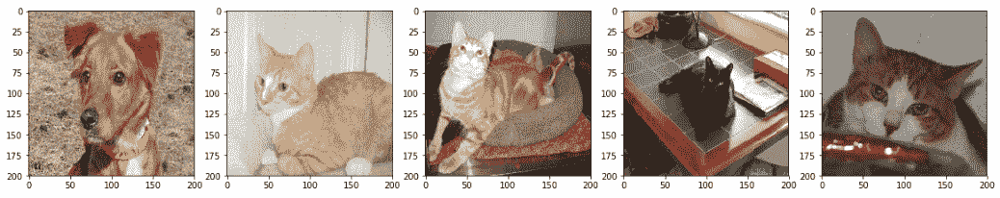
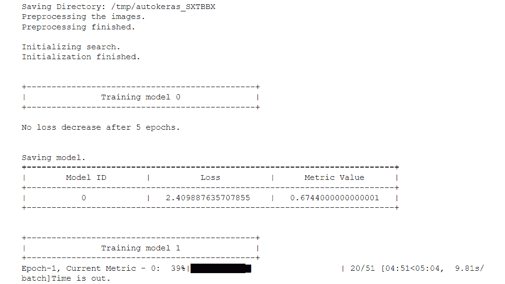

# 八、诀窍和技巧

## 学习目标

本章结束时，您将能够:

*   借助迁移学习更快地创建更好的深度学习模型
*   通过独立的培训、开发和测试数据集的帮助，利用和处理更好的模型
*   使用现实生活中的数据集
*   利用 AutoML 找到最理想的网络，几乎不需要做任何工作
*   可视化神经网络模型
*   更好地使用培训日志

这最后一章将描述迁移学习的概念，并向你展示如何有效地使用培训日志。

## 简介

现在，我们已经涵盖了您启动数据科学之旅所需的几乎每个主题，我们将向您介绍数据科学家用来提高效率和创建更好的机器学习系统的一些工具和技巧。您将首先了解迁移学习，这有助于您在缺乏数据的情况下训练模型。然后，我们将继续学习重要的工具和技巧，您可以利用它们成为更好的数据科学家。

## 迁移学习

由于训练所需的数据量，训练复杂的神经网络既困难又耗时。迁移学习帮助数据科学家将一个网络获得的部分知识转移到另一个网络。这类似于人类如何将知识从一个人转移到另一个人，以便每个人都不必从头开始学习每一个新东西。迁移学习帮助数据科学家用更少的数据点更快地训练神经网络。根据情况，有两种方法来执行迁移学习。它们如下:

*   **使用预先训练好的模型**:在这种方法中，我们使用预先训练好的神经网络模型，并用它来解决手头的问题。预训练模型是一种神经网络，它是为与当前不同的目的而创建的，已经在其他一些数据集上进行了训练，并且已经保存以供将来重复使用。预训练模型必须在相似或相同的数据集上训练，以获得合理的准确性。
*   **创建模型**:在这种方法中，我们在一个类似手头问题的数据集上训练神经网络模型。然后，我们使用该模型执行与预训练模型方法相同的步骤。当实际数据集很小，我们无法创建一个可接受的模型时，这很有帮助。

正如在第 6 章、*解码图像*中所讨论的，神经网络的不同层学习图像的不同特征。例如，第一层可能会学习识别水平线，几层之后，网络可能会学习识别眼睛。这就是迁移学习对图像起作用的原因；我们得到的特征提取器可以用来从相同分布的新图像中提取信息。现在，你一定想知道为什么我们不用迁移学习来解决我们遇到的每一个问题。

让我们试着用下图来理解这一点。这里，原始数据集指的是用于训练我们将从中转移知识的网络的数据集:


###### 图 8.1:不同条件下迁移学习的步骤

在该图中，有四个区域:

*   **小数据集**(类似原始数据集):这是最常见的情况，也是迁移学习帮助最大的情况。由于当前数据集和用于训练预训练模型的数据集的相似性，我们可以使用来自预训练模型的层，并根据问题的类型仅改变最终的密集层部分。
*   **大数据集**(与原始数据集相似):这是最优的情况。由于数据的可用性，建议您从头开始训练模型，为了加快学习速度，我们可以使用预训练模型中的权重作为起点。
*   **小数据集**(不同于原始数据集):这是迁移学习和深度学习方面最糟糕的情况。这种情况下唯一的解决方法就是找到一个像当前数据集一样的数据集，并在其上训练一个模型，然后使用迁移学习。
*   **大数据集**(不同于原始数据集):由于数据集的规模很大，我们可以从头开始训练模型。为了使训练更快，可以将来自预训练模型的权重作为起点，但是不建议这样做。

迁移学习只在两种类型的数据集上取得了成功——图像和自然语言(文本数据)数据集。我们在第 7 章中提到的单词嵌入是迁移学习的一个例子。我们现在将看到如何利用图像数据的迁移学习。

### 图像数据的迁移学习

在本节中，我们将使用 Keras 加载预训练模型，并执行迁移学习。您将了解如何处理数据集类似于预训练模型数据集的两种情况。要开始迁移学习，我们首先必须加载一个预先训练好的模型。我们将使用 Keras 加载初始模型:

```py
import keras
base_model = keras.applications.inception_v3.InceptionV3(include_top=False, weights='imagenet')
```

`include_top=False`移除网络的第一个完全连接的层，允许我们输入我们想要的任何大小的图像，而不是依赖于原始数据集的图像大小。`weights='imagenet'`确保预训练的砝码已加载。如果没有传递给`weights`，那么权重的初始化将是随机的。初始模型是对现有的**卷积神经网络** ( **CNN** )分类器的巨大改进。在 Inception 之前，最好的模型只是堆叠了多个卷积层，希望获得更好的性能。另一方面，Inception 是复杂的，因为它使用了许多技巧来提高预测的准确性和时间。


###### 图 8.2:初始网络的单个单元

我们要看的第一个案例是一个类似于原始数据集的小型数据集。在这种情况下，我们需要首先冻结预训练模型的层。为此，我们只需使基础模型的所有层不可训练:

```py
for layer in base_model.layers:
    layer.trainable = False
```

下一种情况是与原始数据集相似的大型数据集。在这种情况下，我们需要以预先训练好的权重为起点来训练模型。在这种情况下，我们不做任何修改，只是简单地训练整个模型，它是`base_model`和一些额外的密集层的组合，这取决于我们的问题。例如，如果问题是两类分类问题，我们需要最后一个密集层有 2 个输出。在这种情况下，我们可以做的另一件事是冻结前几层的权重，以便训练进行得更快。冻结前几层是有帮助的，因为这些层学习简单的形状，这可以适用于任何类型的问题。要冻结 Keras 中的前五层，请使用以下代码:

```py
for layer in base_model.layers[:5]:   layer.trainable = False
```

### 练习 58:使用 InceptionV3 对图像进行比较和分类

在本练习中，我们将利用 Keras 提供的 InceptionV3 模型来执行猫和狗之间的分类。我们将使用我们在*第 6 章*、*解码图像*中使用的相同数据集()https://github . com/TrainingByPackt/Data-Science-with-Python/tree/master/Chapter 08)并比较我们的结果。我们将冻结初始卷积层，这样我们就不必重新训练它们:

1.  首先，创建函数从文件名中读取图像及其标签。这里，`PATH` 变量包含训练数据集的路径:

    ```py
    from PIL import Image
    def get_input(file):
        return Image.open(PATH+file)
    def get_output(file):	
        class_label = file.split('.')[0]
        if class_label == 'dog': label_vector = [1,0]
        elif class_label == 'cat': label_vector = [0,1]
        return label_vector
    ```

2.  设置图像的尺寸和通道:

    ```py
    SIZE = 200
    CHANNELS = 3
    ```

3.  然后，创建一个函数对图像进行预处理:

    ```py
    def preprocess_input(image):

        # Data preprocessing
        image = image.resize((SIZE,SIZE))
        image = np.array(image).reshape(SIZE,SIZE,CHANNELS)

        # Normalize image
        image = img/255.0

        return image
    ```

4.  现在创建一个生成器函数来读取图像和标签并处理图像:

    ```py
    import numpy as np
    def custom_image_generator(images, batch_size = 128):

        while True:
            # Randomly select images for the batch
            batch_images = np.random.choice(images, size = batch_size)
            batch_input = []
            batch_output = [] 

            # Read image, perform preprocessing and get labels
            for file in batch_images:
                # Function that reads and returns the image
                input_image = get_input(file)
                # Function that gets the label of the image
                label = get_output(file)
                # Function that pre-processes and augments the image
                image = preprocess_input(input_image)
                batch_input.append(image)
                batch_output.append(label)
            batch_x = np.array(batch_input)
            batch_y = np.array(batch_output)
            # Return a tuple of (images,labels) to feed the network
            yield(batch_x, batch_y)
    ```

5.  接下来，我们将读取验证数据。创建一个函数来读取图像及其标签:

    ```py
    from tqdm import tqdm
    def get_data(files):
        data_image = []
        labels = []
        for image in tqdm(files):
            label_vector = get_output(image)

            img = Image.open(PATH + image)
            img = img.resize((SIZE,SIZE))

            labels.append(label_vector)
            img = np.asarray(img).reshape(SIZE,SIZE,CHANNELS)
            img = img/255.0
            data_image.append(img)

        data_x = np.array(data_image)
        data_y = np.array(labels)

        return (data_x, data_y)
    ```

6.  阅读验证文件:

    ```py
    from random import shuffle
    files = os.listdir(PATH)
    random.shuffle(files)
    train = files[:7000]
    test = files[7000:]
    validation_data = get_data(test)
    ```

7.  Plot a few images from the dataset to see whether you loaded the files correctly:

    ```py
    import matplotlib.pyplot as plt
    plt.figure(figsize=(20,10))
    columns = 5
    for i in range(columns):
        plt.subplot(5 / columns + 1, columns, i + 1)
        plt.imshow(validation_data[0][i])
    ```

    示例图像如下:

    

    ###### 图 8.3:加载数据集中的样本图像

8.  加载初始模型并传递输入图像的形状:

    ```py
    from keras.applications.inception_v3 import InceptionV3
    base_model = InceptionV3(weights='imagenet', include_top=False, input_shape=(200,200,3))
    ```

9.  冻结初始模型层，这样就不会对它们进行训练:

    ```py
    for layer in base_model.layers:
        layer.trainable = False
    ```

10.  现在根据我们的问题添加输出密集层。这里`keep_prob`是训练时要保留的节点的比例。所以，辍学率将是`1 – keep_prob` :

    ```py
    from keras.layers import GlobalAveragePooling2D, Dense, Dropout
    from keras.models import Model
    x = base_model.output
    x = GlobalAveragePooling2D()(x)
    x = Dense(256, activation='relu')(x)
    keep_prob = 0.5
    x = Dropout(rate = 1 - keep_prob)(x)
    predictions = Dense(2, activation='softmax')(x)
    model = Model(inputs=base_model.input, outputs=predictions)
    ```

11.  Next, compile the model to make it ready for training:

    ```py
    model.compile(loss='categorical_crossentropy', 
                  optimizer='adam',
                  metrics = ['accuracy'])
    ```

    然后执行模型的训练:

    ```py
    EPOCHS = 5
    BATCH_SIZE = 128
    model_details = model.fit_generator(custom_image_generator(train, batch_size = BATCH_SIZE),
                        steps_per_epoch = len(train) // BATCH_SIZE, 
                        epochs = EPOCHS, 
                        validation_data= validation_data,
                        verbose=1)
    ```

12.  Evaluate the model and get the accuracy:

    ```py
    score = model.evaluate(validation_data[0], validation_data[1])
    print("Accuracy: {0:.2f}%".format(score[1]*100))
    ```

    精确度如下:


###### 图 8.4:模型的准确性

正如你之前看到的，该模型获得了 97.8%的准确率，这远远高于我们在*第六章*、*解码图像*中获得的 73%的准确率。您可以试验一下我们附加到初始模型的模型，看看您是否能够提高准确性。您可以绘制预测不正确的图像，以了解模型的表现。

```py
y_pred = model.predict(validation_data[0])
incorrect_indices = np.nonzero(np.argmax(y_pred,axis=1) != np.argmax(validation_data[1],axis=1))[0]
labels = ['dog', 'cat']
image = 5
plt.imshow(validation_data[0][incorrect_indices[image]].reshape(SIZE, SIZE, CHANNELS),  cmap=plt.get_cmap('gray'))
plt.show()
print("Prediction: {0}".format(labels[np.argmax(y_pred[incorrect_indices[image]])]))
```

预测错误的图像如下:


###### 图 8.5:错误预测的样本

### 活动 21:使用 InceptionV3 对图像进行分类

在本活动中，我们将利用 Keras 提供的 InceptionV3 模型来执行猫和狗之间的分类。我们将使用在第 6 章、*解码图像*中使用的相同数据集，并比较我们的结果。这里我们将训练整个模型，但是我们将利用初始预训练模型中存在的权重作为起点。这类似于我们刚刚讨论的练习，但是没有冻结层。

1.  创建一个生成器来获取图像和标签。
2.  创建一个函数来获取标签和图像。然后，创建一个函数来预处理图像并对其进行扩充。
3.  加载验证数据集，该数据集不会被扩充。
4.  加载初始模型，并向其中添加最终的密集层。训练整个网络。

你应该看到这个模型让我们获得了 95.4%的准确率，这远远高于我们在*第六章*、*解码图像*中达到的 73%的准确率。

你可能已经注意到前面的代码类似于*练习 58* ，但是这里我们没有冻结图层。该模型无疑受益于将来自初始模型的权重作为起点。您可以绘制预测错误的图像，以了解模型的表现:

```py
y_pred = model.predict(validation_data[0])
incorrect_indices = np.nonzero(np.argmax(y_pred,axis=1) != np.argmax(validation_data[1],axis=1))[0]
labels = ['dog', 'cat']
image = 5
plt.imshow(validation_data[0][incorrect_indices[image]].reshape(SIZE, SIZE, CHANNELS),  cmap=plt.get_cmap('gray'))
plt.show()
print("Prediction: {0}".format(labels[np.argmax(y_pred[incorrect_indices[image]])]))
```

#### 注意

这项活动的解决方案可以在第 387 页找到。

预测错误的图像如下:


###### 图 8.6:数据集中预测错误的样本

## 有用的工具和提示

在本节中，您将首先了解数据集不同分割的重要性。之后，您会学到一些技巧，当您开始处理以前没有处理过的数据集时，这些技巧会派上用场。然后是像熊猫档案和 TensorBoard 这样的工具，通过提供方便的信息访问，让你的生活变得更轻松。我们将看看 AutoML，以及如何使用它来获得高性能的模型，而不需要太多的手工操作。最后，我们将可视化我们的 Keras 模型，并将模型图导出到一个文件中。

### 培训、开发和测试数据集

在前几章中，我们简要地讨论了培训、开发和测试数据集。在这里，我们将深入探讨这个话题。

训练或训练集是来自数据集的样本，我们使用它来创建我们的机器学习模型。开发，或者开发集(也称为验证集)，是一个帮助我们调整所创建模型的超参数的样本。测试或测试集是我们用来最终评估模型的样本。拥有这三个集合对于模型开发非常重要。

**集合分布**

开发集和测试集应该来自同一个发行版，并且应该代表您期望您的模型在未来获得的数据。如果分布是不同的，那么模型将被调整到一个将来不会被模型看到的分布，从而影响部署模型的性能。由于训练集和测试/开发集之间分布的差异，您的模型可能表现不佳。为了纠正这一点，您可以从测试/开发集中提取一些数据点，并将它们引入到训练集中。确保原始图像在各自的图像集中占主导地位，以防止出现不正确的结果。

如果训练集和开发集的分布不同，我们就不能确定模型是否过度拟合；在这种情况下，应该引入一个新的 train-dev 集来检查模型的过度拟合。培训和培训开发集必须具有相同的分布。如果 dev 和 train-dev 集合的误差有巨大差异，那么就有数据不匹配的问题。为了纠正这一点，您必须进行手动错误分析，并且在大多数情况下，收集更多的数据点。

#### 注意

开发集和我们一直使用的验证集是一样的，我们有时称它为测试集，但那只是为了让你开始。还应该注意，我们只在训练数据集上训练我们的模型。

**集合的大小**

开发和测试集的大小应该根据数据集的整体大小来确定。如果大小是 10，000 个数据点，那么 60%/20%/20%的分割会很好，因为测试和开发集将有足够的数据点来精确地度量模型的性能。另一方面，如果数据集有 1，000，000 个数据点，那么 98%/1%/1%的分割就足够了，因为 10，000 个数据点足以衡量模型的性能。

三组数据的样本应该保持不变，以便我们在相同的环境中评估所有的模型。为此，您可以在创建随机样本时设置一个“种子”。设置随机数种子有助于我们每次运行实验时获得相同的随机数据分割。

### 使用未处理的数据集

当您开始处理更复杂、处理程度更低的数据集时，您将会意识到，大多数情况下，您无法获得创建满意模型所需的所有数据。为了解决这一问题，您需要确定能够帮助您创建合格模型的外部数据集。您使用的附加数据可以是以下两种类型:

*   **相同数据的更多数据点**:这在由于数据集较小而导致模型过度拟合时很有帮助。如果无法获得更多的数据点，可以使用更简单的模型——要么是层数更少的神经网络，要么是线性模型。
*   **来自不同来源的额外数据**:有时数据集中会缺少一些数据；例如，数据集中列出的城市所在的州或国家，或者数据集中列出的国家的宏观经济因素，如 GDP 和人均收入。这些数据很容易在互联网上找到，并可用于改进您创建的模型。

最佳实践是始终从**探索性数据分析** ( **EDA** )开始。EDA 帮助我们非常熟悉数据集。它有助于确定最佳模型以及可用于机器学习的变量。EDA 的另一个重要方面是检查数据中的异常。这有助于我们确保数据准确无误地到达我们手中。EDA 的结果可以与涉众共享，以确认数据的有效性。数据科学家在从事一个项目时，可能需要多次重温 EDA 步骤。

另一件要记住的事情是你的模型的应用。了解您的模型将执行实时处理还是批处理非常重要。这将有助于您相应地选择工具和模型。例如，如果实时处理是一个优先事项，那么您可能会使用一个在不到一秒钟内产生结果的模型，而如果应用程序需要批处理，那么您可以使用复杂的神经网络模型，需要几秒钟以上来产生预测。

接下来，我们将研究一些处理培训和执行超参数调优的最佳实践。在将数据分成训练集和测试集之前，一定要对其进行洗牌。另一件有助于更快收敛的事情是在训练期间打乱训练数据。Keras 的`fit`函数有一个方便的参数叫做**洗牌**，它接受一个可以设置为`True`的布尔输入，在每个历元之前洗牌训练数据。要记住的一个重要参数是随机数种子；这有助于数据科学家创建可重复的结果，即使是在随机洗牌和拆分的情况下。要为 Keras 设置种子，请使用以下内容:

```py
from numpy.random import seed
seed(1)
from tensorflow import set_random_seed
set_random_seed(1)
```

前两行为 NumPy 设置随机种子，后两行为 TensorFlow 设置种子，tensor flow 是 Keras 使用的后端。

如果您正在处理大型数据集，请从数据子集开始并创建模型。试图通过使网络更深或更复杂来过度适应这个模型。您可以使用正则化来限制模型过度拟合数据。当您对模型有信心时，请使用完整的训练数据并调整创建的模型以提高模型的性能。

辍学是一个非常强大的规则化；您应该尝试不同的辍学率，因为最佳辍学率因数据集而异。如果退学概率太低，就没有效果。另一方面，如果它太高，模型将开始不足。辍学率在 20%到 50%之间通常表现最好。

学习率是一个重要的超参数。具有高学习率将导致模型超过最优解，而具有低学习率将导致模型学习非常慢。在*第五章*、*掌握结构化数据*中提到，我们可以从高学习率开始，几步之后降低学习率。

这有助于我们更快地到达最佳点，并且由于步长的减小，防止了模型超过解。为了降低学习率，我们可以使用来自 Keras 的`ReduceLROnPlateau`回调。如果所选指标停止提高，回调将学习速率降低一个预定义的因子。

#### 注意

要进一步了解数据集，请参考位于 https://keras.io/callbacks/#reducelronplateau 的文档。

```py
from keras.callbacks import ReduceLROnPlateau
ReduceLROnPlateau(monitor='val_loss', factor=0.1, patience=10, min_delta=0.0001, min_lr=0)
```

我们将被监控的数量传递给`monitor`参数。`factor`是指学习率必须降低的系数；新的学习率将等于学习率乘以因子。`patience`是回调在改变学习率之前等待的次数。`min_delta`是指衡量模型对监控指标改进的阈值。`min_lr`指学习速度的下限。

### 熊猫简介

在最初的章节中，您学习了探索结构化数据集的不同方法。在为结构化数据创建模型时，EDA 扮演着重要的角色。用于执行 EDA 的步骤(如空值识别、关联和计算唯一值)很少改变，因此最好创建一个函数来为我们完成所有这些工作，而无需编写大量代码。pandas profiling 库就是这样做的:它获取数据帧，对数据进行分析，并在交互式输出中显示结果。

输出包含相关列的以下信息:

*   **Essentials** :包含变量类型、唯一值和缺失值的信息。
*   **分位数统计**:包含最小值、Q1、中值、Q3、最大值、范围和四分位间距的信息。
*   **描述性统计**:包含平均值、众数、标准差、总和、中位数绝对偏差和变异系数的信息。
*   **最频繁值**:包含最常见值计数的信息以及频率百分比。
*   **直方图:**包含数据集不同特征的值的频率图的信息。
*   **相关性**:这些突出显示高度相关的变量，并建议删除。

要使用 pandas profiling，只需将一个数据帧传递给`pandas_profiling`对象。使用以下代码:

```py
import pandas_profiling
pandas_profiling.ProfileReport(df)
```

下面的截图显示了我们在*第 5 章*、*掌握结构化数据*中处理的电信客户流失数据集的 pandas 分析输出的一部分


###### 图 8.7:pandas 分析输出的屏幕截图

您可以使用它来探索我们在前面章节中处理过的数据集。pandas profiling 提供交互式输出，因此鼓励您继续操作输出。

### 张量板

**TensorBoard** 是一款网络应用，可用于查看训练日志和可视化模型的准确性和损耗指标。它最初是为了与 TensorFlow 一起工作而创建的，但我们可以通过 Keras 中的 **TensorBoard 回调**来使用 TensorBoard。要开始可视化，请创建 Keras 回调。请使用以下代码来完成此操作:

```py
import keras
keras.callbacks.TensorBoard(log_dir='./logs', update_freq='epoch')
```

记下您在此处指定的日志目录；你以后会需要这个的。可以传递'`batch`'、' T1 '、`update_freq`中的整数；这指的是应该多长时间写一次日志。下一步是启动 TensorBoard 为此，请打开终端并运行以下命令:

```py
tensorboard --logdir logs --port 6607
```

现在开始训练。不要忘记将回调传递给`fit`函数。TensorBoard 的第一个选项卡显示了模型的训练日志。您可以在日志文件夹中创建多个文件夹，以便在同一图表上获取不同模型的日志进行比较:


###### 图 8.8:显示 TensorBoard 仪表板的屏幕截图

在第二个选项卡中，您可以可视化您已经创建的模型。下图显示了我们在上一章的第一个活动中创建的模型:


###### 图 8.9:Keras 解释的模型

在 Jupyter Notebook 中可视化训练日志的另一种方法是使用 Matplotlib 绘制它们:

```py
import matplotlib.pyplot as plt
plt.plot(model_details.history['acc'])
plt.plot(model_details.history['val_acc'])
plt.title('Cats vs. Dogs model accuracy')
plt.ylabel('Accuracy')
plt.xlabel('Epoch')
plt.legend(['Train set', 'Dev set'], loc='upper left')
plt.show()
```

下图显示了来自*活动 1* 的猫与狗模型的训练和测试集的模型精度图:


###### 图 8.10:模型的准确性日志

上面给出的准确性日志显示了训练和开发集的准确性在不同时期是如何提高的。如您所见，开发集准确性比训练集准确性更不稳定。这是因为模型没有看到这些例子，在最初的时期，这种波动性会很高，但随着我们在为大量时期训练后创建一个稳健的模型，准确性将变得不那么波动。

```py
plt.plot(model_details.history['loss'])
plt.plot(model_details.history['val_loss'])
plt.title('Cats vs. Dogs model loss')
plt.ylabel('Loss')
plt.xlabel('Epoch')
plt.legend(['Train set', 'Test set'], loc='upper left')
plt.show()
```

下图显示了来自*活动 21* 的猫对狗模型的训练和测试集的模型损失图:


###### 图 8.11:模型的损失日志

与准确性日志类似，上面给出的损失日志显示了训练和开发集损失如何在不同时期减少。epoch 19 附近的峰值表明创建了一个非常糟糕的模型，该模型过度适合训练集，但是最终该模型开始稳定，并且在开发集上也给出了更好的结果。

如果您只关心模型日志，那么您可以在培训结束后使用前面给出的代码来绘制模型日志。但是，如果您正在训练一个需要长时间训练的模型，使用 TensorBoard 将是明智的，因为它提供了训练损失和准确性的实时图。

## AutoML

现在，您已经创建了多个神经网络模型，您知道创建性能良好的网络有两个主要部分。它们如下:

*   神经网络的体系结构
*   神经网络的超参数

根据问题的不同，可能需要数十次迭代才能获得最佳网络。到目前为止，我们一直在手工创建架构和调整超参数。AutoML 可以帮助我们完成这些任务。它为手头的数据集搜索最佳网络和参数。Auto-Keras 是一个开源库，帮助我们在 Keras 上实现 AutoML。让我们通过一个练习来学习如何使用 Auto-Keras。

### 练习 59:使用 Auto-Keras 获得性能良好的网络

在本练习中，我们将利用 Auto-Keras 库为猫与狗数据集(https://github . com/TrainingByPackt/Data-Science-with-Python/tree/master/chapter 08)找到最佳网络和参数。

1.  首先，创建一个函数来加载图像标签:

    ```py
    def get_label(file):
        class_label = file.split('.')[0]
        if class_label == 'dog': label_vector = 0
        elif class_label == 'cat': label_vector = 1
        return label_vector
    ```

2.  设置`SIZE`，它是方形图像输入的尺寸。

    ```py
    SIZE = 50
    ```

3.  然后创建一个读取图像及其标签的函数。这里的`PATH` 变量包含训练数据集的路径。

    ```py
    import os
    from PIL import Image
    import numpy as np
    from random import shuffle
    def get_data():
        data = []
        files = os.listdir(PATH)
        for image in tqdm(files):
            label_vector = get_label(image)

            img = Image.open(PATH + image).convert('L')
            img = img.resize((SIZE,SIZE))

            data.append([np.asarray(img),np.array(label_vector)])

        shuffle(data)
        return data
    ```

4.  加载数据并将其分为训练集和测试集:

    ```py
    data = get_data()
    train = data[:7000]
    test = data[7000:]
    x_train = [data[0] for data in train]
    y_train = [data[1] for data in train]
    x_test = [data[0] for data in test]
    y_test = [data[1] for data in test]
    x_train = np.array(x_train).reshape(-1,SIZE,SIZE,1)
    x_test = np.array(x_test).reshape(-1,SIZE,SIZE,1)
    ```

5.  Now, let's start with AutoML

    首先，用 autokeras 的训练时间创建一个数组。一旦该时间过去，它将终止寻找最佳可能模型的过程:

    ```py
    TRAINING_TIME = 60 * 60 * 1 # 1 hour
    ```

    我们会给 autokeras 一个小时的时间来找到最好的方法。

6.  使用 autokeras 创建图像分类器模型，并在上一步中指定的时间内执行训练:

    ```py
    import autokeras as ak
    model = ak.ImageClassifier(verbose=True)
    model.fit(x_train, y_train, time_limit=TRAINING_TIME)
    model.final_fit(x_train, y_train, x_test, y_test, retrain=True)
    ```

7.  输出将如下:

    ###### 图 8.12:图像分类器模型

8.  接下来，我们保存我们的模型，以便我们可以再次使用它:

    ```py
    model.export_autokeras_model("model.h5")
    ```

9.  加载训练好的模型并使用它执行预测:

    ```py
    from autokeras.utils import pickle_from_file
    model = pickle_from_file("model.h5")
    predictions = model.predict(x_test)
    ```

10.  评估 autokeras 创建的模型的准确性:

    ```py
    score = model.evaluate(x_test, y_test)
    print("\nScore: {}".format(score))
    ```

11.  模型的精度如下:

    ###### 图 8.13:模型最终精度

12.  我们成功地利用 autokeras 创建了一个图像分类器，可以检测提供的图像是猫还是狗。运行该模型一个小时后，我们获得的准确率为 72%，考虑到我们在第 6 章*、*解码图像*、*活动 22* 中创建的模型获得了 73%的准确率，这已经相当不错了。这显示了 autoML 的强大，但是，有时我们在可接受的时间框架内得不到足够好的结果。*

### 使用 Keras 的模型可视化

到目前为止，我们已经创建了一堆神经网络模型，但还没有将它们可视化。Keras 有一个非常方便的实用函数，可以绘制任何模型。创建一个情节首先定义模型，我们将把在*第六章*中创建的模型、*解码成图像*，如下面的代码所示:

```py
model = Sequential()

model.add(Conv2D(48, (3, 3), activation='relu', padding='same', input_shape=(50,50,1)))    
model.add(Conv2D(48, (3, 3), activation='relu'))    
model.add(MaxPool2D(pool_size=(2, 2)))
model.add(BatchNormalization())
model.add(Dropout(0.10))
model.add(Flatten())
model.add(Dense(512, activation='relu'))
model.add(Dropout(0.5))
model.add(Dense(2, activation='softmax'))
model.summary()
```

然后使用`plot_model`将模型保存为图像，如下面的代码所示。

```py
from keras.utils import plot_model
plot_model(model, to_file='model.png', show_shapes=True)
```

`show_shapes`参数为可视化提供了层的输入和输出形状。保存的图像如下:


###### 图 8.14:由 Keras 创建的模型可视化

### 活动 22:使用迁移学习来预测图像

我们将创建一个项目，让你执行迁移学习来预测给定的图片是一只狗还是一只猫。您将用作基线的模型将是 InceptionV3。我们将根据我们的数据集对该模型进行微调，从而修改该模型以区分猫和狗。我们将使用 TensorBoard 实时监控训练指标，并采用本章中讨论的最佳实践。确保结果是可重复的:

1.  重复您在上一活动的*步骤 1* 中所做的一切。
2.  加载开发和测试数据集，这将不会增加。
3.  加载初始模型，并向其中添加最终的密集层。训练整个网络。
4.  利用所有有用的回调。
5.  Visualize the training using TensorBoard.

    #### 注意

    这项活动的解决方案可以在第 391 页找到。

您可以使用以下代码片段绘制预测错误的图像，以了解模型的执行情况:

```py
y_pred = model.predict(test_data[0])
incorrect_indices = np.nonzero(np.argmax(y_pred,axis=1) != np.argmax(test_data[1],axis=1))[0]
labels = ['dog', 'cat']
image = 5
plt.imshow(test_data[0][incorrect_indices[image]].reshape(SIZE, SIZE, CHANNELS),  cmap=plt.get_cmap('gray'))
plt.show()
print("Prediction: {0}".format(labels[np.argmax(y_pred[incorrect_indices[image]])]))
```

预测错误的图像如下:


###### 图 8.15: 错误预测的样本

## 总结

在本章中，我们讨论了迁移学习，并利用它来更快地创建深度学习模型。然后，我们继续学习独立的培训、开发和测试数据集的重要性，接下来是处理真实生活中未处理数据集的部分。之后，我们将讨论什么是 AutoML，以及如何在几乎不做任何工作的情况下找到最佳网络。我们学习了如何可视化神经网络模型和训练日志。

现在您已经完成了本章，您现在能够处理任何类型的数据来创建机器学习模型。

最后，完成本书后，您现在应该对数据科学的概念有了深刻的理解，并且应该能够使用 Python 语言处理不同的数据集来解决业务案例问题。您所学的不同概念，包括预处理、数据可视化、图像增强和人类语言处理，应该有助于您全面掌握如何处理数据。