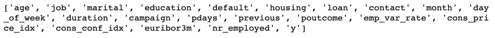
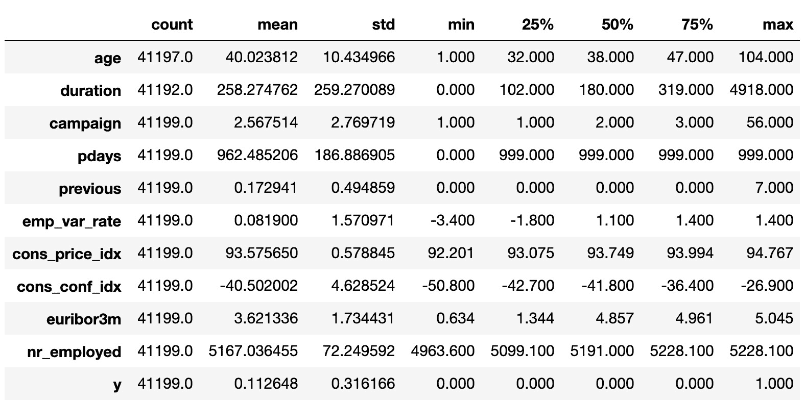
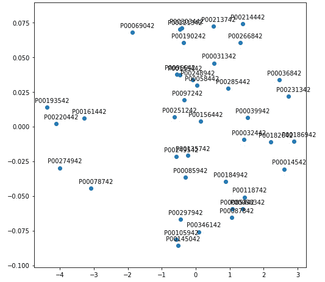
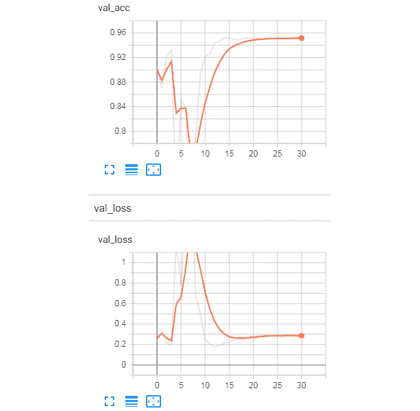
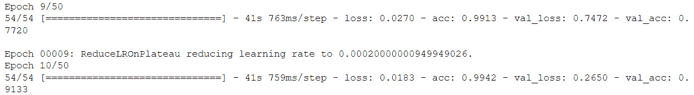

# 九、附录

## 关于

本节旨在帮助您完成书中介绍的活动。它包括学生完成和实现本书目标的详细步骤。

## 第 1 章:数据科学和数据预处理简介

### 活动 1:使用银行营销订阅数据集进行预处理

解决办法

让我们在`Bank Marketing Subscription` 数据集上执行各种预处理任务。我们还将把数据集分成训练和测试数据。按照以下步骤完成本活动:

1.  打开 Jupyter 笔记本，添加一个新单元以导入 pandas 库，并将数据集加载到 pandas 数据框架中。为此，首先需要导入库，然后使用`pd.read_csv()`函数，如下所示:

    ```py
    import pandas as pd
    Link = 'https://github.com/TrainingByPackt/Data-Science-with-Python/blob/master/Chapter01/Data/Banking_Marketing.csv'
    #reading the data into the dataframe into the object data
    df = pd.read_csv(Link, header=0)
    ```

2.  To find the number of rows and columns in the dataset, add the following code:

    ```py
    #Finding number of rows and columns
    print("Number of rows and columns : ",df.shape)
    ```

    上述代码生成以下输出:

    

    ###### 图 1.60:数据集中的行数和列数

3.  To print the list of all columns, add the following code:

    ```py
    #Printing all the columns
    print(list(df.columns))
    ```

    上述代码生成以下输出:

    

    ###### 图 1.61:数据集中的列列表

4.  To overview the basic statistics of each column, such as the count, mean, median, standard deviation, minimum value, maximum value, and so on, add the following code:

    ```py
    #Basic Statistics of each column
    df.describe().transpose()
    ```

    上述代码生成以下输出:

    

    ###### 图 1.62:每一列的基本统计

5.  To print the basic information of each column, add the following code:

    ```py
    #Basic Information of each column
    print(df.info())
    ```

    上述代码生成以下输出:

    

    ###### 图 1.63:各列的基本信息

    在上图中，您可以看到没有一列包含任何空值。此外，还提供了每列的类型。

6.  Now let's check for missing values and the type of each feature. Add the following code to do this:

    ```py
    #finding the data types of each column and checking for null
    null_ = df.isna().any()
    dtypes = df.dtypes
    sum_na_ = df.isna().sum()
    info = pd.concat([null_,sum_na_,dtypes],axis = 1,keys = ['isNullExist','NullSum','type'])
    info
    ```

    请看下图中的输出:

    

    ###### 图 1.64:说明空值数量和数据类型的每一列的信息

7.  Since we have loaded the dataset into the `data` object, we will remove the null values from the dataset. To remove the null values from the dataset, add the following code:

    ```py
    #removing Null values
    df = df.dropna()
    #Total number of null in each column
    print(df.isna().sum())# No NA
    ```

    请看下图中的输出:

    

    ###### 图 1.65:没有空值的数据集的特征

8.  Now we check the frequency distribution of the `education` column in the dataset. Use the `value_counts()` function to implement this:

    ```py
    df.education.value_counts()
    ```

    请看下图中的输出:

    

    ###### 图 1.66:教育一栏的频率分布

9.  In the preceding figure, we can see that the `education` column of the dataset has many categories. We need to reduce the categories for better modeling. To check the various categories in the `education` column, we use the `unique()` function. Type the following code to implement this:

    ```py
    df.education.unique()  
    ```

    输出如下所示:

    

    ###### 图 1.67:教育栏的各种类别

10.  现在让我们将`basic.4y`、`basic.9y`和`basic.6y`分类组合在一起，称之为`basic`。为此，我们可以使用熊猫的`replace`功能:

    ```py
    df.education.replace({"basic.9y":"Basic","basic.6y":"Basic","basic.4y":"Basic"},inplace=True)
    ```

11.  To check the list of categories after grouping, add the following code:

    ```py
    df.education.unique()  
    ```

    

    ###### 图 1.68:教育栏的各种类别

    在上图中，你可以看到`basic.9y`、`basic.6y`和`basic.4y`组合在一起成为`Basic`。

12.  Now we select and perform a suitable encoding method for the data. Add the following code to implement this:

    ```py
    #Select all the non numeric data using select_dtypes function
    data_column_category = df.select_dtypes(exclude=[np.number]).columns
    ```

    上述代码生成以下输出:

    

    ###### 图 1.69:数据集的各个列

13.  Now we define a list with all the names of the categorical features in the data. Also, we loop through every variable in the list, getting dummy variable encoded output. Add the following code to do this:

    ```py
    cat_vars=data_column_category
    for var in cat_vars:
        cat_list='var'+'_'+var
        cat_list = pd.get_dummies(df[var], prefix=var)
        data1=df.join(cat_list)
        df=data1
     df.columns
    ```

    上述代码生成以下输出:

    

    ###### 图 1.70:数据中的分类特征列表

14.  Now we neglect the categorical column for which we have done encoding. We'll select only the numerical and encoded categorical columns. Add the code to do this:

    ```py
    #Categorical features
    cat_vars=data_column_category
    #All features
    data_vars=df.columns.values.tolist()
    #neglecting the categorical column for which we have done encoding
    to_keep = []
    for i in data_vars:
        if i not in cat_vars:
            to_keep.append(i)

    #selecting only the numerical and encoded catergorical column
    data_final=df[to_keep]
    data_final.columns
    ```

    上述代码生成以下输出:

    

    ###### 图 1.71:数字和编码分类列列表

15.  Finally, we split the data into train and test sets. Add the following code to implement this:

    ```py
    #Segregating Independent and Target variable
    X=data_final.drop(columns='y')
    y=data_final['y']
    from sklearn. model_selection import train_test_split
    X_train, X_test, y_train, y_test = train_test_split(X, y, test_size=0.2, random_state=0)
    print("FULL Dateset X Shape: ", X.shape )
    print("Train Dateset X Shape: ", X_train.shape )
    print("Test Dateset X Shape: ", X_test.shape )
    ```

    输出如下所示:


###### 图 1.72:完整、训练和测试数据集的形状

## 第 2 章:数据可视化

### 活动 2:线形图

**解决方案**:

1.  为从一月到六月的每个月创建一个包含 6 个字符串的列表，并使用:

    ```py
    x = ['January','February','March','April','May','June']
    ```

    将其保存为 x
2.  为'`Items Sold`'创建一个包含 6 个值的列表，从 1000 开始，增加 200，因此最终值为 2000，并将其保存为 y，如下所示:

    ```py
    y = [1000, 1200, 1400, 1600, 1800, 2000]
    ```

3.  用蓝色虚线和星形标记绘制 y((`Items Sold`’)乘 x((`Month`’)，使用如下:

    ```py
    plt.plot(x, y, '*:b')
    ```

4.  使用以下代码将 x 轴设置为'`Month`:

    ```py
    plt.xlabel('Month')
    ```

5.  将 y 轴设置为“`Items Sold`”，如下:

    ```py
    plt.ylabel('Items Sold')
    ```

6.  To set the title to read '`Items Sold has been Increasing Linearly`', refer to the following code:

    ```py
    plt.title('Items Sold has been Increasing Linearly')
    ```

    查看下面的屏幕截图以获得结果输出:


###### 图 2.33:按月销售商品的折线图

### 活动 3:条形图

**解决方案**:

1.  使用下面的代码为`x`创建一个五个字符串的列表，其中包含拥有最多头衔的 NBA 球队的名称:

    ```py
    x = ['Boston Celtics','Los Angeles Lakers', 'Chicago Bulls', 'Golden State Warriors', 'San Antonio Spurs']
    ```

2.  使用下面的代码:

    ```py
    y = [17, 16, 6, 6, 5]
    ```

    ，为`y`创建一个包含与`x`中的字符串相对应的“`Titles Won`的五个值的列表
3.  将`x`和`y`分别放入列名为`Team`和`Titles`的数据框中，如下:

    ```py
    import pandas as pd

    df = pd.DataFrame({'Team': x,
                       'Titles': y})
    ```

4.  To sort the data frame descending by 'Titles' and save it as df_sorted, refer to the following code:

    ```py
    df_sorted = df.sort_values(by=('Titles'), ascending=False)
    ```

    #### 注意

    如果我们用`ascending=True`排序，图的右边将有更大的值。因为我们希望左边的值更大，所以我们将使用`ascending=False`。

5.  制作一个编程标题，并将其保存为标题，首先找到标题最多的团队，并使用以下代码将其保存为`team_with_most_titles`对象:

    ```py
    team_with_most_titles = df_sorted['Team'][0]
    ```

6.  然后，使用下面的代码检索拥有最多冠军的球队的冠军数:

    ```py
    most_titles = df_sorted['Titles'][0]
    ```

7.  最后，使用下面的代码创建一个字符串:

    ```py
    title = 'The {} have the most titles with {}'.format(team_with_most_titles, most_titles)
    ```

8.  使用下面的代码，用一个条形图来绘制各队的冠军数量:

    ```py
    import matplotlib.pyplot as plt

    plt.bar(df_sorted['Team'], df_sorted['Titles'], color='red')
    ```

9.  使用以下命令将 x 轴标签设置为'`Team`':

    ```py
    plt.xlabel('Team')
    ```

10.  使用以下代码将 y 轴标签设置为'`Number of Championships`':

    ```py
    plt.ylabel('Number of Championships')
    ```

11.  要通过将 x 刻度标签旋转 45 度来防止它们重叠，请参考以下代码:

    ```py
    plt.xticks(rotation=45)
    ```

12.  将该图的标题设置为我们创建的编程`title`对象，如下所示:

    ```py
    plt.title(title)
    ```

13.  使用以下代码将绘图保存到我们当前的工作目录中，命名为'`Titles_by_Team.png`:

    ```py
    plt.savefig('Titles_by_Team)
    ```

14.  Print the plot using `plt.show()`. To understand this better, check out the following output screenshot:

    ###### 图 2.34:NBA 球队拥有的冠军数量柱状图

    #### 注意

    当我们使用`plt.show()`将图形打印到控制台时，它会按预期出现；然而，当我们打开我们创建的名为'【T1]'的文件时，我们看到它裁剪了 x 刻度标签。

    下图显示了带有裁剪的 x 刻度标签的条形图。

    

    ###### 图 2.35:裁剪了 x 刻度标签的“Titles_by_Team.png”

15.  要修复裁剪问题，请将`bbox_inches='tight'`作为参数添加到`plt.savefig()`中，如下所示:

    ```py
    plt.savefig('Titles_by_Team', bbox_inches='tight')
    ```

16.  Now, when we open the saved '`Titles_by_Team.png`' file from our working directory, we see that the x tick labels are not cropped.

    查看最终结果的以下输出:


###### 图 2.36:“Titles _ by _ team . png”没有裁剪的 x 刻度标签

### 活动 4:使用支线剧情的多种剧情类型

**解决方案**:

1.  导入'`Items_Sold_by_Week.csv`'文件，并使用以下代码将其保存为`Items_by_Week`数据框对象:

    ```py
    import pandas as pd

    Items_by_Week = pd.read_csv('Items_Sold_by_Week.csv')
    ```

2.  导入'`Weight_by_Height.csv`'文件，保存为`Weight_by_Height`数据框对象，如下:

    ```py
    Weight_by_Height = pd.read_csv('Weight_by_Height.csv')
    ```

3.  生成一个包含 100 个正态分布数字的数组，用作直方图和盒须图的数据，并使用以下代码将其保存为 y:

    ```py
    y = np.random.normal(loc=0, scale=0.1, size=100)
    ```

4.  要生成由三行两列不重叠的六个子情节组成的图形，请参考以下代码:

    ```py
    import matplotlib.pyplot as plt

    fig, axes = plt.subplots(nrows=3, ncols=2)
    plt.tight_layout()
    ```

5.  使用以下代码设置各个轴的标题以匹配图 2.32 中的标题:

    ```py
    axes[0,0].set_title('Line') 
    axes[0,1].set_title('Bar') 
    axes[1,0].set_title('Horizontal Bar') 
    axes[1,1].set_title('Histogram') 
    axes[2,0].set_title('Scatter') 
    axes[2,1].set_title('Box-and-Whisker') 
    ```

    

    ###### 图 2.37:标题,非重叠的空支线剧情

6.  On the '`Line`', '`Bar`', and '`Horizontal Bar`' axes, plot '`Items_Sold`' by '`Week`' from '`Items_by_Week`' using:

    ```py
    axes[0,0].plot(Items_by_Week['Week'], Items_by_Week['Items_Sold'])
    axes[0,1].bar(Items_by_Week['Week'], Items_by_Week['Items_Sold'])
    axes[1,0].barh(Items_by_Week['Week'], Items_by_Week['Items_Sold'])
    ```

    请参见下图中的结果输出:

    

    ###### 图 2.38:添加了折线图、条形图和水平条形图

7.  On the '`Histogram`' and '`Box-and-Whisker`' axes, plot the array of 100 normally distributed numbers using the following code:

    ```py
    axes[1,1].hist(y, bins=20)axes[2,1].boxplot(y)
    ```

    结果输出显示在这里:

    

    ###### 图 2.39:添加了直方图和盒须

8.  Plot '`Weight`' by '`Height`' on the '`Scatterplot`' axes from the '`Weight_by_Height`' data frame using the following code:

    ```py
    axes[2,0].scatter(Weight_by_Height['Height'], Weight_by_Height['Weight'])
    ```

    有关结果输出，请参见下图:

    

    ###### 图 2.40:添加了散点图

9.  Label the x- and y-axis for each subplot using `axes[row, column].set_xlabel('X-Axis Label')` and `axes[row, column].set_ylabel('Y-Axis Label')`, respectively.

    有关结果输出，请参见下图:

    

    ###### 图 2.41: X 和 y 轴已被标记

10.  用支线剧情函数中的`figsize`参数增加图形的大小，如下:

    ```py
    fig, axes = plt.subplots(nrows=3, ncols=2, figsize=(8,8))
    ```

11.  Save the figure to the current working directory as '`Six_Subplots`' using the following code:

    ```py
    fig.savefig('Six_Subplots')
    ```

    下图显示了'`Six_Subplots.png`'文件:


###### 图 2.42:Six _ subplots . png 文件

## 第 3 章:通过 Scikit-Learn 介绍机器学习

### 活动 5:生成预测并评估多元线性回归模型的性能

**解决方案**:

1.  Generate predictions on the test data using the following:

    ```py
    predictions = model.predict(X_test)
    2.    Plot the predicted versus actual values on a scatterplot using the following code:
    import matplotlib.pyplot as plt
    from scipy.stats import pearsonr

    plt.scatter(y_test, predictions)
    plt.xlabel('Y Test (True Values)')
    plt.ylabel('Predicted Values')
    plt.title('Predicted vs. Actual Values (r = {0:0.2f})'.format(pearsonr(y_test, predictions)[0], 2))
    plt.show()
    ```

    请参考此处的结果输出:

    

    ###### 图 3.33:多元线性回归模型的预测值与实际值的散点图

    #### 注意

    相对于简单线性回归模型(r = 0.62)，多元线性回归模型(r = 0.93)中的预测值和实际值之间存在更强的线性相关性。

2.  To plot the distribution of the residuals, refer to the code here:

    ```py
    import seaborn as sns
    from scipy.stats import shapiro

    sns.distplot((y_test - predictions), bins = 50)
    plt.xlabel('Residuals')
    plt.ylabel('Density')
    plt.title('Histogram of Residuals (Shapiro W p-value = {0:0.3f})'.format(shapiro(y_test - predictions)[1]))
    plt.show()
    ```

    请参考此处的结果输出:

    

    ###### 图 3.34:多元线性回归模型的残差分布

    #### 注意

    我们的残差是负偏态和非正态的，但这比简单线性模型中的偏态要小。

3.  Calculate the metrics for mean absolute error, mean squared error, root mean squared error, and R-squared, and put them into a DataFrame as follows:

    ```py
    from sklearn import metrics
    import numpy as np

    metrics_df = pd.DataFrame({'Metric': ['MAE', 
                                          'MSE', 
                                          'RMSE', 
                                          'R-Squared'],
                              'Value': [metrics.mean_absolute_error(y_test, predictions),
                                          metrics.mean_squared_error(y_test, predictions),
                                        np.sqrt(metrics.mean_squared_error(y_test, predictions)),
                                        metrics.explained_variance_score(y_test, predictions)]}).round(3)
    print(metrics_df)
    ```

    请参考结果输出:

    

###### 图 3.35:多元线性回归模型的模型评估指标

相对于简单线性回归模型，多元线性回归模型在每个指标上都表现得更好。

### 活动 6:生成预测并评估调整后的逻辑回归模型的性能

**解决方案**:

1.  使用以下代码生成预测的降雨概率:

    ```py
    predicted_prob = model.predict_proba(X_test)[:,1]
    ```

2.  使用`predicted_class = model.predict(X_test)`生成预测的降雨等级。
3.  Evaluate performance using a confusion matrix and save it as a DataFrame using the following code:

    ```py
    from sklearn.metrics import confusion_matrix
    import numpy as np

    cm = pd.DataFrame(confusion_matrix(y_test, predicted_class))
    cm['Total'] = np.sum(cm, axis=1)
    cm = cm.append(np.sum(cm, axis=0), ignore_index=True)
    cm.columns = ['Predicted No', 'Predicted Yes', 'Total']
    cm = cm.set_index([['Actual No', 'Actual Yes', 'Total']])
    print(cm)
    ```

    

    ###### 图 3.36:来自逻辑回归网格搜索模型的混淆矩阵

    #### 注意

    不错！我们已经将误报的数量从 6 个减少到 2 个。此外，我们的假阴性从 10 降至 4(参见*练习 26* )。请注意，结果可能略有不同。

4.  为了进一步评估，打印如下分类报告:

    ```py
    from sklearn.metrics import classification_report

    print(classification_report(y_test, predicted_class))
    ```


###### 图 3.37:来自我们的逻辑回归网格搜索模型的分类报告

通过调整逻辑回归模型的超参数，我们能够改进已经表现很好的逻辑回归模型。

### 活动 7:生成预测并评估 SVC 网格搜索模型的性能

**解决方案**:

1.  使用以下代码提取预测的降雨等级:

    ```py
    predicted_class = model.predict(X_test)
    ```

2.  Create and print a confusion matrix using the code here:

    ```py
    from sklearn.metrics import confusion_matrix
    import numpy as np

    cm = pd.DataFrame(confusion_matrix(y_test, predicted_class))
    cm['Total'] = np.sum(cm, axis=1)
    cm = cm.append(np.sum(cm, axis=0), ignore_index=True)
    cm.columns = ['Predicted No', 'Predicted Yes', 'Total']
    cm = cm.set_index([['Actual No', 'Actual Yes', 'Total']])
    print(cm)
    ```

    在此处查看结果输出:

    

    ###### 图 3.38:来自我们的 SVC 网格搜索模型的混淆矩阵

3.  Generate and print a classification report as follows:

    ```py
    from sklearn.metrics import classification_report

    print(classification_report(y_test, predicted_class))
    ```

    在此处查看结果输出:


###### 图 3.39:来自我们的 SVC 网格搜索模型的分类报告

在这里，我们演示了如何使用网格搜索来调整 SVC 模型的超参数。

### 活动 8:为决策树分类器准备数据

**解决方案**:

1.  导入`weather.csv`并使用以下代码将其存储为数据帧:

    ```py
    import pandas as pd

    df = pd.read_csv('weather.csv')
    ```

2.  将`Description`列虚拟编码如下:

    ```py
    import pandas as pd

    df_dummies = pd.get_dummies(df, drop_first=True)
    ```

3.  使用以下代码混洗`df_dummies`:

    ```py
    from sklearn.utils import shuffle

    df_shuffled = shuffle(df_dummies, random_state=42)
    ```

4.  将`df_shuffled`分成 X 和 y，如下所示:

    ```py
    DV = 'Rain'
    X = df_shuffled.drop(DV, axis=1)
    y = df_shuffled[DV]
    ```

5.  将`X`和`y`拆分成测试和训练数据:

    ```py
    from sklearn.model_selection import train_test_split

    X_train, X_test, y_train, y_test = train_test_split(X, y, test_size=0.33, random_state=42)
    ```

6.  使用以下代码缩放`X_train`和`X_test`:

    ```py
    from sklearn.preprocessing import StandardScaler

    model = StandardScaler()
    X_train_scaled = model.fit_transform(X_train)
    X_test_scaled = model.transform(X_test)
    ```

### 活动 9:生成预测并评估决策树分类器模型的性能

**解决方案**:

1.  使用以下公式生成预测的降雨概率:

    ```py
    predicted_prob = model.predict_proba(X_test_scaled)[:,1]
    ```

2.  使用以下公式生成预测的降雨等级:

    ```py
    predicted_class = model.predict(X_test)
    ```

3.  Generate and print a confusion matrix with the code here:

    ```py
    from sklearn.metrics import confusion_matrix
    import numpy as np

    cm = pd.DataFrame(confusion_matrix(y_test, predicted_class))
    cm['Total'] = np.sum(cm, axis=1)
    cm = cm.append(np.sum(cm, axis=0), ignore_index=True)
    cm.columns = ['Predicted No', 'Predicted Yes', 'Total']
    cm = cm.set_index([['Actual No', 'Actual Yes', 'Total']])
    print(cm)
    ```

    请参考此处的结果输出:

    

    ###### 图 3.40:来自我们优化的决策树分类器模型的混淆矩阵

4.  Print a classification report as follows:

    ```py
    from sklearn.metrics import classification_report
    print(classification_report(y_test, predicted_class))
    ```

    请参考此处的结果输出:


###### 图 3.41:来自我们优化的决策树分类器模型的分类报告

只有一个错误分类的观察。因此，通过在我们的`weather.csv`数据集上调整决策树分类器模型，我们能够非常准确地预测降雨(或降雪)。我们可以看到唯一的驱动特征是以摄氏度为单位的温度。由于决策树使用递归划分进行预测的方式，这是有意义的。

### 活动 10:调整随机森林回归量

**解决方案**:

1.  指定超参数空间如下:

    ```py
    import numpy as np

    grid = {'criterion': ['mse','mae'],
            'max_features': ['auto', 'sqrt', 'log2', None],
            'min_impurity_decrease': np.linspace(0.0, 1.0, 10),
            'bootstrap': [True, False],
            'warm_start': [True, False]}
    ```

2.  实例化`GridSearchCV`模型，使用下面的代码优化解释的方差:

    ```py
    from sklearn.model_selection import GridSearchCV
    from sklearn.ensemble import RandomForestRegressor

    model = GridSearchCV(RandomForestRegressor(), grid, scoring='explained_variance', cv=5)
    ```

3.  Fit the grid search model to the training set using the following (note that this may take a while):

    ```py
    model.fit(X_train_scaled, y_train)
    ```

    在这里查看输出:

    

    ###### 图 3.42:我们调优的随机森林回归器网格搜索模型的输出

4.  Print the tuned parameters as follows:

    ```py
    best_parameters = model.best_params_
    print(best_parameters)
    ```

    请参见下面的结果输出:


###### 图 3.43:来自我们的随机森林回归网格搜索模型的调整过的超参数

### 活动 11:生成预测并评估优化的随机森林回归模型的性能

**解决方案**:

1.  使用以下公式对测试数据进行预测:

    ```py
    predictions = model.predict(X_test_scaled)
    ```

2.  Plot the correlation of predicted and actual values using the following code:

    ```py
    import matplotlib.pyplot as plt
    from scipy.stats import pearsonr

    plt.scatter(y_test, predictions)
    plt.xlabel('Y Test (True Values)')
    plt.ylabel('Predicted Values')
    plt.title('Predicted vs. Actual Values (r = {0:0.2f})'.format(pearsonr(y_test, predictions)[0], 2))
    plt.show()
    ```

    请参考此处的结果输出:

    

    ###### 图 3.44:来自我们的随机森林回归模型的预测值和实际值的散点图

3.  Plot the distribution of residuals as follows:

    ```py
    import seaborn as sns
    from scipy.stats import shapiro

    sns.distplot((y_test - predictions), bins = 50)
    plt.xlabel('Residuals')
    plt.ylabel('Density')
    plt.title('Histogram of Residuals (Shapiro W p-value = {0:0.3f})'.format(shapiro(y_test - predictions)[1]))
    plt.show()
    ```

    请参考此处的结果输出:

    

    ###### 图 3.45:带有调整过的超参数的随机森林回归模型的残差直方图

4.  Compute metrics, place them in a DataFrame, and print it using the code here:

    ```py
    from sklearn import metrics
    import numpy as np

    metrics_df = pd.DataFrame({'Metric': ['MAE', 
                                          'MSE', 
                                          'RMSE', 
                                          'R-Squared'],
                              'Value': [metrics.mean_absolute_error(y_test, predictions),
                                        metrics.mean_squared_error(y_test, predictions),
                                        np.sqrt(metrics.mean_squared_error(y_test, predictions)),
                                        metrics.explained_variance_score(y_test, predictions)]}).round(3)
    print(metrics_df)
    ```

    在此处查找结果输出:


###### 图 3.46:来自我们的随机森林回归模型的模型评估指标，带有调整的超参数

与多元线性回归相比，随机森林回归模型似乎表现不佳，其证据是较大的 MAE、MSE 和 RMSE 值，以及较少解释的方差。此外，预测值和实际值之间的相关性较弱，残差进一步偏离正态分布。然而，通过利用随机森林回归的集成方法，我们构建了一个模型，解释了 75.8%的温度变化，并预测了摄氏+ 3.781 度的温度。

## 第四章:降维与无监督学习

### 活动 12:集合 k 均值聚类和计算预测

**解决方案**:

玻璃数据集导入、混洗和标准化后(参见练习 58):

1.  实例化一个空数据框以追加每个模型，并将其保存为新的数据框对象`labels_df`，代码如下:

    ```py
    import pandas as pd
    labels_df = pd.DataFrame()
    ```

2.  使用以下代码在循环外部导入`KMeans`函数:

    ```py
    from sklearn.cluster import KMeans
    ```

3.  如下完成 100 次迭代:

    ```py
    for i in range(0, 100):
    ```

4.  使用

    ```py
    model = KMeans(n_clusters=2)
    ```

    保存一个具有两个集群(事先任意决定)的 KMeans 模型对象
5.  使用以下公式将模型拟合到`scaled_features`:

    ```py
    model.fit(scaled_features)
    ```

6.  生成标签数组并保存为标签对象，如下:

    ```py
    labels = model.labels_
    ```

7.  将标签作为一列存储在`labels_df`中，以迭代命名，使用代码:

    ```py
    labels_df['Model_{}_Labels'.format(i+1)] = labels
    ```

8.  为 100 个模型中的每一个生成标签后(参见活动 21)，使用以下代码计算每行的模式:

    ```py
    row_mode = labels_df.mode(axis=1)
    ```

9.  将`row_mode`赋给`labels_df`中的新列，如下面的代码所示:

    ```py
    labels_df['row_mode'] = row_mode
    ```

10.  查看前五行 labels_df

    ```py
    print(labels_df.head(5))
    ```


###### 图 4.24:前五行标签 _df

我们通过迭代许多模型，在每次迭代中保存预测，并将最终预测指定为这些预测的模式，极大地增加了预测的可信度。然而，这些预测是由使用预定数量的聚类的模型生成的。除非我们事先知道聚类的数目，否则我们将希望发现最佳的聚类数目来分割我们的观察结果。

### 活动 13:PCA 转换后通过聚类评估平均惯性

**解决方案**:

1.  实例化一个 PCA 模型，其参数`n_components`的值等于`best_n_components`(也就是说，记住，`best_n_components = 6`)，如下所示:

    ```py
    from sklearn.decomposition import PCA
    model = PCA(n_components=best_n_components)
    ```

2.  将模型拟合到`scaled_features`，并将其转换为六个组件，如下所示:

    ```py
    df_pca = model.fit_transform(scaled_features)
    ```

3.  使用以下代码在循环外部导入`numpy`和`KMeans`函数:

    ```py
    from sklearn.cluster import KMeans
    import numpy as np
    ```

4.  实例化一个空列表`inertia_list`，我们将在每次迭代后使用下面的代码为其追加惯性值:

    ```py
    inertia_list = []
    ```

5.  在 inside for 循环中，我们将遍历 100 个模型，如下所示:

    ```py
    for i in range(100):
    ```

6.  Build our `KMeans` model with `n_clusters=x` using:

    ```py
    model = KMeans(n_clusters=x)
    ```

    #### 注意

    x 的值将由外环决定，这里将详细介绍。

7.  将模型拟合到`df_pca`，如下所示:

    ```py
    model.fit(df_pca)
    ```

8.  获取惯性值，并使用以下代码将其保存到对象惯性中:

    ```py
    inertia = model.inertia_
    ```

9.  使用以下代码将惯性附加到`inertia_list`:

    ```py
    inertia_list.append(inertia)
    ```

10.  转到外部循环，使用下面的代码实例化另一个空列表来存储平均惯性值:

    ```py
    mean_inertia_list_PCA = []
    ```

11.  因为我们想要检查从`n_clusters` 1 到 10 的 100 个模型的平均惯性，我们将实例化外部循环如下:

    ```py
    for x in range(1, 11):
    ```

12.  在内部循环已经运行了 100 次迭代，并且 100 个模型中的每一个的惯性值已经被附加到`inertia_list`之后，计算这个列表的平均值，并且使用下面的代码将对象保存为`mean_inertia`:

    ```py
    mean_inertia = np.mean(inertia_list)
    ```

13.  使用以下代码将`mean_inertia`附加到`mean_inertia_list_PCA`:

    ```py
    mean_inertia_list_PCA.append(mean_inertia)
    ```

14.  使用以下代码将`mean_inertia_list_PCA`打印到控制台:

    ```py
    print(mean_inertia_list_PCA)
    ```

15.  请注意下面屏幕截图中的输出:


###### 图 4.25:均值 _ 惯性 _ 列表 _ 主成分分析

## 第 5 章:掌握结构化数据

### 活动 14:训练和预测一个人的收入

**解决方案**:

1.  Import the libraries and load the income dataset using pandas. First, import pandas and then read the data using `read_csv`.

    ```py
    import pandas as pd
    import xgboost as xgb
    import numpy as np
    from sklearn.metrics import accuracy_score
    data = pd.read_csv("../data/adult-data.csv", names=['age', 'workclass', 'education-num', 'occupation', 'capital-gain', 'capital-loss', 'hours-per-week', 'income'])
    ```

    我们传递列名的原因是因为数据不包含它们。我们这样做是为了让我们的生活更轻松。

2.  Use Label Encoder from sklearn to encode strings. First, import `Label Encoder`. Then, encode all string categorical columns one by one.

    ```py
    from sklearn.preprocessing import LabelEncoder
    data['workclass'] = LabelEncoder().fit_transform(data['workclass'])
    data['occupation'] = LabelEncoder().fit_transform(data['occupation'])
    data['income'] = LabelEncoder().fit_transform(data['income'])
    ```

    这里，我们对所有的分类字符串数据进行编码。我们可以使用另一种方法来避免一次又一次地编写相同的代码。看看能不能找到。

3.  我们首先分离因变量和自变量。

    ```py
    X = data.copy()
    X.drop("income", inplace = True, axis = 1)
    Y = data.income
    ```

4.  然后，我们将它们分成 80:20 的训练集和测试集。

    ```py
    X_train, X_test = X[:int(X.shape[0]*0.8)].values, X[int(X.shape[0]*0.8):].values
    Y_train, Y_test = Y[:int(Y.shape[0]*0.8)].values, Y[int(Y.shape[0]*0.8):].values
    ```

5.  接下来，我们将它们转换成库支持的数据结构 DMatrix。

    ```py
    train = xgb.DMatrix(X_train, label=Y_train)
    test = xgb.DMatrix(X_test, label=Y_test)
    ```

6.  然后，我们使用以下参数通过 XGBoost 来训练模型。

    ```py
    param = {'max_depth':7, 'eta':0.1, 'silent':1, 'objective':'binary:hinge'} num_round = 50
    model = xgb.train(param, train, num_round)
    ```

7.  Check the accuracy of the model.

    ```py
    preds = model.predict(test)
    accuracy = accuracy_score(Y[int(Y.shape[0]*0.8):].values, preds)
    print("Accuracy: %.2f%%" % (accuracy * 100.0))
    ```

    输出如下所示:


###### 图 5.36:最终模型精度

### 活动 15:预测客户流失

**解决方案**:

1.  使用 pandas 加载收入数据集。首先导入熊猫，然后使用`read_csv`读取数据。

    ```py
    import pandas as pd
    import numpy as np
    data = data = pd.read_csv("data/telco-churn.csv")
    ```

2.  不需要`customerID`变量，因为任何未来预测都将有一个唯一的`customerID`，这使得该变量对预测无用。

    ```py
    data.drop('customerID', axis = 1, inplace = True)
    ```

3.  使用 scikit 将所有分类变量转换为整数。下面给出一个例子。

    ```py
    from sklearn.preprocessing import LabelEncoder
    data['gender'] = LabelEncoder().fit_transform(data['gender'])
    ```

4.  Check the data types of the variables in the dataset.

    ```py
    data.dtypes
    ```

    变量的数据类型如下所示:

    

    ###### 图 5.37:变量的数据类型

5.  如你所见，`TotalCharges`是一个对象。所以，把`TotalCharges`的数据类型从 object 转换成 numeric。强制将使丢失的值为空。

    ```py
    data.TotalCharges = pd.to_numeric(data.TotalCharges, errors='coerce')
    ```

6.  Convert the data frame to an XGBoost variable and find the best parameters for the dataset using the previous exercises as reference.

    ```py
    import xgboost as xgb
    import matplotlib.pyplot as plt
    X = data.copy()
    X.drop("Churn", inplace = True, axis = 1)
    Y = data.Churn
    X_train, X_test = X[:int(X.shape[0]*0.8)].values, X[int(X.shape[0]*0.8):].values
    Y_train, Y_test = Y[:int(Y.shape[0]*0.8)].values, Y[int(Y.shape[0]*0.8):].values
    train = xgb.DMatrix(X_train, label=Y_train)
    test = xgb.DMatrix(X_test, label=Y_test)
    test_error = {}
    for i in range(20):
        param = {'max_depth':i, 'eta':0.1, 'silent':1, 'objective':'binary:hinge'}
        num_round = 50
        model_metrics = xgb.cv(param, train, num_round, nfold = 10)
        test_error[i] = model_metrics.iloc[-1]['test-error-mean']

    plt.scatter(test_error.keys(),test_error.values())
    plt.xlabel('Max Depth')
    plt.ylabel('Test Error')
    plt.show()
    ```

    查看以下截图中的输出:

    

    ###### 图 5.38:电信客户流失数据集的最大测试误差深度图

    从图中可以清楚地看出，最大深度 4 给出的误差最小。所以，我们将用它来训练我们的模型。

7.  Create the model using the `max_depth` parameter that we chose from the previous steps.

    ```py
    param = {'max_depth':4, 'eta':0.1, 'silent':1, 'objective':'binary:hinge'}
    num_round = 100
    model = xgb.train(param, train, num_round)
    preds = model.predict(test)
    from sklearn.metrics import accuracy_score
    accuracy = accuracy_score(Y[int(Y.shape[0]*0.8):].values, preds)
    print("Accuracy: %.2f%%" % (accuracy * 100.0))
    ```

    输出如下所示:

    

    ###### 图 5.39:最终精度

8.  使用以下代码保存模型以备将来使用:

    ```py
    model.save_model('churn-model.model')
    ```

### 活动 16:预测顾客的购买量

**解决方案**:

1.  使用 pandas 加载`Black Friday`数据集。首先，导入`pandas`，然后，使用`read_csv`读取数据。

    ```py
    import pandas as pd
    import numpy as np
    data = data = pd.read_csv("data/BlackFriday.csv")
    ```

2.  The `User_ID` variable is not required to allow predictions on new user Ids, so we drop it.

    ```py
    data.isnull().sum()
    data.drop(['User_ID', 'Product_Category_2', 'Product_Category_3'], axis = 1, inplace = True)
    ```

    产品类别变量有很高的空值，所以我们也删除它们。

3.  使用 scikit-learn 将所有分类变量转换为整数。

    ```py
    from collections import defaultdict
    from sklearn.preprocessing import LabelEncoder, MinMaxScaler
    label_dict = defaultdict(LabelEncoder)
    data[['Product_ID', 'Gender', 'Age', 'Occupation', 'City_Category', 'Stay_In_Current_City_Years', 'Marital_Status', 'Product_Category_1']] = data[['Product_ID', 'Gender', 'Age', 'Occupation', 'City_Category', 'Stay_In_Current_City_Years', 'Marital_Status', 'Product_Category_1']].apply(lambda x: label_dict[x.name].fit_transform(x)) 
    ```

4.  将数据分成训练集和测试集，并将其转换为嵌入层所需的形式。

    ```py
    from sklearn.model_selection import train_test_split
    X = data
    y = X.pop('Purchase')
    X_train, X_test, y_train, y_test = train_test_split(X, y, test_size=0.3, random_state=9)

    cat_cols_dict = {col: list(data[col].unique()) for col in ['Product_ID', 'Gender', 'Age', 'Occupation', 'City_Category', 'Stay_In_Current_City_Years', 'Marital_Status', 'Product_Category_1']}
    train_input_list = []
    test_input_list = []

    for col in cat_cols_dict.keys():
        raw_values = np.unique(data[col])
        value_map = {}
        for i in range(len(raw_values)):
            value_map[raw_values[i]] = i       
        train_input_list.append(X_train[col].map(value_map).values)
        test_input_list.append(X_test[col].map(value_map).fillna(0).values)
    ```

5.  使用 Keras 中的嵌入和密集图层创建网络，并执行超参数调整以获得最佳精度。

    ```py
    from keras.models import Model
    from keras.layers import Input, Dense, Concatenate, Reshape, Dropout
    from keras.layers.embeddings import Embedding
    cols_out_dict = {
        'Product_ID': 20,
        'Gender': 1,
        'Age': 2,
        'Occupation': 6,
        'City_Category': 1,
        'Stay_In_Current_City_Years': 2,
        'Marital_Status': 1,
        'Product_Category_1': 9
    }

    inputs = []
    embeddings = []

    for col in cat_cols_dict.keys():

        inp = Input(shape=(1,), name = 'input_' + col)
        embedding = Embedding(len(cat_cols_dict[col]), cols_out_dict[col], input_length=1, name = 'embedding_' + col)(inp)
        embedding = Reshape(target_shape=(cols_out_dict[col],))(embedding)
        inputs.append(inp)
        embeddings.append(embedding)
    ```

6.  现在，我们在嵌入层之后创建一个三层网络。

    ```py
    x = Concatenate()(embeddings)
    x = Dense(4, activation='relu')(x)
    x = Dense(2, activation='relu')(x)
    output = Dense(1, activation='relu')(x)

    model = Model(inputs, output)

    model.compile(loss='mae', optimizer='adam')

    model.fit(train_input_list, y_train, validation_data = (test_input_list, y_test), epochs=20, batch_size=128)
    ```

7.  Check the RMSE of the model on the test set.

    ```py
    from sklearn.metrics import mean_squared_error
    y_pred = model.predict(test_input_list)
    np.sqrt(mean_squared_error(y_test, y_pred))
    ```

    RMSE 是:

    

    ###### 图 5.40: RMSE 模型

8.  Visualize the product ID embedding.

    ```py
    import matplotlib.pyplot as plt
    from sklearn.decomposition import PCA
    embedding_Product_ID = model.get_layer('embedding_Product_ID').get_weights()[0]
    pca = PCA(n_components=2) 
    Y = pca.fit_transform(embedding_Product_ID[:40])
    plt.figure(figsize=(8,8))
    plt.scatter(-Y[:, 0], -Y[:, 1])
    for i, txt in enumerate(label_dict['Product_ID'].inverse_transform(cat_cols_dict['Product_ID'])[:40]):
        plt.annotate(txt, (-Y[i, 0],-Y[i, 1]), xytext = (-20, 8), textcoords = 'offset points')
    plt.show()
    ```

    剧情如下:

    

    ###### 图 5.41:聚类模型图

    从图中可以看到，相似的产品已经被模型聚类在一起。

9.  保存模型以备将来使用。

    ```py
    model.save ('black-friday.model')
    ```

## 第六章:解码图像

### 活动 17:预测一张图片是猫还是狗

**解决方案**:

1.  If you look at the name of the images in the dataset, you will find that the images of dogs start with dog followed by '.' and then a number, for example – "dog.123.jpg". Similarly, the images of cats start with cat. So, let's create a function to get the label from the name of the file:

    ```py
    def get_label(file):
        class_label = file.split('.')[0]
        if class_label == 'dog': label_vector = [1,0]
        elif class_label == 'cat': label_vector = [0,1]
        return label_vector
    ```

    然后，创建一个函数来读取、调整和预处理图像:

    ```py
    import os
    import numpy as np
    from PIL import Image
    from tqdm import tqdm
    from random import shuffle

    SIZE = 50

    def get_data():
        data = []
        files = os.listdir(PATH)

        for image in tqdm(files): 
            label_vector = get_label(image) 
            img = Image.open(PATH + image).convert('L')
            img = img.resize((SIZE,SIZE)) 
            data.append([np.asarray(img),np.array(label_vector)])

        shuffle(data)
        return data
    ```

    `SIZE`这里是指我们将输入到模型中的最终正方形图像的尺寸。我们调整图像的大小，使其长度和宽度等于`SIZE`。

    #### 注意

    运行`os.listdir(PATH)`时，你会发现所有猫的图像都排在第一位，其次是狗的图像。

2.  为了使训练集和测试集中的类具有相同的分布，我们将打乱数据。
3.  定义图像的大小并读取数据。将加载的数据分成训练集和测试集:

    ```py
    data = get_data()
    train = data[:7000]
    test = data[7000:]
    x_train = [data[0] for data in train]
    y_train = [data[1] for data in train]
    x_test = [data[0] for data in test]
    y_test = [data[1] for data in test]
    ```

4.  将列表转换为 numpy 数组，并将图像整形为 Keras 可以接受的格式:

    ```py
    y_train = np.array(y_train)
    y_test = np.array(y_test)
    x_train = np.array(x_train).reshape(-1, SIZE, SIZE, 1)
    x_test = np.array(x_test).reshape(-1, SIZE, SIZE, 1)
    ```

5.  Create a CNN model that makes use of regularization to perform training:

    ```py
    from keras.models import Sequential
    from keras.layers import Dense, Dropout, Conv2D, MaxPool2D, Flatten, BatchNormalization
    model = Sequential() 
    ```

    添加卷积层:

    ```py
    model.add(Conv2D(48, (3, 3), activation='relu', padding='same', input_shape=(50,50,1)))    
    model.add(Conv2D(48, (3, 3), activation='relu'))  
    ```

    添加池层:

    ```py
    model.add(MaxPool2D(pool_size=(2, 2)))
    ```

6.  使用下面的代码添加批处理规范化层和删除层:

    ```py
    model.add(BatchNormalization())
    model.add(Dropout(0.10))
    ```

7.  将 2D 矩阵展平成 1D 向量:

    ```py
    model.add(Flatten())
    ```

8.  使用密集层作为模型的最终层:

    ```py
    model.add(Dense(512, activation='relu'))
    model.add(Dropout(0.5))
    model.add(Dense(2, activation='softmax'))
    ```

9.  编译模型，然后使用训练数据对其进行训练:

    ```py
    model.compile(loss='categorical_crossentropy', 
                  optimizer='adam',
                  metrics = ['accuracy'])
    Define the number of epochs you want to train the model for:
    EPOCHS = 10
    model_details = model.fit(x_train, y_train,
                        batch_size = 128, 
                        epochs = EPOCHS, 
                        validation_data= (x_test, y_test),
                        verbose=1)
    ```

10.  在测试集上打印模型的精度:

    ```py
    score = model.evaluate(x_test, y_test)
    print("Accuracy: {0:.2f}%".format(score[1]*100)) 
    ```

    

    ###### 图 6.39:测试集上的模型准确性

11.  在训练集上打印模型的精确度:

    ```py
    score = model.evaluate(x_train, y_train)
    print("Accuracy: {0:.2f}%".format(score[1]*100)) 
    ```


###### 图 6.40:列车组的模型精确度

该模型的测试集准确率为 70.4%。训练集准确率真的很高，达到 96%。这意味着模型已经开始过度拟合。作为一项练习，您可以改进模型以获得尽可能高的精确度。您可以使用之前练习中的代码绘制预测不正确的图像，以了解模型的性能:

```py
import matplotlib.pyplot as plt
y_pred = model.predict(x_test)
incorrect_indices = np.nonzero(np.argmax(y_pred,axis=1) != np.argmax(y_test,axis=1))[0]
labels = ['dog', 'cat']
image = 5
plt.imshow(x_test[incorrect_indices[image]].reshape(50,50),  cmap=plt.get_cmap('gray'))
plt.show()
print("Prediction: {0}".format(labels[np.argmax(y_pred[incorrect_indices[image]])]))
```


###### 图 6.41:正则化 CNN 模型对狗的错误预测

### 活动 18:识别和增强图像

**解决方案**:

1.  创建函数来获取数据集的图像和标签:

    ```py
    from PIL import Image
    def get_input(file):
        return Image.open(PATH+file)

    def get_output(file):
        class_label = file.split('.')[0]
        if class_label == 'dog': label_vector = [1,0]
        elif class_label == 'cat': label_vector = [0,1]
        return label_vector
    ```

2.  创建预处理和增强图像的函数:

    ```py
    SIZE = 50
    def preprocess_input(image):
        # Data preprocessing
        image = image.convert('L')
        image = image.resize((SIZE,SIZE))

        # Data augmentation
        random_vertical_shift(image, shift=0.2)
        random_horizontal_shift(image, shift=0.2)
        random_rotate(image, rot_range=45)
        random_horizontal_flip(image)

        return np.array(image).reshape(SIZE,SIZE,1)
    ```

3.  Implement the augmentation functions to randomly execute the augmentation when passed an image and return the image with the result.

    这是针对水平翻转的:

    ```py
    import random
    def random_horizontal_flip(image):
        toss = random.randint(1, 2)
        if toss == 1:
            return image.transpose(Image.FLIP_LEFT_RIGHT)
        else:
            return image
    ```

    这是为了旋转:

    ```py
    def random_rotate(image, rot_range):
        value = random.randint(-rot_range,rot_range)
        return image.rotate(value)
    ```

    这是为了图像偏移:

    ```py
    import PIL
    def random_horizontal_shift(image, shift):
        width, height = image.size
        rand_shift = random.randint(0,shift*width)
        image = PIL.ImageChops.offset(image, rand_shift, 0)
        image.paste((0), (0, 0, rand_shift, height))
        return image
     def random_vertical_shift(image, shift):
        width, height = image.size
        rand_shift = random.randint(0,shift*height)
        image = PIL.ImageChops.offset(image, 0, rand_shift)
        image.paste((0), (0, 0, width, rand_shift))
        return image
    ```

4.  最后，创建生成器，该生成器将生成用于训练模型的图像批次:

    ```py
    import numpy as np
    def custom_image_generator(images, batch_size = 128):
        while True:
            # Randomly select images for the batch
            batch_images = np.random.choice(images, size = batch_size)
            batch_input = []
            batch_output = [] 

            # Read image, perform preprocessing and get labels
            for file in batch_images:
                # Function that reads and returns the image
                input_image = get_input(file)
                # Function that gets the label of the image
                label = get_output(file)
                # Function that pre-processes and augments the image
                image = preprocess_input(input_image)

                batch_input.append(image)
                batch_output.append(label)

            batch_x = np.array(batch_input)
            batch_y = np.array(batch_output)

            # Return a tuple of (images,labels) to feed the network
            yield(batch_x, batch_y)
    ```

5.  Create functions to load the test dataset's images and labels:

    ```py
    def get_label(file):
        class_label = file.split('.')[0]
        if class_label == 'dog': label_vector = [1,0]
        elif class_label == 'cat': label_vector = [0,1]
        return label_vector
    ```

    这个`get_data`函数类似于我们在*活动 1* 中使用的函数。这里的修改是，我们获取要读取的图像列表作为输入参数，并返回一组图像及其标签:

    ```py
    def get_data(files):
        data_image = []
        labels = []
        for image in tqdm(files):

            label_vector = get_label(image)

            img = Image.open(PATH + image).convert('L')
            img = img.resize((SIZE,SIZE))

            labels.append(label_vector)
            data_image.append(np.asarray(img).reshape(SIZE,SIZE,1))

        data_x = np.array(data_image)
        data_y = np.array(labels)

        return (data_x, data_y)
    ```

6.  现在，创建测试序列分割并加载测试数据集:

    ```py
    import os
    files = os.listdir(PATH)
    random.shuffle(files)
    train = files[:7000]
    test = files[7000:]
    validation_data = get_data(test)
    ```

7.  Create the model and perform training:

    ```py
    from keras.models import Sequential
    model = Sequential()
    ```

    添加卷积层

    ```py
    from keras.layers import Input, Dense, Dropout, Conv2D, MaxPool2D, Flatten, BatchNormalization
    model.add(Conv2D(32, (3, 3), activation='relu', padding='same', input_shape=(50,50,1)))    
    model.add(Conv2D(32, (3, 3), activation='relu'))
    ```

    添加池层:

    ```py
    model.add(MaxPool2D(pool_size=(2, 2)))
    ```

8.  添加批量标准化图层和一个删除图层:

    ```py
    model.add(BatchNormalization())
    model.add(Dropout(0.10))
    ```

9.  将 2D 矩阵展平成 1D 向量:

    ```py
    model.add(Flatten())
    ```

10.  使用密集层作为模型的最终层:

    ```py
    model.add(Dense(512, activation='relu'))
    model.add(Dropout(0.5))

    model.add(Dense(2, activation='softmax'))
    ```

11.  编译模型，并使用您创建的生成器对其进行训练:

    ```py
    EPOCHS = 10
    BATCH_SIZE = 128
    model.compile(loss='categorical_crossentropy', 
                  optimizer='adam',
                  metrics = ['accuracy']) 
    model_details = model.fit_generator(custom_image_generator(train, batch_size = BATCH_SIZE),
                        steps_per_epoch = len(train) // BATCH_SIZE, 
                        epochs = EPOCHS, 
                        validation_data= validation_data,
                        verbose=1) 
    ```

该模型的测试集准确率为 72.6%，比*活动 21* 中的模型有所提高。你会观察到训练准确率真的很高，98%。这意味着这个模型已经开始过度拟合，很像*活动 21* 中的那个。这可能是由于缺乏数据扩充。尝试更改数据扩充参数，以查看准确性是否有任何变化。或者，您可以修改神经网络的体系结构以获得更好的结果。您可以绘制预测不正确的图像，以了解模型的表现。

```py
import matplotlib.pyplot as plt
y_pred = model.predict(validation_data[0])
incorrect_indices = np.nonzero(np.argmax(y_pred,axis=1) != np.argmax(validation_data[1],axis=1))[0]
labels = ['dog', 'cat']
image = 7
plt.imshow(validation_data[0][incorrect_indices[image]].reshape(50,50), cmap=plt.get_cmap('gray'))
plt.show()
print("Prediction: {0}".format(labels[np.argmax(y_pred[incorrect_indices[image]])]))
```


###### 图 6.42:数据扩充 CNN 模型对猫的错误预测

## 第七章:处理人类语言

### 活动 19:预测电影评论的情绪

**解决方案**:

1.  使用 Python 中的熊猫读取 IMDB 电影评论数据集:

    ```py
    import pandas as pd
    data = pd.read_csv('../../chapter 7/data/movie_reviews.csv', encoding='latin-1')
    ```

2.  Convert the tweets to lowercase to reduce the number of unique words:

    ```py
    data.text = data.text.str.lower()
    ```

    #### 注意

    请记住，“`Hello`”和“`hellow`”对于计算机来说是不同的。

3.  使用带有`clean_str`函数的正则表达式清理评论:

    ```py
    import re
    def clean_str(string):

        string = re.sub(r"https?\://\S+", '', string)
        string = re.sub(r'\<a href', ' ', string)
        string = re.sub(r'&amp;', '', string) 
        string = re.sub(r'<br />', ' ', string)
        string = re.sub(r'[_"\-;%()|+&=*%.,!?:#$@\[\]/]', ' ', string)
        string = re.sub('\d','', string)
        string = re.sub(r"can\'t", "cannot", string)
        string = re.sub(r"it\'s", "it is", string)
        return string
    data.SentimentText = data.SentimentText.apply(lambda x: clean_str(str(x)))
    ```

4.  Next, remove stop words and other frequently occurring unnecessary words from the reviews:

    #### 注意

    要了解我们是如何找到这些单词的，请参考*练习 51* 。

5.  这一步将字符串转换成 toke ns(这在下一步会很有帮助):

    ```py
    from nltk.corpus import stopwords
    from nltk.tokenize import word_tokenize,sent_tokenize
    stop_words = stopwords.words('english') + ['movie', 'film', 'time']
    stop_words = set(stop_words)
    remove_stop_words = lambda r: [[word for word in word_tokenize(sente) if word not in stop_words] for sente in sent_tokenize(r)]
    data['SentimentText'] = data['SentimentText'].apply(remove_stop_words)
    ```

6.  使用上一步中创建的标记创建评论的单词嵌入。这里，我们将使用 genism Word2Vec 来创建这些嵌入向量:

    ```py
    from gensim.models import Word2Vec
    model = Word2Vec(
            data['SentimentText'].apply(lambda x: x[0]),
            iter=10,
            size=16,
            window=5,
            min_count=5,
            workers=10)
    model.wv.save_word2vec_format('movie_embedding.txt', binary=False)
    ```

7.  组合这些标记以获得一个字符串，然后在去除停用词之后丢弃任何不包含任何内容的评论:

    ```py
    def combine_text(text):    
        try:
            return ' '.join(text[0])
        except:
            return np.nan

    data.SentimentText = data.SentimentText.apply(lambda x: combine_text(x))
    data = data.dropna(how='any')
    ```

8.  使用 Keras Tokenizer 对评论进行标记，并将其转换为数字:

    ```py
    from keras.preprocessing.text import Tokenizer
    tokenizer = Tokenizer(num_words=5000)
    tokenizer.fit_on_texts(list(data['SentimentText']))
    sequences = tokenizer.texts_to_sequences(data['SentimentText'])
    word_index = tokenizer.word_index
    ```

9.  最后，将推文填充到最多 100 个字。这将删除超过 100 个单词限制的所有单词，如果单词数少于 100，则添加 0:

    ```py
    from keras.preprocessing.sequence import pad_sequences
    reviews = pad_sequences(sequences, maxlen=100)
    ```

10.  使用*文本处理*章节中讨论的`load_embedding`函数加载创建的嵌入以获得嵌入矩阵:

    ```py
    import numpy as np

    def load_embedding(filename, word_index , num_words, embedding_dim):
        embeddings_index = {}
        file = open(filename, encoding="utf-8")
        for line in file:
            values = line.split()
            word = values[0]
            coef = np.asarray(values[1:])
            embeddings_index[word] = coef
        file.close()

        embedding_matrix = np.zeros((num_words, embedding_dim))
        for word, pos in word_index.items():
            if pos >= num_words:
                continue
            embedding_vector = embeddings_index.get(word)
            if embedding_vector is not None:
                embedding_matrix[pos] = embedding_vector
        return embedding_matrix

    embedding_matrix = load_embedding('movie_embedding.txt', word_index, len(word_index), 16)
    ```

11.  使用 pandas 的`get_dummies`函数将标签转换为一个热点向量，并以 80:20 的比例将数据集拆分为测试集和训练集:

    ```py
    from sklearn.model_selection import train_test_split
    labels = pd.get_dummies(data.Sentiment)
    X_train, X_test, y_train, y_test = train_test_split(reviews,labels, test_size=0.2, random_state=9)
    ```

12.  从输入层和嵌入层开始创建神经网络模型。这一层将输入单词转换成它们的嵌入向量:

    ```py
    from keras.layers import Input, Dense, Dropout, BatchNormalization, Embedding, Flatten
    from keras.models import Model
    inp = Input((100,))
    embedding_layer = Embedding(len(word_index),
                        16,
                        weights=[embedding_matrix],
                        input_length=100,
                        trainable=False)(inp)
    ```

13.  使用 Keras:

    ```py
    model = Flatten()(embedding_layer)
    model = BatchNormalization()(model)
    model = Dropout(0.10)(model)
    model = Dense(units=1024, activation='relu')(model)
    model = Dense(units=256, activation='relu')(model)
    model = Dropout(0.5)(model)
    predictions = Dense(units=2, activation='softmax')(model)
    model = Model(inputs = inp, outputs = predictions)
    ```

    创建完全连接的神经网络的其余部分
14.  为 10 个时期编译和训练模型。您可以修改模型和超参数，尝试获得更好的精度:

    ```py
    model.compile(loss='binary_crossentropy', optimizer='sgd', metrics = ['acc'])
    model.fit(X_train, y_train, validation_data = (X_test, y_test), epochs=10, batch_size=256)
    ```

15.  Calculate the accuracy of the model on the test set to see how well our model performs on previously unseen data by using the following:

    ```py
    from sklearn.metrics import accuracy_score
    preds = model.predict(X_test)
    accuracy_score(np.argmax(preds, 1), np.argmax(y_test.values, 1))
    ```

    该模型的精确度为:

    

    ###### 图 7.39:模型准确性

16.  Plot the confusion matrix of the model to get a proper sense of the model's prediction:

    ```py
    y_actual = pd.Series(np.argmax(y_test.values, axis=1), name='Actual')
    y_pred = pd.Series(np.argmax(preds, axis=1), name='Predicted')
    pd.crosstab(y_actual, y_pred, margins=True)
    ```

    检查以下内容

    

    ###### 图 7.40:模型的混淆矩阵(0 =负面情绪，1 =正面情绪)

17.  Check the performance of the model by seeing the sentiment predictions on random reviews using the following code:

    ```py
    review_num = 111
    print("Review: \n"+tokenizer.sequences_to_texts([X_test[review_num]])[0])
    sentiment = "Positive" if np.argmax(preds[review_num]) else "Negative"
    print("\nPredicted sentiment = "+ sentiment)
    sentiment = "Positive" if np.argmax(y_test.values[review_num]) else "Negative"
    print("\nActual sentiment = "+ sentiment)
    ```

    检查您是否收到以下输出:


###### 图 7.41:来自 IMDB 数据集的回顾

### 活动 20:从推文中预测情绪

**解决方案**:

1.  使用 pandas 读取 tweet 数据集，并用下面的代码重命名这些列:

    ```py
    import pandas as pd
    data = pd.read_csv('tweet-data.csv', encoding='latin-1', header=None)
    data.columns = ['sentiment', 'id', 'date', 'q', 'user', 'text']
    ```

2.  删除以下各列，因为我们不会使用它们。如果你想提高准确度，你可以分析和使用它们:

    ```py
    data = data.drop(['id', 'date', 'q', 'user'], axis=1)
    ```

3.  为了节省时间，我们只对数据的一个子集(400，000 条推文)执行此活动。如果你愿意，你可以处理整个数据集:

    ```py
    data = data.sample(400000).reset_index(drop=True)
    ```

4.  将推文转换成小写，以减少独特的单词数量。请记住“`Hello`”和“`hellow`”对于计算机来说是不同的:

    ```py
    data.text = data.text.str.lower()
    ```

5.  使用`clean_str`功能清理推文:

    ```py
    import re
    def clean_str(string):
        string = re.sub(r"https?\://\S+", '', string)
        string = re.sub(r"@\w*\s", '', string)
        string = re.sub(r'\<a href', ' ', string)
        string = re.sub(r'&amp;', '', string) 
        string = re.sub(r'<br />', ' ', string)
        string = re.sub(r'[_"\-;%()|+&=*%.,!?:#$@\[\]/]', ' ', string)
        string = re.sub('\d','', string)
        return string

    data.text = data.text.apply(lambda x: clean_str(str(x)))
    ```

6.  从推文中删除所有停用词，就像在`Text Preprocessing`部分所做的那样:

    ```py
    from nltk.corpus import stopwords
    from nltk.tokenize import word_tokenize,sent_tokenize
    stop_words = stopwords.words('english')
    stop_words = set(stop_words)
    remove_stop_words = lambda r: [[word for word in word_tokenize(sente) if word not in stop_words] for sente in sent_tokenize(r)]
    data['text'] = data['text'].apply(remove_stop_words)

    def combine_text(text):    
        try:
            return ' '.join(text[0])
        except:
            return np.nan

    data.text = data.text.apply(lambda x: combine_text(x))

    data = data.dropna(how='any')
    ```

7.  使用 Keras Tokenizer 将 tweets 标记化并转换成数字:

    ```py
    from keras.preprocessing.text import Tokenizer
    tokenizer = Tokenizer(num_words=5000)
    tokenizer.fit_on_texts(list(data['text']))
    sequences = tokenizer.texts_to_sequences(data['text'])
    word_index = tokenizer.word_index
    ```

8.  最后，将推文填充到最多 50 个单词。这将删除超过 50 个单词限制的所有单词，如果单词数少于 50:

    ```py
    from keras.preprocessing.sequence import pad_sequences
    tweets = pad_sequences(sequences, maxlen=50)
    ```

9.  使用`load_embedding`函数:

    ```py
    import numpy as np
    def load_embedding(filename, word_index , num_words, embedding_dim):
        embeddings_index = {}
        file = open(filename, encoding="utf-8")
        for line in file:
            values = line.split()
            word = values[0]
            coef = np.asarray(values[1:])
            embeddings_index[word] = coef
        file.close()

        embedding_matrix = np.zeros((num_words, embedding_dim))
        for word, pos in word_index.items():
            if pos >= num_words:
                continue
            embedding_vector = embeddings_index.get(word)
            if embedding_vector is not None:
                embedding_matrix[pos] = embedding_vector
        return embedding_matrix

    embedding_matrix = load_embedding('../../embedding/glove.twitter.27B.50d.txt', word_index, len(word_index), 50)
    ```

    从我们下载的手套嵌入文件中创建嵌入矩阵
10.  以 80:20 的比例将数据集分成训练集和测试集。您可以尝试不同的拆分:

    ```py
    from sklearn.model_selection import train_test_split  
    X_train, X_test, y_train, y_test = train_test_split(tweets, pd.get_dummies(data.sentiment), test_size=0.2, random_state=9)
    ```

11.  创建预测情绪的 LSTM 模型。你可以修改它来创建你自己的神经网络:

    ```py
    from keras.models import Sequential
    from keras.layers import Dense, Dropout, BatchNormalization, Embedding, Flatten, LSTM
    embedding_layer = Embedding(len(word_index),
                               50,
                               weights=[embedding_matrix],
                               input_length=50,
                                trainable=False)
    model = Sequential()
    model.add(embedding_layer)
    model.add(Dropout(0.5))
    model.add(LSTM(100, dropout=0.2))
    model.add(Dense(2, activation='softmax'))

    model.compile(loss='binary_crossentropy', optimizer='sgd', metrics = ['acc'])
    ```

12.  训练模型。在这里，我们只训练它 10 个纪元。您可以增加历元的数量来尝试获得更好的准确度:

    ```py
    model.fit(X_train, y_train, validation_data = (X_test, y_test), epochs=10, batch_size=256)
    ```

13.  Check how well the model is performing by predicting the sentiment of a few tweets in the test set:

    ```py
    preds = model.predict(X_test)
    review_num = 1
    print("Tweet: \n"+tokenizer.sequences_to_texts([X_test[review_num]])[0])
    sentiment = "Positive" if np.argmax(preds[review_num]) else "Negative"
    print("\nPredicted sentiment = "+ sentiment)
    sentiment = "Positive" if np.argmax(y_test.values[review_num]) else "Negative"
    print("\nActual sentiment = "+ sentiment)
    ```

    输出如下所示:


###### 图 7.42:正面(左)和负面(右)推文及其预测

## 第八章:交易的技巧和诀窍

### 活动 21:使用 InceptionV3 对图像进行分类

**解决方案**:

1.  创建函数来获取图像和标签。这里的`PATH`变量包含训练数据集的路径。

    ```py
    from PIL import Image
    def get_input(file):
        return Image.open(PATH+file)
    def get_output(file):
        class_label = file.split('.')[0]
        if class_label == 'dog': label_vector = [1,0]
        elif class_label == 'cat': label_vector = [0,1]
        return label_vector
    ```

2.  设置`SIZE`和`CHANNELS. SIZE`为输入的方形图像的尺寸。`CHANNELS`是训练数据图像中的通道数。RGB 图像中有 3 个通道。

    ```py
    SIZE = 200
    CHANNELS = 3
    ```

3.  创建预处理和增强图像的功能:

    ```py
    def preprocess_input(image):

        # Data preprocessing
        image = image.resize((SIZE,SIZE))
        image = np.array(image).reshape(SIZE,SIZE,CHANNELS)

        # Normalize image 
        image = img/255.0

        return image
    ```

4.  最后，开发将生成批处理的生成器:

    ```py
    import numpy as np
    def custom_image_generator(images, batch_size = 128):

        while True:
            # Randomly select images for the batch
            batch_images = np.random.choice(images, size = batch_size)
            batch_input = []
            batch_output = [] 

            # Read image, perform preprocessing and get labels
            for file in batch_images:
                # Function that reads and returns the image
                input_image = get_input(file)
                # Function that gets the label of the image
                label = get_output(file)
                # Function that pre-processes and augments the image
                image = preprocess_input(input_image)

                batch_input.append(image)
                batch_output.append(label)

            batch_x = np.array(batch_input)
            batch_y = np.array(batch_output)

            # Return a tuple of (images,labels) to feed the network
            yield(batch_x, batch_y)
    ```

5.  接下来，我们将读取验证数据。创建一个函数来读取图像及其标签:

    ```py
    from tqdm import tqdm
    def get_data(files):
        data_image = []
        labels = []
        for image in tqdm(files):
            label_vector = get_output(image)

            img = Image.open(PATH + image)
            img = img.resize((SIZE,SIZE))

            labels.append(label_vector)
            img = np.asarray(img).reshape(SIZE,SIZE,CHANNELS)
            img = img/255.0
            data_image.append(img)

        data_x = np.array(data_image)
        data_y = np.array(labels)

        return (data_x, data_y)
    ```

6.  Read the validation files:

    ```py
    import os
    files = os.listdir(PATH)
    random.shuffle(files)
    train = files[:7000]
    test = files[7000:]
    validation_data = get_data(test)
    7\.    Plot a few images from the dataset to see whether you loaded the files correctly:
    import matplotlib.pyplot as plt
    plt.figure(figsize=(20,10))
    columns = 5
    for i in range(columns):
        plt.subplot(5 / columns + 1, columns, i + 1)
        plt.imshow(validation_data[0][i])
    ```

    这里显示了一个随机的图像样本:

    

    ###### 图 8.16:加载的数据集中的样本图像

7.  加载初始模型并传递输入图像的形状:

    ```py
    from keras.applications.inception_v3 import InceptionV3
    base_model = InceptionV3(weights='imagenet', include_top=False, input_shape=(SIZE,SIZE,CHANNELS))
    ```

8.  根据我们的问题添加输出密集层:

    ```py
    from keras.layers import GlobalAveragePooling2D, Dense, Dropout
    from keras.models import Model
    x = base_model.output
    x = GlobalAveragePooling2D()(x)
    x = Dense(256, activation='relu')(x)
    x = Dropout(0.5)(x)
    predictions = Dense(2, activation='softmax')(x)

    model = Model(inputs=base_model.input, outputs=predictions)
    ```

9.  接下来，编译模型，使其为训练做好准备:

    ```py
    model.compile(loss='categorical_crossentropy', 
                  optimizer='adam',
                  metrics = ['accuracy'])
    And then perform the training of the model:
    EPOCHS = 50
    BATCH_SIZE = 128

    model_details = model.fit_generator(custom_image_generator(train, batch_size = BATCH_SIZE),
                        steps_per_epoch = len(train) // BATCH_SIZE, 
                        epochs = EPOCHS, 
                        validation_data= validation_data,
                        verbose=1)
    ```

10.  Evaluate the model and get the accuracy:

    ```py
    score = model.evaluate(validation_data[0], validation_data[1])
    print("Accuracy: {0:.2f}%".format(score[1]*100))
    ```

    精确度如下:


###### 图 8.17:模型准确性

### 活动 22:使用迁移学习来预测图像

**解决方案**:

1.  首先，设置随机数种子，以便结果是可重复的:

    ```py
    from numpy.random import seed
    seed(1)
    from tensorflow import set_random_seed
    set_random_seed(1)
    ```

2.  Set `SIZE` and `CHANNELS`

    `SIZE`是输入的正方形图像的尺寸。`CHANNELS`是训练数据图像中的通道数。RGB 图像中有 3 个通道。

    ```py
    SIZE = 200
    CHANNELS = 3
    ```

3.  创建函数来获取图像和标签。这里的`PATH`变量包含训练数据集的路径。

    ```py
    from PIL import Image
    def get_input(file):
        return Image.open(PATH+file)
    def get_output(file):
        class_label = file.split('.')[0]
        if class_label == 'dog': label_vector = [1,0]
        elif class_label == 'cat': label_vector = [0,1]
        return label_vector
    ```

4.  创建预处理和增强图像的功能:

    ```py
    def preprocess_input(image):

        # Data preprocessing
        image = image.resize((SIZE,SIZE))
        image = np.array(image).reshape(SIZE,SIZE,CHANNELS)

        # Normalize image 
        image = img/255.0

        return image
    ```

5.  最后，创建将生成批处理的生成器:

    ```py
    import numpy as np
    def custom_image_generator(images, batch_size = 128):

        while True:
            # Randomly select images for the batch
            batch_images = np.random.choice(images, size = batch_size)
            batch_input = []
            batch_output = [] 

            # Read image, perform preprocessing and get labels
            for file in batch_images:
                # Function that reads and returns the image
                input_image = get_input(file)
                # Function that gets the label of the image
                label = get_output(file)
                # Function that pre-processes and augments the image
                image = preprocess_input(input_image)

                batch_input.append(image)
                batch_output.append(label)

            batch_x = np.array(batch_input)
            batch_y = np.array(batch_output)

            # Return a tuple of (images,labels) to feed the network
            yield(batch_x, batch_y)
    ```

6.  接下来，我们将读取开发和测试数据。创建一个函数来读取图像及其标签:

    ```py
    from tqdm import tqdm
    def get_data(files):
        data_image = []
        labels = []
        for image in tqdm(files):

            label_vector = get_output(image)

            img = Image.open(PATH + image)
            img = img.resize((SIZE,SIZE))

            labels.append(label_vector)
            img = np.asarray(img).reshape(SIZE,SIZE,CHANNELS)
            img = img/255.0
            data_image.append(img)

        data_x = np.array(data_image)
        data_y = np.array(labels)

        return (data_x, data_y)
    ```

7.  现在阅读开发和测试文件。培训/开发/测试集的分割为`70%/15%/15%`。

    ```py
    import random
    random.shuffle(files)
    train = files[:7000]
    development = files[7000:8500]
    test = files[8500:]
    development_data = get_data(development)
    test_data = get_data(test)
    ```

8.  Plot a few images from the dataset to see whether you loaded the files correctly:

    ```py
    import matplotlib.pyplot as plt
    plt.figure(figsize=(20,10))
    columns = 5
    for i in range(columns):
        plt.subplot(5 / columns + 1, columns, i + 1)
        plt.imshow(validation_data[0][i])
    ```

    检查以下屏幕截图中的输出:

    

    ###### 图 8.18:加载的数据集中的样本图像

9.  加载初始模型并传递输入图像的形状:

    ```py
    from keras.applications.inception_v3 import InceptionV3
    base_model = InceptionV3(weights='imagenet', include_top=False, input_shape=(200,200,3))
    10\.  Add the output dense layer according to our problem:
    from keras.models import Model
    from keras.layers import GlobalAveragePooling2D, Dense, Dropout
    x = base_model.output
    x = GlobalAveragePooling2D()(x)
    x = Dense(256, activation='relu')(x)
    keep_prob = 0.5
    x = Dropout(rate = 1 - keep_prob)(x)
    predictions = Dense(2, activation='softmax')(x)

    model = Model(inputs=base_model.input, outputs=predictions)
    ```

10.  这一次，我们将冻结模型的前五层来帮助训练时间:

    ```py
    for layer in base_model.layers[:5]:
        layer.trainable = False
    ```

11.  编译模型，使其为训练做好准备:

    ```py
    model.compile(loss='categorical_crossentropy', 
                  optimizer='adam',
                  metrics = ['accuracy'])
    ```

12.  Create callbacks for Keras:

    ```py
    from keras.callbacks import ModelCheckpoint, ReduceLROnPlateau, EarlyStopping, TensorBoard
    callbacks = [
        TensorBoard(log_dir='./logs',
                    update_freq='epoch'),
        EarlyStopping(monitor = "val_loss",
                     patience = 18,
                     verbose = 1,
                     min_delta = 0.001,
                     mode = "min"),
        ReduceLROnPlateau(monitor = "val_loss",
                         factor = 0.2,
                         patience = 8,
                         verbose = 1,
                         mode = "min"),
        ModelCheckpoint(monitor = "val_loss",
                       filepath = "Dogs-vs-Cats-InceptionV3-{epoch:02d}-{val_loss:.2f}.hdf5", 
                       save_best_only=True,
                       period = 1)]
    ```

    #### 注意

    这里，我们使用了四个回调函数:`TensorBoard`、`EarlyStopping`、`ReduceLROnPlateau`和`ModelCheckpoint`。

    对模型进行训练。这里，我们仅针对 50 个时期训练我们的模型，并且批量大小为 128:

    ```py
    EPOCHS = 50
    BATCH_SIZE = 128
    model_details = model.fit_generator(custom_image_generator(train, batch_size = BATCH_SIZE),
                       steps_per_epoch = len(train) // BATCH_SIZE, 
                       epochs = EPOCHS, 
                       callbacks = callbacks,
                       validation_data= development_data,
                       verbose=1)
    ```

    TensorBoard 上的训练日志如下所示:

    

    ###### 图 8.19:来自 TensorBoard 的训练集日志

13.  You can now fine-tune the hyperparameters taking accuracy of the development set as the metric.

    TensorBoard 工具中开发集的日志如下所示:

    

    ###### 图 8.20:来自 TensorBoard 的验证集日志

    从下面的图中可以观察到学习率的下降:

    

    ###### 图 8.21:来自 TensorBoard 的学习率日志

14.  Evaluate the model on the test set and get the accuracy:

    ```py
    score = model.evaluate(test_data[0], test_data[1])
    print("Accuracy: {0:.2f}%".format(score[1]*100))
    ```

    要完全理解，请参考下面的输出截图:


###### 图 8.22:模型在测试集上的最终精确度

如您所见，该模型在测试集上获得了 93.6%的准确性，这不同于开发集的准确性(来自 TensorBoard 训练日志的 93.3%)。当开发集的损失没有显著改善时，早期停止回调停止了训练；这帮助我们节省了一些时间。九个时期后，学习率降低，这有助于训练，如下图所示:



###### 图 8.23:模型的训练日志片段