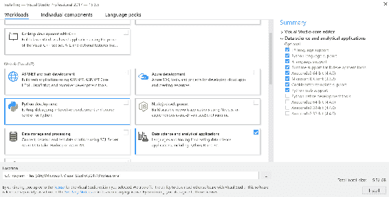
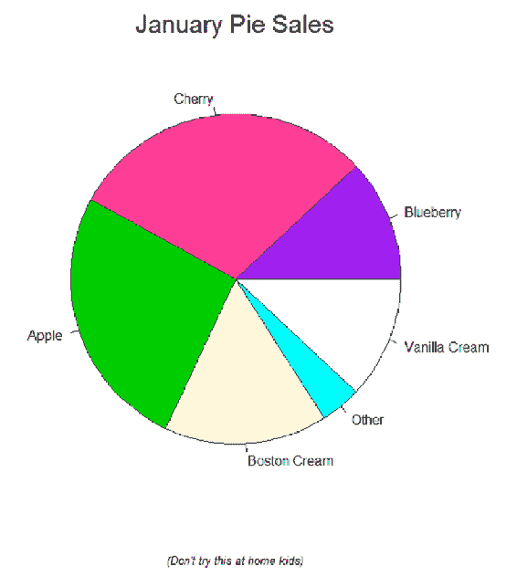
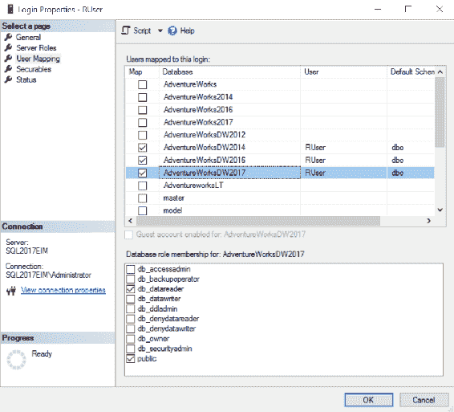

# 二、R 简介

当你谈论统计、数据挖掘和机器学习时，许多人，尤其是那些在学术领域工作的人，会想到 R。R 是执行代码的引擎的语言。你可以使用不同的 R 发行版，或者版本的 R 引擎和开发工具；然而，只有一种基本的 R 语言。当然，要使用它，你需要学习如何用这种语言编程。

统计学、数据挖掘和机器学习术语非常相似。如果你把它们当作同义词使用，你就不会犯大错误。统计学是一门分析数据集合、用数学函数表达关系、展示和解释结果的科学。在统计学中，你通常使用样本数据，或者说**样本**，因为你无法获得人口数据，或者说**人口普查**。数据挖掘分析技术通常来自统计学，但也来自人工智能、生物学和其他科学领域。你在数据上使用这些技术或算法，目的是发现隐藏的**模式**和**规则**。你使用这些模式和规则进行**预测**。机器学习意味着做一些编程，将类似的算法应用于你的数据，以自动解决给定的问题。从前面的句子可以看出，这三个定义是重叠的。您可能会根据结果的用户来定义它们之间的微小差异:统计通常由科学家使用，数据挖掘针对商业人士，而机器学习经常试图改善自动化工作或机器。如前所述，这三个应用数学领域都使用许多共同的算法，所以它们之间有很多重叠。

本章将涵盖以下几点:

*   获得 R
*   开发 R 代码的工具
*   r 基础知识


# 获得 R

r 是开源免费的。R 分发由位于 https://cran.r-project.org/的**综合 R 档案网** ( **起重机**)站点维护。从这个网站上，你可以下载多种平台的 R 引擎，包括 Windows、Linux 和 macOS X。除了 CRAN，微软还在 https://mran.revolutionanalytics.com/的**微软 R 应用网络** ( **MRAN** )网站上提供免费的 R 下载，在那里你可以打开微软 R。这是来自微软的开源 R，是核心 R 加上额外的微软库。如果你安装了 Visual Studio 2017，你也可以打开 Microsoft R——实际上，你得到的是所谓的 Microsoft R Client，我将在一分钟内介绍它。

安装 R 之后，您可以使用 R 控制台客户端工具开始工作。有了这个工具，你可以一行一行地写代码。您也可以使用任何多余的附加工具。使用最广泛的免费工具是 RStudio IDE。这个工具有付费版本和免费版本。你可以从位于 https://www.rstudio.com/的 RStudio 公司网站下载。

微软为习惯于微软工具的开发者创造了用于 Visual Studio ( **RTVS** )的 **R Tools，以及一个开发环境。RTVS 在**Visual Studio**(**VS**)2015 中可以免费下载，并且已经包含在 VS 2017 中。如果你不是专业开发人员，你不需要为 Visual Studio 付费。您可以使用免费的社区版来开发 R(以及 Python)代码。当然，您可以通过购买专业版甚至企业版来获得额外的功能。所有 VS 版本都可以从位于[https://www.visualstudio.com/downloads/](https://www.visualstudio.com/downloads/)的 VS 下载网站下载。**

安装 VS 2017 进行 R 或 Python 编码时，需要选择 Python 开发工作负载，然后是数据科学和分析应用。你可以在下面的截图中看到这个选择。选择此选项后，您将安装 Python 语言模板，其中包括 data science 模板和 Visual Studio 的 R Tools:



图 2.1:面向数据科学的 Visual Studio 2017 设置

如前所述，通过安装 VS 2017 for data science 应用程序，您将获得 Microsoft R 引擎，称为 Microsoft R Client。你还可以得到一个免费的 Python 引擎。我将在[第三章](78ca8bbf-a6b6-4384-a881-05502e34f5ee.xhtml)、*熟悉 Python* 中更多地讨论 Python。微软 R 客户端是微软 R Open 的增强版，附带了额外的可扩展微软 R 库，比如`RevoScaleR`和`MicrosoftML`。本书的读者可能希望使用 SQL Server 进行数据科学研究。因此，我强烈建议您使用 MS R 客户端。这样，在开发和测试时，您可以在代码中使用 MS ML 服务、服务器端 R 和 Python 引擎中可用的所有库，Python 引擎是一个独立的产品或 SQL Server 安装的一部分，正如您在第 1 章、*使用 T-SQL* 编写查询中所学的那样。


# R 中的第一行 R 代码

r 引擎是一个解释器。因此，R 是一种解释型语言。另外，R 是一种区分大小写的函数式语言。您可以调用函数来执行操作，而不是键入命令。例如，要退出 R 会话，需要调用`q()`函数。你应该广泛地注释你的代码。注释以散列符号(`#`)开始；您可以在代码行的任何地方使用注释。

注释开始后的任何代码都不会执行。如果您在一行中编写多个命令，分号(`;`)是命令分隔符。新行也是命令分隔符。下面的代码示例显示了一个注释，显示了我的 R 版本，并使用`contributors()`函数列出了作者和其他语言贡献者:

```sql
# R version and contributors
R.version.string
contributors()
```

这里，我只展示我目前使用的版本。请注意，当您阅读本书时，您可能已经有了一个更新的版本:

```sql
"R version 3.3.2 (2016-10-31)"
```

如果你正在使用 VS 2017 开发 R 代码，你从创建一个新的 R 项目开始。你得到一个空的 R 脚本；如果你习惯 RStudio IDE，这个 R Script 环境对你来说应该很熟悉。左上角的窗口是你写 R 代码的地方。当你把光标放在一行代码上，同时按下 *Ctrl* 和 *Enter* 键，R 引擎就会执行这一行代码。您可以在屏幕底部的控制台窗口中看到结果。在这个控制台窗口中，您也可以直接编写命令，就像前面提到的基本 R 控制台客户端工具一样，然后逐行执行它们。

当用 R 开发时，帮助总是对你可用的。从`help()`功能开始，启动帮助并打开帮助窗口(默认在屏幕右下角)。`help.start()`功能引导您找到免费的 R 文档。在您使用的 R 环境中，有一些全局选项集。这些选项影响 R 引擎执行计算和显示结果的方式。你可以使用`help("options")`功能来检查这些选项。每个特定的功能也有相关的帮助。

您可以用一个参数调用 help 函数来获得关于该函数的帮助，比如用`help("exp")`来获得关于指数函数的帮助。不用写完整的`help()`函数名，可以用问号作为快捷键。使用`?"exp"`，您还可以显示指数函数的帮助。除了帮助，您还可以获得调用函数的代码示例。使用`example("exp")`获取指数函数的代码示例。使用`help.search("topic")`或`??"topic"`，你可以搜索特定主题的帮助。您可以使用`RSiteSearch("topic")`将搜索扩展到在线文档。下面的代码示例显示了所有这些帮助选项:

```sql
help()          # Getting help on help
help.start()    # General help
help("options") # Help about global options
help("exp")     # Help on the function exp()
?"exp"          # Help on the function exp()
example("exp")  # Examples for the function exp()
help.search("constants")  # Search
??"constants"             # Search
RSiteSearch("exp")        # Online search
```

您可以在屏幕右侧的“帮助”窗口中看到帮助，就在解决方案资源管理器的下方。对于前面代码块中的最后一个命令，在线搜索命令，您的默认 web 浏览器应该在`exp()`函数的帮助下在适当的站点打开。

还有非常有用的`demo()`函数。您可以使用这个函数来运行演示脚本，它向您展示了您正在研究的函数或 R 环境的功能。要检查 R 图形功能，您可以使用以下代码:

```sql
demo("graphics")
```

当您执行这段代码时，会打开一个图形窗口。然而，在此之前，您需要在控制台窗格中移动光标，然后通过点击 *Enter* 键，一个图形接一个图形地执行演示代码。我复制了创建示例饼图的演示代码的一部分:

```sql
pie.sales <- c(0.12, 0.3, 0.26, 0.16, 0.04, 0.12)
names(pie.sales) <- c("Blueberry", "Cherry", "Apple",
                      "Boston Cream", "Other", "Vanilla Cream")
pie(pie.sales,
    col = c("purple", "violetred1", "green3", "cornsilk", "cyan", "white"))
title(main = "January Pie Sales", cex.main = 1.8, font.main = 1)
title(xlab = "(Don't try this at home kids)", cex.lab = 0.8, font.lab = 3)
```

下图显示了演示代码的结果:



图 2.2:演示饼图

当您使用 open R 版本时，您在内存中创建所有的对象。这是对可扩展性的限制。ML 服务引擎也可以将数据溢出到磁盘。对于开发来说，Microsoft R Client 通常就足够了。每个会话(您正在开发和执行的每个 R 脚本)都有自己的**工作区**。当您通过关闭 R script 窗口或退出 VS 来完成一个会话时，您不需要丢失这些对象；您可以将内存(工作区)中的对象保存到磁盘的`.RData`文件中。您可以通过在下一个会话中加载该文件来加载对象。工作空间保存在默认文件夹中。您可以通过`getwd()`函数调用来检查默认的工作文件夹。

您可以使用`setwd(dir)`功能更改默认文件夹，其中`dir`参数是新文件夹或新目录。通过调用`objects()`或`ls()`函数，您可以随时检查内存或当前工作空间中的对象。

使用`rm(objectname)`功能，您可以随时从内存中删除对象。除了以交互方式显示图形，您还可以用不同的图形格式保存图像。您甚至可以将单个对象保存到特定文件中。下面的代码示例展示了如何使用`sink()`命令将输出转移到文件中:

```sql
sink("C:\\DataScienceSQLServer\\Chapter02.txt")
getwd()
sink()
```

第二个`sink()`调用将输出重定向到控制台。可以自己查看文件内容。


# 学习 R 语言的基础知识

现在让我们写一些实际执行的代码:

```sql
1 + 2
2 + 5 * 4
3 ^ 4
sqrt(81)
pi
```

这段代码首先使用基本运算符计算三个数学表达式。正如您所料，R 使用数学运算符优先级来计算表达式。代码调用`sqrt()`函数来计算并检查数字 pi (π)的常量值。base R 安装或基础包有许多内置常量。您可以使用`??"constants"`在帮助中搜索所有提到常量的页面。

生成数字的**序列**有很多种方法，从下面的代码可以看出:

```sql
rep(1, 5)
4:8
seq(4, 8)
seq(4, 20, by = 3)
```

第一个命令在`rep()`函数的帮助下将数字 1 复制五次。您可以在冒号操作符(`:`)的帮助下生成一个数字序列，如您在第二行中所见。在第三行，我使用了`seq()`函数来完成同样的任务。这个函数有更多的可能性，如代码的第四行所示。当您调用此函数时，除了下限和上限之外，您还可以定义一个增量作为第三个参数。

以下是生成的序列:

```sql
[1] 1 1 1 1 1
[1] 4 5 6 7 8
[1] 4 5 6 7 8
[1] 4 7 10 13 16 19
```

您可以将这些值存储在**变量**中。在变量中存储值意味着给变量赋值；你可以用一个**赋值操作符**来完成。r 中有多个赋值运算符，最常用的是左赋值运算符(`<-`)；你把变量名写在运算符的左边，把值写在右边。您可以使用右边的赋值运算符(`->`)颠倒变量和值的顺序。等号(`=`)运算符的用法与左赋值运算符相同。以下代码将数字 2、3 和 4 赋给 3 个变量，然后使用这三个变量进行一些计算:

```sql
x <- 2
y <- 3
z <- 4
x + y * z
```

您可以执行代码来检查结果是否为`14`。正如我提到的，R 语言是区分大小写的。因此，如果您执行下面的代码行，就会得到一个错误。用大写字母书写的`X`、`Y`和`Z`变量名未定义:

```sql
X + Y + Z
```

变量或对象名称可以包含一个点。这允许您将对象组织到虚拟名称空间中，类似于。NET 语言，正如你在下面的例子中看到的。但是，请注意，名称空间不是真实的。没有等级制度；点只是名称的一部分，如果您喜欢这个字符，您可以用下划线代替它:

```sql
This.Year <- 2018
This.Year
```

r 还包括**逻辑运算符**。注意，等号运算符是赋值运算符；为了测试相等性，您需要使用双等号(`==`)运算符。逻辑运算符包括不等式运算符:`<`、`<=`、`>`、`>=`和`!=`。可以用逻辑 AND ( `&`)和逻辑 OR ( `|`)运算符组合两个或多个逻辑表达式。下面的代码向您展示了如何使用等号运算符，就像前面的代码使用左赋值运算符一样，然后展示了如何执行一些逻辑测试:

```sql
# Equals as an assignment operator
x = 2
y = 3
z = 4
x + y * z
# Boolean equality test
x <- 2
x == 2
```

代码的结果如下:

```sql
[1] 14
[1] TRUE
```

在 R 中，每个变量实际上都是一个**对象**。你可以把一个标量变量看作一个长度为 1 的向量。实向量是同一类型标量的一维数组。数据类型在 r 中也被称为**模式**，基本类型包括数值、字符、逻辑、复数(虚数)和原始(字节)。使用组合函数定义一个向量:`c()`。以下代码向您展示了在 r 中创建向量的各种方法。除了您已经熟悉的赋值操作符之外，该示例还使用了`assign()`函数。代码中先前使用的变量值被新值覆盖:

```sql
x <- c(2, 0, 0, 4)
assign("y", c(1, 9, 9, 9))
c(5, 4, 3, 2) -> z
q = c(1, 2, 3, 4)
```

对向量使用运算符，就像对标量值使用运算符一样。操作员逐个元素地工作。下面是对前面代码中定义的`x`向量的一些数学运算:

```sql
x + y
x * 4
sqrt(x)
```

以下是这些数学运算的结果:

```sql
[1]  3  9  9 13
[1]  8  0  0 16
[1] 1.414214 0.000000 0.000000 2.00000
```

您可以不使用整个向量，而只对向量的一个或多个选定元素进行操作。每个元素都分配有数字索引值。索引从`1`开始。以下代码显示了如何引用索引来仅对特定元素进行操作:

```sql
x <- c(2, 0, 0, 4)
x[1]          # Selects the first element
x[-1]         # Excludes the first element
x[1] <- 3     # Assigns a value to the first element
x             # Show the vector
x[-1] = 5     # Assigns a value to all other elements
x             # Show the vector
```

从注释中，您可以看到代码对 vector 及其元素做了什么。结果如下:

```sql
[1] 2
[1] 0 0 4
[1] 3 0 0 4
[1] 3 5 5 5
```

向量上的逻辑运算符也是一个元素接一个元素地工作，这可以从下面的代码中看出:

```sql
y <- c(1, 9, 9, 9)
y < 8         # Compares each element, returns result as vector
y[4] = 1      # Assigns a value to the first element
y < 8         # Compares each element, returns result as vector
y[y < 8] = 2  # Edits elements marked as TRUE in index vector
y             # Shows the vector
```

同样，您可以从注释中看到代码的作用。结果如下:

```sql
[1]  TRUE FALSE FALSE FALSE
[1]  TRUE FALSE FALSE  TRUE
[1]  2 9 9 2
```

标量和向量是最基本的数据结构。还有许多更高级的数据结构，我将在本章后面介绍。但是，在此之前，让我先介绍一下 R 包。

尽管核心 R 引擎的功能已经非常广泛，但 R 的真正威力来自成千上万的附加包。

您可以轻松下载和安装软件包。一个包一般会给 core R 增加一些功能，有些包还会带来演示数据。可用的软件包数量巨大，并且仍在增长。可能没有其他语言有这么多额外的数据科学模块和将那些模块写成 R 的贡献者(模块总数在某些语言中更高，比如 Python 但是，用于数据科学的模块数量是 R)的强项。

在 2018 年夏天，当我在写这一章的时候，可用的包的数量已经超过 12，000 个。当您安装核心引擎时，您会得到一小组广泛使用的或基础的包。

您可以使用`installed.packages()`功能来检查哪些软件包已经安装在您的库中。该库存储在一个文件夹中，并且可以在该文件夹中使用；你可以用`.libPaths()`函数得到这个文件夹名称(注意名称中的点)。使用`library()`功能，您可以列出您库中的软件包。当您调用这个函数时，会打开一个新的 R 包管理器窗口。您可以在此窗口中看到已安装、可用和已加载的软件包。下面是展示我刚才提到的三个函数的示例代码:

```sql
installed.packages()
.libPaths()
library()
```

使用`install.packages("packagename")`安装新的软件包。当您执行它时，它会在 CRAN 站点中搜索该包，下载它，解压缩它，并安装它。你需要一个网络连接来直接下载一个包。这种方法适用于开发和测试，但不适用于生产服务器。您也可以单独下载软件包，然后从本地文件安装它们。

用`library(packagename)`命令将一个已安装的包加载到内存中。正如您已经知道的，在 R 中，帮助总是在附近。使用`help(package ="packagename")`命令获得特定软件包的帮助。假设您想从 SQL Server 数据库中读取数据。对于这个任务，你需要`RODBC`包。使用以下代码来安装、加载它，并获得有关它的帮助:

```sql
install.packages("RODBC")
library(RODBC)
help(package = "RODBC")
```

现在，您可以从 SQL Server 中读取数据。但是您需要执行一些其他任务来成功读取数据。您的 R 代码需要访问 SQL Server，并且必须具有读取数据的权限。在 SQL Server 中，您需要为 R 会话创建一个**登录名**和一个**数据库用户**。然后你需要**授权**这个用户通过给它适当的**权限**来读取数据。您还必须有一个 ODBC **数据源名称** ( **DSN** )，它指向存储数据的数据库。在 SQL Server Management Studio 中，您可以使用 GUI 来执行这些任务。您必须连接到 SQL Server，然后在对象资源管理器中展开 Security 文件夹。右键单击登录子文件夹。创建新的登录。将此登录映射到 AdventureWorksDW2017 演示数据库中的数据库用户。您可以在同一个窗口中将该用户添加到 db_datareader 角色，以授权该用户读取数据。在我的例子中，我的 SQL Server 登录名为 RUser。

此登录的密码是 Pa$$w0rd。我创建了一个同名的数据库用户，将其映射到这个登录名，并将该数据库用户添加到 db_datareader 角色，如下面的屏幕截图所示:



图 2.3:生成 RUser 登录和数据库用户

然后我运行 ODBC 数据源工具。用这个工具，我创建了一个名为 AWDW 的系统 DSN。我将 DSN 配置为使用我刚刚创建的 RUser SQL Server 登录连接到我的本地 SQL Server，并将上下文更改为`AdventureWorksDW2017`数据库。当您完成这些步骤时，您可以执行下面的代码从`AdventureWorksDW2017`演示数据库的`dbo.vTargetMail`视图中读取数据:

```sql
con <- odbcConnect("AWDW", uid = "RUser", pwd = "Pa$$w0rd")
sqlQuery(con,
         "SELECT CustomerKey,
            EnglishEducation AS Education,
            Age, NumberCarsOwned, BikeBuyer
          FROM dbo.vTargetMail;")
close(con)
```

如果您执行代码，您应该在控制台窗格中获得 18，484 行输出。你可以在这里看到前四行:

```sql
      CustomerKey           Education Age NumberCarsOwned BikeBuyer
1           11000           Bachelors  31               0         1
2           11001           Bachelors  27               1         1
3           11002           Bachelors  32               1         1
4           11003           Bachelors  29               1         1
```

如果您不想创建 ODBC DSN，可以使用来自 R 的特殊连接，如下面的代码所示:

```sql
con <- odbcDriverConnect('driver={SQL Server};server=SQL2017EIM;
 database=AdventureWorksDW2017;uid=RUser;pwd=Pa$$w0rd')
```


# 使用 R 数据结构

正如所承诺的，我现在引入 r 中最重要的数据结构。当你分析数据时，你分析的是一个**数据集**。数据集看起来像 SQL Server 表:您可以观察行和列。但是，这不是关系意义上的表，正如 SQL Server 遵循的关系模型中定义的那样。符合关系模型的表中没有定义行和列的顺序。然而，在 R 中，作为行和列交叉点的单元位置是已知的。这更像是数学中的矩阵。

在 R 数据集中，行也被称为**病例**或**观察值**。您通过使用列中的值来分析案例，这些值也称为案例的**变量**或**属性**。

我将在本节中介绍以下数据结构:

*   矩阵和阵列
*   工厂
*   列表
*   数据帧

一个**矩阵**是一个二维数组。矩阵的所有值必须具有相同的模式——可以只有整数，也可以只有字符串，等等。使用`matrix()`功能从矢量生成矩阵。您可以将标签分配给列和行。从向量创建矩阵时，定义是按行还是按列生成矩阵(默认)。如果您执行下面的演示代码，您将很快理解其中的区别:

```sql
x = c(1, 2, 3, 4, 5, 6); x
Y = array(x, dim = c(2, 3)); Y
Z = matrix(x, 2, 3, byrow = F); Z
U = matrix(x, 2, 3, byrow = T); U
```

请注意，每行有两个命令，用分号隔开。还要注意，我在第二行使用了`array()`函数来生成与第三行相同的矩阵，通过列生成矩阵。最后一个命令按行生成一个矩阵。下面是前面代码的输出:

```sql
[1] 1 2 3 4 5 6
     [,1] [,2] [,3]
[1,]    1    3    5
[2,]    2    4    6
     [,1] [,2] [,3]
[1,]    1    3    5
[2,]    2    4    6
     [,1] [,2] [,3]
[1,]    1    2    3
[2,]    4    5    6
```

以下代码显示了如何为行和列定义显式名称:

```sql
rnames = c("rrr1", "rrr2")
cnames = c("ccc1", "ccc2", "ccc3")
V = matrix(x, 2, 3, byrow = T,
    dimnames = list(rnames, cnames))
V
```

结果如下:

```sql
     ccc1 ccc2 ccc3
rrr1    1    2    3
rrr2    4    5    6
```

如果定义了名称，可以通过索引位置或名称来引用矩阵的元素。以下代码向您展示了一些选项。请注意，您总是引用行索引和列索引；但是，当您跳过一个显式索引值时，这意味着该索引的所有元素。例如，第一行代码选择第一行，所有列。第三行选择所有行，但只选择第二和第三列:

```sql
U[1,]
U[1, c(2, 3)]
U[, c(2, 3)]
V[, c("ccc2", "ccc3")]
```

结果如下:

```sql
[1] 1 2 3
[1] 2 3
     [,1] [,2]
[1,]    2    3
[2,]    5    6
     ccc2 ccc3
Row1    2    3
Row2    5    6
```

你可以看到我也用`array()`函数生成了一个矩阵。一个**数组**是一个广义的多维矩阵。与`matrix()`函数类似，`array()`函数接受一个向量值作为第一个输入参数。第二个参数是一个向量，用这个向量中的元素数定义维数，用这个向量中的值定义每个维中的元素数。您还可以为维度元素的名称传递一个向量列表。数组由列填充，然后由行填充，然后由第三维(页面)填充，依此类推。以下代码显示了如何创建数组:

```sql
rnames = c("rrr1", "rrr2")
cnames = c("ccc1", "ccc2", "ccc3")
pnames = c("ppp1", "ppp2", "ppp3")
Y = array(1:18, dim = c(2, 3, 3),
 dimnames = list(rnames, cnames, pnames))
Y
```

多维数组对于典型的数据科学分析没有用处。因此，我不会在本书中使用它们。当然，您可以根据自己的目的使用它们，例如用于代数运算。

在介绍数据框架之前，我需要讨论变量如何存储它们的值。当每一个值都取自一个有限的可能值池时，变量就是**离散的**。如果可能值的池不受限制，变量就是连续的 T4。离散值可以是**名义值**或**类别值**，在这种情况下，它们仅表示标签，没有任何特定的顺序；或者是**序数值**，在这种情况下，值的逻辑顺序是有意义的。在 R 中，离散变量称为**因子**。**因子的级别**是构成可能值池的不同值。您可以使用`factor()`函数从值的向量中定义因子。许多统计、数据挖掘和机器学习算法对离散变量和连续变量的处理是不同的。因此，在分析这些因素之前，您需要提前适当地定义它们。以下是定义这些因素的一些示例:

```sql
x = c("good", "moderate", "good", "bad", "bad", "good")
y = factor(x); y
z = factor(x, order = TRUE); z
w = factor(x, order = TRUE,
           levels = c("bad", "moderate", "good")); w
```

前面的代码会产生以下结果:

```sql
[1] good     moderate good     bad      bad      good   
Levels: bad good moderate
[1] good     moderate good     bad      bad      good  
Levels: bad < good < moderate
[1] good     moderate good     bad      bad      good   
Levels: bad < moderate < good
```

当我定义向量代表一个因子时，你可以看到 R 是如何识别不同的水平的。您还可以看到，在前面的代码的第三行中，我将因子定义为一个顺序变量，默认情况下，R 是如何按字母顺序对级别进行排序的。在最后一个命令中，我终于为因子定义了正确的顺序。

**列表**是复杂的数据结构。列表可以包括任何其他数据结构，包括另一个列表。通常，您会分析一个列表。但是，您需要了解它们，因为有些函数返回打包在列表中的复杂结果，有些函数接受列表作为参数。使用`list()`函数创建列表。由于列表也是有序的，您可以通过位置引用列表中的对象。您需要用双括号将索引号括起来。如果一个元素是一个向量或者一个矩阵，你可以在矩阵中使用这个向量的元素的索引位置，用单括号括起来。下面是一个使用列表的示例:

```sql
L = list(name1 = "ABC", name2 = "DEF",
         no.children = 2, children.ages = c(3, 6))
L
L[[1]]
L[[4]]
L[[4]][2]
```

使用列表的示例代码返回以下结果:

```sql
$name1
[1] "ABC"
$name2
[1] "DEF"
$no.children
[1] 2
$children.ages
[1] 3 6
[1] "ABC"
[1] 3 6
[1] 6
```

对于任何数据科学分析来说，最重要的数据结构是一个**数据框架**。数据框是广义的二维矩阵，其中每个变量可以有不同的模式或不同的数据类型。当然，变量的所有值必须是相同的数据类型。这与 SQL Server 表非常相似。但是数据框是矩阵，因此您可以使用位置访问来引用数据框的值。您可以使用`data.frame()`功能从不同模式的多个矢量创建一个数据帧。所有向量的长度必须相同，元素的数量也必须相同。这里有一个例子:

```sql
CategoryId = c(1, 2, 3, 4)
CategoryName = c("Bikes", "Components", "Clothing", "Accessories")
ProductCategories = data.frame(CategoryId, CategoryName)
ProductCategories
```

结果如下:

```sql
  CategoryId CategoryName
1          1        Bikes
2          2   Components
3          3     Clothing
4          4  Accessories
```

在本章前面的例子中，我从 SQL Server 数据库的一个视图中读取数据。我直接在控制台窗口显示数据。这对进一步的分析不是很有用。大多数时候，你想要的是将你读取的数据存储在一个数据框中。您分析的数据集就是您的数据框。SQL Server 绝对不是您可以使用的唯一数据源。您从许多其他来源读取数据，包括文本文件和 Excel。以下代码从数据框中的`AdventureWorksDW2017`演示数据库的`dbo.vtargetMail`视图中检索数据，然后显示数据框的前五行的前五列:

```sql
con <- odbcConnect("AWDW", uid = "RUser", pwd = "Pa$$w0rd")
TM <-
sqlQuery(con,
         "SELECT CustomerKey,
            EnglishEducation AS Education,
            Age, NumberCarsOwned, BikeBuyer
          FROM dbo.vTargetMail;")
close(con)
TM[1:5, 1:5]
```

以下是数据框前五行的内容:

```sql
  CustomerKey Education Age NumberCarsOwned BikeBuyer
1       11000 Bachelors  31               0         1
2       11001 Bachelors  27               1         1
3       11002 Bachelors  32               1         1
4       11003 Bachelors  29               1         1
5       11004 Bachelors  23               4         1
```

您还可以在执行以下命令后打开的单独窗口中查看完整的数据框:

```sql
View(TM)
```

正如您刚才看到的，您可以通过使用位置索引从数据框中检索数据，就像在矩阵中一样。您也可以使用列名。然而，最常见的符号是使用数据框名称和列名称，由美元(`$`)符号分隔，例如`TM$Education`。下面的代码使用 R `table()`函数生成`NumberCarsOwned`和`BikeBuyer`的交叉列表:

```sql
table(TM$NumberCarsOwned, TM$BikeBuyer)
```

这是本章的最后一个结果:

```sql
       0    1
  0 1551 2687
  1 2187 2696
  2 3868 2589
  3  951  694
  4  795  466
```

这个数据框架总结了我们对 R 数据结构的简短介绍。


# 摘要

本章给了你一个 R 语言的概述。您学习了基础知识，包括如何编写 R 表达式和创建变量。本章介绍了 R 中的数据结构，重点是最重要的一个，数据帧。您了解了如何从 SQL Server 读取数据，将数据存储在数据框中，然后从数据框中检索数据。在[第 3 章](78ca8bbf-a6b6-4384-a881-05502e34f5ee.xhtml)、*熟悉 Python* 中，在对数据帧中的数据做一些额外的操作以准备进一步的分析之前，我们将对 Python 语言做一个简短的介绍。