# 五、数据准备

不幸的是，您要处理的大部分数据对于数据科学项目来说并不是立即有用的。此类项目工作的主要部分是数据准备部分。您的数据可能会有许多不同的问题。你可能有一些**缺失值**在里面。也许你需要将一些连续变量分组到有限数量的**容器**中——这意味着必须**容器**或**离散化**它们。很快，你就会意识到自由裁量并不是一个特别简单的过程。也许你需要从分类变量中创建数字变量。你从分类变量的值中创建所谓的虚拟变量，或**虚拟变量**。有时，您需要**在用一个或多个变量定义的一些**组**上聚集**数据，并进一步对聚集的数据进行操作。

本章将向您介绍一些基本的数据准备任务和工具，包括以下内容:

*   处理缺失值
*   从分类变量创建虚拟变量
*   不同的离散化方法
*   测量离散变量的熵
*   使用一些高级包、表达式和函数进行数据准备


# 处理缺失值

让我首先创建一个小表，并用一些单元格中缺少的值填充它，在 SQL Server 中用保留字`NULL`表示:

```sql
USE AdventureWorksDW2017;
GO
DROP TABLE IF EXISTS dbo.NULLTest;
GO
CREATE TABLE dbo.NULLTest
(
 c1 INT NULL,
 c2 INT NULL,
 c3 INT NULL
);
GO
INSERT INTO dbo.NULLTest VALUES
(1, NULL, 3),
(4, 5, 6),
(NULL, 8, 9),
(10, 11, 12),
(13, NULL, NULL);
GO
```

该表的内容如下:

```sql
c1          c2          c3
----------- ----------- -----------
1           NULL        3
4           5           6
NULL        8           9
10          11          12
13          NULL        NULL
```

在 T-SQL 中，您可以使用`ISNULL()`和`COALESCE()`函数来处理`NULL` s。第一个函数只有两个参数，如果不是`NULL`，则返回第一个参数的值，否则返回第二个参数的值。刚刚提到的第二个函数接受多个参数，并返回第一个不是`NULL`的参数。在下面的示例代码中，您可以看到这两个函数是如何工作的:

```sql
SELECT c1, ISNULL(c1, 0) AS c1NULL,
 c2, c3, COALESCE(c2, c3, 99) AS c2NULL
FROM dbo.NULLTest
```

下面是前面代码的结果:

```sql
c1          c1NULL      c2          c3          c2NULL
----------- ----------- ----------- ----------- -----------
1           1           NULL        3           3
4           4           5           6           5
NULL        0           8           9           8
10          10          11          12          11
13          13          NULL        NULL        99
```

T-SQL 聚合函数只是跳过`NULL` s，就好像它们不存在一样。唯一的例外是`COUNT(*)`函数，它只计算行数，而不管各列中是否有一些`NULL`。让我给你看一个例子:

```sql
SELECT AVG(c2) AS c2AVG, SUM(c2) AS c2SUM, COUNT(*) AS n,
 SUM(1.0*c2)/COUNT(*) AS c2SumByCount
FROM dbo.NULLTest;
```

在下面的结果中，您可以看到`AVG()`和`SUM()/COUNT(*)`之间的差异。我还复制了我得到的警告和结果:

```sql
c2AVG       c2SUM       n           c2SumByCount
----------- ----------- ----------- ------------
8           24          5           4.800000
Warning: Null value is eliminated by an aggregate or other SET operation.
```

让我在 r 中读取相同的数据，您应该已经熟悉了下面的代码:

```sql
library(RODBC)
con <- odbcConnect("AWDW", uid = "RUser", pwd = "Pa$$w0rd")
NULLTest <-
sqlQuery(con,
 "SELECT c1, c2, c3
 FROM dbo.NULLTest;")
close(con)
NULLTest
```

从结果中可以看出，NULLs 在 R 中用 NA 标记:

```sql
  c1  c2  c3
1 1   NA  3
2 4   5   6
3 NA  8   9
4 10  11  12
5 13  NA  NA
```

在 R 中，有一些函数可以处理基本包中已经存在的未知值。您可以使用`na.omit()`函数省略任何列中包含 NAs 的所有行。您可以使用`is.na()`功能检查 NAs:

```sql
na.omit(NULLTest)
is.na(NULLTest)
```

上例中的第一行代码返回 NULLTest 数据帧中的第二行和第四行。第二行返回以下矩阵:

```sql
  c1    c2    c3
1 FALSE TRUE  FALSE
2 FALSE FALSE FALSE
3 TRUE  FALSE FALSE
4 FALSE FALSE FALSE
5 FALSE TRUE  TRUE
```

R 中的许多功能不能直接用于 NAs。如果在某些行中缺少值的列上计算平均值，结果是未知的。但是，许多函数也接受`na.rm`参数。当您将该参数设置为`TRUE`时，该函数会跳过缺少值的行，因此其工作方式类似于 T-SQL 聚合函数。您可以从`mean()`函数示例中看到这种行为:

```sql
mean(NULLTest$c2)
mean(NULLTest$c2, na.rm=TRUE)
```

前面两行代码的结果如下:

```sql
[1] NA
[1] 8
```

对于如何对待缺失值，还有很多其他的可能性。您可能决定用该列的平均值替换缺失的值。您可以使用任何其他值作为替换。您可以想象在其他包中有许多其他选项来处理 R 中的 NAs。然而，这个快速指南必须简短；否则，它不会这么快，因此我现在将切换到 Python。以下代码导入我将在本章中使用的模块，并读取处理空值的演示数据:

```sql
import numpy as np
import pandas as pd
import pyodbc
import matplotlib as mpl
import matplotlib.pyplot as plt
import seaborn as sns
import scipy as sc
# Demo data
con = pyodbc.connect('DSN=AWDW;UID=RUser;PWD=Pa$$w0rd')
query = """SELECT c1, c2, c3
 FROM dbo.NULLTest;"""
NULLTest = pd.read_sql(query, con)
```

如果您检查`NULLTest` Python 数据框的内容，您将看到空值在 Python 中用标记 NaN 标记。类似于 R 中的`is.na()`函数，您可以使用熊猫`isnull()`函数检查熊猫数据帧中的 nan:

```sql
pd.isnull(NULLTest)
```

前一行代码返回一个类似的真/假矩阵，就像我刚刚在 R 示例中展示的`is.na(NULLTest)`函数。您也可以省略列中带有 NaN 的行，或者可以省略任何行中带有 NaN 的列:

```sql
NULLTest.dropna(axis = 'rows')
NULLTest.dropna(axis = 'columns')
```

第一行返回第 2 行和第 4 行，如下面的结果所示，而第二行返回一个空数据框，因为每一列中至少有一个 NaN:

```sql
  c1   c2   c3
1 4.0  5.0  6.0
3 10.0 11.0 12.0
```

永远不要忘记检查数据中的未知值，无论是在 SQL Server 表中，还是在 R 和 Python 数据框中。


# 创造假人

一些算法，例如回归分析算法，需要数字输入变量。如果您想在分析中使用分类变量，您需要以某种方式将其转换为数字变量。如果变量是序数，这不是问题；您只需将适当的整数赋给变量的自然排序值。从一个名义变量，你可以创建一组**指标**。每个可能的值都有一个指示符，显示它所代表的值是否适用于某个案例。如果某个案例采用了某个特定值，您可以将该值的指标赋值为 1，否则为 0。这种新的变量，指标，也被称为虚拟变量，或假人。在 T-SQL 中，您可以使用`IIF()`函数来生成虚拟对象，如以下代码所示:

```sql
SELECT TOP 3 MaritalStatus,
 IIF(MaritalStatus = 'S', 1, 0)
 AS [TM_S],
 IIF(MaritalStatus = 'M', 1, 0)
 AS [TM_M]
FROM dbo.vTargetMail;
```

结果如下:

```sql
MaritalStatus TM_S        TM_M
------------- ----------- -----------
M             0           1
S             1           0
S             1           0

```

在 Python 中，可以使用 pandas `get_dummies()`函数从变量中生成虚拟对象。该函数自动使用原始变量的值作为新指标的名称。您可以给名称添加前缀。在使用该功能之前，我需要从`AdventureWorksDW2017`演示数据库中读取`dbo.vTargetMail`数据:

```sql
con = pyodbc.connect('DSN=AWDW;UID=RUser;PWD=Pa$$w0rd')
query = """SELECT CustomerKey, CommuteDistance,
 TotalChildren, NumberChildrenAtHome, 
 Gender, HouseOwnerFlag,
 NumberCarsOwned, MaritalStatus,
 Age, YearlyIncome, BikeBuyer,
 EnglishEducation AS Education,
 EnglishOccupation AS Occupation
 FROM dbo.vTargetMail"""
TM = pd.read_sql(query, con)
```

以下代码创建了一个新的数据框，该数据框仅包含原始数据框中的`MaritalStatus`，并将一个数据框与从`MaritalStatus`变量创建的虚拟数据框连接起来。代码的第二行显示了新数据帧的最后三种情况:

```sql
TM1 = TM[['MaritalStatus']].join(pd.get_dummies(TM.MaritalStatus, prefix = 'TM'))
TM1.tail(3)
```

以下是 Python 结果:

```sql
      MaritalStatus TM_M TM_S
18481 S             0    1
18482 M             1    0
18483 M             1    0
```

在 R 中，创建虚拟模型最方便的方式可能是来自**虚拟模型**包的`dummy()`函数。但是我需要先读取 dbo.vTargetMail 数据:

```sql
con <- odbcConnect("AWDW", uid = "RUser", pwd = "Pa$$w0rd")
TM <-
sqlQuery(con,
 "SELECT CustomerKey, CommuteDistance,
 TotalChildren, NumberChildrenAtHome, 
 Gender, HouseOwnerFlag, MaritalStatus,
 NumberCarsOwned, MaritalStatus,
 Age, YearlyIncome, BikeBuyer,
 EnglishEducation AS Education,
 EnglishOccupation AS Occupation
 FROM dbo.vTargetMail;")
close(con)
```

现在我可以安装 dummies 包并调用`dummy()`函数来获得最后三行的相同结果，如 Python 中所示:

```sql
install.packages("dummies")
library(dummies)
# Create the dummies
TM1 <- cbind(TM, dummy(TM$MaritalStatus, sep = "_"))
tail(TM1[c("MaritalStatus", "TM_S", "TM_M")], 3)
```

你可以自己执行 R 代码来检查结果。


# 离散化连续变量

有些算法，例如将在第 8 章介绍的朴素贝叶斯算法，只使用离散输入变量。如果你想在你的分析中使用一个连续变量，你必须把它离散化，或者把这些值组合起来。您可能还希望离散化一个连续变量，以便能够用条形图显示它的分布。有许多可能的方法来进行离散化。我将展示以下几个:

*   等宽装订
*   等高装订
*   自定义绑定


# 等宽离散化

等宽宁滨可能是最流行的离散化方法。这意味着在宁滨之后，所有的条柱都具有相等的宽度，或者表示原始变量值的相等范围，无论每个条柱中有多少个事例。有了足够多的箱，您可以很好地保留原始分布，并用条形图表示它。

我将从一个 T-SQL 示例开始。我将把来自`dbo.vTargetMail`视图的`Age`变量分成五组，宽度相等。您可能还记得上一章，最小年龄是 17 岁，最大年龄是 87 岁，范围是 70 岁。如果我们把它分成五个箱子，那么每个箱子的宽度是 14 年:

```sql
DECLARE @binwidth AS NUMERIC(5,2), 
 @minA AS INT, @maxA AS INT;
SELECT @minA = MIN(AGE),
 @maxa = MAX(Age),
 @binwidth = 1.0 * (MAX(Age) - MIN(Age)) / 5
FROM dbo.vTargetMail;
SELECT CustomerKey, Age,
 CASE 
 WHEN Age >= @minA + 0 * @binwidth AND Age < @minA + 1 * @binwidth
 THEN CAST((@minA + 0 * @binwidth) AS VARCHAR(5)) + ' - ' +
 CAST((@minA + 1 * @binwidth - 1) AS VARCHAR(5))
 WHEN Age >= @minA + 1 * @binwidth AND Age < @minA + 2 * @binwidth
 THEN CAST((@minA + 1 * @binwidth) AS VARCHAR(5)) + ' - ' +
 CAST((@minA + 2 * @binwidth - 1) AS VARCHAR(5))
 WHEN Age >= @minA + 2 * @binwidth AND Age < @minA + 3 * @binwidth
 THEN CAST((@minA + 2 * @binwidth) AS VARCHAR(5)) + ' - ' +
 CAST((@minA + 3 * @binwidth - 1) AS VARCHAR(5))
 WHEN Age >= @minA + 3 * @binwidth AND Age < @minA + 4 * @binwidth
 THEN CAST((@minA + 3 * @binwidth) AS VARCHAR(5)) + ' - ' +
 CAST((@minA + 4 * @binwidth - 1) AS VARCHAR(5))
 ELSE CAST((@minA + 4 * @binwidth) AS VARCHAR(5)) + ' + '
 END AS AgeEWB
FROM dbo.vTargetMail
ORDER BY NEWID();
```

我使用`CASE` T-SQL 表达式来定义 bin。以下是结果中的几行:

```sql
CustomerKey Age         AgeEWB
----------- ----------- -------------
22834       50          45.00 - 58.00
17518       23          17.00 - 30.00
22908       27          17.00 - 30.00
17802       33          31.00 - 44.00
21498       41          31.00 - 44.00
```

我使用`ORDER BY NEWID()`排序只是为了打乱行，在前几行得到不同的例子。

我将向你展示当你做一个等宽宁滨时，如何用一个条形图来可视化`Age`变量的分布。下面是一个 Python 例子。我使用 pandas `cut()`函数来创建条块，然后创建条形图:

```sql
TM['AgeEWB'] = pd.cut(TM['Age'], 20)
TM['AgeEWB'].value_counts()
pd.crosstab(TM.AgeEWB,
 columns = 'Count') .plot(kind = 'bar',
 legend = False,
 title = 'AgeEWB20')
plt.show()
```

您可以在下面的屏幕截图中看到创建的条形图:

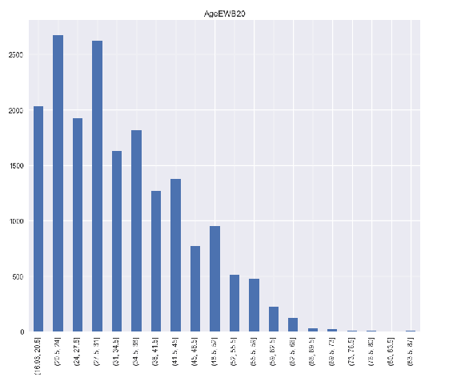

20 个等宽箱中的年龄分布

现在，让我像在 T-SQL 代码中一样执行五个 bin，并显示新 bin 的计数:

```sql
TM['AgeEWB'] = pd.cut(TM['Age'], 5)
TM['AgeEWB'].value_counts(sort = False)
```

结果如下:

```sql
(16.93, 31] 9246
(31, 45]    6089
(45, 59]    2717
(59, 73]     402
(73, 87]      30
```

你可以看到箱子或间隔在左边打开，在右边关闭。所有箱子的宽度相等；然而，每个箱中的病例数差别很大。

在 R 中，有一个名为`cut()`的函数，在基本包中实现，它执行等宽宁滨。以下代码还显示了新入库变量的计数或绝对频率:

```sql
TM["AgeEWB"] = cut(TM$Age, 5)
table(TM$AgeEWB)
```

结果与 Python 代码的结果相同。


# 等高离散化

有一个非常好的理由来表演等高宁滨。有了这个宁滨，你保存了变量所能容纳的最大可能的信息量，我将在本章后面解释。现在，让我再次提到，等高宁滨意味着离散化后，每个新的条柱具有大约相等数量的事例，但范围不同。

在 T-SQL 中，您可以使用`NTILE()`函数将行分配给图块。这里有一个例子:

```sql
SELECT CustomerKey, Age,
 CAST(NTILE(5) OVER(ORDER BY Age)
 AS CHAR(1)) AS AgeEHB
FROM dbo.vTargetMail
ORDER BY NEWID();
```

使用`NEWID()`功能再次打乱结果。以下是结果中的一些行:

```sql
CustomerKey Age   AgeEHB
----------- ----- ------
15426       53    5
24403       35    4
19445       29    3
22985       18    1
28064       25    2
```

在 R 中，我创建了一个自定义函数，它为我实现了等宽宁滨。该函数计算每个箱中应该有多少个案例，然后用`rank()`函数将案例分配给箱:

```sql
EHBinning <- function(data, nofbins) {
 bincases <- rep(length(data) %/% nofbins, nofbins)
 bincases <- bincases + ifelse(1:nofbins <= length(data) %% nofbins, 1, 0)
 bin <- rep(1:nofbins, bincases)
 bin <- bin[rank(data, ties.method = "last")]
 return(factor(bin, levels = 1:nofbins, ordered = TRUE))
}
TM["AgeEHB"] = EHBinning(TM$Age, 5)
table(TM$AgeEHB)
```

以下是箱子中箱子的分布情况:

```sql
1    2    3    4    5 
3697 3697 3697 3697 3696
```

我的函数将溢出案例分配给第一个箱。来自我的数据框的病例数是 18.484；这不能被 5 整除。除法的余数是 4。因此，我分配给前四个箱的案例比分配给最后一个箱的案例多一个。这与 T-SQL `NTILE()`函数的工作方式相同。让我向您展示新的`AgeEHB`变量在直方图中的分布。这一次，我使用的是微软 ML 服务附带的 RevoScaleR 包中的可伸缩的`rxHistogram()`函数:

```sql
library("RevoScaleR")
rxHistogram(formula = ~AgeEHB,
 data = TM)
```

从下面的截图中，您可以看到箱子具有相同的高度:

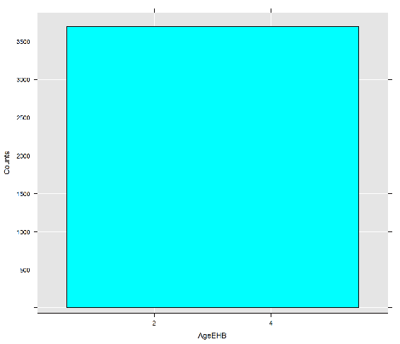

五个等高箱中的年龄分布

在 Python 中，您可以使用 pandas `qcut()`函数进行等高宁滨。然而，该函数的工作方式与我用 T-SQL 和 r 展示的等高宁滨略有不同。`qcut()`函数在单个 bin 或单个 tile 中为所有情况分配相同的值。因此，不同箱中的案例数可能会略有不同。以下是 Python 代码:

```sql
TM['AgeEHB'] = pd.qcut(TM['Age'], 5)
TM['AgeEHB'].value_counts(sort = False)
```

结果如下:

```sql
[17, 23] 4059
(23, 29] 3890
(29, 35] 3418
(35, 44] 3702
(44, 87] 3415
```

对于 NTILE() T-SQL 函数执行的相同宁滨，您可以用 Python 编写一个自定义函数，就像我在 r 中所做的那样


# 自定义离散化

另一种非常流行的离散化方法是试图遵循变量值的真实环境。以收入为例。当你每月赚 500 个单位时，100 个单位的差额(用你喜欢的任何货币)意味着很多。同样的 100 台，如果你月入 5 万台，也不是很重要。因此，在收入值的低端制作较窄的箱，在高端制作较宽的箱是有意义的。当涉及到年龄时，您可以实现类似的逻辑。下面是一个 T-SQL 示例:

```sql
SELECT CustomerKey, Age,
 CASE 
 WHEN Age >= 17 AND Age < 23
 THEN '17 - 22'
 WHEN Age >= 23 AND Age < 30
 THEN '23 - 29'
 WHEN Age >= 29 AND Age < 40
 THEN '30 - 39'
 WHEN Age >= 40 AND Age < 55
 THEN '40 - 54'
 ELSE '54 +'
 END AS AgeCUB 
FROM dbo.vTargetMail
ORDER BY NEWID();
```

以下是结果中的几行:

```sql
CustomerKey Age    AgeCUB
----------- ------ -------
20204       32     30 - 39
26547       51     40 - 54
19111       25     23 - 29
11190       53     40 - 54
11360       19     17 - 22
14247       55     54 +
```

R 和 Python pandas 的两个`cut()`函数都接受一个参数，该参数是自定义切割点的向量。下面是 R 的例子:

```sql
TM["AgeCUB"] = cut(TM$Age, c(16, 22, 29, 39, 54, 88))
table(TM$AgeCUB)
```

以下是 R 的结果:

```sql
(16,22] (22,29] (29,39] (39,54] (54,88] 
 3370    4579    5158    4319    1058 
```

以下自定义宁滨的 Python 代码也创建了新入库变量的条形图:

```sql
custombins = [16, 22, 29, 39, 54, 88]
TM['AgeCUB'] = pd.cut(TM['Age'], custombins)
TM['AgeCUB'].value_counts(sort = False)
pd.crosstab(TM.AgeCUB,
 columns = 'Count') .plot(kind = 'bar',
 legend = False,
 title = 'AgeCUB')
plt.show()
```

下面的屏幕截图显示了新的离散化变量的分布:

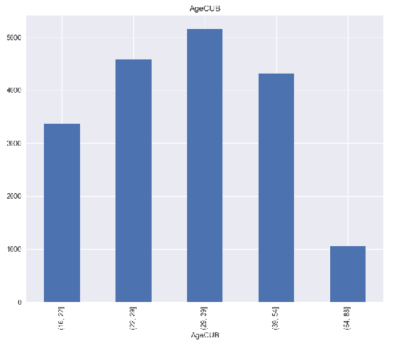

五个等高箱中的年龄分布

我答应解释为什么等高宁滨保存了尽可能多的信息。因此，我需要引入信息的度量，熵。


# 离散变量的熵

根据克劳德·E·香农的定义，在信息论中，信息是一种惊喜。惊喜来自多元化，而不是平等。考虑到数据，一个只能占据单一值的变量，实际上是一个常数，没有惊喜，没有信息。

无论你从数据集中随机选取什么情况，你都提前知道这个变量的值，你永远不会感到惊讶。为了包含至少一些信息，变量必须至少是二分法的，这意味着它必须包含至少两个不同的值。现在，假设你从数据集中随机抽取一个案例，但是你知道这个变量的总体分布。如果一种状态出现的频率更高，出现在 80%的案例中，那么你当然会想到这种状态。20%的时候你会感到惊讶。50%—50%的分布，无论你会期待哪种状态，都有一半的时间会感到惊讶。有了这样的分布，这个变量将拥有二分变量最大可能的信息量。

现在，让我们将第三种可能的状态添加到我们的虚构变量中，并想象这三种状态都具有相等的分布，或相等的概率，确切地说是 1/3-1/3-1/3。当你随机选择一个案例时，不管你期望的是哪一个状态，你会有三分之二的时间感到惊讶。有四种可能的状态，你甚至有 75%的几率会感到惊讶。你可以看到，随着更多不同的状态，最大可能的惊喜或信息增加了。然而，无论状态的数量是多少，当每个状态被相等地表示时，变量中的信息是最大的。现在你可以得出两个结论，如下:

*   通过离散化，您减少了不同状态的数量，从而也减少了变量中的信息
*   当在高度相等、概率相等的容器中进行离散化时，您会保留尽可能多的信息

**熵**是变量中信息的度量。单个状态的信息的香农公式是该状态的概率乘以该概率的以 2 为底的对数:

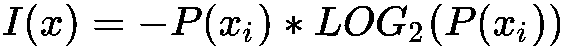

负号在这里是因为概率表示为 0 到 1 之间的小数，其中对数函数返回负值。变量的熵是存储在该变量所有状态中的信息的总和:

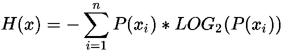

*n* 状态的最大可能熵简单如下:

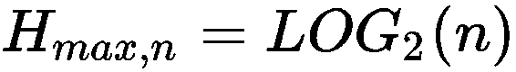

下面是一个 T-SQL 查询，它为几个不同数量的不同状态计算最大可能熵:

```sql
SELECT LOG(2,2) AS TwoStatesMax,
 LOG(3,2) AS ThreeStatesMax,
 LOG(4,2) AS FourStatesMax,
 LOG(5,2) AS FiveStatesMax;
```

结果如下:

```sql
TwoStatesMax  ThreeStatesMax    FourStatesMax       FiveStatesMax
------------  ----------------  ------------------  ----------------------
1             1.58496250072116  2                   2.32192809488736
```

已知特定数量状态的最大可能熵，您也可以通过简单地将实际熵除以该变量的最大可能熵来计算变量的**相对熵**。知道离散变量的熵对于知道连续变量的传播也是有用的。具有更多绝对熵和更多相对熵的变量对分析更有用。我想现在你明白为什么等高宁滨也有意义了。如果您没有自定义宁滨的实际逻辑，如果您不需要保留分布的形状，那么等高宁滨可能是正确的选择，因为宁滨带来的信息损失是最低的。

所以，让我们计算一下`CommuteDistance`变量的熵:

```sql
WITH ProbabilityCTE AS
(
SELECT CommuteDistance,
 COUNT(CommuteDistance) AS StateFreq
FROM dbo.vTargetMail
GROUP BY CommuteDistance
),
StateEntropyCTE AS
(
SELECT CommuteDistance,
 1.0*StateFreq / SUM(StateFreq) OVER () AS StateProbability
FROM ProbabilityCTE
)
SELECT 'CommuteDistance' AS Variable,
 (-1)*SUM(StateProbability * LOG(StateProbability,2)) AS TotalEntropy,
 LOG(COUNT(*),2) AS MaxPossibleEntropy,
 100 * ((-1)*SUM(StateProbability * LOG(StateProbability,2))) / 
 (LOG(COUNT(*),2)) AS PctOfMaxPossibleEntropy
FROM StateEntropyCTE;
```

查询的结果如下所示:

```sql
Variable        TotalEntropy    MaxPossibleEntropy PctOfMaxPossibleEntropy
--------------- --------------- ------------------ -----------------------
CommuteDistance 2.2379802017979 2.32192809488736   96.3845610346715
```

你可以看到这个变量对于分析来说有很好的分布。

在 Python 中，可以在`scipy`包中找到`stats.entropy()`函数。这就是我在本章开始时导入这个包的原因。然而，这个函数期望一系列状态概率作为参数，我必须提前计算这些概率。因此，我创建了自己的函数`f_entropy()`，作为这个内置函数的包装器:

```sql
def f_entropy(indata):
 indataprob = indata.value_counts() / len(indata) 
 entropy=sc.stats.entropy(indataprob, base = 2) 
 return entropy
```

现在我可以用我的函数来计算两个不同变量的熵值:

```sql
f_entropy(TM.NumberCarsOwned), np.log2(5), f_entropy(TM.NumberCarsOwned) / np.log2(5)
f_entropy(TM.BikeBuyer), np.log2(2), f_entropy(TM.BikeBuyer) / np.log2(2)
```

结果如下:

```sql
(2.0994297487400737,  2.3219280948873622, 0.9041751781042634)
(0.99989781003755662, 1.0,                0.99989781003755662)
```

你可以看到，尽管`NumbercarsOwned`变量具有更高的绝对熵，但是`BikieBuyer`变量具有更高的相对熵，几乎与两个不同状态的最大可能熵一样高。

在 R 中，你可以在 **DescTools** 包中找到一个计算熵的函数。该函数需要输入的计数，如以下代码所示:

```sql
install.packages("DescTools")
library("DescTools")
NCO = table(TM$NumberCarsOwned)
print(c(Entropy(NCO), log2(5), Entropy(NCO) / log2(5)))
BBT = table(TM$BikeBuyer)
print(c(Entropy(BBT), log2(2), Entropy(BBT) / log2(2)))
```

结果如下:

```sql
[1] 2.0994297 2.3219281 0.9041752
[1] 0.9998978 1.0000000 0.9998978
```

在实际项目中，您可能需要执行更多的数据准备任务。不可能在一章中涵盖所有的可能性。不过，在结束这一章之前，我想补充一堆高级话题。


# 高级数据准备主题

在本章的最后一节，我将讨论以下内容:

*   在 T-SQL 中使用**分组集**
*   使用`revoscalepy` Python 包中的`rx_data_step()`函数
*   在 R 中引入`dplyr`包


# T-SQL 中的高效分组和聚集

在第 1 章、*用 T-SQL 编写查询*中，我讨论了核心的 T-SQL SELECT 语句子句，并展示了如何分组和聚合数据。但是 SQL Server 有更多隐藏的瑰宝。也许您需要创建许多不同的分组和聚合。在 T-SQL 中，您可以使用`GROUPING SETS`子句来帮助自己。

您可以使用多个带有单个`GROUP BY`子句的`SELECT`语句对多个不同的分组变量创建聚合，然后您可以使用`UNION`子句将所有单独的结果集作为单个联合结果集返回。然而，您可以使用`GROUPING SETS`子句在单个查询中获得相同的结果。您可以为分组定义多组变量，并在每个分组集中定义多个不同的分组变量。SQL Server 可以分析该语句并最大限度地优化查询。这样，您可以获得非常高效的代码。请看下面的查询:

```sql
SELECT g.EnglishCountryRegionName AS Country,
 GROUPING(g.EnglishCountryRegionName) AS CountryGrouping,
 c.CommuteDistance,
 GROUPING(c.CommuteDistance) AS CommuteDistanceGrouping,
 STDEV(c.YearlyIncome) / AVG(c.YearlyIncome) 
 AS CVIncome
FROM dbo.DimCustomer AS c
 INNER JOIN dbo.DimGeography AS g
 ON c.GeographyKey = g.GeographyKey
GROUP BY GROUPING SETS
(
 (g.EnglishCountryRegionName, c.CommuteDistance),
```

```sql
(g.EnglishCountryRegionName),
 (c.CommuteDistance),
 ()
)
ORDER BY NEWID();
```

在一个查询中，我计算了不同国家和通勤距离、仅不同国家、仅不同通勤距离以及所有数据集的年收入的变异系数。我再次使用 ordering by `NEWID()`来打乱结果，在结果的顶部得到一些有趣的行:

```sql
Country   CountryGrouping CommuteDistance CommuteDistanceGrouping CVIncome
--------- --------------- --------------- ----------------------- -----
Germany   0               1-2 Miles       0                       0.38024260939205
Canada    0               2-5 Miles       0                       0.256495601560545
Australia 0               10+ Miles       0                       0.21006411302351
NULL      1               2-5 Miles       0                       0.485625821896517
France    0               NULL            1                       0.762738849203167
France    0               2-5 Miles       0                       0.742631239050475
NULL      1               5-10 Miles      0                       0.474036351026419
NULL      1               NULL            1                       0.563395924217412
```

正如您在查询中看到的，我还使用了`GROUPING()`函数。该函数告诉您某一列中是否存在空值，因为该行是该列原始数据中空值的聚合，或者这是否是某个其他变量的超聚合，其中该变量用作`GROUPING()`函数的参数没有意义。我从结果来解释一下这个。在结果的第一行，您可以看到这是德国的一个总量，通勤距离在 1 到 2 英里之间。第四行是从 2 到 5 英里通勤距离的集合；国家列中的空值是因为这是一个超级聚合，其中`country`没有意义。第五行显示了相反的情况—这是法国的合计，包括所有可能的通勤距离。注意这两行中`GROUPING()`函数的值。另外，看看我在这里显示的结果的最后一行。这是整个数据集的汇总，其中国家或通勤距离都没有任何意义。


# 利用 Python 中的微软可伸缩库

SQL Server 版和 Python 2017 版已经支持 r。因此，在 SQL Server 中 Python 比 R 落后一点是合乎逻辑的。从两种语言的可伸缩 Microsoft 库中支持的函数数量可以看出这一点。尽管有`revoscalepy`库，与`RevoScaleR`库相对应，但在 Python 版本中并不支持 R 库中的所有函数。例如，Python 版本中没有`rxHistogram()`函数。

在上述两个版本的库中，您可以找到一个非常强大的数据准备功能。R 版本叫`rxDataStep()`，Python 那个叫`rx_data_step()`。然而，Python one 并不支持 R one 的所有参数。举个例子，我正在做一个投影，用这个函数从目标邮件数据帧中只选择两列。请注意常规索引定位器`iloc()`函数过滤的行。使用`rx_dat_step()`进行过滤是 Python 中这个可扩展函数仍然不支持的任务的一个例子(截至 2018 年夏天)。代码如下:

```sql
from revoscalepy import rx_data_step
TM4 = rx_data_step(input_data=TM.iloc[0:3,], 
 vars_to_keep = {'CustomerKey', 'Age', 'AgeCUB'})
TM4
```

结果如下:

```sql
  Age  CustomerKey
0 31.0 11000.0
1 27.0 11001.0
2 32.0 11002.0
```

请注意，结果中的列顺序颠倒了。看起来该函数并不能保证保持输入数据框中各列的顺序。另外，请注意，整数输入列的数据类型在输出中变成了小数。如果只在 Python 代码中使用这个函数，这不是问题。你得到一个数据框，你有列名。但是，如果您在 SQL Server 的`sys.sp_execute_external_script`系统过程中调用这个函数，您需要知道输出列的确切顺序，以便在 SQL Server 中使用输出。您在该过程的`WITH RESULT SETS`子句中定义输出形状，其中输出列的顺序是固定的。我建议您显式地将`rx_data_step()`函数的输出转换为 pandas 数据框，在这里您还可以修改列顺序。您可以在下面的代码中看到如何做到这一点:

```sql
EXECUTE sys.sp_execute_external_script
@language =N'Python',
@script = N'
from revoscalepy import rx_data_step
import pandas as pd
OutputDataSet = rx_data_step(input_data=InputDataSet.iloc[0:3,],
 vars_to_keep = {"CustomerKey", "Age"})
OutputDataSet = pd.DataFrame(OutputDataSet, columns=["CustomerKey", "Age"])',
@input_data_1 = N'SELECT CustomerKey, Age, MaritalStatus FROM dbo.vTargetMail;'
WITH RESULT SETS (( CustomerKey INT, Age INT ));
GO
```

结果如下:

```sql
CustomerKey Age
----------- ---
11000       31
11001       27
11002       32
```

你可以看到这一次一切都井然有序。


# 在 R 中使用 dplyr 包

R 中最流行的数据准备包之一是`dplyr`包。这个包提供了一个非常一致、简单、易读和高效的语法。您使用函数处理数据，这些函数有点像 SQL 表达式。让我从数据集上的投影开始这个快速介绍。你可以通过`dplyr`包的`select()`功能来实现。但在此之前，我从 SQL Server 中读取的数据与之前略有不同，因为我希望客户的国家也在我的数据框中:

```sql
con <- odbcConnect("AWDW", uid = "RUser", pwd = "Pa$$w0rd")
TM <- as.data.frame(sqlQuery(con,
 "SELECT c.CustomerKey,
 g.EnglishCountryRegionName AS Country,
 c.EnglishEducation AS Education,
 c.YearlyIncome AS Income,
 c.NumberCarsOwned AS Cars,
 C.MaritalStatus,
 c.NumberChildrenAtHome
 FROM dbo.DimCustomer AS c
 INNER JOIN dbo.DimGeography AS g
 ON c.GeographyKey = g.GeographyKey;"),
 stringsAsFactors = TRUE)
close(con)
```

下面的代码安装并加载了`dplyr`包，然后在我刚刚读取的数据帧上做了一些投影:

```sql
install.packages("dplyr")
library(dplyr)
# Projection
head(TM)
head(select(TM, Income:MaritalStatus))
head(select(TM, - Income))
head(select(TM, starts_with("C")))
```

这里，我只是展示最后一行的结果:

```sql
  CustomerKey Country   Cars
1 11000       Australia 0
2 11001       Australia 1
3 11002       Australia 1
4 11003       Australia 1
5 11004       Australia 4
6 11005       Australia 1
```

您可以使用`filter()`功能过滤数据帧。这里有一个例子:

```sql
# All data frame has 18484 cases
count(TM)
# 2906 cases with more than 2 cars
count(filter(TM, Cars > 2))
```

你可以用`arrange()`函数对数据进行排序，如下面一行代码所示:

```sql
head(arrange(TM, desc(CustomerKey)))
```

管道操作符`(%>%)`是使代码真正高效的操作符。您通过管道将一个函数的输出传递给下一个函数的输入。将数据操作功能连接在一起的过程被称为**链接**。查看将 TM 数据帧传输到`select()`函数的以下代码，以及该函数的结果如何传输到过滤的输入，以及过滤的结果如何传输到计数计算的输入:

```sql
TM %>%
select(starts_with("C")) %>%
filter(Cars > 2) %>%
count
```

使用`mutate()`功能，您可以更改数据框。在下面的例子中，我过滤了数据框，然后添加了两个变量——一个二进制变量来显示这个人是否有伴侣，以及这个案例中家庭的总人数。然后我做一个投影，然后把行重新排序。最后，我将显示结果的前六行:

```sql
TM %>%
filter(Cars > 0) %>%
mutate(PartnerExists = as.integer(ifelse(MaritalStatus == 'S', 0, 1))) %>%
mutate(HouseHoldNumber = 1 + PartnerExists + NumberChildrenAtHome) %>%
select(CustomerKey, Country, HouseHoldNumber, Cars) %>%
arrange(desc(CustomerKey)) %>%
head
```

另一个可能的动作是聚集数据。您可以使用`summarise()`函数进行聚合，如以下代码所示:

```sql
TM %>%
filter(Cars > 0) %>%
mutate(PartnerExists = as.integer(ifelse(MaritalStatus == 'S', 0, 1))) %>%
mutate(HouseHoldNumber = 1 + PartnerExists + NumberChildrenAtHome) %>%
select(CustomerKey, Country, HouseHoldNumber, Cars) %>%
summarise(avgCars = mean(Cars),
 avgHouseHoldNumber = mean(HouseHoldNumber))
```

当然，您也可以使用`group_by()`函数进行分组聚合。下面的代码显示了所有的可能性，并将结果存储在一个名为`TM1`的新数据帧中:

```sql
TM1 =
TM %>%
filter(Cars > 0) %>%
mutate(PartnerExists = as.integer(ifelse(MaritalStatus == 'S', 0, 1))) %>%
mutate(HouseHoldNumber = 1 + PartnerExists + NumberChildrenAtHome) %>%
select(CustomerKey, Country, HouseHoldNumber, Cars) %>%
group_by(Country) %>%
summarise(avgCars = mean(Cars),
 avgHouseHoldNumber = mean(HouseHoldNumber)) %>%
arrange(desc(Country))
TM1
```

结果如下:

```sql
  Country        avgCars  avgHouseHoldNumber
  <fctr>         <dbl>    <dbl>
1 United States  1.894174 2.380048
2 United Kingdom 2.131072 3.586618
3 Germany        1.863793 3.042241
4 France         1.759346 2.474299
5 Canada         1.850362 2.570394
6 Australia      2.142679 2.839213
```

这是一段非常强大的代码。让我以图形方式向您展示代码的结果。我在散点图中展示了一个家庭的平均人数，以及每个国家的平均汽车数量。我没有使用基本的`plot()`函数，而是借助`car`包中的`scatterplot()`函数创建了一个更好的图形:

```sql
install.packages("car")
library(car)
scatterplot(avgCars ~ avgHouseHoldNumber | Country,
 data = TM1,
 xlab = "HouseHoldNumber Avg", ylab = "Cars Avg",
 main = "Enhanced Scatter Plot",
 cex = 3.5, lwd = 15,
 cex.lab = 1.3,
 xlim = c(2.2, 3.6), ylim = c(1.7, 2.2),
 col = c('red', 'blue', 'green', 'black', 'orange', 'magenta'),
 boxplot = 'xy')
```

您可以在下面的屏幕截图中看到用该代码创建的图形:

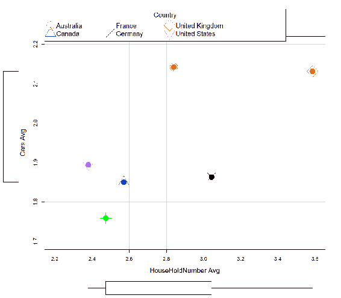

一个家庭的平均人数和每个国家的平均汽车数量

在结束这一章之前，让我补充一点，你可以找到一些额外的例子，在我在这本书中使用的所有三种语言中，在与这本书相关的代码中。


# 摘要

这是相当长的一章。然而，这一章仍然只是触及了数据准备可能出现的问题的表面。请记住，在现实生活的项目中，您将大部分时间花在不那么有趣的部分:数据准备和数据概述。

在本章中，您学习了数据准备的基础知识，包括处理缺失值、处理名义变量、离散化连续变量的不同方法以及如何测量离散变量的熵。最后，您了解了在 T-SQL、Python 和 r 中执行数据操作的一些有效方法。

这本书的最后三章是关于介绍真正的数据分析。我将从中级统计方法开始，探索变量之间的关联，并使用更高级的图表。


# 发现连续变量和离散变量之间的关联

发现和测量关联强度的最后一种可能性是连续变量和离散变量之间的相关性。我先举个例子。在我使用的数据集中，来自`AdventureWorksDW2017`演示数据库的`dbo.vTargetMail`视图，我有显示每个人的职业和收入的变量。你可能会认为这两个变量之间存在某种联系——一些职业的平均收入和中值收入较高，一些较低。然而，数据中可能隐藏着一个惊喜。想象一下，对于一个优秀的篮球运动员，一个 NBA 球星，有人会把他们的职业标为`skilled manual`。通过比较职业的平均收入，你可能会错误地得出结论，你需要去找一份需要技能的体力工作，以获得尽可能高的收入。但是在这种情况下，熟练体力劳动者和其他职业之间的平均收入差异来自熟练体力劳动者群体内部的差异，而不是群体之间收入的差异。因此，我们需要知道如何测量这两个可变性并对它们进行比较，以获得对数据更真实的了解。

我一般从 T-SQL 开始，然后切换到 R，再到 Python。这一次，我想从一个连续变量的均值和一个离散变量的均值的差异的图示开始。我从 Python 开始。下面的代码创建了一个名为箱线图的图表，用于分析不同教育级别的收入:

```sql
sns.boxplot(x = 'Occupation', y = 'Income', 
 data = TM)
plt.show()
```

下面是用前面的代码创建的图表:

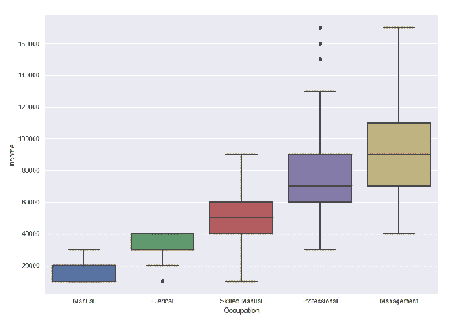

图 6.4:职业类别收入箱线图

最后三个方框中的中间线代表特定职业类别的收入中位数。对于左边的两个类，中间值可能与一条水平边框线重合。每个框的上边框是第三个四分位数位置的值，下边框是第一个四分位数位置的值。盒子的高度显示了四分位数之间的范围。每个方框上方和下方的水平线与方框边界的垂直线相连，是常规值的估计界限。这些水平线也被称为栅栏或胡须。默认情况下，它们位于框边框上方或下方 IQR 的 1.5 倍处。围栏外的点是潜在的异常值。

另一个对连续变量在离散变量类中的分布的很好的展示是`violinplot`。它告诉你箱线图的所有信息，此外，它还显示了连续变量在离散变量类中的分布形状。下面的曲线图显示了职业阶层的年龄分布:

```sql
sns.violinplot(x = 'Occupation', y = 'Age',
 data = TM, kind = 'box', size = 8)
 plt.show()
```

创建的图表如下所示:

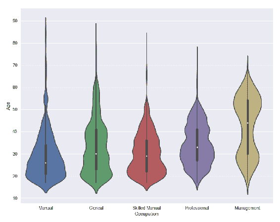

图 6.5:职业类别中的年龄分布图

您可以在与本章相关的附加代码中找到更多示例。现在，让我们从图形切换到数字，从 Python 切换到 T-SQL。我将介绍一种叫做**方差分析**，或 **ANOVA** 的统计方法。我在这里介绍这种分析的一个非常简单但是有用的版本，也叫做**单向 ANOVA** 。

我需要计算组间方差，通常记为*MS[A]。它被定义为组平均值与总平均值偏差的平方和，然后乘以每组中元素或案例的数量。自由度数等于组数，通常用字母 *a* 标注，减一。公式如下:*


公式元素的含义如下:

*   MS [A] 是组间方差。
*   SS [A] 是组平均值与总平均值偏差的平方和。
*   DF [A] 是组间自由度的数量。
*   n [i] 是第 i ^个组的病例数。
*   a 是组数。
*   是整体的平均值。
*   [i] 是离散变量的第 i ^组中的均值。
*   组内的方差 MS [E] 通过单个值与组平均值的偏差平方和计算得出。下一步是总结所有组的这些方块。每组的自由度是每组中的案例数减 1，总自由度数是各组自由度的总和。这是一个相当复杂的公式:

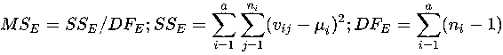

公式元素的含义如下:

*   MS [E] 是组内方差
*   SS [A] 是组内偏差的平方和
*   DF [E] 是组内自由度的总和
*   a 是组的数量
*   n [i] 是第 i ^个组的病例数
*   v [ij] 是第 i ^第组中第 j ^第例的变量值
*   [i] 是离散变量的第 i ^组的平均值

完成这些计算后，您可以使用以下公式计算 **F 比率**:

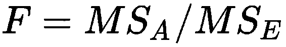

*F* 值告诉你这两个变量是否相关联。如果是，那么连续变量的均值在离散变量组中的差异来自于组间的差异，否则来自于组内的差异。您可以从 F 值表或免费的网络计算器中读取 *F* 值的显著性和概率以及您计算的自由度。这里，再一次，只是一个例子，你可以在这里检查你得到的 F 值:【http://www.socscistatistics.com/pvalues/fdistribution.aspx。下面是计算刚才解释的所有值的 T-SQL 代码:

```sql
WITH Anova_CTE AS
(
SELECT EnglishOccupation, Age,
 COUNT(*) OVER (PARTITION BY EnglishOccupation) AS gr_CasesCount,
 DENSE_RANK() OVER (ORDER BY EnglishOccupation) AS gr_DenseRank,
 SQUARE(AVG(Age) OVER (PARTITION BY EnglishOccupation) -
 AVG(Age) OVER ()) AS between_gr_SS,
 SQUARE(Age - 
 AVG(Age) OVER (PARTITION BY EnglishOccupation)) 
 AS within_gr_SS
FROM dbo.vTargetMail
) 
SELECT N'Between groups' AS [Source of Variation],
 SUM(between_gr_SS) AS SS,
 (MAX(gr_DenseRank) - 1) AS df,
 SUM(between_gr_SS) / (MAX(gr_DenseRank) - 1) AS MS,
 (SUM(between_gr_SS) / (MAX(gr_DenseRank) - 1)) /
 (SUM(within_gr_SS) / (COUNT(*) - MAX(gr_DenseRank))) AS F
FROM Anova_CTE
UNION 
SELECT N'Within groups' AS [Source of Variation],
 SUM(within_gr_SS) AS SS,
```

```sql
 (COUNT(*) - MAX(gr_DenseRank)) AS df,
 SUM(within_gr_SS) / (COUNT(*) - MAX(gr_DenseRank)) AS MS,
 NULL AS F
FROM Anova_CTE;
```

这段代码的结果如下:

```sql
Source of Variation SS      df    MS F
------------------- ------- ----- ---------------- ----------------------
Between groups      333932  4     83483            732.90193767293
Within groups       2104896 18479 113.907462525028 NULL
```

如果你使用我提到的网站，你可以看到这是一个相当大的 F 值，显著水平低于 0.01，这意味着你可以安全地拒绝零假设，说年龄和职业是相关的。

是时候切换到 R 了，R 中的代码比 T-SQL 中的代码要短很多。我首先显示通勤距离组中收入的平均值，然后使用基本安装的`aov()`函数进行方差分析，然后显示结果:

```sql
aggregate(TM$Income, by = list(TM$CommuteDistance), FUN = mean)
AssocTest <- aov(TM$Income ~ TM$CommuteDistance)
summary(AssocTest)
```

下面是 R 代码的结果:

```sql
  Group.1    x
1 0-1 Miles  49660.86
2 1-2 Miles  50043.32
3 2-5 Miles  57857.14
4 5-10 Miles 62380.21
5 10+ Miles  78805.13
                   Df    Sum Sq    Mean Sq   F value Pr(>F) 
TM$CommuteDistance 4     1.776e+12 4.439e+11 469     <2e-16 ***
Residuals          18479 1.749e+13 9.465e+08 
```

可以看到收入也和通勤距离有关联。显然，收入较高的人住在郊区，离他们工作的地方相当远。你也可以在下图中看到这一点，为此我使用了`gplots`包中的`plotmeans()`函数。该软件包通常是预安装的，因此只有在您还没有安装它的情况下才应该安装它:

```sql
# install.packages("gplots")
library(gplots)
plotmeans(TM$Income ~ TM$CommuteDistance,
 bars = TRUE, p = 0.99, barwidth = 3,
 col = "red", lwd = 3,
 main = "Yearly Income in Groups",
 ylab = "Yearly Income",
 xlab = "Commute Distance")
```

这是图表:

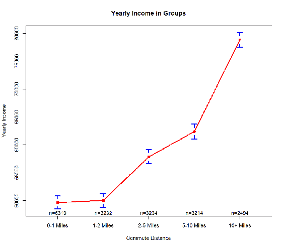

图 6.6:通勤距离组的收入均值

下一步是用一个公式来表达一个关联，在这个公式中，您将一个因变量定义为一个或多个自变量的函数。我会在本章最后一节给你看线性回归公式计算。