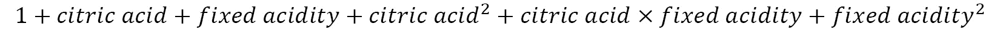
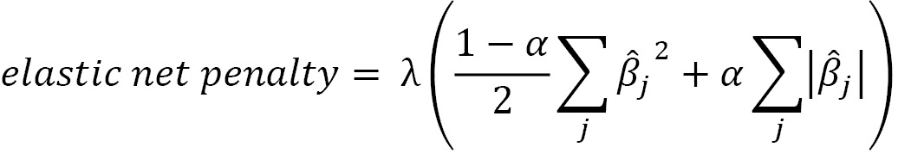

# 十、做出更好的预测——优化模型

在前一章，我们学习了如何建立和评估我们的机器学习模型。然而，我们没有触及如果我们想提高他们的表现，我们能做些什么。当然，我们可以尝试不同的模型，看看它是否表现得更好——除非出于法律原因或者为了能够解释它是如何工作的，我们需要使用特定的方法。我们希望确保我们使用的是尽可能最好的模型版本，为此，我们需要讨论如何调整我们的模型。

本章将介绍使用`scikit-learn`优化机器学习模型性能的技术，作为 [*第 9 章*](B16834_09_Final_SK_ePub.xhtml#_idTextAnchor188) 、*Python 机器学习入门*中内容的延续。尽管如此，应该指出，没有灵丹妙药。完全有可能尝试我们能想到的一切，仍然有一个预测价值不大的模型；这就是模特的本质。

但是不要气馁——如果模型不起作用，考虑收集的数据是否足以回答问题，以及选择的算法是否适合手头的任务。通常，在建立机器学习模型时，主题专业知识将被证明是至关重要的，因为它有助于我们确定哪些数据点是相关的，以及利用收集的变量之间的已知交互。

具体而言，将涵盖以下主题:

*   网格搜索超参数调优
*   特征工程
*   结合多种估计量的建筑集成模型
*   检验分类预测置信度
*   解决阶级不平衡问题
*   用正则化惩罚高回归系数

# 章节材料

在本章中，我们将使用三个数据集。前两个来自 P. Cortez、A. Cerdeira、F. Almeida、T. Matos 和 J. Reis 捐赠给 UCI 机器学习数据库([http://archive.ics.uci.edu/ml/index.php](http://archive.ics.uci.edu/ml/index.php))的葡萄酒质量数据，包含各种葡萄酒样品的化学性质信息，以及葡萄酒专家小组盲品会议的质量评级。这些文件可以在 GitHub 资源库([https://GitHub . com/stef molin/Hands-On-Data-Analysis-with-Pandas-2nd-edition/tree/master/ch _ 10](https://github.com/stefmolin/Hands-On-Data-Analysis-with-Pandas-2nd-edition/tree/master/ch_10))的本章文件夹内的`data/`文件夹中找到，分别作为红葡萄酒和白葡萄酒的`winequality-red.csv`和`winequality-white.csv`。

我们的第三个数据集是使用开放的系外行星目录数据库收集的，该数据库位于[https://github . com/OpenExoplanetCatalogue/Open _ exo planet _ Catalogue/](https://github.com/OpenExoplanetCatalogue/open_exoplanet_catalogue/)，以 XML 格式提供数据。解析后的行星数据可以在`data/planets.csv`文件中找到。对于练习，我们还将使用来自 [*第 9 章*](B16834_09_Final_SK_ePub.xhtml#_idTextAnchor188) 、*Python 中的机器学习入门*的恒星温度数据，这些数据可以在`data/stars.csv`文件中找到。

作为参考，使用了以下数据源:

*   *开放系外行星目录数据库*，可在[https://github . com/openexoplanetocatalogue/Open _ exo planet _ Catalogue/# data-structure](https://github.com/OpenExoplanetCatalogue/open_exoplanet_catalogue/#data-structure)获得。
*   p .科尔特斯、a .塞尔代拉、f .阿尔梅达、t .马托斯和 j .雷伊斯。通过物理化学特性的数据挖掘建立葡萄酒偏好模型。在决策支持系统中，Elsevier，47(4):547-553，2009。可在 http://archive.ics.uci.edu/ml/datasets/Wine+Quality[在线购买](http://archive.ics.uci.edu/ml/datasets/Wine+Quality)。
*   *Dua d .和 Karra Taniskidou e .(2017 年)。UCI 机器学习知识库(*【http://archive.ics.uci.edu/ml/index.php】T2*)。加州欧文:加州大学信息与计算机科学学院。*

我们将使用`red_wine.ipynb`笔记本来预测红酒的质量，`wine.ipynb`笔记本根据红酒和白酒的化学性质来区分它们，而`planets_ml.ipynb`笔记本将建立一个回归模型来预测以地球日为单位的行星年长度。

在开始之前，让我们处理我们的导入并读入我们的数据:

```py
>>> %matplotlib inline
>>> import matplotlib.pyplot as plt
>>> import numpy as np
>>> import pandas as pd
>>> import seaborn as sns
>>> planets = pd.read_csv('data/planets.csv') 
>>> red_wine = pd.read_csv('data/winequality-red.csv')
>>> white_wine = \
...     pd.read_csv('data/winequality-white.csv', sep=';') 
>>> wine = pd.concat([
...     white_wine.assign(kind='white'),
...     red_wine.assign(kind='red')
... ])
>>> red_wine['high_quality'] = pd.cut(
...     red_wine.quality, bins=[0, 6, 10], labels=[0, 1]
... )
```

让我们也为红酒质量、按化学性质划分的葡萄酒类型和行星模型创建我们的训练和测试集:

```py
>>> from sklearn.model_selection import train_test_split
>>> red_y = red_wine.pop('high_quality')
>>> red_X = red_wine.drop(columns='quality')
>>> r_X_train, r_X_test, \
... r_y_train, r_y_test = train_test_split(
...     red_X, red_y, test_size=0.1, random_state=0,
...     stratify=red_y
... )
>>> wine_y = np.where(wine.kind == 'red', 1, 0)
>>> wine_X = wine.drop(columns=['quality', 'kind'])
>>> w_X_train, w_X_test, \
... w_y_train, w_y_test = train_test_split(
...     wine_X, wine_y, test_size=0.25, 
...     random_state=0, stratify=wine_y
... )
>>> data = planets[
...     ['semimajoraxis', 'period', 'mass', 'eccentricity']
... ].dropna()
>>> planets_X = data[
...     ['semimajoraxis', 'mass', 'eccentricity']
... ]
>>> planets_y = data.period
>>> pl_X_train, pl_X_test, \
... pl_y_train, pl_y_test = train_test_split(
...     planets_X, planets_y, test_size=0.25, random_state=0
... )
```

重要说明

请记住，我们将在每个数据集的专用笔记本中工作，因此，虽然设置代码都在同一个代码块中，以便在书中更容易理解，但请确保在笔记本中工作时与所讨论的数据相对应。

# 使用网格搜索进行超参数调优

毫无疑问，您已经注意到，当我们实例化模型类时，我们可以为它们提供各种参数。这些模型参数并非来自数据本身，而是被称为**超参数**。其中的一些例子是正则化项，我们将在本章后面的中讨论，以及权重。通过**模型调整**的过程，我们试图通过调整这些超参数来优化我们模型的性能。

我们如何知道我们选择了最佳值来优化模型的性能？一种方法是使用一种叫做**网格搜索**的技术来调整这些超参数。网格搜索允许我们定义一个搜索空间，并测试该空间中超参数的所有组合，保留产生最佳模型的组合。我们定义的评分标准将决定最佳模型。

还记得我们在*第九章*、*Python 中的机器学习入门*中讨论的肘点法，用于在 k-means 聚类中为 *k* 寻找一个好的值吗？我们可以采用类似的视觉方法来寻找超参数的最佳值。这将涉及将我们的训练数据分成**训练**和**验证集**。我们需要为模型的最终评估保存测试集，因此在搜索超参数的最佳值时，我们使用验证集来测试我们的每个模型。再次重申，验证集和测试集是不同的——它们必须是不相交的数据集。这个拆分可以用`train_test_split()`来完成。这里，我们将使用红酒质量数据集:

```py
>>> from sklearn.model_selection import train_test_split
>>> r_X_train_new, r_X_validate,\
... r_y_train_new, r_y_validate = train_test_split(
...     r_X_train, r_y_train, test_size=0.3, 
...     random_state=0, stratify=r_y_train
... )
```

然后，我们可以为我们想要测试的所有超参数值多次构建模型，并根据对我们最重要的指标对它们进行评分。让我们试着为`C`找到一个好的值，正则化强度的倒数，它决定了逻辑回归的惩罚项的权重，并在本章末尾的*正则化*部分进行了更深入的讨论；我们调整这个超参数以减少过度拟合:

```py
>>> from sklearn.linear_model import LogisticRegression
>>> from sklearn.metrics import f1_score
>>> from sklearn.pipeline import Pipeline
>>> from sklearn.preprocessing import MinMaxScaler
# we will try 10 values from 10^-1 to 10^1 for C
>>> inv_regularization_strengths = \
...     np.logspace(-1, 1, num=10)
>>> scores = []
>>> for inv_reg_strength in inv_regularization_strengths:
...     pipeline = Pipeline([
...         ('scale', MinMaxScaler()),
...         ('lr', LogisticRegression(
...             class_weight='balanced', random_state=0,
...             C=inv_reg_strength
...         ))
...     ]).fit(r_X_train_new, r_y_train_new)
...     scores.append(f1_score(
...         pipeline.predict(r_X_validate), r_y_validate
...     ))
```

小费

这里，我们使用`np.logspace()`来获得我们的值范围，以尝试`C`。为了使用这个函数，我们提供了起始指数和终止指数来使用一个基数(默认为 10)。所以`np.logspace(-1, 1, num=10)`给了我们 10 个在 10-1 和 101 之间等间距的数字。

这是,然后绘制如下:

```py
>>> plt.plot(inv_regularization_strengths, scores, 'o-')
>>> plt.xscale('log')
>>> plt.xlabel('inverse of regularization strength (C)')
>>> plt.ylabel(r'$F_1$ score')
>>> plt.title(
...     r'$F_1$ score vs. '
...     'Inverse of Regularization Strength'
... )
```

使用结果图，我们可以选择使我们的性能最大化的值:


图 10.1-搜索最佳超参数

Scikit-learn 在`model_selection`模块中提供了`GridSearchCV`类，用于更容易地执行这种穷举搜索。以 *CV* 结尾的类利用**交叉验证**，这意味着它们将训练数据划分为子集，其中一些将成为对模型评分的验证集(在模型拟合之前不需要测试数据)。

一种常见的交叉验证方法是 **k 重交叉验证**，它将训练数据分成 *k 个*子集，并将训练模型 *k 次*，每次留下一个子集作为验证集。模型的分数将是所有 *k* 个验证集的平均值。我们最初的尝试是一折交叉验证。当 *k* =3 时，该过程如下图所示:


图 10.2–理解 k 倍交叉验证

小费

在处理分类问题时，`scikit-learn`将实现分层 k-fold 交叉验证。这确保了属于每个类别的样本的百分比将跨折叠被保留。如果没有分层，一些验证集可能会看到给定类的不相称的低(或高)量，这可能会扭曲结果。

`GridSearchCV`使用交叉验证在搜索空间中寻找最佳超参数，无需使用测试数据。请记住，测试数据不应该以任何方式影响训练过程——无论是在训练模型时还是在调整超参数时——否则，模型将出现泛化问题。发生这种情况是因为我们会选择在测试集上给出最佳性能的超参数，因此无法对看不见的数据进行测试，并且高估了我们的性能。

为了使用`GridSearchCV`，我们需要提供一个模型(或管道)和一个搜索空间，这将是一个字典，将要调整的超参数(按名称)映射到要尝试的值列表。或者，我们可以提供一个评分标准，以及交叉验证使用的折叠数。我们可以调优管道中的任何步骤，方法是在超参数名称前面加上该步骤的名称，后面加上两个下划线。例如，如果我们有一个名为`lr`的逻辑回归步骤，并且想要调优`C`，我们使用`lr__C`作为搜索空间字典中的关键字。注意，如果我们的模型有任何预处理步骤，我们必须使用管道。

让我们使用`GridSearchCV`进行红酒质量逻辑回归，搜索是否用截距和正则化强度的倒数的最佳值(`C`)来拟合我们的模型。我们将使用 F1 分数的宏观平均值作为评分标准。注意，由于 API 的一致性，`GridSearchCV`可用于评分、拟合和预测，方法与底层模型相同。默认情况下，网格搜索将串行运行，但是`GridSearchCV`能够并行执行多个搜索，大大加快了这个过程:

```py
>>> from sklearn.linear_model import LogisticRegression
>>> from sklearn.model_selection import GridSearchCV
>>> from sklearn.pipeline import Pipeline
>>> from sklearn.preprocessing import MinMaxScaler
>>> pipeline = Pipeline([
...     ('scale', MinMaxScaler()),
...     ('lr', LogisticRegression(class_weight='balanced',
...                               random_state=0))
... ])
>>> search_space = {
...     'lr__C': np.logspace(-1, 1, num=10),
...     'lr__fit_intercept': [True, False]
... }
>>> lr_grid = GridSearchCV(
...     pipeline, search_space, scoring='f1_macro', cv=5
... ).fit(r_X_train, r_y_train)
```

一旦网格搜索完成，我们可以用`best_params_`属性从搜索空间中分离出最佳超参数。请注意，该结果不同于我们的 1 倍交叉验证尝试，因为每个折叠都被平均在一起，以找到整体的最佳超参数，而不仅仅是单个折叠的最佳超参数:

```py
# best values of `C` and `fit_intercept` in search space
>>> lr_grid.best_params_
{'lr__C': 3.593813663804626, 'lr__fit_intercept': True}
```

小费

我们还可以使用`best_estimator_`属性从网格搜索中检索管道的最佳版本。如果我们想看到最佳评估者(模型)的分数，我们可以从`best_score_`属性中获取它；注意，这将是我们用`scoring`参数指定的分数。

我们的 F1 分数宏观平均值现在高于我们在*第 9 章*、*Python 机器学习入门*中获得的分数:

```py
>>> from sklearn.metrics import classification_report
>>> print(classification_report(
...     r_y_test, lr_grid.predict(r_X_test)
... ))
              precision    recall  f1-score   support
           0       0.94      0.80      0.87       138
           1       0.36      0.68      0.47        22
    accuracy                           0.79       160
   macro avg       0.65      0.74      0.67       160
weighted avg       0.86      0.79      0.81       160
```

请注意，`cv`参数不一定是整数——如果我们想使用除默认的 k-fold 回归或分层 k-fold 分类之外的方法，我们可以提供在[https://scikit-learn . org/stable/modules/classes . html # splitter-classes](https://scikit-learn.org/stable/modules/classes.html#splitter-classes)中提到的一个 splitter 类。例如，当处理时间序列时，我们可以使用`TimeSeriesSplit`作为交叉验证对象来处理连续的样本并避免混淆。Scikit-learn 展示了交叉验证类在[https://sci kit-learn . org/stable/auto _ examples/model _ selection/plot _ cv _ indexes . html](https://scikit-learn.org/stable/auto_examples/model_selection/plot_cv_indices.html)的比较情况。

让我们在红酒质量模型上测试 out `RepeatedStratifiedKFold`而不是默认的`StratifiedKFold`，默认情况下会重复分层 k 折交叉验证 10 次。我们所要做的就是把我们在第一个`GridSearchCV`例子中作为`cv`传入的东西变成一个`RepeatedStratifiedKFold`对象。请注意，尽管使用相同的渠道、搜索空间和评分标准，但我们对`best_params_`有不同的值，因为我们的交叉验证流程已经改变:

```py
>>> from sklearn.model_selection import RepeatedStratifiedKFold
>>> lr_grid = GridSearchCV(
...     pipeline, search_space, scoring='f1_macro', 
...     cv=RepeatedStratifiedKFold(random_state=0)
... ).fit(r_X_train, r_y_train)
>>> print('Best parameters (CV score=%.2f):\n    %s' % (
...     lr_grid.best_score_, lr_grid.best_params_
... )) # f1 macro score
Best parameters (CV score=0.69): 
    {'lr__C': 5.994842503189409, 'lr__fit_intercept': True}
```

除了交叉验证之外，`GridSearchCV`还允许我们用`scoring`参数指定我们想要优化的指标。这可以是分数名称的字符串(与前面的代码块一样)，前提是它在[https://sci kit-learn . org/stable/modules/model _ evaluation . html # common-cases-predefined-values](https://scikit-learn.org/stable/modules/model_evaluation.html#common-cases-predefined-values)的列表中；否则，我们要么传递函数本身，要么使用来自`sklearn.metrics`的`make_scorer()`函数创建自己的函数。我们甚至可以为网格搜索提供一个计分器字典(以`{name: function}`的形式)，只要我们通过将它的名称传递给`refit`参数来指定我们想要使用哪个计分器进行优化。因此，我们可以使用网格搜索来找到超参数，帮助我们最大限度地提高上一章讨论的指标的性能。

重要说明

训练我们的模型所需的时间也应该是我们评估和寻求优化的内容。如果我们多花一倍的训练时间去得到一个正确的分类，那可能是不值得的。如果我们有一个名为`grid`的`GridSearchCV`对象，我们可以通过运行`grid.cv_results_['mean_fit_time']`来查看平均拟合时间。

我们可以使用`GridSearchCV`来搜索管道中任何一步的最佳参数。例如，让我们使用网格搜索，对行星数据进行预处理和线性回归(类似于我们在*第 9 章*、*Python 机器学习入门*中建模行星年长度)，同时最小化**平均绝对误差** ( **MAE** )而不是默认的 R2:

```py
>>> from sklearn.linear_model import LinearRegression
>>> from sklearn.metrics import \
... make_scorer, mean_squared_error
>>> from sklearn.model_selection import GridSearchCV
>>> from sklearn.pipeline import Pipeline
>>> from sklearn.preprocessing import StandardScaler
>>> model_pipeline = Pipeline([
...     ('scale', StandardScaler()),
...     ('lr', LinearRegression())
... ])
>>> search_space = {
...     'scale__with_mean': [True, False],
...     'scale__with_std': [True, False],
...     'lr__fit_intercept': [True, False], 
...     'lr__normalize': [True, False]
... }
>>> grid = GridSearchCV(
...     model_pipeline, search_space, cv=5,
...     scoring={
...         'r_squared': 'r2',
...         'mse': 'neg_mean_squared_error',
...         'mae': 'neg_mean_absolute_error',
...         'rmse': make_scorer(
... lambda x, y: \
... -np.sqrt(mean_squared_error(x, y))
... )
...     }, refit='mae'
... ).fit(pl_X_train, pl_y_train)
```

请注意我们使用了除 R2 之外的所有指标的负值。这是因为`GridSearchCV`将试图最大化分数，而我们想要最小化我们的错误。让我们检查该网格中用于缩放和线性回归的最佳参数:

```py
>>> print('Best parameters (CV score=%.2f):\n%s' % (
...     grid.best_score_, grid.best_params_
... )) # MAE score * -1
Best parameters (CV score=-1215.99):
{'lr__fit_intercept': False, 'lr__normalize': True, 
 'scale__with_mean': False, 'scale__with_std': True}
```

调整后的模型的 MAE 比我们在*第 9 章*、*Python 机器学习入门*中得到的 MAE 小了 120 多个地球日:

```py
>>> from sklearn.metrics import mean_absolute_error
>>> mean_absolute_error(pl_y_test, grid.predict(pl_X_test))
1248.3690943844194
```

重要的是要注意，虽然一个模型可以快速训练，我们不应该创建一个大的，粒度搜索空间；实际上，最好从几个不同的展开值开始，然后检查结果，看看哪些区域需要更深入的搜索。例如，假设我们希望调整`C`超参数。在我们的第一遍中，我们可以看看`np.logspace(-1, 1)`的结果。如果我们看到`C`的最佳值位于光谱的两端，那么我们可以查看高于/低于该值的值。如果最佳值在该范围内，我们可以看看它周围的几个值。这个过程可以反复执行，直到我们看不到额外的改进。或者，我们可以使用`RandomizedSearchCV`，它将在搜索空间中尝试 10 种随机组合(默认情况下)，并找到最佳估计值(模型)。我们可以用`n_iter`参数改变这个数字。

重要说明

因为调整超参数的过程需要我们多次训练我们的模型，所以我们必须考虑我们的模型的时间复杂性。需要长时间训练的模型在交叉验证中使用起来会非常昂贵。这可能会导致我们缩小搜索空间。

# 特色工程

当试图提高性能时，我们也可以考虑种方法，通过**特征工程**的过程，为我们的模型提供最好的**特征**(模型输入)。*第 9 章*、*Python 机器学习入门*中的*预处理数据*部分，在我们缩放、编码和估算数据时，向我们介绍了**特征转换**。不幸的是，特征变换可能会屏蔽掉我们想要在模型中使用的一些数据元素，例如特定特征的平均值的未缩放值。对于这种情况，我们可以用这个值创建一个新的特性；在**特征构建**过程中添加该特征和其他新特征(有时称为**特征创建**)。

**特征选择**是确定在哪些特征上训练模型的过程。这可以手动完成，也可以通过另一个过程完成，比如机器学习。当希望为我们的模型选择特性时，我们希望特性对我们的因变量有影响，而不会不必要地增加我们问题的复杂性。用许多特征构建的模型增加了复杂性，但不幸的是，也更倾向于适应噪声，因为我们的数据在这样的高维空间中是稀疏的。这被称为**维度诅咒**。当一个模型学习了训练数据中的噪声，它将很难推广到看不见的数据；这叫做**过拟合**。通过限制模型使用的特征数量，特征选择可以帮助解决过度拟合问题。

**特征提取**是我们可以解决维数灾难的另一种方法。在特征提取过程中，我们通过转换构建特征组合来降低数据的维数。这些新的特征可以用来代替原来的特征，从而减少了问题的维度。这个过程被称为**降维**，也包括一些技术，在这些技术中，我们找到了一定数量的成分(少于原始成分)来解释数据中的大部分差异。特征提取经常用于图像识别问题，因为任务的维数是图像中像素的总数。例如，网站上的方形广告是 350x350 像素(这是最常见的尺寸之一)，因此使用该尺寸图像的图像识别任务有 122，500 个维度。

小费

彻底的 EDA 和领域知识是特征工程的必要条件。

特征工程是整本书的主题；然而，由于这是一个更高级的主题，我们将在这一部分只讨论一些技术。在*进一步阅读*部分有一本关于这个主题的好书，其中也提到了使用机器学习进行特征学习。

## 交互项和多项式特征

我们在*第 9 章*、*Python 机器学习入门*的*预处理数据*部分讨论了虚拟变量的使用；然而，我们仅仅考虑了变量本身的影响。在我们试图用化学性质预测红酒质量的模型中，我们分别考虑每种性质。然而，重要的是要考虑这些属性之间的相互作用是否有影响。也许当柠檬酸和固定酸度的水平都很高或都很低时，葡萄酒的质量与一个高一个低是不同的。为了捕捉这种效果，我们需要添加一个**交互术语**，它将是特性的产物。

我们也可能对通过特征构造增加模型中特征的效果感兴趣；我们可以通过添加由该特征制成的**多项式特征**来实现这一点。这涉及到添加更高程度的原始特征，因此我们可以在模型中使用*柠檬酸*、*柠檬酸* 2、*柠檬酸* 3 等等。

小费

我们可以通过使用相互作用项和多项式特征来概括线性模型，因为它们允许我们对非线性项的线性关系进行建模。由于线性模型在存在多个或非线性决策边界(分隔类的表面或超表面)时往往表现不佳，因此这可以提高性能。

Scikit-learn 在`preprocessing`模块中提供了`PolynomialFeatures`类，用于轻松创建交互项和多项式特性。这在构建具有分类和连续特征的模型时非常方便。通过只指定度数，我们可以得到小于或等于度数的特性的每个组合。高度数将大大增加模型的复杂性，并可能导致过度拟合。

如果我们使用`degree=2`，我们可以将*柠檬酸*和*固定酸度*变成如下，其中 *1* 是可以在模型中用作截距项的偏差项:



通过调用`PolynomialFeatures`对象上的`fit_transform()`方法，我们可以生成这些特性:

```py
>>> from sklearn.preprocessing import PolynomialFeatures
>>> PolynomialFeatures(degree=2).fit_transform(
...     r_X_train[['citric acid', 'fixed acidity']]
... )
array([[1.000e+00, 5.500e-01, 9.900e+00, 3.025e-01, 
 5.445e+00, 9.801e+01],
       [1.000e+00, 4.600e-01, 7.400e+00, 2.116e-01, 
        3.404e+00, 5.476e+01],
       [1.000e+00, 4.100e-01, 8.900e+00, 1.681e-01, 
        3.649e+00, 7.921e+01],
       ...,
       [1.000e+00, 1.200e-01, 7.000e+00, 1.440e-02, 
        8.400e-01, 4.900e+01],
       [1.000e+00, 3.100e-01, 7.600e+00, 9.610e-02, 
        2.356e+00, 5.776e+01],
       [1.000e+00, 2.600e-01, 7.700e+00, 6.760e-02, 
        2.002e+00, 5.929e+01]])
```

让我们分析一下前面代码块中数组的第一行(用粗体突出显示),以了解我们是如何获得这些值的:


图 10.3-检查创建的交互项和多项式特征

如果我们只对相互作用变量感兴趣(*柠檬酸×固定酸度*，这里可以指定`interaction_only=True`)。在这种情况下，我们也不想要偏差项，所以我们也指定`include_bias=False`。这将为我们提供原始变量及其相互作用项:

```py
>>> PolynomialFeatures(
...     degree=2, include_bias=False, interaction_only=True
... ).fit_transform(
...     r_X_train[['citric acid', 'fixed acidity']]
... )
array([[0.55 , 9.9  , 5.445],
       [0.46 , 7.4  , 3.404],
       [0.41 , 8.9  , 3.649],
       ...,
       [0.12 , 7\.   , 0.84 ],
       [0.31 , 7.6  , 2.356],
       [0.26 , 7.7  , 2.002]])
```

我们可以将这些多项式特性添加到我们的管道中:

```py
>>> from sklearn.linear_model import LogisticRegression
>>> from sklearn.model_selection import GridSearchCV
>>> from sklearn.pipeline import Pipeline
>>> from sklearn.preprocessing import (
...     MinMaxScaler, PolynomialFeatures
... )
>>> pipeline = Pipeline([
...     ('poly', PolynomialFeatures(degree=2)),
...     ('scale', MinMaxScaler()),
...     ('lr', LogisticRegression(
...         class_weight='balanced', random_state=0
...     ))
... ]).fit(r_X_train, r_y_train)
```

请注意，这个模型比我们添加这些额外术语之前稍好，这是在*第 9 章*、*Python 机器学习入门*中使用的模型:

```py
>>> from sklearn.metrics import classification_report
>>> preds = pipeline.predict(r_X_test)
>>> print(classification_report(r_y_test, preds))
              precision    recall  f1-score   support
           0       0.95      0.79      0.86       138
           1       0.36      0.73      0.48        22
    accuracy                           0.78       160
   macro avg       0.65      0.76      0.67       160
weighted avg       0.87      0.78      0.81       160
```

添加多项式特征和交互项会增加我们数据的维度，这可能是所不希望的。有时，我们不是寻求创建更多的功能，而是寻求整合它们并降低数据维度的方法。

## 降维

**降维**减少我们训练模型的特征数量。这样做是为了降低训练模型的计算复杂度，而不会牺牲太多性能。我们可以只选择在特征的子集上训练(特征选择)；然而，如果我们认为这些特征中有价值，尽管很小，我们可能会寻找方法从它们中提取我们需要的信息。

一种常见的特征选择策略是丢弃低方差的特征。这些特征信息不多，因为它们在整个数据中几乎都是相同的值。Scikit-learn 提供了用于根据最小方差阈值进行特征选择的`VarianceThreshold`类。默认情况下，它将丢弃任何方差为零的要素；但是，我们可以提供自己的门槛。让我们对我们的模型执行特征选择，该模型根据葡萄酒的化学成分来预测葡萄酒是红还是白。由于没有方差为零的要素，我们将选择保留方差大于 0.01 的要素:

```py
>>> from sklearn.feature_selection import VarianceThreshold
>>> from sklearn.linear_model import LogisticRegression
>>> from sklearn.pipeline import Pipeline
>>> from sklearn.preprocessing import StandardScaler
>>> white_or_red_min_var = Pipeline([
... ('feature_selection',
... VarianceThreshold(threshold=0.01)), 
...     ('scale', StandardScaler()), 
...     ('lr', LogisticRegression(random_state=0))
... ]).fit(w_X_train, w_y_train)
```

这移除了两个低方差的特征。我们可以用由`VarianceThreshold`对象的`get_support()`方法返回的布尔掩码得到它们的名字，这表明了被保留的特性:

```py
>>> w_X_train.columns[
...     ~white_or_red_min_var.named_steps[
...         'feature_selection'
...     ].get_support()
... ]
Index(['chlorides', 'density'], dtype='object')
```

仅使用 11 个特性中的 9 个，我们的性能没有受到太大影响:

```py
>>> from sklearn.metrics import classification_report
>>> print(classification_report(
...     w_y_test, white_or_red_min_var.predict(w_X_test)
... ))
              precision    recall  f1-score   support
           0       0.98      0.99      0.99      1225
           1       0.98      0.95      0.96       400
    accuracy                           0.98      1625
 macro avg       0.98      0.97      0.97      1625
weighted avg       0.98      0.98      0.98      1625
```

小费

在[https://sci kit-learn . org/stable/modules/classes . html # module-sk learn . feature _ selection](https://scikit-learn.org/stable/modules/classes.html#module-sklearn.feature_selection)查看`feature_selection`模块中的其他功能选择选项。

如果我们相信所有的特征都有价值，我们可能会决定使用特征提取而不是完全抛弃它们。**主成分分析** ( **PCA** )通过将高维数据投影到较低的维度进行特征提取，从而降低维度。作为回报，我们得到最大化解释方差的 *n* 分量。这将对数据的规模很敏感，所以我们需要事先做一些预处理。

让我们来看看`ml_utils.pca`模块中的`pca_scatter()`函数，它将帮助我们在将数据简化为二维时将其可视化:

```py
import matplotlib.pyplot as plt
from sklearn.decomposition import PCA
from sklearn.pipeline import Pipeline
from sklearn.preprocessing import MinMaxScaler
def pca_scatter(X, labels, cbar_label, cmap='brg'):
    """
    Create a 2D scatter plot from 2 PCA components of X
    Parameters:
        - X: The X data for PCA
        - labels: The y values
        - cbar_label: The label for the colorbar
        - cmap: Name of the colormap to use.
    Returns:
        Matplotlib `Axes` object
    """
    pca = Pipeline([
 ('scale', MinMaxScaler()),
 ('pca', PCA(2, random_state=0))
 ]).fit(X)
    data, classes = pca.transform(X), np.unique(labels)
    ax = plt.scatter(
        data[:, 0], data[:, 1],
        c=labels, edgecolor='none', alpha=0.5,
        cmap=plt.cm.get_cmap(cmap, classes.shape[0])
    )
    plt.xlabel('component 1')
    plt.ylabel('component 2')
    cbar = plt.colorbar()
    cbar.set_label(cbar_label)
    cbar.set_ticks(classes)
    plt.legend([
        'explained variance\n'
        'comp. 1: {:.3}\ncomp. 2: {:.3}'.format(
           *pca.named_steps['pca'].explained_variance_ratio_
        ) 
    ])
    return ax
```

让我们用两个主成分分析可视化葡萄酒数据，看看是否有办法区分红色和白色:

```py
>>> from ml_utils.pca import pca_scatter
>>> pca_scatter(wine_X, wine_y, 'wine is red?')
>>> plt.title('Wine Kind PCA (2 components)')
```

大多数红葡萄酒位于顶部亮绿色的点群中，白葡萄酒位于底部蓝色的点群中。从视觉上，我们可以看到如何将它们分开，但仍有一些重叠:


图 10.4–使用两种 PCA 成分按类型区分葡萄酒

小费

PCA 成分将是线性不相关的，因为它们是通过正交变换获得的(垂直性扩展到更高维)。线性回归假设回归变量(输入数据)不相关，因此这有助于解决多重共线性。

注意解释了前一个图的图例中每个成分的差异——这些成分解释了葡萄酒数据中超过 50%的差异。让我们看看使用三维是否能改善分离。`ml_utils.pca`模块中的`pca_scatter_3d()`函数使用`mpl_toolkits`，它带有用于 3D 可视化的`matplotlib`:

```py
import matplotlib.pyplot as plt
from mpl_toolkits.mplot3d import Axes3D
from sklearn.decomposition import PCA
from sklearn.pipeline import Pipeline
from sklearn.preprocessing import MinMaxScaler
def pca_scatter_3d(X, labels, cbar_label, cmap='brg', 
                   elev=10, azim=15):
    """
    Create a 3D scatter plot from 3 PCA components of X
    Parameters:
        - X: The X data for PCA
        - labels: The y values
        - cbar_label: The label for the colorbar
        - cmap: Name of the colormap to use.
        - elev: The degrees of elevation to view the plot from. 
        - azim: The azimuth angle on the xy plane (rotation 
                around the z-axis).
    Returns:
        Matplotlib `Axes` object
    """
    pca = Pipeline([
        ('scale', MinMaxScaler()),
        ('pca', PCA(3, random_state=0))
    ]).fit(X)
    data, classes = pca.transform(X), np.unique(labels)
    fig = plt.figure()
    ax = fig.add_subplot(111, projection='3d')
    p = ax.scatter3D(
 data[:, 0], data[:, 1], data[:, 2],
 alpha=0.5, c=labels,
 cmap=plt.cm.get_cmap(cmap, classes.shape[0])
 )
    ax.view_init(elev=elev, azim=azim)
    ax.set_xlabel('component 1')
    ax.set_ylabel('component 2')
    ax.set_zlabel('component 3')
    cbar = fig.colorbar(p, pad=0.1)
    cbar.set_ticks(classes)
    cbar.set_label(cbar_label)
    plt.legend([
        'explained variance\ncomp. 1: {:.3}\n'
        'comp. 2: {:.3}\ncomp. 3: {:.3}'.format(
            *pca.named_steps['pca'].explained_variance_ratio_
        ) 
    ])
    return ax
```

让我们再次对葡萄酒数据使用我们的 3D 可视化功能，看看白色和红色是否更容易用三种 PCA 成分分开:

```py
>>> from ml_utils.pca import pca_scatter_3d
>>> pca_scatter_3d(
...     wine_X, wine_y, 'wine is red?', elev=20, azim=-10
... )
>>> plt.suptitle('Wine Type PCA (3 components)')
```

似乎我们可以从这个角度切掉绿色(右边)点的质量，尽管我们仍然有几个点在错误的部分:


图 10.5–使用三种主成分分析方法按类型区分葡萄酒

重要说明

PCA 执行线性降维。检查 t-SNE 和 Isomap 来执行非线性降维的流形学习。

我们可以使用`ml_utils.pca`模块中的`pca_explained_variance_plot()`函数，将累计解释方差可视化为 PCA 成分数量的函数:

```py
import matplotlib.pyplot as plt
import numpy as np
def pca_explained_variance_plot(pca_model, ax=None):
    """
    Plot the cumulative explained variance of PCA components.
    Parameters:
        - pca_model: The PCA model that has been fit already
        - ax: Matplotlib `Axes` object to plot on.
    Returns:
        A matplotlib `Axes` object
    """
    if not ax:
        fig, ax = plt.subplots()
    ax.plot(
        np.append(
            0, pca_model.explained_variance_ratio_.cumsum()
        ), 'o-'
    )
    ax.set_title(
        'Total Explained Variance Ratio for PCA Components'
    )
    ax.set_xlabel('PCA components used')
    ax.set_ylabel('cumulative explained variance ratio')
    return ax
```

我们可以将管道的 PCA 部分传递给该函数，以便查看累计解释方差:

```py
>>> from sklearn.decomposition import PCA
>>> from sklearn.pipeline import Pipeline
>>> from sklearn.preprocessing import MinMaxScaler
>>> from ml_utils.pca import pca_explained_variance_plot
>>> pipeline = Pipeline([
...     ('normalize', MinMaxScaler()),
...     ('pca', PCA(8, random_state=0))
... ]).fit(w_X_train, w_y_train) 
>>> pca_explained_variance_plot(pipeline.named_steps['pca'])
```

前四个主成分分析解释了约 80%的方差:


图 10.6–解释了所用 PCA 成分的差异

我们还可以使用肘点法来找到一个好的 PCA 组件数量值来使用，就像我们在*第 9 章*、*Python 中的机器学习入门*中使用 k-means 一样。为此，我们需要制作一个 **scree 图**，它显示了每个组件的解释方差。`ml_utils.pca`模块具有用于创建该可视化的`pca_scree_plot()`功能:

```py
import matplotlib.pyplot as plt
import numpy as np
def pca_scree_plot(pca_model, ax=None):
    """
    Plot explained variance of each consecutive PCA component.
    Parameters:
        - pca_model: The PCA model that has been fit already
        - ax: Matplotlib `Axes` object to plot on.
    Returns: A matplotlib `Axes` object
    """
    if not ax:
        fig, ax = plt.subplots()
    values = pca_model.explained_variance_
    ax.plot(np.arange(1, values.size + 1), values, 'o-')
    ax.set_title('Scree Plot for PCA Components')
    ax.set_xlabel('component')
    ax.set_ylabel('explained variance')
    return ax
```

我们可以将流水线的 PCA 部分传递给该函数，以便查看每个 PCA 组件解释的差异:

```py
>>> from sklearn.decomposition import PCA
>>> from sklearn.pipeline import Pipeline
>>> from sklearn.preprocessing import MinMaxScaler
>>> from ml_utils.pca import pca_scree_plot
>>> pipeline = Pipeline([
...     ('normalize', MinMaxScaler()),
...     ('pca', PCA(8, random_state=0))
... ]).fit(w_X_train, w_y_train)
>>> pca_scree_plot(pipeline.named_steps['pca'])
```

scree 图告诉我们应该尝试四个 PCA 成分，因为在那个成分之后收益递减:


图 10.7–第四个 PCA 成分之后，每个额外 PCA 成分的收益递减

我们可以在称为**元学习**的过程中在这四个 PCA 特征的基础上建立一个模型，其中管道中的最后一个模型是根据不同模型的输出训练的，而不是原始数据本身:

```py
>>> from sklearn.decomposition import PCA
>>> from sklearn.pipeline import Pipeline
>>> from sklearn.preprocessing import MinMaxScaler
>>> from sklearn.linear_model import LogisticRegression
>>> pipeline = Pipeline([
...     ('normalize', MinMaxScaler()),
...     ('pca', PCA(4, random_state=0)),
...     ('lr', LogisticRegression(
...         class_weight='balanced', random_state=0
...     ))
... ]).fit(w_X_train, w_y_train)
```

我们的新模型的表现几乎与使用 11 个特征的原始逻辑回归一样好，其中只有 4 个特征是用 PCA 得到的:

```py
>>> from sklearn.metrics import classification_report
>>> preds = pipeline.predict(w_X_test)
>>> print(classification_report(w_y_test, preds))
              precision    recall  f1-score   support
 0       0.99      0.99      0.99      1225
 1       0.96      0.96      0.96       400
    accuracy                           0.98      1625
   macro avg       0.98      0.98      0.98      1625
weighted avg       0.98      0.98      0.98      1625
```

在执行降维之后，我们不再拥有我们开始时的所有特征——毕竟减少特征的数量才是重点。然而，我们可能想要对我们的特征子集执行不同的特征工程技术；为了做到这一点，我们需要理解特征联合。

## 特征联合

除了选择特征的子集之外，我们可能希望在来自各种来源的特征上建立模型，例如 PCA、。出于这些目的，`scikit-learn`在`pipeline`模块中提供了`FeatureUnion`类。这也允许我们一次执行多种特征工程技术，例如当我们将其与管道结合时，特征提取之后是特征转换。

创建一个`FeatureUnion`对象就像创建一个管道，但是我们不是按顺序传递步骤，而是传递我们想要进行的转换。这些将在结果中并排堆叠。让我们使用交互术语的特征联合，并选择方差大于 0.01 的特征来预测红酒质量:

```py
>>> from sklearn.feature_selection import VarianceThreshold
>>> from sklearn.pipeline import FeatureUnion, Pipeline
>>> from sklearn.preprocessing import (
...     MinMaxScaler, PolynomialFeatures
... )
>>> from sklearn.linear_model import LogisticRegression
>>> combined_features = FeatureUnion([
...     ('variance', VarianceThreshold(threshold=0.01)),
...     ('poly', PolynomialFeatures(
...         degree=2, include_bias=False, interaction_only=True
...     ))
... ])
>>> pipeline = Pipeline([
...     ('normalize', MinMaxScaler()),
...     ('feature_union', combined_features),
...     ('lr', LogisticRegression(
...         class_weight='balanced', random_state=0
...     ))
... ]).fit(r_X_train, r_y_train)
```

为了说明所发生的转换，让我们在`FeatureUnion`对象转换红酒质量数据后，检查来自训练集的第一行。由于我们看到我们的方差阈值产生了 9 个特征，我们知道它们是产生的 NumPy 数组中的前 9 个条目，其余的是交互项:

```py
>>> pipeline.named_steps['feature_union']\
...     .transform(r_X_train)[0]
array([9.900000e+00, 3.500000e-01, 5.500000e-01, 5.000000e+00,
       1.400000e+01, 9.971000e-01, 3.260000e+00, 1.060000e+01,
       9.900000e+00, 3.500000e-01, 5.500000e-01, 2.100000e+00,
       6.200000e-02, 5.000000e+00, 1.400000e+01, 9.971000e-01,
       ..., 3.455600e+01, 8.374000e+00])
```

我们还可以查看分类报告，以了解我们在 F1 分数方面的边际改善:

```py
>>> from sklearn.metrics import classification_report
>>> preds = pipeline.predict(r_X_test)
>>> print(classification_report(r_y_test, preds))
              precision    recall  f1-score   support
           0       0.94      0.80      0.87       138
           1       0.36      0.68      0.47        22
    accuracy                           0.79       160
 macro avg       0.65      0.74      0.67       160
weighted avg       0.86      0.79      0.81       160
```

在本例中，我们选择了方差大于 0.01 的特性，并做出了假设，如果该特性没有采用许多不同的值，那么它可能就没有多大帮助。我们可以使用机器学习模型来帮助确定哪些特征是重要的，而不是做出这种假设。

## 特征重要性

**决策树**递归分割数据，决定每次分割使用哪些特征。他们是**贪婪的学习者**，也就是说他们每次都在寻找最大可能的分成；当查看树的输出时，这不一定是最佳分割。我们可以使用决策树来衡量**特性的重要性**，它决定了树如何在决策节点分割数据。这些特征的重要性有助于为特征选择提供信息。请注意，功能重要性总和为 1，值越高越好。让我们用一个决策树来看看红葡萄酒和白葡萄酒是如何在化学层面上分开的:

```py
>>> from sklearn.tree import DecisionTreeClassifier
>>> dt = DecisionTreeClassifier(random_state=0).fit(
...     w_X_train, w_y_train
... )
>>> pd.DataFrame([(col, coef) for col, coef in zip(
...     w_X_train.columns, dt.feature_importances_
... )], columns=['feature', 'importance']
... ).set_index('feature').sort_values(
...     'importance', ascending=False
... ).T
```

这向我们表明，区分红葡萄酒和白葡萄酒最重要的化学性质是二氧化硫和氯化物总量:


图 10.8-每种化学特性在预测葡萄酒类型中的重要性

小费

使用顶级特性，如特性重要性所示，我们可以尝试构建一个更简单的模型(通过使用更少的特性)。如果可能，我们希望在不牺牲太多性能的情况下简化我们的模型。参见`wine.ipynb`笔记本中的示例。

如果我们训练另一个最大深度为 2 的决策树，我们可以可视化树的顶部(如果我们不限制深度，它会太大而无法可视化):

```py
>>> from sklearn.tree import export_graphviz
>>> import graphviz
>>> graphviz.Source(export_graphviz(
...     DecisionTreeClassifier(
...         max_depth=2, random_state=0
...     ).fit(w_X_train, w_y_train),
...     feature_names=w_X_train.columns
... ))
```

重要说明

为了可视化树，需要安装 Graphviz 软件(如果还没有安装的话)。可以在[https://graphviz.gitlab.io/download/](https://graphviz.gitlab.io/download/)下载，安装指南在[https://graphviz . readthe docs . io/en/stable/manual . html # installation](https://graphviz.readthedocs.io/en/stable/manual.html#installation)。请注意，安装后需要重启内核。否则，将`out_file='tree.dot'`传递给`export_graphviz()` `function`，然后通过从命令行运行`dot -T png tree.dot -o tree.png`生成一个 PNG 文件。作为替代，`scikit-learn`提供了`plot_tree()`功能，使用了`matplotlib`；查阅笔记本上的例子。

这导致了下面的树，它首先分裂为总二氧化硫(具有最高的特征重要性)，然后是第二层的氯化物。每个节点处的信息告诉我们分割的标准(顶线)、成本函数的值( **gini** )、该节点处的样本数(**样本**)以及该节点处每个类别中的样本数(**值**):


图 10.9-根据化学性质预测葡萄酒类型的决策树

我们还可以将决策树应用于回归问题。让我们使用`DecisionTreeRegressor`类来寻找行星数据的特征重要性:

```py
>>> from sklearn.tree import DecisionTreeRegressor
>>> dt = DecisionTreeRegressor(random_state=0).fit(
...     pl_X_train, pl_y_train
... )
>>> [(col, coef) for col, coef in zip(
...     pl_X_train.columns, dt.feature_importances_
... )]
[('semimajoraxis', 0.9969449557611615),
 ('mass', 0.0015380986260574154),
 ('eccentricity', 0.0015169456127809738)]
```

基本上，半长轴是周期长度的主要决定因素，这我们已经知道了，但是如果我们想象一棵树，我们就能明白为什么。前四次分割都基于半长轴:


图 10.10–预测行星周期的决策树

决策树可以在生长到最大深度后**修剪**，或者在训练前提供最大深度，以限制生长，从而避免过度拟合。在[https://sci kit-learn . org/stable/modules/tree . html # tips-on-practical-use](https://scikit-learn.org/stable/modules/tree.html#tips-on-practical-use)，文档提供了解决过度拟合和其他潜在问题的技巧。当我们讨论系综方法时，请记住这一点。

# 集成方法

**集成方法**结合许多模型(通常是较弱的模型)来创建一个更强的模型，该模型要么最小化观测值和预测值之间的平均误差**偏差**，要么改善它对看不见的数据的推广效果(最小化**方差**)。我们必须在复杂模型和简单模型之间取得平衡，复杂模型可能会增加方差，因为它们倾向于过度拟合，而简单模型可能会有高偏差，因为它们倾向于不足拟合。这被称为**偏差-方差权衡**，在以下子图中有所说明:


图 10.11–偏差-方差权衡

集合方法可分为三类:**助推**、**装袋**、**堆垛**。 **Boosting** 培养许多弱学习者，他们从彼此的错误中学习以减少偏差，成为更强的学习者。**另一方面，Bagging**使用 **bootstrap aggregation** 对数据的 bootstrap 样本训练多个模型，并将结果聚合在一起(使用投票进行分类，使用平均值进行回归)以减少方差。我们还可以将许多不同的模型类型与投票结合在一起。**堆叠**是一种集合技术，我们将许多不同的模型类型组合在一起，将一些模型的输出作为其他模型的输入；这样做是为了改进预测。在本章前面的*降维*部分，我们看到了一个组合 PCA 和逻辑回归的叠加示例。

## 随机森林

决策树有过度拟合的趋势，尤其是如果我们不限制它们能增长多远(用`max_depth`和`min_samples_leaf`参数)。我们可以使用**随机森林**来解决这个过度拟合问题，这是一种 bagging 算法，我们使用数据的 bootstrap 样本并行训练许多决策树，并汇总输出。此外，我们可以选择使用`oob_score`参数对训练集中没有从其引导样本(称为**出袋样本**)中获得的数据的每棵树进行评分。

重要说明

`min_samples_leaf`参数要求在树的最终节点(或叶子)上有最少数量的样本；这使得这些树在每片叶子上只有一个观察点之前是不合适的。

每棵树还得到一个特征子集(随机特征选择)，默认为特征数量的平方根(`max_features`参数)。这有助于解决维数灾难。然而，结果是随机的森林不能像构成它的决策树那样容易地被解释。然而，我们可以从随机森林中提取特征重要性，就像我们对决策树所做的那样。

让我们使用`ensemble`模块中的`RandomForestClassifier`类来构建一个随机森林(其中有`n_estimators`树),用于高品质红酒的分类:

```py
>>> from sklearn.ensemble import RandomForestClassifier
>>> from sklearn.model_selection import GridSearchCV
>>> rf = RandomForestClassifier(
...     n_estimators=100, random_state=0
... )
>>> search_space = {
...     'max_depth': [4, 8], # keep trees small
...     'min_samples_leaf': [4, 6]
... }
>>> rf_grid = GridSearchCV(
...     rf, search_space, cv=5, scoring='precision'
... ).fit(r_X_train, r_y_train)
>>> rf_grid.score(r_X_test, r_y_test)
0.6
```

注意我们对随机森林的精度是已经比我们在*第 9 章*、*Python 机器学习入门*中得到的 0.35 好很多了。随机森林对异常值具有很强的鲁棒性，并且能够模拟非线性决策边界来分离类，这可以解释这种显著改进的部分原因。

## 梯度推进

Boosting 旨在改善以前模型的错误。做到这一点的一种方式是在模型的损失函数的最陡减少的方向上移动。由于**梯度**(导数的多变量一般化)是最陡上升的方向，这可以通过计算负梯度来完成，负梯度产生最陡下降的方向，意味着从当前结果损失函数的最佳改进。这个技术叫做**梯度下降**。

重要说明

虽然梯度下降听起来很棒，但它也有一些潜在的问题。有可能最终陷入局部最小值(在成本函数的某个区域中的最小值)；算法会停止，认为我们有最优解，而事实上我们没有，因为我们想要全局最小值(整个区域的最小值)。

Scikit-learn 的`ensemble`模块提供了使用决策树进行梯度提升的`GradientBoostingClassifier`和`GradientBoostingRegressor`类。这些树将通过梯度下降来提高它们的性能。注意，梯度增强的树比随机森林对噪声训练数据更敏感。此外，我们必须考虑串行构建所有树所需的额外时间，这不同于我们可以从随机森林中受益的并行训练。

让我们使用网格搜索和梯度提升来训练另一个用于分类红酒质量数据的模型。除了搜索`max_depth`和`min_samples_leaf`参数的最佳值之外，我们还将搜索`learning_rate`参数的一个好值，该值决定了每棵树在最终估计值中的贡献:

```py
>>> from sklearn.ensemble import GradientBoostingClassifier
>>> from sklearn.model_selection import GridSearchCV
>>> gb = GradientBoostingClassifier(
...     n_estimators=100, random_state=0
... )
>>> search_space = {
...     'max_depth': [4, 8], # keep trees small
...     'min_samples_leaf': [4, 6],
...     'learning_rate': [0.1, 0.5, 1]
... }
>>> gb_grid = GridSearchCV(
...     gb, search_space, cv=5, scoring='f1_macro'
... ).fit(r_X_train, r_y_train)
```

我们通过梯度提升获得的 F1 宏分数优于在*第 9 章*、*Python 机器学习入门*中通过逻辑回归获得的 0.66 分:

```py
>>> gb_grid.score(r_X_test, r_y_test)
0.7226024272287617
```

bagging 和 boosting 都给了我们比逻辑回归模型更好的性能；然而，我们可能会发现模型并不总是一致的，我们可以通过让模型在做出最终预测之前投票来进一步提高性能。

## 投票

在尝试不同的分类模型时，使用 Cohen 的 kappa 评分来衡量它们的一致性可能会很有趣。我们可以使用`sklearn.metrics`模块中的函数来实现。得分范围从完全不同意(-1)到完全同意(1)。我们的增压和装袋预测高度一致:

```py
>>> from sklearn.metrics import cohen_kappa_score
>>> cohen_kappa_score(
...     rf_grid.predict(r_X_test), gb_grid.predict(r_X_test)
... )
0.7185929648241206
```

有时，我们无法找到一个适用于所有数据的单一模型，因此我们可能希望找到一种方法来综合各种模型的意见，以做出最终决定。Scikit-learn 提供了`VotingClassifier`类，用于聚集关于分类任务的模型意见。我们可以选择指定投票类型，其中,`hard`产生多数规则,`soft`将预测模型中概率总和最高的类。

例如，让我们使用本章中的三种估计器(模型)为每种投票类型创建一个分类器，这三种估计器是逻辑回归、随机森林和梯度推进。因为我们将运行`fit()`，我们从我们的每个网格搜索(`best_estimator_`)中传递最佳估计值。这避免了不必要地再次运行每个网格搜索，这也将更快地训练我们的模型:

```py
>>> from sklearn.ensemble import VotingClassifier
>>> majority_rules = VotingClassifier(
...     [('lr', lr_grid.best_estimator_),
...      ('rf', rf_grid.best_estimator_), 
...      ('gb', gb_grid.best_estimator_)],
...     voting='hard'
... ).fit(r_X_train, r_y_train)
>>> max_probabilities = VotingClassifier(
...     [('lr', lr_grid.best_estimator_), 
...      ('rf', rf_grid.best_estimator_), 
...      ('gb', gb_grid.best_estimator_)],
...     voting='soft'
... ).fit(r_X_train, r_y_train)
```

我们的`majority_rules`分类器要求三个模型中的两个一致(至少)，而`max_probabilities`分类器让每个模型用其预测概率投票。我们可以用`classification_report()`函数测量它们在测试数据上的表现，这告诉我们`majority_rules`在精度方面比`max_probabilities`好一点。两者都优于我们尝试过的其他型号:

```py
>>> from sklearn.metrics import classification_report
>>> print(classification_report(
...     r_y_test, majority_rules.predict(r_X_test)
... ))
              precision    recall  f1-score   support
 0       0.92      0.95      0.93       138
 1       0.59      0.45      0.51        22
    accuracy                           0.88       160
 macro avg       0.75      0.70      0.72       160
weighted avg       0.87      0.88      0.87       160
>>> print(classification_report(
...     r_y_test, max_probabilities.predict(r_X_test)
... ))
              precision    recall  f1-score   support
 0       0.92      0.93      0.92       138
 1       0.52      0.50      0.51        22
    accuracy                           0.87       160
 macro avg       0.72      0.71      0.72       160
weighted avg       0.87      0.87      0.87       160
```

`VotingClassifier`类的另一个重要选项是`weights`参数，让我们在投票时或多或少地强调某些估计量。例如，如果我们将`weights=[1, 2, 2]`传递到`majority_rules`，我们将对随机森林和梯度推进估计器做出的预测给予额外的权重。为了确定哪些模型(如果有的话)应该被赋予额外的权重，我们可以查看个人表现和预测置信度。

# 检验分类预测置信度

正如我们在集成方法中看到的，当我们知道模型的优势和劣势时，我们可以采用策略来尝试提高性能。我们可能有两种模式来对事物进行分类，但它们很可能不会在所有事情上都一致。然而，假设我们知道一个在边缘情况下做得更好，而另一个在更常见的情况下做得更好。在这种情况下，我们可能希望研究一个投票分类器来提高我们的性能。但是，我们如何知道模型在不同情况下的表现呢？

通过查看模型预测属于给定类别的观察值的概率，我们可以深入了解我们的模型在正确和错误时的可信度。我们可以利用我们的`pandas`数据争论技巧来快速解决这个问题。让我们看看来自*第 9 章*、*Python 机器学习入门*的原始`white_or_red`模型在预测中有多自信:

```py
>>> prediction_probabilities = pd.DataFrame(
...     white_or_red.predict_proba(w_X_test), 
...     columns=['prob_white', 'prob_red']
... ).assign(
...     is_red=w_y_test == 1,
...     pred_white=lambda x: x.prob_white >= 0.5,
...     pred_red=lambda x: np.invert(x.pred_white),
...     correct=lambda x: (np.invert(x.is_red) & x.pred_white)
...                        | (x.is_red & x.pred_red)
... )
```

小费

我们可以通过使用`predict_proba()`方法而不是`predict()`来调整模型预测的概率阈值。这将给我们观察值属于每一类的概率。然后，我们可以将其与我们的自定义阈值进行比较。例如，我们可以使用 75%`white_or_red.predict_proba(w_X_test)[:,1] >= .75`。

确定该阈值的一种方法是确定我们可以接受的假阳性率，然后使用来自`sklearn.metrics`模块中的`roc_curve()`函数的数据来找到导致该假阳性率的阈值。另一种方法是沿着精确召回曲线找到一个满意的点，然后从`precision_recall_curve()`函数中得到阈值。我们将通过第十一章[](B16834_11_Final_SK_ePub.xhtml#_idTextAnchor237)**中的一个例子进行机器学习异常检测*。*

 *让我们用`seaborn`来画一个图，显示模型正确时和模型错误时预测概率的分布。`displot()`函数使得在直方图上绘制**核密度估计值** ( **KDE** )叠加变得容易。这里，我们还将添加一个**地毯图**，它显示了我们每个预测的最终结果:

```py
>>> g = sns.displot(
...     data=prediction_probabilities, x='prob_red', 
...     rug=True, kde=True, bins=20, col='correct',
...     facet_kws={'sharey': True} 
... )
>>> g.set_axis_labels('probability wine is red', None) 
>>> plt.suptitle('Prediction Confidence', y=1.05)
```

正确预测的 KDE 是双峰的，模式接近 0 和接近 1，这意味着模型在正确时非常有信心，由于它在大多数情况下是正确的，这意味着它通常非常有信心。正确预测的峰值 KDE 在 0 比在 1 高得多，因为在数据中白葡萄酒比红葡萄酒多得多。请注意，KDE 尽可能显示小于零和大于一的概率。出于这个原因，我们添加直方图来确认我们看到的形状是有意义的。正确预测的直方图在分布的中间位置不多，所以我们包括了地毯图，以便更好地查看预测了哪些概率。不正确的预测没有很多数据点，但它似乎到处都是，因为当模型出错时，它被愚弄得很厉害:


图 10.12-模型正确与不正确时的预测置信度

这一结果告诉我们，我们可能需要研究被错误分类的葡萄酒的化学特性。他们可能是离群值，这就是他们愚弄模型的原因。我们可以从*第 9 章*、*Python 中的机器学习入门*中的*探索性数据分析*部分，按葡萄酒类型修改箱线图，看看是否有什么突出的东西(*图 9.6* )。

首先，我们分离出错误分类的葡萄酒的化学特性:

```py
>>> incorrect = w_X_test.assign(is_red=w_y_test).iloc[
...     prediction_probabilities.query('not correct').index
... ]
```

然后，我们在`Axes`对象上添加一些对`scatter()`的调用，以在之前的箱线图上标记这些葡萄酒:

```py
>>> import math
>>> chemical_properties = [col for col in wine.columns
...                        if col not in ['quality', 'kind']]
>>> melted = \
...     wine.drop(columns='quality').melt(id_vars=['kind'])
>>> fig, axes = plt.subplots(
...     math.ceil(len(chemical_properties) / 4), 4,
...     figsize=(15, 10)
... )
>>> axes = axes.flatten()
>>> for prop, ax in zip(chemical_properties, axes):
...     sns.boxplot(
...         data=melted[melted.variable.isin([prop])], 
...         x='variable', y='value', hue='kind', ax=ax,
...         palette={'white': 'lightyellow', 'red': 'orchid'},
...         saturation=0.5, fliersize=2
...     ).set_xlabel('')
...     for _, wrong in incorrect.iterrows():
...         # _ is convention for collecting info we won't use
...         x_coord = -0.2 if not wrong['is_red'] else 0.2
...         ax.scatter(
...             x_coord, wrong[prop], marker='x',
...             color='red', s=50
...         )
>>> for ax in axes[len(chemical_properties):]:
...     ax.remove()
>>> plt.suptitle(
...     'Comparing Chemical Properties of Red and White Wines'
...     '\n(classification errors are red x\'s)'
... )
>>> plt.tight_layout() # clean up layout
```

这导致每种被错误分类的葡萄酒都被标上红色的 **X** 。在每个子情节中，左边方框图中的点是白葡萄酒，右边方框图中的点是红葡萄酒。其中一些葡萄酒似乎在某些特征上属于异常值，比如含有高残留糖分或二氧化硫的红葡萄酒，以及含有高挥发性酸度的白葡萄酒:


图 10.13-检查不正确的预测是否是异常值

尽管数据中白葡萄酒比红葡萄酒多得多，但我们的模型能够很好地区分它们。情况并非总是如此。有时候，为了提高我们的表现，我们需要解决班级不平衡的问题。

# 解决阶层失衡

当面临数据中的类别不平衡时，我们可能希望在围绕它建立模型之前尝试平衡训练数据。为此，我们可以使用以下不平衡采样技术之一:

*   对少数民族阶层进行过度采样。
*   欠采样多数类。

在**过采样**的情况下，我们从少数类中选取更大的比例，以便让更接近多数类的数量；这可能涉及一种技术，例如引导或生成与现有数据中的值相似的新数据(使用机器学习算法，例如最近邻)。**另一方面，欠采样**将通过减少从多数类中获取的数据量来获取更少的数据。使用过采样或欠采样的决定将取决于我们开始时的数据量，在某些情况下，还取决于计算成本。在实践中，如果不首先尝试建立一个带有阶级不平衡的模型，我们就不会尝试这些。重要的是不要试图过早地优化事情；更不用说，通过首先构建模型，我们有了一个基线来比较我们的不平衡采样尝试。

重要说明

如果数据中的少数类不能真正代表整个人群，就会出现巨大的性能问题。出于这个原因，我们首先应该知道收集数据的方法，并在进行建模之前仔细评估。如果我们不小心，无论我们如何处理类别不平衡，我们都很容易建立一个不能推广到新数据的模型。

在我们探索任何不平衡采样技术之前，让我们使用**k-最近邻** ( **k-NN** )分类来创建一个基线模型，该模型将根据数据的 n 维空间(我们的红酒质量数据是 11 维的)中的k-最近邻的类别来对观察结果进行分类。出于比较的目的，我们将对本节中的所有模型使用相同数量的邻居；但是，采样技术当然有可能使不同的值表现得更好。我们将使用五个邻居:

```py
>>> from sklearn.neighbors import KNeighborsClassifier
>>> knn = KNeighborsClassifier(n_neighbors=5).fit(
...     r_X_train, r_y_train
... )
>>> knn_preds = knn.predict(r_X_test)
```

我们的 k-NN 模型训练起来很快，因为它是一个**懒惰学习者**——计算是在分类时进行的。记住我们的模型训练和做出预测所花费的时间是很重要的，因为这可以决定我们在实践中可以使用哪些模型。一个性能稍微好一点，但需要两倍时间来训练或预测的模型可能不值得。随着数据维数的增加，k-NN 模型将变得越来越不可行。我们可以使用`%%timeit`魔法来估计训练平均需要多长时间。请注意，这将多次训练模型，因此为计算密集型模型计时可能不是最佳策略:

```py
>>> %%timeit
>>> from sklearn.neighbors import KNeighborsClassifier
>>> knn = KNeighborsClassifier(n_neighbors=5).fit(
...     r_X_train, r_y_train
... )
3.24 ms ± 599 µs per loop 
(mean ± std. dev. of 7 runs, 100 loops each)
```

让我们将这一结果与训练一个**支持向量机** ( **SVM** )进行比较，该支持向量机将数据投影到一个更高维度中，以找到分隔类别的**超平面**。超平面是平面的 n 维等价物，就像平面是直线的二维等价物一样。支持向量机通常对异常值具有鲁棒性，并且可以模拟非线性决策边界；然而，支持向量机变得非常慢，所以这将是一个很好的比较:

```py
>>> %%timeit
>>> from sklearn.svm import SVC
>>> svc = SVC(gamma='auto').fit(r_X_train, r_y_train)
153 ms ± 6.7 ms per loop 
(mean ± std. dev. of 7 runs, 1 loop each)
```

现在我们有了基线模型和它的工作原理，让我们看看基线 k-NN 模型的表现如何:

```py
>>> from sklearn.metrics import classification_report
>>> print(classification_report(r_y_test, knn_preds))
              precision    recall  f1-score   support
           0       0.91      0.93      0.92       138
           1       0.50      0.41      0.45        22
    accuracy                           0.86       160
   macro avg       0.70      0.67      0.69       160
weighted avg       0.85      0.86      0.86       160
```

有了这个性能基准，我们就可以尝试不平衡采样了。我们将使用由`scikit-learn`社区提供的`imblearn`包。它提供了使用各种策略的过采样和欠采样的实现，它和`scikit-learn`一样容易使用，因为它们都遵循相同的 API 约定。作为参考，文件可在 https://imbalanced-learn.readthedocs.io/en/stable/api.html 的[找到。](https://imbalanced-learn.readthedocs.io/en/stable/api.html)

## 欠采样

正如我们之前暗示的，欠采样将减少可用于训练我们模型的数据量。这意味着如果我们有足够的数据，我们可以接受消除一些数据，我们应该尝试这样做。让我们看看红酒质量数据会发生什么，因为我们没有太多的数据。

我们将使用来自`imblearn`的`RandomUnderSampler`类来随机欠采样训练集中的低质量红酒:

```py
>>> from imblearn.under_sampling import RandomUnderSampler
>>> X_train_undersampled, y_train_undersampled = \
...     RandomUnderSampler(random_state=0)\
...         .fit_resample(r_X_train, r_y_train)
```

在的培训数据中，高品质红酒的比例从 14%上升到了 50%;但是，请注意，这是以 1，049 个训练样本(超过我们训练数据的一半)为代价的:

```py
# before
>>> r_y_train.value_counts() 
0    1244
1     195
Name: high_quality, dtype: int64
# after
>>> pd.Series(y_train_undersampled).value_counts().sort_index()
0    195
1    195
dtype: int64
```

用欠采样数据拟合我们的模型与以前没有什么不同:

```py
>>> from sklearn.neighbors import KNeighborsClassifier
>>> knn_undersampled = KNeighborsClassifier(n_neighbors=5)\
...     .fit(X_train_undersampled, y_train_undersampled)
>>> knn_undersampled_preds = knn_undersampled.predict(r_X_test)
```

使用分类报告，我们看到欠采样绝对不是一种改进—我们几乎没有这个模型的任何数据:

```py
>>> from sklearn.metrics import classification_report
>>> print(
...     classification_report(r_y_test, knn_undersampled_preds)
... )
              precision    recall  f1-score   support
           0       0.93      0.65      0.77       138
           1       0.24      0.68      0.35        22
    accuracy                           0.66       160
   macro avg       0.58      0.67      0.56       160
weighted avg       0.83      0.66      0.71       160
```

在的情况下，我们已经开始限制数据，欠采样根本不可行。在这里，我们丢失了一半以上已经很少的数据。模型需要大量的数据来学习，所以现在让我们尝试对少数类进行过采样。

## 过采样

很明显，对于较小的数据集，欠采样是没有好处的。相反，我们可以尝试对少数的等级(这里指的是高质量的红酒)进行过度采样。我们将使用**合成少数过采样技术** ( **SMOTE** )来创建*新的*(合成)红酒，类似于使用 k-NN 算法的高质量红酒，而不是使用`RandomOverSampler`类进行随机过采样。通过这样做，我们做了一个很大的假设，即我们收集的关于红酒化学性质的数据确实会影响红酒的质量评级。

重要说明

`imblearn`中的 SMOTE 实现来自本文:

N. V. Chawla，K. W .鲍耶，L. O.Hall，W. P. Kegelmeyer，SMOTE:合成少数过采样技术，人工智能研究杂志，321-357，2002 年，可在 https://arxiv.org/pdf/1106.1813.pdf[获得](https://arxiv.org/pdf/1106.1813.pdf)。

让我们使用 SMOTE 和五个最近的邻居对我们的训练数据中的高质量红酒进行过采样:

```py
>>> from imblearn.over_sampling import SMOTE
>>> X_train_oversampled, y_train_oversampled = SMOTE(
...     k_neighbors=5, random_state=0
... ).fit_resample(r_X_train, r_y_train)
```

由于我们进行了过采样，我们将拥有比以前更多的数据，获得额外的 1，049 个高品质红酒样本:

```py
# before
>>> r_y_train.value_counts()
0    1244
1     195
Name: high_quality, dtype: int64
# after
>>> pd.Series(y_train_oversampled).value_counts().sort_index()
0    1244
1    1244
dtype: int64
```

我们将再次使用过采样数据拟合 k-NN 模型:

```py
>>> from sklearn.neighbors import KNeighborsClassifier
>>> knn_oversampled = KNeighborsClassifier(n_neighbors=5)\ 
...     .fit(X_train_oversampled, y_train_oversampled)
>>> knn_oversampled_preds = knn_oversampled.predict(r_X_test)
```

过采样比欠采样表现得好得多，但是除非我们希望最大化召回率，否则我们最好坚持我们最初的 k-NN 策略:

```py
>>> from sklearn.metrics import classification_report
>>> print(
...     classification_report(r_y_test, knn_oversampled_preds)
... )
              precision    recall  f1-score   support
           0       0.96      0.78      0.86       138
           1       0.37      0.82      0.51        22
    accuracy                           0.78       160
   macro avg       0.67      0.80      0.68       160
weighted avg       0.88      0.78      0.81       160
```

注意，由于 SMOTE 正在创建合成数据，我们必须仔细考虑这个可能对我们的模型产生的副作用。如果我们不能假设一个给定类的所有值都代表了人口的全部，并且这不会随着时间而改变，我们就不能期望 SMOTE 工作得很好。

# 正规化

当处理回归时，我们可能会在回归方程中添加一个惩罚项，通过惩罚模型对系数的某些决定来减少过度拟合；这叫做**规则化**。我们正在寻找使这个惩罚项最小化的系数。想法是将对减少模型误差贡献不大的要素的系数向零收缩。一些常见的技术是岭回归、LASSO(最小绝对收缩和选择算子的缩写)回归，以及结合了 LASSO 和岭惩罚项的弹性网回归。请注意，由于这些技术依赖于系数的幅度，因此应该预先对数据进行缩放。

**岭回归**，也称为 **L2 正则化**，通过将系数的平方和添加到成本函数(回归在拟合时试图最小化该成本函数)来惩罚高系数(，如以下惩罚项所示:


这个惩罚项也用λ (lambda)加权，这表示惩罚将有多大。当这是零，我们有普通的最小二乘回归，如前所述。

重要说明

还记得来自`LogisticRegression`类的`C`参数吗？默认情况下，`LogisticRegression`类将使用 L2 罚项，其中`C`是 1/λ。但是，它也支持 L1，但仅限于特定的解算器。

**套索回归**，也称为 **L1 正则化**，通过将系数绝对值的和添加到成本函数中，将系数驱动为零。这比 L2 正则化更稳健，因为它对极值不太敏感:


由于 LASSO 将回归中某些特征的系数驱动到零(它们不会对模型有所贡献)，所以它被称为执行特征选择。

重要说明

L1 和 L2 的罚函数也被称为 **L1 和 L2 范数**(一个向量在范围[0，∞)内的数学变换)，并分别写成和。

**弹性净回归**将套索和岭惩罚项合并为以下惩罚项，我们可以调整惩罚的强度(λ)和 L1 的百分比(因此，L2 的百分比)与α (alpha):



Scikit-learn 分别用`Ridge`、`Lasso`和`ElasticNet`类实现了山脊、套索和弹性网回归，它们的使用方式与`LinearRegression`类相同。其中每一个都有一个`CV`版本(`RidgeCV`、`LassoCV`和`ElasticNetCV`)，具有内置的交叉验证功能。使用这些模型的所有默认设置，我们发现 LASSO 在用行星数据预测地球日中一年的长度方面表现最佳:

```py
>>> from sklearn.linear_model import Ridge, Lasso, ElasticNet
>>> ridge, lasso, elastic = Ridge(), Lasso(), ElasticNet()
>>> for model in [ridge, lasso, elastic]:
...     model.fit(pl_X_train, pl_y_train)
...     print(
...         f'{model.__class__.__name__}: ' # get model name
...         f'{model.score(pl_X_test, pl_y_test):.4}'
...     )
Ridge: 0.9206
Lasso: 0.9208
ElasticNet: 0.9047
```

注意，这些`scikit-learn`类有一个`alpha`参数，它与前面等式中的λ(不是α)一致。对于`ElasticNet`，等式中的α与`l1_ratio`参数一致，默认为 50%套索。实际上，这两个超参数都是通过交叉验证确定的。

# 总结

在本章中，我们回顾了可以用来提高模型性能的各种技术。我们学习了如何使用网格搜索在搜索空间中找到最佳超参数，以及如何使用我们通过`GridSearchCV`选择的评分标准来调整我们的模型。这意味着我们不必接受模型的`score()`方法中的缺省值，并且可以根据我们的需要定制它。

在我们对特征工程的讨论中，我们学习了如何使用 PCA 和特征选择等技术来降低数据的维数。我们看到了如何使用`PolynomialFeatures`类向具有分类和数字特征的模型添加交互项。然后，我们学习了如何使用`FeatureUnion`类用转换后的特性来增加我们的训练数据。此外，我们看到了决策树如何使用特征重要性来帮助我们理解数据中的哪些特征对手边的分类或回归任务贡献最大。这帮助我们看到了二氧化硫和氯化物在化学水平上区分红葡萄酒和白葡萄酒的重要性，以及行星的半长轴在确定其周期中的重要性。

之后，我们研究了随机森林、梯度提升和投票分类器，以讨论集成方法，以及它们如何通过打包、提升和投票策略来解决偏差-方差权衡。我们还看到了如何用 Cohen 的 kappa 评分来衡量分类器之间的一致性。这让我们检查我们的`white_or_red`葡萄酒分类器对其正确和不正确预测的信心。一旦我们知道了我们的模型性能的来龙去脉，我们就可以通过适当的集合方法来尝试改进它，以利用它的优点和减轻它的缺点。

之后，我们学习了如何使用`imblearn`包在面临类不平衡时实现过采样和欠采样策略。我们试图利用这一点来提高我们预测红酒质量分数的能力。在这个例子中，我们接触了一些 k-NN 算法和建模小数据集的问题。最后，我们学习了如何使用正则化来惩罚高系数，并通过回归减少过度拟合，使用岭(L2 范数)、拉索(L1 范数)和弹性网惩罚；记住，套索经常被用作特征选择的一种方法，因为它使系数为零。

在下一章中，我们将重新访问模拟的登录尝试数据，并使用机器学习来检测异常。我们还将看到如何在实践中应用无监督学习和有监督学习。

# 练习

完成以下练习，练习本章所涵盖的技能。请务必参考*附录*中的*机器学习工作流程*部分，作为构建模型过程的复习；

1.  Predict star temperature with elastic net linear regression as follows:

    a)使用`data/stars.csv`文件，构建一个管道，用`MinMaxScaler`对象标准化数据，然后使用所有数字列运行弹性网络线性回归，以预测恒星的温度。

    b)在管道上运行网格搜索，在您选择的搜索空间中找到弹性网的`alpha`、`l1_ratio`和`fit_intercept`的最佳值。

    c)在 75%的初始数据上训练模型。

    d)计算模型的 R2。

    e)找出每个回归变量的系数和截距。

    f)使用来自`ml_utils.regression`模块的`plot_residuals()`函数可视化残差。

2.  Perform multiclass classification of white wine quality using a support vector machine and feature union as follows:

    a)使用`data/winequality-white.csv`文件，构建一个管道来标准化数据，然后在交互术语和您从`sklearn.feature_selection`模块中选择的特征选择方法之间创建一个特征联合，随后是一个 SVM(使用`SVC`类)。

    b)用 85%的数据在管道上运行网格搜索，在用`scoring='f1_macro'`选择的搜索空间中找到`include_bias`参数(`PolynomialFeatures`)和`C`参数(`SVC`)的最佳值。

    c)查看您的型号的分类报告。

    d)使用来自`ml_utils.classification`模块的`confusion_matrix_visual()`函数创建混淆矩阵。

    e)使用`ml_utils.classification`模块中的`plot_multiclass_pr_curve()`函数绘制多类数据的精确召回曲线。

3.  Perform multiclass classification of white wine quality using k-NN and over-sampling as follows:

    a)使用`data/winequality-white.csv`文件，用训练集中 85%的数据创建一个测试和训练集。在`quality`分层。

    b)使用`imblearn`，使用`RandomOverSampler`类对少数质量分数进行过采样。

    c)建立一个管道来标准化数据并运行 k-NN。

    d)使用您选择的搜索空间上的过采样数据在您的管道上运行网格搜索，以使用`scoring='f1_macro'`找到 k-NN 的`n_neighbors`参数的最佳值。

    e)查看您的型号的分类报告。

    f)使用来自`ml_utils.classification`模块的`confusion_matrix_visual()`函数创建混淆矩阵。

    g)使用`ml_utils.classification`模块中的`plot_multiclass_pr_curve()`函数绘制多类数据的精度召回曲线。

4.  Can wine type (red or white) help determine the quality score?

    a)使用`data/winequality-white.csv`和`data/winequality-red.csv`文件，创建一个数据框架，其中包含串联的数据和一个列，指示数据属于哪种葡萄酒类型(红葡萄酒或白葡萄酒)。

    b)使用训练集中 75%的数据创建测试和训练集。在`quality`分层。

    c)使用一个`ColumnTransformer`对象构建一个管道来标准化数字数据，同时对葡萄酒类型列进行一次性编码(类似于`is_red`和`is_white`，每个都有二进制值)，然后训练一个随机森林。

    d)使用您选择的搜索空间在您的管道上运行网格搜索，用`scoring='f1_macro'`找到随机森林的`max_depth`参数的最佳值。

    e)查看随机森林中的特征重要性。

    f)查看您的型号的分类报告。

    g)使用`ml_utils.classification`模块中的`plot_multiclass_roc()`函数绘制多类数据的 ROC 曲线。

    h)使用来自`ml_utils.classification`模块的`confusion_matrix_visual()`函数创建混淆矩阵。

5.  Make a multiclass classifier to predict wine quality with majority rules voting by performing the following steps:

    a)使用`data/winequality-white.csv`和`data/winequality-red.csv`文件，创建一个数据框架，其中包含串联的数据和一个指示数据属于哪种葡萄酒类型(红葡萄酒或白葡萄酒)的列。

    b)使用训练集中 75%的数据创建测试和训练集。在`quality`分层。

    c)为以下每个模型建立管道:随机森林、梯度推进、k-NN、逻辑回归和朴素贝叶斯(`GaussianNB`)。管道应该使用一个`ColumnTransformer`对象来标准化数字数据，同时对葡萄酒类型列进行一次性编码(类似于`is_red`和`is_white`，每个都是二进制值)，然后构建模型。注意，我们将在 [*第十一章*](B16834_11_Final_SK_ePub.xhtml#_idTextAnchor237) 、*机器学习异常检测*中讨论朴素贝叶斯。

    d)对每个管道运行网格搜索，除了朴素贝叶斯(只需对其运行`fit()`),并在您选择的搜索空间中使用`scoring='f1_macro'`,以找到以下各项的最佳值:

    i) **随机森林** : `max_depth`

    ii) **梯度增强** : `max_depth`

    iii) **k-NN** : `n_neighbors`

    四)**逻辑回归** : `C`

    e)使用`scikit-learn`中`metrics`模块的`cohen_kappa_score()`函数，找出每对两个模型之间的一致程度。注意，您可以使用 Python 标准库中的`itertools`模块中的`combinations()`函数轻松获得这两者的所有组合。

    f)用使用多数规则(`voting='hard'`)构建的五个模型构建投票分类器，并且将朴素贝叶斯模型的权重设为其他模型的一半。

    g)查看您的型号的分类报告。

    h)使用来自`ml_utils.classification`模块的`confusion_matrix_visual()`函数创建混淆矩阵。

# 延伸阅读

查看以下资源，了解本章所涵盖主题的更多信息:

*   *机器学习的梯度推进算法的温柔介绍*:[https://Machine Learning mastery . com/Gentle-Introduction-Gradient-Boosting-Algorithm-Machine-Learning/](https://machinelearningmastery.com/gentle-introduction-gradient-boosting-algorithm-machine-learning/)
*   *A Kaggler 的模型堆叠实践指南*:[https://datasciblog . github . io/2016/12/27/A-kag glers-Guide-to-Model-Stacking-in-Practice/](https://datasciblog.github.io/2016/12/27/a-kagglers-guide-to-model-stacking-in-practice/)
*   *选择合适的估算师*:[https://sci kit-learn . org/stable/tutorial/machine _ learning _ map/index . html](https://scikit-learn.org/stable/tutorial/machine_learning_map/index.html)
*   *交叉验证:评估估算器性能*:[https://sci kit-learn . org/stable/modules/Cross _ validation . html](https://scikit-learn.org/stable/modules/cross_validation.html)
*   *机器学习中的决策树*:[https://towards data science . com/Decision-Trees-in-Machine-Learning-641 B9 c4e 8052](https://towardsdatascience.com/decision-trees-in-machine-learning-641b9c4e8052)
*   *集成学习提高机器学习结果*:【https://blog.statsbot.co/ensemble-learning-d1dcd548e936 
*   *合奏方法*:【https://scikit-learn.org/stable/modules/ensemble.html 
*   Divya Susarla 和 Sinan Ozdemir 使特征工程变得简单:[https://www . packtpub . com/big-data-and-business-intelligence/Feature-Engineering-make-Easy](https://www.packtpub.com/big-data-and-business-intelligence/feature-engineering-made-easy)
*   *功能选择*:[https://scikit-learn . org/stable/modules/Feature _ Selection . html #功能选择](https://scikit-learn.org/stable/modules/feature_selection.html#feature-selection)
*   *梯度增强 vs 随机森林*:[https://medium . com/@ aravanshad/Gradient-Boosting-vs-Random-Forest-CFA 3 fa 8 f 0d 80](mailto:https://medium.com/@aravanshad/gradient-boosting-versus-random-forest-cfa3fa8f0d80)
*   *机器学习中超参数优化*:[https://www . data camp . com/community/tutorials/parameter-Optimization-Machine-Learning-models](https://www.datacamp.com/community/tutorials/parameter-optimization-machine-learning-models)
*   *L1 诺姆 vs L2 诺姆*:[https://www . ka ggle . com/resident Mario/L1-诺姆 vs-L2-诺姆](https://www.kaggle.com/residentmario/l1-norms-versus-l2-norms)
*   *现代机器学习算法:优缺点*:【https://elitedatascience.com/machine-learning-algorithms】T2
*   *主成分分析*:【https://en.wikipedia.org/wiki/Principal_component_analysis 
*   *机器学习中的正则化*:[https://towards data science . com/regulation-in-Machine-Learning-76441 ddcf 99 a](https://towardsdatascience.com/regularization-in-machine-learning-76441ddcf99a)
*   Jerome H. Friedman，Robert Tibshirani 和 Trevor Hastie:【https://web.stanford.edu/~hastie/ElemStatLearn/】T2*