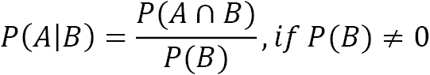
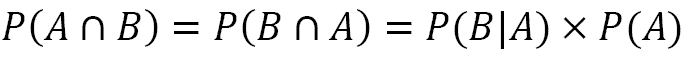

# 十一、机器学习异常检测

在我们的最后一章应用中，我们将再次讨论登录尝试的**异常检测**。让我们想象一下，我们为一家在 2018 年初推出其 web 应用的公司工作。这个 web 应用自启动以来一直在收集所有登录尝试的日志事件。我们知道尝试的 IP 地址、尝试的结果、尝试的时间以及输入的用户名。我们不知道的是，这一尝试是由我们的合法用户之一还是一个邪恶的团体做出的。

我们的公司一直在扩张，因为数据泄露似乎每天都在新闻中出现，所以我们成立了一个信息安全部门来监控流量。首席执行官从 [*第 8 章*](B16834_08_Final_SK_ePub.xhtml#_idTextAnchor172) 、*基于规则的异常检测*中看到了我们基于规则的识别黑客的方法，并对我们的举措感兴趣，但希望我们在如此重要的任务中超越使用规则和阈值。我们的任务是开发一个机器学习模型，用于对 web 应用上的登录尝试进行异常检测。

由于这将需要大量的数据，我们已经获得了从 2018 年 1 月 1 日到 2018 年 12 月 31 日的所有日志。此外，新成立的**安全运营中心** ( **SOC** )现在将审计所有这些流量，并将根据他们的调查指出哪些时间段包含恶意用户。由于 SOC 成员是主题专家，这些数据对我们来说非常有价值。我们将能够使用他们提供的标记数据来建立一个监督学习模型，以供未来使用；然而，他们需要一些时间来筛选所有的流量，所以我们应该开始一些无监督的学习，直到他们为我们做好准备。

在本章中，我们将讨论以下主题:

*   探索模拟登录尝试数据
*   利用无监督的异常检测方法
*   实施监督异常检测
*   将反馈循环与在线学习相结合

# 章节材料

本章的资料可以在[https://github . com/stef molin/Hands-On-Data-Analysis-with-Pandas-2nd-edition/tree/master/ch _ 11](https://github.com/stefmolin/Hands-On-Data-Analysis-with-Pandas-2nd-edition/tree/master/ch_11)找到。在这一章中，我们将重温尝试登录的数据；然而，`simulate.py`脚本已经更新，允许附加的命令行参数。我们这次不会运行模拟，但请务必查看脚本，并检查在`0-simulating_the_data.ipynb`笔记本中为本章生成数据文件和创建数据库所遵循的流程。`user_data/`目录包含了用于这个模拟的文件，但是我们不会在本章中直接使用它们。

我们将在本章中使用的模拟测井数据可以在`logs/`目录中找到。`logs_2018.csv`和`hackers_2018.csv`文件分别是所有 2018 年模拟的登录尝试日志和黑客活动记录。带有`hackers`前缀的文件被视为我们将从 SOC 接收的带标签的数据，因此我们将假装最初没有它们。名称中带有`2019`而非`2018`的文件是模拟 2019 年第一季度的数据，而非全年。此外，CSV 文件已被写入`logs.db` SQLite 数据库。`logs`表包含来自`logs_2018.csv`和`logs_2019.csv`的数据；`attacks`表包含来自`hackers_2018.csv`和`hackers_2019.csv`的数据。

模拟的参数每个月都在变化，在大多数月份中，黑客会根据他们尝试登录的每个用户名改变他们的 IP 地址。这将使我们的方法从 [*第 8 章*](B16834_08_Final_SK_ePub.xhtml#_idTextAnchor172) 、*基于规则的异常检测*变得无用，因为我们寻找 IP 地址的尝试很多，失败率很高。如果黑客现在改变他们的 IP 地址，我们不会有太多与他们相关的尝试。因此，我们无法用该策略标记他们，所以我们必须找到另一种方法来解决这个问题:


图 11.1–模拟参数

重要说明

`merge_logs.py`文件包含 Python 代码来合并来自每个单独模拟的日志，而`run_simulations.sh`包含用于运行整个过程的 Bash 脚本。提供这些是为了完整性，但是我们不需要使用它们(或者担心 Bash)。

我们本章的工作流程被分成几个笔记本，每个笔记本前面都有一个数字，表示它们的顺序。在我们有标记的数据之前，我们将在`1-EDA_unlabeled_data.ipynb`笔记本中进行一些 EDA，然后转移到`2-unsupervised_anomaly_detection.ipynb`笔记本，尝试一些无监督的异常检测方法。一旦我们有了标记的数据，我们将在`3-EDA_labeled_data.ipynb`笔记本中执行一些额外的 EDA，然后转移到`4-supervised_anomaly_detection.ipynb`笔记本中进行监督方法。最后，我们将使用`5-online_learning.ipynb`笔记本来讨论在线学习。像往常一样，文本将指示何时在笔记本之间切换。

# 探索模拟登录尝试数据

我们还没有标记数据，但我们仍然可以检查数据，看看是否有一些突出的东西。该数据不同于 [*第八章*](B16834_08_Final_SK_ePub.xhtml#_idTextAnchor172) 、*基于规则的异常检测*中的数据。黑客在这个模拟中更聪明——他们不会总是尝试同样多的用户，或者每次都坚持使用同一个 IP 地址。让我们看看能否通过在`1-EDA_unlabeled_data.ipynb`笔记本中执行一些 EDA 来提供一些有助于异常检测的功能。

像往常一样，我们从进口开始。对于所有笔记本来说，这些都是相同的，因此仅在本节中重复:

```py
>>> %matplotlib inline
>>> import matplotlib.pyplot as plt
>>> import numpy as np
>>> import pandas as pd
>>> import seaborn as sns
```

接下来，我们从 SQLite 数据库的`logs`表中读入 2018 年的日志:

```py
>>> import sqlite3
>>> with sqlite3.connect('logs/logs.db') as conn:
...     logs_2018 = pd.read_sql(
...         """
...         SELECT * 
...         FROM logs 
... WHERE
... datetime BETWEEN "2018-01-01" AND "2019-01-01";
... """, 
... conn, parse_dates=['datetime'],
... index_col='datetime'
...     )
```

小费

如果 SQLAlchemy 包([https://www.sqlalchemy.org/](https://www.sqlalchemy.org/))安装在我们正在使用的环境中(对于我们来说就是这种情况)，我们可以选择在调用`pd.read_sql()`时为连接提供数据库**统一资源标识符** ( **URI** )，消除了对`with`语句的需要。在我们的例子中，这将是`sqlite:///logs/logs.db`，其中`sqlite`是方言，`logs/logs.db`是文件的路径。注意，一行有三个`/`字符。

我们的数据看起来像这样:


图 11.2–2018 年的登录尝试日志

我们的数据类型将与 [*第 8 章*](B16834_08_Final_SK_ePub.xhtml#_idTextAnchor172) 、*基于规则的异常检测*中的相同，除了`success`列。SQLite 不支持布尔值，因此在将数据写入数据库时，该列被转换为其原始形式的二进制表示(存储为整数):

```py
>>> logs_2018.dtypes
source_ip         object
username          object
success            int64
failure_reason    object
dtype: object
```

重要说明

我们在这里使用 SQLite 数据库，因为 Python 标准库已经提供了建立连接的方法(`sqlite3`)。如果我们想使用另一种类型的数据库，比如 MySQL 或 PostgreSQL，我们将需要安装 SQLAlchemy(可能还有附加包，这取决于数据库方言)。更多信息可以在[https://pandas . pydata . org/pandas-docs/stable/user _ guide/io . html # SQL-queries](https://pandas.pydata.org/pandas-docs/stable/user_guide/io.html#sql-queries)找到。查看本章末尾的*延伸阅读*部分，获取 SQLAlchemy 教程。

使用`info()`方法，我们看到`failure_reason`是唯一一个空的列。当尝试成功时，它为空。在构建模型时，我们还应该注意我们数据的内存使用情况。有些模型需要增加数据的维度，数据会很快变得太大而无法保存在内存中:

```py
>>> logs_2018.info()
<class 'pandas.core.frame.DataFrame'>
DatetimeIndex: 38700 entries, 
2018-01-01 00:05:32.988414 to 2018-12-31 23:29:42.482166
Data columns (total 4 columns):
 #   Column          Non-Null Count  Dtype 
---  ------          --------------  ----- 
 0   source_ip       38700 non-null  object
 1   username        38700 non-null  object
 2   success         38700 non-null  int64 
 3   failure_reason  11368 non-null  object
dtypes: int64(1), object(3)
memory usage: 1.5+ MB
```

运行`describe()`方法告诉我们，最常见的失败原因是提供了错误的密码。我们还可以看到，尝试的唯一用户名的数量(1，797)远远超过了我们的用户群中的用户数量(133)，这表明存在一些可疑活动。最频繁的 IP 地址进行了 314 次尝试，但由于这甚至不是每天一次(请记住，我们查看的是 2018 年全年)，我们无法做出任何假设:

```py
>>> logs_2018.describe(include='all')
 source_ip username    success       failure_reason
count          38700    38700 38700.000000                11368
unique          4956     1797          NaN 3
top   168.123.156.81   wlopez          NaN error_wrong_password
freq             314      387          NaN 6646
mean             NaN      NaN     0.706253                  NaN
std              NaN      NaN     0.455483                  NaN
min              NaN      NaN     0.000000                  NaN
25%              NaN      NaN     0.000000                  NaN
50%              NaN      NaN     1.000000                  NaN
75%              NaN      NaN     1.000000                  NaN
max              NaN      NaN     1.000000                  NaN
```

我们可以查看每个 IP 地址尝试登录的唯一用户名，如在 [*第 8 章*](B16834_08_Final_SK_ePub.xhtml#_idTextAnchor172) 、*基于规则的异常检测*中，这向我们显示了大多数 IP 地址有几个用户名，但至少有一个有很多:

```py
>>> logs_2018.groupby('source_ip')\
...     .agg(dict(username='nunique'))\
...     .username.describe()
count    4956.000000
mean        1.146287
std         1.916782
min         1.000000
25%         1.000000
50%         1.000000
75%         1.000000
max       129.000000
Name: username, dtype: float64
```

让我们计算每个 IP 地址的指标:

```py
>>> pivot = logs_2018.pivot_table(
...     values='success', index='source_ip', 
...     columns=logs_2018.failure_reason.fillna('success'), 
...     aggfunc='count', fill_value=0
... )
>>> pivot.insert(0, 'attempts', pivot.sum(axis=1))
>>> pivot = pivot\
...     .sort_values('attempts', ascending=False)\
...     .assign(
...         success_rate=lambda x: x.success / x.attempts,
...         error_rate=lambda x: 1 - x.success_rate
...     )
>>> pivot.head()
```

尝试次数最多的前五个 IP 地址似乎是有效用户，因为它们的成功率相对较高:


图 11.3–每个 IP 地址的指标

让我们使用这个数据框架来绘制每个 IP 地址的成功与尝试，看看是否有一种模式可以用来区分有效活动和恶意活动:

```py
>>> pivot.plot(
...     kind='scatter', x='attempts', y='success', 
...     title='successes vs. attempts by IP address',
...     alpha=0.25
... )
```

底部似乎有一些不属于它的点，但是请注意坐标轴上的刻度并没有完全对齐。大多数的点都在一条线上，这条线与成功尝试的比例略小于 1:1。回想一下，本章的模拟比我们在 [*第八章*](B16834_08_Final_SK_ePub.xhtml#_idTextAnchor172) 、*基于规则的异常检测*中使用的模拟更真实；因此，如果我们将*图 8.11* 与该图进行比较，我们可以观察到，在这里区分有效活动和恶意活动要困难得多:


图 11.4–每个 IP 地址的成功与尝试的散点图

请记住，这是一个二元分类问题，我们希望找到一种方法来区分有效用户和攻击者的登录活动。我们想要建立一个模型，它将学习一些区分合法用户和攻击者的决策界限。由于有效用户正确输入密码的概率更高，与攻击者相比，尝试和成功之间的关系将更接近 1:1。因此，我们可以想象分离边界是这样的:


图 11.5-可能的决策界限

现在的问题是，这两个组织中哪一个是攻击者？好吧，如果更多的 IP 地址是攻击者(因为他们对他们尝试的每个用户名使用不同的 IP 地址)，那么有效的用户将被认为是离群值，而攻击者将被认为是具有方框图的“内部人”。让我们创建一个来看看这是否是正在发生的事情:

```py
>>> pivot[['attempts', 'success']].plot(
...     kind='box', subplots=True, figsize=(10, 3), 
...     title='stats per IP address'
... )
```

事实上，这似乎就是正在发生的事情。我们的合法用户比攻击者更容易得手，因为他们只使用 1-3 个不同的 IP 地址:


图 11.6–使用每个 IP 地址的指标寻找异常值

显然，像这样查看数据没有太大帮助，所以让我们看看更小的粒度是否能帮助我们。让我们来看看 2018 年 1 月每分钟每个 IP 地址的尝试次数、用户名数量和失败次数的分布情况:

```py
>>> from matplotlib.ticker import MultipleLocator
>>> ax = logs_2018.loc['2018-01'].assign(
...     failures=lambda x: 1 - x.success
... ).groupby('source_ip').resample('1min').agg({
...     'username': 'nunique', 
...     'success': 'sum', 
...     'failures': 'sum'
... }).assign(
...     attempts=lambda x: x.success + x.failures
... ).dropna().query('attempts > 0').reset_index().plot(
...     y=['attempts', 'username', 'failures'], kind='hist',
...     subplots=True, layout=(1, 3), figsize=(20, 3),
...     title='January 2018 distributions of minutely stats'
...           'by IP address'
... )
>>> for axes in ax.flatten():
...     axes.xaxis.set_major_locator(MultipleLocator(1))
```

看起来大多数 IP 地址只有一个用户名与之相关联；但是，一些 IP 地址也有多次尝试失败的情况:


图 11.7–每个 IP 地址每分钟的指标分布

也许唯一的用户名和失败的组合会给我们一些不依赖于 IP 地址不变的东西。让我们来看看 2018 年每分钟失败的用户名数量:

```py
>>> logs_2018.loc['2018'].assign(
...     failures=lambda x: 1 - x.success
... ).query('failures > 0').resample('1min').agg(
...     {'username': 'nunique', 'failures': 'sum'}
... ).dropna().rename(
...     columns={'username': 'usernames_with_failures'}
... ).usernames_with_failures.plot(
...     title='usernames with failures per minute in 2018', 
...     figsize=(15, 3)
... ).set_ylabel('usernames with failures')
```

这看起来很有希望；我们绝对应该关注失败用户名的峰值。这可能是我们网站的问题，或者是恶意的:


图 11.8-随着时间的推移出现故障的用户名

在彻底探索了我们将使用的数据之后，我们对在构建机器学习模型时可以使用哪些功能有了一个想法。由于我们还没有标记的数据，接下来让我们尝试一些无监督的模型。

# 利用无监督的异常检测方法

如果黑客很显眼，与我们的合法用户截然不同，那么无人监管的方法可能会非常有效。在我们标记数据之前，或者如果标记的数据难以收集或不能保证代表我们希望标记的全部范围，这是一个很好的起点。请注意，在大多数情况下，我们不会有标记的数据，所以我们熟悉一些无监督的方法是至关重要的。

在我们最初的 EDA 中，我们将一分钟内登录尝试失败的用户名数量作为异常检测的一个特征。我们现在将测试一些无监督的异常检测算法，使用这个特性作为出发点。Scikit-learn 提供了一些这样的算法。在本节中，我们将了解隔离林和本地异常值因素；第三种方法，使用一类**支持向量机** ( **SVM** )，在*练习*部分。

在我们尝试这些方法之前，我们需要准备我们的训练数据。由于 SOC 将首先发送 2018 年 1 月的标记数据，因此我们将仅使用 2018 年 1 月的每分钟数据用于我们的无监督模型。我们的功能将是一周中的某一天(一个热点编码)，一天中的某个小时(一个热点编码)，以及失败的用户名的数量。如果需要的话，请参见*第 9 章*、*Python 机器学习入门*中的*编码数据*部分，以复习一键编码。

让我们翻到`2-unsupervised_anomaly_detection.ipynb`笔记本，编写一个实用函数来轻松获取这些数据:

```py
>>> def get_X(log, day):
...     """
...     Get data we can use for the X
...
...     Parameters:
...         - log: The logs dataframe
...         - day: A day or single value we can use as a
...                datetime index slice
...
...     Returns: 
...         A `pandas.DataFrame` object
...     """
...     return pd.get_dummies(
...         log.loc[day].assign(
...             failures=lambda x: 1 - x.success
...         ).query('failures > 0').resample('1min').agg(
...             {'username': 'nunique', 'failures': 'sum'}
...         ).dropna().rename(
...             columns={'username': 'usernames_with_failures'}
...         ).assign(
...             day_of_week=lambda x: x.index.dayofweek, 
...             hour=lambda x: x.index.hour
...         ).drop(columns=['failures']),
...         columns=['day_of_week', 'hour']
...     )
```

现在，我们可以抓取一月并存储在`X`:

```py
>>> X = get_X(logs_2018, '2018-01')
>>> X.columns
Index(['usernames_with_failures', 'day_of_week_0',
       'day_of_week_1', 'day_of_week_2', 'day_of_week_3',
       'day_of_week_4', 'day_of_week_5', 'day_of_week_6',
       'hour_0', 'hour_1', ..., 'hour_22', 'hour_23'],
      dtype='object')
```

## 隔离林

**隔离森林**算法使用分裂技术从其余数据中隔离离群值；因此，它可以用于异常检测。在引擎盖下，是一个随机森林，在那里随机选择特征进行分割。选择该特征在其最大值和最小值之间的随机值进行分割。请注意，此范围来自树中该节点的特征范围，而不是起始数据。

森林中的一棵树看起来如下所示:


图 11.9–隔离林中一棵树的示例

从森林中每棵树的顶部到包含给定点的叶子所必须经过的路径的平均长度被用来作为离群点或内点来计分。离群值具有更短的路径，因为它们将是分割给定侧的少数之一，并且与其他点的共同点更少。相反，具有许多共同维度的点将需要更多的分裂来分离。

重要说明

关于这个算法的更多信息可以在[https://sci kit-learn . org/stable/modules/outlier _ detection . html # isolation-forest](https://scikit-learn.org/stable/modules/outlier_detection.html#isolation-forest)找到。

让我们用管道实现一个隔离林，首先标准化我们的数据:

```py
>>> from sklearn.ensemble import IsolationForest
>>> from sklearn.pipeline import Pipeline
>>> from sklearn.preprocessing import StandardScaler
>>> iso_forest_pipeline = Pipeline([
...     ('scale', StandardScaler()),
...     ('iforest', IsolationForest(
...         random_state=0, contamination=0.05
...     ))
... ]).fit(X)
```

我们必须指定预期有多少数据是异常值(`contamination`)，我们估计是 5%；这将很难选择，因为我们没有标记的数据。有一个`auto`选项将为我们确定一个值，但在这种情况下，它没有给我们离群值，所以很明显，这个值不是我们想要的值。在实践中，我们可以对数据进行统计分析，以确定初始值或咨询领域专家。

`predict()`方法可以用来检查每个数据点是否是异常值。在`scikit-learn`中实现的异常检测算法通常会返回`1`或`-1`，如果该点是内部点或外部点:

```py
>>> isolation_forest_preds = iso_forest_pipeline.predict(X)
>>> pd.Series(np.where(
...     isolation_forest_preds == -1, 'outlier', 'inlier'
... )).value_counts()
inlier     42556
outlier     2001
dtype: int64
```

由于我们还没有带标签的数据，我们稍后会回来对此进行评估；现在，让我们来看看我们将在本章中讨论的第二个无监督算法。

## 局部异常因素

虽然内点通常位于数据集的密集区域(这里是 32 维)，但离群点往往位于更稀疏、更孤立的区域，几乎没有相邻点。**局部异常值因子** ( **LOF** )算法寻找这些人口稀少的区域来识别异常值。它根据每个点周围的密度与其最近邻居的密度之比对所有点进行评分。被视为正常的点将具有与其相邻点相似的密度；那些附近没有其他人的人会被认为是不正常的。

重要说明

关于这个算法的更多信息可以在[https://sci kit-learn . org/stable/modules/outlier _ detection . html # local-outlier-factor](https://scikit-learn.org/stable/modules/outlier_detection.html#local-outlier-factor)找到。

让我们建造另一条管道，但把隔离森林换成 LOF。注意，我们必须猜测参数`n_neighbors`的最佳值，因为如果我们没有带标签的数据,`GridSearchCV`就没有什么可以对模型进行评分。我们使用该参数的默认值，即`20`:

```py
>>> from sklearn.neighbors import LocalOutlierFactor
>>> from sklearn.pipeline import Pipeline
>>> from sklearn.preprocessing import StandardScaler
>>> lof_pipeline = Pipeline([
...     ('scale', StandardScaler()),
...     ('lof', LocalOutlierFactor())
... ]).fit(X)
```

现在，让我们看看这次我们有多少异常值。LOF 没有`predict()`方法，所以我们必须检查 LOF 对象的`negative_outlier_factor_`属性，以查看我们拟合的每个数据点的分数:

```py
>>> lof_preds = lof_pipeline.named_steps['lof']\
...     .negative_outlier_factor_ 
>>> lof_preds
array([-1.33898756e+10, -1.00000000e+00, -1.00000000e+00, ...,
       -1.00000000e+00, -1.00000000e+00, -1.11582297e+10])
```

LOF 和隔离森林还有另一个区别:`negative_outlier_factor_`属性的值不是严格的`-1`或`1`。事实上，它们可以是任何数字——看看前面结果中的第一个和最后一个值，您会发现它们远小于`-1`。这意味着我们不能使用我们在隔离林中使用的方法来计算内联者和离群者。相反，我们需要比较 LOF 模型的`negative_outlier_factor_`属性和`offset_`属性，后者告诉我们 LOF 模型在训练期间确定的截止值(使用`contamination`参数):

```py
>>> pd.Series(np.where(
...     lof_preds < lof_pipeline.named_steps['lof'].offset_, 
...     'outlier', 'inlier'
... )).value_counts()
inlier     44248
outlier      309
dtype: int64
```

现在我们有了两个无人监管的模型，我们需要比较它们，看看哪一个对我们的利益相关者更有利。

## 比较模型

LOF 表明离群值比隔离森林少，但也许他们甚至不一致。正如我们在 [*第 10 章*](B16834_10_Final_SK_ePub.xhtml#_idTextAnchor217) 、*做出更好的预测——优化模型*中所了解到的，我们可以使用`sklearn.metrics`中的`cohen_kappa_score()`函数来检查它们的一致程度:

```py
>>> from sklearn.metrics import cohen_kappa_score
>>> is_lof_outlier = np.where(
...     lof_preds < lof_pipeline.named_steps['lof'].offset_, 
...     'outlier', 'inlier'
... )
>>> is_iso_outlier = np.where(
...     isolation_forest_preds == -1, 'outlier', 'inlier'
... )
>>> cohen_kappa_score(is_lof_outlier, is_iso_outlier)
0.25862517997335677
```

它们的一致程度很低，表明哪些数据点是异常的并不那么明显。然而，如果没有标记的数据，我们真的不可能说出哪一个更好。我们将不得不与结果的消费者一起工作，以确定哪个模型给他们最有用的数据。值得庆幸的是，SOC 刚刚发送了 2018 年 1 月的标记数据，因此我们可以确定我们的哪个模型更好，并让他们开始使用它，直到我们准备好监督模型。

首先，我们将读入他们在`attacks`表中写入数据库的标记数据，并添加一些列来指示攻击开始的时间、持续时间和结束时间:

```py
>>> with sqlite3.connect('logs/logs.db') as conn:
...     hackers_jan_2018 = pd.read_sql(
...         """
...         SELECT * 
...         FROM attacks 
...         WHERE start BETWEEN "2018-01-01" AND "2018-02-01";
...         """, conn, parse_dates=['start', 'end']
...     ).assign(
...         duration=lambda x: x.end - x.start,
...         start_floor=lambda x: x.start.dt.floor('min'),
...         end_ceil=lambda x: x.end.dt.ceil('min')
...     )
>>> hackers_jan_2018.shape
(7, 6)
```

请注意，SOC 只有一个 IP 地址，用于每次攻击中涉及的 IP 地址，因此我们不再依赖它是一件好事。相反，SOC 希望我们告诉他们在哪一分钟有可疑活动，以便他们可以进一步调查。另请注意，虽然攻击持续时间很短，但我们每分钟的数据意味着每次攻击都会触发许多警报:


图 11.10-用于评估我们模型的标记数据

使用`start_floor`和`end_ceil`列，我们可以创建一个日期时间范围，并可以检查我们标记为异常值的数据是否在该范围内。为此，我们将使用以下函数:

```py
>>> def get_y(datetimes, hackers, resolution='1min'):
...     """
...     Get data we can use for the y (whether or not a
...     hacker attempted a log in during that time).
...
...     Parameters:
...         - datetimes: The datetimes to check for hackers
...         - hackers: The dataframe indicating when the 
...                    attacks started and stopped
...         - resolution: The granularity of the datetime. 
...                       Default is 1 minute.
...
...     Returns: `pandas.Series` of Booleans.
...     """
...     date_ranges = hackers.apply(
...         lambda x: pd.date_range(
...             x.start_floor, x.end_ceil, freq=resolution
...         ), 
...         axis=1
...     )
...     dates = pd.Series(dtype='object')
...     for date_range in date_ranges:
...         dates = pd.concat([dates, date_range.to_series()])
...     return datetimes.isin(dates)
```

现在，让我们在我们的`X`数据中找到有黑客活动的日期时间:

```py
>>> is_hacker = \
...     get_y(X.reset_index().datetime, hackers_jan_2018)
```

我们现在有了制作分类报告和混淆矩阵所需的一切。因为我们会在`is_hacker`系列中经过很多次，所以我们会做一些片段来减少我们的输入:

```py
>>> from functools import partial
>>> from sklearn.metrics import classification_report
>>> from ml_utils.classification import confusion_matrix_visual
>>> report = partial(classification_report, is_hacker)
>>> conf_matrix = partial(
...     confusion_matrix_visual, is_hacker, 
...     class_labels=[False, True]
... )
```

让我们从分类报告开始，这些报告表明隔离林在召回方面要好得多:

```py
>>> iso_forest_predicts_hacker = isolation_forest_preds == - 1
>>> print(report(iso_forest_predicts_hacker)) # iso. forest
              precision    recall  f1-score   support
       False       1.00      0.96      0.98     44519
        True       0.02      0.82      0.03        38
    accuracy                           0.96     44557
   macro avg       0.51      0.89      0.50     44557
weighted avg       1.00      0.96      0.98     44557
>>> lof_predicts_hacker = \
...     lof_preds < lof_pipeline.named_steps['lof'].offset_ 
>>> print(report(lof_predicts_hacker)) # LOF
              precision    recall  f1-score   support
       False       1.00      0.99      1.00     44519
        True       0.03      0.26      0.06        38
    accuracy                           0.99     44557
   macro avg       0.52      0.63      0.53     44557
weighted avg       1.00      0.99      1.00     44557
```

为了更好地理解分类报告中的结果，让我们为我们的无监督方法创建混淆矩阵，并将它们放在一起进行比较:

```py
>>> fig, axes = plt.subplots(1, 2, figsize=(15, 5))
>>> conf_matrix(
...     iso_forest_predicts_hacker, 
...     ax=axes[0], title='Isolation Forest'
... )
>>> conf_matrix(
...     lof_predicts_hacker, 
...     ax=axes[1], title='Local Outlier Factor'
... )
```

与 LOF 相比，隔离林有更多的真阳性和更多的假阳性，但它有更少的假阴性:


图 11.11–无监督模型的混淆矩阵

SOC 已经通知我们，假阴性比假阳性的代价要大得多。然而，他们希望我们控制误报，以避免过多的误报使团队陷入困境。这告诉我们，作为一个性能指标，召回率(**真实阳性率** ( **TPR** ))比精确度更有价值。国际奥委会希望我们的目标是至少 70%的*召回。*

由于我们有非常大的阶级不平衡，**假阳性率** ( **FPR** )对我们来说不会有太多信息。请记住，FPR 是假阳性与假阳性和真阴性之和的比率(属于阴性类别的所有事物)。由于攻击的性质是罕见的，我们将有非常多的真正否定，因此，我们的 FPR 将保持非常低。因此，SOC 确定的二级指标是达到 85%或更高的*精度*。

隔离森林模型超过了我们的目标召回率，但是精度太低。因为我们能够获得一些标记的数据，所以我们现在可以使用监督学习来查找具有可疑活动的分钟(注意，情况并不总是如此)。让我们看看是否可以使用这些额外的信息来更精确地找到感兴趣的会议记录。

# 实施监督异常检测

SOC 已经完成了对 2018 年数据的标记，因此我们应该重新访问我们的 EDA，以确保我们的计划(查看在一分钟内失败的用户名数量)能够分离数据。这个 EDA 在`3-EDA_labeled_data.ipynb`笔记本里。在一些数据争论之后，我们能够创建以下散点图，这表明该策略确实能够分离可疑活动:


图 11.12–确认我们的特征有助于形成决策界限

在`4-supervised_anomaly_detection.ipynb`笔记本中，我们将创建一些监督模型。这一次我们需要读入 2018 年所有标注的数据。请注意，这里省略了用于读取日志的代码，因为它与上一节中的代码相同:

```py
>>> with sqlite3.connect('logs/logs.db') as conn:
...     hackers_2018 = pd.read_sql(
...         """
...         SELECT * 
...         FROM attacks 
...         WHERE start BETWEEN "2018-01-01" AND "2019-01-01";
...         """, conn, parse_dates=['start', 'end']
...     ).assign(
...         duration=lambda x: x.end - x.start,
...         start_floor=lambda x: x.start.dt.floor('min'),
...         end_ceil=lambda x: x.end.dt.ceil('min')
...     )
```

然而，在我们构建模型之前，让我们创建一个新函数，它将在同时创建`X`和`y`。`get_X_y()`函数将使用我们之前制作的`get_X()`和`get_y()`函数，返回`X`和`y`:

```py
>>> def get_X_y(log, day, hackers):
...     """
...     Get the X, y data to build a model with.
...
...     Parameters:
...         - log: The logs dataframe
...         - day: A day or single value we can use as a 
...                datetime index slice
...         - hackers: The dataframe indicating when the 
...                    attacks started and stopped
...
...     Returns:
...         X, y tuple where X is a `pandas.DataFrame` object
...         and y is a `pandas.Series` object
...     """
...     X = get_X(log, day)
...     y = get_y(X.reset_index().datetime, hackers)
...     return X, y
```

现在，让我们使用我们的新函数，用 2018 年 1 月的数据建立一个训练集，用 2018 年 2 月的数据建立一个测试集:

```py
>>> X_train, y_train = \
...     get_X_y(logs_2018, '2018-01', hackers_2018)
>>> X_test, y_test = \
...     get_X_y(logs_2018, '2018-02', hackers_2018)
```

重要说明

虽然我们有一个非常大的班级不平衡，但我们不会马上平衡训练集。在不进行过早优化的情况下尝试模型是至关重要的。如果我们建立了模型，发现它受到了阶级不平衡的影响，那么我们可以尝试这些技术。记住，对过采样/欠采样技术要非常谨慎，因为有些人对数据做出的假设并不总是适用或现实的。想想 SMOTE——我们真的希望所有未来的攻击者与我们在数据中的攻击者相似吗？

让我们使用这些数据来建立一些有监督的异常检测模型。请记住，SOC 已经给出了召回率(至少 70%)和精确度(85%或更高)方面的性能要求，因此我们将使用这些指标来评估我们的模型。

## 基线

我们的第一步将是建立一些基线模型，这样我们就知道我们的机器学习算法比一些更简单的模型表现得更好，并且具有预测价值。我们将构建两个这样的模型:

*   基于数据分层预测标签的虚拟分类器。
*   利用贝叶斯定理预测标签的朴素贝叶斯模型。

### 虚拟分类器

虚拟分类器将给我们一个模型，它相当于我们在 ROC 曲线上绘制的基线。结果会故意差。我们永远不会使用这个分类器来进行实际预测；相反，我们可以使用来看看我们正在建立的模型是否比随机猜测策略更好。在`dummy`模块中，`scikit-learn`恰恰为此目的提供了`DummyClassifier`类。

使用`strategy`参数，我们可以指定虚拟分类器如何进行预测。一些有趣的选项如下:

*   `uniform`:分类器每次都会猜测观察结果是否属于黑客攻击企图。
*   分类器将总是预测最频繁出现的标签，在我们的例子中，这将导致永远不会将任何东西标记为邪恶的。这将实现高精度，但是没有用，因为少数类是感兴趣的类。
*   `stratified`:分类器将使用训练数据中的类别分布，并保持其猜测的比率。

让我们用`stratified`策略构建一个虚拟分类器:

```py
>>> from sklearn.dummy import DummyClassifier
>>> dummy_model = DummyClassifier(
...     strategy='stratified', random_state=0
... ).fit(X_train, y_train)
>>> dummy_preds = dummy_model.predict(X_test)
```

现在我们有了第一个基线模型，让我们测量它的性能进行比较。我们将使用 ROC 曲线和精确召回曲线来展示类的不平衡是如何使 ROC 曲线对性能持乐观态度的。为了减少打字，我们将再次做一些偏题:

```py
>>> from functools import partial
>>> from sklearn.metrics import classification_report
>>> from ml_utils.classification import (
...     confusion_matrix_visual, plot_pr_curve, plot_roc
... )
>>> report = partial(classification_report, y_test)
>>> roc = partial(plot_roc, y_test)
>>> pr_curve = partial(plot_pr_curve, y_test)
>>> conf_matrix = partial(
...     confusion_matrix_visual, y_test, 
...     class_labels=[False, True]
... )
```

回想一下我们在*第九章*、*Python 机器学习入门*中对 ROC 曲线的最初讨论，对角线是对虚拟模型的随机猜测。如果我们的表现不比这条线好，我们的模型就没有预测价值。我们刚刚创建的虚拟模型相当于这条线。让我们使用支线图来可视化基线 ROC 曲线、精确度-召回曲线和混淆矩阵:

```py
>>> fig, axes = plt.subplots(1, 3, figsize=(20, 5))
>>> roc(dummy_model.predict_proba(X_test)[:,1], ax=axes[0])
>>> conf_matrix(dummy_preds, ax=axes[1])
>>> pr_curve(
...     dummy_model.predict_proba(X_test)[:,1], ax=axes[2]
... )
>>> plt.suptitle('Dummy Classifier with Stratified Strategy')
```

虚拟分类器无法标记任何攻击者。ROC 曲线(TPR 对 FPR)表明虚拟模型没有预测价值，曲线下的**面积** ( **AUC** )为 0.5。请注意，精确召回曲线下的面积几乎为零:


图 11.13–使用虚拟分类器建立基线

因为我们有非常大的阶级不平衡，分层随机猜测策略应该在少数阶级上表现得很糟糕，而在多数阶级上表现得很好。我们可以通过检查分类报告来观察这一点:

```py
>>> print(report(dummy_preds))
              precision    recall  f1-score   support
       False       1.00      1.00      1.00     39958
        True       0.00      0.00      0.00         5
    accuracy                           1.00     39963
   macro avg       0.50      0.50      0.50     39963
weighted avg       1.00      1.00      1.00     39963
```

### 朴素贝叶斯

我们最后的基线模型将是一个朴素贝叶斯分类器。在讨论这个模型之前，我们需要回顾一些概率的概念。首先是条件概率。在处理两个事件 *A* 和 *B* 时，给定事件 *B* 发生的概率**为条件概率**，记为 P(A | B)。当事件 *A* 和 *B* 是独立的，意味着 *B* 的发生并没有告诉我们关于 *A* 发生的任何事情，反之亦然， *P(A|B)* 就是 *P(A)* 。

条件概率定义为 *A* 和 *B* 都发生的**联合概率**(这是这些事件的交集)，记为*P(A**∩**B)*，除以 *B* 发生的概率(假设这不是零):



该等式可以重新排列如下:


*A* *∩* *B* 的联合概率相当于*B**∩**A*；因此，我们得到下面的等式:



接下来，我们可以改变第一个方程，使用条件概率，而不是联合概率。这给了我们**贝叶斯定理**:


当与前面的等式一起工作时， *P(A)* 被称为**先验概率**，或者事件 *A* 将发生的初始置信程度。在说明事件 *B* 发生后，这个初始信念得到更新；这被表示为 *P(A|B)* 并且被称为后验概率**。事件 *B* 给定事件 *A* 的**可能性**为 *P(B|A)* 。事件 *B* 的发生给我们观察事件 *A* 的信念提供了以下支持:**

**

让我们看一个例子——假设我们正在构建一个垃圾邮件过滤器，我们发现 10%的电子邮件是垃圾邮件。这 10%是我们的先验，或者说 *P(垃圾信息)*。我们想知道我们刚刚收到的电子邮件是垃圾邮件的概率，因为它包含单词*free*——我们想找到 *P(spam|free)* 。为了找到这一点，我们需要单词 *free* 出现在一封垃圾邮件中的概率，或者 *P(free|spam)* ，以及单词 *free* 出现在一封邮件中的概率，或者 *P(free)* 。

假设我们了解到 12%的电子邮件包含单词 *free* ，20%被确定为垃圾邮件的电子邮件包含单词 *free* 。将所有这些代入之前的等式，我们看到，一旦我们知道一封电子邮件包含单词 *free* ，我们认为它是垃圾邮件的概率从 10%增加到 16.7%，这是我们的后验概率:


贝叶斯定理可以用在一种叫做**朴素贝叶斯**的分类器中。根据我们对数据的假设，我们得到了朴素贝叶斯分类器家族的不同成员。这些模型训练起来非常快，因为它们对每对`X`特征的条件独立性做出了简化假设，给定了`y`变量(意味着 *P(x* i *|y，x* 1 *...x* n *)* 相当于 *P(x* i *|y)* )。他们被称为*天真*，因为这种假设往往是不正确的；然而，这些分类器传统上在构建垃圾邮件过滤器方面工作得很好。

假设我们还在电子邮件中发现了多个美元符号和单词*处方*，我们想知道它是垃圾邮件的概率。虽然这些特征中的一些可能相互依赖，但是朴素贝叶斯模型将它们视为条件独立的。这意味着我们的后验概率公式如下:


假设我们发现 5%的垃圾邮件包含多个美元符号，55%的垃圾邮件包含单词*处方*，25%的邮件包含多个美元符号，而单词*处方*出现在 2%的邮件中。这意味着，我们认为这封邮件是垃圾邮件的可能性从 10%增加到 91.7%，因为它有免费的字样和多种货币符号:


现在我们已经了解了算法的基础，让我们构建一个朴素贝叶斯分类器。请注意，`scikit-learn`提供了各种朴素贝叶斯分类器，这些分类器的不同之处在于假设的特征概率分布，我们将其定义为 *P(x* i *|y，x* 1 *...x* n *)* 。我们将使用假设它们正态分布的版本，`GaussianNB`:

```py
>>> from sklearn.naive_bayes import GaussianNB
>>> from sklearn.pipeline import Pipeline
>>> from sklearn.preprocessing import StandardScaler
>>> nb_pipeline = Pipeline([
...     ('scale', StandardScaler()),
...     ('nb', GaussianNB())
... ]).fit(X_train, y_train)
>>> nb_preds = nb_pipeline.predict(X_test)
```

我们可以从模型中检索类别先验，在这种情况下，它告诉我们包含正常活动的一分钟的先验是 99.91%，而异常活动的先验是 0.09%。

```py
>>> nb_pipeline.named_steps['nb'].class_prior_
array([9.99147160e-01, 8.52840182e-04])
```

朴素贝叶斯制作了一个很好的基线模型，因为我们不需要调整任何超参数，而且训练起来很快。让我们看看它在测试数据(2018 年 2 月)上的表现如何:

```py
>>> fig, axes = plt.subplots(1, 3, figsize=(20, 5))
>>> roc(nb_pipeline.predict_proba(X_test)[:,1], ax=axes[0])
>>> conf_matrix(nb_preds, ax=axes[1])
>>> pr_curve(
...     nb_pipeline.predict_proba(X_test)[:,1], ax=axes[2]
... )
>>> plt.suptitle('Naive Bayes Classifier')
```

朴素贝叶斯分类器找到了所有五个攻击者，并且在 ROC 曲线和精确召回曲线中都高于基线(虚线),这意味着该模型具有一些预测价值:


图 11.14–朴素贝叶斯分类器的性能

不幸的是，我们触发了大量的误报(8，218)。在 2 月份，大约每 1，644 个攻击分类中就有一个确实是攻击。这具有使这些分类的用户变得不敏感的效果。他们可能会选择总是忽略我们的分类，因为它们太吵了，因此错过了一个真正的问题。这种权衡可以在分类报告的指标中得到体现:

```py
>>> print(report(nb_preds))
              precision    recall  f1-score   support
       False       1.00      0.79      0.89     39958
        True       0.00      1.00      0.00         5
    accuracy                           0.79     39963
   macro avg       0.50      0.90      0.44     39963
weighted avg       1.00      0.79      0.89     39963
```

虽然朴素贝叶斯分类器优于虚拟分类器，但它不符合我们的利益相关者的要求。Precision 将目标类的四舍五入为零，因为我们有很多误报。召回率比精确度高，因为模型的假阴性比假阳性好(因为它不是很有辨识力)。这使得 F1 分数为零。现在，让我们试着击败这些基线模型。

## 逻辑回归

既然 logistic 回归是另一个简单模型，那么接下来让我们来尝试一下。我们在*第 9 章*、*Python*机器学习入门中使用了逻辑回归来解决分类问题，所以我们已经知道它是如何工作的。正如我们在 [*第 10 章*](B16834_10_Final_SK_ePub.xhtml#_idTextAnchor217) 、*做出更好的预测-优化模型*中所了解的，我们将使用网格搜索在我们期望的搜索空间中为正则化超参数找到一个好的值，使用`recall_macro`进行评分。请记住，假阴性会带来巨大的成本，因此我们将重点放在召回上。`_macro`后缀表示我们要在正面类和负面类之间平均召回率，而不是整体看(由于类不平衡)。

小费

如果我们确切地知道召回比精确更有价值，我们可以用一个使用`sklearn.metrics`中的`make_scorer()`函数定制的计分器来代替它。我们正在使用的笔记本有一个例子。

当使用网格搜索时，来自`scikit-learn`的警告可能会在每次迭代时打印出来。因此，为了避免不得不滚动浏览所有内容，我们将使用`%%capture` magic 命令来捕获本应打印的所有内容，以保持我们的笔记本整洁:

```py
>>> %%capture
>>> from sklearn.linear_model import LogisticRegression
>>> from sklearn.model_selection import GridSearchCV
>>> from sklearn.pipeline import Pipeline
>>> from sklearn.preprocessing import StandardScaler
>>> lr_pipeline = Pipeline([
...     ('scale', StandardScaler()),
...     ('lr', LogisticRegression(random_state=0))
... ])
>>> search_space = {'lr__C': [0.1, 0.5, 1, 2]}
>>> lr_grid = GridSearchCV(
...     lr_pipeline, search_space, scoring='recall_macro', cv=5
... ).fit(X_train, y_train)
>>> lr_preds = lr_grid.predict(X_test) 
```

小费

使用`%%capture`，所有错误和输出将被默认捕获。我们可以选择编写`--no-stderr`来隐藏错误，编写`--no-stdout`来隐藏输出。这些去追`%%capture`；例如，`%%capture --no-stderr`。

如果我们想隐藏特定的错误，我们可以使用`warnings`模块。例如，在从`warnings`模块导入`filterwarnings`之后，我们可以运行下面的代码来忽略未来贬值的警告:`filterwarnings('ignore', category=DeprecationWarning)`

现在我们已经训练好了逻辑回归模型，让我们检查一下性能:

```py
>>> fig, axes = plt.subplots(1, 3, figsize=(20, 5))
>>> roc(lr_grid.predict_proba(X_test)[:,1], ax=axes[0])
>>> conf_matrix(lr_preds, ax=axes[1])
>>> pr_curve(lr_grid.predict_proba(X_test)[:,1], ax=axes[2])
>>> plt.suptitle('Logistic Regression Classifier')
```

这个模型没有假阳性，比基线好得多。ROC 曲线明显更靠近左上角，正如精确召回曲线更靠近右上角。请注意，ROC 曲线对性能更乐观一些:


图 11.15–使用逻辑回归的性能

该模型符合 SOC 的要求。我们的召回率至少为 70%，准确率至少为 85%:

```py
>>> print(report(lr_preds))
              precision    recall  f1-score   support
       False       1.00      1.00      1.00     39958
        True       1.00      0.80      0.89         5
    accuracy                           1.00     39963
   macro avg       1.00      0.90      0.94     39963
weighted avg       1.00      1.00      1.00     39963
```

SOC 给了我们 2019 年 1 月和 2 月的数据，他们希望我们更新我们的模型。不幸的是，我们的模型已经被训练好了，所以我们可以选择从头开始重建或者忽略这些新数据。理想情况下，我们将构建一个带有反馈回路的模型，以整合这些(以及未来的)新数据。在下一节中，我们将讨论如何做到这一点。

# 将反馈循环与在线学习相结合

到目前为止，我们建立的模型存在一些大问题。与我们在*第 9 章*、*Python 机器学习入门*和 [*第 10 章*](B16834_10_Final_SK_ePub.xhtml#_idTextAnchor217) 、*做出更好的预测——优化模型*中处理的数据不同，我们不会期望攻击者的行为随着时间的推移而静止不变。我们可以在内存中保存多少数据也是有限制的，这就限制了我们可以用多少数据来训练我们的模型。因此，我们现在将构建一个在线学习模型来标记每分钟失败的用户名中的异常。一个**在线学习**模型在不断更新(通过流传输近乎实时地更新，或者批量更新)。这允许我们在新数据到来时学习，然后丢弃它(以在内存中保留空间)。

此外，该模型可以随着时间的推移而发展，并适应基础数据分布的变化。我们还将为我们的模型提供学习反馈，以便我们能够确保它随着时间的推移对黑客行为的变化保持稳健。这叫做**主动学习**。并不是`scikit-learn`中的所有型号都支持这种行为；因此，我们仅限于提供`partial_fit()`方法的模型(没有这种方法的模型需要用新数据从头开始训练)。

小费

Scikit-learn 将实现`partial_fit()`方法的模型称为**增量学习器**。更多信息，包括哪些模型支持这一点，可以在[https://sci kit-learn . org/stable/computing/scaling _ strategies . html # incremental-learning](https://scikit-learn.org/stable/computing/scaling_strategies.html#incremental-learning)找到。

我们的数据目前正在汇总到分钟，然后传递给模型，所以这将是批量学习，而不是流；但是，请注意，如果我们要将它投入生产，如果需要的话，我们可以每分钟更新我们的模型。

## 创建 PartialFitPipeline 子类

我们在*第 9 章*、*Python 中的机器学习入门*中看到，`Pipeline`类简化了我们的机器学习过程，但不幸的是，我们不能用`partial_fit()`方法使用它。为了解决这个问题，我们可以创建自己的`PartialFitPipeline`类，它是`Pipeline`类的子类，但是支持调用`partial_fit()`。`PartialFitPipeline`类位于`ml_utils.partial_fit_pipeline`模块中。

我们简单地从`sklearn.pipeline.Pipeline`继承，并定义一个新方法——`partial_fit()`——它将在除最后一步之外的所有步骤中调用`fit_transform()`，并在最后一步中调用`partial_fit()`:

```py
from sklearn.pipeline import Pipeline
class PartialFitPipeline(Pipeline):
    """
    Subclass of sklearn.pipeline.Pipeline that supports the 
    `partial_fit()` method.
    """
    def partial_fit(self, X, y):
        """
        Run `partial_fit()` for online learning estimators 
        when used in a pipeline.
        """
        # for all but last step
        for _, step in self.steps[:-1]: # (name, object) tuples
            X = step.fit_transform(X)
        # grab object from tuple position 1 for partial_fit()
        self.steps[-1][1].partial_fit(X, y)
        return self
```

现在我们有了`PartialFitPipeline`类，剩下的最后一件事就是选择一个能够在线学习的模型。

## 随机梯度下降分类器

我们的逻辑回归模型表现良好——它满足了召回率和精确度的要求。然而，`LogisticRegression`类不支持在线学习，因为它用来计算系数的方法是一种封闭形式的解决方案。我们可以选择使用优化算法，例如梯度下降，来确定系数；这将能够在线学习。

我们可以用`SGDClassifier`类训练一个新的逻辑回归模型，而不是使用不同的增量学习器。它使用**随机梯度下降** ( **SGD** )来优化我们选择的损失函数。对于这个例子，我们将使用对数损失，这给我们一个逻辑回归，其中的系数是使用 SGD 找到的。

标准梯度下降优化查看所有样本或批次来估计梯度，而 SGD 通过随机选择样本来降低计算成本。模型从每个样本中学习了多少由**学习速率**决定，较早的更新比较晚的更新有更大的影响。SGD 的单次迭代执行如下:

1.  打乱训练数据。
2.  对于训练数据中的每个样本，估计梯度并用由学习率确定的递减强度来更新模型。
3.  重复*步骤 2* ,直到所有样本都已使用完毕。

在机器学习中，我们用**历元**来指代使用完整训练集的次数。我们刚刚概述的 SGD 的过程是针对单个纪元的。当我们训练多个时期时，我们重复前面的步骤达到期望的时期数，每次从我们停止的地方继续。

既然我们理解了 SGD 是如何工作的，我们就可以开始构建我们的模型了。在提交给 SOC 之前，我们将遵循以下流程概述:


图 11.16–准备我们在线学习模型的流程

现在让我们转到`5-online_learning.ipynb`笔记本来构建我们的在线学习模型。

### 构建我们的初始模型

首先，我们将使用`get_X_y()`函数获取我们的`X`和`y`2018 年全年的训练数据:

```py
>>> X_2018, y_2018 = get_X_y(logs_2018, '2018', hackers_2018)
```

因为我们将批量更新这个模型，我们的测试集将总是我们当前预测使用的数据。在我们这样做之后，它将成为训练集并用于更新模型。让我们在 2018 年标记的数据上建立我们的初始模型。注意，`PartialFitPipeline`对象的创建方式与我们创建`Pipeline`对象的方式相同:

```py
>>> from sklearn.linear_model import SGDClassifier
>>> from sklearn.preprocessing import StandardScaler
>>> from ml_utils.partial_fit_pipeline import \
...     PartialFitPipeline
>>> model = PartialFitPipeline([
...     ('scale', StandardScaler()), 
...     ('sgd', SGDClassifier(
... random_state=10, max_iter=1000, 
... tol=1e-3, loss='log', average=1000,
... learning_rate='adaptive', eta0=0.01
...     ))
... ]).fit(X_2018, y_2018)
```

我们的管道会先把数据标准化，然后传递给模型。我们开始使用`fit()`方法构建我们的模型，以便我们稍后使用`partial_fit()`更新时有一个好的起点。`max_iter`参数定义了训练的时期数。`tol`参数(容差)指定何时停止迭代，当当前迭代的损失大于先前的损失减去容差(或者我们已经达到了`max_iter`迭代)时发生。我们指定`loss='log'`使用逻辑回归；然而，损失函数有许多其他选项，包括线性 SVM 的默认值`'hinge'`。

这里，我们还为参数`average`传入了一个值，告诉`SGDClassifier`对象一旦看到 1000 个样本，就将系数存储为结果的平均值；注意，这个参数是可选的，默认情况下，它不会被计算。检查这些系数可通过以下方式实现:

```py
>>> [(col, coef) for col, coef in 
...  zip(X_2018.columns, model.named_steps['sgd'].coef_[0])]
[('usernames_with_failures', 0.9415581997027198),
 ('day_of_week_0', 0.05040751530926895),
 ...,
 ('hour_23', -0.02176726532333003)]
```

最后，我们传入`eta0=0.01`作为我们的开始学习率，并指定只有当我们未能通过给定数量的连续时期(`learning_rate='adaptive'`)的定义的容差来改善我们的损失时，才调整学习率。这个历元数是由`n_iter_no_change`参数定义的，它将是`5`(默认)，因为我们没有明确地设置它。

### 评估模型

由于我们现在已经标记了 2019 年 1 月和 2 月的数据，我们可以评估模型每个月的表现。首先，我们从数据库中读入 2019 年的数据:

```py
>>> with sqlite3.connect('logs/logs.db') as conn:
...     logs_2019 = pd.read_sql(
...         """
...         SELECT * 
...         FROM logs 
... WHERE
... datetime BETWEEN "2019-01-01" AND "2020-01-01";
...         """, 
...         conn, parse_dates=['datetime'],
...         index_col='datetime'
...     )
...     hackers_2019 = pd.read_sql(
...         """
...         SELECT * 
...         FROM attacks 
...         WHERE start BETWEEN "2019-01-01" AND "2020-01-01";
...         """, 
...         conn, parse_dates=['start', 'end']
...     ).assign(
...         start_floor=lambda x: x.start.dt.floor('min'),
...         end_ceil=lambda x: x.end.dt.ceil('min')
...     )
```

接下来，我们分离出 2019 年 1 月的数据:

```py
>>> X_jan, y_jan = get_X_y(logs_2019, '2019-01', hackers_2019)
```

分类报告表明该模型表现相当好，但是我们对阳性类别的召回率低于我们的目标:

```py
>>> from sklearn.metrics import classification_report
>>> print(classification_report(y_jan, model.predict(X_jan)))
              precision    recall  f1-score   support
       False       1.00      1.00      1.00     44559
        True       1.00      0.64      0.78        44
    accuracy                           1.00     44603
   macro avg       1.00      0.82      0.89     44603
weighted avg       1.00      1.00      1.00     44603
```

请记住，我们的利益相关者已经指定我们必须实现至少 70%的召回率(TPR)和至少 85%的准确率。让我们编写一个函数，向我们展示 ROC 曲线、混淆矩阵和精确召回曲线，并指出我们需要进入的区域以及我们目前所处的位置:

```py
>>> from ml_utils.classification import (
...     confusion_matrix_visual, plot_pr_curve, plot_roc
... )
>>> def plot_performance(model, X, y, threshold=None, 
...                      title=None, show_target=True):
...     """
...     Plot ROC, confusion matrix, and precision-recall curve.
...     
...     Parameters:
...         - model: The model object to use for prediction.
...         - X: The features to pass in for prediction.
...         - y: The actuals to evaluate the prediction.
...         - threshold: Value to use as when predicting 
...                      probabilities.
...         - title: A title for the subplots.
...         - show_target: Whether to show the target regions.
...         
...     Returns: 
...         Matplotlib `Axes` object.
...     """
...     fig, axes = plt.subplots(1, 3, figsize=(20, 5))
...     # plot each visualization
...     plot_roc(y, model.predict_proba(X)[:,1], ax=axes[0])
...     confusion_matrix_visual(
...         y, 
...         model.predict_proba(X)[:,1] >= (threshold or 0.5), 
...         class_labels=[False, True], ax=axes[1]
...     )
...     plot_pr_curve(
...         y, model.predict_proba(X)[:,1], ax=axes[2]
...     )
...
...     # show the target regions if desired
...     if show_target:
...         axes[0]\
...             .axvspan(0, 0.1, color='lightgreen', alpha=0.5)
...         axes[0]\
...             .axhspan(0.7, 1, color='lightgreen', alpha=0.5)
...         axes[0].annotate(
...             'region with acceptable\nFPR and TPR', 
...             xy=(0.1, 0.7), xytext=(0.17, 0.65), 
...             arrowprops=dict(arrowstyle='->')
...         )
...
...         axes[2]\
...             .axvspan(0.7, 1, color='lightgreen', alpha=0.5)
... axes[2].axhspan(
... 0.85, 1, color='lightgreen', alpha=0.5
... )
...         axes[2].annotate(
...             'region with acceptable\nprecision and recall', 
...             xy=(0.7, 0.85), xytext=(0.3, 0.6), 
...             arrowprops=dict(arrowstyle='->')
...         )
...
...         # mark the current performance
...         tn, fn, fp, tp = \
...             [int(x.get_text()) for x in axes[1].texts]
...         precision, recall = tp / (tp + fp), tp / (tp + fn)
...         fpr = fp / (fp + tn)
...
...         prefix = 'current performance' if not threshold \
...                  else f'chosen threshold: {threshold:.2%}'
...         axes[0].annotate(
... f'{prefix}\n- FPR={fpr:.2%}'
... f'\n- TPR={recall:.2%}',
...             xy=(fpr, recall), xytext=(0.05, 0.45), 
...             arrowprops=dict(arrowstyle='->')
...         )
...         axes[2].annotate(
...             f'{prefix}\n- precision={precision:.2%}'
...             f'\n- recall={recall:.2%}', 
...             xy=(recall, precision), xytext=(0.2, 0.85), 
...             arrowprops=dict(arrowstyle='->')
...         )
...
...     if title: # show the title if specified
...         plt.suptitle(title)
... 
...     return axes
```

现在，让我们调用这个函数，看看我们做得怎么样:

```py
>>> axes = plot_performance(
...     model, X_jan, y_jan, 
...     title='Stochastic Gradient Descent Classifier '
...           '(Tested on January 2019 Data)'
... )
```

请注意，我们目前没有达到利益相关者的规格；我们的表现不在目标区域:


图 11.17–默认阈值下的模型性能

我们的最终召回率(TPR)为 63.64%，没有达到 70%或更高的目标。默认情况下，当我们使用`predict()`方法时，我们的概率阈值是 50%。如果我们的目标是特定的精度/召回或 TPR/FPR 地区，我们可能需要更改阈值并使用`predict_proba()`来获得所需的性能。

`ml_utils.classification`模块包含`find_threshold_roc()`和`find_threshold_pr()`函数，它们将分别帮助我们沿着 ROC 曲线或精确召回曲线选择一个阈值。因为我们的目标是特定的精度/召回区域，所以我们将使用后者。该函数也使用来自`scikit-learn`的`precision_recall_curve()`函数，但是我们不是用来绘制结果精度和召回数据，而是用它来选择满足我们标准的阈值:

```py
from sklearn.metrics import precision_recall_curve
def find_threshold_pr(y_test, y_preds, *, min_precision,  
                      min_recall):
    """
    Find the threshold to use with `predict_proba()` for 
    classification based on the minimum acceptable precision 
    and the minimum acceptable recall.
    Parameters:
        - y_test: The actual labels.
        - y_preds: The predicted labels.
        - min_precision: The minimum acceptable precision.
        - min_recall: The minimum acceptable recall.
    Returns: The thresholds that meet the criteria.
    """
    precision, recall, thresholds = \
        precision_recall_curve(y_test, y_preds)
    # precision and recall have one extra value at the end 
    # for plotting -- needs to be removed to make a mask 
    return thresholds[
        (precision[:-1] >= min_precision) & 
        (recall[:-1] >= min_recall)
    ]
```

重要说明

笔记本还展示了一个为 TPR/FPR 目标寻找阈值的示例。我们当前的目标精度/召回恰好给出了与目标 TPR(召回)至少为 70%和 FPR 至多为 10%相同的阈值。

让我们使用这个函数来找到一个满足我们的涉众规范的阈值。我们取落在所需区域的最大概率，以挑选最不敏感的候选阈值:

```py
>>> from ml_utils.classification import find_threshold_pr
>>> threshold = find_threshold_pr(
...     y_jan, model.predict_proba(X_jan)[:,1], 
...     min_precision=0.85, min_recall=0.7
... ).max()
>>> threshold
0.0051533333839830974
```

这个结果告诉我们，如果我们标记有 0.52%的机会在正类中的结果，我们可以达到期望的精度和召回。毫无疑问，这似乎是一个非常低的概率，或者模型对自己不确定，但我们可以这样想:如果模型认为登录活动有一点点可疑，我们想知道。让我们看看使用该阈值时我们的性能如何:

```py
>>> axes = plot_performance(
...     model, X_jan, y_jan, threshold=threshold, 
...     title='Stochastic Gradient Descent Classifier '
...           '(Tested on January 2019 Data)'
... )
```

这个阈值给了我们 70.45%的召回率，让我们的利益相关者满意。我们的精度也在可接受的范围内:


图 11.18–使用自定义阈值模拟性能

使用自定义阈值，我们已经正确识别了另外三种情况，减少了我们的假阴性，这对 SOC 来说是非常昂贵的。在这里，这种改进并没有以额外的假阳性为代价，但请记住，在减少假阴性(**第二类错误**)和减少假阳性(**第一类错误**)的之间通常会有一个权衡。在某些情况下，我们对 I 型错误的容忍度非常低(FPR 必须非常小)，而在其他情况下，我们更关心的是找到所有的阳性案例(TPR 必须很高)。在信息安全领域，我们对假阴性的容忍度很低，因为它们的成本非常高；因此，我们将继续使用自定义阈值。

重要说明

有时候，模型的性能要求是不可行的。与利益相关者保持开放的沟通渠道以解释问题并在必要时讨论放宽标准是很重要的。

### 更新模型

持续更新将有助于模型适应黑客行为随时间的变化。现在我们已经评估了一月份的预测，我们可以用它们来更新模型。为此，我们使用`partial_fit()`方法和一月的标记数据，这将对一月的数据运行单个时期:

```py
>>> model.partial_fit(X_jan, y_jan)
```

我们的模型现在已经更新了，所以我们现在可以在 2 月份的数据上测试它的性能。我们先来看看 2 月份的数据:

```py
>>> X_feb, y_feb = get_X_y(logs_2019, '2019-02', hackers_2019)
```

二月份的攻击较少，但我们捕获到的攻击比例较高(80%):

```py
>>> print(classification_report(
...     y_feb, model.predict_proba(X_feb)[:,1] >= threshold
... ))
              precision    recall  f1-score   support
       False       1.00      1.00      1.00     40248
        True       1.00      0.80      0.89        10
    accuracy                           1.00     40258
   macro avg       1.00      0.90      0.94     40258
weighted avg       1.00      1.00      1.00     40258
```

让我们来看看二月份的性能曲线图，看看它们是如何变化的:

```py
>>> axes = plot_performance(
...     model, X_feb, y_feb, threshold=threshold,
...     title='Stochastic Gradient Descent Classifier '
...           '(Tested on February 2019 Data)'
... )
```

请注意，精确召回曲线下的区域已经增加，并且曲线的更多部分位于目标区域:


图 11.19-一次更新后的模型性能

### 展示我们的成果

SOC 已经完成了三月份的数据。他们希望我们将他们对 2 月份预测的反馈落实到我们的模型中，然后对 3 月份的数据进行预测，供他们审阅。他们将使用分类报告、ROC 曲线、混淆矩阵和精确回忆曲线来评估我们在三月份每一分钟的表现。是时候检验我们的模型了。

首先，我们需要更新 2 月份数据的模型:

```py
>>> model.partial_fit(X_feb, y_feb)
```

接下来，我们获取 3 月份的数据，使用 0.52%的阈值进行预测:

```py
>>> X_march, y_march = \
...     get_X_y(logs_2019, '2019-03', hackers_2019)
>>> march_2019_preds = \
...     model.predict_proba(X_march)[:,1] >= threshold
```

我们的分类报告看起来不错。我们的召回率为 76%，准确率为 88%，F1 成绩稳定:

```py
>>> from sklearn.metrics import classification_report
>>> print(classification_report(y_march, march_2019_preds))
              precision    recall  f1-score   support
       False       1.00      1.00      1.00     44154
        True       0.88      0.76      0.81        29
    accuracy                           1.00     44183
   macro avg       0.94      0.88      0.91     44183
weighted avg       1.00      1.00      1.00     44183
```

现在，让我们看看这些图是什么样子的:

```py
>>> axes = plot_performance(
...     model, X_march, y_march, threshold=threshold,
...     title='Stochastic Gradient Descent Classifier '
...           '(Tested on March 2019 Data)'
... )
```

ROC 曲线的 AUC 现在略有上升，而精确召回曲线的 AUC 则有所下降:


图 11.20–两次更新后的模型性能

### 进一步的改进

国际奥委会对我们的结果很满意，现在希望我们每分钟都能做出预测。他们还承诺在一小时内提供反馈。我们不会在这里实现这个请求，但是我们将简要地讨论我们如何实现它。

我们一直使用批处理来每月更新模型；然而，为了向我们的利益相关者提供他们想要的，我们需要通过执行以下行动来缩短我们的反馈循环:

*   每分钟都在运行我们的模型，并将预测发送给我们的利益相关者。这将需要建立一个过程，一次一分钟地将日志传递给预处理函数，然后传递给模型本身。
*   通过商定的媒介向我们的利益相关者提供结果。
*   利用我们从利益相关者那里得到的反馈，每小时用`partial_fit()`更新模型(一旦我们决定了如何让他们与我们分享这些信息)。

在实施了前面提到的行动之后，剩下的就是我们将模型投入生产，并确定每个人都有责任满足的更新和预测频率。

# 总结

实际上，检测攻击者并不容易。现实生活中的黑客比模拟中的要精明得多。攻击也少了很多，造成了巨大的阶级不平衡。建立能捕捉一切的机器学习模型是不可能的。这就是为什么我们与那些拥有领域知识的人一起工作是如此重要；通过真正理解数据及其特性，它们可以帮助我们从模型中挤出一些额外的性能。无论我们在机器学习方面变得多么有经验，我们都不应该拒绝经常处理有问题的数据的人的帮助。

当我们等待来自我们的主题专家的标记数据时，我们最初的异常检测尝试是无人监督的。我们使用`scikit-learn`尝试了 LOF 和隔离林。一旦我们从利益相关者那里收到标记的数据和性能需求，我们就确定隔离林模型更适合我们的数据。

然而，我们并没有就此止步。由于我们刚刚获得了标记数据，我们尝试了监督方法。我们学习了如何使用虚拟分类器和朴素贝叶斯建立基线模型。然后，我们重温了逻辑回归，看看它是否能帮助我们。我们的逻辑回归模型表现良好；然而，由于它使用封闭形式的解决方案来寻找系数，我们无法在不从头重新训练模型的情况下加入反馈回路。

这种局限性导致我们建立了一个在线学习模型，并不断更新。首先，我们必须创建一个子类来允许管道使用`partial_fit()`方法。然后，我们尝试了具有日志丢失的 SGD 分类。我们能够一次训练一整年的数据，然后在收到新的标记数据时更新我们的模型。这使得模型能够适应要素分布随时间的变化。

在下一章中，我们将回顾本书中所学的内容，并介绍查找数据以及在 Python 中使用数据的其他资源。

# 练习

完成以下练习，练习机器学习工作流，并接触一些额外的异常检测策略:

1.  单类 SVM 是另一种可用于无监督异常值检测的模型。使用带有一个`StandardScaler`对象和一个`OneClassSVM`对象的管道，用默认参数构建一个单类 SVM。在 2018 年 1 月的数据上训练模型，就像我们对隔离林所做的那样。对相同数据进行预测。计算该模型识别的内点和外点的数量。
2.  使用 2018 minutely 数据，在使用`StandardScaler`对象标准化数据后，建立具有两个聚类的 k-means 模型。使用 SQLite 数据库(`logs/logs.db`)中`attacks`表中的标记数据，查看该模型是否获得良好的 Fowlkes-Mallows 评分(使用`sklearn.metrics`中的`fowlkes_mallows_score()`函数)。
3.  评估监督异常检测的随机森林分类器的性能。将`n_estimators`设置为`100`并使用剩余的默认值，包括预测阈值。2018 年 1 月培训，2018 年 2 月测试。
4.  The `partial_fit()` method isn't available with the `GridSearchCV` class. Instead, we can use its `fit()` method with a model that has a `partial_fit()` method (or a `PartialFitPipeline` object) to find the best hyperparameters in our search space. Then, we can grab the best model from the grid search (`best_estimator_`) and use `partial_fit()` on it. Try this with the `PassiveAggressiveClassifier` class from the `sklearn.linear_model` module and a `PartialFitPipeline` object. This online learning classifier is passive when it makes a correct prediction, but aggressive in correcting itself when it makes an incorrect prediction. Don't worry about selecting a custom threshold. Be sure to follow these steps:

    a)使用 2018 年 1 月的数据对初始训练进行网格搜索。

    b)用`best_estimator_`属性抓取调好的模型。

    c)使用 2018 年 2 月的数据评估最佳估计值。

    d)使用 2018 年 2 月的数据进行更新。

    e)根据 2018 年 3 月至 6 月的数据评估最终模型。

# 延伸阅读

查看以下资源，了解本章所涵盖主题的更多信息:

*   *大规模部署 scikit-learn 模型*:[https://towards data science . com/Deploying-scikit-learn-Models-at-Scale-f632 f 86477 b 8](https://towardsdatascience.com/deploying-scikit-learn-models-at-scale-f632f86477b8)
*   *异常检测的局部异常因子*:[https://towards data science . com/Local-Outlier-Factor-for-Anomaly-Detection-cc 0c 770 D2 ebe](https://towardsdatascience.com/local-outlier-factor-for-anomaly-detection-cc0c770d2ebe)
*   *模型持久性* ( *来自 scikit-learn 用户指南*):[https://sci kit-learn . org/stable/modules/Model _ Persistence . html](https://scikit-learn.org/stable/modules/model_persistence.html)
*   *新奇与异常检测* ( *摘自* *scikit-learn 用户指南*):[https://scikit-learn . org/stable/modules/Outlier _ Detection . html](https://scikit-learn.org/stable/modules/outlier_detection.html)
*   *朴素贝叶斯* ( *摘自 scikit-learn 用户指南*):【https://scikit-learn.org/stable/modules/naive_bayes.html】T4
*   *隔离森林离群点检测*:[https://towards data science . com/Outlier-Detection-with-Isolation-Forest-3d 190448 d45 e](https://towardsdatascience.com/outlier-detection-with-isolation-forest-3d190448d45e)
*   *被动攻击算法* ( *视频解说*):【https://www.youtube.com/watch?v=uxGDwyPWNkU】T4
*   *Python 上下文管理器和“with”语句*:[https://blog . Ramos ly . com/Python-Context-Managers-and-the-with-Statement-8f 53d 4d 9 f 87](https://blog.ramosly.com/python-context-managers-and-the-with-statement-8f53d4d9f87)
*   *眼见论——*[*第五章*](B16834_05_Final_SK_ePub.xhtml#_idTextAnchor106) *，贝叶斯推理*:[https://seening-Theory . brown . edu/index . html # second page/Chapter 5](https://seeing-theory.brown.edu/index.html#secondPage/chapter5)
*   *SQLAlchemy — Python 教程*:[https://towardsdatascience . com/SQLAlchemy-Python-Tutorial-79a 577141 a91](https://towardsdatascience.com/sqlalchemy-python-tutorial-79a577141a91)
*   *随机梯度下降* ( *摘自 scikit-learn 用户指南*):【https://scikit-learn.org/stable/modules/sgd.html】T4
*   *在计算上扩展的策略:更大的数据* ( *来自 scikit-learn 用户指南*):[https://sci kit-learn . org/stable/computing/scaling _ Strategies . html](https://scikit-learn.org/stable/computing/scaling_strategies.html)
*   *不公平硬币贝叶斯模拟*:【https://github.com/xofbd/unfair-coin-bayes **