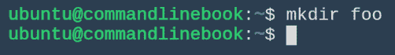
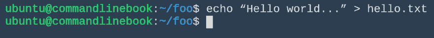
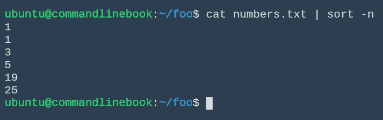
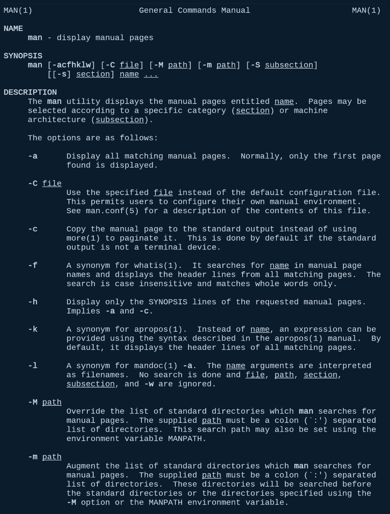
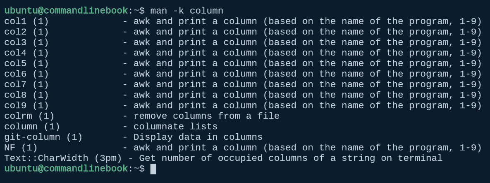

# 二、基本命令

现在我们已经设置并安装了命令行，我们将查看被认为是基本的日常命令列表。对基本命令有一个基本的理解将是我们学习本书后面的高级命令的基础。

在本章中，我们将讨论以下主题:

*   基本命令行导航
*   重定向输入和输出
*   如果你被困住了，去哪里寻求帮助
*   如何根据自己的喜好定制Shell


# 基本命令

哇哦...别急，我们需要介绍一些关于命令的基础知识。命令是由符合 **POSIX** ( **便携操作系统接口**)的 **OS** ( **操作系统**)运行的进程。除了被批准为 IEEE 标准([http://pubs.opengroup.org/onlinepubs/9699919799/](http://pubs.opengroup.org/onlinepubs/9699919799/))之外，OpenGroup 还维护该标准。在 POSIX 环境中，正在运行的进程将拥有一个环境、一个当前工作目录、命令行(调用该命令的路径名和任何参数)以及一系列文件描述符，这些文件描述符带有`stdin`、`stdout`和`stderr`(分别用整数 0、1 和 2 表示)，它们在传递到您的命令之前是连接的。

现在，有了一些背景知识和安装的命令行，您就可以开始运行命令了。我们将复习一些基本的日常命令。对于那些准备深入研究的人，让我们讨论一下如何定位我们可以运行的命令。

定位命令类似于搜索文件柜，我们称之为文件系统。命令只是存储在文件柜中的文件，文件夹或目录用于将文件组织成层次结构。每个目录可能包含许多文件或其他目录，并且只有一个父目录。要打开我们的文件柜，我们需要从层次结构的顶层开始，根目录，`/`。您需要知道的第一组命令涉及遍历文件系统和确定方向的命令。

当您登录到命令行时，您可能会在您的主目录中。这个目录因系统而异。要查看您所在的位置，请尝试使用`pwd`(当前工作目录)命令:

```sh
pwd
```

以下是您在运行上述命令时应该看到的内容:


这里，`ubuntu`是您的用户名。这意味着你现在在主目录`/`下的`ubuntu`目录中。从这里开始，如果您试图打开一个具有相对路径名的文件，也就是说，一个不以`/`开头的文件，命令行将在您的当前目录中查找该文件(您可以对其他目录中的文件做一些事情，而不改变您的当前目录，我们稍后将对此进行讨论)。

您可能想要创建自己的目录。为此，我们可以尝试以下命令:

```sh
mkdir foo
```

以下是您在运行上述命令时应该看到的内容:



这使得目录`foo`位于您当前的目录中。如果该命令成功完成，它不会打印任何内容。要查看我们刚刚创建的目录，我们使用 list 命令:

```sh
 ls
```

以下是您在运行上述命令时应该看到的内容:


它应该单独在一行上。我们可能希望打印出关于目录的更多信息。在这种情况下，我们可以向`ls`命令传递一些标志来改变它正在做的事情。例如，键入以下内容:

```sh
ls -l
```

这是您在运行上述命令时应该看到的内容:


现在理解这里打印的所有内容并不太重要，但是我们可以看到 foo 是一个目录，而不是一个数据文件(从前面的`d`代码)，以及它创建的日期和时间。这是 UNIX 命令中的一种常见模式。该命令的默认版本只做一件事，传递类似于`-l`的标志。

有时，命令有参数，有时命令的标志也会有参数。命令的一般形式可能如下所示:

```sh
<command> -a <argument> -b -c -d <argument> <command arguments>
```

这里，`a`、`b`、`c`和`d`是命令的标志。这些命令到底是什么，它们做什么，取决于命令。

让我们进入新创建的目录，处理一些数据文件:

```sh
cd foo
```

以下是您在运行上述命令时应该看到的内容:


`cd`(或改变目录)命令改变你当前的工作目录。现在让我们将两个命令串在一起创建一个数据文件。我们稍后会谈到这一点，但现在我们只需要一个文件:

```sh
echo “Hello world...” > hello.txt
```

以下是您在运行上述命令时应该看到的内容:



这不会产生任何输出，但是它将创建一个名为`hello.txt`的文件(正如我们告诉 shell 用`>`将`stdout`重定向到一个文件)，该文件包含 Hello world…文本的单行内容。要了解这一点，我们可以使用 concatenate 命令:

```sh
cat hello.txt
```

以下是您在运行上述命令时应该看到的内容:


这将打印任何文件的内容。如果我们只想看到文件的第一行或最后几行，我们可以使用`head`和`tail`来代替`cat`。

如果这一切听起来很简单，那么有一个很好的理由:UNIX 中的每个命令都是为了做一件事，并且把它做好。选项通常可用于定制命令的行为。当我们开始使用管道和重定向将命令捆绑在一起时，您可以做的真正巧妙的事情就开始发生了。

您看，UNIX 中的几乎每个命令都有某种方式向其中输入数据。然后，该命令接受输入，并根据其参数和标志，将输入转换为其他内容并输出。我们可以使用管道`|`从一个命令获取输出，并将其输入到另一个命令的输入中。这个简单但极其强大的想法将让我们用几个命令做很多事情。

让我们尝试一个简单的例子:让我们使用`echo`，带`-e`标志，告诉它注意控制字符，制作一个多行文件(通过使用`\n`)，每行有一些数字。

```sh
echo -e "1\n3\n19\n1\n25\n5" > numbers.txt
cat numbers.txt
```

以下是您在运行上述命令时应该看到的内容:


现在，假设我们希望看到这些数字排序。`sort`命令就是这样做的。使用一个标志进行排序，将行视为数字而不是字符串，我们可以将`cat`的输出通过管道传输到`sort`函数中:

```sh
cat numbers.txt | sort -n
```

以下是您在运行上述命令时应该看到的内容:



如果我们希望只看到排序后的唯一数字，我们可以将这个输出重新传输到`uniq`命令，该命令从给定的输入中返回唯一的行:

```sh
cat numbers.txt | sort -n | uniq
```

以下是您在运行上述命令时应该看到的内容:


等等，等等。我们可以一次一点地构建我们想要的管道，一路调试。你会在本书中看到这种技术。

最后一件事:在这些命令中，我们已经看到了`>`，或者重定向。重定向可以用于许多方面，但大多数时候它用于将命令的输出重定向到文件:

```sh
<some pipeline of commands>  > <filename>
```

这将用管道的输出替换文件名文件的内容。

有了这些简单的工具，您就有足够的东西开始用 bash 处理数据了。


# 导航命令行

有几个导航命令行的有用技巧，虽然是可选的，但会提高您的生活质量。本节有这些技巧的精选。

默认情况下，Bash 保存命令的历史。它甚至可以跨会话保存历史记录。这非常有用，因为有时我们犯了一个小错误，不想重新输入整个命令，或者我们想一遍又一遍地重复相同的命令。要查看您的历史记录，请键入以下命令:

```sh
history
```

以下是您在运行上述命令时应该看到的内容:


您可以看到有一个输出命令的编号列表。要重复编号的命令，可以使用竖线字符`!`。`!<number>`将逐字重复编号命令:

```sh
!10
```

以下是您在运行上述命令时应该看到的内容:


双击`!!`，将重复最后一个命令。

您也可以使用键盘上的上下箭头键在命令列表中循环。

您可以通过在一个空命令行中键入 *Ctrl* + *R* 来执行反向命令搜索。然后开始键入您想要搜索的某个命令的子字符串。Bash 将尝试在您的历史中的某个地方找到匹配的命令。如果多个命令匹配，将选择最后一个，但是您可以通过重复按下 *Ctrl* + *R* 来循环其他命令。

将带你回到你来的最后一个目录，即使它在系统的中间。

让一些人困惑的一件事是打 *Ctrl* + *S* 。这将停止对终端会话的所有输出，并且看起来好像您的会话被冻结了。要解冻会话，只需按下 *Ctrl* + Q


# 获得帮助

有许多资源可用，既有内置在命令行中的，也有外部的。您会发现自己经常使用的一个命令是`man`命令(手册页的缩写)。例如，键入`man man`来阅读 man 命令可以做什么。您应该会看到类似这样的内容:



让我们看一下我们几乎每天都在使用的两个选项，`man -a`和`man -k`，因为您会经常在命令行中使用它们来查找手册页。继续在命令行中键入`man -k .`，查看系统上安装的所有手册页。如果你使用和我们一样的 Linux 发行版，大约有 2000 本手册在你的屏幕上滚动，这是一个很大的阅读量！我们并不期望你从头开始阅读每一本书(如果你失眠的话，可以这样做)，所以让我们找出一些更聪明的方法来浏览所有这些手册。

如果你想慢慢地滚动整个手册列表，你可以运行`man -k . | more`并持续点击空格键来查看整个列表。然而，这是低效的。注意，在前面的例子中，我们使用点(.)而不是字符串。让我们再试一次，但这次去掉圆点，输入一个单词:

```sh
man -k column
```

以下是您在运行上述命令时应该看到的内容:



好多了！现在，我可以很快看到 column 命令是否有手册页，而不用解析成千上万的页面。

手册很棒，但有时还不够。进入互联网。当试图解决命令的深奥问题或给出好的例子时，像 Stack Overflow 和 Stack Exchange 这样的站点是非常宝贵的。互联网是一个很大的地方:有人会试图做你正在做的事情，很可能他们有和你一样的问题。您的问题可能已经存在已回答的问题，或者您可以提交一个新问题。


# 定制Shell

您可能已经注意到了每次在左侧输入命令时的提示。根据您的系统，它可能看起来与我的略有不同。让我们解决这个问题！例如，如果你不需要一直输入`pwd`来查看你在哪里，那不是很好吗？继续输入以下内容:

```sh
export PS1="\u@\h:\w>"
```

您应该会看到类似这样的内容:


很漂亮，对吧？您可以将该命令添加到您的`~/.bash_profile`文件中，使其永久保存。您可以使用任何您喜欢的编辑器(`vim`、`nano`、`emacs`)来打开文件。例如，我们用了`vim`:

```sh
vim ~/.bash_profile
```

在[http://ezprompt.net/](http://ezprompt.net/)还有一个简单的生成器，可以用来进一步定制 bash 提示符。看一看！

现在，您已经理解了基础知识并完全设计好了 bash 提示符，让我们继续处理实际的数据集吧！


# 摘要

如您所见，命令行对于日常任务来说非常强大。我们学习了如何做一些基本的事情，比如创建文件和目录，以及通过命令行导航系统。我们学习了手册页、哪里可以找到帮助，以及如何定制 shell。

在下一章，我们将把你在这里学到的东西应用到真实的数据集上。请随时回到这一章，因为它将有助于本书的其余部分。