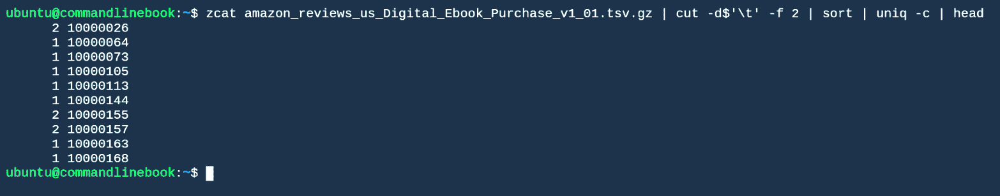
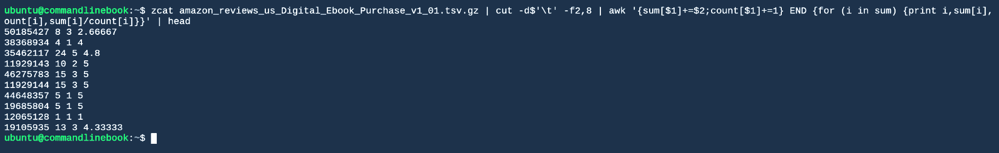
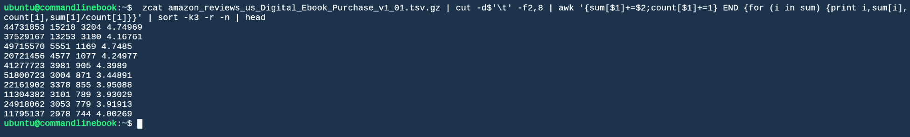
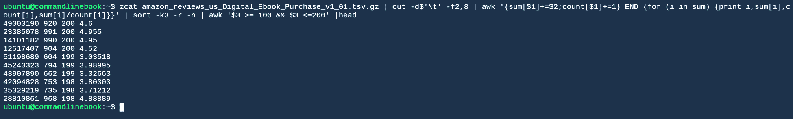
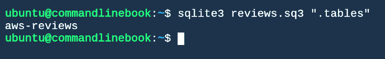
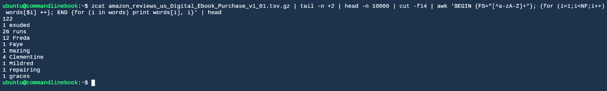
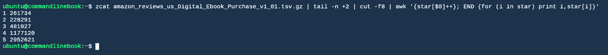
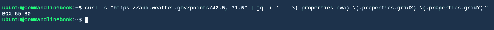

# 六、SQL、数学和打包到一起

数据库是存储和访问数据的有吸引力的解决方案。它们为开发人员提供了一个 API，允许数据的结构化组织，以灵活的方式搜索数据的能力，以及存储新数据的能力。当需要数据库的能力时，通常就没有什么商量的余地了；问题是哪个数据库，而不是我们是否应该使用一个。

尽管如此，Unix 命令行还是提供了一套工具，让开发人员可以像查看数据库一样查看流或文件。给定一个或多个包含数据的文件，我们可以使用这些工具来查询数据，而不必维护数据库或任何与之相关的东西，比如固定模式。通常，我们可以使用这种方法来处理数据，而不是建立一个数据库服务器，并处理与将数据**提取**、**转换**和**加载** ( **ETL** )到数据库中相关的问题。更好的是，我们的管道，因此我们的数据视图，可以随着时间的推移而改变，不像传统数据库的相对静态的模式。

通常，您需要在工作流中对数字数据进行计算。命令行有几个工具可以让我们做到这一点。

Bash 本身有能力在 shell 脚本中做一些数学运算。当需要更多的功能时，两个命令行工具`bc`和`awk`能够进行多种类型的计算。

有时，我们可能需要一种编程语言和数学软件包的全部功能，比如 Python 和 Pandas。虽然这不是关于如何用 Python 进行数据科学的教程，但在本章中，我们将看到如何将 Python 例程与其他命令行工具进行接口，并根据您的需求构建自定义管道。

我们还将使用本书中提到的许多工具对天气数据进行一些实际分析。

因此，总而言之，在本章中，我们将了解:

*   使用`cut`以列的形式查看数据
*   使用`grep`作为`WHERE`子句
*   使用`join`命令连接不同的数据集
*   刺激的
*   学习如何在需要功能更全面的数据库时使用 SQLite
*   Bash 变量赋值
*   基本 bash 算法和比较
*   数学使用`bc`
*   使用`awk`进行流式计算
*   与 python 例程接口
*   查看公开可用的天气 API 的内容
*   抓取 API 并将结果存储在轻量级数据库中
*   使用前面章节中讨论的工具来分析我们创建的数据库中的数据
*   就天气预报的准确性得出一些结论


# 以分栏方式剪切和查看数据

您可能需要做的第一件事是将文件中的数据划分为数据行和数据列。在前面的章节中，我们看到了一些允许我们一次处理一行数据的转换。在本章中，我们将假设数据行与文件中的数据行相对应。如果不是这种情况，这可能是您在管道中想做的第一件事。

假设我们的文件或流中有一些数据行，我们希望以列的方式查看这些行，比如传统的数据库。我们可以借助`cut`命令来完成这项工作。`cut`将允许我们通过一个分隔符将文件的行分割成列，并选择将哪些列传递给输出。

如果您的数据是逗号分隔或制表符分隔的文件，`cut`非常简单:

```sh
zcat amazon_reviews_us_Digital_Ebook_Purchase_v1_01.tsv.gz | cut -d$'\t' -f2,8 | head
```

上述代码会产生以下结果:


在这个命令中，我们告诉`cut`分隔符正在使用`-d$'\t'`。此外，我们使用`-f2,8`选项告诉`cut`我们希望将哪些列从输入传递到输出。注意，我们捕获了数据的标题行，这可能不是我们想要的。要跳过它，请在管道中添加`tail -n +2`:

```sh
zcat amazon_reviews_us_Digital_Ebook_Purchase_v1_01.tsv.gz | cut -d$'\t' -f2,8 | tail -n +2 | head
```

上述代码会产生以下结果:


如果您的生产线比 CSV 或 TSV 更复杂，您可能需要使用 cut 进行多次操作，或者使用`awk`或`sed`进行干预。例如，在书评数据集中，假设我们想要输出日期字段，但是按照年-月-日的顺序。我们可以首先向下选择日期字段，将日期字段重新切割成其组成部分，并按照所需的顺序输出它们:

```sh
zcat amazon_reviews_us_Digital_Ebook_Purchase_v1_01.tsv.gz | cut -d$'\t' -f15 | cut -d$'-' -f2,3,1 | head
```

上述代码会产生以下结果:


如果您有固定宽度的字段，也可以从流中剪切特定的字节或字符:

```sh
zcat amazon_reviews_us_Digital_Ebook_Purchase_v1_01.tsv.gz | cut -c1-12 | head
```

上述代码会产生以下结果:


在图书数据的情况下，这没有多大意义，因为字段是可变宽度的，但有时这正是您所需要的。

以这种方式使用`cut`将成为您在数据的每一行中使用类似 SQL 的特殊字符`SELECT`的工具。


# where 子句

我们在前一章中讨论的强大的 grep 正则表达式匹配工具允许我们对文件执行`WHERE`子句。该子句可能没有 SQL `WHERE`子句那么直观，但是我们可以使用 grep 做和使用 SQL `WHERE`子句一样多或者更多的事情。例如，也许我们只关心以数字`3`开头的账户:

```sh
zcat amazon_reviews_us_Digital_Ebook_Purchase_v1_01.tsv.gz | cut -d$'\t' -f2,8 | tail -n +2 | grep "^3" | head 
```

以下内容将显示在您的屏幕上:


# 连接，用于连接数据

Join 的工作原理是`INNER JOIN`在 SQL 风格的数据库中的工作原理。两个排序后的文件或流被传递给`join`命令(参见排序一节，了解如何`sort`您的流)。文件的行必须按照您试图连接的字段进行排序。然后，`join`命令将输出这两个文件内部连接的结果，如果有匹配的字段，它将输出`join`键以及第一个文件与第二个文件连接的其余数据行。

例如，假设我们希望找到同时出现在第一个和第二个评论文件中的用户，以及他们在每个文件中有多少评论。我们可以运行下面的`join`命令:

```sh
join -j2 <(zcat amazon_reviews_us_Digital_Ebook_Purchase_v1_01.tsv.gz | cut -d$'\t' -f2 | sort | uniq -c) <(zcat amazon_reviews_us_Digital_Ebook_Purchase_v1_00.tsv.gz | cut -d$'\t' -f2 | sort | uniq -c) | head
```

上述代码会产生以下结果:


这里，我们使用进程替换来分割评审文件的数据。这是并行进行的，提高了处理速度。


# 分组依据和排序

我们可以通过使用管道连接到`uniq -c`的`sort`来执行`GROUP BY`操作(如[第 5 章](df05c890-510b-4e7e-8cc2-200f68f2febf.xhtml)、*循环、函数和字符串处理*中所讨论的):

```sh
zcat amazon_reviews_us_Digital_Ebook_Purchase_v1_01.tsv.gz | cut -d$'\t' -f 2 | sort | uniq -c | head
```

上述代码会产生以下结果:



在前面的例子中，我们只是计算每个用户做了多少评论。我们可能希望获得每个用户的平均评论，这可以使用`awk`关联数组来完成:

```sh
zcat amazon_reviews_us_Digital_Ebook_Purchase_v1_01.tsv.gz | cut -d$'\t' -f2,8 | awk '{sum[$1]+=$2;count[$1]+=1} END {for (i in sum) {print i,sum[i],count[i],sum[i]/count[i]}}' | head 
```

上述代码会产生以下结果:



这里，该命令的输出是 ID、评论总数、评论数和每个用户的平均评论数。

我们还可以使用相同的工具`sort`对结果数据进行排序。例如，我们可以用前面的`GROUP BY`例子和`ORDER BY`每个用户的评论数量来找到最多产的评论者:

```sh
zcat amazon_reviews_us_Digital_Ebook_Purchase_v1_01.tsv.gz | cut -d$'\t' -f2,8 | awk '{sum[$1]+=$2;count[$1]+=1} END {for (i in sum) {print i,sum[i],count[i],sum[i]/count[i]}}' | sort -k3 -r -n | head
```

上述代码会产生以下结果:



每个用户为找到最多产的评论者所做的评论的数量


# 模拟选择

在前面的章节中，我们看到了如何对数据进行`SELECT`操作、内部数据进行`JOIN`操作，甚至对平面文件或数据流进行`GROUP BY`和`ORDER BY`操作。除了常用的操作之外，我们还可以通过简单地将一组调用封装到一个流中，然后进一步处理它们，来创建子选择的数据表。这就是我们使用管道模型所做的事情，但是为了说明一点，假设我们想从分组的评论中只选择那些在`100`和`200`之间的评论。我们可以使用上一个例子中的命令并再次使用`awk`:

```sh
zcat amazon_reviews_us_Digital_Ebook_Purchase_v1_01.tsv.gz | cut -d$'\t' -f2,8 | awk '{sum[$1]+=$2;count[$1]+=1} END {for (i in sum) {print i,sum[i],count[i],sum[i]/count[i]}}' | sort -k3 -r -n | awk '$3 >= 100 && $3 <=200' | head 
```

上述代码会产生以下结果:



从分组的评论中只选择那些具有 100 到 200 个评论的评论者

使用所有这些工具，您看到了我们如何使用命令行在文件行或流数据上模拟大多数常见的 SQL 表达式。


# 王国的钥匙

现在，我们可以使用命令行探索数据，并掌握了转换文本，我们将为您提供通往王国的钥匙。SQLite 是一个公共域库，它实现了一个 SQL 引擎，并提供了一个用于与数据库文件交互的`sqlite`命令Shell。与 Oracle、MySQL 和其他提供网络端点的数据库引擎不同，sqlite 是离线的，由库调用在本地驱动，与整个数据库中的单个文件进行交互。这使得备份变得容易。通过执行`cp database.sq3 backups/`date +%F`-database.sq3`可以创建备份。人们可以对其进行版本控制，但这不太可能通过增量比较来很好地压缩。


# 使用 SQLite

轻松导入 CSV 文件(带自定义分隔符):

```sh
head -n21 amazon_reviews_us_Digital_Ebook_Purchase_v1_00.tsv > test.csv 
sqlite3 test.sq3 <<EOF
.mode csv
.separator "\t"
.import test.csv test_reviews
EOF
```

需要对数据进行一些处理才能将其转换为 CSV 格式——数据集中有一些有问题的字符——让我们使用一些 shell hackery 来使其统一:

```sh
COLS=`head  amazon_reviews_us_Digital_Ebook_Purchase_v1_00.tsv | head -n1 | sed -e 's:^\|$:":g; s:\t:", ":g'`

VALUES=`head  amazon_reviews_us_Digital_Ebook_Purchase_v1_00.tsv | tail -n1 | sed -e 's:^\|$:":g; s:\t:", ":g'` sqlite3 reviews.sq3 "create table ‘aws-reviews' ( $COLS) ;" 
```

使用以下命令显示表格:

```sh
sqlite3 reviews.sq3 ".tables"
```

前面的代码显示了数据库中的表:



要显示表列的数据类型，请运行以下命令:

```sh
 sqlite3 reviews.sq3 ".schema aws-reviews"
```

上述代码会产生以下输出:


显示表列的数据类型

将 20 行亚马逊评论加载到名为`reviews.sq3`的 sqlite 数据库的`aws_reviews`表中:

```sh
head -n21 amazon_reviews_us_Digital_Ebook_Purchase_v1_00.tsv | sed '1d; s/"/""/g ; s/\t/", "/g;' | while read LINE ; do VALUES="\"${LINE}\"" ; sqlite3 reviews.sq3 "insert into aws_reviews ($COLS) VALUES ($VALUES) ;"; done  
```

我们读了前 21 行。我们的流编辑器去掉第一行(头)，用第二对引号转义任何双引号(我们知道这是时髦的转义)，并用一个值分隔符替换“tab”分隔符，该值分隔符终止字符串并指示它有一个后续元素。

然后，我们将读取的`LINE`转换成我们的输入`VALUES`，方法是在前面加上一个双引号，然后附加一个双引号，以完成对值的正确格式化。最后，我们的数据可以插入到表中了。

请注意，sqlite3 使用第二个引号字符作为引号转义序列，类似于使用`%%`和`printf`来获得文字`%`字符。

现在，我们可以像任何传统数据库一样查询数据，因为 sqlite 是库形式的数据库引擎:

```sh
sqlite3 reviews.sq3 “select * from aws_reviews”
```


# bash 本身的数学

Bash 本身能够进行简单的整数运算。在 bash 中，至少有三种不同的方法可以实现这一点。


# 使用 let

您可以使用 let 命令进行简单的 bash 运算:

```sh
$ let x=1
 $ echo $x
 1
 $ let x=$x+1
 $ echo $x
2
```


# 基本算术

可以做加、减、乘(一定要用`\*`转义`*`运算符)和整数除法 *:*

```sh
expr 1 + 2
3
expr 3 \* 10
30
```

这些数字必须用空格隔开。


# 双括号

与 let 类似，您可以在 bash 中使用双括号进行简单的整数运算:

```sh
a=$((1 + 2))
echo $a 
((a++))
echo $a

3
4
```

要查看 shell 中所有可用的操作，请查看 GNU 参考页面:[https://www . GNU . org/software/bash/manual/html _ node/Shell-algorithm . html](https://www.gnu.org/software/bash/manual/html_node/Shell-Arithmetic.html)。


# bc，unix 基本计算器

`bc`是一种计算器脚本语言。可以用`bc`命令执行`bc`中的脚本。假设一个`test.bc`文件包含以下代码:

```sh
scale = 2;
(10.0*2+2)/7;
```

这意味着您可以像这样运行`bc`:

```sh
cat test.bc | bc
3.14
```

可以做的远不止是将两个数相除。它本身是一种成熟的脚本语言，你可以用一个`bc`脚本做任意复杂的事情。一个`bc`脚本可能是数据管道的终点，在那里，最初，数据文件被处理成一个数据行流，然后一个`bc`脚本被用来计算我们正在寻找的值。让我们用一个简单的例子来说明这个问题。

在本例中，我们需要获取一个 CSV 数据文件，计算每一行中第二个数字的平均值，并计算每一行中第四个数字的总和。假设我们有一个`bc`函数来计算这两个数字上的一些有趣的东西，比如调和平均值。我们可以使用`awk`将数字输出到`bc`脚本中，然后使用管道将结果输入到`bc`中。

因此，假设我们的`bc`函数计算两个数字的调和平均值，如下所示:

```sh
scale=5; 
define harmonic(x,y){ return 2.0/((1.0/x) + (1.0/y)); }
```

我们可以使用`awk`找到这两个数字并构建`bc`脚本，然后通过管道将其发送给`bc`来执行:

```sh
awk '{s+=$2 ; f+=$4}END{print "scale=5;\n define harmonic(x,y){ return 2.0/((1.0/x) + (1.0/y)); } \n harmonic(",s/NR,",",f,")"}' data.txt | bc
```

参见 https://www.gnu.org/software/bc/manual/html_mono/bc.html[的`bc`文档，了解更多你可以用`bc`做的事情。](https://www.gnu.org/software/bc/manual/html_mono/bc.html)


# 数学(g)awk

`awk`(包括`gnu`实现，`gawk`)被设计成流文本处理、数据提取和报告。很大一部分实用统计是由特定方式的计数组成的，这也是`awk`擅长的事情之一。在`awk`中，统计总数、直方图和分组计数都非常容易。

一个`awk`程序的结构是一组匹配的模式，以及当这些模式匹配时要采取的行动:

```sh
pattern {action}
pattern {action}
pattern {action}
…
```

对于每一条记录(通常是传递给`awk`的每一行文本)，测试每一个模式，看记录是否匹配，如果匹配，就采取行动。此外，每条记录都被一个分隔符自动分割成一个字段列表。如果没有给定，默认操作是打印记录。默认模式是匹配所有内容。有两种特殊的模式，`BEGIN`和`END`，它们分别只在处理任何记录之前或之后进行匹配。

`awk`的强大之处在于它的变量:变量可以不用声明就可以使用。已经有一些对数学有用的特殊变量:

```sh
$0: The text of the entire record.
$1, $2, … : The text of the 1st, 2nd, etc fields in the record.
NF: The number of fields in the current record.
NR: The current count of records (equal to the total number of records in the END step)
```

此外，您可以给自己的变量赋值。`awk`原生提供可以保存字符串、整数、浮点数、正则表达式和关联数组的变量。

举个例子，假设我们想要统计测试数据的评论中的词频。运行以下代码:

```sh
zcat amazon_reviews_us_Digital_Ebook_Purchase_v1_01.tsv.gz | tail -n +2 | head -n 10000 | cut -f14 | awk 'BEGIN {FS="[^a-zA-Z]+"}; {for (i=1;i<NF;i++) words[$i] ++}; END {for (i in words) print words[i], i}' | head
```

它将产生以下结果:



统计测试数据评论中的词频

假设我们想要计算评论星级值的直方图。使用`awk`也很容易做到:

```sh
zcat amazon_reviews_us_Digital_Ebook_Purchase_v1_01.tsv.gz | tail -n +2 | cut -f8 | awk '{star[$0]++}; END {for (i in star) print i,star[i]}'
```

前面的代码产生了这样的结果:



计算评论的星级值的直方图

我们可以看到，四星和五星评论主导了这个数据集。

除了计数，`awk`对于操作字符串的格式也很棒:回头看看[第五章](df05c890-510b-4e7e-8cc2-200f68f2febf.xhtml)、*循环、函数和字符串处理*，可以找到一些使用`awk`进行字符串操作的例子。


# Python(Pandas、numpy、scikit-learn)

数东西通常会让你到达你需要的地方，但有时需要更复杂的工具来完成这项工作。幸运的是，如果我们愿意，我们可以用 UNIX 范式编写自己的工具，并在我们的工作流管道中与其他命令行工具一起使用。

其中一个工具是 python，以及流行的数据科学库，如`pandas`、`numpy`和`scikit-learn`。这并不是关于这些库能为你做的所有伟大事情的文本(如果你想学习，一个好的起点是官方 python 教程([https://docs.python.org/3/tutorial/](https://docs.python.org/3/tutorial/))和Pandas文档中的Pandas数据结构基础([https://pandas.pydata.org/pandas-docs/stable/basics.html](https://pandas.pydata.org/pandas-docs/stable/basics.html))。在继续之前，确保您已经安装了 Python、`pip`和`pandas`(参见[第 1 章](d26c5d26-6302-4b9d-b6ce-62b1ab13db0d.xhtml)、*命令行上的数据科学和设置*)。

但是，如果您想将 python 程序连接到管道流，当然有很多方法可以做到。一个简单的方法是使用`sys`库。假设我们有一个调优到数据集的小Pandas程序，它计算数据中已知的几个列的平均值:

```sh
import sys
import pandas as pd

df = pd.read_csv(sys.stdin,sep='\t')
print 'star rating mean',df['star_rating'].mean()
print 'helpful votes mean', df['helpful_votes'].mean()
```

请注意我们是如何直接从`sys.stdin`流中获取数据并将该数据传递给 pandas 的`read_csv`方法的(使用 tab 作为分隔符)。如果我们使用这种方法，我们可以将数据直接传输到脚本中:

```sh
zcat amazon_reviews_us_Digital_Ebook_Purchase_v1_01.tsv.gz | head -n 100 | python average.py
```

上述代码会产生以下输出:


# 在 bash 中分析天气数据

国家气象局有一个获取天气数据的 API:[https://forecast-v3.weather.gov/documentation](https://forecast-v3.weather.gov/documentation)。API 通过一个轻量级的 HTTP 接口提供预测数据。如果将正确的 URL 和参数传递给 web 端点，服务将返回 JSON 格式的天气数据。让我们来看一个例子，我们可以用这个丰富的数据集进行一些数据探索。

NWS 提供当前的天气数据和预报。比方说，我想看看 NWS 的预报有多准确。我想花一段时间来做这件事，比如说一周。我想保存明天的天气预报，然后稍后，将这些预报与实际温度进行比较。对于这个例子，让我们看看预测的高温和实际的高温。我想为伦敦的一个点做这件事。

我们的总体计划是每天一次在 CSV 文件中记录下第二天的高温预报。每小时一次，我们将在另一个 CSV 文件中记录实际温度。然后，我们将编写一个脚本来比较这两个文件，并计算多天内每种预测类型(一天预测、两天预测等等)的准确性。

首先，我们需要能够在 API 中查询正确的端点。气象服务数据被网格化成一组网格位置。为了找到特定纬度点的网格，我们可以查询 API:

```sh
curl -s "https://api.weather.gov/points/42.5,-71.5"
```

查询 API 会返回以下内容:

```sh
{
 "@context": [
 "https://raw.githubusercontent.com/geojson/geojson-ld/master/contexts/geojson-base.jsonld",

 {
 "wx": "https://api.weather.gov/ontology#",
 "s": "https://schema.org/",
 "geo": "http://www.opengis.net/ont/geosparql#",
 "unit": "http://codes.wmo.int/common/unit/",
 "@vocab": "https://api.weather.gov/ontology#",
 "geometry": {
 "@id": "s:GeoCoordinates",
 "@type": "geo:wktLiteral"
 }
 [......]
}
```

JSON 中有很多无关的信息，而我们实际上只需要网格坐标和预测区域。让我们使用`jq` UNIX 工具来解析这个 JSON 并提取相关信息:

```sh
curl -s "https://api.weather.gov/points/42.5,-71.5" | jq -r '.| "\(.properties.cwa) \(.properties.gridX) \(.properties.gridY)"'
```

相关信息如下所示:



这里，我们使用了`jq`来解析和格式化一些文本，然后我们可以将这些文本插入到一个 URL 中，我们可以为预测重新卷曲这些文本。然而，有用的是，API 实际上在`properties.forecastGridData`特性中为我们提供了 JSON 中预测的完整 URL:

```sh
curl -s "https://api.weather.gov/points/42.5,-71.5" | jq -r '.| "\(.properties.forecastGridData)"' 
```

上述代码会产生以下输出:

```sh
https://api.weather.gov/gridpoints/BOX/55,80
```

我们将获取这个 URL，`curl`再次将其放入`jq`，并提取第二天的高温预报。使用`jq`，我们将这些格式化成一个 CSV 行，稍后我们将把它添加到我们的平面文件数据表中。对于这个例子，我们将忽略时区，并假设每天的开始和结束时间都是祖鲁时间。运行以下代码:

```sh
curl -s "https://api.weather.gov/gridpoints/BOX/55,80" |  jq -r '[.properties.maxTemperature.values[1].validTime[0:10],.properties.maxTemperature.values[1].value] | @csv'
```

它产生以下输出:

```sh
"2018-06-22",23.88888888888897
```

由于你在 2018-06-22 之后运行，输出将会不同。

看起来棒极了！使用您选择的编辑器将这个命令保存到 bash 脚本中，比如说`forecast.sh`。确保使用`chmod`命令使脚本可执行:

```sh
$ chmod 700 forecast.sh 
```

且让我们`cat`这个文件来查看内容:

```sh
$ cat forecast.sh 
#!/bin/bash
curl -s "https://api.weather.gov/gridpoints/BOX/55,80" | jq -r '[.properties.maxTemperature.values[1].validTime[0:10],.properties.maxTemperature.values[1].value] | @csv'
```

让我们将它添加到 cron[1]任务中，每天中午运行一次，并将结果行添加到一个`.csv`文件中。Cron 是一个系统实用程序，它将按计划运行命令。时间表如下所示:

```sh
<minutes to run> <hours to run> <day of month to run> <month to run> <day of week to run>
```

因此，如果我们希望每天运行一次，我们希望在特定小时的特定分钟运行它，但是在一周的每一天、每一个月和每一天运行，给出以下 cron 模式，例如，我们希望每天中午运行:

```sh
0 12 * * *
```

要将脚本添加到 cron 的列表中，您需要运行以下命令:

```sh
crontab -e
```

将下面一行添加到您的`crontab`中:

```sh
0 12 * * * sh <script location>/forecast.sh >> <data dir>forecast.csv
```

现在，每天的预测都将被附加到您指定的文件中。

为了获得当前的天气数据，我们需要找到离我们的网格点最近的气象站:

```sh
curl -s "https://api.weather.gov/gridpoints/BOX/55,80/stations" | jq -r '.observationStations[0]'
```

上述代码会产生以下输出:

```sh
https://api.weather.gov/stations/KBED
```

当前天气位于以下空气污染指数点:

```sh
https://api.weather.gov/stations/KBED/observations/current
```

从这个 API 点，我们可以获取时间戳和当前温度:

```sh
curl -s "https://api.weather.gov/stations/KBED/observations/current" | jq -r '[.properties.timestamp[0:10],.properties.temperature.value]| @csv'"2018-06-21",20.600000000000023
```

将它添加到脚本文件和 crontab 中，设置为每小时运行一次。为此，我们需要在 cron 模式中指定一个分钟，但通配符包含所有其他内容:

```sh
0 * * * * sh <script location>/actual.sh >> <data location>/actual.csv
```

我们让它运行了几个星期来构建我们的数据集。

现在，我们想将每天记录的最高温度与当天记录的天气预报相加，并计算差值。为了找到任何一天的最高温度，我们可以再次使用`gawk`:

```sh
gawk  'BEGIN { FPAT = "([^,]+)|(\"[^\"]+\")" } {count[$1]++ ; max[$1] = (count[$1]==1||max[$1]<$2)?$2:max[$1]} END{ for (i in max) print $i,max[$i]}' actual.csv 
"2018-06-22",18.900000000000034
```

然后，我们可以将这个结果加入到我们的预测中。由于输出已经按照可排序的 YYYY-MM-DD 顺序按日期排序，我们不需要预先排序。运行以下命令:

```sh
 join -t',' <(gawk  'BEGIN { FPAT = "([^,]+)|(\"[^\"]+\")" } {count[$1]++ ; max[$1] = (count[$1]==1||max[$1]<$2)?$2:max[$1]} END{ for (i in max) print $i,max[$i]}' actual.csv ) forecast.csv
```

上述代码产生以下输出:

```sh
"2018-06-22",18.900000000000034 ,23.88888888888897
...
```

我们可以通过管道将该流传输到`awk`来计算实际温度和预测温度之间的差异:

```sh
> join -t',' <(gawk  'BEGIN { FPAT = "([^,]+)|(\"[^\"]+\")" } {count[$1]++ ; max[$1] = (count[$1]==1||max[$1]<$2)?$2:max[$1]} END{ for (i in max) print $i,max[$i]}' actual.csv ) forecast.csv | gawk 'BEGIN { FPAT = "([^,]+)|(\"[^\"]+\")" } {print $1,$2-$3}'
```

上述代码会产生以下结果:

```sh
"2018-06-22" -4.98889
```

我们从互联网上抓取真实数据，使用工作流对其进行处理，将其存储到文件中，并使用我们制作的表格中的数据计算数值！


# 摘要

在本章中，我们使用`cut`、`grep`、`awk`和`sort`来深入检查我们的数据，就像在更传统的数据库中一样。然后我们看到了 sqlite 如何为其他数据库提供一个轻量级的替代方案。结合使用这些工具，我们能够从原始文件中挖掘有用的知识。

我们还看到了命令行如何为算术和其他数学运算提供几个选项。简单的算术和分组计数可以使用 bash 本身或`awk`来执行。更复杂的数学可以使用脚本语言来完成，例如`bc`或 python，并像其他命令行工作流工具一样被调用。

最后，我们使用了我们讨论过的许多工具，从公开可用的数据中产生了一个有用且有趣的结果。

我们希望这本书能拓宽你对命令行实际上有多强大的理解，尤其是对于数据科学。然而，这仅仅是开始。有许多工具和其他命令我们还没有提到，它们非常强大，值得一提。`BashHTTPD`([https://github.com/avleen/bashttpd](https://github.com/avleen/bashttpd))是 bash 中的 web 服务器；这听起来可能很傻，但是 shell 确实可以做一些令人惊奇的事情。`BashReduce`([https://github.com/erikfrey/bashreduce](https://github.com/erikfrey/bashreduce))让用户能够在多个机器/内核上运行 bash 命令。您可能已经注意到一些命令需要一点时间来运行。我们建议看一看`BashReduce`，以加快速度。那些熟悉`MapReduce`概念的人应该不会对使用`BashReduce`有任何问题。

我们还想提一下，还有许多其他优秀的命令行工具；我们可以永远写他们。然而，对于这本书，我们决定把重点放在日常命令上，并提供如何使用它们的例子。我们希望你喜欢这本书！