# 六、推荐合适的产品

在本章中，我们将更深入地构建产品推荐系统，通过该系统，我们可以更好地定位客户，使用针对单个客户定制的产品推荐。研究表明，个性化的产品推荐可以提高转化率和客户保留率。随着我们有更多的数据可用于利用数据科学和机器学习进行目标营销，定制产品推荐在营销信息中的重要性和有效性显著增加。在本章中，我们将讨论用于开发推荐系统的常用机器学习算法、协同过滤，以及实现产品推荐协同过滤算法的两种方法。

在本章中，我们将讨论以下主题:

*   协同过滤和产品推荐
*   用 Python 构建产品推荐算法
*   用 R 构建产品推荐算法


# 协同过滤和产品推荐

根据 Salesforce 进行的一项研究，那些被提示个性化产品推荐的客户推动了 24%的订单和 26%的收入。这表明产品推荐对订单量和整体销售收入有多大影响。在 Salesforce 发布的报告中，他们还发现，产品推荐会导致重复访问，推荐购买会产生更高的平均订单价值，客户确实会购买推荐的商品。您可以在[https://www . sales force . com/blog/2017/11/personalized-product-recommendations-drive-just-7-visits-26-revenue](https://www.salesforce.com/blog/2017/11/personalized-product-recommendations-drive-just-7-visits-26-revenue)查看这份报告。


# 产品推荐系统

**产品推荐系统**是一个以预测和编辑顾客可能购买的物品清单为目标的系统。推荐系统在最近几年获得了很大的流行，并且已经被开发和实现用于各种商业用例。例如，音乐流媒体服务 Pandora 利用推荐系统为他们的听众推荐音乐。电子商务公司 Amazon 利用推荐者系统来预测和显示客户可能购买的产品列表。媒体服务提供商网飞利用推荐系统向个人用户推荐他们可能观看的电影或电视节目。推荐系统的使用并不止于此。它还可以用来向用户推荐相关的文章、新闻或书籍。推荐系统具有在各种领域中使用的潜力，在许多业务中扮演着关键角色，尤其是在电子商务和媒体业务中，因为它们直接影响销售收入和用户参与度。

通常有两种方法来生成建议列表:

*   协同过滤
*   基于内容的过滤

**协同过滤**方法是基于之前的用户行为，比如他们浏览的页面，他们购买的产品，或者他们给不同项目的评分。协作过滤方法然后使用该数据来寻找用户或项目之间的相似性，并向用户推荐最相似的项目或内容。协同过滤方法背后的基本假设是，那些在过去观看或购买过类似内容或产品的人很可能在将来观看或购买类似种类的内容或产品。因此，基于这一假设，如果一个人购买了物品 A、B 和 C，而另一个人在过去购买了物品 A、B 和 D，那么第一个人可能购买了物品 D，而另一个人可能购买了物品 C，因为他们之间有许多相似之处。

**另一方面，基于内容的过滤**根据项目或用户的特征产生一个推荐列表。它通常查看描述项目特征的关键字。基于内容的过滤方法背后的基本假设是，用户可能查看或购买与他们过去已经购买或查看的项目相似的项目。例如，如果用户过去听过一些歌曲，那么基于内容的过滤方法将推荐与用户已经听过的那些歌曲具有相似特征的相似种类的歌曲。

在这一章中，我们将使用协同过滤算法来构建一个产品推荐系统。让我们在接下来的部分中更仔细地看看一个协同过滤算法是如何构建的。


# 协同过滤

如前一节所述，协同过滤算法用于根据用户行为历史和用户之间的相似性来推荐产品。为产品推荐系统实现协同过滤算法的第一步是构建一个**用户-商品矩阵**。用户到项目矩阵包括行中的单个用户和列中的单个项目。用一个例子来解释会比较容易。看一下下面的矩阵:


该矩阵中的行代表每个用户，列代表每个项目。每个单元格中的值表示给定用户是否购买了给定的商品。例如，用户 **1** 购买了物品 **B** 和 **D** ，用户 **2** 购买了物品 **A** 、 **B** 、 **C** 和 **E** 。为了建立一个基于协同过滤的产品推荐系统，我们需要首先建立这种类型的用户-商品矩阵。我们将在下一节的编程练习中用一个例子更详细地讨论如何以编程方式构建这样一个矩阵。

有了这个用户-商品矩阵，构建基于协同过滤的产品推荐系统的下一步就是计算用户之间的相似性。为了测量相似度，经常使用**余弦相似度**。计算两个用户之间余弦相似性的公式如下:

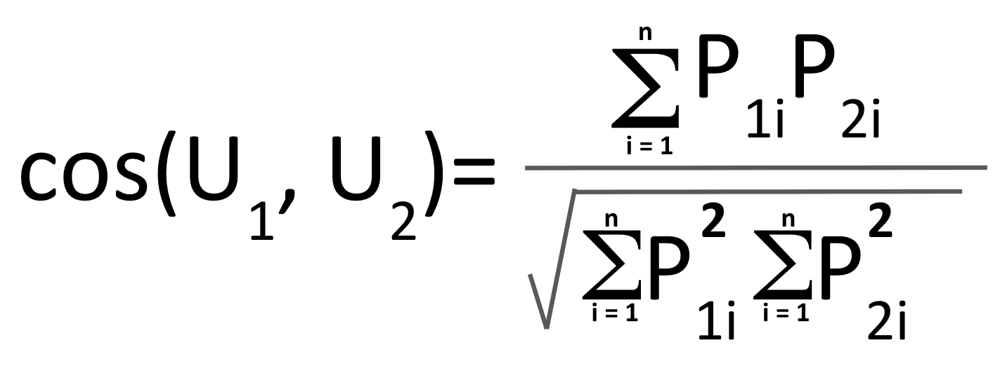

在这个等式中，*U[1]T5 和*U[2]分别代表用户 **1** 和用户 **2** 。*P[1i]T17*P[2i]T21*I*代表用户 **1** 和用户 **2** 购买的每个产品。如果使用这个等式，就会得到`0.353553`作为上例中用户 **1** 和 **2** 之间的余弦相似度，`0.866025`作为用户 **2** 和 **4** 之间的余弦相似度。可以想象，余弦相似度越大，两个用户越相似。因此，在我们的例子中，用户 **2** 和 **4** 比用户 **1** 和 **2** 彼此更相似。在接下来的编程练习部分，我们将讨论如何使用 Python 和 R 计算用户之间的余弦相似度。****

最后，当使用协同过滤算法进行产品推荐时，有两种方法可供选择——基于用户的方法和基于商品的方法。顾名思义，基于用户的协同过滤方法利用了用户之间的相似性。另一方面，基于项目的方法协同过滤利用项目之间的相似性。这意味着，当我们在基于用户的协同过滤方法中计算两个用户之间的相似性时，我们需要构建并使用用户-项目矩阵，正如我们之前所讨论的。然而，对于基于项目的方法，我们需要计算两个项目之间的相似性，这意味着我们需要构建和使用项目到用户的矩阵，这可以通过简单地转置用户到项目的矩阵来获得。在接下来的编程练习部分，我们将更详细地讨论这两种方法之间的差异，以及如何使用 Python 和 r。


# 用 Python 构建产品推荐算法

在这一节中，我们将讨论如何使用 Python 构建一个产品推荐系统。更具体地说，我们将学习如何使用机器学习库`scikit-learn`在 Python 中实现协同过滤算法。对于那些想在这个练习中使用 R 而不是 Python 的读者，您可以跳到下一节。我们将从分析一些电子商务业务数据开始这一部分，然后讨论使用协同过滤构建产品推荐系统的两种方法。

在这个练习中，我们将使用来自 UCI 机器学习库的一个公开可用的数据集，可以在这个链接找到:[http://archive.ics.uci.edu/ml/datasets/online+retail#](http://archive.ics.uci.edu/ml/datasets/online+retail#)。您可以点击这个链接，下载 Microsoft Excel 格式的数据，保存在一个名为`Online Retail.xlsx`的文件中。下载完这些数据后，您可以通过运行以下命令将其加载到 Jupyter 笔记本中:

```py
import pandas as pd

df = pd.read_excel(io='../data/Online Retail.xlsx', sheet_name='Online Retail')
```

类似于[第五章](73a716c6-6a84-4785-b04e-87651d0a29d1.xhtml)、*产品分析*，我们使用`pandas`包中的`read_excel`函数加载 Excel 格式的数据。我们将数据的路径提供给参数`io=`，并将 Excel 电子表格的名称提供给参数`sheet_name`。

一旦将这些数据加载到`pandas` `DataFrame`中，它应该如下面的屏幕截图所示:

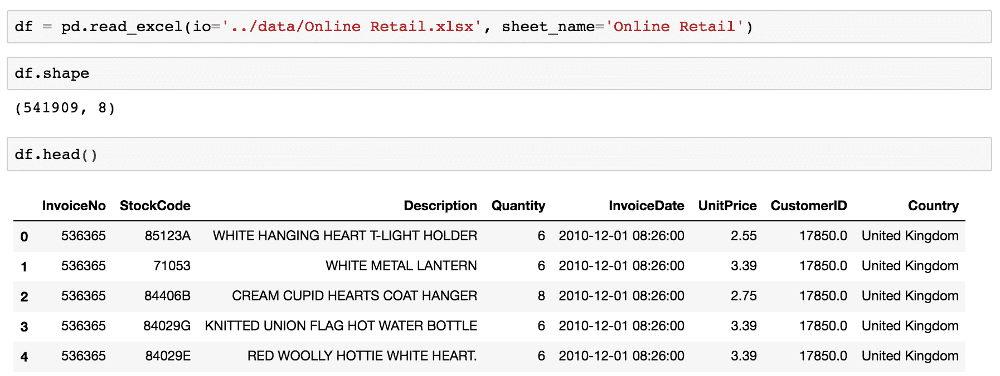

如果您回忆一下上一章，在`Quantity`列中有负值的记录，它们代表取消的订单。我们将忽略并删除这些记录。我们可以用下面的代码过滤掉`DataFrame`中的所有记录:

```py
df = df.loc[df['Quantity'] > 0]
```


# 数据准备

在我们开始使用协同过滤算法构建产品推荐引擎之前，我们需要做以下几件事情:

*   处理数据集中的`NaN`值
*   构建客户到产品的矩阵

首先，我们需要处理数据集中的`NaN`值，尤其是`CustomerID`字段中的那些`NaNs`。没有`CustomerID`字段中的正确值，我们就无法构建一个合适的推荐系统，因为协同过滤算法依赖于单个客户的历史物品购买数据。

第二，在我们继续实现产品推荐的协同过滤算法之前，我们需要建立客户到商品的矩阵。客户-项目矩阵是简单的表格数据，其中每一列代表每一个产品或项目，每一行代表一个客户，每个单元格中的值代表给定的客户是否购买了给定的产品。


# 在 CustomerID 字段中处理 nan

如果你仔细观察数据，你会注意到有些记录没有`CustomerID`。因为我们需要构建一个客户-项目矩阵，其中每一行都是特定于每个客户的，所以我们不能在数据中包含那些没有`CustomerID`的记录。我们先来看看有多少记录没有`CustomerID`。

看一下下面的代码:

```py
df['CustomerID'].isna().sum()
```

我们在这里使用的`isna`函数检测缺失值，并为每个缺失值返回`True`。通过对这些值求和，我们可以计算出没有`CustomerID`的记录的数量。结果如下所示:


从这个输出可以看出，有没有`CustomerID`的`133,361`记录。而`CustomerID`丢失的一些数据看起来如下:


既然我们知道存在缺少`CustomerID`条目的记录，我们需要从进一步的分析中排除它们。将它们从我们的`DataFrame`中删除的一种方法是使用`dropna`函数，如下所示:

```py
df = df.dropna(subset=['CustomerID'])
```

`pandas`包中的`dropna`函数从给定的数据帧中删除缺少值的记录。从这个代码片段中可以看出，使用`subset`参数，我们可以根据特定的列删除缺失的值。在这里，我们为那些没有`CustomerID`的人放弃记录。一旦运行了这段代码，DataFrame 中的所有记录`df`现在都有了`CustomerID`值。删除缺失值前后的数据帧尺寸`df`应如下图所示:

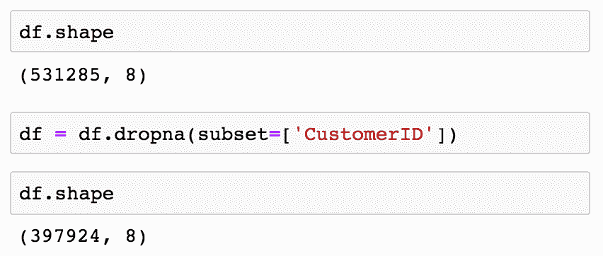

从这个输出可以看出，没有`CustomerID`值的`133,361`记录从原始的`DataFrame`中被删除了。


# 构建客户-项目矩阵

我们现在拥有的数据代表客户购买的单个商品。然而，为了用协同过滤算法构建一个产品推荐系统，我们需要有这样的数据，其中每个记录都包含每个客户购买了哪个商品的信息。在这一节中，我们将把数据转换成一个 customer-item 矩阵，其中每一行代表一个客户，每一列对应不同的产品。

让我们来看看下面的代码:

```py
customer_item_matrix = df.pivot_table(
    index='CustomerID', 
    columns='StockCode', 
    values='Quantity',
    aggfunc='sum'
)
```

从这个代码片段中可以看出，我们使用了`pivot_table`函数将数据转换成客户商品矩阵。这里，我们将`index`定义为`CustomerID`，用`columns`来代表每一个`StockCode`。通过将`sum`用作`aggfunc`并将`Quantity`字段用作`values`，我们可以对每件商品的所有购买数量进行求和。结果`customer_item_matrix`的快照如下所示:

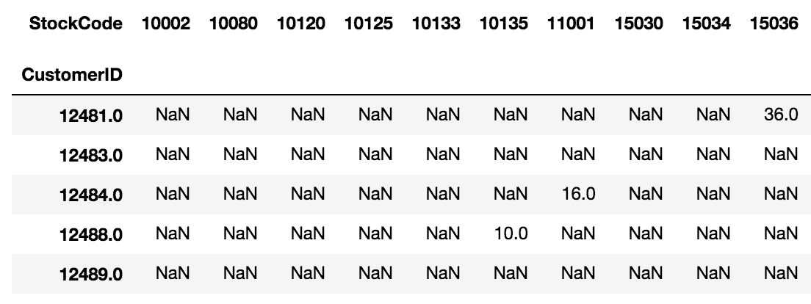

让我们仔细看看这个数据。`CustomerID` `12481`的顾客购买了`StockCode` `15036`商品的`36`。同理，`CustomerID` `12484`的顾客买了`StockCode` `11001`的`16`，而`CustomerID` `12488`的顾客买了`StockCode` `10135`的`10`。如您所见，我们现在有了一个矩阵，其中每一行代表每位客户购买的每种产品的总数量。

现在，让我们用`0` - `1`对这些数据进行编码，这样`1`的值表示给定的产品是给定的客户购买的，`0`的值表示给定的产品从未被给定的客户购买过。看一下下面的代码:

```py
customer_item_matrix = customer_item_matrix.applymap(lambda x: 1 if x > 0 else 0)
```

从这段代码中可以看出，我们使用了`applymap`函数，它将给定的函数应用于数据帧的每个元素。我们在这段代码中使用的 Lambda 函数只是用`1`对所有值大于`0`的元素进行编码，其余的用`0`进行编码。这个转换后的数据帧的快照如下所示:


我们现在有了一个客户项目矩阵，可以用于协作过滤算法。现在让我们继续构建产品推荐引擎。


# 协同过滤

在这一部分，我们将探讨两种构建产品推荐引擎的方法——基于用户和基于商品。在基于用户的方法中，我们根据用户的物品购买历史来计算他们之间的相似性。另一方面，在基于项目的方法中，我们根据哪些项目经常与哪些其他项目一起购买来计算项目之间的相似性。

为了测量用户之间或项目之间的相似性，我们将使用`scikit-learn`包中的`cosine_similarity`方法。您可以使用以下代码导入该函数:

```py
from sklearn.metrics.pairwise import cosine_similarity
```

`sklearn`包中的这个`cosine_similarity`函数计算给定数据中的成对余弦相似度。让我们开始吧！


# 基于用户的协同过滤和推荐

为了构建基于用户的协同过滤算法，我们需要计算用户之间的余弦相似度。让我们来看看下面的代码:

```py
user_user_sim_matrix = pd.DataFrame(
    cosine_similarity(customer_item_matrix)
)
```

从这段代码中可以看出，我们使用了`sklearn`包的`metrics.pairwise`模块中的`cosine_similarity`函数。该函数计算样本之间的成对余弦相似度，并将结果作为`array`类型输出。然后，我们用这个输出数组创建一个`pandas` `DataFrame`，并将其存储到一个名为`user_user_sim_matrix`的变量中，这个变量代表*用户到用户相似度矩阵*。结果如下所示:


从这个用户到用户相似性矩阵的快照中可以看出，索引和列名不容易理解。由于每个列和每个行索引代表单个客户，我们将使用以下代码重命名索引和列:

```py
user_user_sim_matrix.columns = customer_item_matrix.index

user_user_sim_matrix['CustomerID'] = customer_item_matrix.index
user_user_sim_matrix = user_user_sim_matrix.set_index('CustomerID')
```

现在结果看起来如下:


让我们仔细看看这个用户到用户的相似度矩阵。可以想象，一个客户对自己的余弦相似度是`1`，这是我们从这个相似度矩阵中可以观察到的。这个用户到用户相似性矩阵中的对角元素具有值`1`。其余的表示两个客户之间的成对余弦相似性。例如，客户`12347`和`12348`之间的余弦相似性度量是`0.063022`。另一方面，客户`12347`和`12349`之间的余弦相似度为`0.046130`。这表明，基于客户`12348`购买的产品，客户`12349`与客户`12347`的相似度高于客户`12347`与客户`12349`的相似度。这样我们就可以很容易的分辨出哪些顾客和别人相似，哪些顾客买了和别人相似的物品。

这些成对余弦相似性度量是我们将用于产品推荐的。让我们挑选一个客户作为例子。我们将首先使用以下代码对与 ID 为`12350`的客户最相似的客户进行排序:

```py
user_user_sim_matrix.loc[12350.0].sort_values(ascending=False)
```

当您运行此代码时，您将获得以下输出:


这些是与客户`12350`最相似的前 10 名客户。让我们挑选顾客`17935`并讨论如何利用这些结果推荐产品。策略如下。首先，我们需要识别顾客`12350`和`17935`已经购买的商品。然后，我们要找到目标客户`17935`没有购买，但客户`12350`购买了的产品。由于这两个客户在过去购买过类似的商品，我们将假设目标客户`17935`很有可能购买他或她没有购买，但客户`12350`已经购买的商品。最后，我们将使用这份商品清单，并将它们推荐给目标客户`17935`。

让我们先来看看如何检索客户`12350`过去购买的商品。代码如下所示:

```py
items_bought_by_A = set(customer_item_matrix.loc[12350.0].iloc[
    customer_item_matrix.loc[12350.0].nonzero()
].index)
```

从这段代码中可以看出，我们使用了`pandas`包中的`nonzero`函数。该函数返回非零元素的整数索引。对于给定的客户`12350`，在`customer_item_matrix`上使用这个函数，我们可以得到客户`12350`已经购买的商品列表。我们可以对目标客户`17935`应用相同的代码，如下所示:

```py
items_bought_by_B = set(customer_item_matrix.loc[17935.0].iloc[
    customer_item_matrix.loc[17935.0].nonzero()
].index)
```

现在我们有顾客`12350`和`17935`购买的两套商品。使用一个简单的集合操作，我们可以找到客户`12350`已经购买，但客户`17935`没有购买的商品。代码如下所示:

```py
items_to_recommend_to_B = items_bought_by_A - items_bought_by_B
```

现在，`items_to_recommend_to_B`变量中的商品是顾客`12350`购买的商品，但是顾客`17935`还没有购买。根据我们的假设，这些是客户`17935`可能购买的商品。向客户`17935`推荐的项目列表如下:


为了获得这些项目的描述，您可以使用以下代码:

```py
df.loc[
    df['StockCode'].isin(items_to_recommend_to_B), 
    ['StockCode', 'Description']
].drop_duplicates().set_index('StockCode')
```

正如您从这段代码中注意到的，我们使用了`isin`操作符来获取与`items_to_recommend_to_B`变量中的条目相匹配的记录。

运行此代码后，您将获得以下输出:


使用基于用户的协同过滤，我们讨论了如何为单个客户提供有针对性的产品推荐。您可以定制并在营销信息中包含每个目标客户都可能购买的这些产品，这可能会推动客户的更多转化。正如到目前为止所讨论的，使用基于用户的协同过滤算法，您可以轻松地为目标客户进行产品推荐。

然而，使用基于用户的协同过滤有一个主要缺点。正如我们在本练习中看到的，推荐是基于单个客户的购买历史。对于新客户，我们没有足够的数据将这些新客户与其他客户进行比较。为了处理这个问题，我们可以使用基于项目的协同过滤，我们将在下一节讨论这一点。


# 基于项目的协同过滤和推荐

基于项目的协同过滤类似于基于用户的方法，只是它使用项目之间的相似性度量，而不是用户或客户之间的相似性度量。我们以前必须计算用户之间的余弦相似度，但现在，我们将计算项目之间的余弦相似度。看一下下面的代码:

```py
item_item_sim_matrix = pd.DataFrame(
    cosine_similarity(customer_item_matrix.T)
)
```

如果您将这段代码与前面的代码进行比较，在前面的代码中，我们计算了一个用户到用户的相似性矩阵，唯一的区别是我们在这里转置了`customer_item_matrix`,因此行索引代表单个项目，列代表客户。我们仍然在使用`sklearn`包的`metrics.pairwise`模块的`cosine_similarity`功能。为了用产品代码正确命名索引和列，可以使用以下代码:

```py
item_item_sim_matrix.columns = customer_item_matrix.T.index

item_item_sim_matrix['StockCode'] = customer_item_matrix.T.index
item_item_sim_matrix = item_item_sim_matrix.set_index('StockCode')
```

现在结果看起来如下:


如前所述，对角线元素的值为`1`。这是因为一个项目和它本身的相似度是`1`，意味着两者是相同的。其余的元素包含基于余弦相似性计算的项目之间的相似性度量值。例如，查看前面的项目到项目相似度矩阵，具有`StockCode`T3 的项目和具有`StockCode`T5 的项目之间的余弦相似度是`0.094868`。另一方面，项目`10002`和项目`10125`之间的余弦相似度是`0.090351`。这表明，`StockCode` `10120`项与`StockCode` `10002`项更相似，而`StockCode` `10125`项与`StockCode` `10002`项更相似。

使用这种项目到项目的相似性矩阵进行产品推荐的策略类似于我们在上一节中使用基于用户的方法所做的。首先，对于目标客户购买的给定产品，我们将从我们刚刚构建的商品到商品相似性矩阵中找到最相似的商品。然后，我们将向客户推荐这些相似的商品，因为这些相似的商品是由购买了目标客户最初购买的产品的其他客户购买的。让我们看一个例子。

假设一位新客户刚买了一件`StockCode` `23166`的产品，我们希望在营销邮件中包含一些该客户最有可能购买的产品。我们要做的第一件事就是找到与`StockCode`和`23166`最相似的物品。您可以使用下面的代码获得与带有`StockCode` `23166`的项目最相似的前 10 个项目:

```py
top_10_similar_items = list(
   item_item_sim_matrix\
        .loc[23166]\
        .sort_values(ascending=False)\
        .iloc[:10]\
    .index
)
```

结果如下所示:

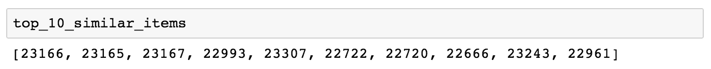

我们可以使用以下代码获得这些类似项目的描述:

```py
df.loc[
    df['StockCode'].isin(top_10_similar_items), 
    ['StockCode', 'Description']
].drop_duplicates().set_index('StockCode').loc[top_10_similar_items]
```

正如您在这段代码中看到的，我们使用了`isin`操作符来过滤与`top_10_similar_items`变量中的相似条目列表相匹配的条目。运行此代码后，您将看到以下输出:

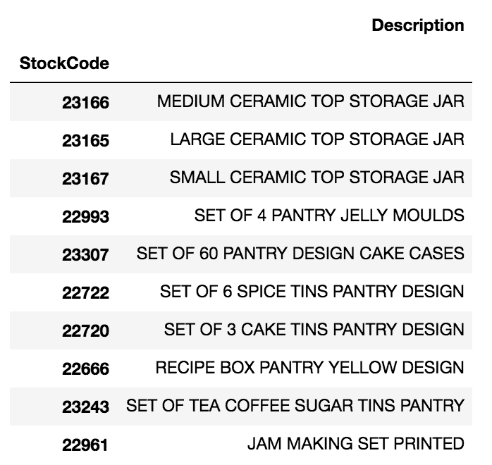

这里的第一个商品是目标客户刚刚购买的商品，其他九个商品是购买了第一个商品的其他人经常购买的商品。正如你所看到的，那些买了陶瓷储物罐的人通常会买果冻模具、香料罐和蛋糕罐。有了这些数据，您可以将这些产品作为进一步的产品推荐包含在您针对该目标客户的营销信息中。个性化的营销信息和有针对性的产品推荐通常会提高客户的转化率。使用基于项目的协同过滤算法，您现在可以轻松地为新客户和现有客户推荐产品。

这项 Python 练习的完整细节可在以下网址找到:[https://github . com/Yoon hwang/hands-on-data-science-for-marketing/blob/master/ch . 6/Python/product recommendation . ipynb](https://github.com/yoonhwang/hands-on-data-science-for-marketing/blob/master/ch.6/python/ProductRecommendation.ipynb)


# 用 R 构建产品推荐算法

在本节中，我们将讨论如何使用 R 构建一个产品推荐系统。更具体地说，我们将学习如何使用`dplyr`、`reshape2`和`coop`包在 R 中实现一个协同过滤算法。对于那些想在这个练习中使用 Python 而不是 R 的读者，您可以去上一节。我们将从分析一些电子商务业务数据开始这一部分，然后讨论使用协同过滤构建产品推荐系统的两种方法。

在这个练习中，我们将使用来自 http://archive.ics.uci.edu/ml/datasets/online+retail#的 UCI 机器学习库的一个公开可用的数据集。你可以点击这个链接，下载微软 Excel 格式的数据，名为`Online Retail.xlsx`。下载完这些数据后，您可以通过运行以下命令将其加载到 RStudio 中:

```py
library(dplyr)
library(readxl)

df <- read_excel(
  path="~/Documents/research/data-science-marketing/ch.6/data/Online Retail.xlsx", 
  sheet="Online Retail"
)
```

与前一章类似，我们使用`readxl`包中的`read_excel`函数加载 Excel 格式的数据。我们为参数`path`提供数据的路径，为参数`sheet`提供 Excel 电子表格的名称。

一旦将这些数据加载到`DataFrame`中，它应该如下所示:

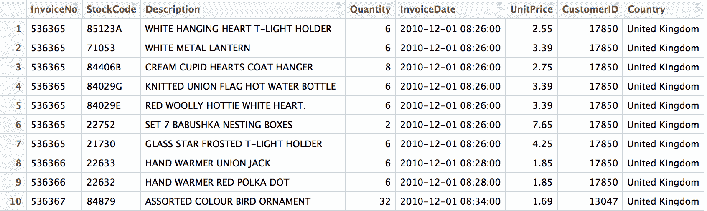

如果您回忆一下上一章，在`Quantity`列中有负值的记录，它们代表取消的订单。我们将忽略并删除这些记录。我们可以用下面的代码过滤掉`DataFrame`中的所有记录:

```py
# ignore cancel orders
df <- df[which(df$Quantity > 0),]
```


# 数据准备

在我们开始使用协同过滤算法构建产品推荐引擎之前，我们需要做几件事情。首先，我们需要处理数据集中的`NaN`值，尤其是那些在`CustomerID`字段中有`NA`值的记录。没有`CustomerID`字段中的正确值，我们就无法构建一个合适的推荐系统，因为协同过滤算法依赖于单个客户的历史物品购买数据。第二，我们需要在实现产品推荐的协同过滤算法之前建立客户到商品的矩阵。客户-项目矩阵是简单的表格数据，其中每一列代表一个产品或项目，每一行代表一个客户，每个单元格中的值代表给定的客户是否购买了给定的产品。


# 处理 CustomerID 字段中的 NA 值

如果你仔细观察数据，你会注意到有些记录没有`CustomerID`。因为我们需要构建一个客户-项目矩阵，其中每一行都是特定于每个客户的，所以我们不能在数据中包含那些没有`CustomerID`的记录。让我们先看看有多少记录没有一个`CustomerID`。

看一下下面的代码:

```py
# there are 133,361 records with no CustomerID
sum(is.na(df$CustomerID))
```

我们在这里使用的`is.na`函数检测缺失值，并为每个缺失值返回`TRUE`。通过使用`sum`函数对这些值求和，我们可以计算没有`CustomerID`的记录的数量。结果如下所示:


从这个输出可以看出，有没有`CustomerID`的`133,361`记录。为了查看那些没有`CustomerID`的记录，你可以使用下面的代码:

```py
# sneak peek at records with no CustomerID
head(df[which(is.na(df$CustomerID)),])
```

输出如下所示:


既然我们知道存在缺少`CustomerID`值的记录，我们需要从进一步的分析中排除它们。将它们从我们的`DataFrame`中删除的一种方法是使用`na.omit`函数，如下所示:

```py
# remove records with NA
df <- na.omit(df)
```

R 中的`na.omit`函数从数据帧中删除带有缺失值(`NA`)的记录。一旦运行了这段代码，数据帧`df`中的所有记录现在都有了`CustomerID`值。删除缺失值前后的数据框`df`的尺寸应如下图所示:


从`dim(df)`命令的输出中可以看到，没有`CustomerID`值的`133,361`记录从原来的`DataFrame`中被删除。


# 构建客户-项目矩阵

我们现在拥有的数据代表客户购买的单个商品。然而，为了用协同过滤算法构建一个产品推荐系统，我们需要有这样的数据，其中每个记录都包含每个客户购买了哪个商品的信息。在这一节中，我们将把数据转换成一个 customer-item 矩阵，其中每一行代表一个客户，每一列对应不同的产品。

为了将我们的数据转换成客户商品矩阵，我们将使用`reshape2`包中的`dcast`函数。如果您的 R 环境中还没有安装这个软件包，您可以运行以下命令在 R 环境中安装并包含这个软件包:

```py
install.packages("reshape2")

library(reshape2)
```

让我们来看看下面的代码:

```py
customerItemMatrix <- dcast(
  df, CustomerID ~ StockCode, value.var="Quantity"
)
```

`reshape2`包的`dcast`函数使用一个公式将一个`DataFrame`重塑成另一种形式的`DataFrame`。在我们的例子中，我们希望我们的数据被重新整形，以便行代表单个客户，列代表不同的产品。通过将公式定义为`CustomerID ~ StockCode`,`dcast`函数将重塑数据，因此`StockCode`的各个代码映射到列，每行代表一个客户。`value.var`参数定义了取哪个值。这里，我们告诉`dcast`函数将`Quantity`字段的值作为整形后的`DataFrame`中元素的值。结果如下所示:


让我们仔细看看这个数据。`CustomerID` `12731`的顾客购买了`StockCode` `10002`商品的`3`。同理，`CustomerID` `12748`的顾客买了`StockCode` `10080`的`2`，而`CustomerID` `12735`的顾客买了`StockCode` `10125`的`1`。如您所见，我们现在有了一个矩阵，其中每一行代表每位客户购买的每种产品的总数量。

现在，让我们用`0` - `1`对这些数据进行编码，这样`1`的值意味着给定的产品是由给定的客户购买的，而`0`的值意味着给定的产品从未被给定的客户购买过。看一下下面的代码:

```py
# 0-1 encode 
encode_fn <- function(x) {as.integer(x > 0)}

customerItemMatrix <- customerItemMatrix %>% 
  mutate_at(vars(-CustomerID), funs(encode_fn))
```

从这段代码可以看出，我们首先定义了编码函数，`encode_fn`。如果大于`0`，这个函数简单地将每个值编码为`1`，否则编码为`0`。然后我们使用`dplyr`包的`muate_at`函数，它将`encode_fn`编码函数应用于矩阵的每个元素，除了`CustomerID`列。结果应该如下所示:


我们现在有了一个客户项目矩阵，可以用于协作过滤算法。现在让我们继续构建产品推荐引擎。


# 协同过滤

在这一部分，我们将探讨两种构建产品推荐引擎的方法——基于用户和基于商品。在基于用户的方法中，我们根据用户的物品购买历史来计算他们之间的相似性。另一方面，在基于项目的方法中，我们根据哪些项目经常与其他项目一起购买来计算项目之间的相似性。为了测量用户之间或项目之间的相似性，我们将使用`coop`库中的`cosine`函数，这是一个用于在 R 中快速实现余弦相似性计算的库。您可以使用以下代码安装和这个 R 库:

```py
install.packages("coop")

library(coop)
```

`coop`库中的`cosine`函数可以在 r 中高效地计算余弦相似矩阵。现在让我们开始吧！


# 基于用户的协同过滤和推荐

为了构建基于用户的协同过滤算法，我们需要计算用户之间的余弦相似度。让我们来看看下面的代码:

```py
# User-to-User Similarity Matrix
userToUserSimMatrix <- cosine(
  as.matrix(
    # excluding CustomerID column
    t(customerItemMatrix[, 2:dim(customerItemMatrix)[2]])
  )
)
colnames(userToUserSimMatrix) <- customerItemMatrix$CustomerID
```

从这段代码中可以看出，使用`coop`库中的`cosine`函数，您可以计算并构建一个余弦相似矩阵。这段代码中需要注意的一点是，我们在计算余弦相似度之前转置了`customerItemMatrix`。这是为了计算用户之间的相似性。如果没有换位，`cosine`函数将计算项目到项目的相似性。最后，我们在代码的最后一行用客户 id 重命名列。

结果如下所示:

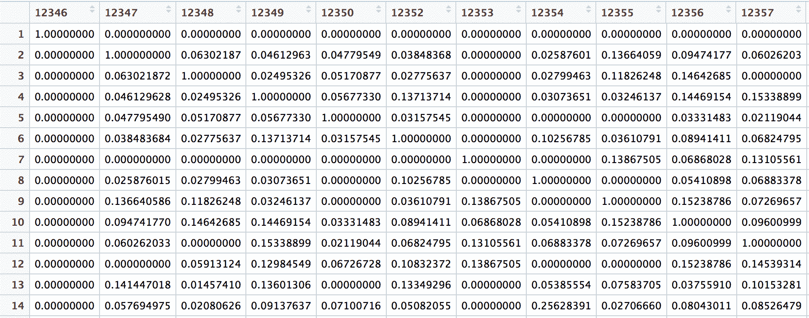

让我们仔细看看这个用户到用户的相似度矩阵。可以想象，客户与自己之间的余弦相似度是`1`，这是我们可以从相似度矩阵中观察到的。这个用户到用户相似性矩阵中的对角元素具有值`1`。其余的表示两个客户之间的成对余弦相似性。例如，客户`12347`和`12348`之间的余弦相似性度量是`0.06302187`。另一方面，客户`12347`和`12349`之间的余弦相似度为`0.04612963`。这表明，基于客户`12348`之前购买的产品，客户`12348`与客户`12347`的相似度高于客户`12349`与客户`12347`的相似度。这样我们就可以很容易地分辨出哪些顾客与哪些人相似，哪些顾客购买了与哪些人相似的商品。

这些成对余弦相似性度量是我们将用于产品推荐的。让我们挑选一个客户作为例子。我们将首先使用以下代码对与 ID 为`12350`的客户最相似的客户进行排序:

```py
top10SimilarCustomersTo12350 <- customerItemMatrix$CustomerID[
 order(userToUserSimMatrix[,"12350"], decreasing = TRUE)[1:11]
]
```

从这段代码中可以看出，我们使用 order 函数对`userToUserSimMatrix`的列`12350`中的值进行排序。使用`decreasing = TRUE`标志，我们可以按降序对值进行排序。

当您运行此代码时，您将获得以下输出:

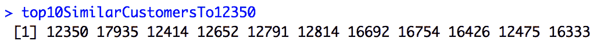

这些是与客户`12350`最相似的前 10 名客户。让我们挑选顾客`17935`并讨论如何利用这些结果推荐产品。策略如下。首先，我们需要确定顾客`12350`和`17935`已经购买的商品。然后，我们要找到目标客户`17935`没有购买，但客户`12350`购买了的产品。由于这两个客户在过去购买过类似的商品，我们将假设目标客户`17935`很有可能会购买这些他或她没有购买但客户`12350`已经购买的商品。最后，我们将使用这份商品清单，并将它们推荐给目标客户`17935`。

让我们先来看看如何检索客户`12350`过去购买的商品。代码如下所示:

```py
itemsBoughtByA <- customerItemMatrix[
  which(customerItemMatrix$CustomerID == "12350"),
]

itemsBoughtByA <- colnames(customerItemMatrix)[which(itemsBoughtByA != 0)]
```

从这段代码中可以看出，我们使用了`which`操作符来查找非零元素的列索引。这段代码的结果如下所示:

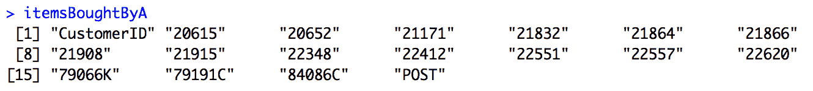

使用下面的代码，我们可以获得客户`17935`已经购买的商品列表:

```py
itemsBoughtByB <- customerItemMatrix[
  which(customerItemMatrix$CustomerID == "17935"),
]

itemsBoughtByB <- colnames(customerItemMatrix)[which(itemsBoughtByB != 0)]
```

顾客`17935`购买的物品如下:

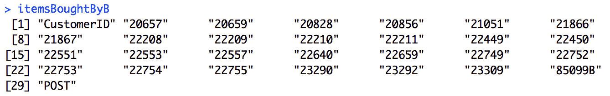

现在我们有顾客`12350`和`17935`购买的两套商品。使用简单的集合运算，我们可以找到客户`12350`已经购买，而客户`17935`没有购买的商品。代码如下所示:

```py
itemsToRecommendToB <- setdiff(itemsBoughtByA, itemsBoughtByB)
```

现在，`itemsToRecommendToB`变量中的商品是顾客`12350`购买的商品，但是顾客`17935`还没有购买。根据我们的假设，这些是客户`17935`可能购买的商品。向客户`17935`推荐的项目列表如下:

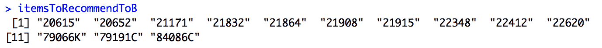

为了获得这些项目的描述，您可以使用以下代码:

```py
itemsToRecommendToBDescriptions <- unique(
  df[
    which(df$StockCode %in% itemsToRecommendToB), 
    c("StockCode", "Description")
    ]
)
itemsToRecommendToBDescriptions <- itemsToRecommendToBDescriptions[
  match(itemsToRecommendToB, itemsToRecommendToBDescriptions$StockCode),
]
```

正如您从这段代码中注意到的，我们使用了`%in%`操作符来获取与`itemsToRecommendToB`变量中的条目相匹配的记录。运行此代码后，您将获得以下输出，其中包含对推荐项目的描述:


使用基于用户的协同过滤，我们讨论了如何为单个客户提供有针对性的产品推荐。您可以定制并在营销信息中包含每个目标客户都可能购买的这些产品，这可能会推动客户的更多转化。正如到目前为止所讨论的，使用基于用户的协同过滤算法，您可以轻松地为目标客户创建产品推荐。

然而，使用基于用户的协同过滤有一个主要缺点。正如我们在本练习中看到的，推荐是基于单个客户的购买历史。对于新客户，我们没有足够的数据将他们与其他客户进行比较。为了解决这个问题，我们可以使用基于项目的协同过滤，我们将在下一节中讨论。


# 基于项目的协同过滤和推荐

基于项目的协同过滤类似于基于用户的方法，只是它使用项目之间的相似性度量，而不是用户或客户之间的相似性度量。我们之前必须计算用户之间的余弦相似度，但现在我们将计算项目之间的余弦相似度。看一下下面的代码:

```py
# Item-to-Item Similarity Matrix
itemToItemSimMatrix <- cosine(
  as.matrix(
    # excluding CustomerID column
    customerItemMatrix[, 2:dim(customerItemMatrix)[2]]
  )
)
```

如果您将这段代码与之前的代码进行比较，在之前的代码中，我们计算了用户到用户的相似性矩阵，唯一的区别是这次我们没有转置`customerItemMatrix`。我们仍然在使用`coop`库的`cosine`功能。

结果如下所示:


如前所述，对角线元素的值为`1`。这是因为一个项目和它本身的相似度是`1`，意味着两者是相同的。其他元素包含基于余弦相似性计算的项目之间的相似性度量值。例如，查看前面的项目到项目相似度矩阵，具有`StockCode`T3 的项目和具有`StockCode`T5 的项目之间的余弦相似度是`0.09486833`。另一方面，项目`10002`和项目`10125`之间的余弦相似度是`0.09035079`。这表明带有`StockCode` `10120`的项目比带有`StockCode` `10125`的项目与带有`StockCode` `10002`的项目更类似于带有`StockCode` `10002`的项目。

使用这种项目到项目的相似性矩阵进行产品推荐的策略类似于我们在上一节中使用基于用户的方法所做的。首先，对于目标客户购买的给定产品，我们将从我们刚刚构建的商品到商品相似性矩阵中找到最相似的商品。然后，我们将向客户推荐这些相似的商品，因为这些相似的商品是由购买了目标客户最初购买的产品的其他客户购买的。让我们看一个例子。

假设一位新客户刚买了一件`StockCode` `23166`的产品，我们希望在营销邮件中包含一些该客户最有可能购买的产品。我们要做的第一件事就是找到与`StockCode`和`23166`最相似的物品。您可以使用下面的代码获得与带有`StockCode` `23166`的项目最相似的前 10 个项目:

```py
top10SimilarItemsTo23166 <- colnames(itemToItemSimMatrix)[
  order(itemToItemSimMatrix[,"23166"], decreasing = TRUE)[1:11]
]
```

使用带有`decreasing = TRUE`标志的`order`函数，我们可以按降序对相似的项目进行排序。然后，通过这个反向排序的索引列表，我们可以得到与带有`StockCode`T3 的条目相似的前 10 个条目。

结果如下所示:


我们可以使用以下代码获得这些类似项目的描述:

```py
top10SimilarItemDescriptions <- unique(
  df[
    which(df$StockCode %in% top10SimilarItemsTo23166), 
    c("StockCode", "Description")
  ]
)
top10SimilarItemDescriptions <- top10SimilarItemDescriptions[
  match(top10SimilarItemsTo23166, top10SimilarItemDescriptions$StockCode),
]
```

从这段代码中可以看出，我们使用了`%in%`操作符来过滤与变量`top10SimilarItemsTo23166`中的相似条目列表相匹配的条目。运行此代码后，您将看到以下输出:


这里的第一件商品是目标客户刚刚购买的商品，其余 10 件商品是购买了第一件商品的其他人经常购买的商品。正如你所看到的，那些买了陶瓷储物罐的人通常会买果冻模具、香料罐和蛋糕罐。有了这些数据，您可以将这些产品作为进一步的产品推荐包含在您针对该目标客户的营销信息中。个性化的营销信息和有针对性的产品推荐通常会提高客户的转化率。使用基于项目的协同过滤算法，您现在可以轻松地为新客户和现有客户推荐产品。

这个 R 练习的完整代码可以在这个链接找到:[https://github . com/Yoon hwang/hands-on-data-science-for-marketing/blob/master/ch . 6/R/product recommendation。R](https://github.com/yoonhwang/hands-on-data-science-for-marketing/blob/master/ch.6/R/ProductRecommendation.R)


# 摘要

在这一章中，我们讨论了产品推荐系统。根据 Salesforce 进行的一项研究，我们已经了解了个性化产品推荐如何提高转化率和客户保留率。我们已经讨论了构建产品推荐系统的两种方法，协同过滤和基于内容的过滤；它们彼此有何不同；以及他们的假设是什么。然后，我们深入探讨如何构建基于协同过滤的推荐系统。您可能还记得，构建基于协同过滤的推荐系统的第一步是构建用户-项目矩阵，然后下一步是使用余弦相似度来计算用户之间的相似度。我们还讨论了利用协同过滤算法进行产品推荐的两种不同方法——基于用户的方法和基于项目的方法。

从下一章开始，我们将改变思路，专注于利用客户行为数据来改善我们的营销策略。在下一章，我们将讨论进行客户分析的好处和重要性。