# 九、客户终身价值

在本章中，我们将重点关注预测分析在营销中的第二个用例，即我们在前一章中讨论的客户终身价值。在市场营销中，为营销活动做预算总是一个挑战。我们不想花费太多，导致负投资回报率。然而，我们也不希望花费太少，没有可见的影响或结果。在确定营销策略的预算时，了解开展特定营销活动的预期回报是至关重要的。了解个人客户的**客户终身价值** ( **CLV** )有助于营销人员调整营销预算，并锁定潜在的高价值客户。在本章中，我们将更详细地讨论计算 CLV 的概念和优势，以及如何用 Python 和 r 构建预测性机器学习模型来预测个人客户的预期 CLV

在本章中，我们将讨论以下主题:

*   CLV
*   回归模型的评估标准
*   用 Python 预测 3 个月的 CLV
*   用 R 预测 3 个月的 CLV


# CLV

在市场营销中，CLV 是需要掌握和监控的关键指标之一。CLV 衡量客户在与公司的终生关系中对企业的总价值。这一指标对于获取新客户尤其重要。获得新客户通常比保持现有客户更昂贵，因此了解获得新客户的终身价值和相关成本对于制定具有正投资回报的营销策略至关重要。例如，如果客户的平均 CLV 是 100 美元，而获得一个新客户只需要 10 美元，那么随着你获得新客户，你的企业将会产生更多的收入。

然而，如果获得一个新客户的成本是 150 美元，而你的客户的平均 CLV 仍然是 100 美元，那么你每次获得都会赔钱。简而言之，如果你获取新客户的营销支出超过了 CLV，你每次获取都会赔钱，最好只与现有客户合作。

有多种方法可以计算 CLV。一种方法是找到客户的平均购买量、购买频率和生命周期，并做一个简单的计算来获得 CLV。例如，考虑一个假设的情况，客户的平均购买金额是 100 美元，他或她平均每月购买五次。那么这个客户每个月的平均价值就是 500 美元，简单来说就是平均购买金额乘以平均购买频率。现在，我们需要知道这个客户的生命周期。估计客户生命周期的一种方法是看平均月流失率，即客户离开和终止与你的业务关系的百分比。你可以通过用一除以流失率来估计客户的生命周期。在我们的假设案例中，假设流失率为 5%，估计客户的生命周期为 20 年。假设客户每月的平均价值为 500 美元，寿命为 20 年，则该客户的 CLV 为 120，000 美元。这一最终 CLV 金额的计算方法是将每月的平均值 500 美元乘以 12 个月，即 20 年的寿命。

因为我们通常不知道客户的生命周期，所以我们经常试图估计某个时期的 CLV。这可以通过估计客户 12 个月的 CLV、24 个月的 CLV 或 3 个月的 CLV 来实现。除了我们通过例子讨论的方法，CLV 也可以通过建立预测模型来估计。使用机器学习算法和客户的购买历史数据，我们可以建立机器学习模型，预测客户在一定时期内的 CLV。在本章的编程练习中，我们将学习如何建立一个回归模型来预测客户 3 个月的 CLV。


# 评估回归模型

我们需要使用一套不同的度量标准来评估回归模型和分类模型。这是因为回归模型的预测输出采用连续值，这意味着它可以采用任何值，而不仅限于采用预定义的一组值。另一方面，正如我们在[第八章](4f5163a1-c34a-495f-bc5f-e02f9b2a2052.xhtml)、*预测营销参与的可能性*中看到的，一个分类模型的预测输出只能取一定数量的值。与敬业度预测一样，我们上一章的分类模型只能取两个值——零表示没有敬业度，一个表示有敬业度。由于这种差异，我们需要使用不同的度量来评估回归模型。

在本节中，我们将讨论评估回归模型的四种常用方法——**均方误差** ( **MSE** )、**中位数绝对误差** ( **MAE** )、 *R ²* 以及预测与实际散点图。顾名思义，MSE 测量误差平方的平均值，其中误差是预测值和实际值之间的差异。 *MSE* 的方程式如下:

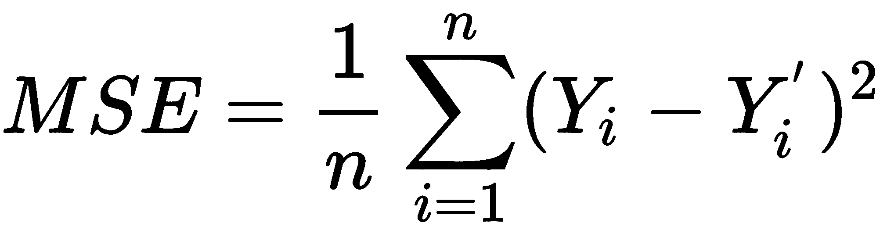

该方程中的 *Y* 值为实际值，*Y’*值为预测值。因为 MSE 是平方误差的平均值，所以这种测量对异常值很敏感，并且受异常值的影响很大。

另一方面，MAE 对异常值不太敏感，被认为更稳健，因为中位数受异常值的影响，或者尾部的值比平均值小得多。从这个`scikit-learn`文档页面[https://sci kit-learn . org/stable/modules/model _ evaluation . html # median-absolute-error](https://scikit-learn.org/stable/modules/model_evaluation.html#median-absolute-error)借用的等式看起来如下:

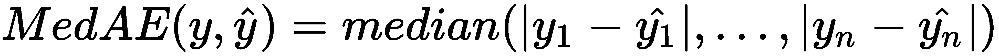

该方程中的 *y* 值代表实际值，值代表预测值。

回归模型的另一个常用度量是*R²，也称为决定系数。*R²衡量拟合优度。换句话说，它衡量回归模型对数据的拟合程度。简单来说， *R ²* 就是目标变量被回归模型解释的变异性的百分比。该等式如下所示:**


R²通常在零和一之间。零的 *R ²* 值意味着该模型根本不能解释或捕捉目标变量的可变性，并且不是数据的良好拟合。另一方面， *R ²* 值为 1 意味着模型捕捉到了 100%的目标变量可变性，是数据的完美拟合。*R²值越接近 1，模型拟合越好。*

最后，预测值与实际值的散点图也用于显示模型的拟合程度。该散点图的一个示例如下所示:

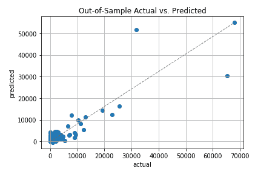

对于一个很好的拟合，你会在这个散点图中看到接近对角线的点。如果模型的*R²高，则点会靠近对角线。另一方面，如果模型的*R²较低，则点将远离对角线分散。在下面的编程练习中，我们将讨论如何在 Python 和 R 中计算和可视化这些度量，并将使用这些度量来评估我们的回归模型。**


# 用 Python 预测 3 个月的 CLV

在本节中，我们将讨论如何使用 Python 中的机器学习算法来构建和评估回归模型。在本节结束时，我们将使用线性回归算法建立一个预测模型来预测 CLV **、**，更具体地说，预测 3 个月的预期客户价值。我们将主要使用`pandas`、`matplotlib`和`scikit-learn`软件包来分析、可视化和构建预测预期 3 个月客户价值的机器学习模型。对于那些想在这个练习中使用 R 而不是 Python 的读者，您可以跳到下一节。

对于这个练习，我们将使用来自 UCI 机器学习知识库的一个公开可用的数据集，它可以在这个链接找到:[http://archive.ics.uci.edu/ml/datasets/online+retail](http://archive.ics.uci.edu/ml/datasets/online+retail)。

您可以点击这个链接，下载 XLSX 格式的数据，名为`Online Retail.xlsx`。下载完这些数据后，您可以通过运行以下命令将其加载到 Jupyter 笔记本中:

```py
import pandas as pd

df = pd.read_excel('../data/Online Retail.xlsx', sheet_name='Online Retail')
```

数据帧`df`如下所示:

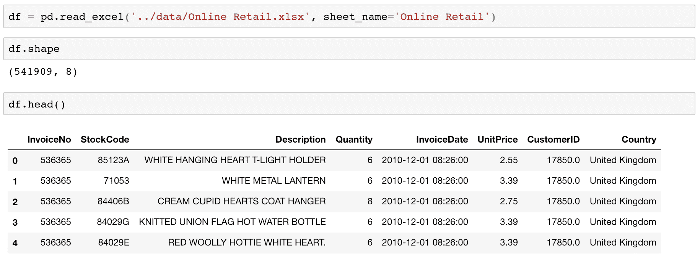

您可能已经注意到，在前面的章节中，我们已经使用过这个数据集几次。根据我们在前几章中获得的关于这个数据集的知识，我们将首先通过清理来准备我们的数据。


# 数据清理

您可能还记得，我们需要清理这个数据集中的一些东西。清理步骤如下:

1.  **处理负数量**:存在负`Quantity`值的交易，代表取消订单。在本练习中，我们将忽略那些取消的订单，因此我们需要将它们从我们的`pandas`数据框架中排除。排除`Quantity`列中这些负值的代码如下所示:

```py
        df = df.loc[df['Quantity'] > 0]
```

我们只是简单地将所有那些具有正的`Quantity`值的行存储回`df`变量。

2.  **删除**NaN记录:我们需要删除没有`CustomerID`的记录。由于我们将构建一个机器学习模型来预测 3 个月的客户价值，因此我们需要按`CustomerID`列对数据进行分组。没有它，我们就不能为这个项目正确地构建模型。删除没有`CustomerID`值的记录的代码类似于下面的代码片段:

```py
        df = df[pd.notnull(df['CustomerID'])]
```

从这段代码中可以看出，我们使用了`pandas`包中的`notnull`函数。该函数返回一个数组列表，其中`True`值表示给定索引中的值不是`null`，而`False`值表示给定索引中的值是`null`。我们将这些在`CustomerID`列中包含非空值的记录存储回`df`变量。

3.  **处理不完整的数据**:我们需要做的另一个清理工作是处理不完整的数据。如果您还记得前面的章节，上个月的交易数据是不完整的。看一下下面的输出:


从这个输出可以看出，数据集包含了 2010 年 12 月 1 日到 2011 年 12 月 9 日之间的所有交易。上个月，即 2011 年 12 月的数据并不完整。为了正确构建 3 个月客户价值预测的模型，我们将忽略上个月的交易。看看下面的代码，它展示了如何从我们的数据帧中删除那些记录:

```py
        df = df.loc[df['InvoiceDate'] < '2011-12-01']
```

我们只是将 2011 年 12 月 1 日之前发生的所有交易存储回`df`变量。

4.  **总销售额**:最后，我们需要为每笔交易的总销售额创建一列。看一下下面的代码:

```py
        df['Sales'] = df['Quantity'] * df['UnitPrice']
```

我们将`Quantity`列乘以`UnitPrice`列，得到每笔交易的总购买金额。然后，我们将这些值存储到一个名为`Sales`的列中。我们现在已经完成了所有的清理工作。

现在我们已经清理了所有的交易数据，让我们总结一下每个订单或`InvoiceNo`的数据。看一下下面的代码:

```py
        orders_df = df.groupby(['CustomerID', 'InvoiceNo']).agg({
            'Sales': sum,
            'InvoiceDate': max
        })
```

从这段代码中可以看出，我们将`DataFrame` `df`分组为两列，`CustomerID`和`InvoiceNo`。然后，我们对每个客户和订单的所有`Sales`值求和，并将给定订单的最后一次交易时间作为`InvoiceDate`。这样，我们现在有了一个`DataFrame`、`orders_df`，因为我们需要了解每个客户下的每个订单。数据如下所示:


在我们开始构建模型之前，让我们仔细看看这个客户购买历史数据。


# 数据分析

为了计算 CLV，我们需要知道每个顾客购买的频率、最近和总量。我们将计算每个客户的平均购买量和终生购买量的基本信息，以及每个客户的购买持续时间和频率。看一下下面的代码:

```py
def groupby_mean(x):
    return x.mean()

def groupby_count(x):
    return x.count()

def purchase_duration(x):
    return (x.max() - x.min()).days

def avg_frequency(x):
    return (x.max() - x.min()).days/x.count()

groupby_mean.__name__ = 'avg'
groupby_count.__name__ = 'count'
purchase_duration.__name__ = 'purchase_duration'
avg_frequency.__name__ = 'purchase_frequency'

summary_df = orders_df.reset_index().groupby('CustomerID').agg({
    'Sales': [min, max, sum, groupby_mean, groupby_count],
    'InvoiceDate': [min, max, purchase_duration, avg_frequency]
})
```

我们首先按照`CustomerID`列分组，然后按照`Sales`和`InvoiceDate`列合计数字。如果仔细观察聚合函数，我们使用了四个客户聚合函数:`groupby_mean`、`groupby_count`、`purchase_duration`和`avg_frequency`。第一个函数`groupby_mean`简单地计算每个组的平均值，第二个函数`groupby_count`简单地计算每个组中的记录数。`purchase_duration`函数计算每组中第一个和最后一个发票日期之间的天数，而`avg_frequency`函数通过将`purchase_duration`除以订单数来计算订单之间的平均天数。

结果`DataFrame`如下所示:

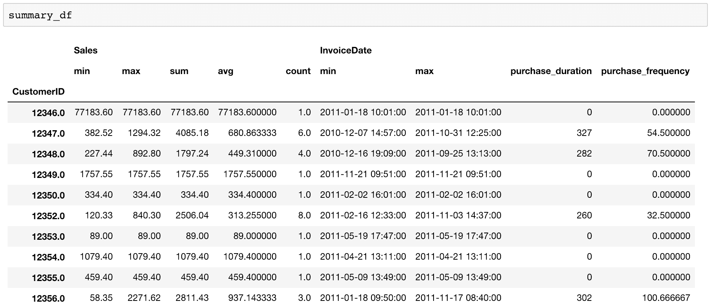

这些数据让我们了解了每位顾客的购买情况。例如，ID 为`12346`的客户仅在 2011 年 1 月 18 日进行了一次购买。然而，ID 为`12347`的客户在 2010 年 12 月 7 日至 2011 年 10 月 31 日期间，或在`327`天内，进行了六次购买。该客户在每份订单上花费的平均金额为`680`，平均每`54.5`天该客户就购买一次。

让我们仔细看看回头客购买次数的分布。

看一下下面的代码:

```py
summary_df.columns = ['_'.join(col).lower() for col in summary_df.columns]
summary_df = summary_df.loc[summary_df['invoicedate_purchase_duration'] > 0]

ax = summary_df.groupby('sales_count').count()['sales_avg'][:20].plot(
    kind='bar', 
    color='skyblue',
    figsize=(12,7), 
    grid=True
)

ax.set_ylabel('count')

plt.show()
```

从这段代码中可以看出，我们清理了第一行中数据帧的列名`summary_df`。然后，我们只考虑那些至少购买过两次或两次以上的顾客，他们代表的是回头客。最后，我们按`sales_count`列分组，并计算每个类别有多少客户。结果图如下所示:

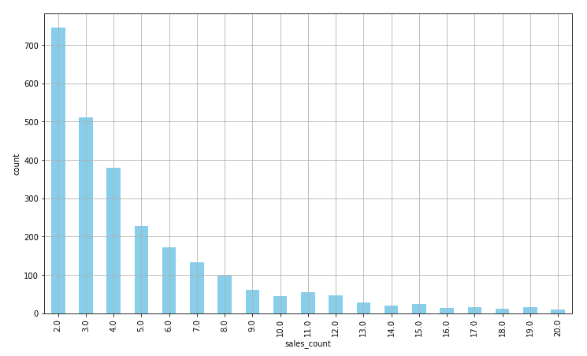

正如您从该图中看到的，大多数客户在历史上购买了 10 次或更少。让我们来看看这些回头客的平均购物间隔天数。先看看下面的代码:

```py
ax = summary_df['invoicedate_purchase_frequency'].hist(
    bins=20,
    color='skyblue',
    rwidth=0.7,
    figsize=(12,7)
)

ax.set_xlabel('avg. number of days between purchases')
ax.set_ylabel('count')

plt.show()
```

我们正在使用`pandas`包中的`hist`函数构建购买频率数据的直方图。`bins`参数定义要构建的直方图仓的数量。结果如下所示:


该图告诉我们历史上回头客购买频率的总体情况。从这张图上可以看出，大多数回头客每隔 20 到 50 天就会购买一次。


# 预测 3 个月的 CLV

在本节中，我们将使用 Python 中的`pandas`和`scikit-learn`包构建一个预测 3 个月客户价值的模型。我们将首先将数据分成 3 个月的数据块，并将最后 3 个月的数据作为预测的目标，其余数据作为特征。我们将首先准备用于建模的数据，然后为 3 个月的客户价值预测训练一个线性回归模型。


# 数据准备

为了建立一个预测模型，我们需要首先准备我们的数据，这样我们就可以将相关数据输入到模型中。看一下下面的代码:

```py
clv_freq = '3M'

data_df = orders_df.reset_index().groupby([
    'CustomerID',
    pd.Grouper(key='InvoiceDate', freq=clv_freq)
]).agg({
    'Sales': [sum, groupby_mean, groupby_count],
})

data_df.columns = ['_'.join(col).lower() for col in data_df.columns]
data_df = data_df.reset_index()
```

因为我们想要预测 3 个月的客户价值，所以我们将每个客户的数据分成 3 个月的数据块。正如您在`groupby`函数中看到的，我们按照`CustomerID`和自定义`Grouper`对之前构建的数据帧`orders_df`进行分组，后者每 3 个月对`InvoiceDate`进行分组。然后，对于每组 3 个月的时间窗口，我们对所有销售额进行求和以获得总购买量，取每个客户在给定时间段内的平均购买量和总购买次数。这样，我们就有了汇总数据，其中包含每个客户每 3 个月的购买信息。最后，我们对列名进行一些清理。`data_df`中的数据现在看起来如下:


为了使事情更简单，让我们对`InvoiceDate`列值进行编码，以便它们比当前的日期格式更容易阅读。看一下下面的代码:

```py
date_month_map = {
    str(x)[:10]: 'M_%s' % (i+1) for i, x in enumerate(
        sorted(data_df.reset_index()['InvoiceDate'].unique(), reverse=True)
    )
}

data_df['M'] = data_df['InvoiceDate'].apply(lambda x: date_month_map[str(x)[:10]])
```

正如您在这段代码中看到的，我们将日期值编码成`M_1`、`M_2`、`M_3`等等，其中较小的数字代表最近的日期。例如，日期`2011-12-31`现在编码为`M_1`，日期`2011-09-30`现在编码为`M_2`。结果如下所示:


我们现在准备构建一个包含特性和目标变量的样本集。如前所述，我们将使用过去 3 个月作为目标变量，其余时间作为特征，这意味着我们将训练一个机器学习模型，用其余数据预测过去 3 个月的客户价值。为了训练这样的模型，我们需要将这些数据转换成表格数据，其中行代表单个客户，列代表每个功能。看一下下面的代码:

```py
features_df = pd.pivot_table(
    data_df.loc[data_df['M'] != 'M_1'], 
    values=['sales_sum', 'sales_avg', 'sales_count'], 
    columns='M', 
    index='CustomerID'
)

features_df.columns = ['_'.join(col) for col in features_df.columns]
```

正如您在这段代码中看到的，我们使用了`pandas`函数`pivot_table`，其中指数将为`CustomerID`，列将为`sales_sum`、`sales_avg`和`sales_count`每 3 个月。我们在这里创建的数据帧`features_df`如下所示:


您可能会注意到这个数据有`NaN`值。我们可以使用以下代码用`0.0`对这些`NaN`值进行编码:

```py
features_df = features_df.fillna(0)
```

现在我们已经构建了特性数据框架，让我们构建目标变量。看一下下面的代码:

```py
response_df = data_df.loc[
    data_df['M'] == 'M_1',
    ['CustomerID', 'sales_sum']
]

response_df.columns = ['CustomerID', 'CLV_'+clv_freq]
```

正如您从这段代码中看到的，我们将过去 3 个月的时间段，即`M_1`组，作为目标变量。目标列将是`sales_sum`，因为我们希望预测未来 3 个月的客户价值，即给定客户在未来 3 个月可能的总购买量。目标变量如下所示:

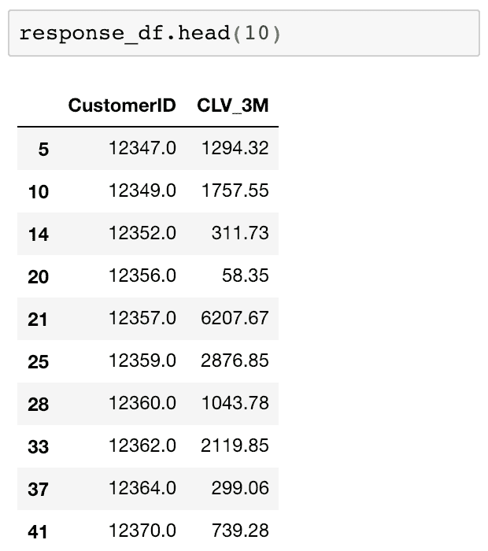

只剩下一件事要做，就是建立机器学习模型的样本集，把特征和反应数据结合在一起。看一下下面的代码:

```py
sample_set_df = features_df.merge(
    response_df, 
    left_index=True, 
    right_on='CustomerID',
    how='left'
)

sample_set_df = sample_set_df.fillna(0)
```

正如你在这里看到的，我们只是用`merge`函数将`CustomerID`上的两个`DataFrames`连接起来。通过使用`how='left'`标志，我们获取特性数据中的所有记录，即使响应数据中没有相应的数据。在这种情况下，给定客户在过去 3 个月中没有购买任何商品，因此我们将其编码为零。最终的样本集现在如下所示:

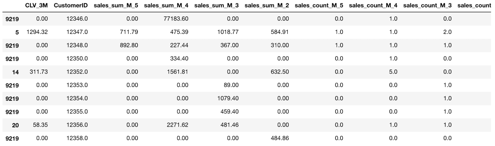

有了这些数据，我们现在可以构建一个模型，用历史购买数据预测未来 3 个月的客户价值。


# 线性回归

与上一章类似，我们将使用以下代码将样本集分为训练集和测试集:

```py
from sklearn.model_selection import train_test_split

target_var = 'CLV_'+clv_freq
all_features = [x for x in sample_set_df.columns if x not in ['CustomerID', target_var]]

x_train, x_test, y_train, y_test = train_test_split(
    sample_set_df[all_features], 
    sample_set_df[target_var], 
    test_size=0.3
)
```

从这段代码中可以看出，我们将样本集的 70%用于训练模型，剩下的 30%用于测试和评估模型性能。在本节中，我们将使用线性回归模型。但是，我们建议尝试其他机器学习算法，如随机森林和**支持向量机** ( **SVM** )。

关于如何用`scikit-learn`包训练这些模型的更多细节可以在以下链接找到:[https://sci kit-learn . org/stable/modules/generated/sk learn . ensemble . randomforestregressor . html](https://scikit-learn.org/stable/modules/generated/sklearn.ensemble.RandomForestRegressor.html)和[https://sci kit-learn . org/stable/modules/generated/sk learn . SVM . SVR . html](https://scikit-learn.org/stable/modules/generated/sklearn.svm.SVR.html)。

为了用我们的数据集训练线性回归模型，可以使用以下代码:

```py
from sklearn.linear_model import LinearRegression

reg_fit = LinearRegression()
reg_fit.fit(x_train, y_train)
```

这再简单不过了。您导入了`scikit-learn`包的`LinearRegression`类，并初始化了一个`LinearRegression`对象。然后，您可以使用具有`x_train`特性和`y_train`目标的`fit`函数来训练一个线性回归模型。

一旦线性回归模型被训练，您可以在`LinearRegression`对象中找到一些有用的信息。首先，您可以使用`LinearRegression`对象的`intercept_`属性获得线性回归方程的截距，如下所示:

```py
reg_fit.intercept_
```

此外，您可以使用如下代码所示的`coef_`属性找到拟合的线性回归模型的系数:

```py
reg_fit.coef_
```

拟合回归模型的每个特征的系数如下所示:

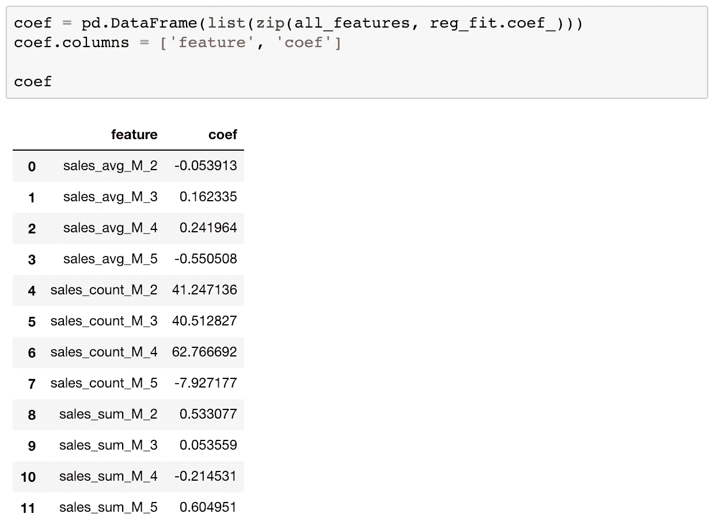

从这个系数输出可以看出，你很容易发现哪些特征与目标负相关，哪些特征与目标正相关。例如，前 3 个月的平均购买金额`sales_avg_M_2`，对未来 3 个月的客户价值有负面影响。这意味着前 3 个月的购买金额越高，后 3 个月的购买金额就越低。另一方面，第二个和第三个最近 3 个月期间的平均购买金额`sales_avg_M_3`和`sales_avg_M_4`与接下来 3 个月的客户价值正相关。换句话说，客户在 3 个月到 9 个月前购买的越多，他或她在接下来的 3 个月里带来的价值就越高。在给定某些特征的情况下，查看系数是了解期望值如何变化的一种方式。

使用 3 个月的客户价值预测输出，您可以以不同的方式定制您的营销策略。由于您知道未来 3 个月个人客户的预期收入或购买量，因此您可以为您的营销活动制定更明智的预算。它应该设置得足够高，以达到您的目标客户，但又足够低，以低于预期的 3 个月客户价值，这样您就可以有一个积极的投资回报营销活动。另一方面，您也可以使用这些 3 个月的客户价值预测输出值来专门针对未来 3 个月的这些高价值客户。这可以帮助您创建具有更高投资回报率的营销活动，因为通过该模型预测的那些高价值客户可能会比其他人带来更多的收入。


# 评估回归模型性能

现在，我们有了一个适合预测 3 个月客户价值的机器学习模型，让我们讨论如何评估该模型的性能。如前所述，我们将使用*R²、MAE 和预测与实际的散点图来评估我们的模型。我们需要首先从模型中获取预测输出，如下面的代码所示:*

```py
train_preds = reg_fit.predict(x_train)
test_preds = reg_fit.predict(x_test)
```

`scikit-learn`包在它们的`metrics`模块中实现了计算*R²和 MAE 的函数。您可以通过将这些函数导入到您的环境中来使用它们，如以下代码所示:*

```py
from sklearn.metrics import r2_score, median_absolute_error
```

顾名思义，`r2_score`函数计算*R²而`median_absolute_error`函数计算 MAE。您可以使用以下代码计算 *R* *²* 和 MAE 数:*

```py
r2_score(y_true=y_train, y_pred=train_preds)
median_absolute_error(y_true=y_train, y_pred=train_preds)
```

从这里可以看出，两个函数都有两个参数，`y_true`和`y_pred`。`y_true`参数用于实际目标值，而`y_pred`参数用于预测目标值。使用这些代码，在我们的例子中，R ² 和 MAE 的样本内和样本外值如下所示:


由于将样本集分为训练集和测试集的随机性，您的结果可能与这些结果不同。在我们的例子中，样本内 R ² 为`0.4445`，样本外 R ² 为`0.7947`。另一方面，样本内 MAE 为`178.2854`，样本外 MAE 为`178.7393`。看看这些数字，我们不一定看到过度拟合的迹象，也不一定看到样本内和样本外表现之间的巨大差距。

最后，让我们看一下预测值与实际值的散点图。您可以对该散点图使用以下代码:

```py
plt.scatter(y_test, test_preds)
plt.plot([0, max(y_test)], [0, max(test_preds)], color='gray', lw=1, linestyle='--')

plt.xlabel('actual')
plt.ylabel('predicted')
plt.title('Out-of-Sample Actual vs. Predicted')
plt.grid()

plt.show()
```

结果图如下所示:


从这个图中可以看出，*x*-值是实际值，*y*-值是预测值。如前所述，直线上的点越多，预测就越好。这是因为直线上的点表明实际值和预测值彼此接近。观察该图，点似乎位于直线周围，这表明预测值和实际值彼此相差不太远。

这个 Python 练习的完整代码可以在以下存储库中找到:[https://github . com/Yoon hwang/hands-on-data-science-for-marketing/blob/master/ch . 9/Python/customerlifetimevalue . ipynb](https://github.com/yoonhwang/hands-on-data-science-for-marketing/blob/master/ch.9/python/CustomerLifetimeValue.ipynb)。


# 用 R 预测 3 个月的 CLV

在本节中，我们将讨论如何使用 r 中的机器学习算法构建和评估回归模型。在本节结束时，我们将使用线性回归算法构建一个预测模型，以预测 CLV，更具体地说，预测 3 个月的预期客户价值。我们将使用一些 R 包，如`dplyr`、`reshape2`和`caTools`，来分析、转换和准备用于构建机器学习模型的数据，以预测预期的 3 个月客户价值。对于那些想在这个练习中使用 Python 而不是 R 的读者，您可以参考上一节。

在这个练习中，我们将使用来自 UCI 机器学习库的一个公开可用的数据集，可以在这个链接找到:[http://archive.ics.uci.edu/ml/datasets/online+retail](http://archive.ics.uci.edu/ml/datasets/online+retail)。您可以点击这个链接，下载 XLSX 格式的数据，名为`Online Retail.xlsx`。一旦下载了这些数据，就可以通过运行下面的命令将其加载到 R 环境中:

```py
library(dplyr)
library(readxl)

#### 1\. Load Data ####
df <- read_excel(
  path="~/Documents/data-science-for-marketing/ch.9/data/Online Retail.xlsx", 
  sheet="Online Retail"
)
```

数据帧`df`如下所示:

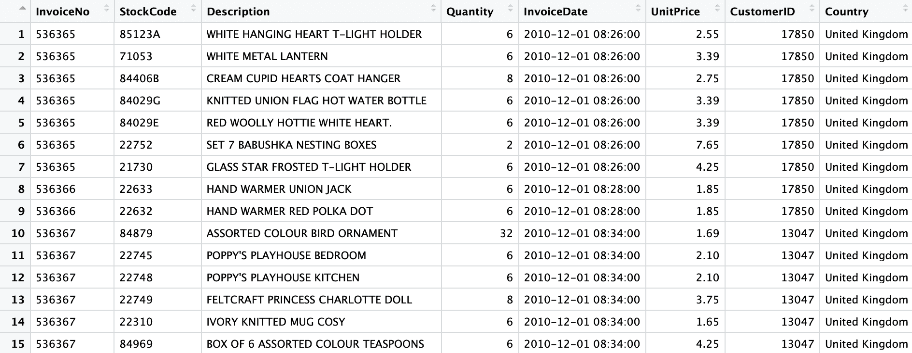

您可能已经注意到，在前面的章节中，我们已经使用过这个数据集几次。根据我们在前几章中获得的关于数据集的知识，我们将首先通过清理数据来准备我们的数据。


# 数据清理

您可能还记得，我们需要清理这个数据集中的一些东西。清理步骤如下:

1.  **处理负数量**:存在负`Quantity`值的交易，代表取消订单。在这个练习中，我们将忽略那些取消的订单，所以我们需要将它们从我们的`DataFrame`中排除。排除`Quantity`列中这些负值的代码如下所示:

```py
        df <- df[which(df$Quantity > 0),]
```

我们只是简单地将所有那些具有正`Quantity`值的行存储回变量`df`。

2.  **删除 NA r** **记录**:我们需要删除`CustomerID`列中没有值的记录。由于我们将构建一个机器学习模型来预测 3 个月的客户价值，因此我们需要按`CustomerID`列对数据进行分组。没有它，我们就不能为这个项目正确地构建模型。删除空值记录的代码类似于下面的代码片段:

```py
        df <- na.omit(df)
```

从这段代码中可以看出，我们在 r 中使用了`na.omit`函数。该函数返回一个移除了`null`或`NA`值的对象。然后，我们将输出存储回原始数据帧，`df`变量。

3.  **处理不完整的数据**:如果你还记得前面的章节，上个月的交易数据是不完整的。看一下下面的输出:

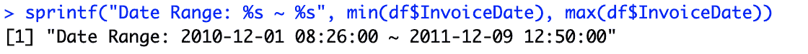

从这个输出可以看出，数据集包含了 2010 年 12 月 1 日到 2011 年 12 月 9 日之间的所有交易。2011 年 12 月份的数据并不完整。为了正确构建 3 个月客户价值预测的模型，我们将忽略上个月的交易。看看下面的代码，如何从我们的数据框架中删除这些记录:

```py
        df <- df[which(df$InvoiceDate < '2011-12-01'),]
```

我们只是将 2011 年 12 月 1 日之前发生的所有交易存储回变量`df`。

4.  **总销售额**:最后，我们需要为每笔交易的总销售额创建一列。看一下下面的代码:

```py
        df$Sales <- df$Quantity * df$UnitPrice
```

我们只需将`Quantity`列乘以`UnitPrice`列，就可以得到每笔交易的总购买金额。然后，我们将这些值存储到一个名为`Sales`的列中。我们现在已经完成了所有的清理任务。

现在我们已经清理了所有的交易数据，让我们为每个订单或`InvoiceNo`汇总这些数据。看一下下面的代码:

```py
# per order data
ordersDF <- df %>% 
  group_by(CustomerID, InvoiceNo) %>% 
  summarize(Sales=sum(Sales), InvoiceDate=max(InvoiceDate))
```

从这段代码中可以看出，我们将`df`分组为两列，`CustomerID`和`InvoiceNo`。然后，我们对每个客户和订单的所有`Sales`值求和，并将给定订单的最后一次交易时间作为`InvoiceDate`。这样，我们现在有了一个数据框架`ordersDF`，我们需要知道每个客户下的每个订单。数据如下所示:

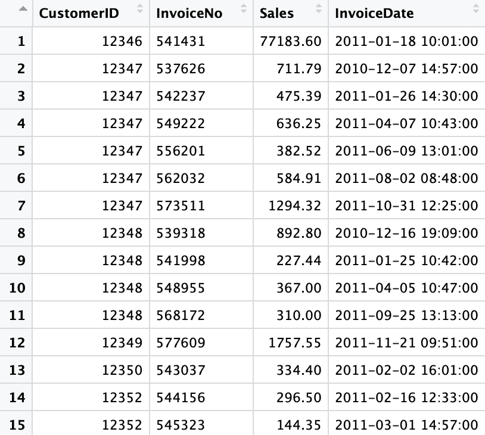

在我们开始构建模型之前，让我们仔细看看这个客户购买历史数据。


# 数据分析

为了计算 CLV，我们需要知道每个顾客购买的频率、最近和总量。我们将计算每个客户的平均购买量和终生购买量的基本信息，以及每个客户的购买持续时间和频率。看一下下面的代码:

```py
# order amount & frequency summary
summaryDF <- ordersDF %>%
  group_by(CustomerID) %>%
  summarize(
    SalesMin=min(Sales), SalesMax=max(Sales), SalesSum=sum(Sales), 
    SalesAvg=mean(Sales), SalesCount=n(),
    InvoiceDateMin=min(InvoiceDate), InvoiceDateMax=max(InvoiceDate), 
    PurchaseDuration=as.double(floor(max(InvoiceDate)-min(InvoiceDate))),
    PurchaseFrequency=as.double(floor(max(InvoiceDate)-min(InvoiceDate)))/n()
  )
```

我们首先按照`CustomerID`列分组，然后按照`Sales`和`InvoiceDate`列合计数字。使用 R 中的`min`、`max`、`sum`、`mean`和`n`函数，我们可以计算最小、最大和总购买量，以及每个客户的平均购买量和购买次数。我们还使用`min`和`max`函数来获取每个客户的第一个和最后一个订单日期。对于`PurchaseDuration`，我们取最后一个订单日期和第一个订单日期之间的天数。对于`PurchaseFrequency`，我们将`PurchaseDuration`的数字除以订单的数量，得到两次购买之间的平均天数。

产生的数据帧`summaryDF`，如下所示:


这些数据让我们了解了每位顾客的购买情况。例如，ID 为`12346`的客户仅在 2011 年 1 月 18 日进行了一次购买。然而，ID 为`12347`的客户在 2010 年 12 月 7 日至 2011 年 10 月 31 日期间，或在`327`天内，进行了六次购买。该客户在每份订单上的平均消费金额约为`681`，平均每`54.5`天该客户就会购买一次产品。

让我们仔细看看回头客购买次数的分布。看一下下面的代码:

```py
summaryDF <- summaryDF[which(summaryDF$PurchaseDuration > 0),]

salesCount <- summaryDF %>% 
  group_by(SalesCount) %>% 
  summarize(Count=n())

ggplot(salesCount[1:19,], aes(x=SalesCount, y=Count)) +
  geom_bar(width=0.5, stat="identity") +
  ggtitle('') +
  xlab("Sales Count") +
  ylab("Count") +
  theme(plot.title = element_text(hjust = 0.5))
```

我们首先在第一行代码中从我们的分析中排除只有一次购买的客户。然后，我们统计每个`SalesCount`的客户数量。最后，我们使用`ggplot`和`geom_bar`创建一个柱状图来显示这些数据。结果如下所示:

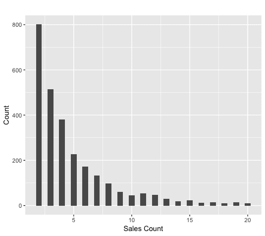

正如您从该图中看到的，大多数客户在历史上购买了 10 次或更少。让我们来看看这些回头客的平均购物间隔天数。先看看下面的代码:

```py
hist(
  summaryDF$PurchaseFrequency, 
  breaks=20,
  xlab='avg. number of days between purchases',
  ylab='count',
  main=''
)
```

我们正在使用 r 中的`hist`函数构建带有购买频率数据的直方图。`breaks`参数定义了要构建的直方图仓的数量。结果如下所示:

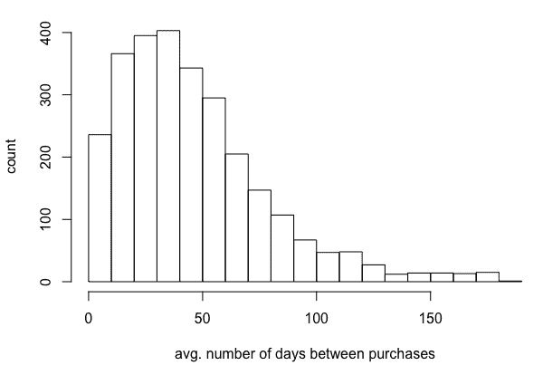

该图告诉我们历史上回头客购买频率的总体情况。从这张图上可以看出，大多数回头客每隔 20 到 50 天就会购买一次。


# 预测 3 个月的 CLV

在本节中，我们将构建一个模型来预测 r 中 3 个月的客户价值。我们首先将数据分成 3 个月的数据块，并将最后 3 个月的数据作为预测目标，其余数据作为特征。我们将首先准备用于建模的数据，然后为 3 个月的客户价值预测训练一个线性回归模型。


# 数据准备

为了建立一个预测模型，我们需要首先准备我们的数据，以便我们可以将相关的数据输入到模型中。看一下下面的代码:

```py
# group data into every 3 months
library(lubridate)

ordersDF$Quarter = as.character(round_date(ordersDF$InvoiceDate, '3 months'))

dataDF <- ordersDF %>%
  group_by(CustomerID, Quarter) %>%
  summarize(SalesSum=sum(Sales), SalesAvg=mean(Sales), SalesCount=n())
```

从这段代码中可以看出，我们使用了`lubridate`包，它将帮助我们更容易地处理带有日期的数据。使用`lubridate`包中的`round_date`函数，我们首先将`InvoiceDate`四舍五入到最近的季度。然后，我们按照`CustomerID`和新创建的列`Quarter`对数据进行分组，以获得每个客户的季度销售数据。对于每组 3 个月的时间窗口，我们对所有销售进行求和，以获得总购买量，并取购买量的平均值，以及给定期间每个客户的总购买次数。这样，我们就有了汇总数据，其中包含每个客户每 3 个月的购买信息。`dataDF`中的数据现在看起来如下:

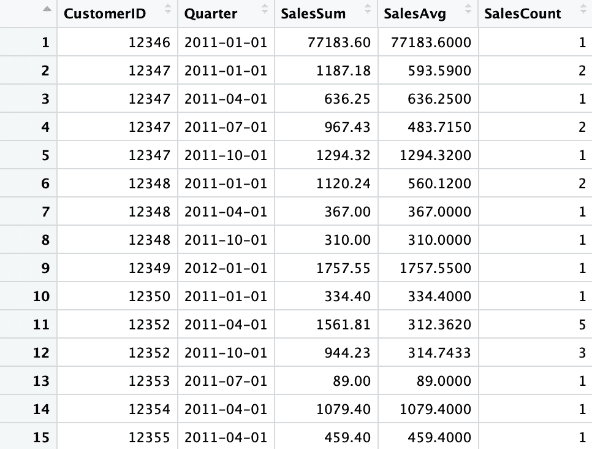

为了使事情更简单，让我们对`Quarter`列值进行编码，使它们比当前的日期格式更容易阅读。看一下下面的代码:

```py
dataDF$Quarter[dataDF$Quarter == "2012-01-01"] <- "Q1"
dataDF$Quarter[dataDF$Quarter == "2011-10-01"] <- "Q2"
dataDF$Quarter[dataDF$Quarter == "2011-07-01"] <- "Q3"
dataDF$Quarter[dataDF$Quarter == "2011-04-01"] <- "Q4"
dataDF$Quarter[dataDF$Quarter == "2011-01-01"] <- "Q5"
```

正如您在这段代码中看到的，我们将日期值编码成`Q1`、`Q2`、`Q3`等等，其中较小的数字代表最近的日期。例如，日期`2012-01-01`现在编码为`Q1`，日期`2011-10-01`现在编码为`Q2`。结果如下所示:

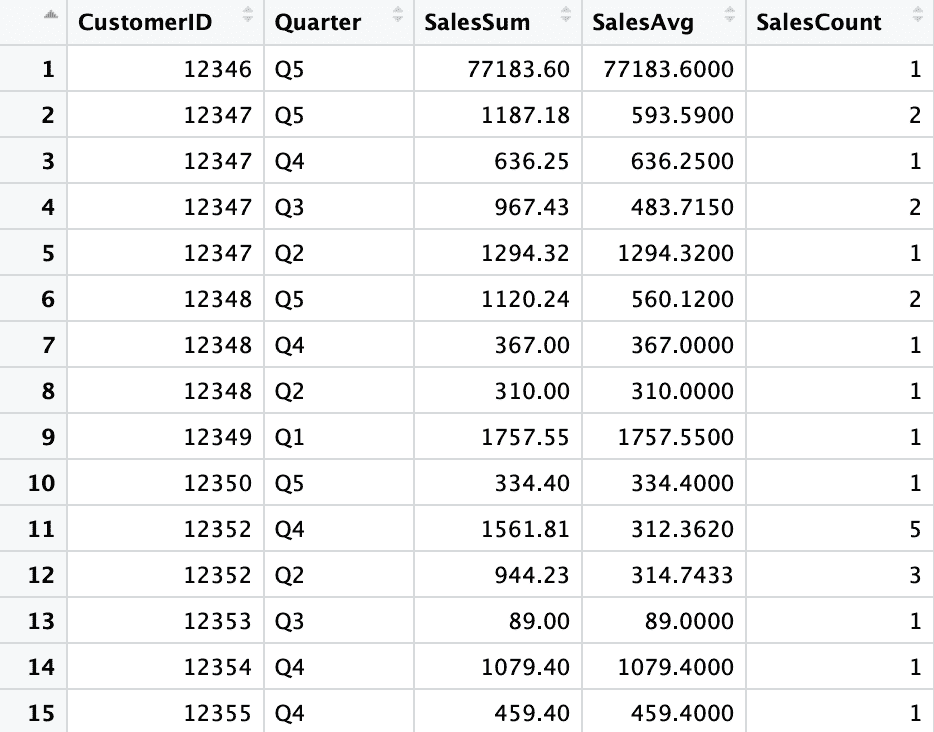

我们现在准备构建一个包含特性和目标变量的样本集。如前所述，我们将使用过去 3 个月作为目标变量，其余时间作为特征，这意味着我们将训练一个机器学习模型，用其余数据预测过去 3 个月的客户价值。为了训练这样的模型，我们需要将这些数据转换成表格数据，其中行代表单个客户，列代表每个功能。看一下下面的代码:

```py
# install.packages('reshape2')
library(reshape2)

salesSumFeaturesDF <- dcast(
  dataDF[which(dataDF$Quarter != "Q1"),], 
  CustomerID ~ Quarter, 
  value.var="SalesSum"
)
colnames(salesSumFeaturesDF) <- c("CustomerID", "SalesSum.Q2", "SalesSum.Q3", "SalesSum.Q4", "SalesSum.Q5")

salesAvgFeaturesDF <- dcast(
  dataDF[which(dataDF$Quarter != "Q1"),], 
  CustomerID ~ Quarter, 
  value.var="SalesAvg"
)
colnames(salesAvgFeaturesDF) <- c("CustomerID", "SalesAvg.Q2", "SalesAvg.Q3", "SalesAvg.Q4", "SalesAvg.Q5")

salesCountFeaturesDF <- dcast(
  dataDF[which(dataDF$Quarter != "Q1"),], 
  CustomerID ~ Quarter, 
  value.var="SalesCount"
)
colnames(salesCountFeaturesDF) <- c("CustomerID", "SalesCount.Q2", "SalesCount.Q3", "SalesCount.Q4", "SalesCount.Q5")

featuresDF <- merge(
  merge(salesSumFeaturesDF, salesAvgFeaturesDF, by="CustomerID"),
  salesCountFeaturesDF, by="CustomerID"
)
featuresDF[is.na(featuresDF)] <- 0
```

从这段代码中可以看出，我们使用了`reshape2`包来透视数据。例如，使用`reshape2`包中的`dcast`函数，我们首先转换`SalesSum`数据，其中行索引代表每个客户或`CustomerID`，列是每个季度，值是给定客户和季度的总销售额或采购额。我们对`SalesSum`、`SalesAvg`和`SalesCount`列重复这个过程三次，最后合并数据。使用`merge`函数，我们可以通过`CustomerID`索引合并这些数据帧。最后，通过使用`is.na`函数，我们用 0 对`null`或`NA`值进行编码。结果如下所示:


现在我们已经构建了特性`DataFrame`，让我们构建目标变量。看一下下面的代码:

```py
responseDF <- dataDF[which(dataDF$Quarter == "Q1"),] %>% 
    select(CustomerID, SalesSum)

colnames(responseDF) <- c("CustomerID", "CLV_3_Month")
```

从这段代码中可以看出，我们将过去 3 个月期间的`Q1`组作为目标变量。目标列将是`SalesSum`，因为我们希望预测未来 3 个月的客户价值，即给定客户在未来 3 个月可能的总购买量。结果如下所示:

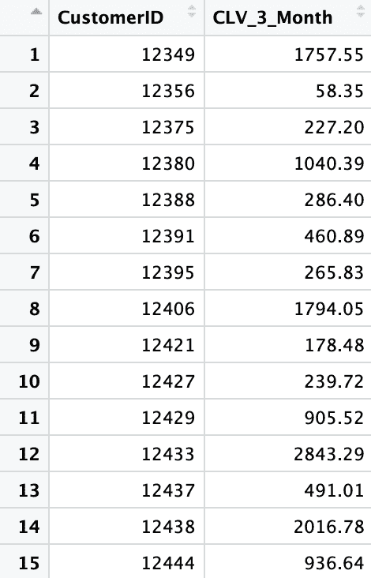

只剩下一件事要做，就是建立机器学习模型的样本集，把特征和反应数据结合在一起。看一下下面的代码:

```py
sampleDF <- merge(featuresDF, responseDF, by="CustomerID", all.x=TRUE)
sampleDF[is.na(sampleDF)] <- 0
```

正如你在这里看到的，我们只是使用`merge`函数将`CustomerID`上的两个`DataFrames`连接起来。通过使用`all.x=TRUE`标志，我们获取特性数据中的所有记录，即使响应数据中没有相应的数据。在这种情况下，给定客户在过去 3 个月中没有购买任何商品，因此我们将其编码为 0。最终的样本集现在如下所示:

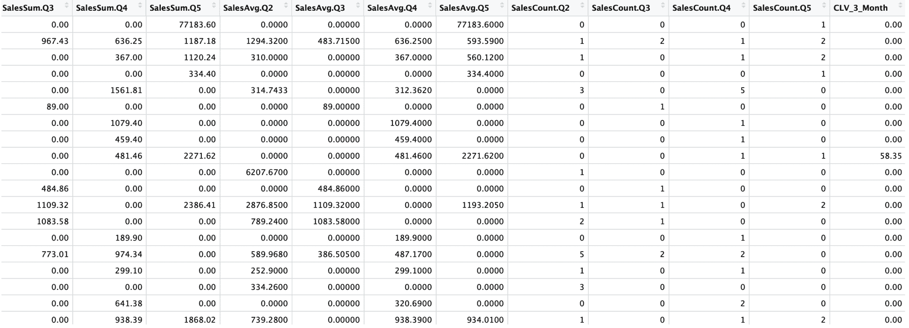

有了这些数据，我们现在可以构建一个模型，用历史购买数据预测未来 3 个月的客户价值。


# 线性回归

与上一章类似，我们将使用以下代码将样本集分为训练集和测试集:

```py
# train/test set split
library(caTools)

sample <- sample.split(sampleDF$CustomerID, SplitRatio = .8)

train <- as.data.frame(subset(sampleDF, sample == TRUE))[,-1]
test <- as.data.frame(subset(sampleDF, sample == FALSE))[,-1]
```

从这段代码中可以看出，我们将样本集的 80%用于训练模型，剩下的 20%用于测试和评估模型性能。在本节中，我们将使用线性回归模型。但是，我们建议尝试其他机器学习算法，如**随机森林**和**支持向量机(SVM)** 。你可以用`randomForest`包训练一个随机森林模型，用`e1071`包训练一个 SVM 模型。我们强烈建议看一下他们关于用法的文档。

为了用我们的数据集训练线性回归模型，可以使用以下代码:

```py
# Linear regression model
regFit <- lm(CLV_3_Month ~ ., data=train)
```

这再简单不过了。您只需向`lm`函数提供一个公式，在我们的例子中是`CLV_3_Month ~ .`，以及用于训练的数据，在我们的例子中是`train`变量。这将指示您的机器用给定的数据训练一个线性回归模型。

一旦线性回归模型定型，您就可以在模型对象中找到一些有用的信息。您可以使用以下命令来获取关于模型的详细信息:

```py
summary(regFit)
```

输出如下所示:

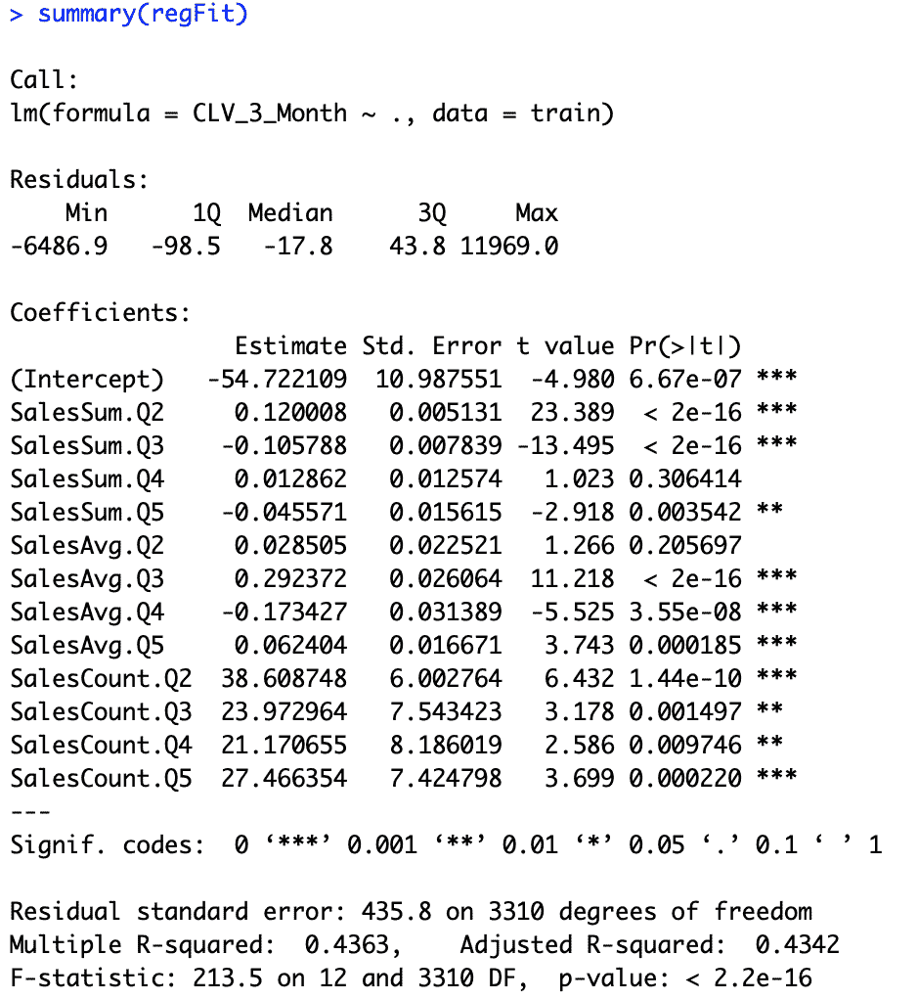

从这个输出可以看出，您可以很容易地找到每个特征的系数，以及哪些特征与目标具有负相关或正相关。例如，前 3 个月的累计购买金额`SalesSum.Q2`，对未来 3 个月的客户价值有积极影响。这意味着前 3 个月的总购买量越高，下 3 个月的购买量也越高。另一方面，第二个和第四个最近 3 个月期间的累计购买金额`SalesSum.Q3`和`SalesSum.Q5`与接下来 3 个月的客户价值负相关。换句话说，客户在两个季度或四个季度前购买的越多，他或她在未来 3 个月内带来的价值就越低。在给定某些特征的情况下，查看系数是了解期望值如何变化的一种方式。

使用 3 个月的客户价值预测输出，您可以以不同的方式定制您的营销策略。由于您知道未来 3 个月个人客户的预期收入或购买量，因此您可以为您的营销活动制定更明智的预算。它应该设置得足够高，以达到您的目标客户，但又足够低，以低于预期的 3 个月客户价值，这样您就可以有一个积极的投资回报营销活动。另一方面，您也可以使用这些 3 个月的客户价值预测结果来专门针对未来 3 个月的高价值客户。这可以帮助您创建具有更高投资回报率的营销活动，因为通过该模型预测的那些高价值客户可能会比其他人带来更多的收入。


# 评估回归模型性能

现在我们有了一个机器学习模型，它被训练来预测 3 个月的客户价值，让我们讨论如何评估这个模型的性能。如前所述，我们将使用 R2、MAE 和预测与实际的散点图来评估我们的模型。我们首先需要从模型中获得预测输出，如以下代码所示:

```py
train_preds <- predict(regFit, train)
test_preds <- predict(regFit, test)
```

我们将使用`miscTools`包来计算样本内和样本外的 R ² 值。看一下下面的代码:

```py
# R-squared
# install.packages('miscTools')
library(miscTools)

inSampleR2 <- rSquared(train$CLV_3_Month, resid=train$CLV_3_Month - train_preds)
outOfSampleR2 <- rSquared(test$CLV_3_Month, resid=test$CLV_3_Month - test_preds)
```

在我们的例子中，R ² 值看起来像下面的输出:

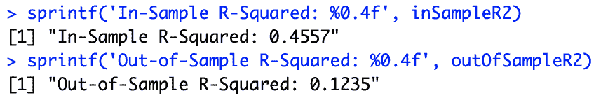

由于将样本集分为训练集和测试集的随机性，您的结果可能与这些结果不同。在我们的例子中，样本内 R ² 为`0.4557`，样本外 R ² 为`0.1235`。样本内和样本外 R ² 值之间相当大的差距表明发生了一些过度拟合，其中模型在训练集中表现得明显更好，而在测试集中表现得更差。在过度拟合的情况下，可以尝试不同的特征组合，或者使用更多的样本进行训练。

接下来，让我们看看样本内和样本外预测的 MAE。看一下下面的代码:

```py
# Median Absolute Error
inSampleMAE <- median(abs(train$CLV_3_Month - train_preds))
outOfSampleMAE <- median(abs(test$CLV_3_Month - test_preds))
```

从这段代码中可以看出，我们使用了`median`和`abs`函数来获得样本内和样本外预测的绝对误差的中值。在我们的例子中，结果如下所示:


最后，让我们看一下预测值与实际值的散点图。您可以对该散点图使用以下代码:

```py
plot(
  test$CLV_3_Month, 
  test_preds, 
  xlab='actual', 
  ylab='predicted', 
  main='Out-of-Sample Actual vs. Predicted'
)
abline(a=0, b=1)
```

结果图如下所示:


从这个图中可以看出，*x*-值是实际值，*y*-值是预测值。如前所述，直线上的点越多，预测就越好。这是因为直线上的点表明实际值和预测值彼此接近。看这个图，点似乎没有分布在直线周围，这表明预测相当差。这符合我们之前观察到的低样本外 *R ²* 值。预测值与实际值的散点图是可视化模型性能的好方法。

这个 R 练习的完整代码可以在下面的 repo 中找到:[https://github . com/Yoon hwang/hands-on-data-science-for-marketing/blob/master/ch . 9/R/CustomerLifetimeValue。R](https://github.com/yoonhwang/hands-on-data-science-for-marketing/blob/master/ch.9/R/CustomerLifetimeValue.R)


# 摘要

在这一章中，我们学习了什么是 CLV 及其在营销中的重要性和用法。特别是为了证明获取客户的成本，很好地理解每个新客户将给公司带来多少价值是至关重要的。我们讨论了 CLV 计算如何帮助营销人员制定积极的投资回报营销策略。然后，我们通过一个假设的例子来展示如何使用平均购买金额、购买频率和客户生命周期来计算 CLV。我们还提到了使用机器学习和预测模型来估计 CLV 的另一种方法。

在编程练习中，我们已经学习了如何建立回归模型来预测 3 个月内的 CLV。在 Python 中，我们使用了`scikit-learn`包来构建一个`LinearRegression`模型。在 R 中，我们使用内置的`lm`函数用我们的数据训练一个线性回归模型。对于回归模型评估，我们已经讨论了四种常用的度量，MSE、MAE、R ² ，以及预测与实际散点图，以及这些度量中的每一个度量和告诉我们的关于回归模型的性能的内容。在我们的编程练习中，我们讨论了如何计算和可视化 MAE，R ² ，以及用 Python 和 R。

在下一章中，我们将介绍客户细分。我们将讨论细分客户群如何帮助营销人员更好地了解他们的客户，并提出更有效的营销策略。