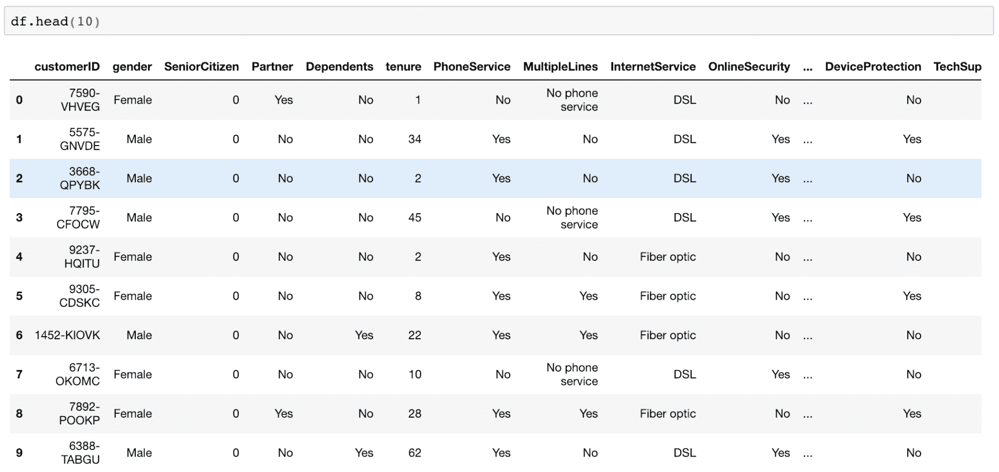
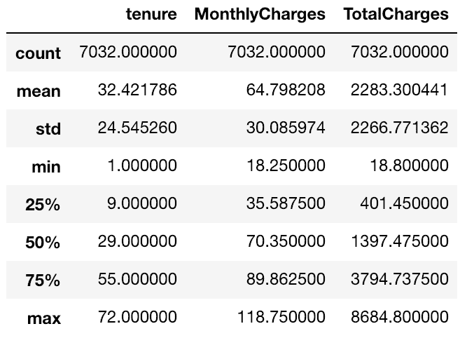
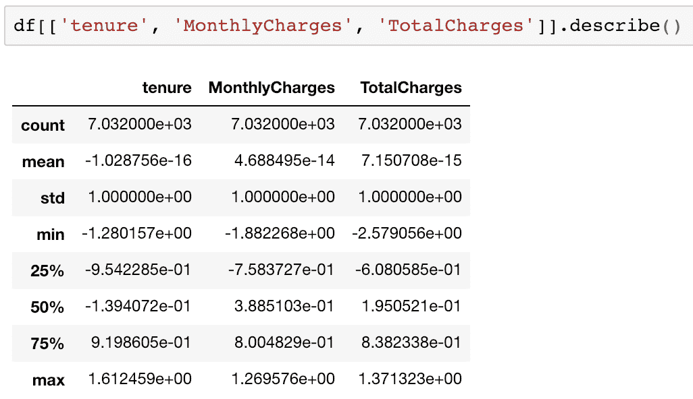
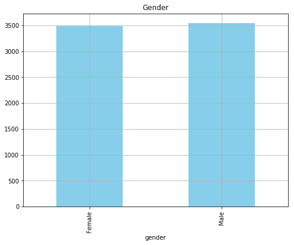
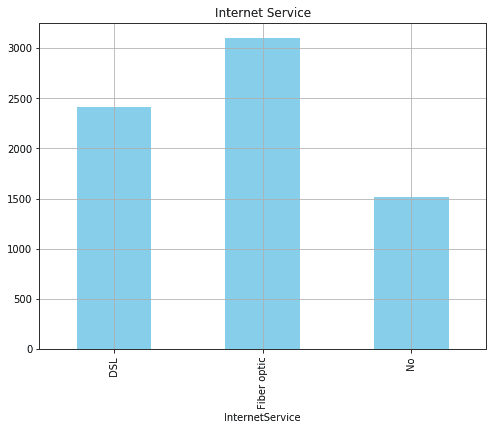
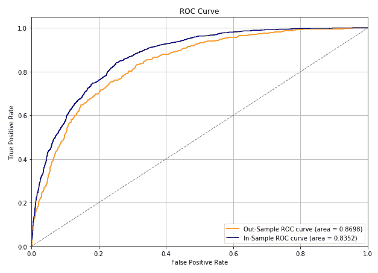
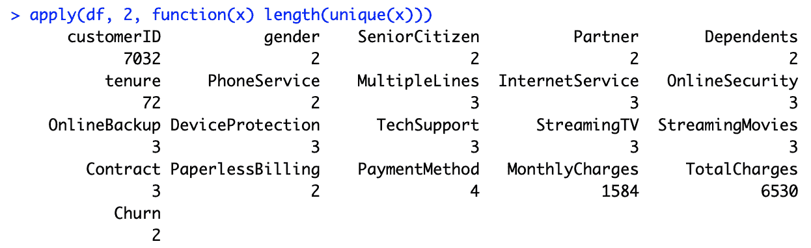
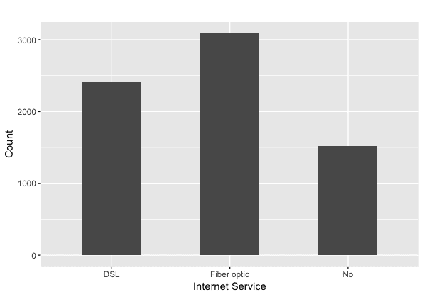
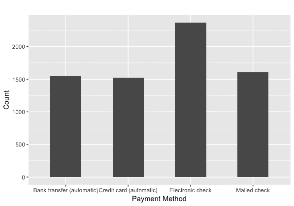
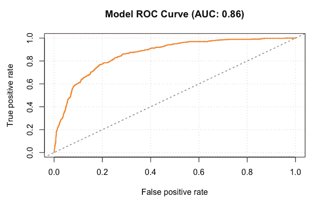

# 十一、留住客户

随着消费者对消费的类似内容或购物的类似产品和服务有了更多的选择，许多企业越来越难以留住他们的客户而不将他们流失到其他竞争对手手中。由于获得新客户的成本通常高于留住现有客户的成本，客户流失正变得比以往任何时候都更加令人担忧。为了留住现有客户而不被竞争对手抢走，企业不仅应该努力了解他们的客户及其客户的需求和兴趣，还应该能够识别哪些客户极有可能流失，以及如何在流失风险下留住这些客户。

在这一章中，我们将深入探讨客户流失及其对企业的伤害，以及如何留住现有客户。我们将讨论客户离开企业的一些常见原因，并了解数据科学如何帮助降低失去客户的风险。作为预测客户流失的一种方式，我们将了解什么是人工神经网络模型及其在不同领域的应用，以及我们如何使用 Python 和 r。

在本章中，我们将讨论以下主题:

*   客户流失和保留
*   人工神经网络
*   用 Python 预测客户流失
*   用 R 预测客户流失


# 客户流失和保留

**客户流失**是指客户决定停止使用某家公司的服务、内容或产品。正如我们在[第 7 章](72e8f4ee-7f95-4acc-928d-d33c9fc31bd6.xhtml)、*中简要讨论的，对客户行为的探索性分析*，当我们讨论客户分析时，保留现有客户比获取新客户的成本低得多，而且来自回头客的收入通常高于来自新客户的收入。在竞争激烈的行业中，企业面临许多竞争对手，获取新客户的成本甚至更高，保留现有客户对这类企业变得更加重要。

顾客离开一家企业背后有许多原因。客户流失的一些常见原因是糟糕的客户服务、没有发现产品或服务的足够价值、缺乏沟通以及缺乏客户忠诚度。留住这些客户的第一步是监控客户流失率。如果流失率普遍较高或者随着时间的推移而增加，那么投入一些资源来提高客户保持率将是一个好主意。

为了提高客户保留率，当务之急应该是更好地了解客户。你可以调查已经流失的客户，了解他们离开的原因。您还可以调查现有客户，了解他们的需求是什么，他们的痛点是什么。数据科学和数据分析方法是研究数据。例如，您可以查看客户的网络活动数据，了解他们在哪里花的时间最多，他们正在查看的页面是否有错误，或者他们的搜索结果是否没有返回好的内容。您还可以查看客户服务电话记录，了解他们的等待时间、他们的投诉以及他们的问题是如何处理的。对这些数据点进行深入分析可以揭示企业在留住现有客户方面面临的问题。

在分析客户流失时，您也可以利用我们在本书中讨论的一些主题。您可以应用我们从[第 5 章](73a716c6-6a84-4785-b04e-87651d0a29d1.xhtml)、*产品分析*和[第 6 章](d3ba7047-2873-4b03-9a44-4c1d55b84178.xhtml)、*推荐合适的产品*中学到的知识，了解哪些产品最符合客户的需求和兴趣，并推荐合适的产品，以便您可以提供更多个性化内容。您还可以利用我们从[第 7 章](72e8f4ee-7f95-4acc-928d-d33c9fc31bd6.xhtml)、*客户行为探索性分析*和[第 10 章](5955002d-2a75-4d5a-aa6a-86710a3bf00e.xhtml)、*数据驱动的客户细分*中学到的知识，更好地了解客户行为和不同的客户细分。另一种方法是建立一个机器学习模型，可以预测哪些客户可能会流失，并锁定和保留这些流失风险较高的特定客户。在接下来的章节中，我们将讨论如何建立一个神经网络模型来识别那些具有较高流失风险的客户，从而留住客户。


# 人工神经网络

**人工神经网络** ( **安**)模型是一种机器学习模型，其灵感来自人类大脑的功能。最近，人工神经网络模型在图像识别、声音识别和机器人方面的成功应用已经证明了它们在各种行业中的预测能力和实用性。你可能听说过术语**深度学习**。这是一种 ANN 模型，其中输入层和输出层之间的层数很多。下图对此进行了最好的解释:


此图显示了带有一个隐藏层的人工神经网络模型的简单情况。该图中的圆圈代表人工神经元或节点，模拟人脑中的神经元。箭头表示信号如何从一个神经元传递到另一个神经元。如图所示，人工神经网络模型通过寻找从每个输入神经元到下一层神经元的信号模式或权重进行学习，这可以最好地预测输出。

我们将在下面的编程练习中试验的一种特定类型的人工神经网络模型是一种**多层感知器** ( **MLP** )模型。简单地说，MLP 模型是一种神经网络模型，它至少有一层或多层隐藏节点。包括用于输入的一层和用于输出的另一层，MLP 模型由至少三层或更多层节点组成。我们刚刚看到的图表是 MLP 模型的最简单的情况，其中只有一个隐藏层。

人工神经网络模型可用于市场营销的许多领域。使用 BrainMaker 的神经网络模型，微软将其直邮回复率从 4.9%提高到 8.2%。这帮助微软以 35%的低成本获得了相同的收入。同样，对于我们在[第 8 章](4f5163a1-c34a-495f-bc5f-e02f9b2a2052.xhtml)、*预测营销参与可能性*中讨论的营销参与预测问题，我们可以使用神经网络模型，而不是随机森林模型。我们也可以使用神经网络模型来解决我们在[第 10 章](5955002d-2a75-4d5a-aa6a-86710a3bf00e.xhtml)、*数据驱动的客户细分*中讨论的客户细分问题。在下面的编程练习中，我们将讨论如何使用人工神经网络模型来预测哪些客户可能会流失。


# 用 Python 预测客户流失

在这一节中，我们将讨论如何使用人工神经网络模型来预测有离开风险的客户或极有可能流失的客户。在本节结束时，我们将使用 ANN 模型建立一个客户流失预测模型。我们将主要使用`pandas`、`matplotlib`和`keras`包来分析、可视化和构建机器学习模型。对于那些想在这个练习中使用 R 而不是 Python 的读者，您可以跳到下一节。

在本练习中，我们将使用 IBM Watson Analytics 社区中的一个公开可用数据集，该数据集可通过以下链接找到:[https://www . IBM . com/communities/Analytics/Watson-Analytics-blog/predictive-insights-in-the-telco-customer-churn-data-set/](https://www.ibm.com/communities/analytics/watson-analytics-blog/predictive-insights-in-the-telco-customer-churn-data-set/)。你可以点击这个链接下载这些数据，这些数据是 XLSX 格式的，命名为`WA_Fn-UseC_-Telco-Customer-Churn.xlsx`。下载完这些数据后，您可以通过运行以下命令将其加载到 Jupyter 笔记本中:

```py
import pandas as pd

df = pd.read_excel('../data/WA_Fn-UseC_-Telco-Customer-Churn.xlsx')
```

数据帧`df`如下图所示:



该数据集中有 21 个变量，我们的目标是预测目标变量`Churn`。


# 数据分析和准备

通过查看数据，您可能会注意到，在开始构建机器学习模型之前，我们需要做一些事情。在本节中，我们将转换具有货币值的连续变量，并对目标变量`Churn`以及其他分类变量进行编码。为此，请执行以下步骤:

1.  **目标变量编码**:从数据中你可能已经注意到，目标变量`Churn`有两个值:`Yes`和`No`。我们将把这些值编码为代表`Yes`的`1`和代表`No`的`0`。编码目标变量的代码如下所示:

```py
        df['Churn'] = df['Churn'].apply(lambda x: 1 if x == 'Yes' else 0)
```

要获得整体流失率，您只需运行以下代码:

```py
        df['Churn'].mean()
```

这段代码的输出大约是 0.27，这表明大约有 27%的客户有过不愉快的经历。27%的流失率不是一个小数字；相反，这足以让企业担心整体客户流失，并想出一个解决方案来留住这些客户。在下面的建模部分，我们将讨论如何预测可能会因这些数据而流失的客户，并使用这些预测来留住客户。

2.  **处理 TotalCharges 列**中的缺失值:如果您查看了数据集中的`TotalCharges`列，您可能会注意到有些记录没有`TotalCharges`值。由于只有`11`记录缺少`TotalCharges`值，我们将简单地忽略并丢弃那些缺少值的记录。看一下下面的代码:

```py
        df['TotalCharges'] = df['TotalCharges'].replace(' ',   
                             np.nan).astype(float)

        df = df.dropna()
```

您可能会从这段代码中注意到，我们只是用`nan`值替换了空白值。然后，我们使用`dropna`函数删除所有带有`nan`值的记录。

3.  **转换连续变量**:下一步是缩放连续变量。看看以下连续变量的汇总统计数据:



您可以使用以下代码获得这些汇总统计信息:

```py
        df[['tenure', 'MonthlyCharges', 'TotalCharges']].describe()
```

从汇总统计可以看出，三个`tenure`、`MonthlyCharges`、`TotalCharges`连续变量都有不同的标度。`tenure`变量的范围从`1`到`72`，而`TotalCharges`变量的范围从`18.8`到`8684.8`。人工神经网络模型通常对缩放或归一化的要素表现更好。看一下下面的代码，用于规范化这三个特性:

```py
        df['MonthlyCharges'] = np.log(df['MonthlyCharges'])
        df['MonthlyCharges'] = (df['MonthlyCharges'] -    
        df['MonthlyCharges'].mean())/df['MonthlyCharges'].std()

        df['TotalCharges'] = np.log(df['TotalCharges'])
        df['TotalCharges'] = (df['TotalCharges'] -       
        df['TotalCharges'].mean())/df['TotalCharges'].std()

        df['tenure'] = (df['tenure'] - df['tenure'].mean())/df['tenure'].std()
```

从这段代码中可以看出，我们首先应用对数变换，然后通过减去平均值并将值除以标准偏差来标准化连续变量。结果如下所示:



正如您从这个输出中看到的，所有变量现在都有一个平均值`0`和一个标准差`1`。我们将使用这些标准化变量来构建未来的模型。

4.  **一热编码分类变量**:从数据中可以看出，分类变量很多。让我们先来看看每一列的唯一值的数量。看一下下面的代码:

```py
        for col in list(df.columns):
            print(col, df[col].nunique())
```

您可以使用`nunique`函数来计算每一列中唯一值的数量。这段代码的输出如下所示:


正如该输出所示，有`7032`个唯一的客户 id、`2`个唯一的性别、`MultipleLines`个唯一的`3`值和`TotalCharges`个唯一的`6530`值。在上一步中，我们已经处理了`tenure`、`MonthlyCharges`和`TotalCharges`变量，因此我们将重点关注那些具有`2`到`4`唯一值的变量。

让我们来看看这些分类变量的分布。首先，要查看数据在男性和女性之间的分布，可以使用以下代码进行可视化:

```py
df.groupby('gender').count()['customerID'].plot(
    kind='bar', color='skyblue', grid=True, figsize=(8,6), title='Gender'
)
plt.show()
```

该图如下所示:



从这个柱状图可以看出，不同性别的数据分布大致相等。您可以使用相同的代码来查看不同的`InternetService`和`PaymentMethod`值的数据分布。看一下下面的情节:




第一个图显示了数据在三个不同类别的`InternetService`变量中的分布，第二个图显示了数据在四个不同类别的`PaymentMethod`变量中的分布。从这些图中可以看出，使用柱状图，我们可以很容易地想象和理解分类变量的分布情况。我们建议您为其他分类变量绘制条形图，以便更好地了解数据分布。

现在，我们将对这些分类变量应用一键编码。看一下下面的代码:

```py
dummy_cols = []

sample_set = df[['tenure', 'MonthlyCharges', 'TotalCharges', 'Churn']].copy(deep=True)

for col in list(df.columns):
    if col not in ['tenure', 'MonthlyCharges', 'TotalCharges', 'Churn'] and df[col].nunique() < 5:
        dummy_vars = pd.get_dummies(df[col])
        dummy_vars.columns = [col+str(x) for x in dummy_vars.columns] 
        sample_set = pd.concat([sample_set, dummy_vars], axis=1)
```

从这段代码中可以看出，我们使用了`pandas`包中的`get_dummies`函数来为每个分类变量创建虚拟变量。然后，我们将这些新创建的虚拟变量连接回`sample_set`变量，该变量将用于下一节中的训练模型。结果显示在以下输出中:


一旦你完成了这四个步骤，是时候开始建立人工神经网络模型来预测客户流失了。进入下一部分，进行人工神经网络建模！


# 安和克拉斯

为了在 Python 中构建 ANN 模型，我们将使用`keras`包，它是一个高级神经网络库。要了解更多细节，我们建议你访问他们的官方文档，链接如下:[https://keras.io/](https://keras.io/)。在我们使用这个包来构建 ANN 模型之前，我们需要安装两个包:`tensorflow`和`keras`。`keras`包使用`tensorflow`作为构建神经网络模型的后端，所以我们需要先安装`tensorflow`。您可以在终端中使用以下`pip`命令安装这两个软件包:

```py
pip install tensorflow
pip install keras
```

一旦你安装了这两个软件包，我们就可以开始构建我们的第一个神经网络模型了。在本练习中，我们将构建一个具有一个隐藏层的神经网络模型。先看看下面的代码:

```py
from keras.models import Sequential
from keras.layers import Dense

model = Sequential()
model.add(Dense(16, input_dim=len(features), activation='relu'))
model.add(Dense(8, activation='relu'))
model.add(Dense(1, activation='sigmoid'))
```

让我们仔细看看这段代码。首先，我们在这里使用一个`Sequential`模型，这是一种层线性堆叠的模型，看起来类似于我们在前面关于 MLP 模型的部分看到的图表。第一层是输入层，其中`input_dim`是样本集中特征或列的数量，输出单元的数量是`16`。我们正在为这个输入层使用`relu`激活功能。然后，在隐藏层中，输出单元的数量是`8`，要使用的激活函数是`relu`。最后，输出层有一个输出单位，即客户流失的概率，我们在这一层使用了`sigmoid`激活函数。您可以在练习中尝试不同数量的输出单元和激活功能。

用`keras`包构建神经网络模型的最后一步是编译这个模型。看一下下面的代码:

```py
model.compile(loss='binary_crossentropy', optimizer='adam', metrics=['accuracy'])
```

这里，我们使用的是`adam`优化器，它是最常用和最频繁使用的优化算法之一。因为我们的目标变量是二进制的，我们使用`binary_crossentropy`作为损失函数。最后，该模型将使用`accuracy`指标来评估模型在培训期间的表现。

在我们开始训练这个神经网络模型之前，我们需要将样本集分成训练集和测试集。看一下下面的代码:

```py
from sklearn.model_selection import train_test_split

target_var = 'Churn'
features = [x for x in list(sample_set.columns) if x != target_var]

X_train, X_test, y_train, y_test = train_test_split(
    sample_set[features], 
    sample_set[target_var], 
    test_size=0.3
)
```

从这段代码中可以看出，我们正在使用`scikit-learn`包的`train_test_split`函数。在我们的练习中，我们将使用 70%的样本集进行训练，30%进行测试。现在，我们可以使用以下代码来训练我们的神经网络模型:

```py
model.fit(X_train, y_train, epochs=50, batch_size=100)
```

在这里，我们使用`100`个样本作为`batch_size`，模型将从中学习每次预测，使用`50`作为`epochs`的数量，T3 是通过整个训练集的完整次数。运行此代码后，您将看到如下所示的输出:


从这个输出可以看出，在每个历元中，`loss`通常会降低，而精度(`acc`)会提高。然而，模型性能改进的速度会随着时间的推移而降低。从这个输出中可以看出，在最初的几个时期，损耗和精度指标有了很大的改善，而性能增益随着时间的推移而下降。您可以监视这个过程，并在性能提升最小时决定停止。


# 模型评估

现在我们已经建立了我们的第一个神经网络模型，让我们来评估它的性能。我们将考察总体准确度、精确度和召回率，以及**接收器工作特性** ( **ROC** )曲线和曲线下面积(AUC)。首先，看一下下面计算准确度、精度和召回率的代码:

```py
from sklearn.metrics import accuracy_score, precision_score, recall_score

in_sample_preds = [round(x[0]) for x in model.predict(X_train)]
out_sample_preds = [round(x[0]) for x in model.predict(X_test)]

# Accuracy
print('In-Sample Accuracy: %0.4f' % accuracy_score(y_train, in_sample_preds))
print('Out-of-Sample Accuracy: %0.4f' % accuracy_score(y_test, out_sample_preds))

# Precision
print('In-Sample Precision: %0.4f' % precision_score(y_train, in_sample_preds))
print('Out-of-Sample Precision: %0.4f' % precision_score(y_test, out_sample_preds))

# Recall
print('In-Sample Recall: %0.4f' % recall_score(y_train, in_sample_preds))
print('Out-of-Sample Recall: %0.4f' % recall_score(y_test, out_sample_preds))
```

你应该熟悉这段代码，因为我们在第 8 章*中[使用了相同的评估指标来预测营销参与的可能性](4f5163a1-c34a-495f-bc5f-e02f9b2a2052.xhtml)*。在我们的例子中，这段代码的输出如下所示:


由于模型中的一些随机性，您的结果可能与这些数字不同。正如您从这个输出中看到的，在测试集中预测客户是否会流失的准确性大约是`0.79`，这表明该模型在大约 80%的情况下是正确的。样本外精度表明，该模型在预测客户将流失的时间中大约有 66%是正确的，样本外召回表明，该模型捕获了大约 52%的流失案例。

接下来，我们可以使用以下代码计算 AUC 数字:

```py
from sklearn.metrics import roc_curve, auc

in_sample_preds = [x[0] for x in model.predict(X_train)]
out_sample_preds = [x[0] for x in model.predict(X_test)]

in_sample_fpr, in_sample_tpr, in_sample_thresholds = roc_curve(y_train, in_sample_preds)
out_sample_fpr, out_sample_tpr, out_sample_thresholds = roc_curve(y_test, out_sample_preds)

in_sample_roc_auc = auc(in_sample_fpr, in_sample_tpr)
out_sample_roc_auc = auc(out_sample_fpr, out_sample_tpr)

print('In-Sample AUC: %0.4f' % in_sample_roc_auc)
print('Out-Sample AUC: %0.4f' % out_sample_roc_auc)
```

这段代码的输出如下所示:


要在 ROC 曲线中可视化这些数据，可以使用以下代码:

```py
plt.figure(figsize=(10,7))

plt.plot(
    out_sample_fpr, out_sample_tpr, color='darkorange', label='Out-Sample ROC curve (area = %0.4f)' % in_sample_roc_auc
)
plt.plot(
    in_sample_fpr, in_sample_tpr, color='navy', label='In-Sample ROC curve (area = %0.4f)' % out_sample_roc_auc
)
plt.plot([0, 1], [0, 1], color='gray', lw=1, linestyle='--')
plt.grid()
plt.xlim([0.0, 1.0])
plt.ylim([0.0, 1.05])
plt.xlabel('False Positive Rate')
plt.ylabel('True Positive Rate')
plt.title('ROC Curve')
plt.legend(loc="lower right")

plt.show()
```

输出如下所示:



除了我们之前看到的准确度、精确度和召回率，AUC 和 ROC 曲线也表明该模型很好地捕捉和预测了那些有流失风险的客户。正如您从这些评估输出中看到的，使用该模型的输出来识别可能流失的客户比简单地猜测他们会是谁更好。通过在您的营销策略中关注这些具有高流失概率的客户，您可以尝试以更具成本效益的方式留住这些面临流失风险的客户。

这个练习的完整代码可以在这个资源库中找到:[https://github . com/Yoon hwang/hands-on-data-science-for-marketing/blob/master/ch . 11/python/customer retention . ipynb](https://github.com/yoonhwang/hands-on-data-science-for-marketing/blob/master/ch.11/python/CustomerRetention.ipynb)。


# 用 R 预测客户流失

在本节中，我们将讨论如何使用人工神经网络模型来预测有离开风险的客户或极有可能流失的客户。在本节结束时，我们将使用 ANN 模型建立一个客户流失预测模型。我们将主要使用`dplyr`、`ggplot2`和`keras`库来分析、可视化和构建机器学习模型。对于那些想在这个练习中使用 Python 而不是 R 的读者，请参阅上一节。

在本练习中，我们将使用 IBM Watson Analytics 社区中的一个公开可用数据集，该数据集可通过以下链接找到:[https://www . IBM . com/communities/Analytics/Watson-Analytics-blog/predictive-insights-in-the-telco-customer-churn-data-set/](https://www.ibm.com/communities/analytics/watson-analytics-blog/predictive-insights-in-the-telco-customer-churn-data-set/)。你可以点击这个链接下载这些数据，这些数据是 XLSX 格式的，命名为`WA_Fn-UseC_-Telco-Customer-Churn.xlsx`。下载完这些数据后，可以通过运行以下命令将其加载到 RStudio 环境中:

```py
library(readxl)

#### 1\. Load Data ####
df <- read_excel(
  path="~/Documents/data-science-for-marketing/ch.11/data/WA_Fn-UseC_-Telco-Customer-Churn.xlsx"
)
```

数据帧`df`应如下图所示:


该数据集中有 21 个变量，我们的目标是预测目标变量`Churn`。


# 数据分析和准备

通过查看数据，您可能已经注意到，在开始构建机器学习模型之前，我们需要做一些事情。在本节中，我们将转换具有货币值的连续变量，并对目标变量`Churn`以及其他分类变量进行编码。为此，请执行以下步骤:

1.  **处理数据**中的缺失值:如果您查看数据集中的`TotalCharges`列，您可能会注意到有些记录没有`TotalCharges`值。由于只有`11`记录缺少`TotalCharges`值，我们将简单地忽略并丢弃那些缺少值的记录。看一下下面的代码:

```py
        library(tidyr)

        df <- df %>% drop_na()
```

正如您可能从这段代码中注意到的，我们在`tidyr`包中使用了`drop_na`函数，该函数将删除所有带有`NA`值的记录。

2.  **分类变量**:从数据中可以看出，分类变量很多。让我们先来看看每一列的唯一值的数量。看一下下面的代码:

```py
       apply(df, 2, function(x) length(unique(x)))
```

您可以使用`unique`函数来获取每一列中的唯一值。通过对`df`中的所有列应用该函数，该代码的输出如下所示:



正如该输出所示，有`7032`个唯一的客户 id、`2`个唯一的性别、`MultipleLines`个唯一的`3`值和`TotalCharges`个唯一的`6530`值。`tenure`、`MonthlyCharges`和`TotalCharges`变量是连续变量，其中每个变量可以取任何值，其余的是分类变量。

我们将看看这些分类变量的分布。首先，要查看数据在男性和女性之间的分布，可以使用以下代码进行可视化:

```py
        ggplot(df %>% group_by(gender) %>% summarise(Count=n()),
         aes(x=gender, y=Count)) +
          geom_bar(width=0.5, stat="identity") +
          ggtitle('') +
          xlab("Gender") +
          ylab("Count") +
          theme(plot.title = element_text(hjust = 0.5))
```

情节是这样的:


从这个柱状图可以看出，数据在两种性别中的分布大致相等。您可以使用相同的代码来查看不同的`InternetService`和`PaymentMethod`值的数据分布。看一下下面的情节:





第一张图显示了数据在三个不同类别的`InternetService`变量中的分布，第二张图显示了数据在四个不同类别的`PaymentMethod`变量中的分布。从这些图中可以看出，使用柱状图，我们可以很容易地想象和理解分类变量的分布情况。我们建议您为其他分类变量绘制条形图，以便更好地了解数据分布。

3.  **转换和编码变量**:下一步是转换连续变量和编码二进制分类变量。看一下下面的代码:

```py
        # Binary & Continuous Vars
        sampleDF <- df %>%
         select(tenure, MonthlyCharges, TotalCharges, gender, Partner,    
        Dependents, PhoneService, PaperlessBilling, Churn) %>%
         mutate(
          # transforming continuous vars
         tenure=(tenure - mean(tenure))/sd(tenure),
          MonthlyCharges=(log(MonthlyCharges) -      
        mean(log(MonthlyCharges)))/sd(log(MonthlyCharges)),
         TotalCharges=(log(TotalCharges) -     
         mean(log(TotalCharges)))/sd(log(TotalCharges)),

          # encoding binary categorical vars
         gender=gender %>% as.factor() %>% as.numeric() - 1,
         Partner=Partner %>% as.factor() %>% as.numeric() - 1,
        Dependents=Dependents %>% as.factor() %>% as.numeric() - 1,
         PhoneService=PhoneService %>% as.factor() %>% as.numeric() - 1,
         PaperlessBilling=PaperlessBilling %>% as.factor() %>% as.numeric() - 1,
          Churn=Churn %>% as.factor() %>% as.numeric() - 1
          )
```

正如您从这段代码中看到的，我们只是简单地用两个类别对这些变量进行编码，即`gender`、`Partner`、`Dependents`、`PhoneService`、`PaperlessBilling`和`Churn`，用`0` s 和`1` s。然后，我们对具有货币值的两个连续变量`MonthlyCharges`和`TotalCharges`应用对数变换。此外，我们将所有三个连续变量`tenure`、`MonthlyCharges`和`TotalCharges`标准化，使得这些变量以`0`为中心，并具有`1`的标准偏差。这是因为人工神经网络模型通常对缩放或归一化的要素表现更好。转换后，这三个连续变量的分布如下图所示:


可以看到，这三个变换变量的均值是`0`，标准差是`1`。然而，在此转换之前，分布如下所示:


4.  **One-hot encoding categorial variables**:我们需要转换最后一组变量:有三个或更多类别的多类分类变量。我们将应用一次性编码，并为这些变量创建虚拟变量。看一下下面的代码:

```py
        # Dummy vars
         # install.packages('dummies')
          library(dummies)

        sampleDF <- cbind(sampleDF, dummy(df$MultipleLines, sep="."))
         names(sampleDF) = gsub("sampleDF", "MultipleLines", names(sampleDF))
```

从这段代码中可以看出，我们使用了`dummies`库来创建虚拟变量。使用这个包的`dummy`函数，我们可以应用一次性编码并为每个多类分类变量创建虚拟变量。由于`dummy`函数将`sampleDF`添加到新创建的虚拟变量的名称前，我们可以通过使用`gsub`函数将其替换为相应的变量名称。我们将对其余的分类变量应用相同的逻辑，如下面的代码所示:

```py
        sampleDF <- cbind(sampleDF, dummy(df$InternetService, sep="."))
        names(sampleDF) = gsub("sampleDF", "InternetService", names(sampleDF))

        sampleDF <- cbind(sampleDF, dummy(df$OnlineSecurity, sep="."))
        names(sampleDF) = gsub("sampleDF", "OnlineSecurity", names(sampleDF))

        sampleDF <- cbind(sampleDF, dummy(df$OnlineBackup, sep="."))
         names(sampleDF) = gsub("sampleDF", "OnlineBackup", names(sampleDF))

        sampleDF <- cbind(sampleDF, dummy(df$DeviceProtection, sep="."))
        names(sampleDF) = gsub("sampleDF", "DeviceProtection", names(sampleDF))

         sampleDF <- cbind(sampleDF, dummy(df$TechSupport, sep="."))
         names(sampleDF) = gsub("sampleDF", "TechSupport", names(sampleDF))

         sampleDF <- cbind(sampleDF, dummy(df$StreamingTV, sep="."))
         names(sampleDF) = gsub("sampleDF", "StreamingTV", names(sampleDF))

         sampleDF <- cbind(sampleDF, dummy(df$StreamingMovies, sep="."))
          names(sampleDF) = gsub("sampleDF", "StreamingMovies", names(sampleDF))

          sampleDF <- cbind(sampleDF, dummy(df$Contract, sep="."))
          names(sampleDF) = gsub("sampleDF", "Contract", names(sampleDF))

         sampleDF <- cbind(sampleDF, dummy(df$PaymentMethod, sep="."))
        names(sampleDF) = gsub("sampleDF", "PaymentMethod", names(sampleDF))
```

结果显示在以下输出中:


一旦你完成了这四个步骤，是时候开始建立人工神经网络模型来预测客户流失了。进入下一部分，进行人工神经网络建模！


# 安和克拉斯

为了在 R 中构建 ANN 模型，我们将使用`keras`包，它是一个高级神经网络库。要了解更多细节，我们建议您通过以下链接访问他们的官方文档:[https://keras.io/](https://keras.io/)。在我们使用这个包来构建 ANN 模型之前，我们需要安装两个库:`tensorflow`和`keras`。`keras`包使用`tensorflow`作为构建神经网络模型的后端，所以我们需要先安装`tensorflow`。您可以在 RStudio 中使用以下命令安装这两个软件包:

```py
install.packages("devtools")
devtools::install_github("rstudio/tensorflow")
library(tensorflow)
install_tensorflow()

devtools::install_github("rstudio/keras")
library(keras)
install_keras()
```

一旦安装了这两个库，我们就可以开始构建我们的第一个神经网络模型了。在本练习中，我们将构建一个具有一个隐藏层的神经网络模型。先看看下面的代码:

```py
model <- keras_model_sequential() 
model %>% 
  layer_dense(units = 16, kernel_initializer = "uniform", activation = 'relu', input_shape=ncol(train)-1) %>% 
  layer_dense(units = 8, kernel_initializer = "uniform", activation = 'relu') %>%
  layer_dense(units = 1, kernel_initializer = "uniform", activation = 'sigmoid') %>% 
  compile(
    optimizer = 'adam',
    loss = 'binary_crossentropy',
    metrics = c('accuracy')
  )
```

让我们仔细看看这段代码。首先，我们在这里构建一个`Sequential`模型，`keras_model_sequential`，这是一种层线性堆叠的模型，看起来类似于我们在前面关于 MLP 模型的部分中看到的图表。第一层`layer_dense`是输入层，其中`input_shape`是样本集中的特征或列的数量，输出单元的数量是`16`。我们正在为这个输入层使用`relu`激活功能。然后，在隐藏层中，输出单元的数量是`8`，要使用的激活函数是`relu`。最后，输出层有一个输出单元，这是客户流失的概率，我们在这一层使用`sigmoid`激活函数。您可以在练习中尝试不同数量的输出单元和激活功能。最后，我们需要使用`compile`函数编译这个模型。这里，我们使用的是`adam`优化器，它是最常用的优化算法之一。因为我们的目标变量是二进制的，所以我们使用`binary_crossentropy`作为`loss`函数。最后，该模型将使用`accuracy`指标来评估模型在培训期间的表现。

在我们开始训练这个神经网络模型之前，我们需要将样本集分成训练集和测试集。看一下下面的代码:

```py
library(caTools)

sample <- sample.split(sampleDF$Churn, SplitRatio = .7)

train <- as.data.frame(subset(sampleDF, sample == TRUE))
test <- as.data.frame(subset(sampleDF, sample == FALSE))

trainX <- as.matrix(train[,names(train) != "Churn"])
trainY <- train$Churn
testX <- as.matrix(test[,names(test) != "Churn"])
testY <- test$Churn
```

从这段代码中可以看出，我们正在使用`caTools`包的`sample.split`函数。在我们的练习中，我们将使用 70%的样本集进行训练，30%进行测试。现在，我们可以使用以下代码来训练我们的神经网络模型:

```py
history <- model %>% fit(
  trainX, 
  trainY, 
  epochs = 50, 
  batch_size = 100, 
  validation_split = 0.2
)
```

这里，我们使用`100`个样本作为`batch_size`，模型每次都将从中学习预测，使用`50`作为`epochs`的数量，T3 是通过整个训练集的完整次数。运行此代码后，您将看到以下输出:


从这个输出可以看出，在每个历元中，`loss`通常会降低，而精度(`acc`)会提高。然而，模型性能改进的速度会随着时间的推移而降低。从这个输出中可以看出，在最初的几个时期，损耗和精度指标有了很大的改善，而性能增益随着时间的推移而下降。您可以监视这个过程，并在性能提升最小时决定停止。


# 模型评估

现在我们已经建立了我们的第一个神经网络模型，让我们来评估它的性能。我们将考察总体准确度、精确度和召回率，以及 ROC 曲线和 AUC。首先，看一下下面计算准确度、精度和召回率的代码:

```py
# Evaluating ANN model
inSamplePreds <- as.double(model %>% predict_classes(trainX))
outSamplePreds <- as.double(model %>% predict_classes(testX))

# - Accuracy, Precision, and Recall
inSampleAccuracy <- mean(trainY == inSamplePreds)
outSampleAccuracy <- mean(testY == outSamplePreds)
print(sprintf('In-Sample Accuracy: %0.4f', inSampleAccuracy))
print(sprintf('Out-Sample Accuracy: %0.4f', outSampleAccuracy))

inSamplePrecision <- sum(inSamplePreds & trainY) / sum(inSamplePreds)
outSamplePrecision <- sum(outSamplePreds & testY) / sum(outSamplePreds)
print(sprintf('In-Sample Precision: %0.4f', inSamplePrecision))
print(sprintf('Out-Sample Precision: %0.4f', outSamplePrecision))

inSampleRecall <- sum(inSamplePreds & trainY) / sum(trainY)
outSampleRecall <- sum(outSamplePreds & testY) / sum(testY)
print(sprintf('In-Sample Recall: %0.4f', inSampleRecall))
print(sprintf('Out-Sample Recall: %0.4f', outSampleRecall))
```

你应该熟悉这段代码，因为我们在第 8 章*中[使用了相同的评估指标来预测营销参与的可能性](4f5163a1-c34a-495f-bc5f-e02f9b2a2052.xhtml)*。在我们的例子中，这段代码的输出如下所示:


由于模型中的一些随机性，您的结果可能与这些数字不同。正如您从这个输出中看到的，在测试集中预测客户是否会流失的准确性大约是`0.83`，这表明该模型在大约 83%的情况下是正确的。样本外精度表明，该模型在预测客户将流失的情况下大约有 72%是正确的，样本外召回表明，该模型捕获了大约 58%的流失案例。

接下来，我们可以使用以下代码计算 AUC 并绘制 ROC 曲线:

```py
# - ROC & AUC
library(ROCR)

outSamplePredProbs <- as.double(predict(model, testX))

pred <- prediction(outSamplePredProbs, testY)
perf <- performance(pred, measure = "tpr", x.measure = "fpr") 
auc <- performance(pred, measure='auc')@y.values[[1]]

plot(
  perf, 
  main=sprintf('Model ROC Curve (AUC: %0.2f)', auc), 
  col='darkorange', 
  lwd=2
) + grid()
abline(a = 0, b = 1, col='darkgray', lty=3, lwd=2)
```

输出如下所示:



除了我们之前看到的准确度、精确度和召回率，AUC 和 ROC 曲线也表明该模型很好地捕捉和预测了那些有流失风险的客户。正如您从这些评估输出中看到的，使用该模型的输出来识别可能流失的客户比简单地猜测他们会是谁更好。通过在您的营销策略中关注这些具有高流失概率的客户，您可以尝试以一种更具成本效益的方式留住这些具有流失风险的客户。

这个练习的完整代码可以在这个存储库中找到:[https://github . com/Yoon hwang/hands-on-data-science-for-marketing/blob/master/ch . 11/R/customer retention。R](https://github.com/yoonhwang/hands-on-data-science-for-marketing/blob/master/ch.11/R/CustomerRetention.R) 。


# 摘要

在本章中，我们了解了客户流失和保持。我们已经讨论了客户流失伤害企业的原因。更具体地说，我们知道了留住现有客户比获得新客户的成本要低得多。我们已经展示了客户离开公司的一些常见原因，如糟糕的客户服务、没有发现产品或服务的足够价值、缺乏沟通以及缺乏客户忠诚度。为了了解客户离开的原因，我们可以进行调查或分析客户数据，以更好地了解他们的需求和痛点。我们还讨论了如何训练人工神经网络模型来识别那些有流失风险的客户。通过编程练习，我们已经学会了如何使用`keras`库在 Python 和 r 中构建和训练 ANN 模型。

在下一章中，我们将学习 A/B 测试，以及如何使用它来确定不同选项中的最佳营销策略。我们将讨论如何在 Python 和 R 中计算统计显著性，以帮助营销人员决定在不同的想法中选择哪种营销策略。