# 十二、为更好的营销策略进行 A/B 测试

当建立不同的营销策略时，你的想法是否可行。通常，当提出新的营销想法时，需要进行大量的猜测，而且通常缺乏工具、资源，甚至缺乏动力来测试你的营销想法是否可行。然而，这种将你的营销战略想法付诸实施的方式是有风险的，而且成本很高。如果你在新的营销活动上花了很多钱，但根本没有帮助你达到营销目标，那该怎么办？如果你花了数百个小时提炼你的营销信息，但它从未吸引你的潜在客户参与你的营销信息，那会怎样？

在这一章中，我们将讨论一种在你完全投入之前测试你的营销想法的方法。更具体地说，我们将了解什么是 A/B 测试，为什么进行 A/B 测试很重要，以及它如何帮助您以更高效、更经济的方式实现营销目标。

在本章中，我们将讨论以下主题:

*   营销的 A/B 测试
*   统计假设检验
*   使用 Python 评估 A/B 测试结果
*   用 R 评估 A/B 测试结果


# 营销的 A/B 测试

**A/B 测试**在各行各业的决策过程中发挥着关键作用。A/B 测试本质上是一种比较和测试两种不同商业策略的有效性和好处的方法。它可以被认为是一个实验，其中在一段时间内测试两个或多个变量，然后评估实验结果以找到最有效的策略。在完全接受一个选项之前进行 A/B 测试有助于企业消除决策过程中的猜测，并节省宝贵的资源，如时间和资本，如果选择的策略不起作用，这些资源可能会被浪费。

在典型的 A/B 测试设置中，您将创建并测试两个或更多版本的营销策略，以了解它们在实现您的营销目标方面的有效性。考虑一个案例，你的目标是提高营销邮件的打开率。如果你的假设是邮件主题 B 会比邮件主题 A 有更高的打开率，那么你可以用这两个主题进行 A/B 测试。您将随机选择一半的用户，并发送主题为 a 的营销电子邮件。随机选择的另一半用户将收到主题为 b 的电子邮件。您将在预定的时间内(例如，可能是一周、两周或一个月)运行该测试，或者直到预定数量的用户收到这两个版本的电子邮件(至少有 1，000 个用户收到每个版本的主题)。一旦你的测试完成，然后你分析和评估实验结果。在分析结果时，您需要检查两个版本的结果之间是否存在统计上的显著差异。我们将在下一节中更多地讨论统计假设检验和统计意义。如果你的实验结果显示，在两个版本的主题行之间有一个明显的赢家，你可以在你未来的营销电子邮件中使用获胜的主题行。

除了前面提到的电子邮件主题场景，A/B 测试可以应用于许多不同的营销领域。例如，你可以对社交媒体上的广告进行 A/B 测试。你可以有两个或更多的广告变体，并进行 A/B 测试，看看哪种变体对点击率或转换率更有效。作为另一个例子，你可以使用 A/B 测试来测试你的网页上的产品推荐是否会导致更高的购买率。如果您已经构建了不同版本的产品推荐算法，那么您可以使用并向一些随机选择的用户展示您的产品推荐算法的初始版本，并向一些其他随机选择的用户展示第二版本。您可以收集 A/B 测试结果，并评估哪个版本的产品推荐算法可以帮助您带来更多收入。

正如你从这些用例中看到的，A/B 测试在决策中扮演着重要的角色。当你在完全投入之前测试不同的场景时，它帮助你节省你的精力、时间和资本，如果你完全投入但失败了，你可能会浪费这些。A/B 测试还可以帮助你消除猜测，量化未来营销策略的表现收益(或损失)。每当你有一个新的营销想法，你想迭代，你应该考虑运行 A/B 测试第一。


# 统计假设检验

当您运行 A/B 测试时，测试您的假设并寻找测试组之间的统计显著差异是非常重要的。学生的 t 检验，或简称为 **t 检验**，经常被用来检验两次检验之间的差异是否具有统计学意义。t 检验比较两个平均值，并检查它们之间是否有显著差异。

t 检验中有两个重要的统计数据——t 值**和 T2 值**。t 值衡量相对于数据变化的差异程度。t 值越大，两组之间的差异越大。另一方面，p 值衡量结果偶然出现的概率。p 值越小，两组之间的差异就越有统计学意义。计算 t 值的公式如下:

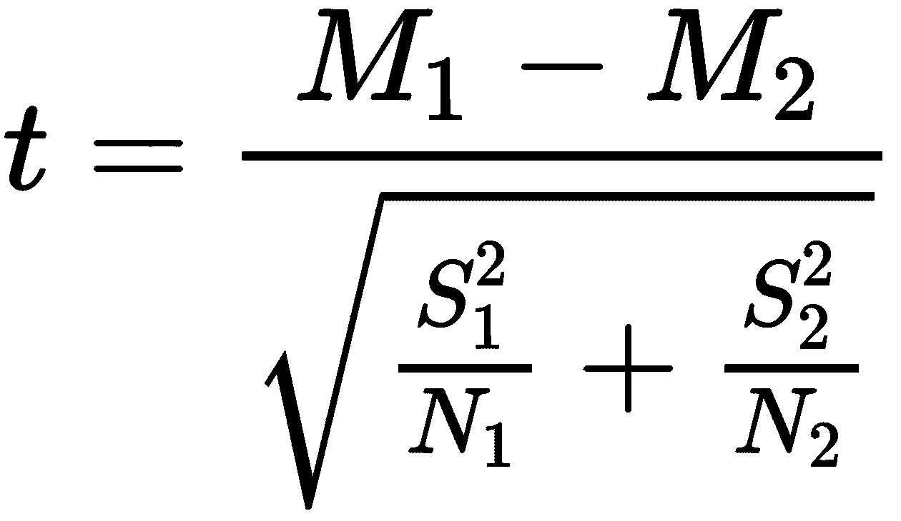

在这个等式中， *M* [1] 和 *M [2]* 是组 *1* 和 *2* 的平均值。 *S [1]*

有一个零假设和备择假设的概念，你应该很熟悉。一般来说，零假设是两组没有显示出统计学上的显著差异。另一方面，另一种假设认为两组显示出统计学上的显著差异。当 t 值大于某个阈值，而 p 值小于某个阈值时，我们说我们可以拒绝零假设，两组显示出统计学上的显著差异。通常，0.01 或 0.05 用作检验统计显著性的 p 值阈值。如果 p 值小于 0.05，则表明两组之间偶然出现差异的概率小于 5%。换句话说，这种差异不太可能是偶然的。


# 使用 Python 评估 A/B 测试结果

在本节中，我们将讨论如何评估 A/B 测试结果，以决定哪种营销策略最有效。到本节结束时，我们将已经讨论了如何运行统计假设检验和计算统计显著性。我们将主要使用`pandas`、`matplotlib`和`scipy`包来分析和可视化数据，并评估 A/B 测试结果。

对于那些想在这个练习中使用 R 而不是 Python 的读者，您可以跳到下一节。

在这个练习中，我们将使用 IBM Watson Analytics 社区中的一个公开可用的数据集，该数据集可以通过以下链接找到:[https://www . IBM . com/communities/Analytics/Watson-Analytics-blog/marketing-campaign-eff-usec _-fastf/](https://www.ibm.com/communities/analytics/watson-analytics-blog/marketing-campaign-eff-usec_-fastf/)。你可以点击这个链接下载这些数据，这些数据是 XLSX 格式的，命名为`WA_Fn-UseC_-Marketing-Campaign-Eff-UseC_-FastF.xlsx`。下载完这些数据后，您可以通过运行以下命令将其加载到 Jupyter 笔记本中:

```py
import pandas as pd

df = pd.read_excel('../data/WA_Fn-UseC_-Marketing-Campaign-Eff-UseC_-FastF.xlsx')
```

`df`数据帧如下所示:


数据集中总共有七个变量。您可以在 IBM Watson Analytics 社区页面上找到这些变量的描述，但是我们将在下面重申:

*   `MarketID`:市场的唯一标识符
*   `MarketSize`:按销售额划分的市场规模
*   `LocationID`:店铺位置的唯一标识符
*   `AgeOfStore`:储存年限
*   被测试的三种促销方式之一
*   促销活动进行的四周中的一周
*   `SalesInThousands`:特定`LocationID`、`Promotion`、`week`的销售额


# 数据分析

让我们更深入地看看数据。在本节中，我们将重点了解用于测试不同促销活动的销售分布、市场规模、商店位置和商店年龄。此分析的目标是确保每个促销组的控件和属性对称分布，以便不同组之间的促销表现可以相互比较。

不同促销的总销售分布可以使用以下代码来可视化:

```py
ax = df.groupby(
    'Promotion'
).sum()[
    'SalesInThousands'
].plot.pie(
    figsize=(7, 7),
    autopct='%1.0f%%'
)

ax.set_ylabel('')
ax.set_title('sales distribution across different promotions')

plt.show()
```

从这段代码中可以看出，我们按照`Promotion`列对数据进行分组，并通过对`SalesInThousands`列求和来合计总销售额。使用饼图，我们可以很容易地看到每个小组拿了多少饼。

生成的饼图如下所示:

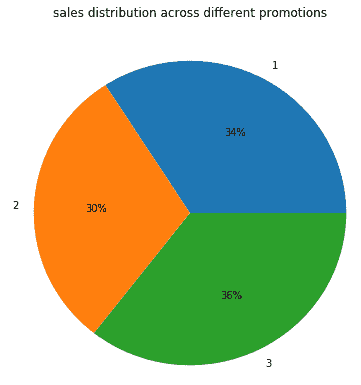

从这个饼图中很容易看出，促销组 **3** 在三个组中拥有最大的总销售额。然而，在促销周期间，每个促销组大约占总销售额的三分之一。同样，我们也可以将每个促销组中不同市场规模的构成形象化。看一下下面的代码:

```py
ax = df.groupby([
    'Promotion', 'MarketSize'
]).count()[
    'MarketID'
].unstack(
    'MarketSize'
).plot(
    kind='bar',
    figsize=(12,10),
    grid=True,
)

ax.set_ylabel('count')
ax.set_title('breakdowns of market sizes across different promotions')

plt.show()
```

条形图如下所示:

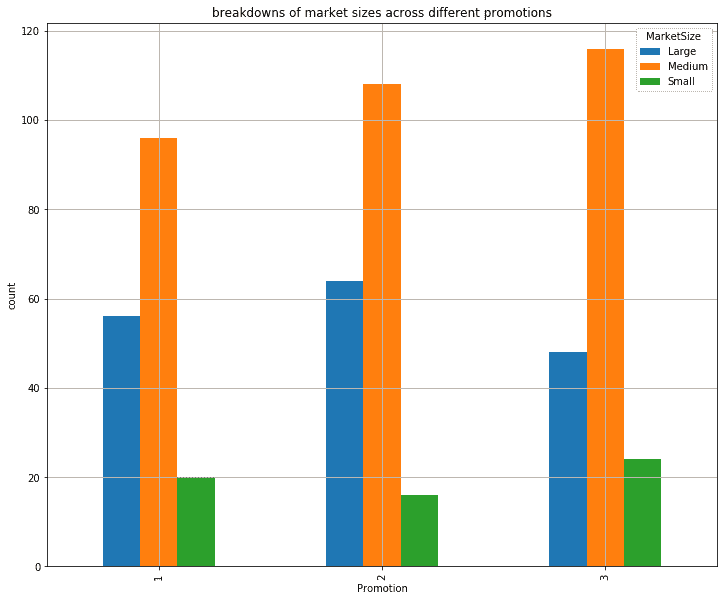

如果您认为堆积条形图更易于查看，可以使用以下代码在堆积条形图中显示这些数据:

```py
ax = df.groupby([
    'Promotion', 'MarketSize'
]).sum()[
    'SalesInThousands'
].unstack(
    'MarketSize'
).plot(
    kind='bar',
    figsize=(12,10),
    grid=True,
    stacked=True
)

ax.set_ylabel('Sales (in Thousands)')
ax.set_title('breakdowns of market sizes across different promotions')

plt.show()
```

您可能会注意到，这段代码和前面的代码之间唯一的区别是`stacked=True`标志。结果如下所示:

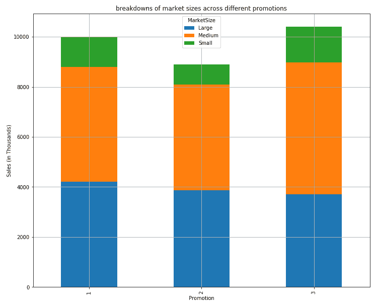

从这个柱状图可以看出，中型市场规模在所有三个推广群体中占据最多，而小型市场规模占据最少。我们可以从这个图中验证不同市场规模的组成在三个促销组中是相似的。

另一个属性`AgeOfStore`及其在所有不同促销组中的总体分布可以通过使用以下代码来可视化:

```py
ax = df.groupby(
    'AgeOfStore'
).count()[
    'MarketID'
].plot(
    kind='bar', 
    color='skyblue',
    figsize=(10,7),
    grid=True
)

ax.set_xlabel('age')
ax.set_ylabel('count')
ax.set_title('overall distributions of age of store')

plt.show()
```

结果如下图所示:

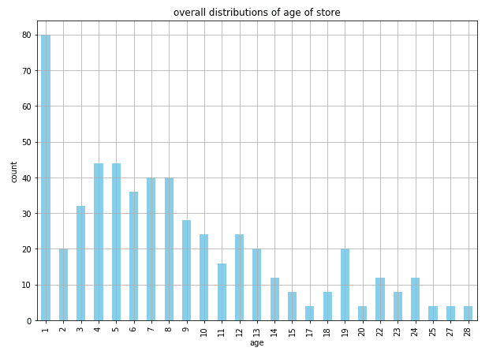

正如你从这幅图中看到的，大量的商店都有 **1** 年的历史，大多数商店都有 **10** 年或更短的历史。然而，我们更感兴趣的是，三个不同促销组中的商店是否具有相似的商店年龄特征。看一下下面的代码:

```py
ax = df.groupby(
    ['AgeOfStore', 'Promotion']
).count()[
    'MarketID'
].unstack(
    'Promotion'
).iloc[::-1].plot(
    kind='barh', 
    figsize=(12,15),
    grid=True
)

ax.set_ylabel('age')
ax.set_xlabel('count')
ax.set_title('overall distributions of age of store')

plt.show()
```

使用这段代码，您将获得以下输出:


三个不同促销组的商店年龄分布似乎相互一致，但很难消化此图中呈现的信息。查看三个促销组的店龄汇总统计会更容易。看一下下面的代码:

```py
df.groupby('Promotion').describe()['AgeOfStore']
```

这段代码的输出如下所示:

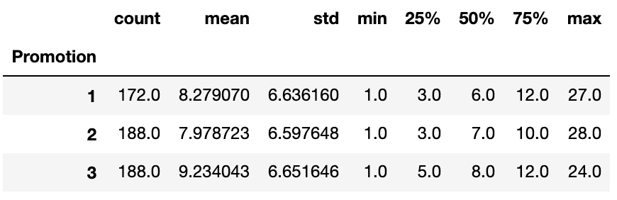

您可能会从这个输出中注意到，从这些汇总统计数据中可以更容易地理解总体存储年龄分布。我们可以看到，所有三个测试组似乎都有类似的商店年龄概况。三组商店的平均年龄为 8-9 岁，大多数商店的年龄为 10-12 岁或更小。

通过分析每个促销或测试组是如何组成的，我们可以验证商店配置文件是否彼此相似。这表明样本组得到了很好的控制，A/B 测试结果将是有意义和可信的。


# 统计假设检验

对不同营销策略进行 A/B 测试的最终目的是找出哪种策略是最有效的，在其他策略中效果最好。正如前面一节中简要讨论的那样，具有较高响应数的策略并不一定意味着它优于其他策略。我们将讨论如何使用 t 检验来评估不同营销策略的相对表现，并观察哪种策略在显著性上优于其他策略。

在 Python 中，有两种方法可以计算 t 测试中的 t 值和 p 值。我们将在本节中演示这两种方法，由您来决定哪一种更适合您。计算 t 检验的 t 值和 p 值的两种方法如下:

*   **根据等式计算 t 值和 p 值**:第一种方法是使用我们在上一节中学习的等式手动计算 t 值。您可能还记得，要获得 t 值，我们需要计算三个因素——平均值、标准差和样本数。看一下下面的代码:

```py
        means = df.groupby('Promotion').mean()['SalesInThousands']
        stds = df.groupby('Promotion').std()['SalesInThousands']
        ns = df.groupby('Promotion').count()['SalesInThousands']
```

从这段代码中可以看出，通过分别使用`mean`、`std`和`count`函数，可以很容易地计算出平均值、标准偏差和每个测试组中的样本数。有了这些，我们就可以用前面讨论的公式计算 t 值。看一下下面的代码:

```py
      import numpy as np

        t_1_vs_2 = (
            means.iloc[0] - means.iloc[1]
        )/ np.sqrt(
            (stds.iloc[0]**2/ns.iloc[0]) + (stds.iloc[1]**2/ns.iloc[1])
        )
```

使用此代码，我们可以计算 t 值来比较促销 1 和促销 2 的表现。我们运行代码得到的 t 值是`6.4275`。从这个 t 值，我们可以用下面的代码得到 p 值:

```py
        from scipy import stats

        df_1_vs_1 = ns.iloc[0] + ns.iloc[1] - 2

        p_1_vs_2 = (1 - stats.t.cdf(t_1_vs_2, df=df_1_vs_1))*2
```

正如您从这段代码中看到的，我们首先计算自由度，即两组样本数之和减去 2。利用之前计算的 t 值，我们可以使用来自`scipy`包的`stats`模块的`t.cdf`函数来计算 p 值。我们运行这段代码得到的 p 值是`4.143e-10`。这是一个非常小的数字，接近于`0`。如前所述，p 值越接近 0，表明存在反对零假设的有力证据，并且两个测试组之间的差异显著。

促销组 1 的平均销售额(以千计)约为`58.1`，促销组 2 的平均销售额约为`47.33`。从我们的 t 检验中，我们已经表明这两个组的营销业绩有显著差异，促销组 1 优于促销组 2。但是，如果我们在促销组 1 和促销组 3 之间进行 t 检验，我们会看到不同的结果。

从表面上看，促销组 1 ( `58.1`)的平均销售额看起来高于促销组 2 ( `55.36`)。然而，当我们在这两组之间进行 t 检验时，我们得到的 t 值是`1.556`，p 值是`0.121`。计算出的 p 值远高于`0.05`，这是一个普遍接受的截止线。这表明促销组 1 的营销业绩与促销组 2 的营销业绩在统计上没有区别。因此，即使 A/B 测试中促销组 1 的平均销售额高于促销组 2，但这种差异在统计上并不显著，因此我们不能得出促销组 1 比促销组 2 表现更好的结论。从这些评估结果中，我们可以得出结论，推广组 1 和 3 优于推广组 2，但推广组 1 和 3 之间的差异在统计上并不显著。

*   **使用 scipy** 计算 t 值和 p 值:另一种计算 t 值和 p 值的方法是使用`scipy`包中的`stats`模块。看一下下面的代码:

```py
        t, p = stats.ttest_ind(
            df.loc[df['Promotion'] == 1, 'SalesInThousands'].values, 
            df.loc[df['Promotion'] == 2, 'SalesInThousands'].values, 
            equal_var=False
         )
```

从这段代码中可以看出，`scipy`包中的`stats`模块有一个名为`ttest_ind`的函数。该函数根据给定的数据计算 t 值和 p 值。使用这个函数，我们可以很容易地计算 t 值和 p 值，以比较不同促销或测试组的营销表现。这两种方法的结果是一样的。无论我们使用前面的手动计算公式中的 t 值和 p 值的方法，还是使用`scipy`包中的`ttest_ind`函数的方法，我们得到的比较促销组 1 和 2 以及促销组 1 和 3 的 t 值都是`6.4275`和`1.556`；然而，我们得到的 p 值分别是`4.29e-10`和`0.121`。当然，对这些 t 检验结果的解释和以前一样。

我们已经展示了计算 t 值和 p 值的两种方法。使用`scipy`包的现成解决方案来计算这些值可能看起来更容易，但是在头脑中记住后面的等式总是有帮助的。

这个 Python 练习的完整代码可以在以下链接找到:[https://github . com/Yoon hwang/hands-on-data-science-for-marketing/blob/master/ch . 12/Python/ab testing . ipynb](https://github.com/yoonhwang/hands-on-data-science-for-marketing/blob/master/ch.12/python/ABTesting.ipynb)。


# 用 R 评估 A/B 测试结果

在本节中，我们将讨论如何评估 A/B 测试结果，以决定哪种营销策略最有效。到本节结束时，我们将已经讨论了如何运行统计假设检验和计算统计显著性。我们将主要使用`dplyr`和`ggplot2`来分析和可视化数据，并评估 A/B 测试结果。

对于那些想在这个练习中使用 Python 而不是 R 的读者，您可以参考上一节。

在这个练习中，我们将使用 IBM Watson Analytics 社区中的一个公开可用的数据集，该数据集可以通过以下链接找到:[https://www . IBM . com/communities/Analytics/Watson-Analytics-blog/marketing-campaign-eff-usec _-fastf/](https://www.ibm.com/communities/analytics/watson-analytics-blog/marketing-campaign-eff-usec_-fastf/)。你可以点击这个链接下载这些数据，这些数据是 XLSX 格式的，命名为`WA_Fn-UseC_-Marketing-Campaign-Eff-UseC_-FastF.xlsx`。下载完这些数据后，您可以通过运行以下命令将其加载到 RStudio 中:

```py
library(dplyr)
library(readxl)
library(ggplot2)

#### 1\. Load Data ####
df <- read_excel(
  path="~/Documents/data-science-for-marketing/ch.12/data/WA_Fn-UseC_-Marketing-Campaign-Eff-UseC_-FastF.xlsx"
)
```

`df`数据帧如下所示:

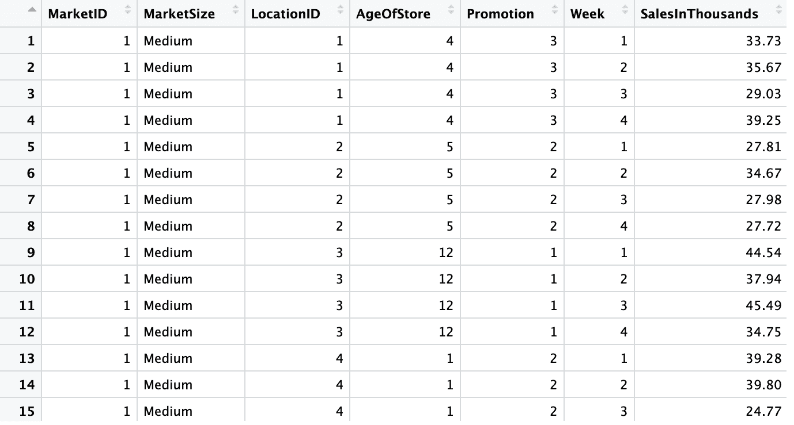

数据集中总共有七个变量。您可以在 IBM Watson Analytics 社区页面上找到这些变量的描述，但是我们将在下面重申:

*   `MarketID`:市场的唯一标识符
*   `MarketSize`:按销售额划分的市场规模
*   `LocationID`:店铺位置的唯一标识符
*   `AgeOfStore`:储存年限
*   被测试的三种促销方式之一
*   促销活动进行的四周中的一周
*   `SalesInThousands`:特定`LocationID`、`Promotion`、`week`的销售额


# 数据分析

让我们更深入地看看数据。在本节中，我们将重点了解用于测试不同促销活动的销售分布、市场规模、商店位置和商店年龄。此分析的目标是确保每个促销组的控件和属性对称分布，以便不同组之间的促销表现可以相互比较。

不同促销的总销售分布可以使用以下代码来可视化:

```py
salesPerPromo <- df %>% 
  group_by(Promotion) %>%
  summarise(Sales=sum(SalesInThousands))

ggplot(salesPerPromo, aes(x="", y=Sales, fill=Promotion)) + 
  geom_bar(width=1, stat = "identity", position=position_fill()) +
  geom_text(aes(x=1.25, label=Sales), position=position_fill(vjust = 0.5), color='white') +
  coord_polar("y") +
  ggtitle('sales distribution across different promotions')
```

从这段代码中可以看出，我们按照`Promotion`列对数据进行分组，并通过对`SalesInThousands`列求和来合计总销售额。使用饼图，我们可以很容易地看到每个小组拿了多少饼。

生成的饼图如下所示:


从这个饼图中很容易看出，促销组 3 在三个组中有最大的总销售额。然而，在促销周期间，每个促销组大约占总销售额的三分之一。同样，我们也可以将每个促销组中不同市场规模的构成形象化。看一下下面的代码:

```py
marketSizePerPromo <- df %>% 
  group_by(Promotion, MarketSize) %>%
  summarise(Count=n())

ggplot(marketSizePerPromo, aes(x=Promotion, y=Count, fill=MarketSize)) + 
  geom_bar(width=0.5, stat="identity", position="dodge") +
  ylab("Count") +
  xlab("Promotion") +
  ggtitle("breakdowns of market sizes across different promotions") +
  theme(plot.title=element_text(hjust=0.5))
```

条形图如下所示:


如果您认为堆积条形图更易于查看，可以使用以下代码在堆积条形图中显示这些数据:

```py
ggplot(marketSizePerPromo, aes(x=Promotion, y=Count, fill=MarketSize)) + 
  geom_bar(width=0.5, stat="identity", position="stack") +
  ylab("Count") +
  xlab("Promotion") +
  ggtitle("breakdowns of market sizes across different promotions") +
  theme(plot.title=element_text(hjust=0.5))
```

您可能会注意到，这段代码与之前代码的唯一区别是`geom_bar`函数中的`position="stack"`标志。结果如下所示:

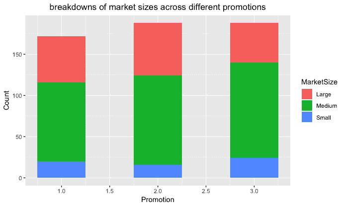

从这个柱状图可以看出，在所有三个推广群体中，中型市场规模占据最多，而小型市场规模占据最少。我们可以从这个图中验证不同市场规模的组成在三个促销组中是相似的。

另一个属性`AgeOfStore`及其在所有不同促销组中的总体分布可以通过使用以下代码来可视化:

```py
overallAge <- df %>%
  group_by(AgeOfStore) %>%
  summarise(Count=n())

ggplot(overallAge, aes(x=AgeOfStore, y=Count)) + 
  geom_bar(width=0.5, stat="identity") +
  ylab("Count") +
  xlab("Store Age") +
  ggtitle("overall distributions of age of store") +
  theme(plot.title=element_text(hjust=0.5))
```

结果看起来像下面的条形图:

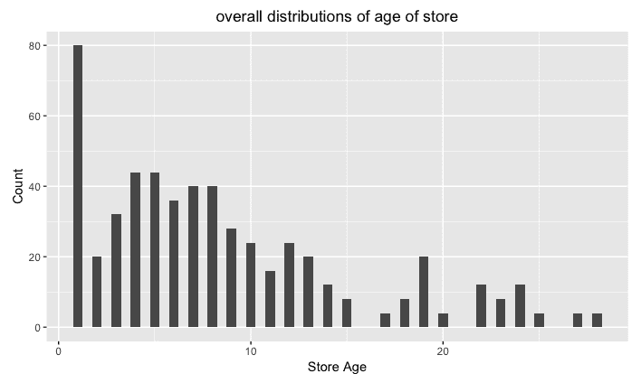

正如你从这幅图中看到的，大量的商店都有 **1** 年的历史，大多数商店都有 **10** 年或更短的历史。然而，我们更感兴趣的是，三个不同促销组中的商店是否具有相似的商店年龄特征。看一下下面的代码:

```py
AgePerPromo <- df %>% 
  group_by(Promotion, AgeOfStore) %>%
  summarise(Count=n())

ggplot(AgePerPromo, aes(x=AgeOfStore, y=Count, fill=Promotion)) + 
  geom_bar(width=0.5, stat="identity", position="dodge2") +
  ylab("Count") +
  xlab("Store Age") +
  ggtitle("distributions of age of store") +
  theme(plot.title=element_text(hjust=0.5))
```

使用这段代码，您将获得以下输出:

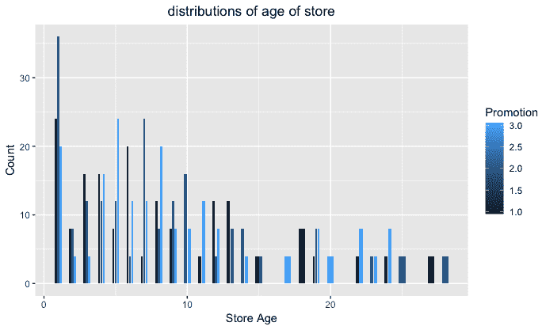

三个不同促销组的商店年龄分布似乎相互一致，但很难消化此图中呈现的信息。查看三个促销组的店龄汇总统计会更容易。看一下下面的代码:

```py
tapply(df$AgeOfStore, df$Promotion, summary)
```

这段代码的输出如下所示:

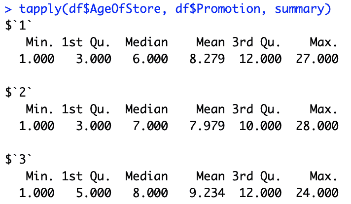

您可能会从这个输出中注意到，从这些汇总统计数据中可以更容易地理解总体存储年龄分布。我们可以看到，所有三个测试组似乎都有类似的商店年龄概况。三组商店的平均年龄为 8-9 岁，大多数商店的年龄为 10-12 岁或更小。

通过分析每个促销或测试组是如何组成的，我们可以验证商店配置文件是否彼此相似。这表明样本组得到了很好的控制，A/B 测试结果将是有意义和可信的。


# 统计假设检验

对不同营销策略进行 A/B 测试的最终目的是找出哪种策略是最有效的，在其他策略中效果最好。正如在前面一节中简要讨论的那样，具有较高响应数的策略并不一定意味着它优于其他策略。我们将讨论如何使用 t 检验来评估不同营销策略的相对表现，并观察哪种策略在显著性上优于其他策略。

在 R 中，有两种方法可以计算 t 检验的 t 值和 p 值。我们将在本节中演示这两种方法，由您来决定哪一种更适合您。计算 t 检验的 t 值和 p 值的两种方法如下:

*   **根据等式**计算 t 值和 p 值:第一种方法是使用我们在上一节中学习的等式手动计算 t 值。您可能还记得，我们需要计算三样东西来获得 t 值:平均值、标准差和样本数。看一下下面的代码:

```py
        promo_1 <- df[which(df$Promotion == 1),]$SalesInThousands
        promo_2 <- df[which(df$Promotion == 2),]$SalesInThousands

        mean_1 <- mean(promo_1)
        mean_2 <- mean(promo_2)
        std_1 <- sd(promo_1)
        std_2 <- sd(promo_2)
        n_1 <- length(promo_1)
        n_2 <- length(promo_2)
```

从该代码中可以看出，分别使用`mean`、`sd`、`length`函数可以很容易地计算出每个检测组的平均值、标准差和样本数。有了这些，我们可以使用前面讨论的公式计算 t 值。看看下面的代码:

```py
        t_val <- (
          mean_1 - mean_2
        ) / sqrt(
         (std_1**2/n_1 + std_2**2/n_2)
        )
```

使用此代码，我们可以计算 t 值来比较促销 1 和促销 2 的表现。我们运行代码得到的 t 值是`6.4275`。从这个 t 值，我们可以用下面的代码得到 p 值:

```py
        df_1_2 <- n_1 + n_2 - 2

        p_val <- 2 * pt(t_val, df_1_2, lower=FALSE)
```

正如您从这段代码中看到的，我们首先计算自由度，即两组样本数之和减去 2。利用之前计算的 t 值，我们可以使用`pt`函数计算 p 值，该函数根据给定的 t 值和自由度从 t 分布返回一个概率值。我们运行这段代码得到的 p 值是`4.143e-10`。这是一个非常小的数字，接近于 0。如前所述，p 值接近 0 表明有强有力的证据反对零假设，并且两个测试组之间的差异显著。

促销组 1 的平均销售额(以千计)约为`58.1`，促销组 2 的平均销售额约为`47.33`。从我们的 t 检验中，我们已经表明这两个组的营销业绩有显著差异，促销组 1 优于促销组 2。但是，如果我们在促销组 1 和促销组 3 之间进行 t 检验，我们会看到不同的结果。

从表面上看，促销组 1 ( `58.1`)的平均销售额看起来高于促销组 2 ( `55.36`)的平均销售额。然而，当我们在这两组之间进行 t 检验时，我们得到的 t 值是`1.556`，p 值是`0.121`。计算出的 p 值远高于公认的截止线`0.05`。这表明促销组 1 的营销业绩在统计上与促销组 2 的营销业绩没有不同。因此，即使从 A/B 测试来看，促销组 1 的平均销售额高于促销组 2，但这种差异在统计上并不显著，我们也不能得出促销组 1 比促销组 2 表现更好的结论。从这些评估结果中，我们可以得出结论，促销组 1 和 3 的表现优于促销组 2，但促销组 1 和 3 之间的差异在统计上并不显著。

*   **使用 t.test** 计算 t 值和 p 值:另一种计算 t 值和 p 值的方法是使用 r 中的`t.test`函数。请看下面的代码:

```py
        # using t.test
        t.test(
          promo_1, 
          promo_2
        )
```

从这段代码中可以看出，R 有一个`t.test`函数，它计算给定数据的 t 值和 p 值。使用此函数，我们可以轻松计算 t 值和 p 值，以比较不同促销或测试组的营销表现。这两种方法的结果是一样的。无论我们是使用之前从等式中手动计算 t 值和 p 值的方法，还是使用`scipy`包中的`ttest_ind`函数的方法，我们用来比较促销组 1 和促销组 2 以及促销组 1 和促销组 3 的 t 值都是`6.4275`和`1.556`；而我们得到的 p 值分别是`4.29e-10`和`0.121`。当然，对这些 t 检验结果的解释和以前一样。

我们已经展示了计算 t 值和 p 值的两种方法。在 R 中使用`t.test`函数可能看起来更容易，但是在头脑中记住这个等式总是很有帮助的。

这个 R 练习的完整代码可以在以下链接找到:[https://github . com/Yoon hwang/hands-on-data-science-for-marketing/blob/master/ch . 12/R/ab testing。R](https://github.com/yoonhwang/hands-on-data-science-for-marketing/blob/master/ch.12/R/ABTesting.R) 。


# 摘要

在这一章中，我们学习了市场营销中最常用的一种测试方法，用于对未来的营销策略做出决策。我们已经讨论了什么是 A/B 测试，为什么在你完全投入一个营销策略之前进行 A/B 测试很重要，以及它如何帮助你以一种更有效、更经济的方式达到你的营销目标。通过研究一个样例用例，其中您的目标是选择最佳的电子邮件主题行，我们了解了运行 A/B 测试的典型过程是什么样子的。A/B 测试不需要只进行一次。A/B 测试最好用在你不断地用当前运行的策略或通过实验用其他想法来测试你的新想法的时候。简单来说，每当有一个新的想法，它应该是 A/B 测试。使用 t-test 以及我们在本章中学习的 Python 和 R 工具，您应该能够轻松地评估 A/B 测试结果，并确定哪个策略是获胜的策略。

本章是最后一个包含案例研究和编程练习的技术章节。在下一章，我们将总结和回顾本书中涉及的所有主题。然后，我们将讨论一些常见的数据科学和机器学习在市场营销中的应用，以及一些其他的 Python 和 R 库，这些都是本书没有涉及到的，你可以在未来的项目中受益。