# 五、使用可视化理解数据

Julia 的核心系统中没有可视化/图形包。因此，如果不添加和加载包，就不可能在数据集上创建所需的可视化效果。

通过不包含可视化包，Julia 保持了核心系统的干净，这样不同类型的后端，比如不同操作系统上的 Qt 和 GTK，就不会干扰构建。

在本章中，我们将学习如何可视化数据，以及可视化如何有助于快速理解数据。我们将涵盖以下内容:

*   PyPlot
*   Unicodeplots
*   低湿平原
*   牛虻

`plot`函数是包用来绘制图形的常用函数。当我们加载了多个绘图库时，将使用哪个绘图功能？

# 使用和导入的区别

假设我们想在`Foo`包中扩展一个名为`bar`的函数。当我们使用时，我们还需要包含包名:

```jl
julia> using Foo
julia> function Foo.bar(...)

```

但是当我们使用`importall`时，我们不需要包含包名:

```jl
julia> importall Foo
julia> function bar(...)

```

当我们使用`importall`、`function bar(...)`和`function Foo.bar(...)`时，它们是等价的。

这防止了我们意外地扩展了一个我们不想扩展或者不知道的函数，并且避免了我们将来可能破坏`Foo`的实现。


# Julia 的 Pyplot

这个包是 Steven G. Johnson 做的，提供 Python 著名的`matplotlib`库给 Julia。如果你用过`matplotlib`，你会对它的`pyplot`模块很熟悉。

我们在第一章中学习了 Julia 的 Pycall 包，PyPlot 使用相同的包直接从 Julia 调用 matplotlib 绘图库。这个调用的开销很少(或者没有)，并且数组是直接传递的，不需要复制。

## 多媒体输入/输出

基本的 Julia 运行时只提供纯文本显示。通过加载外部模块或使用图形环境，如`Jupyter`笔记本，可以提供丰富的多媒体输出。Julia 有一个标准化的机制来显示丰富的多媒体输出(图像、音频和视频)。这由以下内容提供:

*   `display(x)`是 Julia 对象中最丰富的多媒体显示
*   任意的多媒体表示都是通过重载用户定义类型的`writemime`来完成的
*   通过划分通用显示类型的子类，可以使用不同的支持多媒体的后端

PyPlot 利用 Julia 的这个多媒体 I/O API 在任何 Julia 图形后端进行绘图，包括 IJulia。

## 安装

要在 Julia 中使用 Python，需要安装带有 Matplotlib 的 Python。推荐的方法是从任何科学 Python 包中获得完整的包。

流行的是由 Continuum analytics 提供的 Anaconda 和由 Enthought 提供的 Canopy。

您也可以使用 pip 安装`matplotlib`:

```jl
$ pip install matplotlib

```

在安装`matplotlib`之前，您需要安装必要的依赖项。

成功安装`matplotlib`后，我们可以在 Julia 中添加 Pyplot 包:

```jl
julia> Pkg.update()
julia> Pkg.add("PyPlot")

```

它会自己添加依赖项。在我们的例子中，我们将使用内联绘图和 IJulia。

## 基本绘图

既然我们已经将包添加到系统中，我们就可以开始使用它了。我们将在示例中使用 IJulia (jupyter 笔记本):

```jl
using PyPlot 
PyPlot.svg(true) 

```

第二行`Pyplot.svg(true)`，将允许我们获得生成的图形和可视化的 SVG。**可缩放矢量图形** ( **SVG** )是一种基于 XML 的标记语言，用于具有交互性和动画的二维图形的矢量图像格式:

```jl
x = [1:100]
y = [i^2 for i in x]
p = plot(x,y)
xlabel("X")
ylabel("Y")
title("Basic plot")
grid("on")

```

*   第一行和第二行定义了我们想要生成图的`x`和`y`的值。
*   第三行`plot(x,y)`，实际上生成了剧情。
*   对于我们正在生成的情节，我们提供标签并改变美学。通过`xlabel`和`ylabel`，我们为 *x* 轴和 *y* 轴提供标签。我们将在接下来的章节中探索`plot`函数的其他选项。


它生成了一个指数图。

### 使用正弦和余弦绘图

在下面的代码中，我们使用函数初始化`x`和`y`:

```jl
x = linspace(0, 3pi, 1000) 
y = cos(2*x + 3*sin(3*x)); 
plot(x, y, color="orange", linewidth=2.0, linestyle="--"); 
title("Another plot using sine and cosine"); 

```

让我们简单地理解一下前面的代码:

*   在`plot`函数中，我们传递想要生成的特定绘图的参数
*   我们可以通过传递参数来改变线条的样式、宽度和颜色

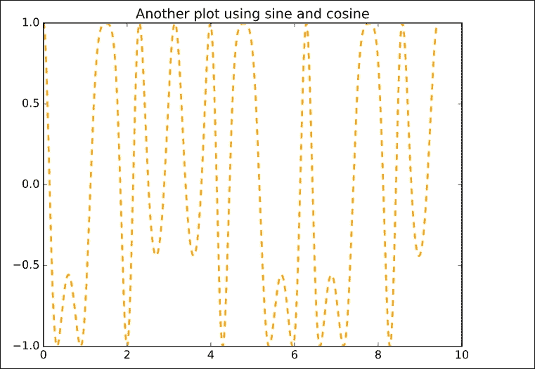

这里我们可以看到线条风格和第一个图的线条风格有很大的不同。默认颜色是蓝色，但是我们已经指定绘图使用橙色作为线条。


# Unicode 地块

当我们想要在 REPL 上绘图时，Unicode 绘图非常有用。它们非常轻便。

## 安装

没有依赖关系，因此可以轻松安装:

```jl
Pkg.add("UnicodePlots") 
using UnicodePlots 

```

## 例子

让我们浏览一下使用`UnicodePlots`可以轻松制作的基本情节。

### 生成 Unicode 散点图

散点图用于确定两个变量之间的相关性，即一个变量如何受另一个变量的影响:


### 生成 Unicode 线条图

折线图以一系列数据点显示数据集:

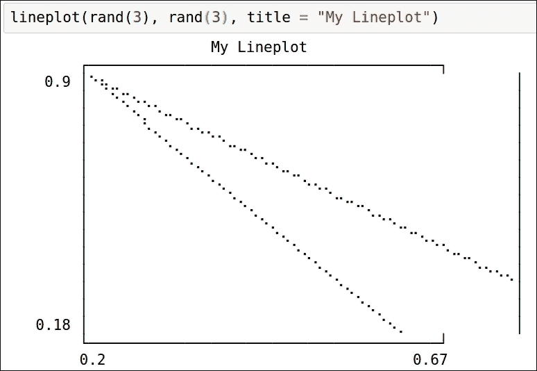

# 使用 Vega 可视化

Vega 是由 John Myles White 提供的一个漂亮的可视化库。它是作为一个注册的 Julia 包提供的，所以可以很容易地安装。

它构建在 D3.js 之上，使用 JSON 创建漂亮的可视化效果。每当我们需要生成图形时，它都需要互联网连接，因为它没有存储所需 JavaScript 库的本地副本。

## 安装

要安装 Vega，请使用以下命令:

```jl
Pkg.add("Vega")
using Vega

```

## 例子

让我们使用 Vega 浏览各种可视化。

### 散点图

以下是散点图的参数:

*   `x`和`y`:抽象向量
*   组:抽象向量

散点图用于确定两个变量之间的相关性，即一个变量如何受另一个变量的影响:

```jl
scatterplot(x=rand(100), y=rand(100))

```


我们现在可以继续构建一个复杂的散点图:


这将生成以下散点图。我们可以清楚地看到织女星产生的两个星团。这些是`d1`和`d2`:

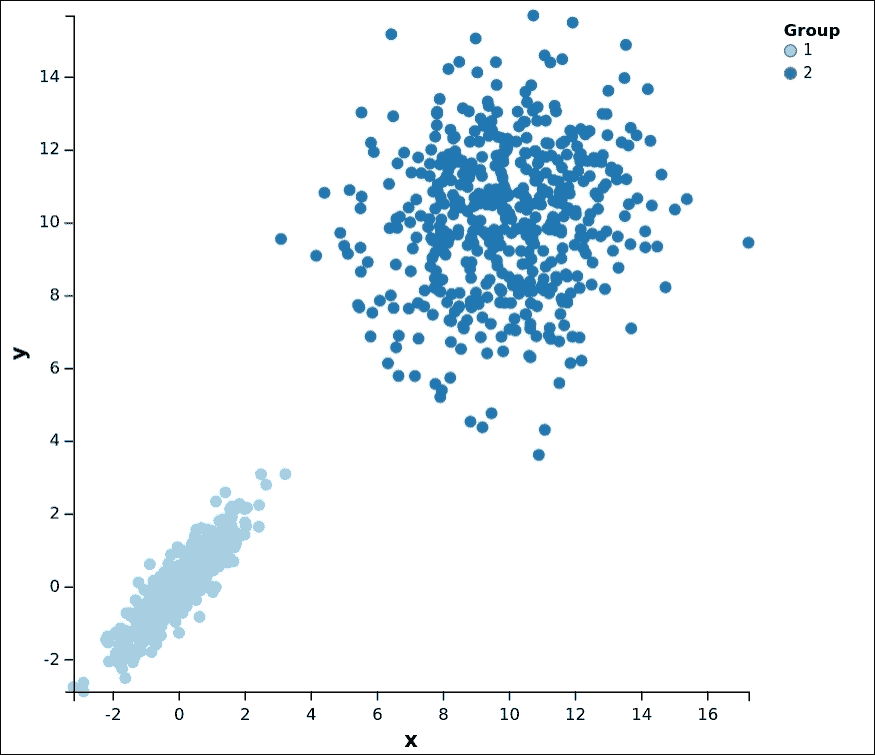

在这个特殊的例子中，我们对数据进行分组，并使用不同的颜色来显示分组。

## 织女星的热图

织女星的热图很容易生成。这有助于我们轻松地可视化数据点的密度。论据如下:

*   `x`和`y`
*   颜色

```jl
x = Array(Int, 900) 
y = Array(Int, 900) 
color = Array(Float64, 900) 
tmp = 0 
for counter in 1:30 
    for counter2 in 1:30 
        tmp += 1 
        x[tmp] = counter 
        y[tmp] = counter2 
        color[tmp] = rand() 
    end 
end 
hm = heatmap(x = x, y = y, color = color) 

```

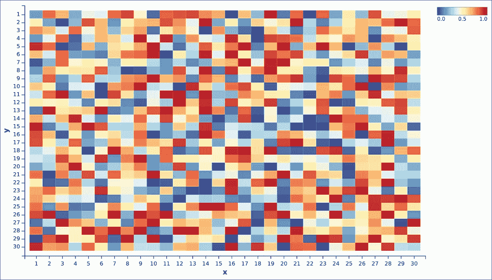

# 使用牛虻实现数据可视化

牛虻是一个详尽的绘图和数据可视化软件包，由丹尼尔·琼斯用 Julia 编写。它是根据利兰·威尔金森的书《图形的语法》改编的。它很大程度上受到了 R 的`ggplot2`的启发，R 是另一个用于绘图和可视化的令人惊奇的包。

## 安装牛虻

安装很简单，因为它是一个注册的 Julia 包:

```jl
Julia> Pkg.update()
Julia> Pkg.add("Gadfly")

```

这也将安装牛虻需要的其他几个包。

要使用牛虻，请运行以下代码行:

```jl
Julia> using Gadfly

```

我们将在示例中使用 IJulia (jupyter 笔记本)。

牛虻能够以 PNG、SVG、Postscript 和 PDF 格式呈现高质量的图形和可视化效果。SVG 后端使用嵌入式 JavaScript，它提供与图形的交互，如缩放、平移和切换。

最好安装 Cairo，因为 PNG、PostScript 和 PDF 都需要它:

```jl
Julia> Pkg.add("Cairo")

```

假设我们创建了一个`exampleplot`。为了在后端绘制它，我们使用 draw 函数:

```jl
julia> exampleplot = plot(....)

```

*   For SVG:

```jl
julia> draw(SVG("plotinFile.svg', 4inch, 4inch), exampleplot)

```

*   对于嵌入 JavaScript 的 SVG:

```jl
julia> draw(SVGJS("plotinFile.svg', 4inch, 4inch), exampleplot)

```

*   对于 PNG:

```jl
julia> draw(PNG("plotinFile.png', 4inch, 4inch), exampleplot)

```

*   附言:

```jl
julia> draw(PS("plotinFile.ps', 4inch, 4inch), exampleplot)

```

*   对于 PDF:

```jl
julia> draw(PDF("plotinFile.pdf', 4inch, 4inch), exampleplot)

```

## 使用剧情功能与牛虻互动

`plot`函数用于与牛虻包交互并创建所需的可视化效果。美学被映射到绘图几何图形，并用于指定`plot`功能如何工作。它们是特别命名的变量。

`plot`元素可以是比例尺、坐标、参考线和几何图形。它是在图形的语法中定义的，以避免特殊情况，美学通过用定义良好的输入和输出来处理问题，从而产生期望的结果。

Plot 可以对以下数据源进行操作:

*   函数和表达式
*   数组和集合
*   Dataframes

### 举例

如果我们没有定义`plot`元素，那么默认情况下，使用点几何。在点几何中，x 和 y 输入被视为美学。

让我们画一个散点图:

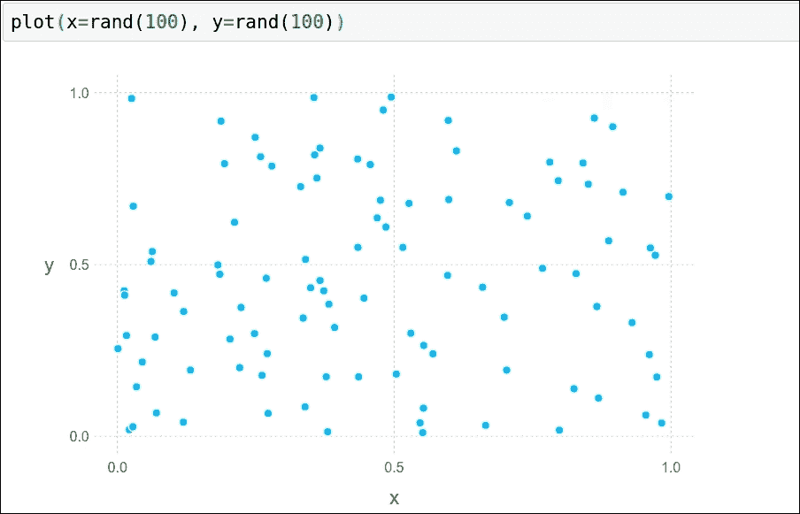

在同样的美学中，我们可以使用多个元素来产生特定的输出。

例如，要使线几何和点几何位于同一个数据集中，我们可以使用以下方法绘制分层图:

*   `Geom.line`:线条图
*   `Geom.point`:点状图


这将生成一个包含线和点的分层图。通过组合各种元素，可以生成复杂的图。

指南:

*   `xlabel`和`ylabel` : Guide 可以用来给我们使用的图加上必要的标签
*   `title`:用它来为绘图提供一个标题

比例:

*   使用此按钮可放大或缩小任何所需的绘图轴

让我们创建一个包含这些元素的类似的情节。我们将添加`x`和`y`标签，为绘图添加标题，并缩放绘图:

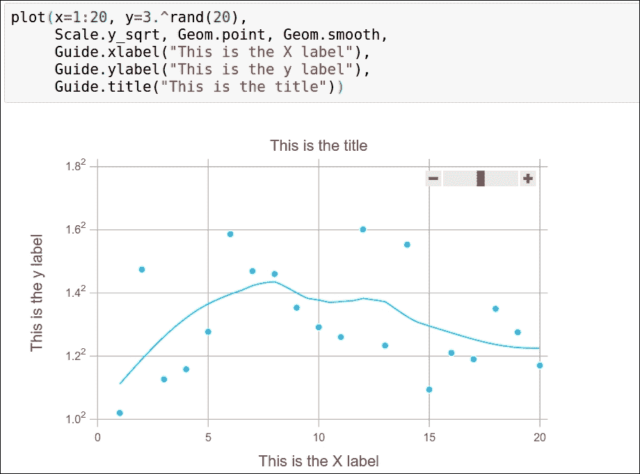

图像中的滑块可用于放大和缩小。

## 利用牛虻绘制数据帧

牛虻提供的开箱即用处理数据帧的能力非常有用。我们在前几章研究了数据帧的能力。它是一种用于表示和操作数据的强大数据结构。

使用牛虻，我们可以很容易地生成复杂的情节。DataFrame 作为第一个参数传递给绘图函数。

数据帧中的列由美学中的绘图功能按名称或索引使用。我们将使用 RDatasets 为绘图函数创建数据帧。RDatasets 为我们提供了一些真实的数据集，在这些数据集上，我们可以进行一些可视化处理，以了解牛虻包的功能:

```jl
Using Rdatasets, Gadfly 
plot(iris, x=:SepalLength, y=:SepalWidth, 
  color=:Species, shape=:Species, Geom.point, 
  Theme(default_point_size=3pt)) 

```


这是一个非常著名的数据集—iris，我们在之前的示例中也使用了它。通过萼片长度和萼片宽度绘制数据集很容易，因为我们只需在`x`和`y`坐标中传递它们。

现在让我们使用随机数生成器创建一个直方图。我们将传递使用随机数生成器创建的数组，然后我们将创建直方图。


这是一个相当简单的直方图。让我们使用 RDataset 中的数据集来创建一个直方图:

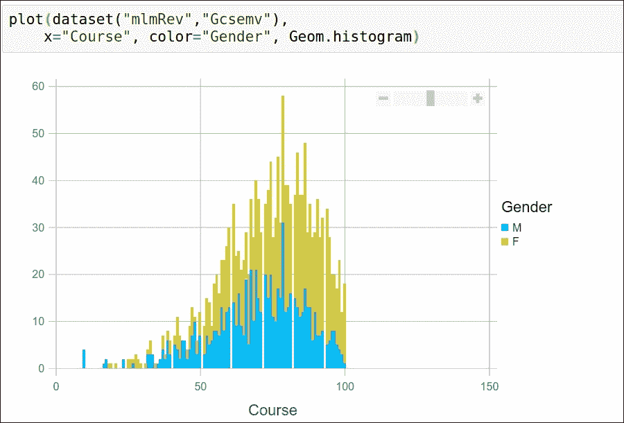

前面的数据集来自 RDatasets，我们创建了一个直方图来查看课程中获得的分数和学生的性别。

这可以通过创建散点图来扩展:


## 使用牛虻来可视化函数和表达式

在牛虻中绘制函数和表达式真的很方便。

函数和表达式的绘图函数的特征是:

```jl
plot(f::Function, a, b, elements::Element...)
plot(fs::Array, a, b, elements::Element...)

```

这表明我们可以将函数或表达式作为数组传递，数组中包含我们想要使用的元素。


这是一个简单的正弦和余弦函数图。让我们从一个复杂的表达式创建一个情节:


这是我们试图绘制的随机表达式。你可以看到，这样一个稍微复杂一点的表达式，真的很好画。即使复杂性增加，牛虻也做得很好。

## 生成多层图像

牛虻能够在同一个情节中画出多个层次:

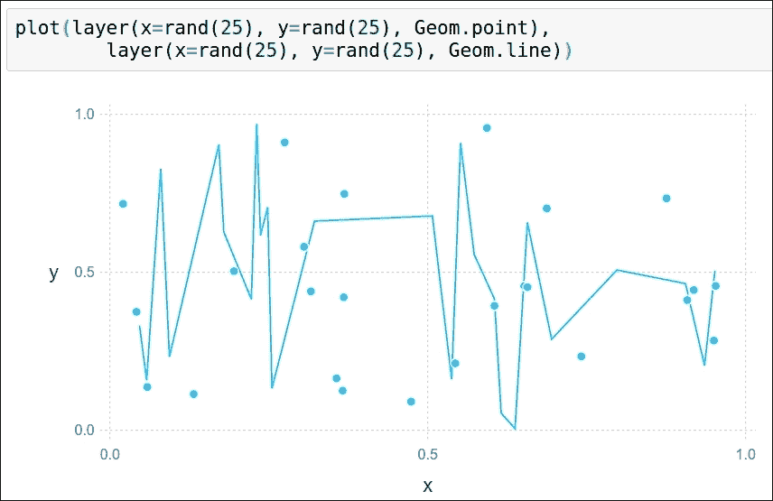

## 使用统计生成具有不同美感的图

牛虻中的统计函数通过将一个或多个美学作为输入来给出一个或多个美学作为输出。

让我们一个一个的去探索。

### 步进功能

这用于在给定点之间进行逐步插值。两点之间的函数引入了一个新的点，这取决于自变量的方向:

*   `x`和`y`点是使用的美学
*   `:vh`用于垂直方向，`:hv`用于水平方向


### 分位数-分位数函数

这用于生成分位数-分位数图。将两个数字向量传递给函数，并对它们的分位数进行比较。

传递给函数的`x`和`y`是分布或数值向量:

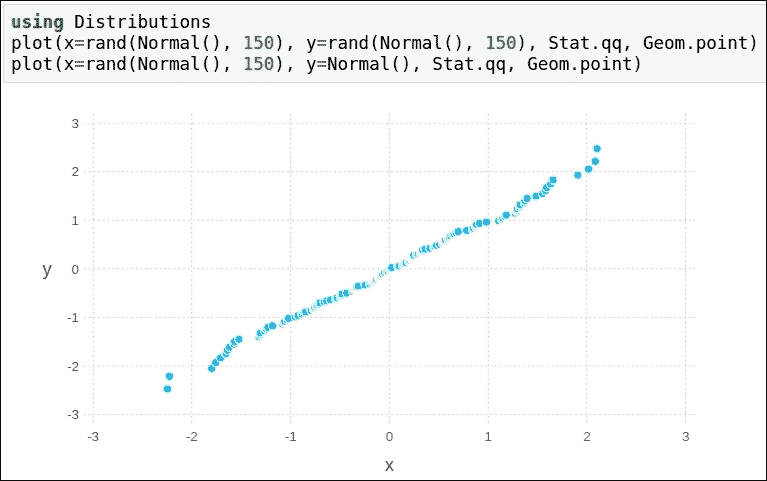

### 牛虻中的蜱

刻度用于包含轴之间的数据。

分笔成交点有两种:`xticks`和`yticks`。

ticks 函数采用的参数有:

*   `ticks`:一个特定的刻度数组(在没有刻度时计算)
*   `granularity_weight`:刻度数(默认为 1/4)
*   `simplicity_weight`:包含零(默认为 1/6)
*   `coverage_weight`:紧密配合数据的跨度(默认为 1/3)
*   `niceness_weight`:编号(默认为 1/4)

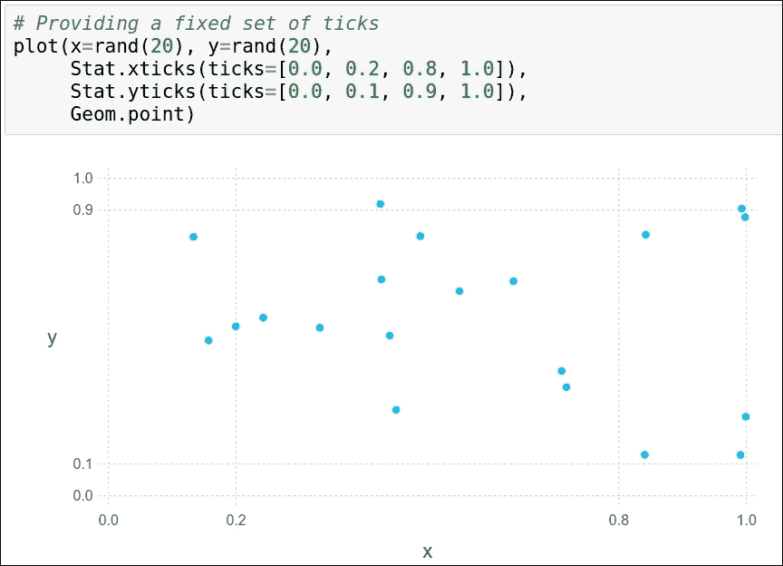

## 使用几何图形生成具有不同美感的图形

几何图形负责实际绘图。一个或多个输入(美学)被赋予该功能。

### 箱线图

这也被称为须状图；这是基于四分位数显示数据的标准方式:

*   第一个和第三个四分位数由盒子的底部和顶部表示
*   盒子里面的带是第二个四分位数(中间值)
*   框外的波段是最小值和最大值

直接使用的美学包括:

*   `x`
*   `middle`
*   `lower_hinge`和`upper_hinge`
*   `lower_fence`和`upper_fence`
*   `outliers`

只有需要从中绘制箱线图的数据集是必需的。

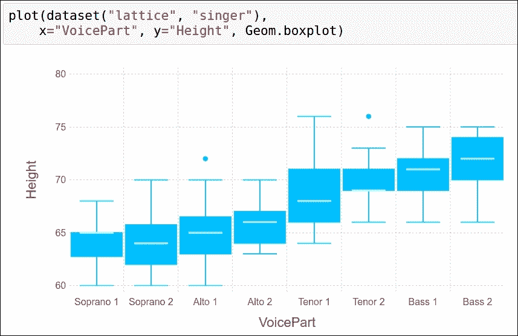

### 使用几何图形创建密度图

通过密度图可以有效地观察变量的分布:


前面的屏幕截图显示了特定范围内变量的密度。

### 使用几何图形创建直方图

直方图有助于理解分布的形状。它将数字分成不同的范围。

美学是:

*   `x`:将从中绘制直方图的数据集
*   `color`(可选):不同的类别可以按颜色分组

参数有:

*   `position`:有两种选择，`:stack`或者`:dodge`。这定义了条形是应该并排放置还是堆叠放置。
*   `density` : Optional.
*   `orientation`:水平或垂直。
*   `bincount`:箱数。
*   `maxbincount`和`minbincount`:自动选择箱数时的上限和下限。


### 条形图

这些由平行条组成，用图形表示频率分布。

美学是:

*   `y`:这是必需的。它是每个条形的高度。
*   这是可选的。它用于用颜色对数据集进行分类。
*   `x`:各条杠的位置。

也可以用`xmin`和`xmax`代替`x`，分别是每个小节的开始和结束。

参数有:

*   `position`:可以是`:stack`或`:dodge`
*   `orientation`:可以是`:vertical`或`:horizontal`

如果选择`:horizontal`，那么需要提供`y`作为审美(或者`ymin` / `ymax`)。


### Histogram2d -二维直方图

这用于创建类似热图的直方图，其中矩形条代表密度。

美学是:

*   `x`和`y`:要绘制在坐标上的数据集

参数有:

*   `xbincount`: This specifies the number of bins in the *x* coordinate

    自动确定箱数时，提供`xminbincount`和`xmaxbincount`

*   `ybincount`: This specifies the number of bins in the *y* coordinate

    自动确定箱数时，提供`yminbincount`和`ymaxbincount`


### 平滑线条图

我们之前做过一个线图的例子。我们也可以创建一个平滑的线图，从数据中估计函数。

美学是:

*   `x`:预测值数据
*   `y`:响应(功能)数据
*   `color`:这可以用作对数据集进行分类的可选参数

参数有:

*   `smoothing`: This specifies to what extent smoothing should be done

    较小的值使用更多的数据(更适合)，较大的值使用较少的数据(更不适合)。

*   方法:支持将`:lm`和`:loess`方法作为参数来生成平滑曲线

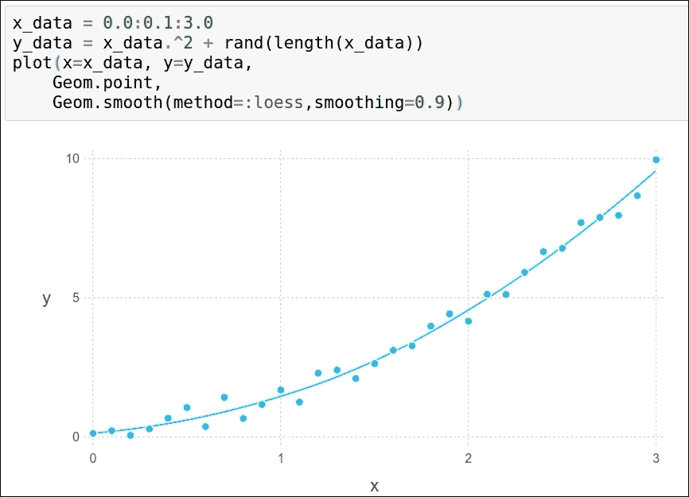

### 支线剧情网格

多个图可以组成一个网格，它们由几个分类向量组织:

```jl
Julia> Geom.subplot_grid(elements::Gadfly.ElementOrFunction...)

```

美学是:

*   `xgroup`和`ygroup`(可选):使用它们根据分类数据在 *x* 轴或 *y* 轴上排列支线剧情
*   `free_y_axis` and `free_x_axis` (optional): By default, the values are false, which means the *y* axis or *x* axis scales can differ across different subplots

    如果该值为真，则为各个地块设置比例

*   如果`xgroup`和`ygroup`都被绑定，则形成网格


使用固定比例:


### 水平线和垂直线

使用`hline`和`vline`，我们可以在画布上画水平线和垂直线。

美学是:

*   `xintercept`:x 轴*截距*
*   *`yintercept`:y 轴*截距**

**参数有:**

*   **`color`:生成线条的颜色**
*   **`size`:我们也可以指定线条的宽度**

****

### **绘制丝带**

**我们也可以在线图上绘制一个带状图。**

**美学是:**

*   **`x`:x 轴**
*   ***`ymin`和`ymax`:y 轴*的上下界****
*   **`color`(可选):使用不同的颜色对数据进行分类分组**

**示例:**

```jl
**xs = 0:0.1:20 
df_cos = DataFrame( 
    x=xs, 
    y=cos(xs), 
    ymin=cos(xs) .- 0.5, 
    ymax=cos(xs) .+ 0.5, 
    f="cos" 
    ) 
df_sin = DataFrame( 
    x=xs, 
    y=sin(xs), 
    ymin=sin(xs) .- 0.5, 
    ymax=sin(xs) .+ 0.5, 
    f="sin" 
    ) 
df = vcat(df_cos, df_sin) 
p = plot(df, x=:x, y=:y, ymin=:ymin, ymax=:ymax, color=:f, Geom.line, Geom.ribbon)** 
```

****

### **小提琴情节**

**Violin 情节对于用例来说是非常具体的。它们用于显示密度。**

**美学是:**

*   **`x`和`y`:在 *x* 轴和 *y* 轴上的位置**
*   **`width`:表示根据`y`值的密度**

**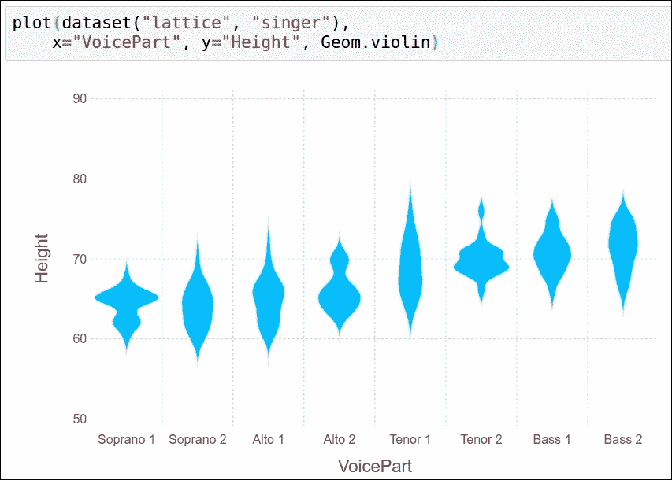**

### **蜂群图**

**就像小提琴图一样，我们可以用`beeswarm`图来表示密度。**

**美学是:**

*   **`x`和`y`:针对 *x* 轴和 *y* 轴的数据集**
*   **`color` (optional)**

**参数有:**

*   **`orientation`:可以是`:vertical`或`:horizontal`**
*   **`padding`:两点间的最小距离**

****

## **元素-刻度**

**这用于转换原始数据，同时保留原始值。它将一种审美映射到同一种审美。**

### **x _ 连续和 y _ 连续**

**这些用于将值映射到 *x* 和 *y* 坐标。**

**美学是:**

*   **`x`、`xmin` / `xmax`和`xintercept`**
*   **`y`、`ymin` / `ymax`和`yintercept`**

**参数有:**

*   **`minvalue`:最小`x`或`y`值**
*   **`maxvalue`:最大`x`或`y`值**
*   **`labels`: This can be either a function or nothing

    当函数被传递时，一个字符串被映射到`x`或`y`中的值** 
*   **`format`:数字的格式**

**变化有:**

*   **`Scale.x_continuous`和`Scale.y_continuous`**
*   **`Scale.x_log10`和`Scale.ylog10`**
*   **`Scale.x_log2`和`Scale.ylog2`**
*   **`Scale.x_log`和`Scale.y_log`**
*   **`Scale.x_asinh`和`Scale.y_asinh`**
*   **`Scale.x_sqrt`和`Scale.y_sqrt`**

**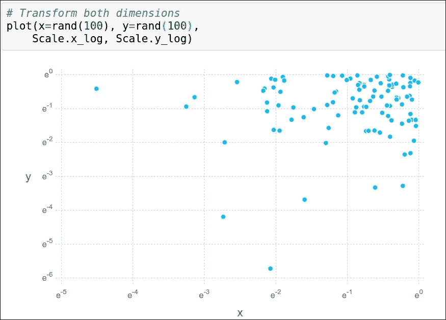**

### **x _ 离散和 y _ 离散**

**这些用于将分类数据映射到笛卡尔坐标。不管值是什么，每个值都映射到一个点。**

**美学是:**

*   **`x`、`xmin` / `xmax`和`xintercept`**
*   **`y`、`ymin` / `ymax`和`yintercept`**

**参数有:**

*   **`labels`: This can be either a function or nothing

    当传递一个函数时，一个字符串被映射到`x`或`y`中的值:

    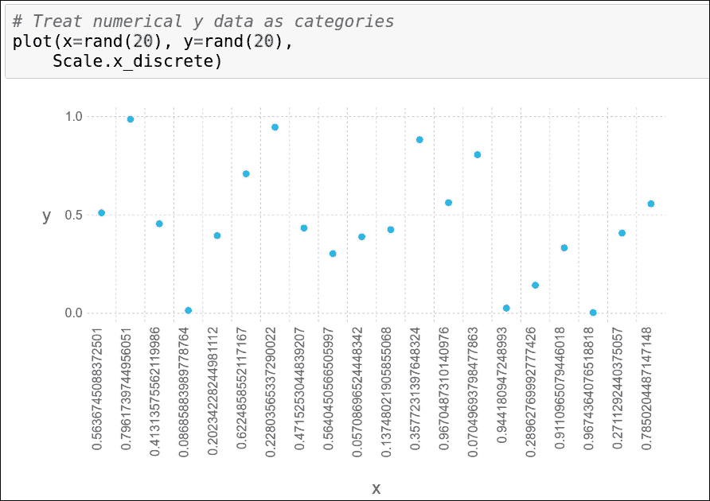**

### **连续色标**

**这将创建一个使用连续色标的图。这用来表示密度。**

**美学是:**

*   **颜色**

**参数有:**

*   **`f`:定义的返回颜色的函数**
*   **`minvalues`和`maxvalue`:色标值的范围**

**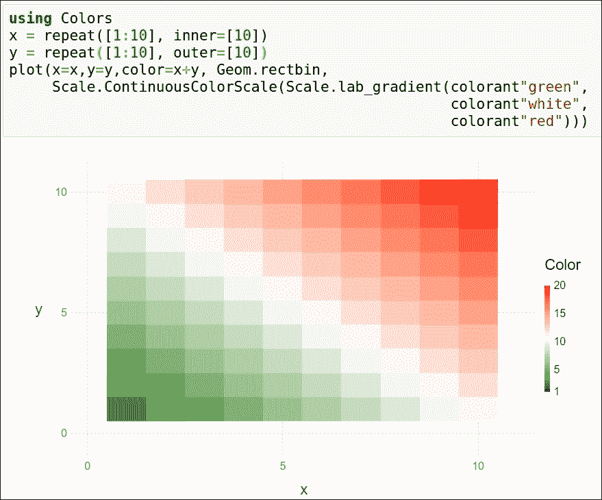**

## **元素-指南**

**这些提供了特殊的布局考虑，以帮助我们更好地理解数据。它们包含`xticks`、`yticks`、`xlabes`、`ylabels`、标题、注释等等。**

## **了解牛虻是如何工作的**

**在这一章中，我们已经讲述了各种情节。现在，简单介绍一下牛虻实际上是如何工作的。**

**首先，数据源的子集被映射到绘图中每个图层的数据对象:**

*   **我们已经向绘图函数传递了各种标度。它们被用来获得可情节化的美学。**
*   **一个美学的转变完成了，无论是层的角度还是情节的角度。**
*   **创建一个组合上下文，通过使用来自所有层的美学使数据适合屏幕坐标。**
*   **为每个层单独渲染几何体。**
*   **最后，向导被计算并呈现在绘图的顶部。**

**

# 总结

在这一章中，我们学习了在 Julia 中使用不同的图形选项进行可视化。

我们研究了 PyPlot 以及如何利用庞大的 matplotlib 库。我们研究了各种例子。我们还经历了 Unicode plots，它是非常轻量级的，可以在终端中使用。Vega 和牛虻，两个最流行的图形库，也在本章中进行了解释。通过使用散点图、折线图、方框图、直方图、条形图和小提琴图等不同的图表，我们了解了可视化数据的重要性和帮助性。

下一章，我们将和 Julia 一起学习机器学习。


# 参考文献

*   [http://dcjones.github.io/Gadfly.jl/](http://dcjones.github.io/Gadfly.jl/)
*   [https://github.com/stevengj/PyPlot.jl](https://github.com/stevengj/PyPlot.jl)
*   [http://johnmyleswhite.github.io/Vega.jl/](http://johnmyleswhite.github.io/Vega.jl/)
*   [https://github.com/Evizero/UnicodePlots.jl](https://github.com/Evizero/UnicodePlots.jl)**