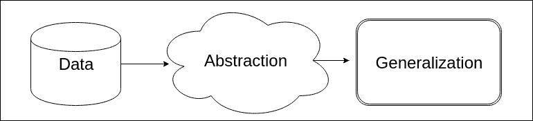
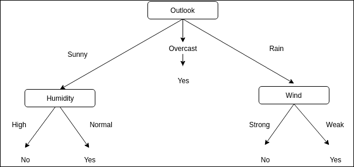
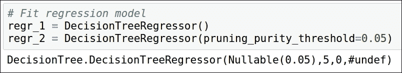
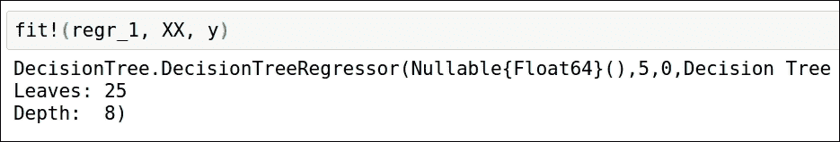
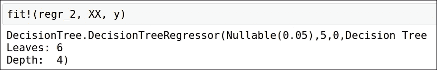
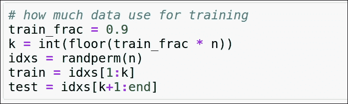
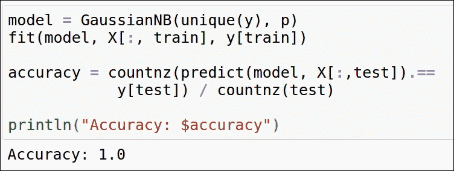

# 六、监督机器学习

人们通常认为数据科学是机器学习，这意味着在数据科学中，我们只训练机器学习的模型。但是数据科学远不止于此。数据科学涉及理解数据、收集数据、管理数据、从数据中提取意义，然后在需要时进行机器学习。

在我看来，机器学习是当今最令人兴奋的领域。有了大量现成的数据，我们可以收集宝贵的知识。许多公司已经让他们的机器学习库可以访问，并且存在许多开源替代方案。

在本章中，您将学习以下主题:

*   什么是机器学习？
*   机器学习的类型
*   什么是过拟合和欠拟合？
*   偏差-方差权衡
*   特征提取和选择
*   决策树
*   朴素贝叶斯分类器

# 什么是机器学习？

一般来说，当我们谈论机器学习时，我们会想到我们与我们创造但失控的智能机器进行战争。这些机器能够智胜人类，成为人类生存的威胁。这些理论只是为了我们的娱乐而创造的。我们离这样的机器还很遥远。

所以，问题是:什么是机器学习？汤姆·m·米切尔给出了一个正式的定义:

> *“如果由 P 测量的计算机程序在 T 中的任务上的性能随着经验 E 而提高，则称该计算机程序从关于某类任务 T 和性能测量 P 的经验 E 中学习。”*

这意味着机器学习是教会计算机使用数据生成算法，而不是显式编程。它将数据转化为可操作的知识。机器学习与统计、概率和数学优化密切相关。

随着技术的发展，有一样东西会随之呈指数级增长，那就是数据。我们有大量的非结构化和结构化数据在快速增长。大量的数据是由空间天文台、气象学家、生物学家、健康传感器、调查等等产生的。手动浏览如此大量的数据并找到模式或获得洞察力是不可能的。这些数据对于科学家、领域专家、政府、卫生官员甚至企业都非常重要。为了从这些数据中获取知识，我们需要能够帮助我们做出决策的自我学习算法。

机器学习是作为人工智能的一个子领域发展起来的，它消除了手动分析大量数据的需要。我们不使用机器学习，而是通过使用自学习预测模型获取知识来做出数据驱动的决策。机器学习在我们的日常生活中变得非常重要。一些常见的用例包括搜索引擎、游戏、垃圾邮件过滤器和图像识别。自动驾驶汽车也使用机器学习。

机器学习中使用的一些基本术语包括:

*   **特征**:数据点或记录的显著特征
*   **训练集**:这是我们用来训练算法的数据集，帮助我们找到关系或建立模型
*   **测试集**:使用训练数据集生成的算法在测试数据集上进行测试，以发现准确性
*   **特征向量**:包含定义对象的特征的 n 维向量
*   **样本**:数据集或记录中的一个项目

## 机器学习的用途

到处都在使用这样或那样的机器学习。它的应用是无穷无尽的。让我们讨论一些非常常见的用例:

*   **电子邮件垃圾邮件过滤**:每一个主要的电子邮件服务提供商都使用机器学习将垃圾邮件从收件箱中过滤出来，放入垃圾邮件文件夹中。
*   **预测风暴和自然灾害**:气象学家和地质学家使用机器学习来利用天气数据预测自然灾害，这可以帮助我们采取预防措施。
*   有针对性的促销/活动和广告:在社交网站、搜索引擎上，也许在邮箱里，我们会看到某种程度上符合我们口味的广告。通过对我们过去搜索的数据、我们的社交档案或电子邮件内容进行机器学习，这是可行的。
*   **自动驾驶汽车**:科技巨头目前都在研发自动驾驶汽车。这是通过对人类驾驶员的实际数据、图像和声音处理以及各种其他因素进行机器学习来实现的。
*   机器学习也被企业用来预测市场。
*   它还可以用来预测选举的结果和选民对某一特定候选人的情绪。
*   机器学习也被用于预防犯罪。通过了解不同罪犯的模式，我们可以预测未来可能发生的犯罪，并可以预防犯罪。

一个引起巨大关注的案例是美国一家大型零售连锁店使用机器学习来识别孕妇。这家零售商想出了一个策略，对多种孕妇产品进行打折，这样一来，这些女性就会成为忠诚的顾客，并且会购买高利润率的产品。

该零售商致力于使用对孕妇有用的不同产品购买中的有用模式来预测怀孕的算法。

一次，一名男子来到零售商前，询问他十几岁的女儿为什么会收到产妇用品的折扣券。这家零售连锁店向他道歉，但后来当这位父亲得知他的女儿确实怀孕时，他自己也道歉了。

这个故事可能是也可能不是完全真实的，但零售商确实定期分析他们的客户数据，以找出有针对性的促销、活动和库存管理的模式。

## 机器学习与伦理

我们来看看机器学习在哪些地方使用非常频繁:

*   **零售商**:在前面的例子中，我们提到了零售连锁店如何使用机器学习数据来增加收入和留住客户
*   **垃圾邮件过滤**:使用各种机器学习算法处理电子邮件，进行垃圾邮件过滤
*   目标广告:在我们的邮箱、社交网站或搜索引擎中，我们看到自己喜欢的广告

这些只是当今世界上实现的一些实际用例。它们之间的一个共同点是用户数据。

在第一个例子中，零售商使用用户的交易历史来进行有针对性的促销和活动以及库存管理等。零售巨头通过向用户提供忠诚度或注册卡来做到这一点。

在第二个示例中，电子邮件服务提供商使用经过训练的机器学习算法来检测和标记垃圾邮件。它通过检查电子邮件/附件的内容并对电子邮件的发件人进行分类来做到这一点。

在第三个例子中，电子邮件提供商、社交网络或搜索引擎将再次检查我们的 cookies、个人资料或邮件，以做有针对性的广告。

在所有这些例子中，当我们与零售商、电子邮件提供商或社交网络签约时，协议的条款和条件中提到将使用用户的数据，但不会侵犯隐私。

在使用未公开的数据之前，我们需要获得必要的许可，这一点非常重要。此外，我们的机器学习模型不应该基于地区、种族和性别或任何其他类型进行歧视。所提供的数据不得用于协议中未提及的目的，或者在所在地区或国家是非法的。


# 机器学习——过程

机器学习算法的训练与人类大脑如何工作的想法保持一致。他们有些相似。我们来讨论一下整个过程。

机器学习过程可以描述为三个步骤:

1.  投入
2.  抽象
3.  一般化

这三个步骤是机器学习算法如何工作的核心。尽管算法可能会也可能不会以这种方式划分或表示，但这解释了总体方法:

1.  第一步集中在什么数据应该在那里，什么不应该。在此基础上，它根据需求收集、存储和清理数据。
2.  第二步需要翻译数据以表示更大的数据类别。这是必需的，因为我们不能捕捉所有的东西，我们的算法不应该只适用于我们现有的数据。
3.  第三步关注于使用这些抽象数据的模型或动作的创建，这将适用于更广泛的大众。

那么，处理机器学习问题的流程应该是怎样的呢？



在这个特定的图中，我们看到数据在被用于创建机器学习算法之前经过了抽象过程。这个过程本身就很繁琐。我们在与数据管理相关的章节中研究了这个过程。

该过程遵循模型的训练，即将模型拟合到我们拥有的数据集中。计算机不会自己拾取模型，但它依赖于学习任务。学习任务还包括归纳从我们还没有的数据中获得的知识。

因此，训练模型是基于我们当前拥有的数据，并且学习任务包括对未来数据的模型的一般化。

这取决于我们的模型如何从我们目前拥有的数据集中推导出知识。我们需要制作这样一个模型，它可以收集对我们以前不知道的东西的见解，可以是有用的，可以与未来的数据相联系。

## 不同类型的机器学习

机器学习主要分为三类:

*   监督学习
*   无监督学习
*   强化学习

在监督学习中，模型/机器具有输入和对应于这些输入的输出。机器从这些输入中学习，并将这种学习应用于其他看不见的数据，以生成输出。

无监督学习没有所需的输出；因此，由机器来学习和发现以前看不见的模式。

在强化学习中，机器不断地与环境进行交互，并通过这个过程进行学习。这包括一个反馈回路。

## 什么是偏差-方差权衡？

让我们来理解什么是偏差和方差。首先，我们将经历模型中的偏差:

*   偏差是模型生成的预测值与预期值或我们应该收到的正确值之间的差异。
*   当我们得到新的数据时，这个模型就会工作并给出预测。因此，这意味着我们的模型可以产生一系列的预测。
*   偏差就是这个预测范围的正确性。

现在，让我们了解方差以及它如何影响模型:

*   方差是当数据点改变或引入新数据时模型的可变性
*   不应该要求每次引入新数据时都调整模型

根据我们对偏差和方差的理解，我们可以得出这样的结论:它们是相互影响的。因此，在创建模型时，我们要考虑这种权衡。

## 过拟合和欠拟合对模型的影响

当我们创建的模型也开始考虑数据集中的异常值或噪声时，就会发生过度拟合。因此，这意味着我们的模型非常适合数据集。

这种模型的缺点是不能很好地概括。这种模型具有低偏差和高方差。

当我们创建的模型无法找到所需的数据模式或趋势时，就会出现欠拟合。因此，这意味着模型不能很好地拟合数据集。

这种模型的缺点是它不能给出很好的预测。这种模型具有高偏差和低方差。

我们应该努力减少欠拟合和过拟合。这是通过各种技术完成的。集成模型在避免欠拟合和过拟合方面非常好。我们将在接下来的章节中研究集成模型。


# 了解决策树

决策树是“分而治之”的一个非常好的例子。这是归纳推理中最实用和最广泛使用的方法之一。这是一种监督学习方法，可用于分类和回归。它是非参数化的，其目的是通过从数据中推断简单的决策规则来学习，并创建这样一个可以预测目标变量的值的模型。

在做出决定之前，我们通过权衡我们拥有的不同选项来分析利弊的可能性。假设我们想购买一部手机，我们在价格段有多种选择。每部手机都有非常好的东西，也许比另一部更好。要做出选择，我们首先要考虑我们想要的最重要的特性。因此，我们创造了一系列的特性，它必须通过这些特性才能成为最终的选择。

在本节中，我们将了解:

*   决策树
*   熵度量
*   随机森林

我们还将了解著名的决策树学习算法，如 ID3 和 C5.0。

## 构建决策树——分而治之

一种叫做递归分割的启发式方法被用来构建决策树。在这种方法中，随着我们的前进，我们的数据被分成越来越小的相似类别的子集。

决策树实际上是一棵倒置的树。它从根节点开始，到叶子节点结束，叶子节点是终端节点。将节点拆分为分支是基于逻辑决策的。整个数据集表示在根节点上。算法选择最能预测目标类别的特征。然后，它将示例划分到这个特定特性的不同值组中。这代表了我们树的第一组分支。

遵循分治法，直到到达终点。在每一步，算法继续选择最佳候选特征。

在以下情况下定义终点:

*   在特定的节点上，几乎所有的例子都属于同一个类
*   功能列表已用尽
*   达到树的预定义大小限制



上图是决策树的一个非常著名的例子。这里做一个决策树，找出要不要出去:

*   Outlook 是根节点。这指的是环境中所有可能的类别
*   晴天、阴天、雨天都是树枝。
*   湿度和风是叶节点，叶节点再次分裂成分支，并根据有利的环境做出决定。

这些树也可以重新表示为 if-then 规则，这很容易理解。决策树是非常成功和流行的算法之一，具有广泛的应用。

以下是决策树的一些应用:

*   **信用卡/贷款批准的决定**:信用评分模型基于决策树，其中每个申请人的信息被馈送以决定是否应该批准信用卡/贷款。
*   **医疗诊断**:基于症状、测量和测试，使用定义明确且经过测试的决策树来诊断各种疾病。

## 决策树学习应该用在哪里？

虽然有各种决策树学习方法可用于各种问题，但决策树最适合以下情况:

*   属性-值对是由固定集合中的属性和值来描述实例的场景。在前面的例子中，我们的属性是“风”，值是“强”和“弱”。这些不相交的可能值使得创建决策树学习变得容易，尽管也可以使用具有真实值的属性。
*   目标函数的最终输出有一个谨慎的值，就像前面的例子，我们有“是”或“否”。决策树算法可以扩展为具有两个以上的可能目标值。决策树也可以扩展为输出真实值，但这很少使用。
*   决策树算法对训练数据集中的错误具有鲁棒性。这些错误可能出现在示例的属性值中，也可能出现在示例的分类中，或者同时出现在两者中。
*   决策树学习也适用于数据集中的缺失值。如果这些值在一些示例中丢失，而在其他示例中它们可用于属性，则可以使用决策树。

## 决策树的优势

*   决策树很容易理解和解释。可视化决策树也很容易。
*   在其他算法中，需要先进行数据规范化，然后才能应用。规范化是指创建虚拟变量并删除空白值。另一方面，决策树需要很少的数据准备。
*   使用决策树进行预测所涉及的成本相对于用于训练该树的示例数量是对数的。
*   与其他算法不同，决策树既适用于数值数据，也适用于分类数据。其他算法通常专门用于一种类型的变量。
*   决策树可以很容易地处理可能有多个输出的问题。
*   决策树遵循白盒模型，这意味着如果情况在模型中是可观察的，则使用布尔逻辑很容易解释条件。另一方面，在黑盒模型中，如人工神经网络，结果相对难以解释。
*   统计测试可用于验证模型。因此，我们可以检验模型的可靠性。
*   即使违反了作为数据来源的真实模型的假设，它也能够很好地执行。

## 决策树的缺点

我们已经介绍了决策树的适用场合及其优势。现在我们将讨论决策树的缺点:

*   决策树中的数据总是有过度拟合的可能。这通常发生在我们创建的树过于复杂，无法很好地概括的时候。
*   为了避免这种情况，可以采取各种措施。一种方法是修剪。顾名思义，这是一种我们设置树可以生长的最大深度的方法。
*   不稳定性始终是决策树的一个问题，因为数据的微小变化都会导致生成完全不同的树。
*   这种情况的解决方案是集成学习，我们将在下一章研究。
*   决策树学习有时可能会导致有偏见的树的创建，其中一些类比其他类占主导地位。这种情况的解决方案是在使数据集适合决策树算法之前平衡数据集。
*   考虑到最优性的几个方面，决策树学习被认为是 NP 完全的。这甚至适用于基本概念。
*   通常，在每个节点做出局部最优决策的情况下，使用类似贪婪算法的启发式算法。这并不能保证我们会有一个全局最优的决策树。
*   学习诸如奇偶校验、异或和多路复用器问题这样的概念可能很难，因为决策树不能很容易地表示它们。

## 决策树学习算法

有各种决策树学习算法，实际上是核心算法的变种。核心算法实际上是一个自上而下的，贪婪的搜索所有可能的树。

我们将讨论两种算法:

*   ID3
*   C4.5 和 C5.0

第一个算法， **ID3** ( **迭代二分法 3** )，由 Ross Quinlan 于 1986 年开发。该算法通过创建多路树来进行，其中它使用贪婪搜索来寻找每个节点和可以为分类目标产生最大信息增益的特征。由于树可以增长到最大尺寸，这可能导致数据的过度拟合，因此使用修剪来制作概化模型。

C4.5 出现在 ID3 之后，取消了所有特性必须是分类的限制。它通过基于数字变量动态定义离散属性来实现这一点。这将从连续属性值分割成一组离散的区间。C4.5 从 ID3 算法的训练树中创建 if-then 规则集。C5.0 是最新版本；它构建较小的规则集，使用相对较少的内存。

### 决策树算法如何工作

决策树算法构建自顶向下的树。它遵循以下步骤:

1.  要知道哪个元素应该出现在树的根，需要对属性的每个实例进行统计测试，以确定单独使用该属性对训练示例进行分类的效果如何。
2.  这导致在树的根节点选择最佳属性。
3.  现在，在这个根节点上，为属性的每个可能值创建了后代。
4.  我们的训练数据集中的示例被排序到这些后代节点中的每一个。
5.  现在，对于这些单独的后代节点，对我们的训练数据集中的其余示例重复前面的所有步骤。
6.  这导致使用贪婪搜索为我们的训练数据集创建可接受的树。该算法从不回溯，这意味着它从不重新考虑以前的选择，而是沿着树向下。

### 了解和测量节点的纯度

决策树是自顶向下构建的。很难决定在每个节点上拆分哪个属性。因此，我们找到了最好地分割目标类的特征。纯度是只包含一个类的节点的度量。

使用熵测量 C5.0 中的纯度。示例样本的熵是类值如何在示例间混合的指示:

*   0:最小值表示样本中类别值的同质性
*   1:最大值表示样本中类别值的无序度最大

熵由下式给出:


在前面的公式中， *S* 表示我们拥有的数据集， *c* 表示类级别。对于给定的类 *i* ， *p* 是值的比例。

当纯度度量被确定时，算法必须决定数据应该被分割的特征。为了决定这一点，算法使用熵度量来计算在每个可能的特征上分裂时同质性如何不同。由算法完成的这一特定计算是信息增益:


分割数据集前的熵( *S1* )和分割得到的分区( *S2* )之差称为信息增益( *F* )。

## 一个例子

让我们应用我们所学的知识，使用 Julia 创建一个决策树。我们将使用 Cedric St-Jean 在[http://scikit-learn.org/](http://scikit-learn.org/)和 Scikitlearn.jl 上为 Python 提供的例子。

我们将首先添加所需的包:

```jl
julia> Pkg.update() 
julia> Pkg.add("DecisionTree") 
julia> Pkg.add("ScikitLearn") 
julia> Pkg.add("PyPlot") 

```

ScikitLearn 向 Julia 提供了著名的 Python 机器学习库的接口:

```jl
julia> using ScikitLearn 
julia> using DecisionTree 
julia> using PyPlot 

```

添加所需的包后，我们将创建我们将在示例中使用的数据集:

```jl
julia> # Create a random dataset 
julia> srand(100) 
julia> X = sort(5 * rand(80)) 
julia> XX = reshape(X, 80, 1) 
julia> y = sin(X) 
julia> y[1:5:end] += 3 * (0.5 - rand(16)) 

```

这将生成一个 16 元素的`Array{Float64,1}`。

现在我们将创建两个不同模型的实例。一种模型是我们不限制树的深度，而在另一种模型中，我们将在纯度的基础上修剪决策树:



我们现在将使模型适合我们拥有的数据集。我们将适合这两种型号。



这是第一个模型。这里我们的决策树有`25`个叶节点，深度为`8`。



这是第二种模式。这里我们修剪我们的决策树。它有`6`个叶节点，深度为`4`。

现在，我们将使用模型在测试数据集上进行预测:

```jl
julia> # Predict 
julia> X_test = 0:0.01:5.0 
julia> y_1 = predict(regr_1, hcat(X_test)) 
julia> y_2 = predict(regr_2, hcat(X_test)) 

```

这创建了一个 501 元素的`Array{Float64,1}`。

为了更好地理解结果，让我们在数据集上绘制两个模型:

```jl
julia> # Plot the results 
julia> scatter(X, y, c="k", label="data") 
julia> plot(X_test, y_1, c="g", label="no pruning", linewidth=2) 
julia> plot(X_test, y_2, c="r", label="pruning_purity_threshold=0.05", linewidth=2) 

julia> xlabel("data") 
julia> ylabel("target") 
julia> title("Decision Tree Regression") 
julia> legend(prop=Dict("size"=>10)) 

```

决策树可能会使数据过多。需要对决策树进行剪枝，使其更加一般化。但是如果我们做的修剪比需要的多，那么它可能会导致一个不正确的模型。因此，要求我们找到最佳的修剪水平。


很明显，第一个决策树过度适合我们的数据集，而第二个决策树模型相对更一般化。


# 使用朴素贝叶斯的监督学习

朴素贝叶斯是迄今为止最著名的机器学习算法之一。它广泛应用于文本分类技术中。

朴素贝叶斯方法属于监督学习算法集。它是一个概率分类器，基于贝叶斯定理。它采用了“天真”的假设，即每一对特征都是相互独立的。

尽管有这些假设，朴素贝叶斯分类器工作得非常好。他们最著名的用例是垃圾邮件过滤。这种算法的有效性由用于估计所需参数的相当少量的训练数据的要求来证明。

与其他方法相比，这些分类器和学习器非常快。


在这个给定的公式中:

*   *A* 和 *B* 是事件。
*   *P(A)* 和 *P(B)* 是 *A* 和 *B* 的概率。
*   这些都是先验概率，彼此独立。
*   *P(A | B)* 是在 *B* 为真的条件下 *A* 的概率。它是类( *A* ，目标)给定预测器( *B* ，属性)的后验概率。
*   *P(B | A)* 是在 *A* 为真的条件下 *B* 的概率。它是似然性，即给定类别的预测值的概率。

## 朴素贝叶斯的优势

以下是朴素贝叶斯的一些优点:

*   构建和理解它相对简单
*   它可以很容易地被训练，并且不需要庞大的数据集
*   它比较快
*   不受无关特性的影响

## 朴素贝叶斯的缺点

朴素贝叶斯的缺点是“天真”地假设每个特征都是独立的。这并不总是正确的。

## 朴素贝叶斯分类的用途

以下是朴素贝叶斯分类的一些用法:

*   **朴素贝叶斯文本分类**:这是一种概率学习方法，实际上是分类文档最成功的算法之一。
*   **垃圾邮件过滤**:这是朴素贝叶斯最著名的用例。朴素贝叶斯用于从合法电子邮件中识别垃圾电子邮件。许多服务器端电子邮件过滤机制将此与其他算法一起使用。
*   推荐系统:朴素贝叶斯也可以用来建立推荐系统。推荐系统用于预测和推荐用户未来可能喜欢的产品。它基于看不见的数据，并与协同过滤一起使用。这种方法更具可扩展性，并且通常比其他算法执行得更好。

为了理解朴素贝叶斯分类器实际上是如何工作的，我们应该理解贝叶斯规则。它是由托马斯·贝叶斯在 18 世纪建立的。他发展了各种数学原理，我们称之为贝叶斯方法。这些非常有效地描述了事件的概率，以及当我们有额外的信息时应该如何修正概率。

基于贝叶斯方法的分类器使用训练数据集，根据所有特征值找出每个类别的观察概率。因此，当这个分类器用于未标记或未看到的数据时，它利用观察到的概率来预测新特征属于哪个类别。虽然它是一个非常简单的算法，但它的性能与大多数其他算法相当或更好。

贝叶斯分类器最适用于以下情况:

*   包含大量属性的数据集，在计算结果的概率时应同时考虑所有属性。
*   具有弱影响的特征通常被忽略，但是贝叶斯分类器也使用它们来生成预测。许多这样的弱点会导致决策的重大改变。

## 贝叶斯方法的工作原理

贝叶斯方法依赖于一个概念，即事件可能性的估计是基于手边的证据。情况的可能结果是事件；例如，在掷硬币中，我们得到正面或反面。类似地，邮件可以是“火腿”或“垃圾邮件”。审判是指一个事件发生的单一机会。在我们之前的例子中，掷硬币就是审判。

### 后验概率

> *后验概率=条件概率*先验概率/证据*

在分类方面，后验概率是指在给定观测特征值的情况下，特定物体属于某一类 x 的概率。例如，“给定温度和湿度百分比，下雨的概率是多少？”

> *P(雨| xi)，Xi =【45 度，95%湿度】*

*   设 *xi* 为样本 *i* 的特征向量，其中 *i* 属于 *{1，2，3，.....n* }
*   设 *wj* 为类 *j* 的记法，其中 *j* 属于 *{1，2，3，......n}*
*   *P(xi | wi)* 是给定观测样本属于类别 *wj* 时，观测样本 *xi* 的概率

后验概率的一般符号是:

> *P(*wj*| Xi)= P(Xi | wj)* P(wj)/P(Xi)*

朴素贝叶斯的主要目标是最大化给定训练数据的后验概率，从而形成决策规则。

### 类别条件概率

贝叶斯分类器假设数据集中的所有样本都是独立且同分布的。这里，独立性意味着一个观察的概率不受另一个观察的概率的影响。

我们讨论过的一个非常著名的例子是抛硬币。在这里，第一次抛硬币的结果不会影响随后的抛硬币。对于一个无偏的硬币，得到正面或反面的概率总是 0.5。

一个附加的假设是特征具有条件独立性。这是另一个“天真”的假设，这意味着可以直接从训练数据中估计似然性或类条件概率，而不需要评估 x 的所有概率。

我们用一个例子来理解。假设我们必须创建一个服务器端的电子邮件过滤应用来判断邮件是否是垃圾邮件。假设我们有大约 1，000 封电子邮件，其中 100 封是垃圾邮件。

现在，我们收到了一封新邮件，内容是“你好朋友”。那么，我们应该如何计算新消息的类条件概率呢？

文本的模式由两个特征组成:“你好”和“朋友”。现在，我们将计算新邮件的类条件概率。

类别条件概率是当邮件是垃圾邮件时遇到“你好”的概率*当邮件是垃圾邮件时遇到“朋友”的概率:

> *P(X=[hello，world]| w = spam)= P(hello | spam)* P(friend | spam)*

我们可以很容易地找出有多少邮件包含“hello”这个词，有多少邮件包含“spam”这个词。然而，我们采取了“天真”的假设，即一个单词不会影响另一个单词的出现。我们知道“你好”和“朋友”经常一起出现。因此，我们的假设是违反的。

### 先验概率

先验概率是事件发生的先验知识。它是特定类出现的一般概率。如果先验服从均匀分布，则后验概率使用类别条件概率和证据项来确定。

当训练数据是整个群体的样本时，使用对训练数据的估计来获得先验知识。

### 证据

计算后验概率还需要一个值，那就是“证据”。证据 P(x)是特定模式 x 出现的概率，它与类别标签无关。

## 那袋文字

在前面的示例中，我们对电子邮件进行了分类。为此，我们对模式进行分类。要对模式进行分类，最重要的任务是:

*   特征抽出
*   特征选择

但是好的特征是如何被识别的呢？好的特性有一些特征:

*   这些特性对于我们构建分类器的用例必须是重要的
*   所选择的特征应该具有足够的信息来很好地区分不同的模式，并且可以用于训练分类器
*   这些特征不应该容易变形或缩放

我们需要首先将电子邮件文本文档表示为一个特征向量，然后才能使其适合我们的模型并应用机器学习算法。文本文档的分类使用词袋模型。在这个模型中，我们创建词汇表，词汇表是在所有电子邮件中出现的不同单词的集合(训练集)，然后计算每个单词出现的次数。

### 使用朴素贝叶斯作为垃圾邮件过滤器的优势

以下是使用朴素贝叶斯作为垃圾邮件过滤器的优势:

*   可以个性化。这意味着它可以在每个用户的基础上进行训练。我们有时会订阅时事通讯、邮件列表或产品更新，这可能会对其他用户造成垃圾邮件。此外，我收到的电子邮件中有一些与我的工作相关的词语，可能会被其他用户归类为垃圾邮件。所以，作为一个合法用户，我不希望我的邮件变成垃圾邮件。我们可以尝试使用规则或过滤器，但贝叶斯垃圾邮件过滤远远优于这些机制。
*   贝叶斯垃圾邮件过滤器可以有效地避免误报，因此合法的电子邮件被归类为垃圾邮件的可能性很小。例如，我们都会收到带有“尼日利亚”字样或声称来自尼日利亚的邮件，这些邮件实际上是网络钓鱼欺诈。但有可能我有一个亲戚或朋友在那里，或者我有一些业务；因此，该邮件对我来说可能不是非法的。

### 朴素贝叶斯滤波器的缺点

贝叶斯过滤器容易受到贝叶斯中毒的攻击，贝叶斯中毒是一种将大量合法文本与垃圾邮件一起发送的技术。因此，贝叶斯过滤器会失败，并将其标记为“垃圾邮件”或合法邮件。

## 朴素贝叶斯的例子

让我们使用 Julia 创建一些简单的贝叶斯模型:

```jl
julia> Pkg.update 
julia> Pkg.add("NaiveBayes") 

```

我们添加了所需的`NaiveBayes`包。

现在，让我们创建一些虚拟数据集:

```jl
julia> X = [1 1 0 2 1; 
     0 0 3 1 0; 
     1 0 1 0 2] 
julia> y = [:a, :b, :b, :a, :a] 

```

我们创建了两个数组`X`和`y`，其中`y`中的一个元素表示`X`中的列:

```jl
julia> m = MultinomialNB(unique(y), 3) 
julia> fit(m, X, y) 

```

我们加载了一个 MultinomialNB 实例，并使数据集适合它:

```jl
julia> Xtest = [0 4 1; 
      2 2 0; 
      1 1 1] 

```

现在，我们将使用它在我们的测试数据集上预测它:

```jl
julia> predict(m, Xtest) 

```

我得到的输出是:

```jl
julia> 3-element Array{Symbol,1}: 
   :b 
   :a 
   :a 

```

也就是说第一列是`b`，第二列是`a`，第三列也是`a`。

这个例子是在一个虚拟数据集上。让我们在实际数据集上应用朴素贝叶斯。在本例中，我们将使用著名的 iris 数据集:

```jl
julia> #import necessary libraries 

julia> using NaiveBayes 
julia> using RDatasets 

julia> iris = dataset("datasets", "iris") 

julia> #observations in columns and variables in rows 

julia> x = array(iris[:, 1:4]) 

julia> p,n = size(x) 
julia> # By default species is a PooledDataArray 

julia> y = [species for species in iris[:,5]] 

```

我们加载了 RDatasets，它包含 iris 数据集。我们为特征向量(萼片长度、萼片宽度、花瓣长度和花瓣宽度)创建了数组。



现在，我们将拆分数据集进行训练和测试。



这非常简单，将数据集与朴素贝叶斯分类器相匹配。我们也在计算我们的模型工作的精确度。我们可以看到准确率是 1.0，也就是 100%。


# 总结

在这一章中，我们学习了机器学习及其用途。为计算机提供学习和提高的能力在这个世界上有着深远的用途。它被用于预测疾病爆发、预测天气、游戏、机器人、自动驾驶汽车、个人助理等等。

有三种不同类型的机器学习:监督学习、非监督学习和强化学习。

在这一章中，我们学习了监督学习，尤其是朴素贝叶斯和决策树。在接下来的章节中，我们将学习更多关于集成学习和无监督学习的知识。


# 参考文献

*   [https://github.com/JuliaStats/MLBase.jl](https://github.com/JuliaStats/MLBase.jl)
*   -= the last fantasy =-荣誉出品本字幕仅供学习交流，严禁用于商业途径
*   [https://github.com/johnmyleswhite/NaiveBayes.jl](https://github.com/johnmyleswhite/NaiveBayes.jl)
*   [https://github . com/benadeghi/decision contraee . JL](https://github.com/bensadeghi/DecisionTree.jl)
*   [https://github.com/bicycle1885/RandomForests.jl](https://github.com/bicycle1885/RandomForests.jl)
*   [http://scikit-learn.org/stable/](http://scikit-learn.org/stable/)