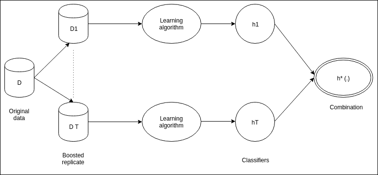
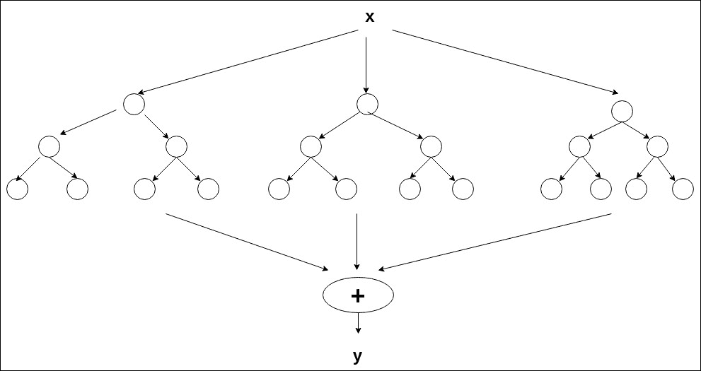
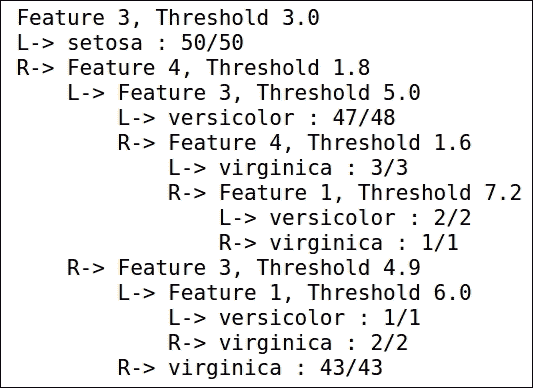

# 八、创建集成模型

一群人比一个人有能力做出更好的决定，尤其是当每个成员都有自己的偏见时。意识形态对于机器学习也是如此。

当单个算法不能产生真正的预测函数时，则使用集成机器学习方法。当更关注模型的性能而不是训练时间和模型的复杂性时，集成方法是优选的。

在本章中，我们将讨论:

*   什么是集成学习？
*   构建合奏。
*   组合策略。
*   助推，装袋，注入随机性。
*   随机森林。

# 什么是集成学习？

集成学习是一种机器学习方法，其中各种模型准备好处理同一问题。这是一个生成多个模型并将从这些模型中获得的结果组合起来以产生最终结果的过程。此外，集成模型本质上是并行的；因此，如果我们能够访问多个处理器，它们在训练和测试方面会更加高效:

*   **机器学习的普通方法**:这些方法使用训练数据来学习特定的假设。
*   **集成学习**:使用训练数据建立一组假设。这些假设被结合起来以建立最终的模型。

因此，可以说，集成学习是为不同的个体学习者准备一个目标函数的方法，该目标函数利用不同的策略，并且从长远来看，组合这些学习。


## 了解集成学习

正如我们所讨论的，集成学习结合了不同个体学习者的学习。它是旨在提高准确性的多个学习模型的集合:

*   基础学习者:每个独立的学习者被称为基础学习者。基础学习者可能适合特定的情况，但不善于概括。
*   由于基础学习者的概括能力较弱，它们并不适合每种情况。
*   集成学习使用这些基础(弱)学习器来构建强学习器，这导致相对更精确的模型。
*   通常，决策树算法被用作基本学习算法。使用同一种学习算法会产生同质的学习者。但是，也可以使用不同的算法，这将导致异构的学习者。

## 如何构建合奏

建议基础学习者尽量多样化。这使得集合能够更准确地处理和预测大多数情况。这种多样性可以通过使用数据集的不同子集、操作或转换输入以及同时使用不同的技术进行学习来产生。

此外，当单个基础学习者具有高准确度时，则集合具有良好准确度的机会很大。

通常，集合的构建是一个两步过程:

1.  第一步是创建基础学习者。它们通常是并行构建的，但是如果基础学习者受到先前形成的基础学习者的影响，那么它们是以顺序的方式构建的。
2.  第二步是组合这些基础学习者，并创建一个最适合用例的集合。

通过使用不同类型的基学习器和组合技术，我们可以产生不同的集成学习模型。

有不同的方法来实现集成模型:

*   对训练数据集进行子采样
*   操纵输入要素
*   操纵输出要素
*   注入随机性
*   可以修改分类器的学习参数

### 组合策略

组合策略可以分为两类:

*   静态组合器
*   自适应组合器

**静态组合器:**组合器选择标准独立于分量向量。静态方法可以被分为可训练的和不可训练的。

**可训练的**:合成器经过不同的训练阶段，以增强合奏的性能。这里有两种广泛使用的方法:

*   **Weighted averaging**: The yield of every classifier is weighted by its very own performance measure:

    *   测量不同验证集上预测的准确性

*   **堆叠概括**:集成的产量被视为元分类器的特征向量

**不可训练**:单个分类器的性能对投票没有影响。可以使用不同的组合器。这取决于分级机提供的产量类型:

*   **投票**:当每个分类器生成一个类标签时使用。每个分类器为一个特定的类投票。在合奏中获得最多票数的班级获胜。
*   **平均**:当每个分类器产生一个置信度估计值时，就使用平均。集合中具有最高后验数的类获胜。
*   **Borda 计数**:当每个分类器产生一个等级时使用。

**自适应组合器**:这是一种组合器功能，取决于作为输入给出的特征向量:

*   这是每个地区都有的功能
*   分而治之的方法创建模块化集成和简单分类器，专门用于 I/O 空间的不同区域
*   要求各个专家在其能力范围内表现良好，而不是针对所有投入

## 二次采样训练数据集

当训练数据中存在一些小的变化时，如果输出分类器必须经历彻底的改变，则学习器被认为是不稳定的:

*   **不稳定的学习者**:决策树、神经网络等等
*   **稳定学习者**:最近邻、线性回归等等

这种特殊的技巧更适合不稳定的学习者。

二次采样中使用的两种非常常见的技术是:

*   制袋材料
*   助推

### 装袋

打包也称为引导聚合。它通过在具有替换的同一数据集上使用子采样来生成用于训练的附加数据。它通过重复创建多个组合来生成相同大小的训练数据集。

随着替换采样的完成，平均来说，每个分类器在 63.2%的训练样本上被训练。

在对这些多个数据集进行训练之后，bagging 通过多数投票来组合结果。获得最多票数的班级获胜。通过使用这些多重数据集，bagging 旨在减少差异。如果归纳的分类器是不相关的，则准确度会提高。

随机森林，一种集成学习，使用 bagging，是最强大的方法之一。

让我们来看一下 bagging 算法。

**培训**:

*   For iteration, *t=1 to T*:

    *   用替换的 *N* 个样本从训练数据集中随机抽取样本
    *   基础学习者在这个样本上被训练(例如，决策树或神经网络)

**测试**:

*   For test sample, *t=1 to T*:

    *   启动所有被训练的模型
    *   Prediction is done on the basis of the following:

        *   **回归**:平均
        *   **分类**:多数票



#### 装袋什么时候起作用？

装袋适用于如果不使用就会出现过度装配的情况。让我们来看一下这些场景:

*   **Under-fitting**:

    *   **高偏差**:模型不够好，与训练数据不匹配
    *   **小方差**:每当数据集中有变化时，分类器中需要做一个非常小的变化

*   **Over-fitting**:

    *   **小偏差**:模型太适合训练数据
    *   **大方差**:每当数据集中有小的变化时，分类器中就需要进行大的或剧烈的变化

Bagging 的目的是在不影响偏倚的情况下减少方差。因此，降低了模型对训练数据集的依赖性。

### 助推

增压不同于装袋方法。它基于 PAC 框架，这可能是大致正确的框架。

**PAC 学习**:比误分类错误具有更大置信度和更小准确度的概率:

*   **准确性**:这是对测试数据集中的样本进行正确分类的百分比
*   **置信度**:这是在给定实验中达到精确度的概率

#### 助推法

强化方法是基于“弱学习者”的概念。当一个算法在二进制分类任务中的表现略好于 50%时，那么它被称为弱学习器。该方法将多个弱学习者结合在一起，目的是:

*   增强信心
*   提高准确性

这是通过在不同的数据集上训练这些不同的弱学习者来实现的。

#### 升压算法

*   Training:

    *   样本是从数据集中随机抽取的。
    *   首先，在样本上训练学习者 *h1* 。
    *   在数据集上评估该学习器 *h1* 的准确性。
    *   对多个学习者使用不同的样本，遵循类似的过程。它们被划分为不同的类别。

*   Test:

    *   在测试数据集上，使用所有学习者的多数投票来应用学习

也可以用类似的方式来提高可信度，即通过一些折衷来提高准确度。

Boosting 与其说是一种算法，不如说是一种“框架”。该框架的主要目的是采用弱学习算法 W 并将其转变为强学习算法。我们现在将讨论 AdaBoost，它是“自适应增强算法”的缩写。AdaBoost 之所以出名，是因为它是最早成功实用的 boosting 算法之一。

它不需要定义大量的超参数，并且在多项式时间内执行。这种算法的好处是，它能够自动适应提供给它的数据。

### AdaBoost–通过采样增强

*   After *n* iterations, a weak learner having distribution *D* over the training set is provided by the boosting:

    *   所有示例都具有被选为第一分量的相等概率

*   根据分布 *Dn* 对训练集进行子采样，由弱学习者训练模型
*   错误分类实例的权重以这样的方式进行调整，即后续分类器处理相对困难的情况
*   分布 *D(n+1)* 随着错误分类样本的概率增加和正确分类样本的概率减少而产生
*   在 *t* 次迭代之后，根据模型的性能，对各个假设的投票进行加权

AdaBoost 的优势来自样本的自适应重采样，而不是来自最终的加权组合。

#### boosting 在做什么？

*   每个分类器在数据集的特定子集上都有专长
*   一种算法集中在难度不断增加的例子上
*   增压能够减少差异(类似于装袋)
*   它还能够消除弱学习者的高偏差的后果(在 bagging 中不存在)
*   Train versus test errors performance:

    *   我们可以将训练误差降低到接近 0
    *   过度拟合不存在，并且通过测试误差是明显的

#### 偏倚和方差分解

让我们讨论打包和提升如何影响分类误差的偏差-方差分解:

*   Features of errors that can be expected from a learning algorithm:

    *   偏差项是分类器相对于目标函数的性能度量
    *   方差项衡量分类器的稳健性；如果定型数据集中有变化，那么模型会受到怎样的影响？

*   Bagging 和 boosting 能够减少方差项，从而减少模型中的误差
*   还证明了 boosting 试图减少偏差项，因为它集中在错误分类的样本上

## 操作输入特征

我们可以用来生成多分类器的另一种技术是通过操纵我们提供给学习算法的输入特征集。

我们可以选择不同规模的特征和网络的不同子集。输入特征子集可以手动选择，而不是自动选择。这种技术广泛应用于图像处理:一个非常著名的例子是主成分分析。

在许多实验中生成的集成分类器能够像真实的人一样执行。

我们还发现，当我们删除我们作为输入给出的一些特征时，它会影响分类器的性能。这影响了整体投票，并且由此产生的集合不能达到预期的性能。

## 注入随机性

这是另一种产生分类器集合的普遍有用的技术。在这种方法中，我们将随机性注入到学习算法中。具有反向传播的神经网络也使用相同的隐藏权重技术来创建。万一计算连接到相同的准备插图，但是具有不同的起始权重，则随后的分类器可能非常不同。

决策树中计算量最大的部分之一是准备决策树。这是快速的决策树桩；然而，对于更深奥的树，它的代价可能非常高。

代价高昂的部分是挑选树形结构。一旦挑选了树结构，利用训练数据填充叶子(这是树的预测)是非常便宜的。一个惊人的多产和成功的选择是利用改变结构和随机特征的树。树的积累被称为森林，因此像这样构造的分类器被称为随机森林。

它需要三个参数:

*   训练数据
*   决策树的深度
*   数字形式

该计算自由地产生 K 个树中的每一个，这使得并行化变得简单。对于每一棵树，它都会生成一棵给定深度的完整二叉树。在这个树的分支中使用的元素是随机选择的，有规律地替换，这意味着同一元素有时可能看起来很多，甚至在一个分支中。基于训练数据，将执行实际预测的叶子被填充。这最后一步是利用训练数据的主要时间。随后的分类器只涉及 K 个随机树的投票。

这种方法最令人惊讶的是，它非常有效。当大部分组件不重要时，它往往工作得最好，因为为任何给定的树选择的特征的数量是最小的。一部分树将查询无用的特征。

这些树基本都会随机预测。尽管如此，树的一部分将查询好的特征，并且将做出好的预测(基于根据训练数据评估树叶的理由)。在你有足够多的树的情况下，那些任意的树将会作为噪音被洗掉，只有好的树会影响最终的分类。


# 随机森林

随机森林是由利奥·布雷曼和阿黛尔·卡特勒开发的。他们在机器学习领域的实力在 Strata 2012 的一篇博客条目中得到了很好的展示:“决策树的集合(通常被称为随机森林)是现代最成功的通用算法”，因为它们“自动识别数据中的结构、交互和关系”。

此外，已经注意到“大多数 Kaggle 解决方案都有不少于一个积极利用这种方法的顶级条目”。此外，随机森林一直是微软 Kinect 中识别身体部位的首选算法，这是一种用于 Xbox 游戏机和 Windows PCs 的运动检测信息小工具。

随机森林由一组决策树组成。因此，我们将开始分析决策树。

如前所述，决策树是一个树状图表，其中每个节点上都有一个针对单个功能的选项。给定特征的排列，如这些决定所指示的，树从节点到节点被导航，直到到达一个叶子。这个叶子的名字是给定特性列表的期望。一个简单的决策树可以用来选择你外出时必须携带的物品。



每个树都是按以下方式构建的:

*   Randomly take an *n* sample case where n is the number of cases in the training set.

    *   使用替换来选择这 n 个案例。这组特定的数据用于构建树。

*   节点由 *x < X* 分割，其中 *X* 是输入变量的数量。 *X* 不会随着森林的成长而改变。
*   修剪没有完成，因为树木被允许达到最大深度。

随机森林中的错误率取决于以下因素(如原始论文中给出的):

*   当树之间的相关性增加时，随机森林中的错误率增加
*   当单个树弱时，错误率增加，当单个树强时，错误率降低

发现前面提到的 *x* 对相关性和强度有影响。增加 *x* 会增加强度和相关性，减少 *x* 会减少强度和相关性。我们试图找到特定值或范围，在该范围内 *x* 应该具有最小误差。

我们使用 **oob** ( **出袋**)误差来寻找 *x* 的最佳值或值的范围。

这个树不能有效地对每一个点进行分类。我们可以通过扩展树的深度来改变这一点。因此，树可以 100%有效地预见样本数据，仅仅通过在例子中接受噪声。在最极端的情况下，计算与包含每个样本的单词引用成比例。这就是所谓的过度拟合，当利用它进行非测试预测时，会导致可怕的结果。牢记克服过度拟合的最终目标，我们可以通过为示例提供权重并只考虑每次分割的不规则特征子集来准备大量决策树。随机森林的明确结论将由对树木预测的大量投票来控制。这种方法也称为装袋。它减少了方差(来自训练集中噪声的误差)而没有扩大偏差(由于模型的适应性不足而产生的误差)。

## 随机森林的特征

*   与现有算法相比，随机森林是高度准确的。
*   它可以在大数据上有效且高效地使用。它们运行速度快，不需要昂贵的硬件。
*   随机森林的一个关键特征是它能够处理多个输入变量。
*   随机森林可以在森林的构造过程中显示泛化误差估计。它还可以给出分类的重要变量。
*   当数据稀疏时，随机森林是一种具有良好准确性的有效算法。它还可以预测丢失的数据。
*   生成的模型可以用于我们将来可能收到的数据。
*   在不平衡的数据集中，它提供了平衡类总体中存在的误差的功能。
*   这些特征中的一些也可以用于无监督聚类，并且也可以作为离群点检测的有效方法。
*   随机森林的另一个关键特征是它不会过度适应。

## 随机森林是如何工作的？

为了理解和利用不同的选择，关于它们是如何被计算的额外数据是有价值的。绝大多数选择依赖于随机森林产生的两个信息对象。

在当前树的训练集通过替换采样绘制时，大约 33%的情况对于该示例来说足够好。

随着越来越多的树被添加到随机森林，来自 oob 的信息有助于生成分类误差的估计。在构建了每棵树之后，大部分信息继续沿着树向下传递，并且计算每对案例的邻域。

另一方面，如果两个案例共享同一个终端节点，则我们将它们的接近度增加 1。在完成分析后，这些接近度被归一化。邻近性被用作取代缺失信息、发现异常值和传递信息的深入观点的一部分。

## 开箱(oob)误差估计

随机森林消除了交叉验证的需求，以实现测试集误差的无偏估计。施工期间，预计如下:

*   每棵树都是利用来自原始信息的备用引导样本构建的。大约 33%的案例被单独用于自举测试，没有被用作第 k 棵树开发的一部分。
*   可能有一些情况在树的构建过程中没有被考虑。我们把这些案例放在第三栏，以便进行分类。它在大约 33%的树中产生分类测试集。在运行接近尾声时，将每次案例 *n* 为 oob 时获得绝大多数选票的类别作为 *j* 的类别。在所有情况的中点处 *j* 不等于 *n* 的真实类的次数就是 oob 误差估计。这是因为在各种测试中没有偏见。

### 基尼重要性

杂质度量常用于决策树。错误分类被测量，并被称为基尼系数，适用于存在多个分类器的情况。

还有一个基尼系数。这适用于二进制分类。它需要一个分类器，能够根据属于正确类别的概率对样本进行排序。

### 邻近

如前所述，我们在构建随机森林时不会修剪树木。因此，终端节点没有很多实例。

为了找到邻近性度量，我们沿着树向下运行来自训练集的所有案例。假设情况 x 和情况 y 到达同一个终端节点，然后我们将接近度增加 1。

运行后，我们取两倍的树数，并用这个数除以增加 1 的事例的邻近度。


# 在Julia中实现

随机森林可从 Kenta Sato 的 Julia 注册包中获得:

```jl
Pkg.update() Pkg.add("RandomForests") 

```

这是 Julia 中基于 CART 的随机森林实现。该软件包支持:

*   分类模型
*   回归模型
*   自费(OOB)错误
*   重要特征
*   各种可配置参数

该封装中有两种不同的型号:

*   分类
*   回归

每个模型都有自己的构造函数，通过应用 fit 方法对其进行训练。我们可以用下面列出的一些关键字参数来配置这些构造函数:

```jl
RandomForestClassifier(;n_estimators::Int=10, 
                        max_features::Union(Integer, FloatingPoint, Symbol)=:sqrt, 
                        max_depth=nothing, 
                        min_samples_split::Int=2, 
                        criterion::Symbol=:gini) 

```

这个是为了分类:

```jl
RandomForestRegressor(;n_estimators::Int=10, 
                       max_features::Union(Integer, FloatingPoint, Symbol)=:third, 
                       max_depth=nothing, 
                       min_samples_split::Int=2) 

```

这个是回归的:

*   这是弱估计量的数量
*   `max_features`: This is the number of candidate features at each split

    *   如果给定整数，则使用固定数量的特征
    *   如果给定了浮点，则使用给定值(0.0，1.0)的比例
    *   If Symbol is given, the number of candidate features is decided by a strategy

        *   `:sqrt: ifloor(sqrt(n_features))`
        *   `:third: div(n_features, 3)`

*   `max_depth`: The maximum depth of each tree

    *   默认参数 nothing 表示没有最大深度限制

*   `min_samples_split`:尝试分割一个节点的最小子样本数
*   `criterion`: The criterion of the impurity measure (classification only)

    *   `:`基尼:基尼指数
    *   `:entropy`:交叉熵

`RandomForestRegressor`始终使用均方误差作为其杂质测量值。目前，回归模型没有可配置的标准。

## 学习和预测

对于我们的例子，我们将使用本·萨德吉提供的惊人的“决策树”包。

该软件包支持以下可用型号:

*   `DecisionTreeClassifier`
*   `DecisionTreeRegressor`
*   `RandomForestClassifier`
*   `RandomForestRegressor`
*   `AdaBoostStumpClassifier`

安装非常简单:

```jl
Pkg.add("DecisionTree") 

```

让我们从分类示例开始:

```jl
using RDatasets: dataset 
using DecisionTree 

```

我们现在采用著名的虹膜数据集:

```jl
iris = dataset("datasets", "iris") 
features = convert(Array, iris[:, 1:4]); 
labels = convert(Array, iris[:, 5]); 

```

这将生成一个修剪的树分类器:

```jl
# train full-tree classifier 
model = build_tree(labels, features) 
# prune tree: merge leaves having >= 90% combined purity (default: 100%) 
model = prune_tree(model, 0.9) 
# pretty print of the tree, to a depth of 5 nodes (optional) 
print_tree(model, 5) 

```



它生成了上一幅图中给出的这种树。我们现在应用这个习得的模型:

```jl
# apply learned model 
apply_tree(model, [5.9,3.0,5.1,1.9]) 
# get the probability of each label 
apply_tree_proba(model, [5.9,3.0,5.1,1.9], ["setosa", "versicolor", "virginica"]) 
# run n-fold cross validation for pruned tree, 
# using 90% purity threshold pruning, and 3 CV folds 
accuracy = nfoldCV_tree(labels, features, 0.9, 3) 

```

它会生成以下结果:

```jl
Fold 1 
Classes:   
3x3 Array{Int64,2}: 
 15   0   0 
  1  13   0 
  0   1  20 
Any["setosa","versicolor","virginica"] 
Matrix:    
Accuracy:  
3x3 Array{Int64,2}: 
 18   0  0 
  0  18  5 
  0   1  8 
3x3 Array{Int64,2}: 
 17   0   0 
  0  11   2 
  0   3  17 
0.96 
Kappa:    0.9391727493917275 

Fold 2 
Classes:  Any["setosa","versicolor","virginica"] 
Matrix:    
Accuracy: 0.88 
Kappa:    0.8150431565967939 

Fold 3 
Classes:  Any["setosa","versicolor","virginica"] 
Matrix:    
Accuracy: 0.9 
Kappa:    0.8483929654335963 

Mean Accuracy: 0.9133333333333332 

```

现在让我们训练随机森林分类器:

```jl
# train random forest classifier 
# using 2 random features, 10 trees, 0.5 portion of samples per tree (optional), and a maximum tree depth of 6 (optional) 
model = build_forest(labels, features, 2, 10, 0.5, 6) 

```

它生成随机森林分类器:

```jl
3x3 Array{Int64,2}: 
 14   0   0 
  2  15   0 
  0   5  14 
3x3 Array{Int64,2}: 
 19   0   0 
  0  15   3 
  0   0  13 
3x3 Array{Int64,2}: 
 17   0   0 
  0  14   1 
  0   0  18 

```

现在，我们将应用这个学习到的模型并检查其准确性:

```jl
# apply learned model 
apply_forest(model, [5.9,3.0,5.1,1.9]) 
# get the probability of each label 
apply_forest_proba(model, [5.9,3.0,5.1,1.9], ["setosa", "versicolor", "virginica"]) 
# run n-fold cross validation for forests 
# using 2 random features, 10 trees, 3 folds and 0.5 of samples per tree (optional) 
accuracy = nfoldCV_forest(labels, features, 2, 10, 3, 0.5) 

```

结果如下:

```jl
Fold 1 
Classes:  Any["setosa","versicolor","virginica"] 
Matrix:    
Accuracy: 0.86 
Kappa:    0.7904191616766468 

Fold 2 
Classes:  Any["setosa","versicolor","virginica"] 
Matrix:    
Accuracy: 0.94 
Kappa:    0.9096929560505719 

Fold 3 
Classes:  Any["setosa","versicolor","virginica"] 
Matrix:    
Accuracy: 0.98 
Kappa:    0.9698613622664255 

Mean Accuracy: 0.9266666666666666 

3-element Array{Float64,1}: 
 0.86 
 0.94 
 0.98 

```

现在让我们训练一个回归树:

```jl
n, m = 10^3, 5 ; 
features = randn(n, m); 
weights = rand(-2:2, m); 
labels = features * weights; 
# train regression tree, using an averaging of 5 samples per leaf (optional) 
model = build_tree(labels, features, 5) 
apply_tree(model, [-0.9,3.0,5.1,1.9,0.0]) 
# run n-fold cross validation, using 3 folds, averaging of 5 samples per leaf (optional) 
# returns array of coefficients of determination (R^2) 
r2 = nfoldCV_tree(labels, features, 3, 5) 

```

它生成以下树:

```jl
Fold 1 
Mean Squared Error:     3.300846200596437 
Correlation Coeff:      0.8888432175516764 
Coeff of Determination: 0.7880527098784421 

Fold 2 
Mean Squared Error:     3.453954624611847 
Correlation Coeff:      0.8829598153801952 
Coeff of Determination: 0.7713110081750566 

Fold 3 
Mean Squared Error:     3.694792045651598 
Correlation Coeff:      0.8613929927227013 
Coeff of Determination: 0.726445409019041 

Mean Coeff of Determination: 0.7619363756908465 

3-element Array{Float64,1}: 
 0.788053 
 0.771311 
 0.726445 

```

现在，训练一个回归森林变得简单了:

```jl
# train regression forest, using 2 random features, 10 trees, 
# averaging of 5 samples per leaf (optional), 0.7 of samples per tree (optional) 
model = build_forest(labels,features, 2, 10, 5, 0.7) 
# apply learned model 
apply_forest(model, [-0.9,3.0,5.1,1.9,0.0]) 
# run n-fold cross validation on regression forest 
# using 2 random features, 10 trees, 3 folds, averaging of 5 samples/leaf (optional), 
# and 0.7 porition of samples per tree (optional) 
# returns array of coefficients of determination (R^2) 
r2 = nfoldCV_forest(labels, features, 2, 10, 3, 5, 0.7) 

```

它生成以下输出:

```jl
Fold 1 
Mean Squared Error:     1.9810655619597397 
Correlation Coeff:      0.9401674806129654 
Coeff of Determination: 0.8615574830022655 

Fold 2 
Mean Squared Error:     1.9359831066335886 
Correlation Coeff:      0.950439305213504 
Coeff of Determination: 0.8712750380735376 

Fold 3 
Mean Squared Error:     2.120355686915558 
Correlation Coeff:      0.9419270107183548 
Coeff of Determination: 0.8594402239360724 

Mean Coeff of Determination: 0.8640909150039585 

3-element Array{Float64,1}: 
 0.861557 
 0.871275 
 0.85944  

```


# 为什么集成学习更优越？

为了理解集成学习的泛化能力优于单个学习者，Dietterich 提供了三个理由。

这三个原因有助于我们理解集成学习的优越性导致更好的假设的原因:

*   训练信息不会给出足够的数据来挑选一个最好的学习者。例如，可能有许多学习者在训练信息集上表现相似。这样，加入这些学习者可能是一个更好的决定。
*   第二个原因是，学习算法的搜索过程可能有缺陷。例如，不管存在最佳假设的可能性如何，由于各种原因，包括生成高于平均水平的假设，学习算法可能无法实现最佳假设。集成学习可以通过增加实现最佳假设的可能性来改进这一部分。
*   第三个原因是一个目标函数可能不存在于我们正在搜索的假设空间中。该目标函数可以位于各种假设空间的组合中，这类似于组合各种决策树来生成随机森林。

有许多关于广受好评的合奏技巧的假设性研究。例如，增压和装袋是实现上述三点的方法。

还观察到，即使在无数次之后，增强也不会经历过拟合的不良影响，并且在训练误差已经达到零之后，它甚至随时准备减小泛化误差。尽管许多科学家认为这是一个奇迹，但假设性的澄清仍处于争论中。

偏差-方差分解经常被用作研究集成技术执行的一部分。据观察，bagging 能够几乎消除方差，并且通过这样做，变得理想地附加到经历巨大方差的学习者，例如不稳定学习者、决策树或神经网络。

提升能够最小化偏差，尽管减少了方差，并且通过这样做对于弱学习者如决策树来说变得更加可行。

## 集成学习的应用

集成学习广泛应用于各种应用中，例如:

*   光学字符识别
*   文本分类
*   人脸识别
*   计算机辅助医疗诊断

集成学习可以用于几乎所有使用机器学习技术的场景。


# 总结

集成学习是一种通过组合弱的或不太准确的分类器来生成高精度分类器的方法。在这一章中，我们讨论了一些构建集成的方法，并讨论了集成方法能够优于集成中任何单一分类器的三个基本原因。

我们详细讨论了装袋和助推。Bagging，也称为 Bootstrap Aggregation，通过对具有替换的同一数据集使用子采样来生成用于训练的附加数据。我们还了解了 AdaBoost 性能如此出色的原因，并详细了解了随机森林。随机森林是高度精确和高效的算法，不会过度拟合。我们还研究了它们如何以及为什么被认为是最好的集成模型之一。我们在 Julia 中使用“决策树”包实现了一个随机森林模型。


# 参考文献

*   [http://cs . nju . edu . cn/Zhou zh/Zhou zh . files/publication/springer EBR 09 . pdf](http://cs.nju.edu.cn/zhouzh/zhouzh.files/publication/springerEBR09.pdf)
*   [http://web . engr . oregonstate . edu/~ tgd/publications/MCS-ensembles . pdf](http://web.engr.oregonstate.edu/~tgd/publications/mcs-ensembles.pdf)
*   [http://www . machine-learning . martinsewell . com/ensembles/ensembles-learning . pdf](http://www.machine-learning.martinsewell.com/ensembles/ensemble-learning.pdf)
*   [http://web.cs.wpi.edu/~xkong/publications/papers/ecml11.pdf](http://web.cs.wpi.edu/~xkong/publications/papers/ecml11.pdf)