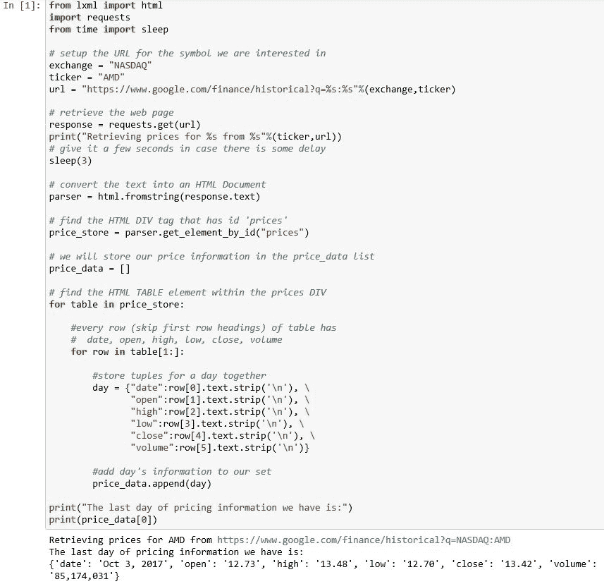
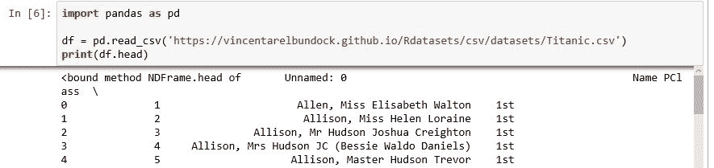
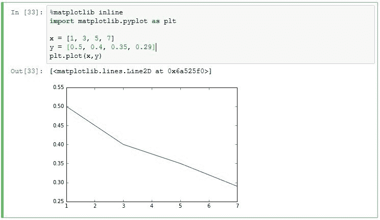
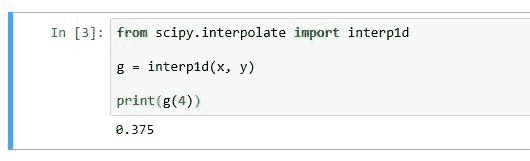
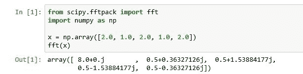
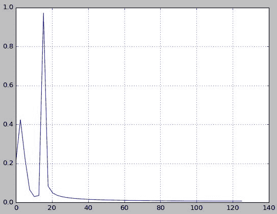
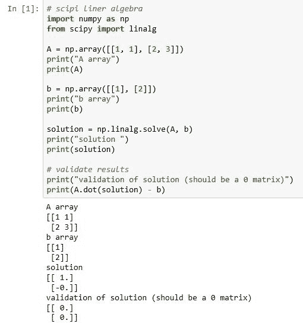
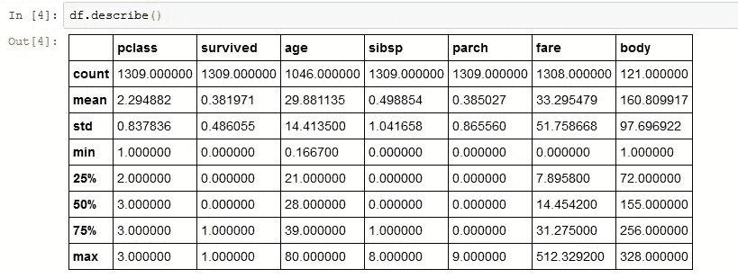
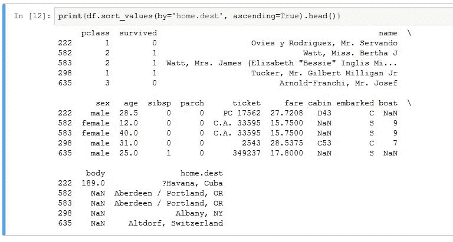

# 二、使用Jupyter分析数据

Jupyter 不做任何繁重的数据分析工作:所有的工作都由用特定语言编写的程序来完成。Jupyter 提供了运行各种编程语言模块的框架。因此，我们可以选择如何在 Jupyter 中分析数据。

数据分析编程的一个流行选择是 Python。Jupyter 确实完全支持 Python 编程。我们将着眼于各种可能对这样一个支持系统造成负担的编程解决方案，并看看 Jupyter 如何公平。


# 用 Python 笔记本收集数据

数据分析的常用工具是从公共来源(如网站)收集数据。Python 擅长抓取网站数据。在这里，我们看一个从 Google Finance 数据加载股票价格信息的例子。

特别是，给定一个股票代码，我们希望检索该代码去年的价格范围。

谷歌财经网站上的一个页面将给出一家证券公司过去几年的价格数据。例如，如果我们对**高级微设备** ( **和**)的价格感兴趣，我们将输入以下 URL:

[https://www.google.com/finance/historical?q=NASDAQ:AMD](https://www.google.com/finance/historical?q=NASDAQ:AMD)

这里，`NASDAQ`是承载 AMD 证券的证券交易所。在生成的 Google 页面上，有一个感兴趣的数据点的表格，如下面的部分截图所示。

像你将尝试访问的许多网站一样，页面上也有许多其他信息，如页眉、页脚和广告，正如你在下面的截图中看到的。网页是为人类读者建立的。幸运的是，谷歌和其他公司意识到你在抓取他们的数据，并保持数据的格式不变，所以你不必改变脚本。


请注意，如果您过于频繁地访问网站，您可能会被阻止访问某个页面或整个网站。频率是一个与你访问的特定网站讨论的问题。再说一次，网站知道你在抓取，只要不影响正常的人类网络流量，他们就不会介意。

网页上有一个清晰表格。如果我们查看用于生成网页的底层 HTML，我们会发现许多页眉、页脚和侧栏信息，但更重要的是，我们会发现一个 id 为`price_data`的 HTML `div`标签。在这个`div`标签中，我们看到一个 HTML 表，其中每一行都有屏幕上显示的数据的值`date`、`opening price`、`high`、`low`、`close`和`volume`。

我们可以使用一个标准的 Python 库包`lxml`，将网页文本加载并解析成我们可以使用的 HTML Python 组件。

然后，对于每天的数据，我们提取列信息并将其添加到我们的数据列表中。

通常，您可以每天运行一次该脚本，并将最新一天的信息存储在本地数据库中，以供进一步分析。在我们的例子中，我们只是在屏幕上打印出最后一天的值。

使用的 Python 脚本如下:

```jl
from lxml import html import requests from time import sleep # setup the URL for the symbol we are interested in exchange = "NASDAQ" ticker = "AMD" url = "https://www.google.com/finance/historical?q=%s:%s"%(exchange,ticker) # retrieve the web page response = requests.get(url) print ("Retrieving prices for %s from %s"%(ticker,url)) # give it a few seconds in case there is some delay sleep(3) # convert the text into an HTML Document parser = html.fromstring(response.text) # find the HTML DIV tag that has id 'prices' price_store = parser.get_element_by_id("prices") # we will store our price information in the price_data list price_data = [] # find the HTML TABLE element within the prices DIV for table in price_store:
 #every row (skip first row headings) of table has #  date, open, high, low, close, volume for row in table[1:]: #store tuples for a day together day = {"date":row[0].text.strip('\n'), \ "open":row[1].text.strip('\n'), \ "high":row[2].text.strip('\n'), \ "low":row[3].text.strip('\n'), \ "close":row[4].text.strip('\n'), \ "volume":row[5].text.strip('\n')}        #add day's information to our set
 price_data.append(day) print ("The last day of pricing information we have is:") print (price_data[0])
```

在 Jupyter 控制台中运行这个脚本，我们看到如下部分屏幕截图所示的结果:



# 在 Jupyter 中使用重型数据处理功能

Python 有几组处理函数，会消耗计算机系统的能力。让我们在 Jupyter 中使用其中一些，并确定功能是否如预期的那样执行。


# 在 Jupyter 中使用 NumPy 函数

NumPy 是 Python 中的一个包，为数组处理提供多维数组和例程。我们使用`import * from numpy`语句引入 NumPy 包。特别是，NumPy 包定义了`array`关键字，引用了一个具有广泛功能的 NumPy 对象。

NumPy 数组处理函数既有普通的函数，如`min()`和`max()`函数(提供数组维数的最小值和最大值)，也有更有趣的实用函数，用于生成直方图和使用数据框的元素计算相关性。

使用 NumPy，您可以以多种方式操作数组。例如，我们将使用下面的脚本来检查这些函数，其中我们将使用 NumPy 来:

*   创建一个数组
*   计算数组中的最大值
*   计算数组中的最小值
*   确定第二个轴上的总和

```jl
# numpy arrays
import numpy as np

# create an array 'a' with 3 3-tuples
a = np.array([[1, 1, 2], [3, 5, 8], [13, 21, 34]])
print("Array contents", a)

# determine the minimum value in array
print("max value = ", a.max())

# max value in array
print("min value = ", a.min())

# sum across the 2nd axis  
print("sum across 2nd axis", a.sum(axis = 1))
```

如果我们将这个脚本转移到 Python 笔记本中，当我们执行单元格时，我们会看到如下显示:


我们可以使用下面的脚本通过更有趣的`histogram`和`correlate`函数来处理数组:

```jl
import numpy as np
import random

# build up 2 sets of random numbers

# setup empty array 2 columns, 1000 rows
numbers = np.empty([2,1000], int)

# set seed so we can repeat results
random.seed(137)

# populate the array
for num in range(0, 1000):
 numbers[0,num] = random.randint(0, 1000)
 numbers[1,num] = random.randint(0, 1000)

# produce a histogram of the data
(hist, bins) = np.histogram(numbers, bins = 10, range = (0,1000))
print ("Histogram is ",hist)

# calculate correlation between the 2 columns

corrs = np.correlate(numbers[:,1], numbers[:,2], mode='valid')
print ("Correlation of the two rows is ", corrs)  
```

在这个脚本中，我们是:

*   用随机数填充两列数组
*   生成 100 点范围内两列值的直方图
*   最后，确定两列之间的相关性(应该是非常高的相关性)

在 Jupyter 笔记本中输入这个脚本并执行单元格后，我们得到如下输出。桶的大小非常接近是有道理的:


# 在Jupyter上使用Pandas

pandas 是 Python 中可用的高性能数据分析工具的开源库。特别感兴趣的是以下功能:

*   读取文本文件
*   读取 Excel 文件
*   从 SQL 数据库读取
*   对数据帧进行操作


# 在 jupiter 中使用Pandas阅读文本文件

包含分析数据的最常见文本文件类型是 CSV 文件。互联网上有各种各样的这种格式的数据集。我们将查看在[网站上找到的泰坦尼克号幸存者数据。](https://vincentarelbundock.github.io/Rdatasets/csv/datasets/Titanic.csv)

像大多数Pandas一样，函数调用非常容易使用:

```jl
import pandas as pd
df = pd.read_csv ('https://vincentarelbundock.github.io/Rdatasets/csv/datasets/Titanic.csv')
print (df.head)  
```

然而，同样像许多Pandas一样，有一组广泛的可选参数可以传递给`read_csv`函数，这些参数默认为最常用的特性，因此我们可以像以前一样编写小代码来完成我们的工作。我们可以使用的一些附加参数允许我们:

*   跳过行
*   跳过/定义列标题
*   和更改索引字段(Python 总是希望在数据框中保留一个主索引字段以加快访问速度)

Jupyter 下的脚本执行结果如下图所示。(注意，我只使用`head`函数打印表格的第一行和最后 30 行):



# 用Pandas在 jupiter 中读取 excel 文件

同样，我们可以轻松地加载 Microsoft Excel 文件。例如，相同的 Titanic 数据集的 Excel 文件可在`vandebilt.edu`获得(以下脚本中的完整链接)。我们有以下脚本:

```jl
import pandas as pd
df = pd.read_excel('http://biostat.mc.vanderbilt.edu/wiki/pub/Main/DataSets/titanic3.xls')
print (df.head)  
```

还有一组用于读取 Excel 文件的可选参数，例如:

*   在 excel 文件中选择要读取的工作表
*   跳过行
*   指定 NA 值的处理

Jupyter下的合成气流如下。数据集看起来与之前读入的 CSV 文件非常相似。


# 使用 pandas 处理数据框

一旦我们有了可用的数据框架，就有几只Pandas可以进一步处理数据。我们将通过观察Pandas来:

*   `groupby`功能
*   操纵列
*   计算异常值


# 在数据框中使用 groupby 函数

`groupby`函数可用于对数据框中符合您的标准的记录数量进行分组(和计数)。

继续我们的泰坦尼克号数据集，我们可以使用`groupby`按年龄统计人数。

我们可以使用以下脚本:

```jl
# read in the titanic data set
import pandas as pd
df = pd.read_excel('http://biostat.mc.vanderbilt.edu/wiki/pub/Main/DataSets/titanic3.xls')
# extract just the age column to its own dataset, 
# group by the age, and
# add a count for each age
ages = df[['age']].groupby('age')['age'].count()
print (ages)  
```

Jupyter 下的结果显示如下。我没有意识到船上有这么多婴儿。


# 操作数据框中的列

一个有趣的列操作是排序。我们可以使用`sort_values`函数对之前的年龄统计数据进行排序，以确定船上旅行者最常见的年龄。

脚本如下:

```jl
import pandas as pd
df = pd.read_excel('http://biostat.mc.vanderbilt.edu/wiki/pub/Main/DataSets/titanic3.xls')
# the [[]] syntax extracts the column(s) into a new dataframe
# we groupby the age column, and 
# apply a count to the age column
ages = df[['age']].groupby('age')['age'].count()
print("The most common ages")
print (ages.sort_values(ascending=False))  
```

最终的 Jupyter 显示如下。从数据来看，船上有许多年轻的旅行者。有鉴于此，也就更有理由解释为什么会有这么多婴儿。


# 计算数据框中的异常值

我们可以使用标准计算来计算异常值，即平均值之差的绝对值是否大于标准偏差的 1.96 倍。(假设数据呈正态高斯分布)。

例如，使用之前加载的相同泰坦尼克号数据集，我们可以根据年龄确定哪些乘客是异常值。

Python 脚本如下所示:

```jl
import pandas as pd

df = pd.read_excel('http://biostat.mc.vanderbilt.edu/wiki/pub/Main/DataSets/titanic3.xls')

# compute mean age
df['x-Mean'] = abs(df['age'] - df['age'].mean())

# 1.96 times standard deviation for age
df['1.96*std'] = 1.96*df['age'].std()

# this age is an outlier if abs difference > 1.96 times std dev
df['Outlier'] = abs(df['age'] - df['age'].mean()) > 1.96*df['age'].std()

# print (results)
print ("Dataset dimensions", df.count)
print ("Number of age outliers", df.Outlier.value_counts()[True])  
```

根据朱庇特的研究结果显示:

```jl
Number of age outliers 65  
```

因此，假设有大约 1300 名乘客，我们有大约 5%的异常值，这意味着年龄可能呈正态分布。


# 在 jupiter 中使用 scipy

SciPy 是一个数学、科学和工程的开源库。由于范围如此之广，我们可以使用 SciPy 探索许多领域:

*   综合
*   最佳化
*   插入文字
*   傅立叶变换
*   线性代数
*   还有其他几组功能，比如信号处理


# 在 jupiter 中使用 scipy 集成

一个标准的数学过程是积分一个方程。SciPy 使用回调函数来迭代计算函数的积分，从而实现这一点。例如，假设我们想要确定以下方程的积分:


我们将使用如下所示的脚本。我们使用标准`math`包中*π*的定义。

```jl
from scipy.integrate import quad
import math

def integrand(x, a, b):
 return a*math.pi + b

a = 2
b = 1
quad(integrand, 0, 1, args=(a,b))
```

同样，这种编码非常简洁，但在许多语言中几乎不可能做到。在 Jupyter 中运行这个脚本，我们很快看到了结果:


我很好奇在执行过程中如何使用`integrand`函数。我用这个来练习一个回叫功能。为了查看这一工作，我在脚本中添加了一些调试信息，我们在其中计算迭代发生的次数，以及每次调用时显示的值:

```jl
from scipy.integrate import quad
import math

counter = 0
def integrand(x, a, b):
 global counter
 counter = counter + 1
 print ('called with x=',x,'a = ',a,'b = ', b)
 return a*math.pi + b

a = 2
b = 1
print(quad(integrand, 0, 1, args=(a,b)))
print(counter)
```

我们在全局级别使用计数器，因此当在`integrand`函数内部引用时，我们使用`global`关键字。否则，Python 假设它是函数的局部变量。

结果如下:


该函数被调用了 21 次以缩小解的范围。


# 在 jupiter 中使用 scipy 优化

通过优化，我们希望确定一个函数在几个变量上的最大值或最小值。所以，让我们用一个有有趣曲线的方程:


如果我们得到这条曲线，并绘制它，看看是否有一个明显的最小值，我们可以使用如下的脚本生成一个图作为结果。(`%mathplotlib inline`使图形显示在 Jupyter 会话中，而不是在新窗口中创建图形。)

```jl
%matplotlib inline
from scipy import optimize
import matplotlib.pyplot as plt
import numpy as np

def f(x):
 return x**4 - x**3 + x**2 + 1

x = np.linspace(-100, 50, 100)
plt.plot(x, f(x));  
```

在 Jupyter 中运行这个脚本，我们看到在 *x = 0* 有一个自然最小值。


# 在 jupiter 中使用科学插值

通过插值，我们可以猜测给定一组离散点的函数值。例如，假设您的测试结果显示如下:

```jl
%matplotlib inline
import matplotlib.pyplot as plt

x = [1, 3, 5, 7]
y = [0.5, 0.4, 0.35, 0.29]
plt.plot(x,y)
```



在这种情况下，当 *x* 为`4`时，我们可以使用如下脚本对函数的结果进行插值:

```jl
from scipy.interpolate import interp1d 
g = interp1d(x, y) 
print (g(4)) 
```

这就给了我们`0.375`的结果，听起来是正确的。



# 在Jupyter中使用科学的傅立叶变换

SciPy 中有一组用于 **FFT** ( **傅立叶变换**)的函数。考虑到需要进行的处理量，它们很容易使用。

我们可以使用如下编码来执行 FFT:

```jl
from scipy.fftpack import fft import numpy as np x = np.array([2.0, 1.0, 2.0, 1.0, 2.0]) fft(x) 
```

这里，我们有一个小数据集要分析。数据点代表我们必须评估的一个小信号集。当在 Jupyter 下拍摄时，我们得到如下显示:



注意，即使对于这一小组数据，转换操作也要忙上几秒钟。

我们也可以使用生成的数据集，如下面的代码所示:

```jl
from scipy.fftpack import fft import numpy as np
# how many points n = 100 spacing = 1.0 / 250.0 x = np.linspace(0.0, n*spacing, n) y = np.sin(30.0 * np.pi * x) + 0.5 * np.sin(7.0 * np.pi * x) yf = fft(y) xf = np.linspace(0.0, 1.0/(2.0*spacing), n//2)
#plot the data to get a visual import matplotlib.pyplot as plt plt.plot(xf, 2.0/n * np.abs(yf[0:n//2])) plt.grid() plt.show()
```

在 Jupyter 下运行此脚本会在新屏幕中生成数据点的图形:



这看起来符合我们的预期，显示中有一个大的和一个小的波浪。


# 在 jupiter 中使用 scipy 线性代数

有一套完整的线性代数函数可用。例如，我们可以用如下步骤求解线性系统:

```jl
import numpy as np from scipy import linalg
A = np.array([[1, 1], [2, 3]]) print ("A array") print (A)
b = np.array([[1], [2]]) print ("b array") print (b)
solution = np.linalg.solve(A, b) print ("solution ") print (solution)
# validate results print ("validation of solution (should be a 0 matrix)") print (A.dot(solution) – b)
```

这里，Jupyter 下的输出如下所示:



我们用最终的 0 矩阵来验证结果。


# Jupyter 中Pandas数据框的扩展

与我们目前使用的函数相比，还有更多用于处理数据框的内置函数。如果我们从本章前面的示例中选取一个数据帧，即 Excel 文件中的泰坦尼克号数据集，我们可以使用附加函数来帮助描绘和处理数据集。

作为重复，我们使用脚本加载数据集:

```jl
import pandas as pd
df = pd.read_excel('http://biostat.mc.vanderbilt.edu/wiki/pub/Main/DataSets/titanic3.xls')
```

然后我们可以使用`info`功能检查数据帧，该功能显示数据帧的特征:

```jl
df.info()  
```


一些有趣的观点如下:

*   1309 个条目
*   14 列
*   在`body`列中没有多少字段包含有效数据——大多数都丢失了
*   确实很好地概述了所涉及的数据类型

我们还可以使用`describe`函数，它给出了数据框中数字列的统计细目。

```jl
df.describe()  
```

这会产生以下表格显示:



对于每个数字列，我们有:

*   数数
*   平均
*   标准偏差
*   25、50 和 75 个百分点
*   项目的最小、最大值

我们可以使用语法`df[12:13]`分割感兴趣的行，其中第一个数字(默认为数据框中的第一行)是要分割的第一行，第二个数字(默认为数据框中的最后一行)是要分割的最后一行。

运行这个切片操作，我们得到了预期的结果:


因为当我们从一个数据框中选择列时，我们实际上是在创建一个新的数据框，所以我们也可以对其使用`head`函数:


# 在 Jupyter/IPython 中排序和过滤数据帧

数据框允许您使用数据框本身的现有功能，自动轻松地对所涉及的数据集进行排序和过滤。


# 过滤数据帧

我们可以根据标准选择/过滤特定的行(使用相同的 Titanic 数据框架):

```jl
print(df[df.age < 5])  
```

这意味着我们查看数据框并选择人的年龄低于五岁的行。(同样，这是在创建一个可以根据需要进行操作的新数据框。)


考虑到这一点，您几乎可以对数据框应用任何过滤器。然后，您可以选择一个数据框的一部分，并与另一个数据框的一部分合并/连接。很快，您就会得到可以在数据库表上执行的类似 SQL 的操作。从这个角度来看，您可以进行比基础数据框中更广泛的数据操作。


# 对数据帧进行排序

在大多数语言中，排序意味着重新组织您正在处理的数据集。在数据框中，排序可以通过选择另一个索引来访问数据框来完成。所有数据帧都从 NumPy 内置的基本增量行索引开始。您可以更改用于访问数据框的索引，并按照您想要的方式对数据框进行有效排序。

如果我们查看(Titanic)数据框的显示，我们会注意到未命名的第一列序数值:


如果我们要为数据帧指定另一个索引，我们将根据该索引对数据帧进行排序。例如:

```jl
df.set_index('name').head()
```


请记住，由于我们没有分配这个新的数据框(名称为 index ),因此我们仍然拥有完整的原始数据框。

按照上一节的思路，实际上也可以使用`sort_values`方法对数据帧执行排序操作。例如，如果我们要使用以下脚本:

```jl
print(df.sort_values(by='home.dest', ascending=True).head())  
```

该脚本获取数据帧，按照`home.dest`列以升序对其进行排序，并打印前五条记录(按照该顺序)

我们将看到如下结果:




# 摘要

在本章中，我们看了一些可能在 Jupyter 中执行的计算密集型任务。我们使用 Python 抓取了一个网站来收集数据进行分析。我们使用 Python NumPy、pandas 和 SciPy 函数对结果进行深入计算。我们进一步研究了Pandas，探索了操纵数据帧的方法。最后，我们看到了排序和过滤数据帧的例子。

在下一章，我们将做一些预测，并使用可视化来验证我们的预测。