# 六、数据整理

在这一章中，我们看几种不同形式的数据，并窥探有用的统计数据。访问数据的工具已经得到很好的开发，并允许数据在一些记录中缺少标题或数据点。


# 读取 CSV 文件

文件格式的标准之一是 CSV。在本节中，我们将逐步完成读取 CSV 并调整数据集的过程，以得出关于数据的一些结论。我使用的数据来自加州房屋供暖系统选择数据集，位于[https://vincentarelbundock . github . io/rdata sets/datasets . html](https://vincentarelbundock.github.io/Rdatasets/datasets.html):

```jl
#read in the CSV file as available on the site
heating <- read.csv(file="Documents/heating.csv", header=TRUE, sep=",")
# make sure the data is laid out the way we expect
head(heating)  
```

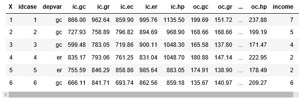

数据似乎和预期的一样；但是，许多列都有缩写名称，有些重复。让我们更改感兴趣的名称，使其更具可读性，并删除我们不打算使用的多余名称:

```jl
# change the column names to be more readable
colnames(heating)[colnames(heating)=="depvar"] <- "system"
colnames(heating)[colnames(heating)=="ic.gc"] <- "install_cost"
colnames(heating)[colnames(heating)=="oc.gc"] <- "annual_cost"
colnames(heating)[colnames(heating)=="pb.gc"] <- "ratio_annual_install"

# remove columns which are not used
heating$idcase <- NULL
heating$ic.gr <- NULL
heating$ic.ec <- NULL
heating$ic.hp <- NULL
heating$ic.er <- NULL
heating$oc.gr <- NULL
heating$oc.ec <- NULL
heating$oc.hp <- NULL
heating$oc.er <- NULL
heating$pb.gr <- NULL
heating$pb.ec <- NULL
heating$pb.er <- NULL
heating$pb.hp <- NULL

# check the data layout again now that we have made changes
head(heating)  
```


现在我们有了一个更紧凑的数据集，让我们开始查看数据:

```jl
# get rough statistics on the data
summary(heating)  
```

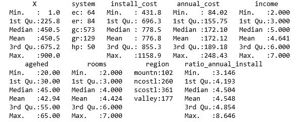

总结中突出了一些要点:

*   有五种不同类型的加热系统，气体冷却是最普遍的
*   成本变化比预期大得多
*   这些数据涵盖了加州的四大区域
*   年成本与初始成本的比率变化比预期的要大得多

数据关系可能是什么并不明显，但是我们可以使用 R `plot()`函数来提供一个快速快照，显示任何有意义的东西:

```jl
plot(heating)  
```


几个有趣的事实再次凸显出来:

*   不同类型系统的初始成本差异很大
*   每年的费用也因系统类型而异
*   成本在客户收入、年龄、房间数量和地区的范围内变化很大

变量之间唯一的直接关系似乎是系统的初始成本和年成本。对于协方差，我们正在寻找两个变量相对于彼此变化多少的度量。如果我们计算安装成本和年度成本之间的协方差，我们会得到:

```jl
cov(heating$install_cost, heating$annual_cost) 
2131  
```

我不确定我见过更高的协方差结果。


# 读取另一个 CSV 文件

我们可以查看同一数据集中的另一个 CSV，看看我们遇到了什么样的问题。使用我们以前从同一网站下载的所有大联盟棒球运动员的年度击球记录，我们可以使用如下代码开始分析数据:

```jl
players <- read.csv(file="Documents/baseball.csv", header=TRUE, sep=",")head(players) 
```

这将产生以下头部显示:


这个数据集中有很多棒球运动员的统计数据。还有很多`NA`值。r 很擅长忽略`NA`值。让我们先来看看数据的统计数据，使用:

```jl
summary(players)
```

这将生成所有相关字段的统计信息(还有几个字段没有显示在此处):


在前面的显示中可以看到许多有趣的点，值得注意:

*   我们每个球员大约有 30 个数据点
*   有趣的是球员数据可以追溯到 1871 年
*   每个团队大约有 1000 个数据点
*   美国联赛和全国联赛显然更受欢迎
*   一些数据点的范围令人惊讶:
    *   蝙蝠的数量从 0 到 700 不等
    *   游程(r)的范围从 0 到 177
    *   命中次数(h)范围从 0 到 257

如果我们只绘制一些主要数据点，我们可以看到以下内容:

```jl
plot(players$h, type="l", col="blue")
# doubles lines(players$X2b, type="l", col="yellow")
# home runs lines(players$hr, type="l", col="green")
# triples lines(players$X3b, type="l", col="red")
# Create a title with a red, bold/italic font title(main="Hits", font.main=4)#, xlab="Players", ylab="Hits and Home Runs")
```

统计图表按此顺序显示，以便较小的值不会被较大的值覆盖(例如，命中数(最大的数字)首先显示，三元组(最小的数字)最后显示在前面数字的顶部)。

我们有一个随着时间的推移玩家点击类型的显示如下。

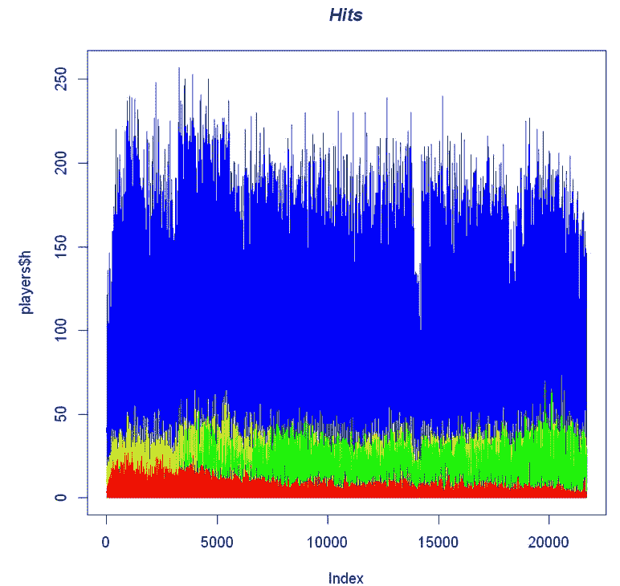

我觉得很有意思，三分球打中的很少。此外，由于数据是按时间顺序组织的，一段时间以来，命中的三元组数量一直在减少。也许重点在于击球，而不是击球来获得三垒打。


# 使用 dplyr 操作数据

R 的`dplyr`包被描述为提供数据操作语法的包。它拥有你所期望的入口点，可以让你在一个包中处理数据框。我们将针对本章前面使用的棒球运动员统计数据使用`dplyr`包。

我们读入球员数据并显示前几行:

```jl
players <- read.csv(file="Documents/baseball.csv", header=TRUE, sep=",") head(players)
```

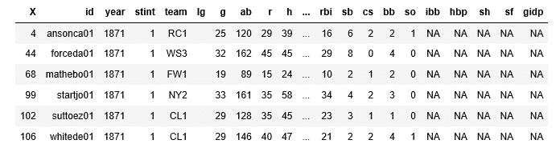

我们将使用`dplyr`包，因此我们需要将包放入笔记本:

```jl
library(dplyr)
```


# 将数据框转换为 dplyr 表

`dplyr`包具有将数据对象转换成`dplyr`表的功能。一个`dplyr`表以一种紧凑的格式存储数据，使用更少的内存。大多数其他`dplyr`功能也可以直接在桌子上操作。

我们可以使用以下方法将数据框转换为表格:

```jl
playerst <- tbl_df(players) playerst  
```

这导致非常相似的显示模式:

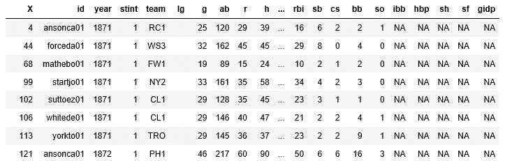

# 快速了解数据值范围

`dplyr`中的另一个可用功能是`glimpse()`功能。它获取每一列并显示该变量的值的范围。我们以下列方式使用该函数:

```jl
glimpse(playerst)  
```

这有如下显示:

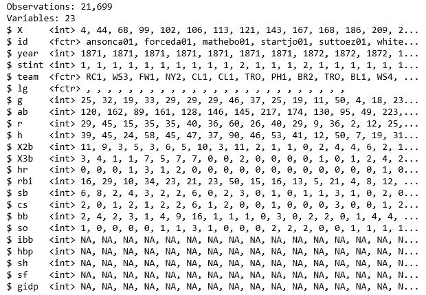

除了一组`summary` / `head`显示之外，我想我喜欢这个，因为你可以感受到所涉及的变量而不是所涉及的行，反转数据集。


# 对数据集进行采样

`dplyr`包有一个从数据集`sample()`中收集样本的函数。您可以传入要操作的数据集和要抽取的样本数量`sample_n()`，以及分数百分比`sample_frac()`，如下例所示:

```jl
data <- sample_n(players, 30) glimpse(data)
```

我们看到的结果如下图所示:


请注意，按照要求，结果集中有 30 个观察值。


# 过滤数据框中的行

我们可以使用的另一个函数是`filter`函数。`filter`函数以一个数据帧作为参数和过滤语句。该函数会遍历数据框的每一行，并返回符合过滤语句的那些行:

```jl
#filter only players with over 200 hits in a season over200 <- filter(players, h > 200) head(over200) nrow(over200)
```

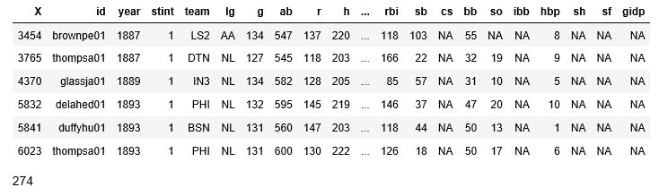

看起来许多球员一个赛季能打出 200 支安打。如果我们看看那些在一个赛季中也能获得超过 40 个本垒打的球员，会怎么样？

```jl
over200and40hr <- filter(players, h > 200 & hr > 40) head(over200and40hr) nrow(over200and40hr)
```


这是一个很小的列表。我知道球员的名字有些混乱，但是你可以认出一些，比如贝比·鲁斯。

我想知道是否有球员在一个赛季中击球超过 300 次。

```jl
filter(players, h > 300)
```


有趣的是，没有记录符合我们的`filter`，但是结果处理器需要许多列，并抛出一个错误，因为在本例中没有记录。通常，R 中的错误是由于编程错误。对于我认为正常的无结果数据，R 产生错误是不寻常的。


# 向数据框添加列

使用您在别处看到的熟悉的 R 编程语法，`mutate`函数可用于向数据框添加一列。在这种情况下，我们在数据框中添加一列，其中包含玩家击球时击中的百分比:

```jl
pct <- mutate(players, hitpct = h / ab) head(pct)
```


您可以在前面的显示中看到右边的新列。如果我们运行一个`summary`，我们将得到所有字段的摘要(包括新的`hitpct`):

```jl
summary(pct)
```


随着最大值在`1.0`，这将意味着一些球员每次击球时都会击中。同样的，那些带有`0.0`的从来没有击中过。看起来是 20%区域的窄幅波动。假设`1.0`是一次击球和一次击中，因为所有其他值都以多位小数点计量。


# 获取计算字段的摘要

我们可以使用`summarize`函数更直接地获得该列的汇总值。该函数采用数据框和单一计算结果。使用如下脚本，我们可以看到相同的结果:

```jl
summarize(pct, mean(hitpct, na.rm = TRUE))
```


# 函数间的管道数据

我们可以通过*管道*函数之间的数据来获得相同的结果。在 R 编程中，管道用符号`%>%`表示。它可从`magrittr`包装中获得。管道符号通常被认为是英语中*和*的同义词。例如，R 语句`data %>% function()`意味着获取数据对象，然后将其传递给`function()`，就像我们输入了语句`function(data)`一样。

要使用管道在计算字段上生成相同的汇总，我们将编写以下内容(即获取`pct`数据集，然后将其管道传输到`summarize`函数，获取`hitpct`字段，然后将其管道传输到均值函数):

```jl
library(magrittr) pct %>% summarize(hitpct %>% mean(na.rm = TRUE))
```


# 获得 99%的分位数

我们可以使用`quantile()`功能查看 99%标记的截止值。使用相同的样本数据，我们可以使用:

```jl
quantile(pct$hitpct, probs = 0.99, na.rm = TRUE)
```

这将有相应的输出:

```jl
99%: 0.470588235294118
```

因此，47%的命中率是 99%数据水平的临界值。假设四分之三百分位是 28%(如前面的`hitpct`图所示)，那么最后一个季度的数据点有相当大的表现范围——也就是说，有一些伟大的棒球运动员。

我们可以使用以下方法获得命中率前 25%的玩家列表:

```jl
top_players <- filter(pct, hitpct > 0.47) top_players <- top_players[order(top_players$hitpct) , ] head(top_players) nrow(top_players) 198
```

如果球员按命中率降序排列，那么会显示命中率完美的球员，但他们的击球次数都低于 10 次。

我们可以看到如下数据点:

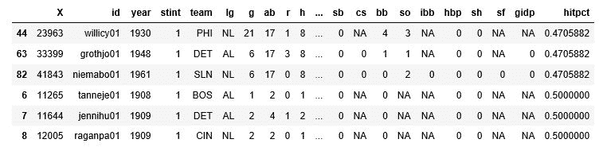

因此，我们有 200 名(`198`)玩家在我们数据集的前 25%中，这意味着 1%的玩家在热门表现的前 25%中。我没想到数据会如此不平衡。


# 获取分组数据的摘要

好的，前面的步骤告诉我们一些关于个体玩家的事情。总有这样的说法，团队 *X* 总是比其他人强。如果我们能得到每个团队的命中率并比较结果会怎么样？

在本例中，我们按团队对球员进行分组，然后计算整个团队的平均命中率:

```jl
teamhitpct <- summarize(group_by(pct, team), mean(hitpct, na.rm = TRUE)) names(teamhitpct) <- c("team", "hitpct") summary(teamhitpct)
```


那么，谁是有史以来最好的球队？我们可以按照团队的命中率对数据进行排序(`-teamhitpct`子句意味着结果应该按照降序排列),使用:

```jl
teamhitpct <- teamhitpct[order(-teamhitpct$hitpct) , ] head(teamhitpct)
```

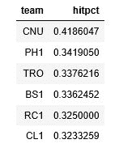

我不确定 CNU 团队是什么；我想这是早期的芝加哥队。其他的城市有费城、多伦多和波士顿。

我们可以使用之前用于玩家命中率表现的`quantile`函数找到排名前百分之一的球队:

```jl
quantile(teamhitpct$hitpct, probs = 0.99) 
```

这给了我们以下结果:

```jl
99%: 0.340577141193618
```

与前面的表格相比，我们可以看到只有两个团队(130 个中)处于最高性能组(大约是 1%的标志)。


# 用 tidyr 整理数据

`tidyr`包可用于清理/整理您的数据集。`tidyr`的用途是重新排列您的数据，以便:

*   每一列都是一个变量
*   每一行都是一个观察

当数据以这种方式排列时，分析就变得容易多了。有许多已发布的数据集将列和行与值混合在一起。如果您在现场使用这些数据，那么您必须相应地调整它们。

`tidyr`提供三种清理数据的功能:

*   `gather`
*   `separate`
*   `spread`

`gather()`函数获取您的数据并将数据排列成键值对，很像 Hadoop 数据库模型。让我们使用以下日期的股票价格的标准示例:

```jl
library(tidyr)
stocks <- data_frame(
 time = as.Date('2017-08-05') + 0:9, X = rnorm(10, 20, 1), #how many numbers, mean, std dev Y = rnorm(10, 20, 2), Z = rnorm(10, 20, 4) )
```

这将生成如下所示的数据:


每一行都有时间戳和当时三只股票的价格。

我们首先使用`gather()`来分离股票的键值对。使用要处理的数据框、输出列名和要忽略的列来调用`gather()`函数(`-time`)。因此，我们使用下面的代码得到一行不同的时间、股票和价格:

```jl
stocksg <- gather(stocks, stock, price, -time) head(stocksg)  
```

这将生成以下`head()`显示:

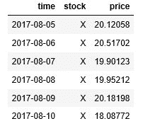

`separate()`函数用于分离相同入口点中的值。

我们将使用道琼斯指数关于 UCI 工业价格的历史([https://archive.ics.uci.edu/ml/datasets/Dow+Jones+Index](https://archive.ics.uci.edu/ml/datasets/Dow+Jones+Index)):

```jl
dji <- read.csv("Documents/dow_jones_index.data") dj <- dji[,c("stock","date","close")] summary(dj) head(dj)
```

我们只对`stock`、`date`和`close`列感兴趣。

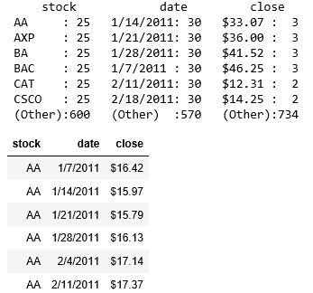

因此，我们已经收集了数据(如果我们有杂乱无章的数据，我们会使用`gather`来组织它)。

`spread()`函数将获取键值对(来自`gather()`函数),并将值分成多列。我们使用包含源日期、用于列的值以及每个日期/列的数据点的数据框架来调用`spread()`。继续我们的示例，我们可以使用以下公式按日期展开所有证券:

```jl
prices <- dj %>% spread(stock, close) summary(prices) head(prices)  
```

这将导致以下`summary`显示(缩短为前几个证券):


它还会导致以下`head`显示，按日期显示所有证券的价格:

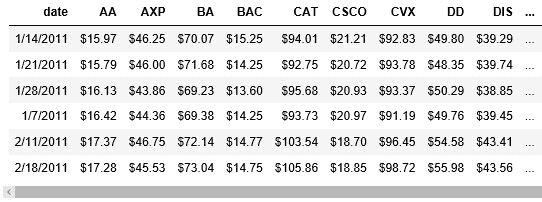

我们也可以用类似的方法重新组织数据，在每行中列出一只股票的所有价格，使用:

```jl
times <- dj %>% spread(date, close) summary(times) head(times)  
```

这里，我们的行驱动因素是股票，列标题是日期值，每个股票/日期的数据点是该日证券的收盘价。

从`summary`(略)中，我们可以看到以下内容:

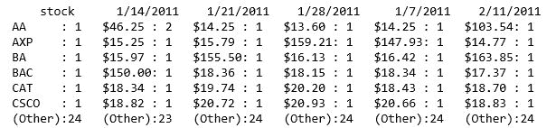

以下是以我们期望的格式显示数据的`head`示例:

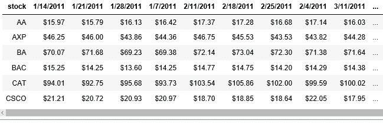


# 摘要

在本章中，我们读入 CSV 文件并对数据进行快速分析，包括帮助理解数据的可视化。接下来，我们考虑了`dplyr`包中可用的一些函数，包括绘制数据项范围的一瞥、对数据集进行采样、过滤掉数据、使用 mutate 添加列以及生成摘要。在这样做的同时，我们也开始使用管道来更容易地将一个操作的结果传输到另一个操作中。最后，我们研究了`tidyr`包，使用相关的收集、分离和传播函数将数据整理成不同的列和观察值。

在下一章，我们将看看在 Jupyter 下制作一个仪表板。