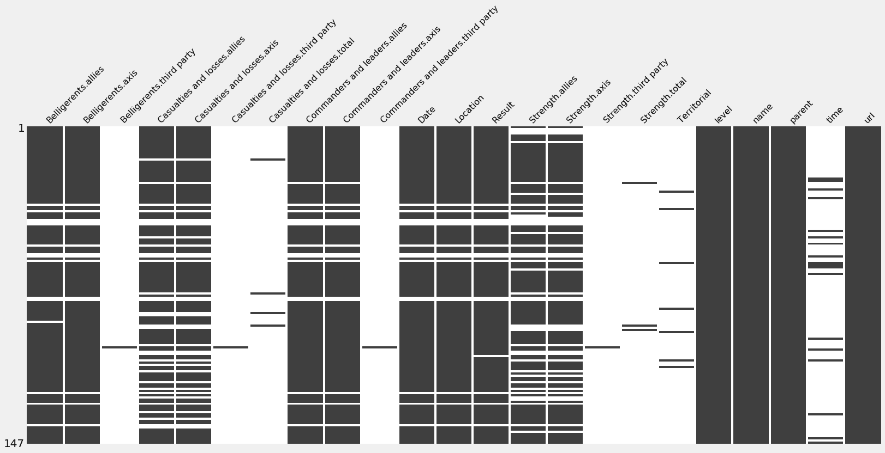

        

# 十一、数据清理和操作

在我们开始数据分析之前，需要对数据进行适当的准备和结构化。一些数据集，例如结构化的计算机日志，从一开始就准备好了，但是，大多数时候，大部分时间都花在正确准备数据上。这个过程不可避免地需要根据任务的具体情况做出某些决定。

在这一章中，我们将学习如何用`pandas`准备数据，以我们在[第七章](232fe2da-7fa8-4d76-b5fc-d4bf80535e86.xhtml)、*用美汤 4* 从网络上抓取数据从维基百科收集的数据集为例。

我们将在本章中讨论以下主题:

*   从`pandas`快速开始
*   使用真实数据
*   正则表达式
*   使用带有`pandas`数据帧的自定义函数
*   写文件

        

# 技术要求

本章的代码使用了两个包:`pandas`，它包含在默认的 Anaconda 发行版中，以及`missingo`，它包含在`environment.yml`文件中。如果您跳过了`conda`环境创建这一步，只需使用`pip`或`conda`包管理器安装`missingo`。和往常一样，所有的笔记本都存储在资源库中的`Chapter11`文件夹中([https://github . com/packt publishing/Learn-Python-by-Building-Data-Science-Applications](https://github.com/PacktPublishing/Learn-Python-by-Building-Data-Science-Applications))。

        

# 熊猫入门

Pandas 是 Python 中数据操作的工具——它结合了速度和便利，允许快速处理和操作数据。先来概述几个基本操作:`pandas`用起来简单直观，但还是一个学习曲线。

`pandas`有两种主要的数据结构:

1.  `Series`是一种数据类型的一维数组，也有一个索引。索引可以是数字、分类、字符串或日期时间。
2.  `DataFrame`是一个由一组列组成的二维表，每一列都是一种数据类型。`Dataframe`有两个索引——索引和列。`Dataframe`的柱子可以被认为是`Series`。可以将行作为`Series`进行检索，但是在这种情况下，单元格中的数据可能会被转换为一个共享数据类型*对象*(稍后将详细介绍)。

大多数时候，我们从外部来源获取数据:数据库、链接或文件。要在`pandas`中做到这一点，只需使用众多`pd.read_...`函数中的一个，包括但不限于以下:

*   CSV 和 Excel 格式的`pd.read_csv`和`pd.read_excel`。还有`pd.read_html`来读取给定 HTML 页面的表格。
*   用于 SQL 数据库的`pd.read_sql`和`pd.read_sql_table`(第一个期望一个查询作为参数，而第二个将尝试收集整个表)。
*   `pd.read_pickle`、`pd.read_feather`、`pd.read_hdfs`、`pd.read_parque`等等，用于不同的二进制格式。

请注意，这些函数中的大部分不仅支持(如果适用的话)本地路径，还支持 web URLs。此外，它们中的许多可以检测和解压缩归档的文件——例如，`./data.csv.gz`文件将被解压缩并无缝地在内存中读取。

所有前面的函数都有大量的参数。例如，对于`read_excel`，您可以指定使用哪个工作表，对于`read_csv `，将哪一行视为列名(如果有的话)，以及在文件的开头跳过多少行，在文件的结尾删除多少行。您还可以指定将哪些列解析为日期或时间值，以及是否应该将这些列连接在一起；例如，如果一列定义日期，另一列定义时间。

将数据写入文件或数据库就像读取数据一样简单。`pandas`支持所有相同的数据写入格式——可通过多个`df.to_csv`、`df.to_excel`等方式获得。与读取一样，您可以在路径的末尾添加一个归档扩展名，`pandas`将自动检测这些扩展名并使用相应的归档算法。

我们现在知道如何使用`pandas`读写数据。现在我们来谈谈如何选择和编辑值。

        

# 选择–按列、索引或两者

现在，让我们学习如何访问和编辑`pandas`数据结构中的特定值。我们将从一个玩具示例开始—在这里，我将从一个列表字典生成一个数据帧:

```
import pandas as pddata = {'x':[1,2,3], 'y':['a', 'b', 'c'], 'z': [False, True, False]}df = pd.DataFrame(data)
```

现在，我们可以看看刚刚存储的数据:

```
>>> df x   y   z 0   1   a   False1   2   b   True2   3   c   False
```

正如你所看到的，这个框架有三行两列。让我们看看它是如何工作的:

1.  首先，让我们开始选择列。可以通过带有列名的方括号使用索引来选择任何列。当我们请求一列时，它将作为一个`pandas Series`对象返回:

```
>>> df['x'] 1 2 3Name: x, dtype: int ...
```

        

# 掩饰

现在`loc`和简单方括号都接受蒙版。Mask 可以由一个`Series`、一个 NumPy 数组或一个长度与 dataframe 中的行数相同的简单布尔值列表来表示。如果给定，这个集合将被解释为一个**掩码** *—* ，本质上是对返回哪些行的解释。例如，我们可以使用我们的第三列`z`，作为一个屏蔽进行过滤。因为我们在第一行中只有一个`True`值，所以将返回一行的数据帧:

```
>>> df[df['z']]
 x   y   z    new_column
1   2   b   True         -1
```

这是一项非常重要的技术，我们将一直使用它！这种掩码可以使用任何逻辑运算来生成，例如等式运算符。看一看:这里，我们通过检查列`x`中的值是否等于`2`来创建一个掩码:

```
>>> mask = df['x'] == 2
>>> mask
0 False
1 True
2 False
Name:x, dtype:bool
```

这个掩码现在可以用来过滤我们的数据帧或任何其他具有相同索引的数据帧中的行。将只检索第二行，因为掩码系列中只有第二个值为真:

```
>>> df.loc[mask, 'y']1 b
Name: y, dtype: object
```

        

# 数据类型和数据转换

您可能注意到，当我们打印出一个`Series`对象时，它的数据类型将在最后一行声明。另一种方法是为每个`Series`调用`dtype`，或者为整个 dataframe 调用`.dtypes`(它将返回一个`Series`对象)。这些数据类型是用 C 语言定义的，而不是 Python。它们中的大多数在很大程度上与 Python 匹配；例如，整数、浮点数和布尔值。但是，关于数据类型，需要注意一些注意事项:

*   首先，字符串没有现成的数据类型。正如您可能注意到的，在最后一个代码块中，所有的字符串都被定义为*对象*，即一个任意的 Python 对象。这种类型是最后一招，适合任何 Python 值，但没有任何计算优势。...

        

# 数学

当然，数学运算在`pandas`中得到了很好的体现，它积极地利用了 NumPy 的功能，并支持非常广泛的数学和统计功能。要获得数字列的总和、平均值、中值、最大值/最小值或百分位，只需将其调用为列的方法:

```
>>> N = pd.Series([1,2,3,10])

>>> N.mean()
4.0

>>> N.median()
2.5

>>> N.sum()
16

>>> N.max()
10
```

它还支持诸如关联(只需在另一个相同长度的数字列上调用它)等操作。大多数情况下，您可以在数据帧上运行完全相同的函数—在这种情况下，轴(操作方向)将用作参数。默认情况下，所有操作都是垂直运行的——例如，对于`df.sum()`,您将获得一系列求和，原始数据帧中的每一列都有一个求和。与`axis=1`完全相同的操作将汇总每一行，因此您将得到`Series`,数据帧中的每一行都有一个单元格。

        

# 合并

有时，我们需要将多个数据帧连接在一起。可能有不同的方法可以做到这一点——让我们来看看。

首先，如果您有多个具有相同列的数据帧，并且您想要连接它们——永远不要迭代地这样做——尝试做一次，通过将所有数据帧的列表传递给带有`axis=0`和`sort=False`参数的`pd.concat`函数(除非您需要对它们进行排序):

```
>>> df.shape(3, 4)>>> double = pd.concat([df, df], axis=0, sort=False)>>> double.shape(6, 4)
```

类似地，`pd.concat`可以水平合并多个数据帧，如果`axis=1`:

```
>>> pd.concat([df, df], axis=1) x y z     new_column x y z     new_column0 1 a False -1         1 a False -11 2 b True  -1         2 b True  -12 3 c False -1         3 c False -1
```

在本例中，我们将两个分组...

        

# 使用真实数据

现在让我们尝试在真实数据上使用`pandas`。在 `Chapter 7`、*用美汤从网上搜集数据 4* 中，我们收集了二战战役和行动的庞大数据集——包括伤亡人数、军队、日期和地点。但是，我们从来没有探索过数据集里面有什么，通常，这种数据需要密集的处理。现在，让我们看看我们能利用这些数据做些什么。

您可能还记得，我们将数据集存储为嵌套的`.json`文件。`pandas`可以从不同结构的 JSON 文件中读取，但是不会理解嵌套的数据点。此时，我们的任务很简单(例如，您可能会想到编写一个递归函数)，所以我们不会讨论太多。如果你愿意，你可以在以下链接查看 GitHub 上本章文件夹中的`0_json_to_table.ipynb`笔记本:[https://GitHub . com/packt publishing/Learn-Python-by-Building-Data-Science-Applications/tree/master/chapter 11](https://github.com/PacktPublishing/Learn-Python-by-Building-Data-Science-Applications/tree/master/Chapter11)。唯一的新操作是`pandas.io.json.json_normalize`函数，它需要一个字典数组来表示行，并展平它们的嵌套属性，连接键(在我们的例子中，是嵌套的交战方、伤亡、优势和领导元素)。我们将结果数据存储为一组 CSV，代表不同的战场(参见资源库中的`Chapter11/data/...csv`)。请注意，除了取消嵌套之外，没有进行其他处理。

完成后，我们现在可以更仔细地查看我们收集的数据。让我们深入其中一个 CSV 文件，看看我们在处理什么:

```
df = pd.read_csv('./data/Eastern Front.csv')
```

这将读取报告并显示数据。

        

# 初步探索

在做任何事情之前，我们需要看一下数据本身，以及它的列和行。通过理解以下内容开始数据探索是合理的:

1.  例如，使用`df.head(N)`、`df.tail(N)`或`df.sample(N)`从数据集中检索(并打印)前 N 行、后 N 行或随机 N 行，具体的值是什么样的呢？关于头尾，默认情况下， *N = 5* 。对于我们的示例，它是 1(一行)。或者，示例方法可以采用一个`frac`参数，它将返回一部分记录——例如，`df.sample(frac=0.25)`将返回初始数据集的 25%。请注意，如果列太多，打印时会忽略中间的一些列。
2.  数据集的整体形状——数字...

        

# 定义要完成的工作范围

在我们深入数据清理过程(这可能非常耗时)之前，定义工作范围总是有用的——我们实际上需要清理哪些列和行。对于本章，让我们将范围限制在层次结构的最低级别—特定的战斗(`level=100`—没有子事件的页面)。我们可以使用等式运算符来生成布尔掩码，然后使用该掩码来过滤数据集:

```
>>> battles = data[data.level == 100] 
>>> battles.shape
(147, 23)
```

数据集中有很多列——足够让`pandas`在打印时省略中间部分。由于我们将主要关注时间、地理位置、姓名和双方的伤亡人数，因此让我们在一个列表中定义那些感兴趣的列，并更仔细地研究它们:

```
columns = ['Location', 'name', 'Date', 'Result', 'Belligerents.allies', 'Belligerents.axis']
battles[columns].head(3)
```

由于这段代码，我们将得到下表:

|  | `Location` | `Name` | `Date` | `Results` | `Belligerents.allies` | `Belligerents.axis` | `Casualties and losses.allies` | `Casualties and losses.axis` |
| `0` | `Westerplatte, harbor of Free City of Danzig54°...` | `Battle of Westerplatte` | `1–7 September 1939` | `German victory` | `Poland` | `Germany Danzig` | `15 dead at least 40 wounded Remainder captured` | `50 dead at least 150 wounded` |
| `1` | `Mokra, Kielce Voivodeship, Poland` | `Battle of Mokra` | `September 1, 1939` | `Polish victory` | `Germany` | `Poland` | `800 killed, missing, captured, or wounded 50 tanks` | `500 killed, missing or wounded 300 horses sever a...` |
| `2` | `Near Mława, Warsaw Voivodeship, Poland` | `Battle of Mlawa` | `1–3 September 1939` | `German victory` | `Germany` | `Poland` | `1,800 killed 3,000 wounded 1,000 missing 72 tanks..` | `1,200 killed 1,500 wounded` |
| `3` | `Near Tuchola Forest, Pomeranian Voivodeship, P...` | `Battle of Tuchola Forest` | `1–5 September 1939` | `German victory` | `Germany` | `Poland` | `506 killed \n\n743 wounded` | `1600 killed 750 wounded Unknown number cap...` |
| `4` | `Jordanów, Kraków Voivodeship, Poland` | `Battle of Jordanów` | `1–3 September 1939` | `Pyrrhic German victory` | `Poland` | `Germany` | `3+ tanks` | `70+ tanks and AFVs` |

现在，让我们研究一下如果特定列大部分是空的，数据中缺少的值。花时间清理处理是没有意义的。探索缺失值的最好方法是制作一个图表。在`missingno`库的帮助下，这是一个简单的任务。看一下代码:

```
import missingno as msno
msno.matrix(battles, labels=True, sparkline=False)
```

因此，将绘制以下图表:



这里，黑色矩形表示非空值。如您所见，一些自动生成的列(级别、名称、父项和 URL)没有任何遗漏。另一方面，其他一些列确实只有一些非空列(例如，与第三方相关的所有列)。更重要的是，某些列上的缺失值之间存在明显的相关性——似乎在`Belligerents`中缺失数据的行也缺少`Date`和`Location`的值。让我们首先研究这些列:

```
>>> mask = battles[['Date', 'Location']].isnull().all(1)
>>> battles.loc[mask, ['name', 'url']]
 name                                                url
39   Pripyat swamps (punitive operation)  https://en.wikipedia.org/wiki/Pripyat_swamps_(...
42    Bombing of Tallinn in World War II  https://en.wikipedia.org/wiki/Bombing_of_Talli...
46                       Operation Wotan  https://en.wikipedia.org/w/index.php?title=Ope...
47                      Nevsky Pyatachok     https://en.wikipedia.org/wiki/Nevsky_Pyatachok
48            Operation Nordlicht (1942)  https://en.wikipedia.org/wiki/Operation_Nordli...
61                      Operation Büffel  https://en.wikipedia.org/wiki/Operation_B%C3%B...
67                     Operation Kremlin    https://en.wikipedia.org/wiki/Operation_Kremlin
68                Operation Braunschweig  https://en.wikipedia.org/wiki/Operation_Brauns...
70                         Malaya Zemlya        https://en.wikipedia.org/wiki/Malaya_Zemlya
96                   Concert (operation)  https://en.wikipedia.org/wiki/Concert_(operation)
97          Zhitomir–Berdichev Offensive  https://en.wikipedia.org/wiki/Zhitomir%E2%80%9...
152      Operation Nordlicht (1944-1945)  https://en.wikipedia.org/wiki/Operation_Nordli...
157                     Operation Konrad     https://en.wikipedia.org/wiki/Operation_Konrad
175                 Operation Margarethe  https://en.wikipedia.org/wiki/Operation_Margar...
```

从结果来看，似乎网页实际上缺少这种信息。此外，它们中的许多并不完全是标准的战斗页面，所以也许没有它们我们会更好——让我们永远扔掉它们:

```
battles=battles.dropna(subset=['Date', 'Location'])
```

现在我们已经完成了丢失值的处理，让我们回到我们打印的表。正如您所看到的，有一些严重的问题，包括不正确陈述的轴和`allies`交战方(参考前面示例的第 3 行和第 4 行)，以及以非结构化方式存储的`Date`、`Location`和`Casualties`(以及其他)值。在我们继续分析之前，这些问题必须得到解决。换句话说，我们需要校正侧面，解析日期，将位置转换为坐标，并将多种类型的伤亡解析为数字。不幸的是，这里没有灵丹妙药。准确处理所有这些记录需要很多时间。通常，我们的时间是有限的，所以我们必须找到某种妥协，这取决于我们的最终目标。

在这一节中，我们从总体上探索了数据集，这使我们能够丢弃我们不会使用的数据，并确定我们将在下一节中必须解决的数据问题。

但是首先，我们如何处理数据清理和解析呢？前者很简单——只需使用遮罩、过滤器和/或插补策略。然而，后者需要我们使用另一种技术手段——正则表达式。

        

# 了解正则表达式

存储数据的字符串通常有特定的模式，可以利用这些模式以统一的方式检索实际的数据值。例如，一些位置像元具有独特的坐标、数字以及度、分和秒的符号。为了提取这些值，我们可以编写一个定制的 Python 代码，但是这将是冗长和耗时的。

这个问题——通过定义一个模式从文本中提取值——听起来非常普遍，在许多情况下非常有用。当一个问题可以被说成是普遍的东西时，通常意味着它是普遍的，并且有人有解决方案！顺便说一下，这通常是一种很好的编程方法。

事实上，有一个通用的解决方案，叫做...

        

# 解析位置

让我们从位置列开始。正如您所记得的，这一列中的数据应该表示战斗发生的位置。在许多情况下，该值被存储为 Wikipedia GeoMarker，其中包括纬度/经度坐标。以下是该标记的*原始*值:

```
>>> battles['Location'].iloc[10]
'Warsaw, Poland52°13′48″N 21°00′39″E\ufeff / \ufeff52.23000°N 21.01083°E\ufeff / 52.23000; 21.01083Coordinates: 52°13′48″N 21°00′39″E\ufeff / \ufeff52.23000°N 21.01083°E\ufeff / 52.23000; 21.01083'
```

注意，这个地理标签既有一个*漂亮的*纬度/经度对(有分和秒)，也有更容易使用的浮点表示。事实上，完全相同的坐标在最后以最简单的形式重复出现——这就是我们要提取的。

让我们写我们的第一个模式。通常，最简单的方法是编写一个模式草案，它将匹配我们的示例字符串，然后从那里开始工作——在需要的地方采用、放松和收紧模式。下面是我们的尝试—一个斜杠，然后是两组，每组包含数字字符或句点(我们必须用斜杠对其进行转义):

```
pattern = r'/ ([\d|\.]+); ([\d|\.]+)'
```

以交互的方式定制模式通常更容易。我们最喜欢的工具是 Python([https://pythex.org/](https://pythex.org/))，这是一个用于交互式正则表达式测试的在线控制台，是专门为 Python 风格的正则表达式定制的(是的，有一些不同)。

让我们测试一下这个模式:

```
battles.head(10).Location.str.extract(pattern)
```

有用！你可能想检查地址，并检查那些没有数字提取确实没有它。我们可以将结果存储在两个新列中:

```
battles[['Latitude', 'Longitude']] = battles.Location.str.extract(pattern)
```

请注意，这两列仍然是字符串，但现在它们可以转换为浮点数:

```
for col in  'Latitude', 'Longitude':
    battles[col] =  battles[col].astype(float)
```

尽管如此，许多地点一开始就没有坐标。但是有多少呢？让我们检查一下`Latitude`中空单元格的百分比:

```
>>> 100 * (battles['Lattitude'].isnull().sum() / len(battles))
78.2312925170068
```

也就是说，我们 78%的位置都是空的，太多了！其他单元格没有任何坐标，但大多数单元格都有一个字符串形式的地址。让我们尝试使用本书前面写的`nominatim_geocode`函数对它们进行地理编码。

        

# 地理编码

您应该记得，地理编码是将文本形式的地址转换为纬度和经度坐标的过程。由于这项任务相当复杂，需要大量的数据集，因此通常由基于网络的服务使用它们的 API 来处理。在[第 6 章](232fe2da-7fa8-4d76-b5fc-d4bf80535e86.xhtml)、*第一个脚本——使用 Web API 进行地理编码*中，我们编写了一个 Python 函数，与这样的 API 进行通信，允许我们发送地址并获取纬度/经度对。

要使用它，让我们首先导入函数(我们将文件复制到本地文件夹)。我们还将使用`tqdm`来查看流程如何进行——它有针对`pandas`的解决方案——一旦我们向`pandas`注册了`tqdm`,任何`progress_apply`方法的执行都会出现一个进度条:

```
from geocode import nominatim_geocodefrom tqdm import ...
```

        

# 时间

另一栏是时间。现在，`pandas`内置了一个`DateTime`解析器，而且非常好！只需对标量值或集合使用`pd.to_datetime()`。然而，在这种情况下，它不起作用，任何通常有帮助的外部包也不起作用(`dateparser`是我们的最爱)。所有这些都是因为单元格描述的是一个时间范围，而不仅仅是一个特定的日期。

再一次，让我们(至少现在)看看我们是否能让我们的生活更简单。事实上，我们可能不关心具体的日期——我们需要的只是月份和年份。幸运的是，所有月份都有正确的表述，并且是统一的——`pd.to_datetime`可以解析它们。因此，我们所需要的就是正确地从每个月中提取两个月-年对。

现在，似乎很难定义一个能在这里工作的正则表达式。相反，我们可以尝试获取所有年份(我们知道所有年份都是四位数，从 19 开始)和所有月份(只有 12 个变量)。然后，我们可以将它们组合起来，如果只有一个值，则使用年份两次。

我们来试试吧！首先，我们定义模式:

```
d = ('January', 'February', 'March', 'April', 'May', 
     'June', "July",' August', 'September', 'October', 'November', 'December')

month_pattern = r'(' + "|".join(d) + ')'
year_pattern = r'(19\d\d)' 
```

现在，代替`str.extract`，我们将使用`str.extractall`方法——它将尝试检索字符串中出现的所有模式。因此，它将创建`multiindex`——一个多层次的指数。在这种情况下，第一层将是原始层，取自论点。第二个将代表字符串中出现的次数。这里，我们应该使用`.unstack()`函数，它将把`Series`旋转到`DataFrame`，这样第一层将是它的索引，第二层是它的列。

您可能已经猜到，有一个相反的函数`stack()`，它将一个数据帧转换成一个具有多级索引的序列。

在下面的代码中，我们运行一个正则表达式来提取两个值—列的开始和结束:

```
year_extracted = battles['Date'].str.extractall(year_pattern).unstack()
```

请注意，这里有四列，而不是两列。对于大多数列来说它们都是空的，但是它的存在意味着至少有一行最后一列不是空的。在下面的代码块中，我们屏蔽了 dataframe，只显示最后一列不为 null 的记录:

```
>>> year_extracted[year_extracted.iloc[:, -1].notnull()]
 0
match 0    1    2    3
94    1943 1943 1943 1943
```

似乎只有一条记录有价值。让我们来看看相应的原始值:

```
>>> battles.loc[94, 'Date']
'3 November 1943 – 13 November 1943(Offensive operation) 13 November 1943 – 22 December 1943(Defensive operation)'
```

相应的记录确实有四年的值，但它们都是相同的。另一行有三个值，但同样，它们都是相同的，所以删除除前两列之外的所有值没有什么坏处:

```
year_extracted = year_extracted.iloc[:, :2]
```

我们还可以使用`fillna()`函数，用第一行的值填充第二行的空白单元格。该函数可以用给定的标量值或相同长度的另一个序列的相应值(我们的例子)填充序列中的空单元格，甚至可以使用几种方法之一(例如，使用前一个单元格中的值)填充序列本身。下面的代码正是这样做的，它用第一列中的相应值填充空的第二列:

```
year_extracted.iloc[:, 1].fillna(year_extracted.iloc[:, 0], inplace=True)
```

现在，让我们对`Months`做同样的事情，除了这一次，我们将从左到右使用`fillna`，并使用第一列和最后一列(因为我们需要事件的开始和结束):

```
month_extracted = battles['Date'].str.extractall(month_pattern).unstack()

for i in range(2, month_extracted.shape[1]+1):
    month_extracted.iloc[:, -1].fillna(month_extracted.iloc[:, -i], inplace=True)

month_extracted = month_extracted.iloc[:, [0, -1]]
```

最后，我们需要将两者结合起来。让我们重命名这些列，这样我们就可以使用`.loc`，然后遍历它们:

```
year_extracted.columns = month_extracted.columns = ['start', 'end']
I = battles.index

for col in 'start', 'end':
    combined = month_extracted.loc[I, col] + ' ' + year_extracted.loc[I, i]
    battles[col] = pd.to_datetime(combined)
```

耶！我们已经完成了第二栏——时间。这并不容易，但我们能够将文本转换成日期时间值，以便将来分析它们。下一个是交战国。

        

# 交战国

最后，正如我们注意到的，在一些行中，`axis`和`allies`方被交换了。对于这个特定的数据集，这有点令人困惑。例如，在这个双重模型中，当`Soviets`在战争的初始阶段攻击波兰时，我们将不得不标记为`axis`。让我们来看看所有可能的组合:

```
battles['Belligerents.allies'].value_counts()
```

这里，`value_counts()`计算每个值出现的次数。因此，这些系列的索引代表唯一的值。还有一个更直观的选择——`unique()`函数(也更快)。然而，这是一个 NumPy 函数，它返回一个 NumPy 数组，Jupyter 打印得很糟糕——这是我们更喜欢使用`value_counts`的唯一原因。

从检查来看，...

        

# 了解伤亡情况

伤亡可能是数据集最冗长和非结构化的列。在这里，利用信息的所有细微差别将是极其困难的，所以，也许我们可以简化任务，只获取我们真正想要使用的东西。也许我们可以用代码字来提取它们前面的任何数字；例如，`([\d|,]+)\s*dead`应该提取单词`'dead'`前的任何连续数字或逗号。我们可以为所有类型的伤亡定义相似的模式，并对所有伤亡进行循环，测试这些模式。不幸的是，有许多关键字表示相同的意思(`'captured'`、`'prisoners'`等等)，所以我们必须使它们可选，类似于前面的月份表达式:

```
digit_pattern = '([\d|\,]+)(?:\[\d+\])?\s*(?:{words})'

keywords = { 'killed': ['dead', 'killed', 'men'], 
             'wounded': ['wounded', 'sick'], 
             'captured': ['captured', 'prisoners'],
             'tanks': ['tanks'],
             'airplane': ['airplane'],
             'guns': ['artillery', 'gun'],
             'ships': ['warships', 'boats'],
             'submarines': ['submarines']
}
```

现在，对于每个关键字，我们可以生成一个定制的正则表达式，并提取所有多次出现的单元格(来自不同国家的伤亡)。但是，在这种情况下，我们可以先将它们转换为数字并进行汇总。这本身很简单——但在此之前，我们需要删除逗号，过滤空单元格，并将字符串转换为整数。可能有一种方法可以使用 regex 来实现这一点，但是在这种特殊情况下，编写一个定制的纯 Python 函数似乎更容易(注意，它可能是也可能不是时间线中最慢的部分):

```
def _shy_convert_numeric(v):
    if pd.isnull(v) or v == ',':
        return 0
    return int(v.replace(',', ''))
```

该功能可通过`applymap`应用于每个单元格。之后终于可以总结每一行了。结果如下所示:

```
results = {
    'allies' : pd.DataFrame(index=battles.index), # empty dataframes with the same index
    'axis' : pd.DataFrame(index=battles.index)
}

for name, edf in results.items():
    column = battles[f'Casualties and losses.{name}']

    for tp, keys in keywords.items():
        pattern = digit_pattern.format(words="|".join(keys))
        extracted = column.str.extractall(pattern).unstack()
        edf[tp] = extracted.applymap(_shy_convert_numeric).sum(1)
    results[name] = edf.fillna(0).astype(int)
```

现在让我们看看`results['axis'].head(5)`的结果:

|  | `killed` | `wounded` | `captured` | `tanks` | `airplane` | `guns` | `ships` | `submarines` |
| `0` | `50` | `150` | `0` | `0` | `0` | `0` | `0` | `0` |
| `1` | `500` | `0` | `0` | `1` | `0` | `0` | `0` | `0` |
| `2` | `1200` | `1500` | `0` | `0` | `0` | `0` | `0` | `0` |
| `3` | `1600` | `750` | `0` | `0` | `0` | `0` | `0` | `0` |
| `4` | `0` | `0` | `0` | `0` | `0` | `0` | `0` | `0` |

请注意，对于我们的伤亡分析方法，我们必须记住一个警告—由于我们使用的模式，在所有说明伤亡范围的情况下，我们都采用最后提到的数字。它将是范围内的最大数字(例如， *100-150 被杀*模式将返回`150`)，在其他情况下是最小数字(例如， *10+坦克*模式将返回`10`)。

最后，让我们将这两个新数据帧重新连接到原始数据帧。这一次，让我们创建一个我们自己的多级列结构，这样我们就可以为`axis/allies`选择伤亡，而不需要长的列名。我们将使用`pd.concat`函数，它可以垂直或水平连接数据帧。我们的`allies/axis`伤亡数据已经在适当的字典格式；我们只需要将剩余的数据添加到字典中，然后将数据集连接在一起:

```
results['old_metrics'] = battles
new_dataset = pd.concat(results, axis=1)
```

结果，我们现在有了一个清晰的、数字的冲突双方伤亡数据框架，按伤亡类型划分——是军舰、飞机、坦克还是士兵。

        

# 多层切片

好的一面是给定一个数据帧字典，`pd.concat`将创建一个多级列索引，这将很快派上用场。然而，这意味着现在将列名作为字符串传递是不够的；我们需要使用多层切片。让我们使用一个别名:

```
idx = pd.IndexSlice
```

现在，如果我们想在这个数据帧中获得一个特定的列，我们必须对这个列的索引对象使用`.loc`。`IndexSlice`界面与`loc`非常相似。对于一列，我们将这样使用它:

```
df.loc[:, idx['old_metrics', 'url']]
```

注意，因为我们在所有级别上都定义了一个特定的值，所以结果将是`pandas Series`。然而，我们可以通过使用冒号来放松我们的查询:例如，`df.loc[:, idx[:, 'killed']] ...`

        

# 质量保证

我知道我们已经花了很多时间清理数据，但我们还需要完成最后一项任务——质量保证。适当的质量保证是一项非常重要的实践。简而言之，您需要定义关于数据集的某些假设(例如，最小值和最大值、缺失值的可接受数量、标准差、中位数、唯一值的数量等等)。关键是从某种程度上合理的东西开始，然后运行测试来检查数据是否符合您的假设。如果不是，调查具体的数据点，以检查您的假设是否不正确(并更新它们)，或者数据是否仍然存在一些问题。对于多级列来说，事情变得更加棘手。考虑以下代码:

```
assumptions = {
 'killed': [0, 1_500_000],
 'wounded': [0, 1_000_000],
 'tanks': [0, 1_000],
 'airplane': [0, 1_000],
 'guns': [0, 10_000],
 ('start', 'end'): [pd.to_datetime(el) for el in ('1939-01-01', '1945-12-31')]
}

def _check_assumptions(data, assumptions):
    for k, (min_, max_) in assumptions.items():
        df = data.loc[:, idx[:, k]]
        for i in range(df.shape[1]):
            assert df.iloc[:, i].between(min_, max_).all(), (df.iloc[:, i].name, df.iloc[:, i].describe())

_check_assumptions(data, assumptions)
```

这里，我们使用一个字典来描述我们的假设——一个键代表列，一个值代表最小值和最大值。使用多级切片，我们可以将键视为最低的列名——因此，在同一次传递中测试`allies`和`axis`伤亡。`describe()`方法返回列(在本例中)或整个数据帧的一系列描述性统计数据——最小值、最大值、最频繁值等等。

请注意，前面的假设不成立。随意运行它们，调查哪些战斗超出了你的预期，它们的价值观是否正确。QA 检查过程通常在第一次尝试时需要一些来回，因为你通常不得不稍微放松你的要求。这本身就是一个有价值的过程——即使在这里，您通常也会学到一些关于数据的新信息。

最后，让我们编写生成的干净数据集，以便在下一节中使用它。

        

# 写文件

最后，我们得到了我们想要的所有数据，这些数据或多或少都处于良好状态。我们用 CSV 格式存储吧。我们总是可以使用其他格式来代替。例如，pickle 格式，根据定义，保留了 dataframe 的所有数据类型和属性(我们不再需要从字符串转换日期)，但不能手动读取(它也有许多安全风险)。另一方面，CSV 可以手动打开或用 Excel 之类的工具打开，进行编辑，如果发现数据中存在事实错误或更容易手动纠正的错误，可以再次存储。

在下面的代码块中，我们将 CSV 文件导出到 dataframe 中，只是为了指定我们希望它成为的文件的相对路径。`index=None ...`

        

# 摘要

在这一章中，我们花时间清理了我们在[第 6 章](ca8361ef-be7b-4ada-9b74-67c692791316.xhtml)、*第一个脚本——*、*用 Web API*进行地理编码中获得的数据。除非数据是为了准确的分析目的而精心准备的，否则清理数据很可能要花费大量的时间和精力。在这里，我们学习了熊猫的基本知识，以及如何过滤和屏蔽数据。我们讨论了如何调查缺失值，了解了如何使用正则表达式从非结构化文本中提取特定值，创建适当结构和类型的数据，并学习了如何对整个`Series`或`DataFrame`中的每个单元格应用自定义函数，然后使用该信息对缺少坐标的位置进行地理编码。

最后，我们将处理过的所有数据和原始值一起存储在另一个 CSV 文件中，准备在下一章中探讨。

        

# 问题

1.  为什么，如果熊猫列中有一个空单元格，那么这个列中的整数值会转换成浮点数？
2.  绘制缺失值有什么好处？
3.  什么是`regex`？是单独的语言吗？
4.  如何在 Python 中使用`regex`？

5.  如何定义`regex`图形？我们如何在代码中动态地组合和修改模式？
6.  在 dataframe 单元格上运行普通的 Python 函数是个好主意吗？这种方法的利弊是什么？我们应该为此使用循环吗？

        

# 进一步阅读

*   *熊猫食谱*，由 Packt([https://www . packtpub . com/big-data-and-business-intelligence/Pandas-Cookbook](https://www.packtpub.com/big-data-and-business-intelligence/pandas-cookbook)
*   *Python 正则表达式*，由 Packt([https://www . packtpub . com/application-development/mastering-Python-Regular-Expressions](https://www.packtpub.com/application-development/mastering-python-regular-expressions))
*   *2018 Python 正则表达式-真实世界项目*，由 Packt([https://www . packtpub . com/big-data-and-business-intelligence/2018-Python-Regular-Expressions-Real-World-Projects-video](https://www.packtpub.com/big-data-and-business-intelligence/2018-python-regular-expressions-real-world-projects-video))