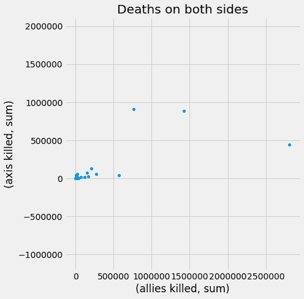
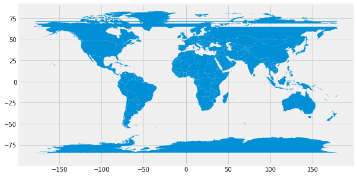
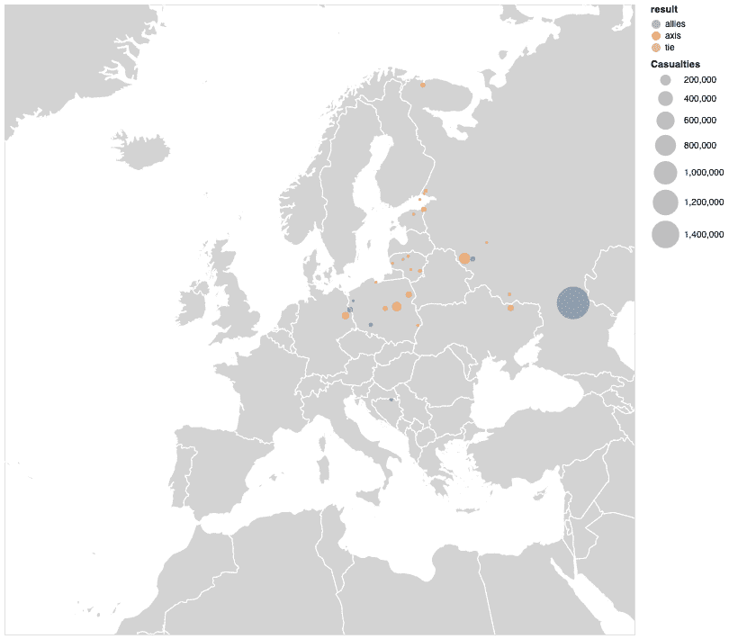

        

# 十二、数据探索和可视化

在前一章中，我们深入探讨了数据清理和准备。但是这个数据集里面有什么呢？它讲述了关于那场战争的什么故事，我们如何才能把那些故事讲清楚？知道如何剖析数据、理解数据并提取见解是数据分析的关键技能之一，也是构建由数据驱动的任何东西之前的必经步骤。在本章中，我们将学习如何探索数据集，计算聚合统计数据，并通过数据可视化了解异常值和一般趋势。我们将学习的技能对于任何数据分析都是必不可少的，并在整个行业和学术界得到应用。

特别是，本章将涵盖以下主题:

*   Descriptive ...

        

# 技术要求

在这一章中，我们将使用三个额外的可视化库:`geopandas`、`altair`和`datashader`。所有这些都可以通过 Anaconda 或 PIP 安装，并包含在我们的`environment.yaml`文件中。和往常一样，如果您遵循了第 1 章、*准备工作区*中的说明，您就一切就绪了。如果没有，你可以使用`conda`来安装它们。

        

# 探索数据集

对于这一章，我们将使用我们之前在[第 7 章](232fe2da-7fa8-4d76-b5fc-d4bf80535e86.xhtml)、*中收集的关于二战战斗的数据集，用 BeaultifulSoup 4* 从网络上搜集数据。您可能还记得，数据集包括这些战斗的日期、结果、双方、领导人、军队数量和伤亡人数。但是我们能用这些信息回答什么问题呢？先说简单的:哪些战役双方伤亡最多？大多数坦克是在哪里被摧毁的？伤亡人数在时间和地理上是如何分布的？

在前一章中，我们清理和处理了大部分数据；然而，考虑到这个问题的敏感性，我们继续手动地逐行交叉检查主要值...

        

# 描述统计学

现在，有了一个数据框架，让我们回答一些简单的问题；比如，哪些战役双方夺走的生命最多？要回答这个问题，我们需要添加两列，根据结果对数据帧进行排序，从大到小，并打印出前 *N* 条记录。让我们开始吧:

```py
>>> kill_cols = ['allies killed', 'axis killed']
>>> data['killed total'] = data[kill_cols].sum(1)
>>> data['killed total'].sort_values(ascending=False).head(3)

>>> name
Battle of Stalingrad     1997993.0
Battle of Moscow         1203428.0
Battle of Kiev (1941)     661958.0
Name: killed total, dtype: float64
```

下一个问题可能是每次战斗的典型伤亡人数。在我们计算统计数据之前，我们必须过滤具有未知值(NaN)或零值的行——在这两种情况下，记录都不应该包括在内。这里，我们将使用管道操作符`|`，作为普通 Python 中的 ***或*** 的矢量化等价物。

考虑下面的代码。我们将一个掩码指定为两个布尔数组的逻辑或(因此称为管道)。第一个数组检查我们之前分配的`kill_cols`列中的值是否为`null`。因为有多列，所以结果将是二维数组的形式。为了将它转换成一维数组，我们进一步使用了`any`方法，传递`1`来识别操作的水平(轴=1)方向——换句话说，结果将告诉我们，对于每一行，该行中的任何值是否为`True`。

第二个操作(在管道之后)类似地工作，但是，相反，我们检查值是否为零。因此，掩码变量将是一个一维数组，原始数据集中的每一行都有一个布尔值。这些值表明，在该行中，任何 kill 列中的值是 null 还是等于零:

```py
mask = data[kill_cols].isnull().any(1) | (data[kill_cols] == 0).any(1)
```

接下来，我们需要删除`mask`为真的行，保留其余的行。为此，我们需要反转我们的遮罩，使用波浪符号；与管道类似，波浪号`~`作为矢量化的 ***而不是*** (或感叹号)。在下面的内容中，我们过滤数据，只保留具有适当“删除”列的行，并只计算它们的中值。下面举个例子:我们用`~mask`作为`NOT`；例如，该行既没有零值也没有空值。

使用这个反向掩码，我们过滤数据集并计算`killed total`值的中值:

```py
>>> data.loc[~mask, 'killed total'].median()
37316.0
```

这种口罩现在可以用在很多场合。作为最后一个例子，让我们使用`describe`方法计算两边的`tanks`列的主要统计数据(这里，我们使用`mask`作为具有有意义结果的良好记录的代理)。许多战斗都有伤亡，但没有坦克损失或报告损失，这似乎很好:

```py
>>> data.loc[~mask, ['allies tanks', 'axis tanks']].describe()
 allies tanks axis tanks
count   79.000000    79.000000
mean    352.683544   65.911392
std     897.692848   235.066831
min     0.000000     0.000000
25%     0.000000     0.000000
50%     0.000000     0.000000
75%     254.000000   18.000000
max     4799.000000  1500.000000
```

这些数值很有趣——如你所见，大多数战斗双方都没有坦克损失。然而，平均来说，盟军损失的坦克是轴心国的六倍。此外，在战斗中，轴心国损失了`18`或更少的坦克——但是盟军损失了`254`——比例更大！

我们的分析越来越复杂。一次手动阅读和理解 10 个以上的数字变得越来越困难。为了理解更大的数据集，我们需要开始在图表上可视化我们的数据集。

        

# 使用 matplotlib(及其 pandas 接口)实现数据可视化

我们已经有了使用`matplotlib`的经验——首先，在[第三章](4ee8a15a-87bb-40c8-8c44-9cd7270b0f21.xhtml)、*函数*，后来，在[第八章](9ba775d6-d691-4394-a485-7020b2b1ef0c.xhtml)、*模拟类和继承*。幸运的是，`pandas`有一个与`matplotlib`协同工作的内置界面，使得可视化变得非常容易和直观。但首先，我们需要准备笔记本来显示图表:

```py
%matplotlib inlineimport pylab as pltplt.style.use('fivethirtyeight')
```

现在，让我们画出总伤亡人数的直方图。用`matplotlib`本身也可以做到这一点——但是`pandas`有一个简单的内置接口。无论好坏，我们仍然必须通过标准的`matplotlib`接口来设置标签和标题——在本例中，如下所示:

```py
data.loc[~mask, 'killed ...
```

        

# 汇总数据以计算汇总统计数据

为了聚合某个分组的值，`pandas`有`groupby`操作——该库的杀手锏之一。该函数创建一个`GroupBy`对象，它可以表现为(`name`，`group`)元组的可迭代对象，或者类似于数据帧，您可以像选择数据帧一样选择一个或多个列。

最重要的是，这些对象有两个特殊的方法:

*   `agg`, which will perform the given aggregation function (say, calculate averages) for each group, and return them as a dataframe with one row per each group.
*   `transform` does all of the same—except that it will return the corresponding group's aggregate values for each row in the original dataframe.

这两个函数的最大特点是它们的灵活性，它们都接受一些选项作为它们的参数，包括以下选项:

*   Strings with operation names (`count`, `median`, and more).
*   Custom functions.
*   A dictionary with specific operations (either strings or functions) for specific column names; we can even pass a dictionary with a list of multiple operations for one column.

例如，让我们看看每次行动的伤亡统计数据是如何变化的，我们将其存储在`parent`列中:

```py
aggregate = data[~mask].groupby('parent').agg({'axis killed': ['sum', 'median', 'count'],
                                   'allies killed': ['sum', 'median'],
                                   'killed total': ['sum', 'median']}).astype(int)
```

以下是结果的前三行:

|  | **轴被杀** |  |  | **盟友被杀** |  | **Killed total** |  |
| **Parent** | **Sum** | **Median** | **Count** | **Sum** | **Median** | **Sum** | **Median** |
| Axis invasion of the Soviet Union | 440,560 | 20,364 | 12 | 2,811,366 | 103,166 | 3,251,926 | 111,681 |
| Battle for Narva Bridgehead | 200 | 200 | 1 | 3,000 | 3,000 | 3,200 | 3,200 |
| Battle of Berlin | 60,000 | 60,000 | 1 | 20,000 | 20,000 | 80,000 | 80,000 |

请注意结果是如何具有多级列的，第一级是原始列名，第二级是我们执行的特定操作。在许多方面，这种多级索引是有用的，但也会使事情变得更加复杂。特别是，现在我们不能通过名称选择列—相反，我们需要使用所谓的`pandas.IndexSlice`。例如，要获得一个列`'axis killed', 'sum'`，我们需要使用以下代码:

```py
>>> idx = pd.IndexSlice
>>> aggr[idx['axis killed', 'sum']].head(3)

parent
Axis invasion of the Soviet Union 440560
Battle for Narva Bridgehead 200
Battle of Berlin 60000
Name: (axis killed, sum), dtype: int6
```

好的方面是`IndexSlice`，类似于普通的`pandas`切片，支持分号和非指定级别。例如，我们可以像这样拉两边的`'sum'`值(由于某种原因，它需要一个`loc`方法):

```py
>>> aggr.loc[:, idx[:, 'sum']].head(3)
 axis killed    allies killed    killed total
 sum              sum             sum
parent 
Axis invasion of the Soviet Union 440560          2811366         3251926
Battle for Narva Bridgehead          200             3000            3200
Battle of Berlin                   60000            20000           80000
```

现在，继续我们的可视化狂欢，让我们把所有给定的行动绘制成散点图，使用双方的伤亡作为`x`和`y`坐标。为此，`pandas`也有一个专用的接口。考虑下面的例子:

```py
idx = pd.IndexSlice

aggr.plot(kind='scatter',
          x=idx['allies killed', 'sum'],
          y=idx['axis killed', 'sum'],
          figsize=(7,7),
          title='Deaths on both sides')

plt.axis('equal');
plt.tight_layout();
```

这里，我们需要做的就是执行`plot`命令，指定绘图的种类，用于`x`和`y`坐标的列，以及一些其他参数。这里，我们还必须使用`IndexSlice`来指定列。`plt.axis('equal')`方法确保`x`和`y`坐标保持相同的比例用于比较。以下是生成的图像，显示了轴心国/盟国的战斗伤亡趋势。请注意，在这种情况下，我们不必指定轴标签—它们是根据列名自动生成的:



我们做的散点图肯定讲了很多，但是要猜哪个点代表哪个战役。不要担心，我们很快就会看到交互式图表。

现在，让我们通过介绍另一种技术来结束聚合方法:基于时间的重采样。

        

# 重采样

聚合的另一种形式是基于时间的重采样。您可以将这种做法视为按时间段分组——只不过还会为错过的时间段填充统计数据。

举个例子，让我们统计一下战争中每个月的伤亡人数，假设每场战斗的结束都是一个时间点。为此，我们必须首先将`DateTime`设置为一个索引。为了简单起见，让我们创建一个要在其上执行的数据帧的副本:

```py
ts = data[['axis killed', 'allies killed', 'end']].copy()ts = ts.set_index('end').sort_index()
```

现在，我们需要做的就是定义频率和聚合方法，我们可以开始了:

```py
>>> timeline = ts.resample('1Y').agg('sum')>>> timeline axis killed allies killedend 1939-12-31 23727.0     166092.01940-12-31 ...
```

        

# 绘图

在第十一章[*的数据清理和操纵*中，我们花了相当多的时间进行地理编码战斗。让我们使用坐标来确定地图上的战斗——也许这将让我们对数据有更好的理解。](99046ac4-efac-4f29-9561-41f1dde49bc4.xhtml)

为此，我们将使用一个特殊(和空间)的库:`geopandas`。可以猜到，`geopandas`基于 Pandas，提供多种地理空间方法。本质上，`geopandas`允许我们读取地理空间数据，并将其作为一个 Pandas 数据框架，提供地理空间方法(邻接、空间包含、布尔运算等)和绘图功能。

在我们开始绘图之前，最好有一个我们数据的基本地图作为背景。在这里，我们使用了现代国家边界的开放数据集，基于*自然地球*数据集([https://www.naturalearthdata.com/](https://www.naturalearthdata.com/))。我们甚至不需要下载它——数据足够小，我们每次运行时都可以从网上读取。因为边界文件是简单的——没有特定的投影；我们将手动添加`MERCATOR`参考系统——这是可选的，但将帮助我们重新映射到不同的投影:

```py
import geopandas as gp
url = 'https://unpkg.com/world-atlas@1/world/50m.json'
MERCATOR = {'init': 'epsg:4326', 'no_defs': True}

borders = gp.read_file(url)
borders.crs = MERCATOR
```

现在，让我们看看边框的整体外观:

```py
borders.plot(figsize=(10, 5))
```

该代码将导致以下屏幕截图:



好的，我们看到边界覆盖了整个地球(俄罗斯有一个小问题，因为它的领土延伸超过 180 度经度，达到负度数——幸运的是，一旦我们放大，就不会有这个问题了)。

因为我们将绘制欧洲，让我们使用一个适当的投影，ETRS-LAEA。它的 EPSG 号码可以在 https://spatialreference.org/上找到。

要转换成其他投影，只需使用`to_crs`方法:

```py
borders = borders.to_crs(epsg=3035)  
```

接下来，我们需要将现有的数据帧转换成带点的`GeoDataFrame`。幸运的是，`geopandas`有一个内置的助手函数。我们也将它们转换成相同的投影:

```py
gdf = gp.GeoDataFrame(
 data, geometry=gp.points_from_xy(data['Longitude'], data['Latitude'])).to_crs(borders2.crs)
```

现在，我们可以将两者结合起来，对标记大小的总伤亡人数进行编码:

```py
ax=borders2.plot(color='lightgrey', edgecolor='white', figsize=(12,12))

gdf.plot(ax=ax, color='red', markersize=(data['killed total']/1000).clip(lower=1), alpha=.2);

ax.margins(x=-.4, y=-0.4) # Values in (-0.5, 0.0) zooms in to center
ax.set_axis_off()
```

请注意我们如何使用第一个绘图的输出，并将其存储在`ax`变量中，然后我们将该变量传递到第二个图表——这样，两者都将在同一个画布上按它们执行的顺序绘图，因为边距实际上“放大”了欧洲，而`set_axis_off`删除了图表的轴。

结果是这样的:


圆圈代表战斗，大小与总伤亡人数相符。正如你所看到的，斯大林格勒围城战是一个异常事件——无论是从空间上还是从伤亡人数上。

请参考本书的图文集，了解本书的所有图片

太好了！我们能够在地图上绘制我们的图形，事实上它让我们更好地理解我们正在处理的数据。这张地图和我们到目前为止制作的所有其他图表的一个局限性是它们是静态的。`matplotlib`具有一定的交互能力；例如，您可以将图表设置为可平移和可缩放，但它不会提供工具提示、选择或任何其他高级交互。幸运的是，我们有其他可视化库可以做到这一点，例如，`altair`。

        

# 用织女星和牛郎星实现声明式可视化

到目前为止，我们一直通过内置的`pandas`接口使用`matplotlib`库。`matplotlib`对于 Python 的数据可视化生态系统来说是强大而必不可少的。然而，它不是我们可以使用的唯一可视化库。事实上，有太多的可视化工具，它们的格式、关注点甚至理念都不同。在本节中，我们将向您介绍一个不同的工具——以及不同的数据可视化概念——那就是`altair`，它是一个基于 Vega 引擎的 Python 库。是什么让它如此不同？事实上，有几件事。

首先，它的核心理念是基于声明性方法，这可以归结为以下原则:核心...

        

# 用 Altair 绘制地图

现在，让我们复制地图。这其实很简单。首先，我们需要指定边界数据集的源和投影的属性:

```py
url = 'https://unpkg.com/world-atlas@1/world/50m.json'

data_geo = alt.topo_feature(url, feature='countries')
proj = {'center':[10, 52], 'type':'conicEquidistant', 'scale':800}
```

如您所见，Altair 可以链接到数据源，并将在运行时从 web 上提取数据。这是一个很好的功能，因为我们可以类似地将其链接到我们将不断更新的数据集，从而获得实时数据快照。我们将在第 17 章、*让我们建立一个仪表板*中使用该选项，来建立一个仪表板。现在，我们将使用投影和数据源创建另一个`chart`对象——这将是我们的底图:

```py
basemap = alt.Chart(data_geo).mark_geoshape(
    clip=True,
    fill='lightgray',
    stroke='white',

).properties(
    width=700,
    height=700,
).project(**proj)
```

最后，我们需要获取点并创建另一个图表对象、编码坐标、标记大小和投影:

```py
mask = data[['Latitude', 'Longitude']].notnull().all(1)
points = alt.Chart(data[mask]).mark_circle(clip=True, color='red', opacity=.5).encode(
    latitude='Lattitude',
    longitude='Longitude',
    size=alt.Size('killed total:Q', scale=alt.Scale(type='linear', range=[10, 1000], domain=[10, 1_500_000]), title='Casualties'),
    color=alt.value('red'),
    tooltip=['name', 'killed total'],
    href = 'url'
).project(**proj)
```

最后，我们需要将两个图表叠加成一个。在 Altair 中，这非常简单——我们所需要的就是将它们加在一起(但是，注意，在这种情况下，图表的顺序很重要——操作中最后一个图表将位于另一个图表之上)。同样，竖线和分隔线符号将图表放在一边或放在另一边的下面:

```py
map = basemap + points;
map
```

这是生成的地图。请注意，我们有带有我们定义的值的工具提示，并且，由于有了`href`参数，单击每个对象就会打开一个 Wiki 页面:



不幸的是，由于各种原因，织女星——因此，牛郎星——目前不支持地图平移/缩放。如果你需要放大你的地图，叶库(著名的`leaflet.js`库的 Python 包装)可能是更好的选择。Folium 同时支持`geopandas`数据帧和 Altair 规范。

现在，牛郎星图表在你的笔记本里很有用——但是如何将它们导出为静态图像或者——更好的是——一个独立的交互式应用呢？

        

# 存储牛郎星图

将图表导出为光栅或矢量图像的一个简单方法是通过三点按钮。但是如果需要的话，您也可以通过编程来实现。首先，我们需要将复合图表存储为一个对象。接下来，我们只需执行保存；特定于方法的导出类型将从文件类型中推断出来:

```py
chart = basemap + pointschart.save('chart.png') # or 'chart.svg' for vector
```

`png`和`svg`的编程导出需要 Selenium 包和 Google Chrome 或 Mozilla Firefox 浏览器，以及安装相应的驱动程序——通过[https://Altair-viz . github . io/user _ guide/saving _ charts . html # png-and-SVG-format](https://altair-viz.github.io/user_guide/saving_charts.html#png-and-svg-format)查看文档。

另一种方法是存储原始规范。...

        

# 使用 datashader 实现大数据可视化

大数据也需要可视化！大数据可视化有些罕见；部分原因是他们很难做到，但也因为他们很难解释和交流见解。大数据可视化通常是网络、地图或映射(基于相似性的计算二维或三维分布)。它们通常是惊人而复杂的！事实上，一些大数据可视化的早期发明者，如 Eric Fisher，因其在大数据方面的工作而闻名。

正如我们提到的，由于数据集的大小，大数据可视化通常很难。标准工具不会起作用——对于`matplotlib`，即使有光栅引擎，也要花几个小时来绘制数百万个点，而 Altair 根本做不到。很长一段时间，这个问题没有简单的解决方法。这随着另一个 Python 库的发布而改变:`datashader`。`datashader`利用一些现代技术和包来进行快速计算(特别是 Numba，另一个利用实时编译的快速计算包，我们将在[第 20 章](d6c1c88b-c429-4bc7-873a-2d91334a2689.xhtml)、*最佳实践和 Python 性能*中讨论)，以及可视化本身的一种智能方法——它将数据分入像素网格，计算这个网格的集合。事实上，宁滨可以在可视化上节省大量时间，使用像素网格解决了较大容器的所有缺点——无论如何，在像素内你看不到任何东西。最重要的是，一旦`datashader`计算出像素值的矩阵，我们就可以改变图片的外观，而不需要重新聚集值。

让我们试一个例子。到目前为止，我们使用的数据集都不够大，所以我们将使用一个新的数据集-纽约市 2018 年全年 311 起投诉的开放数据集。在[第 6 章](ca8361ef-be7b-4ada-9b74-67c692791316.xhtml)、*第一个脚本——使用 Web API 进行地理编码*中，我们简要提到了这些数据，并分享了收集这些数据的代码。为了以防万一，我们用来收集这些数据的代码也存储在本章的文件夹中，作为一个`_pull_311.py`脚本。要获取数据，只需从终端运行这个脚本:`python _pull_311.py`。可视化的代码存储在`3_big_data_viz_311.ipynb`笔记本中。

311 是一种市政公共服务，旨在处理市民关于非紧急问题的输入；换句话说，它类似于 911，但针对的是非威胁、非紧急问题，如噪音、垃圾、倒下的树木、涂鸦等等。投诉可以通过电话、短信、电子邮件、申请或网络形式提交。纽约市每天都会分享此类投诉的匿名记录，包括投诉时间、坐标、投诉类型、相关城市部门或机构、投诉结束时间等一些信息。

我们收集的数据存储在 12 个 CSV 文件中，2018 年每个月一个，包括 2，747，985 条记录。这本身并不是大数据——至少它可以放在现代机器的内存中，但它很难处理，而且可视化起来肯定已经很重要了。

首先，让我们尝试加载数据。因为我们要处理多个 CSV，所以让我们使用`glob`，一个内置的 Python 函数，用于从一个模式中获取多个文件:

```py
import pandas as pd
from glob import glob
```

现在，我们需要指定一个模式，并对其运行`glob`:

```py
>>> paths = './data/311/*.csv'
>>> files = glob(paths)
>>> files
['./data/311/2018-06.csv',
 './data/311/2018-12.csv',
 './data/311/2018-07.csv',
 './data/311/2018-11.csv',
 './data/311/2018-05.csv',
 './data/311/2018-04.csv',
 './data/311/2018-10.csv',
 './data/311/2018-01.csv',
 './data/311/2018-03.csv',
 './data/311/2018-02.csv',
 './data/311/2018-09.csv',
 './data/311/2018-08.csv']
```

最后，我们现在可以遍历这些文件，逐个加载它们，并连接成一个数据帧:

```py
data = pd.concat([pd.read_csv(p, low_memory=False, index_col=0) for p in glob(paths)])
```

这里，我们使用了`low_memory=False`标志，它帮助`pandas`正确匹配每一列的数据类型。

如果你的机器有一个小的内存大小，你可能想要加载更少的月份。或者，仅对于某些地图，数据可以按月读取，在生成器中单独用`datashader`汇总，然后汇总在一起。`datashader`将`canvas`矩阵存储为简单的二维数值`numpy`矩阵，因此很容易做到。

现在，我们可以绘制一个简单的投诉密度分布图。首先，让我们加载`datashader`:

```py
import datashader as ds
import datashader.transfer_functions as tf
from datashader.colors import inferno
```

现在，我们将创建一个画布(本质上是一个二维像素矩阵)。接下来，我们将使用这个画布来聚合我们的数据。最后一个参数`ds.count()`是一个聚合函数，在本例中，计算每个像素的记录(投诉)数量:

```py
cvs = ds.Canvas(plot_width=1000, plot_height=1000)
agg = cvs.points(data, 'x_coordinate_state_plane', 'y_coordinate_state_plane', ds.count())
```

一旦完成，我们就可以用一个命令进行实际的可视化了:

```py
tf.shade(agg, cmap=inferno, how='eq_hist')
```

这里，我们实际上只是给`agg`矩阵着色，将值转换成颜色。注意最后一个参数:它描述了如何沿着颜色图分配值。一个`linear`策略会将值无任何失真地映射到颜色上——最大值将获得边缘颜色，而中间的所有值将按比例获得颜色。然而，数据通常并不是均匀分布的——存在具有相对较小值的尖峰和长尾——这导致不同颜色的小广告，以及相同颜色的所有其他内容。为了解决这个问题，可以使用其他策略，例如，`log`和`cube`将分别对数值的对数和立方根进行着色。最后的武器*，`eq_hist`本质上是将值的等级着色——这样，每个色调的像素数量将大致相同。策略的选择取决于数据集的具体情况。*

 *由于情节中元素的高密度，以及视觉化本身的性质，我们只能使用颜色；并非所有的颜色都能在黑白图像上正确显示，因此我们建议在存储库中检查这些可视化效果([https://github . com/packt publishing/Learn-Python-by-Building-Data-Science-Applications/blob/master/chapter 12/3 _ big _ Data _ viz-311 . ipynb](https://github.com/PacktPublishing/Learn-Python-by-Building-Data-Science-Applications/blob/master/Chapter12/3_big_data_viz-311.ipynb))。

这是生成的图表。这张地图非常漂亮，而且非常详细。从分布图中，我们可以看到两个岛屿、道路、城镇和建筑的独特形状:


让我们仔细看看这张图表。在这里，较浅的颜色(最初是黄色)代表投诉密度较高。颜色越深意味着投诉数量越少。

由于这里看不到颜色，所以书中所有图片请参考图形捆绑链接([https://static . packt-cdn . com/downloads/9781789535365 _ color images . pdf](_ColorImages.pdf))。

正如你所看到的，密度通常从城市的中心向边缘递减，这是有道理的。同时，与周围环境相比，我们可以关注抱怨数量更多或更少的区域。对于熟悉这座城市的人来说，其中大多数都很有意义:例如，为什么卑尔根海滩(图像中下部的黑暗角落)与周围环境如此不同？为什么中央公园的东部边缘(曼哈顿上的白色矩形)与周围相比如此黑暗？为什么 Prospect Park(布鲁克林中部右手边的白色形状)东侧的密度比西侧的密度高？高分辨率使我们能够深入到地图上最小的元素，甚至质疑微小的空间不规则性。

让我们做一个类似的图，但这次是按照最典型的投诉来源进行汇总，它存储在`open_data_channel_type`列中。首先，让我们检查所有可能的来源:

```py
>>> data['open_data_channel_type'].value_counts()
PHONE   1469034
ONLINE  565348
UNKNOWN 366890
MOBILE  314247
OTHER   32466
Name: open_data_channel_type, dtype: int64
```

由于只有五种来源，为每种来源手动定义颜色似乎更容易:

```py
colors = {
 'PHONE':'red',
 'ONLINE':'blue',
 'UNKNOWN':'grey',
 'MOBILE':'green',
 'OTHER': 'brown'
}
```

我们还必须将该列转换成`category`数据类型。`category`数据类型比字符串更紧凑(它为每个类别存储一个整数),但是对于基于类别的操作来说,`datashader`也需要它——否则,`datashader`根本无法工作:

```py
data['open_data_channel_type'] = data['open_data_channel_type'].astype('category')
```

现在，让我们根据最典型的原因进行汇总:

```py
agg_cat = cvs.points(data, 'x_coordinate_state_plane', 'y_coordinate_state_plane',
                     ds.count_cat('open_data_channel_type'))
```

使用颜色键，不需要指定着色方法，只需传递颜色:

```py
tf.shade(agg_cat, color_key=colors)
```

这是我们的结果。这里，我们看到的是完全相同的数据集，只是用每个像素最常见的来源来着色:


与之前的地图一样，这张地图包含了多个有趣的图案——我们可以盯着它看几个小时！例如，我们可以注意到斯塔滕岛(左下角)上的像素链——也许那些是高速公路。透过这座城市，我们可以注意到蓝色(在线)和绿色(移动)的集群——这些集群很可能是办公室和交通区域。

在我们的最后一步，让我们看看结束投诉所需的平均时间在全市的分布情况。在映射之前，我们需要将这个时间计算为一个数字—例如，减去两个时间戳，并将`timedelta`对象转换为整数形式的分钟数:

```py
data['created_date'] = pd.to_datetime(data['created_date'])
data['closed_date'] = pd.to_datetime(data['closed_date'])
data['time_to_close'] = (data['closed_date'] - data['created_date']).dt.seconds
```

现在，我们可以计算每个像素的平均值`time_to_close`:

```py
agg_time = cvs.points(data, 'x_coordinate_state_plane', 'y_coordinate_state_plane', ds.mean('time_to_close'))

tf.shade(agg_time, cmap=inferno, how='eq_hist')
```

结果是这样的:


同样，这里有很多有趣的东西(关闭时间的巨大差异很可能是投诉性质不同的结果)。更有趣的是比较不同的地图——一些区域在一种情况下具有相似的属性，但在另一些情况下却截然不同。最好的部分是，我们相对容易地创建了一堆非常详细的地图，传达了数据集的整体情况和特定位置的所有复杂性。事实上，大数据可视化经常向我们介绍难以用任何其他方式捕捉到的意想不到的模式。* *        

# 摘要

在本章中，我们讨论了如何从原始数据中获得洞察力，计算描述性统计数据和聚合数据，绘制基本关系图，以及使用特殊工具实现大数据可视化。因此，我们已经学会了如何开始使用数据集，调查其整体属性，并深入到特定的细节。我们还学习了如何可视化数据，这是个人数据探索和与广大受众分享见解的重要技能。这些技能是数据分析的基础——知道用数据问什么和如何回答你的问题，注意数据中的模式和异常，并能够解释它们和推测它们的来源。

在我们的下一章，我们将进行一个步骤...

        

# 问题

1.  How can we understand some general properties of dataset in `pandas`?
2.  What does the `resample` function do in `pandas`? How is it different from aggregation?
3.  How does visualization work in `pandas`?
4.  What are the benefits of declarative data visualization (for example, with Altair)?
5.  In which cases can big data visualization be useful?

        

# 进一步阅读

*   *Data Visualization with Python*, by Mario Döbler, Tim Großmann, et al., published by Packt ([https://www.packtpub.com/in/big-data-and-business-intelligence/data-visualisation-python](https://www.packtpub.com/in/big-data-and-business-intelligence/data-visualisation-python))
*   *Learning Python Data Visualization*, by Benjamin Walter Keller), published by Packt ([https://www.packtpub.com/big-data-and-business-intelligence/learning-python-data-visualization-video-0](https://www.packtpub.com/big-data-and-business-intelligence/learning-python-data-visualization-video-0))*