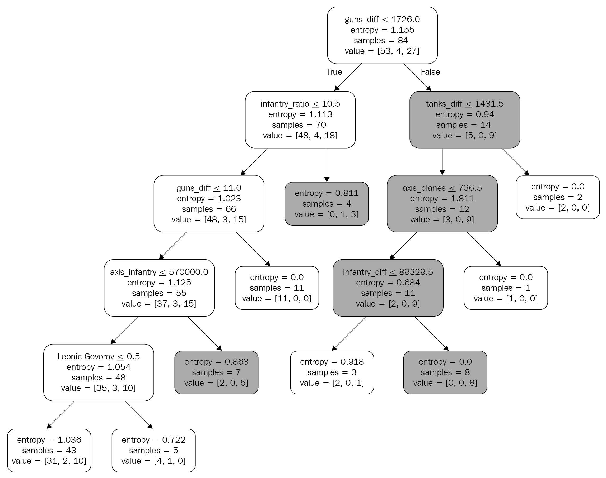

        

# 十四、改进您的模型——管道和实验

在前一章中，我们训练了一个基本的**机器学习** ( **ML** )模型。然而，大多数真实场景要求模型准确，这意味着模型和特性需要针对特定任务进行改进和微调。这个过程通常是漫长的、迭代的，并且是基于反复试验的。

因此，在这一章中，我们将会看到如何改进和验证模型质量，并跟踪所有的实验过程。因此，我们将提高模型的质量，并学习如何跟踪我们的实验，记录度量和参数。特别是，我们将了解以下内容:

*   了解交叉验证和过度拟合
*   添加功能以改进模型

        

# 技术要求

在本章中，我们将向您介绍`dvc`包。如果不使用本书的环境，可以用`pip install dvc`安装。最后一部分，树的可视化，也需要`pydotplus`包。

像往常一样，所有的代码都通过一个笔记本共享，存储在资源库中的`Chapter14`([https://github . com/packt publishing/Learn-Python-by-Building-Data-Science-Applications](https://github.com/PacktPublishing/Learn-Python-by-Building-Data-Science-Applications))下。

        

# 了解交叉验证

在前一章中，我们建立了一个具有某些假设和设置的模型，用准确性度量(正确分类标签的总体比率)来衡量其性能。为此，我们将数据随机分为训练集和测试集。虽然这种方法很重要，但它也有问题。最重要的是，通过这种方式，我们可以微调我们的模型，以在测试数据集上获得更好的性能，但以牺牲其他数据为代价(换句话说，我们可能会在特定数据集上获得更好的指标的同时使模型变得更差)。这种现象被称为过度拟合。

为了解决这个问题，我们将使用稍微复杂一点的方法:交叉验证。在其基本形式中，交叉验证创建了多个...

        

# 探索特征工程

既然我们已经创建了一个系统来公平地比较模型，而不用担心过度拟合，那么让我们来考虑如何改进我们的模型。一种方法是创建可能添加更多上下文的新功能。实现这一点的一个方法是创建我们自己的功能，例如，计算不同方面的军队比例或士兵数量的绝对差异——我们不能事先说哪个会更好。让我们在以下代码的帮助下尝试一下:

1.  首先，我们将创建双方士兵的比例:

```jl
data['infantry_ratio'] = data['allies_infantry'] / data['axis_infantry']
cols.append('infantry_ratio')
```

2.  现在，我们不会对坦克、飞机等等这样做，因为这里的数字非常小，我们必须处理被零除的问题。相反，我们将计算绝对数字的差异:

```jl
for tp in 'infantry', 'planes', 'tanks', 'guns':
    data[f'{tp}_diff'] = data[f'allies_{tp}'] - data[f'axis_{tp}']
    cols.append(f'{tp}_diff')
```

3.  现在我们已经创建了这五个新特性，让我们再次运行我们的模型:

```jl
scores = cross_val_scores(model, 
                          data[cols],
                          data['result_num'],
                          cv=4)
```

4.  现在，让我们打印结果分数(手指交叉):

```jl
>>> pd.np.mean(scores)
0.5141774891774892
```

准确率现在为 51.4%，比之前的 43.7%提高了近 8%！

让我们看看还有什么我们可以添加到混合。我们还没有用到的一个特性是`leaders`列——每个列包含几个名字。让我们统计一下每个名字在数据集中出现的频率，并为最常提到的领导者创建一个二元(一键)特征。为此，我们可以使用我们在这本书的[第 1 节](023c9ed8-0b58-4bbb-8651-99f8087daf08.xhtml)、*Python 入门*中学到的`Counter`对象！

考虑以下代码:

```jl
from collections import Counter

def _generate_binary_most_common(col, N=2):
    mask = col.notnull()
    lead_list = [ el.strip() for _, cell in col[mask].iteritems() for el in cell if el != '']
    c = Counter(lead_list)

    mc = c.most_common(N)
    df = pd.DataFrame(index=col.index, columns=[name[0] for name in mc])

    for name in df.columns:
        df.loc[mask, name] = col[mask].apply(lambda x: name in x).astype(int)
    return df.fillna(0)
```

如下所示，` _generate_binary_most_common`函数生成一个数据帧，其中最频繁出现的名称作为列，原始数据索引。所有值都是二进制的，表示每个名称是否出现在原始列中。

这样，我们就可以向数据集中添加新的要素。考虑以下代码:

```jl
axis_pop = _generate_binary_most_common(data['axis_leaders'].str.split(','), N=2)
allies_pop = _generate_binary_most_common(data['allies_leaders'].str.split(','), N=2)
```

在这里，我们运行刚刚在每一侧的 leaders 列上创建的函数，其中 *N=2* 。这导致两列的数据帧，用二进制(0 和 1)值填充。这些值代表了任何特定的领导者(两个最常见的领导者之一)参与了每一场特定的战斗。

现在，我们只需要将这些数据框添加到我们的功能中，并再次运行交叉验证:

```jl
data2 = pd.concat([data, axis_pop, allies_pop], axis=1)
cols2 = cols + axis_pop.columns.tolist() + allies_pop.columns.tolist()

scores = cross_val_score(model1, 
                         data2[cols2], 
                         data2['result_num'],
                         cv=4)
pd.np.mean(scores)
>>> 0.5369047619047619
```

这使我们的表现平均提高了 2%。N=2 是通过手动迭代发现的——似乎该值的增加和减少都会导致性能下降。

        

# 失败的尝试

本书基于实例的叙述可能会误导你，让你认为每个假设或想法都能提高准确性。事实上，为了写这一章，我们不得不尝试和测试一些没有成功的其他特性和方法。例如，我们尝试的一个想法是使用每场战斗的日期作为一个特征；你会认为盟军在战争的前半段打了更多的败仗，而在后半段赢了更多。事实上，它实际上降低了我们在测试数据集上的性能。

我们还尝试填充缺失的值。在这一章的开始，我们用零填充了飞机、坦克和大炮的空单元格。事实上，维基百科的作者有不同的来源；其中一些有详细的数据...

        

# 优化超参数

可能还有许多其他功能需要添加，但是现在让我们将注意力转移到模型本身。现在，我们假设模型的默认静态参数，将其参数`max_depth`限制为一个任意的数字。现在，让我们尝试微调这些参数。如果处理得当，这一过程可以为模型准确性增加几个百分点，有时，即使是性能指标的微小增长也可能改变游戏规则。

为此，我们将使用`RandomizedSearchCV`——另一个围绕交叉验证概念的包装器，但这一次，它迭代模型的参数，试图找到最佳参数。一种更简单的方法叫做`GridSearchCV`，它采用有限数量的参数，创建所有的排列，并使用一种基本上是蛮力的方法迭代地运行它们。

另一方面，随机搜索采用参数分布并获得随机样本。与网格搜索相比，它有两个优点:

*   随机搜索可以找到你没有明确提供的参数(一些非常具体的比值)。
*   它通常比网格搜索收敛得快。

让我们来看看它是如何工作的:

1.  首先，我们需要导入一个`randint`方法和`RandomizedSearchCV`:

```jl
from sklearn.model_selection import RandomizedSearchCV
from scipy.stats import randint as sp_randint
```

2.  现在，我们将声明一个特征空间来搜索更好的组合。这里，每个键代表一个模型参数，以及值和要搜索的选项。`randint`函数允许我们为随机值搜索指定范围边界:

```jl
param_dist = {"max_depth": sp_randint(5, 20),
              "max_features": sp_randint(1, len(cols2)),
              "min_samples_split": sp_randint(2, 11),
              "criterion": ["gini", "entropy"]}
```

3.  最后，有了这个特征空间，我们可以运行我们的随机搜索:

```jl
rs = RandomizedSearchCV(
    model1,
    param_distributions=param_dist,
    cv=4, iid=False,
    random_state=2019,
    n_iter=50
)
```

代替一般的`scikit-learn`，`RandomSearchCV`表现得好像它是一个模型——它有`fit`和`predict`方法。在引擎盖下，它对参数进行迭代，对折叠进行参数平均。因此，它可以返回最佳得分和最佳对应估计值，即平均得分最高的估计值。考虑以下代码:

```jl
>>> rs.fit(data2[cols2], data2['result_num'])
>>> rs.bestscore
0.5613636363636363

>>> rs.best_estimator_
DecisionTreeClassifier(class_weight=None, criterion='entropy', max_depth=5,
 max_features=3, max_leaf_nodes=None,
 min_impurity_decrease=0.0, min_impurity_split=None,
 min_samples_leaf=1, min_samples_split=8,
 min_weight_fraction_leaf=0.0, presort=False,
 random_state=2019, splitter='best')
```

如您所见，该过程确实能够调整参数，找到最普遍的性能模型配置，并且它将我们的准确性提高了大约 2%。让我们为生成的模型生成一个图表:

```jl
dot_data = StringIO()

export_graphviz(rs.best_estimator_, out_file=dot_data, 
                filled=True, rounded=True,
                special_characters=True, feature_names=cols2)

graph = pydotplus.graph_from_dot_data(dot_data.getvalue()) 
Image(graph.create_png())
```

这里，代码类似于我们在上一章中运行的代码——我们用内存中的对象模拟一个文件，生成一个图，用`pydotplus`渲染它，并将其注入笔记本。

这是结果图:



正如你所看到的，枪炮的不同，步兵比例的不同，以及坦克的不同都出现在图表中——这些是模型使用的主要特征。

它使用了我们的`leaders`功能吗？只有一个！唯一进入模型的指挥官是列昂尼德·戈沃洛夫——这很有意思。正如我们在前一章中提到的，相关性不是因果关系，特别是考虑到事件和不完善数据之间的因果关系——但它仍然是激发讨论或指导进一步研究的有用见解。我们完全忽略了什么背景？火炮(炮)平均比坦克或飞机重要是真的吗？这些特征在不同的战场上扮演着同样重要的角色吗？

决策树的可视化表示使我们能够理解模型的逻辑，并更好地浏览数据。在这种情况下，模型是一种客观的分析工具。因此，我们能够就数据的性质和潜在的历史事件提出相当多的问题和假设。

到目前为止，我们一直在研究简单的模型，这些模型很容易解释。然而，这些模型通常不擅长预测，既然我们已经非常了解我们的数据集，为什么我们不尝试一些更复杂和更具性能的模型呢？

        

# 使用随机森林模型

决策树，在[第 13 章](c6bd4bea-7b67-46bf-bdf9-761f8b400f75.xhtml)、*训练机器学习模型*中介绍，并且我们到目前为止一直在使用，快速且易于解释。然而，他们的弱点是**过度拟合**——许多特征可能看起来是训练数据集的一个很好的预测器，但结果却误导了外部数据的模型。换句话说，他们不代表一般人群。问题是决策树(另一种算法)没有任何内部机制来检测和忽略这些特征。

在决策模型的基础上开发了一套更复杂的模型来对抗过度拟合。这些模型通常被称为树集成，因为它们都训练多个决策树并聚合它们的预测。...

        

# 使用版本控制跟踪您的数据和指标

如同所有的 ML 项目一样，总是有改进的空间——尤其是如果我们集中在实际的用例场景上。但是让我们换个话题，谈谈这个问题的技术方面。

正如你可能注意到的，在这一章中，我们不得不不断地迭代，从数据或模型设置中添加和删除特性。再一次，正如我们提到的，只有三分之一的最初实验进入了这本书。对于这个玩具数据集和这三分之一的代码来说，这可能是好的，但最终，我们可能会淹没在模型的不同版本和迭代中。

在本书的第 9 章、 *Shell、Git、Conda 等等——在您的命令下*，我们了解了 Git——一个存储代码版本的系统，因此您可以安全地切换到以前的版本，甚至并行处理不同版本的代码。这肯定适用于模型背后的代码，尤其是如果我们仔细解释提交消息中的差异。

然而，在现实世界中，ML 管道是不够的。我们需要跟踪度量，并为每个版本的代码存储数据和模型，特别是如果模型需要几个小时甚至几天来训练，这是很常见的。当不仅存储代码，而且存储数据时，需要可再现性，对于数据，我们不仅指数据集，还指任何衍生产品、模型和指标，以便您可以比较不同的迭代(实验)并按需再现它们中的每一个。使用`git`本身可能是试验性的，对于小数据集，它将会起作用。然而，它甚至不适用于中等大小的数据集，更不用说大型数据集了。

有一些系统和技术有助于跟踪实验，但这个领域非常年轻，充满活力。最受欢迎的解决方案似乎是`sacred`、`mlflow`和`dvc`。虽然这三种产品一般都致力于类似的目标——实验和再现性——但每一种都在一组预先定义的条件和观点下运行。例如，`sacred`是一个 Python 库，有助于存储实验的结果和设置，并在稍后的仪表板上可视化它们，而`mlflow`是一个强大的框架，它更喜欢有一个单独的服务器来跟踪，并支持几种语言。

最后一个是`dvc`，专注于数据版本控制( **DVC** 字面意思是**数据版本控制**)，它很小，与语言无关，不需要任何服务器——一切都通过平面文件进行通信。它也不需要对代码本身进行任何更改或添加，这很好。`dvc`试图保持其界面与`git`非常相似，并且依赖`git`本身的许多特性。它支持多个云提供商，但也可以在没有遥控器的情况下使用(类似于`git`)。现在让我们尝试在我们的小管道上使用 DVC。

        

# 从数据开始

将`dvc`整合到你的工作流程中是非常容易的。首先，我们需要用`pip install dvc`安装它。之后，我们逐渐建立了它。你应该总是从添加原始数据到`dvc`开始。让我们假设数据是在工作流之外收集的；我们只是储存文件。为此，请执行以下步骤:

1.  首先，打开终端(例如，在 VS 代码中)，确保您在正确的文件夹中——与初始化`git`的位置相同(因此也是`.git`文件夹所在的位置)——并键入:

```jl
dvc init
```

2.  如果你成功了，DVC 将打印出一些文档链接，并提交对`git`的修改。如果您键入`git` status，您会注意到生成了一个新文件夹`.dvc`，其中有两个文件:`.gitignore`和`config ...`

        

# 向等式中添加代码

现在，假设我们想要使用一个特定的数据集来跟踪代码的每个连续迭代的度量。使用 Jupyter 笔记本没有简单的方法来做到这一点(这可以使用`papermill`包:[https://github.com/nteract/papermill](https://github.com/nteract/papermill)来完成)，所以我们从笔记本中复制了代码，并将其存储在脚本`predict_result.py`中。这将获取数据并将精度和模型设置写入`metrics.json`文件。

VS Code 的一个很好的特性是，它可以将 Jupyter 笔记本转换成代码，然后再转换回来。只需在命令面板中键入`import jupyter`并选择笔记本。它仍然需要一些调整，但无论如何节省了足够的时间。

有了这个(脚本本身非常简单——只是一些基本的结构化)，我们可以用`dvc run`命令在 DVC 下运行代码(这一次，我们可以从章节文件夹中这样做):

```jl
dvc run -f Dvcfile -d ./predict_result.py -d ./data/EF_battles_corrected.csv -m ./data/metrics.json python ./predict_result.py
```

在这里，`dvc run`部分告诉 DVC 我们正在运行一些东西，有依赖关系(`-d`标志)和度量输出(`-m`标志)。一旦完成，所有信息将被存储到`Dvcfile`(这是我们为数据生成的同一个`.dvc`文件，只是为了结果度量)。打开文件—它将脚本和数据描述为其依赖项，并为两者存储一个哈希函数。

让我们再次承诺`git`:

```jl
git commit -am "first ran of a script"
```

这一次，我们将整个序列缠绕在一起——数据集、代码和结果指标。尝试运行`dvc repro`(默认情况下，它会使用`Dvcfile`——这就是我们这样命名的原因)；它不会运行脚本，因为哈希函数是相同的。

        

# 韵律学

现在，让我们使用指标功能，如下所示:

1.  首先，我们将标记我们的当前版本以命名它，这样我们可以导航并理解每个提交中的内容(度量总是被跟踪，但是命令行界面将为标记的提交或分支显示它们):

```jl
git tag -m leaders -a "basic-features-and-leaders"
```

2.  现在，为了测试，让我们在没有`leaders`特性的情况下测试我们的模型；只是从要使用的特性列表中临时删除相应的特性，这是我们在代码中定义的。现在，让我们复制这个模型:

```jl
dvc repro
```

3.  新模型完成后，我们提交更改并标记新的提交:

```jl
git commit -m "same model with no leader features";git tag -m no-leaders -a "basic-features" ...
```

        

# 摘要

在本章的过程中，我们反复改进我们在[第 13 章](c6bd4bea-7b67-46bf-bdf9-761f8b400f75.xhtml)、*中建立的机器学习模型，训练一个机器学习模型*——添加功能并调整它以实现最高性能。随着代码和迭代变得越来越复杂，需要多次反复试验，跟踪您的研究非常重要。因此，我们进一步讨论了如何不仅跟踪代码，还跟踪数据和指标，确保我们总是可以切换回来并复制任何先前的版本。

在下一章，我们将再次尝试我们的维基百科抓取代码，将它构建成一个独立的 Python 库，你可以与你的朋友和同事分享。在本书的其余部分，我们将重点关注将我们的代码作为产品交付给客户的不同方式——作为独立的包、预定的数据管道、在线仪表板或 API 端点。

        

# 问题

1.  什么是过度拟合？
2.  我们为什么要使用交叉验证？
3.  如果我们的度量在测试集上有所改进，为什么会不好呢？哪些功能有助于提高交叉验证的模型性能？
4.  为什么有些特性会降低决策树在测试数据或交叉验证中的性能？
5.  参数优化的随机搜索和网格搜索算法有什么区别？
6.  为什么 Git 不足以进行数据版本控制？
7.  对于数据版本控制和实验日志记录，DVC 有什么替代方案？

        

# 进一步阅读

你可以参考这本书了解更多信息:使用 Python 的数据科学项目([https://www . packtpub . com/big-Data-and-business-intelligence/Data-Science-Projects-Python](https://www.packtpub.com/big-data-and-business-intelligence/data-science-projects-python))。