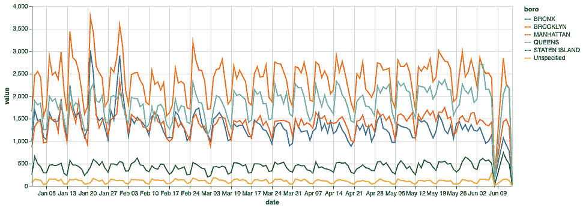
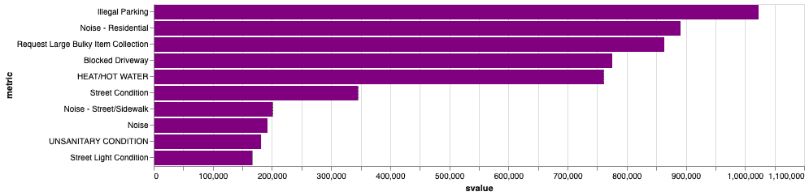
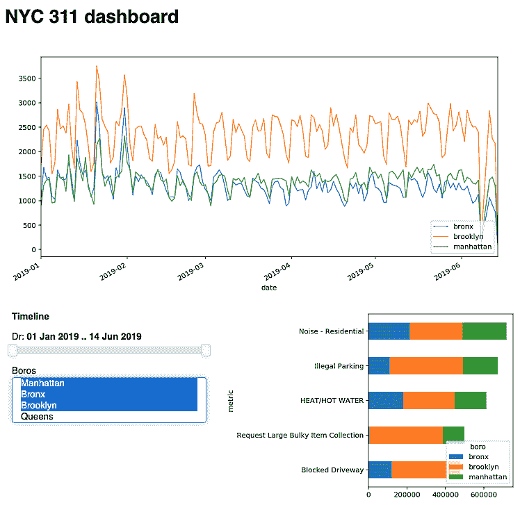

        

# 十五、让我们建立一个仪表板

在前一章中，我们学习了如何创建健壮的管道并对它们进行调度，以便我们每天都有更新的指标。这样，我们宝贵的数据产品就实现了自动化！我们做什么呢也许现在是讨论仪表板的好时机。仪表板本质上是您通过一组数据可视化来监控系统行为(您的服务、市场、用户或其他任何东西)的入口点。仪表板帮助团队和公司确保业务平稳运行，或者检测并适应变化或异常情况。因此，为了帮助我们更好地理解它们，让我们看看它们是如何工作的。

本章将涵盖以下主题:

*   构建仪表板的不同方法
*   构建静态仪表板...

        

# 技术要求

运行本章中的代码需要以下包:

*   `matplotlib`
*   `altair`可视化包，版本 3 或以上
*   `panel`

像往常一样，本章的所有代码都在 GitHub 存储库中的`Chapter17`文件夹中:[https://GitHub . com/packt publishing/Learn-Python-by-Building-Data-Science-Applications](https://github.com/PacktPublishing/Learn-Python-by-Building-Data-Science-Applications)。

        

# 构建仪表板–三种类型的仪表板

在[第 12 章](3ba037c3-3249-45f2-8f8a-0fa8af176e64.xhtml)、*数据探索和可视化*中，我们通过可视化不同的特征探索了一个数据集，使用了两个包——`matplotlib`和`altair`。这些可视化和仪表板之间的差异有两个方面:

*   仪表板的受众是广泛的，所以它应该很容易通过互联网浏览器访问。视觉化通常是为了自我消费。
*   仪表板应该经常更新，并且在某种程度上是交互式的。可视化通常是在现场完成的，是静态的，并且只显示数据的特定方面。

在很大程度上，仪表板是成熟的项目，需要定期改进和维护！然而，随着对此的需求...

        

# 静态仪表板

尽管名字如此，静态仪表板本身并不是静态的，它们不仅仅是静止的图像。这里，静态是指仪表板作为一个平面 HTML 文件；所有的交互都发生在客户端的浏览器中。因此，仪表板可以上传到网络上的任何地方(比如 S3 桶或类似的服务)，并且几乎免费，几乎不需要维护。更新仪表板或数据也很容易，基本上不需要停机。当然，这种方法意味着您不需要考虑仪表板的可伸缩性和性能。

显然，这种方法也有其缺点。首先，它仅限于它可以使用的特定数量的数据，数据集将基本上可供所有人直接使用。如果您的仪表板需要复杂的查询和实时聚合，这种方法将不起作用。很难为特定用户创建身份验证或定制仪表板。简而言之，这种类型的仪表板非常适合以下情况:

*   服务于广大受众。
*   它使用一个相对较小的数据集，可以很好地与每个人分享。
*   这些数据偶尔会更新，但绝对不是实时更新(计算可能会占用大量资源)。

对于许多后端开发人员和数据科学家来说，沿着这条路走下去的一个障碍是 JavaScript 本身。这实际上是编写交互式 web 应用程序的唯一选择。与此同时，大多数数据科学家和 Python 开发人员对 JavaScript 的了解还不足以在生产中使用它，并且通常甚至不想编写 JavaScript。有一些方法可以避免这种情况，例如，将你的代码编译成`WebAssembly`(浏览器也可以运行)，但是至少现在，这本身就是一项艰巨的任务，而且是一种巨大的过度杀戮。

另一个可能更好的替代方法是使用现有的 Python 工具和包，它们将为我们生成 HTML 和 JavaScript 代码。前面，我们提到了在笔记本和仪表板上可视化的区别，但是这种工具可以为这两种情况生成图表。

在前一章中，我们建立了一个管道，每天收集 311 电话的数据，然后生成一个报告。现在，让我们使用我们用来在笔记本中绘制交互式可视化的`altair`库来构建这些数据的静态仪表板。我们将以同样的方式开始:在笔记本中然后将其存储为 HTML 最后，我们将重定向可视化以使用外部数据集，即我们计划更新的数据集。

让我们开始准备笔记本并加载数据集:

```
import pandas as pd
import altair as alt

alt.data_transformers.disable_max_rows()

data = pd.read_csv('./data/top5.csv', parse_dates=['date',]).fillna(0)
```

现在，我们希望仪表板上有什么？通常，主要目标是突出任何时间异常——比如，数据收集中跳过的一天，或者投诉数量是否明显偏离。一种方法是显示投诉总数的折线图——比如按行政区划分:

```
timeline = alt.Chart(data, width=800).mark_line().encode(
    x='date',
    y='value',
    color='boro'
).transform_filter(
    (alt.datum.metric == 'complaints')
)
```

代码结果如下图所示:



我们已经看到了一些有趣的东西:6 月 7 日的缺失值以及 1 月和 2 月的一些峰值。这是一个很好的例子，说明了快速图形概览可以提供的洞察力类型。我们还可以看到不同行政区的不同程度的投诉——出于某种原因，布鲁克林比其他地方更多。

现在，看看这到底是怎么回事就好了——在给定的时间间隔内，哪种类型的投诉最受欢迎。让我们首先构建一个条形图，显示整个期间前五大投诉类型:

```
barchart = alt.Chart(data, width=800).mark_bar().encode(
    x='svalue:Q',
    y=alt.Y(
        'metric:N',
        sort=alt.EncodingSortField(
            field="svalue", # The field to use for the sort
            order="descending" # The order to sort in
        )        
    ),
    color=alt.value('purple'),
    tooltip=['metric', 'svalue:Q']).transform_filter(
    "datum.metric != 'complaints'").transform_filter(
    "datum.boro == 'NYC'").transform_aggregate(
    svalue='sum(value)',
    groupby=["metric" ]).transform_window(
    rank='rank(svalue)',
    sort=[alt.SortField('svalue', order='descending')])
    .transform_filter('datum.rank <= 10')
```

这里，出于同样的原因，我们必须过滤 NYC(以避免重复计算指标)和 complaints 指标。因为我们想去掉长尾，所以我们必须为每一行生成一个等级，然后根据它的值进行过滤。以下是结果:



最后，我们希望将两者结合起来:选择时间段并查看该时间段内投诉类型的分布。它只是两者的组合，并添加了一个`brush`元素:

```
brush = alt.selection_interval(encodings=['x'], empty='all')

T = timeline.add_selection(brush)

B = barchart.transform_filter(brush)

dash = alt.vconcat(A, B, data=data)
```

在这里，`dash`变量表示一个组合图表，它知道如何根据时间线上的间隔过滤条形。随意玩玩，看看顶级投诉如何随着时间的推移而变化！当然，还有很多功能需要添加(例如，查看一天中特定时间的不同投诉类型)，但是这些功能和转换对于快速设计来说会变得过于复杂——一般来说，这就是使用 Vega 堆栈并在浏览器中计算所有内容的缺点。

在下图中，您可以看到生成的仪表板的屏幕截图:


时间线上的灰色区域代表选定的范围。然后，该条形图显示该时间段内前 10 种投诉类型的投诉总数。这种交互性使我们能够更深入地研究数据，探索特定时期更细微的趋势。

我们可以想象将我们的仪表板链接到一个 API，作为提供平面文件的替代方案。这样，仪表板将显示当前时刻的数据；还可以将 Altair/Vega 连接到一个数据流，这样仪表板就会实时更新。

使用 Altair 很棒，因为它很容易创建一个具有高级交互的漂亮的可视化效果——除了它不起作用的情况。在下一节中，让我们来谈谈如何调试你的情节，了解哪里出错了。

        

# 调试 Altair

前面的例子是可行的，但是在现实世界中，任何开发都是一个试错的过程。由于产品的分层性质(Altair 将图表转换为 Vega-Lite，Vega-Lite 将它们转换为 Vega，Vega 引擎在 JavaScript 中工作),并且因为我们正在这个非 Pythonic 的世界中工作，所以使用 Vega 堆栈进行调试可能会令人生畏。

一般来说，与所有代码一样，该过程是隔离应用程序的不同部分和层，以确定问题的根源。认同会给你如何解决问题和解决问题的方法。不幸的是，我们不能仅仅分割规范的一部分。那么，如果你的图表没有按预期运行，我们该怎么办呢？

尽管有这些问题，...

        

# 将您的应用程序连接到 Luigi 管道

一旦仪表板开始工作并且看起来不错，我们就可以讨论它的部署细节了。目前，所有的数据都被内部化在仪表板本身中，这使得规范很大并且有点难以更新。让我们将图表链接到我们用 Luigi 生成并存储在 S3 存储桶中的外部 CSV 文件。我们可以从一开始就使用 URL(文件的路径);能够更容易地打开和研究数据集。将 URL 复制到数据集并覆盖属性:

```
url = 'https:/path/to/your/dataset.csv'
dash.data = url
```

确保它还在工作！现在，我们可以将仪表板写入 HTML，如下所示:

```
dash.save('chart.html')
```

正如我们在[第 12 章](3ba037c3-3249-45f2-8f8a-0fa8af176e64.xhtml)、*数据探索和可视化*中讨论的，这将存储一个独立的 HTML 页面和一个工作仪表板。最后一步是发布图表本身(例如，在同一个 S3 桶上)。发布后，每当我们更新 CSV 时，图表都会反映这些变化。我们可以通过安排 Luigi 管道每天运行来进一步自动化更新:有了它，我们将获得一个“实时”仪表板来监控城市中的 311 个情况。

这个仪表板几乎不花钱(只花我们在 S3 桶上的钱)，也不需要时间维护。它可以作为 Altair 对象、Vega-Lite/Vega 应用程序或标准的基于 HTML/JS 的应用程序轻松定制和开发。最后，这个仪表板可以根据您的设计准则轻松地进行样式化和重新样式化。这种方法既便宜又简单，但也有其局限性:与大多数基于客户端的可视化解决方案一样，Vega 所能反映的数据量有限，而且整个数据集需要公开，这并不总是一种选择。

所有这些使得 Altair 成为面向公众的图表和仪表板的优秀解决方案。不过，我们通常需要一个内部仪表板，能够访问大量数据，并能够深入到特定记录。为此，应该使用不同类型的仪表板:动态的、依赖于服务器的仪表板。让我们在下一节讨论它们。

        

# 了解动态仪表板

构建自己的仪表板的另一种方法是制作一个实际的 web 应用程序，在后端有一个运行 Python 的实时服务器；这将根据请求向您显示一个仪表板。本质上，这种方法与静态仪表板的优点和缺点完全相反:它需要维护，如果流量很大，需要扩展，而且可能会更慢。它还允许您配置访问权限，为任何用户或用户组自定义仪表板，并实时计算结果，即使是相对较大的数据集，也无需将此数据集作为一个整体与受众共享。

当然，我们可以构建一个完整的 web 应用程序，控制每一个特性(我们不会这样做...

        

# 第一次尝试面板

背后的想法非常简单和吸引人:考虑到我们本质上是用代码和图表——笔记本——来构建网页，我们简单地将它们转换成仪表板。最好的部分是所有的代码和每一个可以在 Jupyter 中使用的可视化库都可以在仪表板中使用；如果我们愿意，我们甚至可以使用现有的牛郎星图表。让我们试着从同一个数据集构建一些东西！与 Altair 一样，我们将从 Jupyter 笔记本开始:

```
import sqlite3

import param
import panel as pn
import datetime as dt
pn.extension()
```

现在，`panel`包旨在使构建交互式小部件成为探索过程的一部分变得极其容易。要构建一个交互，您只需要一个带有默认值的函数— `panel`将使用它们来理解值类型并相应地生成输入小部件。这里有一个极其幼稚的例子:

```
def interact_example(a=2, b=3):

    plot = plt.figure()
    ax = plot.add_subplot(111)

    pd.Series({'a':a, 'b':b}).plot(kind='bar',ax=ax)

    plt.tight_layout()
    plt.close(plot)
    return plot

pn.interact(interact_example)
```

下面的屏幕截图是前面代码的结果。条形图是交互式的，对输入的变化做出反应:


在这里，我们使用`matplotlib`作为基本的可视化工具。现在让我们尝试一个更复杂的任务——显示我们在第 16 章[和 Luigi 的*数据管道中收集的 311 个数据的汇总统计数据。*](beaaddb0-c3fe-481f-8530-a843a42afac3.xhtml)

        

# 从数据库中读取数据

在我们深入研究可视化的本质之前，让我们先获取数据。这里，我们将使用数据库连接到创建的 SQLite 文件。首先，我们将创建一个到文件的连接:

```
import sqlitecon = sqlite3.connect('../Chapter16/data/311.db')
```

接下来，我们将定义一个简单的查询来将原始记录聚合到统计数据中:

```
Q = '''SELECT date(created_date) as date, lower(borough) as boro, complaint_type, COUNT(*) as complaintsFROM raw WHERE borough != 'Unspecified' GROUP BY 1,2,3;'''
```

最后，我们将使用`pandas` SQL 命令提取数据。当我们处理 SQLite 时，我们必须重新解析 Python 中的日期时间:

```
DATA = pd.read_sql_query(Q, con)DATA['date'] = pd.to_datetime(DATA['date'])
```

或者，...

        

# 在 Jupyter 中创建交互式仪表板

我们在上一节中使用的功能方法便于在笔记本中探索。然而，对于复杂的仪表板，更好的方法是对更复杂的仪表板使用某种声明性的方法。为了做到这一点，我们需要从面板的`param.Parameterized`对象继承，并在属性化时声明参数。对于每个视图，我们将创建一个单独的方法，使用`@param.depends('param1', 'param2')`装饰器将视图刷新与相应的参数更新绑定在一起。让我们试一试:

1.  首先，我们将使用一个简单的日期时间值元组来定义`DateRange`参数:

```
bounds = (dt.datetime(2019,1,1),dt.datetime(2019,5,30))
dr = param.DateRange(bounds=bounds, default=bounds)
```

2.  我们想要使用的另一个参数是行政区。因为我们希望能够同时选择多个行政区，所以我们必须显式地传递它们:

```
boros_list = ['Manhattan', 'Bronx', 'Brooklyn', 'Queens', 'Staten Island']
boros = param.ListSelector(default=boros_list, objects=boros_list)
```

3.  一旦定义了参数，我们就可以基于虚拟的`param.Parametrized`类创建我们的视图对象，如下所示:

```
class Timeline(param.Parameterized):
    dr = dr
    boros = boros
```

4.  接下来，我们需要绘制可视化。因为这里的一切都在 Python 中运行，所以我们只需要访问输入参数，根据它们过滤数据，并制作图表，返回绘图。装饰者将告诉面板我们希望图表在哪些参数上更新。我们从时间线开始:

```
    # method for Timeline
    @param.depends('dr', 'boros')
    def view_tl(self):
        start, end = pd.to_datetime(self.dr[0]), 
                     pd.to_datetime(self.dr[1])

        tl_data = boro_total.loc[(boro_total.index >= start) & 
                  (boro_total.index <= end), 
                  [el.lower() for el in self.boros]]

        plot = plt.figure(figsize=(10,5))    
        ax = plot.add_subplot(111)
        tl_data.plot(ax=ax, linewidth=1)

        ax.legend(loc=4)
        plt.tight_layout()
        plt.close(plot)
        return plot
```

同样，我们将为五大投诉类型创建一个图表。它还包括装饰器、过滤和可视化部分。考虑以下代码:

```
    @param.depends('dr', 'boros')
    def view_top(self, N=5):
        start, end = pd.to_datetime(self.dr[0]), 
                     pd.to_datetime(self.dr[1])

        boro_mask = DATA.boro.isin([el.lower() 
                    for el in self.boros])
        time_mask = (DATA.date >= start) 
                     & (DATA.date <= end)

        top = DATA[boro_mask & time_mask]

        S = top.groupby(['complaint_type', 'boro'])
            ['complaint_type'].count().unstack()
        topN = S.iloc[S.sum(1).argsort()].tail(N)

        plot = plt.figure()
        ax = plot.add_subplot(111)

        topN.plot(kind='barh',stacked=True, ax=ax)
        plt.tight_layout()
        plt.close(plot)

        return plot
```

仪表板背后的逻辑到此结束。现在，我们需要定义它的布局。为此，我们将使用 Panel 的`Row`和`Column`对象创建一个简单的网格。对于更高级的布局，`panel`也有一个`Grid`对象，但我们不会在这里使用它:

```
panel = pn.Column( '<h1>NYC 311 dashboard</h1>',
                  T.view_tl, 
                  pn.Row(T.param, T.view_top,), sizing_mode='stretch_width')
```

现在，我们所需要的就是开始提供`panel`:

```
panel.servable()
```

因此，我们将获得以下仪表板:



仪表板可以表示为单独的窗口，使用 an 的两个对象方法——`panel.show()`或`panel.servable()`。两者都会产生一个新的浏览器选项卡，服务于仪表板。它们之间的区别在于，使用第二种方法，我们也可以在没有附加 Jupyter 笔记本的情况下，使用 bash 命令运行仪表板:

```
 panel serve --show 2_panel.ipynb 
```

使用`panel serve`，我们可以将仪表板部署为独立的 web 应用程序。我们所需要的就是在一台专用机器上部署环境(我们需要的所有包和 Python 本身),并让它运行这个命令。在这种情况下，我们可以将 SQLite 连接与外部数据库的连接进行交换，以便在仪表板和任何其他应用程序之间共享数据。动态仪表板的强大之处在于其大容量和灵活性。这里，我们忽略了计算每天主要投诉类型的中间步骤，能够对原始数据进行分析。如果需要，我们也可以一直深入下去，检查特定记录的属性。

由于一切都在服务器上运行，在 Python 中，我们可以使用任何包，并且在设计仪表板时非常灵活。正如我们提到的，Panel 支持任何可以在笔记本中呈现的可视化，因此您甚至可以重用您已经拥有的一些可视化，包括我们在 Altair 中构建的可视化。

这种方法的一个限制是，我们只能在我们使用的所有库允许的范围内控制可视化的外观；例如，虽然我们可以使用 Altair，但至少目前没有办法收回它的参数并使用它与其他包进行交互。

总体而言，动态仪表板为探索和交流您的数据提供了广泛的可能性。与静态的相比，它们易于编写，支持任何 Python 包，并且可以从原始数据中提取数据，从而完成繁重的数据消费和聚合工作。当然，这需要专用的服务器，并且可能需要维护和治理，尤其是在对公众开放的情况下。

        

# 摘要

在这一章中，我们学习了构建两个类似的仪表板——一个是静态的，不需要服务器，使用 Altair 另一个是动态的，使用`panel`包，从一个普通的 Jupyter 笔记本构建，带有任意代码和可视化包。我们讨论了每种方法的优缺点以及何时选择一种方法。

无论哪种方式，仪表板都是向您的同事和客户传达您的数据产品的好方法。仪表板使我们能够深入了解业务流程并尽早发现问题。在许多情况下，这将是一个完美的交付。但是，在某些情况下，您可能需要为代码创建一个编程访问点，例如，为外部应用程序创建一个机器学习算法...

        

# 问题

1.  在笔记本和仪表板上可视化数据的主要区别是什么？
2.  为什么我们称一些仪表盘为“静态”？静态仪表板的优缺点是什么？
3.  使用动态仪表板有什么好处？
4.  `panel`套餐有什么特点？

        

# 进一步阅读

*   Shashank Shekhar 的 Apache Superset 快速入门指南，由 Packt 出版([https://www . packtpub . com/big-data-and-business-intelligence/Apache-Superset-Quick-Start-Guide](https://www.packtpub.com/big-data-and-business-intelligence/apache-superset-quick-start-guide))
*   *可视化仪表盘设计*(【https://hub.packtpub.com/visualization-dashboard-design/】T2)