# 九、从大数据到小数据

现在我们已经有了一些用于分析的清理数据，让我们首先看看如何在数据集中找到解决大量变量的方法。本章将介绍一些统计技术通过降维和特征提取来减少变量的数量，例如:

*   **主** **成分分析** ( **PCA** )
*   **因素** **分析** ( **FA** )
*   **多维标度**(**【MDS】**)和一种少数其他技术

### 注意

大多数降维方法要求数据集中的两个或更多数值变量高度关联或相关，因此我们矩阵中的列不是完全相互独立的。在这种情况下，降维的目标是将数据集中的列数减少到实际的矩阵秩；或者换句话说，可以减少变量的数量，同时保留大部分信息内容。在线性代数中，矩阵秩指的是矩阵生成的向量空间的维数——或者更简单地说，是二次矩阵中独立列和行的数量。可能通过一个简单的例子更容易理解排名:想象一个关于学生的数据集，其中我们知道受访者的性别、年龄和出生日期。这个数据是多余的，因为年龄可以从出生日期开始计算(通过线性变换)。类似地，year 变量在`hflights`数据集中是静态的(没有任何可变性),经过的时间也可以通过出发和到达时间来计算。

这些转换基本上集中在变量之间确定的共同方差上，并排除剩余的总(唯一)方差。这会产生一个包含较少列的数据集，这可能更容易维护和处理，但代价是一些信息丢失和人工变量的创建，这些变量通常比原始列更难理解。

在完全相关的情况下，除了一个完全相关的变量之外，其他变量都可以忽略，因为其他变量不提供关于数据集的额外信息。尽管这种情况并不经常发生，但在大多数情况下，从一组问题中提取一个或几个组成部分仍然是完全可以接受的，例如在调查中进行进一步分析。

# 充分性测试

你在考虑用多元统计分析降低维数或寻找数据集中的潜在变量时，首先要做的是检查变量是否相关，数据是否正态分布。

## 常态

后者通常不是一个严格的要求。例如，如果我们没有多元正态性，主成分分析的结果仍然有效并可以解释；另一方面，最大似然因子分析确实有这个强有力的假设。

### Tip

您应该始终根据数据的特征，使用适当的方法来实现数据分析目标。

无论如何，你可以使用(例如)`qqplot`进行变量的成对比较，使用`qqnorm`进行变量的单变量正态性检验。首先，让我们用`hflights`的一个子集来演示一下:

```r
> library(hlfights)

> JFK <- hflights[which(hflights$Dest == 'JFK'),

+                 c('TaxiIn', 'TaxiOut')]

```

因此，我们将数据集过滤为那些飞往约翰·肯尼迪国际机场的航班，我们只对两个变量感兴趣，这两个变量描述了以分钟为单位的滑行进出时间。使用传统的`[`索引的上述命令可以用`subset`重构，以获得可读性更好的源代码:

```r
> JFK <- subset(hflights, Dest == 'JFK', select = c(TaxiIn, TaxiOut))

```

请注意，现在不需要在`subset`调用中引用变量名或引用`data.frame`名。更多细节请参见[第三章](ch03.html "Chapter 3. Filtering and Summarizing Data")、*数据过滤汇总*。现在让我们看看这两列的值是如何分布的:

```r
> par(mfrow = c(1, 2))

> qqnorm(JFK$TaxiIn, ylab = 'TaxiIn')

> qqline(JFK$TaxiIn)

> qqnorm(JFK$TaxiOut, ylab = 'TaxiOut')

> qqline(JFK$TaxiOut)

```

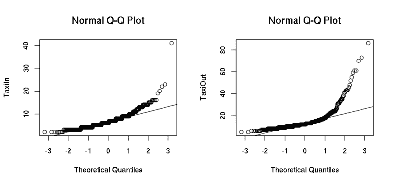

为了呈现前面的图，我们创建了一个新的图形设备(用`par`来连续保存两个图)，然后称为`qqnorm`，来显示相对于正态分布的经验变量的分位数，并且还为后者添加了一行`qqline`，以便于比较。如果数据先前被缩放，`qqline`将呈现一条 45 度线。

检查 QQ 图表明数据不符合正态分布，这也可以通过夏皮罗-维尔克正态性测试等分析测试来验证:

```r
> shapiro.test(JFK$TaxiIn)

 Shapiro-Wilk normality test

data:  JFK$TaxiIn

W = 0.8387, p-value < 2.2e-16

```

`p-value`真的很小，所以零假设(说明数据是正态分布的)被拒绝。但是，在没有单独的统计检验的情况下，我们如何检验一组变量的正态性呢？

## 多元常态

对于多个变量也存在类似的统计检验；这些方法提供了不同的方法来检查数据是否符合多元正态分布。为此，我们将使用`MVN`包，但是类似的方法也可以在`mvnormtest`包中找到。后者还包括之前讨论过的夏皮罗-维尔克检验的多变量版本。

但是马迪亚测试更常用于检验多元正态性，更好的是，它没有将样本量限制在 5000 以下。在加载了`MVN`包之后，调用适当的 R 函数非常简单，解释非常直观——在我们的数据集中去掉缺失的值之后:

```r
> JFK <- na.omit(JFK)

> library(MVN)

> mardiaTest(JFK)

 Mardia's Multivariate Normality Test 

--------------------------------------- 

 data : JFK 

 g1p            : 20.84452 

 chi.skew       : 2351.957 

 p.value.skew   : 0 

 g2p            : 46.33207 

 z.kurtosis     : 124.6713 

 p.value.kurt   : 0 

 chi.small.skew : 2369.368 

 p.value.small  : 0 

 Result          : Data is not multivariate normal. 

---------------------------------------

```

### Tip

关于处理和过滤缺失值的更多细节，请参见[第八章](ch08.html "Chapter 8. Polishing Data")、*打磨数据*。

在三个 p 值中，第三个指的是样本量极小的情况(<20), so now we only concentrate on the first two values, both below 0.05\. This means that the data does not seem to be multivariate normal. Unfortunately, Mardia's 检验在某些情况下表现不佳，因此使用更稳健的方法可能更合适。

`MVN`包也可以运行 Henze-Zirkler 和 Royston 的多元正态性检验。两者都返回用户友好且易于解释的结果:

```r
> hzTest(JFK)

 Henze-Zirkler's Multivariate Normality Test 

--------------------------------------------- 

 data : JFK 

 HZ      : 42.26252 

 p-value : 0 

 Result  : Data is not multivariate normal. 

--------------------------------------------- 

> roystonTest(JFK)

 Royston's Multivariate Normality Test 

--------------------------------------------- 

 data : JFK 

 H       : 264.1686 

 p-value : 4.330916e-58 

 Result  : Data is not multivariate normal. 

---------------------------------------------

```

测试多元正态性的一个更直观的方法是绘制与我们之前使用的类似的 QQ 图。但是，不要只将一个变量与理论正态分布进行比较，让我们首先计算我们变量之间的平方马氏距离，它应该遵循卡方分布，自由度是我们变量的数量。 `MVN`包可以自动计算所有需要的值，并使用前面的正态性测试 R 函数进行渲染；只需将`qqplot`参数设置为`TRUE`:

```r
> mvt <- roystonTest(JFK, qqplot = TRUE)

```

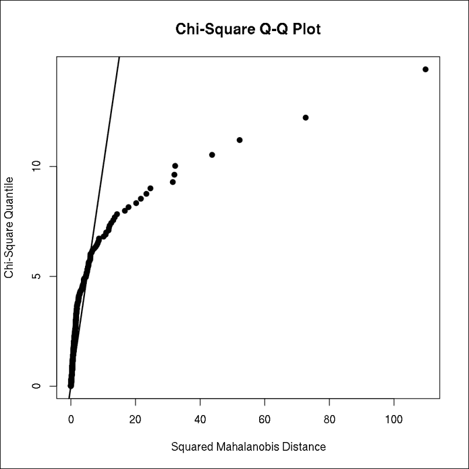

如果数据集呈正态分布，前面图表中显示的点应该符合直线。其他可选的图形方法可以用之前创建的`mvt` R 对象产生更加直观和用户友好的图形。`MVN`包提供了`mvnPlot`函数，该函数可以呈现两个变量的透视和等高线图，从而提供了一种测试双变量正态性的好方法:

```r
> par(mfrow = c(1, 2))

> mvnPlot(mvt, type = "contour", default = TRUE)

> mvnPlot(mvt, type = "persp", default = TRUE)

```

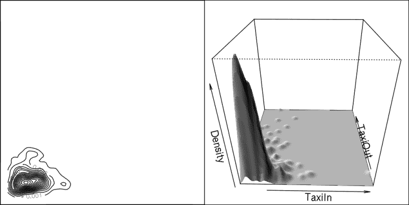

在右边的图中，您可以在透视图上看到两个变量的经验分布，其中大多数情况可以在左下角找到。这意味着大多数航班只有相对较短的 **滑入**和**滑出**的时间，这表明了一个相当厚尾的分布。左图显示了一个类似的图像，但是是鸟瞰图:等高线代表右侧 3D 图的横截面。多元正态分布看起来更集中，有点像二维钟形曲线:

```r
> set.seed(42)

> mvt <- roystonTest(MASS::mvrnorm(100, mu = c(0, 0),

+          Sigma = matrix(c(10, 3, 3, 2), 2)))

> mvnPlot(mvt, type = "contour", default = TRUE)

> mvnPlot(mvt, type = "persp", default = TRUE)

```


参见[第十三章](ch13.html "Chapter 13. Data Around Us")，*我们身边的数据*关于如何在空间数据上创建类似的等高线图。

## 变量的相关性

除了正态性，当应用降维方法时，需要相对较高的相关系数。原因是，如果变量之间没有统计关系，以为例，PCA 将返回完全相同的值，无需太多转换。

为此，让我们看看`hflights`数据集的数值变量是如何关联的(输出是一个大矩阵，这次被抑制了):

```r
> hflights_numeric <- hflights[, which(sapply(hflights, is.numeric))]

> cor(hflights_numeric, use = "pairwise.complete.obs")

```

在前面的例子中，我们创建了一个新的 R 对象，只保存原始数据帧`hflights`的数字列，省略了五个字符向量。然后，我们运行`cor`，成对删除缺失值，这将返回一个 16 列 16 行的矩阵:

```r
> str(cor(hflights_numeric, use = "pairwise.complete.obs"))

 num [1:16, 1:16] NA NA NA NA NA NA NA NA NA NA ...

 - attr(*, "dimnames")=List of 2

 ..$ : chr [1:16] "Year" "Month" "DayofMonth" "DayOfWeek" ...

 ..$ : chr [1:16] "Year" "Month" "DayofMonth" "DayOfWeek" ...

```

所得相关矩阵中缺失值的数量似乎非常多。这是因为`Year`在所有情况下都是 2011 年，因此导致标准偏差为零。明智的做法是将`Year`和非数字变量一起从数据集中排除——不仅要过滤数字值，还要检查方差:

```r
> hflights_numeric <- hflights[,which(

+     sapply(hflights, function(x)

+         is.numeric(x) && var(x, na.rm = TRUE) != 0))]

```

现在缺失值的数量少了很多:

```r
> table(is.na(cor(hflights_numeric, use = "pairwise.complete.obs")))

FALSE  TRUE 

 209    16

```

您能猜出为什么尽管成对删除了缺失值，我们仍然有一些缺失值吗？运行前面的命令会产生一个信息丰富的警告，但是我们稍后会回到这个问题:

```r
Warning message:

In cor(hflights_numeric, use = "pairwise.complete.obs") :

 the standard deviation is zero

```

现在让我们继续分析 15x15 相关矩阵中的实际数字，这对于在本书中打印来说太大了。为此，我们没有显示之前显示的原始`cor`命令的结果，而是让我们用 `ellipse`包的图形功能来可视化这 225 个数字:

```r
> library(ellipse)

> plotcorr(cor(hflights_numeric, use = "pairwise.complete.obs"))

```

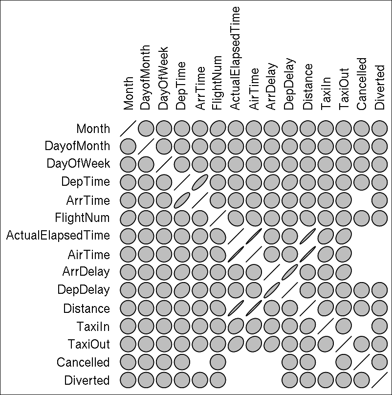

现在我们看到用椭圆表示的相关矩阵的值，其中:

*   正圆代表相关系数为零
*   面积较小的椭圆反映了相关系数离零相对较大的距离
*   切线代表系数的负/正号

为了帮助您分析前面的结果，让我们用一些更容易理解的人工生成的数字绘制一个类似的图:

```r
> plotcorr(cor(data.frame(

+     1:10,

+     1:10 + runif(10),

+     1:10 + runif(10) * 5,

+     runif(10),

+     10:1,

+     check.names = FALSE)))

```

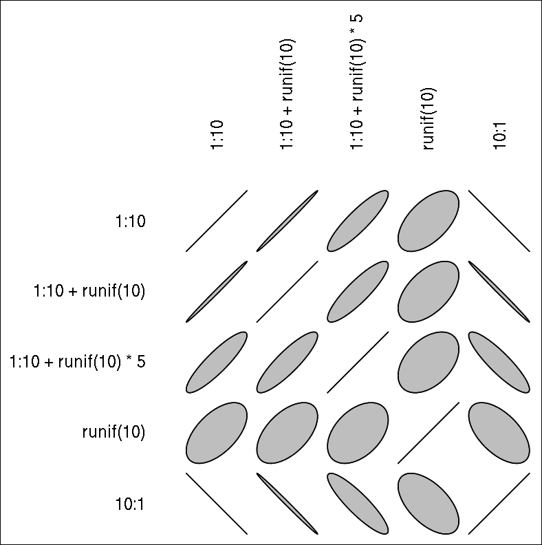

用 `corrgram`软件包可以创建相关矩阵的类似图。

但是让我们回到的`hflights`数据集！在上图中，与时间相关的变量呈现了一些窄椭圆，显示了相对较高的相关系数，甚至`Month`变量似乎也与`FlightNum`函数略有关联:

```r
> cor(hflights$FlightNum, hflights$Month)

[1] 0.2057641

```

另一方面，该图在大多数情况下显示了完美的圆，其代表零附近的相关系数。这表明大多数变量根本不相关，因此计算原始数据集的主成分不会有很大帮助，因为普通方差的比例较低。

## KMO 和巴列特的试验

我们可以通过大量的统计测试来验证这种关于低公度的假设；例如，SAS 和 SPSS 人员倾向于使用 KMO 或巴特利特的测试来查看数据是否适合 PCA。这两种算法在 R 中都可用，例如通过 `psych`包:

```r
> library(psych)

> KMO(cor(hflights_numeric, use = "pairwise.complete.obs"))

Error in solve.default(r) : 

 system is computationally singular: reciprocal condition number = 0

In addition: Warning message:

In cor(hflights_numeric, use = "pairwise.complete.obs") :

 the standard deviation is zero

matrix is not invertible, image not found

Kaiser-Meyer-Olkin factor adequacy

Call: KMO(r = cor(hflights_numeric, use = "pairwise.complete.obs"))

Overall MSA = NA

MSA for each item = 

 Month    DayofMonth     DayOfWeek 

 0.5        0.5        0.5 

 DepTime      ArrTime     FlightNum 

 0.5        NA        0.5 

ActualElapsedTime      AirTime     ArrDelay 

 NA        NA        NA 

 DepDelay     Distance      TaxiIn 

 0.5        0.5        NA 

 TaxiOut     Cancelled     Diverted 

 0.5        NA        NA

```

不幸的是，由于先前识别的相关矩阵的缺失值，在先前的输出中没有`Overall MSA` ( *采样充分性的度量*，表示变量之间的平均相关性)。让我们挑选一对相关系数为`NA`的变量进行进一步分析！这样的一对可以很容易地从前面的图中识别出来；没有为缺失值绘制圆或椭圆，例如`Cancelled`和`AirTime`:

```r
> cor(hflights_numeric[, c('Cancelled', 'AirTime')])

 Cancelled AirTime

Cancelled         1      NA

AirTime          NA       1

```

这可以用一个事实来解释，如果一个航班被取消，那么在空中度过的时间不会有太大的变化；此外，该数据不可用:

```r
> cancelled <- which(hflights_numeric$Cancelled == 1)

> table(hflights_numeric$AirTime[cancelled], exclude = NULL)

<NA> 

2973

```

因此，由于这些`NA`，我们在调用`cor`时会得到缺失的值；类似地，当调用带有成对删除的`cor`时，我们也得到`NA`，因为只有未取消的航班保留在数据集中，导致的`Cancelled`变量的方差为零:

```r
> table(hflights_numeric$Cancelled)

 0      1 

224523   2973

```

这建议在我们运行之前讨论的假设测试之前，从数据集中删除`Cancelled`变量，因为存储在该变量中的信息在数据集的其他列中也是冗余的。或者，换句话说，`Cancelled`列可以通过其他列的线性变换来计算，这可以在进一步的分析中忽略:

```r
> hflights_numeric <- subset(hflights_numeric, select = -Cancelled)

```

让我们看看相关矩阵中是否还有任何缺失值:

```r
> which(is.na(cor(hflights_numeric, use = "pairwise.complete.obs")),

+   arr.ind = TRUE)

 row col

Diverted           14   7

Diverted           14   8

Diverted           14   9

ActualElapsedTime   7  14

AirTime             8  14

ArrDelay            9  14

```

看来`Diverted`栏要对类似的情况负责，另外三个变量在航班改航的时候是没有的。在另一个子集之后，我们现在准备在全相关矩阵上调用 KMO:

```r
> hflights_numeric <- subset(hflights_numeric, select = -Diverted)

> KMO(cor(hflights_numeric[, -c(14)], use = "pairwise.complete.obs"))

Kaiser-Meyer-Olkin factor adequacy

Call: KMO(r = cor(hflights_numeric[, -c(14)], use = "pairwise.complete.obs"))

Overall MSA =  0.36

MSA for each item = 

 Month        DayofMonth         DayOfWeek 

 0.42              0.37              0.35 

 DepTime           ArrTime         FlightNum 

 0.51              0.49              0.74 

ActualElapsedTime           AirTime          ArrDelay 

 0.40              0.40              0.39 

 DepDelay          Distance            TaxiIn 

 0.38              0.67              0.06 

 TaxiOut 

 0.06

```

`Overall MSA`或所谓的 T2 凯泽-迈耶-奥尔金 ( **KMO** )指数是 0 和 1 之间的数字；该值表明变量的偏相关是否足够小，可以继续使用数据简化方法。根据 Kaiser 的建议，下表列出了 KMO 的一般评级体系或经验法则:

| 

价值

 | 

描述

 |
| --- | --- |
| KMO < 0.5 | 不能接受的 |
| 0.5 < KMO < 0.6 | 悲惨的 |
| 0.6 < KMO < 0.7 | 普通的 |
| 0.7 < KMO < 0.8 | 中等的 |
| 0.8 < KMO < 0.9 | 值得称赞的 |
| KMO > 0.9 | 非凡的 |

低于 0.5 的 KMO 指数被认为是不可接受的，这基本上意味着从相关矩阵计算的偏相关表明变量对于有意义的维度缩减或潜在变量模型而言相关性不够。

尽管省去一些 MSA 最低的变量会提高`Overall MSA`，并且我们可以在接下来的页面中构建一些适当的模型，出于教学目的，我们暂时不会在数据转换上花费更多时间，我们将使用`mtcars`数据集，该数据集在[第 3 章](ch03.html "Chapter 3. Filtering and Summarizing Data")、*过滤和汇总数据*中介绍过:

```r
> KMO(mtcars)

Kaiser-Meyer-Olkin factor adequacy

Call: KMO(r = mtcars)

Overall MSA =  0.83

MSA for each item = 

 mpg  cyl disp   hp drat   wt qsec   vs   am gear carb 

0.93 0.90 0.76 0.84 0.95 0.74 0.74 0.91 0.88 0.85 0.62

```

看来`mtcars`数据库是多元统计分析的绝佳选择。这也可以通过所谓的 Bartlett 检验来验证，Bartlett 检验表明相关矩阵是否类似于单位矩阵。或者换句话说，变量之间是否存在统计关系。另一方面，如果相关矩阵除对角线外只有零点，那么变量是相互独立的；因此，考虑多变量方法没有多大意义。 `psych`包提供了一个简单易用的函数来计算 Bartlett 的测试:

```r
> cortest.bartlett(cor(mtcars))

$chisq

[1] 1454.985

$p.value

[1] 3.884209e-268

$df

[1] 

55

```

非常低的`p-value`表明我们拒绝 Bartlett 检验的零假设。这意味着相关矩阵不同于单位矩阵，因此变量之间的相关系数似乎更接近于 1 而不是 0。这与高 KMO 值同步。

### 注意

在关注实际统计方法之前，请注意，尽管前面的假设在大多数情况下是有意义的，并且应该作为经验法则来遵循，但 KMO 和巴特利特的测试并不总是必需的。高公度对于因子分析和其他潜在模型非常重要，例如，PCA 是一种数学变换，甚至可以在低 KMO 值下工作。


# 主成分分析

对于数据科学家来说，在具有大量变量的数据库中找到真正重要的字段可能是一项具有挑战性的任务。这就是**主成分分析** ( **PCA** )发挥作用的地方:找到数据的核心成分。它是 100 多年前由卡尔·皮尔逊发明的，从那时起它就被广泛应用于各种领域。

PCA 的目的是在正交变换的帮助下，以更有意义的结构解释数据。这种线性变换旨在揭示数据集的内部结构，在向量空间中使用任意设计的新基，这最好地解释了数据的方差。用简单的英语来说，这仅仅意味着我们从原始数据中计算新的变量，其中这些新的变量包括以递减顺序排列的原始变量的方差。

这可以通过协方差、相关矩阵的特征分解(所谓的 R 模式 PCA)或者数据集的奇异值分解(所谓的 Q 模式 PCA)来完成。每种方法都有很大的优势，例如计算性能、内存需求，或者在特征分解中使用相关矩阵时，在将数据传递给 PCA 之前简单地避免数据的预先标准化。

无论哪种方式，PCA 都可以成功地提供数据的低维图像，其中不相关的主成分是原始变量的线性组合。当分析人员识别变量的基本结构时，这种信息丰富的概述会有很大的帮助；因此，该技术经常用于探索性数据分析。

PCA 产生与原始变量完全相同数量的提取成分。第一个组成部分包括大部分的公共方差，因此它在描述原始数据集时具有最高的重要性，而最后一个组成部分通常只包括来自一个原始变量的一些独特信息。基于此，我们通常只保留主成分分析的前几个分量，以供进一步分析，但我们也会看到一些用例，在这些用例中，我们将专注于提取的唯一方差。

## 主成分分析算法

r 提供了各种函数来运行 PCA。虽然可以通过 `eigen`或`svd`手动计算分量作为 R 模式或 Q 模式 PCA，但为了简单起见，我们将集中于更高级的功能。依靠我的统计教师背景，我认为有时专注于如何运行分析和解释结果比花太多时间在线性代数背景上更有效——特别是在给定的时间/页面限制下。

r 模式 PCA 可以由`princomp`或`psych`包中的`principal`进行，而更优选的 Q 模式 PCA 可以由`prcomp`调用。现在让我们关注后者，看看`mtcars`的组件是什么样子的:

```r
> prcomp(mtcars, scale = TRUE)

Standard deviations:

 [1] 2.57068 1.62803 0.79196 0.51923 0.47271 0.46000 0.36778 0.35057

 [9] 0.27757 0.22811 0.14847

Rotation:

 PC1       PC2       PC3        PC4       PC5       PC6

mpg   -0.36253  0.016124 -0.225744 -0.0225403  0.102845 -0.108797

cyl    0.37392  0.043744 -0.175311 -0.0025918  0.058484  0.168554

disp   0.36819 -0.049324 -0.061484  0.2566079  0.393995 -0.336165

hp     0.33006  0.248784  0.140015 -0.0676762  0.540047  0.071436

drat  -0.29415  0.274694  0.161189  0.8548287  0.077327  0.244497

wt     0.34610 -0.143038  0.341819  0.2458993 -0.075029 -0.464940

qsec  -0.20046 -0.463375  0.403169  0.0680765 -0.164666 -0.330480

vs    -0.30651 -0.231647  0.428815 -0.2148486  0.599540  0.194017

am    -0.23494  0.429418 -0.205767 -0.0304629  0.089781 -0.570817

gear  -0.20692  0.462349  0.289780 -0.2646905  0.048330 -0.243563

carb   0.21402  0.413571  0.528545 -0.1267892 -0.361319  0.183522

 PC7        PC8       PC9      PC10      PC11

mpg   0.367724 -0.7540914  0.235702  0.139285 -0.1248956

cyl   0.057278 -0.2308249  0.054035 -0.846419 -0.1406954

disp  0.214303  0.0011421  0.198428  0.049380  0.6606065

hp   -0.001496 -0.2223584 -0.575830  0.247824 -0.2564921

drat  0.021120  0.0321935 -0.046901 -0.101494 -0.0395302

wt   -0.020668 -0.0085719  0.359498  0.094394 -0.5674487

qsec  0.050011 -0.2318400 -0.528377 -0.270673  0.1813618

vs   -0.265781  0.0259351  0.358583 -0.159039  0.0084146

am   -0.587305 -0.0597470 -0.047404 -0.177785  0.0298235

gear  0.605098  0.3361502 -0.001735 -0.213825 -0.0535071

carb -0.174603 -0.3956291  0.170641  0.072260  0.3195947

```

### 注意

请注意，我们在调用`prcomp`时将`scale`设置为`TRUE`，由于向后兼容 S 语言，默认为`FALSE`。但是总的来说，强烈推荐缩放。使用缩放选项相当于在先前缩放数据集后对数据集运行 PCA，例如:`prcomp(scale(mtcars))`，这导致数据具有单位方差。

首先，`prcomp`返回主成分的标准差，它显示了 11 个成分保留了多少信息。第一个分量的标准偏差远大于任何其他后续值，这解释了 60%以上的差异:

```r
> summary(prcomp(mtcars, scale = TRUE))

Importance of components:

 PC1   PC2   PC3    PC4    PC5    PC6    PC7

Standard deviation     2.571 1.628 0.792 0.5192 0.4727 0.4600 0.3678

Proportion of Variance 0.601 0.241 0.057 0.0245 0.0203 0.0192 0.0123

Cumulative Proportion  0.601 0.842 0.899 0.9232 0.9436 0.9628 0.9751

 PC8   PC9    PC10  PC11

Standard deviation     0.3506 0.278 0.22811 0.148

Proportion of Variance 0.0112 0.007 0.00473 0.002

Cumulative Proportion  0.9863 0.993 0.99800 1.000

```

除了第一个成分，只有第二个成分的标准差大于 1，这意味着只有前两个成分包含的信息至少与原始变量一样多。或者换句话说:只有前两个变量的特征值高于 1。特征值可以通过主分量的标准偏差的平方来计算，总计为预期的原始变量的数量:

```r
> sum(prcomp(scale(mtcars))$sdev^2)

[1] 11

```

## 确定组件的数量

PCA 算法总是计算与原始数据集中变量数量相同的主成分数量。组件的重要性从第一个到最后一个递减。

根据经验，我们可以简单地保留所有标准差大于 1 的成分。这意味着我们保留那些组件，这至少解释了与原始变量一样多的差异:

```r
> prcomp(scale(mtcars))$sdev^2

 [1] 6.608400 2.650468 0.627197 0.269597 0.223451 0.211596 0.135262

 [8] 0.122901 0.077047 0.052035 0.022044

```

因此，前面的总结建议只保留 11 个成分中的两个，这解释了几乎 85%的差异:

```r
> (6.6 + 2.65) / 11

[1] 0.8409091

```

scree plot 是帮助我们确定最佳组件数量的另一个很好的可视化工具。幸运的是，`psych`包中至少有两个很棒的函数我们可以在这里使用:`scree`和`VSS.scree`函数:

```r
> VSS.scree(cor(mtcars))

```

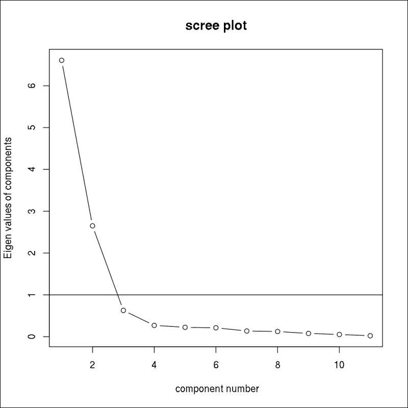

```r
> scree(cor(mtcars))

```

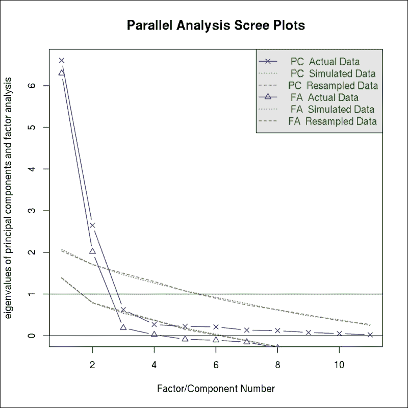

前面两个图之间的唯一区别是`scree`还向显示了除 PCA 之外的因子分析的特征值。在这一章的下一节中可以读到更多的内容。

可以看出，`VSS.scree`提供了对主成分特征值的直观概述，并且它还通过水平线突出了 1 处的临界值。这通常被称为凯泽准则。

除了这个经验法则之外，如前所述，人们还可以依赖所谓的肘规则，其简单地表明，线图代表一只手臂，组件的最佳数量是可以找到这只手臂的肘的点。所以我们必须寻找曲线变得不那么陡的点。在这种情况下，这个突变可能是在 3 处，而不是 2 处，正如我们用凯泽标准所发现的那样。

除了 Cattell 最初的 scree 测试，我们还可以将之前描述的组件的`scree`与一些随机数据进行比较，以确定要保留的组件的最佳数量:

```r
> fa.parallel(mtcars)

```


```r
Parallel analysis suggests that the number of factors = 2 

and the number of components =  2

```

现在，我们已经验证了主成分的最佳数量，以便用各种统计工具进行进一步分析，我们可以只使用两个变量而不是 11 个变量，这太棒了！但是这些人为创造的变量实际上意味着什么呢？

## 解释组件

降低数据维度的唯一问题是，发现我们新创建、高度压缩和转换的数据实际上是什么会非常令人沮丧。现在我们有 32 辆车的`PC1`和`PC2`:

```r
> pc <- prcomp(mtcars, scale = TRUE)

> head(pc$x[, 1:2])

 PC1      PC2

Mazda RX4         -0.646863  1.70811

Mazda RX4 Wag     -0.619483  1.52562

Datsun 710        -2.735624 -0.14415

Hornet 4 Drive    -0.306861 -2.32580

Hornet Sportabout  1.943393 -0.74252

Valiant           -0.055253 -2.74212

```

这些值是通过将原始数据集乘以确定的权重，即所谓的载荷(`rotation`)或分量矩阵来计算的。这是一个标准的线性变换:

```r
> head(scale(mtcars) %*% pc$rotation[, 1:2])

 PC1      PC2

Mazda RX4         -0.646863  1.70811

Mazda RX4 Wag     -0.619483  1.52562

Datsun 710        -2.735624 -0.14415

Hornet 4 Drive    -0.306861 -2.32580

Hornet Sportabout  1.943393 -0.74252

Valiant           -0.055253 -2.74212

```

如前所述，两个变量均以平均值为零和标准偏差进行缩放:

```r
> summary(pc$x[, 1:2])

 PC1              PC2 

 Min.   :-4.187   Min.   :-2.742 

 1st Qu.:-2.284   1st Qu.:-0.826 

 Median :-0.181   Median :-0.305 

 Mean   : 0.000   Mean   : 0.000 

 3rd Qu.: 2.166   3rd Qu.: 0.672 

 Max.   : 3.892   Max.   : 4.311 

> apply(pc$x[, 1:2], 2, sd)

 PC1    PC2 

2.5707 1.6280 

> pc$sdev[1:2]

[1] 2.5707 1.6280

```

PCA 计算出的所有分数都是成比例的，因为它总是返回转换到一个具有正交基的新坐标系统的值，这意味着这些分量是不相关和不成比例的:

```r
> round(cor(pc$x))

 PC1 PC2 PC3 PC4 PC5 PC6 PC7 PC8 PC9 PC10 PC11

PC1    1   0   0   0   0   0   0   0   0    0    0

PC2    0   1   0   0   0   0   0   0   0    0    0

PC3    0   0   1   0   0   0   0   0   0    0    0

PC4    0   0   0   1   0   0   0   0   0    0    0

PC5    0   0   0   0   1   0   0   0   0    0    0

PC6    0   0   0   0   0   1   0   0   0    0    0

PC7    0   0   0   0   0   0   1   0   0    0    0

PC8    0   0   0   0   0   0   0   1   0    0    0

PC9    0   0   0   0   0   0   0   0   1    0    0

PC10   0   0   0   0   0   0   0   0   0    1    0

PC11   0   0   0   0 

0   0   0   0   0    0    1

```

如前所述，为了了解主成分的实际含义，检查载荷矩阵非常有用:

```r
> pc$rotation[, 1:2]

 PC1       PC2

mpg  -0.36253  0.016124

cyl   0.37392  0.043744

disp  0.36819 -0.049324

hp    0.33006  0.248784

drat -0.29415  0.274694

wt    0.34610 -0.143038

qsec -0.20046 -0.463375

vs   -0.30651 -0.231647

am   -0.23494  0.429418

gear -0.20692  0.462349

carb  0.21402  0.413571

```

或许这个分析表在某种程度上更有意义，例如作为一个`biplot`，它不仅显示了原始变量，还显示了基于主成分(红色标签)的新坐标系统的同一图上的观察值(黑色标签):

```r
> biplot(pc, cex = c(0.8, 1.2))

> abline(h = 0, v = 0, lty = 'dashed')

```

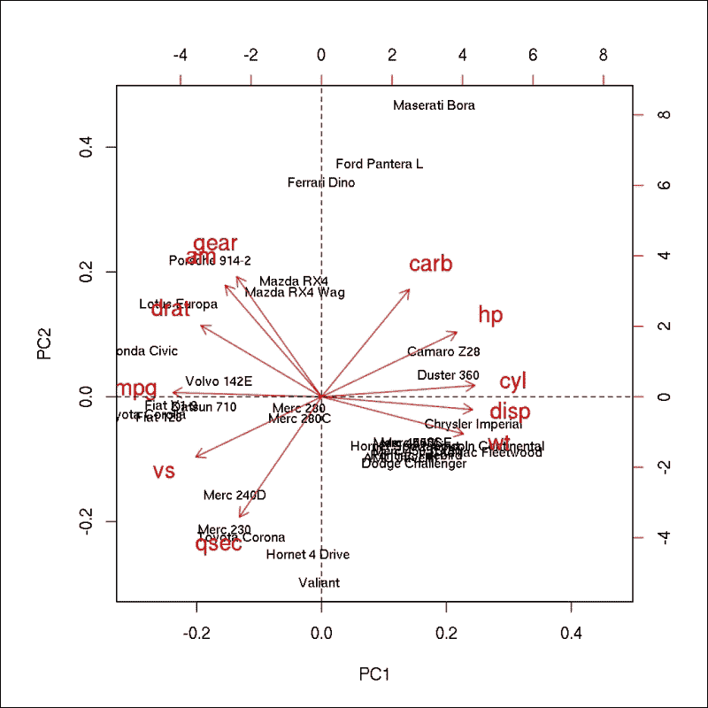

我们可以得出结论，`PC1`主要包括来自气缸数(`cyl`)、排量(`disp`)、重量(`wt`)和油耗(`mpg`)的信息，尽管后者看起来可能会降低`PC1`的值。这是通过检查`PC1`轴上的最高和最低值发现的。同样，我们发现`PC2`是由增速(`qsec`)、挡位数(`gear`)、化油器(`carb`)和变速器类型(`am`)构成的。

为了验证这一点，我们可以很容易地计算原始变量和主成分之间的相关系数:

```r
> cor(mtcars, pc$x[, 1:2])

 PC1       PC2

mpg  -0.93195  0.026251

cyl   0.96122  0.071216

disp  0.94649 -0.080301

hp    0.84847  0.405027

drat -0.75617  0.447209

wt    0.88972 -0.232870

qsec -0.51531 -0.754386

vs   -0.78794 -0.377127

am   -0.60396  0.699103

gear -0.53192  0.752715

carb  0.55017  0.673304

```

这有道理吗？如何命名`PC1`和`PC2`？气缸数和排量看起来像是发动机参数，而重量很可能受到车身的影响。气体消耗应该受到两个规格的影响。另一个组件的变量处理悬浮，但我们也有速度，更不用说前面矩阵中的一堆平庸的相关系数。现在怎么办？

## 旋转方法

基于旋转方法在子空间中完成的事实，与之前讨论的 PCA 相比，旋转总是次优的。这意味着旋转后的新轴将比原始分量解释更少的变化。

另一方面，旋转简化了组件的结构，因此更容易理解和解释结果；因此，这些方法在实践中经常使用。

### 注意

旋转方法通常可以(并且已经)应用于 PCA 和 FA(稍后将详细介绍)。正交方法是优选的。

旋转有两种主要类型:

*   正交，其中新轴彼此正交。组件/因素之间没有相关性。
*   倾斜的，其中新轴不一定彼此正交；因此，变量之间可能存在某种相关性。

Varimax 旋转是最常用的旋转方法之一。它是凯泽在 1958 年开发的，一直流行至今。它经常被使用，因为该方法最大化了载荷矩阵的方差，从而产生了更易解释的分数:

```r
> varimax(pc$rotation[, 1:2])

$loadings

 PC1    PC2 

mpg  -0.286 -0.223

cyl   0.256  0.276

disp  0.312  0.201

hp           0.403

drat -0.402 

wt    0.356  0.116

qsec  0.148 -0.483

vs          -0.375

am   -0.457  0.174

gear -0.458  0.217

carb -0.106  0.454

 PC1   PC2

SS loadings    1.000 1.000

Proportion Var 0.091 0.091

Cumulative Var 0.091 0.182

$rotmat

 [,1]    [,2]

[1,]  0.76067 0.64914

[2,] -0.64914 0.76067

```

现在，第一个组成部分似乎主要受变速器类型、齿轮数量和后轮轴比率的影响(负面主导)，而第二个则受加速、马力和化油器数量的影响。这就建议将`PC2`命名为`power`，而`PC1`则改为指代`transmission`。让我们看看这 32 辆汽车在这个新的坐标系中:

```r
> pcv <- varimax(pc$rotation[, 1:2])$loadings

> plot(scale(mtcars) %*% pcv, type = 'n',

+     xlab = 'Transmission', ylab = 'Power')

> text(scale(mtcars) %*% pcv, labels = rownames(mtcars))

```

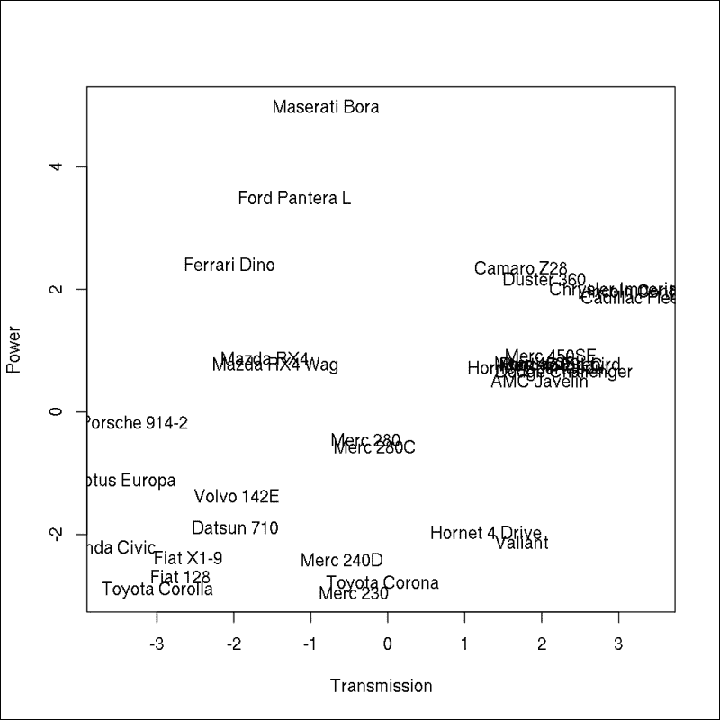

根据前面的情节，每个数据科学家都应该从左上角选择一辆车来搭配最高评级的车型，对吗？这些汽车基于 *y* 轴和良好的传动系统拥有强大的动力，如 *x* 轴所示——不要忘记传动系统与原始变量呈负相关。但是让我们看看其他一些旋转方法以及它们的优点！

Quartimax rotation 也是一种正交方法，可以最大限度地减少解释每个变量所需的组件数量。这通常会产生一个通用组件和额外的较小组件。当需要在 Varimax 和 Quartimax 旋转方法之间进行折衷时，您可以选择等最大旋转。

斜旋法有 Oblimin 和 Promax，这些都是基础 stats 里没有的，甚至是使用率很高的 `psych`包里也没有。相反，我们可以加载 `GPArotation`包，它也为 PCA 和 FA 提供了广泛的旋转方法。出于演示目的，让我们看看 Promax 旋转是如何工作的，例如，与 Oblimin 相比，它要快得多:

```r
> library(GPArotation)

> promax(pc$rotation[, 1:2])

$loadings

Loadings:

 PC1    PC2 

mpg  -0.252 -0.199

cyl   0.211  0.258

disp  0.282  0.174

hp           0.408

drat -0.416 

wt    0.344 

qsec  0.243 -0.517

vs          -0.380

am   -0.502  0.232

gear -0.510  0.276

carb -0.194  0.482

 PC1   PC2

SS loadings    1.088 1.088

Proportion Var 0.099 0.099

Cumulative Var 0.099 0.198

$rotmat

 [,1]    [,2]

[1,]  0.65862 0.58828

[2,] -0.80871 0.86123

> cor(promax(pc$rotation[, 1:2])$loadings)

 PC1      PC2

PC1  1.00000 -0.23999

PC2 -0.23999  1.00000

```

最后一个命令的结果支持这样的观点，即与运行正交旋转不同，倾斜旋转方法生成的分数可能是相关的。

## 主成分分析的异常值检测

除了探索性数据分析之外，PCA 还可以用于多种目标。例如，我们可以使用 PCA 来生成特征脸、压缩图像、对观察结果进行分类，或者通过图像过滤来检测多维空间中的异常值。现在，我们将构建一个 2012 年在 R-bloggers 上发表的相关研究帖子中讨论的简化模型:[http://www . R-bloggers . com/finding-a-pin-in-a-haystack-PCA-image-filtering](http://www.r-bloggers.com/finding-a-pin-in-a-haystack-pca-image-filtering)。

帖子中描述的挑战是在火星上的好奇号火星车拍摄的沙子中检测外来金属物体。这张图片可以在美国宇航局的官方网站上找到，网址是:http://www . NASA . gimg/content/694811 main _ pia 16225-43 _ full . jpg，我为这个网站创建了一个简短的网址:http://bit.ly/nasa-img。

在下面的图片中，你可以看到一个奇怪的金属物体突出在黑色圆圈中的沙子里，只是为了确保你知道我们在找什么。在前面的 URL 中找到的图像没有突出显示:


现在，让我们使用一些统计方法来识别该对象，而无需(太多)人工干预！首先，我们需要从网上下载图像，并将其加载到 r 中。`jpeg`包在这里非常有用:

```r
>

 library(jpeg)

> t <- tempfile()

> download.file('http://bit.ly/nasa-img', t)

trying URL 'http://bit.ly/nasa-img'

Content type 'image/jpeg' length 853981 bytes (833 Kb)

opened URL

==================================================

downloaded 833 Kb

>

 img <- readJPEG(t)

> str(img)

 num [1:1009, 1:1345, 1:3] 0.431 0.42 0.463 0.486 0.49 ...

```

`readJPEG`函数返回图片中每个像素的 RGB 值，产生一个三维数组，其中第一维是行，第二维是列，第三维包括三个颜色值。

### 注意

RGB 是一种加色模型，通过以给定的强度和可选的透明度混合红色、绿色和蓝色，可以再现各种各样的颜色。这种颜色模型在计算机科学中被高度使用。

由于 PCA 需要一个矩阵作为输入，我们必须将这个三维数组转换成一个二维数据集。为此，我们暂时不考虑像素的顺序，因为我们稍后可以重建它，但让我们简单地列出所有像素的 RGB 值，一个接一个:

```r
> h <- dim(img)[1]

> w <- dim(img)[2]

> m <- matrix(img, h*w)

> str(m)

 num [1:1357105, 1:3] 0.431 0.42 0.463 0.486 0.49 ...

```

简单来说，我们将图像的原始高度(以像素为单位)保存在变量`h`中，宽度保存在`w`中，然后将 3D 数组转换为 1，357，105 行的矩阵。并且，经过四行数据加载和三行数据转换，我们终于可以调用实际的、相当简化的统计方法了:

```r
> pca <- prcomp(m)

```

正如我们之前看到的，数据科学家确实在大多数时间处理数据准备，而实际的数据分析可以很容易地完成，对吗？

提取的组件似乎表现得相当好；第一个因素解释了 96%以上的差异:

```r
> summary(pca)

Importance of components:

 PC1    PC2     PC3

Standard deviation     0.277 0.0518 0.00765

Proportion of Variance 0.965 0.0338 0.00074

Cumulative Proportion  0.965 0.9993 1.00000

```

以前，解释 RGB 值非常简单，但是这些组件意味着什么呢？

```r
> pca$rotation

 PC1      PC2      PC3

[1,] -0.62188  0.71514  0.31911

[2,] -0.57409 -0.13919 -0.80687

[3,] -0.53261 -0.68498  0.49712

```

似乎第一种成分与所有三种颜色相当混合，第二种成分缺少绿色，而第三种成分几乎只包括绿色。为什么不把它形象化，而不是试图想象这些人为的价值是什么样子？为此，让我们通过下面的快速帮助函数从前面的分量/加载矩阵中提取颜色强度:

```r
> extractColors <- function(x)

+     rgb(x[1], x[2], x[3])

```

对分量矩阵的绝对值调用此函数会产生描述主要分量的十六进制颜色代码:

```r
> (colors <- apply(abs(pca$rotation), 2, extractColors))

 PC1       PC2       PC3 

"#9F9288" "#B623AF" "#51CE7F"

```

这些颜色代码可以很容易地呈现出来，例如，在饼图上，饼图的面积代表主要成分的解释方差:

```r
> pie(pca$sdev, col = colors, labels = colors)

```

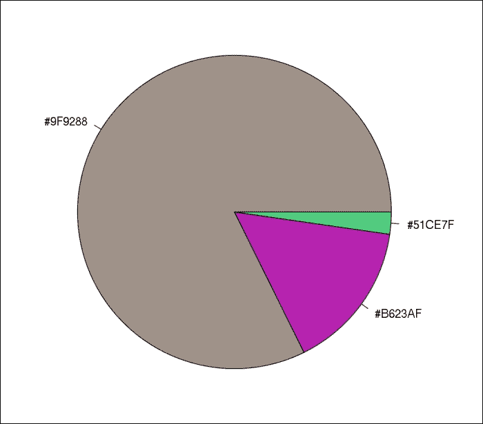

现在，在存储在`pca$x`中的计算分数中，我们不再有红色、绿色或蓝色强度或实际颜色；相反，主成分用之前显示的可视化颜色描述每个像素。如前所述，第三个分量代表绿色，第二个分量缺少绿色(导致紫色)，而第一个分量包括来自所有 RGB 颜色的相当高的值，导致茶色，这一点也不奇怪，因为照片是在火星的沙漠中拍摄的。

现在我们可以用单色渲染原始图像来显示主要成分的强度。下面几行代码根据`PC1`和`PC2`生成了两张修改后的好奇号火星车及其环境的照片:

```r
> par(mfrow = c(1, 2), mar = rep(0, 4))

> image(matrix(pca$x[, 1], h), col = gray.colors(100))

> image(matrix(pca$x[, 2], h), col = gray.colors(100), yaxt = 'n')

```


虽然图像在一些线性变换中旋转了 90 度，但很明显，第一张图像并没有真正有助于找到沙子中的外来金属物体。事实上，这张图像代表了沙漠地区的噪声，因为`PC1`包含了沙子般的颜色强度，所以这个分量对于描述各种茶色很有用。

另一方面，第二个组件很好地突出了沙子中的金属物体！由于正常沙子中紫色的比例较低，所有周围的像素都很暗，而异常物体则相当暗。

我真的很喜欢这段 R 代码和这个简化的例子:虽然它们仍然足够简单，但它们也展示了 R 的强大功能，以及如何使用标准数据分析方法从原始数据中获取信息。


# 因素分析

虽然关于验证性**因子分析** ( **FA** )的文献确实令人印象深刻，并且在例如社会科学中被高度使用，但是我们将只关注探索性 FA，在探索性 FA 中，我们的目标是基于其他经验数据识别一些未知的、未观察到的变量。

FA 的潜在变量模型是由 Spearman 在 1904 年首次提出的，用于一个因素，然后 Thurstone 在 1947 年将该模型推广到多个因素。该统计模型假设数据集中可用的显式变量是潜在变量的结果，这些潜在变量未被观察到，但可以基于观察到的数据进行跟踪。

FA 可以处理连续的(数字)变量，模型声明每个观察到的变量是一些未知的、潜在的因素的总和。

### 注意

请注意，与 PCA 相比，在做 FA 之前，检查正态性、KMO 和巴特利特测试更重要；后者是一个相当描述性的方法，而在 FA 中，我们实际上是在建立一个模型。

最常用的探索性 FA 方法是最大似然 FA，它也可以在已经安装的`stats`包的`factanal`函数中找到。通过`psych`包中的`fa`函数可以使用其他的分解方法，例如**普通最小二乘法** ( **OLS** )、**加权最小二乘法** ( **WLS** )、**广义加权最小二乘法** ( **GLS** )或者主因子解。这些函数将原始数据或协方差矩阵作为输入。

出于演示的目的，让我们看看默认的分解方法如何在`mtcars`的子集上执行。让我们提取除位移之外的所有绩效相关变量，位移可能是所有其他相关指标的原因:

```r
> m <- subset(mtcars, select = c(mpg, cyl, hp, carb))

```

现在只需调用并保存前面`data.frame`中`fa`的结果:

```r
> (f <- fa(m))

Factor Analysis using method =  minres

Call: fa(r = m)

Standardized loadings (pattern matrix) based upon correlation matrix

 MR1   h2   u2 com

mpg  -0.87 0.77 0.23   1

cyl   0.91 0.83 0.17   1

hp    0.92 0.85 0.15   1

carb  0.69 0.48 0.52   1

 MR1

SS loadings    2.93

Proportion Var 0.73

Mean item complexity =  1

Test of the hypothesis that 1 factor is sufficient.

The degrees of freedom for the null model are  6 

and the objective function was  3.44 with Chi Square of  99.21

The degrees of freedom for the model are 2

and the objective function was  0.42 

The root mean square of the residuals (RMSR) is  0.07 

The df corrected root mean square of the residuals is  0.12 

The harmonic number of observations is  32

with the empirical chi square  1.92  with prob <  0.38 

The total number of observations was  32

with MLE Chi Square =  11.78  with prob <  0.0028 

Tucker Lewis Index of factoring reliability =  0.677

RMSEA index =  0.42

and the 90 % confidence intervals are  0.196 0.619

BIC =  4.84

Fit based upon off diagonal values = 0.99

Measures of factor score adequacy 

 MR1

Correlation of scores with factors             0.97

Multiple R square of scores with factors       0.94

Minimum correlation of possible factor scores  0.87

```

嗯，这是一个相当可观的信息量和一堆细节！`MR1`代表以默认因子分解方法(最小残差或 OLS)命名的第一个提取因子。由于模型中只包含一个因子，因此不能选择因子轮换。有一个测试或假设来检查因素的数量是否足够，一些系数代表一个真正伟大的模型拟合。

结果可以总结在下面的图中:

```r
> fa.diagram(f)

```


这里我们看到潜在变量和观察变量之间的高相关系数，箭头的方向表明该因素对我们的经验数据集中发现的值有影响。猜猜这个因素和汽车发动机排量的关系！

```r
> cor(f$scores, mtcars$disp)

0.87595

```

嗯，这似乎是一个很好的匹配。


# 主成分分析与因子分析

不幸的是，主成分经常与因子混淆，这两个术语和相关方法有时被用作同义词，尽管这两种方法的数学背景和目标确实不同。

PCA 用于通过创建主成分来减少变量的数量，然后这些主成分可以用于进一步的项目而不是原始变量。这意味着我们试图通过人工创建的变量来提取数据集的本质，这些变量最能描述数据的方差:

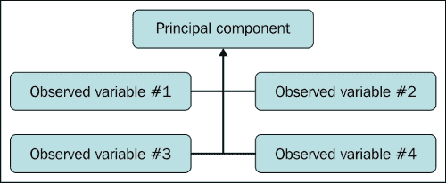

FA 则相反，它试图识别未知的、潜在的变量来解释原始数据。简单地说，我们使用经验数据集中的显式变量来猜测数据的内部结构:


# 多维标度

**多维标度** ( **MDS** )是一种多元技术，最早用于地理学。MDS 的主要目标是绘制二维多元数据点，从而通过可视化观察的相对距离来揭示数据集的结构。MDA 用于不同的领域，如心理学、社会学和市场研究中的态度研究。

当`MASS`包通过`isoMDS`函数提供非公制 MDS 时，我们将专注于经典公制 MDS，它在`stats`包提供的`cmdscale`函数中可用。两种类型的 MDS 都将距离矩阵作为主要参数，并且可以通过`dist`函数从任何数值表格数据中创建。

但在我们探索更复杂的示例之前，让我们看看 MDS 在使用现有的距离矩阵(如内置的`eurodist`数据集)时能为我们提供什么:

```r
> as.matrix(eurodist)[1:5, 1:5]

 Athens Barcelona Brussels Calais Cherbourg

Athens         0      3313     2963   3175      3339

Barcelona   3313         0     1318   1326      1294

Brussels    2963      1318        0    204       583

Calais      3175      1326      204      0       460

Cherbourg   3339      1294      583    460         0

```

虽然只显示了前 5-5 个值，但前面的值表示 21 个欧洲城市之间的旅行距离，单位为千米。管理古典 MDS 相当容易:

```r
> (mds <- cmdscale(eurodist))

 [,1]      [,2]

Athens           2290.2747  1798.803

Barcelona        -825.3828   546.811

Brussels           59.1833  -367.081

Calais            -82.8460  -429.915

Cherbourg        -352.4994  -290.908

Cologne           293.6896  -405.312

Copenhagen        681.9315 -1108.645

Geneva             -9.4234   240.406

Gibraltar       -2048.4491   642.459

Hamburg           561.1090  -773.369

Hook of Holland   164.9218  -549.367

Lisbon          -1935.0408    49.125

Lyons            -226.4232   187.088

Madrid          -1423.3537   305.875

Marseilles       -299.4987   388.807

Milan             260.8780   416.674

Munich            587.6757    81.182

Paris            -156.8363  -211.139

Rome              709.4133  1109.367

Stockholm         839.4459 -1836.791

Vienna            911.2305   205.930

```

这些分数很像两个主成分，比如跑步`prcomp(eurodist)$x[, 1:2]`。事实上，PCA 可以被认为是最基本的 MDS 解决方案。

无论如何，我们刚刚将 21 维空间转换为 2 维空间，这可以非常容易地绘制出来(不像之前的 21 行 21 列的矩阵):

```r
> plot(mds)

```


这让你想起什么了吗？如果没有，请随意查看下图，其中下面两行代码也显示了城市名称，而不是匿名点:

```r
> plot(mds, type = 'n')

> text(mds[, 1], mds[, 2], labels(eurodist))

```


虽然 *y* 轴翻转了，这可以通过将文本的第二个参数乘以-1 来修复，但我们刚刚从距离矩阵中呈现了一幅欧洲城市地图——没有任何进一步的地理数据。我觉得这相当令人印象深刻。

请在[第十三章](ch13.html "Chapter 13. Data Around Us")、*我们身边的数据*中找到更多数据可视化的技巧和方法。

现在，让我们看看如何将 MDS 应用到非地理数据上，这些数据没有考虑到它是一个距离矩阵。让我们回到`mtcars`数据集:

```r
> mds <- cmdscale(dist(mtcars))

> plot(mds, type = 'n')

> text(mds[, 1], mds[, 2], rownames(mds))

```

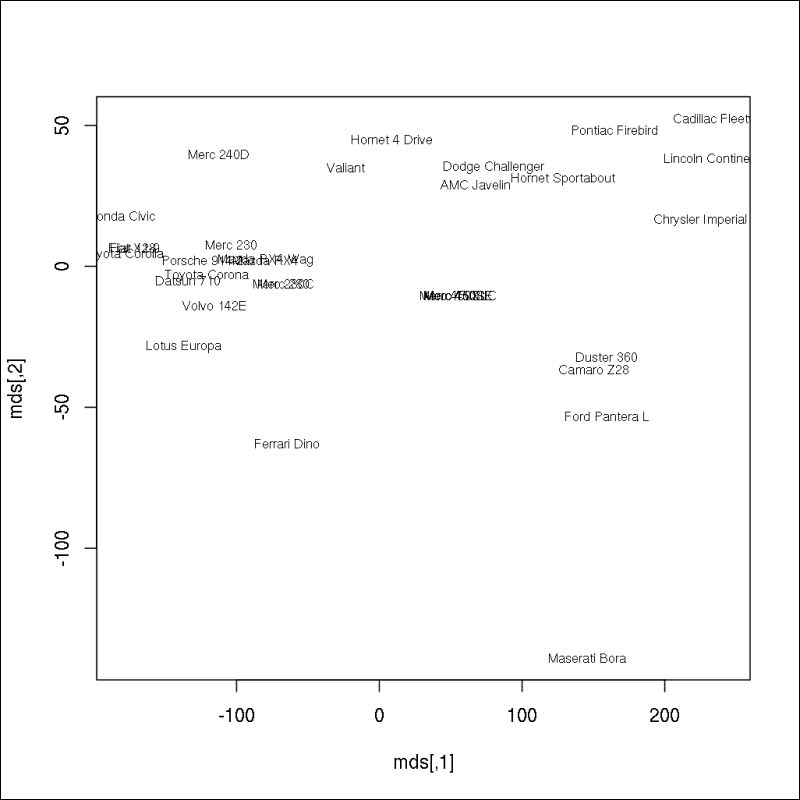

该图显示了分散在二维空间中的原始数据集的 32 辆汽车。元素之间的距离是由 MDS 计算的，它考虑了所有 11 个原始变量，很容易识别相似和非常不同的汽车类型。我们将在下一章更详细地讨论这些主题，[第十章](ch10.html "Chapter 10. Classification and Clustering")，*分类和聚类*。


# 总结

在这一章中，我们介绍了多种处理多元数据的方法，以减少人工计算的连续变量的可用维数，并识别潜在的、潜在的和类似的数字变量。另一方面，有时用数字描述现实是相当困难的，我们应该分类思考。

下一章将介绍定义数据类型(聚类)的新方法，还将演示如何在可用训练数据的帮助下对元素进行分类。