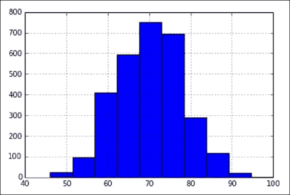
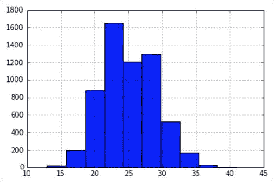
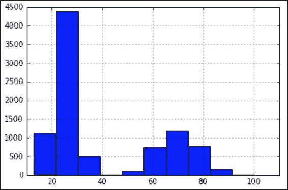
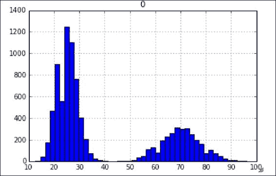
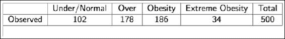
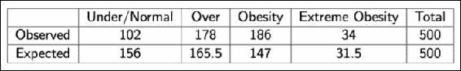
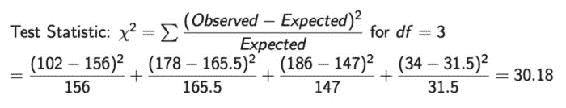
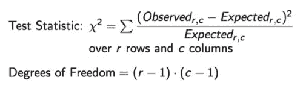

# 八、高级统计学

我们关心的是根据某些数据样本对整个人口做出推断。在给定数据样本的情况下，我们将使用假设检验和不同的估计检验，以便更好地了解总体情况。

我们将在本章中涉及的关键主题如下:

*   点估计
*   置信区间
*   中心极限定理
*   假设检验

# 点估计

回想一下，在前一章中，我们提到了获得一个总体参数是多么困难；因此，我们必须使用样本数据来计算一个参数的估计值。当我们做这些估计时，我们称之为点估计。

**点估计**是基于样本数据的总体参数估计。

我们使用点估计来估计总体均值、方差和其他统计量。为了获得这些估计值，我们只需将我们希望测量的人口函数应用于数据样本。例如，假设有一家拥有 9000 名员工的公司，我们对确定员工一天的平均休息时间感兴趣。由于我们可能无法询问每一个人，我们将从 9000 人中抽取一个样本，并取样本的平均值。这个样本平均值将是我们的点估计。

以下代码分为三部分:

*   我们将使用被称为 **泊松分布**的概率分布，随机生成 9000 个问题的答案:*你一天中通常休息多少分钟？*这将代表我们的“人口”。请记住，从[第 6 章](ch06.html "Chapter 6. Advanced Probability")、*高级概率*中得知，当我们知道一个事件的平均值并希望对其周围的分布进行建模时，会用到**泊松随机变量** 。T13

    ### 注意

    注意,这个平均值通常是未知的。我正在计算它,以显示我们的参数和我们的统计之间的差异。我还设置了一个随机种子,以鼓励再现性（这允许我们每次都得到相同的随机数字

*   我们将抽取一个 100 名员工的样本(使用 Python 随机抽样方法)并找到一个均值的点估计(称为样本均值)。

    ### 注意

    请注意,这只是我们人口的 1%多一点

*   将我们的样本平均值(100 名员工样本的平均值)与我们的总体平均值进行比较。

让我们来看看下面的代码:

```py
np.random.seed(1234)

long_breaks = stats.poisson.rvs(loc=10, mu=60, size=3000)
# represents 3000 people who take about a 60 minute break
```

`long_breaks`变量代表问题的`3000`答案:*你平均休息多少分钟？*，而且这些答案会放在比较长的一边。让我们来看看这个分布的可视化，如下所示:

```py
pd.Series(long_breaks).hist()
```



我们看到我们的平均`60`分钟在分布的左边。此外，因为我们只对`3000`人进行了抽样，我们的仓位最高，大约为 **700** - **800** 人。

现在，让我们为平均休息大约`15`分钟的人建模。让我们再次使用泊松分布来模拟`6000`人，如图所示:

```py
short_breaks = stats.poisson.rvs(loc=10, mu=15, size=6000)
# represents 6000 people who take about a 15 minute break
pd.Series(short_breaks).hist()
```



好的，那么，我们有一个分布给休息时间长的人，一个分布给休息时间短的人。同样，请注意我们的平均休息时间`15`分钟如何落在分布的左侧，并注意最高的条形图大约是 **1600** 人。

```py
breaks = np.concatenate((long_breaks, short_breaks))
# put the two arrays together to get our "population" of 9000 people
```

`breaks`变量是所有`9000`员工的合并，包括长期和短期休假者。让我们在一个可视化界面中查看整个人群分布:

```py
pd.Series(breaks).hist()
```



我们看到我们有两个驼峰。在左边，我们有大部分人休息 15 分钟，在右边，我们有小部分人休息更长时间。稍后，我们将进一步研究这个图。

我们可以通过运行以下代码来找到总的平均中断长度:

```py
breaks.mean()
# 39.99 minutes is our parameter.
```

我们公司的平均休息时间大约是 40 分钟。记住我们的人口是整个公司 9000 人的员工规模，*我们的参数是 40 分钟*。在现实世界中，我们的目标是估计总体参数，因为出于多种原因，我们没有资源在调查中询问每个员工的平均休息时间。相反，我们将使用点估计。

因此，为了说明我们的观点，我们想模拟一个世界，我们随机询问 100 个人他们休息的时间。为此，让我们从我们模拟的 9，000 名员工中随机抽取`100`名员工，如下所示:

```py
sample_breaks = np.random.choice(a = breaks, size=100)
# taking a sample of 100 employees
```

现在，让我们取样本的平均值，并从总体平均值中减去它，看看我们有多远:

```py
breaks.mean() - sample_breaks.mean()   
# difference between means is 4.09 minutes, not bad!
```

这非常有趣，因为只有大约 1%的人口(9000 人中的 100 人)，我们能够在 4 分钟内得到我们的人口参数，并得到我们人口平均值的非常准确的估计。还不错！

在这里，我们计算了均值的点估计，但是我们也可以对比例参数这样做。比例，我指的是两个数量值的比率。

假设在一家 10，000 人的公司里，我们的员工有 20%是白人，10%是黑人，10%是西班牙裔，30%是亚裔，30%是其他族裔。我们将抽取 1000 名员工作为样本，看看他们的种族比例是否相似。

```py
employee_races = (["white"]*2000) + (["black"]*1000) +\
                   (["hispanic"]*1000) + (["asian"]*3000) +\
                   (["other"]*3000)
```

`employee_races`代表我们的员工人数。比如我们一万人的公司，2000 人是白人(20%)，3000 人是亚裔(30%)。

让我们随机抽取 1000 人作为样本，如图所示:

```py

demo_sample = random.sample(employee_races, 1000)   # Sample 1000 values

for race in set(demo_sample):
    print( race + " proportion estimate:" )
    print( demo_sample.count(race)/1000\. )
```

获得的输出如下:

```py
hispanic proportion estimate:
0.103
white proportion estimate:
0.192
other proportion estimate:
0.288
black proportion estimate:
0.1
asian proportion estimate:
0.317
```

我们可以看到，种族比例估计值非常接近潜在人口的比例。例如，在我们的样本中，西班牙裔占 10.3%，而西班牙裔占总人口的比例是 10%。


# 抽样分布

在[第七章](ch07.html "Chapter 7. Basic Statistics")、*基础统计*中，我们提到了当数据遵循正态分布时，我们有多喜欢。其中一个原因是，许多统计测试(包括我们将在本章中使用的)依赖于遵循正态模式的数据，并且在大多数情况下，许多真实世界的数据是不正态的(惊讶吗？).以我们的员工休息数据为例，您可能会认为我只是在异想天开地使用泊松分布创建数据，但我这样做是有原因的——我特别想要非正态数据，如下所示:

```py
pd.DataFrame(breaks).hist(bins=50,range=(5,100))
```



正如所见，我们的数据绝对没有遵循正态分布，它似乎是**双峰**，这意味着有两个休息时间峰值，分别在 **25** 和 **70** 分钟左右。由于我们的数据是不正常的，许多最流行的统计测试可能不适用，但是，如果我们遵循给定的程序，我们可以创建正常的数据！觉得我疯了？好吧，你自己看吧。

首先，我们需要利用所谓的**抽样分布**，这是几个相同大小样本的点估计分布。我们创建抽样分布的过程如下:

1.  取 500 个不同的休息时间样本，每个样本的大小为 100。
2.  取这 500 个不同点估计的直方图(揭示它们的分布)。

样本中元素的数量(100)是任意的，但是足够大以作为总体的代表性样本。我采集的样本数量(500)也是任意的，但是足够大以确保我们的数据收敛到正态分布:

```py
point_estimates = []

for x in range(500):         # Generate 500 samples
	sample = np.random.choice(a= breaks, size=100) 
#take a sample of 100 points

point_estimates.append( sample.mean() )
# add the sample mean to our list of point estimates

pd.DataFrame(point_estimates).hist()
# look at the distribution of our sample means
```


看哪！样本均值的抽样分布似乎是正态的，即使我们从一个潜在的双峰总体分布中获取数据。值得注意的是，该直方图中的条形代表 500 个雇员样本的平均休息时间，其中每个样本有 100 个人。换句话说，抽样分布是几个点估计的分布。

我们的数据收敛于正态分布，因为有一个叫做 **的中心极限定理**，它指出，随着我们增加样本数量，抽样分布(点估计的分布)将接近正态分布。

此外，随着我们采集越来越多的样本，样本分布的平均值将接近真实总体平均值，如下所示:

```py
breaks.mean() - np.array(point_estimates).mean()
# .047 minutes difference
```

这实际上是一个非常令人兴奋的结果，因为这意味着我们可以通过多点估计和利用中心极限定理得到比单点估计更接近的结果！

### 注意

一般来说，随着样本数量的增加，我们的估计值会越来越接近参数(实际值)。


# 置信区间

虽然点估计是可以的总体参数的估计和抽样分布甚至更好，但这些方法有以下两个主要问题:

*   单点估计很容易出错(由于抽样偏差等原因)
*   对抽样分布采用一定大小的多个样本可能不可行，有时甚至比实际寻找总体参数更不可行

出于这些以及更多的原因，我们可以求助于一个被称为置信区间的概念来寻找统计数据。

**置信区间**是一个基于点估计的值范围，它包含某个置信水平的真实总体参数。

**置信度** 是高级统计学中的一个重要概念。它的意思有时会被误解。非正式地说，一个置信水平不代表“正确的概率”；相反，它代表获得的答案将是准确的频率。例如，如果您希望有 95%的机会仅使用单点估计获得真实的总体参数，我们必须将置信度设置为 95%。

### 注意

更高的置信水平导致更宽(更大)的置信区间，以便更加确定。

计算置信区间需要找到一个点估计值，然后加入一个误差范围。**误差幅度** 是一个值，它表示我们确信我们的点估计是准确的，并且基于我们期望的置信水平、数据的方差以及样本的大小。有许多方法可以计算置信区间；为了简洁明了，我们将研究一种获取总体均值置信区间的单一方法。对于这个置信区间，我们需要以下内容:

*   点估计。为此，我们将从前面的例子中取断裂长度的样本平均值。
*   总体标准差的估计值，代表数据中的方差。

    *   这是通过采用样本标准偏差(样本数据的标准偏差)并将该数字除以人口规模的平方根来计算的。

*   自由度(样本大小为-1)。

获得这些数字可能看起来有些武断，但是，相信我，所有这些数字都是有原因的。然而，同样为了简单起见，我将使用预先构建的 Python 模块，如图所示，来计算我们的置信区间，然后展示其价值:

```py
sample_size = 100
# the size of the sample we wish to take

sample = np.random.choice(a= breaks, size = sample_size)
# a sample of sample_size taken from the 9,000 breaks population from before

sample_mean = sample.mean()
# the sample mean of the break lengths sample

sample_stdev = sample.std()    
# sample standard deviation

sigma = sample_stdev/math.sqrt(sample_size)  
# population standard deviation estimate

stats.t.interval(alpha = 0.95,              # Confidence level 95%
                 df= sample_size - 1,       # Degrees of freedom
                 loc = sample_mean,         # Sample mean
                 scale = sigma)             # Standard deviation
# (36.36, 45.44)
```

再次重申，这个数值范围(从`36.36`到`45.44`)代表平均中断时间的置信区间，置信度为 95%。

我们已经知道我们的总体参数是`39,99`，注意区间包含了`39.99`的总体均值。

我前面提到过，置信水平不是我们区间的准确度百分比，而是区间包含总体参数的概率百分比。

为了更好地理解置信水平，让我们取 10，000 个置信区间，看看我们的总体均值在该区间内下降的频率。首先，让我们创建一个函数，如图所示，它根据我们的中断数据创建一个单一的置信区间:

```py
# function to make confidence interval
def makeConfidenceInterval():
    sample_size = 100
    sample = np.random.choice(a= breaks, size = sample_size)

    sample_mean = sample.mean()
    # sample mean

    sample_stdev = sample.std()    
    # sample standard deviation

    sigma = sample_stdev/math.sqrt(sample_size)  
    # population Standard deviation estimate

    return stats.t.interval(alpha = 0.95, df= sample_size - 1, loc = sample_mean, scale = sigma) 
```

现在我们有了一个可以创建单个置信区间的函数，让我们创建一个过程来测试单个置信区间包含真实总体参数的概率，`39.99`:

1.  取样本均值的 10，000 个置信区间。
2.  计算总体参数落入置信区间的次数。
3.  输出参数落入该区间的次数与 1 万次的比值:

    ```py
    times_in_interval = 0.
    for i in range(10000):
        interval = makeConfidenceInterval()
        if 39.99 >= interval[0] and 39.99 <= interval[1]:
        # if 39.99 falls in the interval
            times_in_interval += 1

    print times_in_interval / 10000
    # 0.9455
    ```

成功！我们看到大约 95%的置信区间包含了我们的实际总体均值。通过点估计和置信区间来估计总体参数是一种相对简单而有效的统计推断形式。

让我们也快速地看一下当我们改变我们的置信水平时，置信区间的大小是如何变化的。让我们计算多个置信水平的置信区间，并通过查看两个数字之间的差异来了解区间有多大。我们的假设是，随着我们的置信水平变大，我们可能会看到更大的置信区间，以确保我们捕捉到真实的总体参数:

```py
for confidence in (.5, .8, .85, .9, .95, .99):
    confidence_interval = stats.t.interval(alpha = confidence, df= sample_size – 1, loc = sample_mean, scale = sigma)   

    length_of_interval = round(confidence_interval[1] - confidence_interval[0], 2)
    # the length of the confidence interval

    print "confidence {0} has a interval of size {1}".format(confidence, length_of_interval)

confidence 0.5 has an interval of size 2.56
confidence 0.8 has an interval of size 4.88
confidence 0.85 has an interval of size 5.49
confidence 0.9 has an interval of size 6.29
confidence 0.95 has an interval of size 7.51
confidence 0.99 has an interval of size 9.94

```

我们可以看到，当我们希望对我们的音程“更有信心”时，我们的音程会扩大以进行补偿。

接下来，我们将采用我们的置信水平概念，并着眼于统计假设检验，以便在这些主题上进行扩展，并且(通常)创建更强大的统计推断。


# 假设检验

假设检验是统计学中应用最广泛的检验之一。它们以多种形式出现；然而，它们都有相同的基本目的。

**假设检验** 是一种统计检验，用于确定在给定一个数据样本的情况下，我们是否可以假设某个条件对整个人口都成立。基本上，假设检验是对我们关于整个人口的某个假设的检验。测试的结果告诉我们是应该相信这个假设还是拒绝接受另一个假设。

您可以考虑假设检验的框架来确定观察到的样本数据是否偏离了对总体本身的预期。现在，这听起来像是一个困难的任务，但是幸运的是，Python 来了，并且包括了内置的库来轻松地进行这些测试。

假设检验通常着眼于关于总体的两个相反的假设。我们称它们为**零假设** 和 **替代假设**。零假设是被测试的陈述，并且是默认的正确答案；这是我们的出发点，也是我们最初的假设。替代假设是反对零假设的陈述。我们的测试将告诉我们应该相信哪个假设，拒绝哪个假设。

基于来自总体的样本数据，假设检验确定是否*拒绝*零假设。我们通常用一个 **p 值**(基于我们的显著性水平)来做出这个结论。

### 注意

一个非常常见的误解是，统计假设检验旨在选择两个假设中更有可能*的*。这是不正确的。假设检验将默认为无效假设*，直到*有足够的数据支持替代假设。

以下是一些可以通过假设检验回答的问题示例:

*   员工的平均休息时间是否不同于 40 分钟？
*   与网站 A 互动过的人和与网站 B 互动过的人(A/B 测试)有区别吗？
*   一个咖啡豆的样本在味道上与整个咖啡豆群体有显著的不同吗？

## 进行假设检验

有多种类型的假设检验，其中有几十种不同的程序和度量标准。尽管如此，大多数假设检验都遵循以下五个基本步骤:

1.  指定假设:

    *   在这里，我们公式化我们的两个假设:零假设和替代假设
    *   我们通常用符号 *H [0]* 来表示零假设，用 *H [a]* 来表示我们的替代假设

2.  确定测试样本的样本量:

    *   此计算取决于所选的测试。通常，我们必须确定一个适当的样本大小，以便利用定理，如中心极限定理，并假设数据的正态性。

3.  选择一个显著性水平(通常称为α或α):

    *   0.05 的显著性水平是常见的

4.  收集数据:

    *   他们收集样本数据进行测试

5.  决定是拒绝还是不拒绝零假设:

    *   该步骤根据所用测试的类型略有不同。最终的结果要么是拒绝零假设而支持替代方案，要么是不能拒绝零假设。

在本章中，我们将研究以下三种类型的假设检验:

*   单样本 t 检验
*   卡方拟合优度
*   关联性/独立性卡方检验

还有很多测试。然而，这三个是不同的、简单的和强大的测试的伟大组合。在选择我们应该实现的测试时，要考虑的最重要的事情之一是我们正在处理的数据的类型，具体来说，我们是在处理连续数据还是分类数据。为了真正看到假设的效果，我建议我们直接看一个例子。首先，让我们看看如何使用 t 检验来处理连续数据。

## 单样本 t 检验

**单样本 t 检验** 是一种统计检验，用于确定一个定量(数值)数据样本是否与另一个数据集(总体或另一个样本)的*显著不同。假设，在我们之前的员工休息时间示例中，我们专门查看了工程部门的休息时间，如下所示:*

```py
long_breaks_in_engineering = stats.poisson.rvs(loc=10, mu=55, size=100)

short_breaks_in_engineering = stats.poisson.rvs(loc=10, mu=15, size=300)

engineering_breaks = np.concatenate((long_breaks_in_engineering, short_breaks_in_engineering))

print breaks.mean()
# 39.99

print engineering_breaks.mean()
# 34.825
```

请注意，我采用了与创建原始休息时间相同的方法，但是有以下两个不同之处:

*   我从泊松分布中抽取了一个较小的样本(模拟我们从工程部门抽取了 400 人的样本)
*   我没有像以前一样使用`60`中的`mu`,而是使用`55`来模拟工程部门的违规行为与公司整体行为并不完全相同的事实

很容易看出，工程部门和整个公司之间似乎存在差异(超过 5 分钟)。我们通常没有完整的总体和总体参数，但我对它们进行了模拟，以观察示例的效果。因此，即使我们(无所不知的读者)可以看到差异，我们也会假设我们对这些群体参数一无所知，而是依靠统计测试来确定这些差异。

### 单样本 t 检验示例

我们在这里的目标是确定*全体员工(公司员工)的休息时间与工程部门*员工的休息时间之间是否存在差异。

现在让我们在 95%的置信水平下进行 t 检验，以找出差异(或没有差异！).从技术上讲，这个测试将告诉我们样本是否来自与人口相同的分布。

### 单样本 t 检验的假设

在进入五个步骤之前，我们必须首先承认 t-tests 必须满足以下两个条件才能正常工作:

*   总体分布要正态，或者样本要*大* ( *n ≥ 30* )。
*   为了假设样本是独立随机抽样的，强制要求总体规模至少比样本规模大 10 倍 *(10n < N)* 就足够了。

请注意，我们的测试要求基础数据是正态的(我们知道这对我们来说不是真的)，或者样本大小至少有 30 个点大。对于 t 检验，这个条件足以假设正态性。该测试还需要独立性，通过采集足够小的*样本即可满足这一要求。听起来很奇怪，对吧？基本的想法是，我们的样本必须足够大，以假设正态性(通过类似于中心极限定理的结论)，但又足够小，以至于与总体*无关*。*

现在，让我们遵循我们的五个步骤:

1.  Specify the hypotheses.

    我们将让 *H [0] =工程部和整个公司一样休息*

    如果我们让这是公司的平均值，我们可以写:

    H [0] :

    注意这是我们的*空*，或者*缺省*假设。在没有数据的情况下，这是我们的假设。我们想要展示的是**替代假设**。

    现在，我们实际上有了一些备选方案，我们可以说工程平均值(姑且称之为)低于公司平均值，高于公司平均值，或者只是与公司平均值完全不同(高于或低于):

    *   If we wish to answer the question, *is the sample mean different from the company average*, then this is called a **two-tailed test** and our alternative hypothesis would be as follows:

        哈:

    *   If we want to answer *either* *is the sample mean lower than the company average* *or* *is the sample mean higher than the company average*, then we are dealing with a **one-tailed test** and our alternative hypothesis would be one or the other of the following hypotheses:

        *哈:(工程需要更长的休息时间)*

        *哈:(工程休息时间更短)*

    一个和两个尾巴之间的差别是一个数是否被 2 除的差别。两者的流程完全保持不变。对于这个例子，我们选择双尾检验。因此，我们正在测试工程部门的平均休息时间样本是否与公司的平均休息时间不同。

    ### 注意

    我们的测试将以两种可能的结论之一结束:我们要么拒绝零假设，这意味着工程部门的休息时间与公司平均水平不同，要么我们将无法拒绝零假设，这意味着样本中没有足够的证据来支持拒绝零假设。

2.  Determine the sample size for the test sample.

    如前所述，大多数测试(包括本测试)都假设基础数据是正常的，或者我们的样本在正确的范围内。

    *   样本至少是 30 点(它是 400 点)
    *   样本少于总人口的 10%(即 900 人)

3.  Choose a significance level (usually called alpha or α).

    我们将选择 95%的显著性水平，这意味着我们的 alpha 实际上是 *1 - .95 = .05*

4.  Collect the data.

    搞定了。这是通过两个泊松分布产生的

5.  Decide whether to reject or fail to reject the null hypothesis.

    如前所述，这个步骤根据所使用的测试而有所不同。对于单样本 t 检验，我们必须计算两个数字:检验统计量和我们的 p 值。幸运的是，我们可以用 Python 的一行代码来完成这个任务。

测试统计量是在一种假设测试中从样本数据中得出的值。它们用于确定是否拒绝零假设。

检验统计用于将观察到的数据与零假设下的预期数据进行比较。检验统计与 p 值一起使用。

p 值是观察到的数据偶然以这种方式出现的概率。

当数据显示非常有力的证据反对零假设时，检验统计量变大(无论是正的还是负的), p 值通常变得非常小，这意味着我们的检验显示了强有力的结果，并且正在发生的事情很可能不是偶然发生的。

在 t 检验的情况下， *t 值*是我们的检验统计量，如下所示:

```py
t_statistic, p_value = stats.ttest_1samp(a= engineering_breaks, popmean= breaks.mean())  
```

我们输入`engineering_breaks`变量(包含 400 个中断时间)和总体平均值，我们得到以下数字:

```py
t_statistic == -5.742
p_value == .00000018
```

测试结果显示 *t 值*为`-5.742`。这是一个标准化的指标，揭示了样本均值与零假设的偏差。p 值给了我们最终的答案。我们的 p 值告诉我们结果偶然出现的频率。因此，例如，如果我们的 p 值是 0.06，那么这将意味着我们应该期望在大约 6%的时间里偶然观察到这个数据。这意味着大约 6%的样本会产生这样的结果。

我们感兴趣的是我们的 p 值与我们的显著性水平相比如何:

*   如果 p 值小于显著性水平，那么我们可以拒绝零假设
*   如果 p 值大于显著性水平，那么我们就无法拒绝零假设

我们的 p 值远低于 0.05(我们选择的显著性水平)，这意味着我们可能会拒绝我们的零假设，而选择另一个。这意味着工程部门的休息时间似乎与整个公司不同！

### 注意

p 值的使用是有争议的。许多期刊实际上已经禁止在显著性检验中使用 p 值。这是因为价值的本质。假设我们的 p 值是 0.04。这意味着在 4%的时间里，我们的数据只是随机地以这种方式出现，无论如何都不重要。4%不是那么小的一个百分比！由于这个原因，许多人正在转向不同的统计测试。然而，这并不意味着 p 值是无用的。这仅仅意味着我们必须小心，意识到数字告诉我们什么。

还有许多其他类型的 t 检验，包括单尾检验(前面提到过)和配对检验以及两个样本 t 检验(两者都没有提到)。这些程序可以很容易地在统计学文献中找到；然而，我们应该关注一些非常重要的事情——当我们做错时会发生什么。

## 第一类和第二类错误

在前一章中，我们已经提到了二进制分类器例子中的概率的第一类和第二类错误，但是它们也适用于假设检验。

如果我们拒绝了实际上为真的零假设，就会出现第一类错误。这也被称为 **假阳性**。I 型错误率等于显著性水平α，这意味着如果我们设置更高的置信水平，例如，99%的显著性水平，我们的α是. 01，因此我们的假阳性率是 1%。

如果当零假设实际上是假的时候，我们没有拒绝它，就会发生第二类错误。这也被称为**假阴性。我们设定的置信水平越高，就越有可能发现第二类错误。**

## **分类变量的假设检验**

**t 检验(以及其他检验)是假设检验，用于比较和对比数量变量和潜在人口分布。在本节中，我们将探讨两个新的测试，这两个测试都是用来研究定性数据的。它们都是一种叫做卡方检验的测试形式。这两个测试将为我们执行以下两项任务:**

*   **确定分类变量的样本是否取自特定人群(类似于 t 检验)**
*   **确定两个变量是否相互影响，是否相互关联。**

### **卡方拟合优度检验**

**单样本 t 检验用于检查样本均值是否不同于总体均值。卡方拟合优度检验与单样本 t 检验非常相似，因为它检验样本数据的分布是否与预期分布匹配，而最大的区别是它检验分类变量。**

**例如，卡方拟合优度测试将用于查看贵公司的种族人口统计数据是否与整个美国城市的人口统计数据相匹配。它还可以用来查看您的网站用户是否表现出与普通互联网用户相似的特征。**

**当我们处理分类数据时，我们必须小心，因为像“男性”、“女性”或“其他”这样的类别没有任何数学意义。因此，我们必须考虑变量的计数，而不是实际变量本身。**

**通常，我们在以下情况下使用卡方拟合优度检验:**

*   **我们想分析一个总体中的一个分类变量**
*   **我们想确定一个变量是否符合特定的或预期的分布**

**在卡方检验中，我们将观察到的与预期的进行比较。**

#### **卡方拟合优度检验的假设**

**该测试有两个常见的假设，如下所示:**

*   **所有预期的计数至少为 5**
*   **个体观察是独立的，总体应该至少是样本的 10 倍，( *10n < N* )**

**第二个假设对 t 检验来说应该很熟悉；然而，第一个假设应该看起来很奇怪。预期计数是我们还没有讨论过但即将要讨论的东西！**

**当制定我们的零假设和替代假设时，我们考虑分类变量的默认分布。例如，如果我们有一个骰子，我们正在测试结果是否来自一个公平的骰子，我们的假设可能如下所示:**

***H [0] :分类变量的指定分布是正确的。***

***p1 = 1/6，p2 = 1/6，p3 = 1/6，p4 = 1/6，p5 = 1/6，p6 = 1/6***

**我们的替代假设相当简单，如下所示:**

***H[a]:分类变量的指定分布不正确。至少有一个*p[I]值不正确。****

**在 t-test 中，我们使用我们的 test 统计量(t 值)来寻找我们的 p 值。在卡方检验中，我们的检验统计量是卡方。**

***检验统计量:χ2 =超过 k 个类别***

***自由度= k1***

**一个临界值是当我们使用 *χ2* 以及我们的自由度和我们的显著性水平，然后如果 p 值低于我们的显著性水平，就拒绝零假设(同上)。**

**让我们看一个例子来进一步理解。**

#### **拟合优度的卡方检验示例**

**疾病预防控制中心将成年人的体重指数分为四类:体重不足/正常、超重、肥胖和极度肥胖。2009 年的一项调查显示，美国成年人的这一比例分别为 31.2%、33.1%、29.4%和 6.3%。总共随机抽取 500 名成年人，记录他们的身体质量指数类别。有证据表明自 2009 年以来身体质量指数的趋势发生了变化吗？在 0.05 显著性水平上进行测试。**

****

**首先，让我们来计算我们的期望值。在一个 500 的样本中，我们*预计* 156 低于/正常(那是 500 的 31.2%)，我们以同样的方式填写剩余的方框。**

****

**首先，检查条件:**

*   **所有预期的计数都大于 5**
*   **每个观察都是独立的，我们的人口非常多(远远超过 500 人的 10 倍)**

**接下来，进行拟合优度测试。我们将设定我们的无效假设和替代假设:**

*   ***H[0]:2009 年的身体质量指数分布依然正确。***
*   ***H [a] 我们可以手工计算我们的测试统计量:***

****

**或者，我们可以使用我们方便的 Python 技巧，如下所示:**

```py
observed = [102, 178, 186, 34]
expected = [156, 165.5, 147, 31.5]

chi_squared, p_value = stats.chisquare(f_obs= observed, f_exp= expected) 

chi_squared, p_value
**#(30.1817679275599, 1.26374310311106e-06)** 
```

**我们的 p 值是低于. 05；因此，我们可以拒绝零假设，因为今天的身体质量指数趋势与 2009 年不同。**

### **关联性/独立性卡方检验**

**作为概率中的一个概念，独立性是指知道一个变量的值，却对另一个变量的值一无所知。例如，我们可能期望你出生的国家和月份是独立的。然而，知道你使用哪种类型的手机可以显示你的创造力水平。这些变量可能不是独立的。**

**关联性/独立性的卡方检验有助于我们确定两个分类变量是否相互独立。独立性测试通常用于确定教育水平或税收等级等变量是否会因性别、种族和宗教等人口统计因素而变化。让我们回头看看上一章提出的一个例子，A/B 分割测试。**

**回想一下，我们进行了一项测试，让一半用户访问某个登录页面(网站 A)，让另一半用户访问另一个登录页面(网站 B)，然后测量两个网站的注册率。我们获得了以下结果:**

|   | 

没有报名

 | 

参加报名

 |
| --- | --- | --- |
| 网站 A | One hundred and thirty-four | Fifty-four |
| 网站 B | One hundred and ten | Forty-eight |

> ***我们的 A/B 测试结果***

**我们计算了网站转化率，但我们真正想知道的是这两个变量之间是否有差异:*用户接触了哪个网站？*和*用户注册了吗？*。为此，我们将使用卡方检验。**

### **卡方独立性检验的假设**

**该测试有以下两个假设:**

*   **所有预期计数至少为 5**
*   **个体观察是独立的，总体应该至少是样本的 10 倍，( *10n < N* )**

**请注意，它们与上次的卡方检验完全相同。**

**让我们建立我们的假设:**

*   ***H [0]***
*   ***H[0]:两个分类变量在感兴趣的总体中是独立的***
*   ***H [a]***
*   ***H [a]***

**你可能会注意到我们遗漏了一些重要的东西。预期的计数在哪里？早先，我们有一个先验分布来比较我们观察到的结果，但现在我们没有。因此，我们必须创造一些。我们可以使用下面的公式来计算每个值的期望值。在表格的每个单元格中，我们可以使用:**

***期望计数=计算卡方检验统计量和自由度***

****

**这里， *r* 是的行数， *c* 是列数。当然，和以前一样，当我们计算 p 值时，如果 p 值小于显著性水平，我们将拒绝空值。让我们使用一些内置的 Python 方法，如图所示，以便快速获得我们的结果:**

```py
observed = np.array([[134, 54],[110, 48]])
# built a 2x2 matrix as seen in the table above

chi_squared, p_value, degrees_of_freedom, matrix = stats.chi2_contingency(observed= observed)

chi_squared, p_value
# (0.04762692369491045, 0.82724528704422262)
```

**我们可以看到，我们的 p 值相当大；因此，我们*无法*拒绝我们的零假设，我们也不能肯定地说看到一个特定的网站对用户的注册有任何影响。这些变量之间没有联系。**

**

# 总结

在本章中，我们研究了不同的统计检验，包括卡方检验和 t 检验以及点估计和置信区间，以便根据样本数据确定总体参数。我们能够发现，即使只有很小的数据样本，我们也可以对潜在人群整体做出强有力的假设。

统计是一个非常广泛的主题，不可能在一个章节中真正涵盖，但是，我们对该主题的理解将允许我们在下一章中继续讨论如何使用统计和概率来通过数据科学交流我们的想法。**