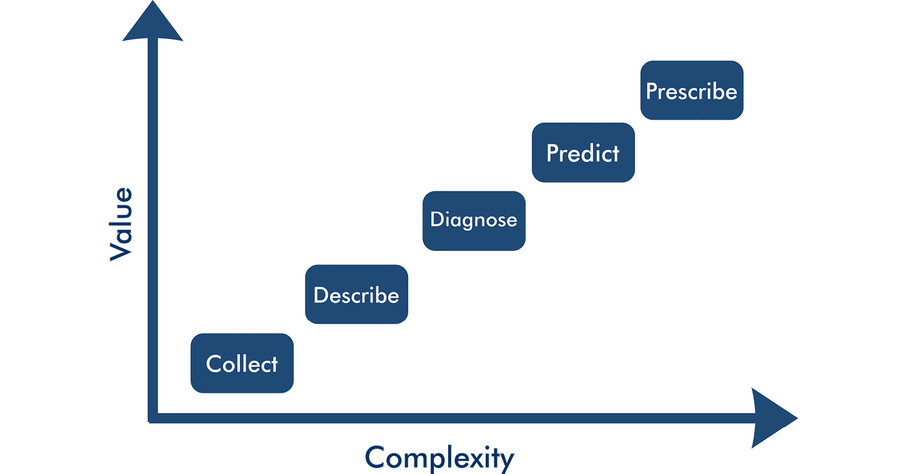
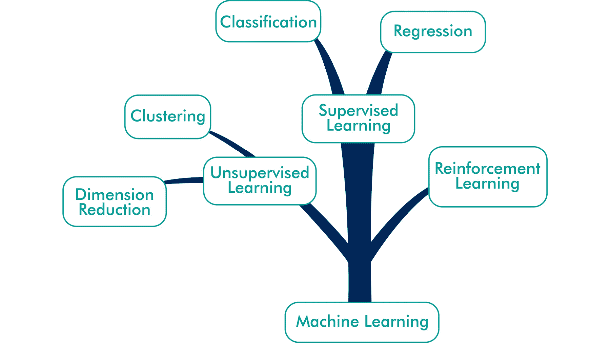

  

# 三、战略数据科学

## 简介

管理者经常声称“数据丰富，但信息贫乏”。这种说法在许多情况下只是部分正确，因为它隐藏了对数据生命周期的误解。充满数据但缺乏相关信息表明，以前未开发的数据源正等待被挖掘和使用。

任何组织都不太可能没有特定目的地收集数据。在大多数情况下，收集数据是为了管理运营流程。毫无目的地收集数据是对资源的浪费。数据被使用后，被存储起来，成为‘暗数据’。因为几乎所有的业务流程都以电子方式记录，所以数据现在无处不在。管理人员理所当然地会问自己，这些信息存档后该如何处理。数据科学的战略方法有助于组织释放这些数据存储的未实现价值，以更好地了解其战略和运营背景。

鉴于*第 2 章《良好的数据科学》中的框架是规范性的，并定义了理想的数据科学，本章中的模型描述了组织可以采取的途径，以增加他们从数据中提取的价值。数据科学连续体是一个分层的五阶段框架，旨在成为一个数据驱动的组织。本章讨论了作为数据科学战略地图的连续统一体的各个阶段。*

## 数据科学连续体

战略数据科学遵循一个流程，在该流程中，组织构建高价值分析的能力。成为数据驱动型组织的过程始于收集运营过程中生成的数据。下一步涉及使用探索性技术描述这些数据，如基本的可视化和汇总统计，这是传统业务报告的领域。

###### 图 3.1:数据科学连续体

在探索和理解数据之后，组织可以诊断业务流程，以理解变量之间的因果和逻辑关系。连续体的倒数第二个阶段是利用过去的知识及其因果和逻辑联系来预测可能的未来，并构建理想的未来。数据科学之旅的最后阶段是数据用于规定日常运营的情况(*图 3.1* )。

连续体不是从左到右的旅程，最终到达算法控制我们命运的地方，连续体的其余部分变得不那么重要。连续体将数据科学战略引向这一点，但形成了严格的层次结构。在算法能够独立决定任何事情之前，你需要能够预测不久的将来。为了预测未来，您需要很好地掌握描述性统计数据来诊断业务流程。最后，**垃圾进垃圾出** ( **GIGO** )原则要求只有当我们理解了收集的数据，分析才是可能的。

## 收集数据

收集数据的最终目的是使决策能够改善现实或降低未来不利影响的风险。*第 2 章，良好的数据科学*讨论了理解数据与其描述的现实之间的关系的重要性。这种关系是领域知识的本质。专业人士在他们各自的领域接受过培训，并且在衡量他们管理的现实方面经验丰富。*第 2 章，良好的数据科学*描述了这两个领域在测量方面的一些差异。

文献经常区分原始数据和处理过的数据作为分析的主要成分。认为数据可以是原始和自然的想法是骗人的。没有原始数据这种东西，因为每次我们从物理或社会过程中收集信息时，我们都需要决定如何收集数据。在我们看到数据之前，这些决定总是基于对现实的假设。如果我们不知道它是什么，我们就无法测量它。

除了这些假设之外，我们还需要选择度量过程的哪些方面。每个数据集都只是我们假设的现实样本。再多的信息也不足以描述我们想要管理的物理或社会现实。所有的数据收集都是一个妥协和假设的过程。理解这些假设和限制是创造价值的重要一步。

不能低估数据质量的重要性。即使使用最复杂的机器学习算法，GIGO 原理也是不可避免的。了解数据质量需要专业知识和数学技能。GIGO 原则强调了主题专家的重要性，他们了解从创建到分析的数据流。

总是收集和存储数据来管理业务流程。当客户打电话投诉时，运营商会记录这些信息，以方便客户的体验。当处理厂测量水箱水位时，控制系统使用这些信息来决定何时运行过滤器，以确保城镇不会缺水。所有数据都在创建时或接近创建时使用。该过程完成后，它将成为暗数据。这个引人注目的名字并没有公正地对待数据，让它看起来像是服务器充满了无用的比特和字节。然而，数据在生成时是有用的，只是等待被回收。

许多数据科学都涉及回收这些信息以创造额外的价值。在客户服务流程的情况下，我们可以分析投诉是否集中在一个区域内。对于处理厂，我们可以使用这些数据来评估工厂的性能，以帮助我们优化能源消耗。自从数据革命以来，产生、使用和归档的数据比以往任何时候都多。数据科学的力量之一是重用这种资源，以获得额外的洞察力来提高性能。数据科学家或业务分析师就像考古学家一样，挖掘电子档案，了解过去，以影响未来。

突出的一点是，数据很少是为了最初的目的而收集的。这意味着所有数据都需要转换成适合实现项目目标的格式。清理数据是数据科学中最不令人兴奋的活动，但它通常需要大量的可用资源。业内用于清理数据的非正式术语是争吵、咀嚼或数据柔术。这些不太正面的引用说明了与清理数据相关的努力和挫折。

现实是变化无常的，这意味着我们永远无法获得关于我们感兴趣的变量的所有可能的数据。由于担心隐私、调查疲劳或注意力持续时间短，填写调查的人可能不想回答所有问题。用于收集数据的技术从来都不是完美的，物理测量常常因为各种原因而缺失。

缺失数据需要通过用估计值估算差距或移除部分样本来管理。当只有几个数据点丢失时，统计方法可以使用各种方法来填补空白。简单的技术，如用以前的值或平均值替换丢失的数据，到使用机器学习的更复杂的程序，可以最小化丢失的数据量。当调查中的大块数据丢失时，应该从样本中删除回答百分比低的受试者。防止 GIGO 综合症意味着数据科学家首先需要从数据集中删除垃圾。管理缺失数据的最合适方法取决于数据缺失的原因以及缺失点的影响。

数据革命催生了大数据现象，在*声音数据科学部分*中有简要提及。有关大数据的问题本质上主要是技术性的，涉及存储、管理和分析这些数据。访问和分析数十亿条记录需要专门的技术，而这些技术与小数据集无关。

除了数据量之外，大数据还有以字母 v 开头的其他三个特征。与传统来源相比，大数据有很多种类。谷歌和脸书等典型大数据组织的数据库包含有关其用户广泛行为的信息。这些数据提供了我们在线生活的数字指纹，从我们播放的音乐到我们的朋友网络。

再次，大数据的流速非常高，导致短时期内测量点非常多。这种高速度与传统的采样方法形成对比，传统的采样方法每隔几分钟、几小时甚至几天才收集一次信息。

最后，大数据具有很高的准确性。关于人类行为的传统数据来源询问人们他们的感觉或者他们将来可能会做什么。这种方法的准确性较低，因为它们是对行为的间接测量。大数据具有高度的可靠性，因为它衡量的是实际行为。

这种高容量、多种多样和高水平的速度准确性的结合赋予了大数据巨大的力量。在人类历史上，我们从来没有获得过关于我们行为模式的详细信息。然而，组织中使用的大多数数据集都不是大数据。

大数据为能够生成此类信息的组织提供了前所未有的机遇。然而，数据集不一定要很大才能创造商业价值。一个数据集是否属于大数据范畴，从战略角度来看不是一个问题，而仅仅是一个技术问题。收集证据的主要目的是确保信息有助于组织做出基于证据的决策。同样的原则适用于所有数据来源，无论大小。

## 描述性统计

任何分析过程的第一步都是描述所考虑的数据。**描述性统计**是对数据集进行汇总的方法，如平均值、中值、范围、标准差等。商业智能和探索性分析是描述性统计最常见的用途。

描述性统计是管理的后视镜。大多数性能报告都包含大量的表格和图形，用于报告前一报告期内发生的情况。商业报告通常被视为数据科学的一个低级方面，因为你需要透过挡风玻璃开车，而不仅仅是通过后视镜。有些人更直白地说，传统的业绩报告就像是在战斗结束后清点死亡人数。

尽管这个类比似乎是抛弃传统商业报告的有力论据，但它并没有否定后视镜的重要性。汽车类比在逻辑上也是无效的，因为我们透过挡风玻璃看到的不是未来，而是现在。业务流程通过监控使用当前的数据，而绩效报告让我们了解过去，从而学会创造更美好的未来。描述性统计并不是成为数据驱动型组织的充分条件，但却是必要条件。描述性统计是进行更复杂分析不可避免的第一步。

### 商业报告

在撰写商业报告时，管理者需要做出两个决定。首先，他们需要决定哪些绩效指标足够重要，应该包含在业务报告中。第二个决定是如何呈现这些信息，以便报告的读者得出有效的结论。这两种选择都需要权衡各种因素。选择在绩效报告中包含哪些绩效指标是一门艺术，需要平衡完整性和一致性的要求。开发一个性能仪表板是一个迭代的过程，在这个过程中，度量被不断地微调。

通用电气(General Electric)前首席执行官杰克韦尔奇(Jack Welch)的名言经常在全球各地的董事会上被吹捧:“你衡量的就是你得到的”。(*韦尔奇 J. (2001)。直截了当。更温暖的书。这个短语被如此频繁地使用，以至于它具有商业公理的地位，其真实性不容置疑。这条规则表明，你度量得越多，你就能更好地控制你的组织的命运。韦尔奇似乎警告我们，商业报告中缺失的任何流程都注定会失败。*

这些都是明智的话，但衡量太多的变量往往会导致混乱，而不是启发。似乎使用这些词语的管理者并没有读完韦尔奇的整本书。韦尔奇也缓和了他对衡量的坚持，他写道“我们常常衡量一切，却什么也不理解”。商业报道似乎隐藏了一个悖论。

无论您测量多少 KPI 或其他参数，一个绩效测量系统永远不会既完整又一致。这意味着向仪表板添加越来越多的交通灯、图表、地图和其他元素会增加混淆和不一致的风险。这个问题的另一面是，由一致的描述性统计数据组成的极简仪表板将是不完整的，因为不是所有感兴趣的东西都将被测量。(*普雷沃斯，P. (2012)。服务提供中绩效测量的不完全性定理。世界商业能力大会。奥克兰:卓越组织研究中心(COER)*

一旦分析师选择了理想的绩效指标，他们就决定如何将这些指标传达给管理层。许多方法和工具支持报告描述性统计数据。在最底层，我们可以在一个表中显示信息，以便用户可以自己探索数据。虽然这种方法提供了极好的透明性，但它让用户自己开发关于信息的故事。

突出显示某些重要信息的条件格式增强了表格，但并不是交流数据的理想方式。正如在*第 2 章《良好的数据科学*中所讨论的，数据可视化是一种比表格更有效的用数据讲述故事的方法。最佳实践是展示可视化效果，并提供对表格中图表数据的访问，以提高完全再现性并增加可信度。

## 诊断

大多数分析项目都涉及诊断，这是寻找变量之间因果或逻辑关系的过程。分析数据使用数学变换来查找和验证变量之间的关系。我们可能需要知道投诉是否集中在服务区的某个区域，或者通过将其与其他操作数据相关联来找到这些投诉最可能的原因。

这种描述意味着，将数据可视化以显示分布或比较两个或更多变量严格来说不是分析任何东西。大多数性能报告中的描述性统计将数据减少到更少的数量，但严格来说，不会向数据集添加任何信息。一组数字的平均值或趋势线已经在这些数字之内。诊断或分析的定义属性是转换干净的数据以揭示新的信息。通过组合和处理信息，分析向我们展示了一些从数据本身看不到的东西。

寻找因果关系和逻辑关系的分析工具箱非常庞大，包含许多创造新知识的不同方法。这些方法涵盖了大量的数值技术。回归有助于找到简单的模式；主成分分析简化了数据或蒙特卡罗模拟来管理不确定性。全面讨论可用的方法超出了本书的范围，因为关于这个主题的文献非常广泛。

每个知识领域都有自己特定的信息分析方法。工程师经常使用微积分和线性代数来解决问题。营销人员可以使用诸如**偏最小二乘**建模的技术来测量潜在变量，以了解他们的客户需要什么。经济学家发展了专门的计量经济学来管理金融资源。人类努力的每一个领域都发展了他们自己对世界的数学观点。

### 定性数据科学

大多数分析侧重于数字或定量方法，但分析定性信息也有价值。定性分析通常被认为不如与数字打交道有价值，因为它被认为是主观的。这种主观性不是定性方法的价值判断，而是社会科学的固有问题。社会科学家已经通过结合定性和定量的分析方法开发了管理这种主观性的方法。

**计算机辅助定性数据分析**是一个新兴的计算领域，帮助研究人员使用最大限度减少偏差的方法管理大量定性信息。这些软件包有助于管理采访或焦点小组、开放式调查问题、社交媒体或其他形式的文本的转录。这些类型的分析需要研究人员首先理清文本，并给它们分配标签、代码或类别。一旦研究人员对数据进行处理，计算机就会帮助分析这些关系的数值。诸如**扎根理论**或内容分析等技术提供了一种从定性数据中提取价值的系统方法。

其他定性技术包括文本和图像的自动分析。**情感分析**是一种有用的技术，用于评估一段文本的情感是积极的、中性的还是消极的。这些方法中的大多数依赖于预分类单词的字典。该算法计算它们的出现次数，从而确定情绪是积极的还是消极的。例如，单词 great 表示积极的情绪，而单词 cheesy 表示消极的情绪。这种技术的主要问题是英语中的许多单词是同形异义词，即拼写相同但意思不同的单词。在供水的语境中，lead 这个词通常是否定的，但是在商业语境中，lead 这个词可以表达一种肯定的情绪。

其他自动文本分析技术使用数字方法来寻找单词之间的相关性。这些文本分析方法有助于理解大量文本，而不必阅读每个单词。这些方法减少了分析定性信息的偏差，但是这些方法的输出仍然需要由研究者来解释。然而，这些方法都不能像人类那样从文本中提取意义。

## 预测未来

几千年来，预测未来一直是人类的主要追求之一。我们无法直接控制的力量影响着我们的生活，而预测让我们能够控制我们周围不断变化的世界，以最小化我们生活的风险。在启蒙时代之前，人类试图用占卜来把握存在的不可预测性。他们研究恒星的运动、动物内脏、茶叶和许多其他东西来了解它们的命运。

自从科学革命以来，我们不再看星星，研究茶叶，或者取出动物的内脏。定量科学是有史以来发明的最成功的占卜形式。许多方法可用于预测未来，从简单的线性回归模型到更复杂的随机森林和可用于连接过去和未来的神经网络。

寻求收获数据科学回报的组织通常受到机器学习和其他先进技术能力的激励。能够预测可能的未来使管理者能够评估这种未来是否令人满意。如果不是这样，那么管理者调整当前的实践来创造期望的未来。如果一家零售店能够预测消费者是否会因为他们的生活方式偏好而购买一种产品，那么他们就可以在营销传播中针对他们进行宣传。如果一个工程师能够预测到一件设备很可能很快就会出故障，那么就可以更换它来避免问题。

预测分析使用关于过去的信息，并使用逻辑来确定模型中变量的可能未来状态。例如，水务公司可以开发一个预测模型，利用客户的资产规模、富裕程度、天气等因素来估计客户在某一天的用水量。零售商可以开发一个商店客流量的预测模型，作为广告、公共假日、销售、位置以及任何其他可以预测这种行为的因素的函数。

所有预测未来的可靠方法都利用过去的信息，结合特定的逻辑来估计接下来可能发生的事情。只有当预测的所有边界条件保持不变时，这种未来才会发生。没有数学模型可以预测未来——它只能提供对可能未来的洞察。预测这些可能的未来的目的是确定创造期望的未来的最佳行动原因。

本节简要概述了预测方法。艾瑞克·希格尔的《预测分析》一书全面介绍了预测未来的方法。( *E. (2016)。预测分析:预测谁会点击、购买、撒谎或死亡的能力。威利*。

描述可信未来的各种方法包括两种方法，每种方法都基于不同的假设。传统方法遵循实验验证假说的科学过程。机器学习完全不同，因为它不使用假设。

### 传统预测方法

科学方法是开发世界预测模型的传统过程，如图*图 3.2* 所示。这是一个循环的过程，描述了我们对世界的理解不断改善(*李，&林，I. (2008)。商业研究:理论与实践指南。伦敦:贤者*。

管理者通过描述性统计观察他们感兴趣的过程。任何出现在最新公司仪表板上的异常都会引发新的问题，即是什么导致了与预期结果的偏差。

###### 图 3.2:科学的进程

回答这些问题的传统方法从假设开始，假设是一种可以被证实或拒绝的陈述。一位经理可能想知道为什么销售额呈下降趋势，并假设一系列炎热的天气使消费者失去了去户外购物中心的动力，导致了销售额的下降。然后，分析师开发一种方法来验证或拒绝假设，这增加了我们对世界的了解。然后，商店经理可以利用这些知识来决定是否值得搬到有空调的购物中心，以最大限度地提高商店的客流量。

一些科学过程以理论的形式导致对世界的普遍认识。对一个理论的科学观点完全不同于对某件事的常识性理解，那件事可能是真的，也可能不是。理论是测量变量之间的确定关系。例如，解释两个物体之间的力的引力理论，可靠地预测了物体的运动。

科学家们发展了成千上万的理论来帮助我们解释这个世界。科学理论是预测和控制未来的便捷方式。大多数预测未来的理论都是关于物质世界的。几乎没有科学意义上的传统理论允许我们可靠地预测人类行为，无论是个体行为还是集体行为。

一旦这些理论被接受和使用，进一步的观察将提出新的问题，同样的过程再次被遵循。认识到的关键方面是研究者的洞察力引导这个过程。阐明一个合理的假设需要对所考虑的主题有深刻的理解。

科学过程的结果在许多情况下是一个描述不同现实状态之间关系的公式。科学家更喜欢优雅的理论。一个优雅的理论可以用一个相对简单的公式写下来。著名物理学家斯蒂芬·霍金在他鼓舞人心的书《时间简史》中写道，他的梦想是有一天能有一个能描述宇宙万物的公式，并能装进 t 恤衫。

### 机器学习

机器学习无疑是数据科学的典型代表。这种流行的技术可能比它所能提供的更多。机器不能学习任何东西。机器学习是一组复杂的算法，通过识别数据中的模式将输入转换为输出。该术语由 IBM 的亚瑟·塞缪尔(Arthur Samuel)于 1959 年创造，旨在促进他们在软件开发方面的能力( *Burkov，A. (2019)。一百页的机器学习书。LeanPub* 。

机器学习是**人工智能** (AI)的一个分支。被归类为机器学习的算法集是人工智能工具包的一部分，但不是模仿人类推理的唯一方式。

机器学习的工作方式不同于传统的预测方法，因为是机器本身创建了方程，而不是研究人员。机器学习的家谱有三个主要分支:监督和非监督方法，以及强化学习，如图*图 3.3* 所示。

###### 图 3.3:机器学习方法概述

在监督方法中，为算法提供一组具有已知关系的训练数据。例如，当想要预测观众对电影的喜爱程度时，训练数据由关于人们观看了哪些电影以及他们如何对这些电影进行评级的验证信息组成。监督算法分析训练数据以发现模式，这样我们就可以预测观众喜欢新电影的可能性。监督学习可以对数据进行分组分类，也可以对数据进行回归分析，找出变量之间的关系。

在图像中识别猫是分类的一个例子。该算法由成千上万张带标签的图像呈现，其中一些包含一只猫，一些不包含。该算法被教导如何使用这些例子来识别猫。监督学习就像人类如何学习对世界进行分类。作为孩子，我们的父母给我们提供了猫的例子，在我们获得了识别猫的技能后，我们可以独立地将毛茸茸的动物归类为猫或其他动物。

回归分析使用自变量和已知的因变量来寻找数值或分类变量之间的关系。自变量是因变量的原因。我们可能知道下雨的可能性与空气的温度和湿度有关。这种数学关系然后被用于预测天气，估计人或资产的预期寿命，以及随时间发生的任何事情。

监督机器学习最重要的考虑因素之一是训练数据集的大小。当这个集合太大时，算法会在不存在的地方找到模式，这就是所谓的过拟合。当数据集不够大时，它将无法找到任何模式。微调预测算法以提供可靠的预测是一项需要深入了解算法的工作。

无监督方法在没有标记样本的情况下运行。这些算法在数据中寻找模式。聚类方法检测多维数据中的数据组。这种技术对于使用多组特征对客户进行细分非常有用。细分客户有助于组织确定营销目标。无监督的方法也可以减少数据的维数。这些技术有助于发现数据中不可见的方面。因素分析和结构方程模型是分析社会调查和发现潜在模式的方法的例子。

这些机器学习方法的输出与传统分析有很大不同。虽然科学家穿着印有优雅公式的 t 恤，但机器学习的结果往往是人类完全无法理解的。机器学习的这一方面可能是一个问题，因为如果专业人员看不到或理解机器用来实现其结果的逻辑，他们就会犹豫是否接受算法的结果。这个问题凸显了在所有专业人员中进行数据科学教育的必要性，而不仅仅是专家。

第三种方法，**强化学习**是一种在规范分析中使用的技术，这是下一节的主题。

## 处方动作

连续体的最后一步是机器接管我们的世界，人类可以放松并由他们的机器人奴隶服务。这一愿景可能看起来像科幻小说，但几十年来，自动化流程已经成为我们生活的一部分。

工业系统需要由操作员控制，以确保他们产生我们需要的结果。例如，当一个化学品罐达到某个低液位时，需要启动泵来再次填充，并且操作者需要监控该罐。手动系统要求操作员检查系统状态的测量值并采取适当的行动。第一级自动化使用控制回路来测量储罐和自动阀的液位。

几乎所有当代制造过程都使用这些第一代控制回路。这些系统的问题在于，它们依赖的预设条件在外部环境发生变化时可能并不合适。传统控制系统测量当前值，并在测量值开始趋向设定值时采取行动。实际上，控制系统由 if-then 语句组成的网络来管理所有的标准条件。当环境偏离系统设计运行的边界条件时，系统将失效。

机器学习可以通过模拟环境而不是依赖有限的边界条件来增强传统的控制系统。强化学习使用博弈论的原理来寻找最大化结果的解决方案。这种方法使用虚拟胡萝卜加大棒，因为算法找到了优化预定义条件的方法。强化学习非常接近生物体的学习方式。当一种动物，不管是人还是其他动物，以某种方式行为得到积极的回报时，这种行为会在未来类似的情况下得到强化和重复。

这种方法模拟了它想要控制的环境，模拟了数百万种可能的决策，以确定最优的选择。这种方法在玩复杂的棋盘游戏，如围棋和国际象棋中取得了惊人的成功。强化学习非常适合游戏，因为现实可以被完美模拟。在现实世界的系统中部署这些方法要复杂得多，因为模拟自然或社会环境要比棋盘游戏的理想环境复杂得多。

## 走向数据驱动型组织

数据科学连续体为寻求更多数据驱动的组织提供了战略地图。连续体中的每一步对下一个层次都同样重要，因为没有较低层次的参与，这些较高层次的复杂性是无法实现的。数据科学连续体最重要的方面是它总结了一种向数据驱动型组织发展的方法。随着组织向更复杂的数据科学形式发展，早期阶段不会成为残留的附录，而是仍然是数据科学战略不可或缺的一部分。这个模型的所有部分都具有同等的相对价值。

然而，数据驱动不仅仅是一个增加复杂性的过程。基于证据的管理要求组织内的人员具备数据素养，并为共同的目标而共同努力。数据科学的系统性需要一个正式的流程来确保良好的结果。分析方法越来越复杂，也需要投资于更好的工具和数据基础设施。*本书的第 4 章，数据驱动的组织*反映了数据科学的非技术方面，并讨论了成为数据驱动的组织所需的人员、流程和系统。这本书以从数学和伦理的角度反思数据科学的局限性而结束。