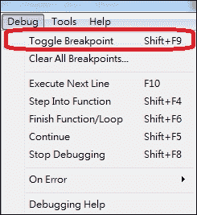
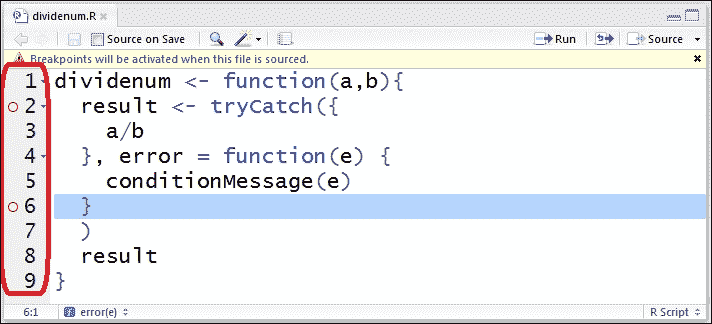
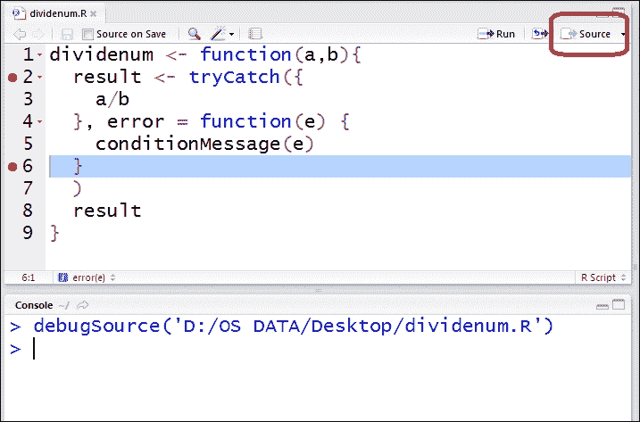

# 一、R 中的函数

本章涵盖以下主题:

*   创建 R 函数
*   匹配参数
*   了解环境
*   使用词法范围
*   理解结束
*   执行惰性评估
*   创建中缀运算符
*   使用替换功能
*   处理函数中的错误
*   调试功能

# 简介

R 是数据科学家选择的主流编程语言。根据领先的数据分析网站 KDnuggets 进行的民意调查，R 在最近三次调查(2012 年至 2014 年)中被列为最受欢迎的分析、数据挖掘和数据科学语言。对于许多数据科学家来说，R 不仅仅是一种编程语言，因为该软件还提供了一个交互式环境，可以执行所有类型的数据分析。

r 在数据操作和分析方面有很多优势，最著名的三个如下:

*   **开源和免费**:使用 SAS 或 SPSS 需要购买使用许可。人们可以免费使用 R，允许用户从每个函数的源代码中轻松学习如何实现统计算法。
*   **强大的数据分析功能** : R 在数据科学界赫赫有名。许多生物学家、统计学家和程序员在通过 CRAN(综合 R 档案网络)在世界范围内分发这些包之前，已经将他们的模型包装到 R 包中。这允许任何用户通过从 CRAN 下载并安装一个 R 包来开始他们的分析项目。
*   易于使用:由于 R 是一种自解释的高级语言，用 R 编程相当容易。R 用户只需要通过其强大的文档了解如何使用 R 函数以及每个参数是如何工作的。我们可以轻松地进行高级数据分析，而无需了解复杂的基础数学知识。

r 用户很可能会同意，这些优势使复杂的数据分析变得更容易和更容易理解。值得注意的是，R 还允许我们扮演普通用户或开发者的角色。对于一个用户来说，我们只需要知道一个功能是如何工作的，而不需要详细了解它是如何实现的。与 SPSS 类似，我们可以通过 R 的交互 shell 执行各种类型的数据分析。另一方面，作为一个 R 开发人员，我们可以编写他们的函数来创建一个新的模型，或者他们甚至可以将实现的函数打包到一个包中。

本书的目的不是解释如何从头开始编写一个 R 程序，而是涵盖如何成为一名 R 开发人员。本章的主要目的是向用户展示如何定义他们的函数来加速分析过程。从创建一个函数开始，本章涵盖了 R 的环境，并解释了如何创建匹配的参数。还有关于如何在 R 中执行函数式编程，如何创建高级函数，如中缀运算符和替换，以及如何处理错误和调试函数的内容。


# 创建 R 函数

R 语言是函数的集合；用户可以将各种包中的内置函数应用到他们的项目中，或者他们可以为特定的目的定义一个函数。在这个食谱中，我们将向你展示如何创建一个 R 函数。

## 准备就绪

如果你是 R 语言的新手，你可以在 R 官方网站([http://www.r-project.org/](http://www.r-project.org/))上找到详细的介绍、语言历史和功能。当你准备好下载安装 R 的时候，请连接综合 R 存档网([http://cran.r-project.org/](http://cran.r-project.org/))。

## 怎么做...

执行以下步骤以创建您的第一个 R 函数:

1.  在 R 控制台上键入以下代码，创建您的第一个函数:

    ```r

    >addnum<- function(x, y){

    + s <- x+y

    + return(s)

    + }

    ```

2.  Execute the `addnum` user-defined function with the following command:

    ```r

    >addnum (3,7)

    [1] 10

    ```

    或者，您可以定义没有`return`语句的函数:

    ```r

    >addnum2<- function(x, y){

    + x+y

    + }

    ```

3.  用以下命令执行`addnum2`自定义函数:

    ```r

    >addnum2(3,7)

    [1] 10

    ```

4.  您可以通过输入函数名查看函数的定义:

    ```r

    >addnum2

    function(x, y){

    x+y

    }

    ```

5.  最后，您可以使用 body 和 formals 来检查函数的`body`和`formal`参数:

    ```r

    >body(addnum2)

    {

    x + y

    }

    >formals(addnum2)

    $x

    $y

    >args(addnum2)

    function (x, y)

    NULL

    ```

## 它是如何工作的...

r 函数是一个由有组织的和可重用的语句组成的块,它通过允许你重用代码来减少编程的重复性。此外，通过模块化函数中的语句，您的 R 代码将变得更具可读性和可维护性。

按照这些步骤，您现在可以创建两个`addnum`和`addnum2` R 函数，并且您可以成功地添加两个函数的输入参数。在 R 中，函数通常采用以下形式:

```r

FunctionName<- function (arg1, arg2) {

body

return(expression)

}

```

`FunctionName`是函数名，`arg1`和`arg2`是自变量。在花括号内，我们可以看到函数体，函数体是一个有效语句、表达式或赋值的集合。在函数的底部，我们可以找到`return`语句，它将 expression 传递回调用者并退出函数。

`addnum`函数是标准的函数语法，包含了`body`和`return`语句。然而，您不一定需要在函数的末尾放置一个`return`语句。类似于`addnum2`函数，函数本身会将最后一个表达式返回给调用者。

如果您想查看函数的组成，只需在交互式 shell 上键入函数名。您还可以使用`body`和`formal`函数进一步检查函数的`body`和`formal`参数。或者，您可以使用`args`函数来获取函数的参数列表。

## 还有更多...

如果你想在 R 中看到一个函数的文档，你可以使用`help`函数或者简单地在函数名前输入`?`。例如，如果您想检查`sum`函数的文档，您可以执行以下操作:

```r

>help(sum)

> ?sum

```


# 匹配参数

在 R 函数中，参数是调用函数时提供的输入变量。我们可以将参数、命名参数、带有默认变量的参数或者不确定数量的参数传递给函数。在这个菜谱中，我们将演示如何向我们定义的函数传递不同种类的参数。

## 准备就绪

通过在操作系统上安装 R，确保您完成了之前的制作方法。

## 怎么做...

执行以下步骤创建具有不同类型参数列表的函数:

1.  在 R 控制台中键入以下代码，创建一个带有默认值的函数:

    ```r

    >defaultarg<- function(x, y = 5){

    + y <- y * 2

    + s <- x+y

    + return(s)

    + }

    ```

2.  然后，通过将`3`作为输入参数:

    ```r

    >defaultarg(3)

    [1] 13

    ```

    来执行`defaultarg`用户自定义函数
3.  或者，您可以向函数传递不同类型的输入参数:

    ```r

    >defaultarg(1:3)

    [1] 11 12 13

    ```

4.  您还可以向函数中传递两个参数:

    ```r

    >defaultarg(3,6)

    [1] 15

    ```

5.  或者，可以将一个命名的参数列表传入函数:

    ```r

    >defaultarg(y = 6, x = 3)

    [1] 15

    ```

6.  接下来，您可以将 if-else-condition 与命名参数的函数一起使用:

    ```r

    >funcarg<- function(x, y, type= "sum"){

    + if (type == "sum"){

    + sum(x,y)

    + }else if (type == "mean"){

    + mean(x,y)

    + }else{

    + x * y

    + }

    + }

    >funcarg(3,5)

    [1] 8

    >funcarg(3,5, type = 'mean')

    [1] 3

    >funcarg(3,5, type = 'unknown')

    [1] 15

    ```

7.  此外，可以向函数传递不确定数量的参数:

    ```r

    >unspecarg<- function(x, y, ...){

    + x <- x + 2

    + y <- y * 2

    + sum(x,y, ...)

    + }

    >unspecarg(3,5)

    [1] 15

    >unspecarg(3,5,7,9,11)

    [1] 42

    ```

## 它是如何工作的...

r 在创建函数时提供了灵活的参数绑定机制。在这个菜谱中，我们首先创建一个名为`defaultag`的函数，它有两个形式参数:`x`和`y`。这里，`y`参数有一个默认值，定义为`5`。然后，当我们通过传递`3`到`defaultarg`进行函数调用时，它在函数中传递`3`到`x`和`5`到`y`并返回`13`。除了传递一个标量作为函数输入，我们还可以传递一个向量(或任何其他数据类型)给函数。在这个例子中，如果我们将一个`1:3`向量传递给`defaultarg`，它将返回一个向量。

接下来，我们可以看到参数是如何绑定到函数的。当通过传递不带参数名的实参来调用函数时，函数通过位置绑定传递的值。以步骤 4 为例；第一个`3`参数匹配到`x`，`6`匹配到`y`，返回`15`。另一方面，您可以按名称传递参数。在步骤 5 中，我们可以以任何顺序将命名参数传递给函数。因此，如果我们将`y=6`和`x=3`传递给`defaultarg`，函数将返回`15`。

此外，我们可以使用参数作为控制语句。在步骤 6 中，我们指定了三个形式参数:`x`、`y`和`type`，其中`type`参数的默认值定义为`sum`。接下来，我们可以将参数`type`的值指定为 if-else 控制流中的一个条件。也就是当我们将`sum`传递给`type`时，它返回`x`和`y`的和。当我们将`mean`传递给`type`时，它返回`x`和`y`的平均值。当我们将除了`sum`和`mean`之外的任何值传递给`type`参数时，它返回`x`和`y`的乘积。

最后，我们可以使用`...`符号向函数传递一个未指定数量的参数。在这个例子的最后一步，如果我们只将`3`和`5`传递给函数，函数首先将`3`传递给`x`，将`5`传递给`y`。然后，该函数将`2`加到`x`，将`y`乘以`2`，并将`x`和`y`的值相加。但是，如果我们向函数传递两个以上的参数，函数还会对附加的参数求和。

## 还有更多...

除了给出完整的参数名，我们还可以在进行函数调用时缩写参数名:

```r

>funcarg(3,5, t = 'unknown')

[1] 15

```

这里，虽然我们没有正确地指定参数的名称`type`，但是该函数将值`unknown`传递给参数`type`，并返回`15`作为输出。


# 了解环境

除了函数名、函数体和形式参数之外，环境是函数的另一个基本组成部分。简而言之，环境是 R 管理和存储不同类型变量的地方。除了全局环境之外，每当创建一个新函数时，每个函数都会激活它的环境。在本食谱中，我们将向您展示每个功能的环境是如何工作的。

## 准备就绪

通过在您的操作系统上安装 R，确保您已经完成了前面的方法。

## 怎么做...

执行以下步骤来处理环境:

1.  首先，您可以使用`environment`功能检查当前环境:

    ```r

    >environment()

    <environment: R_GlobalEnv>

    ```

2.  还可以用`.GlobalEnv`和`globalenv` :

    ```r

    > .GlobalEnv

    <environment: R_GlobalEnv>

    >globalenv()

    <environment: R_GlobalEnv>

    ```

    浏览全球环境
3.  可以用`identical`功能对比环境:

    ```r

    >identical(globalenv(), environment())

    [1] TRUE

    ```

4.  此外，你可以创建一个新的环境如下:

    ```r

    >myenv<- new.env()

    >myenv

    <environment: 0x0000000017e3bb78>

    ```

5.  接下来可以找到不同环境的变量:

    ```r

    >myenv$x<- 3

    >ls(myenv)

    [1] "x"

    >ls()

    [1] "myenv"

    >x

    Error: object 'x' not found

    ```

6.  此时，可以创建一个`addnum`函数，用`environment`得到该函数的环境:

    ```r

    >addnum<- function(x, y){

    + x+y

    + }

    >environment(addnum)

    <environment: R_GlobalEnv>

    ```

7.  还可以确定一个函数的环境属于哪个包:

    ```r

    >environment(lm)

    <environment: namespace:stats>

    ```

8.  继续，你可以打印环境内的一个函数:

    ```r

    >addnum2<- function(x, y){

    + print(environment())

    + x+y

    + }

    >addnum2(2,3)

    <environment: 0x0000000018468710>

    [1] 5

    ```

9.  再者，你可以比较一个函数内外的环境:

    ```r

    >addnum3<- function(x, y){

    + func1<- function(x){

    + print(environment())

    + }

    + func1(x)

    + print(environment())

    + x + y

    + }

    >addnum3(2,5)

    <environment: 0x000000001899beb0>

    <environment: 0x000000001899cc50>

    [1] 7

    ```

## 它是如何工作的...

我们可以把 R 环境看作是一个存储和管理变量的地方。也就是说，每当我们在 R 中创建一个对象或函数时，我们就向环境中添加了一个条目。默认情况下，顶层环境是`R_GlobalEnv`全局环境，我们可以使用 environment 函数来确定当前环境。然后，我们可以使用`.GlobalEnv`或`globalenv`来打印全局环境，并且我们可以使用`identical`函数来比较环境。

除了全局环境之外，我们实际上可以创建我们的环境并将变量分配到新环境中。在本例中，我们创建了`myenv`环境，然后通过在环境名称后放置一个美元符号将`x <- 3`分配给`myenv`。这允许我们使用`ls`函数列出`myenv`和全球环境中的所有变量。此时，我们在`myenv`中找到`x`，但只能在全局环境中找到`myenv`。

继续，我们可以确定一个函数的环境。通过创建一个名为`addnum`的函数，我们可以使用`environment`来获取它的环境。由于我们是在全局环境下创建函数的，因此该函数显然属于全局环境。另一方面，当我们得到`lm`函数的环境时，我们得到的是包名。这意味着`lm`函数在`stat`包的名称空间中。

此外，我们可以在函数中打印出当前的环境。通过调用`addnum2`函数，我们可以确定`environment`函数输出了一个与全局环境不同的环境名称。也就是说，当我们创建一个函数时，我们也为全局环境创建了一个新环境，并将一个指针链接到它的父环境。为了进一步研究这个特性，我们创建了另一个`addnum3`函数，其中包含一个`func1`嵌套函数。此时，我们可以打印出`func1`和`addnum3`内部的环境，有可能它们的环境完全不同。

## 还有更多...

要获得父环境，我们可以使用函数。在下面的例子中，我们可以看到`parentenv`的父环境是`R_GlobalEnv`:

```r

>parentenv<- function(){

+ e <- environment()

+ print(e)

+ print(parent.env(e))

+ }

>parentenv()

<environment: 0x0000000019456ed0>

<environment: R_GlobalEnv>

```


# 使用词法范围

**词法范围**，也被称为 **的静态绑定**，决定一个值如何绑定到函数中的自由变量。这是源于 **scheme** 函数式编程语言的一个关键特性，它使 R 不同于 s。

## 准备就绪

通过在您的操作系统上安装 R，确保您完成了之前的配方。

## 怎么做...

执行以下步骤以了解范围规则的工作原理:

1.  首先，我们创建一个`x`变量，然后我们创建一个`tmpfunc`函数，用`x+3`作为返回:

    ```r

    >x<- 5

    >tmpfunc<- function(){

    + x + 3

    + }

    >tmpfunc()

    [1] 8

    ```

2.  然后我们创建一个名为`parentfunc`的函数和一个`childfunc`嵌套函数，看看当我们调用`parentfunc`函数时会返回什么:

    ```r

    >x<- 5

    >parentfunc<- function(){

    + x<- 3

    + childfunc<- function(){

    + x

    + }

    + childfunc()

    + }

    >parentfunc()

    [1] 3

    ```

3.  接下来，我们创建一个`x`字符串，然后我们创建一个`localassign`函数来修改函数内的`x`:

    ```r

    > x <- 'string'

    >localassign<- function(x){

    + x <- 5

    + x

    + }

    >localassign(x)

    [1] 5

    >x

    [1] "string"

    ```

4.  我们也可以创建另一个`globalassign`函数，但是使用`<<-`符号:

    ```r

    > x <- 'string'

    >gobalassign<- function(x){

    + x <<- 5

    + x

    + }

    >gobalassign(x)

    [1] 5

    >x

    [1] 5

    ```

    将`x`变量重新分配给`5`

## 它是如何工作的...

有两种不同类型的变量绑定方法:一种是词法绑定，另一种是动态绑定。词法绑定也称为静态绑定，其中每个绑定范围管理词法环境中的变量名和值。也就是说，如果一个变量是词汇绑定的，它将搜索最近的词汇环境的绑定。与此相反，动态绑定将所有变量和值保持在全局状态。也就是说，如果变量是动态绑定的，它将绑定到最近创建的变量。

为了演示词法绑定是如何工作的，我们首先创建一个`x`变量，并在全局环境中将`5`赋给`x`。然后，我们可以创建一个名为`tmpfunc`的函数。该函数输出`x + 3`作为返回值。即使我们没有在`tmpfunc`函数中给`x`赋值，`x`仍然可以在全局环境中找到`x`的值作为`5`。

接下来，我们创建另一个名为`parentfunc`的函数。在这个函数中，我们将`x`赋值给`3`，并创建一个`childfunc`嵌套函数(在函数中定义的函数)。在`parentfunc`主体的底部，我们调用`childfunc`作为函数返回。这里，我们发现函数使用了在`parentfunc`中定义的`x`，而不是在`parentfunc`之外定义的。这是因为 R 在全局环境中搜索匹配的符号名，然后在搜索列表中搜索包的名称空间。

接下来，让我们看看如果我们在全局状态下创建一个字符串形式的`x`变量，并在函数中将一个局部变量`x`赋给`5`，会返回什么。当我们调用`localassign`函数时，我们发现该函数返回的是`5`，而不是字符串值。另一方面，如果我们打印出`x`的值，我们仍然会看到 string 返回。当局部变量和全局变量同名时，函数的赋值不会改变全局状态中`x`的值。如果你需要在全局状态下修改`x`的值，你可以用这个`<<-`符号代替。

## 还有更多...

为了检查 R 的搜索列表(或路径)，您可以键入`search()`来列出搜索列表:

```r

>search()

[1] ".GlobalEnv""tools:rstudio"

[3] "package:stats" "package:graphics"

[5] "package:grDevices" "package:utils"

[7] "package:datasets" "package:methods"

[9] "Autoloads" "package:base"

```


# 了解关闭

函数是 r 的一等公民。换句话说，您可以将一个函数作为输入传递给另一个函数。在前面的食谱中，我们举例说明了如何创建一个命名函数。但是，我们也可以创建一个没有名字的函数，称为闭包(也就是匿名函数)。在这个食谱中，我们将向你展示如何在一个标准函数中使用闭包。

## 准备就绪

通过在您的操作系统上安装 R，确保您已经完成了前面的方法。

## 怎么做...

执行以下步骤在功能中创建一个闭合:

1.  首先，让我们回顾一下一个命名函数是如何工作的:

    ```r

    >addnum<- function(a,b){

    + a + b

    + }

    >addnum(2,3)

    [1] 5

    ```

2.  现在，让我们执行同样的任务，用闭包对两个变量求和:

    ```r

    > (function(a,b){

    + a + b

    + })(2,3)

    [1] 5

    ```

3.  我们也可以在另一个函数中调用一个闭包函数:

    ```r

    >maxval<- function(a,b){

    + (function(a,b){

    + return(max(a,b))

    + }

    + )(a, b)

    + }

    >maxval(c(1,10,5),c(2,11))

    [1] 11

    ```

4.  以类似于应用族函数的方式，您可以使用矢量化计算:

    ```r

    > x <- c(1,10,100)

    > y <- c(2,4,6)

    > z <- c(30,60,90)

    > a <- list(x,y,z)

    >lapply(a, function(e){e[1] * 10})

    [[1]]

    [1] 10

    [[2]]

    [1] 20

    [[3]]

    [1] 300

    ```

5.  最后，我们可以将函数添加到一个列表中，并将函数应用于给定的向量:

    ```r

    > x <- c(1,10,100)

    >func<- list(min1 = function(e){min(e)}, 

     max1 = function(e){max(e)} )

    >func$min1(x)

    [1] 1

    >lapply(func, function(f){f(x)})

    $min1

    [1] 1

    $max1

    [1] 100

    ```

## 它是如何工作的...

在 R 中，你不需要用实际的名字创建一个函数。相反，您可以使用闭包来集成对象中的方法。因此，您可以在另一个对象中创建一个更小更简单的函数来完成复杂的任务。

在我们的第一个例子中，我们展示了如何创建一个正常命名的函数。我们可以简单地通过向函数传递值来调用函数。另一方面，我们在第二个例子中演示了闭包是如何工作的。在这种情况下，我们不需要为函数指定名称，但是我们仍然可以将值传递给匿名函数并获得返回值。

接下来，我们演示如何在一个`maxval`命名函数中添加闭包。这个函数只是返回两个传递参数的最大值。然而，可以在任何其他函数中使用闭包。此外，我们可以在高阶函数中使用闭包作为参数，比如`lapply`和`sapply`。这里，我们可以输入一个匿名函数作为函数参数，返回 10 和给定列表中任意向量的第一个值的乘积。

此外，我们可以指定单个函数，或者将函数存储在一个列表中。因此，当我们想要对给定的向量应用多个函数时，我们可以将函数调用作为参数列表传递给`lapply`函数。

## 还有更多...

除了在的`lapply`函数中使用闭包，我们还可以将闭包传递给 apply 函数族的其他函数。在这里，我们演示了如何将同一个闭包传递给`sapply`函数:

```r

> x <- c(1,10,100)

> y <- c(2,4,6)

> z <- c(30,60,90)

> a <- list(x,y,z)

>sapply(a, function(e){e[1] * 10})

[1] 10 20 300

```


# 执行惰性评估

r 函数惰性地评估参数；根据需要对参数进行评估。因此，惰性求值减少了计算所需的时间。在下面的食谱中，我们将演示惰性求值是如何工作的。

## 准备就绪

通过在您的操作系统上安装 R，确保您已经完成了前面的方法。

## 怎么做...

执行以下步骤来查看惰性评估是如何工作的:

1.  首先，我们创建一个以`x`和`y`为参数的`lazyfunc`函数，但只返回`x` :

    ```r

    >lazyfunc<- function(x, y){

    + x

    + }

    >lazyfunc(3)

    [1] 3

    ```

2.  另一方面，如果函数返回`x`和`y`的总和，但是我们没有将`y`传递到函数中，则会出现错误:

    ```r

    >lazyfunc2<- function(x, y){

    + x + y

    + }

    >lazyfunc2(3)

    Error in lazyfunc2(3) : argument "y" is missing, with no default

    ```

3.  我们还可以为函数中的`y`参数指定一个默认值，但是只将`x`参数传递给函数:

    ```r

    >lazyfunc4<- function(x, y=2){

    + x + y

    + }

    >lazyfunc4(3)

    [1] 5

    ```

4.  除此之外，我们还可以在一个函数中使用懒求值来执行斐波那契运算:

    ```r

    >fibonacci<- function(n){

    + if (n==0)

    + return(0)

    + if (n==1)

    + return(1)

    + return(fibonacci(n-1) + fibonacci(n-2))

    + }

    >fibonacci(10)

    [1] 55

    ```

## 它是如何工作的...

如果需要表达式的值，r 会执行惰性求值来计算表达式。这种评估策略有以下三个优点:

*   由于避免了重复评估，它提高了性能
*   它递归地构造一个无限的数据结构
*   它在数据结构中固有地包含迭代

在这个菜谱中，我们展示了 R 代码中的一些懒惰评估示例。在我们的第一个例子中，我们创建了一个带有两个参数的函数，`x`和`y`，但是只返回`x`。由于惰性求值的特性，即使我们将`x`的值传递给函数，也能成功获得函数返回。然而，如果函数返回既包括`x`又包括`y`，如步骤 2 所示，我们将得到一个错误消息，因为我们只向函数传递了一个值。如果我们将默认值设置为`y`，那么我们不需要将`x`和`y`都传递给函数。

因为惰性求值具有创建无限数据结构而没有无限循环的优点，所以我们使用 Fibonacci 数生成器作为例子。在这里，这个函数首先创建一个无限的斐波纳契数列表，然后从列表中提取第 n 个元素。

## 还有更多...

另外，我们可以使用`force`函数来检查`y`是否存在:

```r

>lazyfunc3<- function(x, y){

+ force(y)

+ x

+ }

>lazyfunc3(3)

Error in force(y) : argument "y" is missing, with no default

>input_function<- function(x, func){

+ func(x)

+ }

>input_function(1:10, sum)

[1] 55

```


# 创建中缀运算符

在上一个菜谱中，我们学习了如何创建用户定义的函数。到目前为止，我们提到的大多数函数都是`prefix`函数，其中参数位于函数名后面的括号之间。然而，这种类型的语法使得两个变量的简单二元运算更难阅读，因为我们更熟悉在两个变量之间放置一个运算符。为了解决这个问题，我们将向您展示如何在这个配方中创建一个中缀操作符。

## 准备就绪

通过在您的操作系统上安装 R，确保您已经完成了前面的方法。

## 怎么做...

执行以下步骤在 R 中创建一个中缀运算符:

1.  先来看看如何将中缀运算转化为前缀运算:

    ```r

    > 3 + 5

    [1] 8

    > '+'(3,5)

    [1] 8

    ```

2.  再者，我们可以看一个更高级的转化的例子:

    ```r

    > 3:5 * 2 - 1

    [1] 5 7 9

    > '-'('*'(3:5, 2), 1)

    [1] 5 7 9

    ```

3.  接下来，我们可以创建中缀函数来寻找两个向量的交点:

    ```r

    >x <-c(1,2,3,3, 2)

    >y <-c(2,5)

    > '%match%' <- function(a,b){

    + intersect(a, b)

    + }

    >x %match% y

    [1] 3

    ```

4.  我们再创建一个`%diff%`中缀来提取两个向量的集合差:

    ```r

    > '%diff%' <- function(a,b){

    + setdiff(a, b)

    + }

    >x %diff% y

    [1] 1 2

    ```

5.  最后，我们可以使用中缀算子来提取三个向量的交集。或者，我们可以使用`Reduce`函数将操作应用到列表:

    ```r

    >x %match% y %match% z

    [1] 3

    > s <- list(x,y,z)

    >Reduce('%match%',s)

    [1] 3

    ```

## 它是如何工作的...

在一个标准函数中，如果我们想让对`a`和`b`变量执行一些操作，我们可能会创建一个`func(a,b)`形式的函数。虽然这种形式是标准的函数语法，但它比常规的数学符号(即`a * b`)更难读懂。但是，我们可以创建一个中缀运算符来简化函数语法。

在创建中缀操作符之前，我们检查了在两个变量上应用二元操作符时的不同语法。在第一步中，我们演示了如何用二元运算符执行算术运算。类似于标准的数学公式，我们需要做的就是在两个变量之间放置一个二元运算符。另一方面，我们可以将表示从中缀形式转换为前缀形式。像标准函数一样，我们可以使用二元运算符作为函数名，然后我们可以将变量放在括号之间。

除了在 R 中使用预定义的中缀运算符，用户还可以定义中缀运算符。为了创建一个操作符，我们需要命名以`%`开始和结束的函数，并用单引号(`'`)或反勾(```r)将名称括起来。这里，我们创建一个名为`%match%`的中缀运算符来提取两个向量之间的相互作用。我们还可以创建另一个名为`%diff%`的中缀函数来提取两个向量之间的集合差。最后，虽然我们可以将创建的中缀函数应用于两个以上的向量，但是我们可以使用 reduce 函数对列表应用`%match%`操作。

## 还有更多...

我们还可以通过创建一个同名的中缀运算符来覆盖现有的运算符:

```

>'+' <- function(x,y) paste(x,y, sep = "|")

> x = '123'

> y = '456'

>x+y

[1] "123|456"

```r

这里，我们可以用`+`操作符连接两个字符串。


# 使用替换功能

在 R 中的某些场合，我们可能会发现我们可以给一个函数调用赋值，这就是替换函数的作用。在这里，我们将向您展示替换函数是如何工作的，以及如何创建您自己的函数。

## 准备就绪

通过在您的操作系统上安装 R，确保您已经完成了前面的方法。

## 怎么做...

执行以下步骤在 R 中创建替换函数:

1.  First, we assign names to data with the `names` function:

    ```

    > x <- c(1,2,3)

    >names(x) <- c('a','b','c')

    >x

    a b c

    1 2 3

    ```r

    `names`功能实际上类似于以下命令:

    ```

    > x <- 'names<-'(x,value=c('a','b','c'))

    >x

    a b c

    1 2 3

    ```r

2.  在这里，我们还可以使我们的替换函数:

    ```

    > x<-c(1,2,3)

    > "erase<-" <- function(x, value){

    + x[!x %in% value]

    + }

    >erase(x) <- 2

    >x

    [1] 1 3

    ```r

3.  We can invoke the `erase` function in the same way that we invoke the normal function:

    ```

    >x <- c(1,2,3)

    > x <- 'erase<-'(x,value=c(2))

    >x

    [1] 1 3

    ```r

    我们也可以用`erase`函数删除多个值:

    ```

    > x <- c(1,2,3)

    >erase(x) = c(1,3)

    >x

    [1] 2

    ```r

4.  最后，我们可以创建一个替换函数，可以删除某些位置的值:

    ```

    > x <- c(1,2,3)

    > y <- c(2,2,3)

    > z <- c(3,3,1)

    > a = list(x,y,z)

    > "erase<-" <- function(x, pos, value){

    + x[[pos]] <- x[[pos]][!x[[pos]] %in% value]

    + x

    + }

    >erase(a, 2) = c(2)

    >a

    [[1]]

    [1] 1 2 3

    [[2]]

    [1] 3

    [[3]]

    [1] 3 3 1

    ```r

## 它是如何工作的...

在这个配方中，我们首先演示了如何使用`names`函数为每个值分配参数名。这种类型的函数方法可能看起来令人困惑，但它实际上是替换函数所做的:将值赋给函数调用。然后，我们演示了这个函数在标准函数形式中是如何工作的，这是通过在函数名后面放置一个赋值箭头(`<-`)并将`x`对象和值放在括号之间实现的。

接下来，我们学习了如何创建我们的替换函数。我们制作了一个名为`erase`的函数，它从给定的对象中移除某些值。我们通过在`erase`函数中包装要替换的向量并在赋值符号的右侧赋值要移除的值来调用该函数。或者，我们仍然可以通过在`erase`后面放置一个赋值箭头作为函数名来调用替换函数。除了从给定的 vector 对象中删除单个值之外，我们还可以通过在赋值函数的右侧放置一个 vector 来删除多个值。

此外，我们可以用替换函数删除某些位置的值。这里，我们只需要在括号内的对象和值之间添加一个位置参数。正如最后一步所示，我们用新创建的替换函数从列表的第二个值中删除了`2`。

## 还有更多...

如前所述，`names<-`是一个替代的函数。要检查一个功能是否是替换功能，使用`get`功能:

```

>get("names<-")

function (x, value) .Primitive("names<-")

```r


# 处理函数中的错误

如果你熟悉现代的编程语言，你可能有过如何使用`try`、`catch`以及最后的`block`来处理开发过程中可能出现的错误的经验。同样，R 在其函数中提供了类似的错误处理操作。因此，您可以在 R 代码中添加错误处理机制，使程序更加健壮。在这个菜谱中，我们将介绍 r 中的一些基本错误处理函数。

## 准备就绪

通过在您的操作系统上安装 R，确保您已经完成了前面的方法。

## 怎么做...

执行以下步骤来处理 R 函数中的错误:

1.  首先，让我们观察一个错误消息是什么样子的:

    ```

    > 'hello world' + 3

    Error in "hello world" + 3 : non-numeric argument to binary operator

    ```r

2.  在用户自定义函数中，如果发生了超出我们预期的事情，我们也可以使用`stop`打印出错误信息:

    ```

    >addnum<- function(a,b){

    + if(!is.numeric(a) | !is.numeric(b)){

    + stop("Either a or b is not numeric")

    + }

    + a + b

    + }

    >addnum(2,3)

    [1] 5

    >addnum("hello world",3)

    Error in addnum("hello world", 3) : Either a or b is not numeric

    ```r

3.  现在，让我们看看如果用一个`warning`函数:

    ```

    >addnum2<- function(a,b){

    + if(!is.numeric(a) | !is.numeric(b)){

    + warning("Either a or b is not numeric")

    + }

    + a + b

    + }

    >addnum2("hello world",3)

    Error in a + b : non-numeric argument to binary operator

    In addition: Warning message:

    In addnum2("hello world", 3) : Either a or b is not numeric

    ```r

    替换`stop`函数会发生什么
4.  我们还可以看到，如果我们用一个`warning`函数替换`stop`函数会发生什么:

    ```

    >options(warn=2)

    >addnum2("hello world", 3)

    Error in addnum2("hello world", 3) :

    (converted from warning) Either a or b is not numeric

    ```r

5.  为了抑制警告，我们可以用一个`suppressWarnings`函数来包装要调用的函数:

    ```

    >suppressWarnings(addnum2("hello world",3))

    Error in a + b : non-numeric argument to binary operator

    ```r

6.  我们还可以使用`try`函数来捕捉错误消息:

    ```

    >errormsg<- try(addnum("hello world",3))

    Error in addnum("hello world", 3) : Either a or b is not numeric

    >errormsg

    [1] "Error in addnum("hello world", 3) : Either a or b is not numeric\n"

    attr(,"class")

    [1] "try-error"

    attr(,"condition")

    <simpleError in addnum("hello world", 3): Either a or b is not numeric>

    ```r

7.  通过设置`silent`选项，我们可以抑制控制台上显示的错误信息:

    ```

    >errormsg<- try(addnum("hello world",3), silent=TRUE)

    ```r

8.  此外，我们可以使用`try`函数来防止中断 for 循环。这里，我们展示一个不使用`try`函数的 for 循环:

    ```

    >iter<- c(1,2,3,'O',5)

    >res<- rep(NA, length(iter))

    >for (i in 1:length(iter)) {

    + res[i] = as.integer(iter[i])

    + }

    Error: (converted from warning) NAs introduced by coercion

    >res

    [1] 1 2 3 NA NA

    ```r

9.  现在，让我们看看如果将`try`函数插入到代码中会发生什么:

    ```

    >iter<- c(1,2,3,'O',5)

    >res<- rep(NA, length(iter))

    >for (i in 1:length(iter)) {

    + res[i] = try(as.integer(iter[i]), silent=TRUE)

    + }

    >res

    [1] "1"

    [2] "2"

    [3] "3"

    [4] "Error in try(as.integer(iter[i]), silent = TRUE) : \n (converted from warning) NAs introduced by coercion\n"

    [5] "5"

    ```r

10.  对于参数，我们可以使用`stopifnot`函数来检查参数:

    ```

    >addnum3<- function(a,b){

    + stopifnot(is.numeric(a), !is.numeric(b))

    + a + b

    + }

    >addnum3("hello", "world")

    Error: is.numeric(a) is not TRUE

    ```r

11.  为了处理各种错误，我们可以使用`tryCatch`函数进行错误处理:

    ```

    >dividenum<- function(a,b){

    + result<- tryCatch({

    + print(a/b)

    + }, error = function(e) {

    + if(!is.numeric(a) | !is.numeric(b)){

    + print("Either a or b is not numeric")

    + }

    + }, finally = {

    + rm(a)

    + rm(b)

    + print("clean variable")

    + }

    + )

    + }

    >dividenum(2,4)

    [1] 0.5

    [1] "clean variable"

    >dividenum("hello", "world")

    [1] "Either a or b is not numeric"

    [1] "clean variable"

    >dividenum(1)

    Error in value[[3L]](cond) : argument "b" is missing, with no default

    [1] "clean variable"

    ```r

## 它是如何工作的...

与其他编程语言类似，R 为开发人员提供了一种错误处理机制。然而，R 中的错误处理机制是在函数中实现的，而不是在纯代码块中实现的。这是因为所有的操作都是纯函数调用。

在第一步中，我们演示了将一个整数加到一个字符串上会产生什么结果。如果操作无效，系统将在控制台上打印一条错误消息。R 中有三种基本的错误处理消息，分别是`error`、`warning`和`interrupt`。

接下来，我们创建一个名为`addnum`的函数，用于返回两个参数之和。但是，有时您会将意外类型的输入(例如，字符串)传递给函数。对于这个条件，我们可以在`return`语句前添加一个参数类型检查条件。如果输入数据类型都不是数字，则`stop`函数将打印一条错误消息，引用在`stop`函数中。

除了使用`stop`函数，我们还可以使用`warning`函数来处理错误。但是，仅使用警告功能，功能过程不会终止，而是返回`a + b`。因此，我们可能会发现控制台上显示了错误和警告消息。为了抑制警告信息，我们可以在`options`功能中设置`warn=2`，或者我们可以使用`suppressWarnings`来静音警告信息。另一方面，我们也可以使用`stopifnot`函数来检查参数是否有效。如果输入参数无效，我们可以停止程序并在屏幕上打印一条错误消息。

继续，我们可以使用`try`函数捕捉错误。这里，我们将字符串加到整数的操作中的错误信息存储到`errormsg`中。但是，该功能仍会在屏幕上显示错误信息。我们可以通过将`silent`参数设置为`TRUE`来静音消息。此外，如果不想让 for 循环被意外错误中断，那么`try`函数非常有用。因此，我们首先演示一个错误是如何意外中断循环执行的。在那个步骤中，我们可能会发现循环执行停止了，我们只成功地将三个变量赋给了`res`。然而，我们实际上可以通过将代码包装到一个`try`函数中来继续执行 for 循环。

除了`try`函数，我们可以使用更高级的错误处理函数`tryCatch`，来处理包括`warning`和`error`在内的错误。我们以如下方式使用`tryCatch`功能:

```

tryCatch({

result<- expr

}, warning = function(w) {

# handling warning

}, error = function(e) {

# handling error

}, finally = {

#Cleanup

})

```r

在这个函数中，我们可以在不同的函数代码块中捕获`warning`和`error`消息。通过遵循函数形式，我们可以创建一个名为`dividenum`的函数。该函数首先执行数字除法；如果出现任何错误，我们可以在`error`函数中捕捉错误并打印错误消息。在程序块的末尾，我们删除函数中任何已定义的值，并打印出`clean variable`的消息。此时，我们可以在三种不同的情况下测试这个函数是如何工作的:执行正常的除法，从字符串中分割出一个字符串，以及只向函数传递一个参数。我们现在可以观察不同条件下的输出消息。在第一种情况下，函数打印出除法结果，随后是`clean variable`，因为它被编码在`finally`的块中。对于第二个条件，该函数首先捕获`error`块中丢失值的错误，然后在最后输出`clean variable`。对于最后一个条件，虽然我们没有捕捉到没有向`b`参数传递值的错误，但是该函数仍然首先返回一个错误消息，然后在控制台上打印`clean variable`。

## 还有更多...

如果您想在使用的`tryCatch`函数时捕获错误消息，您可以将一个`conditionMessage`放在`tryCatch`函数的错误参数中:

```

>dividenum<- function(a,b){

+ result<- tryCatch({

+ a/b

+ }, error = function(e) {

+ conditionMessage(e)

+ }

+ )

+ result

+ }

>dividenum(3,5)

[1] 0.6

>dividenum(3,"hello")

[1] "non-numeric argument to binary operator"

```r

在这个例子中，如果您向`dividenum`函数传递两个有效数字参数，该函数将返回 3/5 的计算结果作为输出。另一方面，如果您向函数传递一个非数字值，函数会用`conditionMessage`函数捕捉错误，并将错误作为函数输出返回。


# 调试功能

作为程序员，调试是日常工作中最常见的任务。最简单的调试方法是在每个需要的位置插入一个`print`语句；然而，这种方法效率相当低。这里，我们将说明如何使用一些 R 调试工具来帮助加速调试过程。

## 准备就绪

确保你知道的功能和工作原理，以及如何创建一个新功能。

## 怎么做...

执行以下步骤调试一个 R 函数:

1.  首先，我们创建一个以`x`和`y`为参数的`debugfunc`函数，但是我们只返回`x` :

    ```

    >debugfunc<- function(x, y){

    + x <- y + 2

    + x

    + }

    >debug(2)

    ```r

2.  然后我们只传递`2`到`dubugfunc` :

    ```

    >debugfunc(2)

    Error in debugfunc(2) : argument "y" is missing, with no default

    ```r

3.  接下来，我们将`debug`函数应用到`debugfunc` :

    ```

    >debug(debugfunc)

    ```r

4.  至此，我们又把`2`传给了`debugfunc`:

    ```

    >debugfunc(2)

    debugging in: debugfunc(2)

    debug at #1: {

    x <- y + 2

    x

    }

    ```r

5.  您可以键入`help`来列出所有可能的命令:

    ```

    Browse[2]> help

    n next

    s step into

    f finish

    c or cont continue

    Q quit

    where show stack

    help show help

    <expr> evaluate expression

    ```r

6.  然后，您可以输入`n`进入下一个调试步骤:

    ```

    Browse[2]> n

    debug at #2: x <- y + 2

    ```r

7.  此时，可以使用`objects`或`ls`来列出变量:

    ```

    Browse[2]> objects()

    [1] "x" "y"

    Browse[2]>ls()

    [1] "x" "y"

    ```r

8.  在每一步，您可以输入变量名来获得当前值:

    ```

    Browse[2]> x

    [1] 2

    Browse[2]> y

    Error: argument "y" is missing, with no default

    ```r

9.  在最后一步，您可以通过键入`Q`命令来退出调试模式:

    ```

    Browse[2]> Q

    ```r

10.  然后您可以使用`undebug`功能离开调试模式:

    ```

    >undebug(debugfunc)

    ```r

11.  接下来，让我们使用`browser`函数来调试这个函数:

    ```

    debugfunc2<- function(x, y){

    x <- 3

    browser()

    x <- y + 2

    x

    }

    ```r

12.  然后调试器将直接进入`browser`函数所在的位置:

    ```

    >debugfunc2(2)

    Called from: debugfunc2(2)

    Browse[1]> n

    debug at #4: x <- y + 2

    ```r

13.  要恢复调试过程，在浏览过程中输入`recover`:

    ```

    Browse[2]> recover()

    Enter a frame number, or 0 to exit

    1: debugfunc2(2)

    Selection: 1

    Browse[4]> Q

    ```r

14.  另一方面，您可以使用`trace`函数将代码插入到第 4 步的`debug`函数中:

    ```

    >trace(debugfunc2, quote(if(missing(y)){browser()}), at=4)

    [1] "debugfunc2"

    ```r

15.  然后，您可以从第 4 步开始跟踪调试过程，并确定插入的代码:

    ```

    >debugfunc2(3)

    Called from: debugfunc2(3)

    Browse[1]> n

    debug at #4: {

    .doTrace(if (missing(y)) {

    browser()

    }, "step 4")

    x <- y + 2

    }

    Browse[2]> n

    debug: .doTrace(if (missing(y)) {

    browser()

    }, "step 4")

    Browse[2]> Q

    ```r

16.  另一方面，你可以用`trace`功能跟踪某些功能的使用情况:

    ```

    >debugfunc3<- function(x, y){

    + x <- 3

    + sum(x)

    + x <- y + 2

    + sum(x,y)

    + x

    + }

    >trace(sum)

    >debugfunc3(2,3)

    trace: sum(x)

    trace: sum(x, y)

    [1] 5

    ```r

17.  也可以用`traceback`函数打印函数的调用栈:

    ```

    >lm(y~x)

    Error in eval(expr, envir, enclos) : object 'y' not found

    >traceback()

    7: eval(expr, envir, enclos)

    6: eval(predvars, data, env)

    5: model.frame.default(formula = y ~ x, drop.unused.levels = TRUE)

    4: stats::model.frame(formula = y ~ x, drop.unused.levels = TRUE)

    3: eval(expr, envir, enclos)

    2: eval(mf, parent.frame())

    1: lm(y ~ x)

    ```

## 它是如何工作的...

由于所有代码都不可避免地会包含错误，一个 R 程序员必须用一套好的调试工具为它们做好准备。在这个菜谱中，我们向您展示了如何用`debug`、`browser`、`trace`和`traceback`函数调试一个函数。

在第一部分中，我们解释了如何通过将`debug`应用于现有函数来调试函数。我们首先创建了一个名为`debugfunc`的函数，有两个输入参数:`x`和`y`。然后，我们对`debugfunc`应用了一个`debug`函数。这里，我们对名称、参数或函数应用了`debug`函数。此时，每当我们调用`debugfunc`时，我们的 R 控制台将进入浏览器模式，并在每一行的开头以`Browse`作为提示。

浏览器模式使我们能够单步执行该功能。我们在这里列出了调试时可以使用的单字母命令:

| 

命令

 | 

意义

 |
| --- | --- |
| `c`或`cont`(续) | 这个执行当前函数的所有代码 |
| `n`(下一个) | 这个评估下一条语句，跳过函数调用 |
| `s`(踏入) | 这将评估下一条语句，并进入函数调用 |
| `objects`或`ls` | 此列出所有当前对象 |
| `help` | 这列出了所有可能的命令 |
| `where` | 这个打印活动函数调用的栈跟踪 |
| `f`(完成) | 此结束当前功能的执行 |
| `Q`(退出) | 此终止调试模式 |

在下面的操作中，我们首先使用`help`列出所有可能的命令。然后，我们键入`n`跳到下一行。接下来，我们键入`objects`和`ls`来列出所有当前对象。此时，我们可以键入变量名来找出每个对象的当前值。最后，我们可以键入`Q`来退出调试模式，并使用`undebug`来取消标记该功能。

除了使用`debug`函数，我们可以在代码中插入浏览器函数来调试它。在我们将`browser()`插入到`debugfunc2`之后，每当我们调用函数时，R 函数将直接进入`browser`函数下面的下一行。在这里，我们可以执行前面命令表中提到的任何命令。如果你想在帧间移动或返回到调试模式的顶层，我们可以使用`recover`功能。此外，我们可以使用`trace`函数将调试代码插入到函数中。这里我们把什么赋值给`trace`为`debugfunc2`，设置 tracer 检查`y`是否缺失。如果`y`缺失，将执行`browser()`功能。在该参数中，我们将`4`设置为参数，这样跟踪代码将被插入到`debugfunc2`的第 4 行。然后，当我们调用`debugfunc2`函数时，该函数直接进入跟踪器所在的位置，并在`y`参数丢失时执行浏览器函数。

最后，我们引入函数`traceback`，它打印函数的调用栈。在这一步，我们将两个未赋值的参数`x`和`y`传递到一个`lm`线性模型拟合函数中。由于我们没有给这两个参数赋值，该函数在控制台输出中返回一条错误消息。为了理解调用栈序列，我们可以使用`traceback`函数打印出栈。

## 还有更多...

除了使用命令行，我们还可以使用 RStudio 调试函数:

1.  首先，从`Debug` :

    的下拉菜单中选择`Toggle Breakpoint`图 1:切换断点

2.  然后，在行号的左边设置断点:

    图 2:设置断点

3.  接下来，保存代码文件，点击`Source`激活调试过程:

    图 3:激活调试过程

4.  最后，当您调用功能时，您的 R 控制台将进入`Browse`模式:

    图 4:浏览功能

您现在可以使用命令行或 Debug 下拉菜单来调试该功能:


图 5:使用调试功能