# 三、加载和准备数据——数据帧

在本章中，我们将介绍以下配方:

*   将超过 22 个特性加载到类中
*   将 JSON 加载到数据帧中
*   将数据存储为拼花文件
*   在拼花地板中使用 Avro 数据模型
*   从 RDBMS 加载
*   准备数据帧中的数据

# 简介

在之前的章节中，我们了解了如何将数据从 CSV 文件导入 Breeze 和 Spark 数据帧。然而，几乎所有时候，要分析的源数据都有多种源格式。Spark 及其 DataFrame API 提供了一个统一的 API，可以用来表示任何源(或多个源)。在这一章中，我们将重点关注可以从 Spark 中加载的各种输入格式。在本章的末尾，我们还将简要地看到一些数据准备的方法。


# 将超过 22 个功能加载到类中

案例类有一个固有的限制。它们只能包含 22 个属性——如果你愿意，可以捕捉 22 个。虽然合理比例的数据集符合该预算，但在许多情况下，一个数据集中 22 个要素的限制是一个巨大的障碍。在这个菜谱中，我们将获取一个样本 `Student`数据集([http://archive.ics.uci.edu/ml/datasets/Student+Performance](http://archive.ics.uci.edu/ml/datasets/Student+Performance))，它有 33 个特征，我们将看看如何解决这个问题。

### 注意

Scala 版解决了 22 个字段的限制。不过 Spark 1.4 用的是 Scala 2.10。

## 怎么做...

Scala 中的 Case 类只能封装 22 个字段，因为为这些 case 类生成的伴生类(在编译期间)找不到匹配的`FunctionN`和`TupleN`类。让我们以我们在[第 2 章](ch16.html "Chapter 2. Getting Started with Apache Spark DataFrames")、*Apache Spark data frames*中创建的`Employee`案例类为例:

```java
case class Employee(id:Int, name:String)
```

当我们查看它的反编译的伴生对象时，我们注意到对于 case 类的两个构造函数参数，伴生类在其`unapply`方法中使用了`Tuple2`和`AbstractFunction2`，当我们对 case 类进行模式匹配时，该方法被调用。我们面临的问题是 Scala 库只有到`Tuple22`和`Function22`才有对象(可能是因为在数据分析世界之外，拥有一个有 10 个字段的实体对象并不是一个好主意)。然而，有一个简单而强大的解决方法，我们将在这个食谱中看到它。

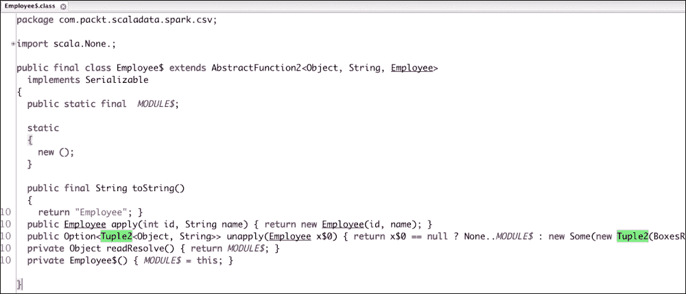

我们在[第 2 章](ch16.html "Chapter 2. Getting Started with Apache Spark DataFrames")、*Apache Spark 数据帧*入门(在*从 CSV* 配方创建数据帧)中看到，使用`SQLContext.createDataFrame`从一组类中创建数据帧的要求是该类必须扩展`scala.Product`。所以，我们打算写一个我们自己的类，从`scala.Product`扩展而来。

该配方由四个步骤组成:

1.  从`SparkContext`和`Config`创建`SQLContext`。
2.  创建一个扩展`Product`并覆盖必要函数的`Student`类。
3.  从样本数据集(`student-mat.csv`)构建`Student`类的 RDD。
4.  从 RDD 创建一个数据帧，然后打印模式并对数据进行采样。

    ### 注意

    关于 RDD 的基本介绍,请参考本食谱的*工作原理……* 部分. .

    这个菜谱的代码可以在 [https://github。com/arun ma/Scala data analysis cookbook/tree/master/第 3 章-数据加载](https://github.com/arunma/ScalaDataAnalysisCookbook/tree/master/chapter3-data-loading)找到

现在让我们详细介绍这些步骤:

1.  创建`SQLContext`:和上一章的菜谱一样，我们从`SparkConfig`构造`SparkContext`，然后从`SparkContext` :

    ```java
    val conf=new SparkConf().setAppName("DataWith33Atts").setMaster("local[2]")

    val sc=new SparkContext(conf)

    val sqlContext=new SQLContext(sc)
    ```

    创建一个`SQLContext`
2.  Creating the `Student` class: Our next step is to create a simple Scala class that declares its constructor parameters, and make it extend `Product`.

    让一个类扩展`Product`需要我们覆盖来自`scala.Product`的两个函数和来自`scala.Equals`的一个函数(而`scala.Product`又从后者扩展而来)。这些功能的实现都非常简单。

    ### 注意

    参考`Product`([http://www.scala-lang.org/api/2.10.4/index.html#scala.的 API](http://www.scala-lang.org/api/2.10.4/index.html#scala.Product) 文件产品【http://www.scala-lang.org/api/2.10.4/index.html#scala.】和`Equals` ( [)Equals](http://www.scala-lang.org/api/2.10.4/index.html#scala.Equals) )了解更多详情。

    首先，让我们的`Student`类声明它的字段并扩展`Product`:

    ```java
    class Student (school:String,

        sex:String,

        age:Int,

        address:String,

        famsize:String,

        pstatus:String,

        medu:Int,

        fedu:Int,

        mjob:String,

        fjob:String,

        reason:String,

        guardian:String,

        traveltime:Int,

        studytime:Int,

        failures:Int,

        schoolsup:String,

        famsup:String,

        paid:String,

        activities:String,

        nursery:String,

        higher:String,

        internet:String,

        romantic:String,

        famrel:Int,

        freetime:Int,

        goout:Int,

        dalc:Int,

        walc:Int,

        health:Int,

        absences:Int,

        g1:Int,

        g2:Int,

        g3:Int) extends Product{
    ```

    接下来，让我们在简要了解了这三个函数应该做什么之后，实现它们:

    *   `productArity():Int`:返回属性的大小。在我们的例子中，是`33`。所以，我们的实现看起来是这样的:

        ```java
        override def productArity: Int = 33
        ```

    *   `productElement(n:Int):Any`:给定一个索引，返回属性。作为保护，我们还有一个默认情况，抛出一个`IndexOutOfBoundsException`异常:

        ```java
        @throws(classOf[IndexOutOfBoundsException])

          override def productElement(n: Int): Any = n match {

            case 0 => school

            case 1 => sex

            case 2 => age

            case 3 => address

            case 4 => famsize

            case 5 => pstatus

            case 6 => medu

            case 7 => fedu

            case 8 => mjob

            case 9 => fjob

            case 10 => reason

            case 11 => guardian

            case 12 => traveltime

            case 13 => studytime

            case 14 => failures

            case 15 => schoolsup

            case 16 => famsup

            case 17 => paid

            case 18 => activities

            case 19 => nursery

            case 20 => higher

            case 21 => internet

            case 22 => romantic

            case 23 => famrel

            case 24 => freetime

            case 25 => goout

            case 26 => dalc

            case 27 => walc

            case 28 => health

            case 29 => absences

            case 30 => g1

            case 31 => g2

            case 32 => g3

            case _ => throw new IndexOutOfBoundsException(n.toString())

          }
        ```

    *   `canEqual (that:Any):Boolean`:这是三个函数中的最后一个，当对这个类进行相等检查时，它作为一个边界条件:

        ```java
            override def canEqual(that: Any): Boolean = that.isInstanceOf[Student]
        ```

3.  Constructing an RDD of students from the `student-mat.csv` file: Now that we have our `Student` class ready, let's convert the `"student-mat.csv"` input file into a DataFrame:

    ```java
      val rddOfStudents=convertCSVToStudents("student-mat.csv", sc)

      def convertCSVToStudents(filePath: String, sc: SparkContext): RDD[Student] = {

        val rddOfStudents: RDD[Student] = sc.textFile(filePath).flatMap(eachLine => Student(eachLine))

        rddOfStudents

      }
    ```

    如您所见，我们有一个用于`Student`的`apply`方法，它接受一个`String`并返回一个`Option[Student]`。我们使用`flatMap`来过滤掉`None`，从而得到`RDD[Student]`。

    让我们看看`Student`伴随对象的`apply`函数。这是一个非常简单的函数，它接受一个`String`，基于分号将其分割成一个数组，然后将参数传递给`Student's`构造函数。如果有错误，该方法返回`None`:

    ```java
          object Student {

          def apply(str: String): Option[Student] = {

            val paramArray = str.split(";").map(param => param.replaceAll("\"", "")) //Few values have extra double quotes around it

            Try(

              new Student(paramArray(0),

                paramArray(1),

                paramArray(2).toInt,

                paramArray(3),

                paramArray(4),

                paramArray(5),

                paramArray(6).toInt,

                paramArray(7).toInt,

                paramArray(8),

                paramArray(9),

                paramArray(10),

                paramArray(11),

                paramArray(12).toInt,

                paramArray(13).toInt,

                paramArray(14).toInt,

                paramArray(15),

                paramArray(16),

                paramArray(17),

                paramArray(18),

                paramArray(19),

                paramArray(20),

                paramArray(21),

                paramArray(22),

                paramArray(23).toInt,

                paramArray(24).toInt,

                paramArray(25).toInt,

                paramArray(26).toInt,

                paramArray(27).toInt,

                paramArray(28).toInt,

                paramArray(29).toInt,

                paramArray(30).toInt,

                paramArray(31).toInt,


                paramArray(32).toInt)) match {

                case Success(student) => Some(student)

                case Failure(throwable) => {

                  println (throwable.getMessage())

                  None

                }

              }

          }
    ```

4.  Creating a DataFrame, printing the schema, and sampling: Finally, we create a DataFrame from `RDD[Student]`. Converting an `RDD[T]` to a DataFrame of the same type is just a matter of calling the `toDF()` function. You are required to import `sqlContext.implicits._`. Optionally, you can use the `createDataFrame` method of `sqlContext` too.

    ### 注意

    `toDF()`函数被重载，以便在转换为 DataFrame 时接受自定义列名。

    然后，我们使用 DataFrame 的`printSchema()`方法打印模式，并使用`show()`方法打印样本数据进行确认:

    ```java
    import sqlContext.implicits._

    //Create DataFrame

    val studentDFrame = rddOfStudents.toDF()

      studentDFrame.printSchema()

      studentDFrame.show()
    ```

    以下是前面代码的输出:

    ```java
    root

     |-- school: string (nullable = true)

     |-- sex: string (nullable = true)

     |-- age: integer (nullable = false)

     |-- address: string (nullable = true)

     |-- famsize: string (nullable = true)

     |-- pstatus: string (nullable = true)

     |-- medu: integer (nullable = false)

     |-- fedu: integer (nullable = false)

     |-- mjob: string (nullable = true)

     |-- fjob: string (nullable = true)

     |-- reason: string (nullable = true)

     |-- guardian: string (nullable = true)

     |-- traveltime: integer (nullable = false)

     |-- studytime: integer (nullable = false)

     |-- failures: integer (nullable = false)

     |-- schoolsup: string (nullable = true)

     |-- famsup: string (nullable = true)

     |-- paid: string (nullable = true)

     |-- activities: string (nullable = true)

     |-- nursery: string (nullable = true)

     |-- higher: string (nullable = true)

     |-- internet: string (nullable = true)

     |-- romantic: string (nullable = true)

     |-- famrel: integer (nullable = false)

     |-- freetime: integer (nullable = false)

     |-- goout: integer (nullable = false)

     |-- dalc: integer (nullable = false)

     |-- walc: integer (nullable = false)

     |-- health: integer (nullable = false)

     |-- absences: integer (nullable = false)

     |-- g1: integer (nullable = false)

     |-- g2: integer (nullable = false)

     |-- g3: integer (nullable = false)
    ```

    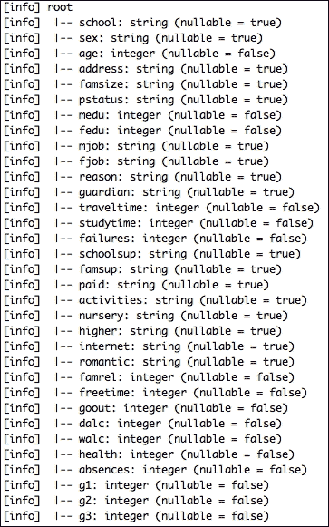

## 它是如何工作的...

Spark 的基础是**弹性分布式数据集** ( **RDD** )。从程序员的角度来看，rdd 的可组合性就像常规的 Scala 集合一样，这是一个巨大的优势。一个 RDD 包装了三个重要的(和两个附属的)信息，有助于数据的重建。这实现了容错。另一个主要优点是，虽然可以使用 RDD 运算将 rdd 组成非常复杂的图形，但是整个数据流本身并不难理解。

除了可选的优化属性(如数据位置)，在其核心，RDD 只是包装了三个重要的信息:

*   受抚养人/父 RDD(如果不可用，则为空)
*   分区的数量
*   需要应用于 RDD 每个元素的函数

简而言之，rdd 只是可以存在于内存或磁盘中的数据元素的集合。这些数据元素必须是可序列化的，以便能够跨多台机器移动(或在磁盘上序列化)。分区或数据块的数量主要由输入数据的来源决定(比方说，如果数据在 HDFS，那么每个数据块将转换为一个分区)，但是也有其他方法可以改变分区的数量。

因此，分区的数量可以是以下任意一种:

*   由输入数据本身决定，例如，从 HDFS 读取文件时的块数
*   由`spark.default.parallelism`参数设置的数字(在启动集群时设置)
*   通过在 RDD 上调用`repartition`或`coalesce`设置的数字

注意，目前，对于我们所有的菜谱，我们都是在自包含的单 JVM 模式下运行我们的 Spark 应用程序。虽然程序运行良好，但我们还没有利用 rdd 的分布式特性。在第 6 章、*扩展*中，我们将探讨如何在各种集群管理器上捆绑和部署我们的 Spark 应用:YARN、Spark 独立集群和 Mesos。

## 还有更多……

在前一章中，我们从`Employee`个例例类的`List`创建了一个数据帧:

```java
val listOfEmployees =List(Employee(1,"Arun"), Employee(2, "Jason"), Employee (3, "Abhi"))

val empFrame=sqlContext.createDataFrame(listOfEmployees)
```

然而，在这个菜谱中，我们加载了一个文件，将它们转换成`RDD[String]`，将它们转换成 case 类，最后将它们转换成 DataFrame。

这些方法之间存在微妙但强大的差异。在第一种方法中(将一个例例类的`List`转换成一个数据帧)，我们在驱动程序的内存中拥有整个集合(我们将在第 6 章、*的*中查看驱动程序和工人)。除了使用 Spark，实际上，我们并没有将数据集作为 case 类的集合。我们通常将它作为文本文件或从数据库中读取。此外，在将整个集合转换为分布式数据集(RDD)之前，需要将它保存在一台机器上，这本身就是一个内存问题。

在这个配方中，我们加载了一个 HDFS 分布式文件作为分布在一个工作节点集群中的`RDD[String]`，然后将每个`String`序列化为一个 case 类，使`RDD[String]`成为一个`RDD[Student]`。因此，每个持有数据集的一些分区的 worker 节点处理将`RDD[String]`转换为 case 类的计算，同时使结果数据集符合由 case 类本身执行的固定模式。由于计算和数据本身是分布式的，我们不需要担心一台机器需要大量内存来存储整个数据集。


# 将 JSON 加载到数据帧中

如今，JSON 已经成为最常见的基于文本的数据表示格式。在这个菜谱中，我们将看到如何将表示为 JSON 的数据加载到我们的 DataFrame 中。为了更有趣，让我们把 JSON 放在 HDFS，而不是本地文件系统。

Hadoop 分布式文件系统 ( **HDFS** )是一个高度分布式的文件系统，具有可伸缩性和容错性。它是 Hadoop 生态系统的关键部分，灵感来自谷歌文件系统论文([http://research.google.com/archive/gfs.html](http://research.google.com/archive/gfs.html))。关于 HDFS 的架构和通信协议的更多细节可以在[http://hadoop.apache.org/docs/r1.2.1/hdfs_design.html](http://hadoop.apache.org/docs/r1.2.1/hdfs_design.html)找到。

## 怎么做……

在这个配方中，我们将看到三个子配方:

*   如何使用`sqlContext.jsonFile`从 JSON 创建基于模式的数据帧
*   或者，如果我们喜欢在将输入文件解析为 JSON 之前对其进行预处理，我们将把输入文件解析为文本，并使用`sqlContext.jsonRDD`将其转换为 JSON
*   最后，我们将看看如何声明一个显式模式并使用它来创建一个`DataFrame`

### 使用 SQLContext.jsonFile 读取 JSON 文件

这个配方由三个步骤组成:

1.  Storing our `json` (`profiles.json`) in HDFS: A copy of the data file is added to our project repository, and it can be downloaded from [https://github.com/arunma/ScalaDataAnalysisCookbook/blob/master/chapter3-data-loading/profiles.json](https://github.com/arunma/ScalaDataAnalysisCookbook/blob/master/chapter3-data-loading/profiles.json):

    ```java

     hadoop fs -mkdir -p /data/scalada

     hadoop fs -put profiles.json /data/scalada/profiles.json

     hadoop fs -ls /data/scalada

     -rw-r--r--   1 Gabriel supergroup     176948 2015-05-16 22:13 /data/scalada/profiles.json

    ```

    下面的截图显示了在`http://localhost:50070`可用的 HDFS 文件浏览器，这证实了我们的上传是成功的:

    
2.  创建上下文:我们做常规的事情——创建`SparkConfig`、`SparkContext`和，然后是`SQLContext` :

    ```java

    val conf = new SparkConf().setAppName("DataFromJSON").setMaster("local[2]")

     val sc = new SparkContext(conf)

     val sqlContext = new SQLContext(sc)

    ```

3.  从 JSON 创建数据帧:在这一步，我们使用`SQLContext`的`jsonFile`函数来创建数据帧。这与我们在第 2 章、*Apache Spark 数据帧*中使用的`sqlContext.csvFile`函数非常相似。这里只有一件事我们需要注意。我们的`.json`应该被格式化为每条记录一行。考虑到 JSON 是一种结构化格式，将 JSON 存储为每条记录一行是不常见的，但是`jsonFile`函数将每一行都视为一条记录，如果不这样做，它将在解析时抛出一个`scala.MatchError`错误:

    ```java

     val dFrame=sqlContext.jsonFile("hdfs://localhost:9000/data/scalada/profiles.json")

    ```

就是这样！我们完了！让我们打印模式并对数据进行采样:

```java

 dFrame.printSchema()

 dFrame.show()

```

下面的屏幕截图显示了从 JSON 文件推断出的模式。请注意，现在年龄被解析为 long，标签被解析为字符串数组，如下所示:

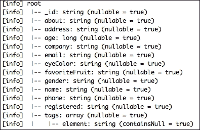

下一个截图向您展示了数据集的一个示例:


### 读取文本文件并将其转换成 JSON RDD

在上一节中，我们看到了如何使用`sqlContext.jsonFile`将包含 JSON 记录的`textFile`直接导入为 DataFrame。现在，我们将看到另一种方法，其中我们从同一个`profiles.json`文件中构造一个`RDD[String]`，然后将它们转换成数据帧。这与前一种方法相比有一个明显的优势——我们可以对模式有更多的控制，而不是依赖于推理出来的模式:

```java

 val strRDD=sc.textFile("hdfs://localhost:9000/data/scalada/profiles.json")

 val jsonDf=sqlContext.jsonRDD(strRDD)

 jsonDf.printSchema()

```

以下是前面命令的输出:

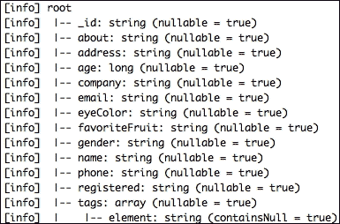

### 显式指定您的模式

使用`jsonRDD`并让它自己解析模式是简单明了的。但是，它对类型的控制较少；例如，`age`字段必须是`Integer`，而不是`Long`。类似地，``registered``列被推断为`String`，而它实际上是`TimeStamp`。为了实现这一点，让我们继续并声明我们自己的模式。我们这样做的方法是通过构造一个`StructType`和`StructField`:

```java

 val profilesSchema = StructType(

 Seq(

 StructField("_id",StringType, true),

 StructField("about",StringType, true),

 StructField("address",StringType, true),

 StructField("age",IntegerType, true),

 StructField("company",StringType, true),

 StructField("email",StringType, true),

 StructField("eyeColor",StringType, true),

 StructField("favoriteFruit",StringType, true),

 StructField("gender",StringType, true),

 StructField("name",StringType, true),

 StructField("phone",StringType, true),

 StructField("registered",TimestampType, true),

 StructField("tags",ArrayType(StringType), true)

 )

 )

 val jsonDfWithSchema=sqlContext.jsonRDD(strRDD, profilesSchema)

 jsonDfWithSchema.printSchema() //Has timestamp

 jsonDfWithSchema.show()

```

### 注意

指定我们自己的模式的另一个优点是，不需要在`StructType`中指定所有的列。我们只需要指定我们感兴趣的列，并且只有那些列在目标数据帧中可用。此外，在架构中声明但在数据集中不可用的任何列都将用空值填充。

以下是输出。

我们可以看到，`registered`特征被认为具有`timestamp`数据类型，并且`age`被认为是`integer`:

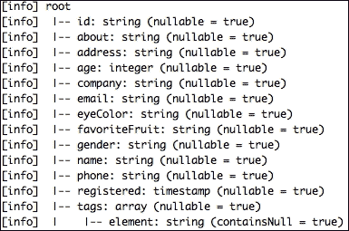

最后，为了好玩，让我们启动一个基于时间戳的过滤查询。这包括三个步骤:

1.  将模式注册为用于查询的临时表，在前面的配方中已经多次这样做了。下面一行代码注册一个名为`profilesTable`的表:

    ```java

     jsonRDDWithSchema.registerTempTable("profilesTable")

    ```

2.  让我们开始我们的过滤器查询。以下查询返回 2014 年 8 月 26 日之后注册的所有配置文件。由于注册字段是时间戳，我们需要一个额外的小步骤将参数转换成`TimeStamp` :

    ```java

     val filterCount = sqlContext.sql("select * from profilesTable where registered> CAST('2014-08-26 00:00:00' AS TIMESTAMP)").count

    ```

3.  我们来打印一下计数:

    ```java

     println("Filtered based on timestamp count : " + filterCount) //106

    ```

## 还有更多……

如果您不喜欢将模式放在代码中，并且希望将模式保存在文件中，那么这只是一行代码:

```java

 import scala.reflect.io.File

 import scala.io.Source

 //Writes schema as JSON to file

 File("profileSchema.json").writeAll(profilesSchema.json)

```

显然，您会希望从 JSON 中重建模式，这也是一行代码:

```java

 val loadedSchema = DataType.fromJson(Source.fromFile("profileSchema.json").mkString)

```

让我们通过对`json`进行相等性检查来检查`loadedSchema`和`profileSchema`是否封装了相同的模式:

```java

println ("ProfileSchema == loadedSchema :"+(loadedSchema.json==profilesSchema.json))

```

输出显示如下:

```java

ProfileSchema == loadedSchema :true

```

如果我们想要关注`json`，我们有一个叫做`prettyJson`的好方法来格式化`json`:

```java

 //Print loaded schema

 println(loadedSchema.prettyJson)

```

输出如下所示:

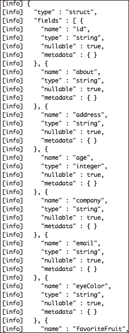

# 将数据存储为拼花文件

parquet([https://parquet.apache.org/](https://parquet.apache.org/))正迅速成为大数据世界的首选数据存储格式，因为它提供了独特的优势:

*   It has a column-based representation of data. This is better represented in a picture, as follows: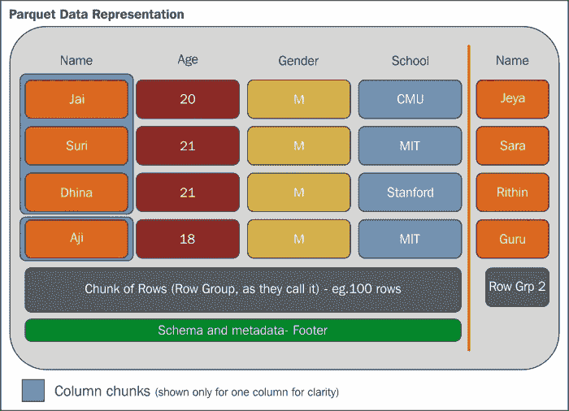

    正如您在前面的屏幕截图中所看到的，Parquet 将数据存储在大块的行中，比如 100 行。在拼花术语中，这些被称为**行组**。这些行组中的每个都包含列块(或列块)。列块可以保存特定列的多个数据单元(如第一列中的蓝色框所示)。比如说。 **Jai** 、 **Suri** 和 **Dhina** 形成一个单独的数据块，尽管它们由三个单独的数据单元组成 **Name** 。

    另一个独特的特性是这些列块(单个列的信息组)可以独立读取。让我们考虑下面的图像:

    

    我们可以看到，列数据的项目是按顺序依次存储的。由于我们的查询大部分时间只关注几列(一个投影),而不是整个表，这种存储机制使我们能够比读取存储的整行数据和过滤列更快地检索数据。此外，通过 Spark 的内存计算，内存需求以这种方式减少。

*   第二个优点是，从我们已经用来表示数据的现有数据模型中转换出来几乎不需要什么。虽然 Parquet 有自己的本机对象模型，但我们可以自由选择 Avro、ProtoBuf、Thrift 和各种现有的对象模型，并使用中间转换器来序列化 Parquet 中的数据。在 `Parquet-MR`项目(【https://github.com/Parquet/parquet-mr】)中，这些转换器中的大部分都是现成的。

在这个食谱中，我们将涵盖以下步骤:

1.  加载一个简单的 CSV 文件并将其转换成数据帧。
2.  将其保存为拼花文件。
3.  安装拼花工具。
4.  使用工具检查镶木地板文件。
5.  启用拼花文件的压缩。

    ### 注意

    这个菜谱的完整代码可以在 [https://github。com/arun ma/Scala data analysis cookbook/tree/master/chapter 3-data-loading-parquet](https://github.com/arunma/ScalaDataAnalysisCookbook/tree/master/chapter3-data-loading-parquet)找到.

## 怎么做……

在我们深入到步骤之前，让我们简要地看一下我们的`build.sbt`文件，特别是库依赖和 Avro 设置(我们将在下面的部分中讨论):

```java
organization := "com.packt"

name := "chapter3-data-loading-parquet"

scalaVersion := "2.10.4"

val sparkVersion="1.4.1"

libraryDependencies ++= Seq(

  "org.apache.spark" %% "spark-core" % sparkVersion,

  "org.apache.spark" %% "spark-sql" % sparkVersion,

  "org.apache.spark" %% "spark-mllib" % sparkVersion,

  "org.apache.spark" %% "spark-hive" % sparkVersion,

  "org.apache.avro" % "avro" % "1.7.7",

  "org.apache.parquet" % "parquet-avro" % "1.8.1",

  "com.twitter" %% "chill-avro" % "0.6.0"

)

resolvers ++= Seq(

  "Apache HBase" at "https://repository.apache.org/content/repositories/releases",

  "Typesafe repository" at "http://repo.typesafe.com/typesafe/releases/",

  "Twitter" at "http://maven.twttr.com/"

)

fork := true

seq( sbtavro.SbtAvro.avroSettings : _*)

(stringType in avroConfig) := "String"

javaSource in sbtavro.SbtAvro.avroConfig <<= (sourceDirectory in Compile)(_ / "java")
```

现在我们已经解决了`build.sbt`的问题，让我们继续下去，看看每个列出的步骤背后的代码。

### 加载一个简单的 CSV 文件，将其转换成 case 类，并从中创建一个 DataFrame

我们实际上可以使用`com.databricks/spark-csv`文件直接从 CSV 创建一个数据帧，正如我们在[第 2 章](ch16.html "Chapter 2. Getting Started with Apache Spark DataFrames")、*Apache Spark 数据帧入门*中看到的那样，但是对于这个方法，我们将只标记 CSV 并从中创建类。输入 CSV 有一个标题列。因此，转换过程包括跳过第一行。

### 注意

我们将在本节讨论的类文件是[https://github . com/arun ma/scaladataanalysiskook/blob/master/chapter 3-data-loading-parquet/src/main/Scala/com/packt/data load/parquetcaseclassmain . Scala](https://github.com/arunma/ScalaDataAnalysisCookbook/blob/master/chapter3-data-loading-parquet/src/main/scala/com/packt/dataload/ParquetCaseClassMain.scala)。

您可能会注意到代码中有两件有趣的事情:

```java
sqlContext.setConf("spark.sql.parquet.binaryAsString","true")
```

一些拼花生产系统，如 Impala，对字符串进行二进制编码。为了解决这个问题，我们设置了以下配置，即如果它看到二进制数据，应该将其视为字符串:

我们没有使用`sqlContext.createDataFrame`，而是在`RDD[Student]`上使用了一个`toDF()`。`SQLContext.Implicits`对象有许多隐式转换，帮助我们将`RDD[T]`直接转换为数据帧。正如所料，对我们来说，唯一的要求是导入隐含的内容:

```java
  import sqlContext.implicits._
```

代码的其余部分与我们之前看到的一样:

```java
val conf = new SparkConf().setAppName("CaseClassToParquet").setMaster("local[2]")

  val sc = new SparkContext(conf)

  val sqlContext = new SQLContext(sc)

  //Treat binary encoded values as Strings

  sqlContext.setConf("spark.sql.parquet.binaryAsString","true")

  import sqlContext.implicits._

  //Convert each line into Student

  val rddOfStudents = convertCSVToStudents("StudentData.csv", sc)

  //Convert RDD[Student] to a Dataframe using sqlContext.implicits

  val studentDFrame = rddOfStudents.toDF()
```

将每一行转换成一个`Student`对象的`convertCSVToStudents`方法如下所示:

```java
def convertCSVToStudents(filePath: String, sc: SparkContext): RDD[Student] = {

    val rddOfStudents: RDD[Student] =sc.textFile(filePath).flatMap(line => {

      val data = line.split("\\|")

      if (data(0) == "id") None else Some(Student(data(0), data(1), data(2), data(3)))

    })

    rddOfStudents

  }
```

### 将其保存为拼花文件

一旦我们有了数据帧，这只是一行程序。这可以使用`saveAsParquetFile`或`save`方法来完成。如果你想把它保存在一个蜂箱表([https://hive.apache.org/](https://hive.apache.org/))中，那么还有一个`saveAsTable`的方法:

```java
//Save DataFrame as Parquet using saveAsParquetFile

studentDFrame.saveAsParquetFile("studentPq.parquet")

//OR

//Save DataFrame as Parquet using the save method

studentDFrame.save("studentPq.parquet", "parquet", SaveMode.Overwrite)
```

### 注意

`save`方法允许使用`SaveMode`，它有以下几种选择:`Append`、`ErrorIfExists`、`Ignore`或`Overwrite`。

`save`方法在您指定的位置创建一个目录(这里，我们只是将它存储在我们的项目目录中)。该目录保存表示序列化数据的文件。它不完全是可读的，但是您可能会注意到一列的数据被存储在一起。

正如我们对其余食谱所做的那样，让我们阅读文件并对数据进行采样以进行确认:

```java

//Read data for confirmation

 val pqDFrame=sqlContext.parquetFile("studentPq.parquet")

 pqDFrame.show()

```

以下是输出:


### 安装拼花工具

除了使用 DataFrame 的`printSchema`方法来检查模式之外，我们还可以使用作为 parquet 项目的一部分提供的一些有趣的 parquet 工具来获得各种其他信息。

### 注意

`parquet-tools`是拼花的子项目，可从[https://github . com/Parquet/Parquet-Mr/tree/master/Parquet-tools](https://github.com/Parquet/parquet-mr/tree/master/parquet-tools)获得。

因为 Spark 1.4.1 使用的是 Parquet 1.6.0rc3，所以我们需要从 Maven 资源库下载该版本的工具。可执行文件和 jar 可以作为一个包从[https://repo 1 . maven . org/maven 2/com/Twitter/parquet-tools/1 . 6 . 0 rc3/parquet-tools-1 . 6 . 0 rc3-bin . tar . gz](https://repo1.maven.org/maven2/com/twitter/parquet-tools/1.6.0rc3/parquet-tools-1.6.0rc3-bin.tar.gz)下载。

### 使用工具检查拼花锉

让我们把工具付诸行动吧。具体来说，我们将在这一步做三件事:

*   以拼花格式显示模式
*   显示存储在 Parquet 页脚中的元信息
*   使用`head`和`cat`采样数据
*   **Displaying the schema**: This can be achieved by calling the `parquet-tools` command with `schema` and the `parquet` file as the parameter. As an example, let's print the schema using one of the part files:

    ```java

    bash-3.2$ parquet-tools-1.6.0rc3/parquet-tools meta part-r-00000-20a8b58c-fe1d-43e7-b148-f874b78eb5ec.gz.parquet

    message root {

     optional binary id (UTF8);

     optional binary name (UTF8);

     optional binary phone (UTF8);

     optional binary email (UTF8);

    }

    ```

    我们看到模式确实是以 Parquet 格式提供的，并且是从我们的 case 类中派生出来的。

*   **Displaying the meta information of a particular Parquet file**: As we saw earlier, meta information is stored in the footer. Let's print it to see it.

    我们看到`extra`信息具有特定于我们使用的数据模型的模式。反序列化数据时会使用此信息。`parquet-tools`的`meta`参数将有助于实现这一点:

    ```java

    bash-3.2$  parquet-tools-1.6.0rc3/parquet-tools meta part-r-00000-20a8b58c-fe1d-43e7-b148-f874b78eb5ec.gz.parquet

    creator:     parquet-mr version 1.6.0rc3 (build d4d5a07ec9bd262ca1e93c309f1d7d4a74ebda4c)

    extra:       org.apache.spark.sql.parquet.row.metadata = {"type":"struct","fields":[{"name":"id","type":"string","nullable":true,"metadata":{}},{"name":"name","type":"string","nullable":true, [more]...

    file schema: root

    ---------------------------------------------------------------------------------------------------------------------------------------------------------------------------------------------------------

    id:          OPTIONAL BINARY O:UTF8 R:0 D:1

    name:        OPTIONAL BINARY O:UTF8 R:0 D:1

    phone:       OPTIONAL BINARY O:UTF8 R:0 D:1

    email:       OPTIONAL BINARY O:UTF8 R:0 D:1

    row group 1: RC:50 TS:3516

    ---------------------------------------------------------------------------------------------------------------------------------------------------------------------------------------------------------

    id:           BINARY GZIP DO:0 FPO:4 SZ:140/326/2.33 VC:50 ENC:RLE,BIT_PACKED,PLAIN

    name:         BINARY GZIP DO:0 FPO:144 SZ:313/483/1.54 VC:50 ENC:RLE,BIT_PACKED,PLAIN

    phone:        BINARY GZIP DO:0 FPO:457 SZ:454/961/2.12 VC:50 ENC:RLE,BIT_PACKED,PLAIN

    email:        BINARY GZIP DO:0 FPO:911 SZ:929/1746/1.88 VC:50 ENC:RLE,BIT_PACKED,PLAIN

    ```

*   **使用 head 和 cat** 采样数据:现在让我们先睹为快前几行数据。`head`功能将帮助我们做到这一点。它接受一个额外的`-n`参数，您可以在这里指定要显示的记录数量:

    ```java

    bash-3.2$ parquet-tools-1.6.0rc3/parquet-tools head -n 2  part-r-00001.parquet

    ```

由于额外的`-n 2`参数，前面的命令将只显示两行。

以下是该命令的输出:

```java

id = 1

name = Burke

phone = 1-300-746-8446

email = ullamcorper.velit.in@ametnullaDonec.co.uk

id = 2

name = Kamal

phone = 1-668-571-5046

email = pede.Suspendisse@interdumenim.edu

```

或者，如果您希望显示文件中的所有记录，您可以在 `parquet-tools`命令中使用`cat`参数:

```java

parquet-tools cat part-r-00001.parquet

```

### 启用拼花文件的压缩

从元信息可以看出，数据默认为`gzipped`。为了使用 **Snappy** 压缩，我们需要做的就是为我们的`SQLContext`(实际上是`SQLContext`的`SQLConf`)设置一个配置。关于启用**伦佩尔-齐夫-奥伯胡默** ( **LZO** ) 压缩，只有一个问题——我们需要在所有存储这些数据的机器上安装`native-lzo`。否则，我们会得到一个`"native-lzo library not available"`错误消息。

让我们通过将拼花压缩的配置参数传递给 Snappy 来启用 Snappy([http://google.github.io/snappy/](http://google.github.io/snappy/))压缩:

```java

sqlContext.setConf("spark.sql.parquet.compression.codec", "snappy")

```

运行程序后，让我们使用`parquet-tools meta`命令来验证它:

```java

parquet-tools meta part-r-00000-aee54b77-288e-44b2-8f36-53b38a489e8d.snappy.parquet

```


# 在拼花地板中使用 Avro 数据模型

拼花地板是一种非常高效的柱状储物方式，但它也是一种相对较新的方式。avro(【https://avro.apache.org】)是一种广泛应用于的基于行的存储格式。这个菜谱展示了我们如何在代码中保留旧的、灵活的 Avro 模式，但在存储期间仍然使用 Parquet 格式。

Spark MR 项目(是的，就是我们在前面的菜谱中看到的那个有拼花工具的项目)有几乎所有流行数据格式的转换器。这些模型转换器接受您的格式，并在持久化之前将其转换为 Parquet 格式。

## 怎么做……

在这个菜谱中，我们将使用 Avro 数据模型并将数据序列化到一个 Parquet 文件中。制作方法包括以下步骤:

1.  创建 Avro 模型。
2.  使用`sbt avro`插件生成 Avro 对象。
3.  从`Students.csv`开始构造你生成的物体的 RDD(`StudentAvro`)。
4.  将`RDD[StudentAvro]`保存在拼花文件中。
5.  回读文件进行验证。
6.  使用`Parquet-tools`进行验证。

### Avro 模型的创建

Avro 模式是使用 JSON 定义的。在我们的例子中，我们将使用相同的`Student.csv`作为输入文件。因此，让我们对模式中的四个字段进行编码— `id`、`name`、`phone`和`email`:

```java
{"namespace": "studentavro.avro",

 "type": "record",

 "name": "StudentAvro",

 "fields": [

     {"name": "id", "type": ["string", "null"]},

     {"name": "name",  "type": ["string", "null"]},

     {"name": "phone", "type": ["string", "null"]},

     {"name": "email", "type": ["string", "null"]}

 ]

}
```

很可能，你已经熟悉 Avro，或者你已经看了一眼就理解了这个模式，但是让我用一些模式的解释来烦你。

JSON 中的`namespace`和`name`属性分别转化为我们世界中的包名和类名。因此，我们生成的类将有一个完全限定名`studentavro.avro.StudentAvro`。(`type`属性的)`"record"`是 Avro([http://avro.apache.org/docs/1.7.6/spec.html#schema_complex](http://avro.apache.org/docs/1.7.6/spec.html#schema_complex))中的复杂类型之一。让我重新措辞一下。一条记录大概翻译成 Java/Scala 中的类。它位于模式层次结构的最顶层。一条记录中可以封装多个字段，这些字段可以是原语([https://avro . Apache . org/docs/1 . 7 . 7/spec . html # schema _ primitive](https://avro.apache.org/docs/1.7.7/spec.html#schema_primitive))或其他复杂类型。关于`type`拥有一个类型数组的最后一点很有趣(`"type": ["string", "null"]`)。只是意味着字段可以不止一个`type`。用 Avro 的术语来说，它叫做工会。

现在我们已经完成了模式，让我们用扩展名`.avsc`保存这个文件。我已经把它作为`student.avsc`保存在`src/main/avro`目录中。

### 使用 sbt-avro 插件生成 Avro 对象

下一步是从模式中生成一个类。我们将`avro`模式文件存储在`src/main/avro`文件夹中的原因是这样的:我们将使用`sbt-avro`插件([https://github.com/cavorite/sbt-avro](https://github.com/cavorite/sbt-avro))从模式中生成一个 Java 类。为 SBT 配置插件就像配置任何其他插件一样简单:

*   让我们把插件添加到`project/plugins.sbt` :

    ```java

    addSbtPlugin("com.cavorite" % "sbt-avro" % "0.3.2")

    ```

*   将插件的默认设置添加到我们的`build.sbt` :

    ```java

    seq( sbtavro.SbtAvro.avroSettings : _*)

    ```

*   现在让我们生成 Java 类。我们可以通过调用`sbt avro:generate`来做到这一点。在`target/scala-2.10/src_managed/main/compiled_avro/studentavro/avro/StudentAvro.java`可以看到生成的 Java 文件。T3T5
*   我们还需要以下库依赖项。最后，让我们执行一个 SBT 编译来编译这个类，这样项目的其余部分就可以获得生成的 Java 文件:

    ```java
    libraryDependencies ++= Seq(

      "org.apache.spark" %% "spark-core" % sparkVersion,

      "org.apache.spark" %% "spark-sql" % sparkVersion,

      "org.apache.spark" %% "spark-mllib" % sparkVersion,

      "org.apache.spark" %% "spark-hive" % sparkVersion,

      "org.apache.avro" % "avro" % "1.7.7",

      "org.apache.parquet" % "parquet-avro" % "1.8.1",

      "com.twitter" %% "chill-avro" % "0.6.0"

    )

      sbt compile
    ```

### 从 Students.csv 构建我们生成的对象的 RDD

这一步与前面的非常相似，我们使用`convertCSVToStudents`函数来生成`StudentAvro`对象的 RDD。另外，由于这不是一个 Scala 类，生成的 Java 对象内部有一个构建器，我们使用构建器来流畅地构建这个类(【http://en.wikipedia.org/wiki/Fluent_interface】T4):

```java
val conf = new SparkConf().setAppName("AvroModelToParquet").setMaster("local[2]")

  val sc = new SparkContext(conf)

  val sqlContext = new SQLContext(sc)

  sqlContext.setConf("spark.sql.parquet.binaryAsString", "true")

  val rddOfStudents = convertCSVToStudents("StudentData.csv", sc)

//The CSV has a header row.  Zipping with index and skipping the first row

  def convertCSVToStudents(filePath: String, sc: SparkContext): RDD[StudentAvro] = {

    val rddOfStudents: RDD[StudentAvro]=sc.textFile(filePath).flatMap(eachLine => {

      val data = eachLine.split("\\|")

      if (data(0) == "id") None

      else Some(StudentAvro.newBuilder()

        .setId(data(0))

        .setName(data(1))

        .setPhone(data(2))

        .setEmail(data(3)).build())

    })

    rddOfStudents

  }
```

### 在拼花文件中保存 RDD[StudentAvro]

这是一个棘手的步骤，涉及多个子步骤。让我们倒过来解读这一步。在这个例子中，我们退回到`RDD[StudentAvro]`而不是数据帧，因为数据帧只能从 case 类的 RDD(或扩展`Product`的类，如我们在本章前面看到的)或从`RDD[org.apache.spark.sql.Row]`中构造。如果您喜欢使用 DataFrames，您可以将 CSV 作为一个值数组来读取，并对每个值数组使用`RowFactory.create`。一旦`RDD[Row]`可用，我们可以使用`sqlContext.createDataFrame`将其转换为数据帧:

*   In order to save the RDD as a Hadoop `SequenceFile`, we can use `saveAsNewAPIHadoopFile`. A sequence file is simply a text file that holds key-value pairs. We could have chosen one of the `Student` attributes as a key, but for the sake of it, let's have it as a `Void` in this example.

    为了在 Spark 中表示一对(键值)，我们使用了`PairRDD`([https://Spark . Apache . org/docs/1 . 4 . 1/API/Scala/index . html # org . Apache . Spark . rdd . pairrddfunctions](https://spark.apache.org/docs/1.4.1/api/scala/index.html#org.apache.spark.rdd.PairRDDFunctions))。不令人惊讶的是，`saveAsNewAPIHadoopFile`只对 PairRDDs 可用。为了将现有的`RDD[StudentAvro]`转换为`PairRDD[Void,StudentAvro]`，我们使用了`map`函数:

    ```java
    val pairRddOfStudentsWithNullKey = rddOfStudents.map(each => (null, each))
    ```

*   Spark uses Java serialization by default to serialize the RDD to be distributed across the cluster. However, the Avro model doesn't implement the serializable interface, and hence it won't be able to leverage Java serialization. That's no reason for worry, however, because Spark provides another 10x performant serialization mechanism called **Kryo**. The only downside is that we need to explicitly register our serialization candidates:

    ```java
      val conf = new SparkConf().setAppName("AvroModelToParquet").setMaster("local[2]")

      conf.set("spark.kryo.registrator", classOf[StudentAvroRegistrator].getName)

        conf.set("spark.serializer", "org.apache.spark.serializer.KryoSerializer")
    ```

    因此，我们说使用`"spark.serializer"`配置，我们打算使用`KryoSerializer`，我们的`registrator`是`StudentAvroRegistrator`。正如您所料，`Registrator`所做的是将我们的`StudentAvro`类注册为 Kryo 序列化的候选类。项目([https://github.com/twitter/chill](https://github.com/twitter/chill))为提供了一个很好的扩展来委托 Kryo 序列化器使用 Avro 序列化:

    ```java
    class StudentAvroRegistrator extends KryoRegistrator {

      override def registerClasses(kryo: Kryo) {

        kryo.register(classOf[StudentAvro], AvroSerializer.SpecificRecordBinarySerializer[StudentAvro])

      }

    }
    ```

*   The intent of this recipe is to write a Parquet file, but the data model (schema) is Avro. Since we are going to write this down as a sequence file, we'll be using a bunch of Hadoop APIs. The `org.apache.hadoop.mapreduce.OutputFormat` specifies the output format of the file that we are going to write, and as expected, we use `ParquetOutputFormat` (this is available in the `parquet-hadoop` subproject in the `parquet-mr` project). There are two things that an `OutputFormat` requires:

    *   `WriteSupport`类，它知道如何将 Avro 数据模型转换成实际格式。这是通过下面一行代码实现的:

        ```java

         ParquetOutputFormat.setWriteSupportClass(job, classOf[AvroWriteSupport])

        ```

    *   模式也需要写入到 Parquet 文件的页脚。通过使用`getClassSchema`函数可以访问`StudentAvro`的模式。这行代码实现了:

        ```java

         AvroParquetOutputFormat.setSchema(job, StudentAvro.getClassSchema)

        ```

    现在，这两行代码中的`job`参数是干什么的？`job`对象只是`org.apache.hadoop.mapreduce.Job`的一个实例:

    ```java

     val job = new Job()

    ```

    当我们调用`ParquetOutputFormat`和`AvroParquetOutputFormat`的`setWriteSupportClass`和`setSchema`方法时，在`Job`对象内封装的`JobConf`内捕获结果配置。我们将使用这个`job`配置，同时将数据保存在序列文件中。

*   Finally, we save the file by calling `saveAsNewAPIHadoopFile`. The `save` method requires a bunch of parameters, each of which we have already discussed. The first parameter is the filename, followed by the key and the value classes. The fourth is the `OutputFormat` of the file, and finally comes the `job` configuration itself:

    ```java
    pairRddOfStudentsWithNullKey.saveAsNewAPIHadoopFile("studentAvroPq",

        classOf[Void],

        classOf[StudentAvro],

        classOf[AvroParquetOutputFormat],

        job.getConfiguration())
    ```

    我们看到了整个程序的片段，所以为了完整起见，让我们完整地看一下:

    ```java
    object ParquetAvroSchemaMain extends App {

      val conf = new SparkConf().setAppName("AvroModelToParquet").setMaster("local[2]")

      conf.set("spark.kryo.registrator", classOf[StudentAvroRegistrator].getName)

      conf.set("spark.serializer", "org.apache.spark.serializer.KryoSerializer")

      val job = new Job()

      val sc = new SparkContext(conf)

      val sqlContext = new SQLContext(sc)

      sqlContext.setConf("spark.sql.parquet.binaryAsString", "true")

      val rddOfStudents = convertCSVToStudents("StudentData.csv", sc)

      ParquetOutputFormat.setWriteSupportClass(job, classOf[AvroWriteSupport])

      AvroParquetOutputFormat.setSchema(job, StudentAvro.getClassSchema)

      val pairRddOfStudentsWithNullKey = rddOfStudents.map(each => (null, each))

    pairRddOfStudentsWithNullKey.saveAsNewAPIHadoopFile("studentAvroPq",

        classOf[Void],

        classOf[StudentAvro],

        classOf[AvroParquetOutputFormat],

        job.getConfiguration())

      //The CSV has a header row.  Zipping with index and skipping the first row

      def convertCSVToStudents(filePath: String, sc: SparkContext): RDD[StudentAvro] = {

        val rddOfStudents: RDD[StudentAvro]=sc.textFile(filePath).flatMap(eachLine => {

          val data = eachLine.split("\\|")

          if (data(0) == "id") None

          else Some(StudentAvro.newBuilder()

            .setId(data(0))

            .setName(data(1))

            .setPhone(data(2))

            .setEmail(data(3)).build())

        })

        rddOfStudents

      }

    }

    class StudentAvroRegistrator extends KryoRegistrator {

      override def registerClasses(kryo: Kryo) {

        kryo.register(classOf[StudentAvro], AvroSerializer.SpecificRecordBinarySerializer[StudentAvro])

      }

    }
    ```

### 读回文件进行验证

像往常一样，让我们把的文件读回来确认一下。为此要调用的函数是`newAPIHadoopFile`，它接受与`saveAsNewAPIHadoopFile`类似的一组参数:文件名、输入格式、键类、值类，最后是作业配置。请注意，我们使用的是`newAPIHadoopFile`，而不是之前使用的`parquetFile`方法。这是因为我们正在读取 Hadoop 序列文件:

```java

//Reading the file back for confirmation.

 ParquetInputFormat.setReadSupportClass(job, classOf[AvroWriteSupport])

 val readStudentsPair = sc.newAPIHadoopFile("studentAvroPq", classOf[AvroParquetInputFormat[StudentAvro]], classOf[Void], classOf[StudentAvro], job.getConfiguration())

 val justStudentRDD: RDD[StudentAvro] = readStudentsPair.map(_._2)

 val studentsAsString = justStudentRDD.collect().take(5).mkString("\n")

 println(studentsAsString)

```

这是输出:

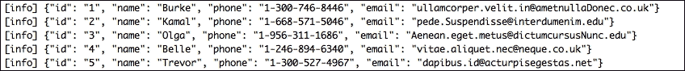

### 使用拼花工具进行验证

我们还将使用 Parquet 工具来确认存储在 Parquet 文件中的模式确实是一个`avro`模式:

```java

/Users/Gabriel/Dropbox/arun/ScalaDataAnalysis/git/parquet-mr/parquet-tools/target/parquet-tools-1.6.0rc3/parquet-tools meta /Users/Gabriel/Dropbox/arun/ScalaDataAnalysis/Code/scaladataanalysisCB-tower/chapter3-data-loading-parquet/studentAvroPq

```

没错。看起来是的！`meta`中的`extra`部分确认了`avro`模式被存储:

```java

creator:     parquet-mr

extra:       parquet.avro.schema = {"type":"record","name":"StudentAvro","namespace":"studentavro.avro","fields":[{"name":"id","type":[{"type":"string","avro.java.string":"Stri [more]...

```


# 从 RDBMS 加载

作为加载的最后一步，让我们试着从 RDBMS 数据源加载数据，在我们的例子中是 MySQL。这个食谱假设你已经在你的机器上安装了 MySQL。

## 怎么做……

让我们先看一下先决条件步骤。如果您已经有了一个 MySQL 表，可以放心地忽略这一步。我们将创建一个新的数据库和一个表，并将一些示例数据加载到其中。

先决条件步骤(可选):

1.  创建数据库和表:这是在 MySQL 中通过使用创建数据库和创建表 DDL:

    ```java
    create database scalada;

    use scalada

    CREATE TABLE student (

    id varchar(20),

    `name` varchar(200),

    phone varchar(50),

    email varchar(200),

    PRIMARY KEY (id));
    ```

    来实现的
2.  Loading data into the table: Let's dump some data into the table. I wrote a very simple app to do this. Alternatively, you can use the `load data infile` command if you have `"local-infile=1"` enabled on your server and the client. Refer to [https://dev.mysql.com/doc/refman/5.1/en/load-data.html](https://dev.mysql.com/doc/refman/5.1/en/load-data.html) for details about this command.

    正如你所看到的，程序加载了我们在[第 2 章](ch16.html "Chapter 2. Getting Started with Apache Spark DataFrames")、*Apache Spark 数据帧*中看到的`Student.csv`，当时我们看到了如何使用`databricks.csv`连接器将数据帧与 Spark 一起使用。然后，对于每一行，使用普通的老式 JDBC 插入将数据插入到表中。正如您可能已经发现的那样，我们也需要将 MySQL 连接器`java`依赖项添加到我们的`build.sbt`中:

    ```java
    "mysql" % "mysql-connector-java" % "5.1.34"

    object LoadDataIntoMySQL extends App {

      val conf = new SparkConf().setAppName("LoadDataIntoMySQL").setMaster("local[2]")

      val config=ConfigFactory.load()

      val sc = new SparkContext(conf)

      val sqlContext = new SQLContext(sc)

      val students = sqlContext.csvFile(filePath = "StudentData.csv", useHeader = true, delimiter = '|')

      students.foreachPartition { iter=>

          val conn = DriverManager.getConnection(config.getString("mysql.connection.url"))

          val statement = conn.prepareStatement("insert into scalada.student (id, name, phone, email) values (?,?,?,?) ")

          for (eachRow <- iter) {

            statement.setString(1, eachRow.getString(0))

            statement.setString(2, eachRow.getString(1))

            statement.setString(3, eachRow.getString(2))

            statement.setString(4, eachRow.getString(3))

            statement.addBatch()

          }

          statement.executeBatch()

          conn.close()

          println ("All rows inserted successfully")

      }

    }
    ```

在上的一个`"select * from scalada.student"`MySQL 客户端应该确认这一点，如下所示:


将 RDBMS 数据加载到 DataFrame 的步骤:

从 RDBMS 数据库加载数据的推荐方法是使用 SQLContext 的`load`方法:

1.  创造 Spark 和`SQLContext`:通过看之前的菜谱你可能已经熟悉了这一步:

    ```java
      val conf = new SparkConf().setAppName("DataFromRDBMS").setMaster("local[2]")

      val sc = new SparkContext(conf)

      val sqlContext = new SQLContext(sc)
    ```

2.  Constructing a map of options: This map is expected to have not only the driver and the connection URL, but also the query to be invoked in order to load the data. In this example, we'll store the parameter values in an external `Typesafe config` file and load the values into our program.

    根据标准 SBT/马文约定，类型安全`application.conf`位于`src/main/resources`。下面是显示`application.conf`内容的截图:

    

    现在让我们看看构建地图的代码:

    ```java
      val config = ConfigFactory.load()

      val options = Map(

        "driver" -> config.getString("mysql.driver"),

        "url" -> config.getString("mysql.connection.url"),

        "dbtable" -> "(select * from student) as student",

        "partitionColumn" -> "id",

        "lowerBound" -> "1",

        "upperBound" -> "100",

        "numPartitions"-> "2")
    ```

    前三个参数很简单。`numPartitions`指定了该作业的分区数量，而`partitionColumn`指定了该作业必须被分区的表中的列。`lowerBound`和`upperBound`是`"id"`字段的值。单个分区要处理的数据量是使用分区数量和上下限计算的。

3.  从表中加载数据:`SQLContext`的`load`函数需要两个参数。第一个参数指定数据的来源是通过`"jdbc"`，第二个参数是我们在步骤 2 中构建的选项。现在让我们打印模式并显示前 20 行，就像我们一直做的那样:

    ```java

     val dFrame=sqlContext.load("jdbc", options)

     dFrame.printSchema()

     dFrame.show()

    ```

这是输出:

```java

root

 |-- id: string (nullable = false)

 |-- name: string (nullable = true)

 |-- phone: string (nullable = true)

 |-- email: string (nullable = true)

 |-- gender: string (nullable = true)

```

我们看到，通过检查`id`字段的`not nullable`约束，DataFrame 的模式源自 MySQL 表定义。

输出如下所示:


# 准备数据帧中的数据

除了过滤、转换和转换(我们在[第 2 章](ch16.html "Chapter 2. Getting Started with Apache Spark DataFrames")、*Apache Spark 数据帧*中看到的数据帧)，让我们看看这个食谱中更多的数据准备技巧。我们还将在[第 5 章](ch19.html "Chapter 5. Learning from Data")、*从数据中学习*中了解具体的数据准备，其中我们将重点介绍各种机器学习算法的使用。

## 怎么做...

在预处理数据时，我们可能需要:

*   合并两个不同的数据集
*   对两个数据集执行集合操作
*   通过转换属性值对数据帧进行排序
*   根据谓词从一个数据集中选择一个成员，而不是另一个
*   解析任意日期/时间输入

我们将在前四个任务中使用`StudentPrep1.csv`和`StudentPrep2.csv`数据集，在最后一个任务中，我们将使用`StrangeDate.json`，一个基于 JSON 的数据集。选择 CSV 和 JSON 数据集主要是为了方便——输入数据可以是任何东西。

`StudentPrep1.csv`数据集如下图所示:


`StudentPrep2.csv`数据集如下图所示:

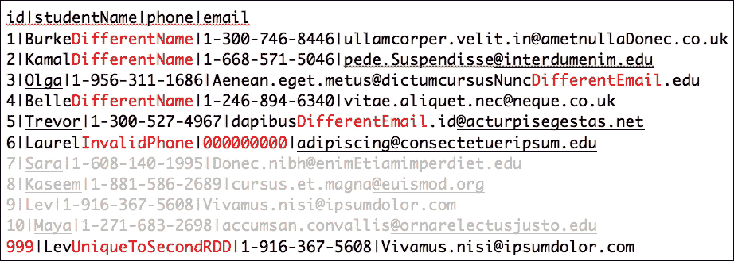

### 注意

这个菜谱的代码可以在[https://github . com/arun ma/scaladata analysis cookbook/tree/master/chapter 3-data-loading](https://github.com/arunma/ScalaDataAnalysisCookbook/tree/master/chapter3-data-loading)找到。

让我们使用`databricks/spark-csv`库将转换成数据帧，我们在[第 2 章](ch16.html "Chapter 2. Getting Started with Apache Spark DataFrames")、*Apache Spark 数据帧入门*中谈到从 CSV 加载数据帧时使用了这个库:

```java
import com.databricks.spark.csv.CsvContext

val students1=sqlContext.csvFile(filePath="StudentPrep1.csv", useHeader=true, delimiter='|')

val students2=sqlContext.csvFile(filePath="StudentPrep2.csv", useHeader=true, delimiter='|')
```

1.  **Merging datasets**: The DataFrame provides a convenient way to merge another DataFrame—`unionAll`. The `unionAll` accepts another DataFrame as an argument. Not surprisingly, the merged DataFrame maintains duplicates inside it:

    ```java

    val allStudents=students1.unionAll(students2)

    allStudents.show(allStudents.count().toInt)

    ```

    输出如下所示:

    
2.  **Performing set operations**: Just like `unionAll`, the DataFrame has functions for various set operations.

    两个数据帧的交集只需要调用`intersect`函数:

    ```java

    val intersection=students1.intersect(students2)

    intersection.foreach(println)

    [7,Sara,1-608-140-1995,Donec.nibh@enimEtiamimperdiet.edu]

    [8,Kaseem,1-881-586-2689,cursus.et.magna@euismod.org]

    [10,Maya,1-271-683-2698,accumsan.convallis@ornarelectusjusto.edu]

    [9,Lev,1-916-367-5608,Vivamus.nisi@ipsumdolor.com]

    ```

    通过调用`except()`函数，将另一个数据帧作为参数，得出一个数据帧与另一个数据帧的差异:

    ```java

    val subtraction=students1.except(students2)

    subtraction.foreach(println)

    ```

    以下是输出:

    ```java

    [6,Laurel,1-691-379-9921,adipiscing@consectetueripsum.edu]

    [4,Belle,1-246-894-6340,vitae.aliquet.nec@neque.co.uk]

    [2,Kamal,1-668-571-5046,pede.Suspendisse@interdumenim.edu]

    [5,Trevor,1-300-527-4967,dapibus.id@acturpisegestas.net]

    [3,Olga,1-956-311-1686,Aenean.eget.metus@dictumcursusNunc.edu]

    [1,Burke,1-300-746-8446,ullamcorper.velit.in@ametnullaDonec.co.uk]

    ```

    如果数据中有重复的，函数`distinct`将忽略它们并返回一个只有唯一数据的数据帧:

    ```java

    val distinctStudents=allStudents.distinct

    distinctStudents.foreach(println)

    println(distinctStudents.count())

    ```

    以下是输出:

    ```java

    [4,BelleDifferentName,1-246-894-6340,vitae.aliquet.nec@neque.co.uk]

    [1,Burke,1-300-746-8446,ullamcorper.velit.in@ametnullaDonec.co.uk]

    [2,KamalDifferentName,1-668-571-5046,pede.Suspendisse@interdumenim.edu]

    [999,LevUniqueToSecondRDD,1-916-367-5608,Vivamus.nisi@ipsumdolor.com]

    [1,BurkeDifferentName,1-300-746-8446,ullamcorper.velit.in@ametnullaDonec.co.uk]

    [2,Kamal,1-668-571-5046,pede.Suspendisse@interdumenim.edu]

    [3,Olga,1-956-311-1686,Aenean.eget.metus@dictumcursusNunc.edu]

    [7,Sara,1-608-140-1995,Donec.nibh@enimEtiamimperdiet.edu]

    [8,Kaseem,1-881-586-2689,cursus.et.magna@euismod.org]

    [5,Trevor,1-300-527-4967,dapibus.id@acturpisegestas.net]

    [4,Belle,1-246-894-6340,vitae.aliquet.nec@neque.co.uk]

    [6,Laurel,1-691-379-9921,adipiscing@consectetueripsum.edu]

    [6,LaurelInvalidPhone,000000000,adipiscing@consectetueripsum.edu]

    [9,Lev,1-916-367-5608,Vivamus.nisi@ipsumdolor.com]

    [3,Olga,1-956-311-1686,Aenean.eget.metus@dictumcursusNuncDifferentEmail.edu]

    [5,Trevor,1-300-527-4967,dapibusDifferentEmail.id@acturpisegestas.net]

    [10,Maya,1-271-683-2698,accumsan.convallis@ornarelectusjusto.edu]

    ```

    计数输出:

    ```java

    17

    ```

3.  **Sorting the DataFrame by casting an attribute value**: Sometimes, our DataFrame inferences an integer attribute as a string. Since, DataFrames are immutable, the correct way of converting an attribute from one type to another is by creating another DataFrame. In this recipe, we'll not only cast one attribute type to another, but also sort the DataFrame based on that attribute. The simplest way to achieve this is by using the Spark SQL expression:

    ```java

    val sortedCols=allStudents.selectExpr("cast(id as int) as id", "studentName", "phone", "email").sort("id")

     println ("sorting")

     sortedCols.show(sortedCols.count.toInt)

    ```

    输出如下所示:

    
4.  **Choosing a member from one dataset over another based on predicate**: Let's assume that for a given student ID across two different datasets, you would like to pick only the one that has a longer name (or matches some predicate). The result would be just one row per ID.

    这包括三个小步骤:

    1.  映射合并后的数据帧(使用`unionAll`)，并以关键字作为 ID(或任何其他基于您想要合并的字段)生成一个 RDD 对:

        ```java
          val idStudentPairs=allStudents.rdd.map(eachRow=>(eachRow.getString(0),eachRow))
        ```

    2.  下一步是使用一个名为`reduceByKey` 的函数。它接受一个接受两行并返回一行的函数。在我们的例子中，我们简单地编写逻辑来选择名字较长的行:

        ```java

         //Removes duplicates by id and holds on to the row with the longest name

         val idStudentPairs=allStudents.rdd.map(eachRow=>(eachRow.getString(0),eachRow))

         val longestNameRdd=idStudentPairs.reduceByKey((row1, row2) =>

         if (row1.getString(1).length()>row2.getString(1).length()) row1 else row2

         )

        ```

    3.  让我们打印输出:

        ```java

        longestNameRdd.values.foreach(println)

        ```

    输出如下所示:

    ```java

    [4,BelleDifferentName,1-246-894-6340,vitae.aliquet.nec@neque.co.uk]

    [8,Kaseem,1-881-586-2689,cursus.et.magna@euismod.org]

    [6,LaurelInvalidPhone,000000000,adipiscing@consectetueripsum.edu]

    [2,KamalDifferentName,1-668-571-5046,pede.Suspendisse@interdumenim.edu]

    [7,Sara,1-608-140-1995,Donec.nibh@enimEtiamimperdiet.edu]

    [5,Trevor,1-300-527-4967,dapibusDifferentEmail.id@acturpisegestas.net]

    [9,Lev,1-916-367-5608,Vivamus.nisi@ipsumdolor.com]

    [3,Olga,1-956-311-1686,Aenean.eget.metus@dictumcursusNuncDifferentEmail.edu]

    [999,LevUniqueToSecondRDD,1-916-367-5608,Vivamus.nisi@ipsumdolor.com]

    [1,BurkeDifferentName,1-300-746-8446,ullamcorper.velit.in@ametnullaDonec.co.uk]

    [10,Maya,1-271-683-2698,accumsan.convallis@ornarelectusjusto.edu]

    ```

5.  **Parsing arbitary date/time inputs and convert an array into a comma-separated string**: While preparing the data, we see that, particularly, the date and time appear in some crazy formats. As always, our aim is to standardize them. For this subrecipe, we'll be using a JSON that looks like this:

    正如我们在前面的菜谱中看到的，我们可以将这个 JSON 作为数据帧引入，但是日期格式不是 ISO 8601，这意味着它不会被认为是时间戳，而会被视为普通字符串。在这个子副本中，让我们看看如何将字符串转换成日期格式。这个子过程包括四个步骤:

    ### 注意

    执行任意的转换是一项正在进行的工作([https://issues.apache.org/jira/browse/SPARK-4190](https://issues.apache.org/jira/browse/SPARK-4190))。

    1.  导入 JSON 为文本文件:

        ```java

        val stringRDD = sc.textFile("StrangeDate.json")

        ```

    2.  为我们输入的特定模式创建一个新的`org.joda.time.format.DateTimeFormat`:

        ```java

        val formatter = DateTimeFormat.forPattern("MM/dd/yyyy HH:mm:ss")

        ```

    3.  我们在`build.sbt` :

        ```java

        "org.json4s" % "json4s-core_2.10" % "3.2.11",

        "org.json4s" % "json4s-jackson_2.10" % "3.2.11"

        ```

        中添加`json4s`作为我们的依赖
    4.  对于 JSON 字符串的每一行，解析并将字符串转换为`org.json4s.JsonValue`。`JsonValue`的优点是我们可以用类似 XPath 的表达式遍历 JSON 对象。

链接压缩和渲染函数将帮助我们将`JsonValue`转换为`String`。在下面的代码中，我们原样提取 `name`字段，使用`extract`函数将标签数组转换为逗号分隔的字符串，使用我们之前创建的`DateTimeFormat`解析日期字符串，并构造一个`Timestamp`对象。最后，为了便于理解，我们产生了一个名为`JsonDataModel`的 case 类，它包装了名称、日期和标签:

```java
case class JsonDateModel (name:String, dob:Timestamp, tags:String)

  import org.json4s._

 import org.json4s.jackson.JsonMethods._

 implicit val formats = DefaultFormats

 val dateModelRDD = for {

    json <- stringRDD

    jsonValue = parse(json)

    name = compact(render(jsonValue \ "name"))

    dateAsString=compact(render(jsonValue \ "dob")).replace("\"","")

    date = new Timestamp(formatter.parseDateTime(dateAsString).getMillis())

    tags = render(jsonValue \ "tags").extract[List[String]].mkString(",")

  } yield JsonDateModel(name, date, tags)
```

之后，我们用这个 case 类 RDD 构建一个数据帧，并打印该模式以确认:

```java

 import sqlContext.implicits._

 val df=dateModelRDD.toDF()

 df.printSchema()

 df.show(df.count.toInt)

```

输出如下所示:

*   图式: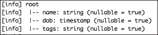
*   数据: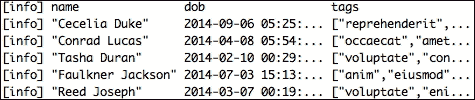