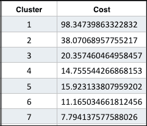
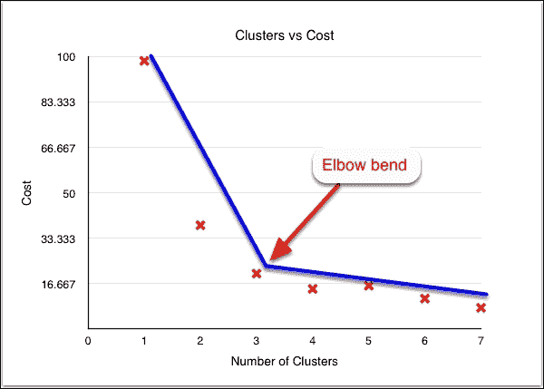
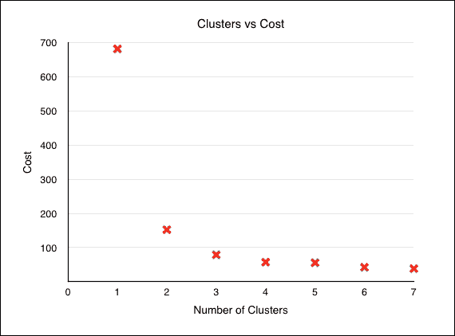

# 五、从数据中学习

在本章中，我们将介绍以下配方:

*   使用线性回归预测连续值
*   使用逻辑回归和 SVM 的二元分类
*   通过管道 API 使用逻辑回归进行二进制分类
*   使用 K-均值聚类
*   基于主成分分析的特征约简

# 简介

在前面的章节中，我们看到了如何加载、准备和可视化数据。现在，让我们开始用它做一些有趣的事情。在这一章中，我们将研究在此基础上应用各种机器学习技术。我们将看一些机器学习技术的两大分类的例子:监督和非监督学习。不过，在此之前，让我们先简单看看这些术语是什么意思。


# 监督和非监督学习

如果你正在读这本书，你大概已经知道什么是监督学习和非监督学习了，但是为了完整起见，让我们简单总结一下它们是什么意思。在监督学习中，我们用标记数据训练算法。带标签的数据只不过是输入数据和结果变量。例如，如果我们的目的是预测一个网站是否是关于新闻的，我们将准备一个包含网站内容的样本数据集，标签为“新闻”和“非新闻”。这个数据集称为训练数据集。

对于监督学习，我们的最终目标是使用训练数据集，并提出一个函数，以最小的误差将我们的输入变量映射到输出变量。我们称输入变量(或 *x* 变量)为特征变量或解释变量，而输出变量(也称为 *y* 变量或标签)为目标变量或因变量。在新闻网站示例中，网站中的文本内容将是输入变量，而“新闻”或“非新闻”将是目标变量。该函数及其参数(或权重或θ)是我们的假设或模型。

在无监督学习的情况下，我们的目标是在数据中找到一个结构——组以及这些组或组的参与者之间的关系。与监督学习不同，我们不知道数据的任何信息，甚至不知道它的子集。例如，看看一群人中是否有相似的购买模式(这有助于交叉销售)，或者看看哪一群人更有可能从我们新开的商店购买披萨。


# 梯度下降

在监督学习的情况下，为了让算法学习输入和输出特征之间的关系，我们按照的顺序，针对一组输入变量( *y* )为目标变量( *x* )提供一组手动管理的值。我们称之为训练集。然后，学习算法必须检查我们的训练集，执行一些优化，并得出一个成本最低的模型——偏离真实值。所以从技术上讲，我们对每个学习问题都有两个算法:一个算法为每个 *x* 特征提出函数和(初始的一组)权重，一个支持算法(也称为成本最小化或优化算法)查看我们的函数参数(特征权重)并试图尽可能地最小化成本。

有各种各样的成本最小化算法，但其中最流行的是梯度下降。把梯度下降想象成下山。山的高度代表成本，平原代表特征权重。最高点是你成本最大的函数，最低点成本最小。因此，我们的意图是步行下山。梯度下降所做的如下:对于特定大小(步长)的斜坡下的每一步，它遍历整个数据集(`!`)并更新 *x* 特征的所有权重值。这种情况一直持续到成本最小的状态。这种梯度下降的方式称为批量梯度下降，在这种方式中，每次迭代都会看到所有数据，并在每次迭代期间更新所有参数。针对 Spark 要处理的数据量使用这种算法的问题是，每次迭代遍历数百万行肯定不是最佳选择。因此，Spark 使用梯度下降的一种变体，称为 **随机梯度下降** ( **SGD** )，其中参数在逐个查看时针对每个训练示例进行更新。通过这种方式，它几乎立即开始取得进展，因此计算工作量大大减少。可以使用每个 ML 算法中的`optimizer`属性定制 SGD 设置。我们将在食谱中详细讨论这一点。

在下面的食谱中，我们将把线性回归、逻辑回归和支持向量机作为监督学习和 K-means 聚类的例子，以及使用 **主成分分析** ( **PCA** )作为非监督学习的例子来进行降维。我们还将简要地看一下斯坦福 NLP 工具包和 Scala NLP 的 Epic，流行的自然语言处理库，作为将第三方库融入 Spark jobs 的例子。


# 使用线性回归预测连续值

冒着说明的风险，显而易见，线性回归旨在使用与输入变量成线性关系的数学模型，基于输入( *x* )找到输出( *y* )之间的关系。输出变量 *y* 是一个连续的数值。如果我们有一个以上的输入/解释变量( *x* )，就像我们将要看到的例子一样，我们称之为多元线性回归。由于缺乏创意，我们将在这个食谱中使用的数据集是从 UCI 网站上摘下来的，网址是 http://archive . ics . UCI . edu/ml/machine-learning-databases/wine-quality/。这个数据集有 1599 种不同的红酒，它们的化学成分和质量。我们将用它来预测红酒的质量。

## 怎么做...

让我们总结一下步骤:

1.  导入数据。
2.  将每个实例转换为 LabeledPoint。
3.  准备培训和测试数据。
4.  缩放特征。
5.  训练模型。
6.  根据测试数据进行预测。
7.  评估模型。
8.  调整参数。
9.  迷你配料。

    ### 注意

    这个菜谱的代码可以在 [https://github。com/arun ma/scaladata 分析 cookbook/tree/master/chapter 5-learning/src/main/Scala/com/packt/Scala da/learning/linear regression wine。Scala](https://github.com/arunma/ScalaDataAnalysisCookbook/tree/master/chapter5-learning/src/main/scala/com/packt/scalada/learning/LinearRegressionWine.scala) 找到.

这个过程的“零步”就是`SparkConfig`和`SparkContext`的创造。这里没有什么新奇的东西:

```java

val conf = new SparkConf().setAppName("linearRegressionWine").setMaster("local[2]")

val sc = new SparkContext(conf)

```

### 导入数据

然后我们导入分号分隔的文本文件。我们通过使用分号将每一行拆分成一个`Array[String]`来映射每一行。我们以`RDD[Array[String]]`结束:

```java

val rdd = sc.textFile("winequality-red.csv").map(line => line.split(";"))

```

### 将每个实例转换成一个带标签的点

正如我们之前讨论的，监督学习需要提供训练数据。我们还需要根据另一组数据(测试数据)来测试我们创建的模型的准确性。如果我们有两个不同的数据集，我们可以分别导入它们，并将它们标记为训练集和测试集。在我们的示例中，我们将使用单个数据集，并将其分为训练集和测试集。


我们的每个训练样本都有以下格式:最后一个字段是葡萄酒的质量，从 1 到 10 的评级，前 11 个字段是葡萄酒的属性。因此，从我们的角度来看，葡萄酒的质量是第 *y* 个变量(输出)，其余的是第 x 个变量(输入)。现在，让我们用 Spark 能够理解的格式来表示它——labeled point。LabeledPoint 是输入特征(我们的 *x* 变量)和这些 *x* 输入值的预测值( *y* 变量)的简单包装器:

```java

val dataPoints=rdd.map(row=>new LabeledPoint(row.last.toDouble,Vectors.dense(row.take(row.length-1).map(str=>str.toDouble))))

```

LabeledPoint 的构造函数的第一个参数是标签( *y* 变量)，第二个参数是输入变量的向量。

### 准备培训和测试数据

正如我们之前讨论的，我们可以有两个不同的独立数据集用于训练和测试。然而，通常的做法是将数据集分成个训练和测试数据集。在这个菜谱中，我们将数据集按照 80:20 的比例分成训练集和测试集，每个元素都是随机选择的。这种随机的数据混排也是 SGD 获得更好性能的先决条件之一:

```java

val dataSplit = dataPoints.randomSplit(Array(0.8, 0.2))

val trainingSet = dataSplit(0)

val testSet = dataSplit(1)

```

### 缩放特征

运行快速汇总统计显示，我们的功能不在同一范围内:

```java

val featureVector = rdd.map(row => Vectors.dense(row.take(row.length-1).map(str => str.toDouble)))

print(s"Max : ${stats.max}, Min : ${stats.min}, and Mean : ${stats.mean} and Variance : ${stats.variance}")

println ("Min "+ stats.min)

println ("Max "+ stats.max)

```

以下是输出:

```java

Min [4.6,0.12,0.0,0.9,0.012,1.0,6.0,0.99007,2.74,0.33,8.4]

Max [15.9,1.58,1.0,15.5,0.611,72.0,289.0,1.00369,4.01,2.0,14.9]

Variance : [3.031416388997815,0.0320623776515516,0.03794748313440582,1.987897132985963,0.002215142653300991,109.41488383305895,1082.1023725325845,3.56202945332629E-6,0.02383518054541292,0.02873261612976197,1.135647395000472]

```

始终建议输入变量的平均值为 0。借助 Spark ML 库本身内置的`StandardScaler`,这很容易实现。我们必须注意的一件事是，我们必须统一调整训练集和测试集。我们的方法是为 trainingSplit 创建一个定标器，并使用同一个定标器来定标测试集。另一点值得注意的是，特性缩放有助于 SGD 更快地收敛:

```java

val scaler = new StandardScaler(withMean = true, withStd = true).fit(trainingSet.map(dp => dp.features))

val scaledTrainingSet = trainingSet.map(dp => new LabeledPoint(dp.label, scaler.transform(dp.features))).cache()

val scaledTestSet = testSet.map(dp => new LabeledPoint(dp.label, scaler.transform(dp.features))).cache()

```

### 训练模型

下一步是使用我们的训练数据创建一个模型。这只需要创建一个`LinearRegressionWithSGD`的实例并传入几个参数:一个用于线性回归算法，两个用于 SGD。可以通过使用`LinearRegressionWithSGD`中的`optimizer`属性来访问 SGD 参数:

*   `setIntercept`:在预测的时候，我们更感兴趣的是斜率。此设置将强制算法也找到截距。
*   这决定了在最终确定假设之前，我们的算法需要在训练集上经历的迭代次数。最佳数值是 10^6 除以数据集中的实例数。在我们的例子中，我们将它设置为`1000`。
*   `setStepSize`:这告诉梯度下降算法，当它试图减少参数时，它需要在每次迭代中采取多大的步长。设置这个参数真的很棘手，因为我们希望 SGD 在开始时采取较大的步骤，在收敛时采取较小的步骤。设置一个固定的小数值会降低算法的速度，而设置一个固定的大数值不会给我们一个合理最小值的函数。Spark 处理我们的`setStepSize`输入参数的方式如下:它将输入参数除以迭代次数的根。所以最初，我们的步长很大，随着我们越走越小。默认步长参数是`1`。

    ```java

    val regression=new LinearRegressionWithSGD().setIntercept(true)

    regression.optimizer.setNumIterations(1000).setStepSize(0.1)

    //Let's create a model out of our training examples.

    val model=regression.run(scaledTrainingSet)

    ```

    

### 根据测试数据进行预测

这一步只是一个单行程序。我们基于测试集的特征使用结果模型来预测输出( *y* ):

```java

val predictions:RDD[Double]=model.predict(scaledTestSet.map(point=>point.features))

```

### 评估模型

让我们根据最流行的回归评估指标之一— **均方误差**来评估我们的模型。让我们获得测试数据的实际值(手动准备的 *y* 变量)，然后将其与我们的模型预测进行比较:

```java

val actuals:RDD[Double]=scaledTestSet.map(_.label)

```

**均方误差**

### 注意

均方误差由以下公式给出:


因此，我们取实际值和预测值之间的差(误差)，对它们求平方，并计算它们的总和。然后，我们将该总和除以数值的数量，从而计算出平均值:

```java

val predictsAndActuals: RDD[(Double, Double)] = predictions.zip(actuals)

val sumSquaredErrors=predictsAndActuals.map{case (pred,act)=>

 println (s"act, pred and difference $act, $pred ${act-pred}")

 math.pow(act-pred,2)

}.sum()

val meanSquaredError = sumSquaredErrors / scaledTestSet.count

println(s"SSE is $sumSquaredErrors")

println(s"MSE is $meanSquaredError")

```

以下是输出:

```java

SSE is 162.21647197365706

MSE is 0.49607483783992984

```

在我们的示例中，我们选择了数据集中存在的所有要素。稍后，我们将看一下维度缩减，它帮助我们减少特征的数量，同时仍然将数据集的方差保持在合理的较高水平。

### 调整参数

在我们了解什么是正则化之前，让我们先简单了解一下什么是过度拟合。当一个模型记忆训练集时，它被称为过拟合(或具有高方差)。其结果是，该算法无法进行归纳，因此在处理看不见的数据集时表现不佳。解决过度拟合问题的一种方法是手动选择将用于创建模型的重要特征，但是对于大规模数据集，很难决定保留哪些，丢弃哪些。

另一个流行的选择是保留所有的特征，但是减少特征权重的大小。因此，即使对于复杂的模型(具有更高次的多项式)，如果特征权重真的很小，则得到的模型将是简单的。换句话说，给定两个同等(或几乎同等)执行的模型，其中一个模型是复杂的(具有更高次多项式)而另一个模型是简单的，正则化选择简单的模型。这背后的推理是，具有简单参数的模型有更高的概率预测看不见的数据(也称为泛化)。

Spark MLlib 附带了最常见的 L1 和 L2 正则化的实现。顺便提一下，`LinearRegressionWithSGD`默认情况下使用一个`SimpleUpdater`，它不会调整参数。有趣的是，Spark 实现了基于 L1 和 L2 更新程序的回归算法；它们被称为 Lasso(使用 L1 更新程序)和 Ridge(默认情况下使用 L2 更新程序)。

虽然当我们拥有的数据集稀疏时(或者如果数据集的行小于要素本身)，L1 正则化提供了一些要素选择，但大多数情况下，建议使用 L2 正则化。新的管道 API 还提供了对 ElasticNet 正则化的现成支持，它在内部使用 L1 和 L2 正则化。现在，让我们检查一下代码:

```java
def algorithm(algo: String, iterations: Int, stepSize: Int) = algo match {

    case "linear" => {

      val algo = new LinearRegressionWithSGD()

algo.setIntercept(true).optimizer.setNumIterations(iterations).setStepSize(stepSize)

      algo

    }

    case "lasso" => {

      val algo = new LassoWithSGD()

algo.setIntercept(true).optimizer.setNumIterations(iterations).setStepSize(stepSize)

      algo

    }

    case "ridge" => {

      val algo = new RidgeRegressionWithSGD()

algo.setIntercept(true).optimizer.setNumIterations(iterations).setStepSize(stepSize)

      algo

    }

  }
```

如前所述，`LassoWithSGD`包装了一个 L1 更新程序，`RidgeRegessionWithSGD`包装了一个 L2 更新程序。从代码的角度来看，我们需要做的就是改变类名。优化器(梯度下降)现在接受一个正则化参数，该参数会对要素的较大参数造成不利影响。Spark 中正则化参数的默认值为 0.01。较小的正则化参数会导致欠拟合，而较大的参数会导致过拟合。

以下输出显示，调整参数减少了我们的误差值:

```java

************** Printing metrics for Linear Regression with SGD *****************

SSE is 132.39124792957116

MSE is 0.4124337941731189

************** Printing metrics for Lasso Regression with SGD *****************

SSE is 132.3943810653321

MSE is 0.4124435547206608

************** Printing metrics for Ridge Regression with SGD *****************

SSE is 132.44011034123344

MSE is 0.4125860135240917

```

### 小型配料

在 SGD 的情况下，我们不需要在更新参数向量时逐一查看我们的数据集，或者在每次迭代时查看整个数据集(在批量梯度下降的情况下),我们可以满足于中间的一些东西。使用 mini batch fraction 参数，对于每次迭代，SGD 都会考虑要为参数更新处理的数据集部分。让我们将批量大小设置为 5 %:

```java

algo.setIntercept(true).optimizer.setNumIterations(iterations).setStepSize(stepSize).setRegParam(0.001).setMiniBatchFraction(0.05)

```

结果如下:

```java

************** Printing metrics for Linear Regression with SGD *****************

SSE is 112.96958667767147

MSE is 0.3574986920179477

SST is 183.05305027649794

Residual sum of squares is 0.38285875866568087

************** Printing metrics for Lasso Regression with SGD *****************

SSE is 112.95392101963424

MSE is 0.35744911715074124

SST is 183.05305027649794

Residual sum of squares is 0.3829443385454675

************** Printing metrics for Ridge Regression with SGD *****************

SSE is 112.9218089913291

MSE is 0.3573474968080035

SST is 183.05305027649794

Residual sum of squares is 0.3831197632557175

```

我们从使用迷你批处理中得到的好处是，这显然比没有批处理的普通 SGD 提供了更好的性能。这是因为对于普通 SGD，对于每次迭代，仅考虑一个示例来更新参数。然而，对于小批量，我们考虑一批例子。也就是说，与前一次运行相比，均方误差的改善并不是使用批处理的结果，而只是 SGD 的一个特性——在最小值附近漫游，而不是收敛于一个固定点。


# 使用逻辑回归和 SVM 的二元分类

与线性回归不同，在线性回归中，我们预测结果的连续值( *y* 变量)，逻辑回归和 **支持向量机** ( **SVM** )用于预测结果的 *n* 种可能性中的一种( *y* 变量)。如果结果是两种可能性中的一种，则该分类称为二元分类。

当用于二元分类时，逻辑回归查看每个数据点，并估计该数据点落入正例的概率。如果概率小于阈值，则结果为负(或 0)；否则，结果为正(或 1)。

如同任何其他监督学习技术一样，我们将为逻辑回归提供训练示例。然后，我们添加一些用于特征提取的代码，并让算法创建一个模型，该模型封装了每个特征属于一个二元结果的概率。

SVM 试图将所有的训练数据映射为特征空间中的点。该算法提出一个超平面，该超平面以这样一种方式分离正的和负的训练样本，使得它们之间的距离(边缘带)最大。这可以通过图表更好地说明:


当一个新的、看不见的数据点出现进行预测时，该算法会查看该点，并尝试找到与输入数据点最近的点。对应于该点的标签也将被预测为输入点的标签。

## 怎么做...

Spark 中 LogisticRegression 和 SVM 的实现都默认使用 L2 正则化，但是我们可以通过显式设置 updater 自由切换到 L1。

在这个菜谱中，我们将根据三种不同的分类算法对垃圾邮件/垃圾邮件数据集([https://archive.ics.uci.edu/ml/datasets/SMS+Spam+Collection](https://archive.ics.uci.edu/ml/datasets/SMS+Spam+Collection))进行分类:

*   以 SGD 为优化算法的 Logistic 回归
*   以 BFGS 为优化算法的逻辑回归
*   以 SGD 为优化算法的支持向量机

BFGS 优化算法比 SGD 更快地收敛到最小值。同样，对 BFGS 来说，我们不需要绞尽脑汁想出一个最佳的学习率。

让我们总结一下步骤:

1.  导入数据。
2.  将数据标记化并将其转换为带标签的点。
3.  分解反向文档频率(IDF)。
4.  准备培训和测试数据。
5.  构造算法。
6.  训练模型并预测测试数据。
7.  评估模型。

    ### 注意

    这个菜谱的代码可以在 [https://github。com/arun ma/Scala data analysis cookbook/blob/master/chapter 5-learning/src/main/Scala/com/packt/Scala da/learning/binaryclicationspam。Scala](https://github.com/arunma/ScalaDataAnalysisCookbook/blob/master/chapter5-learning/src/main/scala/com/packt/scalada/learning/BinaryClassificationSpam.scala) 找到.

### 导入数据

像往常一样，我们的输入数据是文本文件形式的— `SMSSpamCollection`。数据文件如下所示:


正如我们所看到的，标签和数据由一个制表符分开。因此，在读取每一行时，我们将标签和内容分开，然后填充一个名为`Document`的简单 case 类。这个`Document`类只是一个临时的占位符。在下一步中，我们将把这些文档转换成标签点:

```java
//Frankly, we could make this a tuple but this looks neat

  case class Document(label: String, content: String)

  val docs = sc.textFile("SMSSpamCollection").map(line => {

    val words = line.split("\t")

    Document(words.head.trim(), words.tail.mkString(" "))

  })
```

### 标记数据并将其转换为带标签的点

对于标记化，我们将看到如何插入两个外部 NLP 库 Stanford CoreNLP 和 Scala NLP 的 Epic 库，而不是依赖 Spark 内部提供的标记化器。这是两个最流行的 NLP 库:一个来自 Java 世界，另一个来自 Scala。然而，我们在使用外部库时应该注意的一件事是，这些 API 的实例化，以及使用这些 API 所需的重量级对象(如标记器)的创建，应该在分区级别完成。如果我们在闭包的级别上这样做，比如 RDD 的地图，我们将最终为每个数据实例创建新的 API 对象实例。

在 Epic 的情况下，我们只是将文档分割成句子，然后将它们标记成单词。我们还增加了两个限制。只有包含字母或数字的标记才会被考虑，并且标记应该至少包含两个字符:

```java
import epic.preprocess.TreebankTokenizer

import epic.preprocess.MLSentenceSegmenter

//Use Scala NLP - Epic

      val labeledPointsUsingEpicRdd: RDD[LabeledPoint] = docs.mapPartitions { docIter =>

        val segmenter = MLSentenceSegmenter.bundled().get

        val tokenizer = new TreebankTokenizer()

        val hashingTf = new HashingTF(5000)

        docIter.map { doc =>

          val sentences = segmenter(doc.content)

          val tokens = sentences.flatMap(sentence => tokenizer(sentence))

          //consider only features that are letters or digits and cut off all words that are less than 2 characters

          val filteredTokens=tokens.toList.filter(token => token.forall(_.isLetterOrDigit)).filter(_.length() > 1)

          new LabeledPoint(if (doc.label=="ham") 0 else 1, hashingTf.transform(filteredTokens))

        }

      }.cache()
```

将段落分成句子。然后，使用分词器将句子拆分成术语(或单词)。`HashingTF`创建带有出现频率的术语图。最后，为了为每个文档构建一个 LabeledPoint，我们使用`HashingTF`的`transform`函数将这些术语转换成该文档的术语频率向量。此外，通过在`HashingTF`中设置`numFeatures`，我们将感兴趣术语的最大数量限制为 5000 个。

对于斯坦福 CoreNLP，这个过程稍微复杂一些，因为我们将记号简化为引理([https://en.wikipedia.org/wiki/Lemmatisation](https://en.wikipedia.org/wiki/Lemmatisation))。为了做到这一点，我们创建了一个 NLP 管道，它拆分句子，标记，并最终将标记简化为词条:

```java
def corePipeline(): StanfordCoreNLP = {

        val props = new Properties()

        props.put("annotators", "tokenize, ssplit, pos, lemma")

        new StanfordCoreNLP(props)

      }

      def lemmatize(nlp: StanfordCoreNLP, content: String): List[String] = {

        //We are required to prepare the text as 'annotatable' before we annotate :-)

        val document = new Annotation(content)

        //Annotate

        nlp.annotate(document)

        //Extract all sentences

        val sentences = document.get(classOf[SentencesAnnotation]).asScala

        //Extract lemmas from sentences

        val lemmas = sentences.flatMap { sentence =>

          val tokens = sentence.get(classOf[TokensAnnotation]).asScala

          tokens.map(token => token.getString(classOf[LemmaAnnotation]))

        }

        //Only lemmas with letters or digits will be considered. Also consider only those words which has a length of at least 2

        lemmas.toList.filter(lemma => lemma.forall(_.isLetterOrDigit)).filter(_.length() > 1)

      }

      val labeledPointsUsingStanfordNLPRdd: RDD[LabeledPoint] = docs.mapPartitions { docIter =>

        val corenlp = corePipeline()

        val stopwords = Source.fromFile("stopwords.txt").getLines()

        val hashingTf = new HashingTF(5000)

        docIter.map { doc =>

          val lemmas = lemmatize(corenlp, doc.content)

          //remove all the stopwords from the lemma list

          lemmas.filterNot(lemma => stopwords.contains(lemma))

          //Generates a term frequency vector from the features

          val features = hashingTf.transform(lemmas)

          //example : List(until, jurong, point, crazy, available, only, in, bugi, great, world, la, buffet, Cine, there, get, amore, wat)

          new LabeledPoint(

            if (doc.label.equals("ham")) 0 else 1,

            features)

        }

      }.cache()
```

### 分解逆文档频率

有了`HashingTF`，我们就有了一个术语图以及它们在文档中出现的频率。现在，采用这种方法的问题是，像“the”和“a”这样的常用词比不常用的词排名更高。**逆文档频率** ( **IDF** )计算一个单词在所有文档中的出现次数，并对不常见的术语给予较高的权重。我们现在将逆文档频率考虑在内，这样我们就有了每个术语的 TF-IDF 得分([https://en.wikipedia.org/wiki/Tf–idf](https://en.wikipedia.org/wiki/Tf–idf))。有了`org.apache.spark.mllib.feature.IDFModel`，这在 Spark 中很容易实现。我们从标记的点中提取所有的项频率，并将它们传递给`transform`函数`IDFModel`以生成 TF-IDF:

```java
val labeledPointsUsingStanfordNLPRdd=getLabeledPoints(docs, "STANFORD")

val lpTfIdf=withIdf(labeledPointsUsingStanfordNLPRdd).cache()

def withIdf(lPoints: RDD[LabeledPoint]): RDD[LabeledPoint] = {

    val hashedFeatures = labeledPointsWithTf.map(lp => lp.features)

    val idf: IDF = new IDF()

    val idfModel: IDFModel = idf.fit(hashedFeatures)

    val tfIdf: RDD[Vector] = idfModel.transform(hashedFeatures)

    val lpTfIdf= labeledPointsWithTf.zip(tfIdf).map {

      case (originalLPoint, tfIdfVector) => {

        new LabeledPoint(originalLPoint.label, tfIdfVector)

      }

    }

    lpTfIdf

  }

  val lpTfIdf=withIdf(labeledPointsWithTf).cache()
```

### 准备培训和测试数据

我们的测试数据有一个垃圾邮件和业余爱好者数据的偏斜分布。我们只需确保，当我们将数据分成 80%和 20%的训练和测试数据时，我们首先将训练和测试数据分成两个子集，然后按 80:20 的比例进行分割。最后，训练数据和测试数据中垃圾邮件和火腿样本的比例将为 4:1。

我们数据集中的垃圾邮件和垃圾邮件数量分别为 747 和 4827:

```java
  //Split dataset

  val spamPoints = lpTfIdf.filter(point => point.label == 1).randomSplit(Array(0.8, 0.2))

  val hamPoints = lpTfIdf.filter(point => point.label == 0).randomSplit(Array(0.8, 0.2))

  println ("Spam count:"+(spamPoints(0).count)+"::"+(spamPoints(1).count))

  println ("Ham count:"+(hamPoints(0).count)+"::"+(hamPoints(1).count))

  val trainingSpamSplit = spamPoints(0)

  val testSpamSplit = spamPoints(1)

  val trainingHamSplit = hamPoints(0)

  val testHamSplit = hamPoints(1)

  val trainingSplit = trainingSpamSplit ++ trainingHamSplit

  val testSplit = testSpamSplit ++ testHamSplit
```

### 构造算法

既然我们已经有了训练集和测试集，下一个明显的步骤就是从这些例子中训练出一个模型。让我们创建我们想要试验的算法的三个变体的实例:

```java
  val logisticWithSGD = getAlgorithm("logsgd", 100, 1, 0.001)

  val logisticWithBfgs = getAlgorithm("logbfgs", 100, Double.Nan, 0.001)

  val svmWithSGD = getAlgorithm("svm", 100, 1, 0.001)

  def getAlgorithm(algo: String, iterations: Int, stepSize: Double, regParam: Double) = algo match {

    case "logsgd" => {

      val algo = new LogisticRegressionWithSGD()

algo.setIntercept(true).optimizer.setNumIterations(iterations).setStepSize(stepSize).setRegParam(regParam)

      algo

    }

    case "logbfgs" => {

      val algo = new LogisticRegressionWithLBFGS()

algo.setIntercept(true).optimizer.setNumIterations(iterations).setRegParam(regParam)

      algo

    }

    case "svm" => {

      val algo = new SVMWithSGD()

algo.setIntercept(true).optimizer.setNumIterations(iterations).setStepSize(stepSize).setRegParam(regParam)

      algo

    }

  }
```

我们可以注意到，`stepSize`参数不是为 BFGS 逻辑回归设置的。

### 训练模型，预测测试数据

像线性回归一样，训练和预测测试集的标签只是调用分类算法的`run`和`predict`方法的问题。

预测完成后不久，下一个合乎逻辑的步骤是评估模型。为了为此生成度量，我们提取预测和实际标签。我们的`runClassification`函数使用训练数据训练模型，并根据测试数据进行预测。然后，它将预测结果和实际结果压缩成一个名为`predictsAndActuals`的值。这个值是从函数返回的。

`runClassification`接受一个`GeneralizedLinearAlgorithm`作为参数，它是`LinearRegressionWithSGD`、`LogisticRegressionWithSGD`和`SVMWithSGD`的父级:

```java
val logisticWithSGDPredictsActuals=runClassification(logisticWithSGD, trainingSplit, testSplit)

val logisticWithBfgsPredictsActuals=runClassification(logisticWithBfgs, trainingSplit, testSplit)

val svmWithSGDPredictsActuals=runClassification(svmWithSGD, trainingSplit, testSplit)

 def runClassification(algorithm: GeneralizedLinearAlgorithm[_ <: GeneralizedLinearModel], trainingData:RDD[LabeledPoint], testData:RDD[LabeledPoint]): RDD[(Double, Double)] = {

    val model = algorithm.run(trainingData)

    val predicted = model.predict(testData.map(point => point.features))

    val actuals = testData.map(point => point.label)

    val predictsAndActuals: RDD[(Double, Double)] = predicted.zip(actuals)

    predictsAndActuals

  }
```

### 评估模型

为了生成指标，Spark 有一些内置的 API。用于评估分类模型的两个最常见的度量是曲线下面积和混淆矩阵。`org.apache.spark.mllib.evaluation.BinaryClassificationMetrics`给出了曲线下的面积，`org.apache.spark.mllib.evaluation.MulticlassMetrics`给出了混淆矩阵。我们还使用`predicated`和`actuals`的值手动计算简单的精度度量。准确度就是测试数据集的正确分类计数除以测试数据集的总计数的结果。详情请参考[https://en . Wikipedia . org/wiki/Accuracy _ and _ precision # In _ binary _ class ification](https://en.wikipedia.org/wiki/Accuracy_and_precision#In_binary_classification):

```java

 def calculateMetrics(predictsAndActuals: RDD[(Double, Double)], algorithm: String) {

 val accuracy = 1.0*predictsAndActuals.filter(predActs => predActs._1 == predActs._2).count() / predictsAndActuals.count()

 val binMetrics = new BinaryClassificationMetrics(predictsAndActuals)

 println(s"************** Printing metrics for $algorithm ***************")

 println(s"Area under ROC ${binMetrics.areaUnderROC}")

 //println(s"Accuracy $accuracy")

 val metrics = new MulticlassMetrics(predictsAndActuals)

 val f1=metrics.fMeasure

 println(s"F1 $f1")

 println(s"Precision : ${metrics.precision}")

 println(s"Confusion Matrix \n${metrics.confusionMatrix}")

 println(s"************** ending metrics for $algorithm *****************")

 }

```

从输出中我们可以看到，`LogisticRegressionWithSGD`和`SVMWithSGD`的曲线下面积比`LogisticRegressionWithBFGS`稍大，这意味着这两个模型的性能稍好一些。

这是一个示例输出(您的输出可能会有所不同):

```java

************** Printing metrics for Logistic Regression with SGD ***************

Area under ROC 0.9208860759493671

Accuracy 0.9769585253456221

Confusion Matrix

927.0  0.0

25.0   133.0

************** ending metrics for Logistic Regression with SGD *****************

************** Printing metrics for SVM with SGD ***************

Area under ROC 0.9318656156156157

Precision : 0.9784845650140318

Confusion Matrix

921.0  4.0

19.0   125.0

************** ending metrics for SVM with SGD *****************

************** Printing metrics for Logistic Regression with BFGS ***************

Area under ROC 0.8790559620074445

Accuracy 0.9596136962247586

Confusion Matrix

971.0  9.0

37.0   122.0

************** ending metrics for Logistic Regression with BFGS **********************************

```


# 通过管道 API 使用逻辑回归进行二进制分类

早些时候，通过二进制分类的垃圾邮件示例，我们看到了我们如何准备数据，将其分为训练和测试数据，训练模型，并在最终得出指标之前根据测试数据对其进行评估。这系列步骤可以使用 Spark 的管道 API 以一种简化的方式进行抽象。

在这个菜谱中，我们将看一看如何使用管道 API 来解决同样的分类问题。把流水线想象成工厂流水线，事情一件接一件的发生。在我们的案例中，在我们最终将数据输入分类器之前，我们将通过各种处理器传递原始的未处理数据。

## 怎么做...

在这个配方中，我们将首先使用普通管道对相同的`spam/ham`数据集([https://archive.ics.uci.edu/ml/datasets/SMS+Spam+Collection](https://archive.ics.uci.edu/ml/datasets/SMS+Spam+Collection))进行分类，然后使用交叉验证器为我们选择给定参数网格的最佳模型。

让我们总结一下步骤:

1.  将数据作为测试集和定型集导入和拆分。
2.  构建管道的参与者。
3.  准备管道和训练模型。
4.  根据测试数据进行预测。
5.  评估模型而不进行交叉验证。
6.  构建交叉验证的参数。
7.  构建交叉验证器并拟合最佳模型。
8.  用交叉验证评估模型。

    ### 注意

    这个菜谱的代码可以在 [https://github。com/arun ma/Scala data analysis cookbook/blob/master/chapter 5-learning/src/main/Scala/com/packt/Scala da/learning/binarydraciationspampipeline。Scala](https://github.com/arunma/ScalaDataAnalysisCookbook/blob/master/chapter5-learning/src/main/scala/com/packt/scalada/learning/BinaryClassificationSpamPipeline.scala) 找到.

### 导入和拆分数据作为测试和训练集

这个过程与之前的配方有一点不同，在这个意义上我们现在没有构造 LabeledPoint。管道需要数据帧，而不是 LabeledPoint 的 RDD。因此，我们将每一行文本转换成一个`Document`对象(带标签，带内容)，然后通过调用 RDD 上的 `toDF()`函数将 `RDD[Document]`转换成一个数据帧:

```java

case class Document(label: Double, content: String)

 val docs = sc.textFile("SMSSpamCollection").map(line => {

 val words = line.split("\t")

 val label=if (words.head.trim()=="spam") 1.0 else 0.0

 Document(label, words.tail.mkString(" "))

 })

 //Split dataset

 val spamPoints = docs.filter(doc => doc.label==1.0).randomSplit(Array(0.8, 0.2))

 val hamPoints = docs.filter(doc => doc.label==0.0).randomSplit(Array(0.8, 0.2))

 println("Spam count:" + (spamPoints(0).count) + "::" + (spamPoints(1).count))

 println("Ham count:" + (hamPoints(0).count) + "::" + (hamPoints(1).count))

 val trainingSpamSplit = spamPoints(0)

 val testSpamSplit = spamPoints(1)

 val trainingHamSplit = hamPoints(0)

 val testHamSplit = hamPoints(1)

 val trainingSplit = trainingSpamSplit ++ trainingHamSplit

 val testSplit = testSpamSplit ++ testHamSplit

 import sqlContext.implicits._

 val trainingDFrame=trainingSplit.toDF()

 val testDFrame=testSplit.toDF()

```

### 构建管道的参与者

为了安排管道，我们需要构造它的参与者。该管道有三个独特的参与者(或管道阶段),我们必须按正确的顺序排列它们:

*   记号赋予器:它将句子分解成记号
*   **HashingTF** :这个从术语中创建一个术语频率向量
*   **IDF** :这将从术语中创建一个逆文档频率向量
*   **VectorAssembler** :这结合了 TF-IDF 向量和标签向量以形成单个向量，这将形成分类算法的输入特征
*   **LogisticRegression** :这是分类算法本身

让我们先构建这些:

```java

val tokenizer=new Tokenizer().setInputCol("content").setOutputCol("tokens")

 val hashingTf=new HashingTF().setInputCol(tokenizer.getOutputCol).setOutputCol("tf")

 val idf = new IDF().setInputCol(hashingTf.getOutputCol).setOutputCol("tfidf")

 val assembler = new VectorAssembler().setInputCols(Array("tfidf", "label")).setOutputCol("features")

val logisticRegression=new LogisticRegression().setFeaturesCol("features").setLabelCol("label").setMaxIter(10)

```

当`RDD[Document]`在第一个流水线阶段，即`Tokenizer`上运行时，`Document`的`"content"`字段作为输入列，分词器的输出是一个在`"tokens"`输出列中捕获的单词包。`HashingTF`获取`"tokens"`并将它们转换成一个 TF 向量。注意`HashingTF`的输入列与前一阶段的输出列相同。`IDF`获取`tf`向量并返回一个`tf-idf`向量。`VectorAssembler`合并`tf-idf`向量和标签，形成一个向量。这将被用作分类算法的输入。最后，对于 LogisticRegression 阶段，我们指定 features 列和 label 列。但是，如果输入 DataFrame 有一个名为`"label"`的列，该列具有 Double 类型和类型 Vector 的`"features"`,则没有必要明确地提到这一点。因此，在我们的例子中，因为我们有`"label"`作为`Document` case 类的属性，并且`HashingTF`的输出列被命名为`"features"`，所以我们没有必要显式地指定它们。下面的代码可以很好地工作:

```java

val logisticRegression=new LogisticRegression().setMaxIter(10)

```

在内部，LogisticRegression 的这种实现为数据的每个实例构造了标记点，并使用一些高级优化算法从训练数据中导出模型。

在每个阶段，这些转换中的每一个相对于该特定阶段的输入数据帧发生，并且转换后的数据帧一直传递到最后阶段。

### 准备管道和训练模型

下一步，我们只需要从我们在前一步中构建的各个管道阶段中形成一个管道。然后我们通过调用`pipeline.fit`函数来训练一个模型:

```java

val pipeline=new Pipeline()

pipeline.setStages(Array(tokenizer, hashingTf, logisticRegression))

val model=pipeline.fit(trainingDFrame)

```

### 注意

如果你得到了`java.lang.IllegalArgumentException: requirement failed: Column label must be of type DoubleType but was actually StringType`，这仅仅意味着你的标签不是双精度类型。

### 根据测试数据进行预测

使用新构建的模型来预测数据，只需要调用模型的转换方法。然后，我们还提取实际标签和预测值来计算指标:

```java

 val predictsAndActualsNoCV:RDD[(Double,Double)]=model.transform(testDFrame).map(r => (r.getAs[Double]("label"), r.getAs[Double]("prediction"))).cache

```

### 评估没有交叉验证的模型

交叉验证是一种多迭代模型验证技术，其中我们的训练和测试集被分成不同的部分。整个数据集被分成子集，对于每次迭代，分析在一个子集上完成，验证在不同的子集上完成。对于这个配方，我们将首先运行没有交叉验证的算法，然后运行交叉验证的算法。

首先，我们将使用与前一个配方中相同的验证指标和方法。我们将简单地计算 ROC 曲线下的面积、精确度和混淆矩阵:

```java

def calculateMetrics(predictsAndActuals: RDD[(Double, Double)], algorithm: String) {

 val accuracy = 1.0 * predictsAndActuals.filter(predActs => predActs._1 == predActs._2).count() / predictsAndActuals.count()

 val binMetrics = new BinaryClassificationMetrics(predictsAndActuals)

 println(s"************** Printing metrics for $algorithm ***************")

 println(s"Area under ROC ${binMetrics.areaUnderROC}")

 println(s"Accuracy $accuracy")

 val metrics = new MulticlassMetrics(predictsAndActuals)

 println(s"Precision : ${metrics.precision}")

 println(s"Confusion Matrix \n${metrics.confusionMatrix}")

 println(s"************** ending metrics for $algorithm *****************")

 }

```

该管道没有交叉验证的示例输出如下:

```java

************** Printing metrics for Without Cross validation ***************

Area under ROC 0.9676924738149228

Accuracy 0.9656357388316151

Confusion Matrix

993.0  36.0

4.0    131.0

************** ending metrics for Without Cross validation *****************

```

### 构建交叉验证的参数

在我们使用交叉验证器来选择最适合数据的模型之前，我们希望为每个参数提供一组可供验证器选择的替代值。

我们提供替代值的方式是以参数网格的形式:

```java

val paramGrid=new ParamGridBuilder()

 .addGrid(hashingTf.numFeatures, Array(1000, 5000, 10000))

 .addGrid(logisticRegression.regParam, Array(1, 0.1, 0.03, 0.01))

 .build()

```

因此，我们说我们希望 HashingTF 生成的项频率向量的数量可以是 1，000、5，000 和 10，000 中的一个，并且用于逻辑回归的正则化参数可以是 1、0.1、0.03 和 0.01 中的一个。因此，本质上，我们传递的是一个 3 x 4 的矩阵作为参数网格。

### 构建交叉验证器并拟合最佳模型

接下来，我们构建一个交叉验证器，并传入以下参数:

*   我们在上一步中构建的参数网格。
*   我们在步骤 3 中构建的管道。
*   交叉验证器的评估器，用于决定哪个模型更好。
*   折叠的次数。比方说，如果我们将折叠数设置为 10，则训练数据将被分成 10 个块。对于每次迭代(10 次迭代)，将选择第一个块作为交叉验证集，其他九个块将作为训练集:

    ```java

    val crossValidator=new CrossValidator()

     .setEstimator(pipeline)

     .setEvaluator(new BinaryClassificationEvaluator())

     .setEstimatorParamMaps(paramGrid)

     .setNumFolds(10)

    ```

我们最后让交叉验证器针对训练数据集运行，并从中导出最佳模型。将下面一行与`pipeline.fit`进行对比，我们跳过了交叉验证:

```java

val bestModel=crossValidator.fit(trainingDFrame)

```

### 用交叉验证评估模型

现在，让我们评估根据实际测试数据集(而不是交叉验证器内部使用的测试数据集)生成的模型:

```java

 val predictsAndActualsWithCV:RDD[(Double,Double)]=bestModel.transform(testDFrame).map(r => (r.getAs[Double]("label"), r.getAs[Double]("prediction"))).cache

 calculateMetrics(predictsAndActualsWithCV, "Cross validation")

```

带有交叉验证的管道输出示例如下:

```java

************** Printing metrics for Cross validation ***************

Area under ROC 0.9968220338983051

Accuracy 0.994579945799458

Confusion Matrix

938.0  6.0

0.0    163.0

************** ending metrics for Cross validation *****************

```

正如我们所看到的，ROC 下的区域对于这个模型来说比我们之前生成的任何模型都好得多。


# 使用 K-均值聚类

聚类是一类无监督学习算法，其中数据集被划分成有限数量的簇，使得簇内的点在某种程度上彼此相似。直观地说，这也意味着两个不同聚类的点应该是不同的。

K-means 是流行的聚类算法之一，在这个菜谱中，我们将看看 Spark 如何实现 K-means，以及如何使用该算法对一个样本数据集进行聚类。由于聚类数是 K-means 算法的关键输入，我们还将看到获得数据的最佳聚类数的最常见方法。

## 怎么做...

Spark 为聚类中心(质心)初始化提供了两种初始化模式:原始的劳氏方法(【https://en.wikipedia.org/wiki/K-means_clustering】)和 K-means++的可并行和可扩展变体([【https://en.wikipedia.org/wiki/K-means%2B%2B】](https://en.wikipedia.org/wiki/K-means%2B%2B))。K-means++本身是原始 K-means 的变体，而的不同之处在于选取簇的初始质心的方式。通过将`KMeans.RANDOM`或`KMeans.PARALLEL`作为初始化模式，我们可以在原始版本和并行化的 K-means++版本之间切换。我们先来看看实现的细节。

### KMeans。随意

在常规的 K-means(Spark 情况下的`KMeans.RANDOM`初始化模式)中，算法随机选择 *k* 个点(等于我们期望看到的聚类数)，并将其标记为聚类中心(质心)。然后，它迭代地执行以下操作:

*   它根据点与其最近质心之间的距离将所有点标记为属于一个聚类。
*   计算聚类中所有点的平均值。该平均值现在被设置为该聚类的新质心。
*   其余的数据点基于这个新的质心被重新分配它们的聚类。

因为我们通常在一个数据集中处理多个要素，所以数据的每个实例和质心都是向量。在 Spark 中，我们将它们表示为`org.apache.spark.mllib.linalg.Vector`。

### KMeans。平行的

可扩展 K-means 或 K-means||是 K-means++的变体。让我们看看这些 K-means 的变体实际上做了什么。

#### K-表示++的意思

K-means++算法执行以下操作，而不是随机选择所有的质心:

1.  它随机选择第一个质心(均匀)
2.  它计算每个剩余点与当前质心的距离平方
3.  根据这些点的距离，每个点都有一个概率。质心候选越远，其概率越高。
4.  我们从步骤 3 的分布中选择第二个质心。
5.  在第 *i* 次迭代中，我们有 *1+i* 个集群。通过遍历整个数据集并根据这些点与所有预先计算的质心的距离形成这些点的分布来找到新的质心。

这些步骤在 *k-1* 次迭代中重复，直到选择了 *k* 个质心。K-means++以显著提高质心质量而闻名。然而，正如我们看到的，为了选择初始的质心集，该算法遍历整个数据集 *k* 次。不幸的是，对于大型数据集，这就成了一个问题。

#### K-means||

使用 K-means parallel (K-means||)，对于每次迭代，不是在计算数据集中每个点的概率分布后选择单个点，而是选择更多的点。在 Spark 的情况下，每步选择的样本数是 *2 * k* 。一旦选择了这些初始质心候选，就对这些数据点运行 K-means++算法(而不是遍历整个数据集)。

现在让我们看看传递给算法的最重要的参数。

### 最大迭代次数

随机和并行都有最坏的情况。在随机的情况下，因为 K-means 中的点是随机选择的，所以模型很可能从同一个聚类中识别出两个质心。用 *k=3* 说，有两个集群成为单个集群的一部分，单个集群被一分为二的可能。类似的情况也适用于 K-means++的初始质心集选择不当的情况。

下图证明了虽然我们可以看到三个簇，但是质心选择不当会将一个簇分成两个，并使两个簇合二为一:


为了解决这个问题，我们用一组不同的随机初始化的质心运行相同的算法。这由`maxIterations`参数决定。计算质心和聚类中的点之间的距离(距离的均方差)。这将是模型的成本。选择并返回具有最小成本的迭代。Spark 用来计算距离的度量是欧几里德距离。

### ε

K-means 算法如何知道什么时候停止？如果星团之间没有很大的距离，质心可以移动的距离总是很小。如果所有质心移动的距离都小于ε参数，则表明算法已经收敛。换句话说，ε不过是一个**收敛阈值**。

现在我们已经有了需要传递给 K-means 聚类的参数，让我们看看运行该算法来查找聚类所需的步骤:

1.  导入数据并将其转换为矢量。
2.  缩放数据的特征。
3.  得出集群的数量。
4.  构建模型。
5.  评估模型。

    ### 注意

    这个食谱的代码可以在 [https://github。com/arun ma/Scala data analysis cookbook/blob/master/chapter 5-learning/src/main/Scala/com/packt/Scala da/learning/kmeans clustering iris。Scala](https://github.com/arunma/ScalaDataAnalysisCookbook/blob/master/chapter5-learning/src/main/scala/com/packt/scalada/learning/KMeansClusteringIris.scala) 找到

### 导入数据并将其转换成矢量

像往常一样，我们输入的数据是文本文件形式的— `iris.data`。由于我们正在聚类，我们可以忽略数据中的标签(物种)。数据文件如下所示:


```java

 val data = sc.textFile("iris.data").map(line => {

 val dataArray = line.split(",").take(4)

 Vectors.dense(dataArray.map(_.toDouble))

 })

```

### 特征缩放数据

当我们查看数据的汇总统计时，数据看起来没问题，但建议在运行 K-means 之前执行特征缩放:

```java

val stats = Statistics.colStats(data)

println("Statistics before scaling")

print(s"Max : ${stats.max}, Min : ${stats.min}, and Mean : ${stats.mean} and Variance : ${stats.variance}")

```

以下是缩放前的统计数据:

```java

Max : [7.9,4.4,6.9,2.5]

Min : [4.3,2.0,1.0,0.1]

Mean : [5.843333333333332,3.0540000000000003,3.7586666666666666,1.1986666666666668]

Variance : [0.685693512304251,0.18800402684563744,3.113179418344516,0.5824143176733783]

```

我们使用`StandardScaler`运行数据，并缓存产生的 RDD。由于 K-means 多次遍历数据集，强烈建议缓存数据以避免重新计算:

```java

//Scale data

 val scaler = new StandardScaler(withMean = true, withStd = true).fit(data)

 val scaledData = scaler.transform(data).cache()

```

以下是缩放后的统计数据:

```java

Max : [2.483698580557868,3.1042842692548858,1.7803768862629268,1.7051890410833728]

Min : [-1.8637802962695154,-2.4308436996988485,-1.5634973589465175,-1.4396268133736672], and Mean : [1.6653345369377348E-15,-7.216449660063518E-16,-1.1102230246251565E-16,-3.3306690738754696E-16]

Variance : [0.9999999999999997,1.0000000000000007,1.0000000000000013,0.9999999999999997]

```

### 推导聚类数

很多时候，我们已经知道数据集中的聚类数。但有时，如果我们不确定，一般方法是绘制集群数量与成本的关系图，并注意成本停止急剧下降的点。如果数据很大，运行整个数据集来获得聚类数在计算上是很昂贵的。相反，我们可以随机抽取一个样本，得出 *k* 值。在本例中，我们随机抽取了 20%的样本，但样本百分比完全取决于您的数据集:

```java

 //Take a sample to come up with the number of clusters

val sampleData = scaledData.sample(false, 0.2).cache()

 //Decide number of clusters

 val clusterCost = (1 to 7).map { noOfClusters =>

 val kmeans = new KMeans()

 .setK(noOfClusters)

 .setMaxIterations(5)

 .setInitializationMode(KMeans.K_MEANS_PARALLEL) //KMeans||

 val model = kmeans.run(sampleData)

 (noOfClusters, model.computeCost(sampleData))

 }

 println ("Cluster cost on sample data")

 clusterCost.foreach(println)

```



当我们绘制图时，我们可以看到在集群 **3** 之后，成本并没有大幅降低。这个点叫做**肘弯**，如下图所示:



### 构建模型

既然我们已经计算出了聚类的数量，让我们对整个数据集运行算法:

```java

 //Let's do the real run for 3 clusters

 val kmeans = new KMeans()

 .setK(3)

 .setMaxIterations(5)

 .setInitializationMode(KMeans.K_MEANS_PARALLEL) //KMeans||

 val model = kmeans.run(scaledData)

```

### 评估模型

最后一步是通过打印这个模型的成本来评估模型。代价就是聚类中所有点到其质心的距离的平方。因此，一个好的模型必须具有最小的成本:

```java

//Cost

 println("Total cost " + model.computeCost(scaledData))

 printClusterCenters(model)

 def printClusterCenters(model:KMeansModel) {

 //Cluster centers

 val clusterCenters: Array[Vector] = model.clusterCenters

 println("Cluster centers")

 clusterCenters.foreach(println)

 }

```

以下是输出:

```java

Total cost 34.98320617204239

Cluster centers

[-0.011357501034038157,-0.8699705596441868,0.3756258413625911,0.3106129627676019]

[1.1635361185919766,0.1532643388373168,0.999796072473665,1.0261947088710572]

[-1.0111913832028123,0.839494408624649,-1.3005214861029282,-1.250937862106244]

```


# 利用主成分分析进行特征约简

引用维数灾难([https://en.wikipedia.org/wiki/Curse_of_dimensionality](https://en.wikipedia.org/wiki/Curse_of_dimensionality))，大量的特征在计算上是昂贵的。减少特征数量的一种方法是手动选择并忽略某些特征。然而，当我们有大量的特征时，识别相同的特征(不同地表示)或高度相关的特征是费力的。维度缩减旨在减少数据中特征的数量，同时仍然保持其可变性。

比方说，我们有一个房价数据集，有两个特征以英尺和米表示房子的面积；我们总是可以放弃这两个中的一个。在处理特征数量很容易达到几千个的文本时，降维非常有用。

在这份食谱中，我们将研究**主成分分析** ( **PCA** )作为一种手段来减少监督和非监督学习数据的维度。

## 怎么做...

正如我们前面看到的，监督学习和非监督学习的数据之间的唯一区别是，监督学习的训练和测试数据都有标签。考虑到我们只对降低特征向量的维数感兴趣，并且希望保持标签原样，这带来了一点复杂。

### 用于监督学习的数据降维

在减少用作监督学习的训练数据的数据维度时，我们必须注意的唯一一件事是，PCA 必须仅应用于训练数据。测试装置不得用于提取组件。使用 PCA 的测试数据会将测试数据中的信息渗透到组件中。这可能会在测试时产生更高精度的数字，但在看不见的生产数据上可能表现不佳。

通过`SingularValueDecomposion`对象中可用的奇异值向量，可以选择最少数量的组件，同时保持足够高的方差。通过调用`svd.s`可以获得的奇异值显示了组件捕获的变化量。第一个分量将是最重要的(通过贡献最高方差)，重要性将慢慢减弱。

为了得出可能的维数，我们可以注意差异和奇异值减少的程度。或者，如果特性扩展到几千个，我们可以使用简单的试探法得出一个合理的数字:

```java

val dimensionDecidingSample=new RowMatrix((trainingSplit.randomSplit(Array(0.8,0.2))(1)).map(lp=>lp.features))

 val svd = dimensionDecidingSample.computeSVD(500, computeU = false)

 val sum = svd.s.toArray.sum

 //Calculate the number of principal components which retains a variance of 95%

 val featureRange=(0 to 500)

 val placeholder=svd.s.toArray.zip(featureRange).foldLeft(0.0) {

 case (cum, (curr, component)) =>

 val percent = (cum + curr) / sum

 println(s"Component and percent ${component + 1} :: $percent :::: Singular value is : $curr")

 cum + curr

 }

```

涉及的步骤如下:

1.  训练数据的均值归一化。
2.  提取主要成分。
3.  准备带标签的数据。
4.  准备测试数据。
5.  对指标进行分类和评估。

    ### 注意

    这个菜谱的代码可以在 [https://github。com/arun ma/Scala data analysis cookbook/blob/master/chapter 5-learning/src/main/Scala/com/packt/Scala da/learning/PCA spam。Scala](https://github.com/arunma/ScalaDataAnalysisCookbook/blob/master/chapter5-learning/src/main/scala/com/packt/scalada/learning/PCASpam.scala) 找到.

### 均值-归一化训练数据

强烈建议在 PCA 运行数据之前将数据居中。我们使用`StandardScaler`的`fit`和`transform`函数来实现这一点。然而，由于 Spark 中的 scaler 接受一个`DenseVector`作为参数，我们将使用`Vectors.dense`工厂方法将标记点中的特征转换成一个`DenseVector`:

```java

val docs = sc.textFile("SMSSpamCollection").map(line => {

 val words = line.split("\t")

 Document(words.head.trim(), words.tail.mkString(" "))

 }).cache()

val labeledPointsWithTf = getLabeledPoints(docs)

val lpTfIdf = withIdf(labeledPointsWithTf).cache()

 //Split dataset

val spamPoints = lpTfIdf.filter(point => point.label == 1).randomSplit(Array(0.8, 0.2))

val hamPoints = lpTfIdf.filter(point => point.label == 0).randomSplit(Array(0.8, 0.2))

val trainingSpamSplit = spamPoints(0)

val trainingHamSplit = hamPoints(0)

val trainingData = trainingSpamSplit ++ trainingHamSplit

val unlabeledTrainData = trainingData.map(lpoint => Vectors.dense(lpoint.features.toArray)).cache()

 //Scale data - Does not support scaling of SparseVector.

 val scaler = new StandardScaler(withMean = true, withStd = false).fit(unlabeledTrainData)

 val scaledTrainingData = scaler.transform(unlabeledTrainData).cache()

```

### 提取主成分

`computePrincipalComponents` 功能在`RowMatrix`中可用。因此，我们将缩放后的训练数据包装到一个`RowMatrix`中，然后从中提取 100 个主成分(如前所示，数字 100 是基于对一组样本数据的运行和对奇异值向量的研究)。我们的训练数据目前是一个 4419 x 5000 的矩阵——在使用`HashingTF`生成术语频率时，我们限制了 4419 个数据实例* 5000 个特征。然后，我们将这个训练矩阵(4419 x 5000)乘以主成分矩阵(5000 x 100)，得到 4419 * 100 的矩阵，即 4419 个数据实例乘以 100 个特征(主成分)。我们可以通过调用`rows()`函数从这个矩阵中提取特征向量:

```java

 val trainMatrix = new RowMatrix(scaledTrainingData)

 val pcomp: Matrix = trainMatrix.computePrincipalComponents(100)

 val reducedTrainingData = trainMatrix.multiply(pcomp).rows.cache()

```

### 准备标记数据

现在我们已经将的数据缩减了 50 倍，下一步我们要做的就是在我们的算法中使用这些缩减的数据，看看效果如何。分类算法(在这种情况下，`LogisticRegressionWithBFGS`)需要标签点的 RDD。为了构建 LabeledPoint，我们从原始的`trainingData`中提取标签，从降维的数据集中提取特征向量:

```java

 val reducedTrainingSplit = trainingData.zip(reducedTrainingData).map { case (labeled, reduced) => new LabeledPoint(labeled.label, reduced) }

```

### 准备测试数据

在针对算法预测我们的测试数据之前，我们需要将测试数据带到与训练数据相同的维度。这是通过将主成分乘以测试矩阵来实现的。如前所述，我们只需要确保不会在这里计算新的主成分:

```java

val unlabeledTestData=testSplit.map(lpoint=>lpoint.features)

 val testMatrix = new RowMatrix(unlabeledTestData)

 val reducedTestData=testMatrix.multiply(pcomp).rows.cache()

 val reducedTestSplit=testSplit.zip(reducedTestData).map{case (labeled,reduced) => new LabeledPoint (labeled.label, reduced)}

```

### 对指标进行分类和评估

最后一步是对算法的结果进行分类和评估。这一步与我们之前看到的分类方法相同。从输出中，我们可以看到我们不仅将特征的数量从 5，000 减少到 100，而且还设法将算法的精度保持在相同的水平:

```java

val logisticWithBFGS = getAlgorithm(10, 1, 0.001)

 val logisticWithBFGSPredictsActuals = runClassification(logisticWithBFGS, reducedTrainingSplit, reducedTestSplit)

 calculateMetrics(logisticWithBFGSPredictsActuals, "Logistic with BFGS")

 def getAlgorithm(iterations: Int, stepSize: Double, regParam: Double) = {

 val algo = new LogisticRegressionWithLBFGS()

algo.setIntercept(true).optimizer.setNumIterations(iterations).setRegParam(regParam)

 algo

 }

 def runClassification(algorithm: GeneralizedLinearAlgorithm[_ <: GeneralizedLinearModel], trainingData: RDD[LabeledPoint],

 testData: RDD[LabeledPoint]): RDD[(Double, Double)] = {

 val model = algorithm.run(trainingData)

 println ("predicting")

 val predicted = model.predict(testData.map(point => point.features))

 val actuals = testData.map(point => point.label)

 val predictsAndActuals: RDD[(Double, Double)] = predicted.zip(actuals)

 println (predictsAndActuals.collect)

 predictsAndActuals

 }

 def calculateMetrics(predictsAndActuals: RDD[(Double, Double)], algorithm: String) {

 val accuracy = 1.0 * predictsAndActuals.filter(predActs => predActs._1 == predActs._2).count() / predictsAndActuals.count()

 val binMetrics = new BinaryClassificationMetrics(predictsAndActuals)

 println(s"************** Printing metrics for $algorithm ***************")

 println(s"Area under ROC ${binMetrics.areaUnderROC}")

 println(s"Accuracy $accuracy")

 val metrics = new MulticlassMetrics(predictsAndActuals)

 println(s"Precision : ${metrics.precision}")

 println(s"Confusion Matrix \n${metrics.confusionMatrix}")

 println(s"************** ending metrics for $algorithm *****************")

 }

```

这是输出:

与 ROC 下处于相同水平(95%)的区域相比，我们通过将特征尺寸缩减 10 倍，大大缩短了运行时间:

```java

************** Printing metrics for Logistic with BFGS ***************

Area under ROC 0.9428948576675849

Accuracy 0.9829136690647482

Confusion Matrix

965.0  3.0

16.0   128.0

************** ending metrics for Logistic with BFGS *****************

```

### 注意

注意，这个菜谱的完整代码可以在[https://github . com/arun ma/scaladataanalysiskook/blob/master/chapter 5-learning/src/main/Scala/com/packt/Scala da/learning/PCA spam . Scala](https://github.com/arunma/ScalaDataAnalysisCookbook/blob/master/chapter5-learning/src/main/scala/com/packt/scalada/learning/PCASpam.scala)找到。

### 无监督学习的数据降维

与用标签降低数据的维度不同，为无监督学习降低数据的维度非常简单。我们只是将主成分分析应用于整个数据集。这对于提高 K-means 等算法的性能非常有帮助，在 K-means 中，整个特征集必须绘制在更高维度上，并且整个数据必须被访问多次。较少数量的特征意味着较少数量的维度和较少的数据被保存在存储器中。

对于这个配方，我们使用前面用于聚类的`Iris.data`。数据集已经有四个特征，因此这不是降维的一个很好的候选。然而，针对未标记数据的降维过程与针对任何其他数据集的降维过程相同。

涉及的步骤如下:

1.  训练数据的均值归一化。
2.  提取主要成分。
3.  得出组件的数量。
4.  评估指标。

    ### 注意

    这个菜谱的代码可以在 [https://github。com/arun ma/Scala data analysis cookbook/blob/master/chapter 5-learning/src/main/Scala/com/packt/Scala da/learning/pcairis。Scala](https://github.com/arunma/ScalaDataAnalysisCookbook/blob/master/chapter5-learning/src/main/scala/com/packt/scalada/learning/PCAIris.scala) 找到.

### 均值-归一化训练数据

正如我们之前看到的，缩小尺寸之前必须进行缩放:

```java

 val scaler = new StandardScaler(withMean = true, withStd = false).fit(data)

 val scaledData = scaler.transform(data).cache()

```

### 提取主成分

正如我们前面看到的，为了计算主成分，我们需要将我们的定标训练数据包装到一个`RowMatrix`中。然后，我们将该矩阵乘以主成分矩阵，以得到简化的矩阵。我们可以通过调用`rows()`函数从这个矩阵中提取特征向量:

```java

 val pcomp: Matrix = matrix.computePrincipalComponents(3)

 val reducedData = matrix.multiply(pcomp).rows

```

### 得出组件的数量

虽然我们希望的组件数量最少，但另一个目标是保留数据中最高的方差。在这种情况下，运行三个组件，我们可以看到，只保留四个组件中的两个，我们保留了 90%的方差。然而，因为我们想要至少 95%，所以选择了`3`:

```java

 val svd = matrix.computeSVD(3)

 val sum = svd.s.toArray.sum

 svd.s.toArray.zipWithIndex.foldLeft(0.0) {

 case (cum, (curr, component)) =>

 val percent = (cum + curr) / sum

 println(s"Component and percent ${component + 1} :: $percent :::: Singular value is : $curr")

 cum + curr

 }

```

输出如下:

```java

Component and percent 1 :: 0.6893434455825798 :::: Singular value is : 25.089863978899867

Component and percent 2 :: 0.8544090583609627 :::: Singular value is : 6.0078525425063365

Component and percent 3 :: 0.9483881906752903 :::: Singular value is : 3.4205353829523646

Component and percent 4 :: 1.0                      :::: Singular value is : 1.878502340103494

```

### 评估指标

在我们将数据的维度从四个减少到三个(`!?`)之后，为了好玩，我们对一到七个集群的范围运行数据，以查看肘部弯曲。当我们将这一结果与没有降维的 K-means 聚类的结果进行比较时，结果看起来几乎是相同的:

```java

 val clusterCost = (1 to 7).map { noOfClusters =>

 val kmeans = new KMeans()

 .setK(noOfClusters)

 .setMaxIterations(5)

 .setInitializationMode(KMeans.K_MEANS_PARALLEL) //KMeans||

 val model = kmeans.run(reducedData)

 (noOfClusters, model.computeCost(reducedData))

 }

```

以下是输出:

下面的屏幕截图显示了不同数量的集群的成本:


这里有一个截图，显示了肘部弯曲惊人相似的结果:



在这一章中，我们首先看到了监督学习和非监督学习的区别。然后我们在 Spark 中探索了一个机器学习算法的样本:用于预测连续值的线性回归，用于分类的逻辑回归和 SVM，用于聚类的 K-means，以及用于降维的 PCA。Spark 中还有很多其他算法，并且每个版本都在向 Spark 添加更多算法，包括批处理和流。