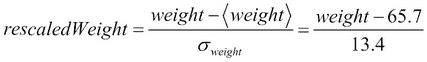

# 十一、Spark SQL 和数据帧

在前一章中，我们学习了如何使用 Spark 构建一个简单的分布式应用程序。我们使用的数据是以文本文件形式存储的一组电子邮件。

我们了解到 Spark 是围绕**弹性分布式数据集** ( **RDDs** )的概念构建的。我们研究了几种类型的 rdd:字符串的简单 rdd、键值 rdd 和双精度 rdd。在键值 rdd 和 double rdd 的情况下，Spark 通过隐式转换增加了简单 rdd 之外的功能。有一种重要的 RDD 类型我们还没有探索: **DataFrames** (以前称为 **SchemaRDD** )。数据帧允许对比我们迄今探索的对象更复杂的对象进行操作。

DataFrame 是一种分布式表格数据结构，因此对于表示和操作结构化数据非常有用。在本章中，我们将首先通过 Spark shell 研究数据帧，然后使用上一章中介绍的 Ling-spam 电子邮件数据集来了解如何将数据帧集成到机器学习管道中。

# 数据帧——旋风般的介绍

让我们从打开 Spark 壳开始:

```java

$ spark-shell

```

让我们想象一下，我们有兴趣对一组患者进行分析，以评估他们的整体健康水平。我们测量了每位患者的身高、体重、年龄以及是否吸烟。

我们可以将每个患者的读数表示为一个例例类(您可能希望在文本编辑器中编写一些内容，并使用`:paste`将其粘贴到 Scala shell 中):

```java

scala> case class PatientReadings(

 val patientId: Int,

 val heightCm: Int,

 val weightKg: Int,

 val age:Int, 

 val isSmoker:Boolean 

)

defined class PatientReadings

```

我们通常会有成千上万的患者，可能存储在数据库或 CSV 文件中。我们将在本章的后面讨论如何与外部资源交互。现在，让我们直接在 shell 中硬编码一些读数:

```java

scala> val readings = List(

 PatientReadings(1, 175, 72, 43, false),

 PatientReadings(2, 182, 78, 28, true),

 PatientReadings(3, 164, 61, 41, false),

 PatientReadings(4, 161, 62, 43, true)

)

List[PatientReadings] = List(...

```

我们可以通过使用`sc.parallelize`将`readings`转换成 RDD:

```java

scala> val readingsRDD = sc.parallelize(readings)

readingsRDD: RDD[PatientReadings] = ParallelCollectionRDD[0] at parallelize at <console>:25

```

注意我们 RDD 的类型参数是`PatientReadings`。让我们使用`.toDF`方法将 RDD 转换为数据帧:

```java

scala> val readingsDF = readingsRDD.toDF

readingsDF: sql.DataFrame = [patientId: int, heightCm: int, weightKg: int, age: int, isSmoker: boolean]

```

我们创建了一个数据帧，其中每一行对应于特定患者的读数，每一列对应于不同的功能:

```java

scala> readingsDF.show

+---------+--------+--------+---+--------+

|patientId|heightCm|weightKg|age|isSmoker|

+---------+--------+--------+---+--------+

|        1|     175|      72| 43|   false|

|        2|     182|      78| 28|    true|

|        3|     164|      61| 41|   false|

|        4|     161|      62| 43|    true|

+---------+--------+--------+---+--------+

```

创建数据帧最简单的方法是在 RDD 上使用`toDF`方法。我们可以将任何一个`RDD[T]`，其中`T`是一个 case 类或者一个元组，转换成一个 DataFrame。Spark 会将 case 类的每个属性映射到 DataFrame 中适当类型的列。它使用反射来发现属性的名称和类型。从 rdd 和外部资源中构造数据帧还有其他几种方法，我们将在本章后面探讨。

数据帧支持许多操作行和列的操作。例如，让我们为**体重指数** ( **身体质量指数**)增加一栏。身体质量指数是汇总*身高*和*体重*来决定某人是否超重或体重不足的常用方法。身体质量指数的公式是:


让我们首先创建一个以米为单位的高度列:

```java

scala> val heightM = readingsDF("heightCm") / 100.0 

heightM: sql.Column = (heightCm / 100.0)

```

`heightM`具有数据类型`Column`，表示数据帧中的一列数据。列支持许多算术和比较运算符，这些运算符应用于列中的元素(类似于在第 2 章[、*中使用 Breeze* 处理数据时遇到的 Breeze 向量)。对列的操作是懒惰的:`heightM`列在定义时并不实际计算。现在让我们定义一个身体质量指数列:](ch02.html "Chapter 2. Manipulating Data with Breeze")

```java

scala> val bmi = readingsDF("weightKg") / (heightM*heightM)

bmi: sql.Column = (weightKg / ((heightCm / 100.0) * (heightCm / 100.0)))

```

将`bmi`列添加到我们的读数数据框中会很有用。因为像 rdd 一样，数据帧是不可变的，所以我们必须定义一个与`readingsDF`相同的新数据帧，但是为身体质量指数增加了一列。我们可以使用`withColumn`方法做到这一点，该方法以新列的名称和一个`Column`实例作为参数:

```java

scala> val readingsWithBmiDF = readingsDF.withColumn("BMI", bmi)

readingsWithBmiDF: sql.DataFrame = [heightCm: int, weightKg: int, age: int, isSmoker: boolean, BMI: double]

```

到目前为止，我们看到的所有操作都是*转换*:它们定义了创建新数据帧的操作流水线。当我们调用一个**动作**时，就会执行这些转换，比如`show`:

```java

scala> readingsWithBmiDF.show

+---------+--------+--------+---+--------+------------------+

|patientId|heightCm|weightKg|age|isSmoker|               BMI|

+---------+--------+--------+---+--------+------------------+

|        1|     175|      72| 43|   false|23.510204081632654|

|        2|     182|      78| 28|    true| 23.54788069073783|

|        3|     164|      61| 41|   false|22.679952409280194|

|        4|     161|      62| 43|    true|  23.9188302920412|

+---------+--------+--------+---+--------+------------------+

```

除了创建额外的列，DataFrames 还支持过滤满足特定谓词的行。例如，我们可以选择所有吸烟者:

```java

scala> readingsWithBmiDF.filter {

 readingsWithBmiDF("isSmoker") 

}.show

+---------+--------+--------+---+--------+-----------------+

|patientId|heightCm|weightKg|age|isSmoker|              BMI|

+---------+--------+--------+---+--------+-----------------+

|        2|     182|      78| 28|    true|23.54788069073783|

|        4|     161|      62| 43|    true| 23.9188302920412|

+---------+--------+--------+---+--------+-----------------+

```

或者，选择体重超过 70 公斤的人:

```java

scala> readingsWithBmiDF.filter { 

 readingsWithBmiDF("weightKg") > 70 

}.show

+---------+--------+--------+---+--------+------------------+

|patientId|heightCm|weightKg|age|isSmoker|               BMI|

+---------+--------+--------+---+--------+------------------+

|        1|     175|      72| 43|   false|23.510204081632654|

|        2|     182|      78| 28|    true| 23.54788069073783|

+---------+--------+--------+---+--------+------------------+

```

在一个表达式中不断重复数据帧名称会变得很麻烦。Spark 定义操作符`$`来引用当前数据帧中的一列。因此，上面的`filter`表达式可以更简洁地写成:

```java

scala> readingsWithBmiDF.filter { $"weightKg" > 70 }.show

+---------+--------+--------+---+--------+------------------+

|patientId|heightCm|weightKg|age|isSmoker|               BMI|

+---------+--------+--------+---+--------+------------------+

|        1|     175|      72| 43|   false|23.510204081632654|

|        2|     182|      78| 28|    true| 23.54788069073783|

+---------+--------+--------+---+--------+------------------+

```

`.filter`方法被重载。它要么接受一列布尔值，如上所述，要么接受一个在当前数据帧中标识一个布尔列的字符串。因此，为了过滤我们的`readingsWithBmiDF`数据帧以子选择吸烟者，我们也可以使用以下内容:

```java

scala> readingsWithBmiDF.filter("isSmoker").show

+---------+--------+--------+---+--------+-----------------+

|patientId|heightCm|weightKg|age|isSmoker|              BMI|

+---------+--------+--------+---+--------+-----------------+

|        2|     182|      78| 28|    true|23.54788069073783|

|        4|     161|      62| 43|    true| 23.9188302920412|

+---------+--------+--------+---+--------+-----------------+

```

当比较相等时，必须使用特殊的*三倍等于*运算符来比较列:

```java

scala> readingsWithBmiDF.filter { $"age" === 28 }.show

+---------+--------+--------+---+--------+-----------------+

|patientId|heightCm|weightKg|age|isSmoker|              BMI|

+---------+--------+--------+---+--------+-----------------+

|        2|     182|      78| 28|    true|23.54788069073783|

+---------+--------+--------+---+--------+-----------------+

```

类似地，您必须使用`!==`来选择不等于某个值的行:

```java

scala> readingsWithBmiDF.filter { $"age" !== 28 }.show

+---------+--------+--------+---+--------+------------------+

|patientId|heightCm|weightKg|age|isSmoker|               BMI|

+---------+--------+--------+---+--------+------------------+

|        1|     175|      72| 43|   false|23.510204081632654|

|        3|     164|      61| 41|   false|22.679952409280194|

|        4|     161|      62| 43|    true|  23.9188302920412|

+---------+--------+--------+---+--------+------------------+

```


# 聚合操作

我们已经看到了如何对数据帧中的每一行应用一个操作来创建一个新的列，我们还看到了如何使用过滤器从原始数据帧中用一个行子集构建新的数据帧。数据帧上的最后一组操作是分组操作，相当于 SQL 中的`GROUP BY`语句。让我们计算一下吸烟者和不吸烟者的平均身体质量指数。我们必须首先告诉 Spark 按列(在本例中为`isSmoker`列)对数据帧进行分组，然后应用聚合操作(在本例中为平均)来减少每个组:

```java

scala> val smokingDF = readingsWithBmiDF.groupBy(

 "isSmoker").agg(avg("BMI"))

smokingDF: org.apache.spark.sql.DataFrame = [isSmoker: boolean, AVG(BMI): double]

```

这创建了一个新的 DataFrame，它有两列:分组列和我们聚合的列。让我们展示这个数据帧:

```java

scala> smokingDF.show

+--------+------------------+

|isSmoker|          AVG(BMI)|

+--------+------------------+

|    true|23.733355491389517|

|   false|23.095078245456424|

+--------+------------------+

```

除了平均之外，还有几个运算符用于在每个组中执行聚合。我们在下表中列出了一些更重要的函数，但是对于完整的列表，请参考[http://spark . Apache . org/docs/latest/API/Scala/index . html # org . Apache . spark . SQL . functions $](http://spark.apache.org/docs/latest/api/scala/index.html#org.apache.spark.sql.functions$)的*聚合函数*部分:

| 

操作员

 | 

笔记

 |
| --- | --- |
| `avg(column)` | 对指定列中的值进行平均分组。 |
| `count(column)` | 指定列中每组元素的数量。 |
| `countDistinct(column, ... )` | 每组中不同元素的数量。这也可以接受多列，以返回跨几列的唯一元素的计数。 |
| `first(column), last(column)` | 每组中的第一个/最后一个元素 |
| `max(column), min(column)` | 每组中最大/最小的元素 |
| `sum(column)` | 每组中值的总和 |

每个聚合操作符要么接受字符串形式的列名，要么接受类型为`Column`的表达式。后者允许组合表达式的聚合。如果我们想要样本中吸烟者和不吸烟者的平均身高，以米为单位，我们可以使用:

```java

scala> readingsDF.groupBy("isSmoker").agg { 

 avg($"heightCm"/100.0) 

}.show

+--------+-----------------------+

|isSmoker|AVG((heightCm / 100.0))|

+--------+-----------------------+

|    true|                  1.715|

|   false|     1.6949999999999998|

+--------+-----------------------+

```

我们还可以使用复合表达式来定义要分组的列。例如，要计算每一个`age`组的患者数量，按十年递增，我们可以使用:

```java

scala> readingsDF.groupBy(floor($"age"/10)).agg(count("*")).show

+-----------------+--------+

|FLOOR((age / 10))|count(1)|

+-----------------+--------+

|              4.0|       3|

|              2.0|       1|

+-----------------+--------+

```

我们使用了简写`"*"`来表示对每一列的计数。


# 将数据帧连接在一起

到目前为止，我们只考虑了单个数据帧上的操作。Spark 还提供类似 SQL 的连接来组合数据帧。让我们假设我们有另一个将患者 id 映射到(收缩压)血压测量值的数据帧。我们将假设我们拥有将患者 id 映射到血压的数据对列表:

```java

scala> val bloodPressures = List((1 -> 110), (3 -> 100), (4 -> 125))

bloodPressures: List[(Int, Int)] = List((1,110), (3,100), (4,125))

scala> val bloodPressureRDD = sc.parallelize(bloodPressures)

res16: rdd.RDD[(Int, Int)] = ParallelCollectionRDD[74] at parallelize at <console>:24

```

我们可以从元组的 RDD 构建一个数据帧。然而，与从 case 类的 rdd 构造数据帧不同，Spark 不能推断列名。因此，我们必须明确地将这些传递给`.toDF`:

```java

scala> val bloodPressureDF = bloodPressureRDD.toDF(

 "patientId", "bloodPressure")

bloodPressureDF: DataFrame = [patientId: int, bloodPressure: int]

scala> bloodPressureDF.show

+---------+-------------+

|patientId|bloodPressure|

+---------+-------------+

|        1|          110|

|        3|          100|

|        4|          125|

+---------+-------------+

```

让我们使用患者 ID 作为连接键，将`bloodPressureDF`与`readingsDF`连接起来:

```java

scala> readingsDF.join(bloodPressureDF, 

 readingsDF("patientId") === bloodPressureDF("patientId")

).show

+---------+--------+--------+---+--------+---------+-------------+

|patientId|heightCm|weightKg|age|isSmoker|patientId|bloodPressure|

+---------+--------+--------+---+--------+---------+-------------+

|        1|     175|      72| 43|   false|        1|          110|

|        3|     164|      61| 41|   false|        3|          100|

|        4|     161|      62| 43|    true|        4|          125|

+---------+--------+--------+---+--------+---------+-------------+

```

这执行了一个*内部连接*:只有在两个数据帧中都存在的患者 id 才包含在结果中。连接的类型可以作为额外的参数传递给`join`。例如，我们可以执行一个*左连接*:

```java

scala> readingsDF.join(bloodPressureDF,

 readingsDF("patientId") === bloodPressureDF("patientId"),

 "leftouter"

).show

+---------+--------+--------+---+--------+---------+-------------+

|patientId|heightCm|weightKg|age|isSmoker|patientId|bloodPressure|

+---------+--------+--------+---+--------+---------+-------------+

|        1|     175|      72| 43|   false|        1|          110|

|        2|     182|      78| 28|    true|     null|         null|

|        3|     164|      61| 41|   false|        3|          100|

|        4|     161|      62| 43|    true|        4|          125|

+---------+--------+--------+---+--------+---------+-------------+

```

可能的连接类型有、`inner`、`outer`、`leftouter`、`rightouter`或`leftsemi`。这些应该都很熟悉，除了`leftsemi`，对应的是一个*左半连接*。这与内部联接相同，但联接后只保留左侧的列。因此，这是一种从一个数据帧中筛选出现在另一个数据帧中的行的方法。


# 数据帧上的自定义函数

到目前为止，我们只使用了内置函数来操作 DataFrame 列。虽然这些通常是足够的，但我们有时需要更大的灵活性。Spark 让我们通过**用户定义函数**(**UDF**)将自定义转换应用于每一行。让我们假设我们想要使用在第 2 章[，*使用 Breeze* 处理数据中导出的等式，在给定一个人的身高和体重的情况下，计算他是男性的概率。我们计算出决策边界由下式给出:](ch02.html "Chapter 2. Manipulating Data with Breeze")


鉴于他们的身高和体重以及用于[第二章](ch02.html "Chapter 2. Manipulating Data with Breeze")、*用 Breeze* 处理数据的训练集(基于学生，因此不太可能代表整体人口)，任何具有 *f > 0* 的人都更有可能是男性。要将厘米高度转换为标准化高度 *rescaledHeight* ，我们可以使用以下公式:


类似地，要将重量(以千克为单位)转换为标准化重量，*重标重量*，我们可以使用:



根据训练集计算出*身高*和*体重*的平均值和标准差。让我们编写一个 Scala 函数，返回在给定身高和体重的情况下，一个人是否更可能是男性:

```java

scala> def likelyMale(height:Int, weight:Int):Boolean = {

 val rescaledHeight = (height - 171.0)/8.95

 val rescaledWeight = (weight - 65.7)/13.4

 -0.75 + 2.48*rescaledHeight + 2.23*rescaledWeight > 0

}

```

要在 Spark 数据帧上使用这个函数，我们需要将其注册为一个**用户自定义函数** ( **UDF** )。这个将我们接受整数参数的函数转换为接受列参数的函数:

```java

scala> val likelyMaleUdf = sqlContext.udf.register(

 "likelyMaleUdf", likelyMale _)

likelyMaleUdf: org.apache.spark.sql.UserDefinedFunction = UserDefinedFunction(<function2>,BooleanType,List())

```

要注册一个 UDF，我们必须能够访问一个`sqlContext`实例。SQL 上下文为数据帧操作提供了入口点。Spark shell 在启动时创建一个 SQL 上下文，绑定到变量`sqlContext`，并在 shell 会话关闭时销毁它。

传递给`register`函数的第一个参数是 UDF 的名称(我们稍后在 DataFrame 上编写 SQL 语句时将使用 UDF 的名称，但现在可以忽略它)。然后，我们可以像 Spark 中包含的内置转换一样使用 UDF:

```java

scala> val likelyMaleColumn = likelyMaleUdf(

 readingsDF("heightCm"), readingsDF("weightKg"))

likelyMaleColumn: org.apache.spark.sql.Column = UDF(heightCm,weightKg)

scala> readingsDF.withColumn("likelyMale", likelyMaleColumn).show

+---------+--------+--------+---+--------+----------+

|patientId|heightCm|weightKg|age|isSmoker|likelyMale|

+---------+--------+--------+---+--------+----------+

|        1|     175|      72| 43|   false|      true|

|        2|     182|      78| 28|    true|      true|

|        3|     164|      61| 41|   false|     false|

|        4|     161|      62| 43|    true|     false|

+---------+--------+--------+---+--------+----------+

```

如您所见，Spark 将 UDF 的底层函数应用于数据帧中的每一行。我们并不局限于使用 UDF 来创建新列。我们也可以在`filter`表达式中使用它们。例如，要选择可能对应于女性的行:

```java

scala> readingsDF.filter(

 ! likelyMaleUdf($"heightCm", $"weightKg")

).show

+---------+--------+--------+---+--------+

|patientId|heightCm|weightKg|age|isSmoker|

+---------+--------+--------+---+--------+

|        3|     164|      61| 41|   false|

|        4|     161|      62| 43|    true|

+---------+--------+--------+---+--------+

```

使用 UDF，我们可以定义任意的 Scala 函数来转换行，为数据操作提供了巨大的额外能力。


# 数据帧的不变性和持久性

像 rdd 一样，数据帧是不可变的。当您在数据帧上定义一个转换时，总是会创建一个新的数据帧。原始数据帧不能就地修改(例如，这与熊猫数据帧明显不同)。

对数据帧的操作可以分为两类:*转换*，它会创建一个新的数据帧；以及*操作*，它通常会返回一个 Scala 类型或者有副作用。像`filter`或`withColumn`这样的方法是转换，而像`show`或`head`这样的方法是动作。

转换是懒惰的，很像 rdd 上的转换。当您通过转换现有的数据帧来生成新的数据帧时，这会导致创建新的数据帧的执行计划的细化，但是数据本身不会立即被转换。您可以通过`queryExecution` 方法访问执行计划。

当您在数据帧上调用一个动作时，Spark 会像处理常规 RDD 一样处理该动作:它隐式地构建一个直接的非循环图来解决依赖性，处理构建调用该动作的数据帧所需的转换。

与 rdd 非常相似，我们可以将数据帧保存在内存或磁盘上:

```java

scala> readingsDF.persist

readingsDF.type = [patientId: int, heightCm: int,...]

```

这与持久化 RDD 的工作方式相同:下次计算 RDD 时，它将被保存在内存中(假设有足够的空间)，而不是被丢弃。还可以设置持久性级别:

```java

scala> import org.apache.spark.storage.StorageLevel

import org.apache.spark.storage.StorageLevel

scala> readingsDF.persist(StorageLevel.MEMORY_AND_DISK)

readingsDF.type = [patientId: int, heightCm: int, ...]

```


# 数据帧上的 SQL 语句

到目前为止，您会注意到数据帧上的许多操作都是受 SQL 操作的启发。此外，Spark 允许我们将数据帧注册为表，并直接使用 SQL 语句查询它们。因此，我们可以构建一个临时数据库作为程序流的一部分。

让我们将`readingsDF`注册为一个临时表:

```java

scala> readingsDF.registerTempTable("readings")

```

这将注册一个可以在 SQL 查询中使用的临时表。注册临时表依赖于 SQL 上下文的存在。当 SQL 上下文被销毁时(例如，当我们关闭 shell 时)，临时表也被销毁。

让我们探索一下我们可以用临时表和 SQL 上下文做些什么。我们可以首先获得当前在上下文中注册的所有表的列表:

```java

scala> sqlContext.tables

DataFrame = [tableName: string, isTemporary: boolean]

```

这将返回一个数据帧。通常，SQL 上下文中所有返回数据的操作都会返回数据帧:

```java

scala> sqlContext.tables.show

+---------+-----------+

|tableName|isTemporary|

+---------+-----------+

| readings|       true|

+---------+-----------+

```

我们可以通过将 SQL 语句传递给 SQL 上下文来查询这个表:

```java

scala> sqlContext.sql("SELECT * FROM readings").show

+---------+--------+--------+---+--------+

|patientId|heightCm|weightKg|age|isSmoker|

+---------+--------+--------+---+--------+

|        1|     175|      72| 43|   false|

|        2|     182|      78| 28|    true|

|        3|     164|      61| 41|   false|

|        4|     161|      62| 43|    true|

+---------+--------+--------+---+--------+

```

任何用`sqlContext`注册的 UDF 都可以通过注册时给它们的名字来使用。因此，我们可以在 SQL 查询中使用它们:

```java

scala> sqlContext.sql("""

SELECT 

 patientId, 

 likelyMaleUdf(heightCm, weightKg) AS likelyMale

FROM readings

""").show

+---------+----------+

|patientId|likelyMale|

+---------+----------+

|        1|      true|

|        2|      true|

|        3|     false|

|        4|     false|

+---------+----------+

```

您可能想知道为什么要将数据帧注册为临时表并在这些表上运行 SQL 查询，而同样的功能可以直接在数据帧上使用。主要原因是为了与外部工具进行交互。Spark 可以运行公开 JDBC 接口的 SQL 引擎，这意味着知道如何与 SQL 数据库交互的程序将能够利用临时表。

我们没有足够的篇幅在本书中讲述如何建立一个分布式 SQL 引擎，但是你可以在 Spark 文档中找到细节。


# 复杂数据类型——数组、映射和结构

到目前为止，我们数据帧中的所有元素都是简单类型。DataFrames 支持三种额外的集合类型:数组、映射和结构。

## 结构

我们要看的第一个复合类型是**结构**。struct 类似于 case 类:它存储一组键值对，带有一组固定的键。如果我们将包含嵌套 case 类的 case 类的 RDD 转换为数据帧，Spark 会将嵌套对象转换为结构。

假设我们想连载《指环王》中的角色。我们可以使用下面的对象模型:

```java
case class Weapon(name:String, weaponType:String)

case class LotrCharacter(name:String, val weapon:Weapon)
```

我们想要创建一个`LotrCharacter`实例的数据帧。让我们创建一些虚拟数据:

```java

scala> val characters = List(

 LotrCharacter("Gandalf", Weapon("Glamdring", "sword")),

 LotrCharacter("Frodo", Weapon("Sting", "dagger")),

 LotrCharacter("Aragorn", Weapon("Anduril", "sword"))

)

characters: List[LotrCharacter] = List(LotrCharacter...

scala> val charactersDF = sc.parallelize(characters).toDF

charactersDF: DataFrame = [name: string, weapon: struct<name:string,weaponType:string>]

scala> charactersDF.printSchema

root

 |-- name: string (nullable = true)

 |-- weapon: struct (nullable = true)

 |    |-- name: string (nullable = true)

 |    |-- weaponType: string (nullable = true)

scala> charactersDF.show

+-------+-----------------+

|   name|           weapon|

+-------+-----------------+

|Gandalf|[Glamdring,sword]|

|  Frodo|   [Sting,dagger]|

|Aragorn|  [Anduril,sword]|

+-------+-----------------+

```

case 类中的`weapon`属性被转换为 DataFrame 中的 struct 列。为了从结构中提取子字段，我们可以将字段名传递给列的`.apply`方法:

```java

scala> val weaponTypeColumn = charactersDF("weapon")("weaponType")

weaponTypeColumn: org.apache.spark.sql.Column = weapon[weaponType]

```

我们可以像使用任何其他列一样使用这个派生的列。例如，让我们过滤我们的数据帧，只包含挥舞剑的角色:

```java

scala> charactersDF.filter { weaponTypeColumn === "sword" }.show

+-------+-----------------+

|   name|           weapon|

+-------+-----------------+

|Gandalf|[Glamdring,sword]|

|Aragorn|  [Anduril,sword]|

+-------+-----------------+

```

## 数组

让我们回到前面的例子，假设除了身高、体重和年龄，我们还有病人的电话号码。每个病人可能有零个、一个或多个电话号码。我们将定义一个新的案例类和新的虚拟数据:

```java

scala> case class PatientNumbers(

 patientId:Int, phoneNumbers:List[String])

defined class PatientNumbers

scala> val numbers = List(

 PatientNumbers(1, List("07929123456")),

 PatientNumbers(2, List("07929432167", "07929234578")),

 PatientNumbers(3, List.empty),

 PatientNumbers(4, List("07927357862"))

)

scala> val numbersDF = sc.parallelize(numbers).toDF

numbersDF: org.apache.spark.sql.DataFrame = [patientId: int, phoneNumbers: array<string>]

```

我们的 case 类中的`List[String]`数组被转换为`array<string>`数据类型:

```java

scala> numbersDF.printSchema

root

 |-- patientId: integer (nullable = false)

 |-- phoneNumbers: array (nullable = true)

 |    |-- element: string (containsNull = true)

```

与结构一样，我们可以为数组中的特定索引构造一个列。例如，我们可以选择每个数组中的第一个元素:

```java

scala> val bestNumberColumn = numbersDF("phoneNumbers")(0)

bestNumberColumn: org.apache.spark.sql.Column = phoneNumbers[0]

scala> numbersDF.withColumn("bestNumber", bestNumberColumn).show

+---------+--------------------+-----------+

|patientId|        phoneNumbers| bestNumber|

+---------+--------------------+-----------+

|        1|   List(07929123456)|07929123456|

|        2|List(07929432167,...|07929432167|

|        3|              List()|       null|

|        4|   List(07927357862)|07927357862|

+---------+--------------------+-----------+

```

## 地图

最后一个复合数据类型是地图。映射类似于结构，因为它们存储键-值对，但是当创建数据帧时，键的集合不是固定的。因此，它们可以存储任意的键值对。

构建数据帧时，Scala 映射将被转换为数据帧映射。然后可以用类似于结构的方式查询它们。


# 与数据源交互

数据科学或工程中的一个主要挑战是处理持久化数据的大量输入和输出格式。我们可能以 CSV 文件、JSON 文件或通过 SQL 数据库等方式接收或发送数据。

Spark 提供了一个统一的 API，用于在不同数据源之间序列化和反序列化数据帧。

## JSON 文件

Spark 支持从 JSON 文件加载数据，前提是 JSON 文件中的每一行都对应一个 JSON 对象。每个对象将被映射到一个 DataFrame 行。JSON 数组映射到数组，嵌入对象映射到结构。

如果没有一些数据，这个部分会有点枯燥，所以让我们从 GitHub API 生成一些数据。不幸的是，GitHub API 不返回每行一个对象格式的 JSON。本章的代码存储库包含一个脚本，`FetchData.scala`，它将为 Martin Odersky 的存储库下载并格式化 JSON 条目，并将对象保存到一个名为`odersky_repos.json`的文件中(如果需要，可以在`FetchData.scala`中更改 GitHub 用户)。你也可以从 data.scala4datascience.com/odersky_repos.json 下载一个预先构建好的数据文件。

让我们深入 Spark shell 并将这些数据加载到一个数据帧中。从 JSON 文件中读取就像将文件名传递给`sqlContext.read.json`方法一样简单:

```java

scala> val df = sqlContext.read.json("odersky_repos.json")

df: DataFrame = [archive_url: string, assignees_url: ...]

```

从 JSON 文件中读取数据会将数据作为 DataFrame 加载。Spark 自动从 JSON 文档中推断出模式。我们的数据帧中有许多列。让我们再选择几个，以获得更易于管理的数据帧:

```java

scala> val reposDF = df.select("name", "language", "fork", "owner")

reposDF: DataFrame = [name: string, language: string, ...] 

scala> reposDF.show

+----------------+----------+-----+--------------------+

|            name|  language| fork|               owner|

+----------------+----------+-----+--------------------+

|           dotty|     Scala| true|[https://avatars....|

|        frontend|JavaScript| true|[https://avatars....|

|           scala|     Scala| true|[https://avatars....|

|      scala-dist|     Scala| true|[https://avatars....|

|scala.github.com|JavaScript| true|[https://avatars....|

|          scalax|     Scala|false|[https://avatars....|

|            sips|       CSS|false|[https://avatars....|

+----------------+----------+-----+--------------------+

```

让我们将数据帧保存回 JSON:

```java

scala> reposDF.write.json("repos_short.json")

```

如果您查看运行 Spark shell 的目录中的文件，您会注意到一个`repos_short.json`目录。在里面，你会看到名为`part-000000`、`part-000001`等等的文件。序列化 JSON 时，DataFrame 的每个分区都是独立序列化的。如果您在多台计算机上运行此程序，您将在每台计算机上找到部分序列化输出。

您可以选择给传递一个`mode`参数来控制 Spark 如何处理现有`repos_short.json`文件的案例:

```java

scala> import org.apache.spark.sql.SaveMode

import org.apache.spark.sql.SaveMode

scala> reposDF.write.mode(

 SaveMode.Overwrite).json("repos_short.json")

```

可用的保存模式有`ErrorIfExists`、`Append`(仅适用于拼花文件)、`Overwrite`和`Ignore`(如果文件已经存在，则不保存)。

## 拼花文件

Apache Parquet 是一种流行的文件格式，非常适合存储表格数据。它通常用于 Hadoop 生态系统中的序列化，因为它允许有效地提取特定的列和行，而不必读取整个文件。

Parquet 文件的序列化和反序列化与 JSON 相同，只是用`parquet`替换了`json`:

```java

scala> reposDF.write.parquet("repos_short.parquet")

scala> val newDF = sqlContext.read.parquet("repos_short.parquet")

newDF: DataFrame = [name: string, language: string, fo...]

scala> newDF.show

+----------------+----------+-----+--------------------+

|            name|  language| fork|               owner|

+----------------+----------+-----+--------------------+

|           dotty|     Scala| true|[https://avatars....|

|        frontend|JavaScript| true|[https://avatars....|

|           scala|     Scala| true|[https://avatars....|

|      scala-dist|     Scala| true|[https://avatars....|

|scala.github.com|JavaScript| true|[https://avatars....|

|          scalax|     Scala|false|[https://avatars....|

|            sips|       CSS|false|[https://avatars....|

+----------------+----------+-----+--------------------+

```

一般来说，对于存储大量对象，Parquet 比 JSON 更节省空间。如果可以从行中推断出分区，那么 Parquet 在检索特定的列或行时效率也会高得多。因此，Parquet 比 JSON 更有优势，除非您需要让的输出可读，或者由外部程序去串行化。


# 独立程序

到目前为止，我们已经通过 Spark shell 使用了 Spark SQL 和 DataFrames。要在独立程序中使用它，您需要从 Spark 上下文中显式创建它:

```java
val conf = new SparkConf().setAppName("applicationName")

val sc = new SparkContext(conf)

val sqlContext = new org.apache.spark.sql.SQLContext(sc)
```

此外，导入嵌套在`sqlContext`中的`implicits`对象允许将 rdd 转换为数据帧:

```java

import sqlContext.implicits._

```

我们将在下一章中广泛地使用数据帧来操作数据，使其为 MLlib 的使用做好准备。


# 总结

在本章中，我们探索了 Spark SQL 和数据帧。DataFrames 在 Spark 的核心引擎之上添加了丰富的抽象层，极大地方便了表格数据的操作。此外，源 API 允许对各种数据文件中的数据帧进行序列化和反序列化。

在下一章中，我们将基于我们对 Spark 和 DataFrames 的了解，使用 MLlib 构建一个垃圾邮件过滤器。


# 参考文献

数据帧是 Spark 相对较新的功能。因此仍然缺乏文献和文档。第一个调用的端口应该是 Scala docs，可从:[http://spark . Apache . org/docs/latest/API/Scala/index . html # org . Apache . spark . SQL . data frame](http://spark.apache.org/docs/latest/api/scala/index.html#org.apache.spark.sql.DataFrame)获得。

DataFrame `Column`类型上可用操作的 Scaladocs 可以在:[http://spark . Apache . org/docs/latest/API/Scala/# org . Apache . spark . SQL . column](http://spark.apache.org/docs/latest/api/scala/#org.apache.spark.sql.Column)找到。

还有关于拼花文件格式的大量文档:[https://parquet.apache.org](https://parquet.apache.org)。