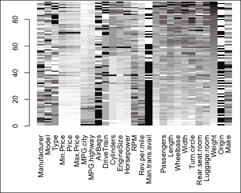
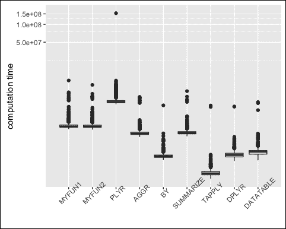
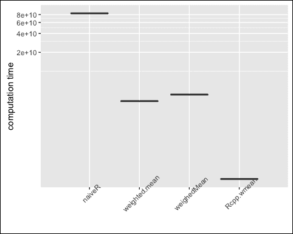
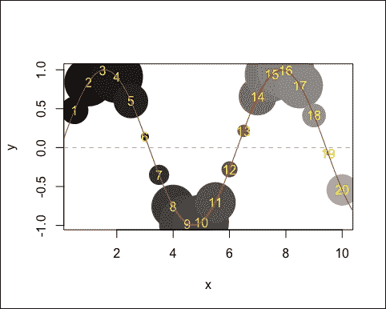
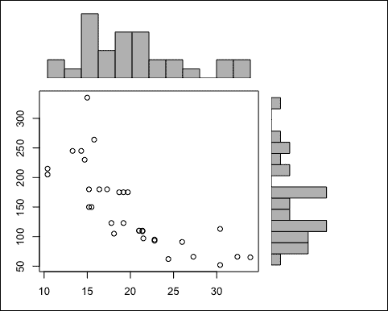

# 二、R 和高性能计算

软件环境 **R** (R 开发核心团队，2015)是现今统计界最常用的软件，该软件在本书中被大量使用。以下任何章节中描述的方法都是实际应用的，并且使用统计环境 R 显示了方法的应用。对于一本关于 R 中的模拟和数据科学的书，为了有效地应用方法，需要更长的 R 介绍，特别是关于支持有效计算的功能。

在这一章中，你将得到一个关于 R 的功能的非常简短的介绍。这个介绍并不代替对 R 的一般介绍，而是展示一些有用的观点，例如介绍现代的可视化工具和高效的数据操作包。这些主题——以及本章中的其他主题——对于理解书中的例子和 R 代码非常重要。

比复制一份全面的 R 简介更重要的是，要涵盖与数据科学中的计算机密集型方法和昂贵的数据模拟相关的一些方面。因此，介绍了一些适用于有效处理大型数据集或可有效应用于模拟的软件包和方法。

由于数据操作始终是每个分析的中心点，数据科学家可能将超过 70%的工作花费在数据操作上(在应用统计方法之前)，我们将集中讨论包`dplyr` (Wickham 和 Francois，2015 年)和`data.table` (Dowle 等人，2015 年)。

在本章的最后，我们将讨论用于高性能计算的包(例如，包`snow`，Tierney 等人，2015)和有用的分析工具。

### Tip

其他重要的问题，比如创建我们自己的 R 包、集成测试和动态报告，都不是本书的内容。然而，有经验的 R 用户应该利用这些重要的特性，并且建议您阅读关于这些主题的专门文献。

R 的专家可以跳过这一章，直接从第三章、*开始，铅笔驱动的理论和数据驱动的计算解决方案之间的差异*。R 的新手也应该在阅读本章的旁边或者之前读一读 R 的介绍。

# R 统计环境

r 由 Ross Ihaka 和 Robert Gentlemen 于 1994/1995 年创立。它是基于约翰·T2·钱伯斯(贝尔实验室)开发的编程语言 **S** 和 Scheme。自 1997 年以来，它已经在国际上开发并通过 **综合 R 档案网络** ( **CRAN** )从维也纳分发。r 是当今统计界最受欢迎和使用最多的软件。此外，R 是免费和开源的(在 GPL2 下)。r 不仅仅是一个统计软件，它还是一个交互式计算环境，具有数据支持设施，可以生成高质量的图形。与他人交换代码很容易，因为每个人都可以下载 R。这可能也是为什么现代方法通常只在 R 中开发的一个原因。R 是一种面向对象的编程语言，具有与许多其他软件产品(如 C、C++、Java)的接口，以及与数据库的接口。

有用的信息可以在下面的链接中找到。

*   首页:[http://www.r-project.org/](http://www.r-project.org/)和[http://cran.r-project.org](http://cran.r-project.org)(起重机)
*   CRAN 上的常见问题(FAQ)列表
*   克兰公司的手册和捐赠手册
*   关于起重机的任务视图

r 可扩展大约 8，400 个附加包。

对于编程来说，建议在一个开发良好的编辑器中编写代码，并与 r 进行交互通信。编辑器应该允许语法突出显示、代码完成以及与 r 进行交互通信。对于初学者以及高级用户来说，RStudio 是的一个选择([http://www.rstudio.org/](http://www.rstudio.org/))。专家们也可能使用 Eclipse 及其附加组件 StatET 的组合。这两个编辑器都提供了一个完全开发的编程环境。它们不仅集成了 R，还集成了许多其他有用的工具和软件。

## R 中的基础知识

r 可以作为杂草丛生的计算器。一个计算器的所有操作都可以很容易地在 R 中使用；比如用`+`做加法，用`-`做减法，用`/`做除法，用`exp()`做指数，用`log()`做对数，用`sqrt()`做平方根，用`sin()`做正弦。所有操作按预期工作；例如，下面的表达式由 R 解析，首先求解内括号，乘法和除法运算符优先于加法和减法运算符，依此类推:

```r
5 + 2 * log(3 * 3)
## [1] 9.394449

```

因为 R 在一秒内开始，所以手边不再需要任何其他计算器。

## 关于 R 的一些非常基本的东西

r 是一种函数和面向对象的语言。函数可以应用于对象。语法如下例所示:

```r
mean(rnorm(10))
## [1] -0.4241956

```

使用函数`rnorm`，从标准正态分布中随机抽取 10 个数字。如果没有固定的种子(使用函数`seed()`，这些函数的调用之间的编号不同。然后，计算这 10 个数字的`mean`。函数通常有可以设置的函数参数。调用函数的语法通常是:

```r
res1 <- name_of_function(v1) # an input argument
res2 <- name_of_function(v1, v2) # two input arguments
res3 <- name_of_function(v1, v2, v3) # three input arguments

```

函数通常有带默认值的附加函数参数。您可以使用`args()`访问所有函数参数。

通过`<-`或`=`对对象进行分配，生成的对象可以通过对象名后输入`ENTER`进行打印，例如:

```r
x <- rnorm(5)
x
##  [1] -1.3672828 -2.0871666  0.4747871  0.4861836  0.8022188

```

功能`options()`允许您修改默认设置，例如更改字体、编码，或者如这里所示，我们减少打印的位数(内部 R 不会四舍五入到这些数字，它只是打印):

```r
options(digits = 4)
x
##  [1] -1.3673 -2.0872  0.4748  0.4862  0.8022

```

请注意，R 区分大小写。

## 安装和更新

安装软件的推荐程序包括以下步骤。

安装 R:如果 R 已经安装在电脑上，确保是最新版本。如果软件没有安装，请到[http://cran.r-project.org/bin/](http://cran.r-project.org/bin/)选择您的平台。只需下载取决于您的操作系统的可执行文件，然后按照屏幕上的指示操作。

要安装一个附加包，比如包`dplyr`，请键入:

```r
install.packages("dplyr")

```

安装只需要一次。通过以下方式加载软件包后，可以使用已安装软件包的内容:

```r
library("dplyr")

```

当输入`update.packages()`时，R 搜索可能的更新并安装新版本的包，如果有的话。

之前的信息是关于安装软件包的稳定版本。但是，最新的更改通常只在包的开发版本中可用。有时这些开发版本会托管在 GitHub 或类似的 Git 存储库系统上。

要安装最新的开发版本，需要安装软件包`devtools` (Wickham and Chang，2015)。调用`devtools`包后，可以通过`install_github()`安装开发版。我们为包`dplyr`展示了这一点:

```r
if(!require(devtools)) install.packages("devtools")

library("devtools")
install_github("hadley/dplyr")

```

## 救命

掌握如何使用以下命令获取`help`的基本知识至关重要:

```r
help.start()

```

通过此命令，您的浏览器打开，帮助(以及更多)可用。

通过在 R 中键入以下命令，可以访问包的可浏览帮助索引:

```r
help(package="dplyr")

```

要查找特定功能的帮助，可以使用`help(name)`或`?name`。例如，我们可以看看`group_by`函数的帮助文件，它包含在`dplyr`包中:

```r
?group_by

```

包中的数据可以通过`data()`函数加载，例如`MASS`包中的`Cars93`数据集(维纳布尔斯和里普利 2002):

```r
data(Cars93, package = "MASS")

```

`help.search()`可用于查找不知道确切名称的函数，例如:

```r
help.search("histogram")

```

该命令将在您的本地`R`安装中搜索与(文件)名称、别名、标题、概念或关键字条目中的字符串`"histogram"`近似匹配的函数。使用`apropos`功能，用户可以通过(部分)名称查找和列出对象。例如，要列出部分名称匹配为`hist`的所有对象，请键入:

```r
apropos("hist")

```

要搜索帮助页面、简介或任务视图，请使用 R 网站上的搜索引擎，并在您的网络浏览器中查看您的请求结果(例如，`summarize`):

```r
RSiteSearch("group by factor")

```

这将报告字符串`"gro` `up by factor"`的所有搜索结果。

## R 工作区和工作目录

创建的对象在 R 的工作空间中可用，并被加载到计算机的内存中。所有创建对象的集合被称为*工作空间*。要列出工作区中的对象，键入以下命令:

```r
ls()
## [1] "x"

```

导入或导出数据时，必须定义工作目录。要显示当前工作目录，可以使用功能`getwd`:

```r
getwd()
## [1] "/Users/templ/workspace/simulation/book"

```

要改变工作目录，选择功能`setwd`，参见`?setwd`。

## 数据类型

目标是让知道最重要的数据类型:

*   `numeric`
*   `character`
*   `factor`
*   `logical`

以下是重要的数据结构:

*   `vector`
*   `list`
*   `array`
*   `data.frame`
*   特殊数据类型:缺失值(`NA`)、空对象、`NaN`、`-inf`、`+inf`

### 向量在 R

向量是 r 中最简单的数据结构，向量是一系列相同类型的元素，比如数字向量，字符向量，或者逻辑向量。向量通常由函数`c()`创建，例如:

```r
v.num <- c(1,3,5.9,7)
v.num
## [1] 1.0 3.0 5.9 7.0
is.numeric (v.num)
## [1] TRUE

```

`is.numeric`查询向量是否属于类别`numeric`。注意，字符是用括号写的。

逻辑向量通常由数字/字符向量间接创建:

```r
v.num > 3
## [1] FALSE FALSE  TRUE  TRUE

```

对向量的许多操作是按元素执行的，例如，对向量的逻辑比较或算术运算。一个常见的误差源是两个或多个向量的长度不同时。然后重复较短的一个(*回收*):

```r
v1 <- c(1,2,3)
v2 <- c(4,5)
v1 + v2
## [1] 5 7 7
Warning message:
In v1 + v2 :
 longer object length is not a multiple of shorter object length

```

人们还应该意识到，R 在内部自动强制为有意义的数据类型。例如:

```r
v2 <- c (100, TRUE, "A", FALSE)
v2
## [1] "100"   "TRUE"  "A"     "FALSE"
is.numeric (v2)
## [1] FALSE

```

这里，最低的公共数据类型是字符串，因此 vector 的所有条目都被强制转换为字符。注意，为了创建向量，函数`seq`和`rep`非常有用。

通常有必要对向量进行子集划分。使用`[]`操作符进行选择。可以通过三种方式进行选择:

*   **Positive** :正整数的向量，指定所需元素的位置
*   **Negative** :向量，负整数表示非必需元素的位置
*   **逻辑**:一个逻辑向量，其中元素将被选中(`TRUE`)，以及那些未被选中(`FALSE`)

让我们考虑下面的例子:

```r
data(Cars93, package = "MASS")
# extract a subset of variable Horsepower from Cars93
hp <- Cars93[1:10, "Horsepower"]
hp
##  [1] 140 200 172 172 208 110 170 180 170 200
# positive indexing:
hp[c(1,6)]
## [1] 140 110
# negative indexing:
hp[-c(2:5,7:10)]
## [1] 140 110
# logical indexing:
hp < 150
##  [1]  TRUE FALSE FALSE FALSE FALSE  TRUE FALSE FALSE FALSE FALSE
# a logical expression can be written directly in []
hp[
hp < 150]
## [1] 140 110

```

### R 中的因子

R 中的因子特别重要。它们用于表示名义数据或顺序数据。更准确地说，标称定标数据的未记录因子和有序定标数据的有序因子。因子可以看作是特殊的向量。它们是从 *1* 到 *n* (出现次数 *#* )的内部编码整数，它们都与一个名称(标签)相关联。那么为什么要用数值或字符变量作为因子呢？基本上，因子必须用于分类信息，以在统计建模中获得正确的自由度数量和正确的设计矩阵。此外，因子与数字/字符向量的图形实现也有所不同。此外，factors 在存储字符向量方面更有效。然而，因子具有更复杂的数据结构，因为因子包括数字编码的数据向量和每个级别/类别的标签。让我们考虑下面的例子:

```r
class(Cars93)
## [1] "data.frame"
class(Cars93$Cylinders)
## [1] "factor"
levels(Cars93$Cylinders)
## [1] "3"      "4"      "5"      "6"      "8"      "rotary"
summary(Cars93$Cylinders)
##      3      4      5      6      8 rotary
##      3     49      2     31      7      1

```

我们注意到`summary`的输出对于因子是不同的。在内部，R 为通用函数如`summary`应用一个方法调度，在我们的例子中搜索函数`summary.factor`是否存在。如果是，则应用该功能，如果不是，则使用`summary.default`。

### 列表

R 中的列表是一个*有序的*对象集合，而每个对象都是列表的一部分，其中单个列表元素的数据类型可以不同(向量、矩阵、数据帧、列表等等)。每个列表项的维度可以不同。列表可用于对对象中的各种对象进行分组和汇总。(至少)有四种访问列表元素的方法，(`a`)`[]`操作符、操作符`[[]]`、`$`操作符和列表项的名称。使用`str()`，你可以查看一个列表的结构，使用`names()`，你可以得到列表元素的名称:

```r
model <- lm(Price ~ Cylinders + Type + EngineSize + Origin, data = Cars93)
## result is a list
class(model)
## [1] "lm"
## access elements from the named list with the dollar sign
model$coefficients
##     (Intercept)      Cylinders4      Cylinders5      Cylinders6
##           5.951           3.132           7.330          10.057
##      Cylinders8 Cylindersrotary       TypeLarge     TypeMidsize
##          17.835          19.828          -4.232           2.558
##       TypeSmall      TypeSporty         TypeVan      EngineSize
##          -6.086          -2.188          -5.835           2.303
##   Originnon-USA
##           5.915

```

### 数据框

数据帧(在 R `data.frame`中)是最重要的数据类型。它们对应于其他软件包中众所周知的矩形数据格式，其中*行*对应于观察单位，*列*对应于变量。一个`data.frame`类似于一个*列表*，其中所有列表元素都是向量/因子，但有一个限制，即所有列表元素都有相同数量的元素(长度相等)。例如，从外部源读取的数据通常存储为数据帧，数据帧通常通过读取数据创建，但也可以用函数`data.frame()`构建。

存在许多机会来对数据帧进行子集化，例如使用语法:`[ index row, index columns]`。同样，正索引、负索引和逻辑索引都是可能的，并且行索引和列索引的索引类型可能不同。使用`$`操作符访问单个列是最简单的(比如列表):

```r
## extract cars with small number of cylinders and small power
w <- Cars93$Cylinders %in% c("3", "4")  & Cars93$Horsepower < 80
str(Cars93[w, ])
## 'data.frame':    5 obs. of  27 variables:
##  $ Manufacturer      : Factor w/ 32 levels "Acura","Audi",..: 11 12 25 28 29
##  $ Model             : Factor w/ 93 levels "100","190E","240",..: 44 62 53 50 88
##  $ Type              : Factor w/ 6 levels "Compact","Large",..: 4 4 4 4 4
##  $ Min.Price         : num  6.9 6.7 8.2 7.3 7.3
##  $ Price             : num  7.4 8.4 9 8.4 8.6
##  $ Max.Price         : num  7.9 10 9.9 9.5 10
##  $ MPG.city          : int  31 46 31 33 39
##  $ MPG.highway       : int  33 50 41 37 43
##  $ AirBags           : Factor w/ 3 levels "Driver & Passenger",..: 3 3 3 3 3
##  $ DriveTrain        : Factor w/ 3 levels "4WD","Front",..: 2 2 2 1 2
##  $ Cylinders         : Factor w/ 6 levels "3","4","5","6",..: 2 1 2 1 1
##  $ EngineSize        : num  1.3 1 1.6 1.2 1.3
##  $ Horsepower        : int  63 55 74 73 70
##  $ RPM               : int  5000 5700 5600 5600 6000
##  $ Rev.per.mile      : int  3150 3755 3130 2875 3360
##  $ Man.trans.avail   : Factor w/ 2 levels "No","Yes": 2 2 2 2 2
##  $ Fuel.tank.capacity: num  10 10.6 13.2 9.2 10.6
##  $ Passengers        : int  4 4 4 4 4
##  $ Length            : int  141 151 177 146 161
##  $ Wheelbase         : int  90 93 99 90 93
##  $ Width             : int  63 63 66 60 63
##  $ Turn.circle       : int  33 34 35 32 34
##  $ Rear.seat.room    : num  26 27.5 25.5 23.5 27.5
##  $ Luggage.room      : int  12 10 17 10 10
##  $ Weight            : int  1845 1695 2350 2045 1965
##  $ Origin            : Factor w/ 2 levels "USA","non-USA": 1 2 1 2 2
##  $ Make              : Factor w/ 93 levels "Acura Integra",..: 34 39 76 80 83

```

可以与数据框结合使用的几个有帮助的函数有:`dim()`，报告维度(行数和列数)；`head()`，一个数据帧的第一行(默认 6 行)；和`colnames()`，列/变量名。

### 阵列

R 中的一个数组可以有多个维度。向量已经是一维数组了。矩阵是一个二维数组，有行和列。让我们从包`vcd`中调用一个存储为四维数组的数据集:

```r
library("vcd")
## Loading required package: grid
data(PreSex)
PreSex
## , , PremaritalSex = Yes, Gender = Women
##
##              ExtramaritalSex
## MaritalStatus Yes  No
##      Divorced  17  54
##      Married    4  25
##
## , , PremaritalSex = No, Gender = Women
##
##              ExtramaritalSex
## MaritalStatus Yes  No
##      Divorced  36 214
##      Married    4 322
##
## , , PremaritalSex = Yes, Gender = Men
##
##              ExtramaritalSex
## MaritalStatus Yes  No
##      Divorced  28  60
##      Married   11  42
##
## , , PremaritalSex = No, Gender = Men
##
##              ExtramaritalSex
## MaritalStatus Yes  No
##      Divorced  17  68
##      Married    4 130

```

我们看到第一维度是`MaritalStatus`，第二维度是`ExtramaritalSex`，第三维度是`PremaritalSex`，第四维度是`Gender`。

我们现在可以通过使用`[]`索引来访问数组的元素。如果我们想提取数据，其中`PremaritalSex`是`Yes`，而`Gender`是`Men`，我们键入:

```r
PreSex[, , 1, 2]
##              ExtramaritalSex
## MaritalStatus Yes No
##      Divorced  28 60
##      Married   11 42

```

这意味着选择第一个和第二个维度的所有值，仅指定第三个维度的第一个值(`Yes`)和最后一个维度的第二个值(`Men`)。这也可以通过名称来实现:

```r
PreSex[, , "Yes", "Men"]
##              ExtramaritalSex
## MaritalStatus Yes No
##      Divorced
 28 60
##      Married   11 42

```

## 缺失值

缺失值几乎总是出现在数据中。R 中缺失值的默认表示是符号`NA`。检查数据值是否丢失的一个非常有用的函数是`is.na`。它返回一个逻辑向量或`data.frame`,取决于输入是一个向量还是表示“丢失”的`data.frame`。为了计算缺失值的数量，我们可以对*真的*求和(解释为 *1* ，而*假的*解释为 *0* )。

```r
sum(is.na(Cars93))
## [1] 13

```

总而言之，缺少 13 个值。

为了分析任何缺失值的结构，可以使用 R 包`VIM` (Templ、Alfons 和 Filzmoser，2012 年)。对于缺失值的许多可能曲线之一，`matrixplot` ( *图 1* )显示整个数据帧的所有值。有趣的是，汽车的重量越高，变量`luggage.room`中出现的*缺失*就越多:

```r
require("VIM")
matrixplot(Cars93, sortby = "Weight", cex.axis=0.6)

```



图 1:来自包 VIM 的矩阵图。值越高越暗。缺少的值用红色表示

在包`robCompositions (Templ, Hron, and Filzmoser 2011)`中，一个有用的函数是 `missPatterns`，它显示了缺失值的结构(我们不显示输出):

```r
m <- robCompositions::missPatterns(Cars93)

```


# 通用函数、方法和类

r 有不同的等级系统，最重要的是`S3`和`S4`等级。用`S3`类编程很简单，比`S4`简单。然而，`S4`是*干净的*并且`S4`的使用可以使软件包非常用户友好。

在任何情况下，在 R 中每个对象都被分配给一个类(属性`class`)。类允许面向对象编程和*通用函数*的*重载*。一旦为不同的类编写了方法，通用函数就会为这些类的对象产生不同的输出。

这听起来很复杂，但是通过下面的例子应该会更清楚。

作为一个通用函数的例子，我们将使用函数`summary`。`summary`是用于生成结果汇总的通用函数。该函数调用依赖于第一个参数的类的特定方法:

```r
## how often summary is overloaded with methods
## on summary for certain classes
(the number depends on loaded packages)
length(methods(summary))
## [1] 137
class(Cars93$Cylinders)
## [1] "factor"
summary(Cars93$Cylinders)
##      3      4      5      6      8 rotary
##      3     49      2     31      7      1
## just to see the difference, convert to class character:
summary(as.character(Cars93$Cylinders))
##    Length     Class      Mode
##        93 character character

```

从前面的例子可以看出，根据对象的类别，摘要是不同的。r 在内部看起来好像是为给定的对象类实现了一个方法。如果是，则使用该功能，如果不是，则使用功能`summary.default`。这个程序叫做*法分派*。

在前一个例子的最后一行，R 看起来好像有一个函数`summary.factor`可用，这是真的。

### 注意

您可以轻松地编写自己的通用函数，并为某些类的对象定义打印、汇总和绘图函数。


# R 中的数据操作

对于在相对小规模的问题上使用来自各种 R 包的完美准备数据的学生来说，数据操作不是大问题。然而，在数据科学家的日常实践中，大部分时间从事数据分析并不涉及将合适的函数应用到已经准备好的数据中。大部分工作是在数据处理上完成的，以便从几个来源收集数据，将数据形成合适的格式，并提取相关信息。因此，数据操作是核心工作，数据科学家和统计学家应具备强大的数据操作技能。

无论何时处理数据框，包`dplyr`都提供了用户友好且计算高效的代码。一个支持更高效数据操作的包是`data.table`包(Dowle et al .，2015)。然而，由于这两种包各有优点，我们两个都报道。另外，`data.table`处理二维数据对象。

在任何情况下，例如，当处理维数大于 2 的数组时，`apply`仍然是唯一的选择。一个例子是物候数据，其中对于每个物候站，随着时间的推移给出不同物种的测量值。这种数据集通常存储为数组，在这种情况下是四维数组。

## 申请和基本 R 的朋友

使用`apply`系列，人们可以以重复的方式操作来自矩阵、数组、列表和数据帧的数据切片。这些函数允许您跨越特定维度的数据，并避免明确使用`for`循环。重复地，函数应用于一个维度的所有元素。

让我们再次考虑数据集`Cars93`。数据集由行(第一维)和列(第二维)组成。要对此数据集的第二维应用函数，例如，计算列中缺失值的数量，调用如下所示:

```r
## function to be applied afterwards
func <- function(x){

 return(sum(is.na(x)))
}
## apply func on all columns (second dimension (2))
## and store it to na
na <- apply(X = Cars93, MARGIN = 2, FUN = func)
## show those with missings
na[ na > 0 ]
## Rear.seat.room   Luggage.room
##              2             11

```

这里，`X`必须是数组(注意矩阵是二维数组)，`MARGIN`是应用`FUN`的维度。

### 注意

这个`apply`调用与`for`循环基本相同。

```r
p <- ncol(Cars93)
na_for <- numeric(p)
for(i in 1:p){
 na_for[i] <- func(Cars93[, i])
}

identical(as.numeric(na), na_for)
## [1] TRUE

```

虽然人们总是可以使用`for`循环，但是 apply 的代码要短得多。

当一个给定的函数应该应用于一个列表时(注意，`data.frame`在内部也被视为一个列表)，`lapply`可能是你的朋友。返回的输出也是一个列表，其元素的数量与传递给它的对象的数量相同。

在前面的代码调用中，我们将一个列表输出分配给一个名为`m`的对象:

```r
m <- robCompositions::missPatterns(Cars93)
class(m)
## [1] "list"

```

我们通过使用`lapply`访问每个列表元素的长度，将一个函数(例如`length()`)应用于列表的所有元素:

```r
lapply(m, length)
## $groups
## [1] 3
##
## $cn
## [1] 3
##
## $tabcomb
## [1] 81
##
## $tabcombPlus
## [1] 28
##
## $rsum
## [1] 93

```

`sapply`基本上与`lapply`一样工作，但如果可能的话会简化输出。例如:

```r
s <- sapply(m, length)
is no longer a list (as for lapply) but a vector of integers.
s
##      groups          cn     tabcomb tabcombPlus        rsum
##           3           3          81          28          93
class(s)
## [1] "integer"

```

`aggregate`的功能与`apply`类似。它的不同之处在于函数参数，这允许它对数据集进行子集化，并对这些子集应用函数。让我们看一下函数参数:

```r
args(aggregate)
## function (x, ...)
## NULL

```

由于我们只看到来自泛型的参数，但我们希望将函数应用于`Cars93`数据帧，我们可以查看是否有实现数据帧的方法:

```r
methods(aggregate)
## [1] aggregate.cv*        aggregate.cvSelect*  aggregate.cvTuning*
## [4] aggregate.data.frame aggregate.default*   aggregate.formula*
## [7] aggregate.Spatial*   aggregate.ts         aggregate.zoo*
## see '?methods' for accessing help and source code
args(aggregate.data.frame)
## function (x, by, FUN, ..., simplify = TRUE)
## NULL

```

为了进行分组统计，现在可以对我们的示例数据应用该函数，例如，计算每个气缸等级(`Cylinders`)的汽车的中位数`Horsepower`和`Weight`:

```r
aggregate(Cars93[, c("Horsepower", "Weight")], by = list(Cars93$Cylinders), median)
##   Group.1 Horsepower Weight
## 1       3       70.0   1965
## 2       4      110.0   2705
## 3       5      138.5   3602
## 4       6      170.0   3515
## 5       8      210.0   3935
## 6  rotary      255.0   2895

```

与 aggregate 类似的函数有`by`(另一个打印输出)、包`Hmisc` (Harrell Jr，2016)中的`summarize`以及包`dplyr`中的`summarize`和`group_by`，讨论如下。

## 使用 dplyr 包进行基本数据操作

base R 的数据操作功能很好，但是在某些情况下,`dplyr`包更直观，更重要的是，比 base R 的数据操作函数更快。由于这本书是关于数据模拟的，并且它也讨论了计算机密集型方法，计算速度是非常重要的，尤其是对于较大的模拟。

软件包`dplyr`提供以下功能:

*   观察值的过滤
*   变量选择
*   录音
*   分组
*   Aggregation (in groups)

    ### Note

    Other useful software packages such as `reshape2`, `stringr` or `lubridate` are not introduced in this book.

*   `data.table`稍后讨论

额外的包，比如`dplyr`包，有时会使生活变得更容易，正如前面提到的，计算时间可以快得多。

数据管理中的一些步骤可以*抽象*。这些任务包括:行或列的*选择*—*数据排序*—*记录*、*分组*、*汇总*。

以下是需要额外软件包(如`dplyr`)的更多原因:

*   只需要记住几个重要的关键词
*   一致性
*   使用不同的输入
*   `data.frame`、`data.tables`、`sqlite`
*   简单(但新)的语法
*   代码越少，错误越少
*   从现在开始，在本节中，以下内容适用(因为这是`dplyr`语言):一列对应一个变量，一行对应一个观察值

首先，软件包必须被加载(并且一旦被安装):

```r
library("dplyr")

```

### 注意

一些简介(简短说明)可用，参见`help(pa = "dplyr")`。

### DP lyr–创建本地数据框

使用`tbl_df()`可以创建一个*本地*数据帧。

我们为什么需要这个？因为它提供了更有效的打印输出，并且没有意外打印大量数据集的机会，这可能会导致内存问题或长时间等待。

记住，`Cars93`是一个*数据帧*:

```r
class (Cars93)
## [1] "data.frame"

```

然后我们转换到`dplyr`的*本地*数据帧，并查看由`dplyr`完成的新打印输出:

```r
Cars93 <- tbl_df(Cars93)
class(Cars93)
## [1] "tbl_df"     "tbl"        "data.frame"

## print(Cars93) # output suppressed

```

### DP lyr–选择线条

使用功能`slice(),`可以根据行号选择行:

```r
slice(Cars93, 1) # first line, output suppressed

```

您也可以一次选择多行。

注意，`c()`从输入的数字创建一个向量，函数`n()`返回观察值(行)的数量。我们将选择`1,4,10,15`和最后一行数据:

```r
slice (Cars93, c(1,4,10,15, n ()))
## Source: local data frame [5 x 27]
##
##   Manufacturer   Model    Type Min.Price Price Max.Price MPG.city
##         (fctr)  (fctr)  (fctr)     (dbl) (dbl)     (dbl)    (int)
## 1        Acura Integra   Small      12.9  15.9      18.8       25
## 2         Audi     100 Midsize      30.8  37.7      44.6       19
## 3     Cadillac DeVille   Large      33.0  34.7      36.3       16
## 4    Chevrolet  Lumina Midsize      13.4  15.9      18.4       21
## 5        Volvo     850 Midsize      24.8  26.7      28.5       20
## Variables not shown: MPG.highway (int), AirBags (fctr), DriveTrain (fctr),
##   Cylinders (fctr), EngineSize (dbl), Horsepower (int), RPM (int),
##   Rev.per.mile (int), Man.trans.avail (fctr), Fuel.tank.capacity (dbl),
##   Passengers (int), Length (int), Wheelbase (int), Width (int),
##   Turn.circle (int), Rear.seat.room (dbl), Luggage.room (int), Weight
##   (int), Origin (fctr), Make (fctr)

```

函数`filter()`可以选择满足条件的行。

例，所有的观测值都在变量`Manufacturer == is Audi`所在的时候，同时变量`Min.Price`的值是`> 25`:

```r
filter(Cars93, Manufacturer == "Audi" & Min.Price > 25)
## Source: local data frame [2 x 27]
##
##   Manufacturer  Model    Type Min.Price Price Max.Price MPG.city
##         (fctr) (fctr)  (fctr)     (dbl) (dbl)     (dbl)    (int)
## 1         Audi     90 Compact      25.9  29.1      32.3       20
## 2         Audi    100 Midsize      30.8  37.7      44.6       19
## Variables not shown: MPG.highway (int), AirBags (fctr), DriveTrain (fctr),
##   Cylinders (fctr), EngineSize (dbl), Horsepower (int), RPM (int),
##   Rev.per.mile (int), Man.trans.avail (fctr), Fuel.tank.capacity (dbl),
##   Passengers (int), Length (int), Wheelbase (int), Width (int),
##   Turn.circle (int), Rear.seat.room (dbl), Luggage.room (int),
 Weight
##   (int), Origin (fctr), Make (fctr)

```

### dplyr–订单

使用`arrange()`,您可以通过一个或多个变量对数据进行排序。默认情况下按升序排序，从到`desc()`降序排列:

```r
Cars93 <- arrange (Cars93, Price)
Cars93 ## output suppressed

```

您也可以按多个变量排序:

```r
head(arrange(Cars93, desc (MPG.city), Max.Price), 7)
## Source: local data frame [7 x 27]
##
##   Manufacturer   Model   Type Min.Price Price Max.Price MPG.city
##         (fctr)  (fctr) (fctr)     (dbl) (dbl)     (dbl)    (int)
## 1          Geo   Metro  Small       6.7   8.4      10.0       46
## 2        Honda   Civic  Small       8.4  12.1      15.8       42
## 3       Suzuki   Swift  Small       7.3   8.6      10.0       39
## 4       Subaru   Justy  Small       7.3   8.4       9.5       33
## 5       Toyota  Tercel  Small       7.8   9.8      11.8       32
## 6         Ford Festiva  Small       6.9   7.4       7.9       31
## 7      Pontiac  LeMans  Small       8.2   9.0       9.9       31
## Variables not shown: MPG.highway (int), AirBags (fctr), DriveTrain (fctr),
##   Cylinders (fctr), EngineSize (dbl), Horsepower (int), RPM (int),
##   Rev.per.mile (int), Man.trans.avail (fctr), Fuel.tank.capacity (dbl),
##   Passengers (int), Length (int), Wheelbase (int), Width (int),
##   Turn.circle (int), Rear.seat.room (dbl), Luggage.room (int)
, Weight
##   (int), Origin (fctr), Make (fctr)

```

### DP lyr–选择列

功能 `select()`允许您从数据集中选择变量:

```r
head (select (Cars93, Manufacturer, Price), 3)
## Source: local data frame [3 x 2]
##
##   Manufacturer Price
##         (fctr) (dbl)
## 1         Ford   7.4
## 2      Hyundai   8.0
## 3        Mazda   8.3

```

对于变量序列，可以使用运算符`:`:

```r
head (select (Cars93, Manufacturer:Price), 3)
## Source: local data frame [3 x 5]
##
##   Manufacturer   Model   Type Min.Price Price
##         (fctr)  (fctr) (fctr)     (dbl) (dbl)
## 1         Ford Festiva  Small       6.9   7.4
## 2      Hyundai   Excel  Small       6.8   8.0
## 3        Mazda     323  Small       7.4   8.3

```

负索引是可能的，但所有带有字母前缀减号(`-`)的变量都被排除在外:

```r
select (Cars93, -Min.Price, -Max.Price) # output suppressed

```

有些功能在`select ()`中很有用:

*   `starts_with()`
*   `ends_with()`
*   `contains()`
*   `matches()`
*   `num_range()**`

以为例:

```r
head (select (Cars93, starts_with ("Man")), 3)
## Source: local data frame [3 x 2]
##
##   Manufacturer Man.trans.avail
##         (fctr)          (fctr)
## 1         Ford             Yes
## 2      Hyundai             Yes
## 3        Mazda             Yes
head (select (Cars93, contains ("Price")), 3)
## Source: local data frame [3 x 3]
##
##   Min.Price Price Max.Price
##       (dbl) (dbl)     (dbl)
## 1       6.9   7.4       7.9
## 2       6.8   8.0       9.2
## 3       7.4   8.3       9.1

```

通过简单地使用`new = old`语法，`select()`和`rename()`都可以用来重命名变量。`select()`仅返回指定的变量:

```r
head (select (Cars93, myPrize = Price, Min.Price))
## Source: local data frame [6 x 2]
##
##   myPrize Min.Price
##     (dbl)     (dbl)
## 1     7.4       6.9
## 2     8.0       6.8
## 3     8.3       7.4
## 4     8.4 
6.7
## 5     8.4       7.3
## 6     8.6       7.3

```

### DP lyr–独一无二

功能性`distinct()`可以被用来只保留唯一的行:

```r
Cars93_1 <- select(Cars93, Manufacturer, EngineSize)
dim (Cars93_1)
## [1] 93  2
Cars93_1 <- distinct(Cars93_1)
dim (Cars93_1)
## [1] 79  2

```

默认情况下，所有的变量都用来评估数据集中是否出现行多重:

```r
dim(Cars93)
## [1] 93 27
dim( distinct (Cars93, Manufacturer) )
## [1] 32 27
# based on two variables:
dim(distinct(Cars93, Manufacturer, EngineSize))
## [1] 79 27
# based on two variables, second is rounded:
dim(distinct(Cars93
, Manufacturer, rr=round(EngineSize)))
## [1] 57 28

```

### DP lyr–创建变量

使用功能`mutate()`，用户可以添加新变量并保留旧变量:

```r
m <- mutate(Cars93, is_ford = Manufacturer == "Ford")
m[1:3, c(1,28)]
## Source: local data frame [3 x 2]
##
##   Manufacturer is_ford
##         (fctr)   (lgl)
## 1         Ford    TRUE
## 2      Hyundai   FALSE
## 3        Mazda   FALSE

```

函数`transmute()`只保留列出的变量，在这种情况下，它看起来几乎与前面的例子一样。这里我们没有显示输出:

```r
transmute(Cars93, is_ford = Manufacturer == "Ford", Manufacturer)

```

新创建的变量可以在同一语句中再次使用:

```r
head (transmute(Cars93, Manufacturer, is_ford = Manufacturer == "Ford", num_ford = ifelse (is_ford, -1, 1)), 3)
## Source: local data frame [3 x 3]
##
##   Manufacturer is_ford num_ford
##         (fctr)   (lgl)    (dbl)
## 1         Ford    TRUE       -1
## 2      Hyundai
 FALSE        1
## 3        Mazda   FALSE        1

```

### DP lyr–分组和聚集

人们经常希望在*组*中执行计算。之前，我们看到了使用 base R 包的`apply`系列的例子。对于数据帧，`dplyr`包支持分组。包`dplyr`的语法比使用 base R 包进行分组和聚合要优雅得多。`dplyr`支持用函数`group_by()`和`summarize()`进行分组，函数【】创建子集，函数`summarize()`用于计算必须恰好提供一个数字的统计数据。包`dplyr`提供了额外的有用的聚合统计信息，比如变量的`first_value(x)`、`last_value(x)`、`nth_value(x)`。

让我们通过使用变量`Manufacturer`并通过计算组大小、变量的最小值`Prize`和变量的最大值`Prize`来显示分组:

```r
by_type <- group_by (Cars93, Type)
summarize (by_type,
 count = n(),min_es = min(EngineSize),
 max_es = max(EngineSize)
)
## Source: local data frame [6 x 4]
##
##      Type count min_es max_es
##    (fctr) (int)  (dbl)  (dbl)
## 1 Compact    16    2.0    3.0
## 2   Large    11    3.3    5.7
## 3 Midsize    22    2.0    4.6
## 4   Small    21    1.0    2.2
## 5  Sporty    14    1.3    5.7
## 6     Van     9    2.4    4.3

```

通过`group_by ()`功能应用于定义的组。注意`dplyr`支持来自 R 包`magrittr`的*管道*语法(Bache and Wickham，2015)。对于前面的调用，也可以写:

```r
Cars93 %>%
 group_by(Type) %>%
 summarize(count = n(), min_es = min(EngineSize), max_es = max(EngineSize) )
## output suppressed since equally to previous output

```

*流水线*操作符可以解释为前面的例子:首先选择`Cars93`数据集，然后将`group_by`应用于该数据集。`summarize`然后应用于`group_by`的结果。所以总的来说，它使得在一个*管道*中一起提供命令成为可能。前面的输出首先被输入到下面的命令中。命令从左到右执行(沿*箭头*的方向)。

### 注意

`arrange()`和`select()`独立于分组。

让我们再举一个例子，为了报告每组的前两个观察结果:

```r
by_type <- group_by(Cars93, Type)
slice (by_type, 1: 2)
## Source: local data frame [12 x 27]
## Groups: Type [6]
##
##    Manufacturer      Model    Type Min.Price Price Max.Price MPG.city
##          (fctr)     (fctr)  (fctr)     (dbl) (dbl)     (dbl)    (int)
## 1       Pontiac    Sunbird Compact       9.4  11.1      12.8     23
## 2          Ford      Tempo Compact      10.4  11.3      12.2       22
## 3      Chrylser   Concorde   Large      18.4  18.4      18.4       20
## 4     Chevrolet    Caprice   Large      18.0  18.8      19.6       17
## 5       Hyundai     Sonata Midsize      12.4  13.9      15.3       20
## 6       Mercury     Cougar Midsize      14.9  14.9      14.9       19
## 7          Ford    Festiva   Small       6.9   7.4       7.9       31
## 8       Hyundai      Excel   Small       6.8   8.0       9.2       29
## 9       Hyundai     Scoupe  Sporty       9.1  10.0      11.0       26
## 10          Geo      Storm  Sporty      11.5  12.5      13.5       30
## 11    Chevrolet Lumina_APV     Van      14.7  16.3      18.0       18
## 12    Chevrolet      Astro     Van      14.7  16.6      18.6       15
## Variables not shown: MPG.highway (int), AirBags (fctr), DriveTrain (fctr),
##   Cylinders (fctr), EngineSize (dbl), Horsepower (int), RPM (int),
##   Rev.per.mile (int), Man.trans.avail (fctr), Fuel.tank.capacity (dbl),
##   Passengers (int), Length (int), Wheelbase (int), Width (int),
##   Turn.circle (int), Rear.seat.room (dbl), Luggage.room (int), Weight
##   (int), Origin (fctr), Make (fctr)

```

我们已经通过例子向展示了`dplyr`提供了一个简单的语法。同样，操作符`%>%`语法使得它更容易阅读:

```r
## output suppressed since the same as above
Cars93 %>% group_by(Type) %>% slice(1:2)

```

我们再举一个例子。我们想要计算一个新变量`EngineSize`作为`EngineSize`的平方，并且对于每个组，我们想要计算新变量的最小值。此外，结果应按降序排序:

```r
Cars93 %>% mutate(ES2 = EngineSize^2) %>% group_by(Type) %>%
summarize(min.ES2 = min(ES2)) %>% arrange(desc(min.ES2))
## Source: local data frame [6 x 2]
##
##      Type min.ES2
##    (fctr)   (dbl)
## 1   Large   10.89
## 2     Van    5.76
## 3 Compact    4.00
## 4
 Midsize    4.00
## 5  Sporty    1.69
## 6   Small    1.00

```

### DP lyr–窗口功能

`summarize()`适用于返回单个值的函数。为了进行更复杂的聚合，可以使用*窗口函数*。

有不同类型的*窗口功能*:

*   **排名/排序** : `row_number()`、`min_rank()`、`percent_rank()`等等
*   **偏移** : `lag()`，`lead()`
*   **累积函数** : `cumsum()`、`cummin()`、`cummax()`、`cummean()`等等

我们来执行一个简单的例子。计算每组`Type`的累计总和及平均值:

```r
Cars93 %>%
 group_by(Type) %>%
 arrange(Type) %>%
 select(Manufacturer:Price) %>%
 mutate(cmean = cummean(Price), csum = cumsum(Price))
## Source: local data frame [93 x 7]
## Groups: Type [6]
##
##    Manufacturer    Model    Type Min.Price Price cmean  csum
##          (fctr)   (fctr)  (fctr)     (dbl) (dbl) (dbl) (dbl)
## 1       Pontiac  Sunbird Compact       9.4  11.1 11.10  11.1
## 2          Ford    Tempo Compact      10.4  11.3 11.20  22.4
## 3     Chevrolet  Corsica Compact      11.4  11.4 11.27  33.8
## 4         Dodge   Spirit Compact      11.9  13.3 11.77  47.1
## 5     Chevrolet Cavalier Compact       8.5  13.4 12.10  60.5
## 6    Oldsmobile  Achieva Compact      13.0  13.5 12.33  74.0
## 7        Nissan   Altima Compact      13.0  15.7 12.81  89.7
## 8      Chrysler  LeBaron Compact      14.5  15.8 13.19 105.5
## 9         Mazda      626 Compact      14.3  16.5 13.56 122.0
## 10        Honda   Accord Compact      13.8  17.5 13.95 139.5
## ..          ...      ...     ...       ...   ...   ...   ...

```

## 用 data.table 包进行数据操作

软件包`data.table`不包括在 base R 安装中，必须安装一次。它允许非常高效地聚合大型数据集(例如，具有几千兆字节内存的数据)，高效地合并(`join`)几个对象，添加和删除变量，以及高效地导入数据集(`fread()`)。该语法很容易学习，但它不同于 base R 的语法。

让我们首先使用函数`data.table`将一个`data.frame`转换成一个`data.table`。我们再次使用`Cars93`数据，并打印数据表—打印输出不同于基数 R，也不同于`dyplyr`。注意，每个`data.table`也是一个`data.frame`，两者都可以作为一个列表来访问:

```r
require(data.table)
Cars93 <- data.table(Cars93)
Cars93 ## print output suppressed

```

效用函数`tables()`列出内存中的所有`data.table`对象，并给出每个数据表的尺寸和所需内存的信息;

```r
tables()
##      NAME   NROW NCOL MB
## [1,] Cars93   93   27  1
##      COLS
## [1,] Manufacturer,Model,Type,Min.Price,Price,Max.Price,MPG.city,MPG.highway,AirBags,D
##      KEY
## [1,]
## Total: 1MB

```

### 数据表-可变结构

使用`$`操作符，可以构造新的变量。例如，如果制造商是`Ford`，我们将创建一个新变量，其中的值是`TRUE`:

```r
Cars93$tmp1 <- Cars93[, j = Manufacturer == "Ford"]
We can modify a variable by the :=-syntax directly (a very nice feature!)
Cars93[, tmp2 := rnorm(nrow(Cars93))]

```

请注意，这些修改是通过引用完成的*——内部不需要数据副本。*

要删除变量，可以使用以下两种方法之一:

```r
Cars93[, tmp1:=NULL]
Cars93$tmp2 <- NULL

```

### 数据表——索引或子集化

索引的执行不同于基数 r。使用了两个参数，`i:`用于`data.table`的行，`j:`用于`data.table`的列。

我们使用`[]` 作为索引操作符，但是它的工作方式略有不同。`j`是实际对象范围内的一个*表达式*。使用`with=FALSE: j`作为名字或数字的向量。

让我们提取行。我们在下面的代码清单中隐藏了输出，以避免用来自`Cars93`数据的输出填充图书:

```r
Cars93[i = 2] # second row, all columns
Cars93[i = c(1,5)] # first and fifth row, all columns
Cars93[i = -c(1:5)] # exclude the first five rows

```

现在让我们提取列。请参阅以下代码清单中的详细信息:

```r
Cars93[j = 3] # this does not work since 3 evaluates to 3
## [1] 3
Cars93[j = "Price"] # extract "Price" does not work since "Price" evaluates to "Price"
## [1] "Price"
Cars93[j = Price] # this works, since variable Price exists in the scope of Cars93
##  [1]  7.4  8.0  8.3  8.4  8.4  8.6  9.0  9.1  9.2  9.8 10.0 10.0 10.1 10.3
## [15] 10.9 11.1 11.1 11.3 11.3 11.4 11.6 11.8 12.1 12.2 12.5 13.3 13.4 13.5
## [29] 13.9 14.0 14.1 14.4 14.9 15.1 15.6 15.7 15.7 15.8 15.9 15.9 15.9 16.3
## [43] 16.3 16.5 16.6 17.5 17.7 18.2 18.4 18.4 18.5 18.8 19.0 19.1 19.1 19.3
## [57] 19.5 19.5 19.7 19.8 19.9 20.0 20.2 20.7 20.8 20.9 21.5 22.7 22.7 23.3
## [71] 23.7 24.4 25.8 26.1 26.3 26.7 28.0 28.7 29.1 29.5 30.0 31.9 32.5 33.9
## [85] 34.3 34.7 35.2 36.1 37.7 38.0 40.1 47.9 61.9
Cars93[i=1:3, j = "Price", with = FALSE] # also works
##    Price
## 1:   7.4
## 2:   8.0
## 3:   8.3

```

索引也可以更复杂地完成。例如，如果我们想要提取前三行，提取所有变量，计算一个新变量，即价格范围，或者计算平均价格，我们可以执行以下操作:

```r
Cars93[1:3, .(Price, Horsepower, Diff.Price = Max.Price - Min.Price, Mean.Price = mean(Price))]
##    Price Horsepower Diff.Price Mean.Price
## 1:   7.4         63        1.0        7.9
## 2:   8.0         81        2.4        7.9
## 3:   8.3         82        1.7        7.9

```

### 注意

`.()`是`list()`的简称。

### 数据表-关键字

`data.table`对象可以根据一个键进行分组。基于这样一个键，计算是非常高效的。通过使用`setkey()`，可以为`data.table`设置一个键:

```r
setkey(Cars93, Type) # equally: setkeyv(dt, "x")

```

一个`data.table`可以定义多个键。现在排序是自动完成的。实际关键变量可以用`key()`显示:

```r
key(Cars93)
## [1] "Type"

```

### 数据表–快速子集化

通过使用键，我们可以提高子集化的性能:

```r
setkey(Cars93, Type)
Cars93["Van"] # all rows with Type == "Van" (output suppressed)

```

对于两个以上的键——例如，提取所有`Type`等于`Van`、`DriveTrain`等于`4WD`、`Origin`等于`non-USA`的观察值——我们可以应用以下:

```r
setkey(Cars93, Type, DriveTrain, Origin)
Cars93[.("Van", "4WD", "non-USA")]
##    Manufacturer  Model Type Min.Price Price Max.Price MPG.city MPG.highway
## 1:        Mazda    MPV  Van      16.6  19.1      21.7       18      24
## 2:       Toyota Previa  Van      18.9  22.7      26.6       18      22
##        AirBags DriveTrain Cylinders EngineSize Horsepower  RPM
## 1:        None        4WD         6        3.0        155 5000
## 2: Driver only        4WD         4        2.4        138 5000
##    Rev.per.mile Man.trans.avail Fuel.tank.capacity Passengers Length
## 1:         2240              No               19.6          7    190
## 2:         2515             Yes               19.8          7    187
##    Wheelbase Width Turn.circle Rear.seat.room Luggage.room Weight  Origin
## 1:       110    72          39           27.5           NA   3735 non-USA
## 2:       113    71          41           35.0           NA   3785 non-USA
##             Make
## 1:     Mazda MPV
## 2: Toyota Previa

```

让我们在一个带有字符的数据集上比较效率。为此，我们使用了`microbenchmark`包(Mersmann 2015)。我们看到`data.table`比基数 R 快 60 多倍，在这种情况下`dplyr`是最慢的:

```r
require(microbenchmark)
N <- 1000000
dat<- data.table(
 x=sample(LETTERS[1:20], N, replace=TRUE),
 y=sample(letters[1:5], N, replace=TRUE))
head(dat, 3)
##    x y
## 1: M a
## 2: B a
## 3: I e
setkey(dat, x,y)

microbenchmark(
 data.table = dat[list(c("B", "D"), c("b", "d"))],
 dplyr = dat %>% slice(x %in% c("B", "D") & y %in% c("b", "d")),
 baseR = dat[x %in% c("B", "D") & y %in% c("b", "d")]
)
## Unit: milliseconds
##        expr   min     lq   mean median     uq     max neval
##  data.table  1.13  1.276  1.571  1.351  1.487   7.382   100
##       dplyr 70.27 80.049 96.965 83.216 88.785 267.583   100
##       baseR 69.65 76.685 95.777 82.128 87.722 281.426   100

```

### data . table–分组计算

我们可以用`by`分组做计算。在下面的例子中，我们将计算算术平均价格、四分位价格范围和中间价格:

```r
Cars93[, .(mean = mean(Price), IQR = IQR(Price), median = median(Price)), by = Type]
##       Type  mean   IQR median
## 1: Compact 18.21  7.30  16.15
## 2:   Large 24.30  6.95  20.90
## 3: Midsize 27.22 17.42  26.20
## 4:   Small 10.17  2.70  10.00
## 5:  Sporty 19.39  8.25  16.80
## 6:     Van 19.10  0.70  19.10

```

在`data.table`包中有更多的功能。参见`.SD`将函数应用于多个变量，参见`.N`了解每组中的元素数量，并合并以有效连接数据集。


# 高性能计算

最初，测量哪一行代码花费最多的计算时间是很重要的。在这里，您应该尝试通过改进计算时间来解决单个计算的处理时间问题。这通常可以在 R 中通过*矢量化*来完成，或者更好的方法是用可编译语言编写单独的代码，例如 **C** 、 **C++*** 或 **Fortran**** 。

此外，一些计算可以通过并行计算实现并行化和加速。

## 剖析以检测代码中计算缓慢的函数

举个例子，你已经为你的数据分析写了代码，但是它运行(太)慢。然而，最有可能的是，并不是所有的代码行都很慢，只有几行代码需要在计算时间方面进行改进。在这种情况下，确切地知道代码中的哪一步花费最多的计算时间是非常重要的。

最简单的方法就是使用 R 函数`system.time`。我们将比较两种模型:

```r
data(Cars93, package = "MASS")
set.seed(123)
system.time(lm(Price ~ Horsepower + Weight + Type + Origin, data=Cars93))
##    user  system elapsed
##   0.003   0.000   0.002
library("robustbase")
system.time(lmrob(Price ~ Horsepower + Weight + Type + Origin, data=Cars93))
##    user  system elapsed
##   0.022   0.000   0.023

```

用户时间是调用和评估代码的 CPU 时间。经过的时间是用户时间和系统时间的总和。这是最有趣的数字。`proc.time`是另一个简单的函数，常用于函数内部:

```r
ptm <- proc.time()
lmrob(Price ~ Horsepower + Weight + Type + Origin, data=Cars93)
##
## Call:
## robustbase::lmrob(formula = Price ~ Horsepower + Weight + Type + Origin,     data = Cars93)
##  \--> method = "MM"
## Coefficients:
##   (Intercept)     Horsepower         Weight      TypeLarge    TypeMidsize
##      -2.72414        0.10660        0.00141        0.18398   3.05846
##     TypeSmall     TypeSporty        TypeVan  Originnon-USA
##      -1.29751        0.68596       -0.36019        1.88560
proc.time() - ptm
##    user  system elapsed
##   0.025   0.000   0.027

```

为了得到关于这些方法的计算速度的更精确的答案，我们应该重复实验。我们可以看到`lm`比`lmrob`快 10 倍左右:

```r
s1 <- system.time(replicate(100, lm(Price ~ Horsepower + Weight + Type + Origin, data=Cars93)))[3]
s2 <- system.time(replicate(100, lmrob(Price ~ Horsepower + Weight + Type + Origin, data=Cars93)))[3]
(s2 - s1)/s1
## elapsed
##   10.27

```

然而，我们不知道代码的哪一部分使函数变慢:

```r
Rprof("Prestige.lm.out")
invisible(replicate(100,
 lm(Price ~ Horsepower + Weight + Type + Origin, data=Cars93)))
Rprof(NULL)
summaryRprof("Prestige.lm.out")$by.self
##                   self.time self.pct total.time total.pct
## ".External2"           0.04    22.22       0.04     22.22
## ".External"            0.02    11.11       0.02     11.11
## "[[.data.frame"        0.02    11.11       0.02     11.11
## "[[<-.data.frame"      0.02    11.11       0.02     11.11
## "as.list"              0.02    11.11       0.02     11.11
## "lm.fit"               0.02    11.11       0.02     11.11
## "match"                0.02    11.11       0.02     11.11
## "vapply"               0.02    11.11       0.02     11.11

```

我们可以看到哪些函数调用与代码中最慢的部分相关。

使用下面的代码可以报告更详细的输出。然而，由于输出相当长，我们已经针对图书版本对其进行了编辑(但是在运行本书附带的代码包时它是可用的):

```r
require(profr)
## Loading required package: profr
parse_rprof("Prestige.lm.out")

```

### 注意

实现绘图以显示分析结果。

### 进一步的基准测试

最后，我们将展示一个使用几个不同包的数据操作示例。这应该显示出`data.table`和`dplyr`的效率。

要运行以下代码片段，必须加载以下代码，因为所使用的功能包含在这些包中:

```r
library(microbenchmark); library(plyr); library(dplyr);
library(data.table); library(Hmisc)

```

任务是计算`Horsepower`的分组方式(`Type`，`Origin`)，例如:

```r
data(Cars93, package = "MASS")
Cars93 %>% group_by(Type, Origin) %>% summarise(mean = mean(Horsepower))
## Source: local data frame [11 x 3]
## Groups: Type [?]
##
##       Type  Origin      mean
##     (fctr)  (fctr)     (dbl)
## 1  Compact     USA 117.42857
## 2  Compact non-USA 141.55556
## 3    Large     USA 179.45455
## 4  Midsize     USA 153.50000
## 5  Midsize non-USA 189.41667
## 6    Small     USA  89.42857
## 7    Small non-USA  91.78571
## 8   Sporty     USA 166.50000
## 9   Sporty non-USA 151.66667
## 10     Van     USA 158.40000
## 11     Van non-USA 138.25000

```

首先，我们用基数 R 进行同样的计算，这里我们也写了一个`for`循环来计算平均值。我们这样做是为了基准测试的目的:

```r
meanFor <- function(x){
 sum <- 0
 for(i in 1:length(x)) sum <- sum + x[i]
 sum / length(x)
}

## groupwise statistics
myfun1 <- function(x, gr1, gr2, num){
 x[,gr1] <- as.factor(x[,gr1])
 x[,gr2] <- as.factor(x[,gr2])
 l1 <- length(levels(x[,gr1]))
 l2 <- length(levels(x[,gr1]))
 gr <-  numeric(l1*l2)
 c1 <- c2 <- character(l1*l2)
 ii <- jj <- 0
 for(i in levels(x[,gr1])){
 for(j in levels(x[,gr2])){
 ii <- ii + 1
 c1[ii] <- i
 c2[ii] <- j
 vec <- x[x[,gr2] == j & x[,gr1] == i, num]
 if(length(vec) > 0) gr[ii] <- meanFor(vec)
 }
 }

 df <- data.frame(cbind(c1, c2))
 df <- cbind(df, gr)
 colnames(df) <- c(gr1,gr2,paste("mean(", num, ")"))
 df
}

## groupwise using mean()
## attention mean.default is faster
myfun2 <- function(x, gr1, gr2, num){
 x[,gr1] <- as.factor(x[,gr1])
 x[,gr2] <- as.factor(x[,gr2])
 l1 <- length(levels(x[,gr1]))
 l2 <- length(levels(x[,gr1]))
 gr <-  numeric(l1*l2)
 c1 <- c2 <- character(l1*l2)
 ii <- jj <- 0
 for(i in levels(x[,gr1])){
 for(j in levels(x[,gr2])){
 ii <- ii + 1
 c1[ii] <- i
 c2[ii] <- j
 gr[ii] <- mean(x[x[,gr2] == j & x[,gr1] == i, num])
 }
 }

 df <- data.frame(cbind(c1, c2))
 df <- cbind(df, gr)
 colnames(df) <- c(gr1,gr2,paste("mean(", num, ")"))
 df
}

```

对于`data.table`，我们将创建一个数据表:

```r
Cars93dt <- data.table(Cars93)

```

我们现在使用`microbenchmark`运行基准测试，并绘制结果。有关绘图语法，请参考可视化部分:

```r
op <- microbenchmark(
 ## pure for loops
 MYFUN1 = myfun1(x=Cars93, gr1="Type", gr2="Origin",
 num="Horsepower"),
 ## pure for loops but using mean
 MYFUN2 = myfun2(x=Cars93, gr1="Type", gr2="Origin",
 num="Horsepower"),
 ## plyr
 PLYR = ddply(Cars93, .(Type, Origin), summarise,
 output = mean(Horsepower)),
 ## base R's aggregate and by
 AGGR = aggregate(Horsepower ~ Type + Origin, Cars93, mean),
 BY = by(Cars93$Horsepower,
 list(Cars93$Type,Cars93$Origin), mean),
 ## Hmisc's summarize
 SUMMARIZE = summarize(Cars93$Horsepower,
 llist(Cars93$Type,Cars93$Origin), mean),
 ## base R's tapply
 TAPPLY = tapply(Cars93$Horsepower,
 interaction(Cars93$Type, Cars93$Origin), mean),
 ## dplyr
 DPLYR = summarise(group_by(Cars93, Type, Origin),
 mean(Horsepower)),
 ## data.table
 DATATABLE = Cars93dt[, aggGroup1.2 := mean(Horsepower),
 by = list(Type, Origin)],
 times=1000L)

```

现在可以可视化输出,参见下面的截图:

```r
m <- reshape2::melt(op, id="expr")
ggplot(m, aes(x=expr, y=value)) +
 geom_boxplot() +
 coord_trans(y = "log10") +
 xlab(NULL) + ylab("computation time") +
 theme(axis.text.x = element_text(angle=45))

```



我们可以看到`dplyr`和`data.table`都不比其他的快。甚至肮脏的`for`循环也几乎一样快。

但是对于大型数据集，我们得到了一个非常不同的图像:

```r
library(laeken); data(eusilc)
eusilc <- do.call(rbind,
 list(eusilc,eusilc,eusilc,eusilc,eusilc,eusilc,eusilc))
eusilc <- do.call(rbind,
 list(eusilc,eusilc,eusilc,eusilc,eusilc,eusilc,eusilc))
dim(eusilc)
## [1] 726523     28
eusilcdt <- data.table(eusilc)
setkeyv(eusilcdt, c('hsize','db040'))

op <- microbenchmark(
 MYFUN1 = myfun1(x=eusilc, gr1="hsize", gr2="db040", 
 num="eqIncome"),
 MYFUN2 = myfun2(x=eusilc, gr1="hsize", gr2="db040", 
 num="eqIncome"),
 PLYR = ddply(eusilc, .(hsize, db040), summarise, 
 output = mean(eqIncome)),
 AGGR = aggregate(eqIncome ~ hsize + db040, eusilc, mean),
 BY = by(eusilc$eqIncome, list(eusilc$hsize,eusilc$db040), mean),
 SUMMARIZE = summarize(eusilc$eqIncome, 
 llist(eusilc$hsize,eusilc$db040), mean),
 TAPPLY = tapply(eusilc$eqIncome, 
 interaction(eusilc$hsize, eusilc$db040), mean),
 DPLYR = summarise(group_by(eusilc, hsize, db040), 
 mean(eqIncome)),
 DATATABLE = eusilcdt[, mean(eqIncome), by = .(hsize, db040)],
 times=10)

```

我们再次绘制结果，如下面的屏幕截图所示:

```r
m <- reshape2::melt(op, id="expr")
ggplot(m, aes(x=expr, y=value)) +
 geom_boxplot() + 
 coord_trans(y = "log10") +
 xlab(NULL) + ylab("computation time") +
 theme(axis.text.x = element_text(angle=45, vjust=1))

```


我们现在可以观察到`data.table`和`dylr`比其他方法快得多(图形显示的是对数标度！).

我们可以进一步剖析函数，例如，对于*聚合*，我们看到在函数`aggregate`中调用`gsub`和`prettyNum`需要的计算时间最多:

```r
Rprof("aggr.out")
a <- aggregate(eqIncome ~ hsize + db040, eusilc, mean)
Rprof(NULL)
summaryRprof("aggr.out")$by.self
##                         self.time self.pct total.time total.pct
## "gsub"                       0.52    48.15       0.68     62.96
## "prettyNum"                  0.16    14.81       0.16     14.81
## "<Anonymous>"                0.10     9.26       1.08    100.00
## "na.omit.data.frame"         0.06     5.56       0.12     11.11
## "match"                      0.06     5.56       0.08      7.41
## "anyDuplicated.default"      0.06     5.56       0.06      5.56
## "[.data.frame"               0.04     3.70       0.18     16.67
## "NextMethod"                 0.04     3.70       0.04      3.70
## "split.default"              0.02     1.85 
 0.04      3.70
## "unique.default"             0.02     1.85       0.02      1.85

```

## 并行计算

并行计算很有帮助，尤其是对于模拟任务，因为大多数模拟可以独立完成。r 中有几个函数和包可用，对于这个例子，我们将只展示一个简单的包，包`snow` (Tierney et al .，2015)。使用 Linux 和 OS X，人们也可以使用包`parallel`，而`foreach`适用于所有平台。

再次使用`Cars93`数据。我们希望使用稳健的方法(最小协方差行列式- MCD)拟合`Price`和`Horsepower`之间的相关系数，此外，我们希望通过 Bootstrap 拟合相应的置信区间。关于 Bootstrap 理论，参见[第三章](ch03.xhtml "Chapter 3. The Discrepancy between Pencil-Driven Theory and Data-Driven Computational Solutions")，*铅笔驱动理论和数据驱动计算解决方案的差异*。基本上，我们采用 Bootstrap 样本(使用`sample()`)，并为每个 Bootstrap 样本计算稳健协方差。从结果(R 值)中，我们取某些分位数，然后可用于确定置信区间:

```r
R <- 10000
library(robustbase)
covMcd(Cars93[, c("Price", "Horsepower")], cor = TRUE)$cor[1,2]
## [1] 0.8447
## confidence interval:
n <- nrow(Cars93)
f <- function(R, ...){
 replicate(R, covMcd(Cars93[sample(1:n, replace=TRUE), 
 c("Price", "Horsepower")], cor = TRUE)$cor[1,2])
}
system.time(ci <- f(R))
##    user  system elapsed 
##  79.056   0.265  79.597
quantile(ci, c(0.025, 0.975))
##   2.5%  97.5%
## 0.7690 0.9504

```

现在的目标是将这种计算并行化。我们将调用包`snow`并创建三个集群。请注意，如果您的机器上有更多的 CPU，您可以创建更多的集群。您应该将您拥有的 CPU 数量减一作为最大值:

```r
library("snow")
cl <- makeCluster(3, type="SOCK")

```

我们现在需要使包`robustbase`对所有节点以及数据和功能可用:

```r
clusterEvalQ(cl, library("robustbase"))
clusterEvalQ(cl, data(Cars93, package = "MASS"))
clusterExport(cl, "f")
clusterExport(cl, "n")

```

我们还可以为每个集群设置一个随机种子:

```r
clusterSetupRNG(cl, seed=123)
## Loading required namespace: rlecuyer
## [1] "RNGstream"

```

使用`clusterCall`,我们可以执行并行计算:

```r
system.time(ci_boot <-
 clusterCall(cl, f, R = round(R / 3)))
##    user  system elapsed
##   0.001   0.000  38.655
quantile(unlist(ci_boot), c(0.025, 0.975))
##   2.5%  97.5%
## 0.7715 0.9512

```

我们看到我们的速度大约提高了一倍，如果有更多的 CPU 可用，我们甚至可以更快。

最后，我们希望停止集群:

```r
stopCluster(cl)

```

## 与 C++的接口

为了使某些循环更快，推荐使用 C++接口。我们将展示一个计算加权平均值的非常简单的例子。它应该突出各种可能性，让读者首先接触到包装`Rcpp` (Eddelbuettel 和 Francois，2011；Eddelbuettel，2013)，与 R 的`.Call`函数相比，大大简化了 C++代码的使用。

R 的两位伟大的传播者 Hadley Wickham 和 Romain 在他们的教程中使用了这个例子。

我们想比较一个使用 R 作为解释语言的例子的运行时，以及使用`Rcpp`的例子。我们想计算一个向量的加权平均值。

一个简单的 R 函数可能是这样的。我们将只使用解释的 R 代码:

```r
wmeanR <- function(x, w) {
 total <- 0
 total_w <- 0
 for (i in seq_along(x)) {
 total <- total + x[i] * w[i]
 total_w <- total_w + w[i]
 }
 total / total_w
}

```

在 R 的基础安装中还有一个名为`weighted.mean`的函数，在`laeken`包中有`weightedMean`(Alfons and Templ，2013)。

让我们也定义一下`Rcpp`函数。函数`cppFunction`编译并链接一个共享库，然后在内部定义一个使用`.Call`的 R 函数:

```r
library("Rcpp")
## from 
## http://blog.revolutionanalytics.com/2013/07/deepen-your-r-experience-with-rcpp.html 
cppFunction('
 double wmean(NumericVector x, NumericVector w) {
 int n = x.size();
 double total = 0, total_w = 0;
 for(int i = 0; i < n; ++i) {
 total += x[i] * w[i];
 total_w += w[i];
 }
 return total / total_w;
 }
')

```

现在，让我们比较一下方法:

```r
x <- rnorm(100000000)
w <- rnorm(100000000)
library("laeken")
op <- microbenchmark(
 naiveR = wmeanR(x, w),
 weighted.mean = weighted.mean(x, w),
 weighedMean = weightedMean(x, w),
 Rcpp.wmean = wmean(x, w), 
 times = 1
)
## Warning in weightedMean(x, w): negative weights
op
## Unit: milliseconds
##           expr   min    lq  mean median    uq   max neval
##         naiveR 92561 92561 92561  92561 92561 92561     1
##  weighted.mean  5628  5628  5628   5628  5628  5628     1
##    weighedMean  4007  4007  4007   4007  4007  4007     1
##     Rcpp.wmean   125   125   125    125   125   125     1

```

我们再次绘制图来直观显示结果，如下图所示:

```r
m <- reshape2::melt(op, id="expr")
ggplot(m, aes(x=expr, y=value)) + geom_boxplot() + coord_trans(y = "log10") + xlab(NULL) + ylab("computation time") + the
me(
 axis.text.x = element_text(angle=45, vjust=1))

```



# 可视化信息

在许多章节中，使用 r 的图形功能将结果可视化。因此，我们将对基本图形包进行简短介绍，并对包`ggplot2` (Wickham，2009)进行简短介绍。

读者将简要了解 R 中的图形系统、传统图形系统的不同输出格式、标准图形的定制和微调以及`ggplot2`包。

### Tip

其他包如`ggmap`、`ggvis`、`lattice`或`grid`在此不涉及。**交互**图形也不在本书讨论范围之内(谷歌图表、`rgl`、`iplots`、JavaScript 和 R)。

## R 中的图形系统

许多包都包含了产生图的方法。一般来说，它们要么使用称为 graphics 的 base R 包的功能，要么使用包`grid`的功能。

例如，包`maptools` (Bivand 和 Lewin-Koh，2015 年)包括用于映射的方法；用这个软件包可以制作地图。它使用了`graphics`包的功能。软件包`ggplot2`基于`grid`软件包，并使用`grid`软件包的功能来构建高级图形。

两个包，`graphics`和`grid,`都包括基本的绘图方法，两个包都使用操作系统的图形系统进行绘图，这对用户是隐藏的。这些来自操作系统的图形特性是由 R 的图形设备(`?grDevices`)附加的，其中也包括对颜色和字体的支持。

图形输出要么在屏幕上显示，要么保存为文件。一调用`plot()*`等函数，屏幕设备就会弹出。典型的屏幕设备有 X11()** (X Windows 窗口)、`windows()`(微软 Windows 窗口)、和`quartz` (OS X)。文件设备包括`postscript()` (PostScript 格式)、`pdf()` (PDF 格式)、`jpeg()` (JPEG)、`bmp`(位图格式)、`svg()`(可缩放矢量图形)和`cairo()` —基于 cairo 的图形设备，自带图形库，可生成 PDF、PostScript、SVG 或位图输出(PNG、JPEG、TIFF)以及 X11。

实际上，在屏幕上绘图和在 PDF 中绘图几乎没有区别。请注意，设备的当前状态可以存储并复制到其他设备。

最常见的图形设备有`X11()`、`pdf()`、`postscript()`、`png()`和`jpg()`。

例如，要在`pdf`中保存:

```r
pdf(file = "myplot.pdf")
plot(Horsepower ~ Weight, data = Cars93)
dev.off ()

```

可用的图形设备取决于机器。您可以使用`?Devices`查看可用的。

请注意，各种函数参数，如`width`、`height`和`quality`，...，可用于修改输出。

主要问题是应该使用哪种输出格式？

答案相当简单:`X11`用于显示图像(例如，用 RStudio 自动显示)；以及线条图形的`pdf`(或 PostScript)。这些图形可以在不损失质量的情况下进行缩放。`png`(或`jpg`)应用于像素图形或有很多数据点的图形。像素图形在不损失质量的情况下不可缩放。`svg`在浏览器方面有优势(可伸缩、响应快——在网页设计中很重要)，但不包括所有字体。

## 图形包

包 `graphics`是传统的图形系统。尽管有其他可视化软件包可以完美地生成出版物质量的图，但图形软件包主要用于快速生成图形，以便即时浏览内容。在这个包中，存在不同类型的功能:

*   **高级图形功能**:打开一个设备，创建一个图(例如`plot()`)
*   **低级图形功能**:将输出添加到现有图形中(例如`points()`
*   **交互功能**:允许与图形输出交互(如`identify()`)

通常，使用多个图形功能的组合来创建一个图。

每一个**图形设备**都可以看作是一张【抽象】**纸**。因此，有了图形包，我们可以用**许多**笔画出许多种颜色，但是**没有橡皮擦**可用。可以同时打开多个设备，并且可以在一个(“活动”)图形设备中绘图。

### 热身示例——高级情节

我们想要绘制实心圆，其中大小取决于`y`的绝对值，颜色取决于`x`的值:

```r
x <- 1:20 / 2 # x ... 0.5, 1.0, 1.5, ..., 10.0
y <- sin(x)
plot(x, y, pch = 16, cex = 10 * abs(y), col = grey(x / 14))

```

我们已经了解到`plot()`是一个高级的剧情函数，我们可以用一个低级的剧情函数给现有的剧情添加一些东西。让我们添加一些文字，一条曲线和一条直线，如下图所示:

```r
plot(x, y, pch = 16, cex = 10 * abs(y), col = grey(x / 14)) 
text(x, y, 1:20, col="yellow")
curve(sin, -2 * pi, 4 * pi, add = TRUE, col = "red")
abline(h = 0, lty = 2, col = "grey")

```



函数`plot()`是一个 **通用函数**。它重载了方法，R 根据要绘制的对象的类选择方法( **R** 的**方法分派**)。它还显示不同的输出，取决于要绘制的对象的**类**。

如下图所示，首先绘制一个数字向量，然后是一个因子，然后是一个包含一个变量作为因子的数据框，最后是一个类别为`ts`的对象，如下图所示:

```r
par(mfrow=c(2,2))
mpg <- mtcars$mpg
cyl <- factor(mtcars$cyl)
df <- data.frame(x1=cyl, x2=mpg)
tmpg <- ts(mpg)
plot(mpg); plot(cyl); plot(df); plot(tmpg)

```


要知道哪些绘图方法当前可用，可以将`methods(plot)`键入 R:

```r
tail(methods(plot)) ## last 6
## [1] "plot.TukeyHSD"  "plot.tune"      "plot.varclus"   "plot.Variogram"
## [5] "plot.xyVector"  "plot.zoo"
## number of methods for plot
length(methods(plot))
## [1] 145

```

随后的调用产生(几乎)相同的结果。注意最后一次调用使用了 R 的公式接口，参见`?formula`:

```r
plot(x=mtcars$mpg, y=mtcars$hp)
plot(mtcars$mpg, mtcars$hp)
plot(hp ~ mpg, data=mtcars)

```

### 图形参数的控制

定制图形和改变默认输出几乎总是必要的，因为:**高级**绘图功能并不总是产生期望的最终结果，图形微调的功能是必要的(颜色、图标、字体、线宽等)；你需要关于绘图区域和坐标系统的信息来放置**低级** 函数的输出，在一个页面上的多个图形。

图形参数是更改图形外观的关键，例如，包括颜色、字体、线型和轴定义。

每个开放设备都有自己独立的图形参数列表，大多数参数可以在高级或低级绘图功能中直接指定。

**重要提示**:所有图形参数都可以通过`par`功能设置，参见`?par`。`par`最重要的函数参数有:`mfrow`表示多个图形，`col`表示颜色，`lwd`表示线宽，`cex`表示符号的大小，`pch`表示选择符号，`lty`表示不同种类的线条。

在下面的例子中，我们将只讨论颜色的控制。

以下是一些可能性:在 R 中，你可以通过`colors()`按名称默认地址颜色。`rgb()`将红绿蓝混合。使用`hsv()`更好，因为它提供了一套预定义的彩虹色调色板和许多其他颜色，例如`?rainbow`，预定义的带有`palette()`的调色板。

使用`RColorBrewer`包预定义调色板(Neuwirth，2014)。

通过`par(mfrow = c (2,2))`可以完成包`graphics`的多个绘图。然而，更灵活的是使用`layout`功能，参见`?layout`示例。

我们将通过构建一个 r 中不存在的图来展示一个布局示例。请注意，这个示例的一个稍微修改的版本在 Friedrich Leisch 的讲座中使用。

我们将首先计算一些数字，然后使用这些数字来放置图形:

```r
## min und max in both axis
xmin <- min(mtcars$mpg); xmax <- max(mtcars$mpg)
ymin <- min(mtcars$hp); ymax <- max(mtcars$hp)

## calculate histograms
xhist <- hist(mtcars$mpg, breaks=15, plot=FALSE)
yhist <- hist(mtcars$hp, breaks=15, plot=FALSE)

## maximum count
top <- max(c(xhist$counts, yhist$counts))
xrange <-  c(xmin,xmax)
yrange <- c(ymin, ymax)

```

我们现在制作下图:

```r
m <- matrix(c(2, 0, 1, 3), 2, 2, byrow = TRUE)
## define plot order and size
layout(m, c(3,1), c(1, 3), TRUE)
## first plot
par(mar=c(0,0,1,1))
plot(mtcars[,c("mpg","hp")], xlim=xrange, ylim=yrange, xlab="", ylab="") 
## second plot -- barchart of margin
par(mar=c(0,0,1,1))
barplot(xhist$counts, axes=FALSE, ylim=c(0, top), space=0)
## third plot -- barchart of other margin
par(mar=c(3,0,1,1
))
barplot(yhist$counts, axes=FALSE, xlim=c(0, top), space=0, horiz=TRUE)

```



## gg plot 2 包

为什么要用`ggplot2`？

*   给出了生成图形的一致且系统的方法
*   基于威尔金森(1999)的《图形语法》一书
*   非常灵活
*   可自定义，允许您定义自己的主题(例如，用于公司的合作设计)
*   但是很慢，也不容易学

在`ggplot2,`中，图形的各个部分被独立定义。一个图形的剖析包括:数据，必须是一个数据帧(类`data.frame`的对象)；以及 **美学映射**，描述数据中的 **变量**如何映射到几何对象的视觉属性(美学)。这必须在功能`aes()`内完成。**赋值**，其中值被映射到可视属性。还必须在函数`aes()`之外完成。几何对象(几何、美学将映射到几何对象)，例如，`geom_point()` -统计变换，例如函数`stat_boxplot()`，比例、坐标系、位置调整和刻面，例如函数`facet_wrap`。

审美意味着“你能看到的东西”，例如，颜色、填充(颜色)、形状(点)、线型、大小等等。使用函数`aes()`完成几何对象的美学映射。

要用`Horsepower`和`MPG.city`为`Cars93`数据集制作散点图，使用以下命令:

```r
library("ggplot2")
ggplot(Cars93, aes(x = Horsepower, y = MPG.city)) + geom_point(aes(colour = Cylinders))

```

该命令生成以下输出:


这里，我们将马力映射到`x`变量，`MPG.city`映射到`y`变量，`Cylinders`映射到颜色(在`aes()!`内)。我们用`geom_point`告诉`ggplot2`生成一个散点图。请注意，统计变换总是被定义的，在我们的示例中，这主要是恒等式(让点保持原样)。

注意，每种类型的 geom 只接受美学的一个子集(例如，在`aes()`中设置`shape`，当映射到`geom_bar`时没有意义)，我们通过使用`+`添加一个 geom。

我们可以简单地使用一个以上的几何图形，这里我们还添加了一个散点图平滑，并且我们执行了一个权重到颜色的美学映射(在`aes()`内)。自动生成一个图例，如下面的屏幕截图所示:

```r
g1 <- ggplot(Cars93, aes(x=Horsepower, y=MPG.city))
g2 <- g1 + geom_point(aes(color=Weight))
g2 + geom_smooth()
## geom_smooth: method="auto" and size of largest group is <1000, so using loess. Use 'method = x' to change the smoothing method.

```


我们的工作区中仍然有`g1` 可用，所以我们可以添加其他东西，例如`text`，结果是下面的截图:

```r
g1 <- g1 + geom_text(aes(label=substr(Manufacturer,1,3)), size=3.5)
g1 + geom_smooth()
## geom_smooth: method="auto" and size of largest group is <1000, so using loess. Use 'method = x' to change the smoothing method.

```


一个`ggplot2`的每个块由一个参数列表定义。为了方便起见，设置了合理的标准默认参数值。

所有(geoms)都与统计变换相关联。对于某些 geoms，数据被修改，例如`geom_boxplot`。注意，无论何时统计转换`stat_boxplot`被调用，都不能调用`geom_boxplot`——自动`ggplot2`知道它应该使用`geom_boxplot`。

通过使用功能`**scale__**`，可使用比例尺定义变量的美观，如颜色和填充(颜色)、尺寸、形状、线型等。

可以为数据中的每个组绘制“标准化”图形——对于一个分组变量使用`facet_wrap()`,对于两个分组变量使用`facet_grid()`。

我们将展示一个如何为`facet_wrap`设置语法的例子，我们使用另一个主题来输出:

```r
gg <- ggplot(Cars93, aes(x=Horsepower, y=MPG.city))
gg <- gg + geom_point(aes(shape = Origin, colour = Price))
gg <- gg + facet_wrap(~ Cylinders)  + theme_bw()
gg

```

输出如下所示:


注意主题可以用于合作设计。两个主题带有`ggplot2` : `theme_gray()`(默认)，和`theme_bw()`。

通过在 R references 中键入`?theme_gray`来查看更多关于主题的信息:


# 参考文献

*   阿尔方斯和 m .坦普尔。2013."复杂调查中社会排斥指标的估计:R 包 laeken . "*统计软件杂志*54(15):1–25。http://www.jstatsoft.org/v54/i15/[。](http://www.jstatsoft.org/v54/i15/)
*   巴赫，S.M .和 w .韦翰。2014.马格里特:r .[https://CRAN.R-project.org/package=magrittr](https://CRAN.R-project.org/package=magrittr)的前向管道操作员。
*   bi vand r .和 N. Lewin-Koh。2015.Maptools:读取和处理空间对象的工具。[https://CRAN.R-project.org/package=maptools](https://CRAN.R-project.org/package=maptools)。
*   Dowle，m .，A. Srinivasan，T. Short，S. Lianoglou，R. Saporta 和 E. Antonyan。2015.data . table:data . frame 的扩展[https://CRAN.R-project.org/package=data.table](https://CRAN.R-project.org/package=data.table)。
*   Eddelbuettel 博士和 R. Francois。2011." Rcpp:无缝的 R 和 C++集成."*统计软件杂志*40(8):1–18。
*   Harrell Jr，F.E. 2016。哈勒尔杂项。[https://CRAN.R-project.org/package=Hmisc](https://CRAN.R-project.org/package=Hmisc)。
*   默斯曼，O. 2015。微基准:精确的计时功能。[https://CRAN.R-project.org/package=microbenchmark](https://CRAN.R-project.org/package=microbenchmark)。
*   Neuwirth，E. 2014 年。rclorbrewer:color brewer 调色板。 [https://CRAN。r-project . org/package = rclorbrewer](https://CRAN.R-project.org/package=RColorBrewer)。
*   r 核心团队。2015.r:用于统计计算的语言和环境。奥地利维也纳:R 统计计算基金会。[https://www.R-project.org/](https://www.R-project.org/)。
*   革命分析和 s .韦斯顿。2015.Foreach:为 https://CRAN.R-project.org/package=foreach 提供 Foreach 循环结构。
*   Templ，m .，K. Hron 和 P. Filzmoser。2011.RobCompositions:一个用于成分数据稳健统计分析的 R 包。约翰·威利；儿子们。
*   Tierney，l .，A.J. Rossini，N. Li 和 H. Sevcikova。2015.Snow:简单的工作站网络。[https://CRAN.R-project.org/package=snow](https://CRAN.R-project.org/package=snow)。
*   维纳布尔斯和 B.D .雷普利。2002.现代应用统计学。纽约:斯普林格。[http://www.stats.ox.ac.uk/pub/MASS4](http://www.stats.ox.ac.uk/pub/MASS4)。
*   韦翰，H. 2009。Ggplot2:用于数据分析的优雅图形。纽约斯普林格出版社。[http://ggplot2.org/book/](http://ggplot2.org/book/)。
*   韦翰和张。2016.Devtools:使开发 R 包更容易的工具。[https://CRAN.R-project.org/package=devtools](https://CRAN.R-project.org/package=devtools)。
*   韦翰和弗朗索瓦。2015.dplyr:数据操作的语法。[https://CRAN.R-project.org/package=dplyr](https://CRAN.R-project.org/package=dplyr)
*   威尔金森，L. 2005。图形的语法(统计和计算)。美国新泽西州 secaucus:Springer-Verlag 纽约公司。