# 七、重采样方法

|   | 亲爱的朋友，理论是灰色的，而生命的金树是绿色的。 |   |
|   | -*–约翰·沃尔夫冈·冯·歌德，浮士德* |

对很多人来说，经典的统计推断很难理解，因为它充满了数学。此外，以分析的方式证明即使相对简单的估计量的性质通常也是非常困难和复杂的。通常甚至不可能用数学公式来表达估计量的性质。

在估计置信区间或进行统计检验的情况下，应用经典统计时必须假设分布要求，基本上是检验统计的分布。估计参数(和点估计值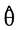)的经典置信区间的数学公式通常非常复杂，甚至是不可能的。想象一下，您不仅需要非常简单的算术平均值的经典置信区间，还需要中位数、10%修整平均值、*休伯平均值*、稳健 MM 回归的回归系数、复杂抽样设计所得数据的基尼方差等等的经典置信区间。你知道它的解析表达式或近似表达式吗？

一般来说，当使用重采样方法时，对估计参数进行推断的过程仍然与算术平均值一样简单。无论在数学上有多复杂，使用重采样方法，统计推断就变得简单了。

研究表明，重采样方法可以用于几乎所有的统计推断问题，而且点估计的性质可以相对容易地从非常复杂的估计量中估计出来。

由于重采样方法通常是计算密集型的，所以重采样方法只是从 20 世纪 80 年代才发展起来，当然，只有在功能强大的计算机上才能成功使用。

至于重采样方法仍然很少作为经典推理方法使用的原因，只能推测。一个原因可能是，许多统计学家往往更注重数学，而且他们中的许多人并不精通编程。

随着数据科学的普及，这种情况发生了变化。无论如何，使用面向数据的重采样方法进行推断非常适合数据科学家。不需要强大的数学和统计技能，但编程技能和计算能力很重要。有了重采样方法，数据科学家就有了非常强大的方法来解决几乎所有与统计不确定性相关的任务。

当然，本书接下来的部分不包括任何方法，但是受到了一些关于 bootstrapping 的书籍的启发(Efron 和 Tibshirani 1993 邵、涂 1995；戴维森和欣克利 1997；切尔尼克 1999；Hjorth 1994 财神 1992；Politis，Romano 和 Wolf 1999 好的 1993；韦斯特福尔和扬 1993)。

# 自举

bootstrap 是表达估计不确定性的最流行的重采样方法；换句话说，估计感兴趣的估计统计量的方差。但是为什么叫自举呢？高筒靴可能在顶部有一个被称为靴带的拉环、环或把手；参见*图 7.1* :


这个靴带可以让我们用手指穿上靴子。但是这个词是更多的同义词。在 19 世纪，习语的“自力更生”已经被当作一个不可能完成的任务的例子:

“据推测，墨菲先生现在能够通过他的靴子带越过坎伯兰河或谷仓院子的栅栏了”(弗里曼 2009)。这就是统计学中的 bootstrap。我们将看到，我们使用一个 bootstrap，仅用我们的 boots(样本数据)进行推断。

在下一节中，我们将通过一个激励性的例子来展示，与解析解相比，我们用 bootstrap 得到了基本相同的结果。然后我们将解释 bootstrap 的基本概念，并回答为什么我们可以用 bootstrap 完成与统计推断相关的不可能任务。之后，我们将使用 r 详细讨论 bootstrap 的实际应用。

在我们开始举这个例子之前，应该重复一下这句名言——它说了很多关于 bootstrap 方法的真理:

|   | 统计学是一门有着惊人的多用途的学科，但却很少有有效的实践者。对于大多数人来说，通往统计知识的传统道路被一道令人生畏的数学之墙挡住了。我们的方法避开了那堵墙。bootstrap 是一种基于计算机的统计推断方法，可以在没有公式的情况下回答许多真实的统计问题。” |   |
|   | -*–布拉德利·埃夫隆* |

## 一个有优势比的激励例子

在关于折叠刀和自举的原著(Efron 和 Tibshirani 1993)中，作者给出了一个有趣的激励例子。因为这个例子很好地展示了一种特殊的重采样方法(bootstrap)的优点，所以我们在这里也用到了它以及我们自己的单词、代码和注释。这个例子应该给出了重采样方法的可靠性，因为获得了与经典(非重采样)方法相同的结果。

1987 年 1 月 27 日,《纽约时报》在头版刊登了一篇题为“服用阿司匹林可降低心脏病发作风险”的文章。这项双盲试验最终得出了下表；另见 Efron 和 Tibshirani (1993 年):

|   | 

心脏病发作

 | 

人数

 |
| --- | --- | --- |
| 阿司匹林 | One hundred and four | Eleven thousand and thirty-seven |
| 安慰剂 | One hundred and eighty-nine | Eleven thousand and thirty-four |

两个成分的比值比如下:

*(104/11037)/(189/11034)= 0.55*

报纸上的标题可能是:*经常服用阿司匹林的人心脏病发作的几率只有不服用阿司匹林的人的 55%*。

作为统计学家，我们想要估计真实的人口参数。当然，我们并不真的只对感兴趣，因为仍然只是对的点估计。如果我们再次进行研究并收集新的数据，我们会得到另一个结果(不同于 0.55)。

我们感兴趣的是 = 0.55(统计推断)的准确性/可变性/不确定性。

但是我们如何计算的置信区间(CI)？

|   | 

心脏病发作

 | 

人数

 |
| --- | --- | --- |
| 阿司匹林 | a | b |
| 安慰剂 | c | d |

赔率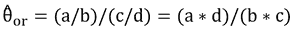。如果我们查看维基百科或文献，我们会发现的 95%置信区间可以通过下式计算:

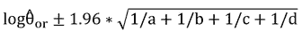 

并且置信区间必须通过使用它们的指数进行反变换。以 95%的概率，我们用这个区间覆盖实际参数:

```r
dat <- matrix(c(104,11037,189,11034),2,2, byrow=TRUE)
dat
##      [,1]  [,2]
## [1,]  104 11037
## [2,]  189 11034
library("vcd")
## confidence intervals
confint(oddsratio(dat, log=FALSE))
##       2.5 %    97.5 %
## / 0.4324132 0.6998549

```

以下问题仍然没有答案:

*   我们如何知道估算 KI 的公式表现良好？在哪里我们可以找到这个公式有效的证明？
*   有更好的可信区间分析估计吗？
*   我们有更简单的方法来确定置信区间吗？

第一个问题可以通过一些文献搜索来回答。原来，估计比值比置信区间的解析表达式是一个近似值。当查看文献时，可以看到有另外 20 种不同的公式用于估计比值比的置信区间；在某些情况下，其他公式会提供更好的结果。如果一个人仔细阅读文献，会花很多时间来开悟，但仍然很难决定采取哪种方式。但是不要担心，因为我们可以回答这个问题“我们有更简单的方法来确定置信区间吗？”。这个问题可以毫不含糊地用“是！”即通过使用重采样方法，连续地使用自举方法。

阿司匹林示例的引导程序可以按如下方式构建:

第一组由 104 个 1 和 11037-104 个 0 组成，第二组由 189 个 1 和 11034-189 个 0 组成。

Bootstrap 样本:我们从第一组中抽取一个大小为 11，037 的替换样本，从第二组中抽取一个大小为 11，034 的替换样本。

引导复制:的引导复制现在是:

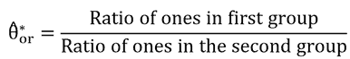

我们重复这个过程(抽取 bootstrap 样本，计算相应的 bootstrap 复制)，比如 10000 次，得到 10000 个 bootstrap 复制。95%的置信区间由 bootstrap 复制分布的 0.025 和 0.975 分位数决定(这个置信区间的动机在后面)。

我们可以使用下面的代码在 R 中实现这一点。注意，通过在 sample 函数中使用参数`prob`可以更有效地实现这个例子；出于教学原因，我们初始化了`TRUE`(心脏病发作)和`FALSE`(没有心脏病发作)的整个向量:

```r
## original surveyed data
s1 <- rep(c(TRUE, FALSE), times = c(104, 11037))
s2 <- rep(c(TRUE, FALSE), times = c(189, 11034))
## function for drawing a bootstrap sample
## and estimating the boostrap replicate
boot_aspirin <- function(s1, s2){
 ## odds ratio
 sum(sample(s1, replace = TRUE)) / sum(sample(s2, replace = TRUE))
}
## 10000 draws and replicates
boot_repl <- replicate(10000, boot_aspirin(s1, s2))
## confidence interval
quantile(boot_repl, c(0.025, 0.975))
##      2.5%     97.5%
## 0.4312796 0.6964336

```

在本例中，bootstrap 的置信区间非常接近之前通过分析方法估计的。使用 bootstrap 对置信区间的估计是基于数据的，没有前提条件(除了选择一个好的随机数的假设)和假设，并且以(几乎)非常直观的方式完成，没有数学。

## 自举的工作原理

在我们详细描述 bootstrap 之前，我们想指出 bootstrap 的哲学概念。理解为什么 bootstrap 是进行统计推断的有效方法是很重要的。相信 bootstrap 而不质疑 bootstrap 哲学原理的读者可以跳过这一节。

这是一个典型的问题(来自[http://stats.stackexchange.com/](http://stats.stackexchange.com/)):

> “我最近用 bootstrapping 来估计一个项目的置信区间。最近有个不太懂统计学的人让我解释一下为什么 bootstrapping 会起作用，也就是说，为什么一遍又一遍地对同一个样本进行重采样会得到好的结果。我意识到，虽然我花了很多时间了解如何使用它，但我并不真正理解为什么自举会起作用。”

请注意，是随机变量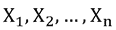的函数，因此具有概率分布、由 n 确定的采样分布和分布函数 f。在下文中，我们立即进入经验案例，我们考虑经验样本 **x** 。对于，其值由观测向量形成。x 应该作为总体中的样本。

你想问一个群体的问题，但是你不能，因为你不知道整个群体。因此，你取一个样本，问它的问题。这个想法就是，我们只有一个向量 **x** 。注意，为了简单起见，我们只处理值的向量，但是对于多维数据集 **X** 来说，一切都是正确的。当我们从这个经验数据集中估计一个人口参数(一个统计量)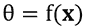时，我们通常对这个估计的不确定性(可变性)没有任何线索。但是我们知道一定存在不确定性，因为从理论上讲，如果我们根据经验进行另一个第二样本数据集，比如说来自同一人群的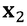，得到的估计值将不同于。换句话说，你有多大把握样本答案接近总体？

基本上有四种方法来回答这个问题，但并不是所有的方法在实践中都是可行的。出于教学的原因，我们根据企业中经常发生的情况指出了所有四种方法。想象一下与大老板、副大老板、会计专家、数学方法部门老板和数据科学家的会议:

*   Get information about all (**Big** **Boss** approach):

    不幸的是，大老板对统计学一窍不通；他红着脸，用拳头敲着桌子，因为他对的可变性不能轻易表达感到愤怒。他大喊:*那我们就来全人口！*在人口数量有限的情况下(比如社会经济人口)，会计人员当然不能为他提供可变性的估计，但他会向“大老板”提供收集整个人口的必要信息所需的数百万美元的估计。(对于无限的人口，成本将是无限的。)大老板承认他自己的想法并不是最好的，他围着桌子从他的*奴隶*那里寻找解决方案。

*   Get information repeatedly (**Big Boss 2** approach):

    大老板的建议失败了，但是第二个大老板觉得他是下一个表达自己绝妙想法的人。自信满满的他脸上带着高人一等的微笑说道:*那我们就进行一个以上的数据集，重复调查，进行几个数据集！然后我们可以评估我们的估计和报告，如果我们可以信任它！*

    让我们进一步评论这些建议。如果您不知道总体，了解总体估计的不确定性的一种方法是一次又一次地从总体中取样。对于每个样本，我们将应用相同的估计量来获得每个样本的感兴趣的统计量。然后，我们会看到样本答案的可变性。

    第二个大老板的笑容凝固在他的脸上，当会计再次声称，如果调查 k 个数据集，成本(几乎)会高出 k 倍。这种方法也是不可见的，因此每个人都看着数学家——他们认为数学家是他们最后的希望。所以，即使他们知道他们不会再理解这位肯定是天才的数学家，每个人都抱着充满期待的目光看着这位数学家接受任何解答:

    
*   (Mathematician approach):

    数学家说:*假设你决定做一些假设，比如，你要估计的统计量近似正态，或者，比如说，t 分布。借助一些数学知识，您可能能够计算出感兴趣的参数的置信区间。*老板们对这些假设感到不舒服，但是他们认为一个数学家肯定知道如何去得到一个解决方案。他们只是很高兴得到一个解决方案，因为数学家说他可能能够表达这个复杂的估计量的可变性。然而，数学家回答道:*研究和开发需要五个人月，而我目前没有足够的资源。我们必须立即雇用一名额外的数学家。*当然，会计小伙子已经在摇头拒绝增聘员工的想法，因为这在今年的预算中还没有考虑到。老板们瘫坐在椅子上，声音低沉，大老板说他们应该成立一个特别工作组，每周就这个问题开一次会。因此，他没有希望找到解决办法。由于感到真正的无助和没有远见，他只想结束这次会议，但是...

*   A job for the computer (**Data Scientist** approach):

    ...但是数据科学家清了清嗓子，举起了手，打断了会议的结束。他说:*我可以在几秒钟内为您提供您喜欢的任何估算的解决方案。*大老板扬起眉毛，第二个大老板无聊地看着数据科学家，因为在他眼里，这个年轻的数据科学家是个菜鸟，不知道任何现实。会计从来不信任 IT 人员，而数学家对数据科学家一脸同情，因为他——数学家——认为他是唯一严肃的人。数据科学家说:*想象你不满足于假设数学家想要假设的感兴趣参数的分布。剩下的选择是使用样本中的信息，来自你仅有的样本。正如第二位大老板事先建议的那样，另一种方法是从人群中抽取新的样本，从你仅有的样本中反复抽取样本。“替换”采样现在只是一种方便的方法，可以像对待总体一样对待样本，并以反映其形状的方式进行采样。你同意我说的这是合理的吗？你收集的基本样本是你所能得到的关于人口实际情况的最佳信息。你肯定同意我的观点，如果随机选择，大多数样本看起来很像他们来自的人群。因此，很可能您的样本也是如此。让我们从底层样本中抽取大量数据集，并计算每个数据集的相关统计数据。因此，我们得到了统计分布。这种分布表达了我们估计的可变性。就让计算机替我们做这项工作吧。*

    无语，大佬们还没闭上张开的嘴。他们很乐意得到一个快速而廉价的高质量解决方案。

    从现在开始，的老板们定期向数据科学家咨询，寻找数据分析问题的解决方案。数据科学家成为了英雄，他的组织如此需要他，以至于老板们依赖于他的工作(现在谁是*的奴隶*？).

## 仔细查看引导程序

其基础是从概率分布 F 中抽取一个大小为 n 的随机样本；每个抽取的元素以 1/n 的概率包含在样本中。换句话说，随机样本由从总体中抽取的 (i.i.d .)和值给出。

是概率分布为 F(X)的随机变量(in ),则经验概率函数对于由下式定义的实现

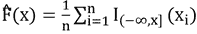

，其中 I 是指示函数。

确实如此(格利文科-坎特利定理，1933 年)


。换句话说，bootstrap 样本的分布几乎必然收敛于实际的概率分布。这是因为:

*   事实上，对于 bootstrap 样本，观察值的选择概率仍然是 1/N
*   (强)大数定律
*   中心极限定理——自助样本模拟总体

bootstrap 样本的大小通常为 n，与样本大小相同。一个问题可能是:*为什么不采取大小为* 的 bootstrap 样本？答案很简单。大多数统计/估计取决于样本大小。当 m < n 时，bootstrap 分布可能具有更大的分布，而当 m > n 时，可能具有更小的分布，这将导致估计方差过拟合或欠拟合。

bootstrap 样本几乎必然收敛于实际概率分布的充分证明，用了许多测度论的知识，花了好几页；参见邵和涂(1995)。我们不会重复这样的证明，而是使用本书中证明的证据:我们已经信任已证明的定理，并专注于更实用的东西。

## 插件原理

bootstrap 基于插件原理，也就是说，如果某个东西是未知的，那么用一个估计值来代替它。这一原则是统计学中常见的方法。例如，在[第 4 章](ch04.xhtml "Chapter 4. Simulation of Random Numbers")、*随机数模拟*中，我们已经为置信区间的估计插入了经验标准偏差，因为我们不知道真实的方差，但是方差在置信区间的公式中注明了。借助 bootstrap，我们更进一步。我们不是插入单个参数的估计值，而是插入整个分布的估计值(Hesterberg 2015)。

在插入原则下,的意思无非是我们用经验分布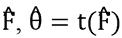的分布函数代替。注意:通常需要编写参数


直接作为而不是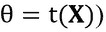的分布函数。据推测


可以通过函数 t(F)来计算。在下一节中，自举用于估计标准误差和偏差，这里正好利用了这个插件原理。


# 用 bootstrapping 估计标准误差

在下文中，我们也通过动手实践来详细讨论 bootstrap。在重点讨论标准误差的估计之前，我们将更详细地重复一些定义。

让我们考虑下面的玩具例子，它有以下七个数字。我们使用这样一个小样本和玩具示例只是为了解释 r 中的 bootstrap。在我们的示例中，感兴趣的估计量应该是算术平均值:

```r
x <- c(5, 7, 8, 2, 15, 12, 3)

```

我们接下来定义引导样本。一个**自举样本**是**随机样本**


**与样品中的替换**。一个**自举样本**由下式给出:

```r
## for reproducibility we use a seed
set.seed (123)
## bootstrap sample (with replacement)
s1 <- sample(x, replace = TRUE)
s1
## [1]  8 12  8  3  3  5  2

```

我们看到这个 bootstrap 样本不包括 7 和 15，而是 3 和 8 的两倍。这种情况可能发生，因为我们使用替换进行采样，这意味着如果我们抽取一个数字，它将被替换，以便下一次抽取再次从 *c(5，7，8，2，15，12，3)* 开始。

当然，我们可以重复以获得另一个引导样本，该样本很有可能与之前的引导样本不同:

```r
s2 <- sample(x, replace = TRUE)
s2
## [1]  3  2  2  3  2 15 15

```

我们玩具样本的算术平均值是:

```r
mean(x)
## [1] 7.428571

```

的**引导复制**用表示。示例性地，当 t( **x** )的算术平均值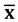时，自举复制

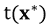

是引导样本的算术平均值。

对于抽取的自举样本，算术平均值(= **自举复本**)如下:

```r
mean(s1)
## [1] 5.857143
mean(s2)
## [1] 6

```

我们来取一个更大的样本，比如 R 包`car`的`Prestige`数据。一个变量与收入有关。同样，让我们取一个 bootstrap 样本，并估计 bootstrap 复制。

但是首先，看看样本中感兴趣的统计数据。让我们假设感兴趣的统计量是算术平均值:

```r
library("car")
data("Prestige")
mean(Prestige$income)
## [1] 6797.902

```

算术平均值的自举复制为:

```r
set.seed(123)
mean(sample(Prestige$income, replace = TRUE))
## [1] 6393.882

```

另一种方法是重复前面的代码行(没有`seed`):

```r
mean(sample(Prestige$income, replace = TRUE))
## [1] 6662.529

```

现在关键的事情是如何表达我们感兴趣的统计数据的可变性。在讨论置信区间之前，我们先讨论如何估计估计量的标准误差。估计估计参数的标准误差的自举算法如下:

1.  选择 x 的独立引导样本。
2.  计算每个自举样本的自举复制:
3.  估计重复标准偏差的标准误差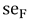。
4.  同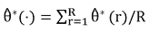。
5.  以下适用:。

Efron 和 Tibshirani (1993)给出了 bootstrap 原始定义中的非参数 bootstrap 的示例。我们想更进一步，展示估计标准误差的自举，如图*图 7.2* 所示:

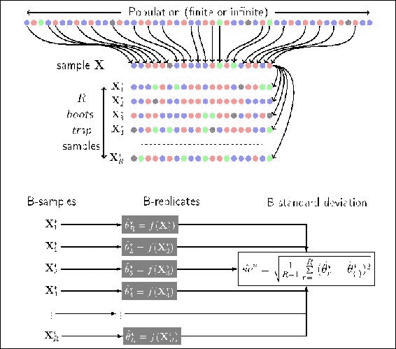

图 7.2:根据 Efron 的原始定义，使用 Bootstrap 算法来估计统计数据的标准误差。参数 R 表示自举复制的次数

在*图 7.2* 的顶部，我们看到一个整体。这个总体是未知的，但是我们从中抽取了一个样本，比如大小为 n 的 **x** 。从这个样本中，我们抽取带有替换的 bootstrap 样本。总之，我们抽取 n 个大小的 bootstrap 样本。从这些自举样本，估计自举复制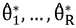。我们获得了引导复制的分布。根据自举复制，可以估计标准误差。

为了获得稳定和良好的结果，需要一定数量的引导复制。一般来说，这个过程总是取决于问题和数据的分布。基本上，我们通常仅用 25 次引导复制就能获得稳定的结果(当重新运行引导时，获得相同的结果)，50 次复制给出非常稳定的标准误差结果。通常选择 100 个重复；超过 200 次复制几乎不会带来更多的利润。例如，我们如何检查 R = 50 次重复是否足以估计标准误差？只需在 R = 50 的情况下运行几次 bootstrap，并评估结果变化有多大。如果变化相对较大，请增加重复次数。

一般来说，当对其他估计感兴趣时，例如置信区间或基于模型的结果，需要更多的重复。为了估计置信区间，5000 次以上的重复是有用的。我们可以在“通过 bootstrap 得出的置信区间”一节中看到这一点。

## 使用 bootstrap 进行复杂估计的示例

通常很难用分析的方式来表达标准误差，即使是简单的估计。我们将展示一个(稳健的)相关系数的标准误差的例子。稳健的相关性度量可以通过**最小协方差行列式** ( **MCD** )算法(Rousseeuw 和 Driessen 1998)实现。这是一个相当复杂的估计量，使用公式来估计标准误差是一个巨大的挑战。我们将看到，通过使用 bootstrap，这与估计算术平均值的标准误差一样简单。

在 R 中，基于 MCD 的相关性可以计算如下。为简单起见，我们仅估计`income`和`prestige`之间的稳健相关性:

```r
library("robustbase")
## data
df <- Prestige[, c("income", "prestige")]
## robust MCD-based covariance
covMcd(df, cor=TRUE)$cor
##             income  prestige
## income   1.0000000 0.8240127
## prestige 0.8240127 1.0000000

```

可以提出以下合理的问题:如何估计相关系数的标准误差？出现了一些进一步的问题:

*   你知道如何分析估计经典相关系数(皮尔逊)的标准误差吗？如果是，你知道相关系数 If 的标准误差的公式吗...
*   数据不符合多元正态分布？
*   你能提供一个合适的分析近似值吗？
*   你能为这个例子计算它吗？
*   基于 MCD 的相关系数你知道吗？

答案可能如下:

*   是的，在谷歌或者一本好书里搜索的时候。
*   不，我想只有正态分布数据的估计值。
*   没有，但据推测这已经被其他人处理过了。
*   是啊！使用 bootstrap 相当容易！

那就动手吧。我们使用`sample()`对`Prestige`数据进行采样(替换),并使用函数`covMcd`估计基于 MCD 的相关性。我们重复 200 次，并估计标准误差:

```r
set.seed(1234) ## for reproducibility (seed)
## standard error with bootstrap
sd(replicate(200,
 covMcd(df[sample(rownames(df),  replace=TRUE), ],
 cor=TRUE)$cor[1,2]))
## [1] 0.09270074

```

在 R 中，我们也可以利用函数`boot`。我们看到，对于标准误差，我们得到了非常相似的结果。`boot`函数的基本概念是表达如何抽取引导样本。这是通过编写一个自己的函数来实现的，该函数带有一个关于数据的函数参数和另一个关于应替换采样的索引的函数参数:

```r
library("boot")
## function for bootstrapping in boot
cr <- function(d, w) covMcd(d[w, ], cor=TRUE)$cor[1,2]
## application of the boot function
boot(data=df, statistic=cr, R=200)
##
## ORDINARY NONPARAMETRIC BOOTSTRAP
##
##
## Call:
## boot(data = df, statistic = cr, R = 200)
##
##
## Bootstrap Statistics :
##      original       bias    std. error
## t1* 0.8240127 -0.001434576    0.088415

```


# 参数自举

一般来说，当我们有一个适当指定的模型时，从该模型进行模拟通常会提供可靠的估计，即使重复次数比非参数 bootstrap 少。然而，如果参数模型是错误指定的，则解会收敛到错误的分布。因此，当使用参数 bootstrap 时，这些假设必须成立。

我们想展示一个参数 bootstrap 的应用来展示这种方法的性质。假设我们有信息允许我们得出这样的结论:数据集`Prestige`(包`car`)中的两个变量`income`和`prestige`来自二元正态分布——这是这里假设的模型。我们现在从经验数据中估计平均值和协方差，并从理论正态分布中提取经验数据的相应参数值:

```r
## MASS needed for drawing random numbers from multivariate normal
library("MASS")
## parameters from empirical data (income and prestige)
m1 <- colMeans(df)
m2 <- cov(df)
## number of observations
n <- dim(df)[1]
## parametric bootstrap
parboot <- replicate(200,  covMcd(mvrnorm(n, mu=m1, Sigma=m2), cor=TRUE)$cor[1,2])
## standard error
sd(parboot)
## [1] 0.08318432

```

如果我们还希望将计算速度与非参数自举的计算时间进行比较，我们可以增加重复次数，并使用经典的相关性估计:

```r
## parametric bootstrap
system.time(sd(replicate(5000,
 cor(mvrnorm(n, mu=m1, Sigma=m2))[1,2])))
##    user  system elapsed
##   0.663   0.017   0.681
## non-parametric bootstrap
system.time(sd(replicate(5000,
 cor(df[sample(rownames(df),  replace=TRUE), ])[1,2])))
##    user  system elapsed
##   0.925   0.020   0.945

```

我们看到，在这个例子中，参数化和非参数化自举的计算时间没有太大差别。然而，在文献中，经常说的是差异是关于结果的稳定性；换句话说，经常提到的是，如果很好地指定，参数自举为较小样本量的标准误差提供了稳定的结果。然而，这在一般情况下一定是不成立的，基本上这甚至在我们的例子中也不成立。我们将标准误差的估计重复 20 次，每次 R = 50,然后查看结果的范围:

```r
## parametric bootstrap
range(replicate(20, sd(replicate(50,
 cor(mvrnorm(n, mu=m1, Sigma=m2))[1,2]))))
## [1] 0.04194079 0.06062707
## non-parametric bootstrap
range(replicate(20, sd(replicate(50,
 cor(df[sample(rownames(df),  replace=TRUE), ])[1,2]))))
## [1] 0.03479239 0.05161005

```

我们看到标准误差略有不同。

最后，让我们比较一下非参数和参数 bootstrap 的结果。我们抽取了 1000 个引导样本:

```r
## parametric bootstrap
pboot <-replicate(1000,
 cor(mvrnorm(n, mu=m1, Sigma=m2))[1,2])
## non-parametric bootstrap
npboot <- replicate(1000,
 cor(df[sample(rownames(df),
 replace=TRUE), ])[1,2])
mi <- min(pboot, npboot)
ma <- max(pboot, npboot)

```

这些差异可以直观地显示出来，例如，自举复制的分布直方图。现在我们绘制*图 7.3* :

```r
par(mfrow=c(1,2), pty="s")
hist(npboot, 
 main="non-parametric",
 xlab="1000 bootstrap replicates",
 xlim=c(mi,ma), breaks = 25)
hist(pboot, 
 main="parametric",
 xlab="1000 bootstap replicates",
 xlim=c(mi,ma), breaks = 25)

```

从前面的代码生成的*图 7.3* 中可以看到这种比较。结果非常相似在这种情况下:


图 7.3:非参数和参数 bootstrap 的 bootstrap 复制分布的比较

从*图 7.3* 中，我们可以看到，在我们的示例中，参数化和非参数化自举的自举副本的分布没有太大的不同。


# 用 bootstrap 估计偏倚

以前，标准误差被用来衡量估计值的准确性。我们现在想看看偏差，估计量和待估计参数的差异——我们想看看估计量的系统失真。

数据中出现偏差的原因可能非常不同:寄存器中的系统误差、糟糕的抽样设计、未报告的高收入者、异常值、复杂抽样设计中抽样平均值或总数的稳健估计，等等。

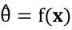的偏倚是与总体实际参数的偏差，即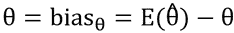。由于通常是未知的，偏差通常只能用重采样来表示。在下文中，我们只关注这种数学偏差，而不考虑任何其他种类的偏差(例如来自数据收集的系统偏差)。

对于偏倚的估计，绘制独立的自举样本，参见 Efron 和 Tibshirani (1993)，并估计自举复制。


。在自举复制的帮助下近似计算，通过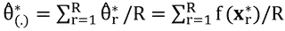，t(F)通过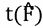。

偏差的自举估计基于自举复制:

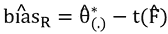

我们再次使用`Prestige`数据并选择变量`income`。总体的待估计参数为变异系数，为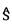为估计标准差，为算术平均值。这可以在 R 中完成，如下所示:

```r
x <- Prestige[, "income"]
v <- function(x) sd(x) / mean(x)
v(x)
## [1] 0.624593

```

1，000 个 bootstrap 样本很容易抽取，bootstrap 复制也很容易计算:

```r
vboot <- replicate(1000, v(sample(x, replace = TRUE)))

```

然后通过自举复制估计值和样本估计值的平均值给出偏差:

```r
vbias <- mean(vboot) - v(x)
vbias
## [1] -0.01215573

```

偏差校正估计量由下式给出:

```r
v(x) - vbias
## [1] 0.6367488

```

### Tip

仅仅意识到一个统计数据是有偏差的，可能会帮助你更恰当地继续下去。

## 通过 bootstrap 的置信区间

置信区间是一种非常有用的表达不确定性区间的方式，已经在[第 6 章](ch06.xhtml "Chapter 6. Probability Theory Shown by Simulation")、*模拟展示的概率理论*中广泛讨论过。以经典方式估计复杂估计量的置信区间并不总是可见和容易的，但和以前一样，使用 bootstrap 会容易得多。

估计置信区间最简单的方法是通过 bootstrap 在置信区间的解析公式中插入标准误差的估计值。但是我们会发现这不是最好的主意。

已经在 [第六章](ch06.xhtml "Chapter 6. Probability Theory Shown by Simulation")，*模拟显示的概率论*算术平均值或总体估计量的置信区间的经典估计是。

现在对于，然后，使用自举标准误差。

对于前面的例子，可以如下确定这个置信区间:

```r
cat("CI(e): [", v(x) - vbias - qt(0.975, length(x)-1) * sd(vboot), ", ", v(x) - vbias + qt(0.975, length(x)-1) * sd(vboot), " ]\n")
## CI(e): [ 0.5059086 ,  0.7675889  ]

```

然而，除了偏差修正，这些置信区间总是对称的。然而，bootstrap 的一大优势是区间可能是不对称的。例如，考虑一个比率估计量，例如，一个小政党的选票与选举中所有选票的比率，假设这个政党拥有 1.5%的选票。对于经典方法以及这种利用自举来估计置信区间的方法，对称置信区间的左侧很可能是负的。反对票！实际上不可能。因此，我们采用了一种更可靠的方法。

特别是如果估计量的 bootstrap 分布是对称的，那么通常使用百分位数置信区间。Efron 的 bootstrap 置信区间百分位数法是最常用的方法，当 bootstrap 重复数较大时，它具有良好的性质。

相反，标准误差的经典估计被通过自举获得的估计代替，使用自举分布的较低和较高百分位。

Efron 使用 bootstrap 得出的百分位数置信区间的方法为:


例如，如果我们选择 R = 1000，对于显著性水平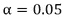，百分位数置信区间由 1000 个排序的 bootstrap 重复的第 25 个和第 975 个值决定，即。

对于我们的例子，这个置信区间确定如下:

```r
cat("CI(p): [", quantile(vboot, 0.025), ", ", quantile(vboot, 0.975), " ]\n")
## CI(p): [ 0.4816879 ,  0.7349403  ]

```

这种方法有多种变体，如 Hall 的置信区间方法:

```r
cat("CI(h): [", 2*v(x) - quantile(vboot, 0.975), ", ", 2*v(x) - quantile(vboot, 0.025), " ]\n")
## CI(h): [ 0.5142458 ,  0.7674982  ]

```

bootstrap **偏差** **修正α**(**BCa**)置信区间法(Efron 1987)利用了另一种偏差估计，即 bootstrap 分布的分数< 。

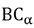方法的置信区间也基于百分位数。这些百分点取决于两个数字，加速度*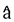和偏差修正*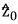。置信区间由下式给出:**

****

**使用:**

****

**表示标准正态分布的累积分布函数，是标准正态分布的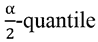。如果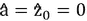，那么方法等于百分位数方法。**

**的确定:**

**偏差校正的值**

****

**是 bootstrap 重复的次数，小于的(经典)估计值，即，即:**

**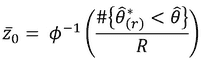**

**的确定:**

**确定的最简单方法是通过咨询重叠估算值*重叠值*(该方法的细节可在下面的*重叠*部分找到)。设为没有 th 值的原始样本，设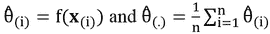。然后*加速度*可以确定如下:**

**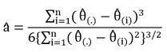**

**这种方法的缺点是通常需要大量的复制(最少。1,000).**

**接下来，让我们将百分位数法的置信区间与法的置信区间进行比较，然后基于一些模拟玩具数据将其与所有提及的方法进行比较:**

```r
****## some crazy data (10 outliers)**
**x <- c(rnorm(100), rnorm(10,10))**
**## non-parametric bootstrap replicates**
**mb <- replicate(10000, mean(sample(x, replace=TRUE)))**
**## percentile method**
**cat("\nCI(perc): [", quantile(mb, 0.025), ", ", quantile(mb, 0.975), " ]\n")**
**##** 
**## CI(perc): [ 0.4515313 ,  1.568372  ]**
**## BCa method**
**library("bootstrap")**
**b <- bcanon(x, 10000, mean, alpha=c(0.025,0.975))**
**cat("\nCI(BCa): [", b$confpoints[1,2], ", ", b$confpoints[2,2], " ]\n")**
**##**
**## CI(BCa): [ 0.5125295 ,  1.659545  ]**** 
```

**我们通过在图形中绘制置信区间来比较所有提到的方法；参见*图 7.4* :**

**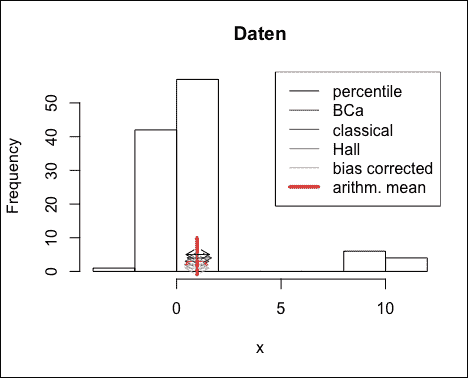

图 7.4:置信区间的比较** 

**在*图 7.4* 中看到数据的整体分布很好，但我们需要更仔细地观察置信区间的箭头区域。在*图 7.5* 中，我们展示了这个缩放区域:**

**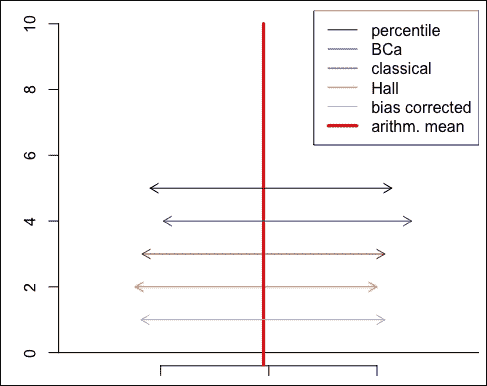

图 7.5:置信区间对比-缩放区域** 

**我们注意到，即使在有巨大异常值的极端例子中，差异也并不显著。对于其他分布也是如此，但这可能取决于感兴趣的参数、样本大小以及引导程序复制的数量。在前面的示例中，非平滑估计值作为算术平均值通常更成问题，特别是对于我们在下一节介绍的重采样方法——*重叠法*。**

**

# 折叠刀

折叠刀和引导一样，是一种重采样方法。刀切法可以用来确定估计量的偏差和标准误差。它比 bootstrap 更简单、更快，因为我们不绘制新的(bootstrap)样本，而是从原始样本中删除一个值(对于每个刀切样本)。我们只是排除一个观察值进行估计。

刀切法最初是由 Quenouille (1949)提出的。大约一个世纪后，John Tukey (1958)扩展了该方法的使用，展示了如何使用它来减少偏差和估计方差。他发明了“折叠刀”这个名字。像小刀一样，这种技术可以作为一种易于使用和快速计算的“快速和肮脏”工具，可以解决各种问题。虽然折叠刀在过去因其简单和快速计算而非常流行，但它通常比 bootstrap 的质量低，并且只应在罕见的特定情况下使用。

设是基于给定样本的总体参数的估计量。经典刀切法的标准程序是用 n–1 个观测值而不是 n 来估计感兴趣的参数。

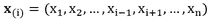

表示第个**刀切样本**。没有来自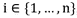的观测，即第 I 个刀切样本正是没有第 I 个观测的给定数据。

的第 I 个**刀切复制**由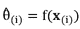给出。

通过重叠计算的估计偏差由和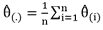给出。

估算的刀切标准误差由给出。

因子是所谓的*膨胀因子*，这是需要的，因为从刀切产生的欧几里德距离小于 bootstrap 的情况，也就是说，典型的刀切样本更类似于作为典型 bootstrap 样本的原始样本。通货膨胀系数的精确形式是由特殊情况下的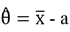一致性估计值确定的。

所谓的*伪值*是作为整个样本估计和部分估计之间的差而计算的。这种伪值减少了部分估计的偏差。然后使用伪值代替原始值来估计感兴趣的参数，并且使用它们的标准偏差来估计参数标准误差。假设伪值允许我们将估计值写成 n 个“独立”数据值的平均值。然而，在实际应用中，情况往往并非如此。预计，一般来说，伪值不是独立的。

刀切伪值由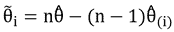给出。

使用刀切伪值估算的标准误差由下式给出:


这对应于算术平均值方差的常用公式，因此我们在分母中增加了一个 n。

指定置信区间的可能性是: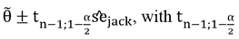也作(n–1)自由度分布的分位数。然而，再次注意，伪值在实践中很少使用。在下文中，我们显示了使用折叠伪值的经典折叠和折叠的结果。

对于 bootstrap 一节中的最后一个例子，我们现在使用 r 中的刀切进行估计。我们使用一个只有几个数字的玩具数据集。有了这个数据集，我们显示了重叠的问题，特别是当我们估计非平滑统计，如中位数。在我们回到变异系数之前:

```r
## toy data
x <- c(1,2,2,2,2,2,7,8,9,10)
## remember, this is the variation coefficient
v <- function(x) sd(x)/mean(x)
## initialisation
n <- length(x)
vjack <- rep(0, n-1)
vpseudo <- rep(0, n)
## leave-one-out jackknife
for(i in 1:n){
 vjack[i] <- v(x[-i])
}
## jackknife pseudo values
pseudo <- n * v(x) - (n-1)*vjack
## confidence interval with pseudo values
cat("\nKI(pseudo): [", mean(pseudo) - qt(0.975, n-1) * sd(pseudo)/n, ", ", mean(pseudo) + qt(0.975, n-1) * sd(pseudo)/n, " ]\n")
##
## KI(pseudo): [ 0.6639477 ,  0.8618599  ]
## confidence interval with classical jackknife
se2 <- sqrt(((n-1)/n) * sum((vjack - mean(vjack))^2))
jbias <- (n-1) * (mean(vjack) - v(x))
cat("\nKI(jse): [", v(x) - jbias - qt(0.975, n-1) * se2 , ", ", v(x) - jbias + qt(0.975, n-1) * se2, " ]\n") 
##
## KI(jse): [ 0.4499772 ,  1.07583  ]

```

从这个例子中，我们看到我们可能低估了置信区间，特别是通过使用刀切伪值，因为我们的样本非常小，自然地，置信区间应该更大。作为比较，我们展示了导致更宽置信区间的引导结果:

```r
quantile(replicate(10000, v(sample(x, replace = TRUE))), c(0.025, 0.975))
##      2.5%     97.5%
## 0.4977611 0.9860133

```

## 折叠刀的缺点

这种折叠法(稍后我们将看到另一种折叠法)是一种非常简单的程序，通常可以获得良好的近似值，例如，偏差和标准误差。然而，刀切通常不收敛到真正的标准误差，特别是对于非光滑估计。我们在下面给出一个极端的例子，看看折叠刀是如何低估参数的变化的。我们使用与之前相同的玩具数据集，但我们估算的不是变异系数，而是一个非平滑估计量，如中位数:

```r
## sample estimate
median(x)
## [1] 2
## non-parametric bootstrap
qu <- quantile(replicate(10000,
 median(sample(x, replace = TRUE))),
 c(0.025, 0.975))
cat("\nCI(boot): [", qu[1], ", ", qu[2], " ]\n")
##
## CI(boot): [ 2 ,  8  ]
## jackknife, initialisation
n <- length(x)
jack <- rep(0, n-1)
pseudo <- rep(0, n)
for(i in 1:n){
 jack[i] <- median(x[-i])
}
## jackknife pseudo values approach
pseudo <- n * median(x) - (n-1)*jack
cat("\nCI(pseudo): [", mean(pseudo) - qt(0.975, n-1) * sd(pseudo)/n, ", ", mean(pseudo) + qt(0.975, n-1) * sd(pseudo)/n, " ]\n")
##
## CI(pseudo): [ 2 ,  2  ]
## classical jackknife
se2 <- sqrt(((n-1)/n) * sum((jack - mean(jack))^2))
jbias <- (n-1) * (mean(jack) - median(x))
cat("\nCI(jse): [", median(x) - jbias - qt(0.975, n-1) * se2 , ", ", median(x) - jbias - qt(0.975, n-1) * se2, " ]\n")
##
## CI(jse): [ 2 ,  2  ]

```

我们看到重叠完全低估了置信区间:它的长度为零！使用的玩具数据集有太多的 2，所以当省略一个值时，中值仍然是`2`。因此，折叠法估计的置信区间长度必须为零，因为所有折叠法重复的值都是`2`。当然，这是一个极端的例子，但是这个例子应该表明在实践中使用折叠刀时你应该小心。特别是对于非平滑估计量，重叠可能会低估估计量的可变性。

## 删除 3d 折叠刀

经典的重叠法，如之前介绍的，可以改进，特别是在估计非平滑统计时。原则*一次漏掉一个*由漏掉 d 个观察值代替，其中(r 为整数)。使用删除-d 折叠刀的标准误差的公式是，使用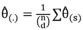和大小为 n–d 的所有子集 s 的总和，从中提取，没有替换。通常 d 在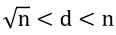中被选为整数值。

然而，删除-d 重叠法的缺点是，我们现在不得不计算留一估计，而不是计算 *n* 留一估计——这是一个大得多的数字，通常在计算上是不可行的。

让我们用 delete-2 折叠刀来展示这一点。目标是创建一个组合的矩阵，在我们的例子中是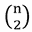，并对其应用删除-d 折叠。同样，我们想要估计上一个示例中的中值:

```r
## all combinations
co <- combn(10, 2)
## first 6 out of 45
co[, 1:6]
##      [,1] [,2] [,3] [,4] [,5] [,6]
## [1,]    1    1    1    1    1    1
## [2,]    2    3    4    5    6    7
## delete-2 jackknife replicates
jack_d <- apply(co, 2, function(i) median(x[-i]))
## standard error
n <- length(x)
r <- 2 / n
## n over 2
nd <- choose(n, 2)
## inflation factor
fac <- r / nd
m <- mean(jack_d)
## standard error
se_d <- sqrt(fac * sum((jack_d - m)^2))
## confidence interval:
cat("\nKI(jse): [", median(x)  - qt(0.975, n-1) * se_d , ", ", median(x)  + qt(0.975, n-1) * se_d, " ]\n") 
##
## KI(jse): [ 0.8077385 ,  3.192262  ]

```

删除-2 重叠法的置信区间似乎是合理的。然而，一般来说，删除-d 重叠法不是一种有效的方法。我们在一个非常小的数据集中进行了调查。例如，个可能的组合是一个有 45 个观察值的稍大数据集的样本，并且 *d* 等于 10，我们将得到以下重叠样本数:

```r
choose(45, 10)
## [1] 3190187286

```

你可以想象这个数字会随着更大的样本而增加。因此，最好应用引导程序，而不是删除-d 折叠刀。

## 引导后折叠

本节解释了如何估计通过 bootstrap 获得的标准误差的可变性。换句话说，我们已经使用 bootstrap 估计了可变性(例如，标准误差)，但是现在我们感兴趣的是我们估计的可变性的不确定性。让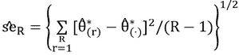，与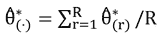再次是我们的标准误差估计自举。

我们现在感兴趣的是不确定性作为对的估计表达出来。

bootstrap 方法后的**刀切法是一种估计标准误差 se( 的方差的方法，或者一般来说，是一种置信区间估计的不确定性的方法。要做到这一点，可以进行另一个 bootstrap，但这意味着 R= 1，000 来估计感兴趣的点估计量的方差，而另外 1，000 次复制来估计方差估计量的方差会导致 bootstrap 复制。相当大的一个号。**

但是有一个技巧可以大大减少这个数字，那就是以特殊的方式在引导之后使用折叠。基本上，我们会看到，只有自举样本的信息被使用。

标准误差的刀切估计基于以下两个步骤:

*   对于，排除第 I 个值，估计。结果是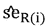。
*   由: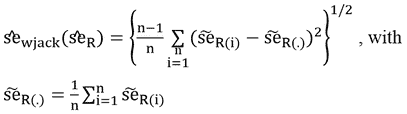决定

剩下要估计的事情就是。如前所述，这种估计对于每个 I 都需要新的自举样本，由于计算量很大，因此使用以下技巧。对于第 I 个值，您很可能会发现一些不包含第 I 个值的 bootstrap 样本。我们借助于那些不包括第 I 个值的 bootstrap 样本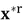的的标准差来估计。让我们将表示为不包括数据点 I 的引导样本的指数。如果您有这样的样本总数，那么


用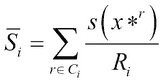。

一般来说，对于的估计，需要 1000 次以上的重复才能彻底检查有用的结果。对于 R < 1000，应该称一下重量。被，那么加权刀切后的 bootstrap 估计量定义如下:


的候选人由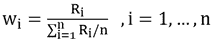给出。

引导绘图后的折叠图，见 Efron (1992)和 Davison 和 Hinkley (1997)，从引导输出对象计算折叠影响值，并在引导绘图后绘制相应的折叠图。它用于确定哪些观察对引导复制分布有很大影响，等等


。

让我们再次用`Prestige`数据的收入作为我们的向量。我们再次将函数 v 表示为变异系数的估计。为了能够使用函数`boot()`，我们写下带有两个参数的函数:

```r
data(Prestige, package = "car")
x <- Prestige$income
v <- function(x, indices){ 
 x <- x[indices]
 est <- sd(x)/mean(x)
 return(est)
}

```

引导后折叠图(*图 7.6* )如下所示:

```r
library("boot")
bx <- boot(x, v, 2000)
## Figure 7.6.
jack.after.boot(bx)

```

从*图 7.6* 中，我们看到观测值 2 和 24 对变异系数的估计有很大的影响:


图 7.6:置信区间对比-缩放区域

这两个观察值——您可以从数据值本身看到——具有迄今为止最大的重叠值。水平线表示自举分布的，以原始数据的值为中心。连接到这些线的点表示没有相应观测值的估计(使用自举)分位数。可以看出，特别是对于观察值 2 和 24，当不排除 2 和 24 时，自举复制的分位数比估计值小。

一般而言，要提到的是，通过引导后折叠图进行的诊断不能取代通常的诊断，例如异常值诊断。然而，特定值对引导复制分布的影响是显而易见的。此外，这种方法并不附属于检测更差模型的设计。bootstrap 后刀切图仅给出了哪些观察值对方差估计有很大影响的指示。


# 交叉验证

交叉验证也是一种重采样方法，类似于折叠刀。然而，现在的目标不是进行推断统计，而是估计预测误差。

交叉验证主要用于方法的比较或寻找估计模型中参数的最优值。

在下一节中，我们将解释基于回归分析的交叉验证。对于没听说过回归分析的读者，推荐看一本关于回归分析的基础教材。我们只是指出一些非常基本的问题。

## 经典线性回归模型

经典的线性回归模型在其最简单的情况下有一个响应和一个预测值，由和给出。在矩阵符号中，这是


，带有响应 **y** 值的向量，带有观察值和 p + 1 个变量的设计矩阵 **X** (包括截距项的第一列中的一个向量)，大小为 p + 1 的向量和长度为 n 的误差项。为了简单起见，我们只考虑一个预测值，但强调假设和随后的一切都可以公式化并转化为多元回归情况。

使用经典线性回归模型的以下模型假设:

*   **A1** :自变量 **X** 的值为固定(非随机)变量。
*   **A2** :因变量 **y** 的值产生于以下成分是总体的参数。
*   **A3**:为随机变量，具有以下性质:

    *   **A3a**:
    *   **A3b**:
    *   **A3c**:

为了有效的推断，误差项被假设为(近似)正态。

必须根据具体样本的 **n** 观察值来估计总体的未知参数。因此，每个解 **b** 正规方程都是随机观测值的函数 **b** = g(y)。因此，根据经验获得的回归系数 **b** 因样本而异。作为 n 个随机变量 y 的线性组合， **b** = g(y)也是随机变量和 g(y)。是总体参数的估计。基于实际样本回归系数完成该估计。 **b** 因此是估计器的实现。

可以看出，普通最小二乘问题的解，


是最好的线性无偏估计量。的置信区间和预测区间可以通过分析方式或使用 bootstrap 进行估计。

为了*证明*如果模型假设成立，通常会进行残差分析。通过显示残差分布的诊断图，对线性假设、误差项正态分布假设、误差项恒定方差以及误差项独立性假设进行评估。我们不会对此做进一步的详细说明，而是展示交叉验证。

## 交叉验证的基本概念

交叉验证的思想与估计预测误差有关。原则上，一个数据集分为个训练和测试数据。基于训练数据，在测试数据集的基础上估计和评估参数。

理想情况下，训练数据集包含当前数据，测试数据集由新的测量结果确定。通常，由于后勤或成本原因，不进行新的测量。然后，通常将当前数据分为测试数据和训练数据。

交叉验证在 bootstrap 之前很久就已经形成了；然而，这种方法只有在近年来强大的计算机的帮助下才得以盛行。

在一个简单的二维数据集的基础上，根据普通最小二乘回归的问题，交叉验证及其变体解释如下。

起点应该是一个回归模型。*图 7.7* 显示了回归线的三种估计:

```r
set.seed(12345)
## generate some data
x1 <- runif(100, 0, pi)
s <- data.frame(x1 = x1, x2 = rnorm(100, 0, 0.1) + sin(x1))
## plot data points for Figure 7.6
plot(s, xlab = "x", ylab = "y")
## simple model
reg1 <- lm(s[, 2] ~ s[, 1], data = s)
abline(reg1, lwd = 2)
## sinus model
reg2 <- lm(s[, 2] ~ sin(s[, 1]), data = s)
f <- function(x, coef) coef[1] + coef[2] * sin(x)
ss <- seq (-0.02, 3.2, 0.01)
lines(ss, f (ss, coef(reg2)), lty = 2, col = "blue", lwd = 2)
## locally reweighted regression
reg3 <- lowess(x = s[, 1], y = s[, 2], f = 0.1)
lines (reg3, col = "red", lty = 3, lwd = 2)
## legend for Figure 7.6
legend("bottom", col = c("black", "blue", "red"), 
 lty = c(1, 2, 3), lwd = c(2, 2, 2),
 legend = c(expression(y = beta[0] + beta[1]*x), 
 expression(y = beta[0] + sin(x)),
 "loess, 0.1"))

```


图 7.7:来自三个不同模型的回归线

但是*图 7.7* 中的这三条线哪一条代表最佳拟合？当然，使用二维数据集，这可以简单地通过查看*图 7.7* 来选择。然而，如果使用更多的变量来预测 **y** ，那么就不能通过查看数据来评估。这里，必须使用例如交叉验证来评估模型。一般来说，我们感兴趣的是我们能多好地预测数据。

## 经典交叉验证–70/30 方法

作为训练数据，我们使用之前模拟的数据的 70%。这 70%是随机选择的。其余的数据则用作测试数据集。基于训练数据，现在应用所提出的三种方法，并且通过测试数据集来评估这些方法的性能。

让我们来看看我们的玩具数据集:

```r
str(s)
## 'data.frame':    100 obs. of  2 variables:
##  $ x1: num  2.26 2.75 2.39 2.78 1.43 ...
##  $ x2: num  0.715 0.575 0.688 0.385 0.924 ...

```

我们希望随机选择 70%的观察值作为训练数据集:

```r
## index of training data
training_ind <- sample(1:nrow(s), 70)
## index of test data
test_ind <- which(!(1:100 %in% training_ind))

```

该模型现在根据训练数据进行估计；我们可以使用函数`lm`来实现。基本上，是估计的，但是使用所谓的 QR 分解以数值稳定的方式进行:

```r
lm1 <- lm(s[training_ind, 2] ~ s[training_ind, 1], data = s)

```

对于一个简单的 OLS 模型，(这里我代表 70%的数据，比如说)，评估是容易的；我们只需要用通过来估计期望值:

```r
## expected values
f <- function(x) reg1$coef[1] + reg1$coef[2] * x
## prediction error, squared sum of expected and observed test data
error <- sum((f(s[test_ind, 1]) - s[test_ind, 2])^2)
error
## [1] 4.514495

```

经典交叉验证的原理在*图 7.8* 中有直观的解释:


图 7.8:在一个简单的二维数据集上解释的交叉验证。黑点代表训练数据，红色代表测试数据

在*图 7.8* 的左上方，我们看到了训练(黑点)和测试数据(红点)的选择。这种选择是随机进行的。在右上角的图形中，显示了基于训练数据的 OLS 回归结果。我们看到拟合(黑色实线)没有做好。注意，我们只能看到这一点，因为我们是在二维数据的特殊情况下。通过考虑来自测试数据的预期( **y** )值和测试数据的观察( **y** )值之间的平方距离来评估回归拟合。预测误差为经典交叉验证 **4.609** 。对于*图 7.7* 右下方所示的另一个模型，我们看到预测和观察到的测试数据之间的距离要小得多。预测误差为 **0.467** 。因此，第二个模型比第一个模型评估得更好。

当然，测试和训练数据的选择以及评估可以重复例如 1000 次。

然后，模型 2 相对于测试数据的误差平方和分布如下。

这一基本原则——测试和训练数据的选择以及评估——现在已经重复了 1000 次，随机分为训练和测试数据。然后，模型 2(正弦)相对于测试数据的误差平方和分布如下:

```r
f <- function (x) reg2$coef[1] + reg2$coef[2] * sin(x)
error1 <- numeric(1000)
n <- nrow(s)
training_ind <- numeric(1000)
for (i in 1:1000){
 training_ind <- sample(1:n, 70)
 reg2 <- lm(s[training, 2] ~ sin(s[training, 1]), data = s)
 error1[i] <- sum((f(s[-training_ind, 1]) - s[-training_ind, 2])^2)
}
summary (error1)
##    Min. 1st Qu.  Median    Mean 3rd Qu.    Max.
##  0.1927  0.3393  0.3869  0.3883  0.4308  0.5886

```

这种通过分成 70%的训练数据和 30%的测试数据的交叉验证方法的优点主要在于易于使用和相对简单的选择方法。然而，缺点是没有选择大量数据来估计模型(这里是 30%)。具体来说，将这种方法应用于非常小的数据集可能会有问题。

## 留一交叉验证

与刀切相似，拟合阶段省略了一个观察值，并基于省略的观察值评估模型。这个单次观察代表了整个测试数据集，如图*图 7.9* 所示:


图 7.9:在一个简单的二维数据集上解释留一交叉验证。黑点代表训练数据，红色代表测试数据。预测误差的值在图中示出

*图 7.9* 的构造方式与*图 7.8* 类似。测试数据集由一个观测值组成，而不是一个大小为 30%观测值的测试数据集。我们为前 4 个(100 个中的)测试用例展示了它。首先，忽略观测值 1，并根据剩余的 n–1 个观测值估计模型(现在是窦模型)。通过测试数据的预测值和观察到的测试数据之间的平方距离来评估该模型。我们看到，忽略观察值 2 会导致比观察值 1、3 和 4 更大的预测误差。

留一交叉验证的完整算法如下:

1.  从原始数据中选择没有第 n-1 个观察值的数据。
2.  基于 n–1 次观察进行估计。
3.  计算第 I 次观测的预测误差。
4.  对每个都这样做，并报告平均预测误差。

在我们的例子中，这将是我们的简单模型:

```r
n <- nrow(s)
error1 <- numeric(n)
for(i in 1:n){
 reg2 <- lm(x2 ~ x1, data = s[-i, ])
 error1[i] <- sum((f(s[i, 1]) - s[i, 2])^2)
}
mean(error1)
## [1] 0.1247593

```

## k 倍交叉验证

在这里，数据被随机分为 **k** 组。

k-fold 交叉验证的算法可以总结如下:

1.  将数据随机分成 k 组。
2.  从没有第 j 组的原始数据中选择那些观测值，用(训练数据)。
3.  基于这些选定的观测值估计参数，并使用第组测试数据评估预测误差。
4.  对执行第 2-3 点，并计算平均预测误差

作为预测质量(预测误差)的衡量标准，在回归分析的情况下，我们可以采用残差平方和。估计值的算术平均值通常作为模型的预测误差。

-在使用 R 包 cvTools (Alfons 2012)进行回归分析的情况下，最好进行交叉验证。在下面的例子中，我们基本上与上面做的一样，但是使用 5 重交叉验证，此外我们重复 5 重交叉验证 10 次并报告均方误差:

```r
library("cvTools")
fit <- lm(x2 ~ x1, data = s)
# perform cross-validation
cvFit(fit, data = s, y = s$x2, cost = mspe,
 K = 5, R = 10, seed = 1234)
## 5-fold CV results:
##        CV
## 0.1269221

```

cvTools 包可以方便地选择最佳方法。让我们回到数据集`Prestige`，并对其应用一些模型和不同的回归方法:

```r
library("robustbase")
# set up folds for cross-validation
folds <- cvFolds(nrow(coleman), K = 5, R = 10)
## compare LS, MM and LTS regression
## perform cross-validation for an LS regression model
fitLm <- lm(prestige ~ ., data = Prestige)
cvFitLm <- cvLm(fitLm, cost = mspe,
 folds = folds)
fitLm2 <- lm(prestige ~ income:type + education + women, data = Prestige)
cvFitLm2 <- cvLm(fitLm, cost = mspe,
 folds = folds)
## perform cross-validation for an MM regression model
fitLmrob <- lmrob(prestige ~ ., data = Prestige)
cvFitLmrob <- cvLmrob(fitLmrob, cost = mspe,
 folds = folds)
fitLmrob2 <- lmrob(prestige ~ income:type + education + women, data = Prestige)
cvFitLmrob2 <- cvLmrob(fitLmrob, cost = mspe,
 folds = folds)
## Warning in lmrob.S(x, y, control = control, mf = mf): S refinements did not
## converge (to refine.tol=1e-07) in 200 (= k.max) steps
## compare cross-validation results
cvSelect(LS = cvFitLm, LS2 = cvFitLm2,
 MM = cvFitLmrob, MM2 = cvFitLmrob2)
##
## 5-fold CV results:
##   Fit       CV
## 1  LS 48.70221
## 2 LS2 48.70221
## 3  MM 46.74886
## 4 MM2 47.06232
## 
## Best model:
##   CV
## "MM"

```

### 注意

该函数还具有有用的参数以及用于估计预测误差的其他度量。

改变响应变量的标度使得无法比较模型，例如，将模型 *y ~ x1 + x2* 与 *log(y) ~ x1 + x2* 进行比较没有意义，因为不同的响应标度会自动导致不同的预测误差。然而，例如， *log(y) ~ x1 + x2* 与 *log(y) ~ x1:x2 + log(x3)* 的比较是一种有效的方法。


# 总结

在经典统计学中，评估估计的不确定性/可变性的统计推断通常具有挑战性。但当使用重采样方法时，这是不正确的，面向数据的方法做出有效的推断，非常适合数据科学家。

bootstrap 是一种估计估计量方差的通用工具。对非常复杂的统计数据的方差进行估计，就像对简单估计量(如算术平均值)的方差进行估计一样简单。

我们看到另一种流行的重采样方法——刀切法——远不如 bootstrap 法可靠，特别是对于非平滑估计量。然而，折叠刀是一个有用的工具，例如估计 bootstrap 方差估计的方差。

交叉验证与折叠验证非常相似，但其目的不同。通过交叉验证，可以对模型进行比较，并且预测误差处于前台。

特别是 bootstrap 现在——在下一章——应用于实际的更复杂的问题。


# 参考文献

*   阿尔方斯，2012 年。 *CvTools:回归模型的交叉验证工具*。https://CRAN.R-project.org/package=cvTools[。](https://CRAN.R-project.org/package=cvTools)
*   切尔尼克先生，1999 年。*引导方法:实践者指南*。纽约州纽约市:约翰·威利。
*   戴维森 A. C .和 D. V .欣克利。1997.*自助方法及其应用*。剑桥:剑桥大学出版社。
*   埃夫龙，1987 年生。"更好的自举置信区间."*美国统计协会杂志*82:171–85。
*   埃夫龙，B. 1992 年。"引导后刀切标准误差和影响函数(附讨论)."皇家统计学会杂志 B54:83–127。
*   埃夫隆，b .和 R. J .蒂布拉尼。1993.*自举简介*。纽约州纽约市:查普曼&音乐厅。
*   弗里曼，J. 2009 年。"靴带和芒奇豪森男爵"[Boston.com](http://Boston.com)。
*   很好，第 1993 页。*排列测试*。纽约:施普林格出版社。
*   t . c . Hester Berg，2015。“教师应该了解的关于 Bootstrap 的知识:本科统计学课程中的重采样”。"*美国统计学家*69(4):371–86。
*   Hjorth，J.S.U. 1994。*计算机密集型统计方法*。伦敦:查普曼；霍尔。
*   财神 E. 1992。引导程序什么时候起作用？纽约:施普林格。
*   Politis，D.N .，J.P. Romano 和 M. Wolf。1999.*子采样*。纽约:斯普林格。
*   1949 年，M.H .奎恩维尔。平面取样中的问题。*安。数学。统计学家*。20 (3).数理统计研究所:355–75。
*   P.J .和 K.van Driessen。1998.最小协方差行列式估计器的快速算法。"*技术指标*41:212–23。
*   邵，j .和杜大伟。1995.*折叠刀和自举刀*。纽约:斯普林格。
*   图基，J. 1958。不太大的样本中的偏差和置信度。*安。数学。统计学家*。29 (2).数理统计研究所:614–23。
*   威斯特福尔，P.H .和 S.S .杨。1993.*基于重采样的多重测试*。约翰·威利&的儿子们。**