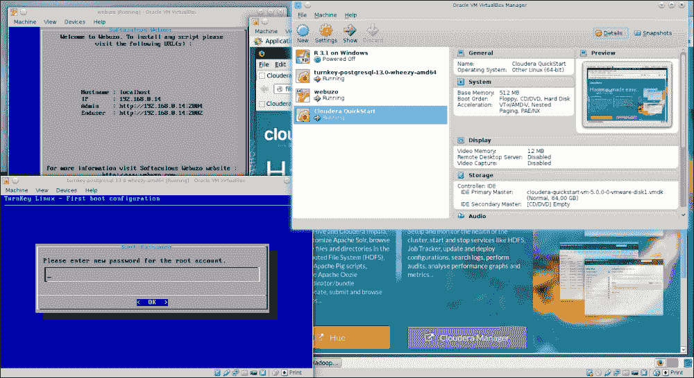
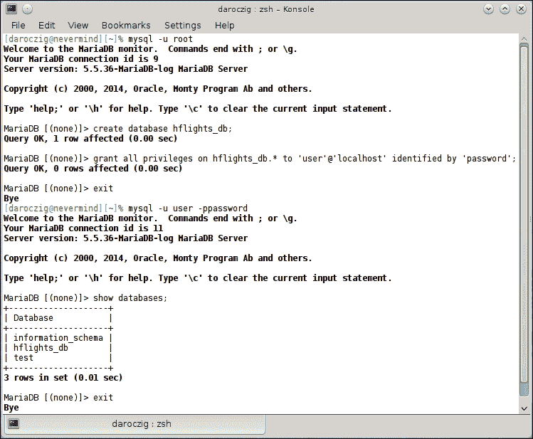
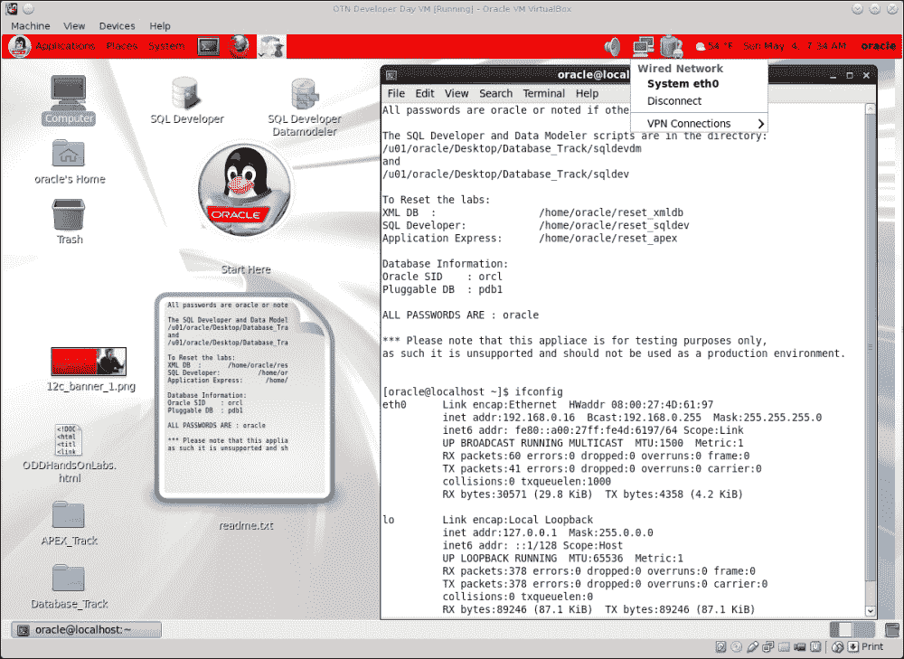
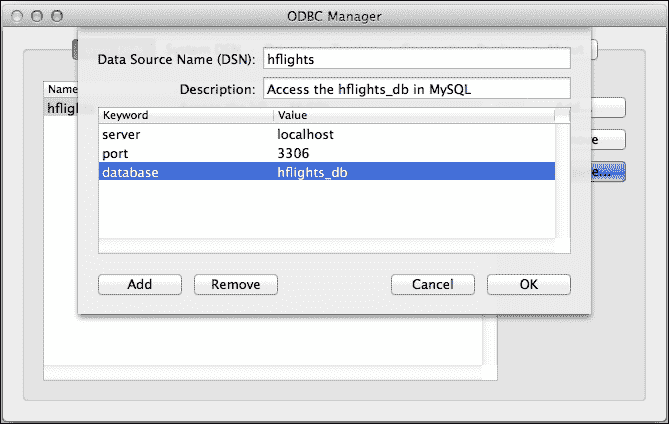

# 一、你好，数据！

R 中的大多数项目都是从将至少一些数据加载到正在运行的 R 会话开始的。因为 R 支持各种文件格式和数据库后端，所以有几种方法可以做到这一点。在这一章中，我们将不讨论基本的数据结构，这些数据结构你已经很熟悉了，但是我们将集中讨论加载大型数据集和处理特殊文件格式的性能问题。

### 注意

有关标准工具的快速概述和更新关于导入一般数据的知识，请参见[http://CRAN . R-project . org/doc/manuals/R-intro . html # Reading-data-from-files](http://cran.r-project.org/doc/manuals/R-intro.html#Reading-data-from-files)或 Rob Kabacoff 的 Quick-R 网站上的官方*R*手册的*第 7 章*，该网站提供了大多数一般任务的关键字和备忘单R at[http://www.statmethods.net/input/importingdata.html](http://www.statmethods.net/input/importingdata.html)。更多资料，请参见*附录*中的*参考*部分。

虽然 R 有自己的(序列化的)二进制`RData`和`rds`文件格式，这对于所有 R 用户来说都非常方便，因为它们也以有效的方式存储 R 对象的元信息，但大多数时候我们必须处理其他输入格式——由我们的雇主或客户提供。

最流行的数据文件格式之一是平面文件，这是一种简单的文本文件，其中的值由空格、管道字符、逗号分隔，在欧洲更常见的是由分号分隔。本章将讨论 R 提供的几种加载这类文档的方法，我们将测试哪种方法是导入更大文件的最有效方法。

有时我们只对数据集的子集感兴趣；因此，没有必要从数据源加载所有数据。在这种情况下，数据库后端可以提供最佳的性能，其中数据以结构化的方式存储在我们的系统上，因此我们可以使用简单有效的命令查询任何子集。本章的第二部分将重点介绍三种最流行的数据库(MySQL、PostgreSQL 和 Oracle 数据库)，以及如何与 r。

除了一些其他助手工具和对其他数据库后端的快速概述，我们还将讨论如何将 Excel 电子表格加载到 R 中——而无需事先在 Excel 或 Open/LibreOffice 中将它们转换为文本文件。

当然，这一章不仅仅是关于数据文件格式、数据库连接和这些无聊的内部内容。但是请记住，数据分析总是从加载数据开始。这是不可避免的，以便我们的计算机和统计环境在进行一些真正的分析之前知道数据的结构。

# 加载合理大小的文本文件

本章的标题也可以是*你好，大数据！*，因为现在我们专注于在 R 会话中加载相对大量的数据。但是什么是大数据，在 R 中处理多少数据是有问题的？什么是合理尺寸？

r 是为处理适合单台计算机物理内存的数据而设计的。因此，处理小于实际可访问 RAM 的数据集应该没问题。但请注意，处理数据所需的内存可能会在进行一些计算时变得更大，如主成分分析，这也应考虑在内。我将这些数据称为合理大小的数据集。

用 R 从文本文件中加载数据非常简单，并且加载任何合理大小的数据集都可以通过调用传统的`read.table`函数来实现。这里唯一的问题可能是性能:例如，读取 25 万行数据需要多长时间？让我们看看:

```r
> library('hflights')

> write.csv(hflights, 'hflights.csv', row.names = FALSE)

```

### 注意

提醒一下，请注意所有的 R 命令和返回的输出都是按照本书前面的格式编排的。命令从第一行的`>`开始，其余的多行表达式从`+`开始，就像在 R 控制台中一样。要在您的机器上复制和粘贴这些命令，请从 Packt 主页下载代码示例。更多详情，请参见*前言*中的【T2 你需要什么这本书部分。

是的，我们刚刚从`hflights`包中向您的磁盘写入了一个 18.5 MB 的文本文件，其中包括 2011 年从休斯顿出发的所有航班的一些数据:

```r
> str(hflights)

'data.frame':  227496 obs. of  21 variables:

 $ Year             : int  2011 2011 2011 2011 2011 2011 2011 ...

 $ Month            : int  1 1 1 1 1 1 1 1 1 1 ...

 $ DayofMonth       : int  1 2 3 4 5 6 7 8 9 10 ...

 $ DayOfWeek        : int  6 7 1 2 3 4 5 6 7 1 ...

 $ DepTime          : int  1400 1401 1352 1403 1405 1359 1359 ...

 $ ArrTime          : int  1500 1501 1502 1513 1507 1503 1509 ...

 $ UniqueCarrier    : chr  "AA" "AA" "AA" "AA" ...

 $ FlightNum        : int  428 428 428 428 428 428 428 428 428 ...

 $ TailNum          : chr  "N576AA" "N557AA" "N541AA" "N403AA" ...

 $ ActualElapsedTime: int  60 60 70 70 62 64 70 59 71 70 ...

 $ AirTime          : int  40 45 48 39 44 45 43 40 41 45 ...

 $ ArrDelay         : int  -10 -9 -8 3 -3 -7 -1 -16 44 43 ...

 $ DepDelay         : int  0 1 -8 3 5 -1 -1 -5 43 43 ...

 $ Origin           : chr  "IAH" "IAH" "IAH" "IAH" ...

 $ Dest             : chr  "DFW" "DFW" "DFW" "DFW" ...

 $ Distance         : int  224 224 224 224 224 224 224 224 224 ...

 $ TaxiIn           : int  7 6 5 9 9 6 12 7 8 6 ...

 $ TaxiOut          : int  13 9 17 22 9 13 15 12 22 19 ...

 $ Cancelled        : int  0 0 0 0 0 0 0 0 0 0 ...

 $ CancellationCode : chr  "" "" "" "" ...

 $ Diverted         : int  0 0 0 0 0 0 0 0 0 0 ...

```

### 注意

`hflights`包提供了一种简单的方法来加载运输统计局研究和创新技术管理局的庞大航空数据集的子集。原始数据库包括自 1987 年以来所有美国航班的预定和实际出发/到达时间，以及其他一些有趣的信息，通常用于演示机器学习和大数据技术。关于数据集的更多细节，请参见位于【http://www.transtats.bts.gov/DatabaseInfo.asp?DB_ID=120】的[Link = 0](http://www.transtats.bts.gov/DatabaseInfo.asp?DB_ID=120&Link=0)的列描述和其他元数据。

我们将使用这 21 列数据对数据导入时间进行基准测试。例如，让我们看看用`read.csv`导入 CSV 文件需要多长时间:

```r
> system.time(read.csv('hflights.csv'))

 user  system elapsed 

 1.730   0.007   1.738

```

在这里，从 SSD 加载数据需要一秒半多一点的时间。这很好，但是我们可以通过识别然后指定列的类来获得更好的结果，而不是调用默认的`type.convert`(更多细节请参见`read.table`中的文档，或者在 StackOverflow 上搜索，这里`read.csv`的性能似乎是一个相当频繁和流行的问题):

```r
> colClasses <- sapply(hflights, class)

> system.time(read.csv('hflights.csv', colClasses = colClasses))

 user  system elapsed 

 1.093   0.000   1.092

```

好多了！但是我们应该相信这个观察吗？在我们掌握 R 中的数据分析的过程中，我们应该实现一些更可靠的测试——简单地复制任务 *n* 次，并提供模拟结果的摘要。这种方法为我们提供了具有多重观察的性能数据，可用于识别结果中的统计显著差异。 `microbenchmark`包为这样的任务提供了一个很好的框架:

```r
> library(microbenchmark)

> f <- function() read.csv('hflights.csv')

> g <- function() read.csv('hflights.csv', colClasses = colClasses,

+                        nrows = 227496, comment.char = '')

> res <- microbenchmark(f(), g())

> res

Unit: milliseconds

 expr       min        lq   median       uq      max neval

 f() 1552.3383 1617.8611 1646.524 1708.393 2185.565   100

 g()  928.2675  957.3842  989.467 1044.571 1284.351   100

```

所以我们定义了两个函数:`f`代表默认设置`read.csv`，而在`g`函数中，我们传递了前面提到的列类和另外两个参数以提高性能。`comment.char`参数告诉 R 不要在导入的数据文件中寻找注释，而`nrows`参数定义了从文件中读取的确切行数，这节省了一些内存分配的时间和空间。将`stringsAsFactors`设置为`FALSE`也可能会加快一点导入速度。

### 注意

识别文本文件中的行数可以用一些第三方工具来完成，比如 Unix 上的`wc`，或者一个稍微慢一点的替代方法是 `R.utils`包中的`countLines`函数。

但是回到结果。让我们也可视化测试用例的中间值和相关的描述性统计数据，默认情况下运行 100 次:

```r
> boxplot(res, xlab  = '',

+   main = expression(paste('Benchmarking ', italic('read.table'))))

```


差异似乎很大(请随意做一些统计测试来验证)，所以我们通过微调`read.table`的参数，实现了 50%以上的性能提升。

## 数据文件大于物理内存

将大量数据从 CSV 文件加载到 R 中，而这些数据在内存中放不下，可以使用为这种情况创建的定制包来完成。例如， `sqldf`包和 `ff`包都有自己的解决方案，以定制的数据格式从一个块加载到另一个块。第一个使用 SQLite 或另一个类似 SQL 的数据库后端，而后者使用可以存储在磁盘上的`ffdf`类创建自定义数据框。 `bigmemory`包提供了类似的方法。稍后的使用示例(将进行基准测试):

```r
> library(sqldf)

> system.time(read.csv.sql('hflights.csv'))

 user  system elapsed 

 2.293   0.090   2.384 

> library(ff)

> system.time(read.csv.ffdf(file = 'hflights.csv'))

 user  system elapsed 

 1.854   0.073   1.918 

> library(bigmemory)

> system.time(read.big.matrix('hflights.csv', header = TRUE))

 user  system elapsed 

 1.547   0.010   1.559

```

请注意，头文件默认为`bigmemory`包中带有`read.big.matrix`的`FALSE`，因此在进行自己的基准测试之前，请务必阅读参考函数的手册。其中一些功能还支持性能调优，如`read.table`。有关进一步的示例和用例，请参见位于[http://CRAN . R-project . org/web/views/highperformancecomputing . html](http://cran.r-project.org/web/views/HighPerformanceComputing.html)的*高性能和并行计算与 R* CRAN 任务视图的*大内存和内存不足数据*部分。


# 基准测试文本文件解析器

另一个值得注意的从平面文件处理和加载合理大小的数据到 R 的选择是 `data.table`包。虽然它有一个不同于传统的基于 S 的 R 标记的独特语法，但它附带了很好的文档、简介和案例研究，说明它可以为各种数据库操作提供令人印象深刻的加速。此类用例及示例将在[第三章](ch03.html "Chapter 3. Filtering and Summarizing Data")、*过滤和汇总数据*和[第四章](ch04.html "Chapter 4. Restructuring Data")、*重组数据*中讨论。

该软件包提供了一个自定义的 R 函数来读取文本文件，提高了性能:

```r
> library(data.table)

> system.time(dt <- fread('hflights.csv'))

 user  system elapsed 

 0.153   0.003   0.158

```

与前面的例子相比，加载数据非常快，尽管它产生了一个带有自定义`data.table`类的 R 对象，如果需要，可以很容易地将其转换为传统的`data.frame`:

```r
> df <- as.data.frame(dt)

```

或者通过使用`setDF`函数，该函数提供了一种非常快速且就地的对象转换方法，而无需实际复制内存中的数据。同样，请注意:

```r
> is.data.frame(dt)

[1] TRUE

```

这意味着一个`data.table`对象可以退回来充当传统用法的`data.frame`。保留导入的数据不变或将其转换到`data.frame`取决于后一种用法。与 r 中的标准数据帧格式相比，使用第一种格式聚合、合并和重构数据更快。另一方面，用户必须学习自定义语法`data.table`—例如，`DT[i, j, by]`代表“从 DT 子集按`i`，然后按`j`分组”。我们将在[第 3 章](ch03.html "Chapter 3. Filtering and Summarizing Data")、*过滤和汇总数据*中讨论。

现在，让我们比较一下前面提到的所有数据导入方法:它们有多快？无论如何，最后的赢家似乎是来自`data.table`的`fread`。首先，我们通过声明测试函数来定义一些要进行基准测试的方法:

```r
> .read.csv.orig   <- function() read.csv('hflights.csv')

> .read.csv.opt    <- function() read.csv('hflights.csv',

+     colClasses = colClasses, nrows = 227496, comment.char = '',

+     stringsAsFactors = FALSE)

> .read.csv.sql    <- function() read.csv.sql('hflights.csv')

> .read.csv.ffdf   <- function() read.csv.ffdf(file = 'hflights.csv')

> .read.big.matrix <- function() read.big.matrix('hflights.csv',

+     header = TRUE)

> .fread           <- function() fread('hflights.csv')

```

现在，让我们将所有这些函数各运行 10 次，而不是像以前那样进行数百次迭代，这只是为了节省一些时间:

```r
> res <- microbenchmark(.read.csv.orig(), .read.csv.opt(),

+   .read.csv.sql(), .read.csv.ffdf(), .read.big.matrix(), .fread(),

+   times = 10)

```

并打印具有预定义位数的基准测试结果:

```r
> print(res, digits = 6)

Unit: milliseconds

 expr      min      lq   median       uq      max neval

 .read.csv.orig() 2109.643 2149.32 2186.433 2241.054 2421.392    10

 .read.csv.opt() 1525.997 1565.23 1618.294 1660.432 1703.049    10

 .read.csv.sql() 2234.375 2265.25 2283.736 2365.420 2599.062    10

 .read.csv.ffdf() 1878.964 1901.63 1947.959 2015.794 2078.970    10

 .read.big.matrix() 1579.845 1603.33 1647.621 1690.067 1937.661    10

 .fread()  153.289  154.84  164.994  197.034  207.279    10

```

请注意，现在我们正在处理适合实际物理内存的数据集，一些基准测试包是为更大的数据库设计和优化的。因此，优化`read.table`函数似乎比默认设置提供了更大的性能提升，尽管如果我们真的快速导入合理大小的数据，使用`data.table`包是最佳解决方案。


# 加载文本文件的子集

有时我们只需要数据集的一部分来进行分析，这些部分存储在数据库后端或平面文件中。在这种情况下，与前面讨论的任何性能调整和自定义包相比，只加载数据帧的相关子集将会带来更大的速度提升。

让我们假设我们只对飞往纳什维尔的航班感兴趣，那里每年的*用户！*会议于 2012 年召开。这意味着我们只需要 CSV 文件中那些`Dest`等于`BNA`的行(这个国际航空运输协会机场代码代表纳什维尔国际机场)。

与其在 160 到 2000 毫秒内加载整个数据集(参见上一节)然后删除不相关的行(参见第 3 章、*过滤和汇总数据*)，不如让我们看看在加载数据时过滤数据的可能方法。

已经提到的 `sqldf`包可以通过指定在为导入任务创建的临时 SQLite 数据库上运行的 SQL 语句来帮助完成这项任务:

```r
> df <- read.csv.sql('hflights.csv',

+   sql = "select * from file where Dest = '\"BNA\"'")

```

这个`sql`参数默认为`"select * from file"`，这意味着加载每一行的所有字段，不使用任何过滤器。现在我们用一个`filter`声明来扩展它。请注意，在我们更新的 SQL 语句中，我们还为搜索词添加了双引号，因为`sqldf`不会自动识别特殊的引号；它将它们视为领域的一部分。也可以通过提供自定义的过滤器参数来解决这个问题，例如在类似 Unix 的系统上的以下示例:

```r
> df <- read.csv.sql('hflights.csv',

+   sql = "select * from file where Dest = 'BNA'",

+   filter = 'tr -d ^\\" ')

```

生成的数据框仅包含原始数据集中 227，496 个例例中的 3，481 个观察值，当然，在临时 SQLite 数据库中进行过滤会稍微加快数据导入速度:

```r
> system.time(read.csv.sql('hflights.csv'))

 user  system elapsed 

 2.117   0.070   2.191 

> system.time(read.csv.sql('hflights.csv',

+   sql = "select * from file where Dest = '\"BNA\"'"))

 user  system elapsed 

 1.700   0.043   1.745

```

这一微小的改进是由于两个 R 命令首先将 CSV 文件加载到一个临时 SQLite 数据库中；这个过程当然需要一些时间，不能从这个过程中排除。为了加速这部分评估，您可以将`dbname`指定为`NULL`以提高性能。这样，SQLite 数据库将在内存中创建，而不是在`tempfile`中创建，这对于较大的数据集来说可能不是最佳解决方案。

## 在加载到 R 之前过滤平面文件

有没有一种更快或更智能的方法只加载这样一个文本文件的一部分？在将平面文件传递给 r 之前，可以对其应用一些常规的基于表达式的过滤。例如，`grep`或`ack`在 Unix 环境中可能是一个很好的工具，但是在 Windows 机器上默认情况下它是不可用的，并且通过正则表达式解析 CSV 文件也可能导致一些意想不到的副作用。相信我，你永远不会想从头开始编写一个 CSV、JSON 或 XML 解析器！

无论如何，如今的数据科学家在处理数据时应该是一个真正的多面手，所以这里有一个快速而肮脏的例子来展示如何在不到 100 毫秒的时间内读取过滤后的数据:

```r
> system.time(system('cat hflights.csv | grep BNA', intern = TRUE))

 user  system elapsed 

 0.040   0.050   0.082

```

嗯，与我们之前的任何结果相比，这确实是一个很好的运行时间！但是如果我们想要过滤到达延迟超过 13.5 分钟的航班呢？

另一种方法，也可能是更容易维护的方法，是首先将数据加载到数据库后端，并在需要数据的任何子集时进行查询。例如，这样我们可以简单地在一个文件中填充一个 SQLite 数据库一次，然后我们可以在`read.csv.sql`的默认运行时间片段中获取任何子集。

因此，让我们创建一个持久的 SQLite 数据库:

```r
> sqldf("attach 'hflights_db' as new")

```

该命令刚刚在当前工作目录中创建了一个名为`hflights_db`的文件。接下来，让我们创建一个名为`hflights`的表，并将 CSV 文件的内容填充到前面创建的数据库中:

```r
> read.csv.sql('hflights.csv',

+   sql = 'create table hflights as select * from file',

+   dbname = 'hflights_db')

```

到目前为止还没有进行基准测试，因为这些步骤将只运行一次，而对数据集子部分的查询可能会运行多次:

```r
> system.time(df <- sqldf(

+   sql = "select * from hflights where Dest = '\"BNA\"'",

+   dbname = "hflights_db"))

 user  system elapsed 

 0.070   0.027   0.097

```

我们刚刚在不到 100 毫秒的时间内加载了所需的数据库子集！但是如果我们计划经常查询持久数据库，我们可以做得更好:为什么不为我们的数据集专用一个真实的数据库实例，而不是一个简单的基于文件和无服务器的 SQLite 后端？


# 从数据库加载数据

使用专用数据库后端而不是按需从磁盘加载数据的巨大优势是数据库提供:

*   更快地访问大型表格的全部或选定部分
*   在将数据加载到 R 之前，强大而快速地聚合和过滤数据
*   与电子表格和 R 对象的传统矩阵模型相比，以关系型、更结构化的方案存储数据的基础结构
*   连接和合并相关数据的过程
*   多个客户端同时并发访问网络
*   访问数据的安全策略和限制
*   存储数据的可扩展和可配置的后端

`DBI`包为提供了一个数据库接口，一个 R 和各种 **关系数据库管理系统** ( **RDBMS** )之间的通信通道，例如 MySQL、PostgreSQL、MonetDB、Oracle 以及开放文档数据库等等。没有必要单独安装这个包，因为作为一个接口，如果需要的话，它将作为一个依赖项被安装。

连接到数据库和获取数据与所有这些后端非常相似，因为它们都基于关系模型，并使用 SQL 来管理和查询数据。请注意，上述数据库引擎之间存在一些重要的差异，并且还存在一些更多的开源和商业替代产品。但是我们不会深入研究如何选择数据库后端的细节，或者如何构建数据仓库和**提取、转换和加载** ( **ETL** )工作流，但是我们将只专注于建立连接和管理来自 r

### 注意

SQL 最初由 IBM 开发，已有 40 多年的历史，是当今最重要的编程语言之一——有各种方言和实现。作为全世界最受欢迎的声明性语言之一，有许多在线教程和免费课程来学习如何使用 SQL 查询和管理数据，这绝对是每个数据科学家的瑞士军刀中最重要的工具之一。

因此，除了 R 之外，了解 RDBMS 真的很有价值，RDBMS 在您作为数据分析师或类似职位的任何行业中都非常常见。

## 设置测试环境

数据库后端通常运行在远离进行数据分析的用户的服务器上，但是出于测试目的，在运行 r 的机器上安装本地实例可能是一个好主意。由于安装过程在不同的操作系统上可能有很大的不同，我们将不进入安装步骤的任何细节，但是我们更愿意参考软件可以从哪里下载，以及一些关于安装的重要资源和文档的进一步链接。

请注意，安装和实际尝试从这些数据库加载数据是完全可选的，您不必遵循每个步骤，本书的其余部分将不依赖于任何数据库知识或以前的数据库经验。另一方面，如果您不想因为出于测试目的临时安装多个数据库应用程序而弄乱您的工作空间，那么使用虚拟机可能是一个最佳的解决方法。Oracle 的`VirtualBox`提供了一种使用专用操作系统和用户空间运行多个虚拟机的免费且简单的方法。

### 注意

有关如何下载然后导入`VirtualBox`映像的详细说明，请参见 *Oracle* 一节。

通过这种方式，您可以快速部署一个功能完整但可任意使用的数据库环境，以测试本章的以下示例。在下图中，您可以看到`VirtualBox`安装了四个虚拟机，其中三个在后台运行，为测试目的提供一些数据库后端:



### 注意

`VirtualBox`可以通过 Linux 上你的操作系统的软件包管理器安装，或者从[https://www.virtualbox.org/wiki/Downloads](https://www.virtualbox.org/wiki/Downloads)下载安装二进制文件/源代码。详细的和操作系统特定的安装信息，请参考手册*第二章*、*安装细节*:[http://www.virtualbox.org/manual/](http://www.virtualbox.org/manual/)。

如今，设置并运行虚拟机真的很直观和容易；基本上，您只需要加载和启动一个虚拟机映像。一些虚拟机，也就是所谓的设备，包括操作系统，以及许多通常已经配置好工作的软件，以实现简单、方便和快速的分发。

### Tip

同样，如果您不喜欢安装和测试新软件，也不喜欢花时间了解支持您的数据需求的基础架构，则没有必要执行以下步骤，您可以随意跳过这些主要为全栈开发人员/数据科学家描述的可选任务。

这种要在任何计算机上运行的预先配置的虚拟机可以以多种文件格式从互联网上的各种提供商下载，例如 OVF 或 OVA。通用`VirtualBox`虚拟设备可以从[http://virtualboximages.com/vdi/index](http://virtualboximages.com/vdi/index)或[http://virtualboxes.oimg/](http://virtualboxes.oimg/)下载。

### 注

虚拟设备应该在 VirtualBox 中导入，而非 OVF/OVA 磁盘映像应该附加到新创建的虚拟机上；因此，可能还需要一些额外的手动配置。

Oracle 还在 http://www . Oracle . com/tech network/community/developer-VM/index . html 上为数据科学家学徒和其他开发人员提供了一个存储库，其中包含许多有用的虚拟映像，例如，Oracle Big Data Lite VM developer 虚拟设备具有以下最重要的组件:

*   Oracle 数据库
*   Cloudera 发行版中的 Apache Hadoop 和各种工具
*   Oracle R 发行版
*   构建于 Oracle 企业 Linux 之上

免责声明:Oracle 不是我个人的首选，但他们在独立于平台的虚拟化环境方面做得很好，就像基于他们的商业产品提供免费的开发人员虚拟机一样。简而言之，使用提供的 Oracle 工具绝对值得。

### 注意

如果您无法访问网络上已安装的虚拟机，请更新您的网络设置，以便在不需要互联网连接的情况下使用*主机专用适配器*，或者使用*桥接网络*进行更可靠的设置。后一种设置将在您的本地网络上为虚拟机保留一个额外的 IP 地址；这样，它就变得容易访问。请在 *Oracle 数据库*部分找到更多详细信息和截图示例。

另一个为开源数据库引擎创建的虚拟设备的好来源是位于 http://www.turnkeylinux.org/database T2 的交钥匙 GNU/Linux 仓库。这些图像基于 Debian Linux，完全免费使用，目前支持 MySQL、PostgreSQL、MongoDB 和 CouchDB 数据库。

交钥匙 Linux 媒体的一个巨大优势是它只包含开源、自由软件和非专有的东西。此外，磁盘映像要小得多，并且只包含一个专用数据库引擎所需的组件。这也使得安装速度更快，所需的磁盘和内存空间更少。

在[http://www.webuzo.com/sysapps/databases](http://www.webuzo.com/sysapps/databases)有更多类似的虚拟设备，在有更广泛的数据库后端，如 Cassandra、HBase、Neo4j、Hypertable 或 Redis，尽管一些 Webuzo 设备可能需要付费订阅才能部署。

作为新的 cool being Docker，我更建议你去熟悉它的概念，以令人难以置信的速度部署软件容器。这种容器可以被描述为独立的文件系统，包括操作系统、库、工具、数据等等，并且基于 Docker 映像的抽象层。实际上，这意味着您可以在本地主机上用一行命令启动一个包含一些演示数据的数据库，开发这样的定制图像也同样容易。请看一些简单的例子和在 https://github.com/cardcorp/card-rocker[描述的与 Pandoc 相关的](https://github.com/cardcorp/card-rocker) Docker 图片。

## MySQL 和 MariaDB

MySQL 是全世界最受欢迎的开源数据库引擎，根据提及次数、工作机会、谷歌搜索等等，由【http://db-engines.com/en/ranking】数据库引擎排名总结。主要用于 Web 开发，其高受欢迎程度可能是因为 MySQL 是免费的、独立于平台的，并且相对容易设置和配置——就像其名为 **MariaDB** 的替代工具一样。

### 注意

MariaDB 是由 MySQL 创始人 Michael Widenius 发起并领导的社区开发的完全开源的 MySQL 分支。后来和 SkySQL 合并了；因此，更多前 MySQL 高管和投资者加入了这一行列。MariaDB 是在 Sun Microsystems 收购 MySQL(目前归 Oracle 所有)后创建的，数据库引擎的开发发生了变化。

为了简单起见，我们在书中将这两个引擎都称为 MySQL，因为 MariaDB 可以被认为是 MySQL 的替代产品，所以请随意使用 MySQL 或 MariaDB 复制以下示例。

虽然在大多数操作系统上安装 MySQL 服务器非常简单([【https://dev.mysql.com/downloads/mysql/】](https://dev.mysql.com/downloads/mysql/))，但是人们可能更喜欢将数据库安装在虚拟机上。交钥匙 Linux 免费提供小型但配置完整的虚拟设备:[http://www.turnkeylinux.org/mysql](http://www.turnkeylinux.org/mysql)。

r 提供了多种从 MySQL 数据库中查询数据的方法。一种选择是使用`RMySQL`包，对于一些用户来说安装可能有点棘手。如果您使用的是 Linux，请确保将 MySQL 的开发包与 MySQL 客户端一起安装，以便该包可以在您的系统上编译。而且，由于 MySQL 版本的高度可变性，CRAN for Windows 安装上没有可用的二进制包，Windows 用户也应该从源代码编译该包:

```r
> install.packages('RMySQL', type = 'source')

```

Windows 用户可能会发现下面的博文对详细的安装步骤很有用:[http://www . ahschulz . de/2013/07/23/installing-rmy SQL-under-windows/](http://www.ahschulz.de/2013/07/23/installing-rmysql-under-windows/)。

### 注意

为了简单起见，我们将 MySQL 服务器称为`localhost`监听默认的 3306 端口；在所有数据库连接中，用户将代表`user`，密码代表`password`。我们将使用`hflights_db`数据库中的`hflights`表，就像几页前的 SQLite 示例一样。如果您在远程或虚拟服务器中工作，请相应地修改以下代码示例的`host`、`username`等参数。

在成功地安装并启动 MySQL 服务器之后，我们必须设置一个测试数据库，稍后我们可以在 r 中填充这个数据库。

请注意，下面的例子是在 Linux 上运行的，Windows 用户可能需要来提供路径和文件扩展名`exe`来启动 MySQL 命令行工具:



这个快速会话可以在前面的截图中看到，在这里我们首先以`root` (admin)用户的身份在命令行中连接到 MySQL 服务器。然后我们创建了一个名为`hflights_db`的数据库，并将该数据库的所有特权和权限授予一个名为`user`的新用户，其密码设置为`password`。然后，我们简单地验证是否可以用新创建的用户连接到数据库，并退出命令行 MySQL 客户端。

要将数据从的 MySQL 数据库加载到 R 中，首先我们必须连接服务器，而且通常也要向服务器认证。这可以通过连接`RMySQL`时自动加载的 `DBI`包来完成:

```r
> library(RMySQL)

Loading required package: DBI

> con <- dbConnect(dbDriver('MySQL'),

+   user = 'user', password = 'password', dbname = 'hflights_db')

```

现在我们可以将我们的 MySQL 连接称为`con`，我们希望在这里部署`hflights`数据集供以后访问:

```r
> dbWriteTable(con, name = 'hflights', value = hflights)

[1] TRUE

> dbListTables(con)

[1] "hflights"

```

`dbWriteTable`函数将同名的`hflights`数据帧写入之前定义的连接。后一个命令显示当前使用的数据库中的所有表，相当于`SHOW TABLES` SQL 命令。现在我们已经将原始 CVS 文件导入到 MySQL 中，让我们看看读取整个数据集需要多长时间:

```r
> system.time(dbReadTable(con, 'hflights'))

 user  system elapsed 

 0.993   0.000   1.058

```

或者我们可以通过从同一个`DBI`包传递给`dbGetQuery`的直接 SQL 命令来实现:

```r
> system.time(dbGetQuery(con, 'select * from hflights'))

 user  system elapsed 

 0.910   0.000   1.158

```

为了使更多的例子更简单，让我们回到 `sqldf`包，它代表“数据帧上的 SQL 选择”。事实上，`sqldf`是 DBI 的`dbSendQuery`函数的一个方便的包装器，带有一些有用的默认值，并返回`data.frame`。这个包装器可以查询各种数据库引擎，比如 SQLite、MySQL、H2 或者 PostgreSQL，默认为全局`sqldf.driver`选项中指定的那个；或者，如果是`NULL`，它将检查是否有任何 R 包已经被加载到前面提到的后端。

因为我们已经加载了`RMySQL`，现在`sqldf`将默认使用 MySQL 而不是 SQLite。但是我们仍然必须指定使用哪个连接；否则该函数将尝试打开一个新的——完全不知道我们复杂的用户名和密码组合，更不用说神秘的数据库名称了。连接可以在每个`sqldf`表达式中传递,或者在一个全局选项中定义一次:

```r
> options('sqldf.connection' = con)

> system.time(sqldf('select * from hflights'))

 user  system elapsed 

 0.807   0.000   1.014

```

同一任务的前三个版本的差异似乎并不显著。与我们之前测试的方法相比，1 秒的时间似乎是一个相当好的结果——尽管用`data.table`加载整个数据集仍然胜过这个结果。如果我们只需要数据集的一个子集呢？让我们只获取那些在纳什维尔结束的航班，就像我们之前的 SQLite 示例一样:

```r
> system.time(sqldf('SELECT * FROM hflights WHERE Dest = "BNA"'))

 user  system elapsed 

 0.000   0.000   0.281

```

与我们之前的 SQLite 测试相比，这似乎不是很有说服力，因为后者可以在不到 100 毫秒的时间内重现相同的结果。但是请注意，用户和系统的运行时间都是零，而 SQLite 不是这样。

### 注意

由`system.time`返回的经过时间表示从评估开始经过的毫秒数。用户和系统时间有点难以理解；它们由操作系统报告。或多或少，`user`是指被调用进程(比如 R 或者 MySQL 服务器)所花费的 CPU 时间，而`system`则是报告内核和其他操作系统进程(比如打开一个文件进行读取)所需要的 CPU 时间。详见`?proc.time`。

这意味着返回所需的数据子集根本不需要任何 CPU 时间，而 SQLite 需要将近 100 毫秒。怎么可能呢？如果我们在`Dest`上索引数据库会怎么样？

```r
> dbSendQuery(con, 'CREATE INDEX Dest_idx ON hflights (Dest(3));')

```

这个 SQL 查询代表基于`Dest`列的前三个字母在我们的表中创建一个名为`Dest_idx`的索引。

### 注意

SQL index 可以极大地提高带有`WHERE`子句的`SELECT`语句的性能，因为 MySQL 不需要通过这种方式读取整个数据库来匹配每一行，但它可以确定相关搜索结果的位置。随着数据库越来越大，这种性能提升变得越来越显著，尽管值得一提的是，索引只有在大部分时间查询数据子集时才有意义。如果需要大部分或全部数据，顺序读取会更快。

实例:

```r
> system.time(sqldf('SELECT * FROM hflights WHERE Dest = "BNA"'))

 user  system elapsed 

 0.024   0.000   0.034

```

好像好了很多！当然，我们也可以索引 SQLite 数据库，而不仅仅是 MySQL 实例。为了再次测试，我们必须将默认的`sqldf`驱动程序恢复为 SQLite，它通过加载 `RMySQL`包来覆盖:

```r
> options(sqldf.driver = 'SQLite')

> sqldf("CREATE INDEX Dest_idx ON hflights(Dest);",

+   dbname = "hflights_db"))

NULL

> system.time(sqldf("select * from hflights where

+   Dest = '\"BNA\"'", dbname = "hflights_db"))

 user  system elapsed 

 0.034   0.004   0.036

```

因此，看起来两个数据库引擎都能够在几分之一秒内返回所需的数据子集，这甚至比我们之前用令人印象深刻的`data.table`所实现的要好得多。

尽管 SQLite 在一些早期的例子中被证明比 MySQL 更快，但在大多数情况下有很多理由选择后者。首先，SQLite 是一个基于文件的数据库，这仅仅意味着数据库应该位于与运行 R 的计算机相连的文件系统上。同样，MySQL 可以处理更大的数据量；它有用户管理和基于规则的控制，以及对同一数据集的并发访问。聪明的数据科学家知道如何选择他的武器——根据任务，另一个数据库后端可能是最佳解决方案。让我们看看在 R 中还有什么其他选择！

## PostgreSQL

据说 MySQL是最流行的开源关系数据库管理系统，而 PostgreSQL 则以“世界上最先进的开源数据库”而闻名。这意味着 PostgreSQL 通常被认为比更简单但更快的 MySQL 具有更多功能，包括分析功能，这导致 PostgreSQL 经常被描述为 Oracle 的开源版本。

这听起来很有趣，因为甲骨文现在拥有 MySQL。因此，在 RDBMS 过去 20-30 年的历史中，许多事情都发生了变化，PostgreSQL 不再那么慢了。另一方面，MySQL 也获得了一些不错的新特性——例如，MySQL 也变得与`InnoDB`引擎兼容，允许回滚到数据库以前的状态。这两种流行的数据库服务器之间还有一些其他的差异，它们可能支持选择其中任何一种。现在让我们看看如果我们的数据提供者喜欢 PostgreSQL 而不是 MySQL 会发生什么！

安装 PostgreSQL 类似于 MySQL。人们可以用操作系统的软件包管理器安装软件，从[http://www . enterprisedb . com/products-services-training/pg download](http://www.enterprisedb.com/products-services-training/pgdownload)下载图形安装程序，或者用例如免费的交钥匙 Linux 运行虚拟设备，该软件在[http://www.turnkeylinux.org/postgresql](http://www.turnkeylinux.org/postgresql)免费提供一个小但配置完整的磁盘映像。

### Tip

**下载示例代码**

您可以从您在[http://www.packtpub.com](http://www.packtpub.com)的账户下载您购买的所有 Packt Publishing 书籍的示例代码文件。如果你在其他地方购买了这本书，你可以访问 http://www.packtpub.com/support 的[并注册，让文件直接通过电子邮件发送给你。](http://www.packtpub.com/support)

成功安装并启动服务器后，让我们设置测试数据库——就像我们在 MySQL 安装后所做的那样:


在某些情况下，语法有点不同，我们使用了一些命令行工具来创建用户和数据库。这些助手程序默认是 PostgreSQL 自带的，MySQL 也有一些与`mysqladmin`类似的功能。

在设置好初始测试环境之后，或者如果我们已经有一个工作数据库实例要连接，我们可以在 `RPostgreSQL`包的帮助下重复前面描述的数据管理任务:

```r
> library(RPostgreSQL)

Loading required package: DBI

```

### 注意

如果您的 R 会话在下面的例子中开始抛出奇怪的错误消息，那么加载的 R 包很有可能是冲突的。您可以简单地启动一个 clean R 会话，或者分离以前附加的包—例如，`detach('package:RMySQL', unload = TRUE)`。

连接到数据库(监听默认端口号 5432)也很熟悉:

```r
> con <- dbConnect(dbDriver('PostgreSQL'), user = 'user',

+   password = 'password', dbname = 'hflights_db')

```

让我们验证我们是否连接到了正确的数据库实例，如果没有`hflights`表，该实例当前应该是空的:

```r
> dbListTables(con)

character(0)

> dbExistsTable(con, 'hflights')

[1] FALSE

```

然后让我们用 PostgreSQL 编写演示表，看看关于它比 MySQL 慢的传言是否仍然成立:

```r
> dbWriteTable(con, 'hflights', hflights)

[1] TRUE

> system.time(dbReadTable(con, 'hflights'))

 user  system elapsed 

 0.590   0.013   0.921

```

似乎印象深刻！加载部分数据怎么办？

```r
> system.time(dbGetQuery(con,

+ statement = "SELECT * FROM hflights WHERE \"Dest\" = 'BNA';"))

 user  system elapsed 

 0.026   0.000   0.082

```

不到 100 毫秒，没有索引！请注意`Dest`两边的额外转义引号，因为默认 PostgreSQL 行为将未加引号的列名折叠成小写，这将导致列`dest`不存在错误。基于 MySQL 示例，可以很容易地复制创建索引并以更快的速度运行前面的查询。

## 甲骨文数据库

Oracle 数据库速成版可以从[http://www . Oracle . com/tech network/Database/Database-technologies/Express-Edition/downloads/index . html](http://www.oracle.com/technetwork/database/database-technologies/express-edition/downloads/index.html)下载安装。尽管这不是一个全功能的 Oracle 数据库，而且有严重的局限性，但快速版是一个免费的、不太耗费资源的在家构建测试环境的方式。

### 注意

Oracle 数据库据说是世界上最受欢迎的数据库管理系统，尽管它只有在获得专有许可的情况下才可用，不像前面讨论的两个 RDBMSs，这意味着 Oracle 提供的产品是有期限许可的。另一方面，付费许可证还附带来自开发公司的优先支持，这在企业环境中通常是一个严格的要求。自 1980 年第一次发布以来，Oracle 数据库已经支持了许多优秀的特性，比如分片、主-主复制和完整的 ACID 属性。

获得用于测试目的的工作 Oracle 数据库的另一种方法是从[http://www . Oracle . com/tech Network/community/Developer-VM/index . html](http://www.oracle.com/technetwork/community/developer-vm/index.html)下载 Oracle 预构建的开发人员虚拟机，或者在 *Oracle 技术网络开发人员日*:[http://www . Oracle . com/tech Network/Database/enterprise-edition/databaseappdev-VM-161299 . HTT 下载为*实际操作数据库应用程序开发*定制的小得多的映像我们将遵循后一个来源的指示。](http://www.oracle.com/technetwork/database/enterprise-edition/databaseappdev-vm-161299.html)

接受许可协议并在 Oracle 免费注册后，我们可以下载`OTN_Developer_Day_VM.ova`虚拟设备。让我们通过**文件**菜单中的**导入工具**导入到 VirtualBox 中，然后选择`ova`文件，点击**下一步**:


点击 **导入**后，您必须再次同意软件许可协议。导入虚拟磁盘映像(15 GB)可能需要几分钟时间:


导入完成后，我们应该首先更新网络配置，这样我们就可以从外部访问虚拟机的内部数据库。所以让我们在设置中从 **NAT** 切换到**桥接适配器**:


然后我们可以简单地在 VirtualBox 中启动新创建的虚拟机。Oracle Linux 启动后，我们可以使用默认的`oracle`密码登录。

尽管我们已经为虚拟机设置了一个桥接网络接口，这意味着虚拟机通过一个真实的 IP 地址直接连接到我们的真实子网，但是虚拟机还不能通过网络访问。要使用默认的 DHCP 设置进行连接，只需导航到顶部的红色条并寻找网络图标，然后选择**系统 eth0** 。几秒钟后，虚拟机就可以从您的主机上访问了，因为客户系统应该已经连接到您的网络上了。您可以通过在已经运行的控制台中运行`ifconfig`或`ip addr show eth0`命令来验证这一点:



不幸的是，这个已经运行的 Oracle 数据库还不能在客户机器之外访问。默认情况下，开发人员虚拟机带有一个相当严格的防火墙，应该首先禁用它。要查看生效的规则，运行标准的`iptables -L -n`命令，并刷新所有规则，执行`iptables -F`:


既然我们已经有了一个正在运行并可远程访问的 Oracle 数据库，让我们来准备 R 客户端。在某些操作系统上安装 `ROracle`包可能会很棘手，因为没有预构建的二进制包，您必须在从源代码编译包之前手动安装 Oracle Instant Client Lite 和 SDK 库。如果编译器抱怨您先前安装的 Oracle 库的路径，请使用带有`--configure-args`参数的自定义路径传递`--with-oci-lib`和`--with-oci-inc`参数。更多细节可以在包安装文档中找到:[http://cran.r-project.org/web/packages/ROracle/INSTALL](http://cran.r-project.org/web/packages/ROracle/INSTALL)。

例如，在 Arch Linux 上，您可以从 AUR 安装 Oracle libs，然后在从 CRAN 下载 R 包后在`bash`中运行以下命令:

```r
# R CMD INSTALL --configure-args='--with-oci-lib=/usr/include/    \

>  --with-oci-inc=/usr/share/licenses/oracle-instantclient-basic' \

>  ROracle_1.1-11.tar.gz

```

在安装和加载包之后，打开一个连接与前面使用`DBI::dbConnect`的例子非常相似。我们在这里只传递一个额外的参数。首先，让我们指定包含在`dbname`参数中的 Oracle 数据库的主机名或直接 IP 地址。然后我们可以连接到开发人员机器上已经存在的 PDB1 数据库，而不是之前使用的`hflights_db`——只是为了节省本书中关于稍微跑题的数据库管理任务的时间和空间:

```r
> library(ROracle)

Loading required package: DBI

> con <- dbConnect(dbDriver('Oracle'), user = 'pmuser',

+   password = 'oracle', dbname = '//192.168.0.16:1521/PDB1')

```

我们与 Oracle RDBMS 建立了有效的连接:

```r
> summary(con)

User name:             pmuser 

Connect string:        //192.168.0.16:1521/PDB1 

Server version:        12.1.0.1.0 

Server type:           Oracle RDBMS 

Results processed:     0 

OCI prefetch:          FALSE 

Bulk read:             1000 

Statement cache size:  0 

Open results:          0 

```

让我们看看开发虚拟机上捆绑的数据库中有什么:

```r
> dbListTables(con)

[1] "TICKER_G" "TICKER_O" "TICKER_A" "TICKER" 

```

这样看来，我们有一个名为`TICKER`的表，它有三个关于三个符号的分笔成交点数据的三视图。将`hflights`表保存在同一个数据库中不会有任何坏处，我们还可以在读取整个表时即时测试 Oracle 数据库的速度:

```r
> dbWriteTable(con, 'hflights', hflights)

[1] TRUE

> system.time(dbReadTable(con, 'hflights'))

 user  system elapsed 

 0.980   0.057   1.256

```

最常见的子集有 3481 个病例:

```r
> system.time(dbGetQuery(con,

+ "SELECT * FROM \"hflights\" WHERE \"Dest\" = 'BNA'"))

 user  system elapsed

 0.046   0.003   0.131

```

请注意表名两边的引号。在前面使用 MySQL 和 PostgreSQL 的例子中，没有这些 SQL 语句也能很好地运行。但是，在 Oracle 数据库中需要引号，因为我们保存了一个全小写名称的表，Oracle DB 中的默认规则是以大写形式存储对象名称。唯一的其他选择是使用双引号来创建它们，这就是我们所做的；因此，我们必须用引号将小写名称括起来。

### 注意

在 MySQL 中，我们以不带引号的表名和列名开始,然后必须在从 R 运行的 PostgreSQL 查询中在变量名周围添加转义引号，现在在 Oracle 数据库中，我们必须将两个名称放在引号之间——这展示了 ANSI SQL 之上的各种 SQL 风格(如 MySQL、PostgreSQL、Oracle 的 PL/SQL 或 Microsoft 的 Transact-SQL)的细微差异。

更重要的是:不要在所有项目中坚持使用一个数据库引擎，如果公司政策不阻止的话，应该为任务选择最佳的数据库。

与我们在 PostgreSQL 中看到的结果相比，这些结果并不令人印象深刻，所以我们也来看看索引查询的结果:

```r
> dbSendQuery(con, 'CREATE INDEX Dest_idx ON "hflights" ("Dest")')

Statement:            CREATE INDEX Dest_idx ON "hflights" ("Dest") 

Rows affected:        0 

Row count:            0 

Select statement:     FALSE 

Statement completed:  TRUE 

OCI prefetch:         FALSE 

Bulk read:            1000 

> system.time(dbGetQuery(con, "SELECT * FROM \"hflights\"

+ WHERE \"Dest\" = 'BNA'"))

 user  system elapsed 

 0.023   0.000   0.069

```

我将全面的比较测试和基准测试留给您，以便您可以在测试中运行定制查询来满足您的确切需求。在特殊的用例中，不同的数据库引擎很可能表现不同。

为了使这个过程更加无缝并且更容易实现，让我们看看另一种连接数据库的方法，尽管可能会有一点性能上的损失。有关在 R 中使用不同方法连接到 Oracle 数据库的快速可伸缩性和性能比较，请参见[https://blogs . Oracle . com/R/entry/R _ to _ Oracle _ database _ connectivity](https://blogs.oracle.com/R/entry/r_to_oracle_database_connectivity)。

## ODBC 数据库访问

如前所述，为不同的数据库安装 native client 软件、库和头文件，以便可以从源代码中构建定制的 R 包，这在某些情况下可能是乏味且相当棘手的。幸运的是，我们也可以尝试做相反的过程。另一个解决方案可以是在数据库中安装一个中间件**应用编程接口** ( **API** )，这样 R，或者实际上任何其他工具，就可以以一种标准化且更方便的方式与它们通信。但是，请注意，由于应用程序和 DBMS 之间的转换层，这种更方便的方式会降低性能。

`RODBC`包实现了对这样一个层的访问。 **开放式数据库连接** ( **ODBC** )驱动程序可用于大多数数据库管理系统，甚至用于 CSV 和 Excel 文件，因此`RODBC`提供了一种标准化的方法来访问几乎任何数据库中的数据，如果安装了 ODBC 驱动程序的话。这个独立于平台的接口可用于 Windows 和 Linux 上的 SQLite、MySQL、MariaDB、PostgreSQL、Oracle 数据库、Microsoft SQL Server、Microsoft Access 和 IBM DB2。

举个简单的例子，让我们连接到运行在`localhost`(或者虚拟机)上的 MySQL。首先，我们要建立一个 **数据库，数据源名称** ( **DSN** )和连接细节，比如:

*   数据库驱动程序
*   主机名或地址和端口号，可选的 Unix 套接字
*   数据库名称
*   可选地，用于连接的用户名和密码

这可以在安装了 `unixODBC`程序后，通过在 Linux 上编辑`odbc.ini`和`odbcinst.ini`文件在命令行中完成。后者应该包括您的`/etc`文件夹中 MySQL 驱动程序的以下配置:

```r
[MySQL]

Description     = ODBC Driver for MySQL

Driver          = /usr/lib/libmyodbc.so

Setup           = /usr/lib/libodbcmyS.so

FileUsage       = 1

```

`odbc.ini`文件包括前面提到的数据库和服务器的 DSN 配置:

```r
[hflights]

Description     = MySQL hflights test

Driver          = MySQL

Server          = localhost

Database        = hflights_db

Port            = 3306

Socket          = /var/run/mysqld/mysqld.sock

```

或者在 Mac OS 或 Windows 上使用图形用户界面，如下图所示:



在配置了一个 DSN 之后，我们可以用一行命令进行连接:

```r
> library(RODBC)

> con <- odbcConnect("hflights", uid = "user", pwd = "password")

```

让我们获取之前保存在数据库中的数据:

```r
> system.time(hflights <- sqlQuery(con, "select * from hflights"))

 user  system elapsed 

 3.180   0.000   3.398

```

嗯，花了几秒钟才完成。这就是使用更方便的高级接口与数据库交互的代价。除了`odbc*`函数之外，还可以使用类似的高级函数(如`sqlFetch`)将数据移除和上传到数据库，从而提供对数据库的低级访问。快速示例:

```r
> sqlDrop(con, 'hflights')

> sqlSave(con, hflights, 'hflights')

```

您可以使用完全相同的命令来查询任何其他受支持的数据库引擎；只需确保为每个后端设置 DSN，并在不再需要时关闭连接:

```r
> close(con)

```

`RJDBC`包可以通过 **Java 数据库连接** ( **JDBC** )驱动程序为数据库管理系统提供类似的接口。

## 使用图形用户界面连接数据库

说到高级接口的，R 在的`dbConnect`包中也有一个图形用户界面来连接 MySQL:

```r
> library(dbConnect)

Loading required package: RMySQL

Loading required package: DBI

Loading required package: gWidgets

> DatabaseConnect()

Loading required package: gWidgetsRGtk2

Loading required package: RGtk2

```

没有参数，控制台中没有自定义配置，只有一个简单的对话窗口:


在提供了所需的连接信息之后，我们可以轻松地查看原始数据和列/变量类型，并运行定制的 SQL 查询。一个基本的查询生成器也可以帮助新手用户从数据库中获取子样本:


这个包附带了一个名为`sqlToR`的便利函数，它可以在 GUI 中点击将 SQL 结果转换成 R 对象。不幸的是，`dbConnect`严重依赖于`RMySQL`，这意味着它是一个仅支持 MySQL 的包，并且没有计划扩展该接口的功能。

## 其他数据库后端

除了前面提到的流行数据库，还有几个其他的实现，我们不能在这里详细讨论。

例如，面向列的数据库管理系统，如 MonetDB，通常用于存储具有数百万行和数千列的大型数据集，以提供高性能数据挖掘的后端。它也有很大的 R 支持与`MonetDB.R`包，这是在用户最激动人心的谈话！2013 年发布会。

NoSQL 生态系统的日益流行也提供了类似的方法，尽管通常不支持 SQL 和提供无模式的数据存储。Apache Cassandra 是一个的好例子，它是一个类似的、面向列的、主要是分布式的数据库管理系统，在商用硬件上运行，具有高可用性和高性能。 `RCassandra`包通过`RC.*`函数族以方便的方式提供对基本 Cassandra 特性和 Cassandra 查询语言的访问。另一个受 Google Bigtable 启发的类似数据库引擎是 HBase，它由【https://github.com/RevolutionAnalytics/RHadoop/wiki】项目 `RHadoop`的一部分 `rhbase`包支持。

说到大规模并行处理，惠普的 Vertica 和 Cloudera 的开源 Impala 也可以从 R 访问，所以你可以轻松访问和查询大量数据，性能相对较好。

最受欢迎的 NoSQL 数据库之一是 MongoDB，它以类似 JSON 的格式提供面向文档的数据存储，为动态模式提供基础设施。MongoDB 正在积极开发中，有一些类似 SQL 的特性，比如查询语言和索引，还有多个 R 包提供对后端的访问。 `RMongo`包使用 *mongo-java-driver* ，因此依赖于 java，但是提供了一个相当高级的数据库接口。另一个实现`rmongodb`包是由 MongoDB 团队开发和维护的。后者有更频繁的更新和更详细的文档，但 R 集成似乎与第一个包无缝得多，因为`rmongodb`提供了对原始 MongoDB 函数和 BSON 对象的访问，而不是专注于一般 R 用户的翻译层。耶鲁安 Ooms 开发的`mongolite` 是支持 MongoDB 的一个更新、更有前途的包。

CouchDB 是大多数无模式项目中我个人最喜欢的，它提供了非常方便的 JSON 对象和 HTTP API 文档存储，这意味着在应用程序(如任何 R 脚本)中集成非常容易，例如使用 `RCurl`包，尽管您可能会发现 `R4CouchDB`在与数据库交互时动作更快。

Google BigQuery 也提供了一个类似的基于 REST 的 HTTP API，用一种类似 SQL 的语言来查询 Google 基础设施中托管的甚至万亿字节的数据。虽然 CRAN 上还没有 `bigrquery`包，但是你可以很容易地从 GitHub 上安装它，还有同一作者 Hadley Wickham 的 `devtools`包:

```r
> library(devtools)

> install_github('bigrquery', 'hadley')

```

为了测试这个包和 Google BigQuery 的功能，您可以注册一个免费帐户来获取和处理 Google 提供的演示数据集，遵守每天 10，000 个免费使用请求的限制。请注意，当前的实现是数据库的只读接口。

对于非常相似的数据库引擎和比较，例如参见[http://db-engines.com/en/systems](http://db-engines.com/en/systems)。大多数流行的数据库已经支持 R，但如果没有，我很确定有人已经在做了。值得在[http://CRAN . R-project . org/web/packages/available _ packages _ by _ name . html](http://cran.r-project.org/web/packages/available_packages_by_name.html)查看 CRAN 包，或者在 GitHub 或[http://R-bloggers.com](http://R-bloggers.com)到上搜索，看看其他 R 用户如何设法与您选择的数据库进行交互。


# 从其他统计系统导入数据

在最近的一个学术项目中，我的任务是在 R 中实现一些金融模型，我得到了演示数据集作为 Stata `dta`文件进行分析。作为一名在大学工作的承包商，在无法访问任何 Stata 安装的情况下，读取另一个统计软件的二进制文件格式可能会有问题，但是随着`dta`文件格式被记录下来并且规范在[http://www.stata.com/help.cgi?dta](http://www.stata.com/help.cgi?dta)公开发布，核心 R 团队的一些成员已经在`foreign`包中以`read.dta`函数的形式实现了一个 R 解析器。

为此，在 R 中加载(并且经常编写)Stata——或者例如 SPSS、SAS、Weka、Minitab、Octave 或 dBase 文件——简直再容易不过了。请参见包文档或 *R 数据导入/导出*手册:[http://cran . R-project . org/doc/manuals/R-release/R-Data . html # Importing-from-other-statistical-systems](http://cran.r-project.org/doc/manuals/r-release/R-data.html#Importing-from-other-statistical-systems)。


# 加载 Excel 电子表格

在学术机构和企业中存储和传输相对少量数据的最流行的文件格式之一(除了 CSV 文件)仍然是 Excel `xls`(或者最近的`xlsx`)。第一种是微软专有的二进制文件格式，它有详尽的文档记录(`xls`规范可以在一个超过 1100 页和 50 兆字节的文档中找到！)，但是即使在今天，导入多个工作表、宏和公式也不是一件简单的事情。本节将只介绍最常用的与平台无关的软件包，以便与 Excel 进行交互。

一种选择是使用前面讨论的 `RODBC`包和 Excel 驱动程序来查询 Excel 电子表格。其他访问 Excel 数据的方式依赖于第三方工具，比如使用 Perl 自动将 Excel 文件转换为 CSV 格式，然后从 `gdata`包中将其作为`read.xls`函数导入 R 中。但是在 Windows 上安装 Perl 有时似乎很乏味；因此，`RODBC`可能是该平台上更方便的方法。

一些独立于平台、基于 Java 的解决方案还提供了一种方法，不仅可以读取 Excel 文件，还可以写入 Excel 文件，尤其是 Office Open XML 文件格式的`xlsx`。CRAN 上有两个独立的实现来读写 Excel 2007 和 97/2000/XP/2003 文件格式: `xlConnect`和 `xlsx`包。两者都是主动维护的，并且使用 Apache POI Java API 项目。后者意味着它运行在任何支持 Java 的平台上，不需要电脑上有微软 Excel 或 Office 这两个包都可以自己读写 Excel 文件。

另一方面，如果您不想依赖 Perl 或 Java，最近发布的`openxlsx`包提供了一种独立于平台(C++驱动)的方式来读写`xlsx`文件。Hadley Wickham 发布了一个类似的包，但是稍微修改了一下范围: `readxl`包可以读取(但不能写入)文件格式`xls`和`xlsx`。

请记住:选择最适合您需求的工具！例如，要读取没有太多外部依赖的 Excel 文件，我会选择`readxl`；但是，为了编写具有单元格格式和更高级功能的 Excel 2003 电子表格，我们可能无法保存 Java 依赖关系，应该使用的`xlConnect`或 `xlsx`包，而不是`xlsx`-只有 `openxlsx`包。


# 总结

这一章关注的是我们每天通常做的一些相当无聊但重要的任务。导入数据是每个数据科学项目的第一步，因此掌握数据分析应该从如何高效地将数据加载到 R 会话开始。

但是从这个意义上说，效率是一个模糊的术语:从技术角度来看，加载数据应该很快，这样才不会浪费我们的时间，尽管长时间编码以加快导入过程也没有多大意义。

本章概述了在 r 中读取文本文件、与数据库交互和查询数据子集的最流行的可用选项。现在，您应该能够处理所有最常用的不同数据源，并且可能还可以选择哪个数据源是项目中的理想候选，然后像我们之前所做的那样，自己进行基准测试。

下一章将通过提供从 Web 和不同 API 获取数据的用例来进一步扩展这些知识。这仅仅意味着您将能够在项目中使用公共数据，即使您在二进制数据集文件或数据库后端中还没有这些数据。