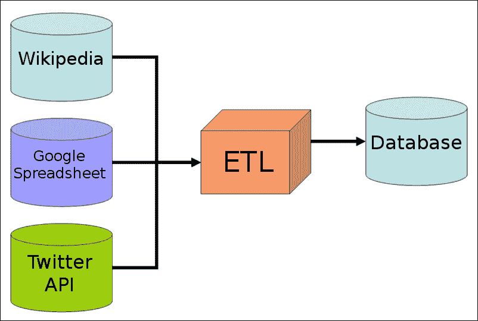
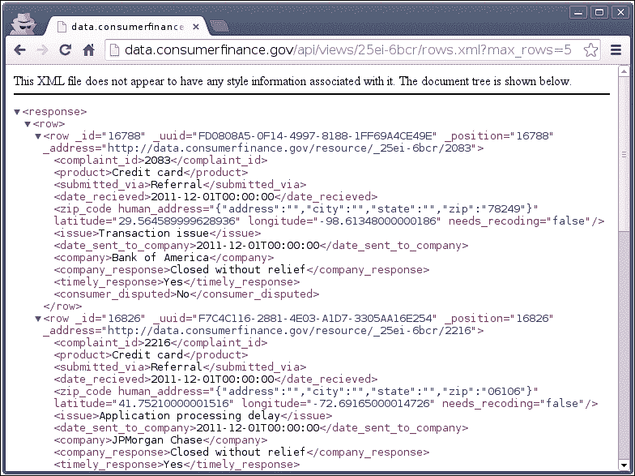
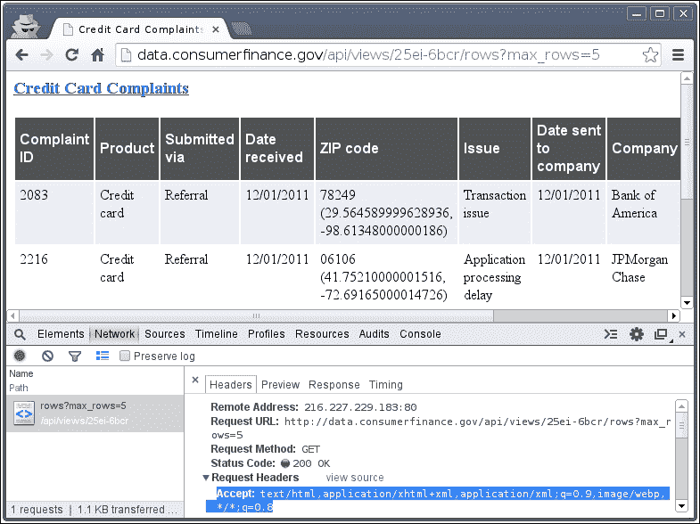
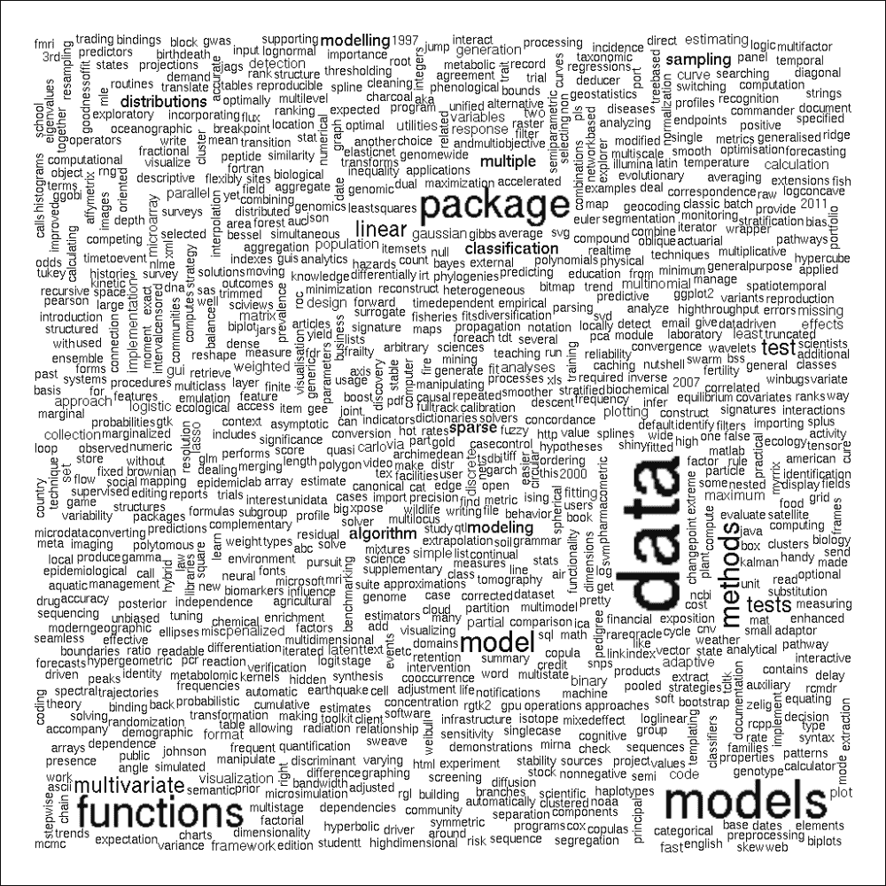

# 二、从网上获取数据

经常发生的情况是，我们想在一个项目中使用我们的数据库或磁盘上还没有的数据，但可以在互联网上找到。在这种情况下，一种选择可能是让我们公司的 IT 部门或数据工程师扩展我们的数据仓库，以收集、处理数据并将其加载到我们的数据库中，如下图所示:



另一方面，如果我们没有 *ETL* 系统(*来提取、转换和加载数据*)或者只是不能等待 it 部门几个星期来实现我们的请求，我们就只能靠自己了。这对于数据科学家来说是相当标准的，因为大多数时候我们开发的原型可以被软件开发人员转化为产品。为此，在日常工作中需要多种技能，包括我们将在本章中涉及的以下主题:

*   以编程方式从 Web 下载数据
*   处理 XML 和 JSON 格式
*   从原始 HTML 源抓取和解析数据
*   与 API 交互

虽然成为一名数据科学家被认为是 21 世纪最性感的工作(来源:[https://HBR . org/2012/10/data-scientist-the-sexy-job-of-the-ST-century/](https://hbr.org/2012/10/data-scientist-the-sexiest-job-of-the-21st-century/))，但大多数数据科学任务都与数据分析无关。更糟糕的是，有时这份工作似乎很无聊，或者日常工作只需要基本的 IT 技能，根本不需要机器学习。因此，我更愿意称这个角色为*数据黑客*，而不是*数据科学家*，这也意味着我们经常不得不弄脏自己的手。

例如，抓取和清理数据肯定是分析过程中最无趣的部分，但却是最重要的步骤之一；据说，大约 80%的数据分析花费在清理数据上。在垃圾数据上运行最先进的机器学习算法是没有意义的，所以一定要花时间从你的来源中获得有用和整洁的数据。

### 注意

本章也将依赖于一些 R 包对互联网浏览器调试工具的广泛使用。其中包括火狐浏览器中的 Chrome `DevTools`或`FireBug`。虽然使用这些工具的步骤很简单，也会显示在屏幕截图上，但是为了将来的使用，掌握这些工具绝对是值得的；因此，如果您喜欢从在线资源获取数据，我建议您查看一些关于这些工具的教程。本书末尾的*附录*的*参考文献*部分列出了一些起点。

为了快速浏览和收集从 Web 抓取数据并与 Web 服务交互的相关 R 包，请参见位于 http://cran.r-project.org/web/views/WebTechnologies.html[的 *Web 技术和服务 CRAN 任务视图*T3](http://cran.r-project.org/web/views/WebTechnologies.html)。

# 从互联网加载数据集

最明显的任务是从网上下载数据集，并通过两个手动步骤将它们加载到我们的 R 会话中:

1.  将数据集保存到磁盘。
2.  读取具有标准功能的文件，如`read.table`或`foreign::read.spss`，导入`sav`文件。

但是我们通常可以跳过第一步，直接从 URL 加载纯文本数据文件，从而节省一些时间。以下示例从位于[http://opengeocode.org](http://opengeocode.org)的**美洲开放地理编码** ( **AOG** )数据库中获取一个逗号分隔文件，其中包含世界各国的政府、国家统计数据、地质信息和邮局网站:

```r
> str(read.csv('http://opengeocode.org/download/CCurls.txt'))

'data.frame':  249 obs. of  5 variables:

 $ ISO.3166.1.A2                  : Factor w/ 248 levels "AD" ...

 $ Government.URL                 : Factor w/ 232 levels ""  ...

 $ National.Statistics.Census..URL: Factor w/ 213 levels ""  ...

 $ Geological.Information.URL     : Factor w/ 116 levels ""  ...

 $ Post.Office.URL                : Factor w/ 156 levels ""  ...

```

在这个例子中，我们向`read.table`的`file`参数传递了一个超链接，它实际上在处理之前下载了文本文件。`read.table`在后台使用的`url`功能，支持 HTTP 和 FTP 协议，也可以处理代理，但是有自己的局限性。例如`url`不支持**超文本传输协议安全** ( **HTTPS** ) 除了 Windows 上的少数例外，这通常是访问处理敏感数据的网络服务所必须的。

### 注意

HTTPS 不是与 HTTP 并行的独立协议，而是通过加密的 SSL/TLS 连接的 HTTP。虽然 HTTP 被认为是不安全的，因为在客户端和服务器之间传输的是未加密的数据包，但 HTTPS 不会让第三方在签名和可信证书的帮助下发现敏感信息。

在这种情况下，安装并使用 `RCurl`包是明智的，并且曾经是唯一合理的选择，它是 curl:[http://curl . haxx . se](http://curl.haxx.se)的一个 R 客户端接口。Curl 支持各种各样的协议和 URI 方案，并处理 cookies、认证、重定向、超时等等。

例如，让我们在[http://catalog.data.gov/dataset](http://catalog.data.gov/dataset)查看美国政府的公开数据目录。虽然没有 SSL 也可以访问一般的站点，但是大多数生成的下载 URL 都遵循 HTTPS URI 方案。在下面的例子中，我们将从消费者金融保护局获取消费者投诉数据库的**逗号分隔值** ( **CSV** )文件，该文件可在[http://catalog.data.gov/dataset/consumer-complaint-database](http://catalog.data.gov/dataset/consumer-complaint-database)访问。

### 注意

该 CSV 文件包含自 2011 年以来约 25 万起金融产品和服务投诉的元数据。请注意，该文件大约为 35-40 兆字节，因此下载它可能需要一些时间，并且您可能不希望在移动或有限的互联网上重现以下示例。如果`getURL`函数因证书错误而失败(这可能发生在 Windows 上)，请通过`options(RCurlOptions = list(cainfo = system.file("CurlSSL", "cacert.pem", package = "RCurl")))`手动提供证书的路径，或者尝试最近由耶鲁安 Ooms 发布的`curl`包或由 Hadley Wickham 发布的`httr` ( `RCurl`前端)——见下文。

让我们在直接从 R:

```r
> library(RCurl)

Loading required package: bitops

> url <- 'https://data.consumerfinance.gov/api/views/x94z-ydhh/rows.csv?accessType=DOWNLOAD'

> df  <- read.csv(text = getURL(url))

> str(df)

'data.frame':  236251 obs. of  14 variables:

 $ Complaint.ID        : int  851391 851793 ...

 $ Product             : Factor w/ 8 levels ...

 $ Sub.product         : Factor w/ 28 levels ...

 $ Issue               : Factor w/ 71 levels "Account opening ...

 $ Sub.issue           : Factor w/ 48 levels "Account status" ...

 $ State               : Factor w/ 63 levels "","AA","AE",,..

 $ ZIP.code            : int  14220 64119 ...

 $ Submitted.via       : Factor w/ 6 levels "Email","Fax" ...

 $ Date.received       : Factor w/ 897 levels  ...

 $ Date.sent.to.company: Factor w/ 847 levels "","01/01/2013" ...

 $ Company             : Factor w/ 1914 levels ...

 $ Company.response    : Factor w/ 8 levels "Closed" ...

 $ Timely.response.    : Factor w/ 2 levels "No","Yes" ...

 $ Consumer.disputed.  : Factor w/ 3 levels "","No","Yes" ...

> sort(table(df$Product))

 Money transfers         Consumer loan              Student loan 

 965                  6564                      7400 

 Debt collection      Credit reporting   Bank account or service 

 24907                 26119                     30744 

 Credit card              Mortgage 

 34848                104704

```

虽然很高兴知道大多数投诉都是关于抵押贷款的，但这里的要点是使用 curl 下载带有 HTTPS URI 的 CSV 文件，然后将内容作为文本传递给`read.csv`函数(或我们在前一章中讨论的任何其他解析器)。

### 注意

除了`GET`请求之外，您还可以通过`RCurl`包中的`postForm`函数或者`httpDELETE`、`httpPUT`或`httpHEAD`函数，通过`POST`、`DELETE`或`PUT`请求轻松地与 RESTful API 端点进行交互——参见后面关于`httr`包的详细信息。

Curl 还可以帮助从要求授权的安全网站下载数据。最简单的方法是在浏览器中登录主页，将 cookie 保存到一个文本文件中，然后将该文件的路径传递给`getCurlHandle`中的`cookiefile`。您还可以在其他选项中指定`useragent`。请参见[http://www.omegahat.org/RCurl/RCurlJSS.pdf](http://www.omegahat.org/RCurl/RCurlJSS.pdf)了解更多细节，以及最重要的 RCurl 特性的总体(非常有用)概述。

虽然 curl 非常强大，但是语法和大量的技术细节对于没有良好 IT 背景的人来说可能太复杂了。`httr`包是围绕`RCurl`的一个简化包装器，带有一些合理的缺省值和更简单的配置选项，用于常见操作和日常操作。

例如，通过在对同一网站的所有请求之间共享同一连接来自动处理 cookies 错误处理得到了很大的改进，这意味着如果出现问题，调试会更容易；这个包附带了各种帮助函数，例如，设置头、使用代理、轻松地发出`GET`、`POST`、`PUT`、`DELETE`和其他方法。更重要的是，它还以更加用户友好的方式处理身份验证，并支持 OAuth。

### 注意

OAuth 是借助中介服务提供商进行授权的开放标准。这仅仅意味着用户不必共享实际凭证，而是可以委托权限来访问服务提供商处的一些存储信息。例如，可以授权 Google 与第三方共享真实姓名、电子邮件地址等信息，而无需披露任何其他敏感信息或密码。最常见的是，OAuth 用于各种 Web 服务和 API 的无密码登录。更多信息，请参见[第 14 章](ch14.html "Chapter 14. Analyzing the R Community")、*分析 R 社区*，这里我们将使用 OAuth 和 Twitter 来授权 R 会话获取数据。

但是如果数据不能以 CSV 文件的形式下载呢？


# 其他流行的在线数据格式

结构化数据通常以 XML 或 JSON 格式出现在网上。这两种格式之所以如此受欢迎，是因为它们都是可读的，从编程的角度来看易于处理，并且可以管理任何类型的分层数据结构，而不仅仅是简单的表格设计，就像 CSV 文件一样。

### 注意

JSON 最初来源于 *JavaScript 对象符号*，最近成为人类可读数据交换格式的顶级、最常用的标准之一。JSON 被认为是具有属性-值对的 XML 的低开销替代方案，尽管它也支持多种对象类型，如数字、字符串、布尔、有序列表和关联数组。JSON 在 Web 应用程序、服务和 API 中被广泛使用。

当然，R 也支持在 JSON 中加载(和保存)数据。让我们通过消费者金融保护局提供的 Socrata API(稍后在本章的 *R packages 与数据源 API*部分将详细介绍)从前面的示例中获取一些数据来演示这一点。API 的完整文档可在[http://www . consumer finance . gov/complaint database/technical-documentation](http://www.consumerfinance.gov/complaintdatabase/technical-documentation)获得。

API 的端点是一个 URL，我们可以在这里查询后台数据库，而无需认证是[http://data.consumerfinance.gov/api/views](http://data.consumerfinance.gov/api/views)。为了全面了解数据的结构，下面是在浏览器中打开的返回的 JSON 列表:


由于 JSON 非常容易阅读，在解析之前手动浏览一下结构通常会非常有帮助。现在让我们用 `rjson`包将树列表加载到 R 中:

```r
> library(rjson)

> u <- 'http://data.consumerfinance.gov/api/views'

> fromJSON(file = u)

[[1]]

[[1]]$id

[1] "25ei-6bcr"

[[1]]$name

[1] "Credit Card Complaints"

[[1]]$averageRating

[1] 0

…

```

嗯，这似乎不是我们以前在逗号分隔值文件中看到的相同数据！仔细查看文档后，可以清楚地看到，API 的端点返回可用视图上的元数据，而不是我们在 CSV 文件中看到的原始表格数据。现在让我们通过在浏览器中打开相关的 URL 来查看前五行的 ID 为`25ei-6bcr`的视图:


产生的 JSON 列表的结构肯定已经改变。现在让我们将层次列表读入 R:

```r
> res <- fromJSON(file = paste0(u,'/25ei-6bcr/rows.json?max_rows=5'))

> names(res)

[1] "meta" "data"

```

我们设法获取了数据以及关于视图、列等的一些进一步的元信息，这不是我们目前感兴趣的东西。由于`fromJSON`返回了一个`list`对象，我们可以简单地删除元数据，从现在开始使用`data`行:

```r
> res <- res$data

> class(res)

[1] "list"

```

这还是一个`list`，我们通常想把它转化成一个`data.frame`来代替。所以我们有了包含五个元素的`list`，每个元素包含 19 个嵌套的子元素。请注意，其中一个，第 13 个子元素，再次列出了 5-5 个向量。这意味着将树列表转换成表格格式并不简单，当我们意识到其中一个向量以未处理的 JSON 格式保存多个值时就更不简单了。因此，为了简单和概念演示的证明，现在让我们简单地放弃与位置相关的值，并将所有其他值转换为`data.frame`:

```r
> df <- as.data.frame(t(sapply(res, function(x) unlist(x[-13]))))

> str(df)

'data.frame':  5 obs. of  18 variables:

 $ V1 : Factor w/ 5 levels "16756","16760",..: 3 5 ...

 $ V2 : Factor w/ 5 levels "F10882C0-23FC-4064-979C-07290645E64B" ...

 $ V3 : Factor w/ 5 levels "16756","16760",..: 3 5 ...

 $ V4 : Factor w/ 1 level "1364270708": 1 1 ...

 $ V5 : Factor w/ 1 level "403250": 1 1 ...

 $ V6 : Factor w/ 5 levels "1364274327","1364274358",..: 5 4 ...

 $ V7 : Factor w/ 1 level "546411": 1 1 ...

 $ V8 : Factor w/ 1 level "{\n}": 1 1 ...

 $ V9 : Factor w/ 5 levels "2083","2216",..: 1 2 ...

 $ V10: Factor w/ 1 level "Credit card": 1 1 ...

 $ V11: Factor w/ 2 levels "Referral","Web": 1 1 ...

 $ V12: Factor w/ 1 level "2011-12-01T00:00:00": 1 1 ...

 $ V13: Factor w/ 5 levels "Application processing delay",..: 5 1 ...

 $ V14: Factor w/ 3 levels "2011-12-01T00:00:00",..: 1 1 ...

 $ V15: Factor w/ 5 levels "Amex","Bank of America",..: 2 5 ...

 $ V16: Factor w/ 1 level "Closed without relief": 1 1 ...

 $ V17: Factor w/ 1 level "Yes": 1 1 ...

 $ V18: Factor w/ 2 levels "No","Yes": 1 1 ...

```

所以我们应用了一个简单的函数，从列表的每个元素中删除位置信息(通过删除每个 *x* 的第 13 个元素)，自动简化为`matrix`(通过使用`sapply`而不是`lapply`来遍历列表的每个元素)，转置它(通过`t`，然后将结果对象强制为`data.frame`。

我们也可以使用一些辅助函数，而不是像前面那样手动调整所有的列表元素。 `plyr`包(详见[第三章](ch03.html "Chapter 3. Filtering and Summarizing Data")、*过滤汇总数据*和[第四章](ch04.html "Chapter 4. Restructuring Data")、*重组数据*)包含了一些非常有用的拆分和合并数据的函数:

```r
> library(plyr)

> df <- ldply(res, function(x) unlist(x[-13]))

```

现在看起来更熟悉了，尽管我们漏掉了变量名，所有的值都被转换成了字符向量或因子——甚至是作为 UNIX 时间戳存储的日期。借助于所提供的元数据(`res$meta`)，我们可以很容易地解决这些问题:例如，让我们通过提取(通过`[`操作符)除了被删除的(第 13 个)位置数据之外的所有列的名称字段来设置变量名:

```r
> names(df) <- sapply(res$meta$view$columns, `[`, 'name')[-13]

```

人们也可以在所提供的元数据的帮助下识别对象类。例如，`renderTypeName`字段将是一个很好的检查起点，使用`as.numeric`表示数字，使用`as.POSIXct`表示所有的`calendar_date`字段将会解决前面的大部分问题。

你听说过吗，大约 80%的数据分析花费在数据准备上。

将 JSON 和 XML 解析和重组为`data.frame`可能需要很长时间，尤其是当您主要处理分层列表时。 `jsonlite`包试图通过将 R 对象转换成传统的 JSON 数据结构来克服这个问题，反之亦然，而不是原始转换。从实用的角度来看，这意味着如果可能的话，`jsonlite::fromJSON`将产生`data.frame`而不是原始列表，这使得交换数据格式更加无缝。不幸的是，我们不能总是将列表转换成表格格式；在这种情况下，列表转换可以通过 `rlist`包来加速。请在[第 14 章](ch14.html "Chapter 14. Analyzing the R Community")、*分析 R 社区*中找到更多关于列表操作的详细信息。

### 注意

可扩展标记语言 ( **XML** ) 最初由万维网联盟于 1996 年开发，以人类可读和机器可读的格式存储文档。这种流行的语法用于例如 Microsoft Office Open XML 和 Open/LibreOffice OpenDocument 文件格式、RSS 提要和各种配置文件中。由于这种格式也广泛用于互联网上的数据交换，所以数据通常以 XML 格式作为唯一的选择——特别是对于一些较老的 API。

让我们看看如何处理 JSON 之外的另一种流行的在线数据交换格式。XML API 可以以类似的方式使用，但是我们必须在端点 URL 中定义期望的输出格式:[http://data.consumerfinance.gov/api/views.xml](http://data.consumerfinance.gov/api/views.xml)，正如您应该能够在下面的屏幕截图中看到的:



API 的 XML 输出似乎与我们在 JSON 格式中看到的不同，它只包含我们感兴趣的行。这样，我们可以简单地解析 XML 文档，从响应中提取行，然后将它们转换成`data.frame`:

```r
> library(XML)

> doc <- xmlParse(paste0(u, '/25ei-6bcr/rows.xml?max_rows=5'))

> df  <- xmlToDataFrame(nodes = getNodeSet(doc,"//response/row/row"))

> str(df)

'data.frame':  5 obs. of  11 variables:

 $ complaint_id        : Factor w/ 5 levels "2083","2216",..: 1 2 ...

 $ product             : Factor w/ 1 level "Credit card": 1 1 ...

 $ submitted_via       : Factor w/ 2 levels "Referral","Web": 1 1 ...

 $ date_recieved       : Factor w/ 1 level "2011-12-01T00:00:00" ...

 $ zip_code            : Factor w/ 1 level "": 1 1 ...

 $ issue               : Factor w/ 5 levels  ...

 $ date_sent_to_company: Factor w/ 3 levels "2011-12-01T00:00:00" ...

 $ company             : Factor w/ 5 levels "Amex" ....

 $ company_response    : Factor w/ 1 level "Closed without relief"...

 $ timely_response     : Factor w/ 1 level "Yes": 1 1 ...

 $ consumer_disputed   : Factor w/ 2 levels "No","Yes": 1 1 ...

```

尽管我们可以在传递给`xmlToDataFrame`的`colClasses`参数中手动设置期望的变量类，就像在`read.tables`中一样，我们也可以在之后用一个快速的`helper`函数来解决这个问题:

```r
> is.number <- function(x)

+     all(!is.na(suppressWarnings(as.numeric(as.character(x)))))

> for (n in names(df))

+     if (is.number(df[, n]))

+         df[, n] <- as.numeric(as.character(df[, n]))

```

所以我们试图猜测一个列是否只包含数字，如果我们的帮助函数返回`TRUE`，就将这些数字转换成`numeric`。请注意，在转换为数字之前，我们首先将`factor`转换为`character`，因为从`factor`到`numeric`的直接转换将返回`factor`顺序而不是实际值。也可以尝试用`type.convert`函数来解决这个问题，这个函数在`read.table`中是默认使用的。

### 注意

为了测试类似的API 和 JSON 或 XML 资源，您可能会发现查看 Twitter、GitHub 或其他在线服务提供商的 API 会很有趣。另一方面，还有另一个基于 R 的开源服务，可以从任何 R 代码返回 XML、JSON 或 CSV 文件。请到 http://www.opencpu.org[了解更多详情](http://www.opencpu.org)。

因此，现在我们可以处理各种可下载数据格式的结构化数据，但是，由于还需要掌握一些其他数据源选项，我向您保证，继续阅读是值得的。


# 从 HTML 表格中读取数据

根据万维网上传统的文档格式，大多数文本和数据都是在 HTML 页面中提供的。我们经常可以在 HTML 表格中找到有趣的信息，从这些表格中可以很容易地将数据复制并粘贴到 Excel 电子表格中，保存到磁盘，然后加载到 R 中。但是很费时间，很无聊，反正可以自动化。

这种 HTML 表格可以在上述客户兼容数据库的 API 的帮助下容易地生成。如果我们没有设置之前使用的 XML 或 JSON 所要求的输出格式，那么浏览器会返回一个 HTML 表，正如您在下面的屏幕截图中看到的:



嗯，在 R 控制台中，这有点复杂，因为浏览器在使用 curl 时会发送一些非默认的 HTTP 头，所以前面的 url 会简单地返回一个 JSON 列表。要获取 HTML，让服务器知道我们期望 HTML 输出。为此，只需设置适当的查询 HTTP 头:

```r
> doc <- getURL(paste0(u, '/25ei-6bcr/rows?max_rows=5'),

+   httpheader = c(Accept = "text/html"))

```

在`readHTMLTable`函数的帮助下，`XML`包提供了一种极其简单的方法来解析来自文档或特定节点的所有 HTML 表格，默认情况下，该函数返回一个`data.frames`的`list`:

```r
> res <- readHTMLTable(doc)

```

为了只获得页面上的第一个表，我们可以稍后过滤`res`，或者将`which` 参数传递给`readHTMLTable`。以下两个 R 表达式具有完全相同的结果:

```r
> df <- res[[1]]

> df <- readHTMLTable(doc, which = 1)

```

## 从静态网页中读取表格数据

好吧，到目前为止，我们已经看到了同一主题的一系列变体，但是如果我们找不到任何流行数据格式的可下载数据集呢？例如，人们可能对 CRAN 托管的可用 R 包感兴趣，其列表可在[http://CRAN . R-project . org/web/packages/available _ packages _ by _ name . html](http://cran.r-project.org/web/packages/available_packages_by_name.html)获得。我们如何刮那个？不需要调用`RCurl`或指定自定义头，更不用说我们必须先下载文件；把网址传给`readHTMLTable`就够了:

```r
> res <- readHTMLTable('http://cran.r-project.org/Web/packages/available_packages_by_name.html')

```

所以`readHTMLTable`可以直接获取 HTML 页面，然后它将所有的 HTML 表格提取到`data.frame` R 对象，并返回这些表格的一个`list`。在前面的例子中，我们得到了一个只有一个`data.frame`的`list`，所有的包名和描述都作为列。

嗯，对于`str`函数来说，这么多的文本信息并不能真正提供信息。为了快速处理和可视化这种类型的原始数据，并通过 CRAN 的 R 包展示过多的可用特性，现在我们可以用来自`wordcloud`和 `tm`包的一些漂亮的函数创建包描述的文字云:

```r
> library(wordcloud)

Loading required package: Rcpp

Loading required package: RColorBrewer

> wordcloud(res[[1]][, 2])

Loading required package: tm

```

这个简短的命令产生了下面的屏幕截图，它显示了在 R 包描述中最常见的单词。字的位置没有特别的意义，但是字体越大，出现的频率越高。请看截图后的剧情技术描述:



所以我们简单地将第一个`list` 元素的第二列中的所有字符串传递给`wordcloud`函数，该函数自动运行文本上的`tm`包中的一些文本挖掘脚本。你可以在[第 7 章](ch07.html "Chapter 7. Unstructured Data")、*非结构化数据*中找到关于这个主题的更多细节。然后，它用相对大小来呈现单词，这个相对大小由在包描述中出现的次数来加权。看起来 R 包确实主要针对建立模型和对数据进行多元测试。


# 从其他在线来源收集数据

虽然`readHTMLTable`函数非常有用，但有时数据并不是结构化在表中，而是只能以 HTML 列表的形式获得。让我们通过在[http://cran.r-project.org/web/views/WebTechnologies.html](http://cran.r-project.org/web/views/WebTechnologies.html)检查相关 CRAN 任务视图中列出的所有 R 包来展示这样一种数据格式，如下图所示:


所以我们看到了一个 HTML 列表，其中包含了一个指向 CRAN 的 URL，或者在某些情况下指向 GitHub 库。要继续，首先我们必须对 HTML 源代码有所了解，看看我们如何解析它们。你可以在 Chrome 或 Firefox 中很容易地做到这一点:只需右键单击列表顶部的 **CRAN** packages 标题，并选择 **Inspect Element** ，如下面的截图所示:


所以我们在一个`ul`(无序列表)HTML 标签中有了相关 R 包的列表，就在保存了`CRAN packages`字符串的`h3`(3 级标题)标签之后。

简而言之:

*   我们必须解析这个 HTML 文件
*   查找包含搜索词的第三级标题
*   从随后的无序 HTML 列表中获取所有列表元素

例如，这可以通过 XML Path 语言来完成，它有一个特殊的语法来通过查询选择 XML/HTML 文档中的节点。

### 注意

有关更多细节和 R 驱动的示例，请参见 Deborah Nolan 和 Duncan Temple Lang 在《使用 R！斯普林格的系列。更多参考资料请见本书末尾的*附录*。

乍一看，XPath 可能相当难看和复杂。例如，前面的列表可以描述为:

```r
//h3[text()='CRAN packages:']/following-sibling::ul[1]/li

```

让我详细解释一下:

1.  我们正在寻找一个以`CRAN packages`为文本的`h3`标签，所以我们在整个文档中搜索具有这些属性的特定节点。
2.  然后，`following-siblings`表达式代表与所选的`h3`标签处于同一层级的所有后续节点。
3.  过滤以仅查找`ul` HTML 标签。
4.  因为我们有几个这样的兄弟，所以我们只选择第一个更远的兄弟，在括号之间有索引`(1)`。
5.  然后我们简单地选择中的所有`li`标签(列表元素)。

让我们试试 R:

```r
> page <- htmlParse(file = 

+   'http://cran.r-project.org/Web/views/WebTechnologies.html')

> res  <- unlist(xpathApply(doc = page, path =

+   "//h3[text()='CRAN packages:']/following-sibling::ul[1]/li",

+   fun  = xmlValue))

```

并且我们有相关的 118 R 包的特征向量:

```r
> str(res)

 chr [1:118] "acs" "alm" "anametrix" "AWS.tools" "bigml" ...

```

XPath 对于在 HTML 文档中选择和搜索节点确实很强大，`xpathApply`也是如此。后者是对`libxml`中大多数 XPath 功能的 R 包装，这使得这个过程相当快速和高效。人们可能更愿意使用`xpathSApply`，它试图简化返回的元素列表，就像与`lapply`函数相比`sapply`所做的那样。所以我们也可以更新之前的代码来保存`unlist`调用:

```r
> res <- xpathSApply(page, path =

+ "//h3[text()='CRAN packages:']/following-sibling::ul[1]/li", 

+   fun  = xmlValue)

```

细心的读者一定已经注意到，返回的列表是一个简单的字符向量，而原始的 HTML 列表还包括上述包的 URL。这些东西在哪里消失了，为什么会消失？

我们可以将这个结果归咎于`xmlValue`，我们调用了它而不是默认的`NULL`作为评估函数，在`xpathSApply`调用中从原始文档中提取节点。这个函数只是提取每个没有任何子节点的叶节点的原始文本内容，这解释了这种行为。如果我们对包的 URL 更感兴趣呢？

在没有指定函数的情况下调用`xpathSapply`会返回所有原始的子节点，这没有任何直接的帮助，我们不应该试图在这些子节点上应用一些正则表达式。`xmlValue`的帮助页面可以为我们指出一些类似的功能，这些功能对于这些任务来说非常方便。这里我们肯定要用`xmlAttrs`:

```r
> xpathSApply(page,

+   "//h3[text()='CRAN packages:']/following-sibling::ul[1]/li/a",

+   xmlAttrs, 'href')

```

请注意，这里使用了一个更新路径，现在我们选择了所有的`a`标签，而不是`li`父标签。并且，代替之前引入的`xmlValue`，现在我们用`'href'`额外的参数调用`xmlAttrs`。这只是提取所有相关的`a`节点的所有`href`参数。

使用这些原语，您将能够从在线资源中获取任何公开可用的数据，尽管有时实现可能会非常复杂。

### 注意

另一方面，请务必始终查阅所有潜在数据源的条款和条件以及其他法律文档，因为获取数据通常是版权所有者所禁止的。

除了法律问题，从服务提供商的技术角度考虑获取和抓取数据也是明智的。如果您在没有事先咨询服务器管理员的情况下就开始向服务器发送过多的查询，这种行为可能会被认为是网络攻击和/或可能会给服务器带来不必要的负载。为了保持简单，总是在查询之间使用合理的延迟。例如，查询之间至少应该有 2 秒钟的暂停，但是最好检查一下在网站的 *robot.txt* 中设置的 *Crawl-delay* 指令，如果可以的话，可以在根路径中找到。如果允许或限制爬网，该文件还包含其他指令。大多数数据提供者站点也有一些关于数据抓取的技术文档；请务必搜索速率限制和节流。

有时我们只是很幸运，因为其他人已经编写了复杂的 XPath 选择器或其他接口，所以我们可以在本地 R 包的帮助下从 Web 服务和主页加载数据。


# 与数据源 API 交互的 R 包

虽然我们可以读取 HTML 表格、CSV 文件、JSON 和 XML 数据，甚至可以解析原始 HTML 文档以将其中的一些部分存储在数据集中，但是在没有其他选择之前，花费太多时间开发定制工具是没有意义的。首先，总是从快速浏览 Web 技术和服务 CRAN 任务视图开始；另外，在使用定制 XPath 选择器和 JSON 列表魔术之前，搜索 R-bloggers、StackOverflow 和 GitHub，寻找任何可能的解决方案。

## Socrata 开放数据应用编程接口

让我们通过搜索消费者金融保护局的开放数据应用程序接口 Socrata 来为我们之前的示例执行此操作。是的，有一个解决方案:

```r
> library(RSocrata)

Loading required package: httr

Loading required package: RJSONIO

Attaching package: 'RJSONIO'

The following objects are masked from 'package:rjson':

 fromJSON, toJSON

```

事实上， `RSocrata`包使用了和我们之前一样的 JSON 源文件(或者 CSV 文件)。请注意警告消息，它说`RSocrata`依赖于另一个 JSON parser R 包，而不是我们使用的那个，所以有些函数名是冲突的。在自动加载 `RJSONIO`包之前先`detach('package:rjson')`可能是明智的。

使用`RSocrata`通过给定的 URL 加载客户投诉数据库非常容易:

```r
> df <- read.socrata(paste0(u, '/25ei-6bcr'))

> str(df)

'data.frame':  18894 obs. of  11 variables:

 $ Complaint.ID        : int  2240 2243 2260 2254 2259 2261 ...

 $ Product             : chr  "Credit card" "Credit card" ...

 $ Submitted.via       : chr  "Web" "Referral" "Referral" ...

 $ Date.received       : chr  "12/01/2011" "12/01/2011" ...

 $ ZIP.code            : chr  ...

 $ Issue               : chr  ...

 $ Date.sent.to.company: POSIXlt, format: "2011-12-19" ...

 $ Company             : chr  "Citibank" "HSBC" ...

 $ Company.response    : chr  "Closed without relief" ...

 $ Timely.response.    : chr  "Yes" "Yes" "No" "Yes" ...

 $ Consumer.disputed.  : chr  "No" "No" "" "No" ...

```

我们得到了数字的值`numeric`，日期也被自动处理为`POSIXlt`！

类似地，WebTechnologies and Services CRAN Task View 包含 100 多个 R 包，用于与自然科学领域(如生态学、遗传学、化学、气象、金融、经济学和市场营销)的 Web 数据源进行交互，但我们也可以找到 R 包来获取文本、书目资源、Web 分析、新闻、地图和社交媒体数据以及其他一些主题。由于页面限制，这里我们将只关注最常用的包。

## 财务 API

雅虎！和谷歌财经对于所有在这个行业工作的人来说都是相当标准的免费数据源。使用 `quantmod`包和前面提到的服务提供商，获取股票、金属或外汇价格非常容易。例如，让我们看看安捷伦科技公司的最新股票价格，股票代码为`A`:

```r
> library(quantmod)

Loading required package: Defaults

Loading required package: xts

Loading required package: zoo

Attaching package: 'zoo'

The following objects are masked from 'package:base':

 as.Date, as.Date.numeric

Loading required package: TTR

Version 0.4-0 included new data defaults. See ?getSymbols.

> tail(getSymbols('A', env = NULL))

 A.Open A.High A.Low A.Close A.Volume A.Adjusted

2014-05-09  55.26  55.63 54.81   55.39  1287900      55.39

2014-05-12  55.58  56.62 55.47   56.41  2042100      56.41

2014-05-13  56.63  56.98 56.40   56.83  1465500      56.83

2014-05-14  56.78  56.79 55.70   55.85  2590900      55.85

2014-05-15  54.60  56.15 53.75   54.49  5740200      54.49

2014-05-16  54.39  55.13 53.92   55.03  2405800      55.03

```

默认情况下，`getSymbols`将获取的结果分配给带有符号名称的`parent.frame`(通常是全局)环境，而将`NULL`指定为所需的环境只是将获取的结果作为`xts`时间序列对象返回，如前所述。

获取外汇汇率也同样容易:

```r
> getFX("USD/EUR")

[1] "USDEUR"

> tail(USDEUR)

 USD.EUR

2014-05-13  0.7267

2014-05-14  0.7281

2014-05-15  0.7293

2014-05-16  0.7299

2014-05-17  0.7295

2014-05-18  0.7303

```

`getSymbols`返回的字符串是指`.GlobalEnv`中保存数据的 R 变量。要查看所有可用的数据源，让我们查询相关的 S3 方法:

```r
> methods(getSymbols)

 [1] getSymbols.csv    getSymbols.FRED   getSymbols.google

 [4] getSymbols.mysql  getSymbols.MySQL  getSymbols.oanda 

 [7] getSymbols.rda    getSymbols.RData  getSymbols.SQLite

[10] getSymbols.yahoo

```

所以除了一些线下数据源，我们可以查询 Google，Yahoo！，和 OANDA 了解最新的财务信息。要查看可用符号的完整列表，已经加载的`TTR`包可能会有帮助:

```r
> str(stockSymbols())

Fetching AMEX symbols...

Fetching NASDAQ symbols...

Fetching NYSE symbols...

'data.frame':  6557 obs. of  8 variables:

 $ Symbol   : chr  "AAMC" "AA-P" "AAU" "ACU" ...

 $ Name     : chr  "Altisource Asset Management Corp" ...

 $ LastSale : num  841 88.8 1.3 16.4 15.9 ...

 $ MarketCap: num  1.88e+09 0.00 8.39e+07 5.28e+07 2.45e+07 ...

 $ IPOyear  : int  NA NA NA 1988 NA NA NA NA NA NA ...

 $ Sector   : chr  "Finance" "Capital Goods" ...

 $ Industry : chr  "Real Estate" "Metal Fabrications" ...

 $ Exchange : chr  "AMEX" "AMEX" "AMEX" "AMEX" ...

```

### 注意

在第十二章、*分析时间序列*中找到更多关于如何处理和分析相似数据集的信息。

## 用 Quandl 获取时间序列

Quandl 通过一个定制的 API，从大约 500 个数据源，以标准的格式提供对数百万相似时间序列数据的访问。在 R 中， `Quandl`包提供了对全球各行业所有这些开放数据的便捷访问。让我们看看美国证券交易委员会公布的安捷伦科技公司支付的股息。为此，只需在[http://www.quandl.com](http://www.quandl.com)主页搜索“安捷伦科技”，并将搜索结果中所需数据的代码提供给`Quandl`功能:

```r
> library(Quandl)

> Quandl('SEC/DIV_A')

 Date Dividend

1 2013-12-27    0.132

2 2013-09-27    0.120

3 2013-06-28    0.120

4 2013-03-28    0.120

5 2012-12-27    0.100

6 2012-09-28    0.100

7 2012-06-29    0.100

8 2012-03-30    0.100

9 2006-11-01    2.057

Warning message:

In Quandl("SEC/DIV_A") :

 It would appear you aren't using an authentication token. Please visit http://www.quandl.com/help/r or your usage may be limited.

```

如你所见，没有有效的认证令牌，API 是相当有限的，认证令牌可以在`Quandl`主页免费兑换。要设置您的令牌，只需将其传递给`Quandl.auth`函数。

该软件包还允许您:

*   按时间提取过滤的数据
*   在服务器端执行一些数据转换——比如累加和以及一阶微分
*   对数据进行排序
*   定义返回对象的期望类别，如`ts`、`zoo`和`xts`
*   下载一些关于数据源的元信息

后者保存为返回 R 对象的`attributes`。因此，例如，要查看被查询的数据集的频率，调用:

```r
> attr(Quandl('SEC/DIV_A', meta = TRUE), 'meta')$frequency

[1] "quarterly"

```

## 谷歌文档和分析

然而，你可能更感兴趣的是从谷歌文档中加载你自己的或定制的数据，为此， `RGoogleDocs`软件包很有帮助，可以在[http://www.omegahat.org/](http://www.omegahat.org/)主页下载。它提供对 Google 电子表格的认证访问，包括读写访问。

不幸的是，这个包已经过时了，并且使用了一些不推荐使用的 API 函数，所以你最好尝试一些新的替代品，比如最近发布的包，它可以从 r。

类似的软件包也可以与 Google Analytics 或 Google Adwords 进行交互，以帮助那些想要分析 r 中页面访问量或广告表现的人。

## 在线搜索趋势

另一方面，我们与 API 交互来下载公共数据。谷歌还在[http://www.google.com/publicdata/directory](http://www.google.com/publicdata/directory)提供访问世界银行、国际货币基金组织、美国人口普查局等的一些公开数据，并在[http://google.com/trends](http://google.com/trends)以搜索趋势的形式提供一些他们自己的内部数据。

后者可以非常容易地用的`GTrendsR`包来查询，CRAN 上还没有这个包，但是我们至少可以练习如何从其他来源安装 R 包。`GTrendR`代码库可以在`BitBucket`上找到，从那里用`devtools`包安装真的很方便:

### Tip

为了确保您安装的`GTrensR`版本与下面使用的版本相同，您可以在`install_bitbucket`(或`install_github`)函数的`ref`参数中指定`branch`、`commit`或其他引用。关于提交散列，请参见本书末尾的*附录*中的*引用*部分。

```r
> library(devtools)

> install_bitbucket('GTrendsR', 'persican', quiet = TRUE)

Installing bitbucket repo(s) GTrendsR/master from persican

Downloading master.zip from https://bitbucket.org/persican/gtrendsr/get/master.zip

arguments 'minimized' and 'invisible' are for Windows only 

```

因此，从 BitBucket 或 GitHub 安装 R 包就像提供代码库的名称和作者的用户名一样简单，剩下的工作由`devtools`来完成:下载源代码并编译它们。

Windows 用户应该在之前安装`Rtools`来编译来自源码【http://cran.r-project.org/bin/windows/Rtools/[的包](http://cran.r-project.org/bin/windows/Rtools/)。我们还启用了安静模式，以抑制编译日志和无聊的细节。

安装完软件包后，我们可以用传统方式加载它:

```r
> library(GTrendsR)

```

首先，在能够查询 Google 趋势数据库之前，我们必须使用有效的 Google 用户名和密码进行认证。我们的搜索词将是“如何安装 R”:

### Tip

请确保您提供了有效的用户名和密码；否则，下面的查询将失败。

```r
> conn <- gconnect('some Google username', 'some Google password')

> df   <- gtrends(conn, query = 'how to install R')

> tail(df$trend)

 start        end how.to.install.r

601 2015-07-05 2015-07-11               86

602 2015-07-12 2015-07-18               70

603 2015-07-19 2015-07-25              100

604 2015-07-26 2015-08-01               75

605 2015-08-02 2015-08-08               73

606 2015-08-09 2015-08-15               94 

```

返回的数据集包括 R 安装上搜索查询相对数量的每周指标。数据显示，7 月中旬记录的活动量最高，而只有大约 75%的搜索查询是在下个月初触发的。因此，谷歌不公布原始的搜索查询统计数据，而是可以用不同的搜索词和时间段进行比较研究。

## 历史天气数据

还有各种软件包为地球科学的所有 R 用户提供访问数据源的途径。比如 `RNCEP`包可以下载美国国家环境预测中心一百多年来的历史天气数据，6 个小时的分辨率。通过`weatherData`包可以直接访问[http://wunderground.com](http://wunderground.com)。举个简单的例子，让我们下载伦敦过去七天的日平均气温:

```r
> library(weatherData)

> getWeatherForDate('London', start_date = Sys.Date()-7, end_date = Sys.Date())

Retrieving from: http://www.wunderground.com/history/airport/London/2014/5/12/CustomHistory.html?dayend=19&monthend=5&yearend=2014&req_city=NA&req_state=NA&req_statename=NA&format=1 

Checking Summarized Data Availability For London

Found 8 records for 2014-05-12 to 2014-05-19

Data is Available for the interval.

Will be fetching these Columns:

[1] "Date"              "Max_TemperatureC"  "Mean_TemperatureC"

[4] "Min_TemperatureC" 

 Date Max_TemperatureC Mean_TemperatureC Min_TemperatureC

1 2014-05-12               18                13                9

2 2014-05-13               16                12                8

3 2014-05-14               19                13                6

4 2014-05-15               21                14                8

5 2014-05-16               23                16                9

6 2014-05-17               23                17               11

7 2014-05-18               23                18               12

8 2014-05-19               24                19               13

```

请注意，前面输出中一个不重要的部分被删除了，但是这里发生的事情非常简单:包获取了指定的 URL，顺便说一下，这是一个 CSV 文件，然后用一些附加信息对其进行解析。将`opt_detailed`设置为`TRUE`也将返回 30 分钟分辨率的当天数据。

## 其他在线数据来源

当然，这个简短的章节不能提供查询所有可用的在线数据源和 R 实现的概述，但是在创建自己的 crawler R 脚本之前，请参考 Web 技术和服务 CRAN Task View、R-bloggers、StackOverflow 和本书结尾的 *References* 章节中的资源，查找任何已经存在的 R 包或帮助函数。


# 总结

本章重点介绍了如何直接从 Web 获取和处理数据，包括下载文件、处理 XML 和 JSON 格式、解析 HTML 表、应用 XPath 选择器从 HTML 页面提取数据以及与 RESTful APIs 交互的一些问题。

尽管本章中的一些例子可能看起来像是与 Socrata API 的一场无意义的斗争，但事实证明,`RSocrata`包提供了对所有这些数据的生产就绪访问。但是，请记住，没有现成的 R 包，你会面临一些情况；因此，作为一名数据黑客，您必须接触所有的 JSON、HTML 和 XML 源代码。

在下一章中，我们将发现如何使用最常用的方法来过滤和聚合已经获取和加载的数据，以重塑和重构数据。