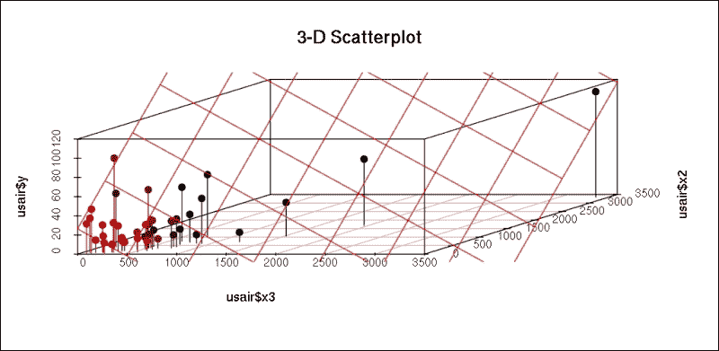
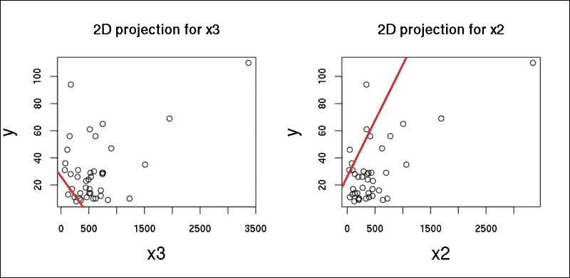
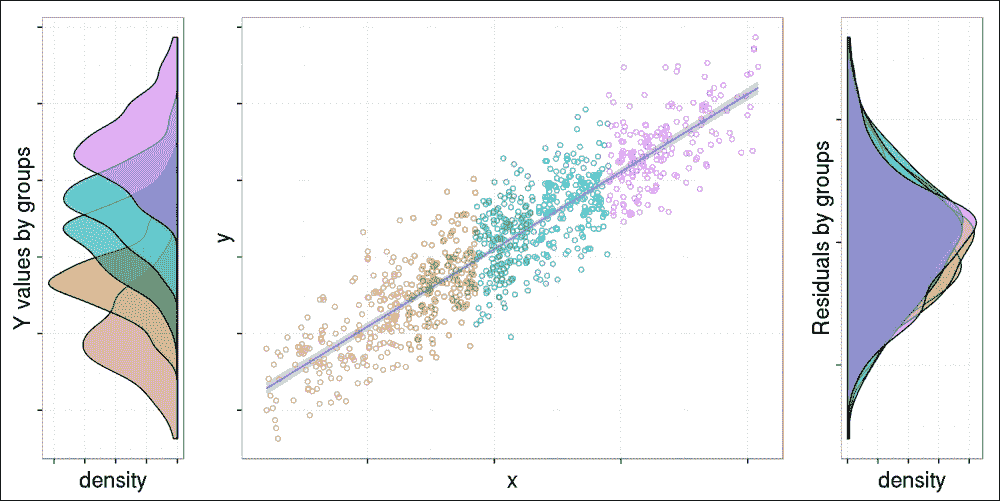
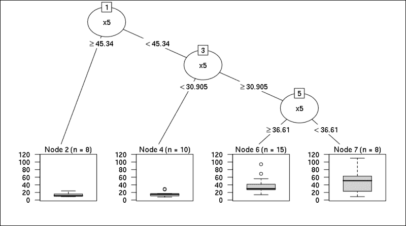

# 五、构建模型

> “所有模型都应该尽可能简单...但不会更简单。”
> 
> –归功于阿尔伯特·爱因斯坦
> 
> “所有的模型都是错的...但有些是有用的。”
> 
> 乔治·博克斯

在加载和转换数据之后，在本章中，我们将重点讨论如何建立统计模型。模型是现实的表示，正如前面的引文所强调的，总是简化的表示。虽然您不可能将所有的事情都考虑进去，但是您应该知道在一个好的模型中应该包含和排除什么，以提供有意义的结果。

本章在线性回归模型和标准建模的基础上讨论回归模型。**广义线性模型** ( **GLM** ) 扩展这些模型，以允许响应变量在分布上有所不同，这将在[第 6 章](ch06.html "Chapter 6. Beyond the Linear Trend Line (authored by Renata Nemeth and Gergely Toth)")、*超出线性趋势线(作者 Renata Nemeth 和 Gergely Toth)* 中讨论。总之，我们将讨论三个最著名的回归模型:

*   **线性回归**用于连续结果(出生体重以克计)
*   **二元结果(低出生体重与正常出生体重)的逻辑回归**
*   **泊松回归** 用于计数数据(每年或每个国家低出生体重儿的数量)

虽然还有许多其他的回归模型，如如 *Cox-regression* 我们在这里不讨论，但模型建立的逻辑和解释是相似的。所以，读完这一章，你就能明白那些没有疑问的了。

到本章结束时，你将学会回归模型最重要的事情:如何避免混淆，如何拟合，如何解释，以及如何在众多不同选项中选择最佳模型。

# 多元模型背后的动机

如果您想要测量响应和预测之间的关联强度，您可以选择一个简单的双向关联测量，如相关性或优势比，这取决于您数据的性质。但是，如果你的目标是通过考虑其他预测因素来模拟一个复杂的机制，你将需要回归模型。

正如《卫报》的循证专栏作家 Ben Goldacre 在他精彩的 TED 演讲中所说，橄榄油消费和年轻肌肤之间的紧密联系并不意味着橄榄油对我们的皮肤有益。在对复杂的关联结构建模时，我们还应该控制其他预测因素，如吸烟状况或体育活动，因为那些摄入更多橄榄油的人通常更有可能过上健康的生活，所以可能不是橄榄油本身防止了皮肤皱纹。简而言之，这种生活方式似乎很可能混淆了兴趣变量之间的关系，使得看起来可能有因果关系，而事实上没有。

### 注意

混杂因素是第三个变量，它会偏向(增加或减少)我们感兴趣的关联。混杂因素总是与反应和预测因子相关联。

如果我们通过确定吸烟状况来再次检验橄榄油和皮肤皱纹的联系，从而为吸烟者和非吸烟者建立不同的模型，这种联系可能会消失。保持混杂因素不变是通过回归模型控制混杂因素的主要思想。

回归模型通常旨在通过控制其他因素来衡量反应和预测因素之间的联系。潜在的混杂因素作为预测因素输入到模型中，预测因素的回归系数(*部分系数*)测量根据混杂因素调整的效果。


# 具有连续预测值的线性回归

让我们从一个真实且有启发性的混淆例子开始。假设我们希望根据城市的规模(以人口规模衡量，以千人为单位)来预测空气污染量。空气污染是通过空气中的二氧化硫(SO2)浓度来衡量的，单位为毫克每立方米。我们将使用来自的美国空气污染数据集(Hand 等人 1994)`gamlss.data`包:

```
> library(gamlss.data)

> data(usair)

```

## 模型解释

让我们通过建立一个公式来绘制我们的第一个线性回归模型。`stats`包中的`lm`函数用于拟合线性模型，这是回归建模的重要工具:

```
> model.0 <- lm(y ~ x3, data = usair)

> summary(model.0)

Residuals:

 Min      1Q  Median      3Q     Max 

-32.545 -14.456  -4.019  11.019  72.549 

Coefficients:

 Estimate Std. Error t value Pr(>|t|) 

(Intercept) 17.868316   4.713844   3.791 0.000509 ***

x3           0.020014   0.005644   3.546 0.001035 ** 

---

Signif. codes:  0 '***' 0.001 '**' 0.01 '*' 0.05 '.' 0.1 ' ' 1

Residual standard error: 20.67 on 39 degrees of freedom

Multiple R-squared:  0.2438,    Adjusted R-squared:  0.2244 

F-statistic: 12.57 on 1 and 39 DF,  p-value: 0.001035

```

### 注意

公式符号是 R 最好的特性之一，它让你以一种人性化的方式定义灵活的模型。典型的模型具有`response ~ terms`的形式，其中`response`是连续响应变量，`terms`提供一个或一系列数值变量，指定响应的线性预测值。

在前面的示例中，变量`y`表示空气污染，而`x3`表示人口规模。`x3`系数表示，人口规模每增加一个单位(一千)，二氧化硫浓度就会增加`0.02` 个单位(每立方米 0.02 毫克)，这种影响在统计上是显著的，其`p`值为`0.001035`。

### 注意

在*中查看关于 p 值的更多详细信息，直线与数据的拟合程度如何？*一节。为了简单起见，当 *p* 值低于`0.05`时，我们称模型为统计显著。

截距通常是每个预测值等于 0 时响应变量的值，但在本例中，没有没有居民的城市，因此截距(17.87)没有直接的解释。两个回归系数定义了回归线:

```
> plot(y ~ x3, data = usair, cex.lab = 1.5)

> abline(model.0, col = "red", lwd = 2.5)

> legend('bottomright', legend = 'y ~ x3', lty = 1, col = 'red',

+   lwd = 2.5, title = 'Regression line')

```


如你所见，截距( **17.87** )是回归线与 y 轴相交的值。另一个系数( **0.02** )是回归线的斜率:它衡量直线有多陡。这里，该函数上坡运行，因为斜率为正( **y** 随着 **x3** 增加而增加)。同样，如果斜率为负，则函数向下运行。

如果你意识到这条线是如何划定的，你就很容易理解这些估算是如何得出的。这是最符合数据点的直线。在这里，我们将*最佳拟合*称为线性最小二乘法，这就是为什么该模型也被称为 **普通最小二乘法** ( **OLS** )回归。

最小二乘法通过最小化残差的平方和找到最佳拟合线，其中残差表示误差，即观察值(散点图中的原始点)与拟合或预测值(线上具有相同 *x* 值的点)之间的差值:

```
> usair$prediction <- predict(model.0)

> usair$residual<- resid(model.0)

> plot(y ~ x3, data = usair, cex.lab = 1.5)

> abline(model.0, col = 'red', lwd = 2.5)

> segments(usair$x3, usair$y, usair$x3, usair$prediction,

+   col = 'blue', lty = 2)

> legend('bottomright', legend = c('y ~ x3', 'residuals'),

+   lty = c(1, 2), col = c('red', 'blue'), lwd = 2.5,

+   title = 'Regression line')

```


线性回归中的*线性*术语指的是我们对线性关系感兴趣的事实，与更复杂的方法相比，线性关系更自然、更容易理解、数学处理更简单。

## 多重预测

另一方面，如果我们的目标是通过将人口规模的影响与行业存在的影响分开，建立一个更加复杂的机制，我们必须控制变量`x2`，它描述了雇用 20 名以上工人的制造商的数量。现在，我们既可以通过`lm(y ~ x3 + x2, data = usair)`创建一个新模型，也可以使用`update`功能改装之前的模型:

```
> model.1 <- update(model.0, . ~ . + x2)

> summary(model.1)

Residuals:

 Min      1Q  Median      3Q     Max 

-22.389 -12.831  -1.277   7.609  49.533 

Coefficients:

 Estimate Std. Error t value Pr(>|t|) 

(Intercept) 26.32508    3.84044   6.855 3.87e-08 ***

x3          -0.05661    0.01430  -3.959 0.000319 ***

x2           0.08243    0.01470   5.609 1.96e-06 ***

---

Signif. codes:  0 '***' 0.001 '**' 0.01 '*' 0.05 '.' 0.1 ' ' 1

Residual standard error: 15.49 on 38 degrees of freedom

Multiple R-squared:  0.5863,    Adjusted R-squared:  0.5645 

F-statistic: 26.93 on 2 and 38 DF,  p-value: 5.207e-08

```

现在`x3`的系数就是`-0.06`！虽然在之前的模型中，空气污染和城市规模之间的粗略关联是正的，但在控制了制造商的数量后，这种关联变成了负的。这意味着人口每增加 1000 人，二氧化硫浓度就会降低 0.06 个单位，这是一个具有统计学意义的效应。

乍一看，符号从正到负的变化可能令人惊讶，但仔细观察后，这似乎是合理的；直接影响空气污染的肯定不是人口数量，而是工业化水平。在第一个模型中，人口规模显示了积极的影响，因为它隐含地衡量了工业化。当我们保持工业化水平不变时，人口规模的影响变成负的，而发展一个工业化水平不变的城市会使空气污染扩散到更大的范围。

因此，我们可以得出结论，`x2`在这里是一个混杂因素，因为它偏向了`y`和`x3`之间的联系。虽然这超出了我们当前研究问题的范围，但我们也可以解释`x2`的系数。报告称，在保持城市规模不变的情况下，制造商数量每增加一个单位，SO2 浓度就会增加 0.08 毫克。

基于该模型，我们可以预测任何预测因子组合的预期响应值。例如，我们可以预测一个有 400，000 居民和 150 家制造商的城市的二氧化硫浓度的预期水平，其中每家制造商雇用 20 多名工人:

```
> as.numeric(predict(model.1, data.frame(x2 = 150, x3 = 400)))

[1] 16.04756

```

您也可以自己计算预测值，将这些值乘以斜率，然后将它们与常数相加，所有这些数字都是从之前的模型摘要中复制并粘贴而来的:

```
> -0.05661 * 40

0 + 0.08243 * 150 + 26.32508 [1] 16.04558

```

### 注意

超出数据范围的预测称为外推。数值离数据越远，你的预测就越危险。问题在于，您无法在样本数据之外检查模型假设(例如，线性)。

如果有两个预测值，回归线由三维空间中的一个表面表示，可以通过 `scatterplot3d`包轻松显示:

```
> library(scatterplot3d)

> plot3d <- scatterplot3d(usair$x3, usair$x2, usair$y, pch = 19,

+   type = 'h', highlight.3d = TRUE, main = '3-D Scatterplot') 

> plot3d$plane3d(model.1, lty = 'solid', col = 'red')

```



因为很难解释这个图，所以让我们画出这个 3D 图的二维投影，这可能会提供更多的信息。在这里，第三个未显示的变量的值保持为零:

```
> par(mfrow = c(1, 2))

> plot(y ~ x3, data = usair, main = '2D projection for x3')

> abline(model.1, col = 'red', lwd = 2.5)

> plot(y ~ x2, data = usair, main = '2D projection for x2')

> abline(lm(y ~ x2 + x3, data = usair), col = 'red', lwd = 2.5)

```



根据斜率的变化符号，值得一提的是 *y-x3* 回归线也发生了变化；从上坡，变成了下坡。


# 模型假设

采用标准估计技术的线性回归模型对结果变量、预测变量以及它们之间的关系做出了许多假设:

1.  *Y* 是一个连续变量(不是二进制、名义或序数)
2.  误差(残差)在统计上是独立的
3.  在 *Y* 和每个 *X* 之间有一个随机的线性关系
4.  *Y* 呈正态分布，各持 *X* 不变
5.  *Y* 具有相同的方差，与 *X* s 的固定值无关

如果我们使用时间作为预测因子，在趋势分析中会出现违反假设 **2** 的情况。由于连续的年份不是独立的，所以误差不会相互独立。例如，如果我们有一年特定疾病的死亡率很高，那么我们可以预计下一年的死亡率也会很高。

违反假设( **3** )表示关系不完全是线性的，但与线性趋势线有偏差。假设 **4** 和 **5** 要求 *Y* 的条件分布是正态的，并且具有相同的方差，而不考虑 *X* s 的固定值。它们是回归推断(置信区间、 *F* -和*t*-测试)所需要的。假设 **5** 被称为同质性假设。如果违反，异方差成立。

下图有助于用模拟数据集可视化这些假设:

```
> library(Hmisc)

> library(ggplot2)

> library(gridExtra)

> set.seed(7)

> x  <- sort(rnorm(1000, 10, 100))[26:975]

> y  <- x * 500 + rnorm(950, 5000, 20000)

> df <- data.frame(x = x, y = y, cuts = factor(cut2(x, g = 5)),

+                               resid = resid(lm(y ~ x)))

> scatterPl <- ggplot(df, aes(x = x, y = y)) +

+    geom_point(aes(colour = cuts, fill = cuts), shape = 1,

+  show_guide = FALSE) + geom_smooth(method = lm, level = 0.99)

> plot_left <- ggplot(df,  aes(x = y, fill = cuts)) +

+    geom_density(alpha = .5) + coord_flip() + scale_y_reverse()

> plot_right <- ggplot(data = df, aes(x = resid, fill = cuts)) +

+    geom_density(alpha = .5) + coord_flip()

> grid.arrange(plot_left, scatterPl, plot_right,

+    ncol=3, nrow=1, widths=c(1, 3, 1))

```



### Tip

该代码包可从 Packt Publishing 主页下载，包括一个稍长的代码块，用于前面的情节，并对情节边距、图例和标题进行了一些调整。前面的代码块集中在可视化的主要部分，而没有在印刷书籍的样式细节上浪费太多的空间。

我们将在中更详细地讨论，如何在[第 9 章](ch09.html "Chapter 9. From Big to Small Data")、*从大到小的数据*中评估模型假设。如果一些假设失败，一个可能的解决方案是寻找异常值。如果有异常值，在没有该观察值的情况下进行回归分析，并确定结果有何不同。异常值检测方法将在第 8 章、*打磨数据*中详细讨论。

以下示例说明了删除异常值(观察值 31)可能会使假设有效。要快速验证模型的假设是否得到满足，请使用 `gvlma`包:

```
> library(gvlma)

> gvlma(model.1)

Coefficients:

(Intercept)           x3           x2 

 26.32508     -0.05661      0.08243 

ASSESSMENT OF THE LINEAR MODEL ASSUMPTIONS

USING THE GLOBAL TEST ON 4 DEGREES-OF-FREEDOM:

Level of Significance =  0.05 

 Value  p-value                   Decision

Global Stat        14.1392 0.006864 Assumptions NOT satisfied!

Skewness            7.8439 0.005099 Assumptions NOT satisfied!

Kurtosis            3.9168 0.047805 Assumptions NOT satisfied!

Link Function       0.1092 0.741080    Assumptions acceptable.

Heteroscedasticity  2.2692 0.131964    Assumptions acceptable.

```

似乎五个假设中有三个不满足。然而，如果我们在排除第 31 次观察的相同数据集上构建完全相同的模型，我们会得到更好的结果:

```
> model.2 <- update(model.1, data = usair[-31, ])

> gvlma(model.2)

Coefficients:

(Intercept)           x3           x2 

 22.45495     -0.04185      0.06847 

ASSESSMENT OF THE LINEAR MODEL ASSUMPTIONS

USING THE GLOBAL TEST ON 4 DEGREES-OF-FREEDOM:

Level of Significance =  0.05 

 Value p-value                Decision

Global Stat        3.7099  0.4467 Assumptions acceptable.

Skewness           2.3050  0.1290 Assumptions acceptable.

Kurtosis           0.0274  0.8685 Assumptions acceptable.

Link Function      0.2561  0.6128 Assumptions acceptable.

Heteroscedasticity 1.1214  0.2896 Assumptions acceptable.

```

这表明，在未来章节中构建回归模型时，我们必须始终从数据集中排除第 31 个观察值。

然而，重要的是要注意，仅仅因为它是一个异常值就放弃一个观察是不可接受的。在你决定之前，先调查一下具体情况。如果事实证明异常值是由不正确的数据引起的，您应该删除它。否则，运行分析，有和没有它，并且在你的研究报告中陈述结果如何变化，以及你为什么决定排除极端值。

### 注意

您可以为任何一组数据点拟合一条直线；最小二乘法将找到最优解，趋势线将是可解释的。回归系数和 R 平方系数也是有意义的，即使模型假设失败。只有当您想要解释 p 值，或者您的目标是做出正确的预测时，才需要这些假设。


# 这条线与数据的吻合程度如何？

虽然我们知道趋势线是可能的线性趋势线中最好的拟合，但我们不知道它与实际数据的拟合程度如何。回归参数的显著性通过检验零假设来获得，零假设表明给定参数等于零。输出中的 *F 检验*属于每个回归参数为零的假设。简而言之，它测试了回归的一般意义。低于 0.05 的 *p 值*可以解释为“回归线显著。”否则，拟合回归模型根本没有多大意义。

然而，即使你有一个显著的 F 值，你也不能对回归线的拟合说太多。我们已经看到残差表征了拟合的误差。R 平方系数将它们总结为一个度量。 *R 平方*是回归解释的响应变量中方差的比例。数学上，它被定义为预测的 *Y* 值的方差除以观察的 *Y* 值的方差。

### 注意

在某些情况下，尽管有显著的 F 检验，但根据 R 平方，预测值只能解释总方差的一小部分(<10%)。你可以这样解释，尽管预测因素对反应有统计上的显著影响，但反应是由一种比你的模型所显示的更复杂的机制形成的。这种现象在对复杂的生物过程进行建模的医学或生物学领域很常见，而在计量经济学领域不太常见，在计量经济学领域，宏观层面的聚合变量通常会消除数据中的小变化。

如果我们在空气污染示例中使用人口规模作为唯一的预测因素，R 平方等于 0.37，因此我们可以说，SO2 浓度变化的 37%可以由城市规模来解释:

```
> model.0 <- update(model.0, data = usair[-31, ])

> summary(model.0)[c('r.squared', 'adj.r.squared')]

$r.squared

[1] 0.3728245

$adj.r.squared

[1] 0.3563199

```

将制造商的数量添加到模型中后，R 平方显著增加，几乎是之前值的两倍:

```
> summary(model.2)[c('r.squared', 'adj.r.squared')]

$r.squared

[1] 0.6433317

$adj.r.squared

[1] 0.6240523

```

### 注意

这里需要注意的是，每次向模型中添加额外的预测因子时，R 平方都会增加，因为您有更多的信息来预测响应，即使最后添加的预测因子没有重要影响。因此，具有更多预测值的模型可能看起来更适合，只是因为它更大。

解决方案是使用调整的 R 平方，它也考虑了预测器的数量。在前面的示例中，不仅 R 平方，而且调整后的 R 平方都显示出有利于后一种模型的巨大优势。

前两个模型是嵌套的，这意味着扩展模型包含第一个模型的每个预测值。但遗憾的是，调整后的 R 平方不能作为非嵌套模型选择最佳模型的基础。如果您有非嵌套模型，您可以使用 **赤池信息标准** ( **AIC** )度量来选择最佳模型。

AIC 是建立在信息论基础上的。它为模型中的参数数量引入了一个惩罚项，为更大的模型往往显示为更好的拟合这一问题提供了一个解决方案。使用该标准时，应选择 AIC 最小的型号。根据经验，如果两个模型的 AIC 之差小于 2，则这两个模型本质上是不可区分的。在下面的例子中，我们有两个看似合理的替代模型。考虑到 AIC 的,`model.4`比`model.3`好，因为其对`model.3`的优势约为 10:

```
> summary(model.3 <- update(model.2, .~. -x2 + x1))$coefficients 

 Estimate   Std. Error   t value     Pr(>|t|)

(Intercept) 77.429836 19.463954376  3.978114 3.109597e-04

x3           0.021333  0.004221122  5.053869 1.194154e-05

x1          -1.112417  0.338589453 -3.285444 2.233434e-03

> summary(model.4 <- update(model.2, .~. -x3 + x1))$coefficients 

 Estimate   Std. Error   t value     Pr(>|t|)

(Intercept) 64.52477966 17.616612780  3.662723 7.761281e-04

x2           0.02537169  0.003880055  6.539004 1.174780e-07

x1          -0.85678176  0.304807053 -2.810899 7.853266e-03

> AIC(model.3, model.4)

 df      AIC

model.3  4 336.6405

model.4  4 326.9136

```

### 注意

请注意，在绝对意义上，AIC 对模型的质量一无所知；你最好的模型可能仍然不太合适。它也不提供测试模型拟合的测试。本质上是为了给不同的车型排名。


# 离散预测值

到目前为止，我们只看到了响应和预测变量连续的简单情况。现在，让我们对模型进行一点概括，并在模型中输入一个离散的预测值。取`usair`数据并加上`x5`(降水量:每年的平均潮湿天数)作为三个类别(低、中和高降水量)的预测值，使用 30 和 45 作为分界点。研究问题是这些降水群如何与 SO2 浓度相关联。关联不一定是线性的，如下图所示:

```
> plot(y ~ x5, data = usair, cex.lab = 1.5)

> abline(lm(y ~ x5, data = usair), col = 'red', lwd = 2.5, lty = 1)

> abline(lm(y ~ x5, data = usair[usair$x5<=45,]),

+   col = 'red', lwd = 2.5, lty = 3)

> abline(lm(y ~ x5, data = usair[usair$x5 >=30, ]),

+   col = 'red', lwd = 2.5, lty = 2)

> abline(v = c(30, 45), col = 'blue', lwd = 2.5)

> legend('topleft', lty = c(1, 3, 2, 1), lwd = rep(2.5, 4),

+   legend = c('y ~ x5', 'y ~ x5 | x5<=45','y ~ x5 | x5>=30',

+     'Critical zone'), col = c('red', 'red', 'red', 'blue'))

```


分界点 30 和 45 或多或少是特定的。定义最佳切割点的一种高级方法是使用回归树。在 R 中有各种分类树的实现；一个常用的函数是`rpart`，来自同名的包。回归树遵循一个迭代过程，将数据分割成分区，然后继续将每个分区分割成更小的组。在每一步中，该算法选择连续降水尺度上的最佳分割，其中最佳点使组级 SO2 平均值的平方偏差之和最小化:

```
> library(partykit)

> library(rpart)

> plot(as.party(rpart(y ~ x5, data = usair)))

```



对前面结果的解释相当简单；如果我们正在寻找二氧化硫差异很大的两组，最佳分界点是降水量 45.34，如果我们正在寻找三组，那么我们将不得不使用分界点 30.91 来划分第二组，以此类推。四个箱线图描述了四个分区中的 SO2 分布。因此，这些结果证实了我们之前的假设，我们有三个降水组，它们的 SO2 浓度水平差异很大。

### Tip

查看[第 10 章](ch10.html "Chapter 10. Classification and Clustering")、*分类和聚类*，了解更多关于决策树的细节和示例。

下面的散点图也显示了三个组之间的巨大差异。似乎二氧化硫浓度在中间组最高，其他两组非常相似:

```
> usair$x5_3 <- cut2(usair$x5, c(30, 45))

> plot(y ~ as.numeric(x5_3), data = usair, cex.lab = 1.5,

+   xlab = 'Categorized annual rainfall(x5)', xaxt = 'n')

> axis(1, at = 1:3, labels = levels(usair$x5_3))

> lines(tapply(usair$y, usair$x5_3, mean), col='red', lwd=2.5, lty=1)

> legend('topright', legend = 'Linear prediction', col = 'red')

```


现在，让我们通过将三类降水添加到预测值来重新调整我们的线性回归模型。从技术上讲，这是通过添加两个与第二组和第三组相关的虚拟变量(在第十章、*分类和聚类*中了解关于此类变量的更多信息)实现的，如下表所示:

|   | 

虚拟变量

 |
| --- | --- |
| 

种类

 | 

第一

 | 

第二

 |
| --- | --- | --- |
| 低(0-30) | Zero | Zero |
| 中间(30-45 岁) | one | Zero |
| 高(45+) | Zero | one |

在 R 中，您可以使用`glm`(广义线性模型)函数运行该模型，因为经典线性回归不允许非连续预测:

```
> summary(glmmodel.1 <- glm(y ~ x2 + x3 + x5_3, data = usair[-31, ]))

Deviance Residuals: 

 Min       1Q   Median       3Q      Max 

-26.926   -4.780    1.543    5.481   31.280 

Coefficients:

 Estimate Std. Error t value Pr(>|t|) 

(Intercept)       14.07025    5.01682   2.805  0.00817 ** 

x2                 0.05923    0.01210   4.897 2.19e-05 ***

x3                -0.03459    0.01172  -2.952  0.00560 ** 

x5_3[30.00,45.00) 13.08279    5.10367   2.563  0.01482 * 

x5_3[45.00,59.80]  0.09406    6.17024   0.015  0.98792 

---

Signif. codes:  0 '***' 0.001 '**' 0.01 '*' 0.05 '.' 0.1 ' ' 1

(Dispersion parameter for gaussian family taken to be 139.6349)

 Null deviance: 17845.9  on 39  degrees of freedom

Residual deviance:  4887.2  on 35  degrees of freedom

AIC: 317.74

Number of Fisher Scoring iterations: 2

```

与第一组相比，第二组的二氧化硫(30 至 45 天之间的潮湿天气)平均高出 15.2 个单位。这是由人口规模和制造商数量控制的。差异具有统计学意义。

相反，与第一组相比，第三组仅显示出微小的差异(低 0.04 个单位)，这并不显著。三组平均值显示了一个倒 U 形曲线。请注意，如果你使用降水的原始连续形式，你会隐含地假设一个线性关系，所以你不会发现这个形状。另一个需要注意的重要事情是，这里的 U 形曲线描述了部分关联(控制了`x2`和`x3`)，但是在前面的散点图中呈现的粗略关联显示了一个非常相似的画面。

回归系数被解释为组平均值之间的差异，两组都与省略的类别(第一个)进行比较。这就是为什么被省略的类别通常被称为引用类别。这种输入离散预测值的方式称为参考类别编码。一般来说，如果你有一个带有 *n* 个类别的离散预测器，你必须定义( *n-1* )个虚拟预测器。当然，如果对其他对比感兴趣，您可以通过输入参考其他( *n-1* )类别的假人来轻松修改模型。

### 注意

如果用离散预测值拟合线性回归，回归斜率就是组均值的差异。如果您还有其他预测因素，那么这些预测因素的组均值差异将得到控制。请记住，多元回归模型的关键特征是它们模拟部分双向关联，保持其他预测因子不变。

您可以进一步输入任何其他类型和任意数量的预测值。如果您有一个序数预测值，则由您决定是否以其原始形式输入(假设为线性关系),或者形成虚拟值并输入每个虚拟值，允许任何类型的关系。如果你没有关于如何做出这个决定的背景知识，你可以尝试两种解决方案，并比较模型的适合程度。


# 总结

本章介绍了如何建立和解释基本模型的概念，如线性回归模型。到目前为止，您应该熟悉线性回归模型背后的动机；你应该知道如何控制混杂因素，如何输入离散预测值，如何拟合 R 模型，以及如何解释结果。

在下一章中，我们将用广义模型扩展这一知识，并分析模型拟合。