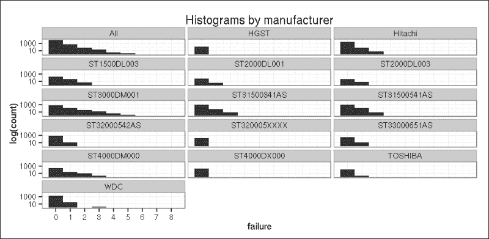
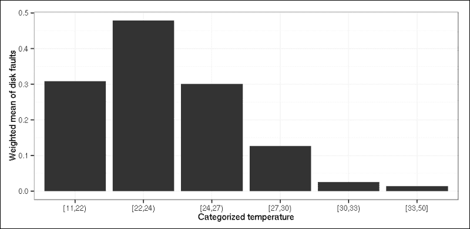

# 六、超越线性趋势线

线性回归模型,我们在上一章中提到过，它可以处理与预测因子有线性关联的连续反应。在本章中，我们将扩展这些模型，以允许响应变量在分布上有所不同。但是，在接触广义线性模型之前，我们需要停下来讨论一下一般的回归模型。

# 建模工作流程

首先，关于术语的一些单词。统计学家称 *Y* 变量为响应、结果或因变量。 *X* 变量通常被称为预测变量、解释变量或自变量。一些预测因子是我们主要感兴趣的，其他的预测因子只是因为它们是潜在的混杂因素而被添加进来。连续预测值有时被称为协变量。

GLM 是线性回归的推广。GLM(也称为 R 中的`glm`，来自`stats`包)允许预测值通过连接函数与响应变量相关联，并允许每个测量值的方差大小是其预测值的函数。

无论你使用什么回归模型，主要的问题是，“我们能以什么形式给模型添加连续的预测值？”如果响应和预测值之间的关系不满足模型假设，您可以通过某种方式转换变量。例如，线性回归模型中的对数或二次变换是通过线性公式解决自变量和因变量之间非线性关系问题的一种非常常见的方法。

或者，您可以通过以适当的方式细分其范围，将连续预测器转换为离散预测器。当选择职业时，最好的选择之一是遵循一些惯例，比如选择 18 岁作为年龄的分界点。或者，您可以遵循一种更技术性的方法，例如，将预测值分类为分位数。进行这一过程的一个高级方法是使用一些分类或回归树，你将能够在第 10 章、*分类和聚类*中读到更多。

可以使用参考类别编码将离散预测值作为虚拟变量添加到模型中，正如我们在前一章中看到的线性回归模型一样。

但是我们实际上如何建立一个模型呢？我们编制了一个通用工作流程来回答这个问题:

1.  首先，用主要预测因子和所有相关混杂因素拟合模型，然后通过剔除不显著的混杂因素来减少混杂因素的数量。对此有一些自动程序(如反向消除)。T3

    ### 注意

    给定的样本大小限制了预测因子的数量。所需样本量的经验法则是每个预测值至少有 20 个观测值.

2.  决定是以原始形式还是分类形式使用连续变量。
3.  如果它们是实用相关的，试着通过测试非线性关系来达到更好的匹配。
4.  最后，检查模型假设。

我们如何找到最好的模型？是不是拟合越好，模型越好这么简单？可惜没有。我们的目标是找到最佳拟合模型，但尽可能少的预测。良好的模型拟合和少量的独立变量是相互矛盾的。

正如我们之前看到的，在线性回归模型中输入较新的预测值总是会增加 R 平方的值，这可能会导致模型过度拟合。过度拟合意味着模型用随机噪声描述样本，而不是底层的数据生成过程。例如，当我们在模型中有太多的预测因子，以至于其样本大小无法容纳时，就会发生过度拟合。

因此，最佳模型以尽可能少的预测值给出了期望的拟合水平。AIC 是那些既适合又节俭的恰当措施之一。我们强烈推荐在比较不同型号时使用它，通过`stats`包中的`AIC`函数，这非常容易。


# 逻辑回归

到目前为止，我们已经讨论了线性回归模型，这是一种建模连续响应变量的合适方法。然而，不连续的、二元的反应(如生病或健康、忠诚或决定换一份新工作、移动供应商或合作伙伴)也很常见。与连续情况相比，主要的区别在于，现在我们应该模拟概率，而不是响应变量的期望值。

天真的解决方案是在线性模型中使用概率作为结果。但这种解决方案的问题是，概率应该总是在 0 到 1 之间，而在使用线性模型时，这个有界范围是完全不能保证的。更好的解决方案是拟合逻辑回归模型，该模型不仅模拟概率，还模拟几率的自然对数，称为 **logit** 。logit 可以是任何(正或负)数，因此消除了范围有限的问题。

让我们举一个简单的例子，利用被告种族的一些信息，预测死刑的概率。这一模式涉及到更加复杂的死刑中的种族主义问题，这一问题在美国由来已久。我们将使用来自 `catdata`包的`deathpenalty`数据集，该数据集是关于 1976 年至 1987 年佛罗里达州多起谋杀案中被告的判决。案件按死刑(0 代表否，1 代表是)、被告的种族和受害者的种族(黑人代表 0，白人代表 1)进行分类。

首先，我们通过 `vcdExtra`包中的`expand.dtf`函数将频率表扩展为案例形式，然后我们在数据集中拟合我们的第一个一般化模型:

```
> library(catdata)

> data(deathpenalty)

> library(vcdExtra)

> deathpenalty.expand <- expand.dft(deathpenalty)

> binom.model.0 <- glm(DeathPenalty ~ DefendantRace,

+   data = deathpenalty.expand, family = binomial)

> summary(binom.model.0)

Deviance Residuals: 

 Min       1Q   Median       3Q      Max 

-0.4821  -0.4821  -0.4821  -0.4044   2.2558 

Coefficients:

 Estimate Std. Error z value Pr(>|z|) 

(Intercept)    -2.4624     0.2690  -9.155   <2e-16 ***

DefendantRace   0.3689     0.3058   1.206    0.228 

---

Signif. codes:  0 '***' 0.001 '**' 0.01 '*' 0.05 '.' 0.1 ' ' 1

(Dispersion parameter for binomial family taken to be 1)

 Null deviance: 440.84  on 673  degrees of freedom

Residual deviance: 439.31  on 672  degrees of freedom

AIC: 443.31

Number of Fisher Scoring iterations: 5

```

回归系数在统计学上并不显著，所以乍一看，我们看不出数据中有种族偏见。不管怎样，出于说教的目的，我们来解读一下回归系数。是`0.37`，这意味着当从黑色类别转移到白色类别时，获得死刑的几率的自然对数增加 0.37。如果你取它的指数，这种差异是很容易解释的，指数是几率的比率:

```
> exp(cbind(OR = coef(binom.model.0), confint(binom.model.0)))

 OR      2.5 %    97.5 %

(Intercept)   0.08522727 0.04818273 0.1393442

DefendantRace 1.44620155 0.81342472 2.7198224

```

被告种族的优势比为`1.45`，这意味着白人被告被判死刑的几率比黑人被告高 45%。

### 注意

尽管 R 产生了这个，截距的比值比通常不被解释。

我们可以说一些更一般的。我们已经看到，在线性回归模型中，回归系数 *b* 可以解释为 *X* 增加 *Y* 一个单位乘以 *b* 。但是，在逻辑回归模型中， *X* 增加一个单位会使 *Y* 的几率乘以`exp(b)`。

请注意，前面的预测值是离散的，值为 0(黑色)和 1(白色)，所以它基本上是白色的虚拟变量，黑色是参考类别。在线性回归模型的情况下，我们已经看到了输入离散变量的相同解决方案。如果你有两个以上的种族类别，你应该为第三个种族定义第二个假人，并将其输入到模型中。每个虚拟变量系数的指数等于比值比，它将给定类别与参考进行比较。如果您有一个连续的预测值，系数的指数等于与预测值增加一个单位相关的优势比。

现在，让我们将受害者的种族纳入检查，因为这是一个似是而非的混杂因素。让我们控制它，并用`DefendantRace`和`VictimRace`作为预测值来拟合逻辑回归模型:

```
> binom.model.1 <- update(binom.model.0, . ~ . + VictimRace)

> summary(binom.model.1)

Deviance Residuals: 

 Min       1Q   Median       3Q      Max 

-0.7283  -0.4899  -0.4899  -0.2326   2.6919 

Coefficients:

 Estimate Std. Error z value Pr(>|z|) 

(Intercept)    -3.5961     0.5069  -7.094 1.30e-12 ***

DefendantRace  -0.8678     0.3671  -2.364   0.0181 * 

VictimRace      2.4044     0.6006   4.003 6.25e-05 ***

---

Signif. codes:  0 '***' 0.001 '**' 0.01 '*' 0.05 '.' 0.1 ' ' 1

(Dispersion parameter for binomial family taken to be 1)

 Null deviance: 440.84  on 673  degrees of freedom

Residual deviance: 418.96  on 671  degrees of freedom

AIC: 424.96

Number of Fisher Scoring iterations: 6

> exp(cbind(OR = coef(binom.model.1), confint(binom.model.1)))

 OR       2.5 %      97.5 %

(Intercept)    0.02743038 0.008433309  0.06489753

DefendantRace  0.41987565 0.209436976  0.89221877

VictimRace    11.07226549 3.694532608 41.16558028

```

当控制`VictimRace`时，`DefendantRace`的作用变得显著！优势比是`0.42`，这意味着在受害者种族固定的情况下，白人被告被判死刑的几率只有黑人被告的 42%。还有，`VictimRace` (11.07)的比值比显示了一个极其强烈的效应:杀害白人受害者的凶手被判死刑的可能性是杀害黑人受害者的凶手的 11 倍。

因此,`DefendantRace`的效果与我们在单预测模型中得到的正好相反。这种反向关联看似矛盾，但却是可以解释的。让我们看看下面的输出:

```
> prop.table(table(factor(deathpenalty.expand$VictimRace,

+              labels = c("VictimRace=0", "VictimRace=1")),

+            factor(deathpenalty.expand$DefendantRace, 

+              labels = c("DefendantRace=0", "DefendantRace=1"))), 1)

 DefendantRace=0 DefendantRace=1

 VictimRace=0      0.89937107      0.10062893

 VictimRace=1      0.09320388      0.90679612

```

从某种意义上来说，数据似乎是同质的:黑人被告更有可能有黑人受害者，反之亦然。如果你把这些信息放在一起，你会发现黑人被告被判死刑的比例较小，因为他们更有可能有黑人受害者，而那些有黑人受害者的人被判死刑的可能性较小。悖论消失了:粗略的死刑和`DefendantRace`的联系被`VictimRace`混淆了。

综上所述，考虑到现有的信息，你可以得出以下结论:

*   黑人被告更有可能被判死刑
*   杀害白人被认为是比杀害黑人更严重的罪行

当然，你应该非常小心地得出这样的结论，因为种族偏见的问题需要使用所有关于犯罪情况的相关信息进行非常彻底的分析，甚至更多。

## 数据注意事项

逻辑回归模型基于观测值完全相互独立的假设。例如，如果你的观测是连续几年的，那么这个假设就被违反了。偏差残差和其他诊断统计数据有助于验证模型和检测问题，例如链接函数的错误设定。如需进一步参考，请参见`LogisticDx`包。

作为一般经验法则，逻辑回归模型要求每个预测因子至少 10 个事件，其中一个事件表示属于响应中不太频繁类别的观察值。在我们的死刑例子中，死亡是回答中出现频率较低的类别，我们在数据库中有 68 个死刑判决。因此，该规则建议最多允许 6-7 个预测值。

使用最大似然法估计回归系数。由于没有封闭的数学形式来获得这些最大似然估计，R 使用优化算法来代替。在某些情况下，您可能会收到一条错误消息，指出算法没有达到收敛。在这种情况下，它无法找到适当的解决办法。发生这种情况的原因有很多，比如预测器太多，事件太少，等等。

## 模型拟合优度

评估模型性能的模型拟合度的一个衡量标准是整体模型的显著性。相应的似然比测试给定模型是否比只有截距的模型拟合得更好，我们称之为零模型。

要获得测试结果，您必须查看输出中的剩余偏差。它测量观察到的和拟合的对数似然函数的最大值之间的不一致。

### 注意

因为逻辑回归遵循最大似然原则，所以目标是最小化偏差残差的总和。因此，该残差与线性回归中的原始残差平行，线性回归的目标是最小化残差平方和。

零偏差表示只有截距的模型对响应的预测有多好。为了判断模型，你必须比较剩余偏差和零偏差；差异遵循卡方分布。在 `lmtest`包中有相应的测试:

```
> library(lmtest)

> lrtest(binom.model.1)

Likelihood ratio test

Model 1: DeathPenalty ~ DefendantRace + VictimRace

Model 2: DeathPenalty ~ 1

 #Df  LogLik Df  Chisq Pr(>Chisq) 

1   3 -209.48 

2   1 -220.42 -2 21.886  1.768e-05 ***

---

Signif. codes:  0 '***' 0.001 '**' 0.01 '*' 0.05 '.' 0.1 ' ' 1

```

*p* 值表示偏差显著降低。这意味着模型是显著的，并且预测因子对响应概率有显著的影响。

您可以将似然比视为线性回归模型中的 f 检验。它揭示了模型是否显著，但它没有告诉任何关于拟合优度的信息，拟合优度在线性情况下由调整后的 R 平方度量来描述。

不存在逻辑回归模型的等价统计量，但是已经开发了几个伪 R 平方。这些值通常在 0 到 1 的范围内，值越大表示越适合。我们将使用的`BaylorEdPsych`包中的`PseudoR2`函数来计算这个值:

```
> library(BaylorEdPsych)

> PseudoR2(binom.model.1)

 McFadden     Adj.McFadden        Cox.Snell       Nagelkerke 

 0.04964600       0.03149893       0.03195036       0.06655297

McKelvey.Zavoina           Effron            Count        Adj.Count 

 0.15176608       0.02918095               NA               NA 

 AIC    Corrected.AIC 

 424.95652677     424.99234766 

```

但要小心，伪 R 平方不能被解释为 OLS R 平方，也有一些记录的问题，但他们给我们一个粗略的图片。在我们的案例中，他们说该模型的解释力相当低，如果我们考虑到在判断犯罪这样一个复杂的过程中只使用了两个预测因素这一事实，这并不奇怪。

## 型号对比

正如我们在前一章看到的，在处理嵌套线性回归模型时，调整后的 R 平方为模型比较提供了一个良好的基础。对于嵌套的逻辑回归模型，可以使用似然比检验(比如来自 `lmtest`库中的`lrtest`函数)，它比较残差之间的差异。

```
> lrtest(binom.model.0, binom.model.1)

Likelihood ratio test

Model 1: DeathPenalty ~ DefendantRace

Model 2: DeathPenalty ~ DefendantRace + VictimRace

 #Df  LogLik Df Chisq Pr(>Chisq) 

1   2 -219.65 

2   3 -209.48  1 20.35   6.45e-06 ***

---

Signif. codes:  0 '***' 0.001 '**' 0.01 '*' 0.05 '.' 0.1 ' ' 1

```

### 注意

前面输出中的`LogLiK`表示模型的对数似然性；你通过乘以 2 得到剩余偏差。

对于非嵌套模型，您可以使用 AIC，就像我们在线性回归模型的情况下一样，但在逻辑回归模型中，AIC 是标准输出的一部分，因此没有必要单独调用 AIC 函数。这里，`binom.model.1`比`binom.model.0`具有更低的 AIC，并且该差异不可忽略，因为它大于 2。


# 计数数据模型

逻辑回归只能处理二元反应。如果你有计数数据，比如在给定的时间段内，或者在给定的地理区域内的死亡或失败的数量，你可以使用泊松或负二项式回归。在处理聚合数据时，这些数据类型尤其常见，聚合数据是以不同类别的大量事件的形式提供的。

## 泊松回归

泊松回归模型是以对数为连接函数的广义线性模型，它们假设响应具有 **泊松分布**。泊松分布只接受整数值。它适用于计数数据，例如在固定时间段内发生的事件，也就是说，如果事件相当罕见，例如每天发生的硬盘故障次数。

在以下示例中，我们将使用 2013 年的硬盘数据集。数据集是从[https://docs . backblaze . com/public/hard-drive-data/2013 _ data . zip](https://docs.backblaze.com/public/hard-drive-data/2013_data.zip)下载的，但我们对它进行了一点润色和简化。原始数据库中的每个记录对应于一个驱动器的每日快照。故障变量是我们的主要关注点，它可以是零(如果驱动器正常)，也可以是一(在硬盘发生故障前的最后一天)。

让我们试着确定哪些因素会影响故障的出现。潜在的预测因素如下:

*   `model`:制造商指定的变频器型号
*   `capacity_bytes`:以字节为单位的驱动器容量
*   `age_month`:平均月份的驱动器年龄
*   `temperature`:硬盘温度
*   `PendingSector`:表示出现不稳定扇区的逻辑值(在给定日期等待给定硬盘上的重新映射)

我们通过这些变量聚集原始数据集，其中`freq`变量表示给定类别中的记录数量。是时候加载这个最终的、经过清理和聚合的数据集了:

```
> dfa <- readRDS('SMART_2013.RData')

```

快速查看一下各型号的故障数量:

```
> (ct <- xtabs(~model+failure, data=dfa))

 failure

model             0    1    2    3    4    5    8

 HGST          136    1    0    0    0    0    0

 Hitachi      2772   72    6    0    0    0    0

 SAMSUNG       125    0    0    0    0    0    0

 ST1500DL001    38    0    0    0    0    0    0

 ST1500DL003   213   39    6    0    0    0    0

 ST1500DM003    84    0    0    0    0    0    0

 ST2000DL001    51    4    0    0    0    0    0

 ST2000DL003    40    7    0    0    0    0    0

 ST2000DM001    98    0    0    0    0    0    0

 ST2000VN000    40    0    0    0    0    0    0

 ST3000DM001   771  122   34   14    4    2    1

 ST31500341AS 1058   75    8    0    0    0    0

 ST31500541AS 1010  106    7    1    0    0    0

 ST32000542AS  803   12    1    0    0    0    0

 ST320005XXXX  209    1    0    0    0    0    0

 ST33000651AS  323   12    0    0    0    0    0

 ST4000DM000   242   22   10    2    0    0    0

 ST4000DX000   197    1    0    0    0    0    0

 TOSHIBA       126    2    0    0    0    0    0

 WDC          1874   27    1    2    0    0    0

```

现在，让我们通过删除上表中第一列旁边只有零的所有行，来删除那些没有任何故障的硬盘型号:

```
> dfa <- dfa[dfa$model %in% names(which(rowSums(ct) - ct[, 1] > 0)),]

```

为了快速了解故障数量，让我们在 `ggplot2`软件包的帮助下，根据型号绘制一个对数直方图:

```
> library(ggplot2)

> ggplot(rbind(dfa, data.frame(model='All', dfa[, -1] )), 

+   aes(failure)) + ylab("log(count)") + 

+   geom_histogram(binwidth = 1, drop=TRUE, origin = -0.5)  + 

+   scale_y_log10() + scale_x_continuous(breaks=c(0:10)) + 

+   facet_wrap( ~ model, ncol = 3) +

+   ggtitle("Histograms by manufacturer") + theme_bw()

```



现在，是时候用`model` 数作为预测值来拟合数据的泊松回归模型了。该型号可通过选项`family=poisson`使用`glm`功能进行安装。默认情况下，预期的日志计数是模型化的，所以我们使用`log`链接。

在数据库中，每个观察值对应于一个具有不同数量硬盘驱动器的组。由于我们需要处理不同的组大小，我们将使用`offset`函数:

```
> poiss.base <- glm(failure ~ model, offset(log(freq)),

+   family = 'poisson', data = dfa)

> summary(poiss.base)

Deviance Residuals: 

 Min       1Q   Median       3Q      Max 

-2.7337  -0.8052  -0.5160  -0.3291  16.3495 

Coefficients:

 Estimate Std. Error z value Pr(>|z|) 

(Intercept)        -5.0594     0.5422  -9.331  < 2e-16 ***

modelHitachi        1.7666     0.5442   3.246  0.00117 ** 

modelST1500DL003    3.6563     0.5464   6.692 2.20e-11 ***

modelST2000DL001    2.5592     0.6371   4.017 5.90e-05 ***

modelST2000DL003    3.1390     0.6056   5.183 2.18e-07 ***

modelST3000DM001    4.1550     0.5427   7.656 1.92e-14 ***

modelST31500341AS   2.7445     0.5445   5.040 4.65e-07 ***

modelST31500541AS   3.0934     0.5436   5.690 1.27e-08 ***

modelST32000542AS   1.2749     0.5570   2.289  0.02208 * 

modelST320005XXXX  -0.4437     0.8988  -0.494  0.62156 

modelST33000651AS   1.9533     0.5585   3.497  0.00047 ***

modelST4000DM000    3.8219     0.5448   7.016 2.29e-12 ***

modelST4000DX000  -12.2432   117.6007  -0.104  0.91708 

modelTOSHIBA        0.2304     0.7633   0.302  0.76279 

modelWDC            1.3096     0.5480   2.390  0.01686 * 

---

Signif. codes:  0 '***' 0.001 '**' 0.01 '*' 0.05 '.' 0.1 ' ' 1

(Dispersion parameter for poisson family taken to be 1)

 Null deviance: 22397  on 9858  degrees of freedom

Residual deviance: 17622  on 9844  degrees of freedom

AIC: 24717

Number of Fisher Scoring iterations: 15

```

首先，我们来解读一下系数。型号是一个离散的预测值，所以我们输入了一些虚拟的变量来表示它是一个预测值。默认情况下，参考类别不会出现在输出中，但我们可以随时查询:

```
> contrasts(dfa$model, sparse = TRUE)

HGST         . . . . . . . . . . . . . .

Hitachi      1 . . . . . . . . . . . . .

ST1500DL003  . 1 . . . . . . . . . . . .

ST2000DL001  . . 1 . . . . . . . . . . .

ST2000DL003  . . . 1 . . . . . . . . . .

ST3000DM001  . . . . 1 . . . . . . . . .

ST31500341AS . . . . . 1 . . . . . . . .

ST31500541AS . . . . . . 1 . . . . . . .

ST32000542AS . . . . . . . 1 . . . . . .

ST320005XXXX . . . . . . . . 1 . . . . .

ST33000651AS . . . . . . . . . 1 . . . .

ST4000DM000  . . . . . . . . . . 1 . . .

ST4000DX000  . . . . . . . . . . . 1 . .

TOSHIBA      . . . . . . . . . . . . 1 .

WDC          . . . . . . . . . . . . . 1

```

于是，原来参考类别是`HGST`，虚拟变量将每个型号与`HGST`硬盘进行比较。例如，`Hitachi`的系数是`1.77`，因此`Hitachi`驱动器的预期对数比`HGST`驱动器的预期对数大约大 1.77。或者，当谈到比率而不是差异时，您可以计算其指数:

```
> exp(1.7666)

[1] 5.850926

```

因此，`Hitachi`驱动器的预期故障数是`HGST`驱动器的 5.85 倍。一般来说，解释是这样的:X 增加一个单位，乘以`exp(b)`。

类似于 logistic 回归，我们来确定模型的显著性。为了做到这一点，我们将当前模型与没有任何预测值的零模型进行比较，因此可以识别剩余偏差和零偏差之间的差异。我们期望差异足够大，并且相应的卡方检验显著:

```
> lrtest(poiss.base)

Likelihood ratio test

Model 1: failure ~ model

Model 2: failure ~ 1

 #Df LogLik  Df  Chisq Pr(>Chisq) 

1  15 -12344 

2   1 -14732 -14 4775.8  < 2.2e-16 ***

---

Signif. codes:  0 '***' 0.001 '**' 0.01 '*' 0.05 '.' 0.1 ' ' 1

```

看起来模型很重要，但是我们也应该试着确定模型假设是否会失败。

正如我们对线性和逻辑回归模型所做的那样，我们有一个独立性假设，其中泊松回归假设事件是独立的。这意味着一次失败的发生不会增加或减少另一次失败的可能性。在驱动器故障的情况下，这种假设成立。另一个重要的假设来自于这样一个事实，即响应具有均值和方差相等的泊松分布。我们的模型假设，以预测变量为条件的方差和均值将大致相等。

为了决定假设是否成立，我们可以将剩余偏差与其自由度进行比较。对于拟合良好的模型，它们的比值应该接近 1。不幸的是，报告的剩余偏差是在自由度上的，所以它们的比值比 T2 大得多，这表明方差比平均值大得多。这种现象被称为 **过度分散**。

## 负二项式回归

在这种情况下，负二项式分布可用于模拟过度分散的计数响应，这是泊松回归的推广，因为它有一个额外的参数来模拟过度分散。换句话说，泊松和负二项式模型是嵌套模型；前者是后者的子集。

在下面的输出中，我们使用 `MASS`包中的`glm.nb`函数对我们的驱动器故障数据进行负二项式回归拟合:

```
> library(MASS)

> model.negbin.0 <- glm.nb(failure ~ model,

+  offset(log(freq)), data = dfa)

```

为了比较该模型与泊松模型的性能，我们可以使用似然比检验，因为这两个模型是嵌套的。负二项式模型显示了更好的拟合度:

```
> lrtest(poiss.base,model.negbin.0)

Likelihood ratio test

Model 1: failure ~ model

Model 2: failure ~ model

 #Df LogLik Df Chisq Pr(>Chisq) 

1  15 -12344 

2  16 -11950  1 787.8  < 2.2e-16 ***

---

Signif. codes:  0 '***' 0.001 '**' 0.01 '*' 0.05 '.' 0.1 ' ' 1

```

这个结果清楚地表明选择负二项式模型。

## 多元非线性模型

到目前为止，我们的模型中唯一的预测器是型号名称，但是我们还有关于驱动器的其他潜在重要信息，如容量、年龄和温度。现在让我们将这些加入到模型中，并确定新模型是否优于原始模型。

此外，让我们检查一下`PendingSector`的重要性。简而言之，我们定义了嵌套模型的两步模型构建过程；因此，我们可以使用似然比统计来测试模型拟合度是否在这两个步骤中显著增加:

```
> model.negbin.1 <- update(model.negbin.0, . ~ . + capacity_bytes + 

+   age_month + temperature)

> model.negbin.2 <- update(model.negbin.1, . ~ . + PendingSector)

> lrtest(model.negbin.0, model.negbin.1, model.negbin.2)

Likelihood ratio test

Model 1: failure ~ model

Model 2: failure ~ model + capacity_bytes + age_month + temperature

Model 3: failure ~ model + capacity_bytes + age_month + temperature + 

 PendingSector

 #Df LogLik Df  Chisq Pr(>Chisq) 

1  16 -11950 

2  19 -11510  3 878.91  < 2.2e-16 ***

3  20 -11497  1  26.84  2.211e-07 ***

---

Signif. codes:  0 '***' 0.001 '**' 0.01 '*' 0.05 '.' 0.1 ' ' 1

```

这两个步骤都很重要，因此值得将每个预测值添加到模型中。现在，让我们来解读最佳模型:

```
> summary(model.negbin.2)

Deviance Residuals: 

 Min       1Q   Median       3Q      Max 

-2.7147  -0.7580  -0.4519  -0.2187   9.4018 

Coefficients:

 Estimate Std. Error z value Pr(>|z|) 

(Intercept)       -8.209e+00  6.064e-01 -13.537  < 2e-16 ***

modelHitachi       2.372e+00  5.480e-01   4.328 1.50e-05 ***

modelST1500DL003   6.132e+00  5.677e-01  10.801  < 2e-16 ***

modelST2000DL001   4.783e+00  6.587e-01   7.262 3.81e-13 ***

modelST2000DL003   5.313e+00  6.296e-01   8.440  < 2e-16 ***

modelST3000DM001   4.746e+00  5.470e-01   8.677  < 2e-16 ***

modelST31500341AS  3.849e+00  5.603e-01   6.869 6.49e-12 ***

modelST31500541AS  4.135e+00  5.598e-01   7.387 1.50e-13 ***

modelST32000542AS  2.403e+00  5.676e-01   4.234 2.29e-05 ***

modelST320005XXXX  1.377e-01  9.072e-01   0.152   0.8794 

modelST33000651AS  2.470e+00  5.631e-01   4.387 1.15e-05 ***

modelST4000DM000   3.792e+00  5.471e-01   6.931 4.17e-12 ***

modelST4000DX000  -2.039e+01  8.138e+03  -0.003   0.9980 

modelTOSHIBA       1.368e+00  7.687e-01   1.780   0.0751 . 

modelWDC           2.228e+00  5.563e-01   4.006 6.19e-05 ***

capacity_bytes     1.053e-12  5.807e-14  18.126  < 2e-16 ***

age_month          4.815e-02  2.212e-03  21.767  < 2e-16 ***

temperature       -5.427e-02  3.873e-03 -14.012  < 2e-16 ***

PendingSectoryes   2.240e-01  4.253e-02   5.267 1.39e-07 ***

---

Signif. codes:  0 '***' 0.001 '**' 0.01 '*' 0.05 '.' 0.1 ' ' 1

(Dispersion parameter for Negative Binomial(0.8045) family taken to be 1)

 Null deviance: 17587  on 9858  degrees of freedom

Residual deviance: 12525  on 9840  degrees of freedom

AIC: 23034

Number of Fisher Scoring iterations: 1

 Theta:  0.8045 

 Std. Err.:  0.0525 

 2 x log-likelihood:  -22993.8850.

```

每个预测因子都很重要——除了在模型类型上有一些对比的例外。例如，当控制年龄、温度等因素时，`Toshiba`与参考类别`HGST`没有显著差异。

负二项式回归参数的解释类似于泊松模型。例如，`age_month`的系数是 0.048，这表明年龄增加一个月，预期的故障对数增加 0.048。或者，您也可以选择使用指数:

```
> exp(data.frame(exp_coef = coef(model.negbin.2)))

 exp_coef

(Intercept)       2.720600e-04

modelHitachi      1.071430e+01

modelST1500DL003  4.602985e+02

modelST2000DL001  1.194937e+02

modelST2000DL003  2.030135e+02

modelST3000DM001  1.151628e+02

modelST31500341AS 4.692712e+01

modelST31500541AS 6.252061e+01

modelST32000542AS 1.106071e+01

modelST320005XXXX 1.147622e+00

modelST33000651AS 1.182098e+01

modelST4000DM000  4.436067e+01

modelST4000DX000  1.388577e-09

modelTOSHIBA      3.928209e+00

modelWDC          9.283970e+00

capacity_bytes    1.000000e+00

age_month         1.049329e+00

temperature       9.471743e-01

PendingSectoryes  1.251115e+00

```

因此，似乎一生中的一个月会增加 4.9%的预期故障次数，而更大的容量也会增加故障次数。另一方面，温度显示了相反的效应:系数的指数是 0.947，这意味着温度每增加一度，预期的故障数量就会减少 5.3%。

模型名称的效果可以根据与参考类别的比较来判断，在我们的例子中是`HGST`。人们可能想改变这种提法。比如对于最常见的驱动:`WDC`。这可以通过改变硬盘型号中因子级别的顺序，或者通过非常有用的`relevel`功能简单地定义因子中的参考类别来轻松实现:

```
> dfa$model <- relevel(dfa$model, 'WDC')

```

现在，让我们验证一下 `HGST`是否真的用替换了系数列表中的`WDC`，但是我们将使用`broom`包中的`tidy`函数来代替冗长的 summary 输出，它可以提取不同统计模型的最重要的特征(对于模型摘要，看一下`glance`函数):

```
> model.negbin.3 <- update(model.negbin.2, data = dfa)

> library(broom)

> format(tidy(model.negbin.3), digits = 4)

 term   estimate std.error statistic    p.value

1        (Intercept) -5.981e+00 2.173e-01 -27.52222 9.519e-167

2          modelHGST -2.228e+00 5.563e-01  -4.00558  6.187e-05

3       modelHitachi  1.433e-01 1.009e-01   1.41945  1.558e-01

4   modelST1500DL003  3.904e+00 1.353e-01  28.84295 6.212e-183

5   modelST2000DL001  2.555e+00 3.663e-01   6.97524  3.054e-12

6   modelST2000DL003  3.085e+00 3.108e-01   9.92496  3.242e-23

7   modelST3000DM001  2.518e+00 9.351e-02  26.92818 1.028e-159

8  modelST31500341AS  1.620e+00 1.069e-01  15.16126  6.383e-52

9  modelST31500541AS  1.907e+00 1.016e-01  18.77560  1.196e-78

10 modelST32000542AS  1.751e-01 1.533e-01   1.14260  2.532e-01

11 modelST320005XXXX -2.091e+00 7.243e-01  -2.88627  3.898e-03

12 modelST33000651AS  2.416e-01 1.652e-01   1.46245  1.436e-01

13  modelST4000DM000  1.564e+00 1.320e-01  11.84645  2.245e-32

14  modelST4000DX000 -1.862e+01 1.101e+03  -0.01691  9.865e-01

15      modelTOSHIBA -8.601e-01 5.483e-01  -1.56881  1.167e-01

16    capacity_bytes  1.053e-12 5.807e-14  18.12597  1.988e-73

17         age_month  4.815e-02 2.212e-03  21.76714 4.754e-105

18       temperature -5.427e-02 3.873e-03 -14.01175  1.321e-44

19  PendingSectoryes  2.240e-01 4.253e-02   5.26709  1.386e-07

```

### 注意

使用`broom`包提取模型系数，比较模型拟合，以及其他要传递给例如`ggplot2`的度量。

温度的影响表明，温度越高，硬盘故障次数越少。然而，日常经验显示了一个非常不同的画面，例如，如在[https://www . back blaze . com/blog/hard-drive-temperature-do-it-matter](https://www.backblaze.com/blog/hard-drive-temperature-does-it-matter)所描述的。谷歌的工程师发现温度并不能很好地预测的失败，而微软和弗吉尼亚大学发现温度有很大的影响。磁盘驱动器制造商建议将磁盘保存在较低的温度下。

因此，让我们仔细看看这个有趣的问题，我们将使用`temperature`作为驱动器故障的预测器。首先，让我们将温度分为六个相等的类别，然后我们将绘制一个柱状图，显示每个类别的平均故障数。请注意，我们必须考虑不同组的大小，因此我们将通过`freq`进行加权，当我们进行一些数据聚合时，是时候将我们的数据集转换为`data.table`对象了:

```
> library(data.table)

> dfa <- data.table(dfa)

> dfa[, temp6 := cut2(temperature, g = 6)]

> temperature.weighted.mean <- dfa[, .(wfailure = 

+     weighted.mean(failure, freq)), by = temp6] 

> ggplot(temperature.weighted.mean, aes(x = temp6, y = wfailure)) + 

+     geom_bar(stat = 'identity') + xlab('Categorized temperature') +

+     ylab('Weighted mean of disk faults') + theme_bw()

```



线性关系的假设显然不被支持。柱状图建议在进入模型时使用这种分类形式的温度，而不是原来的连续变量。要真正看到哪个型号更好，让我们来比较一下！因为它们不是嵌套的，所以我们必须使用 AIC，它强烈支持分类版本:

```
> model.negbin.4 <- update(model.negbin.0, .~. + capacity_bytes +

+   age_month + temp6 + PendingSector, data = dfa)

> AIC(model.negbin.3,model.negbin.4)

 df      AIC

model.negbin.3 20 23033.88

model.negbin.4 24 22282.47

```

嗯，这真的值得归类温度！现在，让我们检查另外两个连续的预测值。同样，我们将使用`freq`作为加权因子:

```
> weighted.means <- rbind(

+     dfa[, .(l = 'capacity', f = weighted.mean(failure, freq)),

+         by = .(v = capacity_bytes)],

+     dfa[, .(l = 'age', f = weighted.mean(failure, freq)),

+         by = .(v = age_month)])

```

与前面的图一样，我们将使用`ggplot2`来绘制这些离散变量的分布，但我们将使用阶梯线图来克服条形图固定宽度的问题，而不是条形图:

```
> ggplot(weighted.means, aes(x = l, y = f)) + geom_step() +

+   facet_grid(. ~ v, scales = 'free_x') + theme_bw() +

+   ylab('Weighted mean of disk faults') + xlab('')

```


这种关系显然也不是线性的。`age`的案例特别有意思；硬盘的生命周期中似乎存在高风险时期。现在，让我们强制 R 使用`capacity`作为名义变量(它只有五个值，所以没有真正的需要对其进行分类)，让我们将`age`分为 8 个大小相等的类别:

```
> dfa[, capacity_bytes := as.factor(capacity_bytes)]

> dfa[, age8 := cut2(age_month, g = 8)]

> model.negbin.5 <- update(model.negbin.0, .~. + capacity_bytes +

+   age8 + temp6 + PendingSector, data = dfa)

```

根据 AIC，具有分类年龄和容量的最后一个模型要好得多，并且是迄今为止最适合的模型:

```
> AIC(model.negbin.5, model.negbin.4)

 df      AIC

model.negbin.5 33 22079.47

model.negbin.4 24 22282.47

```

如果您查看参数估计值，您会发现容量的第一个虚拟变量与参考值明显不同:

```
> format(tidy(model.negbin.5), digits = 3)

 term estimate std.error statistic   p.value

1                  (Intercept)  -6.1648  1.84e-01 -3.34e+01 2.69e-245

2                    modelHGST  -2.4747  5.63e-01 -4.40e+00  1.10e-05

3                 modelHitachi  -0.1119  1.21e-01 -9.25e-01  3.55e-01

4             modelST1500DL003  31.7680  7.05e+05  4.51e-05  1.00e+00

5             modelST2000DL001   1.5216  3.81e-01  3.99e+00  6.47e-05

6             modelST2000DL003   2.1055  3.28e-01  6.43e+00  1.29e-10

7             modelST3000DM001   2.4799  9.54e-02  2.60e+01 5.40e-149

8            modelST31500341AS  29.4626  7.05e+05  4.18e-05  1.00e+00

9            modelST31500541AS  29.7597  7.05e+05  4.22e-05  1.00e+00

10           modelST32000542AS  -0.5419  1.93e-01 -2.81e+00  5.02e-03

11           modelST320005XXXX  -2.8404  7.33e-01 -3.88e+00  1.07e-04

12           modelST33000651AS   0.0518  1.66e-01  3.11e-01  7.56e-01

13            modelST4000DM000   1.2243  1.62e-01  7.54e+00  4.72e-14

14            modelST4000DX000 -29.6729  2.55e+05 -1.16e-04  1.00e+00

15                modelTOSHIBA  -1.1658  5.48e-01 -2.13e+00  3.33e-02

16 capacity_bytes1500301910016 -27.1391  7.05e+05 -3.85e-05  1.00e+00

17 capacity_bytes2000398934016   1.8165  2.08e-01  8.73e+00  2.65e-18

18 capacity_bytes3000592982016   2.3515  1.88e-01  1.25e+01  8.14e-36

19 capacity_bytes4000787030016   3.6023  2.25e-01  1.60e+01  6.29e-58

20                 age8[ 5, 9)  -0.5417  7.55e-02 -7.18e+00  7.15e-13

21                 age8[ 9,14)  -0.0683  7.48e-02 -9.12e-01  3.62e-01

22                 age8[14,19)   0.3499  7.24e-02  4.83e+00  1.34e-06

23                 age8[19,25)   0.7383  7.33e-02  1.01e+01  7.22e-24

24                 age8[25,33)   0.5896  1.14e-01  5.18e+00  2.27e-07

25                 age8[33,43)   1.5698  1.05e-01  1.49e+01  1.61e-50

26                 age8[43,60]   1.9105  1.06e-01  1.81e+01  3.59e-73

27                temp6[22,24)   0.7582  5.01e-02  1.51e+01  8.37e-52

28                temp6[24,27)   0.5005  4.78e-02  1.05e+01  1.28e-25

29                temp6[27,30)   0.0883  5.40e-02  1.64e+00  1.02e-01

30                temp6[30,33)  -1.0627  9.20e-02 -1.15e+01  7.49e-31

31                temp6[33,50]  -1.5259  1.37e-01 -1.11e+01  1.23e-28

32            PendingSectoryes   0.1301  4.12e-02  3.16e+00  1.58e-03

```

接下来的三种能力更有可能导致故障，但趋势不是线性的。年龄的影响似乎也不是线性的。一般来说，老化会增加失败的次数，但也有一些例外。例如，驱动器在第一(参考)年龄组中比在第二年龄组中更有可能出现故障。这一发现似乎是合理的，因为驱动器在其运行初期有较高的故障率。温度的影响表明，中间温度(22-30 摄氏度)比低温或高温更有可能导致故障。记住每一个效果都是由其他预测器控制的。

将不同的预测因子相互比较，判断它们的效应大小也是很重要的。一张图胜过千言万语，让我们用一个图中的置信区间来总结系数。

首先，我们必须从模型中提取重要术语:

```
> tmnb5 <- tidy(model.negbin.5)

> str(terms <- tmnb5$term[tmnb5$p.value < 0.05][-1])

 chr [1:22] "modelHGST" "modelST2000DL001" "modelST2000DL003" ...

```

然后，让我们使用`confint`函数和古老的 `plyr`软件包来确定系数的置信区间:

```
> library(plyr)

> ci <- ldply(terms, function(t) confint(model.negbin.5, t))

```

不幸的是，这个结果数据帧还不完整。我们需要添加术语名称，同时，让我们通过一个简单的正则表达式提取分组变量:

```
> names(ci) <- c('min', 'max')

> ci$term <- terms

> ci$variable <- sub('[A-Z0-9\\]\\[,() ]*$', '', terms, perl = TRUE)

```

现在我们有了一个格式良好的数据集中的系数的置信区间，它可以很容易地由`ggplot`绘制出来:

```
> ggplot(ci, aes(x = factor(term), color = variable)) + 

+     geom_errorbar(ymin = min, ymax = max) + xlab('') +

+     ylab('Coefficients (95% conf.int)') + theme_bw() + 

+     theme(axis.text.x = element_text(angle = 90, hjust = 1),

+         legend.position = 'top')

```


很容易看出，尽管每个预测因子都很重要，但它们的影响大小却大相径庭。以为例，`PendingSector`对的故障次数影响很小，但是`age`、`capacity`和`temperature`的影响要大得多，硬盘型号是最能区分故障次数的预测器。

正如我们在*逻辑回归*部分提到的，不同的伪 R 平方度量也可用于非线性模型。我们再次警告您有保留地使用这些指标。无论如何，在我们的案例中，他们一致认为模型的解释力相当好:

```
> PseudoR2(model.negbin.6 )

 McFadden     Adj.McFadden        Cox.Snell       Nagelkerke 

 0.3352654        0.3318286        0.4606953        0.5474952 

McKelvey.Zavoina           Effron            Count        Adj.Count 

 NA        0.1497521        0.9310444       -0.1943522 

 AIC    Corrected.AIC 

 12829.5012999    12829.7044941 

```


# 总结

本章介绍了三个著名的非线性回归模型:逻辑斯蒂、泊松和负二项式模型，并且你已经熟悉了建模的一般逻辑。本文还展示了相同的概念，如预测因子的影响、拟合优度、解释力、嵌套和非嵌套模型的模型比较以及模型构建如何应用于不同的环境。现在，我们已经花了一些时间掌握数据分析技巧，在下一章，我们将回到一些核心的数据科学问题，如数据的清理和结构化。