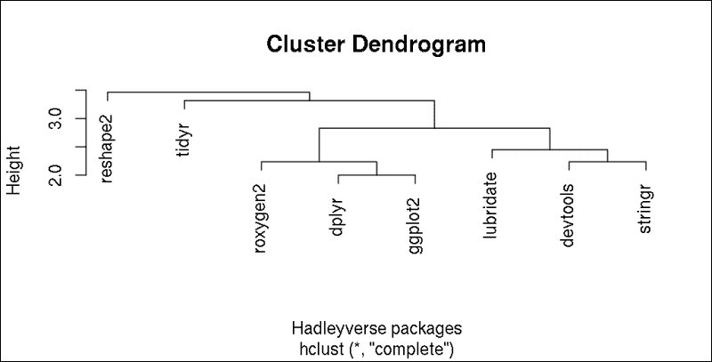

# 七、非结构化数据

在前一章中，我们看了在结构化数据上建立和拟合模型的不同方法。不幸的是，这些在其他方面非常有用的方法在处理例如一堆 PDF 文档时没有用。因此，接下来的几页将重点介绍处理非表格数据的方法，例如:

*   从文本文档集合中提取度量
*   过滤和解析 **自然语言文本** ( **NLP**
*   以结构化方式可视化非结构化数据

文本挖掘是分析自然语言文本的过程；大多数情况下来自在线内容，如电子邮件和社交媒体流(Twitter 或脸书)。在这一章中，我们将介绍最常用的包的方法——尽管还有各种其他类型的非结构化数据，比如文本、图像、音频、视频、非数字内容等等，我们暂时还不能讨论这些。

# 导入语料库

语料库基本上是您想要包含在分析中的文本文档的集合。使用`getSources`功能查看可用选项，以使用`tm`包导入语料库:

```r
> library(tm)

> getSources()

[1] "DataframeSource" "DirSource"  "ReutersSource"   "URISource"

[2] "VectorSource" 

```

因此，我们可以从一个`data.frame`，一个`vector`，或者直接用`URISource`函数从一个统一资源标识符导入文本文档。后者代表超链接或文件路径的集合，尽管这更容易用`DirSource`来处理，它会导入在我们硬盘上的引用目录中找到的所有文本文档。通过调用 R 控制台中的`getReaders`函数，可以看到支持的文本文件格式:

```r
> getReaders()

[1] "readDOC"                 "readPDF" 

[3] "readPlain"               "readRCV1" 

[5] "readRCV1asPlain"         "readReut21578XML" 

[7] "readReut21578XMLasPlain" "readTabular" 

[9] "readXML" 

```

因此，有一些漂亮的函数可以读取和解析 MS Word、pdf、纯文本或 XML 文件以及其他一些文件格式。前面的`Reut`阅读器代表与 `tm`包捆绑在一起的路透社演示语料库。

但是我们不要拘泥于一些工厂默认的演示文件！您可以在简介或参考手册中看到封装示例。由于我们已经在第二章、*中获取了一些文本数据，所以让我们看看如何处理和分析这些内容:*

```r
> res <- XML::readHTMLTable(paste0('http://cran.r-project.org/',

+                   'web/packages/available_packages_by_name.html'),

+               which = 1)

```

### Tip

前面的命令需要实时的互联网连接，可能需要 15-120 秒来下载和解析引用的 HTML 页面。请注意，下载的 HTML 文件的内容可能与本章中显示的内容不同，所以请准备好 R 会话中与我们在本书中发布的内容略有不同的输出。

所以，现在我们有了一个超过 5000 个 R 包名和简短描述的`data.frame`。让我们从包描述的矢量源中构建一个语料库，这样我们就可以进一步解析它们，并看到包开发中最重要的趋势:

```r
> v <- Corpus(VectorSource(res$V2))

```

我们刚刚创建了一个`VCorpus`(内存中)对象，它目前包含 5880 个包描述:

```r
> v

<<VCorpus (documents: 5880, metadata (corpus/indexed): 0/0)>>

```

由于默认的`print`方法(参见前面的输出)显示了对语料库的简要概述，我们将需要使用另一个函数来检查实际内容:

```r
> inspect(head(v, 3))

<<VCorpus (documents: 3, metadata (corpus/indexed): 0/0)>>

[[1]]

<<PlainTextDocument (metadata: 7)>>

A3: Accurate, Adaptable, and Accessible Error Metrics for

Predictive Models

[[2]]

<<PlainTextDocument (metadata: 7)>>

Tools for Approximate Bayesian Computation (ABC)

[[3]]

<<PlainTextDocument (metadata: 7)>>

ABCDE_FBA: A-Biologist-Can-Do-Everything of Flux Balance

Analysis with this package

```

在这里，我们可以看到语料库中的前三个文档，以及一些元数据。到目前为止，我们除了在[第二章](ch02.html "Chapter 2. Getting Data from the Web")、*从网上获取数据*之外，没有做更多的事情，我们可视化了软件包描述中使用的表达式的文字云。但这正是文本挖掘之旅的起点！


# 清理文集

`tm`包最好的特性之一是应用于语料库的各种捆绑转换。`tm_map`函数提供了一种在语料库上运行转换的便捷方式，以过滤掉所有与实际研究无关的数据。要查看可用转换方法的列表，只需调用`getTransformations`函数:

```r
> getTransformations()

[1] "as.PlainTextDocument" "removeNumbers"

[3] "removePunctuation"    "removeWords"

[5] "stemDocument"         "stripWhitespace" 

```

我们通常应该从从语料库中删除最常用的，即所谓的停用词开始。这些是最常见的短功能术语，通常没有语料库中的其他表达式重要，尤其是关键字。该软件包已经包含了不同语言的单词列表:

```r
> stopwords("english")

 [1] "i"          "me"         "my"         "myself"     "we" 

 [6] "our"        "ours"       "ourselves"  "you"        "your" 

 [11] "yours"      "yourself"   "yourselves" "he"         "him" 

 [16] "his"        "himself"    "she"        "her"        "hers" 

 [21] "herself"    "it"         "its"        "itself"     "they" 

 [26] "them"       "their"      "theirs"     "themselves" "what" 

 [31] "which"      "who"        "whom"       "this"       "that" 

 [36] "these"      "those"      "am"         "is"         "are" 

 [41] "was"        "were"       "be"         "been"       "being" 

 [46] "have"       "has"        "had"        "having"     "do" 

 [51] "does"       "did"        "doing"      "would"      "should" 

 [56] "could"      "ought"      "i'm"        "you're"     "he's" 

 [61] "she's"      "it's"       "we're"      "they're"    "i've" 

 [66] "you've"     "we've"      "they've"    "i'd"        "you'd" 

 [71] "he'd"       "she'd"      "we'd"       "they'd"     "i'll" 

 [76] "you'll"     "he'll"      "she'll"     "we'll"      "they'll" 

 [81] "isn't"      "aren't"     "wasn't"     "weren't"    "hasn't" 

 [86] "haven't"    "hadn't"     "doesn't"    "don't"      "didn't" 

 [91] "won't"      "wouldn't"   "shan't"     "shouldn't"  "can't" 

 [96] "cannot"     "couldn't"   "mustn't"    "let's"      "that's" 

[101] "who's"      "what's"     "here's"     "there's"    "when's" 

[106] "where's"    "why's"      "how's"      "a"          "an" 

[111] "the"        "and"        "but"        "if"         "or" 

[116] "because"    "as"         "until"      "while"      "of" 

[121] "at"         "by"         "for"        "with"       "about" 

[126] "against"    "between"    "into"       "through"    "during" 

[131] "before"     "after"      "above"      "below"      "to" 

[136] "from"       "up"         "down"       "in"         "out" 

[141] "on"         "off"        "over"       "under"      "again" 

[146] "further"    "then"       "once"       "here"       "there" 

[151] "when"       "where"      "why"        "how"        "all" 

[156] "any"        "both"       "each"       "few"        "more" 

[161] "most"       "other"      "some"       "such"       "no" 

[166] "nor"        "not"        "only"       "own"        "same" 

[171] "so"         "than"       "too"        "very" 

```

浏览一下这个列表，可以证明删除这些不太重要的单词不会真正改变 R 包描述的意思。尽管在一些罕见的情况下，删除停用词根本不是一个好主意！仔细检查以下 R 命令的输出:

```r
> removeWords('to be or not to be', stopwords("english"))

[1] "     "

```

### 注意

这并不意味着莎士比亚那句令人难忘的名言毫无意义，也不意味着我们可以在任何情况下忽略任何停用词。有时，这些单词在上下文中有非常重要的作用，在上下文中用空格替换这些单词是没有用的，而是有害的。虽然我建议，在大多数情况下，删除停用词对于保持低水平的处理字数是非常实用的。

为了对我们的语料库中的每个文档迭代地应用前面的调用，`tm_map`函数非常有用:

```r
> v <- tm_map(v, removeWords, stopwords("english"))

```

只需将语料库和转换函数及其参数传递给`tm_map`，由获取并返回任意数量文档的语料库:

```r
> inspect(head(v, 3))

<<VCorpus (documents: 3, metadata (corpus/indexed): 0/0)>>

[[1]]

<<PlainTextDocument (metadata: 7)>>

A3 Accurate Adaptable Accessible Error Metrics Predictive Models

[[2]]

<<PlainTextDocument (metadata: 7)>>

Tools Approximate Bayesian Computation ABC

[[3]]

<<PlainTextDocument (metadata: 7)>>

ABCDEFBA ABiologistCanDoEverything Flux Balance Analysis package

```

我们可以看到，最常见的功能词和一些特殊字符现在已经从包装说明中消失了。但是如果有人用大写的停用词开始描述会发生什么呢？这就是下面例子中的:

```r
> removeWords('To be or not to be.', stopwords("english"))

[1] "To     ."

```

很明显，大写版本的`to`普通单词没有从句子中删除，结尾的点也保留了下来。为此，通常，我们应该简单地将大写字母转换成小写字母，并用空格替换标点符号，以将关键字之间的混乱保持在最低水平:

```r
> v <- tm_map(v, content_transformer(tolower))

> v <- tm_map(v, removePunctuation)

> v <- tm_map(v, stripWhitespace)

> inspect(head(v, 3))

<<VCorpus (documents: 3, metadata (corpus/indexed): 0/0)>>

[[1]]

[1] a3 accurate adaptable accessible error metrics predictive models

[[2]]

[1] tools approximate bayesian computation abc

[[3]]

[1] abcdefba abiologistcandoeverything flux balance analysis package

```

所以，我们首先从`base`包中调用`tolower`函数，将所有字符从大写转换成小写。请注意，我们必须将`tolower`函数包装在`content_transformer`函数中，这样我们的转换才真正符合 `tm`包的对象结构。在`tm`包之外使用转换函数时，通常需要这样做。

然后，我们在`removePunctutation`函数的帮助下移除了文本中的所有标点符号。标点符号是常规表达式中称为`[:punct:]`的符号，包括以下字符:`!``"``#``$``%``&``'``( )``*``+``,``-``.``/``:``;``<``=``>``?``@``[``\``]``^``_```r``{``|``}``~'`。通常，去掉这些分隔符是安全的，尤其是当我们分析单词本身而不是它们之间的关系时。

我们还从文档中删除了多个空白字符，这样我们在过滤后的单词之间只找到一个空格。


# 可视化语料库中最频繁出现的单词

现在我们已经稍微整理了一下我们的语料库，相比于我们在[第二章](ch02.html "Chapter 2. Getting Data from the Web")、*从网络上获取数据*中生成的概念验证演示，我们可以生成一个更加有用的词云:

```
> wordcloud::wordcloud(v)

```r


# 进一步清理

词汇表中仍然有一些令人不安的小故障。也许，我们根本不希望在包描述中保留数字(或者我们可能希望用占位符文本替换所有数字，例如`NUM`)，并且也可以忽略一些常见的技术词汇，例如`package`。显示名词的复数形式也是多余的。让我们一步一步地通过一些进一步的调整来改进我们的语料库！

根据前面的示例，从包描述中删除数字相当简单:

```
> v <- tm_map(v, removeNumbers)

```r

要删除一些意义不太重要的常见特定领域的单词，让我们看看文档中最常见的单词。为此，首先我们必须计算`TermDocumentMatrix`函数，稍后可以将该函数传递给`findFreqTerms`函数，以基于频率识别语料库中最流行的术语:

```
> tdm <- TermDocumentMatrix(v)

```r

这个对象基本上是一个矩阵，包括行中的单词和列中的文档，单元格显示出现的次数。例如，让我们看看前 20 个文档中出现的前 5 个单词:

```
> inspect(tdm[1:5, 1:20])

<<TermDocumentMatrix (terms: 5, documents: 20)>>

Non-/sparse entries: 5/95

Sparsity           : 95%

Maximal term length: 14

Weighting          : term frequency (tf)

 Docs

Terms            1 2 3 4 5 6 7 8 9 10 11 12 13 14 15 16 17 18 19 20

 aalenjohansson 0 0 0 0 0 0 0 0 0  0  0  0  0  0  0  0  0  0  0  0

 abc            0 1 0 1 1 0 1 0 0  0  0  0  0  0  0  0  0  0  0  0

 abcdefba       0 0 1 0 0 0 0 0 0  0  0  0  0  0  0  0  0  0  0  0

 abcsmc         0 0 0 0 0 0 0 0 0  0  0  0  0  0  0  0  0  0  0  0

 aberrations    0 0 0 0 0 0 0 0 0  0  0  0  0  0  0  0  0  0  0  0

```r

提取每个单词出现的总次数相当容易。理论上，我们可以计算这个稀疏矩阵的`rowSums`函数。但是让我们简单地调用`findFreqTerms`函数，它确实做了我们要做的事情。让我们展示所有那些在描述中出现至少 100 次的术语:

```
> findFreqTerms(tdm, lowfreq = 100)

 [1] "analysis"     "based"        "bayesian"     "data" 

 [5] "estimation"   "functions"    "generalized"  "inference" 

 [9] "interface"    "linear"       "methods"      "model" 

[13] "models"       "multivariate" "package"      "regression" 

[17] "series"       "statistical"  "test"         "tests" 

[21] "time"         "tools"        "using" 

```r

手动检查该列表建议忽略`based`和`using`单词，除了先前建议的`package`术语:

```
> myStopwords <- c('package', 'based', 'using')

> v <- tm_map(v, removeWords, myStopwords)

```r

## 词干

现在，让我们去掉名词的复数形式，它也出现在前面的 20 个最常见单词列表中！这并不像听起来那么简单。我们可以应用一些正则表达式来从单词中删除尾部的`s`，但是这种方法有很多缺点，比如没有考虑到一些明显的英语语法规则。

但是我们可以使用一些词干算法，尤其是波特的词干算法，它可以在 `SnowballC`包中找到。`wordStem`函数支持 16 种语言(详见`getStemLanguages`)，可以像调用函数一样轻松识别字符向量的词干:

```
> library(SnowballC)

> wordStem(c('cats', 'mastering', 'modelling', 'models', 'model'))

[1] "cat"    "master" "model"  "model"  "model"

```r

这里唯一的缺点是波特的算法不能在所有情况下都提供真实的英语单词:

```
> wordStem(c('are', 'analyst', 'analyze', 'analysis'))

[1] "ar"      "analyst" "analyz"  "analysi"

```r

所以稍后，我们将不得不进一步调整结果；在语言词典数据库的帮助下重建单词。构建这样一个数据库最简单的方法是复制已经存在的语料库中的单词:

```
> d <- v

```r

然后，让我们把文档中的所有单词都词干:

```
> v <- tm_map(v, stemDocument, language = "english")

```r

现在，我们调用了`stemDocument`函数，它是`SnowballC`包的`wordStem`函数的包装器。我们只指定了一个参数，它设置了词干算法的语言。现在，让我们在之前定义的目录上调用`stemCompletion`函数，让我们将每个词干公式化为在数据库中找到的最短相关单词。

不幸的是，它不像前面的例子那样简单，因为`stemCompletion`函数接受单词的字符向量，而不是我们语料库中的文档。因此，我们必须用之前使用的`content_transformer`助手编写我们自己的转换函数。基本思想是将每个文档按空格分割成单词，应用`stemCompletion`函数，然后将单词再次连接成句子:

```
> v <- tm_map(v, content_transformer(function(x, d) {

+         paste(stemCompletion(

+                 strsplit(stemDocument(x), ' ')[[1]],

+                 d),

+         collapse = ' ')

+       }), d)

```r

### Tip

前面的例子相当耗费资源，所以请做好准备，在一台标准 PC 上使用高 CPU 大约 30 到 60 分钟。因为您可以(从技术上)运行即将到来的代码示例，而不需要实际执行这个步骤，所以如果很急，您可以随意跳到下一个代码块。

花了些时间，是吧？嗯，我们不得不遍历语料库中找到的每个文档中的所有单词，但是这个麻烦是值得的！让我们看看清理后的语料库中最常用的术语:

```
> tdm <- TermDocumentMatrix(v)

> findFreqTerms(tdm, lowfreq = 100)

 [1] "algorithm"     "analysing"     "bayesian"      "calculate" 

 [5] "cluster"       "computation"   "data"          "distributed" 

 [9] "estimate"      "fit"           "function"      "general" 

[13] "interface"     "linear"        "method"        "model" 

[17] "multivariable" "network"       "plot"          "random" 

[21] "regression"    "sample"        "selected"      "serial" 

[25] "set"           "simulate"      "statistic"     "test" 

[29] "time"          "tool"          "variable" 

```r

以前，同一个命令返回 23 个词，我们从中删除了 3 个，现在我们看到有 30 多个词在语料库中出现了 100 多次。我们去掉了名词的复数形式和相同术语的一些其他类似变体，因此文档术语矩阵的密度也增加了:

```
> tdm

<<TermDocumentMatrix (terms: 4776, documents: 5880)>>

Non-/sparse entries: 27946/28054934

Sparsity           : 100%

Maximal term length: 35

Weighting          : term frequency (tf)

```r

我们不仅减少了在接下来的步骤中要索引的不同单词的数量，而且我们还确定了一些在我们的进一步分析中将被忽略的新术语，例如，`set`似乎不是包描述中的一个重要单词。

## 提醒

当对术语进行词干提取时，我们开始从单词末尾移除字符，希望找到词干，这是一个启发式过程，通常会导致不存在的单词，正如我们之前看到的。我们试图通过使用字典将这些词干补充为最短的有意义的单词来解决这个问题，这可能会导致该术语的含义发生变化，例如，删除`ness`后缀。

另一种减少不同术语的屈折形式数量的方法，而不是解构然后试图重建单词，是借助于字典的形态学分析。这个过程叫做引理化，寻找引理(一个词的规范形式)而不是词干。

斯坦福 NLP 小组创建并维护了一个名为 Stanford CoreNLP 的基于 Java 的 NLP 工具,该工具除了支持许多其他 NLP 算法(如标记化、句子分割、词性标注和句法分析)之外，还支持词汇化。

### Tip

你可以通过`rJava`包从 R 中使用 CoreNLP，或者你可以安装 `coreNLP`包，它包括一些围绕`CoreNLP` Java 库的包装函数，这些函数旨在提供对例如 lammatisation 的简单访问。请注意，在安装 R 包之后，您必须使用`downloadCoreNLP`函数来实际安装并访问 Java 库的特性。


# 分析术语之间的关联

先前计算的`TermDocumentMatrix`，也可以用于识别在语料库中找到的被清理的术语之间的关联。这只是建议对同一文档中词对的联合出现计算相关系数，可以很容易地用`findAssocs`函数查询。

让我们看看哪些单词与`data`相关:

```
> findAssocs(tdm, 'data', 0.1)

 data

set          0.17

analyzing    0.13

longitudinal 0.11

big          0.10

```r

只有四个术语似乎具有高于 0.1 的相关系数，并且`analyzing`位于顶级关联词语之列一点也不奇怪。或许，我们可以忽略`set`这个术语，但是似乎`longitudinal`和`big`数据在包描述中是非常常见的习惯用法。那么，我们还有什么其他的`big`术语呢？

```
> findAssocs(tdm, 'big', 0.1)

 big

mpi           0.38

pbd           0.33

program       0.32

unidata       0.19

demonstration 0.17

netcdf        0.15

forest        0.13

packaged      0.13

base          0.12

data          0.10

```r

查原始语料发现有几个以 **pbd** 开头的 R 包，分别代表 **用大数据**编程。`pbd`包通常绑定到开放 MPI，这很好地解释了这些术语之间的高度关联。


# 其他一些指标

当然，在稍微量化我们的包描述后，我们也可以使用标准数据分析工具。例如，让我们看看语料库中文档的长度:

```
> vnchar <- sapply(v, function(x) nchar(x$content))

> summary(vnchar)

 Min. 1st Qu.  Median    Mean 3rd Qu.    Max. 

 2.00   27.00   37.00   39.85   50.00  168.00

```r

因此，平均的包描述由大约 40 个字符组成，而有一个包在描述中只有两个字符。嗯，去掉数字、标点符号和常用词后的两个字符。要查看哪个包有这个非常短的描述，我们可以简单地调用`which.min`函数:

```
> (vm <- which.min(vnchar))

[1] 221

```r

这就是它的奇怪之处:

```
> v[[vm]]

<<PlainTextDocument (metadata: 7)>>

NA

> res[vm, ]

 V1   V2

221    <NA>

```r

所以，这毕竟不是一个真正的包，而是原始表中的一个空行。让我们直观地检查一下包描述中的字符总数:

```
> hist(vnchar, main = 'Length of R package descriptions',

+     xlab = 'Number of characters')

```r


直方图表明，大多数软件包的描述都相当简短，不超过一句话，这是基于一个事实，即一个普通的英语句子包括大约 15-20 个单词，75-100 个字符。


# 文档的分割

为了基于语料库的文档中的术语的频率和关联来识别不同组的已清理术语，可以直接使用我们的`tdm`矩阵来运行例如经典分层聚类算法。

另一方面，如果您更愿意根据它们的描述来对 R 个包进行聚类，我们应该使用`DocumentTermMatrix`来计算一个新的矩阵，而不是之前使用的`TermDocumentMatrix`。然后，在这个矩阵上调用聚类算法将导致包裹的分段。

有关选择合适的聚类函数的可用方法、算法和指南的更多详细信息，请参见[第 10 章](ch10.html "Chapter 10. Classification and Clustering")、*分类和聚类*。现在，我们将退回到传统的`hclust`函数，它提供了一种在距离矩阵上运行层次聚类的内置方式。为了快速演示，让我们在所谓的`Hadleyverse`上演示一下，它描述了 Hadley Wickham 开发的一个有用的 R 包集合:

```
> hadleyverse <- c('ggplot2', 'dplyr', 'reshape2', 'lubridate',

+   'stringr', 'devtools', 'roxygen2', 'tidyr')

```r

现在，让我们来确定`v`语料库中的哪些元素包含了之前列出的包中已清理的术语:

```
> (w <- which(res$V1 %in% hadleyverse))

[1] 1104 1230 1922 2772 4421 4658 5409 5596

```r

然后，我们可以简单地计算所用术语的(不)相似度矩阵:

```
> plot(hclust(dist(DocumentTermMatrix(v[w]))),

+   xlab = 'Hadleyverse packages')

```r



除了我们在[第 4 章](ch04.html "Chapter 4. Restructuring Data")、*重组数据*中涉及的`reshape2`和`tidyr`包之外，我们可以在前面的图中看到两个独立的集群(下面列表中突出显示的术语是从包描述中复制的):

*   让事情变得更简单*的*包**
*   其他处理语言、*文档*和*语法*

为了验证这一点，您可能对每个包的净化术语感兴趣:

```
> sapply(v[w], function(x) structure(content(x),

+   .Names = meta(x, 'id')))

 devtools 

 "tools make developing r code easier" 

 dplyr 

 "a grammar data manipulation" 

 ggplot2 

 "an implementation grammar graphics" 

 lubridate 

 "make dealing dates little easier" 

 reshape2 

 "flexibly reshape data reboot reshape " 

 roxygen2 

 "insource documentation r" 

 stringr 

 "make easier work strings" 

 tidyr 

"easily tidy data spread gather functions"

```

基于 NLP 算法聚类文档的另一种可能更合适的长期方法是拟合主题模型，例如，通过`topicmodels` 包。这个 R 包附带了一个详细的非常有用的小插图，其中包括一些理论背景以及一些实际操作的例子。但是作为一个快速的开始，您可以简单地尝试在我们之前创建的`DocumentTermMatrix`上运行`LDA`或`CTM`函数，并为要构建的模型指定主题的数量。基于我们之前的集群示例，一个好的开始可能是`k=3`。


# 总结

前面的例子和快速理论背景介绍了文本挖掘算法，将简单的英语文本构造成数字，以供进一步分析。在下一章中，我们将集中讨论数据分析过程中一些同样重要的方法，例如如何在识别异常值、极值的手段中打磨这类数据，以及如何处理缺失数据。