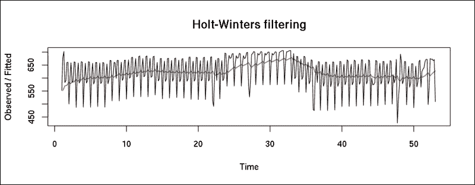
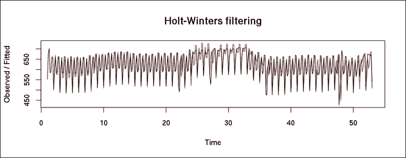
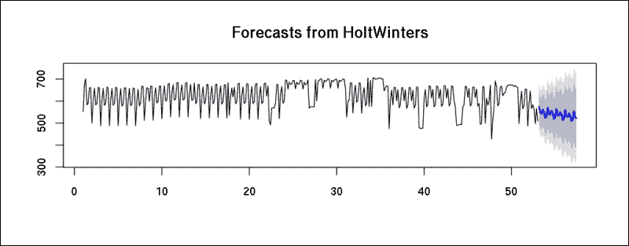
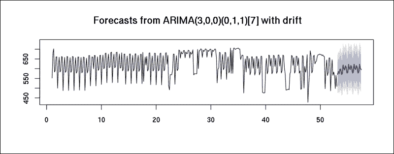
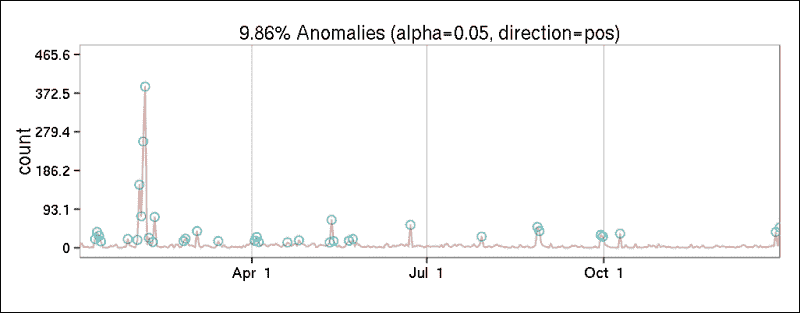
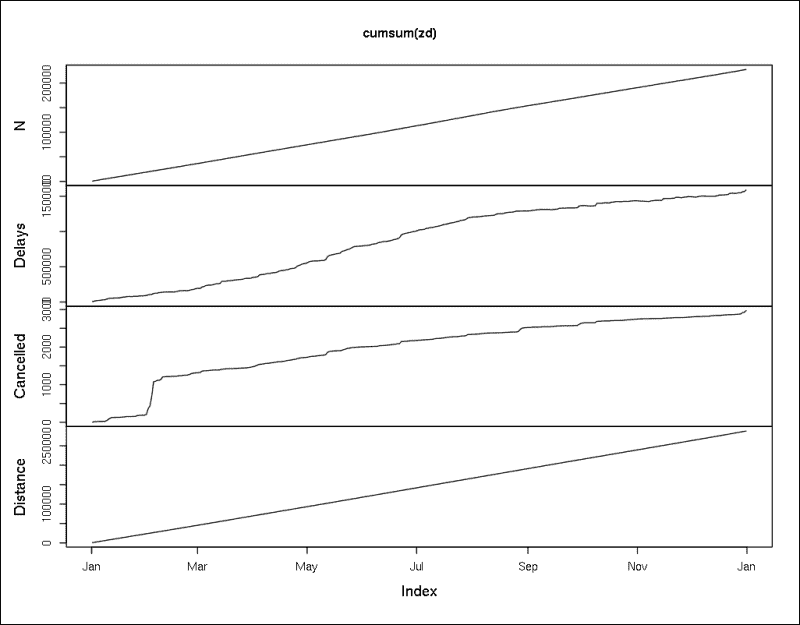

# 十二、分析时间序列

时间序列是按时间顺序排列的数据点序列，常用于经济学或社会科学。与横截面观察相比，在长时间内收集数据的巨大优势在于，我们可以分析随着时间推移收集的完全相同的对象的值，而不是比较不同的观察。

数据的这一特殊特性要求时间序列分析采用新的方法和数据结构。我们将在本章中讨论这些:

*   首先，我们学习如何将观察值加载或转换成时间序列对象
*   然后我们将它们可视化，并试图通过平滑和过滤观察结果来改进图形
*   除了季节分解，我们还介绍了基于时间序列模型的预测方法，我们还涵盖了识别时间序列中的异常值、极值和异常的方法

# 创建时间序列对象

大多数关于时序分析的教程都是从`stats`包的`ts`函数开始的，它可以用一种非常直接的方式创建时序对象。只需传递一个数值向量或矩阵(时间序列分析主要处理连续变量)，指定数据的频率，一切都搞定了！

频率是指数据的自然时间跨度。因此，对于月数据，您应该将它设置为 12，4 表示季度数据，365 或 7 表示日数据，这取决于事件最典型的季节性。例如，如果您的数据具有显著的每周季节性(这在社会科学中很常见)，则应该是 7，但如果日历日期是主要的区分因素，例如天气数据，则应该是 365。

在接下来的页面中，让我们使用来自`hflights`数据集的每日汇总统计数据。首先让我们加载相关的数据集，并将其转换为`data.table`以便于聚合。我们还必须从提供的`Year`、`Month`和`DayofMonth`列中创建一个日期变量:

```r

> library(hflights)

> library(data.table)

> dt <- data.table(hflights)

> dt[, date := ISOdate(Year, Month, DayofMonth)]

```

现在让我们来计算 2011 年每天的航班数量和到达延误总数、取消航班数量以及相关航班的平均距离:

```r

> daily <- dt[, list(

+     N         = .N,

+     Delays    = sum(ArrDelay, na.rm = TRUE),

+     Cancelled = sum(Cancelled),

+     Distance  = mean(Distance)

+ ), by = date]

> str(daily)

Classes 'data.table' and 'data.frame':	365 obs. of  5 variables:

 $ date     : POSIXct, format: "2011-01-01 12:00:00" ...

 $ N        : int  552 678 702 583 590 660 661 500 602 659 ...

 $ Delays   : int  5507 7010 4221 4631 2441 3994 2571 1532 ...

 $ Cancelled: int  4 11 2 2 3 0 2 1 21 38 ...

 $ Distance : num  827 787 772 755 760 ...

 - attr(*, ".internal.selfref")=<externalptr>

```


# 可视化时间序列

这是一个非常熟悉的数据结构:2011 年的每一天有 365 行，五列存储第一个变量中存储的日期的四个指标。让我们将它转换成一个时间序列对象，并立即绘制出来:

```r

> plot(ts(daily))

```


很简单，对吧？我们刚刚在折线图上绘制了几个独立的时间序列。但是第一幅图显示了什么呢？因为`ts`没有自动识别第一列存储我们的日期，所以 *x* 轴的索引从 1 到 365。另一方面，我们发现日期被转换成了在 *y* 轴上的时间戳。点不应该形成一条直线吗？

这是数据可视化的美妙之处之一:一个简单的图表揭示了我们数据的一个主要问题。看来我们必须按日期对数据进行分类:

```r

> setorder(daily, date)

> plot(ts(daily))

```


好多了！既然值的顺序是正确的，我们可以一次一个地关注实际的时间序列数据。首先，让我们看看从 2011 年第一天开始的每日航班频率:

```r

> plot(ts(daily$N, start = 2011, frequency = 365),

+      main = 'Number of flights from Houston in 2011')

```


# 季节分解

嗯，看起来工作日的航班数量波动很大，这确实是人类相关活动的一个主导特征。让我们通过将时间序列分解为具有移动平均值的季节性、趋势性和随机成分来识别和去除每周季节性，从而验证这一点。

虽然这可以通过利用`diff`和`lag`函数手动完成，但是有一种更直接的方法可以通过`stats`包中的`decompose`函数来完成:

```r

> plot(decompose(ts(daily$N, frequency = 7)))

```


去除每周季节性平均值中的峰值，揭示了 2011 年航班数量的总体趋势。由于*x*轴显示了自 1 月 1 日以来的周数(基于频率为 7)，25 至 35 之间的高峰间隔指的是夏季，最低的航班数量发生在第 46 周——可能是由于感恩节。

但是每周的季节性可能更有趣。嗯，很难在前面的图中发现任何东西，因为同样的 7 天重复可以在季节性图上出现 52 次。因此，让我们提取这些数据，并将其显示在带有适当标题的表格中:

```r

> setNames(decompose(ts(daily$N, frequency = 7))$figure,

+         weekdays(daily$date[1:7]))

 Saturday      Sunday      Monday     Tuesday   Wednesday 

-102.171776   -8.051328   36.595731  -14.928941   -9.483886 

 Thursday      Friday 

 48.335226   49.704974

```

因此，季节性效应(前面的数字代表与平均值的相对距离)表明，周一和最后两个工作日的航班数量最多，而周六的航班数量相对较少。

遗憾的是，我们无法分解这一时间序列的年度季节性成分，因为我们只有一年的数据，而对于给定的频率，我们需要至少两个时间段的数据:

```r

> decompose(ts(daily$N, frequency = 365))

Error in decompose(ts(daily$N, frequency = 365)) : 

 time series has no or less than 2 periods

```

对于更高级的季节分解，参见 `stats`包的`stl`函数，它对时间序列数据使用多项式回归模型。下一节将介绍一些背景知识。


# 霍尔特-温特斯滤波

我们同样可以通过霍尔特-温特斯滤波去除时间序列的季节性影响。将`HoltWinters`函数的`beta`参数设置为`FALSE`将产生一个具有指数平滑的模型，该模型实际上抑制了所有异常值；将`gamma`参数设置为`FALSE`将产生一个非季节性模型。一个简单的例子:

```r

> nts <- ts(daily$N, frequency = 7)

> fit <- HoltWinters(nts, beta = FALSE, gamma = FALSE)

> plot(fit)

```



红线代表经过滤波的时间序列。我们还可以通过启用`beta`和`gamma`参数来拟合时间序列的双指数或三指数模型，从而得到更好的拟合:

```r

> fit <- HoltWinters(nts)

> plot(fit)

```



由于该模型提供的值与我们的原始数据极其相似，因此它也可用于预测未来值。为此，我们将使用 `forecast`包。默认情况下，`forecast`函数返回对即将到来的 2 *频率值的预测:

```r

> library(forecast)

> forecast(fit)

 Point Forecast    Lo 80    Hi 80    Lo 95    Hi 95

53.14286       634.0968 595.4360 672.7577 574.9702 693.2235

53.28571       673.6352 634.5419 712.7286 613.8471 733.4233

53.42857       628.2702 588.7000 667.8404 567.7528 688.7876

53.57143       642.5894 602.4969 682.6820 581.2732 703.9057

53.71429       678.2900 637.6288 718.9511 616.1041 740.4758

53.85714       685.8615 644.5848 727.1383 622.7342 748.9889

54.00000       541.2299 499.2901 583.1697 477.0886 605.3712

54.14286       641.8039 598.0215 685.5863 574.8445 708.7633

54.28571       681.3423 636.8206 725.8639 613.2523 749.4323

54.42857       635.9772 590.6691 681.2854 566.6844 705.2701

54.57143       650.2965 604.1547 696.4382 579.7288 720.8642

54.71429       685.9970 638.9748 733.0192 614.0827 757.9113

54.85714       693.5686 645.6194 741.5178 620.2366 766.9005

55.00000       548.9369 500.0147 597.8592 474.1169 623.7570

```

这些是对 2012 年前两周的估计，在那里(除了精确的预测点),我们也得到置信区间。此时，想象这些预测和置信区间可能更有意义:

```r

> plot(forecast(HoltWinters(nts), 31))

```



蓝色点显示了对未来 31 个时间段的估计，周围的灰色区域覆盖了`forecast`函数返回的置信区间。


# 自回归综合移动平均模型

我们可以用**自回归综合移动平均**(**)模型得到类似的结果。为了预测一个时间序列的未来值，我们通常必须首先*平稳化*，这意味着数据在一段时间内具有恒定的均值、方差和自相关性。在过去的两节中，我们使用季节分解和霍尔特-温特斯滤波器来实现这一点。现在让我们看看广义版本的**自回归移动平均** ( **ARMA** )模型如何帮助这种数据转换。**

***ARIMA(p，d，q)* 实际包括三个模型，三个非负整数参数:**

*   ***p* 指模型的自回归部分**
*   ***d* 指集成部分**
*   ***q* 指移动平均线部分**

**由于 ARIMA 还包括 ARMA 的积分(差分)部分，它也可以处理非平稳时间序列，因为它们在差分后自然变得平稳——换句话说，当 *d* 参数大于零时。**

**传统上，为时间序列选择最佳 ARIMA 模型需要用各种参数建立多个模型并比较模型拟合度。另一方面，`forecast`软件包提供了一个非常有用的功能，可以通过运行单位根测试并最小化模型的 **【最大似然】** ( **ML** )和 **Akaike 信息准则**(**【AIC**)，为时间序列选择最佳拟合的 ARIMA 模型:**

```r
 **> auto.arima(nts)**

**Series: ts** 

**ARIMA(3,0,0)(2,0,0)[7] with non-zero mean** 

**Coefficients:**

 **ar1      ar2     ar3    sar1    sar2  intercept**

 **0.3205  -0.1199  0.3098  0.2221  0.1637   621.8188**

**s.e.  0.0506   0.0538  0.0538  0.0543  0.0540     8.7260**

**sigma^2 estimated as 2626:  log likelihood=-1955.45**

**AIC=3924.9   AICc=3925.21   BIC=3952.2** 
```

**看来， *AR(3)* 模型的 AIC 最高，有 *AR(2)* 季节效应。但是检查`auto.arima`的手册发现，由于大量(超过 100 个)观察结果，用于模型选择的信息标准是近似的。重新运行算法并禁用近似会返回不同的模型:**

```r
 **> auto.arima(nts, approximation = FALSE)**

**Series: ts** 

**ARIMA(0,0,4)(2,0,0)[7] with non-zero mean** 

**Coefficients:**

 **ma1      ma2     ma3     ma4    sar1    sar2  intercept**

 **0.3257  -0.0311  0.2211  0.2364  0.2801  0.1392   621.9295**

**s.e.  0.0531   0.0531  0.0496  0.0617  0.0534  0.0557     7.9371**

**sigma^2 estimated as 2632:  log likelihood=-1955.83**

**AIC=3927.66   AICc=3928.07   BIC=3958.86** 
```

**尽管前面的季节性 ARIMA 模型似乎符合高 AIC 的数据，但我们可能希望通过指定 *D* 参数来构建一个真实的 ARIMA 模型，从而通过以下估计得到一个综合模型:**

```r
 **> plot(forecast(auto.arima(nts, D = 1, approximation = FALSE), 31))** 
```

****

**尽管时间序列分析有时可能很棘手(找到具有适当参数的最佳模型需要对这些统计方法有一定的经验)，但前面的简短示例证明，即使对时间序列对象和相关方法有基本的了解，通常也会在数据模式和适当的预测方面提供一些令人印象深刻的结果。**

**

# 离群点检测

除了预测，另一个与时间序列相关的主要任务是在一系列观察中识别可疑或异常的数据，这些数据可能会扭曲我们的分析结果。一种方法是建立 ARIMA 模型，分析预测值和实际值之间的距离。包提供了一个非常方便的方法来做到这一点。让我们根据 2011 年取消的航班数量建立一个模型:

```r

> cts <- ts(daily$Cancelled)

> fit <- auto.arima(cts)

> auto.arima(cts)

Series: ts 

ARIMA(1,1,2)

Coefficients:

 ar1      ma1      ma2

 -0.2601  -0.1787  -0.7752

s.e.   0.0969   0.0746   0.0640

sigma^2 estimated as 539.8:  log likelihood=-1662.95

AIC=3333.9   AICc=3334.01   BIC=3349.49

```

因此，现在我们可以使用一个 *ARIMA(1，1，2)* 模型和`tso`函数来突出显示(并可选地移除)数据集中的异常值:

### Tip

请注意，下面的`tso`调用可能会在 CPU 内核满载的情况下运行几分钟，因为它可能会在后台执行繁重的计算。

```r

> library(tsoutliers)

> outliers <- tso(cts, tsmethod = 'arima',

+   args.tsmethod  = list(order = c(1, 1, 2)))

> plot(outliers)

```


或者，我们可以通过在`tso`中自动调用`auto.arima`来一次性运行前面的所有步骤，除了时间序列对象之外，不需要指定任何额外的参数:

```r

> plot(tso(ts(daily$Cancelled)))

```

无论如何，结果显示所有取消航班数量高的观测值都是异常值，因此应该从数据集中删除。好吧，把有许多航班被取消的任何一天视为异常听起来真的很乐观！但这是非常有用的信息；这表明，例如，预测一个异常事件是不可管理的与先前讨论的方法。

传统上，时间序列分析处理数据的趋势和季节性，以及如何*平稳化*时间序列。如果我们对正常事件的偏差感兴趣，就需要使用一些其他的方法。

Twitter 最近发布了一个 R 包来检测时间序列中的异常。现在我们将使用它的`AnomalyDetection`包以更快的方式识别前面的异常值。正如你可能已经注意到的，`tso`函数运行非常慢，它不能真正处理大量的数据——而`AnomalyDetection`包表现相当好。

我们可以提供输入数据作为一个向量，第一列存储时间戳。不幸的是，`AnomalyDetectionTs`函数不能很好地处理`data.table`对象，所以让我们回到传统的`data.frame`类:

```r

> dfc <- as.data.frame(daily[, c('date', 'Cancelled'), with = FALSE])

```

现在让我们加载这个包，并绘制出在观察中发现的异常:

```r

> library(AnomalyDetection)

> AnomalyDetectionTs(dfc, plot = TRUE)$plot

```



结果与前面的图非常相似，但是有两件事需要注意，您可能已经注意到了。计算速度非常快，另一方面，这个图包含了对人类友好的日期，而不是在 *x* 轴上的一些蹩脚的索引。


# 更复杂的时序对象

`ts`时序 R 对象类的主要限制(除了前面提到的 *x* 轴问题)是它不能处理不规则的时序。为了克服这个问题，我们在 r。

`zoo`包和它的反向依赖 `xts`包是`ts`兼容的类，有大量非常有用的方法。举个简单的例子，让我们从我们的数据中构建一个`zoo`对象，看看它是如何被默认绘图表示的:

```r

> library(zoo)

> zd <- zoo(daily[, -1, with = FALSE], daily[[1]])

> plot(zd)

```


因为我们已经定义了`date`列作为观察的时间戳，所以这里没有显示。轴 *x* 有一个很好的人友好的日期注释，在检查了前几页中一堆整数注释的图之后，这真的很令人愉快。

当然，`zoo`支持`ts`方法中的大部分，比如`diff`、`lag`或者累计和；这些对于可视化数据速度非常有用:

```r

> plot(cumsum(zd))

```



这里， **N** 变量的线性线表明我们没有任何缺失值，并且我们的数据集每天只包含一个数据点。另一方面，二月份**被取消的**线的陡峭海拔凸显出单日对 2011 年被取消航班总数的贡献很大。


# 高级时间序列分析

不幸的是，这短短的章节无法提供更详细的时序分析介绍。老实说，对于一本像样的教程来说，即使是这一章的两到三倍的长度也是不够的，因为时间序列分析、预测和异常检测是统计分析中最复杂的主题之一。

但是好消息是有很多关于这个主题的好书！最好的资源之一——以及关于这个主题的终极免费在线教程——可以在[https://www.otexts.org/fpp](https://www.otexts.org/fpp)找到。这是一个关于预测和一般时间序列分析的非常实用和详细的在线教程，我衷心推荐给任何希望在未来构建更复杂和可实现的时间序列模型的人。


# 总结

本章重点介绍了如何加载、可视化和建模与时间相关的数据。虽然我们不能涵盖这个具有挑战性的主题的所有方面，我们讨论了最广泛使用的平滑和过滤算法，季节分解，和 ARIMA 模型；我们还在此基础上计算了一些预测和估计。

下一章与这一章有些相似，因为我们将在数据集的另一个重要维度上覆盖另一个与领域无关的领域:我们将关注于在哪里捕获的观察结果。**