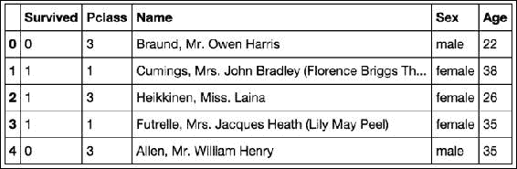
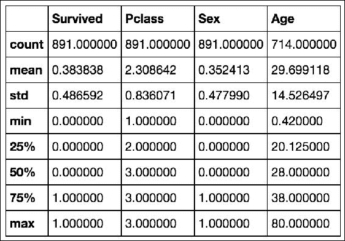
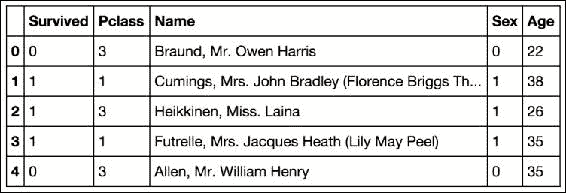

# 三、数据科学的五个步骤

我们已经花了大量时间研究数据科学的预备知识，包括概述数据类型以及如何根据数据类型处理数据集。本章将主要关注探索的第三步。我们将使用 Python 包`pandas`和`matplotlib`来探索不同的数据集。

# 数据科学简介

许多人问我数据科学和数据分析的最大区别。虽然有人可能会说这两者没有区别，但许多人会说有数百种区别！我相信，不管这两个术语之间有多少差异，最大的差异是*数据科学遵循一个结构化的、循序渐进的过程，当遵循该过程时，会保持结果的完整性*。

像任何其他科学努力一样，这一过程必须坚持，否则分析和结果将面临审查的危险。更简单地说，与没有清晰愿景的情况下探索数据相比，遵循严格的流程可以让业余数据科学家更容易更快地获得结果。

虽然这些步骤是业余分析师的指导性课程，但它们也为所有数据科学家提供了基础，即使是在最高级别的商业和学术界。每个数据科学家都认识到这些步骤的价值，并以某种方式遵循它们。


# 五个步骤概述

执行数据科学的五个基本步骤如下:

1.  问一个有趣的问题
2.  获取数据
3.  探索数据
4.  数据建模
5.  交流和可视化结果

首先，我们参照大图来看一下这五个步骤。

## 问一个有趣的问题

这可能是我最喜欢的一步。作为创业者，我每天都会问自己(和其他人)一些有趣的问题。我会像对待头脑风暴一样对待这一步。无论你是否认为回答这些问题的数据存在，都要开始写下问题。原因有两方面。首先，你不希望在搜索数据之前就开始给自己施加压力。第二，获取数据可能涉及在公共和私人地点进行搜索，因此，可能并不十分直接。你可能会问自己一个问题，然后马上对自己说:“哦，不过我打赌现在还没有数据能帮我。”然后把它从你的问题单上划掉。不要这么做！把它留在你的清单上。

## 获取数据

一旦你选择了你想要关注的问题，是时候在世界范围内搜寻可能回答这个问题的数据了。如前所述，数据可以来自多种来源；所以，这一步可以很有创意！

## 探索数据

一旦我们有了数据，我们就利用本书第[章](ch02.html "Chapter 2. Types of Data")、*数据类型*中的经验，开始分解我们正在处理的数据类型。这是这一过程中的关键一步。一旦完成这一步，分析师通常会花几个小时来了解领域，使用代码或其他工具来操作和探索数据，并对数据可能试图告诉他们的东西有很好的感觉。

## 建立数据模型

这一步涉及统计和机器学习模型的使用。在这一步中，我们不仅要拟合和选择模型，还要植入数学验证指标，以便量化模型及其有效性。

## 沟通并可视化结果

这可以说是最重要的一步。虽然这看起来简单明了，但是用一种容易理解的格式总结你的结果比看起来要困难得多。我们将看看不同的例子，当结果传达得不好时和当结果显示得很好时。

在本书中，我们将主要关注第 3、4 和 5 步。

### 注意

为什么我们要跳过本书中的第 1 步和第 2 步？

虽然前两步无疑是这一进程的必要步骤，但它们通常先于统计和方案系统。在本书的后面，我们将触及不同的获取数据的方法，然而，为了将重点放在过程的更科学的方面，我们将马上开始探索。


# 探索数据

探索数据的过程不是简单定义的。它包括识别不同类型的数据、转换数据类型以及使用代码系统地提高整个数据集的质量，从而为建模阶段做好准备的能力。为了最好地表现和教授探索的艺术，我将展示几个不同的数据集，并使用 python 包 pandas 来探索这些数据。在这个过程中，我们会遇到不同的处理数据的技巧和诀窍。

在处理一个我们以前可能没有见过的新数据集时，我们应该问自己三个基本问题。请记住，这些问题不是数据科学的开始和结束；它们是在探索一组新获得的数据时应该遵循的一些准则。

## 数据探索的基本问题

当查看一个新的数据集时，无论您是否熟悉，使用以下问题作为您初步分析的指南是很重要的:

*   Is the data organized or not?

    我们正在检查数据是否以行/列结构显示。在大多数情况下，数据将以一种有组织的方式呈现。在本书中，超过 90%的例子将从有组织的数据开始。然而，这是我们在深入分析之前可以回答的最基本的问题。

    一般的经验法则是，如果我们有未组织的数据，我们希望将其转换为行/列结构。例如，在本书的前面，我们研究了通过计算单词/短语的数量将文本转换为行/列结构的方法。

*   What does each row represent?

    一旦我们有了如何组织数据的答案，并且现在正在查看一个基于行/列的数据集，我们就应该确定每一行实际上代表什么。这一步通常很快，可以帮助你更快地正确看待事物。

*   What does each column represent?

    我们应该根据数据的级别以及它是否是定量/定性的等等来识别每一列。随着我们分析的进展，这种分类可能会改变，但是尽早开始这一步是很重要的。

*   Are there any missing data points?

    数据并不完美。有时，我们可能会因为人为或机械错误而丢失数据。当这种情况发生时，作为数据科学家，我们必须决定如何处理这些差异。

*   Do we need to perform any transformations on the columns?

    根据每一列的数据级别/类型，我们可能需要执行某些类型的转换。例如，一般来说，为了统计建模和机器学习，我们希望每一列都是数字。当然，我们将使用 Python 进行任何和所有的转换。

自始至终，我们都在问自己一个总的问题，我们能从初步的推断统计中推断出什么？我们希望能够比第一次发现数据时更好地理解数据。

说得够多了，下面一节我们来看一个例子。

## 数据集 1–Yelp

我们要看的第一个数据集是由餐馆评论网站 Yelp 提供的公共数据集。所有个人身份信息已被删除。让我们先读入数据，如下所示:

```py
import pandas as pd

yelp_raw_data = pd.read_csv("yelp.csv")

yelp_raw_data.head()
```

快速回顾一下前面代码的作用:

*   导入`pandas`包，昵称为`pd`。
*   从网上读入`.csv`；来电是`yelp_raw_data`。
*   看数据的`head`(就前几行)。


数据是否有组织？

*   因为我们有一个很好的行/列结构，所以我们可以得出结论，这个数据看起来很有组织。

每一行代表什么？

*   很明显，每一行代表一个用户对一个企业的评论。接下来我们应该做的是检查每一行，并根据它包含的数据类型对其进行标记。此时，我们还可以使用 python 来计算数据集有多大。我们可以用一个数据帧的`shape`质量来找出这一点，如图:

    ```py
    yelp_raw_data.shape

    # (10000,10)
    ```

*   它告诉我们这个数据集有`10000`行和`10`列。另一种说法是，这个数据集有 10，000 个观察值和 10 个特征。

每一列代表什么？

请注意，我们有`10`列:

*   `business_id`:这可能是审核业务的唯一标识符。这将是在**名义水平**，因为这个标识符没有自然的顺序。
*   这可能是评论发布的日期。请注意，它似乎只特定于日、月和年。尽管时间通常被认为是连续的，但由于日期的自然顺序，该列可能被认为是离散的，并且处于**序数级**。
*   这可能是每个帖子所代表的评论的唯一标识符。这将是在**名义水平**，因为，同样，这个标识符没有自然的顺序。
*   `stars`:从快看(别急；我们将很快执行一些进一步的分析)，我们可以看到这是一个有序的列，表示评论者给餐馆的最终分数。这是有序的、定性的；所以，这是在**序数级**。
*   这可能是每个评审者写的原始文本。和大多数文本一样，我们把它放在**名义层**。
*   `type`:在前五列，我们看到的都是 *review* 这个词。这可能是一个标识每一行都是一个评论的列，意味着除了评论之外可能还有另一种类型的行。我们稍后将对此进行研究。我们将此置于**名义水平**。
*   `user_id` : This is likely a unique identifier for the user who is writing the review. Just like the other unique IDs, We place this data at the **nominal level** .

    ### Note

    Please note that after we look at all the columns and find that all the data are either at the serial number level or at the nominal level, we must look at the following contents. This is not uncommon, but it is worth mentioning.

是否有任何缺失的数据点？

*   执行 isnull 操作。例如，如果您的数据帧名为 awesome_dataframe，那么尝试 python 命令`awesome_dataframe.isnull().sum()`，它将显示每一列中缺失值的数量。

我们需要在列上执行任何转换吗？

*   在这一点上，我们正在寻找一些东西。例如，我们是否需要改变一些定量数据的规模，或者我们是否需要为定性变量创建虚拟变量？由于这个数据集只有定性列，我们只能关注序数和名义尺度上的转换。

在开始之前，让我们来看一下关于熊猫的一些快速术语，python 数据探索模块。

### Dataframes

当我们读入数据集时， Pandas 创建一个名为 **Dataframe** 的定制对象。可以把它想象成电子表格的 python 版本(但要好得多)。在这种情况下，变量`yelp_raw_data`是一个数据帧。

要在 Python 中检查这是否成立，请键入以下代码:

```py
type(yelp_raw_data)

# pandas.core.frame.DataFrame
```

数据帧本质上是二维的，这意味着它们以行/列结构组织，就像电子表格一样。比如说，在电子表格软件上使用数据帧的主要好处是，数据帧可以处理比大多数普通电子表格软件大得多的数据。如果您熟悉 R 语言，您可能会认出 Dataframe 这个词。这是因为这个名字实际上是从语言中借用的！

由于我们将要处理的大多数数据都是有组织的，Dataframes 可能是 pandas 中使用最多的对象，仅次于 Series 对象。

### 系列

**系列**对象只是一个数据帧，但只有一维。本质上，它是一个数据点列表。数据帧的每一列都被认为是一个系列对象。让我们检查一下这个。我们需要做的第一件事是从我们的数据帧中抓取一个单独的列；我们通常使用所谓的`bracket notation`。下面是一个例子:

```py
yelp_raw_data['business_id'] # grabs a single column of the Dataframe
```

我们将列出前几行和后几行:

```py
0     9yKzy9PApeiPPOUJEtnvkg
1     ZRJwVLyzEJq1VAihDhYiow
2     6oRAC4uyJCsJl1X0WZpVSA
3     _1QQZuf4zZOyFCvXc0o6Vg
4     6ozycU1RpktNG2-1BroVtw
5     -yxfBYGB6SEqszmxJxd97A
6     zp713qNhx8d9KCJJnrw1xA
```

让我们使用 type 函数来检查这个列是否是一个系列:

```py
type(yelp_raw_data['business_id'])

# pandas.core.series.Series
```

### 定性数据的探索技巧

使用这两个 Pandas 对象，让我们开始执行一些初步的数据探索。对于定性数据，我们将特别关注名词性和序数水平。

#### 名义水平列

由于我们处于名义水平，让我们回忆一下，在这个水平上，数据是定性的，并且纯粹通过名称来描述。在这个数据集中，这是指`business_id`、`review_id`、`text`、`type`和`user_id`。让我们用熊猫来潜水更深一点，如下所示:

```py
yelp_raw_data['business_id'].describe()

# count                      10000
# unique                      4174
# top       JokKtdXU7zXHcr20Lrk29A
# freq                          37
```

`describe`函数将为我们提供一些关于我们在引号中输入其名称的列的快速统计数据。请注意 Pandas 是如何自动识别出`business_id`是一个定性列，并给我们有意义的统计数据的。当在一个定性列上调用`describe`时，我们将总是得到以下四项:

*   `count`:填写了多少个值
*   `unique`:填入多少个唯一值
*   `top`:数据集中最常见项目的名称
*   `freq`:最常见的项目出现在数据集中的频率

在名义层面，我们通常会寻找一些标志着转变的东西:

*   我们有合理数量(通常在 20 个以下)的独特物品吗？
*   此列是自由文本吗？
*   该列在所有行中是完全唯一的吗？

因此，对于`business_id`列，我们有一个`10000`的计数。但是不要被愚弄了！这并不意味着我们有 10，000 家企业在这里接受审查。这只是意味着在 10，000 行评论中，`business_id`列被填充了全部 10，000 次。下一个限定符`unique`告诉我们，在这个数据集中，我们有`4174`独特的企业正在接受审查。评论最多的业务是业务`JokKtdXU7zXHcr20Lrk29A`，评论了`37`次。

```py
yelp_raw_data['review_id'].describe()

# count                      10000
# unique                     10000
# top       eTa5KD-LTgQv6UT1Zmijmw
# freq                           1
```

我们有一个`10000`的`count`和一个`10000`的`unique`。想一想，这有意义吗？想想每一行代表什么，这一列代表什么。

*(在此插入危险主题曲)*

它当然有！这个数据集的每一行都应该代表一个业务的单一的、唯一的评论，而这一列应该作为评论的唯一标识符；因此，`review_id`列中有`10000`个唯一的条目是有意义的。那么，为什么`eTa5KD-LTgQv6UT1Zmijmw`是*最常见的*复习呢？这只是从 10，000 个中随机选择的，没有任何意义。

```py
yelp_raw_data['text'].describe()

count                                                 10000
unique                                                 9998
top       This review is for the chain in general. The l...
freq                                                      2
```

这个专栏代表了人们写的真实文本，很有意思。我们会想象这也应该和`review_id`相似，都应该是唯一的文本，因为如果两个人写的东西完全一样，那会很奇怪；但是我们有两篇内容完全相同的评论！让我们花点时间了解一下数据帧过滤，以便进一步研究这一点。

#### 熊猫中的过滤

让我们谈一谈过滤是如何工作的。在 Pandas 中，基于某些标准过滤行是非常容易的。在一个数据帧中，如果我们希望根据一些搜索标准过滤掉一些行，我们需要逐行检查一行是否满足特定的条件。熊猫通过传入一系列*真*和*假*(布尔)来处理这个问题。

我们实际上将一列`True`和`False`数据传递到数据帧中，这些数据的含义如下:

*   `True`:该行满足条件
*   `False`:该行不满足条件

所以，首先让我们来制定条件。在下面的代码行中，我将获取出现两次的文本:

```py
duplicate_text = yelp_raw_data['text'].describe()['top']
```

以下是一段文字:

```py
"This review is for the chain in general. The location we went to is new so it isn't in Yelp yet. Once it is I will put this review there as well……."
```

马上，我们可以猜测，这实际上可能是一个人去评论属于同一连锁店的两个企业，并写了完全相同的评论。然而，现在这只是一种猜测。

### 注意

`duplicate_text`变量属于`string`类型。

现在我们有了这段文字，让我们用一些魔法来创造这一系列的真与假:

```py
text_is_the_duplicate = yelp_raw_data['text'] == duplicate_text
```

你可能马上会感到困惑。我们在这里所做的是获取 Dataframe 的文本列，并将其与字符串`duplicate_text`进行比较。这很奇怪，因为我们似乎在将一个包含 10，000 个元素的列表与一个字符串进行比较。当然，答案应该是直接错误的，对吗？

Pandas 的系列有一个非常有趣的特性，如果您将该系列与一个对象进行比较，它将返回另一个相同长度的布尔系列，其中每个 true 和 false 都是问题的答案，*该元素与您要比较的元素相同吗？*非常得心应手！

```py
type(text_is_the_duplicate) # it is a Series of Trues and Falses

text_is_the_duplicate.head() # shows a few Falses out of the Series
```

在 Python 中，我们可以把 true 和 false 分别当作 1 和 0 来加减。例如，*真+假–真+假+真== 1* 。因此，我们可以通过将所有的值相加来验证这个序列是正确的。因为这些行中只有两行应该包含重复的文本，所以系列的总和应该只有`2`，它就是！这显示如下:

```py
sum(text_is_the_duplicate) # == 2
```

现在我们有了一系列的布尔值，我们可以使用括号符号将它直接传递到我们的数据帧中，并获得我们筛选的行，如下所示:

```py
filtered_dataframe = yelp_raw_data[text_is_the_duplicate] 
# the filtered Dataframe

filtered_dataframe
```


看来我们的怀疑是正确的，一个人在同一天给了两个不同的`business_id`完全相同的评论，可能是同一链的一部分。让我们继续关注我们的其他专栏:

```py
yelp_raw_data['type'].describe()

count      10000
unique         1
top       review
freq       10000
```

还记得这个专栏吗？原来都是一模一样的类型，也就是`review`。

```py
yelp_raw_data['user_id'].describe()
count                      10000
unique                      6403
top       fczQCSmaWF78toLEmb0Zsw
freq                          38
```

类似于`business_id`列，所有的`10000`值都填写有`6403`个唯一用户和一个查看`38`次的用户！

在这个例子中，我们不需要执行任何转换。

#### 序数级列

至于有序的列，我们看到的是日期和`stars`。对于这些列中的每一列，让我们看看 describe 方法带来了什么:

```py
yelp_raw_data['stars'].describe()
# count    10000.000000
# mean         3.777500
# std          1.214636
# min          1.000000
# 25%          3.000000
# 50%          4.000000
# 75%          5.000000
# max          5.000000
```

哇哦。尽管这个列是序数型的，但是`describe`方法返回的统计数据可能是我们期望的数量型列。这是因为软件看到了一堆数字，并假设我们想要像`mean`或`min`和`max`这样的统计数据。这个没问题。让我们用一种叫做`value_counts`的方法来看看计数分布，如下图所示:

```py
yelp_raw_data['stars'].value_counts()
# 4    3526
# 5    3337
# 3    1461
# 2     927
# 1     749
```

`value_counts`方法将返回任意列的值的分布。在这种情况下，我们看到星级`4`是最常见的，有`3526`值，紧随其后的是等级`5`。我们也可以绘制这些数据来获得一个很好的视觉效果。先按星级排序，然后用预置的`plot`方法做一个`bar`图。

```py
dates = yelp_raw_data['stars'].value_counts()
dates.sort()
dates.plot(kind='bar')
```


人们肯定更有可能给好的星评而不是坏的星评！我们可以按照这个过程处理日期列。我会让你自己试一试。现在，让我们来看一个新的数据集。

## 数据集 2–泰坦尼克号

`titanic`数据集包含了 1912 年泰坦尼克号【T2 号】撞上冰山时船上人员的样本。让我们继续导入它，如下所示:

```py
titanic = pd.read_csv('short_titanic.csv')
titanic.head()
```



这个数据帧通常有更多的列；然而，对于我们的例子，我们将只关注给定的列。

这些数据肯定是以行/列结构组织的，大多数电子表格数据也是如此。让我们快速看一下它的大小，如下所示:

```py
titanic.shape

# (891, 5)
```

因此，我们有`891`行和`5`列。每行似乎代表船上的一名乘客，就列而言，下面的列表告诉我们它们表示什么:

*   `Survived`:这是一个二元变量，表示乘客是否在事故中幸存(如果幸存则为`1`，如果死亡则为`0`)。这可能是名义水平，因为只有两种选择。
*   `Pclass`:这是乘客乘坐的舱位等级(`3`为三等舱，依此类推)。这是在序数层面。
*   `Name`:这是乘客的名字，绝对是名义上的级别。
*   `Sex`:表示乘客的性别。它处于名义水平。
*   这个有点棘手。可以说，你可以把年龄放在定性或定量的水平上，然而，我认为年龄属于定量状态，因此，属于比率水平。

就转换而言，通常，我们希望所有的列都是数字的，不管它们的定性状态如何。这意味着`Name`和`Sex`必须以某种方式转换成数字列。对于`Sex`，如果乘客是女性，我们可以将列改为保存`1`，如果是男性，则保存`0`。让我们用熊猫来改变。我们必须导入另一个 Python 模块，称为`numpy`或数字 Python，如图所示:

```py
import numpy as np
titanic['Sex'] = np.where(titanic['Sex']=='female', 1, 0)
```

`np.where`方法接受三件事:

*   布尔列表(真或假)
*   新的价值观
*   备份值

该方法将用第一个值(在本例中为`1`)替换 all true，用第二个值(在本例中为`0`)替换 false，留给我们一个新的数字列，它表示与原始的`Sex`列相同的内容。

```py
titanic['Sex']

# 0     0
# 1     1
# 2     1
# 3     1
# 4     0
# 5     0
# 6     0
# 7     0
```

让我们使用快捷方式一次性描述所有列，如下所示:

```py
titanic.describe()
```



请注意我们的定性列是如何被视为定量的；但是，我要找的是与数据类型无关的东西。注意计数行:`Survived`、`Pclass`、`Sex`都有`891`值(行数)，而`Age`只有`714`值。有些不见了！为了进行双重验证，让我们使用名为`isnull`和`sum`的 Pandas 函数，如下所示:

```py
titanic.isnull().sum()

Survived      0
Pclass        0
Name          0
Sex           0
Age         177
```

这将向我们显示每一列中缺失值的数量。因此，`Age`是唯一需要处理的缺少值的列。

处理缺失值时，通常有以下两种选择:

*   删除缺少值的行
*   试着把它填上

删除行是最容易的选择；但是，您有丢失宝贵数据的风险！例如，在这种情况下，我们有`177`个缺失的年龄值(891-714 ),占数据的近 20%。要填写数据，我们可以回到历史书，逐个找到每个人，并填写他们的年龄，或者我们可以用占位符值填写年龄。

让我们用数据集中人们的总体平均年龄来填充`Age`列的每个缺失值。为此，我们将使用两种新方法，称为`mean`和`fillna`。我们使用`isnull`来告诉我们哪些值为空，使用`mean`函数来给出`Age`列的平均值。`fillna`是一个 Pandas 方法，用给定值替换空值。

```py
print sum(titanic['Age'].isnull()) # == 177 missing values

average_age = titanic['Age'].mean() # get the average age

titanic['Age'].fillna(average_age, inplace = True) #use the fillna method to remove null values

print sum(titanic['Age'].isnull()) # == 0 missing values
```

我们完成了！我们已经用数据集中的平均年龄`26.69`替换了每个值。

```py
titanic.isnull().sum()

Survived      0
Pclass        0
Name          0
Sex           0
Age           0
```

太好了！没有丢失任何东西，我们也不需要删除任何行。

```py
titanic.head()
```



在这一点上，我们可以开始让我们的问题变得复杂一点。例如，*女性或男性的平均年龄是多少？*要回答这个问题，我们可以按性别过滤，取平均年龄。Pandas 对此有一个内置函数，名为`groupby`，如下图所示:

```py
titanic.groupby('Sex')['Age'].mean()
```

这意味着*将数据按性别列分组，然后给我每组的平均年龄*。这为我们提供了以下输出:

```py
Sex
0      30.505824
1      28.216730
```

我们将问更多这些困难而复杂的问题，并且将能够用 Python 和统计学来回答它们。


# 总结

虽然这只是我们对数据探索的第一次了解，但不要担心，这绝对不是我们最后一次遵循这些数据科学和探索的步骤。从现在开始，每当我们看到一个新的数据，我们将使用我们的探索步骤来转换、分解和标准化我们的数据。本章中概述的步骤虽然只是指南，但却是任何数据科学家在工作中都可以遵循的标准做法。这些步骤也可以应用于任何需要分析的数据集。

我们正在快速接近这本书处理统计、概率和机器学习模型的部分。在我们真正进入这些模型之前，我们必须先了解一些数学基础。在下一章中，我们将了解在建模中执行一些更复杂的操作所必需的数学知识，但是不要担心，这个过程所需的数学知识很少，我们将一步一步地讲解。