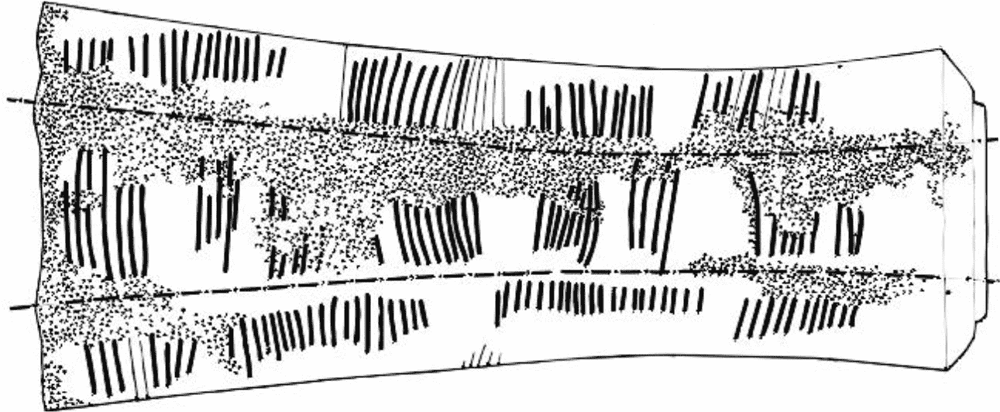
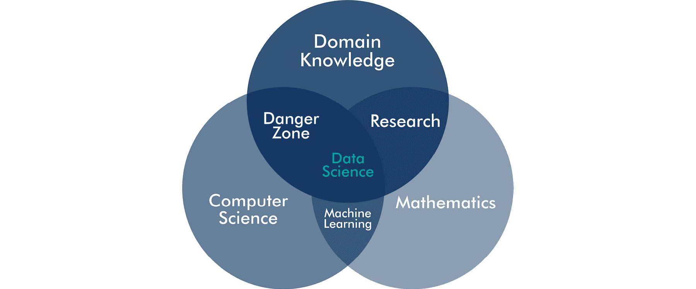

  

# 一、什么是数据科学？

## 简介

分析数据的活动和人类文化一样古老。已知最早的书写形式不是史诗或宗教文本，而是资料。Ishango 骨头是一只狒狒的雕刻腓骨，它是 20，000 年前在中非雕刻的。一些学者假设这些雕刻代表了一个早期的数字系统，因为它列出了几个质数，而其他人认为它是一个日历。一些研究人员驳回了这些想法，并认为这些标记只是在使用骨头作为球杆时提高了抓握力。无论其目的是什么，标记的分组明显是数学化的，如图*图 1.1* ( *普莱瑟，V. (2012)。伊桑戈骨头是否表明对 12 进制的了解？解读史前发现，人类第一个数学工具。eprint*—https://arxiv . org/ABS/1204.1019)

下图显示了 Ishango 人骨头上的标记:

###### 图 1.1:Ishango 骨头上的标记

世界各地的古代文化通过观察自然和星星来收集数据，以预测他们何时需要移动营地，开始播种作物，狩猎季节性动物，以及获取生存所需的任何其他知识。这些原始科学方法是对科学的第一次尝试，因为这些早期的研究人员收集数据来用逻辑术语解释世界。这些原始形式的科学帮助这些人了解他们的世界并控制他们的命运，这正是当代科学寻求实现的目标。

数学是古代文明不可分割的一部分。苏美尔、埃及、罗马和其他先进的古代文明使用数学来管理他们的社会和建造他们精致的城市。我们现在所知的文明起源于美索不达米亚，也就是今天的伊拉克。考古学家挖掘出了数千块记录他们日常活动的泥板，如土地买卖、货物运送和其他商业交易。大约在同一时期，在法老时代的埃及，第一次人口普查开始了，记录了关于其居民的人口统计数据。(*凯莱赫，法学博士，&蒂尔尼，B. (2018)。数据科学。马萨诸塞州剑桥:麻省理工学院出版社*)这些例子表明，收集数据并利用它来控制和改善我们的世界是一项古老的人类活动。

这个时期也是第一个重要的数学发现和发明的时期。然而，数学不仅仅是一种模拟世界的语言。对于伟大的古希腊数学家毕达哥拉斯来说，数字所具有的意义超出了它们描述数量的能力。在智力探索的早期，占卜是预测未来最流行的方法。占星家绘制天空图或研究鸟的内脏来寻找这些图案和他们的世界之间的关系。在这些占卜系统中，数学被实践为通过工程和簿记来管理社会的工具，而不是描述世界的工具。

十七世纪的科学革命用理解世界的数学方法取代了占卜。自从勒内·笛卡尔的工作以来，数学已经采取了一种方法的形式来描述世界和预测它的未来。(*戴维斯，P.J .，&赫什，R. (1990)。笛卡尔的梦想。《数学的世界》伦敦:企鹅*)这场我们以数学方式看待世界的革命促成了工业革命。早期技术用机器增强了我们的身体能力，而现代技术用计算机改善了我们的思维。机器让我们变得更强更快，它们的发展在第一次工业革命期间彻底改变了社会。计算机增强了我们思维能力的各个方面，我们正处于第二次工业革命的中期，这场革命不是由石油和煤炭推动的，而是由数据推动的。

因此，数据可以用来理解世界的想法几乎和人类本身一样古老，并逐渐演变成我们现在所说的数据科学。我们可以用一些基本的数据科学来回顾这个术语随着时间的发展。

###### 图 1.2:双字“数据科学”在文献和谷歌搜索中出现的频率，按最高百分比排序

数据和科学这两个词的组合可能看起来相对较新，但谷歌 **N 元语法查看器**显示，这种**二元语法**自上世纪中叶以来就一直在使用。n-gram 是一个单词序列，bi-gram 是两个单词的任意组合。谷歌的 n-gram viewer 是一个可搜索的数据库，包含 2008 年之前出版的数百万本扫描书籍。这个数据库是预测文本算法的来源，因为它包含了关于人们如何使用各种语言的大量知识。(*Google Books Ngram Viewer*—[https://books.google.com/ngrams/graph?content=data+science&year _ start = 1900&year _ end = 2008&corpus = 15&smoothing = 3&share =&direct _ URL = t1 % 3B % 2c data % 20 science % 3B % 2cc 0](https://books.google.com/ngrams/graph?content=data+science&year_start=1900&year_end=2008&corpus=15&smoothing=3&share=&direct_url=t1%3B%2Cdata%20science%3B%2Cc0)*检索 2019 年 1 月 25 日*

n-gram 数据库表明，数据科学这个术语出现在上个世纪中叶，当时电子计算成为一个研究课题。在那个时候，这门学科是一门关于存储和操作数据的科学。目前的定义已经从最初的学术活动变成了商业活动。

从谷歌的另一个数据库来看，数据科学在几年前才开始从默默无闻到成为最新商业时尚的旅程。**谷歌趋势**数据库显示了一段时间内搜索词的频率。谷歌趋势显示，从 2013 年开始，数据科学作为一个搜索词的受欢迎程度稳步上升。(*谷歌趋势*—[https://trends.google.com/trends/explore?date=all&q = data % 20 科学](https://trends.google.com/trends/explore?date=all&q=data%20science) *检索 2019 年 1 月 25 日*)

*图 1.2* 可视化了这两种趋势。横轴表示从 1960 年到最近的年份。纵轴显示与最大值相比的相对出现次数，这是 Google 报告搜索次数的方式。从绝对意义上来说，在书中出现的次数远低于当前的搜索量。虽然自 2012 年以来，关注度急剧上升，但这个词在 20 世纪 60 年代开始成为商业流行语。虽然我们可以谈论最近的炒作，但二元数据科学的使用显示了一个缓慢的演变，最近出现了兴趣高峰。

对数据科学益处的期望非常高。商业作者将数据科学及其天然伙伴“大数据”定位为解决所有社会问题的灵丹妙药和增加商业利润的手段。(*克莱格，B. (2017)。大数据:信息革命如何改变我们的生活。图标书*。在《哈佛商业评论》2012 年的一篇文章中，达文波特和帕蒂尔甚至宣称数据科学家的角色是“21 世纪最性感的工作”。(*达文波特，T.H .，&帕蒂尔，D.J. (2012)。数据科学家:21 世纪最性感的工作*——[https://HBR . org/2012/10/data-scientist-21 世纪最性感的工作](https://hbr.org/2012/10/data-scientist-the-sexiest-job-of-the-21st-century) *《哈佛商业评论》，90(10)，70–76(T7)谁不想成为拥有如此诱人职业前景的新职业的一部分呢？假设他们的文章是谷歌报告的搜索量增加的原因之一并不夸张。*

最近数据科学作为商业活动的流行表明，它只是商业分析的一种奇特说法。在我在澳大利亚和新西兰谈论数据科学时，我经常会遇到一些经理同事，他们对数据科学家宣称的巫师般的能力和机器学习的无限前景持怀疑态度。数据科学的大部分前景与谷歌和脸书等互联网公司以及数字经济中许多其他较小参与者的成功故事有关。对于这些组织来说，数据科学是一项核心竞争力，因为他们的价值主张以数据为中心。

对于提供物理产品或非数字服务的组织来说，数据科学就是要改进他们收集、存储和分析数据的方式，以便从这种资源中获取更多价值。数据科学的目标不是数据本身，而是与组织的战略目标紧密交织在一起。这些目标从增加股东回报到为整个社会提供利益，范围广泛。无论你在什么样的组织中，数据科学的目的是帮助管理者将现实转变为更理想的状态。数据科学家通过测量现实的当前和过去状态，并使用数学工具预测未来状态来实现这一目标。

“数据科学”这个术语在现在的使用方式上是不幸的，因为矛盾的是它不是一门数据科学。数据科学家不是研究数据属性的人。其他定义将数据科学家视为发明新的数据分析方法的数学家和计算机科学家。更常见的是，数据科学与业务成果密切相关。

数据科学是一种使用数据解决实际问题的系统性和战略性方法。数据科学家的问题是实际的，因为纯科学与商业有不同的目标。组织中的数据科学家对问题的通用解决方案不太感兴趣，而是专注于改善组织实现目标的方式。也许数据和科学这两个词的组合应该留给学者。

有一些迹象表明，过去几年的兴奋正在消退。数据科学博客作者 Matt Tucker 宣布了这位数据科学家的死亡。(*塔克，M. (2018)。数据科学家之死。2019 年 2 月 9 日检索自数据科学中心*——[https://www . datasciencecentral . com/profiles/blogs/the-death-of-the-Data-scientist](https://www.datasciencecentral.com/profiles/blogs/the-death-of-the-data-scientist))对于许多商业问题来说，机器学习的核心方法导致了对问题的过度分析。塔克提供了一个轶事，一群数据科学家花了很多时间来微调一个复杂的神经网络。当一名在该领域拥有专业知识的年轻毕业生使用比他们的神经网络更准确的线性回归时，数据科学家放弃了。

互联网上关于数据科学作为一门商业学科的负面言论可能意味着炒作正在消退。然而，我们不应该把婴儿和洗澡水一起倒掉。最近对分析数据的兴趣增加了组织如何使用这一宝贵资源的风险。即使在膨胀的期望消退后，数据科学作为一种职业仍有有益的贡献。所有数据，无论大小，都是改善组织绩效的资源。

这本书将数据科学视为分析数据以解决业务问题的艺术的战略和系统方法。数据科学的这种概念化并不是一个完整的定义。数据的计算分析也作为一门科学和一种科学方法应用于许多领域的研究。这本书是从商业角度来写的，数据科学的其他用途没有进一步考虑。

## 数据驱动的组织

前一节表明，数据科学不一定只是炒作，而是使用数据的战略和系统方法。在组织中使用数据也称为业务分析或基于证据的管理。也有一些特定的方法，如**六适马**，使用统计分析来改进业务流程。许多数据科学的倡导者声称新旧方法是不同的。数据科学的大多数定义都侧重于通过机器学习使用大数据集进行模式识别。(*凯莱赫&蒂尔尼(2018)* )。数据科学与它的前辈流行语有什么关系？为了理解这种差异，我们需要探索在商业中使用数据的早期历史。

管理可以是科学的想法只有一个多世纪的历史。弗雷德里克·泰勒是一名美国工程师，他对工厂的管理方式不满。他是一名实践型工程师，在工厂车间呆了很长时间。泰勒注意到工人如何使用经验法则，而不是系统地分析问题。他在《科学管理的原则》( 1911 年)中写道，他是如何通过测量流程和分析数据来改进米德维尔钢铁公司人工装载大块铁的流程的。(*泰勒，F.W. (1997)。科学管理的原则。纽约米尼奥拉:多佛出版公司*

尽管泰勒革新了我们管理组织的方式，但他鄙视劳动者。泰勒认为，“有可能训练一只聪明的大猩猩变得比工厂工人更有效率”。他对科学管理的追求是由从劳动力中去除权力并从抽象的数学意义上看待业务流程的冲动所驱动的。他的工作在他的时代是有争议的，因为这是一个正式的政府调查的主题。这个关于泰勒的背景不仅仅是一些琐事，而是关于确保在我们的分析中包含人类维度的有价值的一课。泰勒的积极遗产是，他为管理一个组织的科学方法播下了种子。所有方法都认同他的理念，即利用数据来防止管理中的偏差。

管理者面临着在不确定的环境中决定下一步做什么，并且经常使用他们的经验和直觉来决定下一步的行动，而不是数据和逻辑。虽然经验和直觉非常有价值，但我们的头脑容易产生偏见和非理性思维。我们的理性不是无限的，而是受到我们无法控制的因素的限制。信息量、解决问题的时间以及我们的智力都是有限的。我们的大脑能够快速识别自然界的模式，因为这对我们的日常生活有帮助。泰勒鄙视的思维捷径，即经验法则，帮助我们在紧急情况下快速做出决定，但它们也可能导致次优结果。

商业世界并不是我们必须进化才能驾驭的，因此我们并不擅长解释大量的抽象数据。因为我们的大脑被设定为识别模式，所以我们经常在没有规律的地方看到规律，心理学家称之为幻觉。这种情况使我们能够认出云中的动物，或者在一片烤面包上看到耶稣的形象，或者在火星表面看到一张脸。Pareidolia 为我们提供了很好的服务，因为它支持图形通信，但在分析大型数据集时，它会成为一个障碍。有趣的是，神经网络也可以被训练来体验幻觉。当操纵图像识别软件的设置时，计算机可以被教会识别随机数据中的图像，并有效地产生新的现实。( *Mordvintsev，a .、Olah，C. & Tyka，M. (2015)。理念主义*——[http://ai . Google blog . com/2015/06/理念主义——深入神经. html](http://ai.googleblog.com/2015/06/inceptionism-going-deeper-into-neural.html) : *深入神经网络。检索日期:2019 年 2 月 15 日*

除了通过我们的理性限制的固有偏见，社会环境也可以阻止我们优化决策。群体思维和办公室政治通常是组织决策的强大驱动力。社会归属感是我们行为的强大动力，也是广告背后的主要驱动力之一。Asch 的从众实验说明了这些社会偏见有多强烈。Solomon Asch 证明了，即使人们完全知道一个简单问题的合理答案，在大多数情况下，他们也会给出自己的意见来匹配群体的意见，即使这显然是错误的选择。( *Asch 从众实验(YouTube*——【https://www.youtube.com/watch?v=TYIh4MkcfJA】T2)。*下载于 2019 年 2 月 14 日*

人类思维中最伟大的革命之一是 15 世纪的哥白尼扭曲。从我们有限的视角来看，地球似乎是平的，太阳和月亮围绕着我们转。当哥白尼通过望远镜放大他的肉眼观察时，一个新的现实出现了，随之而来的是一个更好的太阳系模型。我们从哥白尼那里学到的是，我们需要用技术增强我们的感知和思维能力，才能得出正确的结论。数据科学对于商业就像望远镜对于天文学一样。对数据的合理分析有助于我们消除天生的偏见，用逻辑取代我们的经验法则。

就像足够长的杠杆可以让我们身体强壮到足以抬起世界一样，数据科学的工具可以让我们在理解和控制世界方面更加强大。虽然商业现实的不确定性永远无法消除，但循证管理确保管理者根据最佳可用数据做出决策。数据科学是帮助管理者根据证据做出决策的工具包。使用数据科学的原理将改善经理们在行动方案之间做出决定的方式。

然而，使用科学方法处理数据并不是一条简单的成功之路。数据科学是一项包含所有偏见和限制的人类活动。数据科学的结果在伦理上也不是中立的，需要从道德角度来确保没有伤害。最小化这些偏差的关键是使用系统化的方法。

## 数据革命

自泰勒的第一部著作以来，企业和非营利组织一直在寻求证据驱动，以减少决策中的无意识偏见。尽管数据科学仅仅是一个已经存在了几十年的事物的新术语，但最近的一些发展已经在新旧业务方式之间建立了一个分水岭。传统的商业分析和新的数据科学世界之间有三重区别。

首先，企业拥有比以往更多的可用数据。转向电子交易意味着几乎每个过程都会留下数字足迹。收集和存储这些数据已经比用铅笔和纸的时代便宜了很多。许多组织收集这些数据，却没有最大限度地从中获取价值。在数据被用于其预期目的后，它就变成了“黑暗数据”，存储在服务器上，却在默默无闻中枯萎。通过回收和分析这些数据，了解过去，创造更美好的未来，这些数据为优化组织的运营方式提供了机会。

其次，平板电脑的计算能力不久前还是超级计算机的领域。Piotr Luszczek 展示了 iPad 2 与 1985 年世界上最快的计算机的性能相当。拉贝尔，M. (2012 年)。苹果 iPad 2 和 Cray-2 超级计算机一样快。2019 年 2 月 4 日来自(phoro nix—【https://www.phoronix.com/scan.php?page=news_item】T2&px = mte 4 nju*)*)巨大计算能力的可负担性使小型组织也能获得高级分析的好处。

最后，复杂的机器学习算法可以作为开源软件免费获得，实现复杂的数学分析只需要一台笔记本电脑。用于统计计算的 R 语言和 Python 都是强大的工具，可以承担大量的数据科学任务，如复杂的可视化和机器学习。这些语言是“瑞士军队的链锯”,可以解决任何商业分析问题。他们的力量一部分在于健康的社区，在他们掌握这些语言的旅程中互相支持。

这三个变化引发了我们如何从数据中创造价值的革命。即使是小型组织利用信息技术的门槛也非常低。唯一的障碍是理解快速发展的意义，并遵循一种战略方法，而不是追逐炒作。

这场革命不一定仅仅是关于强大的机器学习算法，而是关于解决商业问题的更科学的方法。本书中数据科学的定义不限于机器学习、大数据和人工智能。这些发展是数据科学的重要方面，但它们并没有定义这个领域。

## 数据科学的要素

现在，我们已经在管理业务的上下文中定义了数据科学，我们可以开始描述数据科学的元素了。解开数据科学艺术和工艺的最佳方式是德鲁·康威(Drew Conway)经常引用的维恩图，如图 1.3 所示。(*康威博士(2010)。(数据科学文氏图*—[http://drew Conway . com/Zia/2013/3/26/The-data-science-Venn-diagram](http://drewconway.com/zia/2013/3/26/the-data-science-venn-diagram))。【2019 年 1 月 27 日下载

Conway 定义了数据科学家或数据科学团队作为一个整体需要具备的三种能力。该图将数据科学定位为具有三个维度的跨学科活动:领域知识、数学和计算机科学。数据科学家是用数学术语理解所考虑的主题并编写计算机代码来解决问题的人。

###### 图 1.3:康威的数据科学维恩图

### 领域知识

数据科学职能中最重要的技能是领域知识。尽管机器学习等高级应用数学的成果令人印象深刻，但如果不理解这些模型描述的现实，它们就毫无意义，可能弊大于利。任何分析问题的人都需要了解问题的背景和潜在的解决方案。数据科学的主题不是数据本身，而是数据描述的现实。数据科学是关于现实世界中的事物和人，而不是数字和算法。

领域专家了解任何混杂变量对结果的影响。一个有经验的主题专家可以快速地对分析的过程和结果进行健全性检查。领域知识是必不可少的，因为每个专业领域使用不同的范式来理解世界。

人类调查或活动的每个领域都有不同的方法来收集和分析数据。分析客观工程数据遵循不同于关于人的主观数据或文本语料库中的非结构化数据的方法。分析师需要熟悉问题领域内的交易工具。一个专业毕业生用线性回归击败一个机器学习专家团队的例子表明了领域知识的重要性。

领域专业知识也可能成为偏见的来源，并阻止以创新的方式看待信息。通过系统研究开发的解决方案可能会与长期以来对某个特定主题的信念相矛盾，而这种信念有时很难改变。因此，实现数据科学既是一个科学过程，也是一个文化过程，这是第 4 章“数据驱动的组织”的主题。

### 数学知识

分析师使用数学技能将数据转化为可操作的见解。数学包括作为科学的纯数学和帮助我们解决问题的应用数学。应用数学的范围很广，数据科学在选择最合适的方法上是机会主义的。各种类型的回归模型、图论、k 均值聚类、决策树等等，都是数据科学家最喜欢的工具。复杂应用数学的创造性应用是传统商业分析和数据科学之间的两个区别因素之一。

将主题专业知识与数学技能相结合是传统研究和分析的领域。然而，传统研究的概念正朝着使用数据科学原理的方向发展，即使用可再生的计算机代码，并通过 fig share([https://figshare.com/](https://figshare.com/))等网站共享源数据。

数字是数学的基础，定量科学的工艺是在一个模型中描述我们的模拟现实，我们可以操纵这个模型来预测未来。并非所有的数学技能都与数字有关，但也可以围绕单词和概念之间的逻辑关系。当代数值方法帮助我们理解人与人之间的关系，文本的逻辑结构，以及传统数值分析领域之外的许多其他方面。

### 计算机科学

不久以前，一个组织收集的大多数信息都存储在纸上，并归档在大量的 arch lever 文件中。分析这些信息是一项艰巨的任务，需要花费很多时间将信息转换成对分析有用的格式。

在二十一世纪，几乎所有的数据都是电子资源。为了从这种资源中创造价值，数据工程师从数据库中提取数据，将其与其他来源相结合，并在分析人员能够理解数据之前清理数据。这一要求意味着数据科学家需要具备计算技能。康威使用了黑客技术这个术语，很多人将其解读为负面的。然而，康威并不是指恶意使用计算机的人，而是指具有创造性计算技能的开发人员。黑客、开发人员、编码人员或者其他更好的术语的核心能力是算法思维和理解数据结构的逻辑。这些能力对于提取和清理数据以准备数据科学流程的下一步至关重要。

黑客技能对数据科学家的重要性意味着我们应该远离点击式系统和电子表格，转而用合适的编程语言编写代码。编程语言的灵活性和能力远远超过图形用户界面的能力，并导致可再现的分析，如第 2 章【良好的数据科学】中所讨论的。

对现实的数学解释需要翻译成计算机代码。推动数据科学流行的因素之一是，在过去十年中，可用的工具包有了大幅增长。像 R 和 Python 这样的开源计算语言可以实现复杂的算法，这些算法以前是专门软件和超级计算机的领域。开源软件加速了我们如何分析数据的创新，并使任何愿意尝试学习技能的人都可以获得复杂的机器学习。

康威将**危险区**定义为领域知识和计算技能相结合的区域，没有良好的数学基础。有人可能有足够的计算技能来在商业智能平台或电子表格上按下按钮。一些分析平台的用户友好性可能对分析结果有害，因为它们造成了准确性的假象。**点击式**分析对用户隐藏了内部工作原理，创造了一个黑盒结果。虽然数据可能是完美的结构，有效和可靠的，但错误地应用分析方法会导致无用的结果。

### 独角兽数据科学家？

康威的图表经常在数据科学的文献中被引用。他的简单模型有助于定义数据科学的工艺。其他数据科学家提出了更复杂的模型，但它们都源于康威的基本思想。

该图说明了传统研究技能和业务分析之间的区别在于理解和编写代码的能力。数据科学家了解他们寻求解决的问题，他们拥有分析问题的数学专业知识，并且拥有将这些知识转化为成果的计算技能。

有人可能会说，这幅图中缺少了所谓的技能。然而，沟通、管理人员、促进变革等等，是属于在复杂环境中工作的每个专业人员的能力，而不仅仅是数据科学家的能力。

这种想法的一些批评者指出，这些人是独角兽——也就是说，他们不存在。拥有所有这些技能的数据科学家是虚构的员工，在现实世界中并不存在。大多数数据科学家都是从数学或计算机科学开始的，之后很难成为领域专家。这本书是从这样一个角度来写的，即我们可以通过教领域专家如何编写代码来培育独角兽，并在需要时增强他们的数学技能。

## 数据科学的目的

总之，在过去的六年中，数据科学在组织中的承诺已经获得了很大的欢迎。这种流行的负面影响是，自称的未来主义者夸大了战略性和系统性方法分析数据的好处。要从这种使用数据的新方法中获得价值，需要一种超越宣传的务实方法。对于大多数组织来说，数据科学将与流行出版物中描绘的数字乌托邦截然不同。

本章将数据科学定义为战略性和系统性地使用数据为组织或整个社会创造价值。使用数据改善组织绩效的目的是减少决策中的偏差。一个多世纪前弗雷德里克·泰勒反对经验法则的最初反对意见仍然有效。数据的计算分析是一个有价值的工具，可以减少在决定未来行动时的偏见。

数据科学是一项跨学科活动，结合了数学和计算机科学领域的知识和能力。过去几十年的数据革命导致可用数据、计算能力和开源软件呈指数级增长。矛盾的是，数据科学不是一门关于数据的科学，而是一种利用数据积极影响现实的科学方法。关于所考虑的现实的专业知识或领域知识推动了数据科学。数学和计算机科学是加深对现实的理解并帮助我们优化决策的工具。

既然我们对什么是数据科学及其组成有了概念，我们需要定义好的数据科学是什么样子的。接下来的章节通过展示一个数据科学的规范模型来扩展对数据科学的描述。该模型将最佳实践定义为对数据进行有用、合理和美观的分析。