# 二、Python 环境

在本章中，我们将介绍以下配方:

*   使用 NumPy 库
*   使用 matplotlib 绘图
*   使用 scikit-learn 进行机器学习


# 简介

在这一章中，我们将向您介绍 Python 环境，这将在本书中广泛使用。我们将从 NumPy 开始，它是一个 Python 库，用于高效地处理数组和矩阵。它构成了本书中使用的大多数其他库的基础。然后我们将介绍一个叫做 matplotlib 的 Python 绘图库。我们最后的食谱是关于一个叫做 scikit-learn 的机器学习库。


# 使用 NumPy 库

NumPy 提供了一种在 Python 中处理超大型数组的有效方法。大多数 Python 科学库在内部使用 NumPy 进行数组和矩阵操作。在本书中，我们将广泛使用 NumPy。我们将在这个食谱中介绍 NumPy。


## 准备就绪

我们将编写一系列操纵数组和矩阵的 Python 语句，并顺便学习如何使用 NumPy。我们的目的是让你习惯使用 NumPy 数组，因为 NumPy 将作为本书中大多数食谱的基础。


## 怎么做……

让我们从创建一些简单的矩阵和数组开始:

```
#Recipe_1a.py
# Importing numpy as np
import numpy as np
# Creating arrays
a_list = [1,2,3]
an_array = np.array(a_list)
# Specify the datatype
an_array = np.array(a_list,dtype=float)

# Creating matrices
a_listoflist = [[1,2,3],[5,6,7],[8,9,10]]
a_matrix = np.matrix(a_listoflist,dtype=float)
```

现在我们将编写一个小的便利函数来检查我们的 NumPy 对象:

```
#Recipe_1b.py
# A simple function to examine given numpy object 
def display_shape(a):
    print 
    print a
    print
    print "Nuber of elements in a = %d"%(a.size)
    print "Number of dimensions in a = %d"%(a.ndim)
    print "Rows and Columns in a ",a.shape
    print 

display_shape(a_matrix)
```

让我们来看一些创建数组的替代方法:

```
#Recipe_1c.py
# Alternate ways of creating arrays
# 1\. Leverage np.arange to create numpy array
created_array = np.arange(1,10,dtype=float)
display_shape(created_array)

# 2\. Using np.linspace to create numpy array
created_array = np.linspace(1,10)
display_shape(created_array)

# 3\. Create numpy arrays in using np.logspace
created_array = np.logspace(1,10,base=10.0)
display_shape(created_array)

# Specify step size in arange while creating
# an array. This is where it is different
# from np.linspace
created_array = np.arange(1,10,2,dtype=int)
display_shape(created_array)
```

我们现在来看看一些特殊矩阵的创建:

```
#Recipe_1d.py
# Create a matrix will all elements as 1
ones_matrix = np.ones((3,3))
display_shape(ones_matrix)
# Create a matrix with all elements as 0
zeros_matrix = np.zeros((3,3))
display_shape(zeros_matrix)

# Identity matrix
# k parameter  controls the index of 1
# if k =0, (0,0),(1,1,),(2,2) cell values
# are set to 1 in a 3 x 3 matrix
identity_matrix = np.eye(N=3,M=3,k=0)
display_shape(identity_matrix)
identity_matrix = np.eye(N=3,k=1)
display_shape(identity_matrix)
```

掌握了数组和矩阵创建的知识后，让我们来看看一些成形操作:

```
Recipe_1e.py
# Array shaping
a_matrix = np.arange(9).reshape(3,3)
display_shape(a_matrix)
.
.
.
display_shape(back_array)
```

现在，继续查看一些矩阵运算:

```
#Recipe_1f.py
# Matrix operations
a_matrix = np.arange(9).reshape(3,3)
b_matrix = np.arange(9).reshape(3,3)
.
.
.
print "f_matrix, row sum",f_matrix.sum(axis=1)
```

最后，让我们看看一些反向、复制和网格操作:

```
#Recipe_1g.py
# reversing elements
display_shape(f_matrix[::-1])
.
.
.
zz = zz.flatten()
```

让我们看看 NumPy 库中的一些随机数生成例程:

```
#Recipe_1h.py
# Random numbers
general_random_numbers = np.random.randint(1,100, size=10)
print general_random_numbers
.
.
.
uniform_rnd_numbers = np.random.normal(loc=0.2,scale=0.2,size=(3,3))
```


## 它是如何工作的……

让我们从包含 NumPy 库开始:

```
# Importing numpy as np
import numpy as np
```

让我们来看看在 NumPy 中创建数组的各种方法:

```
# Arrays
a_list = [1,2,3]
an_array = np.array(a_list)
# Specify the datatype
an_array = np.array(a_list,dtype=float)
```

可以从列表中创建数组。在前面的例子中，我们声明了一个包含三个元素的列表。然后我们可以使用`np.array()`将列表转换成 NumPy 一维数组。

也可以指定数据类型，如前面代码的最后一行所示:

我们现在将从阵列转移到矩阵:

```
# Matrices
a_listoflist = [[1,2,3],[5,6,7],[8,9,10]]
a_matrix = np.matrix(a_listoflist,dtype=float)
```

我们将从一个`listoflist`创建一个矩阵。同样，我们可以指定数据类型。

在我们继续之前，我们将定义一个`display_shape`函数。我们将在以后经常使用该功能:

```
def display_shape(a):
    print 
    print a
    print
    print "Nuber of elements in a = %d"%(a.size)
    print "Number of dimensions in a = %d"%(a.ndim)
    print "Rows and Columns in a ",a.shape
    print
```

每个 NumPy 对象都有以下三个属性:

**size** :给定 NumPy 对象中元素的数量

**ndim** :维度的数量

**shape**:shape 返回一个包含对象维度的元组

这个函数除了打印原始元素之外，还打印出所有三个属性。

让我们用之前创建的矩阵来调用这个函数:

```
display_shape(a_matrix)
```


如你所见，我们的矩阵有九个元素，有两个维度。最后，我们可以看到该形状显示了维度和每个维度中的元素数量。在这种情况下，我们有一个三行三列的矩阵。

现在让我们看看创建数组的其他几种方法:

```
created_array = np.arange(1,10,dtype=float)
display_shape(created_array)
```

NumPy arrange 函数返回给定间隔内均匀分布的值。在这种情况下，我们需要 1 到 10 之间的均匀分布的数字。有关 arange 的更多信息,请参考以下链接:

[http://docs . scipy . org/doc/numpy/reference/generated/numpy . arange . html](http://docs.scipy.org/doc/numpy/reference/generated/numpy.arange.html)

```
# An alternate way to create array
created_array = np.linspace(1,10)
display_shape(created_array)
```

NumPy 的`linspace`是类似于排列。区别在于我们将如何请求所需的样本数量。有了`linspace`，我们可以说在给定的范围内我们需要多少个元素。默认情况下，它返回 50 个元素。但是，在 arange 中，我们需要指定步长:

```
created_array = np.logspace(1,10,base=10.0)
display_shape(created_array)
```

NumPy 为您提供了几个函数来创建特殊类型的数组:

```
ones_matrix = np.ones((3,3))
display_shape(ones_matrix)

# Create a matrix with all elements as 0
zeros_matrix = np.zeros((3,3))
display_shape(zeros_matrix)
```

`ones()`和`zeros()`函数分别用于创建 1 和 0 的矩阵:


标识矩阵已创建，如下所示:

```
identity_matrix = np.eye(N=3,M=3,k=0)
display_shape(identity_matrix)
```

`k`参数控制数值`1`必须开始的索引:

```
identity_matrix = np.eye(N=3,k=1)
display_shape(identity_matrix)
```

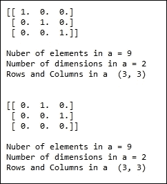

数组的形状可以由`reshape`功能控制:

```
# Array shaping
a_matrix = np.arange(9).reshape(3,3)
display_shape(a_matrix)
```

通过传递`-1`，我们可以根据需要调整数组的维数:

```
# Paramter -1 refers to as many as dimension needed
back_to_array = a_matrix.reshape(-1)
display_shape(back_to_array)
```


`ravel`和`flatten`函数可用于将矩阵转换为一维数组:

```
a_matrix = np.arange(9).reshape(3,3)
back_array = np.ravel(a_matrix)
display_shape(back_array)

a_matrix = np.arange(9).reshape(3,3)
back_array = a_matrix.flatten()
display_shape(back_array)
```


我们来看一些矩阵运算，比如加法:

```
c_matrix = a_matrix + b_matrix
```

我们还将研究元素级乘法:

```
d_matrix = a_matrix * b_matrix
```

以下代码显示了矩阵乘法运算:

```
e_matrix = np.dot(a_matrix,b_matrix)
```

最后，我们将转置一个矩阵:

```
f_matrix = e_matrix.T
```

`min`和`max`函数可用于查找矩阵中的最小和最大元素。`sum`函数可用于计算矩阵中行或列的总和:

```
print
print "f_matrix,minimum = %d"%(f_matrix.min())
print "f_matrix,maximum = %d"%(f_matrix.max())
print "f_matrix, col sum",f_matrix.sum(axis=0)
print "f_matrix, row sum",f_matrix.sum(axis=1)
```


矩阵的元素可以按以下方式反转:

```
# reversing elements
display_shape(f_matrix[::-1])
```

`copy`功能可用于复制矩阵，如下所示:

```
# Like python all elements are used by reference
# if copy is needed copy() command is used
f_copy = f_matrix.copy()
```

最后，让我们看看 mgrid 的功能:

```
# Grid commands
xx,yy,zz = np.mgrid[0:3,0:3,0:3]
xx = xx.flatten()
yy = yy.flatten()
zz = zz.flatten()
```

`mgrid`功能可用于获取 m 维坐标。在前面的例子中，我们有三个维度。在每个维度中，我们的价值观范围从`0`到`3`。让我们打印出`xx`、`yy`和`zz`来多了解一点:

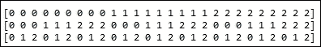

让我们看看每个数组的第一个元素。【`0`、`0`、`0`】是我们三维空间的第一坐标。所有三个数组中的第二个元素，[ `0`，`0`，`1` ]是我们空间中的另一个点。同样，使用`mgrid`，我们捕获了三维坐标系中的所有点。

NumPy 为了给出例程，给我们提供了一个叫 random 的模块，可以用来生成随机数。让我们看一些随机数生成的例子:

```
# Random numbers
general_random_numbers = np.random.randint(1,100, size=10)
print general_random_numbers
```

使用 random 模块中的`randint`函数，我们可以生成随机整数。我们可以传递`start`、`end`和`size`参数。在我们的例子中，我们的起点是`1`，我们的终点是`100`，我们的规模是`10`。我们想要 1 到 100 之间的 10 个随机整数。让我们看看返回的输出:


也可以产生来自其他分布的随机数。让我们看一个例子，我们从一个`normal`分布中得到 10 个随机数:

```
uniform_rnd_numbers = np.random.normal(loc=0.2,scale=0.2,size=10)
print uniform_rnd_numbers
```

使用`normal`函数，我们将从`normal`分布中生成一个随机样本。`normal`分布的均值和标准差参数由`loc`和`scale`参数指定。最后，`size`决定样本数。

通过传递带有行和列值的元组，我们也可以生成一个随机矩阵:

```
uniform_rnd_numbers = np.random.normal(loc=0.2,scale=0.2,size=(3,3))
```

在前面的示例中，我们生成了一个 3 x 3 矩阵，如以下代码所示:

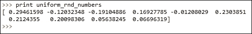

## 还有更多……

您可以参考下面的链接，获得一些优秀的 NumPy 文档:

[http://www.numpy.org/](http://www.numpy.org/)


## 参见

*   *用 matplotlib* 绘制[第三章](part0043_split_000.html#190861-6b04b7c0b98f44a0b8f82924fef317ec "Chapter 3. Data Analysis – Explore and Wrangle")，*分析数据-探索&争论*
*   *用 Scikit 学习机器学习[第三章](part0043_split_000.html#190861-6b04b7c0b98f44a0b8f82924fef317ec "Chapter 3. Data Analysis – Explore and Wrangle")中的*配方，*分析数据-探索&争论*


# 用 matplotlib 绘图

Matplotlib Python 是一个二维绘图库。Python 可以生成各种各样的图，包括直方图、散点图、线图、点图、热图等等。在本书中，我们将使用`matplotlib`的`pyplot`接口来满足我们所有的可视化需求。


## 准备就绪

在这个菜谱中，我们将介绍使用`pyplot`的基本绘图机制。我们将在本书的几乎所有可视化食谱中使用`pyplot`。

本书中的所有食谱我们都使用了 matplotlib 1 . 3 . 1 版。在命令行中，您可以调用`__version__`属性来检查版本:


## 怎么做……

让我们从开始，看看如何使用 matplotlib 的`pyplot`模块绘制简单的图形:

```
#Recipe_2a.py
import numpy as np
import matplotlib.pyplot as plt
def simple_line_plot(x,y,figure_no):
    plt.figure(figure_no)
    plt.plot(x,y)
    plt.xlabel('x values')
    plt.ylabel('y values')
    plt.title('Simple Line')

def simple_dots(x,y,figure_no):
    plt.figure(figure_no)
    plt.plot(x,y,'or')
    plt.xlabel('x values')
    plt.ylabel('y values')
    plt.title('Simple Dots')

def simple_scatter(x,y,figure_no):
    plt.figure(figure_no)
    plt.scatter(x,y)
    plt.xlabel('x values')
    plt.ylabel('y values')
    plt.title('Simple scatter')

def scatter_with_color(x,y,labels,figure_no):
    plt.figure(figure_no)
    plt.scatter(x,y,c=labels)
    plt.xlabel('x values')
    plt.ylabel('y values')
    plt.title('Scatter with color')

if __name__ == "__main__":

    plt.close('all')
    # Sample x y data for line and simple dot plots
    x = np.arange(1,100,dtype=float)
    y = np.array([np.power(xx,2) for xx in x])

    figure_no=1
    simple_line_plot(x,y,figure_no)
    figure_no+=1
    simple_dots(x,y,figure_no)

    # Sample x,y data for scatter plot
    x = np.random.uniform(size=100)
    y = np.random.uniform(size=100)

    figure_no+=1
    simple_scatter(x,y,figure_no)
    figure_no+=1
    label = np.random.randint(2,size=100)
    scatter_with_color(x,y,label,figure_no)
    plt.show()
```

现在，我们将继续探讨一些高级主题，包括生成热图和标记 *x* 和 *y* 轴:

```
#Recipe_2b.py
import numpy as np
import matplotlib.pyplot as plt
def x_y_axis_labeling(x,y,x_labels,y_labels,figure_no):
    plt.figure(figure_no)
    plt.plot(x,y,'+r')
    plt.margins(0.2)
    plt.xticks(x,x_labels,rotation='vertical')
    plt.yticks(y,y_labels,)

def plot_heat_map(x,figure_no):
    plt.figure(figure_no)
    plt.pcolor(x)
    plt.colorbar()

if __name__ == "__main__":

    plt.close('all')
    x = np.array(range(1,6))
    y = np.array(range(100,600,100))
    x_label = ['element 1','element 2','element 3','element 4','element 5']
    y_label = ['weight1','weight2','weight3','weight4','weight5']

    x_y_axis_labeling(x,y,x_label,y_label,1)

    x = np.random.normal(loc=0.5,scale=0.2,size=(10,10))
    plot_heat_map(x,2)

    plt.show()
```


## 它是如何工作的……

我们将从导入所需的模块开始。使用`pyplot`时，建议您导入 NumPy:

```
import numpy as np
import matplotlib.pyplot as plt
```

让我们从遵循主函数的代码开始。可能有以前运行的程序的图表。最好将它们全部关闭，因为我们将在程序中使用更多的图形:

```
    plt.close('all')
```

我们将继续使用 NumPy 生成一些数据来演示使用`pyplot`绘图:

```
    # Sample x y data for line and simple dot plots
    x = np.arange(1,100,dtype=float)
    y = np.array([np.power(xx,2) for xx in x])
```

我们在 x 和 y 变量中生成了 100 个元素。我们的 y 是 x 变量的平方。

让我们继续做一个简单的线图:

```
    figure_no=1
    simple_line_plot(x,y,figure_no)
```

当我们的程序有多个情节时，给每个情节编号是一个好的做法。变量`figure_no`用于给我们的图编号。我们来看一下`simple_line_plot`函数:

```
def simple_line_plot(x,y,figure_no):
    plt.figure(figure_no)
    plt.plot(x,y)
    plt.xlabel('x values')
    plt.ylabel('y values')
    plt.title('Simple Line')
```

如你所见，我们通过调用`pyplot`中的 figure 函数开始给我们的图编号。我们从主程序中没有传递数字变量。在这之后，我们简单地用我们的 x 和 y 值调用绘图函数。我们可以通过分别使用`xlabel`和`ylabel`函数给 x 轴和 y 轴命名来使我们的绘图有意义。最后，我们还可以给我们的情节起一个标题。就是这样。我们的第一个简单的线图准备好了。在调用`show()`功能之前，不会显示图形。在我们的代码中，我们将调用`show()`函数来查看所有的图表。我们的情节将如下所示:

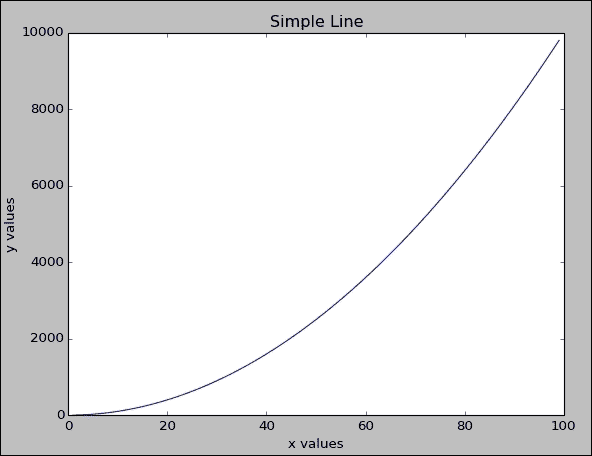

这里，我们绘制了 x 轴上的值`x`和 y 轴上的值`x squared`。

我们创建了一个简单的线图。我们可以看到一条漂亮的曲线，因为我们的 y 值是 T2 x 值的平方。

让我们进入下一个情节:

```
    figure_no+=1
    simple_dots(x,y,figure_no)
```

我们将增加我们的图号并调用`simple_dots`函数。我们希望将我们的 *x* 和 *y* 值绘制成点而不是线。我们来看一下`simple_dots`函数:

```
def simple_dots(x,y,figure_no):
    plt.figure(figure_no)
    plt.plot(x,y,'or')
    plt.xlabel('x values')
    plt.ylabel('y values')
    plt.title('Simple Dots')
```

每一行都与我们之前的函数相似，除了下面一行:

```
    plt.plot(x,y,'or')
```

`or`参数表示我们需要点`(o)`，点应该在红色(r)中。以下是前面命令的输出:


让我们进入下一个情节。

我们将看到一个散点图。让我们使用 NumPy 生成一些数据:

```
    # Sample x,y data for scatter plot
    x = np.random.uniform(size=100)
    y = np.random.uniform(size=100)
```

我们从均匀分布中抽取了 100 个数据点。现在我们将继续调用`simple_scatter`函数来生成我们的散点图:

```
    figure_no+=1
    simple_scatter(x,y,figure_no)
```

在`simple_scatter`功能中，除了以下行之外，所有行都与之前的绘图程序相似:

```
    plt.scatter(x,y)
```

我们没有调用`pyplot`中的绘图函数，而是调用了`scatter`函数。我们的情节将如下所示:

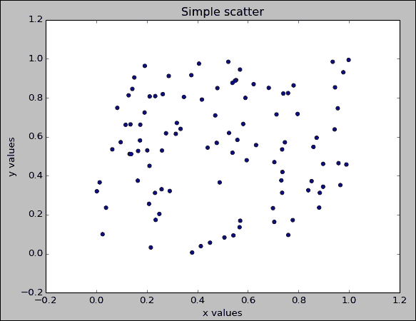

让我们继续我们的最终图，这是一个散点图，但是这些点是根据它们所属的类别标签来着色的:

```
    figure_no+=1
    label = np.random.randint(2,size=100)
    scatter_with_color(x,y,label,figure_no)
```

我们将增加我们的数字，以便跟踪我们的图表。在下一行中，我们将为我们的点数分配一些随机标签，或者是`1`或者是`0`。最后，我们将使用我们的 *x* 、 *y* 和标签变量调用`scatter_with_color`函数。

在函数中，让我们看一下将此代码与之前的散点图代码区分开来的线条:

```
    plt.scatter(x,y,c=labels)
```

我们将把标签传递给一个代表颜色的参数`c`。每个标签将被分配一个独特的颜色。在我们的例子中，所有被标记为`0`的点将获得与被标记为`1`的点不同的颜色，如下所示:

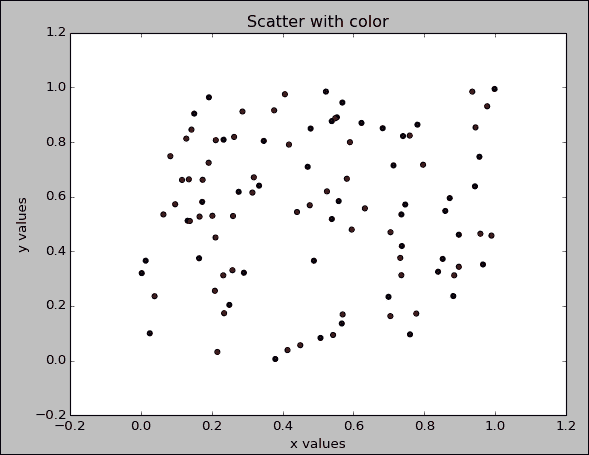

让我们继续绘制一些热图和轴标签。

同样，我们将从主函数开始:

```
    plt.close('all')
    x = np.array(range(1,6))
    y = np.array(range(100,600,100))
    x_label = ['element 1','element 2','element 3','element 4','element 5']
    y_label = ['weight1','weight2','weight3','weight4','weight5']

    x_y_axis_labeling(x,y,x_label,y_label,1)
```

作为一个好的实践，我们将通过调用`close`函数来关闭所有前面的图形。我们将继续生成一些数据。我们的 x 是由五个元素组成的数组，从`1`开始，以`5`结束。我们的 y 是一个五行数组，从`100`开始，以`500`结束。我们定义了两个`x_label`和`y_label`列表，它们将作为我们的图的标签。最后，我们调用了`x_y_axis_labeling`函数来演示在 *x* 和 *y* 轴上标记我们的 tickers 的概念。

让我们看看下面的函数:

```
def x_y_axis_labeling(x,y,x_labels,y_labels,figure_no):
    plt.figure(figure_no)
    plt.plot(x,y,'+r')
    plt.margins(0.2)
    plt.xticks(x,x_labels,rotation='vertical')
    plt.yticks(y,y_labels,)
```

我们将通过调用 pyplot 的点函数来做一个简单的点阵图。然而，在这种情况下，我们希望我们的点显示为`+`而不是`o`。因此，我们将指定`+r`。我们选择的颜色是红色，因此`r`。

在接下来的两行中，我们将指定我们的 x 轴和 y 轴 tickers 需要是什么。通过调用`xticks`函数，我们将传递我们的 x 值和它们的标签。另外，我们会说我们希望文本垂直旋转，这样它们就不会互相重叠。类似地，我们将指定 *y* 轴的代码。让我们看看我们的情节，如下:


让我们看看如何使用`pyplot`生成热图:

```
    x = np.random.normal(loc=0.5,scale=0.2,size=(10,10))
    plot_heat_map(x,2)
```

我们将为热图生成一些数据。在这种情况下，我们生成了一个 10 x 10 的矩阵，其中填充了由`0.5`的`loc`变量指定的平均值的正态分布值和由`0.2`的`scale`变量指定的标准偏差。我们将用这个矩阵调用`plot_heat_map`函数。第二个参数是图号:

```
def plot_heat_map(x,figure_no):
    plt.figure(figure_no)
    plt.pcolor(x)
    plt.colorbar()
```

为了生成热图，我们将调用`pcolor`函数。下一行调用`colorbar`函数来显示我们的值范围的颜色渐变:

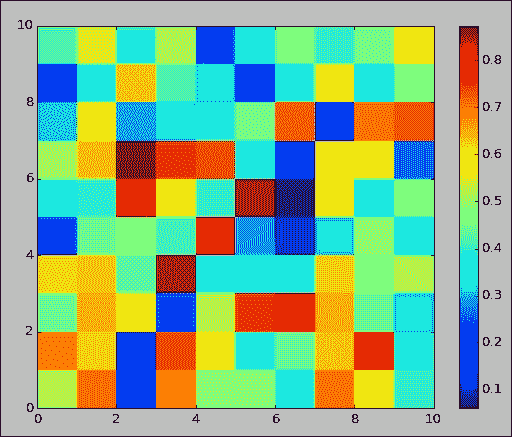

## 还有更多……

关于 matplotlib 的更多信息，你可以参考位于[http://matplotlib.org/faq/usage_faq.html](http://matplotlib.org/faq/usage_faq.html)的通用 matplotlib 文档。

以下链接是关于`pyplot`的优秀教程:

[http://matplotlib.org/users/pyplot_tutorial.html](http://matplotlib.org/users/pyplot_tutorial.html)

Matplotlib 提供了出色的三维绘图功能。有关更多信息，请参考以下链接:

[http://matplotlib.org/mpl_toolkits/mplot3d/tutorial.html](http://matplotlib.org/mpl_toolkits/mplot3d/tutorial.html)

matplotlib 中的 pylab 模块将 NumPy 的名称空间与`pyplot`结合在一起。Pylab 也可用于生成该配方中显示的各种类型的图。


# 使用 scikit-learn 进行机器学习

Scikit-learn 是 Python 中的一个通用机器学习库。我们将在本书中广泛使用这个库。本书中的所有食谱我们都使用了 scikit-learn 0 . 15 . 2 版。在命令行中，您可以调用`__version__`属性来检查版本:

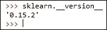

## 准备就绪

在这个菜谱中，我们将展示 scikit 的一些功能——学习和了解他们的一些 API 组织，以便我们可以在未来的菜谱中无缝地遵循它。


## 怎么做……

Scikit-learn 为我们提供了一个内置的数据集。让我们看看如何访问和使用这个数据集:

```
#Recipe_3a.py
from sklearn.datasets import load_iris,load_boston,make_classification                         make_circles, make_moons

# Iris dataset
data = load_iris()
x = data['data']
y = data['target']
y_labels = data['target_names']
x_labels = data['feature_names']

print
print x.shape
print y.shape
print x_labels
print y_labels

# Boston dataset
data = load_boston()
x = data['data']
y = data['target']
x_labels = data['feature_names']

print
print x.shape
print y.shape
print x_labels

# make some classification dataset
x,y = make_classification(n_samples=50,n_features=5, n_classes=2)

print
print x.shape
print y.shape

print x[1,:]
print y[1]

# Some non linear dataset
x,y = make_circles()
import numpy as np
import matplotlib.pyplot as plt
plt.close('all')
plt.figure(1)
plt.scatter(x[:,0],x[:,1],c=y)

x,y = make_moons()
import numpy as np
import matplotlib.pyplot as plt
plt.figure(2)
plt.scatter(x[:,0],x[:,1],c=y)

plt.show()
```

让我们继续看看如何在 scikit-learn 中调用一些机器学习功能:

```
#Recipe_3b.py
import numpy as np
from sklearn.preprocessing import PolynomialFeatures
# Data Preprocessing routines
x = np.asmatrix([[1,2],[2,4]])
poly = PolynomialFeatures(degree = 2)
poly.fit(x)
x_poly = poly.transform(x)

print "Original x variable shape",x.shape
print x
print
print "Transformed x variables",x_poly.shape
print x_poly

#alternatively 
x_poly = poly.fit_transform(x)

from sklearn.tree import DecisionTreeClassifier
from sklearn.datasets import load_iris

data = load_iris()
x = data['data']
y = data['target']

estimator = DecisionTreeClassifier()
estimator.fit(x,y)
predicted_y = estimator.predict(x)
predicted_y_prob = estimator.predict_proba(x)
predicted_y_lprob = estimator.predict_log_proba(x)

from sklearn.pipeline import Pipeline

poly = PolynomialFeatures(n=3)
tree_estimator = DecisionTreeClassifier()

steps = [('poly',poly),('tree',tree_estimator)]
estimator = Pipeline(steps=steps)
estimator.fit(x,y)
predicted_y = estimator.predict(x)
```


## 它是如何工作的……

让我们加载 scikit 学习库并导入包含各种函数的模块，以便提取内置数据集:

```
from sklearn.datasets import load_iris,load_boston,make_classification
```

我们要看的第一个数据集是虹膜数据集。更多信息请参考[https://en.wikipedia.org/wiki/Iris_flower_data_set](https://en.wikipedia.org/wiki/Iris_flower_data_set)。

由唐纳德·费希尔爵士介绍，这是一个分类问题的经典数据集:

```
data = load_iris()
x = data['data']
y = data['target']
y_labels = data['target_names']
x_labels = data['feature_names']
```

被调用时，`load_iris`函数返回一个字典对象。预测器`x`、响应变量`y`、响应变量名称和特征名称可以通过用适当的关键字查询字典对象来提取。

让我们继续打印它们并查看它们的值:

```
print
print x.shape
print y.shape
print x_labels
print y_labels
```

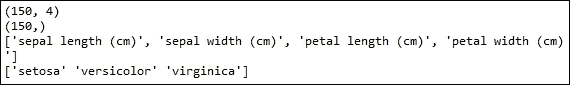

如您所见，我们的预测器有 150 个实例和 4 个属性。我们的`response`变量有 150 个实例，预测器集中的每一行都有一个类标签。然后我们将打印出属性名称、花瓣和萼片的宽度和长度，最后是类别标签。在我们未来的大部分食谱中，我们将广泛使用这个数据集。

让我们继续检查回归问题中使用的另一个内置数据集，称为波士顿住房数据集:

```
# Boston dataset
data = load_boston()
x = data['data']
y = data['target']
x_labels = data['feature_names']
```

数据的加载与 iris 非常相似，数据的各个组成部分，包括预测值和响应变量，都使用字典中相应的键进行查询。让我们打印这些变量，以便检查它们:


如您所见，我们的预测集 x 有 506 个实例和 13 个属性。我们的响应变量有 506 个条目。最后，我们还将打印出属性的名称。

Scikit-learn 还为我们提供了一些功能，帮助我们生成一个具有一些期望属性的随机分类数据集:

```
# make some classification dataset
x,y = make_classification(n_samples=50,n_features=5, n_classes=2)
```

`make_classification`函数是可用于生成分类数据集的函数。在我们的例子中，我们生成了一个包含 50 个实例的数据集，这些实例由`n_samples`参数、五个属性、`n_features`参数和由`n_classes`参数设置的两个类决定。让我们检查这个函数的输出:

```
print x.shape
print y.shape

print x[1,:]
print y[1]
```

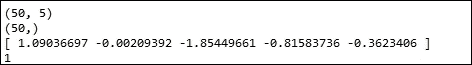

如您所见，我们的预测器 x 有 150 个实例，包含五个特征。我们的响应变量有 150 个实例，每个预测实例都有一个类标签。

我们将打印出预测集的第二条记录`x`。您可以看到我们有一个维度为`5`的向量，与我们请求的五个特性相关。最后，我们还将打印响应变量`y`。对于我们预测器的第二行，类标签是`1`。

Scikit-learn 还为我们提供了能够生成具有非线性关系的数据的函数:

```
# Some non linear dataset
x,y = make_circles()
import numpy as npimport matplotlib.pyplot as plt
plt.close('all')
plt.figure(1)
plt.scatter(x[:,0],x[:,1],c=y)
```

你应该从之前的食谱中熟悉了`pyplot`。让我们先看看我们的图来了解一下的非线性关系:

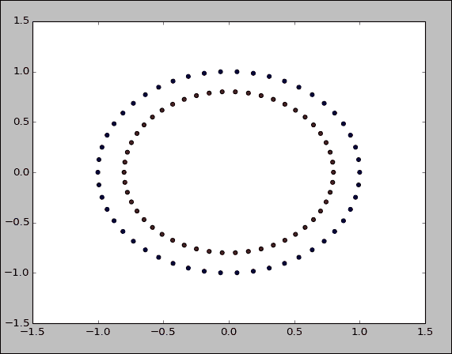

如你所见，我们的分类产生了两个同心圆。我们的`x`是一个有两个变量的数据集。变量`y`是类标签。如同心圆所示，我们的预测变量之间的关系是非线性的。

另一个产生非线性关系的有趣的函数是来自 scikit-learn 的`make_moons`:

```
x,y = make_moons()
import numpy as np
import matplotlib.pyplot as plt
plt.figure(2)
plt.scatter(x[:,0],x[:,1],c=y)
```

为了理解非线性关系，让我们看看它的曲线图:


月牙形图显示，我们的预测集 x 中的属性相互之间是非线性相关的。

下面我们切换一下来了解 scikit-learn 的 API 结构。使用 scikit-learn 的一个主要优势是它简洁的 API 结构。从`BaseEstimator`类派生的所有数据建模类都必须严格实现`fit`和`transform`函数。我们将通过一些例子来了解更多这方面的内容。

让我们从 scikit-learn 中的预处理模块开始:

```
import numpy as np
from sklearn.preprocessing import PolynomialFeatures
```

我们将使用`PolynomialFeatures`类来演示使用 scikit-learn 的 SDK 的简易性。关于多项式，请参考以下链接:

[https://en.wikipedia.org/wiki/Polynomial](https://en.wikipedia.org/wiki/Polynomial)

有了一组预测变量后，我们可能希望向预测变量组中添加更多的变量，以查看我们的模型准确性是否可以提高。我们可以使用现有特征的多项式作为新特征。`PolynomialFeatures`类帮助我们做到这一点:

```
# Data Preprocessing routines
x = np.asmatrix([[1,2],[2,4]])
```

我们将首先创建一个数据集。在这种情况下，我们的数据集有两个实例和两个属性:

```
poly = PolynomialFeatures(degree = 2)
```

我们将继续用所需的多项式次数实例化我们的`PolynomialFeatures`类。在这种情况下，它将是第二级:

```
poly.fit(x)
x_poly = poly.transform(x)
```

然后，有两个函数，fit 和 transform。`fit`函数用于为转换进行必要的计算。在这种情况下，fit 是多余的，但我们将在本食谱的后面看到更多如何使用 fit 的例子。

`transform`函数接受输入，并根据 fit 执行的计算，转换给定的输入:

```
#alternatively 
x_poly = poly.fit_transform(x)
```

或者，在这种情况下，可以一次性调用 fit 和 transform。让我们看看原始的和变换后的 x 变量的值和形状:

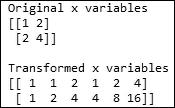

任何在 scikit-learn 中实现机器学习方法的类都必须从 BaseEstimator 中交付。关于 BaseEstimator，请参见下面的链接:

[http://sci kit-learn . org/stable/modules/generated/sk learn . base . base estimator . html](http://scikit-learn.org/stable/modules/generated/sklearn.base.BaseEstimator.html)

BaseEstimator 期望实现类同时提供`fit`和`transform`方法。通过这种方式，API 保持非常干净。

让我们看另一个例子。这里，我们从模块树中导入了一个名为`DecisionTreeClassifier`的类。`DecisionTreeClassifier`实现决策树算法:

```
from sklearn.tree import DecisionTreeClassifier
```

让我们将这个类付诸实践:

```
from sklearn.datasets import load_iris

data = load_iris()
x = data['data']
y = data['target']

estimator = DecisionTreeClassifier()
estimator.fit(x,y)
predicted_y = estimator.predict(x)
predicted_y_prob = estimator.predict_proba(x)
predicted_y_lprob = estimator.predict_log_proba(x)
```

让我们使用 iris 数据集来看看如何使用树算法。我们将在`x`和`y`变量中加载虹膜数据集。然后我们将实例化`DecisonTreeClassifier`。我们将通过调用`fit`函数并传递我们的`x predictor`和`y response`变量来构建模型。这将构建树模型。现在，我们已经准备好用我们的模型做一些预测。我们将使用中的`predict`函数来预测给定输入的分类标签。如您所见，我们利用了与`PolynomialFeatures`中相同的拟合和预测方法。还有另外两种方法，`predict_proba`给出预测的概率，而`predict_log_proba`提供预测概率的对数。

现在让我们看看另一个有趣的工具，叫做管道内衬。可以使用管道内衬将各种机器学习方法链接在一起:

```
from sklearn.pipeline import Pipeline

poly = PolynomialFeatures(n=3)
tree_estimator = DecisionTreeClassifier()
```

让我们从实例化数据处理例程`PolynomialFeatures`和`DecisionTreeClassifier`开始:

```
steps = [('poly',poly),('tree',tree_estimator)]
```

我们将定义一个元组列表来表示我们链接的顺序。我们想运行多项式特征生成，然后是我们的决策树:

```
estimator = Pipeline(steps=steps)
estimator.fit(x,y)
predicted_y = estimator.predict(x)
```

现在，我们可以用使用 steps 变量声明的列表来实例化我们的管道对象。现在，我们可以通过调用`fit`和`predict`方法继续照常工作。

我们可以调用`named_steps`属性来检查管道中不同阶段的模型:


## 还有更多……

scikit-learn 中有更多的数据集创建功能。请参考以下链接:

[http://scikit-learn.org/stable/datasets/](http://scikit-learn.org/stable/datasets/)

在使用`make_circle`和`make_moons`创建非线性数据集时，我们提到了许多想要的属性可以添加到数据集中。通过引入不正确的类标签，数据可能会被轻微破坏。请参考以下链接，了解在数据中引入此类细微差别的可用选项列表:

[http://sci kit-learn . org/stable/modules/generated/sk learn . datasets . make _ circles . html](http://scikit-learn.org/stable/modules/generated/sklearn.datasets.make_circles.html)

[http://sci kit-learn . org/stable/modules/generated/sk learn . datasets . make _ moons . html](http://scikit-learn.org/stable/modules/generated/sklearn.datasets.make_moons.html)


## 参见

*   *绘制[第二章](part0039_split_000.html#1565U1-6b04b7c0b98f44a0b8f82924fef317ec "Chapter 2. Python Environments")、*中的*配方使用 Python 环境*