# 三、数据分析——探索和整理

我们将在本章中介绍以下配方:

*   图形化分析单变量数据
*   将数据分组并使用点状图
*   对多元数据使用散点图
*   使用热图
*   执行汇总统计和绘图
*   使用盒须图
*   输入数据
*   执行随机抽样
*   缩放数据
*   标准化数据
*   执行标记化
*   删除停用词
*   词干
*   执行单词词条化
*   将文本表示为一个单词包
*   计算术语频率和反向文档频率


# 简介

在您尝试任何数据科学应用之前，从长远来看，对您将要处理的数据有一个好的理解总是有帮助的。对底层数据的理解将有助于您选择正确的算法来解决手头的问题。在不同粒度级别探索数据被称为**探索性数据分析** ( **EDA** )。在许多情况下， **EDA** 可以揭示通常由数据挖掘算法揭示的模式 **EDA** 帮助我们理解数据特征，并为您提供适当的指导，以便为给定的问题选择正确的算法。

在本章中，我们将详细介绍 **EDA** 。我们将研究用于有效执行 **EDA** 操作的实用技术和工具。

数据预处理和转换是另外两个重要的过程，可以提高数据科学模型的质量，增加数据科学项目的成功率。

数据预处理是准备好数据以便通过数据挖掘方法或机器学习算法获取的过程。它包含许多东西，比如数据清理、属性子集选择、数据转换等等。在这一章中，我们将讨论数字数据预处理和文本数据预处理。

文本数据不同于数字数据。我们需要不同的转换方法，以使其适合于机器学习算法中的摄取。在本章中，我们将看到如何转换文本数据。通常，文本转换是一个分阶段的过程，具有管道形式的各种组件。

一些组件如下:

*   标记化
*   停止单词删除
*   基本形式转换
*   特征推导

通常，这些组件被应用于给定的文本以提取特征。在流水线的末端，文本数据被转换成可以作为输入馈送给机器学习算法的方式。在本章中，我们将看到前面管道中列出的每个组件的配方。

很多时候，在数据收集阶段可能会引入很多错误。这可能是由于数据测量或集体流程/设备中的人为错误、限制或缺陷。数据不一致是一个巨大的挑战。我们将从数据插补开始我们的数据预处理之旅，数据插补是处理输入数据中的错误的一种方法，然后继续其他方法。


# 图形化分析单变量数据

只有一个变量/列的数据集称为单变量数据。单变量是数学中的一个通用术语，指任何只有一个变量的表达式、方程、函数或多项式。在我们的例子中，我们将把单变量函数限制在数据集上。比方说，我们将以米为单位测量一群人的身高；数据将如下所示:

```
5, 5.2, 6, 4.7,…
```

我们的测量只是关于人的一个单一属性，身高。这是一个单变量数据的例子。


## 准备就绪

让我们开始我们的 **EDA** 方案，通过可视化查看一个单变量数据集样本。通过正确的可视化技术可以很容易地分析数据特征。我们将使用`pyplot`来绘制图形，以便可视化数据。Pyplot 是 matplotlib 绘图库的状态机接口。图形和轴是隐式和自动创建的，以实现所需的绘图。以下链接是`pyplot`很好的参考:

[http://matplotlib.org/users/pyplot_tutorial.html](http://matplotlib.org/users/pyplot_tutorial.html)

对于这个例子，我们将在国情咨文中使用一些总统对国会的要求。以下 URL 包含数据:

[http://www.presidency.ucsb.edu/data/sourequests.php](http://www.presidency.ucsb.edu/data/sourequests.php)

以下是数据示例:

```
1946, 41
1947, 23
1948, 16
1949, 28
1950, 20
1951, 11
1952, 19
1953, 14
1954, 39
1955, 32
1956, 
1957, 14
1958, 
1959, 16
1960, 6
```

我们将直观地查看这些数据，并识别数据中存在的任何异常值。对于异常值，我们将遵循递归方法。一旦我们确定了离群值，我们将从数据集中删除它们，并绘制剩余的数据，以便找到任何新的离群值。

### 注意

在每次迭代中移除感知的异常值之后，递归地查看数据是检测异常值的常见方法。


## 怎么做……

我们将使用 NumPy 的数据加载实用程序加载数据。然后，我们将解决数据质量问题；在这种情况下，我们将讨论如何处理空值。正如您在数据中看到的，1956 年和 1958 年有空条目。让我们使用 lambda 函数将空值替换为`0`。

接下来，让我们绘制数据，寻找任何趋势:

```
# Load libraries
import numpy as np
from matplotlib.pylab import frange
import matplotlib.pyplot as plt

fill_data = lambda x : int(x.strip() or 0)
data = np.genfromtxt('president.txt',dtype=(int,int),converters={1:fill_data},\
            delimiter=",")
x = data[:,0]
y = data[:,1]

# 2.Plot the data to look for any trends or values
plt.close('all')
plt.figure(1)
plt.title("All data")
plt.plot(x,y,'ro')
plt.xlabel('year')plt.ylabel('No Presedential Request')
```

让我们计算百分位值，并将它们作为参考绘制在已生成的图中:

```
#3.Calculate percentile values (25th, 50th,75th) for the data to understand data distribution
perc_25 = np.percentile(y,25)
perc_50 = np.percentile(y,50)
perc_75 = np.percentile(y,75)
print
print "25th Percentile    = %0.2f"%(perc_25)
print "50th Percentile    = %0.2f"%(perc_50)
print "75th Percentile    = %0.2f"%(perc_75)
print
#4.Plot these percentile values as reference in the plot we generated in the previous step.
# Draw horizontal lines at 25,50 and 75th percentile
plt.axhline(perc_25,label='25th perc',c='r')
plt.axhline(perc_50,label='50th perc',c='g')
plt.axhline(perc_75,label='75th perc',c='m')plt.legend(loc='best')
```

最后，让我们直观地检查数据中的异常值，然后使用 mask 函数删除它们。让我们再次绘制没有异常值的数据:

```
#5.Look for outliers if any in the data by visual inspection.
# Remove outliers using mask function 
# Remove outliers 0 and 54
y_masked = np.ma.masked_where(y==0,y)
#  Remove point 54
y_masked = np.ma.masked_where(y_masked==54,y_masked)

#6 Plot the data again.
plt.figure(2)
plt.title("Masked data")
plt.plot(x,y_masked,'ro')
plt.xlabel('year')
plt.ylabel('No Presedential Request')
plt.ylim(0,60)

# Draw horizontal lines at 25,50 and 75th percentile
plt.axhline(perc_25,label='25th perc',c='r')
plt.axhline(perc_50,label='50th perc',c='g')
plt.axhline(perc_75,label='75th perc',c='m')
plt.legend(loc='best')plt.show()
```


## 它是如何工作的……

第一步，我们将把在前一章中学到的一些数据加载技术付诸实践。你会注意到年份`1956`和`1958`是空白的。我们将使用匿名函数将它们替换为`0`:

```
fill_data = lambda x : int(x.strip() or 0)
```

`fill_data` lambda 函数将替换数据集中的任何空值；在本例中，第 11 行和第 13 行用 0:

```
data = np.genfromtxt('president.txt',dtype=(int,int),converters={1:fill_data},delimiter=",")
```

我们将把`fill_data`传递给`genfromtxt`函数的`converters`参数。注意`converters`将一个字典作为它的输入。字典中的键指示我们的函数应该应用于哪一列。该值指示函数。在这种情况下，我们将`fill_data`指定为函数，并将键设置为 1，表示`fill_data`函数必须应用于第 1 列。现在让我们看看控制台中的数据:

```
>>> data[7:15]
array([[1953,   14],
       [1954,   39],
       [1955,   32],
       [1956,    0],
       [1957,   14],
       [1958,    0],
       [1959,   16],
       [1960,    6]])
>>>
```

正如我们所看到的，年份`1956`和`1958`都有一个`0`值。为了便于绘图，我们将把 x 中的年份数据和国情咨文中总统向国会提出的请求数加载到 y 中:

```
x = data[:,0]
y = data[:,1]
```

如您所见，在第一列中，年份被加载到`x`中，下一列被加载到`y`中。

在第 2 步中，我们将绘制数据，x 轴表示年份，y 轴表示数值:

```
plt.close('all')
```

我们将首先关闭之前程序中打开的所有图表:

```
plt.figure(1)
```

我们会给我们的地块编号。当程序中有大量图形时，这非常有用:

```
plt.title("All data")
```

我们将为我们的情节指定一个标题:

```
plt.plot(x,y,'ro')
```

最后，我们将绘制 x 和 y。“ro”参数告诉 plyplot 将 x 和 y 绘制为红色(r)中的点(0):

```
plt.xlabel('year')
plt.ylabel('No Presedential Request')
```

最后，提供了 *x* 和 *y* 轴标签。

输出如下所示:


随便看一下这个图表就可以发现，数据分散在各个地方，乍看之下找不到任何趋势或模式。然而，凭借敏锐的眼睛，您可以注意到三个点:一个点位于右侧顶部，其他点位于 *x* 轴中 **1960** 的左侧。它们与样本中的所有其他点截然不同，因此，它们是异常值。

### 注意

离群值是分布总体模式之外的观察值(Moore 和 McCabe 1999)。

为了进一步理解这些观点，我们将借助百分位数。

### 注意

如果我们有一个长度为 N 的向量 V，V 的第 q 个百分位数是 V 的排序副本中的第 q 个排序值。如果归一化排序与 q 不完全匹配，则两个最近邻居的值和距离以及*插值*参数将确定百分位数。如果`q=50`，该功能与中值相同；如果`q=0`，该功能与最小值相同；如果`q=100`，该功能与最大值相同。

更多信息请参考至[http://docs . scipy . org/doc/numpy-dev/reference/generated/numpy . percentile . html](http://docs.scipy.org/doc/numpy-dev/reference/generated/numpy.percentile.html)。

我们为什么不用平均值呢？我们将在汇总统计部分研究平均值；然而，查看百分位数有其自身的优势。平均值通常会被异常值扭曲；异常值(如右侧顶部的异常值)会将平均值拖到更高的值，而 1960 年附近的异常值会起到相反的作用。百分位数让我们更清楚地了解数据集中的值的范围。我们可以使用 NumPy 来计算百分位数。

在第 3 步中，我们将计算百分位数并打印出来。

为该数据集计算和打印的百分位值如下:


### 注意

解释百分位数:

数据集中 25%的点低于 13.00(第 25 百分位值)。

数据集中 50%的点低于 18.50(第 50 百分位值)。

数据集中 75%的点低于 25.25(第 75 百分位值)。

需要注意的一点是，第 50 百分位是中位数。百分位数给了我们一个很好的数值范围的概念。

在第 4 步中，我们将这些百分比值绘制为图表中的水平线，以增强我们的可视化效果:

```
# Draw horizontal lines at 25,50 and 75th percentile
plt.axhline(perc_25,label='25th perc',c='r')
plt.axhline(perc_50,label='50th perc',c='g')
plt.axhline(perc_75,label='75th perc',c='m')
plt.legend(loc='best')
```

我们使用了`plt.axhline()`函数来绘制这些水平线。这个函数将在给定的 y 值处从 x 的最小值到 x 的最大值绘制一条线。使用 label 参数，我们给它一个名称，并通过 c 参数设置线的颜色。

### Tip

理解任何函数的一个好方法是在 Python 控制台中将函数名传递给`help()`。在这种情况下，Python 控制台中的 help (plt.axhline)将为您提供详细信息。

最后，我们将使用`plt.legend()`放置图例，并使用`loc`参数，要求 pyplot 确定放置图例的最佳位置，以便它不会影响图的可读性。

我们的图表如下:


在第 5 步中，我们将继续使用 NumPy 中的 mask 函数移除异常值:

```
# Remove zero values
y_masked = np.ma.masked_where(y==0,y)
#  Remove 54
y_masked = np.ma.masked_where(y_masked==54,y_masked)
```

屏蔽是隐藏一些值而不从数组中删除它们的一种便捷方式。我们使用了`ma.masked_where`函数，在这里我们传递了一个条件和一个数组。然后，该函数屏蔽数组中满足条件的值。我们的第一个条件是屏蔽`y`数组中的所有点，其中数组值是`0`。我们将新的屏蔽数组存储为`y_masked`。然后，我们在`y_masked`上应用另一个条件来删除点 54。

最后，在步骤 6 中，我们将重复绘制步骤。我们最终的情节如下:

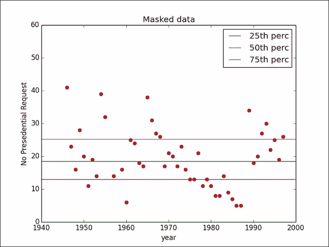

## 参见

*   *创建匿名函数*方法[第一章](part0015_split_000.html#E9OE1-6b04b7c0b98f44a0b8f82924fef317ec "Chapter 1. Python for Data Science")，*使用 Python 进行数据科学*
*   *预处理栏目*配方[第一章](part0015_split_000.html#E9OE1-6b04b7c0b98f44a0b8f82924fef317ec "Chapter 1. Python for Data Science")，*利用 Python 进行数据科学*
*   *在[第一章](part0015_split_000.html#E9OE1-6b04b7c0b98f44a0b8f82924fef317ec "Chapter 1. Python for Data Science")中用 Python* 获取数据，*使用 Python 进行数据科学*
*   *离群值*[第四章](part0060_split_000.html#1P71O1-6b04b7c0b98f44a0b8f82924fef317ec "Chapter 4. Data Analysis – Deep Dive")，*分析数据——深潜*


# 将数据分组并使用点状图

**EDA** 是关于从多个角度放大缩小数据，以便更好的掌握数据。现在让我们用点状图从不同的角度来看数据。点状图是一种简单的图，其中数据被分组并以简单的比例绘制。由我们决定如何对数据进行分组。

### 注意

点状图最适用于小型到中型的数据集。对于大数据，通常使用直方图。


## 准备就绪

在本练习中，我们将使用与上一节相同的数据。


## 怎么做……

让我们加载必要的库。我们将继续加载我们的数据，在此过程中，我们将处理丢失的值。最后，我们将使用频率计数器对数据进行分组:

```
# Load libraries
import numpy as np
import matplotlib.pyplot as plt
from collections import Counter
from collections import OrderedDict
from matplotlib.pylab import frange

# 1.Load the data and handle missing values.
fill_data = lambda x : int(x.strip() or 0)
data = np.genfromtxt('president.txt',dtype=(int,int),converters={1:fill_data},delimiter=",")
x = data[:,0]
y = data[:,1]

# 2.Group data using frequency (count of individual data points).
# Given a set of points, Counter() returns a dictionary, where key is a data point,
# and value is the frequency of data point in the dataset.
x_freq = Counter(y)
x_ = np.array(x_freq.keys())y_ = np.array(x_freq.values())
```

我们将继续按年份范围对数据进行分组并绘制图表:

```
# 3.Group data by range of years
x_group = OrderedDict()
group= 5
group_count=1
keys = []
values = []
for i,xx in enumerate(x):
    # Individual data point is appended to list keys
    keys.append(xx)
    values.append(y[i])
    # If we have processed five data points (i.e. five years)
    if group_count == group:
        # Convert the list of keys to a tuple
        # use the new tuple as the ke to x_group dictionary
        x_group[tuple(keys)] = values
        keys= []
        values =[]
        group_count = 1

    group_count+=1
# Accomodate the last batch of keys and values
x_group[tuple(keys)] = values 

print x_group
# 4.Plot the grouped data as dot plot.
plt.subplot(311)
plt.title("Dot Plot by Frequency")
# Plot the frequency
plt.plot(y_,x_,'ro')
plt.xlabel('Count')
plt.ylabel('# Presedential Request')
# Set the min and max limits for x axis
plt.xlim(min(y_)-1,max(y_)+1)

plt.subplot(312)
plt.title("Simple dot plot")
plt.xlabel('# Presendtial Request')plt.ylabel('Frequency')
```

最后，我们将为一个简单的点状图准备数据，并继续绘制它:

```
# Prepare the data for simple dot plot
# For every (item, frequency) pair create a 
# new x and y
# where x is a list, created using using np.repeat
# function, where the item is repeated frequency times.
# y is a list between 0.1 and frequency/10, incremented
# by 0.1
for key,value in x_freq.items():
    x__ = np.repeat(key,value)
    y__ = frange(0.1,(value/10.0),0.1)
    try:
        plt.plot(x__,y__,'go')
    except ValueError:
        print x__.shape, y__.shape
    # Set the min and max limits of x and y axis
    plt.ylim(0.0,0.4)
    plt.xlim(xmin=-1) 

plt.xticks(x_freq.keys())

plt.subplot(313)
x_vals =[]
x_labels =[]
y_vals =[]
x_tick = 1
for k,v in x_group.items():
    for i in range(len(k)):
        x_vals.append(x_tick)
        x_label = '-'.join([str(kk) if not i else str(kk)[-2:] for i,kk in enumerate(k)])
        x_labels.append(x_label)
    y_vals.extend(list(v))
    x_tick+=1

plt.title("Dot Plot by Year Grouping")
plt.xlabel('Year Group')
plt.ylabel('No Presedential Request')
try:
    plt.plot(x_vals,y_vals,'ro')
except ValueError:
    print len(x_vals),len(y_vals)

plt.xticks(x_vals,x_labels,rotation=-35)plt.show()
```


## 它是如何工作的……

在步骤 1 中，我们将加载数据。这与上一个配方中讨论的数据加载相同。在我们开始绘制数据之前，我们希望将它们分组，以便查看整体数据特征。

在步骤 2 和 3 中，我们将使用不同的标准对数据进行分组。

让我们看看第二步。

这里，我们将使用来自`collections`包的一个名为`Counter()`的函数。

### 注意

给定一组点，`Counter()`返回一个字典，其中 key 是数据点，value 是数据集中数据点的频率。

我们将把数据集传递给`Counter()`，并从实际数据点和值中提取关键字，从这个字典中提取相应的频率，放入 numpy 数组`x_`和`y_` 中，以便于绘图。因此，我们现在已经使用频率对数据进行了分组。

在我们继续绘制之前，我们将在步骤 3 中使用这些数据进行另一次分组。

我们知道 x 轴是年。我们的数据也按年份升序排序。在这一步中，我们将按年份对数据进行分组，在本例中是五年；也就是说，假设我们从第一个五年开始做一个组，我们的第二个组是下一个五年，以此类推:

```
group= 5
group_count=1
keys = []
values = []
```

`group`变量定义了我们在一个组中想要多少年；在这个例子中，我们有 5 个组，`keys`和`values`是两个空列表。我们将用从`x`和`y`开始的值填充它们，直到`group_count`达到`group`，即`5`:

```
for i,xx in enumerate(x):
keys.append(xx)
values.append(y[i])
if group_count == group:
x_group[tuple(keys)] = values
keys= []
values =[]
group_count = 0
    group_count+=1
x_group[tuple(keys)] = values 
```

`x_group`是现在存储值组的字典的名称。我们需要保留插入记录的顺序，因此，在这种情况下，我们将使用`OrderedDict`。

### 注意

`OrderedDict`保留按键插入的顺序。

现在让我们继续绘制这些值。

我们希望在一个窗口中绘制所有的图形；因此，我们将使用子图的`subplot`参数，它定义了行数(3，第 100 位的数字)、列数(1，第 10 位的数字)，最后是图号(单位位的 1)。我们的绘图输出如下:

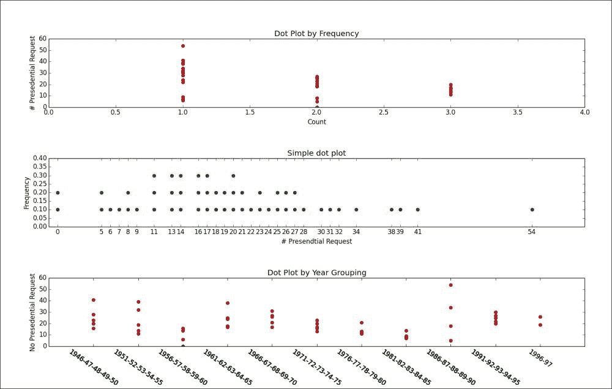

在顶部的图中，数据按频率分组。这里，我们的 x 轴是计数，y 轴是总统请求的数量。我们可以看到，30 个或更多的总统请求只出现过一次。如前所述，点状图擅长分析不同分组下的数据点的范围。

中间的图表可以看作是一个非常简单的直方图。正如图表的标题(`in plt.title()`)所言，这是最简单的点状图，其中 *x* 轴是实际值，y 轴是这个 x 值在数据集中出现的次数。在直方图中，必须仔细设置面元大小；否则，它会扭曲数据的全貌。然而，这可以在这个简单的点状图中避免。

在底部的图表中，我们按年份对数据进行了分组。


## 参见

*   *创建匿名函数*方法[第一章](part0015_split_000.html#E9OE1-6b04b7c0b98f44a0b8f82924fef317ec "Chapter 1. Python for Data Science")，*使用 Python 进行数据科学*
*   *预处理栏目*配方[第一章](part0015_split_000.html#E9OE1-6b04b7c0b98f44a0b8f82924fef317ec "Chapter 1. Python for Data Science")，*利用 Python 进行数据科学*
*   *在[第一章](part0015_split_000.html#E9OE1-6b04b7c0b98f44a0b8f82924fef317ec "Chapter 1. Python for Data Science")中用 Python* 获取数据，*使用 Python 进行数据科学*
*   *使用字典对象*菜谱[第一章](part0015_split_000.html#E9OE1-6b04b7c0b98f44a0b8f82924fef317ec "Chapter 1. Python for Data Science")，*使用 Python 进行数据科学*


# 对多元数据使用散点图

我们现在将从单个列转移到多个列。在多元数据分析中，我们感兴趣的是查看我们正在分析的列之间是否有任何关系。在两列/变量的情况下，最好从标准散点图开始。有四种类型的关系，如下所示:

*   没有关系
*   强烈的
*   简单的
*   多元(不简单)关系


## 准备就绪

我们将使用虹膜数据集。这是罗纳德·费雪爵士引入的多元数据集。更多信息请参考[https://archive.ics.uci.edu/ml/datasets/Iris](https://archive.ics.uci.edu/ml/datasets/Iris)。

Iris 数据集有 150 个实例和 4 个属性/列。这 150 个实例由来自鸢尾花的三个物种(Setosa、virginica 和 versicolor)中的每一个的 50 个记录组成。这四个属性是以厘米为单位的萼片长度、以厘米为单位的萼片宽度、以厘米为单位的花瓣长度和以厘米为单位的花瓣宽度。因此，Iris 数据集也是一个很好的分类数据集。一个分类方法可以这样写，给定一个记录，经过适当的训练，我们可以对那个记录属于哪个物种进行分类。


## 怎么做……

让我们加载必要的库并提取虹膜数据:

```
# Load Librarires
from sklearn.datasets import load_iris
import numpy as np
import matplotlib.pyplot as plt
import itertools

# 1\. Load Iris dataset
data = load_iris()
x = data['data']
y = data['target']col_names = data['feature_names']
```

我们将通过散点图进行演示:

```
# 2.Perform a simple scatter plot. 
# Plot 6 graphs, combinations of our columns, sepal length, sepal width,
# petal length and petal width.
plt.close('all')
plt.figure(1)
# We want a plot with
# 3 rows and 2 columns, 3 and 2 in
# below variable signifies that.
subplot_start = 321
col_numbers = range(0,4)
# Need it for labeling the graph
col_pairs = itertools.combinations(col_numbers,2)
plt.subplots_adjust(wspace = 0.5)

for col_pair in col_pairs:
    plt.subplot(subplot_start)
    plt.scatter(x[:,col_pair[0]],x[:,col_pair[1]],c=y)
    plt.xlabel(col_names[col_pair[0]])
    plt.ylabel(col_names[col_pair[1]])
    subplot_start+=1plt.show()
```


## 它是如何工作的……

scikit 库提供了一个方便的函数来加载名为`load_iris()`的虹膜数据集。我们将使用它在步骤 1 中加载可变数据中的虹膜数据。`data`是一个字典对象。使用数据和目标键，我们将检索记录和类标签。我们将查看`x`和`y`值:

```
>>> x.shape
(150, 4)
>>> y.shape
(150,)
>>>
```

可以看到，`x`是一个有`150`行四列的矩阵；`y`是一个长度为`150`的向量。还可以使用关键字`feature_names`查询`data`字典来查看列名，如下所示:

```
>>> data['feature_names']

['sepal length (cm)', 'sepal width (cm)', 'petal length (cm)', 'petal width (cm)']
>>>
```

然后，我们将在步骤 2 中创建虹膜变量的散点图。正如我们之前所做的，我们将在这里使用 subplot 来容纳一个图形中的所有情节。我们将使用`itertools.Combination`得到我们的列的两个组合:

```
col_pairs = itertools.combinations(col_numbers,2)
```

我们可以迭代`col_pairs`来获得我们的列的两个组合，并为每个组合绘制一个散点图，如下面的代码行所示:

```
plt.scatter(x[:,col_pair[0]],x[:,col_pair[1]],c=y)
```

我们将传递一个`c`参数来指示点的颜色。在这种情况下，我们将传递 y 变量(class label ),以便在散点图中用不同的颜色绘制不同种类的鸢尾。

结果图如下所示:

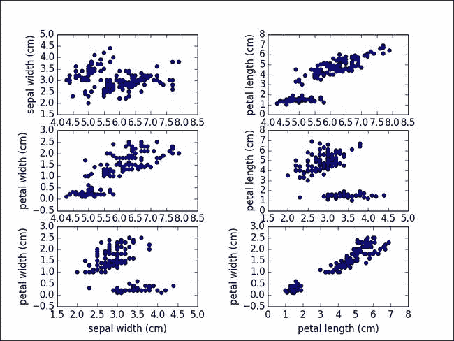

如您所见，我们已经绘制了两种柱形组合。我们还用三种不同的颜色来表示类别标签。让我们看看左下角的图，花瓣长度对花瓣宽度。我们看到不同的值域属于不同的类标签。这给了我们一个很好的分类线索。如果手头的问题是分类，花瓣宽度和长度变量是很好的选择。

### 注意

对于 Iris 数据集，花瓣宽度和长度可以单独对它们各自花族中的记录进行分类。

借助于二元散点图，可以在特征选择过程中快速进行这种观察。


## 参见

*   *使用 iterables* 配方[第一章](part0015_split_000.html#E9OE1-6b04b7c0b98f44a0b8f82924fef317ec "Chapter 1. Python for Data Science")，*使用 Python 进行数据科学*
*   *使用 itertools* 配方[第 1 章](part0015_split_000.html#E9OE1-6b04b7c0b98f44a0b8f82924fef317ec "Chapter 1. Python for Data Science") , *使用 Python 进行数据科学*


# 使用热图

热图是另一种有趣的可视化技术。在热图中，数据表示为一个矩阵，其中属性取值的范围表示为颜色梯度。查看以下维基百科参考资料，了解热图的一般介绍:

[http://en.wikipedia.org/wiki/Heat_map](http://en.wikipedia.org/wiki/Heat_map)


## 准备就绪

我们将再次借助 Iris 数据集来演示如何构建热图。我们还将看到热图可用于这些数据的各种方式。

在这个菜谱中，我们将看到如何将整个数据表示为热图，以及如何根据热图对数据进行各种解释。让我们继续构建 Iris 数据集的热图。


## 怎么做……

让我们加载必要的库并导入 Iris 数据集。我们将继续根据平均值对数据中的变量进行缩放:

```
# Load libraries
from sklearn.datasets import load_iris
from sklearn.preprocessing import scale
import numpy as np
import matplotlib.pyplot as plt

# 1\. Load iris dataset
data = load_iris()
x = data['data']
y = data['target']
col_names = data['feature_names']

# 2\. Scale the variables, with mean value
x = scale(x,with_std=False)
x_ = x[1:26,]y_labels = range(1,26)
```

让我们绘制我们的热图:

```
# 3\. Plot the Heat map
plt.close('all')

plt.figure(1)
fig,ax = plt.subplots()
ax.pcolor(x_,cmap=plt.cm.Greens,edgecolors='k')
ax.set_xticks(np.arange(0,x_.shape[1])+0.5)
ax.set_yticks(np.arange(0,x_.shape[0])+0.5)
ax.xaxis.tick_top()
ax.yaxis.tick_left()
ax.set_xticklabels(col_names,minor=False,fontsize=10)
ax.set_yticklabels(y_labels,minor=False,fontsize=10)plt.show()
```


## 它是如何工作的……

在步骤 1 中，我们将加载虹膜数据集。与其他配方类似，为了清楚起见，我们将获取数据字典对象，并将它们存储为 x 和 y。在第 2 步中，我们将通过变量的平均值来衡量变量:

```
x = scale(x,with_std=False)
```

将参数 standard 设置为 false 时，scale 函数将仅使用列的平均值来标准化数据。

缩放的原因是为了将每一列的取值范围调整到一个通用的范围，通常在 0 到 1 之间。让它们具有相同的比例对于热图可视化非常重要，因为这些值决定了颜色梯度。

### Tip

不要忘记调整你的变量，使它们处于相同的范围内。没有适当的缩放比例可能会导致变量具有更大的范围和缩放比例，从而支配其他变量。

在第 3 步中，我们将执行实际的绘图。在我们绘图之前，我们将对数据进行子集划分:

```
x = x[1:26,]
col_names = data['feature_names']
y_labels = range(1,26)
```

如您所见，我们只从数据集中选择了前 25 条记录。我们这样做是为了让 y 轴上的标签可读。我们将分别在`col_names`和`y_labels`中存储 x 轴和 y 轴的标签。最后，我们将使用 pyplot 中的`pcolor`函数来绘制 Iris 数据的热图。我们将对 pcolor 做一些修改，使它看起来更漂亮:

```
ax.set_xticks(np.arange(0,x.shape[1])+0.5)
ax.set_yticks(np.arange(0,x.shape[0])+0.5)
```

*x* 和 *y* 轴刻度统一设置；

```
ax.xaxis.tick_top()
```

x 轴刻度显示在图形的顶部:

```
ax.yaxis.tick_left()
```

y 轴刻度显示在左侧:

```
ax.set_xticklabels(col_names,minor=False,fontsize=10)
ax.set_yticklabels(y_labels,minor=False,fontsize=10)
```

最后，我们将传递标签值。

输出图如下所示:

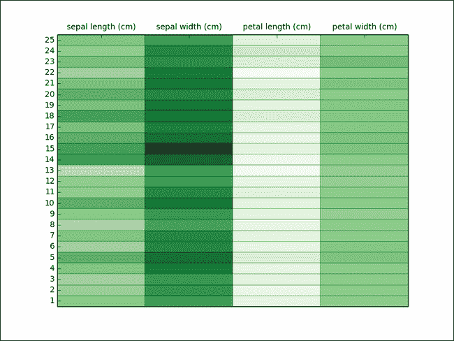

## 还有更多...

使用热图的另一个有趣的方法是查看由各自类别分开的变量；例如，在 Iris 数据集中，我们将为存在的三个类别绘制三个不同的热图。代码如下:

```
x1 = x[0:50]
x2 = x[50:99]
x3 = x[100:149]

x1 = scale(x1,with_std=False)
x2 = scale(x2,with_std=False)
x3 = scale(x3,with_std=False)

plt.close('all')
plt.figure(2)
fig,(ax1, ax2, ax3) = plt.subplots(3, sharex=True, sharey=True)
y_labels = range(1,51)

ax1.set_xticks(np.arange(0,x.shape[1])+0.5)
ax1.set_yticks(np.arange(0,50,10))

ax1.xaxis.tick_bottom()
ax1.set_xticklabels(col_names,minor=False,fontsize=2)

ax1.pcolor(x1,cmap=plt.cm.Greens,edgecolors='k')
ax1.set_title(data['target_names'][0])

ax2.pcolor(x2,cmap=plt.cm.Greens,edgecolors='k')
ax2.set_title(data['target_names'][1])

ax3.pcolor(x3,cmap=plt.cm.Greens,edgecolors='k')
ax3.set_title(data['target_names'][2])plt.show()   
```

我们来看剧情:

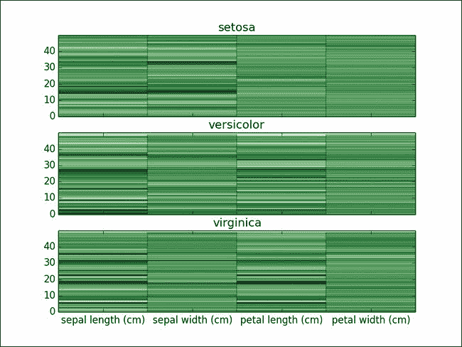

前 50 条记录属于`setosa`类，接下来的 50 条属于`versicolor`，最后的 50 条属于`virginica`。我们将为每门课制作三张热图。

单元格中填充了记录的实际值。你可以注意到，对于`setosa`，萼片宽度有很好的变化，但在`versicolor`和`virginica`的情况下没有表现出任何显著性。


## 参见

*   *缩放数据*配方[第三章](part0043_split_000.html#190861-6b04b7c0b98f44a0b8f82924fef317ec "Chapter 3. Data Analysis – Explore and Wrangle")、*分析数据-探索&争论*


# 执行汇总统计和绘图

使用汇总统计的主要目的是为了更好地理解数据的位置和分布。通过汇总统计，我们指的是均值、中值和标准差。这些量很容易计算。然而，人们在使用它们时应该小心。如果基础数据不是单峰的，也就是说，它有多个峰值，这些量可能没有多大用处。

### 注意

如果给定的数据是单峰的，即只有一个峰值，则给出位置的平均值和给出方差的标准差是有价值的度量。


## 准备就绪

让我们使用我们的 Iris 数据集来探究这些汇总统计数据。在这个部分，我们没有一个完整的程序产生单一的输出；但是，我们将有不同的步骤来演示不同的汇总方法。


## 怎么做……

让我们从导入必要的库开始。我们将继续加载 Iris 数据集:

```
# Load Libraries
from sklearn.datasets import load_iris
import numpy as np
from scipy.stats import trim_mean

# Load iris data
data = load_iris()
x = data['data']
y = data['target']col_names = data['feature_names']
```

现在，让我们演示如何计算平均值、修整平均值和范围值:

```
# 1.	Calculate and print the mean value of each column in the Iris dataset
print "col name,mean value"
for i,col_name in enumerate(col_names):
    print "%s,%0.2f"%(col_name,np.mean(x[:,i]))
print    

# 2.	Trimmed mean calculation.
p = 0.1 # 10% trimmed mean
print
print "col name,trimmed mean value"
for i,col_name in enumerate(col_names):
    print "%s,%0.2f"%(col_name,trim_mean(x[:,i],p))
print

# 3.	Data dispersion, calculating and display the range values.
print "col_names,max,min,range"
for i,col_name in enumerate(col_names):
    print "%s,%0.2f,%0.2f,%0.2f"%(col_name,max(x[:,i]),min(x[:,i]),max(x[:,i])-min(x[:,i]))
print
```

最后，我们将显示方差、标准偏差、平均绝对偏差和中位数绝对偏差的计算结果:

```
# 4.	Data dispersion, variance and standard deviation
print "col_names,variance,std-dev"
for i,col_name in enumerate(col_names):
    print "%s,%0.2f,%0.2f"%(col_name,np.var(x[:,i]),np.std(x[:,i]))
print

# 5.	Mean absolute deviation calculation  
def mad(x,axis=None):
    mean = np.mean(x,axis=axis)
    return np.sum(np.abs(x-mean))/(1.0 * len(x))

print "col_names,mad"
for i,col_name in enumerate(col_names):
    print "%s,%0.2f"%(col_name,mad(x[:,i]))
print

# 6.	Median absolute deviation calculation
def mdad(x,axis=None):
    median = np.median(x,axis=axis)
    return np.median(np.abs(x-median))

print "col_names,median,median abs dev,inter quartile range"
for i,col_name in enumerate(col_names):
    iqr = np.percentile(x[:,i],75) - np.percentile(x[i,:],25)
    print "%s,%0.2f,%0.2f,%0.2f"%(col_name,np.median(x[:,i]), mdad(x[:,i]),iqr)
print
```


## 它是如何工作的……

在该配方中，不重复加载 Iris 数据集。假设读者可以看看之前的食谱来做同样的事情。此外，我们将假设 x 变量加载了 Iris 记录的所有实例，每个记录有四列。

步骤 1 打印 Iris 数据集中每一列的平均值。我们同样使用了 NumPy 的`mean`函数。print 语句的输出如下:

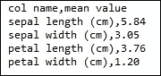

如您所见，我们有每列的平均值。计算平均值的代码如下:

```
np.mean(x[:,i])
```

我们通过了循环中的所有行和列。因此，我们按列得到平均值。

另一个有趣的衡量标准是所谓的修整均值。它有自己的优势。给定样本的 10%修整平均值是通过从样本中排除 10%最大值和 10%最小值并取样本剩余 80%的算术平均值来计算的。

### 注意

与常规平均值相比，修整平均值对异常值不太敏感。

SciPy 为我们提供了一个修剪均值函数。我们将在步骤 2 中演示修整平均值的计算。输出如下所示:

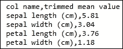

对于 Iris 数据集，我们看不到太多的差异，但在现实世界的数据集中，修剪平均值非常方便，因为它可以更好地描述数据的位置。

到目前为止，我们看到的是数据的位置，而平均值和修整平均值给出了关于数据位置的良好推断。另一个需要关注的重要方面是数据的分散性。查看数据离差的最简单方法是范围，其定义如下，给定一组值 x，范围是 x 的最大值-x 的最小值。在步骤 3 中，我们将计算并打印相同的值:


### 注意

如果数据落在一个非常窄的范围内，比如说，大多数值都集中在一个值周围，而我们有几个极值，那么这个范围可能会产生误导。

当数据落在一个非常窄的范围内并围绕一个值聚集时，方差用作数据分散/扩散的典型度量。方差是单个值和平均值之间的平方差之和除以实例数。在第 4 步中，我们将看到方差计算。

在前面的代码中，除了方差，我们还可以看到 std-dev，即标准差。由于方差是差值的平方，因此它与原始数据不在同一测量范围内。我们将使用标准偏差，即方差的平方根，以便将数据恢复到原始范围。让我们看看 print 语句的输出，其中我们列出了方差和标准差:

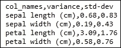

正如我们前面提到的，平均值对异常值非常敏感；方差也使用平均值，因此，它容易出现与平均值相同的问题。我们可以使用其他的方差度量来避免这个陷阱。一种这样的度量是绝对平均偏差；不是取单个值和平均值之差的平方并除以实例数，而是取平均值和单个值之差的绝对值并除以实例数。在步骤 5 中，我们将为此定义一个函数:

```
def mad(x,axis=None):
mean = np.mean(x,axis=axis)
return np.sum(np.abs(x-mean))/(1.0 * len(x))
```

如您所见，该函数返回平均值和个体值之间的绝对差值。这一步的输出如下:


由于数据中有许多异常值，因此有另一组度量标准可以派上用场。它们是中位数和百分位数。在绘制单变量数据时，我们已经在前一节中看到了百分位数。传统上，中值被定义为来自数据集中的值，使得数据集中所有点的一半小于中值，而另一半大于中值。

### 注意

百分位数是中位数概念的概括。第 50 百分位是传统的中间值。

我们在上一节中看到了第 25 和第 75 个百分点。第 25 个百分位数是一个值，使得数据集中所有点的 25%小于该值:

```
>>> 
>>> a = [8,9,10,11]
>>> np.median(a)
9.5
>>> np.percentile(a,50)
9.5
```

中位数是数据分布位置的度量。使用百分位数，我们可以得到数据离散度的度量，即四分位数范围。四分位范围是第 75 百分位和第 25 百分位之间的距离。与前面解释的平均绝对偏差相似，我们也有平均绝对偏差。

在第 6 步中，我们将计算并显示四分位间距和中位数绝对偏差。为了计算中位数绝对偏差，我们将定义以下函数:

```
def mdad(x,axis=None):
median = np.median(x,axis=axis)
return np.median(np.abs(x-median))
```

输出如下所示:

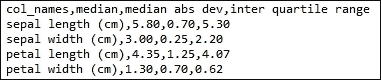

## 参见

*   *分组数据并使用[第三章](part0043_split_000.html#190861-6b04b7c0b98f44a0b8f82924fef317ec "Chapter 3. Data Analysis – Explore and Wrangle")中的*配方，*分析数据-探索&争论*


# 使用盒须图

盒须图是查看手头数据的统计摘要的统计摘要的好伴侣。盒须图可以有效地表示数据中的分位数和异常值(如果有的话)，强调数据的整体结构。箱形图由以下特征组成:

*   指示中值的水平线，表示数据的位置
*   跨越四分位范围的方框，用于测量离差
*   从中心框水平和垂直延伸的一组胡须，表示分布的尾部


## 准备就绪

让我们用方框图来看看虹膜数据集。


## 怎么做……

让我们从加载必要的库开始。接下来，我们将加载 Iris 数据集:

```
# Load Libraries
from sklearn.datasets import load_iris
import matplotlib.pyplot as plt

# Load Iris dataset
data = load_iris()
x = data['data']
plt.close('all')
```

让我们演示如何创建一个盒须图:

```
# Plot the box and whisker
fig = plt.figure(1)
ax = fig.add_subplot(111)
ax.boxplot(x)
ax.set_xticklabels(data['feature_names'])
plt.show()    
```


## 它是如何工作的……

代码非常简单。我们将在 x 中加载虹膜数据，并将 x 值从 pyplot 传递给盒图函数。如你所知，我们的 x 有四列。方框图如下所示:

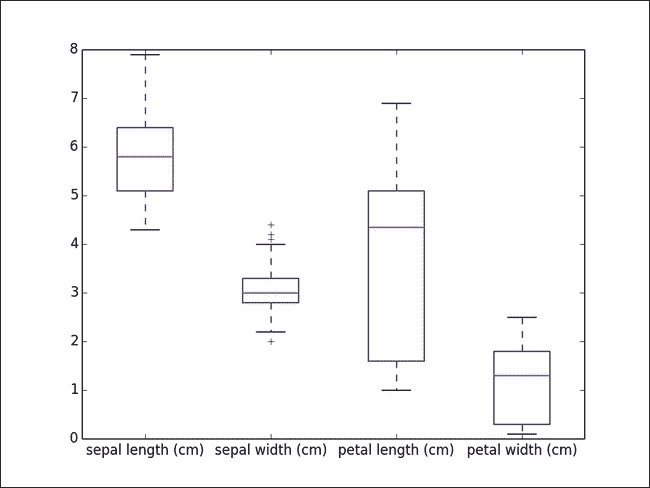

箱形图捕捉了单个图中所有四个柱的位置和变化。

水平红线表示中间值，这是数据的位置。你可以看到萼片长度的中值高于其余的列。

对于所有四个变量，可以看到跨越四分位数范围的测量离差的方框。

您可以看到一组从中心框水平和垂直延伸的胡须，这表示分布的尾部。触须帮助您查看数据集中的极值。


## 还有更多……

观察数据如何分布在不同的类标签上也是很有趣的。类似于我们在散点图中所做的，让我们在盒须图中做同样的事情。以下代码和图表说明了如何绘制跨越各种类别标签的盒状图:

```
y=data['target']
class_labels = data['target_names']

fig = plt.figure(2,figsize=(18,10))
sub_plt_count = 321
for t in range(0,3):
    ax = fig.add_subplot(sub_plt_count)
    y_index = np.where(y==t)[0]
    x_ = x[y_index,:]
    ax.boxplot(x_)
    ax.set_title(class_labels[t])   
    ax.set_xticklabels(data['feature_names'])
    sub_plt_count+=1
plt.show()
```

正如您在下面的图表中看到的，我们现在为每个类别标签绘制了一个方框图:


# 输入数据

在许多真实的场景中，我们会遇到数据不完整或缺失的问题。我们需要一个策略来处理不完整的数据。这种策略可以单独使用数据来制定，也可以结合类标签(如果标签存在的话)来制定。


## 准备就绪

让我们首先看看不使用类标签输入数据的方法。

一种简单的方法是忽略缺失值，从而避免数据插补的开销。然而，这可以应用于数据充足的情况，但情况并非总是如此。如果数据集很少有缺失值，并且缺失值的百分比很小，我们可以忽略它们。通常，它不是关于忽略一个变量的单个值，而是关于忽略一个包含这个变量的元组。当忽略整个元组时，我们必须更加小心，因为这个元组中的其他属性可能对我们的任务非常关键。

处理缺失数据的更好方法是对其进行估计。现在，可以仅考虑数据或结合类别标签来执行估计过程。在连续变量的情况下，平均值、中值或最频繁值可用于替换缺失值。Scikit-learn 在模块预处理中为您提供了一个`Imputer()`函数来处理丢失的数据。让我们看一个例子，我们将执行数据插补。为了更好地理解插补技术，我们将人为地在 Iris 数据集中引入一些缺失值。


## 怎么做……

让我们首先加载必要的库。我们将照常加载 Iris 数据集，并引入一些任意缺失值:

```
# Load Libraries
from sklearn.datasets import load_iris
from sklearn.preprocessing import Imputer
import numpy as np
import numpy.ma as ma

# 1\. Load Iris Data Set
data = load_iris()
x = data['data']
y = data['target']

# Make a copy of hte original x value
x_t = x.copy()

# 2.	Introduce missing values into second row
x_t[2,:] = np.repeat(0,x.shape[1])
```

让我们来看看一些实际的数据插补:

```
# 3.	Now create an imputer object with strategy as mean, 
# i.e. fill the missing values with the mean value of the missing column.
imputer = Imputer(missing_values=0,strategy="mean")
x_imputed = imputer.fit_transform(x_t)

mask = np.zeros_like(x_t)
mask[2,:] = 1
x_t_m = ma.masked_array(x_t,mask)

print np.mean(x_t_m,axis=0)print x_imputed[2,:]
```


## 它是如何工作的……

第一步是将虹膜数据加载到内存中。在步骤 2 中，我们将引入一些缺失值；在这种情况下，我们将把第三行中的所有列设置为`0`。

在第 3 步中，我们将使用估算对象来处理缺失的数据:

```
imputer = Imputer(missing_values=0,strategy="mean")
```

如您所见，我们将需要两个参数，`missing_valu` es 来指定缺失值，以及 strategy，这是一种估算这些缺失值的方法。估算对象提供了以下三种策略:

*   意思是
*   中位数
*   最频繁

使用平均值，任何具有`0`值的单元格都将被该单元格所属列的平均值替换。在中值的情况下，用中值代替`0`，在`most_frequent`中，顾名思义，用最频繁出现的值代替`0`。基于我们的应用程序的上下文，可以应用这些策略中的一个。

x[2，:]的初始值如下:

```
>>> x[2,:]
array([ 4.7,  3.2,  1.3,  0.2])

```

我们将在所有列中使用它`0`,并使用一个带有均值策略的估算器。

在我们查看估算输出之前，让我们计算所有列的平均值:

```
import numpy.ma as ma
mask = np.zeros_like(x_t)
mask[2,:] = 1
x_t_m = ma.masked_array(x_t,mask)

print np.mean(x_t_m,axis=0)
```

输出如下所示:

```
[5.851006711409397 3.053020134228189 3.7751677852349017 1.2053691275167793]
```

现在，让我们看看第 2 行的估算输出:

```
print x_imputed[2,:]
```

以下是输出:

```
[ 5.85100671  3.05302013  3.77516779  1.20536913]
```

如你所见，估算者已经用各列的平均值填充了缺失值。


## 还有更多……

如前所述，我们还可以利用分类标签，使用平均值或中值估算缺失值:

```
# Impute based on class label
missing_y = y[2]
x_missing = np.where(y==missing_y)[0]
y = data['target']
# Mean stragegy 
print np.mean(x[x_missing,:],axis=0)
# Median stragegy
print np.median(x[x_missing,:],axis=0)
```

我们没有使用整个数据集的平均值或中值，而是通过缺失元组的类变量对数据进行子集划分:

```
missing_y = y[2]
```

我们在第三条记录中引入了缺失值。我们将把与该记录相关联的类标签带到`missing_y`变量:

```
x_missing = np.where(y==missing_y)[0]
```

现在，我们将获取具有相同类标签的所有元组:

```
# Mean stragegy 
print np.mean(x[x_missing,:],axis=0)
# Median stragegy
print np.median(x[x_missing,:],axis=0)
```

我们现在可以应用均值或中值策略，用属于该类标签的所有元组的均值或中值替换缺失的元组。

我们采用该子集的平均值/中值进行数据插补。


## 参见

*   *执行汇总统计*第三章[中的菜谱](part0043_split_000.html#190861-6b04b7c0b98f44a0b8f82924fef317ec "Chapter 3. Data Analysis – Explore and Wrangle")、*分析数据-探索&争论*


# 执行随机抽样

在这一课中，我们将学习如何对数据进行随机抽样。


## 准备就绪

通常，在访问整个数据集非常昂贵的场景中，采样可以有效地用于提取数据集的一部分进行分析。采样也可以有效地用于 EDA。样本应该是基础数据集的良好代表。它应该具有与基础数据集大致相同的特征。例如，就平均值而言，样本平均值应尽可能接近原始数据的平均值。有几种采样技术；我们将在这里介绍其中的一个。

在简单随机抽样中，选择任何元组的机会是均等的。对于我们的例子，我们想从 Iris 数据集中随机抽取 10 条记录。


## 怎么做……

我们将从加载必要的库和导入 Iris 数据集开始:

```
# Load libraries
from sklearn.datasets import load_iris
import numpy as np

# 1.	Load the Iris data set
data = load_iris()
x = data['data']
```

让我们演示一下采样是如何进行的:

```
# 2.	Randomly sample 10 records from the loaded dataset
no_records = 10
x_sample_indx = np.random.choice(range(x.shape[0]),no_records)
print x[x_sample_indx,:]
```


## 它是如何工作的……

在第一步中，我们将加载虹膜数据集。在步骤 2 中，我们将使用来自`numpy.random`的`choice`函数进行随机选择。

我们将传递给选择函数的两个参数是原始数据集中的总行数的范围变量和我们需要的样本大小。从零到原始数据集中的总行数，choice 函数随机选取 n 个整数，其中 n 是样本的大小，在我们的例子中由`no_records`决定。

另一个重要的方面是选择函数的参数之一是`replace`，默认情况下它被设置为真；它规定了我们是需要替换样品还是不替换样品。无替换采样从原始列表中删除被采样的项目，因此它不会成为将来采样的候选项。置换取样则相反；每个元素在未来的采样中都有均等的机会被采样，即使它以前已经被采样过。


## 还有更多……

### 分层抽样

如果底层数据集由不同的组组成，简单的随机抽样可能无法获取足够的样本来代表数据。例如，在一个两类分类问题中，10%的数据属于正类，90%属于负类。这种问题在机器学习中被称为类不平衡问题。当我们对这种不平衡的数据集进行采样时，样本也应该反映前面的百分比。这种抽样称为分层抽样。在机器学习的未来章节中，我们将更多地研究分层抽样。

### 渐进采样

对于给定的问题，我们如何确定正确的样本量？我们之前讨论了几种采样技术，但是我们没有选择正确样本大小的策略。对此没有简单的答案。做到这一点的一个方法是使用渐进采样。选择样本大小，通过任何采样技术获取样本，对数据应用所需的操作，并记录结果。现在，增加样本量并重复这些步骤。这个迭代过程被称为渐进采样。


# 缩放数据

在这里，我们将学习如何扩展数据。


## 准备就绪

缩放是一种重要的数据转换类型。通常，通过对数据集进行缩放，我们可以控制数据类型可以采用的值的范围。在具有多列的数据集中，范围和规模较大的列往往会支配其他列。我们将对数据集进行缩放，以避免这些干扰。

假设我们正在根据功能的数量和代码的行数来比较两个软件产品。与特性数量的差异相比，代码行数的差异会非常大。在这种情况下，我们的比较将由代码行数决定。如果我们使用任何相似性度量，相似性或差异将由代码行数决定。为了避免这种情况，我们将采用缩放。最简单的缩放是最小-最大缩放。让我们看看随机生成的数据集上的最小-最大缩放。


## 怎么做……

让我们生成一些随机数据来测试我们的缩放功能:

```
# Load Libraries
import numpy as np

# 1.	Generate some random data for scaling
np.random.seed(10)
x = [np.random.randint(10,25)*1.0 for i in range(10)]
```

现在，我们将演示扩展:

```
# 2.Define a function, which can perform min max scaling given a list of numbers
def min_max(x):
    return [round((xx-min(x))/(1.0*(max(x)-min(x))),2) for xx in x]

# 3.Perform scaling on the given input list.    
print x 
print min_max(x)    
```


## 它是如何工作的……

在步骤 1 中，我们将生成一个 10 到 25 之间的随机数列表。在步骤 2 中，我们将定义一个函数来对给定的输入执行最小-最大缩放。最小-最大缩放比例定义如下:

```
x_scaled = x – min(x) / max(x) –min (x)
```

在步骤 2 中，我们定义一个函数来完成上述任务。

这将转换给定值的范围。变换后，值将落在[ 0，1 ]范围内。

在步骤 3 中，我们将首先打印原始输入列表。输出如下所示:

```
[19, 23, 14, 10, 11, 21, 22, 19, 23, 10]
```

我们将把这个列表传递给我们的`min_max`函数，以获得缩放后的输出，如下所示:

```
[0.69, 1.0, 0.31, 0.0, 0.08, 0.85, 0.92, 0.69, 1.0, 0.0]
```

你可以看到缩放在起作用；最小的数字`10`被赋予值`0.0`，最大的数字`23`被赋予值`1.0`。因此，我们将数据定标在[0，1]范围内。


## 还有更多……

Scikit-learn 为此提供了一个最小最大缩放函数:

```
from sklearn.preprocessing import MinMaxScaler
import numpy as np

np.random.seed(10)
x = np.matrix([np.random.randint(10,25)*1.0 for i in range(10)])
x = x.T
minmax = MinMaxScaler(feature_range=(0.0,1.0))
print x
x_t = minmax.fit_transform(x)
print x_t
```

输出如下所示:

```
[19.0, 23.0, 14.0, 10.0, 11.0, 21.0, 22.0, 19.0, 23.0, 10.0]
[0.69, 1.0, 0.31, 0.0, 0.08, 0.85, 0.92, 0.69, 1.0, 0.0]
```

我们看到了将数据缩放到一个范围(0，1)的例子；这可以扩展到任何范围。假设我们的新范围是`nr_min,nr_max`，那么最小-最大公式修改如下:

```
x_scaled =  ( x – min(x) / max(x) –min (x) ) * (nr_max- nr_min) + nr_min
```

以下是 Python 代码:

```
import numpy as np

np.random.seed(10)
x = [np.random.randint(10,25)*1.0 for i in range(10)]

def min_max_range(x,range_values):
    return [round( ((xx-min(x))/(1.0*(max(x)-min(x))))*(range_values[1]-range_values[0]) \
    + range_values[0],2) for xx in x]

print min_max_range(x,(100,200))
```

其中，range_values 是由两个元素组成的元组，第 0 个元素是新范围的下限，第一个元素是上限。让我们在输入中调用这个函数，看看输出是怎样的，如下所示:

```
print min_max_range(x,(100,200))

[169.23, 200.0, 130.77, 100.0, 107.69, 184.62, 192.31, 169.23, 200.0, 100.0]
```

最低值`10`现在被缩放到`100`，最高值`23`被缩放到`200`。


# 数据标准化

标准化是转换输入的过程，使其平均值`0`和标准差为 1。


## 准备就绪

如果给定一个向量 X，X 的平均值`0`和标准偏差 1 可通过以下等式获得:

### 注意

标准化 X = X–平均值/标准偏差(X)

让我们看看如何在 Python 中实现这一点。


## 怎么做……

让我们从导入必要的库开始。接下来，我们将生成输入数据:

```
# Load Libraries
import numpy as np
from sklearn.preprocessing import scale

# Input data generation
np.random.seed(10)
x = [np.random.randint(10,25)*1.0 for i in range(10)]
```

我们现在准备演示标准化:

```
x_centered = scale(x,with_mean=True,with_std=False)
x_standard = scale(x,with_mean=True,with_std=True)

print x
print x_centered
print x_standard
print "Orginal x mean = %0.2f, Centered x mean = %0.2f, Std dev of \
        standard x =%0.2f"%(np.mean(x),np.mean(x_centered),np.std(x_standard))
```


## 它是如何工作的……

我们将使用 np.random 生成一些随机数据:

```
x = [np.random.randint(10,25)*1.0 for i in range(10)]
```

我们将使用 scikit-learn 中的`scale`函数执行标准化:

```
x_centered = scale(x,with_mean=True,with_std=False)
x_standard = scale(x,with_mean=True,with_std=True)
```

仅使用平均值对`x_centered`进行缩放；您可以看到`with_mean`参数设置为`True`，而`with_std`设置为`False`。

使用平均值和标准偏差对`x_standard`进行标准化。

现在让我们看看输出。

原始数据如下:

```
[19.0, 23.0, 14.0, 10.0, 11.0, 21.0, 22.0, 19.0, 23.0, 10.0]

Next, we will print x_centered, where we centered it with the mean value:

[ 1.8  5.8 -3.2 -7.2 -6.2  3.8  4.8  1.8  5.8 -7.2]

Finally we will print x_standardized, where we used both the mean and standard deviation:

[ 0.35059022  1.12967961 -0.62327151 -1.4023609  -1.20758855  0.74013492
  0.93490726  0.35059022  1.12967961 -1.4023609 ]

Orginal x mean = 17.20, Centered x mean = 0.00, Std dev of standard x =1.00
```


## 还有更多……

### 注意

标准化可以推广到任何级别和范围，如下所示:

标准化价值=价值-水平/差价

让我们把前面的方程分解成两部分:只是分子部分，这叫居中，整个方程，这叫标准化。使用平均值时，居中在回归中起着关键作用。考虑一个数据集，它有两个属性，体重和身高。我们将使数据居中，这样预测值权重的平均值为`0`。这使得 intercept 的解释更加容易。当预测值设置为平均值时，截距将被解释为预期高度。


# 执行标记化

当您收到任何文本时，第一项工作是将文本标记为基于给定问题需求的格式。标记化是一个非常宽泛的术语；我们可以在以下不同的粒度级别标记文本:

*   段落级别
*   句子层次
*   单词级别

在本节中，我们将看到句子级和单词级标记化。这些方法是相似的，可以很容易地应用于段落级别或手头问题所需的任何其他粒度级别。


## 准备就绪

我们将看到如何在一个菜谱中执行句子级和单词级标记化。


## 怎么做……

先说句子标记化的演示:

```
# Load Libraries
from nltk.tokenize import sent_tokenize
from nltk.tokenize import word_tokenize
from collections import defaultdict

# 1.Let us use a very simple text to demonstrate tokenization
# at sentence level and word level. You have seen this example in the
# dictionary recipe, except for some punctuation which are added.

sentence = "Peter Piper picked a peck of pickled peppers. A peck of pickled \
peppers, Peter Piper picked !!! If Peter Piper picked a peck of pickled \
peppers, Wheres the peck of pickled peppers Peter Piper picked ?"

# 2.Using nltk sentence tokenizer, we tokenize the given text into sentences
# and verify the output using some print statements.

sent_list = sent_tokenize(sentence)

print "No sentences = %d"%(len(sent_list))
print "Sentences"
for sent in sent_list: print sent

# 3.With the sentences extracted let us proceed to extract
# words from these sentences.
word_dict = defaultdict(list)
for i,sent in enumerate(sent_list):
    word_dict[i].extend(word_tokenize(sent))

print word_dict
```

快速浏览一下 NLTK 是如何通过以下方式执行句子标记化的:

```
def sent_tokenize(text, language='english'):
    """
    Return a sentence-tokenized copy of *text*,
    using NLTK's recommended sentence tokenizer
    (currently :class:`.PunktSentenceTokenizer`
    for the specified language).

    :param text: text to split into sentences
    :param language: the model name in the Punkt corpus
    """
    tokenizer = load('tokenizers/punkt/{0}.pickle'.format(language))
    return tokenizer.tokenize(text)
```


## 它是如何工作的……

在步骤 1 中，我们将用一个段落初始化一个变量句子。这是我们在字典食谱中使用的同一个例子。在步骤 2 中，我们将使用 nltk 的`sent_tokenize` 函数从给定的文本中提取句子。你可以在[http://www . nltk . org/API/nltk . tokenize . html # nltk . tokenize . sent _ tokenize](http://www.nltk.org/api/nltk.tokenize.html#nltk.tokenize.sent_tokenize)找到的文档中查看 nltk 中`sent_tokenize`的来源。

如您所见，`sent_tokenize`加载了一个预构建的标记器模型，并使用该模型标记给定的文本并返回输出。tokenizer 模型是来自`nltk.tokenize.punkt`模块的 PunktSentenceTokenizer 的一个实例。在不同的语言中，有几个这个记号赋予器的预训练实例。在我们的例子中，您可以看到语言参数被设置为英语。

让我们看看这一步的输出:

```
No sentences = 3
Sentences
Peter Piper picked a peck of pickled peppers.
A peck of pickled             peppers, Peter Piper picked !!!
If Peter Piper picked a peck of pickled             peppers, Wheres the peck of pickled peppers Peter Piper picked ?
```

如您所见，句子分词器将我们的输入文本分成了三个句子。让我们进行第三步，在这里我们将把这些句子标记成单词。这里，我们将使用`word_tokenize`函数从每个句子中提取单词，并将它们存储在字典中，其中键是句子编号，值是该句子的单词列表。让我们看看 print 语句的输出:

```
defaultdict(<type 'list'>, {0: ['Peter', 'Piper', 'picked', 'a', 'peck', 'of', 'pickled', 'peppers', '.'], 1: ['A', 'peck', 'of', 'pickled', 'peppers', ',', 'Peter', 'Piper', 'picked', '!', '!', '!'], 2: ['If', 'Peter', 'Piper', 'picked', 'a', 'peck', 'of', 'pickled', 'peppers', ',', 'Wheres', 'the', 'peck', 'of', 'pickled', 'peppers', 'Peter', 'Piper', 'picked', '?']})
```

`word_tokenize`使用正则表达式将句子拆分成单词。看看在[http://www . nltk . org/_ modules/nltk/token ize/punkt . html # punktlanguagevars . word _ token ize](http://www.nltk.org/_modules/nltk/tokenize/punkt.html#PunktLanguageVars.word_tokenize)找到的`word_tokenize`的源代码会很有用。


## 还有更多……

对于句子标记化，我们在 NLTK 中看到了一种方法。还有其他可用的方法。`nltk.tokenize.simple`模块有一个`line_tokenize`方法。让我们像以前一样使用相同的输入句子，并使用`line_tokenize`运行它:

```
# Load Libraries
from nltk.tokenize import line_tokenize

sentence = "Peter Piper picked a peck of pickled peppers. A peck of pickled \
peppers, Peter Piper picked !!! If Peter Piper picked a peck of pickled \
peppers, Wheres the peck of pickled peppers Peter Piper picked ?"

sent_list = line_tokenize(sentence)
print "No sentences = %d"%(len(sent_list))
print "Sentences"
for sent in sent_list: print sent

# Include new line characters
sentence = "Peter Piper picked a peck of pickled peppers. A peck of pickled\n \
peppers, Peter Piper picked !!! If Peter Piper picked a peck of pickled\n \
peppers, Wheres the peck of pickled peppers Peter Piper picked ?"

sent_list = line_tokenize(sentence)
print "No sentences = %d"%(len(sent_list))
print "Sentences"
for sent in sent_list: print sent
```

输出如下所示:

```
No sentences = 1
Sentences
Peter Piper picked a peck of pickled peppers. A peck of pickled             peppers, Peter Piper picked !!! If Peter Piper picked a peck of pickled             peppers, Wheres the peck of pickled peppers Peter Piper picked ?
```

您可以看到，我们只有从输入中检索到的句子。

现在让我们修改我们的输入，以便包括新的行字符:

```
sentence = "Peter Piper picked a peck of pickled peppers. A peck of pickled\n \
peppers, Peter Piper picked !!! If Peter Piper picked a peck of pickled\n \
peppers, Wheres the peck of pickled peppers Peter Piper picked ?"
```

注意我们添加了一个新的行字符。我们将再次应用`line_tokenize`来获得以下输出:

```
No sentences = 3
Sentences
Peter Piper picked a peck of pickled peppers. A peck of pickled
             peppers, Peter Piper picked !!! If Peter Piper picked a peck of pickled
             peppers, Wheres the peck of pickled peppers Peter Piper picked ?
```

你可以看到它在新的一行标记了我们的句子，现在我们有三个句子。

参见 *NLTK* 书的*第三章*；对句子和单词的标记化有更多的参考。可以在 http://www.nltk.org/book/ch03.html 的[找到。](http://www.nltk.org/book/ch03.html)


## 参见

*   *使用字典对象*菜谱[第一章](part0015_split_000.html#E9OE1-6b04b7c0b98f44a0b8f82924fef317ec "Chapter 1. Python for Data Science")，*使用 Python 进行数据科学*
*   *写清单*食谱[第一章](part0015_split_000.html#E9OE1-6b04b7c0b98f44a0b8f82924fef317ec "Chapter 1. Python for Data Science")，*利用 Python 进行数据科学*


# 删除停用词

在文本处理中，我们对单词或短语感兴趣，这些单词或短语将帮助我们从语料库中的其他文本中区分出给定的文本。让我们称这些单词或短语为关键短语。每个文本挖掘应用程序都需要一种找出关键短语的方法。信息检索应用程序需要关键词来方便检索和排列搜索结果。文本分类系统需要关键短语作为其特征，这些特征将被提供给分类器。

这就是停用词发挥作用的地方。

> 有时，一些在帮助选择符合用户需求的文档方面似乎没有什么价值的极其常见的单词被完全排除在词汇表之外。这些词叫做停止词。”

Christopher D. Manning、Prabhakar Raghavan 和 Hinrich Schütze 的《信息检索简介》

Python NLTK 库为我们提供了可以利用的默认停用词语料库，如下所示:

```
>>> from nltk.corpus import stopwords
>>> stopwords.words('english')
[u'i', u'me', u'my', u'myself', u'we', u'our', u'ours', u'ourselves', u'you', u'your', u'yours', u'yourself', u'yourselves', u'he', u'him', u'his', u'himself', u'she', u'her', u'hers', u'herself', u'it', u'its', u'itself', u'they', u'them', u'their', u'theirs', u'themselves', u'what', u'which', u'who', u'whom', u'this', u'that', u'these', u'those', u'am', u'is', u'are', u'was', u'were', u'be', u'been', u'being', u'have', u'has', u'had', u'having', u'do', u'does', u'did', u'doing', u'a', u'an', u'the', u'and', u'but', u'if', u'or', u'because', u'as', u'until', u'while', u'of', u'at', u'by', u'for', u'with', u'about', u'against', u'between', u'into', u'through', u'during', u'before', u'after', u'above', u'below', u'to', u'from', u'up', u'down', u'in', u'out', u'on', u'off', u'over', u'under', u'again', u'further', u'then', u'once', u'here', u'there', u'when', u'where', u'why', u'how', u'all', u'any', u'both', u'each', u'few', u'more', u'most', u'other', u'some', u'such', u'no', u'nor', u'not', u'only', u'own', u'same', u'so', u'than', u'too', u'very', u's', u't', u'can', u'will', u'just', u'don', u'should', u'now']
>>>
```

你可以看到我们用英语打印了停用词列表。


## 怎么做……

让我们加载必要的库并介绍我们的输入文本:

```
# Load libraries
from nltk.corpus import stopwords
from nltk.tokenize import word_tokenize
import string

text = "Text mining, also referred to as text data mining, roughly equivalent to text analytics,\
refers to the process of deriving high-quality information from text. High-quality information is \
typically derived through the devising of patterns and trends through means such as statistical \
pattern learning. Text mining usually involves the process of structuring the input text \
(usually parsing, along with the addition of some derived linguistic features and the removal \
of others, and subsequent insertion into a database), deriving patterns within the structured data, \
and finally evaluation and interpretation of the output. 'High quality' in text mining usually \
refers to some combination of relevance, novelty, and interestingness. Typical text mining tasks \
include text categorization, text clustering, concept/entity extraction, production of granular \
taxonomies, sentiment analysis, document summarization, and entity relation modeling \
(i.e., learning relations between named entities).Text analysis involves information retrieval, \
lexical analysis to study word frequency distributions, pattern recognition, tagging/annotation, \
information extraction, data mining techniques including link and association analysis, \
visualization, and predictive analytics. The overarching goal is, essentially, to turn text \
into data for analysis, via application of natural language processing (NLP) and analytical \
methods.A typical application is to scan a set of documents written in a natural language and \
either model the document set for predictive classification purposes or populate a database \
or search index with the information extracted."
```

现在让我们演示停用词删除过程:

```
words = word_tokenize(text)
# 2.Let us get the list of stopwords from nltk stopwords english corpus.
stop_words = stopwords.words('english')

print "Number of words = %d"%(len(words)) 
# 3.	Filter out the stop words.
words = [w for w in words if w not in stop_words]
print "Number of words,without stop words = %d"%(len(words)) 

words = [w for w in words if w not in string.punctuation]
print "Number of words,without stop words and punctuations = %d"%(len(words))
```


## 它是如何工作的……

在步骤 1 中，我们将从 nltk 导入必要的库。我们将需要英语停用词列表，因此我们将导入停用词语料库。我们需要将输入文本标记成单词。为此，我们将从`nltk.tokenize`模块导入`word_tokenize`函数。

对于我们的输入文本，我们取自维基百科关于文本挖掘的介绍段落，可以在[http://en.wikipedia.org/wiki/Text_mining](http://en.wikipedia.org/wiki/Text_mining)找到。

最后，我们将使用 word_tokenize 函数将输入文本标记成单词。单词现在是从输入中标记出来的所有单词的列表。让我们来看看 print 函数的输出，我们将打印单词列表的长度:

```
Number of words = 259
```

我们的列表中总共有 259 个单词。

在第 2 步中，我们将在一个名为`stop_words`的列表中编辑一个英文停用词列表。

在第二步中，我们将使用列表理解来获得单词的最终列表；只有那些不在我们在步骤 2 中创建的停用字词列表中的字词。这样，我们可以从输入中删除停用词。现在让我们来看看 print 语句的输出，我们将在其中打印删除了停用词的最终列表:

```
Number of words,without stop words = 195
```

您可以看到，我们从输入文本中删除了近 64 个单词，它们是停用词。


## 还有更多……

停用词不仅限于正常的英语单词。它与上下文相关，取决于手头的应用以及您希望如何对您的系统进行编程。理想情况下，如果我们对特殊字符不感兴趣，我们可以将它们包含在停用词表中。让我们看看下面的代码:

```
import string
words = [w for w in words if w not in string.punctuation]
print "Number of words,without stop words and punctuations = %d"%(len(words)) 
```

在这里，我们将运行另一个列表理解，以消除标点符号从我们的话。现在，输出如下所示:

```
Number of words, without stop words and punctuations = 156
```

### Tip

请记住，停用字词的删除是基于上下文和应用程序的。如果你正在开发一个手机或聊天室文本的情感分析应用，表情符号是非常有用的。您不需要删除它们，因为它们为下游的机器学习应用程序形成了一个非常好的特征集。

通常，在文档中，停用词的出现频率非常高。然而，在你的语料库中可能还有其他出现频率很高的词。根据你的语境，你可以将它们添加到你的停用字词列表中。


## 参见

*   *执行[第三章](part0043_split_000.html#190861-6b04b7c0b98f44a0b8f82924fef317ec "Chapter 3. Data Analysis – Explore and Wrangle")、*中的令牌化*配方——分析数据——探索&角力*
*   *列表生成*菜谱[第一章](part0015_split_000.html#E9OE1-6b04b7c0b98f44a0b8f82924fef317ec "Chapter 1. Python for Data Science")，*利用 Python 进行数据科学*


# 词干

在这里，我们将看到如何阻止这个词。


## 准备就绪

文本的标准化是一头不同的野兽，我们需要不同的工具来驯服它。在这一节中，我们将研究如何将单词转换成它们的基本形式，以便使我们的处理保持一致。我们将从传统的方法开始，包括词干化和词汇化。英语语法规定了某些单词在句子中的用法。例如,“执行”、“执行”和“执行”表示相同的动作；它们根据语法规则出现在不同的句子中。

> 词干化和词元化的目标都是将一个单词的屈折形式，有时是衍生相关形式简化为一个共同的基本形式。
> 
> 克里斯托弗·d·曼宁，普拉巴卡尔·拉加万&欣里奇·舒泽的《信息检索导论》

让我们看看如何使用 Python NLTK 进行词干分析。NLTK 为我们提供了一组丰富的函数，可以帮助我们非常容易地完成词干分析:

```
>>> import nltk.stem
>>> dir(nltk.stem)
['ISRIStemmer', 'LancasterStemmer', 'PorterStemmer', 'RSLPStemmer', 'RegexpStemmer', 'SnowballStemmer', 'StemmerI', 'WordNetLemmatizer', '__builtins__', '__doc__', '__file__', '__name__', '__package__', '__path__', 'api', 'isri', 'lancaster', 'porter', 'regexp', 'rslp', 'snowball', 'wordnet']
>>>  
```

我们可以看到模块中的函数列表，出于兴趣，我们有以下词干分析器:

*   Porter – porter stemmer
*   Lancaster – Lancaster stemmer
*   雪球-雪球茎干

波特是最常用的词干分析器。当把单词移动到它们的词根形式时，该算法不是很主动。

斯诺鲍比波特有所改进。在计算时间方面，它也比波特快。

兰开斯特是最积极的梗工。有了波特和斯诺鲍，最终的单词标记仍然是可读的，但有了兰卡斯特，它就不可读了。它是三个中最快的。

在这个菜谱中，我们将使用其中的一些来看看如何进行词干分析。


## 怎么做……

首先，让我们加载必要的库，并声明我们想要演示词干提取的数据集:

```
# Load Libraries
from nltk import stem

#1\. small input to figure out how the three stemmers perform.
input_words = ['movies','dogs','planes','flowers','flies','fries','fry','weeks','planted','running','throttle']
```

让我们进入不同的词干算法，如下所示:

```
#2.Porter Stemming
porter = stem.porter.PorterStemmer()
p_words = [porter.stem(w) for w in input_words]
print p_words

#3.Lancaster Stemming
lancaster = stem.lancaster.LancasterStemmer()
l_words = [lancaster.stem(w) for w in input_words]
print l_words

#4.Snowball stemming
snowball = stem.snowball.EnglishStemmer()
s_words = [snowball.stem(w) for w in input_words]
print s_words

wordnet_lemm = stem.WordNetLemmatizer()
wn_words = [wordnet_lemm.lemmatize(w) for w in input_words]
print wn_words
```


## 它是如何工作的……

在步骤 1 中，我们将从 nltk 导入 stem 模块。我们还将创建一个我们想要词干的单词列表。如果你仔细观察，这些词被选择了不同的后缀，包括 s，ies，ed，ing 等等。此外，已经有一些单词的词根形式，如 throttle 和 fry。这个想法是看词干算法如何处理它们。

步骤 2、3 和 4 非常相似；我们将对输入调用 porter、lancaster 和 snowball stemmers 并打印输出。我们将使用列表理解将这些单词应用到我们的输入中，最后打印输出。让我们看看打印输出，以了解词干化的效果:

```
[u'movi', u'dog', u'plane', u'flower', u'fli', u'fri', u'fri', u'week', u'plant', u'run', u'throttl']
```

这是步骤 2 的输出。波特词干法被应用于我们的输入单词。我们可以看到后缀为 ies、s、ed 和 ing 的单词已经简化为它们的词根形式:

```
Movies – movi
Dogs   - dog
Planes – plane
Running – run and so on.
```

有趣的是，throttle 改为 throttle。

在步骤 3 中，我们将打印 lancaster 的输出，如下所示:

```
[u'movy', 'dog', 'plan', 'flow', 'fli', 'fri', 'fry', 'week', 'plant', 'run', 'throttle']
```

节流一词保持不变。请注意电影发生了什么。

类似地，让我们看看步骤 4 中雪球词干分析器产生的输出:

```
[u'movi', u'dog', u'plane', u'flower', u'fli', u'fri', u'fri', u'week', u'plant', u'run', u'throttl']
```

输出与 porter 词干分析器非常相似。


## 还有更多……

这三种算法都非常复杂。深入这些算法的细节超出了本书的范围。我会推荐你在网上寻找这些算法的更多细节。

关于搬运工和雪球茎干工的详细信息，请参考以下链接:

[http://snowball.tartarus.org/algorithms/porter/stemmer.html](http://snowball.tartarus.org/algorithms/porter/stemmer.html)


## 参见

*   *列举理解[第一章](part0015_split_000.html#E9OE1-6b04b7c0b98f44a0b8f82924fef317ec "Chapter 1. Python for Data Science")中的*配方，*利用 Python 进行数据科学*


# 进行单词词条化

在这里，我们将学习如何执行单词词汇化。


## 准备就绪

词干提取是一个启发式的过程，为了得到单词的词根形式，它会砍掉单词的后缀。在前一个配方中，我们看到它可能最终会砍掉甚至是正确的单词，也就是说，砍掉派生词缀。

参见下面的维基百科链接，了解衍生模式:

[http://en . Wikipedia . org/wiki/Morphological _ derivation # derivative _ patterns](http://en.wikipedia.org/wiki/Morphological_derivation#Derivational_patterns)

另一方面，词汇化使用形态学分析和词汇来获得一个单词的词汇。它试图只改变屈折词尾，给出字典中的基本词。

参见维基百科了解更多关于 http://en.wikipedia.org/wiki/Inflection 的变音信息。

在这个食谱中，我们将使用 NLTK 的`WordNetLemmatizer`。


## 怎么做……

首先，我们将加载必要的库。同样，正如我们在前面的菜谱中所做的那样，我们将准备一个文本输入来演示词汇化。然后，我们将继续以下列方式实现引理化:

```
# Load Libraries
from nltk import stem

#1\. small input to figure out how the three stemmers perform.
input_words = ['movies','dogs','planes','flowers','flies','fries','fry','weeks', 'planted','running','throttle']

#2.Perform lemmatization.
wordnet_lemm = stem.WordNetLemmatizer()
wn_words = [wordnet_lemm.lemmatize(w) for w in input_words]
print wn_words
```


## 它是如何工作的……

第一步与我们的词干制作方法非常相似。我们将提供输入。在第二步中，我们将做引理化。这个 lemmatizer 使用 Wordnet 的内置 morphy-function。

[https://wordnet.princeton.edu/man/morphy.7WN.html](https://wordnet.princeton.edu/man/morphy.7WN.html)

让我们看看 print 语句的输出:

```
[u'movie', u'dog', u'plane', u'flower', u'fly', u'fry', 'fry', u'week', 'planted', 'running', 'throttle']
```

首先打击的是电影这个词。你可以看到这是正确的。波特和其他算法砍掉了最后一个字母 e。


## 还有更多……

让我们看一个使用 lemmatizer 的小例子:

```
>>> wordnet_lemm.lemmatize('running')
'running'
>>> porter.stem('running')
u'run'
>>> lancaster.stem('running')
'run'
>>> snowball.stem('running')
u'run'
```

理想情况下，running 这个词应该是 run，我们的 lemmatizer 应该把它弄对了。我们可以看到它并没有对跑步做任何改变。然而，我们基于启发式的词干分析器已经做对了！那么，我们的 lemmatizer 出了什么问题？

### Tip

默认情况下，lemmatizer 假设输入是一个名词；这可以通过将单词的 POS 标签传递给我们的 lemmatizer 来纠正，如下所示:

```
>>> wordnet_lemm.lemmatize('running','v') u'run'
```


## 参见

*   *执行[第三章](part0043_split_000.html#190861-6b04b7c0b98f44a0b8f82924fef317ec "Chapter 3. Data Analysis – Explore and Wrangle")、*中的令牌化*配方——分析数据——探索&角力*


# 将文本表示为一个单词包

在这里，我们将学习如何将文本表示为一个单词包。


## 准备就绪

为了对文本进行机器学习，我们需要将文本转换成数字特征向量。在本节中，我们将研究单词包表示，其中文本被转换为数字向量，列名是底层单词，值可以是以下两点之一:

*   二进制，表示该单词在给定文档中是否存在
*   频率，表示给定文档中单词的计数
*   TFIDF，这是我们随后将讨论的分数

单词包是表示文本最常用的方式。顾名思义，单词的顺序被忽略，只有单词的存在/不存在才是这种表示的关键。这是一个两步过程，如下所示:

1.  对于训练集中出现的文档中的每个单词，我们将分配一个整数并将其存储为字典。
2.  对于每个文档，我们将创建一个向量。向量的列是实际的单词本身。它们形成了特征。单元格的值是二进制、频率或 TFIDF。


## 怎么做……

让我们加载必要的库，并为单词包演示准备数据集:

```
# Load Libraries
from nltk.tokenize import sent_tokenize
from sklearn.feature_extraction.text import CountVectorizer
from nltk.corpus import stopwords

# 1.	Our input text, we use the same input which we had used in stop word removal recipe.
text = "Text mining, also referred to as text data mining, roughly equivalent to text analytics,\
refers to the process of deriving high-quality information from text. High-quality information is \
typically derived through the devising of patterns and trends through means such as statistical \
pattern learning. Text mining usually involves the process of structuring the input text \
(usually parsing, along with the addition of some derived linguistic features and the removal \
of others, and subsequent insertion into a database), deriving patterns within the structured data, \
and finally evaluation and interpretation of the output. 'High quality' in text mining usually \
refers to some combination of relevance, novelty, and interestingness. Typical text mining tasks \
include text categorization, text clustering, concept/entity extraction, production of granular \
taxonomies, sentiment analysis, document summarization, and entity relation modeling \
(i.e., learning relations between named entities).Text analysis involves information retrieval, \
lexical analysis to study word frequency distributions, pattern recognition, tagging/annotation, \
information extraction, data mining techniques including link and association analysis, \
visualization, and predictive analytics. The overarching goal is, essentially, to turn text \
into data for analysis, via application of natural language processing (NLP) and analytical \
methods.A typical application is to scan a set of documents written in a natural language and \
either model the document set for predictive classification purposes or populate a database \
or search index with the information extracted."
```

让我们来看一下如何将文本转换成一个单词包:

```
#2.Let us divide the given text into sentences
sentences = sent_tokenize(text)

#3.Let us write the code to generate feature vectors.
count_v = CountVectorizer()
tdm = count_v.fit_transform(sentences)

# While creating a mapping from words to feature indices, we can ignore
# some words by providing a stop word list.
stop_words = stopwords.words('english')
count_v_sw = CountVectorizer(stop_words=stop_words)
sw_tdm = count_v.fit_transform(sentences)

# Use ngrams
count_v_ngram = CountVectorizer(stop_words=stop_words,ngram_range=(1,2))
ngram_tdm = count_v.fit_transform(sentences)
```


## 它是如何工作的……

在步骤 1 中，我们将定义输入。这与我们用于停用词删除方法的输入相同。在步骤 2 中，我们将导入句子分词器，将给定的输入分词成句子。我们将把这里的每一句话都视为一个文档:

### Tip

根据您的应用程序，文档的概念可能会改变。在这种情况下，我们的句子被认为是一个文档。在某些情况下，我们也可以将一个段落视为一个文档。在网页挖掘中，单个网页可以被视为一个文档，或者由

标签分隔的网页部分也可以被视为一个文档。

```
>>> len(sentences)
6
>>>
```

如果我们打印句子列表的长度，我们将得到 6，因此在我们的例子中，我们有 6 个文档。

在第 3 步中，我们将从`scikitlearn.feature_extraction`文本包中导入`CountVectorizer`。它将一个文档集合——在本例中是一个句子列表——转换成一个矩阵，其中行是句子，列是这些句子中的单词。这些字的计数被插入到这些单元格的值中。

我们将使用`CountVectorizer`将句子列表转换成术语文档矩阵。让我们逐一剖析输出。首先，我们将研究`count_v`，它是一个`CountVectorizer`对象。我们在引言中提到，我们需要建立一个包含给定文本中所有单词的字典。`count_v`属性的`vocabulary_`为我们提供了单词及其相关 id 或特征索引的列表:

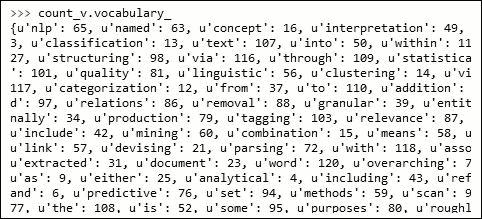

这个字典可以使用`vocabulary_`属性来检索。这是一个术语图，用于显示索引。我们也可以使用下面的函数来获得单词(特征)列表:

```
>>> count_v.get_feature_names()
```

现在让我们继续看一下`tdm`，它是我们在使用 CountVectorizer 转换给定输入后接收到的对象:

```
>>> type(tdm)
<class 'scipy.sparse.csr.csr_matrix'>
>>>
```

如你所见，tdm 是一个稀疏矩阵对象。参考以下链接，了解更多关于稀疏矩阵表示的信息:

[http://docs . scipy . org/doc/scipy-0 . 14 . 0/reference/generated/scipy . sparse . CSR _ matrix . html](http://docs.scipy.org/doc/scipy-0.14.0/reference/generated/scipy.sparse.csr_matrix.html)

我们可以观察这个物体的形状，也可以检查一些元素，如下所示:

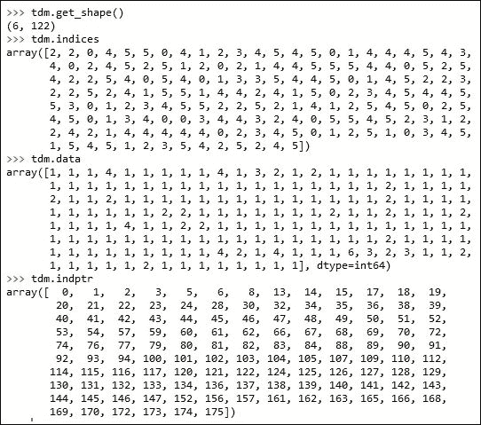

我们可以看到矩阵的形状是 6 X 122。我们有六个文档，即上下文中的句子和构成词汇表的 122 个单词。注意，这是一个稀疏矩阵表示；因为所有的句子不会包含所有的单词，所以许多单元格值将包含零条目，因此，我们将只打印包含非零条目的索引。

从`tdm.indptr`中，我们知道文档 1 的条目在`tdm.data`和`tdm.indices`数组中从`0`开始，到 18 结束，如下所示:

```
>>> tdm.data[0:17]
array([4, 2, 1, 1, 3, 1, 1, 1, 1, 1, 1, 1, 1, 1, 1, 1, 1], dtype=int64)
>>> tdm.indices[0:17]
array([107,  60,   2,  83, 110,   9,  17,  90,  28,   5,  84, 108,  77,
        67,  20,  40,  81])
>>>
```

我们可以通过以下方式验证这一点:

```
>>> count_v.get_feature_names()[107]
u'text'
>>> count_v.get_feature_names()[60]
u'mining'
```

我们可以看到`107`对应的单词 text 在第一句中出现了四次，同样的，mining 也出现了一次。因此，在这个菜谱中，我们将给定的文本转换成一个特征向量，其中的特征是单词。


## 还有更多……

为了将文本转换成特征向量,`CountVectorizer`类提供了许多其他特性。让我们来看看其中的一些:

```
>>> count_v.get_params()
{'binary': False, 'lowercase': True, 'stop_words': None, 'vocabulary': None, 'tokenizer': None, 'decode_error': u'strict', 'dtype': <type 'numpy.int64'>, 'charset_error': None, 'charset': None, 'analyzer': u'word', 'encoding': u'utf-8', 'ngram_range': (1, 1), 'max_df': 1.0, 'min_df': 1, 'max_features': None, 'input': u'content', 'strip_accents': None, 'token_pattern': u'(?u)\\b\\w\\w+\\b', 'preprocessor': None}
>>>	
```

第一个是二进制，设置为`False`；我们也可以将其设置为`True`。然后，最终的矩阵将不具有计数，但是将具有 1 或 0，这取决于该单词在文档中的存在或不存在。

小写默认设置为`True`；在执行单词到特征索引的映射之前，输入文本被转换成小写。

在创建单词到特征索引的映射时，我们可以通过提供停用单词列表来忽略一些单词。观察下面的例子:

```
from nltk.corpus import stopwords
stop_words = stopwords.words('english')

count_v = CountVectorizer(stop_words=stop_words)
sw_tdm = count_v.fit_transform(sentences)
```

如果我们打印已经建立的词汇表的大小，我们可以看到以下内容:

```
>>> len(count_v_sw.vocabulary_)
106
>>>
```

我们可以看到，我们现在有 106 个，而以前有 122 个。

我们也可以给`CountVectorizer`一套固定的词汇。最终的稀疏矩阵列将仅来自这些固定集合，不在该集合中的任何内容都将被忽略。

下一个有趣的参数是 ngram 范围。可以看到已经传递了一个元组(1，1)。这确保了在创建特征集时只使用一个单词。例如，这可以更改为(1，2)，它告诉`CountVectorizer`创建一元模型和二元模型。让我们看看下面的代码和输出:

```
count_v_ngram = CountVectorizer(stop_words=stop_words,ngram_range=(1,2))
ngram_tdm = count_v.fit_transform(sentences)
```

一元模型和二元模型现在都是我们特性集的一部分。

我将让您探索其他参数。这些参数的文档可从以下链接获得:

[http://sci kit-learn . org/stable/modules/generated/sk learn . feature _ extraction . text . count vectorizer . html](http://scikit-learn.org/stable/modules/generated/sklearn.feature_extraction.text.CountVectorizer.html)


## 参见

*   *使用字典*菜谱[第一章](part0015_split_000.html#E9OE1-6b04b7c0b98f44a0b8f82924fef317ec "Chapter 1. Python for Data Science")，*使用 Python 进行数据科学*
*   *去除停用词，词干化，词的词条化[第三章](part0043_split_000.html#190861-6b04b7c0b98f44a0b8f82924fef317ec "Chapter 3. Data Analysis – Explore and Wrangle")中的*配方，*分析数据-探索&争论*


# 计算术语频率和逆文档频率

在这里，我们将学习如何计算词频和逆文档频率。


## 准备就绪

出现次数和计数是很好的特征值，但是它们会遇到一些问题。假设我们有四个长度不等的文档。这将给予较长文档中的术语比较短文档中的术语更高的权重。因此，我们将对其进行规范化，而不是使用普通的普通事件；我们将一个单词在文档中出现的次数除以文档中的总单词数。这个度量被称为术语频率。词频也不是没有问题。有些词会出现在很多文档中。这些单词将支配特征向量，但是它们的信息量不足以区分语料库中的文档。在我们研究可以避免这个问题的新指标之前，让我们定义一下文档频率。与词频类似，词频是相对于文档的局部，我们可以计算一个称为文档频率的分数，它是该词在语料库中出现的文档数量除以语料库中的文档总数。

我们将为单词使用的最后一个度量标准是术语频率和文档频率倒数的乘积。这称为 TFIDF 得分。


## 怎么做……

加载必要的库，并声明将用于演示术语频率和反向文档频率的输入数据:

```
# Load Libraries
from nltk.tokenize import sent_tokenize
from nltk.corpus import stopwords
from sklearn.feature_extraction.text import TfidfTransformer
from sklearn.feature_extraction.text import CountVectorizer

# 1.	We create an input document as in the previous recipe.

text = "Text mining, also referred to as text data mining, roughly equivalent to text analytics,\
refers to the process of deriving high-quality information from text. High-quality information is \
typically derived through the devising of patterns and trends through means such as statistical \
pattern learning. Text mining usually involves the process of structuring the input text \
(usually parsing, along with the addition of some derived linguistic features and the removal \
of others, and subsequent insertion into a database), deriving patterns within the structured data, \
and finally evaluation and interpretation of the output. 'High quality' in text mining usually \
refers to some combination of relevance, novelty, and interestingness. Typical text mining tasks \
include text categorization, text clustering, concept/entity extraction, production of granular \
taxonomies, sentiment analysis, document summarization, and entity relation modeling \
(i.e., learning relations between named entities).Text analysis involves information retrieval, \
lexical analysis to study word frequency distributions, pattern recognition, tagging/annotation, \
information extraction, data mining techniques including link and association analysis, \
visualization, and predictive analytics. The overarching goal is, essentially, to turn text \
into data for analysis, via application of natural language processing (NLP) and analytical \
methods.A typical application is to scan a set of documents written in a natural language and \
either model the document set for predictive classification purposes or populate a database \
or search index with the information extracted."
```

让我们看看如何求词频和逆文档的词频:

```
# 2.	Let us extract the sentences.
sentences = sent_tokenize(text)

# 3.	Create a matrix of term document frequency.
stop_words = stopwords.words('english')

count_v = CountVectorizer(stop_words=stop_words)
tdm = count_v.fit_transform(sentences)

#4.	Calcuate the TFIDF score.
tfidf = TfidfTransformer()
tdm_tfidf = tfidf.fit_transform(tdm)
```


## 它是如何工作的……

步骤 1、2 和 3 与前一个配方相同。让我们看看步骤 4，我们将传递步骤 3 的输出，以便计算 TFIDF 分数:

```
>>> type(tdm)
<class 'scipy.sparse.csr.csr_matrix'>
>>>
```

Tdm 是一个稀疏矩阵。现在，让我们使用索引、数据和索引指针来查看这些矩阵的值:

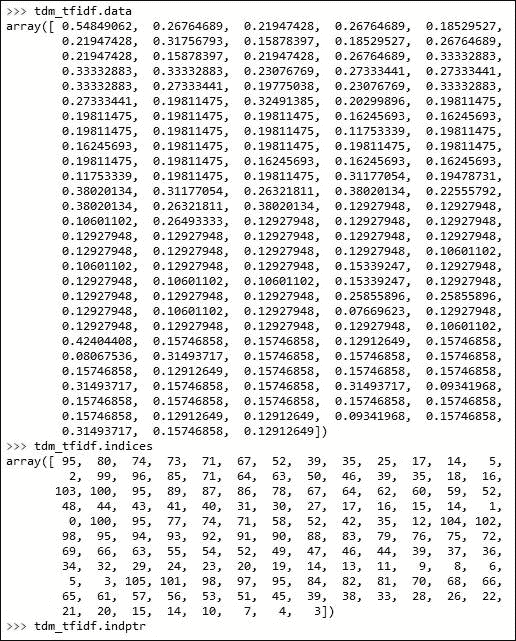

数据显示了值，我们没有出现的次数，但是有单词的标准化 TFIDF 分数。


## 还有更多……

同样，我们可以通过查看可以传递的参数来更深入地研究 TFIDF 转换器:

```
>>> tfidf.get_params()
{'use_idf': True, 'smooth_idf': True, 'sublinear_tf': False, 'norm': u'l2'}
>>>
```

这方面的文档可从[http://sci kit-learn . org/stable/modules/generated/sk learn . feature _ extraction . text . tfidftransformer . html](http://scikit-learn.org/stable/modules/generated/sklearn.feature_extraction.text.TfidfTransformer.html)获得。