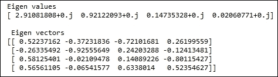
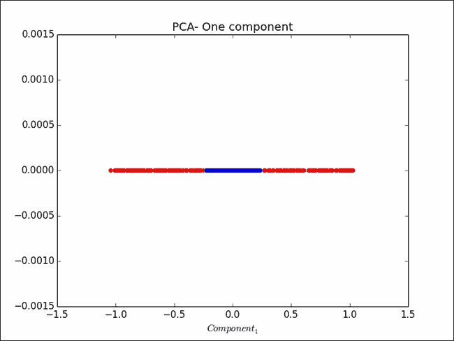
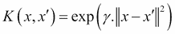
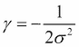
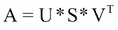
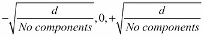
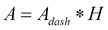
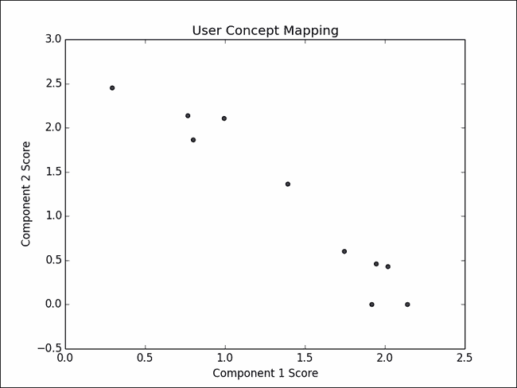
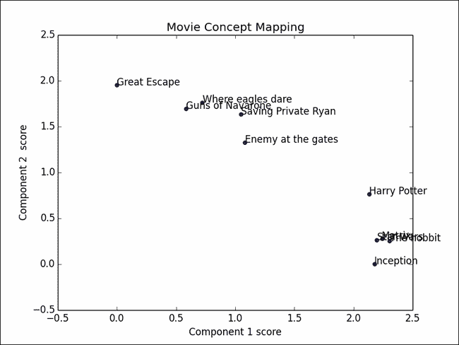
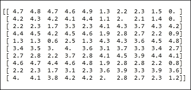

# 四、数据分析——深度挖掘

在本章中，我们将讨论以下主题:

*   提取主成分
*   使用内核 PCA
*   利用奇异值分解提取特征
*   利用随机投影降低数据维数
*   使用 **NMF** ( **非负矩阵分解**)分解特征矩阵


# 简介

在这一章中，我们将看看处理降维的方法。在前一章中，我们看了如何浏览数据，了解其特征，以便有意义地使用它。我们的讨论仅限于二元数据。想象一个有数百列的数据集；我们如何继续分析如此大规模数据集的数据特征？当我们处理数据时，我们需要有效的工具来处理这个障碍。

如今，高维数据无处不在。考虑为一个中等规模的电子商务网站建立一个产品推荐引擎。即使有几千种产品，要考虑的变量数量也非常多。生物信息学是另一个拥有非常高维数据的领域。基因表达微阵列数据集可以包含数万个维度。

如果你手头的任务是探索数据或者为算法准备数据，那么通常被称为*维数灾难*的高维度是一个很大的障碍。我们需要有效的方法来处理这个问题。此外，许多现有数据挖掘算法的复杂性随着维度数量的增加而呈指数增长。随着维数的增加，算法在计算上变得不可行，因此在许多应用中不适用。

维度缩减技术在减少维度数量的同时，尽可能地保留数据的结构。因此，在减少的特征空间中，算法的执行时间减少，因为我们具有更低的维度。由于保留了数据的结构，所获得的结果可以是原始数据空间的可靠近似。通过保留结构，我们意味着两件事；第一是不篡改原始数据集中的变化，第二是在新的投影空间中保持数据向量之间的距离。


## 矩阵分解:

矩阵分解产生了几种降维技术。我们的数据通常是一个矩阵，实例在行，特征在列。在前面的配方中，我们一直将数据存储为 NumPy 矩阵。例如，在虹膜数据集中，我们的元组或数据实例被表示为行，而包括萼片和花瓣宽度和长度的特征是矩阵的列。

矩阵分解是一种表达矩阵的方式。假设 A 是另外两个矩阵 B 和 c 的乘积。矩阵 B 应该包含可以解释数据变化方向的向量。矩阵 C 应该包含这种变化的幅度。因此，我们的原始矩阵 A 现在被表示为 B 和 c 的线性组合。

我们将在接下来的章节中看到的技术利用矩阵分解来处理降维。有一些方法坚持基本向量必须相互正交，如主成分分析，也有一些方法不坚持这一要求，如字典学习。

让我们系好安全带，看看这一章中的一些技巧。


# 提取主成分

我们要看的第一种技术是**主成分分析** ( **PCA** )。PCA 是一种无监督方法。在多元问题中，PCA 用于以最小的信息损失降低数据的维度，换句话说，保留数据中的最大变化。我们所说的变化是指数据最大程度分散的方向。我们来看下面这个情节:


我们有一个两个变量的散点图， *x1* 和 *x2* 。对角线表示最大变化。通过使用主成分分析，我们的目的是捕捉这个方向的变化。因此，不是使用两个变量 *x1* 和 *x2* 的方向来表示这些数据，而是寻找一个由蓝线表示的向量，并用这个向量来表示数据。本质上，我们希望将数据的维度从二维减少到一维。

我们将利用数学工具特征值和特征向量来找到这条蓝线向量。

我们在前一章中已经看到，方差衡量的是数据的离差或扩散程度。我们看到的是一维的例子。在一维以上的情况下，很容易将变量之间的相关性表示为一个矩阵，称为协方差矩阵。当协方差矩阵的值被标准偏差归一化时，我们得到一个相关矩阵。在我们的例子中，协方差矩阵是两个变量的 2 X 2 矩阵， *x1* 和 *x2* ，它测量这两个变量在多大程度上同向移动或者通常一起变化。

当我们进行特征值分解，也就是得到协方差矩阵的特征向量和特征值时，主特征向量，也就是特征值最大的向量，是在原始数据中方差最大的方向。

在我们的例子中，这应该是图中蓝线代表的向量。然后，我们将继续将输入数据投影到这条蓝线向量中，以获得缩减的维度。

### 注意

对于具有 n 个实例和 m 个维度的数据集(n×m ), PCA 将其投影到更小的子空间(n×d ),其中 d << m

需要注意的一点是，PCA 在计算上非常昂贵。

PCA 可以在协方差和相关矩阵上执行。请记住，当在 PCA 中使用具有非均匀缩放数据集的数据集的协方差矩阵时，结果可能不是很有用。好奇的读者可以参考 Bernard Flury 所著的《多元统计初级教程》一书，其主题是使用相关或协方差矩阵进行 PCA。

[http://www.springer.com/us/book/9780387982069](http://www.springer.com/us/book/9780387982069)。


## 准备就绪

让我们使用 Iris 数据集来了解如何有效地使用 PCA 来降低数据集的维数。Iris 数据集包含来自三个不同物种的 150 朵鸢尾花的测量值。

Iris 数据集中的三个类如下:

*   伊里斯·濑户沙
*   杂色鸢尾
*   海滨鸢尾

以下是虹膜数据集中的四个特征:

*   萼片长度，单位为厘米
*   萼片宽度，单位为厘米
*   以厘米为单位的花瓣长度
*   以厘米为单位的花瓣宽度

我们可以用两列而不是四列来表达数据中的大部分变化吗？我们的目标是降低数据的维数。在这种情况下，我们的实例有四列。假设我们正在构建一个分类器，用一个新的实例来预测花的类型；我们可以使用降维空间中的实例来完成这项任务吗？我们能否将列的数量从四列减少到两列，同时仍然实现分类器的良好精度？

使用以下步骤完成 PCA:

1.  标准化数据集，使其平均值为零。
2.  找出数据集和单位标准偏差值的相关矩阵。
3.  将相关矩阵矩阵化简为其特征向量和值。
4.  根据按降序排序的特征值选择顶部相邻向量。
5.  将输入特征向量矩阵投影到新的子空间中。


## 怎么做……

让我们加载必要的库并调用 scikit 中的实用函数`load_iris`——学习获取虹膜数据集:

```py
import numpy as np
from sklearn.datasets import load_iris
from sklearn.preprocessing import scale
import scipy
import matplotlib.pyplot as plt

# Load Iris data
data = load_iris()
x = data['data']
y = data['target']

# Since PCA is an unsupervised method, we will not be using the target variable y
# scale the data such that mean = 0 and standard deviation = 1
x_s = scale(x,with_mean=True,with_std=True,axis=0)

# Calculate correlation matrix
x_c = np.corrcoef(x_s.T)

# Find eigen value and eigen vector from correlation matrix
eig_val,r_eig_vec = scipy.linalg.eig(x_c)
print 'Eigen values \n%s'%(eig_val)
print '\n Eigen vectors \n%s'%(r_eig_vec)

# Select the first two eigen vectors.
w = r_eig_vec[:,0:2]

# # Project the dataset in to the dimension
# from 4 dimension to 2 using the right eignen vector
x_rd = x_s.dot(w)

# Scatter plot the new two dimensions
plt.figure(1)
plt.scatter(x_rd[:,0],x_rd[:,1],c=y)
plt.xlabel("Component 1")
plt.ylabel("Component 2")
```

现在，我们将对这些数据进行标准化，均值为零，标准差为 1，我们将利用`numpyscorr_coef`函数找到相关矩阵:

```py
x_s = scale(x,with_mean=True,with_std=True,axis=0)
x_c = np.corrcoef(x_s.T)
```

然后，我们将进行特征值分解，并将虹膜数据投影到前两个主特征向量上。最后，我们将在缩减的空间中绘制数据集:

```py
eig_val,r_eig_vec = scipy.linalg.eig(x_c)
print 'Eigen values \n%s'%(eig_val)
print '\n Eigen vectors \n%s'%(r_eig_vec)
# Select the first two eigen vectors.
w = r_eig_vec[:,0:2]

# # Project the dataset in to the dimension
# from 4 dimension to 2 using the right eignen vector
x_rd = x_s.dot(w)

# Scatter plot the new two dimensions
plt.figure(1)
plt.scatter(x_rd[:,0],x_rd[:,1],c=y)
plt.xlabel("Component 1")
plt.ylabel("Component 2")
```

使用功能标度。缩放功能可以执行居中、缩放和标准化。居中是从单个值中减去平均值，缩放是将每个值除以变量的标准偏差，最后标准化是执行居中，然后缩放。使用变量 with_mean 和 with_std 函数 scale 可用于执行所有三种归一化技术。


## 它是如何工作的……

Iris 数据集有四列。虽然专栏不多，但也能达到我们的目的。我们打算将虹膜数据集的维度从四个减少到两个，并且仍然保留关于数据的所有信息。

我们将使用 scikit-learn 中方便的`load_iris` 函数将虹膜数据加载到`x`和`y` 变量中。`x` 变量是我们的数据矩阵，我们可以按如下方式检查它的形状:

```py
>>>x.shape
(150, 4)
>>>
```

我们将对数据矩阵`x`进行缩放，使其具有零均值和单位标准偏差。经验法则是，如果数据中的所有列都以相同的比例度量，并且具有相同的度量单位，则不必缩放数据。这将允许 PCA 捕捉这些具有最大变化的基本单元:

```py
x_s = scale(x,with_mean=True,with_std=True,axis=0)
```

我们将继续构建输入数据的相关矩阵:

*n 个随机变量的相关矩阵 X1、...，Xn 是 then × n 矩阵 whosei，jentry 是 corr (Xi，Xj)，维基百科。*

然后我们将使用 SciPy 库来计算矩阵的特征值和特征向量。让我们看看我们的特征值和特征向量:

```py
print Eigen values \n%s%(eig_val)
print \n Eigen vectors \n%s%(r_eig_vec)
```

输出如下所示:



在我们的例子中，特征值按降序打印。一个关键问题是我们应该选择多少组件？在下一节中，我们将解释几种选择组件数量的方法。

你可以看到我们只选择了右边特征向量的前两列。保留成分对`y`变量的辨别能力是对数据中保留了多少信息或变化的一个很好的测试。

我们将把数据投影到新的降维维度上。

最后，我们将在`x`和`y`轴上绘制组件，并通过目标变量对其进行着色:


你可以看到组件`1`和`2`能够区分三类鸢尾花。因此，我们有效地使用 PCA 将维数从四个减少到两个，并且仍然能够区分属于不同种类的鸢尾花的实例。


## 还有更多……

在前面的部分，我们说过我们将概述几种方法来帮助我们选择应该包括多少组件。在我们的食谱中，我们只包括两种。以下是根据经验选择元件的一系列方法:

1.  The Eigenvalue criterion:

    一个特征值意味着这个分量可以解释一个变量的可变性。因此，根据这个标准，一个组件至少应该解释一个变量的可变性。我们可以说，我们将只包括那些值大于或等于 1 的特征值。根据您的数据集，您可以设置阈值。在非常大的维度数据集中，包括只能解释一个变量的成分可能不是非常有用。

2.  The proportion of the variance explained criterion:

    让我们运行下面的代码:

    ```py
    print "Component, Eigen Value, % of Variance, Cummulative %"
    cum_per = 0
    per_var = 0
    for i,e_val in enumerate(eig_val):
        per_var = round((e_val / len(eig_val)),3)
        cum_per+=per_var
    print ('%d, %0.2f, %0.2f, %0.2f')%(i+1, e_val, per_var*100,cum_per*100)
    ```

3.  The output is as follows:

对于每个组成部分，我们打印了特征值、该组成部分解释的方差的百分比以及解释的方差的累积百分比值。例如，分量`1`的特征值为`2.91`；`2.91/4`给出解释方差的百分比，为 72.80%。现在，如果我们包括前两个部分，那么我们可以解释数据中 95.80%的方差。

将相关矩阵分解成其特征向量和值是可以应用于任何矩阵的通用技术。在这种情况下，我们将把它应用于相关矩阵，以便理解数据分布的主轴，也就是说，通过这些轴可以观察到数据的最大变化。

PCA 既可以用作探索技术，也可以用作下游算法的数据准备技术。文档分类数据集问题通常具有非常大的维度特征向量。PCA 可用于降低数据集的维度，以便在将数据输入分类算法之前，仅包含最相关的特征。

这里值得一提的 PCA 的一个缺点是它是计算量很大的运算。最后一点是关于 numpy 的 corrcoeff 函数。corrcoeff 函数将在内部标准化您的数据，作为其计算的一部分。但是因为我们想明确说明结垢的原因，所以我们把它包括在我们的配方中。

### Tip

**核证后活动什么时候起作用？**

输入数据集应该具有相关列，PCA 才能有效工作。没有输入变量的相关性，主成分分析无法帮助我们。


## 参见

*   *执行奇异值分解*配方[第四章](part0060_split_000.html#1P71O1-6b04b7c0b98f44a0b8f82924fef317ec "Chapter 4. Data Analysis – Deep Dive")、*分析数据-深潜*


# 使用内核 PCA

PCA 做出一个假设，数据中所有主要的变化方向都是直线。这在许多真实世界的数据集中是不正确的。

### 注意

PCA 仅限于那些数据变化呈直线的变量。换句话说，它只适用于可线性分离的数据。

在这一节中，我们将看看核主成分分析，它将帮助我们降低数据集的维度，其中变量不是直线。我们将显式地创建这样一个数据集，并在其上应用内核 PCA。

在核 PCA 中，核函数被应用于所有的数据点。这将输入数据转换到内核空间。在内核空间中执行正常的 PCA。


## 准备就绪

这里我们将不使用 Iris 数据集，但将生成一个变化不是直线的数据集。这样，我们不能在这个数据集上应用简单的 PCA。让我们来看看我们的食谱。


## 怎么做……

让我们加载必要的库。我们将继续使用 scikit-learn 库中的`make_circles`函数创建一个数据集。我们将绘制该数据，并对该数据集进行常规 PCA:

```py
from sklearn.datasets import make_circles
import matplotlib.pyplot as plt
import numpy as np
from sklearn.decomposition import PCA
from sklearn.decomposition import KernelPCA

# Generate a dataset where the variations cannot be captured by a straight line.
np.random.seed(0)
x,y = make_circles(n_samples=400, factor=.2,noise=0.02)

# Plot the generated dataset
plt.close('all')
plt.figure(1)
plt.title("Original Space")
plt.scatter(x[:,0],x[:,1],c=y)
plt.xlabel("$x_1$")
plt.ylabel("$x_2$")

# Try to fit the data using normal PCA
pca = PCA(n_components=2)
pca.fit(x)
x_pca = pca.transform(x)
```

然后，我们将绘制该数据集的前两个主要组成部分。我们将仅使用第一个主成分绘制数据集:

```py
plt.figure(2)
plt.title("PCA")
plt.scatter(x_pca[:,0],x_pca[:,1],c=y)
plt.xlabel("$Component_1$")
plt.ylabel("$Component_2$")

# Plot using the first component from normal pca
class_1_indx = np.where(y==0)[0]
class_2_indx = np.where(y==1)[0]

plt.figure(3)
plt.title("PCA- One component")
plt.scatter(x_pca[class_1_indx,0],np.zeros(len(class_1_indx)),color='red')
plt.scatter(x_pca[class_2_indx,0],np.zeros(len(class_2_indx)),color='blue')
```

让我们通过执行核心 PCA 并绘制组件来完成:

```py
# Create  KernelPCA object in Scikit learn, specifying a type of kernel as a parameter.
kpca = KernelPCA(kernel="rbf",gamma=10)
# Perform KernelPCA
kpca.fit(x)
x_kpca = kpca.transform(x)

# Plot the first two components.
plt.figure(4)
plt.title("Kernel PCA")
plt.scatter(x_kpca[:,0],x_kpca[:,1],c=y)
plt.xlabel("$Component_1$")
plt.ylabel("$Component_2$")
plt.show()
```


## 它是如何工作的……

在步骤 1 中，我们使用 scikit 的数据生成功能生成了一个数据集。在本例中，我们使用了`make_circles`函数。我们可以用这个函数创建两个同心圆，一个大的包含一个小的。每个同心圆都属于某个阶层。因此，我们创建了一个有两个同心圆的两类问题。

首先，让我们看看我们生成的数据。`make_circles` 函数生成了一个大小为 400 的二维数据集。原始数据的绘图如下:


这张图表描述了我们的数据是如何分布的。外圈属于一班，内圈属于二班。有没有一种方法可以将这些数据用于线性分类器？我们将无法做到这一点。数据的变化不是直线。我们不能使用普通的 PCA。因此，我们将求助于核 PCA 来转换数据。

在我们冒险进入内核 PCA 之前，让我们看看如果在这个数据集上应用普通 PCA 会发生什么。

让我们看看前两个组件的输出图:


正如你所看到的，PCA 的成分无法以线性方式区分这两个类别。

让我们画出第一个组件，看看它的类区分能力。下图仅绘制了第一个分量，解释了 PCA 无法区分数据的原因:



正常的 PCA 方法是一种线性投影技术，如果数据是线性可分的，那么这种方法工作得很好。在数据不是线性可分的情况下，需要一种非线性技术来对数据集进行降维。

### 注意

核 PCA 是一种非线性数据约简技术。

让我们继续使用 scikit-learn 库创建一个内核 PCA 对象。下面是我们的对象创建代码:

```py
KernelPCA(kernel=rbf,gamma=10) 
```

我们选择伽马值为 10 的**径向基函数** ( **RBF** )核。伽马是内核的参数(用于处理非线性)——内核系数。

在我们继续深入之前，让我们先来看一点关于内核到底是什么的理论。作为一个简单的定义，内核是一个计算点积的函数，即两个向量之间的相似性，它作为输入传递给它。

对于某个输入空间中的两个点， *x* 和*x’*，径向基高斯核定义如下:



在哪里，



径向基函数随着距离的增加而减小，取 0 到 1 之间的值。因此，它可以被解释为相似性度量。RBF 核的特征空间有无限维——维基百科。

此可在以下网址找到:

[http://en.wikipedia.org/wiki/Radial_basis_function_kernel](http://en.wikipedia.org/wiki/Radial_basis_function_kernel)。

现在让我们将输入从特征空间转换到内核空间。我们将在内核空间执行 PCA。

最后，我们将把前两个主成分绘制成散点图。这些点根据它们的类值进行着色:


你可以在这个图中看到这些点在内核空间中是线性分离的。


## 还有更多……

Scikit-learn 的内核 PCA 对象也允许其他类型的内核，如下所示:

*   线性的
*   多项式
*   乙状结肠的
*   余弦
*   预先计算的

Scikit-learn 还提供生成的其他类型的非线性数据。下面是另一个例子:

```py
from sklearn.datasets import make_moons
x,y = make_moons(100)
plt.figure(5)
plt.title("Non Linear Data")
plt.scatter(x[:,0],x[:,1],c=y)
plt.xlabel("$x_1$")
plt.ylabel("$x_2$")
plt.savefig('fig-7.png')
plt.show()
```

数据图如下所示:


# 使用奇异值分解提取特征

在我们讨论了 PCA 和核 PCA 之后，我们可以用下面的方式来解释降维:

*   你可以把相关变量转换成一组非相关变量。这样，我们将有一个更少的维度来解释底层数据中的关系，而不会丢失任何信息。
*   你可以找出主轴，它记录了最多的数据变化。

**奇异值分解** ( **SVD** )是另一种矩阵分解技术，可以用来解决维数灾难问题。它可用于使用较少的维度找到原始数据的最佳近似值。与 PCA 不同，SVD 在原始数据矩阵上工作。

### 注意

SVD 不需要协方差或相关矩阵。它在原始数据矩阵上工作。

奇异值分解将矩阵`m`x`n`T2 分解为三个矩阵的乘积:



这里，U 是一个`m` x `k`矩阵，V 是一个`n` x `k`矩阵，S 是一个`k` x `k`矩阵。U 的列称为左奇异向量，V 的列称为右奇异向量。

S 矩阵对角线上的值称为奇异值。


## 准备就绪

在这个练习中，我们将使用 Iris 数据集。我们手头的任务是将数据集的维度从四个减少到两个。


## 怎么做……

让我们加载必要的库并获取 Iris 数据集:

```py
from sklearn.datasets import load_iris
import matplotlib.pyplot as plt
import numpy as np
from sklearn.preprocessing import scale
from scipy.linalg import svd

# Load Iris dataset
data = load_iris()
x = data['data']
y = data['target']

# Proceed by scaling the x variable w.r.t its mean,
x_s = scale(x,with_mean=True,with_std=False,axis=0)

# Decompose the matrix using SVD technique.We will use SVD implementation in scipy.
U,S,V = svd(x_s,full_matrices=False)

# Approximate the original matrix by selecting only the first two singular values.
x_t = U[:,:2]

# Finally we plot the datasets with the reduced components.
plt.figure(1)
plt.scatter(x_t[:,0],x_t[:,1],c=y)
plt.xlabel("Component 1")
plt.ylabel("Component 2")
plt.show()
```

现在，我们将演示如何对 Iris 数据集执行 SVD 操作:

```py
# Proceed by scaling the x variable w.r.t its mean,
x_s = scale(x,with_mean=True,with_std=False,axis=0)
# Decompose the matrix using SVD technique.We will use SVD implementation in scipy.
U,S,V = svd(x_s,full_matrices=False)

# Approximate the original matrix by selecting only the first two singular values.
x_t = U[:,:2]

# Finally we plot the datasets with the reduced components.
plt.figure(1)
plt.scatter(x_t[:,0],x_t[:,1],c=y)
plt.xlabel("Component 1")
plt.ylabel("Component 2")
plt.show()
```


## 它是如何工作的……

Iris 数据集有四列。虽然专栏不多，但也能达到我们的目的。我们打算将虹膜数据集的维度从四个减少到两个，并且仍然保留关于数据的所有信息。

我们将使用 scikit-learn 中方便的`load_iris` 函数将虹膜数据加载到`x`和`y` 变量中。`x` 变量是我们的数据矩阵；我们可以用以下方式检查它的形状:

```py
>>>x.shape
(150, 4)
>>>
```

我们使用数据矩阵`x`的平均值将其居中。经验法则是，如果所有列都以相同的比例度量，并且在数据中具有相同的度量单位，则不必缩放数据。这将允许 PCA 捕捉这些具有最大变化的基本单位。请注意，我们在调用函数 scale 时仅使用了平均值:

```py
x_s = scale(x,with_mean=True,with_std=False,axis=0)
```

1.  对缩放后的输入数据集运行 SVD 方法。
2.  选择顶部的两个单个组件。该矩阵是原始输入数据的简化近似值。
3.  Finally, plot the columns and color it by the class value:


## 还有更多……

SVD 是一种双模式因子分析，我们从具有两种类型实体的任意矩形矩阵开始。这与我们之前的配方不同，我们之前看到的 PCA 将相关矩阵作为输入。PCA 是一种单模因子分析，因为输入方阵中的行和列代表相同的实体。

在文本挖掘应用程序中，输入通常表示为一个**术语-文档矩阵** ( **TDM** )。在 TDM 中，行对应于单词，列是文档。单元格条目填充有术语频率或**术语频率逆文档频率** ( **TFIDF** )得分。它是一个具有两个实体的矩形矩阵:单词和文档出现在矩阵的行和列中。

SVD 广泛用于文本挖掘应用中，以揭示单词和文档、文档和文档、单词和单词之间的隐藏关系(语义关系)。

通过在术语-文档矩阵上应用 SVD，我们将其转换到一个新的语义空间，其中在同一文档中没有一起出现的单词在新的语义空间中仍然是接近的。SVD 的目标是找到一种有用的方法来建模单词和文档之间的关系。应用 SVD 后，每个文档和单词都可以表示为因子值的向量。我们可以选择忽略值非常低的分量，从而避免底层数据集中的噪声。这导致我们的文本语料库的近似表示。这叫做**潜在语义分析** ( **LSA** )。

这一思想的衍生在用于搜索和信息检索的文档索引中具有非常高的适用性。我们现在可以索引 LSA 的输出，而不是将原始单词作为倒排索引。这有助于避免同义词和多义词等问题。在同义词中，用户可能倾向于使用不同的词来表示同一个实体。普通索引容易受到这种情况的影响。因为基础文档是由常规单词索引的，所以搜索可能不会产生结果。例如，如果我们索引一些与金融工具相关的文档，通常这些词会是货币、金钱和类似的东西。货币和金钱是同义词。当用户搜索货币时，也应该向他显示与货币相关的文档。然而，使用常规索引，搜索引擎将只能检索有钱的文档。使用潜在语义索引，也将检索带有货币的文档。在潜在语义空间中，货币和金钱将彼此接近，因为它们的相邻词在文档中是相似的。

一词多义是指单词有一个以上的意思。例如，bank 可以指金融机构或河岸。与同义词相似，一词多义也可以在潜在的语义空间中处理。

有关 LSA 和潜在语义索引的更多信息，请参考 Deerwester 等人的论文:

[http://citeseerx.ist.psu.edu/viewdoc/summary?doi=10.1.1.108.8490](http://citeseerx.ist.psu.edu/viewdoc/summary?doi=10.1.1.108.8490) 。关于特征值和奇异值的比较研究，请参考 Cleve Moler 所著的《用 MATLAB 进行数值计算》一书。虽然这些例子是在 MATLAB 中，但在我们的食谱的帮助下，你可以用 Python 重做它们:

[https://in.mathworks.com/moler/eigs.pdf](https://in.mathworks.com/moler/eigs.pdf)


# 用随机投影降低数据维数

我们之前看到的降维方法计算量很大，而且不是最快的方法。随机投影是另一种比这些方法更快地执行维度缩减的方法。

随机投影归因于约翰逊-林登施特劳斯引理。根据引理，存在高维到低维欧氏空间的映射；使得点之间的距离保持在ε方差内。目标是保持数据中任意两点之间的成对距离，同时减少数据中的维数。

假设给我们一个任意欧氏空间中的`n`维数据，根据引理，我们可以把它映射到一个 k 维的欧氏空间，这样所有点之间的距离都保留到(1-ε)和(1+ε)的乘法因子。


## 准备就绪

在这个练习中，我们将使用 20 个新闻组数据([http://qwone.com/~jason/20Newsgroups/](http://qwone.com/~jason/20Newsgroups/))。

它是大约 20，000 个新闻组文档的集合，平均分布在 20 个不同的新闻类别中。Scikit-learn 提供了一个方便的函数来加载这个数据集:

```py
from sklearn.datasets import fetch_20newsgroups
data = fetch_20newsgroups(categories=cat)
```

您可以通过提供类别字符串列表来加载所有库或感兴趣的类别列表。在我们的例子中，我们将使用`sci.crypt`类别。

我们将输入文本作为一个术语-文档矩阵来加载，其中的特征是单个的单词。在这一点上，我们将应用随机投影以减少维数。我们将尝试查看文档之间的距离是否保留在缩减的空间中，以及实例是否是文档。


## 怎么做……

让我们从开始加载必要的库。使用 scikit 的实用函数`fetch20newsgroups`，我们将加载数据。我们将从所有数据中只选择`sci.crypt`类别。然后，我们将把文本数据转换成向量表示:

```py
from sklearn.datasets import fetch_20newsgroups
from sklearn.feature_extraction.text import TfidfVectorizer
from sklearn.metrics import euclidean_distances
from sklearn.random_projection import GaussianRandomProjection
import matplotlib.pyplot as plt
import numpy as np

# Load 20 newsgroup dataset
# We select only sci.crypt category
# Other categories include
# 'sci.med', 'sci.space' ,'soc.religion.christian'
cat =['sci.crypt']
data = fetch_20newsgroups(categories=cat)

# Create a term document matrix, with term frequencies as the values
# from the above dataset.
vectorizer = TfidfVectorizer(use_idf=False)
vector = vectorizer.fit_transform(data.data)

# Perform the projection. In this case we reduce the dimension to 1000
gauss_proj = GaussianRandomProjection(n_components=1000)
gauss_proj.fit(vector)
# Transform the original data to the new space
vector_t = gauss_proj.transform(vector)

# print transformed vector shape
print vector.shape
print vector_t.shape

# To validate if the transformation has preserved the distance, we calculate the old and the new distance between the points
org_dist = euclidean_distances(vector)
red_dist = euclidean_distances(vector_t)

diff_dist = abs(org_dist - red_dist)

# We take the difference between these points and plot them 
# as a heatmap (only the first 100 documents).
plt.figure()
plt.pcolor(diff_dist[0:100,0:100])
plt.colorbar()
plt.show()
```

现在让我们来演示随机投影的概念。


## 它是如何工作的……

加载新闻组数据集后，我们将通过`TfidfVectorizer(use_idf=False)`将其转换为矩阵。

请注意，我们已经将`use_idf`设置为`False`。这创建了我们的输入矩阵，其中行是文档，列是单个单词，单元格值是字数。

如果我们使用`print vector.shape`命令打印我们的向量，我们将得到如下输出:

```py
(595, 16115)
```

可以看到我们的输入矩阵有 595 个文档，16115 个单词；每个单词都是一个特征，因此也是一个维度。

我们将使用密集高斯矩阵对数据进行投影。高斯随机矩阵是通过从正态分布`N` (0，1/组件数)中采样元素生成的。在我们的例子中，组件的数量是 1000。我们的目的是将维度从 16115 减少到 1000。然后，我们将打印原始尺寸和缩减尺寸，以验证尺寸的缩减。

最后，我们希望验证在预测后是否保持了数据特征。我们将计算向量之间的欧几里得距离。我们将记录原始空间和投影空间中的距离。我们将在第 7 步中获取它们之间的差异，并将差异绘制成热图:


如您所见，梯度在 0.000 到 0.105 的范围内，表示原始空间和缩减空间中向量的距离差异。原始空间和投影空间之间的距离差异非常小。


## 还有更多……

有很多关于随机预测的参考资料。这是一个非常活跃的研究领域。感兴趣的读者可以参考以下论文:

随机投影实验:

[http://dl.acm.org/citation.cfm?id=719759](http://dl.acm.org/citation.cfm?id=719759)

机器学习的随机投影实验；

[http://citeseerx.ist.psu.edu/viewdoc/summary?doi=10.1.1.13.9205](http://citeseerx.ist.psu.edu/viewdoc/summary?doi=10.1.1.13.9205)

在我们的配方中，我们使用了高斯随机投影，其中高斯随机矩阵是通过从正态分布 N(0，1/1000)进行采样而生成的，其中 1000 是所需的缩减空间的维数。

但是，拥有密集矩阵会在处理时产生严重的内存相关问题。为了避免这一点，Achlioptas 提出了稀疏随机投影。不是从标准的正态分布中选择，而是从概率为`{1/6,2/3,1/6}`的{-1.0，1}中挑选条目。如您所见，0 的概率是三分之二，因此，结果矩阵将是稀疏的。用户可以参考 Achlioptas 在 *Dimitris Achlioptas* 、*数据库友好的随机预测:Johnson-Lindenstrauss 与二进制硬币的开创性论文。计算机和系统科学杂志，66(4):671–687，2003。*

scikit 实现允许用户选择最终矩阵的密度。假设我们将密度指定为 d，s 指定为 1/d，那么矩阵的元素从以下等式中选取:



以下面的概率:


## 参见

*   *使用内核 PCA* 配方[第四章](part0060_split_000.html#1P71O1-6b04b7c0b98f44a0b8f82924fef317ec "Chapter 4. Data Analysis – Deep Dive")，*分析数据——深潜*


# 使用非负矩阵分解分解特征矩阵

我们从数据维度缩减的角度讨论了所有之前的矩阵分解方案。让我们从协同过滤的角度来讨论这个食谱，让它变得更有趣。虽然数据降维是我们所追求的，但是**非负矩阵分解** ( **NMF** )在使用协同过滤算法的推荐系统中被广泛使用。

假设我们的输入矩阵 A 的维数为`m x n`。NMF 将输入矩阵分解成两个矩阵，`A_dash`和`H`:



假设说我们想把 A 矩阵的维数降到 d，也就是我们想把原来的 m×n 矩阵分解成 m×d，其中 d<n

`A_dash`矩阵的大小为 m×d，而`H`矩阵的大小为 d×m。NMF 将其作为优化问题来解决，即最小化函数:


著名的网飞挑战是用 NMF 解决的。请参考以下链接:

Gábor Takács 等人(2008 年)。网飞奖问题的矩阵分解和基于邻域的算法。摘自:2008 年 ACM 推荐系统会议论文集，瑞士洛桑，10 月 23 - 25 日，267-274:

[http://dl.acm.org/citation.cfm?id=1454049](http://dl.acm.org/citation.cfm?id=1454049)


## 准备就绪

为了解释 NMF，让我们创建一个玩具推荐问题。在一个典型的推荐系统中，如 MovieLens 或网飞，有一组用户和一组项目(电影)。如果每个用户都评价了几部电影，我们希望预测他们对没有评价的电影的评价。我们将假设用户没有看过他们没有评级的电影。我们的预测算法输出的是这些电影的收视率。然后，我们可以向这些用户推荐预测引擎评分非常高的电影。

我们的玩具问题设定如下:我们有以下电影:

| 

电影 ID

 | 

电影名称

 |
| --- | --- |
| one | 星球大战 |
| Two | 黑客帝国 |
| three | 开始 |
| four | Harry Potter |
| five | 霍比特人 |
| six | 纳瓦隆之枪 |
| seven | 拯救大兵瑞恩 |
| eight | 兵临城下 |
| nine | 老鹰敢去的地方 |
| Ten | 大逃亡 |

我们有十部电影，每部都有一个电影 ID。我们还有 10 位用户对这些电影的评价如下:

|   | 

电影 ID

 |
| --- | --- |
| **用户 ID** | one | Two | three | four | five | six | seven | eight | nine | Ten |
| one | Five | Five | Four point five | Four point five | Five | Three | Two | Two | Zero | Zero |
| Two | Four point two | Four point seven | Five | Three point seven | Three point five | Zero | Two point seven | Two | One point nine | Zero |
| three | Two point five | Zero | Three point three | Three point four | Two point two | Four point six | Four | Four point seven | Four point two | Three point six |
| four | Three point eight | Four point one | Four point six | Four point five | Four point seven | Two point two | Three point five | Three | Two point two | Zero |
| five | Two point one | Two point six | Zero | Two point one | Zero | Three point eight | Four point eight | Four point one | Four point three | Four point seven |
| six | Four point seven | Four point five | Zero | Four point four | Four point one | Three point five | Three point one | Three point four | Three point one | Two point five |
| seven | Two point eight | Two point four | Two point one | Three point three | Three point four | Three point eight | Four point four | Four point nine | Four | Four point three |
| eight | Four point five | Four point seven | Four point seven | Four point five | Four point nine | Zero | Two point nine | Two point nine | Two point five | Two point one |
| nine | Zero | Three point three | Two point nine | Three point six | Three point one | Four | Four point two | Zero | Four point five | Four point six |
| Ten | Four point one | Three point six | Three point seven | Four point six | Four | Two point six | One point nine | Three | Three point six | Zero |

为了可读性，我们将它作为一个矩阵，其中行对应于用户，列对应于电影。单元格值是从 1 到 5 的评级，其中 5 表示用户对电影的高亲和力，1 表示用户不喜欢。单元格中有 0 值表示用户没有对这些电影进行评级。在这个食谱中，我们将使用 NMF 分解矩阵。


## 怎么做……

我们将从加载必要的库开始，然后创建我们的数据集。我们将数据集存储为矩阵:

```py
import numpy as np
from collections import defaultdict
from sklearn.decomposition import NMF
import matplotlib.pyplot as plt

# load our ratings matrix in python.
ratings = [
[5.0, 5.0, 4.5, 4.5, 5.0, 3.0, 2.0, 2.0, 0.0, 0.0],
[4.2, 4.7, 5.0, 3.7, 3.5, 0.0, 2.7, 2.0, 1.9, 0.0],
[2.5, 0.0, 3.3, 3.4, 2.2, 4.6, 4.0, 4.7, 4.2, 3.6],
[3.8, 4.1, 4.6, 4.5, 4.7, 2.2, 3.5, 3.0, 2.2, 0.0],
[2.1, 2.6, 0.0, 2.1, 0.0, 3.8, 4.8, 4.1, 4.3, 4.7],
[4.7, 4.5, 0.0, 4.4, 4.1, 3.5, 3.1, 3.4, 3.1, 2.5],
[2.8, 2.4, 2.1, 3.3, 3.4, 3.8, 4.4, 4.9, 4.0, 4.3],
[4.5, 4.7, 4.7, 4.5, 4.9, 0.0, 2.9, 2.9, 2.5, 2.1],
[0.0, 3.3, 2.9, 3.6, 3.1, 4.0, 4.2, 0.0, 4.5, 4.6],
[4.1, 3.6, 3.7, 4.6, 4.0, 2.6, 1.9, 3.0, 3.6, 0.0]
]

movie_dict = {
1:"Star Wars",
2:"Matrix",
3:"Inception",
4:"Harry Potter",
5:"The hobbit",
6:"Guns of Navarone",
7:"Saving Private Ryan",
8:"Enemy at the gates",
9:"Where eagles dare",
10:"Great Escape"
}

A = np.asmatrix(ratings,dtype=float)

# perform non negative matrix transformation on the data.
max_components = 2
reconstruction_error = []
nmf = None
nmf = NMF(n_components = max_components,random_state=1)
A_dash = nmf.fit_transform(A)

# Examine the reduced matrixfor i in range(A_dash.shape[0]):
for i in range(A_dash.shape[0]):
    print "User id = %d, comp1 score = %0.2f, comp 2 score = %0.2f"%(i+1,A_dash[i][0],A_dash[i][1])

plt.figure(1)
plt.title("User Concept Mapping")
x = A_dash[:,0]
y = A_dash[:,1]
plt.scatter(x,y)
plt.xlabel("Component 1 Score")
plt.ylabel("Component 2 Score")

# Let us examine our component matrix F.
F = nmf.components_
plt.figure(2)
plt.title("Movie Concept Mapping")
x = F[0,:]
y = F[1,:]
plt.scatter(x,y)
plt.xlabel("Component 1 score")
plt.ylabel("Component 2  score")
for i in range(F[0,:].shape[0]):
    plt.annotate(movie_dict[i+1],(F[0,:][i],F[1,:][i]))
plt.show()
```

现在让我们来演示一个非负矩阵变换:

```py
# perform non negative matrix transformation on the data.
max_components = 2
reconstruction_error = []
nmf = None
nmf = NMF(n_components = max_components,random_state=1)
A_dash = nmf.fit_transform(A)

# Examine the reduced matrixfor i in range(A_dash.shape[0]):
for i in range(A_dash.shape[0]):
    print "User id = %d, comp1 score = %0.2f, comp 2 score = %0.2f"%(i+1,A_dash[i][0],A_dash[i][1])
plt.figure(1)
plt.title("User Concept Mapping")
x = A_dash[:,0]
y = A_dash[:,1]
plt.scatter(x,y)
plt.xlabel("Component 1 Score")
plt.ylabel("Component 2 Score")

# Let us examine our component matrix F.
F = nmf.components_
plt.figure(2)
plt.title("Movie Concept Mapping")
x = F[0,:]
y = F[1,:]
plt.scatter(x,y)
plt.xlabel("Component 1 score")
plt.ylabel("Component 2  score")
for i in range(F[0,:].shape[0]):
    plt.annotate(movie_dict[i+1],(F[0,:][i],F[1,:][i]))
plt.show()
```


## 它是如何工作的……

我们将从列表中加载数据到一个 NumPy 矩阵 A 中。我们将选择将维度减少到两个，如`max_components`变量所示。我们将用组件的数量初始化 NMF 对象。最后，我们将应用该算法得到约简矩阵`A_dash`。

这就是我们需要做的。scikit 库为我们隐藏了很多细节。现在让我们看看后台发生了什么。形式上，NMF 将原始矩阵分解成两个矩阵，当它们相乘时，给出原始矩阵的近似值。看看我们代码中的下面一行:

```py
A_dash = nmf.fit_transform(A)
```

输入矩阵`A`被转换成缩减矩阵 A_dash。让我们看看新矩阵的形状:

```py
>>>A_dash.shape
(10, 2)
```

与最初的十列相比，原始矩阵减少到两列。这是减少的空间。从这个数据的角度来看，我们可以说我们的算法现在已经把我们最初的十部电影分组为两个概念。单元格值指示用户对每个概念的亲和力。

我们将打印并查看关联性的外观:

```py
for i in range(A_dash.shape[0]):
print User id = %d, comp1 score = %0.2f, comp 2 score =%0.2f%(i+1,A_dash[i][0],A_dash[i][1])
```

输出如下所示:


我们来看看用户 1；上图中的第一行显示，用户 1 对概念 1 的评分为 2.14，对概念 2 的评分为 0，这表明用户 1 对概念 1 更有亲和力。

看用户 ID 3；该用户对概念 1 更有亲和力。现在，我们已经将输入数据集缩减为二维，在图表中查看它会很好。

在我们的 *x* 轴中，我们有组件 1，我们的 *y* 轴是组件 2。我们将绘制不同用户的散点图。我们的图表如下所示:



你可以看到我们有两组用户；所有第一部分得分高于 1.5 的人，以及其他得分低于 1.5 的人。我们能够在缩减的特征空间中将我们的用户分组为两个集群。

让我们看看另一个矩阵，`F`:

```py
F = nmf.components_
```

`F`矩阵有两行；每行对应于我们的组件，十列对应于一个电影 ID。另一种看待方式是电影对这些概念的亲和力。让我们画出矩阵。

你可以看到我们的 *x* 轴是第一排， *y* 轴是第二排。在步骤 1 中，我们声明了一个字典。我们希望这本词典用电影名称来注释每一点:

```py
for i in range(F[0,:].shape[0]):
plt.annotate(movie_dict[i+1],(F[0,:][i],F[1,:][i]))
```

annotate 方法将字符串(用于注释)作为第一个参数，将`x`和`y`坐标作为一个元组。

您可以看到如下输出图:



你可以看到我们有两个不同的群体。所有的战争电影都有很低的分量 1 分和很高的分量 2 分。所有的奇幻电影都有一个反之亦然的分数。我们可以有把握地说，组件 1 包括战争电影，并且具有高组件 1 分数的用户对战争电影具有非常高的亲和力。玄幻电影也可以这么说。

因此，使用 NMF，我们能够挖掘出我们的输入矩阵中关于电影的隐藏特征。


## 还有更多……

我们看到了用户的特征空间是如何从十维减少到二维的。现在，让我们看看如何将它用于推荐引擎。让我们从这两个矩阵中重构出原始的矩阵:

```py
reconstructed_A = np.dot(W,H)
np.set_printoptions(precision=1)
print reconstructed_A
```

重构的矩阵如下所示:



和原来的母体有多大区别？这里给出原矩阵；查看突出显示的行:

|   | 

电影 ID

 |
| --- | --- |
| **用户 ID** | one | Two | three | four | five | six | seven | eight | nine | Ten |
| one | Five | Five | Four point five | Four point five | Five | Three | Two | Two | Zero | Zero |
| Two | Four point two | Four point seven | Five | Three point seven | Three point five | Zero | Two point seven | Two | One point nine | Zero |
| three | Two point five | Zero | Three point three | Three point four | Two point two | Four point six | Four | Four point seven | Four point two | Three point six |
| four | Three point eight | Four point one | Four point six | Four point five | Four point seven | Two point two | Three point five | Three | Two point two | Zero |
| five | Two point one | Two point six | Zero | Two point one | Zero | Three point eight | Four point eight | Four point one | Four point three | Four point seven |
| **6** | **4.7** | **4.5** | **0.0** | **4.4** | **4.1** | **3.5** | **3.1** | **3.4** | **3.1** | **2.5** |
| seven | Two point eight | Two point four | Two point one | Three point three | Three point four | Three point eight | Four point four | Four point nine | Four | Four point three |
| eight | Four point five | Four point seven | Four point seven | Four point five | Four point nine | Zero | Two point nine | Two point nine | Two point five | Two point one |
| nine | Zero | Three point three | Two point nine | Three point six | Three point one | Four | Four point two | Zero | Four point five | Four point six |
| Ten | Four point one | Three point six | Three point seven | Four point six | Four | Two point six | One point nine | Three | Three point six | Zero |

对于用户 6 和电影 3，我们现在有一个评级。这将帮助我们决定是否向用户推荐这部电影，因为他还没有看过这部电影。记住这是一个玩具数据集；现实场景有很多电影和用户。


## 参见

*   *利用奇异值分解提取特征*第四章[中的配方](part0060_split_000.html#1P71O1-6b04b7c0b98f44a0b8f82924fef317ec "Chapter 4. Data Analysis – Deep Dive")，*分析数据——深潜*