# 七、机器学习 2

在本章中，我们将介绍以下配方:

*   使用回归预测实数值
*   用 L2 收缩-岭学习回归
*   用 L1 收缩-套索学习回归
*   使用具有 L1 和 L2 收缩的交叉验证迭代器


# 简介

在这一章中，我们将介绍回归技术以及如何用 Python 对它们进行编码。接下来，我们将讨论回归方法固有的一些缺点，并讨论如何使用收缩方法解决同样的问题。收缩方法中需要设置一些参数。我们将讨论交叉验证技术，以找到收缩方法的最佳参数值。

我们在前一章看到了分类问题。在这一章中，让我们把注意力转向回归问题。在分类中，响应变量`Y`要么是二进制的，要么是一组离散值(在多类和多标签问题的情况下)。相反，回归中的响应变量是一个实数值。

回归可以被认为是一种函数逼近。回归的工作是找到一个函数，使得当一组随机变量`X`作为输入提供给该函数时，它应该返回响应变量`Y`。`X`也被称为自变量，`Y`被称为因变量。

我们将利用我们在前一章中学习的技术，将我们的数据集分为训练集、开发集和测试集，在训练集上迭代地构建我们的模型，并在开发集上验证它。最后，我们将使用我们的测试集来更好地了解我们的模型。

我们将从使用最小二乘估计的简单线性回归的方法开始这一章。在第一个食谱的开始，我们将提供一个回归框架的简明介绍，这是理解本章其他食谱所需要的基本背景信息。虽然简单回归框架非常强大，但它也有一个缺点。由于无法控制线性回归系数取值的上限和下限，它们往往会过度拟合给定的数据。(线性回归的成本方程是无约束的。我们将在第一个配方中对此进行更多讨论)。输出回归模型在看不见的数据集上可能表现不佳。收缩方法被用来解决这个问题。收缩方法也称为正则化方法。在接下来的两个食谱中，我们将介绍两种不同的收缩方法，称为套索和脊。在我们的最终配方中，我们将引入交叉验证的概念，并看看我们如何利用它来估计传递给岭回归(一种收缩方法)的参数α。


# 使用回归预测实数值

在我们深入研究这个方法之前，让我们快速了解一下回归通常是如何操作的。这个介绍对于理解这个和随后的食谱是必不可少的。

回归是函数逼近的特殊形式。以下是一组预测值:


对于每个实例，`xi`具有`m`属性:


回归的工作是找到一个函数，当 X 作为输入提供给该函数时，它应该返回一个 Y 响应变量。y 是实值条目的向量:


我们将使用波士顿住房数据集来解释回归框架。

以下链接很好地介绍了波士顿住房数据集:

[https://archive . ics . UCI . edu/ml/machine-learning-databases/housing/housing . names](https://archive.ics.uci.edu/ml/machine-learning-databases/housing/housing.names)。

在这种情况下，响应变量`Y`是波士顿地区自有住房的中值。有 13 个预测值。前面的网络链接很好地描述了所有的预测器变量。回归问题被定义为寻找一个函数`F`，这样如果我们给这个函数一个以前看不到的预测值，它应该能够给我们中值房价。

作为线性回归模型输出的函数`F(X)`，是输入`X`的线性组合，因此被命名为线性回归:

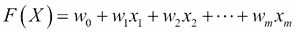

`wi`变量是前面等式中的未知值。建模练习是关于发现`wi`变量。利用我们的训练数据，我们会发现`wi`的值；`wi`称为回归模型的系数。

线性回归建模问题被构造为:使用训练数据来寻找系数:


使得:

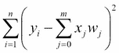

上面的公式越低越好。

这个方程的值越低(优化术语中称为成本函数)，线性回归模型越好。因此，优化问题是最小化前面的方程，也就是说，找到`wi`系数的值，使其最小化该方程。我们将不深究所使用的优化例程的细节。然而，知道这个目标函数是很好的，因为接下来的两个食谱期望你理解它。

现在的问题是，我们如何知道我们使用训练数据建立的模型，也就是我们新发现的系数，`w1, w2,..wm`足够好，可以准确预测看不见的记录？我们将再次利用之前定义的成本函数。当我们在开发集或测试集中应用该模型时，我们会发现实际值和预测值之间差异的平均平方，如下所示:


前面的方程是，称为均方误差——我们可以说我们的回归模型值得使用的度量。我们需要一个输出模型，其中实际值和预测值之差的均方差尽可能低。这种求系数的方法称为最小二乘估计。

我们将使用 scikit-learn 的`LinearRegression`类。但是，它在内部使用了`scipy.linalg.lstsq`方法。最小二乘法为我们提供了回归问题的封闭解。有关最小二乘法和最小二乘法的推导的更多信息，请参考以下链接:

[https://en.wikipedia.org/wiki/Least_squares](https://en.wikipedia.org/wiki/Least_squares)。

[https://en . Wikipedia . org/wiki/Linear _ least _ squares _(数学)](https://en.wikipedia.org/wiki/Linear_least_squares_(mathematics))。

我们简单介绍了回归。好奇的读者可以参考以下书籍[http://www . Amazon . com/exec/obi dos/ASIN/0387952845/trevorhastie-20](http://www.amazon.com/exec/obidos/ASIN/0387952845/trevorhastie-20)。

[http://www . Amazon . com/Neural-Networks-Learning-Machines-Edition/DP/0131471392](http://www.amazon.com/Neural-Networks-Learning-Machines-Edition/dp/0131471392)


## 准备就绪

波士顿数据有 13 个属性和 506 个实例。目标变量是一个实数，房屋的中值以千计。

有关波士顿数据集的更多信息，请参考以下 UCI 链接:[https://archive . ics . UCI . edu/ml/machine-learning-databases/housing/housing . names](https://archive.ics.uci.edu/ml/machine-learning-databases/housing/housing.names)。

我们将提供这些预测变量和响应变量的名称，如下所示:

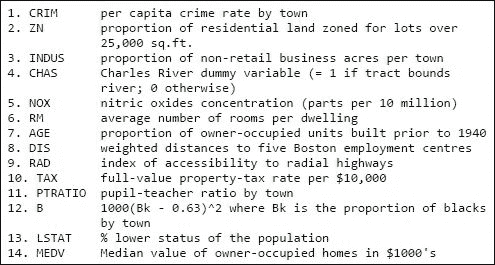

## 怎么做……

我们将从加载所有必需的库开始。接下来我们将定义我们的第一个函数`get_data()`。在这个函数中，我们将读取波士顿数据集，并将其作为预测值`x`和响应变量`y`返回:

```py
# Load libraries
from sklearn.datasets import load_boston
from sklearn.cross_validation import train_test_split
from sklearn.linear_model import LinearRegression
from sklearn.metrics import mean_squared_error
import matplotlib.pyplot as plt
from sklearn.preprocessing import PolynomialFeatures
def get_data():
    """
    Return boston dataset
    as x - predictor and
    y - response variable
    """
    data = load_boston()
    x    = data['data']
    y    = data['target']
    return x,y    
```

在我们的`build_model`函数中，我们将用给定的数据构建我们的线性回归模型。之后的两个函数，`view_model`和`model_worth`，用于自省我们已经建立的模型:

```py
def build_model(x,y):
    """
    Build a linear regression model
    """
    model = LinearRegression(normalize=True,fit_intercept=True)
    model.fit(x,y)
    return model    

def view_model(model):
    """
    Look at model coeffiecients
    """
    print "\n Model coeffiecients"
    print "======================\n"
    for i,coef in enumerate(model.coef_):
        print "\tCoefficient %d  %0.3f"%(i+1,coef)

    print "\n\tIntercept %0.3f"%(model.intercept_)

def model_worth(true_y,predicted_y):
    """
    Evaluate the model
    """
    print "\tMean squared error = %0.2f"%(mean_squared_error(true_y,predicted_y))
```

`plot_residual`函数用于绘制回归模型中的误差:

```py
def plot_residual(y,predicted_y):
    """
    Plot residuals
    """
    plt.cla()
    plt.xlabel("Predicted Y")
    plt.ylabel("Residual")
    plt.title("Residual Plot")
    plt.figure(1)
    diff = y - predicted_y
    plt.plot(predicted_y,diff,'go')
    plt.show()
```

最后，我们将编写我们的`main`函数，其中的用于调用所有前面的函数:

```py
if __name__ == "__main__":

    x,y = get_data()

    # Divide the data into Train, dev and test    
    x_train,x_test_all,y_train,y_test_all = train_test_split(x,y,test_size = 0.3,random_state=9)
    x_dev,x_test,y_dev,y_test = train_test_split(x_test_all,y_test_all,test_size=0.3,random_state=9)

    # Build the model
    model = build_model(x_train,y_train)
    predicted_y = model.predict(x_train)

    # Plot the residual
    plot_residual(y_train,predicted_y)
    # View model coeffiecients    
    view_model(model)

    print "\n Model Performance in Training set\n"
    model_worth(y_train,predicted_y)  

    # Apply the model on dev set
    predicted_y = model.predict(x_dev)
    print "\n Model Performance in Dev set\n"
    model_worth(y_dev,predicted_y)  

    #Prepare some polynomial features
    poly_features = PolynomialFeatures(2)
    poly_features.fit(x_train)
    x_train_poly = poly_features.transform(x_train)
    x_dev_poly   = poly_features.transform(x_dev)

    # Build model with polynomial features
    model_poly = build_model(x_train_poly,y_train)
    predicted_y = model_poly.predict(x_train_poly)
    print "\n Model Performance in Training set (Polynomial features)\n"
    model_worth(y_train,predicted_y)  

    # Apply the model on dev set
    predicted_y = model_poly.predict(x_dev_poly)
    print "\n Model Performance in Dev set  (Polynomial features)\n"
    model_worth(y_dev,predicted_y)  

    # Apply the model on Test set
    x_test_poly = poly_features.transform(x_test)
    predicted_y = model_poly.predict(x_test_poly)

    print "\n Model Performance in Test set  (Polynomial features)\n"
    model_worth(y_test,predicted_y)  

    predicted_y = model.predict(x_test)
    print "\n Model Performance in Test set  (Regular features)\n"
    model_worth(y_test,predicted_y)  
```


## 它是如何工作的……

让我们从主模块开始，并遵循代码。我们将使用`get_data`函数加载预测值`x`和响应变量`y`:

```py
def get_data():
    """
    Return boston dataset
    as x - predictor and
    y - response variable
    """
    data = load_boston()
    x    = data['data']
    y    = data['target']
    return x,y    
```

该函数调用 scikit-learn 方便的`load_boston()`函数，以 NumPy 数组的形式检索波士顿房价数据集。

我们将继续使用 Scikit 库中的`train_test_split`函数将数据分为训练集和测试集。我们将保留 30%的数据集进行测试:

```py
x_train,x_test_all,y_train,y_test_all = train_test_split(x,y,test_size = 0.3,random_state=9)
```

从中，我们将在下一行中提取 dev 集:

```py
x_dev,x_test,y_dev,y_test = train_test_split(x_test_all,y_test_all,test_size=0.3,random_state=9)
```

在下一行中，我们将通过调用`build_model`方法使用训练数据集来构建我们的模型。这个模型创建了一个`LinearRegression`类型的对象。`LinearRegression`类包含了 SciPy 的最小二乘法:

```py
    model = LinearRegression(normalize=True,fit_intercept=True)
```

让我们看看初始化这个类时传递的参数。

`fit_intercept`参数被设置为`True`。这告诉线性回归类将数据居中。通过将数据居中，我们的每个预测值的平均值被设置为零。线性回归方法要求数据以平均值为中心，以便更好地解释截距。除了根据每个属性的平均值来确定其中心之外，我们还将根据每个属性的标准偏差来对其进行标准化。我们将使用`normalize`参数并将其设置为`True`来实现这一点。参考[第 3 章](part0043_split_000.html#190861-6b04b7c0b98f44a0b8f82924fef317ec "Chapter 3. Data Analysis – Explore and Wrangle")、*缩放和数据标准化*配方，了解如何通过各列执行标准化。通过`fit_intercept`参数，我们将指示算法包含一个截距，以适应响应变量的任何常数变化。最后，我们将通过调用带有响应变量`y`和预测变量`x`的拟合函数来拟合模型。

### 注意

有关线性回归方法的更多信息，请参考 Trevor Hastie 等人所著的《统计学习的要素》一书。

检查我们构建的模型是一个很好的实践，这样我们可以更好地理解模型，以便进一步改进或提高可解释性。

现在让我们将残差(预测值`y`和实际值`y`之间的差值)和预测值`y`绘制成散点图。我们将调用`plot_residual`方法来做到这一点:

```py
    # Plot the residual
    plot_residual(y_train,predicted_y)
```

让我们看看下图:

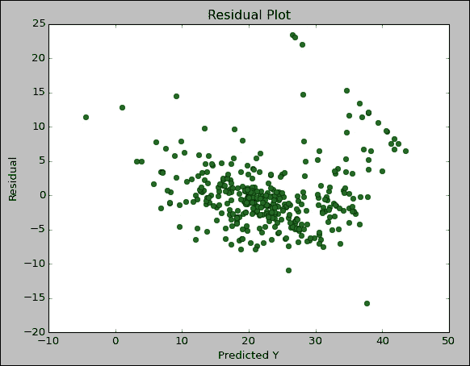

我们可以使用这个散点图来验证数据集中的回归假设。我们看不到任何模式，这些点沿着零残差值均匀分布。

### 注意

参考*丹尼尔的书*数据挖掘方法和模型*。T. Larose* 了解有关使用残差图验证线性回归假设的更多信息。

然后我们将使用`view_model`方法检查我们的模型。在这个方法中，我们将打印截距和系数值。线性回归对象有两个属性，一个叫做`coef_`，它为我们提供一个系数数组，另一个叫做`intercept_`，它给出截距值:

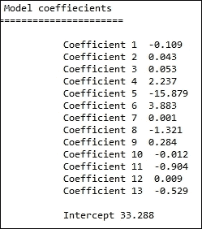

就拿`coefficient 6`来说吧，就是房子的宜居房间数。系数值解释为:每增加一个房间，价格上涨三倍。

最后，我们将通过用我们的预测响应值和实际响应值调用`model_worth`函数来看看我们的模型有多好，这两个响应值都来自我们的训练集和开发集。

此函数打印出均方误差值，即实际值和预测值之间差值的均方值:

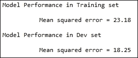

我们在 dev 集中有一个较低的值，这表明我们的模型有多好。让我们检查一下是否可以提高我们的均方误差。如果我们为我们的模型提供更多的特性会怎么样？让我们从现有的属性中创建一些特性。我们将使用 scikit-learn 中的`PolynomialFeatures`类来创建二阶多项式:

```py
    #Prepare some polynomial features
    poly_features = PolynomialFeatures(2)
    poly_features.fit(x_train)
    x_train_poly = poly_features.transform(x_train)
    x_dev_poly   = poly_features.transform(x_dev)
```

我们将把参数作为传递给`PolynomialFeatures`来表示我们需要二阶多项式。`2`也是类初始化为空时使用的默认值:


快速看一下新的`x`的形状，我们现在有 105 个属性，相比之下是 13 个。让我们使用新的多项式要素构建模型，并检查模型的准确性:

```py
    # Build model with polynomial features
    model_poly = build_model(x_train_poly,y_train)
    predicted_y = model_poly.predict(x_train_poly)
    print "\n Model Performance in Training set (Polynomial           features)\n"
    model_worth(y_train,predicted_y)  

    # Apply the model on dev set
    predicted_y = model_poly.predict(x_dev_poly)
    print "\n Model Performance in Dev set  (Polynomial features)\n"
    model_worth(y_dev,predicted_y)  
```


我们的模型与训练数据集吻合得很好。在开发集和训练集中，我们的多项式特征比原始特征表现得更好。

最后，让我们看看具有多项式特征的模型和具有常规特征的模型在我们的测试集中的表现如何:

```py
    # Apply the model on Test set
    x_test_poly = poly_features.transform(x_test)
    predicted_y = model_poly.predict(x_test_poly)

    print "\n Model Performance in Test set  (Polynomial features)\n"
    model_worth(y_test,predicted_y)  

predicted_y = model.predict(x_test)
    print "\n Model Performance in Test set  (Regular features)\n"
    model_worth(y_test,predicted_y)  
```


我们可以看到我们的多项式特征比我们使用测试数据集的原始特征集表现得更好。

这就是你需要知道的关于如何用 Python 做线性回归的全部内容。我们研究了线性回归的工作原理，以及如何构建模型来预测实数值。


## 还有更多...

在我们继续之前，我们将在名为`interaction_only`的`PolynomialFeatures`类中看到另一个参数设置:

```py
poly_features = PolynomialFeatures(interaction_only=True)
```

通过将`interaction_only`设置为`true—with x1`和`x2 attributes—only`，创建了`x1*x2`属性。不创建`x1`和`x2`的正方形，假设次数为二。

对于正常和多项式特性，我们的测试集结果不如我们的开发集结果好。这是线性回归的一个已知问题。线性回归不能很好地处理方差。我们面临的问题是高方差和低偏差。随着模型复杂性的增加，也就是说，呈现给模型的属性数量增加。该模型往往非常适合训练数据，因此偏差较低，但测试数据的输出开始下降。有几种技术可以解决这个问题。

我们来看一种叫做递归特征选择的方法。所需属性的数量作为参数传递给此方法。它递归地过滤特征。在第 I 次运行中，线性模型被拟合到数据，并且基于系数值，属性被过滤；具有较低权重的属性被忽略。因此，迭代继续剩余的属性集。最后，当我们拥有所需数量的属性时，迭代停止。让我们看一个代码示例:

```py
# Load libraries
from sklearn.datasets import load_boston
from sklearn.cross_validation import train_test_split
from sklearn.linear_model import LinearRegression
from sklearn.metrics import mean_squared_error
import matplotlib.pyplot as plt
from sklearn.preprocessing import PolynomialFeatures
from itertools import combinations
from sklearn.feature_selection import RFE

def get_data():
    """
    Return boston dataset
    as x - predictor and
    y - response variable
    """
    data = load_boston()
    x    = data['data']
    y    = data['target']
    return x,y    

def build_model(x,y,no_features):
    """
    Build a linear regression model
    """
    model = LinearRegression(normalize=True,fit_intercept=True)
    rfe_model = RFE(estimator=model,n_features_to_select=no_features)
    rfe_model.fit(x,y)
    return rfe_model    

def view_model(model):
    """
    Look at model coeffiecients
    """
    print "\n Model coeffiecients"
    print "======================\n"
    for i,coef in enumerate(model.coef_):
        print "\tCoefficient %d  %0.3f"%(i+1,coef)

    print "\n\tIntercept %0.3f"%(model.intercept_)

def model_worth(true_y,predicted_y):
    """
    Evaluate the model
    """
    print "\tMean squared error = %0.2f"%(mean_squared_error(true_y,predicted_y))
    return mean_squared_error(true_y,predicted_y)

def plot_residual(y,predicted_y):
    """
    Plot residuals
    """
    plt.cla()
    plt.xlabel("Predicted Y")
    plt.ylabel("Residual")
    plt.title("Residual Plot")
    plt.figure(1)
    diff = y - predicted_y
    plt.plot(predicted_y,diff,'go')
    plt.show()

def subset_selection(x,y):
    """
    subset selection method
    """
    # declare variables to track
    # the model and attributes which produces
    # lowest mean square error
    choosen_subset = None
    low_mse = 1e100
    choosen_model = None
    # k value ranges from 1 to the number of 
    # attributes in x
    for k in range(1,x.shape[1]+1):
        print "k= %d "%(k)
        # evaluate all attribute combinations
        # of size k+1
        subsets = combinations(range(0,x.shape[1]),k+1)
        for subset in subsets:
            x_subset = x[:,subset]
            model = build_model(x_subset,y)
            predicted_y = model.predict(x_subset)
            current_mse = mean_squared_error(y,predicted_y)
            if current_mse < low_mse:
                low_mse = current_mse
                choosen_subset = subset
                choosen_model = model

    return choosen_model, choosen_subset,low_mse    

if __name__ == "__main__":

    x,y = get_data()

    # Divide the data into Train, dev and test    
    x_train,x_test_all,y_train,y_test_all = train_test_split(x,y,test_size = 0.3,random_state=9)
    x_dev,x_test,y_dev,y_test = train_test_split(x_test_all,y_test_all,test_size=0.3,random_state=9)

    #Prepare some polynomial features
    poly_features = PolynomialFeatures(interaction_only=True)
    poly_features.fit(x_train)
    x_train_poly = poly_features.transform(x_train)
    x_dev_poly   = poly_features.transform(x_dev)

    #choosen_model,choosen_subset,low_mse = subset_selection(x_train_poly,y_train)    
    choosen_model = build_model(x_train_poly,y_train,20)
    #print choosen_subse
    predicted_y = choosen_model.predict(x_train_poly)
    print "\n Model Performance in Training set (Polynomial features)\n"
    mse  = model_worth(y_train,predicted_y)  

    # Apply the model on dev set
    predicted_y = choosen_model.predict(x_dev_poly)
    print "\n Model Performance in Dev set  (Polynomial features)\n"
    model_worth(y_dev,predicted_y)  

    # Apply the model on Test set
    x_test_poly = poly_features.transform(x_test)
    predicted_y = choosen_model.predict(x_test_poly)

    print "\n Model Performance in Test set  (Polynomial features)\n"
    model_worth(y_test,predicted_y)  
```

该代码与前面的线性回归代码非常相似，除了`build_model`方法:

```py
def build_model(x,y,no_features):
    """
    Build a linear regression model
    """
    model = LinearRegression(normalize=True,fit_intercept=True)
    rfe_model = RFE(estimator=model,n_features_to_select=no_features)
    rfe_model.fit(x,y)
    return rfe_model    
```

除了预测器`x`和响应变量`y`，`build_model`还接受保留特征数量`no_features`作为参数。在本例中，我们传递了一个值 20，要求递归特征消除只保留 20 个重要特征。如您所见，我们首先创建了一个线性回归对象。这个对象被传递给`RFE`类。RFE 代表递归特征消除，这是 scikit-learn 提供的一个类，用于实现递归特征消除。现在，让我们根据培训、开发和测试数据集来评估我们的模型:

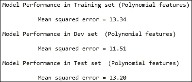

测试数据集的均方误差为 13.20，几乎是我们之前的一半。因此，我们能够使用递归特征消除方法来有效地执行特征选择，从而改进我们的模型。


## 参见

*   *缩放数据*配方[第三章](part0043_split_000.html#190861-6b04b7c0b98f44a0b8f82924fef317ec "Chapter 3. Data Analysis – Explore and Wrangle")、*数据分析——探索与争论*
*   *标准化数据*配方[第三章](part0043_split_000.html#190861-6b04b7c0b98f44a0b8f82924fef317ec "Chapter 3. Data Analysis – Explore and Wrangle")、*数据分析——探索与争论*
*   *准备建模数据[第六章](part0073_split_000.html#25JP21-6b04b7c0b98f44a0b8f82924fef317ec "Chapter 6. Machine Learning 1")、*机器学习一*中的*配方


# 用 L2 收缩-岭学习回归

让我们将之前讨论的回归技术扩展到正则化。训练线性回归模型时，一些系数可能会取很高的值，导致模型不稳定。正则化或收缩是控制系数权重的一种方式，这样就不会取很大的值。让我们再次查看线性回归成本函数，以了解回归固有的问题，以及我们控制系数权重的意义:


线性回归试图找到系数`w0…wm`，从而使前面的方程最小化。线性回归有一些问题。

如果数据集包含许多相关的预测值，数据中非常小的变化都会导致模型不稳定。此外，我们将面临一个解释模型结果的问题。例如，如果我们有两个负相关的变量，这些变量将对响应变量产生相反的影响。我们可以手动查看这些相关性，并删除其中一个相关变量，然后继续构建模型。然而，如果我们能够自动处理这些场景，将会很有帮助。

在前一个配方中，我们引入了一种称为递归特征消除的方法，以保留最具信息性的属性并丢弃其余的属性。然而，在这种方法中，我们要么保留一个变量，要么不保留它；我们的决定是二元的。在本节中，我们将看到一种方法，通过这种方法，我们可以控制与变量相关的权重，使不必要的变量受到严重的惩罚，并获得极低的权重。

我们将改变线性回归的成本函数以包括系数。如您所知，对于最佳模型，成本函数的值应该最小。通过将系数包括在成本函数中，我们可以严重地惩罚取很高值的系数。一般来说，这些技术被称为收缩方法，因为它们试图收缩系数的值。在这个配方中，我们将看到 L2 收缩，通常称为岭回归。让我们看看岭回归的成本函数:

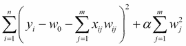

如您所见，系数的平方的总和被添加到成本函数中。这样，当优化例程试图最小化前面的函数时，它必须大幅降低系数值以实现其目标。alpha 参数决定收缩量。alpha 值越大，收缩越大。系数值减少到零。

有了这个小小的数学背景，让我们跳进我们的食谱，看看岭回归的行动。


## 准备就绪

我们将再次使用波士顿数据集来演示岭回归。波士顿数据有 13 个属性和 506 个实例。目标变量是一个实数，房屋的中值以千计。有关波士顿数据集的详细信息，请参考以下 UCI 链接:

[https://archive . ics . UCI . edu/ml/machine-learning-databases/housing/housing . names](https://archive.ics.uci.edu/ml/machine-learning-databases/housing/housing.names)

我们打算生成二次多项式特征，并且只考虑交互作用的影响。在这个配方的最后，我们将看到多少系数被罚。


## 怎么做……

我们将从加载所有必需的库开始。接下来我们将定义我们的第一个函数`get_data()`。在这个函数中，我们将读取波士顿数据集，并将其作为预测值`x`和响应变量`y`返回:

```py
# Load libraries
from sklearn.datasets import load_boston
from sklearn.cross_validation import train_test_split
from sklearn.linear_model import Ridge
from sklearn.metrics import mean_squared_error
from sklearn.preprocessing import PolynomialFeatures

def get_data():
    """
    Return boston dataset
    as x - predictor and
    y - response variable
    """
    data = load_boston()
    x    = data['data']
    y    = data['target']
    x    = x - np.mean(x,axis=0)

    return x,y    
```

在我们的下一个`build_model`函数中，我们将使用给定的数据构建我们的岭回归模型。两个函数`view_model`和`model_worth`后面的用于自省我们建立的模型:

```py
def build_model(x,y):
    """
    Build a Ridge regression model
    """
    model = Ridge(normalize=True,alpha=0.015)
    model.fit(x,y)
    # Track the scores- Mean squared residual for plot
    return model    

def view_model(model):
    """
    Look at model coeffiecients
    """
    print "\n Model coeffiecients"
    print "======================\n"
    for i,coef in enumerate(model.coef_):
        print "\tCoefficient %d  %0.3f"%(i+1,coef)

    print "\n\tIntercept %0.3f"%(model.intercept_)

def model_worth(true_y,predicted_y):
    """
    Evaluate the model
    """
    print "\tMean squared error = %0.2f"%(mean_squared_error(true_y,predicted_y))
    return mean_squared_error(true_y,predicted_y)
```

最后，我们将编写我们的`main`函数，它是用于调用前面所有函数的:

```py
if __name__ == "__main__":

    x,y = get_data()

    # Divide the data into Train, dev and test    
    x_train,x_test_all,y_train,y_test_all = train_test_split(x,y,test_size = 0.3,random_state=9)
    x_dev,x_test,y_dev,y_test = train_test_split(x_test_all,y_test_all,test_size=0.3,random_state=9)

    #Prepare some polynomial features
    poly_features = PolynomialFeatures(interaction_only=True)
    poly_features.fit(x_train)
    x_train_poly = poly_features.transform(x_train)
    x_dev_poly   = poly_features.transform(x_dev)
    x_test_poly = poly_features.transform(x_test)

    #choosen_model,choosen_subset,low_mse = subset_selection(x_train_poly,y_train)    
    choosen_model = build_model(x_train_poly,y_train)

    predicted_y = choosen_model.predict(x_train_poly)
    print "\n Model Performance in Training set (Polynomial features)\n"
    mse  = model_worth(y_train,predicted_y)  
    view_model(choosen_model)

    # Apply the model on dev set
    predicted_y = choosen_model.predict(x_dev_poly)
    print "\n Model Performance in Dev set  (Polynomial features)\n"
    model_worth(y_dev,predicted_y)  

    # Apply the model on Test set
    predicted_y = choosen_model.predict(x_test_poly)

    print "\n Model Performance in Test set  (Polynomial features)\n"
    model_worth(y_test,predicted_y)  
```


## 它是如何工作的……

让我们从主模块开始，按照代码进行操作。我们使用`get_data`函数加载了预测值`x`和响应变量`y`。这个函数调用 scikit-learn 的便利的`load_boston()`函数，以 NumPy 数组的形式检索波士顿房价数据集。

我们将继续使用 scikit-learn 库中的`train_test_split`函数将数据分成训练集和测试集。我们将保留 30%的数据集进行测试。在这之后，我们将在下一行中提取 dev 集。

然后我们将构建多项式特征:

```py
poly_features = PolynomialFeatures(interaction_only=True)
poly_features.fit(x_train)
```

如您所见，我们将`interaction_only`设置为 true。通过将`interaction_only`设置为 true——带有`x1`和`x2`属性——只创建了`x1*x2`属性。不创建`x1`和`x2`的正方形，假设度数为 2。默认度数为二:

```py
x_train_poly = poly_features.transform(x_train)
x_dev_poly = poly_features.transform(x_dev)
x_test_poly = poly_features.transform(x_test)
```

使用`transform`函数，我们将转换我们的训练、开发和测试数据集，以包含多项式特性。

在下一行中，我们将通过调用`build_model`方法使用训练数据集构建我们的岭回归模型:

```py
model = Ridge(normalize=True,alpha=0.015)
model.fit(x,y)
```

数据集中的属性以其平均值为中心，并通过使用`normalize`参数并将其设置为`true`的标准偏差进行标准化。`Alpha`控制收缩量。其值被设置为`0.015`。我们并没有神奇地得出这个数字，而是通过多次运行模型得出的。在本章的后面，我们将看到如何根据经验得出这个参数的正确值。我们还将使用`fit_intercept` 参数来拟合这个模型的截距。然而，默认情况下，`fit_intercept`参数被设置为`true`，因此我们没有明确指定它。

现在让我们看看模型在训练集中的表现。我们将调用`model_worth`方法来获得均方差。该方法采用预测响应变量和实际响应变量来返回均方误差:

```py
predicted_y = choosen_model.predict(x_train_poly)
print "\n Model Performance in Training set (Polynomial features)\n"
mse = model_worth(y_train,predicted_y) 
```

我们的输出如下所示:


在将我们的模型应用到测试集之前，让我们看看系数的权重。我们将调用一个名为`view_model`的函数来查看系数的权重:

```py
view_model(choosen_model)
```

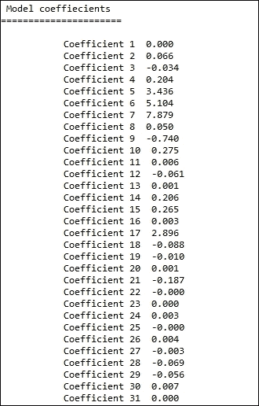

我们没有显示所有的系数。总共有 92 个。但是，看看其中的一些，收缩效应应该是可见的。例如，系数 1 几乎为 0(记住它是一个非常小的值，我们在这里只显示了前三位小数)。

让我们来看看我们的模型在开发环境中的表现如何:

```py
predicted_y = choosen_model.predict(x_dev_poly)
print "\n Model Performance in Dev set (Polynomial features)\n"
model_worth(y_dev,predicted_y) 
```

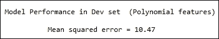

不错，我们已经达到了比我们的训练误差更低的均方误差。最后，让我们看看我们的模型在测试集上的性能:

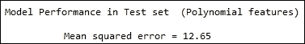

与之前配方中的线性回归模型相比，我们在测试集上表现更好。


## 还有更多……

我们之前提到过，线性回归模型对数据集中即使很小的变化也非常敏感。让我们看一个小例子来说明这一点:

```py
# Load libraries
from sklearn.datasets import load_boston
from sklearn.cross_validation import train_test_split
from sklearn.linear_model import Ridge
from sklearn.metrics import mean_squared_error
from sklearn.preprocessing import PolynomialFeatures

def get_data():
    """
    Return boston dataset
    as x - predictor and
    y - response variable
    """
    data = load_boston()
    x    = data['data']
    y    = data['target']
    x    = x - np.mean(x,axis=0)

    return x,y    
```

在这段代码中，我们将使用`build_model`函数对原始数据拟合线性回归和岭回归模型:

```py
lin_model,ridg_model = build_model(x,y)
```

我们将在原始数据中引入一个小噪声，如下所示:

```py
# Add some noise to the dataset
noise = np.random.normal(0,1,(x.shape))
x = x + noise
```

我们将再次在噪声数据集上拟合模型。最后，我们将比较系数的权重:

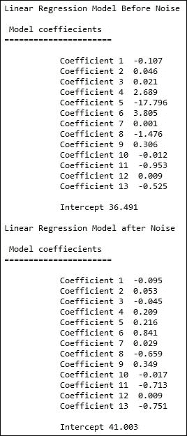

添加小噪声后，当我们尝试使用线性回归拟合模型时，分配的权重与之前模型分配的权重非常不同。现在，让我们看看岭回归是如何执行的:

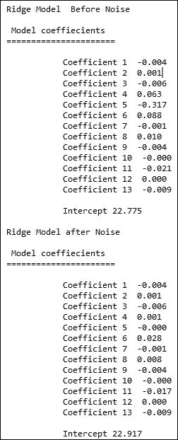

第一款和第二款车型的重量没有明显变化。希望这证明了岭回归在噪声数据条件下的稳定性。

选择合适的 alpha 值总是很棘手。强力方法是通过多个值运行它，并追踪系数的路径。从路径中，选择权重变化不大的 alpha 值。我们将使用`coeff_path`函数绘制系数的权重。

我们来看一下`coeff_path`函数。它首先生成一个 alpha 值列表:

```py
alpha_range = np.linspace(10,100.2,300)
```

在这种情况下，我们生成了 300 个 10 到 100 之间的均匀分布的数字。对于这些 alpha 值中的每一个，我们将构建一个模型并保存其系数:

```py
for alpha in alpha_range:
    model = Ridge(normalize=True,alpha=alpha)
    model.fit(x,y)
    coeffs.append(model.coef_)
```

最后，我们将绘制这些系数权重与 alpha 值的关系:


如您所见，这些值稳定在 alpha 值 100 附近。你可以进一步放大到接近 100 的范围，寻找一个理想值。


## 参见

*   *在[第 7 章](part0078_split_000.html#2ACBS1-6b04b7c0b98f44a0b8f82924fef317ec "Chapter 7. Machine Learning 2")、*机器学习 II* 中使用回归*公式预测实数值
*   *缩放数据*配方[第三章](part0043_split_000.html#190861-6b04b7c0b98f44a0b8f82924fef317ec "Chapter 3. Data Analysis – Explore and Wrangle")、*数据分析——探索与争论*
*   *标准化数据*配方[第三章](part0043_split_000.html#190861-6b04b7c0b98f44a0b8f82924fef317ec "Chapter 3. Data Analysis – Explore and Wrangle")、*数据分析——探索与争论*
*   *准备建模数据[第六章](part0073_split_000.html#25JP21-6b04b7c0b98f44a0b8f82924fef317ec "Chapter 6. Machine Learning 1")、*机器学习一*中的*配方


# 用 L1 收缩-套索学习回归

**最小绝对收缩和选择算子** ( **套索**)是另一种在回归问题中普遍使用的收缩方法。与脊相比，套索导致稀疏解。如果大部分系数减少到零，则解决方案称为稀疏。在 LASSO 中，很多系数都被置零。在相关变量的情况下，LASSO 只选择其中一个，而 ridge 为两个变量的系数分配相等的权重。因此，套索的这一属性可用于变量选择。在这个食谱中，让我们看看如何利用套索进行变量选择。

我们来看看 LASSO 回归的成本函数。如果你遵循了前两个食谱，你可以很快发现其中的区别:


系数受到系数绝对值之和的惩罚。阿尔法又一次控制了惩罚的程度。让我们试着理解为什么 L1 收缩导致稀疏解背后的直觉。

我们可以将前面的等式重写为无约束成本函数和约束，如下所示:

最小化:


受制于约束条件:


记住这个等式，让我们在系数空间中为两个系数`w0`和`w1`绘制成本函数值:

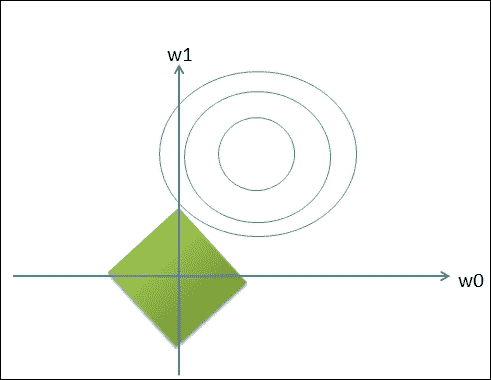

蓝线代表`w0`和`w1`的不同值的成本函数值(无约束)的轮廓。绿色区域表示由 eta 值指定的约束形状。当`w0`设置为 0 时，两个区域相交的最佳值。我们描绘了一个二维空间，其中我们的解决方案是稀疏的，并且`w0`设置为 0。在多维空间中，我们将在绿色区域中有一个菱形，LASSO 将通过将许多系数降为零来给出稀疏解。


## 准备就绪

我们将再次使用波士顿数据集来演示 LASSO 回归。波士顿数据有 13 个属性和 506 个实例。目标变量是一个实数，房屋的中值以千计。

有关波士顿数据集的详细信息，请参考以下 UCI 链接:

[https://archive . ics . UCI . edu/ml/machine-learning-databases/housing/housing . names](https://archive.ics.uci.edu/ml/machine-learning-databases/housing/housing.names)。

我们将看到如何使用 LASSO 进行变量选择。


## 怎么做……

我们将从加载所有必需的库开始。接下来我们将定义我们的第一个函数`get_data()`。在这个函数中，我们将读取波士顿数据集，并将其作为预测值`x`和响应变量`y`返回:

```py
# Load libraries
from sklearn.datasets import load_boston
from sklearn.cross_validation import train_test_split
from sklearn.linear_model import Lasso, LinearRegression
from sklearn.metrics import mean_squared_error
import matplotlib.pyplot as plt
from sklearn.preprocessing import PolynomialFeatures
import numpy as np

def get_data():
    """
    Return boston dataset
    as x - predictor and
    y - response variable
    """
    data = load_boston()
    x    = data['data']
    y    = data['target']
    return x,y    
```

在我们的下一个`build_model`函数中，我们将用给定的数据构建我们的 LASSO 回归模型。下面的两个函数，`view_model`和`model_worth`，用于自省我们建立的模型:

```py
def build_models(x,y):
    """
    Build a Lasso regression model
    """
    # Alpha values uniformly
    # spaced between 0.01 and 0.02
    alpha_range = np.linspace(0,0.5,200)
    model = Lasso(normalize=True)
    coeffiecients = []
    # Fit a model for each alpha value
    for alpha in alpha_range:
        model.set_params(alpha=alpha)
        model.fit(x,y)
        # Track the coeffiecients for plot
        coeffiecients.append(model.coef_)
    # Plot coeffients weight decay vs alpha value
    # Plot model RMSE vs alpha value
    coeff_path(alpha_range,coeffiecients)
    # View coeffiecient value
    #view_model(model)

def view_model(model):
    """
    Look at model coeffiecients
    """
    print "\n Model coeffiecients"
    print "======================\n"
    for i,coef in enumerate(model.coef_):
        print "\tCoefficient %d  %0.3f"%(i+1,coef)

    print "\n\tIntercept %0.3f"%(model.intercept_)

def model_worth(true_y,predicted_y):
    """
    Evaluate the model
    """
    print "\t Mean squared error = %0.2f\n"%(mean_squared_error(true_y,predicted_y))
```

我们将定义两个函数`coeff_path`和`get_coeff`来检查我们的模型系数。从`build_model`函数调用`coeff_path`函数，以绘制不同阿尔法值的系数权重。从主函数中调用`get_coeff`函数:

```py
def coeff_path(alpha_range,coeffiecients):
    """
    Plot residuals
    """
    plt.close('all')
    plt.cla()

    plt.figure(1)
    plt.xlabel("Alpha Values")
    plt.ylabel("Coeffiecient Weight")
    plt.title("Coeffiecient weights for different alpha values")
    plt.plot(alpha_range,coeffiecients)
    plt.axis('tight')

    plt.show()

def get_coeff(x,y,alpha):
    model = Lasso(normalize=True,alpha=alpha)
    model.fit(x,y)
    coefs = model.coef_
    indices = [i for i,coef in enumerate(coefs) if abs(coef) > 0.0]
    return indices
```

最后，我们将编写我们的`main`函数，它用于调用所有前面的函数:

```py
if __name__ == "__main__":

    x,y = get_data()
    # Build multiple models for different alpha values
    # and plot them    
    build_models(x,y)
    print "\nPredicting using all the variables"
    full_model = LinearRegression(normalize=True)
    full_model.fit(x,y)
    predicted_y = full_model.predict(x)
    model_worth(y,predicted_y)    

    print "\nModels at different alpha values\n"
    alpa_values = [0.22,0.08,0.01]
    for alpha in alpa_values:

        indices = get_coeff(x,y,alpha)   
        print "\t alpah =%0.2f Number of variables selected = %d "%(alpha,len(indices))
        print "\t attributes include ", indices
        x_new = x[:,indices]
        model = LinearRegression(normalize=True)
        model.fit(x_new,y)
        predicted_y = model.predict(x_new)
        model_worth(y,predicted_y)
```


## 它是如何工作的……

让我们从主模块开始，并遵循代码。我们将使用`get_data`函数加载预测值`x`和响应变量`y`。该函数调用 scikit-learn 的便利的`load_boston()`函数，以 NumPy 数组的形式检索波士顿房价数据集。

我们将通过调用`build_models`继续。在`build_models`中，我们将为`alpha`的不同值构建多个模型:

```py
alpha_range = np.linspace(0,0.5,200)
model = Lasso(normalize=True)
coeffiecients = []
# Fit a model for each alpha value
for alpha in alpha_range:
model.set_params(alpha=alpha)
model.fit(x,y)
# Track the coeffiecients for plot
coeffiecients.append(model.coef_)
```

如您所见，在 for 循环中，我们还将不同 alpha 值的系数值存储在一个列表中。

让我们通过调用`coeff_path`函数来绘制不同 alpha 值的系数值:

```py
plt.close('all')
plt.cla()

plt.figure(1)
plt.xlabel("Alpha Values")
plt.ylabel("Coeffiecient Weight")
plt.title("Coeffiecient weights for different alpha values")
plt.plot(alpha_range,coeffiecients)
plt.axis('tight')
plt.show()
```

在`x`轴，你可以看到我们有阿尔法值，在`y`轴，我们将绘制给定阿尔法值的所有系数。让我们看看输出图:


不同颜色的线代表不同的系数值。如您所见，随着 alpha 值的增加，系数权重趋向于零。从这个图中，我们可以选择α的值。

作为参考，让我们拟合一个简单的线性回归模型:

```py
print "\nPredicting using all the variables"
full_model = LinearRegression(normalize=True)
full_model.fit(x,y)
predicted_y = full_model.predict(x)
model_worth(y,predicted_y) 
```

让我们看看当我们尝试使用我们新建立的模型进行预测时的均方差:

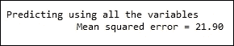

让我们继续选择基于套索的系数:

```py
print "\nModels at different alpha values\n"
alpa_values = [0.22,0.08,0.01]
for alpha in alpa_values:
indices = get_coeff(x,y,alpha) 
```

基于前面的图表，我们选择了`0.22`、`0.08`和`0.01`作为 alpha 值。在循环中，我们将调用`get_coeff`方法。此方法适合具有给定 alpha 值的 LASSO 模型，并且仅返回非零系数的索引:

```py
model = Lasso(normalize=True,alpha=alpha)
model.fit(x,y)
coefs = model.coef_

indices = [i for i,coef in enumerate(coefs) if abs(coef) > 0.0]
```

本质上，我们只选择那些具有非零系数值的属性—要素选择。让我们回到我们的`for`循环，我们将拟合一个带有缩减系数的线性回归模型:

```py
print "\t alpah =%0.2f Number of variables selected = %d "%(alpha,len(indices))
print "\t attributes include ", indices
x_new = x[:,indices]
model = LinearRegression(normalize=True)
model.fit(x_new,y)
predicted_y = model.predict(x_new)
model_worth(y,predicted_y)
```

我们想知道的是，与我们最初使用整个数据集构建的模型相比，如果我们使用缩减的属性集预测模型，我们的模型会有多好:

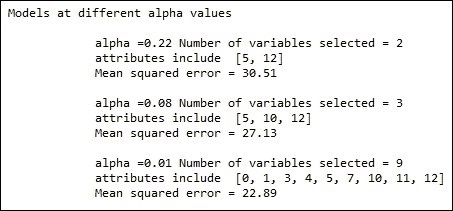

看看第一遍，这里我们的 alpha 值是`0.22`。只有两个系数具有非零值，`5`和`12`。均方差为`30.51`，仅比拟合所有变量的模型多`9`。

同样，对于`0.08`的 alpha 值，有三个非零系数。我们可以看到均方误差有所改善。最后，使用`0.01` alpha 值，从 13 个属性中选择 9 个，并且均方误差非常接近使用所有属性建立的模型。

正如你所看到的，我们没有把所有的属性都放在模型中。我们能够使用 LASSO 自动选择属性的子集。因此，我们已经看到了套索是如何用于变量选择的。


## 还有更多……

通过只保留最重要的变量，LASSO 避免了过度拟合。然而，正如你所看到的，均方误差值并不是那么好。我们可以看到，由于套索，预测能力有所损失。

如前所述，在相关变量的情况下，LASSO 只选择其中一个，而 ridge 为两个变量的系数分配相同的权重。因此，与 LASSO 相比，ridge 具有更高的预测能力。然而，套索可以做可变选择，这是山脊所不能做到的。

### 注意

有关套索和脊方法的更多信息，请参考由*特雷弗·哈斯蒂等人*所著的《稀疏统计学习:套索和推广》一书。


## 参见

*   *缩放数据*配方[第三章](part0043_split_000.html#190861-6b04b7c0b98f44a0b8f82924fef317ec "Chapter 3. Data Analysis – Explore and Wrangle")、*数据分析——探索与争论*
*   *标准化数据*配方[第三章](part0043_split_000.html#190861-6b04b7c0b98f44a0b8f82924fef317ec "Chapter 3. Data Analysis – Explore and Wrangle")、*数据分析——探索与争论*
*   *准备建模数据[第六章](part0073_split_000.html#25JP21-6b04b7c0b98f44a0b8f82924fef317ec "Chapter 6. Machine Learning 1")、*机器学习一*中的*配方
*   *回归与 L2 缩-岭*配方[第七章](part0078_split_000.html#2ACBS1-6b04b7c0b98f44a0b8f82924fef317ec "Chapter 7. Machine Learning 2")，*机器学习 II*


# 使用带有 L1 和 L2 收缩的交叉验证迭代器

在前一章中，我们看到了将数据分成训练集和测试集的方法。在随后的菜谱中，我们再次对测试数据集执行分割，以获得开发数据集。这个想法是让测试集远离模型构建周期。然而，由于我们需要不断地改进我们的模型，我们使用 dev set 在每次迭代中测试模型的准确性。虽然这是一个很好的方法，但是如果我们没有一个大的数据集，这个方法很难实现。我们希望提供尽可能多的数据来训练我们的模型，但仍然需要保留一些数据用于评估和最终测试。在许多现实场景中，很少会出现非常大的数据集。

在这个食谱中，我们将看到一种叫做交叉验证的方法来帮助我们解决这个问题。这种方法通常被称为 k 重交叉验证。训练集被分成 k 倍。该模型在 K-1 (K 减 1)个折叠上被训练，并且留下的折叠用于测试。这样，我们就不需要单独的开发数据集了。

让我们看看 scikit-learn 库提供的一些迭代器，它们可以有效地执行 k 倍交叉验证。有了交叉验证的知识，我们将进一步了解如何利用交叉验证来选择收缩法中的α值。


## 准备就绪

我们将使用 Iris 数据集来演示各种交叉验证迭代器概念。我们将返回到我们的波士顿住房数据集来演示如何成功地使用交叉验证来找到收缩方法中的理想 alpha 值。


## 怎么做……

让我们看看如何使用交叉验证迭代器:

```py
from sklearn.datasets import load_iris
from sklearn.cross_validation import KFold,StratifiedKFold

def get_data():
    data = load_iris()
    x = data['data']
    y = data['target']
    return x,y

def class_distribution(y):
        class_dist = {}
        total = 0
        for entry in y:
            try:
                class_dist[entry]+=1
            except KeyError:
                class_dist[entry]=1
            total+=1

        for k,v in class_dist.items():
            print "\tclass %d percentage =%0.2f"%(k,v/(1.0*total))

if __name__ == "__main__":
    x,y = get_data()
    # K Fold
    # 3 folds
    kfolds = KFold(n=y.shape[0],n_folds=3)
    fold_count  =1
    print
    for train,test in kfolds:
        print "Fold %d x train shape"%(fold_count),x[train].shape,\
        " x test shape",x[test].shape
        fold_count==1
    print
    #Stratified KFold
    skfolds = StratifiedKFold(y,n_folds=3)
    fold_count  =1
    for train,test in skfolds:
        print "\nFold %d x train shape"%(fold_count),x[train].shape,\
        " x test shape",x[test].shape
        y_train = y[train]
        y_test  = y[test]
        print "Train Class Distribution"
        class_distribution(y_train)
        print "Test Class Distribution"
        class_distribution(y_test)

        fold_count+=1

    print
```

在我们的主函数中，我们将调用`get_data`函数来加载 Iris 数据集。然后，我们将继续演示一个简单的 k 倍和分层的 k 倍。

有了 k 倍交叉验证的知识，让我们写一个处方来利用这个在增强岭回归中新发现的知识:

```py
# Load libraries
from sklearn.datasets import load_boston
from sklearn.cross_validation import KFold,train_test_split
from sklearn.linear_model import Ridge
from sklearn.grid_search import GridSearchCV
from sklearn.metrics import mean_squared_error
from sklearn.preprocessing import PolynomialFeatures
import numpy as np

def get_data():
    """
    Return boston dataset
    as x - predictor and
    y - response variable
    """
    data = load_boston()
    x    = data['data']
    y    = data['target']
    return x,y    
```

我们将从加载所有必需的库开始。接下来我们将定义我们的第一个函数`get_data()`。在这个函数中，我们将读取波士顿数据集，并将其作为预测值`x`和响应变量`y`返回。

在我们的下一个`build_model`函数中，我们将使用给定的数据构建我们的岭回归模型。我们将利用 k 倍交叉验证。

下面两个函数，`view_model`和`model_worth`，用于自省我们构建的模型。

最后，我们将编写`display_param_results`函数来查看每个折叠中的模型误差:

```py
def build_model(x,y):
    """
    Build a Ridge regression model
    """
    kfold = KFold(y.shape[0],5)
    model = Ridge(normalize=True)

    alpha_range = np.linspace(0.0015,0.0017,30)
    grid_param = {"alpha":alpha_range}
    grid = GridSearchCV(estimator=model,param_grid=grid_param,cv=kfold,scoring='mean_squared_error')
    grid.fit(x,y)
    display_param_results(grid.grid_scores_)
    print grid.best_params_
    # Track the scores- Mean squared residual for plot
    return grid.best_estimator_

def view_model(model):
    """
    Look at model coeffiecients
    """
    #print "\n Estimated Alpha = %0.3f"%model.alpha_
    print "\n Model coeffiecients"
    print "======================\n"
    for i,coef in enumerate(model.coef_):
        print "\tCoefficient %d  %0.3f"%(i+1,coef)

    print "\n\tIntercept %0.3f"%(model.intercept_)

def model_worth(true_y,predicted_y):
    """
    Evaluate the model
    """
    print "\tMean squared error = %0.2f"%(mean_squared_error(true_y,predicted_y))
    return mean_squared_error(true_y,predicted_y)

def display_param_results(param_results):
    fold = 1
    for param_result in param_results:
        print "Fold %d Mean squared error %0.2f"%(fold,abs(param_result[1])),param_result[0]
        fold+=1
```

最后，我们将编写我们的`main`函数，它被用来调用所有前面的函数:

```py
if __name__ == "__main__":

    x,y = get_data()

    # Divide the data into Train and test    
    x_train,x_test,y_train,y_test = train_test_split(x,y,test_size = 0.3,random_state=9)

    #Prepare some polynomial features
    poly_features = PolynomialFeatures(interaction_only=True)
    poly_features.fit(x_train)
    x_train_poly = poly_features.transform(x_train)
    x_test_poly  = poly_features.transform(x_test)

    choosen_model = build_model(x_train_poly,y_train)
    predicted_y = choosen_model.predict(x_train_poly)
    model_worth(y_train,predicted_y)

    view_model(choosen_model)

    predicted_y = choosen_model.predict(x_test_poly)
    model_worth(y_test,predicted_y)
```


## 它是如何工作的……

让我们从我们主要的方法开始。我们将从`KFold`类开始。这个迭代器类是用数据集中的实例数和我们需要的折叠数来实例化的:

```py
kfolds = KFold(n=y.shape[0],n_folds=3)
```

现在，我们可以迭代折叠，如下所示:

```py
fold_count =1
print
for train,test in kfolds:
print "Fold %d x train shape"%(fold_count),x[train].shape,\
" x test shape",x[test].shape
fold_count==1
```

让我们看看打印语句的输出:

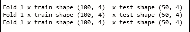

我们可以看到数据被分成三个部分，每个部分有 100 个实例要训练，50 个实例要测试。

接下来我们将继续讨论`StratifiedKFold`。回想一下我们在前一章中关于在训练和测试分裂中有一个统一的类分布的讨论。`StratifiedKFold`在三个褶皱上实现均匀的等级分布。

它的调用如下:

```py
skfolds = StratifiedKFold(y,n_folds=3)
```

由于需要知道数据集中类标签的分布，这个迭代器对象将响应变量`y`作为其参数之一。另一个参数是请求的折叠次数。

让我们打印出我们的火车的形状和这三个折叠中的测试集，以及它们的类分布。我们将使用`class_distribution`函数打印每个文件夹中类的分布:

```py
fold_count =1
for train,test in skfolds:
print "\nFold %d x train shape"%(fold_count),x[train].shape,\
" x test shape",x[test].shape
y_train = y[train]
y_test = y[test]
print "Train Class Distribution"
class_distribution(y_train)
print "Test Class Distribution"
class_distribution(y_test)

fold_count+=1
```

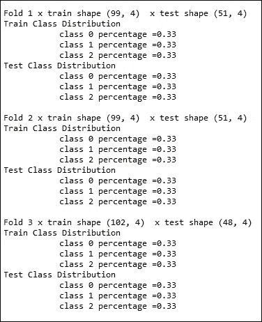

你可以看到这些类是均匀分布的。

让我们假设你建立了一个五重数据集，你拟合了五个不同的模型，你有五个不同的精度分数。你现在可以用这些分数的平均值来评估你的模型有多好。如果您不满意，您可以继续使用一组不同的参数重新构建您的模型，并再次在五倍数据上运行它，查看平均准确度分数。这样，您可以通过仅使用训练数据集找到正确的参数值来不断改进模型。

有了这些知识，让我们重温一下我们的老岭回归问题。

让我们从`main`模块开始，按照代码进行操作。我们将使用`get_data`函数加载预测值`x`和响应变量`y`。这个函数调用 scikit-learn 的方便的`load_boston()`函数，以 NumPy 数组的形式检索波士顿房价数据集。

我们将进行到使用 scikit-learn 库中的`train_test_split`函数将数据分成训练和测试集。我们将保留 30%的数据集进行测试。

然后，我们将构建多项式特征:

```py
poly_features = PolynomialFeatures(interaction_only=True)
poly_features.fit(x_train)
```

如你所见，我们将`interaction_only`设置为`true`。通过将`interaction_only`设置为`true`——带有`x1`和`x2`属性——只创建了`x1*x2`属性。`x1`和`x2`的平方不创建，假设度数为二。默认度数为二:

```py
x_train_poly = poly_features.transform(x_train)
x_test_poly = poly_features.transform(x_test)
```

使用转换函数，我们将转换我们的训练和测试数据集以包含多项式特征。让我们调用`build_model`函数。我们在`build_model`函数中注意到的第一件事是 k-fold 声明。我们将在这里应用我们的交叉验证知识，并创建一个五重数据集:

```py
kfold = KFold(y.shape[0],5)
```

然后，我们将创建我们的山脊对象:

```py
model = Ridge(normalize=True)
```

现在让我们看看如何利用我们的 k 倍来计算岭回归的理想 alpha 值。在下一行，我们将从`GridSearchCV:`中创建一个对象

```py
grid = GridSearchCV(estimator=model,param_grid=grid_param,cv=kfold,scoring='mean_squared_error')
```

`GridSearchCV`是 scikit-learn 提供的一个方便的功能，可以帮助我们用一系列参数训练我们的模型。在这种情况下，我们希望找到理想的 alpha 值，因此，希望用不同的 alpha 值来训练我们的模型。让我们看看传递给`GridSearchCV`的参数:

估计器:这是应该用给定的参数和数据运行的模型类型。在我们的例子中，我们想要运行岭回归。因此，我们将创建一个山脊对象，并将其传递给`GridSearchCV`。

Param-grid:这是一个包含参数的字典，我们希望根据它来评估我们的模型。让我们详细地解决这个问题。我们将首先声明我们想要建立模型的阿尔法值的范围:

```py
alpha_range = np.linspace(0.0015,0.0017,30)
```

这给了我们一个由 30 个均匀间隔的元素组成的 NumPy 数组，从 0.0015 开始，到 0.0017 结束。我们希望为这些价值中的每一个建立一个模型。我们将创建一个名为`grid_param`的字典对象，并用生成的 alpha 值的 NumPy 数组在 alpha 键下创建一个条目:

```py
grid_param = {"alpha":alpha_range}
```

我们将把这个字典作为参数传递给`GridSearchCV`。看词条，`param_grid=grid_param`。

Cv:这定义了我们感兴趣的交叉验证的种类。我们将把之前创建的 k-fold(五重)迭代器作为 cv 参数传递。

最后，我们需要定义一个评分函数。在我们的例子中，我们感兴趣的是找出平方误差。这是我们评估模型的标准。

因此，internal `GridSearchCV`将为我们的每个参数值构建五个模型，并返回在遗漏折叠中测试时的平均分数。在我们的例子中，我们有五层测试数据，所以返回这五层测试数据的平均值。

有了这个解释，我们就可以拟合我们的模型，也就是说，开始我们的网格搜索活动。

最后，我们希望看到不同参数设置下的输出。我们将使用`display_param_results`函数显示不同折叠的平均均方误差:

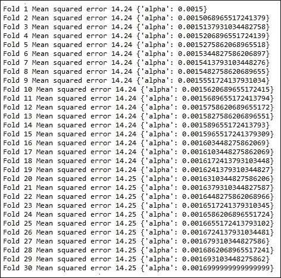

输出中的每一行显示来自测试折叠的参数α值和平均均方误差。我们可以看到，随着深入到 0.0016 范围，均方误差也在增加。因此，我们决定停在 0.0015。我们可以查询网格对象以获得最佳的参数和估计量:

```py
print grid.best_params_
return grid.best_estimator_
```

这不是我们测试的第一组 alpha 值。我们的初始阿尔法值如下:

```py
alpha_range = np.linspace(0.01,1.0,30)
```

以下是我们的输出:


当我们的 alpha 值超过 0.01 时，均方误差急剧上升。因此，我们再次给出了一个新的范围:

```py
alpha_range = np.linspace(0.001,0.1,30)
```

我们的输出如下:


这样，迭代地我们到达了从 0.0015 开始到 0.0017 结束的范围。

然后，我们将从网格搜索中获得最佳估计值，并将其应用于我们的训练和测试数据:

```py
choosen_model = build_model(x_train_poly,y_train)
predicted_y = choosen_model.predict(x_train_poly)
model_worth(y_train,predicted_y)
```

我们的`model_worth`函数打印训练数据集中的均方误差值:


让我们来看看我们的系数权重:


我们没有显示所有的，但是当你运行代码时，你可以查看所有的值。

最后，让我们将模型应用到我们的测试数据集:


因此，我们使用交叉验证和网格搜索来成功地得出岭回归的α值。与岭回归方法中的值相比，我们的模型产生了更低的均方误差。


## 还有更多……

scikit-learn 还提供了其他交叉验证迭代器。这里特别有趣的是留一迭代器。你可以在[http://sci kit-learn . org/stable/modules/cross _ validation . html # leave-one-out-loo](http://scikit-learn.org/stable/modules/cross_validation.html#leave-one-out-loo)了解更多信息。

在这个方法中，给定折叠的数量，它留下一个记录进行测试，并将其余的返回给训练。例如，如果你的输入数据有 100 个实例，如果我们需要五次折叠，我们将得到 99 个实例来训练，每个折叠中有一个来测试。

在我们之前使用的网格搜索方法中，如果我们不为**交叉验证** ( **cv** )参数提供自定义迭代器，它将默认使用留一交叉验证方法:

```py
grid = GridSearchCV(estimator=model,param_grid=grid_param,cv=None,scoring='mean_squared_error')
```


## 参见

*   *缩放数据*配方[第三章](part0043_split_000.html#190861-6b04b7c0b98f44a0b8f82924fef317ec "Chapter 3. Data Analysis – Explore and Wrangle")、*数据分析——探索与争论*
*   *标准化数据*配方[第三章](part0043_split_000.html#190861-6b04b7c0b98f44a0b8f82924fef317ec "Chapter 3. Data Analysis – Explore and Wrangle")、*数据分析——探索与争论*
*   *准备建模数据[第六章](part0073_split_000.html#25JP21-6b04b7c0b98f44a0b8f82924fef317ec "Chapter 6. Machine Learning 1")、*机器学习一*中的*配方
*   *回归与 L2 缩-岭*配方[第七章](part0078_split_000.html#2ACBS1-6b04b7c0b98f44a0b8f82924fef317ec "Chapter 7. Machine Learning 2")，*机器学习 II*
*   *回归与 L2 收缩——套索*配方[第七章](part0078_split_000.html#2ACBS1-6b04b7c0b98f44a0b8f82924fef317ec "Chapter 7. Machine Learning 2")，*机器学习 II*