# 十、R 时间序列挖掘

本章涵盖以下主题:

*   创建时间序列数据
*   绘制时间序列对象
*   分解时间序列
*   平滑时间序列
*   预测时间序列
*   选择 ARIMA 模型
*   创建 ARIMA 模型
*   用 ARIMA 模型进行预测
*   用 ARIMA 模型预测股票价格

# 简介

人类历史上时间序列分析的第一个例子发生在古埃及。古埃及人每天记录尼罗河的涨潮和退潮，记录肥沃的淤泥和水分何时出现。基于这些记录，他们发现洪水期开始于太阳升起的同时，天狼星系统变得可见。通过能够预测洪水期，古埃及人能够做出复杂的农业决策，极大地提高了他们农业活动的产量。

正如古埃及洪水时期的例子所示，时间序列分析是一种可以从具有时间信息的数据中提取模式或有意义的统计数据的方法。它允许我们根据观察到的结果预测未来的价值。人们可以对任何具有时间信息的数据进行时间序列分析。例如，经济学家可以进行时间序列分析来预测一个国家的 GDP 增长率。此外，网站管理员可以创建一个网络指标来预测网站访问者的增长率或页面浏览量。

在这一章中，我们将介绍涉及创建和绘制时间序列对象的方法。我们还介绍了如何分解和平滑时间序列对象，以及如何基于时间序列分析预测未来值。接下来，我们将讨论 ARIMA 模型如何处理时间序列对象。最后，我们介绍了如何用 ARIMA 模型预测股票的未来价值。


# 创建时间序列数据

为了开始时间序列分析，我们需要从一个数字向量或矩阵创建一个时间序列对象。在这个菜谱中，我们介绍如何用`ts`函数从台积电(2330.TW)的财务报告中创建一个时序对象。

## 准备就绪

从以下 GitHub 链接下载`tw2330_finance.csv`数据集:

[https://github . com/yw chiu/rcookbook/raw/master/chapter 10/tw 2330 _ finance . CSV](https://github.com/ywchiu/rcookbook/raw/master/chapter10/tw2330_finance.csv)

## 怎么做……

请执行以下步骤来创建时间序列数据:

1.  先把台积电的财报读成 R 节:

    ```

    > tw2330 = read.csv('tw2330_finance.csv', header=TRUE)

    > str(tw2330)

    'data.frame': 32 obs. of  5 variables:

     $ Time            : Factor w/ 32 levels "2008Q1","2008Q2",..: 1 2 3 4 5 6 7 8 9 10 ...

     $ Total.Income    : int  875 881 930 646 395 742 899 921 922 1050 ...

     $ Gross.Sales     : num  382 402 431 202 74.8 343 429 447 442 519 ...

     $ Operating.Income: num  291 304 329 120 12.1 251 320 336 341 405 ...

     $ EPS             : num  1.1 1.12 1.17 0.48 0.06 0.95 1.18 1.26 1.3 1.55 ...

    ```

2.  使用`ts`函数将财务数据转换为时间序列对象:

    ```

    > m <- ts(tw2330$Total.Income, frequency= 4, start=c(2008, 1))

    ```

3.  使用`class`函数确定数据类型:

    ```

    > class(m)

    [1] "ts"

    ```

4.  打印时间序列对象的内容:

    ```

    > m

     Qtr1 Qtr2 Qtr3 Qtr4

    2008  875  881  930  646

    2009  395  742  899  921

    2010  922 1050 1122 1101

    2011 1054 1105 1065 1047

    2012 1055 1281 1414 1313

    2013 1328 1559 1626 1458

    2014 1482 1830 2090 2225

    2015 2220 2054 2125 2035

    ```

5.  我们可以使用`window`来子集化时间序列对象:

    ```

    > m2 <- window(m, start=c(2012, 2), end=c(2014, 2)) 

    > m2

     Qtr1 Qtr2 Qtr3 Qtr4

    2012      1281 1414 1313

    2013 1328 1559 1626 1458

    2014 1482 1830 

    ```

6.  或者，我们可以将整个`data.frame`转换成一个`ts`对象:

    ```

    > m_ts <- ts(tw2330[,-1], start=c(2008,01), frequency = 4)

    > class(m_ts)

    [1] "mts"    "ts"     "matrix"

    > head(m_ts)

     Total.Income Gross.Sales Operating.Income  EPS

    [1,]          875       382.0            291.0 1.10

    [2,]          881       402.0            304.0 1.12

    [3,]          930       431.0            329.0 1.17

    [4,]          646       202.0            120.0 0.48

    [5,]          395        74.8             12.1 0.06

    [6,]          742       343.0            251.0 0.95

    ```

7.  最后，我们可以从时序对象:

    ```

    > m_ts[,"EPS"]

     Qtr1 Qtr2 Qtr3 Qtr4

    2008 1.10 1.12 1.17 0.48

    2009 0.06 0.95 1.18 1.26

    2010 1.30 1.55 1.81 1.57

    2011 1.40 1.39 1.17 1.22

    2012 1.29 1.61 1.90 1.60

    2013 1.53 2.00 2.00 1.73

    2014 1.85 2.30 2.94 3.09

    2015 3.05 3.06 2.91 2.81

    ```

    中打印每股收益信息

## 它是如何工作的……

时间序列是按时间索引的随机变量序列。可以将 GDP、CPI、股票指数、网站指标或任何具有时间信息的数据作为时间序列对象。在 R 中，我们可以使用`ts`函数从给定的向量或矩阵中创建时间序列数据。

在这个食谱中，我们首先从 GitHub 下载`tw2330_finance.csv`。此数据集包含台湾最大的公司台湾半导体(2330)的时间、总收入、总销售额、运营收入和 EPS。TW)。接下来，我们将数据集作为 R `data.frame`读入 R 会话。在下面的步骤中，我们将这个数据集转换成一个时序对象。

接下来，我们用`ts`函数将台积电的总收入转换成时间序列数据。由于是季度数据集，我们设置频率等于`4`；我们还配置了第一次观察的时间，从 2008 年第一季度开始。接下来，我们检查时间序列数据的数据类型并打印内容。从内容中，我们按季度和年份分离数据集。此外，为了对数据集进行子集划分，我们使用`window`函数对给定时间间隔的数据进行子集划分。

除了从给定的向量创建数据，我们还可以从 data.frame 创建时间序列数据。这使我们能够从时间序列数据中检查每股收益信息。

## 还有更多……

除了使用`ts`函数创建一个时间序列对象，您还可以使用`xts`包创建一个可扩展的时间序列对象。这个包提供了更简单、更有用的 API 来处理时间序列数据:

1.  首先安装并加载`xts`包:

    ```

    > install.packages("xts")

    > library(xts)

    ```

2.  用`as.xts`函数将时间序列数据转换成 xts 对象:

    ```

    > m.xts <- as.xts(m)

    ```

3.  使用`head`函数检查前六行:

    ```

    > head(m.xts)

     [,1]

    2008 Q1  875

    2008 Q2  881

    2008 Q3  930

    2008 Q4  646

    2009 Q1  395

    2009 Q2  742

    ```

4.  我们可以用`window`函数对`xts`系列进行子集化:

    ```

    > sub.m.xts <- window(m.xts, start = "2010 Q1", end = "2012 Q1")

    > sub.m.xts

     [,1]

    2010 Q1  922

    2010 Q2 1050

    2010 Q3 1122

    2010 Q4 1101

    2011 Q1 1054

    2011 Q2 1105

    2011 Q3 1065

    2011 Q4 1047

    2012 Q1 1055

    ```


# 绘制时间序列对象

绘制时间序列对象将使趋势和季节构成清晰可见。在本食谱中，我们介绍如何使用`plot.ts`功能绘制时间序列数据。

## 准备就绪

通过生成一个时间序列对象并将其存储在两个变量:`m`和`m_ts`中，确保您已经完成了前面的配方。

## 怎么做……

请执行以下步骤绘制时间序列数据:

1.  首先，使用`plot.ts`函数绘制时间序列数据，`m`:

    ```

    > plot.ts(m)

    ```

    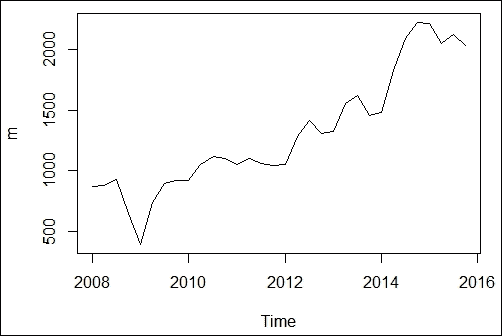

    图 1:单一时间序列数据的时间序列图

2.  同样，如果数据集包含多个时间序列对象，您可以在单独的子图中绘制多个时间序列数据:

    ```

    > plot.ts(m_ts, plot.type = "multiple",)

    ```

    

    图 2:多个时间序列数据的时间序列图

3.  或者，您可以在一个图形中绘制所有四个时间序列对象:

    ```

    > plot.ts(m_ts, plot.type = "single", col=c("red","green","blue", "orange"))

    ```

    

    图 3:不同颜色的多时间序列图

4.  而且，您可以独家绘制 EPS 时间序列信息:

    ```

    > plot.ts(m_ts[,"EPS"])

    ```

    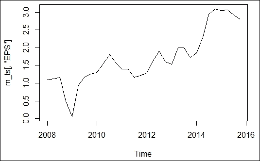

    图 4:每股收益时间序列图

## 它是如何工作的……

要探索时间序列数据趋势，您可以使用`plot.ts`功能创建时间序列图。在这个食谱的开始，我们做了一个台湾半导体总收入的时间序列图。从图中我们不难看出，在 2009 年营收大幅下滑后，台积电的整体营收逐年递增。除了从单个时间序列对象绘制图表之外，还可以通过将`plot.type`设置为`multiple`在不同的子图中绘制四个不同的指标。*图 2* 显示所有四个财务指标遵循相似的趋势。此外，我们可以在同一张图中标出所有四个指标。最后，我们展示了我们可以专门从一个`mts`对象绘制 EPS 数据。

## 还有更多……

对于`xts`对象，可以使用`plot.xts`函数来绘制时间序列数据。以下命令显示了如何绘制一个`xts`对象`m.xts`的总收入图:

```

> plot.xts(m.xts)

```


图 5:总收入时间序列图


# 分解时间序列

季节性时间序列由季节性成分、确定性趋势成分和不规则成分组成。在这个菜谱中，我们介绍如何使用`decompose`函数将一个时间序列分解成这三个部分。

## 准备就绪

通过生成一个时间序列对象并将其存储在两个变量:`m`和`m_ts`中，确保您已经完成了前面的配方。

## 怎么做……

请执行以下步骤来分解时间序列:

1.  首先，使用 `window`函数构造一个时间序列对象`m.sub`，从`m`:

    ```

    > m.sub = window(m, start=c(2012, 1), end=c(2014, 4)) 

    > m.sub

     Qtr1 Qtr2 Qtr3 Qtr4

    2012 1055 1281 1414 1313

    2013 1328 1559 1626 1458

    2014 1482 1830 2090 2225

    > plot(m.sub)

    ```

    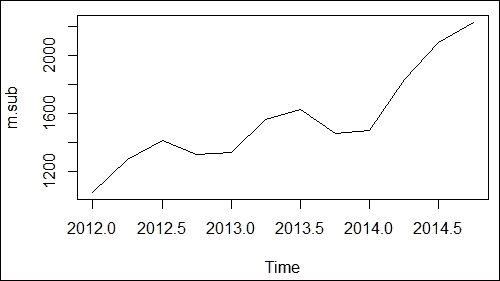

    图 6:一个季度的时间序列图

2.  使用`decompose`功能破坏时序对象`m.sub` :

    ```

    > components <- decompose(m.sub)

    ```

3.  然后我们可以使用`names`函数列出`components` :

    ```

    > names(components)

    [1] "x"        "seasonal" "trend"    "random"   "figure" 

    [6] "type" 

    ```

    的属性
4.  从分解的时间序列对象中发掘季节成分:

    ```

    > components$seasonal

     Qtr1       Qtr2       Qtr3       Qtr4

    2012 -124.96875   65.28125  127.59375  -67.90625

    2013 -124.96875   65.28125  127.59375  -67.90625

    2014 -124.96875   65.28125  127.59375  -67.90625

    ```

5.  使用`plot`函数绘制分解时间序列的组成:

    ```

    > plot(components)

    ```

    

    图 7:分解的时间序列数据

## 它是如何工作的……

从台湾半导体的季度财务报告中，我们发现该公司第三季度的利润普遍高于第一季度。根据这一观察，我们可以推断数据遵循季节性趋势。为了支持这一推论，我们可以从时间序列中分解出季节成分。为了实现这一点，我们使用`decompose`函数将时间序列分解成几个不同的部分。

对于季节性数据，我们可以将时间序列分解为以下三个部分:

*   **T(t)** :是确定性趋势分量，表现时间序列的线性趋势特征
*   **S(t)** :季节性成分，周期性地表现对时间序列的影响
*   **e(t)** :不规则成分，捕捉数据的白噪声

在 R 中，我们可以使用`decompose`函数将时间序列分解成不同的部分。我们首先以文本和折线图的形式打印台积电的时间序列数据。从图中，我们发现时间序列数据似乎受到季节性的影响。接下来，我们使用`decompose`函数来销毁时间序列数据。我们用的是加法模式，取如下公式: *Y(t) = T(t)+ S(t) + e(t)* 。或者，我们可以设置`type = "multiplicative"`用乘法模型来破坏一个时间序列: *Y(t) = T(t)* S(t) + e(t)* 。接下来，我们发现`decompose`函数返回一个列表，其中元素`x`是原始数据集，`"seasonal"`、`"trend"`、`"random"`分别对应季节性成分、趋势成分和不规则成分。最后，我们可以使用`plot`函数在分离的子图中绘制分解的组件。

## 还有更多……

**洛斯** ( **局部加权散点图平滑** ) 和**黄土** ( **局部加权平滑**)是将多项式回归模型拟合到局部数据子集的非参数方法。在`stl`函数中，我们可以用黄土法分解一个周期性的时间序列:

1.  在这个例子中，我们使用`stl`函数来分解一个周期性的时间序列:

    ```

    > comp1 <- stl(m.sub, s.window="periodic")

    > names(comp1)

    [1] "time.series" "weights"     "call"        "win" 

    [5] "deg"         "jump"        "inner"       "outer" 

    ```

2.  我们还可以使用`plot`函数来检查分解后的时间序列成分:

    ```

    > plot(ccomp1)

    ```

    

    图 8:黄土模型的分解时间序列图


# 平滑时间序列

时间序列分解允许我们从时间序列数据中提取不同的成分。平滑技术使我们能够预测时间序列数据的未来值。在这个菜谱中，我们介绍如何使用`HoltWinters`函数来平滑时间序列数据。

## 准备就绪

通过生成一个时间序列对象并将其存储在两个变量:`m`和`m_ts`中，确保您已经完成了前面的配方。

## 怎么做……

请执行以下步骤来平滑时间序列数据:

1.  首先，使用`HoltWinters`进行温特斯指数平滑:

    ```

    > m.pre <- HoltWinters(m)

    > m.pre

    Holt-Winters exponential smoothing with trend and additive seasonal component.

    Call:

    HoltWinters(x = m)

    Smoothing parameters:

     alpha: 0.8223689

     beta : 0.06468208

     gamma: 1

    Coefficients:

     [,1]

    a  1964.30088

    b    32.33727

    s1  -51.47814

    s2   17.84420

    s3  146.26704

    s4   70.69912

    ```

2.  Plot the smoothing result:

    ```

    > plot(m.pre)

    ```

    

    Figure 9: Time series chart with Winters exponential smoothing line

3.  我们现在可以找到模型的平方和误差:

    ```

    > m.pre$SSE

    [1] 733959.4

    ```

## 它是如何工作的……

在最基本的层面上，平滑使用移动平均，它平均历史观察值来计算可能的未来值。在 R 中，我们可以使用`stat`包中的`HoltWinters`函数来执行时间序列平滑。`HoltWinters`函数包含三种平滑方法，分别是简单指数平滑、霍尔特指数平滑和温特斯指数平滑。这三种方法都使用同一个函数`HoltWinters`。但是，我们可以根据给定的`alpha`、`beta`和`gamma`参数分别调用它们。

当数据没有趋势或季节模式时，执行简单的指数平滑。这种方法可以用下面的公式表示:

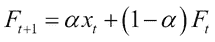

上式中，预测值为 *F* ，观测值为`x`，权重为，是介于`0`和`1`之间的一个值。从公式中，我们发现简单指数平均是一种加权预测；人们可以根据观察样本和以前的预测值进行预测。为了使用简单的指数平滑，我们需要在`HoltWinters`函数中将`beta`和`gamma`设置为`false`。

如果数据有趋势模式，但没有季节成分，我们可以使用霍尔特指数平滑法。这种方法估计给定时间序列的水平和斜率。我们可以用下面的公式来表示这个函数:

*   预测方程:
*   等级方程式: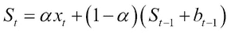
*   趋势方程:

其中 **S** 表示在时间 *t* 的水平估计值， *b* 表示在时间 *t* 的斜率估计值， *α* 是水平的平滑参数， *β* 表示趋势的平滑参数。 *α* 和 *β* 都在`0`和`1`之间。要使用霍尔特指数平滑，我们只需要在`HoltWinters`函数中设置`gamma`为`false`。

但是，如果时间序列数据包含趋势和季节模式，我们可以使用温特斯指数平滑来估计水平、趋势和季节成分:

*   预测方程:
*   季节方程: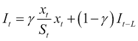
*   趋势方程:
*   等级方程式:

其中 *S* 表示时间 *t* 时水平的估计值， *b* 表示时间 *t* 时斜率的估计值， **I** 表示时间 *t* 时季节分量的估计值， *α* 是水平的平滑参数， *β* 表示趋势的平滑参数，*γ*三个参数 *α* 、 *β* 和 *γ* 都在`0`和`1`之间。要使用温特斯指数平滑，我们需要在`HoltWinters`函数中设置`alpha`、`beta`和`gamma`等于`true`。**

由于台湾半导体的季度财务报告显示趋势和季节模式，我们可以使用 Winters 算法来平滑时间序列数据。温特斯算法需要时间 *t* 的季节、趋势和水平参数。因此，我们需要对时间序列数据应用`HoltWinters`函数。接下来，当我们打印`HoltWinters`对象时，我们看到`alpha`的值等于`0.8223689`,`beta`的值等于`0.06468208`,`gamma`等于`1`，这意味着季节性成分在短期预测中的权重更大。

接下来，我们可以使用`plot`函数来绘制原始数据集和平滑的时间序列。黑线表示原始数据集，红线表示平滑的时间序列。该图显示季节性因素对时间序列数据集有显著影响。最后，我们可以打印平滑后的时间序列的误差平方和。这可以用来比较哪个模型在平滑方面表现最好。

## 还有更多……

除了使用`stat`包中的`HoltWinters`函数，我们还可以使用`fpp`包来代替。`fpp`包包含许多来自时间序列和线性模型的预测函数；你也可以在这个包中找到`HoltWinters`功能。以下步骤显示了如何用`hw`函数拟合时间序列平滑模型:

1.  首先安装并加载`fpp`包:

    ```

    > install.packages("fpp")

    > library(fpp)

    ```

2.  然后我们可以用温特斯算法平滑时间序列数据:

    ```

    > fit <- hw(m,seasonal="additive")

    > summary(fit)

    Forecast method: Holt-Winters' additive method

    Model Information:

    Holt-Winters' additive method 

    Call:

     hw(x = m, seasonal = "additive") 

     Smoothing parameters:

     alpha = 0.9997 

     beta  = 1e-04 

     gamma = 1e-04 

     Initial states:

     l = 741.2403 

     b = 36.2694 

     s=-15.2854 87.8547 23.7596 -96.3288

     sigma:  122.9867

     AIC     AICc      BIC 

    434.8764 441.1373 446.6023 

    Error measures:

     ME     RMSE      MAE       MPE     MAPE

    Training set 4.643746 122.9867 96.73317 -1.034705 9.364536

     MASE      ACF1

    Training set 0.3867117 0.2207188

    Forecasts:

     Point Forecast    Lo 80    Hi 80    Lo 95    Hi 95

    2016 Q1       1990.276 1832.663 2147.890 1749.227 2231.326

    2016 Q2       2146.609 1923.716 2369.503 1805.724 2487.495

    2016 Q3       2246.996 1974.001 2519.991 1829.487 2664.506

    2016 Q4       2180.148 1864.897 2495.398 1698.014 2662.281

    2017 Q1       2135.420 1782.945 2487.895 1596.356 2674.484

    2017 Q2       2291.753 1905.618 2677.888 1701.211 2882.296

    2017 Q3       2392.140 1975.046 2809.234 1754.250 3030.030

    2017 Q4       2325.291 1879.370 2771.213 1643.313 3007.270

    ```

3.  最后，我们可以绘制原始时间序列和平滑后的时间序列:

    ```

    > plot.ts(m)

    > lines(fitted(fit), col="red")

    ```

    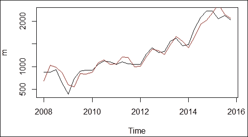

    图 10:带有温特斯平滑线的时间序列图


# 预测时间序列

在使用`HoltWinters`建立时间序列平滑模型后，我们现在可以基于平滑模型预测未来值。在这个菜谱中，我们介绍如何使用`forecast`函数对时间序列数据进行预测。

## 准备就绪

在这个配方中，你必须通过用`HoltWinters`生成一个平滑模型来完成前一个配方，并将其存储在变量`m.pre`中。

## 怎么做……

请执行以下步骤来预测台湾半导体的未来收入:

1.  加载`forecast`包:

    ```

    > library(forecast)

    ```

2.  我们可以用`forecast`函数来预测未来四个季度的收入:

    ```

    > income.pre <- forecast.HoltWinters(m.pre, h=4)

    > summary(income.pre)

    Forecast method: HoltWinters

    Model Information:

    Holt-Winters exponential smoothing with trend and additive seasonal component.

    Call:

    HoltWinters(x = m)

    Smoothing parameters:

     alpha: 0.8223689

     beta : 0.06468208

     gamma: 1

    Coefficients:

     [,1]

    a  1964.30088

    b    32.33727

    s1  -51.47814

    s2   17.84420

    s3  146.26704

    s4   70.69912

    Error measures:

     ME     RMSE      MAE     MPE     MAPE

    Training set 36.86055 168.9165 145.4323 5.76714 14.77564

     MASE      ACF1

    Training set 0.6000302 0.2497206

    Forecasts:

     Point Forecast    Lo 80    Hi 80    Lo 95    Hi 95

    2016 Q1       1945.160 1730.025 2160.295 1616.140 2274.180

    2016 Q2       2046.820 1760.876 2332.763 1609.506 2484.133

    2016 Q3       2207.580 1858.743 2556.416 1674.080 2741.079

    2016 Q4       2164.349 1756.533 2572.165 1540.649 2788.050

    ```

3.  剧情预测结果:

    ```

    > plot(income.pre)

    ```

    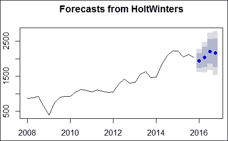

    图 11:预测收入的时间序列图

4.  为了度量我们的模型，我们可以使用`acf`函数来计算自相关函数的估计值:

    ```

    > acf(income.pre$residuals)

    ```

    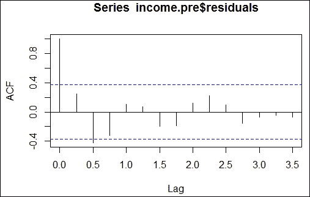

    图 12:自相关图

5.  或者，我们可以对产生的残差执行 Ljung-Box 测试:

    ```

    > Box.test(income.pre$residuals)

     Box-Pierce test

    data:  income.pre$residuals

    X-squared = 1.7461, df = 1, p-value = 0.1864

    ```

## 它是如何工作的……

在前面的配方中生成了温特斯指数平滑模型后，我们现在可以基于平滑模型进行数值预测。我们首先将`forecast`包加载到 R 会话中。接下来，我们使用`forecast`包中的`forecast.HoltWinters`函数进行预测。这里我们设定`h=4`来预测台积电未来四个季度的收入。

我们使用一个`plot`函数来绘制预测结果。从图中，我们发现在时间序列的末尾有一个蓝色的阴影部分。深色阴影覆盖了我们预测的 80%置信区间，浅色阴影显示了 95%置信区间。

建立预测模型后，我们可能需要评估预测模型。与回归模型类似，我们可以使用残差(样本内误差)来评估我们的模型。也就是说，如果我们可以证明残差服从白噪声分布，我们可以得出结论，残差序列(或误差)是由随机过程生成的。这意味着模型是充分的，因为它包括了时间序列的大部分信息。

有许多方法可以评估剩余序列；最直观的测试之一是根据残差绘制自相关图。这里，我们使用`acf`函数来计算残差并绘制自相关图。黑线表示自相关系数，两条蓝色虚线表示置信区间，即自相关系数的上限和下限。如果自相关系数快速下降并落在边界之间，这意味着残差是白噪声。相反，如果系数总是高于或低于边界，这意味着残差是自相关的。在这种情况下，我们认为预测模型的残差序列不是自相关的。

或者，我们可以执行一个 Ljung-Box 测试来检查残差是否自相关。Ljung-Box 检验由以下假设组成:

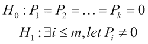

该测试使用 *Q* 统计来计算剩余序列的自相关系数，公式如下:

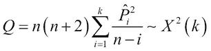

其中 *n* 是样本大小，是滞后 *i* 处的样本自相关，而 *k* 是被测试的滞后数。

在零假设下， *Q* 统计量遵循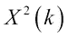，具有 *k* 自由度的卡方分布。然而，如果 *Q* 统计量高于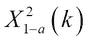，即自由度为 *k* 的卡方分布的分位数，我们可以拒绝零假设。

在这个例子中，我们对剩余序列应用了`Box.test`函数；我们发现 *p* 的值是`0.1864`，这意味着我们不能拒绝零假设。简单地说，这意味着残差是白色的噪声，这证明了我们的模型在价值预测方面是足够的。

## 还有更多……

按照前面的例子，我们还可以通过使用`fpp`包中的预测函数进行收入预测:

1.  首先加载`fpp`包:

    ```

    > library(fpp)

    ```

2.  我们可以用`hw`函数从时间序列中得到平滑模型:

    ```

    > fit <- hw(m,seasonal="additive")

    ```

3.  将我们的预测叠加在一个时间序列图上:

    ```

    > plot(fit)

    ```

    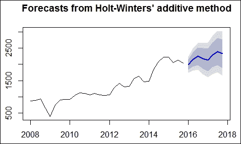

    图 13:霍尔特-温特斯加法预测


# 选择 ARIMA 模型

使用指数平滑法要求残差不相关。然而，在现实生活中，连续值之间不存在相互关联的情况是不太可能的。相反，我们可以使用 R 中的 ARIMA 来建立一个考虑自相关的时间序列模型。在这个食谱中，我们介绍如何使用 ARIMA 建立一个平滑模型。

## 准备就绪

在这个配方中，我们使用从 ARIMA 过程模拟的时间系列数据。

## 怎么做……

请执行以下步骤来选择 ARIMA 模型的参数:

1.  首先模拟一个 ARIMA 过程，用`arima.sim`函数生成时间序列数据:

    ```

    > set.seed(123)

    > ts.sim <- arima.sim(list(order = c(1,1,0), ar = 0.7), n = 100)

    > plot(ts.sim)

    ```

    

    图 14:模拟的时间序列数据

2.  我们接着可以取时间序列的差值:

    ```

    > ts.sim.diff <- diff(ts.sim)

    ```

3.  绘制差分时间序列:

    ```

    > plot(ts.sim.diff)

    ```

    

    图 15:差异时间序列图

4.  使用`acf`功能对进行自相关绘图:

    ```

    > acf(ts.sim.diff)

    ```

    

    图 16:自相关图

5.  您可以使用`pacf`功能制作偏相关图:

    ```

    > pacf(ts.sim.diff)

    ```

    

    图 17:部分自相关图

## 它是如何工作的……

**自回归综合** **移动平均模型**(通称 **ARIMA** )也被称为 Box-Jenkins 模型，以统计学家乔治·博克斯(George Box)和格温里姆·詹金斯(Gwilym Jenkins)的名字命名。ARIMA 模型的目的是找到时间序列模型与时间序列过去值的最佳拟合。

ARIMA 模型可以表述为 *ARIMA(p，d，q)* ，其中 *p* 是自回归模型的阶次， *d* 表示差分程度， *q* 表示移动平均模型。通常，将时间序列拟合到 ARIMA 模型需要以下五个步骤:

1.  将时间序列可视化。
2.  将非平稳时间序列与平稳时间序列区别开来。
3.  绘制 ACF 和 PACF 图，找出最优的 *p* 和 *q* 。
4.  建立 ARIMA 模型。
5.  做预测。

在这个食谱中，我们介绍如何遵循前三个步骤来确定 ARIMA 模型的自回归、差分和移动平均项。

我们首先使用自回归模型系数等于`0.7`且顺序为 *p=1* 、 *d=1* 和 *q=0* 的`arima.sim`函数来生成 100 个数据点。然后我们用`plot`函数可视化时间序列。从图中，我们发现一个非平稳的时间序列。因此，我们用`diff`函数将时间序列差分为平稳时间序列。我们现在可以画出差分数列。从结果图中，我们发现非平稳时间序列已被删除。

在下一步中，我们使用`acf`函数来检查差异序列的自相关图。随着自相关系数逐渐变小，我们可以把差分时间序列看作一个平稳序列。因此，我们可以确定差分参数 *d* 等于`1`。

接下来我们可以让自相关和偏自相关图确定 *p* 和 *q* 的参数，分别对应自回归模型和移动平均模型的阶数。这里，我们可以考虑以下 ACF 和 PACF 行为来确定参数:

| 

模型

 | 

advancedcommunicationsfunction 高级通信功能

 | 

PACF

 |
| --- | --- | --- |
| **AR(p)** | 逐渐减弱 | 在 *p* 滞后后切断 |
| **马(q)_** | 在 *q* 滞后后切断 | 逐渐减弱 |
| **ARMA(p，q)** | 逐渐减弱 | 逐渐减弱 |

自相关曲线逐渐变小，并且 *PACF* 在一个滞后之后切断。这样，我们就可以确定它与 AR 模型的拟合度最好，很有可能 *p* 等于`1`， *q* 等于`0`。

## 还有更多……

要绘制时间序列及其 ACF 和/或 PACF，您可以使用`tsdisplay`或 `ggtsdisplay`函数:

```

> tsdisplay(ts.sim.diff)

```


图 18:带有自相关和部分自相关图的时间序列图

```

> ggtsdisplay(ts.sim.diff)

```

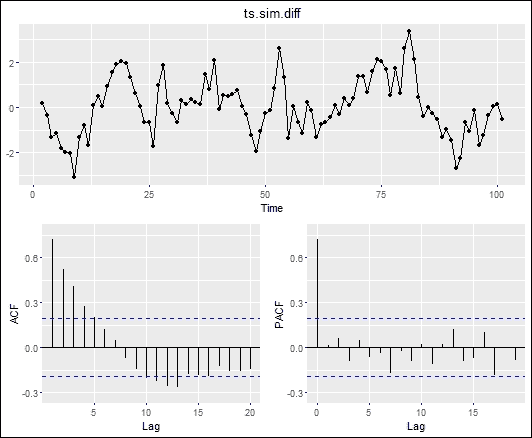

图 19:用 ggtsdisplay 制作的时间序列图


# 创建 ARIMA 模型

在为 ARIMA 模型确定了最优 *p* 、 *d* 和 *q* 参数之后，我们现在可以用`Arima`函数创建一个 ARIMA 模型。

## 准备就绪

通过生成时间序列对象并将其存储在变量`ts.sim`中，确保您已经完成了之前的制作方法。

## 怎么做……

请执行以下步骤来构建 ARIMA 模型:

1.  首先，我们可以建立一个时间序列为`ts.sim`的 ARIMA 模型，参数为 *p=1* 、 *d=1* 、 *q=0* :

    ```

    > library(forecast)

    > fit <- Arima(ts.sim, order=c(1,1,0))

    > fit

    Series: ts.sim 

    ARIMA(1,1,0) 

    Coefficients:

     ar1

     0.7128

    s.e.  0.0685

    sigma^2 estimated as 0.7603:  log likelihood=-128.04

    AIC=260.09   AICc=260.21   BIC=265.3

    ```

2.  接下来，使用精度函数打印模型的训练集误差:

    ```

    > accuracy(fit)

     ME     RMSE       MAE       MPE

    Training set 0.004938457 0.863265 0.6849681 -41.98798

     MAPE      MASE          ACF1

    Training set 102.2542 0.7038325 -0.0006134658

    ```

3.  除了使用 ACF 和 PACF 图确定最佳参数，我们还可以使用`auto.arima`函数拟合最佳模型:

    ```

    > auto.arima(ts.sim, ic="bic")

    Series: ts.sim 

    ARIMA(1,1,0) 

    Coefficients:

     ar1

     0.7128

    s.e.  0.0685

    sigma^2 estimated as 0.7603:  log likelihood=-128.04

    AIC=260.09   AICc=260.21   BIC=265.3

    ```

## 它是如何工作的……

为了创建 ARIMA 模型，我们可以选择用 *ARIMA(p，d，q)* 对非季节性序列建模，其中 *p* 是自回归模型的阶数， *d* 表示差异程度， *q* 表示移动平均模型。或者，如果序列具有季节性模式，我们需要用季节性 ARIMA 对序列建模。这可以表述为 *ARIMA(p，D，q)(P，D，Q)m* ，其中 *P* 、 *D* 、 *Q* 分别指季节部分的自回归、差分和移动平均模型， *m* 代表每个季节的期数。

在之前的配方中，我们为 ARIMA 模型确定了 *p* 、 *d* 和 *q* 参数。因此，我们可以使用`forecast`包中的`Arima`函数来创建一个基于估计参数的 ARIMA 模型( *p=1* 、 *d=1* 和 *q=0* )。通过打印模型，我们可以找到**阿凯克信息准则** ( **AIC** ) 和 **贝叶斯信息准则** ( **BIC** )。通常，BIC 或 AIC 值越低，拟合度越好。因此，我们可以使用这两个标准来决定我们的模型。此外，我们可以使用`accuracy`函数来获得模型的精确度量。在不提供测试集的情况下，该函数产生模型的训练集(样本内)误差。

然而，如果我们用自相关和部分自相关图来确定差异的程度，参数的选择是相当主观的。相反，我们可以使用`forecast`包中的`auto.arima`函数，它会自动找到最适合的 ARIMA 模型。在这个示例中，我们将选择标准设置为`bic`。然后自动找到 *p=1* 、 *d=1* 和 *q=0* 作为模型参数。

## 还有更多……

除了使用`forecast`包中的`Arima`函数，还可以使用`stat`包中的`arima`函数来创建一个 ARIMA 模型:

```

> fit2 <- arima(ts.sim)

> summary(fit2)

Call:

arima(x = ts.sim)

Coefficients:

 intercept

 -0.0543

s.e.     0.8053

sigma^2 estimated as 65.5:  log likelihood = -354.51,  aic = 713.02

Training set error measures:

 ME    RMSE      MAE MPE MAPE     MASE

Training set -1.796052e-12 8.09349 6.121936 Inf  Inf 6.290538

 ACF1

Training set 0.9873896

```

关于 ARIMA 模型的准确性测量的进一步信息，请参考*另看预测准确性测量*由 *Hyndman* 、 *R.J .和 Koehler* 、 *A.B. (2006)* 。国际预测杂志，22(4)，679-688。


# 用 ARIMA 模型进行预测

基于我们拟合的 ARIMA 模型，我们可以预测未来的价值。在这个菜谱中，我们将介绍如何用`forecast`包中的`forecast.Arima`函数预测未来值。

## 准备就绪

通过生成 ARIMA 模型并将该模型存储在变量`fit`中，确保您已经完成了之前的配方。

## 怎么做……

请执行以下步骤，用`forecast.Arima`预测未来值:

1.  先用`forecast.Arima`生成未来值的预测:

    ```

    > fit.predict <- forecast.Arima(fit)

    ```

2.  然后我们可以使用`summary`函数来获得我们预测的摘要:

    ```

    > summary(fit.predict)

    Forecast method: ARIMA(1,1,0)

    Model Information:

    Series: ts.sim 

    ARIMA(1,1,0) 

    Coefficients:

     ar1

     0.7128

    s.e.  0.0685

    sigma^2 estimated as 0.7603:  log likelihood=-128.04

    AIC=260.09   AICc=260.21   BIC=265.3

    Error measures:

     ME     RMSE       MAE       MPE

    Training set 0.004938457 0.863265 0.6849681 -41.98798

     MAPE      MASE          ACF1

    Training set 102.2542 0.7038325 -0.0006134658

    Forecasts:

     Point Forecast      Lo 80     Hi 80       Lo 95     Hi 95

    102       2.879852  1.7624142  3.997289   1.1708784  4.588825

    103       2.605201  0.3889232  4.821479  -0.7843035  5.994706

    104       2.409429 -0.9178536  5.736711  -2.6792104  7.498068

    105       2.269881 -2.1349164  6.674678  -4.4666750  9.006436

    106       2.170410 -3.2593426  7.600162  -6.1336799 10.474500

    107       2.099507 -4.2965989  8.495612  -7.6824925 11.881506

    108       2.048966 -5.2551824  9.353115  -9.1217650 13.219697

    109       2.012941 -6.1441993 10.170080 -10.4623283 14.488209

    110       1.987261 -6.9722993 10.946822 -11.7152043 15.689727

    111       1.968957 -7.7472568 11.685171 -12.8907097 16.828624

    ```

3.  然后，我们可以将我们的预测绘制成一个折线图:

    ```

    > plot.forecast(fit.predict)

    ```

    

    图 20:ARIMA 预测时间序列图

4.  继续，我们可以用一个自相关图来评估我们的模型:

    ```

    > acf(fit.predict$residuals)

    ```

    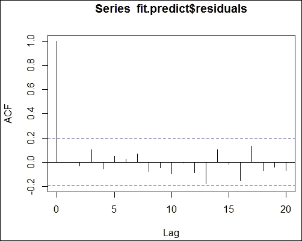

    图 21:ARIMA 模型的自相关图

5.  此外，我们可以对拟合残差应用容格盒检验:

    ```

    > Box.test(fit.predict$residuals)

     Box-Pierce test

    data:  fit.predict$residuals

    X-squared = 3.801e-05, df = 1, p-value = 0.9951

    ```

## 它是如何工作的……

在这个配方中，我们首先使用预测函数根据拟合的 ARIMA 模型进行预测。然后，我们可以打印 80%和 95%置信区间下的估计值。此外，我们可以使用 summary 函数来获取模型信息。模型信息揭示了拟合模型的误差度量。最后，我们可以使用`plot.forecast`在蓝色阴影中绘制时间序列数据及其预测结果。深蓝色阴影表示 95%置信区间下的预测，浅色阴影表示 80%置信区间下的预测。

生成预测模型后，我们必须评估预测模型。类似于指数平滑模型，我们可以使用`acf`函数来计算残差并绘制自相关图。由于自相关系数迅速降低并落在边界之间，这意味着残差是白噪声。

此外，我们可以执行一个 Ljung-Box 测试来检查残差是否是自相关的。在这个例子中，我们对剩余序列应用了`Box.test`函数；我们发现 *p* 的值是`0.9951`，这意味着我们不能拒绝零假设。简单来说，残差是白噪声，它证明了我们的模型在价值预测方面是足够的。

## 还有更多……

除了使用`acf`函数和函数`box.test`来执行评估过程之外，您还可以使用`tsdiag`函数从不同的角度用一个函数来诊断时间序列拟合:

```

> tsdiag(fit)

```

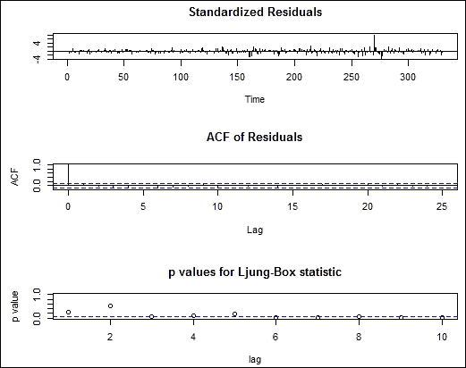

图 22:时间序列诊断图


# 用 ARIMA 模型预测股票价格

由于股票的历史价格也是一个 T2 时间序列，因此我们可以建立一个 ARIMA 模型来预测给定股票的未来价格。在这个菜谱中，我们介绍如何用`quantmod`包装载历史价格，并用 ARIMA 预测股票价格。

## 准备就绪

在本食谱中，我们使用股票价格预测的例子来回顾我们在以前的主题中涉及的所有概念。你需要了解如何创建一个 ARIMA 模型，并根据建立的模型做出预测，以遵循这个食谱。

## 怎么做……

请执行以下步骤，用 ARIMA 模型预测脸书的股票价格:

1.  首先安装并加载`quantmod`包:

    ```

    > install.packages("quantmod")

    > library(quantmod)

    ```

2.  用`quantmod` :

    ```

    > getSymbols("FB",src="yahoo", from="2015-01-01")

    ```

    从雅虎下载脸书公司的历史价格
3.  接下来，将历史股价绘制成折线图:

    ```

    > plot(FB)

    ```

    

    图 23:脸书公司的历史股价图

4.  使用`auto.arima`功能找到最适合的模型:

    ```

    > fit <- auto.arima(FB$FB.Close, ic="bic")

    > fit

    Series: FB$FB.Close 

    ARIMA(0,1,0) with drift 

    Coefficients:

     drift

     0.0962

    s.e.  0.0986

    sigma^2 estimated as 3.212:  log likelihood=-658.26

    AIC=1320.52   AICc=1320.56   BIC=1328.11

    ```

5.  在同一个图中绘制历史价格和拟合折线图:

    ```

    > plot(as.ts(FB$FB.Close) )

    > lines(fitted(fit), col="red")

    ```

    

    图 24:历史价格图和拟合折线图

6.  继续，你可以用`forecast.Arima`函数

    ```

    > fit.forecast <- forecast.Arima(fit)

    > fit.forecast

     Point Forecast    Lo 80    Hi 80    Lo 95    Hi 95

    331       110.1962 107.8996 112.4928 106.6838 113.7086

    332       110.2924 107.0445 113.5403 105.3251 115.2597

    333       110.3886 106.4107 114.3665 104.3049 116.4723

    334       110.4848 105.8915 115.0781 103.4600 117.5096

    335       110.5810 105.4456 115.7164 102.7270 118.4350

    336       110.6772 105.0516 116.3028 102.0736 119.2808

    337       110.7734 104.6971 116.8497 101.4805 120.0664

    338       110.8696 104.3737 117.3655 100.9350 120.8042

    339       110.9658 104.0759 117.8557 100.4286 121.5030

    340       111.0620 103.7994 118.3246  99.9548 122.1692

    ```

    来预测未来的股票价格
7.  最后，你可以制作一个预测图:

    ```

    > plot(fit.forecast)

    ```

    

    图 25:FB 股票价格预测图

## 它是如何工作的……

这个菜谱展示了如何根据 ARIMA 模型进行股票价格预测。此外，它总结了我们在以前的食谱中所涉及的 ARIMA。在菜谱的开始，我们安装并加载`quantmod`包。`quantmod`包提供了不同来源的各种定量金融建模方法和 API。为了检索历史股票价格，我们使用`getSymbols`函数来获取脸书公司自 2015 年 1 月 1 日以来的历史股票价格。然后，`quantmod`加载脸书的股票价格，并将它们存储在变量`FB`中。接下来，我们使用`plot`函数将脸书的历史股票价格绘制成折线图。从线图中，我们可以看到脸书股票价格的持续增长。

接下来，我们创建一个 ARIMA 模型来拟合收盘价的时间序列。在本例中，`auto.arima`函数找到一个非季节性 ARIMA 模型，其参数为 *p=0* 、 *d=1* 和 *q=0* 。接下来，我们将时间序列绘制为黑线，并将拟合线绘制为同一图上的红线，以查看拟合线是否与原始时间序列数据相匹配。

在我们建立了 ARIMA 模型之后，我们可以用这个模型来预测未来的股票价格。这里，我们使用`forecast.arima`来预测股票的未来价格，并将我们的预测存储在变量`fit.forecast`中。最后，我们可以使用`plot`函数在时间序列图中用蓝色阴影绘制我们的预测。

## 还有更多……

当`quantmod`将历史股票价格加载到`xts`对象中时，可以使用`lag`函数来移动时间序列。我们可以计算股票的回报率，并绘制成柱状图。从柱状图中，我们发现股票的表现分布:

```

> FB_Return<-diff(FB$FB.Close)/lag(FB$FB.Close,k=-1)*100

> head(FB_Return)

 FB.Close

2015-01-02         NA

2015-01-05 -1.6546224

2015-01-06 -1.3657255

2015-01-07  0.0000000

2015-01-08  2.6112658

2015-01-09 -0.5735167

> hist(FB_Return)

```

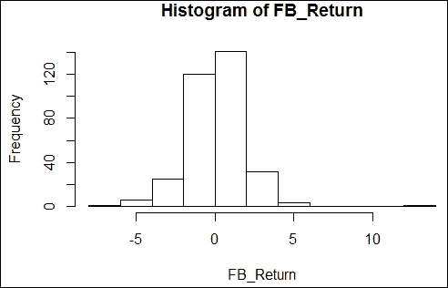

图 26:股票价格每日回报的柱状图