# 十二、无监督机器学习

本章涵盖以下主题:

*   使用分层聚类对数据进行聚类
*   将树木切成一簇簇
*   用 k-means 方法聚类数据
*   使用基于密度的方法聚类数据
*   从聚类中提取轮廓信息
*   比较聚类方法
*   使用基于密度的聚类方法识别数字
*   用 k-means 聚类方法对相似文本进行分组
*   用主成分分析(PCA)进行降维
*   用碎石图确定主成分数
*   用 Kaiser 方法确定主成分数
*   使用双标图可视化多元数据

# 简介

无监督机器学习方法侧重于揭示未标记数据的隐藏结构。无监督学习和有监督学习之间的一个关键区别是，后一种方法采用标记数据作为学习器。因此，可以基于*已知答案*来评估模型。相比之下，人们无法评价无监督学习，因为它没有任何已知的答案。大多数情况下，无监督学习集中在两个主要领域:聚类和降维。

聚类是一种用于将相似的对象(在距离上接近)分组到同一组(簇)中的技术。聚类分析不使用任何标签信息，只是简单地利用数据特征之间的相似性将其分组到聚类中。

降维是一种专注于去除无关和冗余数据以降低计算成本和避免过拟合的技术；您可以将要素缩减为一个更小的子集，而不会显著丢失信息。降维可以分为两部分:特征提取和特征选择。**特征提取** 是一种用低维空间表示高维空间数据的技术。**特征选择** 用于寻找预测模型中最相关的变量。

在这一章中，我们首先介绍如何使用分层聚类方法在树状图中对酒店位置数据进行聚类。我们可以使用`cuttree`函数将数据分成不同的组，然后演示 k-means 和 density 方法如何工作。接下来，我们可以使用剪影和平方和度量来验证聚类的质量，并比较每种方法的工作原理。此外，我们可以演示 DBSCAN 如何识别数字。我们还将举例说明如何用 k-means 方法对文本文档进行聚类。

接下来，我们讨论降维方法是如何工作的，并首先描述如何对经济自由度数据执行 PCA。然后，我们可以使用 scree 图和 Kaiser 方法来确定主成分的数量。最后，我们可以用`biplot`可视化多元数据。


# 用层次聚类对数据进行聚类

层次聚类采用凝聚或分裂的方法来构建聚类的层次结构。无论采用哪种方法，两者最初都使用距离相似性度量来组合聚类或分裂聚类。递归过程继续进行，直到只剩下一个集群或者不能分割更多的集群。最后，我们可以使用一个树状图来表示集群的层次结构。在本菜谱中，我们将演示如何使用分层聚类对酒店位置数据进行聚类。

## 准备就绪

在这个菜谱中，我们将对酒店位置数据执行层次聚类，以识别酒店是否位于同一地区。您可以从以下 GitHub 链接下载数据:

[https://github . com/yw chiu/rcookbook/raw/master/chapter 12/Taipei _ hotel . CSV](https://github.com/ywchiu/rcookbook/raw/master/chapter12/taipei_hotel.csv)

## 怎么做……

请执行下面的步骤，将位置数据聚类到聚类的层次结构中:

1.  首先，从`taipei_hotel.csv`加载数据并保存到`hotel` :

    ```

    > hotel <- read.csv('taipei_hotel.csv', header=TRUE)

    > str(hotel)

    ```

2.  然后，您可以按经度和纬度可视化数据集:

    ```

    > plot(hotel$lon, hotel$lat, col=hotel$district)

    ```

    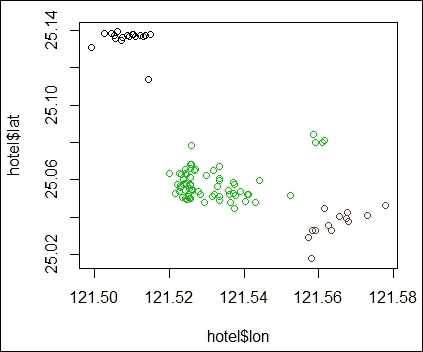

    图 1:酒店位置数据集的散点图

3.  使用凝聚层次聚类对酒店的地理数据进行聚类:

    ```

    > hotel.dist <- dist(hotel[,c('lat', 'lon')] , method="euclidean")

    > hc <- hclust(hotel.dist, method="ward.D2")

    > hc

    Call:

    hclust(d = hotel.dist, method = "ward.D2")

    Cluster method   : ward.D2 

    Distance         : euclidean 

    Number of objects: 102 

    ```

4.  最后，可以使用`plot`函数绘制树状图:

    ```

    > plot(hc, hang = -0.01, cex = 0.7)

    ```

    

    图 2:使用“病房”的层次聚类的树状图 D2

5.  此外，还可以使用`single`方法进行层次聚类，看看生成的树状图与之前的版本有何不同:

    ```

    > hc2 = hclust(hotel.dist, method="single")

    > plot(hc2, hang = -0.01, cex = 0.7)

    ```

    

    图 3:使用“单身”的层次聚类的树状图

## 它是如何工作的……

分层聚类是一种聚类技术，它试图迭代地构建聚类的层次结构。一般来说，有两种方法可以构建分层集群:

*   **凝聚层次聚类**:这是一种*自下而上*的方法。每个观察都从它自己的星团开始。然后，我们可以计算每个聚类之间的相似性(或距离),并在每次迭代中合并最相似的两个聚类，直到只剩下一个聚类。
*   **分裂式层次聚类**:这是一种*自上而下*的方法。所有的观察开始于一个集群，然后我们递归地将该集群分成两个最不相似的集群，直到每个观察都有一个集群。


图 4:层次聚类的两种方法

在执行分层聚类之前，我们需要确定这两个聚类有多相似。这里，我们列出了一些用于相似性度量的常见距离函数:

*   **单联动**:每簇两点间的最短距离:
*   **完全联动**:每簇中两点间的最长距离:
*   **平均链接**:每个聚类中两点之间的平均距离(其中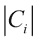是聚类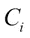的大小，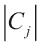是聚类的大小):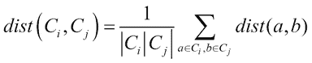
*   **Ward-method** :每个点到合并后的聚类的均值的距离平方和(其中为的均值向量)；


在这个方法中，我们对客户数据执行层次聚类。首先，我们从`Taipei_hotel.csv`加载数据，并将数据加载到`hotel`数据帧中。在数据中，我们找到了酒店位置信息的五个变量，它们是:地址、纬度、经度、头衔和地区。

然后，我们使用`hclust`函数执行层次聚类。我们使用欧几里德距离作为距离度量，并使用沃德最小方差方法来执行凝聚聚类。

最后，我们使用`plot`函数在*图 2* 中绘制层次聚类的树状图。我们指定 hang 在树形图的底部显示标签，并使用`cex`将标签缩小到正常大小的 70%。为了比较使用`ward.D2`和`single`方法生成集群层次的差异，我们使用*图 3* 中的`single`绘制了另一个树状图。

## 还有更多……

执行等级聚类时，可以选择不同的距离度量和方法。有关更多详细信息，请参考`dist`和`hclust`的文档:

```

> ? dist

> ? hclust

```

在这个配方中，我们使用`hclust` 来执行凝聚层次聚类。如果您想执行分裂层次聚类，您可以使用`diana`函数:

1.  首先使用`diana`进行分裂式层次聚类:

    ```

    > dv = diana(hotel, metric = "euclidean")

    ```

2.  使用`summary`获取汇总信息:

    ```

    > summary(dv)

    ```

3.  最后，用`plot`函数绘制树状图和横幅:

    ```

    > plot(dv)

    ```


# 把树切成一簇簇

在树状图中，我们可以看到聚类的层次，但是我们还没有将数据分组到不同的聚类中。然而，我们可以确定树状图中有多少个簇，然后*在特定的树高切割*树状图，将数据分成不同的组。在这个配方中，我们演示了如何使用`cutree`函数将数据分成给定数量的簇。

## 准备就绪

为了执行 `cutree`功能，需要通过生成一个 hclust 对象`hc`来完成前面的配方。

## 怎么做……

请执行以下步骤，将集群的层次结构切割成给定数量的集群:

1.  首先，将数据分为三组:

    ```

    > fit <- cutree(hc, k = 3)

    ```

2.  然后，您可以检查数据的分类标签:

    ```

    > fit

    ```

3.  统计每个聚类内的数据点数:

    ```

    > table(fit)

    fit

     1  2  3 

    18 66 18 

    ```

4.  用拟合的聚类信息制作散点图:

    ```

    > plot(hotel$lon, hotel$lat, col=fit)

    ```

    

    图 5:拟合数据的散点图

5.  最后，您可以用红色的矩形边框

    ```

    > plot(hc)

    > rect.hclust(hc, k = 3 , border="red")

    ```

    

    来可视化数据是如何聚集的图 6:使用红色矩形区分树状图中的不同聚类

## 它是如何工作的……

在这个配方中，我们确定树中应该有三个集群。因此，我们在`cutree`函数中将聚类数指定为`3`。除了使用簇的数量来切割树之外，我们还可以指定`height`作为切割树的参数。

接下来，我们输出数据的聚类标签，并使用`table`函数来计算每个聚类中数据点的数量。从表中，我们发现大部分数据都在簇 2 中。最后，我们可以在聚类周围绘制红色矩形，以显示如何使用`rect.hclust`函数将数据分类到三个聚类中。

## 还有更多……

除了在所有分层分类周围绘制矩形之外，您还可以在某个分类周围放置一个红色矩形:

```

> plot(hc)

> rect.hclust(hc, k = 3 , which =2, border="red")

```

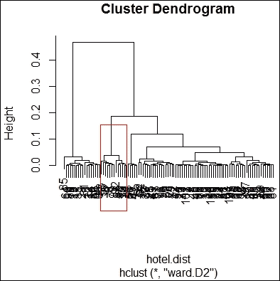

图 7:在某个集群周围画一个红色矩形


# 用 k-means 方法对数据进行聚类

K-means 聚类是一种划分聚类的方法。该算法的目标是将 *n* 个对象划分为 *k* 个簇，其中每个对象属于具有最近平均值的簇。与不要求用户在开始时确定聚类数量的分层聚类不同，k-means 方法要求首先确定聚类数量。然而，k-means 聚类比层次聚类快得多，因为层次树的构建非常耗时。在本菜谱中，我们将演示如何对酒店位置数据集执行 k-means 聚类。

## 准备就绪

在这个菜谱中，我们将继续使用酒店位置数据集作为输入数据源来执行 k-means 聚类。

## 怎么做……

请执行以下步骤，使用 k-means 方法对酒店位置数据集进行聚类:

1.  首先，使用`kmeans`对客户数据进行聚类:

    ```

    > set.seed(22)

    > fit <- kmeans(hotel[,c("lon", "lat")], 3)

    > fit

    K-means clustering with 3 clusters of sizes 19, 18, 65

    Cluster means:

     lon      lat

    1 121.5627 25.04905

    2 121.5087 25.13559

    3 121.5290 25.05657

    Clustering vector:

     [1] 2 3 2 1 3 3 3 1 3 3 2 3 3 2 3 2 3 3 1 3 3 2 2 3 3 1 3 2 3 2 3 3 3

     [34] 3 2 3 3 3 3 3 3 1 1 3 3 3 3 3 3 3 3 3 3 3 1 1 3 3 3 3 3 1 3 2 3 2

     [67] 1 3 3 1 1 3 3 1 3 3 1 3 1 3 2 3 1 2 2 3 3 3 2 2 3 1 2 3 3 1 3 3 1

    [100] 3 3 3

    Within cluster sum of squares by cluster:

    [1] 0.0085979703 0.0008661602 0.0050881876

     (between_SS / total_SS =  89.6 %)

    Available components:

    [1] "cluster"      "centers"      "totss"        "withinss" 

    [5] "tot.withinss" "betweenss"    "size"         "iter" 

    [9] "ifault" 

    ```

2.  画出数据的散点图，并根据聚类

    ```

    > plot(hotel$lon, hotel$lat, col = fit$cluster)

    ```

    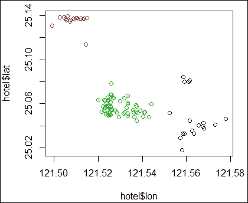

    给点上色图 8:散点图显示了根据分类标签着色的数据

## 它是如何工作的……

k-means 算法的目标是最小化 **类内平方和** ( **WCSS** )。假设 *x* 是给定的一组观察值，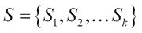表示 *k* 个分区，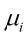是的平均值，我们可以将 WCSS 函数公式化如下:

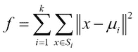

k-means 聚类的过程可以用下面的步骤来说明:

1.  指定簇的数量 *k* 。
2.  随机创建 *k* 个分区。
3.  计算分区的中心。
4.  将对象与其最近的聚类中心相关联。
5.  重复步骤 2、3 和 4，直到 WCSS 变化很小(或最小化)。

在这个菜谱中，我们演示了如何使用`kmeans`对酒店数据进行聚类。与层次聚类相比，k-means 聚类要求用户输入数量 *k* 。在这个例子中，我们使用 *k=3* 。拟合模型的输出显示了每个聚类的大小、四个生成的聚类的聚类平均值、关于每个数据点的聚类向量、聚类的 WCSS 以及其他可用的成分。最后，我们在散点图中绘制数据点，并使用拟合的聚类标签来分配关于聚类标签的颜色。

## 还有更多……

在 k-means 聚类分析中，可以指定用于执行聚类分析的算法。您可以指定 Hartigan-Wong、Lloyd、Forgy 或 MacQueen 作为聚类分析算法。更多详细信息，请使用`help`函数参考关于`kmeans`函数的文档:

```

>help(kmeans)

```


# 用基于密度的方法对数据进行聚类

作为距离测量的替代方法，我们可以使用基于密度的测量对数据进行聚类。这种方法可以找到比剩余区域密度更高的区域。最著名的方法之一是 DBSCAN。在下面的菜谱中，我们将演示如何使用 DBSCAN 来执行基于密度的聚类。

## 准备就绪

在本菜谱中，我们将继续使用酒店位置数据集作为输入数据源来执行 DBSCAN 聚类。

## 怎么做……

请执行下面的步骤来执行基于密度的聚类:

1.  首先安装并加载`dbscan`包:

    ```

    > install.packages("dbscan")

    > library(dbscan)

    ```

2.  关于其密度测量的聚类数据:

    ```

    > fit <- dbscan(hotel.dist, eps = 0.01, minPts = 3)

    > fit

    DBSCAN clustering for 102 objects.

    Parameters: eps = 0.01, minPts = 3

    The clustering contains 4 cluster(s) and 3 noise points.

     0  1  2  3  4 

     3 17 65 12  5 

    Available fields: cluster, eps, minPts

    ```

3.  将数据绘制成散点图，用不同的聚类标签作为颜色:

    ```

    > plot(hotel$lon,hotel$lat, col=fit$cluster)

    ```

    

    图 9:根据聚类标签着色的数据散点图

4.  您还可以使用`dbscan`来预测数据点属于哪个簇。在这个例子中，首先制作一个`data.frame`，命名为`newdata` :

    ```

    > newdata = data.frame(lon= 121.51, lat=25.13)

    ```

5.  现在可以预测数据属于哪个集群:

    ```

    > predict(fit, hotel[,c('lon', 'lat')], newdata)

    103

     1

    ```

## 它是如何工作的……

基于密度的聚类使用密度可达性和密度连通性的思想，这使得它在发现非线性形状的聚类时非常有用。在讨论基于密度的聚类过程之前，必须解释一些重要的背景概念。基于密度的聚类使用两个参数: **Eps** 和 **MinPts** 。 **Eps** 表示邻域的最大半径，而 **MinPts** 表示 Eps 邻域内的最小点数。利用这两个参数，我们可以将核心点定义为在 **Eps** 内具有比 **MinPts** 更多的点。此外，我们可以将板点定义为比 **MinPts** 少的点，但它在核心点的附近。如果 *p* 的 Eps 邻域中的点数大于 **MinPts** ，我们可以定义一个核心对象。

此外，我们必须定义两点之间的可达性。如果 *q* 在 *p* 的 Eps 邻域内并且 *p* 是一个核心对象，我们可以说一个点 *p* 是从另一个点 *q* 直接密度可达的。然后我们可以定义一个点 *p* 是从点 *q* 可达的一般密度，如果存在一个点链 *p [1]* *，p [2]* *...，p [n]* 其中*p[1]**= q*，*p[n]**= p*， *p [i+1]* 是关于 **Eps** 和从 *p [i] 直接密度可达*


图 10:点 p 和 q 是密度可达的

从基于密度的聚类的初步概念出发，我们可以用以下步骤说明最流行的基于密度的聚类 DBSCAN 的过程:

1.  随机选择一个点 *p* 。
2.  检索关于 **Eps** 和 **MinPts** 从 *p* 密度可达的所有点。
3.  如果 *p* 是一个核心点，那么就形成了一个簇。否则，如果 *p* 是板点，并且没有从 *p* 密度可达的点，则该过程将该点标记为噪声并继续访问下一个点。
4.  重复这个过程，直到所有的点都被访问过。

在本菜谱中，我们将演示如何使用基于`dbscan`密度的方法对客户数据进行聚类。首先，我们安装并加载`dbscan`库。接下来，我们对酒店位置数据集执行`dbscan`来聚类数据。我们指定可达性距离为`0.01`，最小可达性点数为`3`，进度报告为`null`，使用距离作为度量。聚类方法成功地将数据聚类成大小为`17`、`65`、`12`和`5`的四个簇。通过在图上绘制点和聚类标签，我们看到酒店位置的四个部分以不同的颜色分开。

`dbscan`还提供了一个`predict`函数，可以用它来预测输入`data.frame`的聚类标签。具有`lon= 121.51`和`lat=25.13`的点被分类到簇`1`中。

## 参见

除了使用`dbscan`包来执行基于密度的集群，还可以使用`fpc`包作为替代。要安装和加载`fpc`包，请按照以下步骤操作:

```

> install.packages("fpc")

> library(fpc) 

```


# 从聚类中提取轮廓信息

轮廓信息是验证一组数据的测量。在前面的方法中，我们提到了对一个分类的测量包括计算数据在每个分类中的聚集程度，以及测量不同分类之间的距离。轮廓系数结合了类内距离和类间距离的度量。输出值的范围通常从`0`到`1`；越靠近`1`，集群越好。在本食谱中，我们将介绍如何计算轮廓信息。

## 准备就绪

为了从聚类中提取轮廓信息，需要通过生成酒店位置数据集来完成之前的配方。

## 怎么做……

请执行以下步骤计算轮廓信息:

1.  首先安装并加载`cluster`包:

    ```

    > install.packages('cluster')

    > library(cluster)

    ```

2.  使用`kmeans`生成一个`kmeans`对象，`km` :

    ```

    > set.seed(22)

    > km <- kmeans(hotel[,c('lon', 'lat')], 3)

    ```

3.  然后可以计算轮廓信息:

    ```

    > hotel.dist <- dist(hotel[,c('lat', 'lon')] , method="euclidean")

    > kms <- silhouette(km$cluster, hotel.dist)

    > summary(kms)

    Silhouette of 102 units in 3 clusters from silhouette.default(x = km$cluster, dist = hotel.dist) :

     Cluster sizes and average silhouette widths:

     19        18        65 

    0.3651140 0.9030704 0.7168364 

    Individual silhouette widths:

     Min. 1st Qu.  Median    Mean 3rd Qu.    Max. 

    0.03744 0.56590 0.74860 0.68420 0.80140 0.93890 

    ```

4.  接下来，绘制剪影信息:

    ```

    > plot(kms)

    ```

    

    图 11 点均值聚类结果的轮廓图

## 它是如何工作的……

剪影是一种度量，它考虑了聚类中对象的紧密程度以及聚类之间的分离程度。数学上，我们可以定义每个点 x 的轮廓宽度如下:


在前面的公式中, *a(x)* 是 x 和该簇中所有其他点之间的平均距离，而 *b(x)* 是 x 和其他簇中的点之间的平均距离的最小值。

在这个配方中，我们演示如何获得轮廓值。可以首先检索轮廓信息，该信息显示集群大小、平均轮廓宽度和单个轮廓宽度。`silhouette`系数是从`0`到`1`的一个值；越接近`1`，集群质量越好。

最后，我们使用`plot`函数绘制一个轮廓图。该图的左侧显示了水平线的数量，代表了聚类的数量。右栏显示了其自身聚类的图的平均相似性减去与下一个相似聚类的平均相似性。平均轮廓宽度显示在图的底部。

## 参见

对于那些对轮廓是如何计算的感兴趣的人，请参考维基百科上关于[http://en.wikipedia.org/wiki/Silhouette_%28clustering%29](http://en.wikipedia.org/wiki/Silhouette_%28clustering%29)的轮廓值的条目。


# 比较聚类方法

使用不同的聚类方法将数据归入聚类后，您可能希望测量聚类的准确性。在大多数情况下，您可以使用集群内或集群间指标作为度量。我们现在介绍如何使用`fpc`包中的`custer.stat`来比较不同的聚类方法。

## 准备就绪

为了执行聚类方法比较，您需要通过生成酒店位置数据集来完成前面的方案。

## 怎么做……

执行以下步骤来比较聚类方法:

1.  首先安装并加载`fpc`包:

    ```

    > install.packages("fpc")

    > library(fpc)

    ```

2.  然后需要使用层次聚类和 single 方法对客户数据进行聚类并生成对象`hc_single` :

    ```

    > hotel.dist <- dist(hotel[,c('lat', 'lon')] , method="euclidean")

    > single_c <- hclust(hotel.dist, method="single")

    > hc_single <- cutree(single_c, k = 3)

    ```

3.  使用分层聚类和完整方法对酒店位置数据进行聚类，生成对象`hc_complete` :

    ```

    > complete_c <- hclust(hotel.dist,method="complete")

    > hc_complete <- cutree(complete_c, k = 3)

    ```

4.  然后，您可以使用 k-means 聚类对客户数据进行聚类，并生成对象`km` :

    ```

    > set.seed(22)

    > km <- kmeans(hotel[,c('lon', 'lat')], 3)

    ```

5.  接下来，检索任一聚类方法的聚类验证统计信息:

    ```

    > cs = cluster.stats(hotel.dist, km$cluster)

    ```

6.  最常见的是，我们重点使用`within.cluster.ss`和`avg.silwidth`来验证聚类方法:

    ```

    > cs[c("within.cluster.ss","avg.silwidth")]

    $within.cluster.ss

    [1] 0.01455232

    $avg.silwidth

    [1] 0.6841843

    ```

7.  最后，我们可以生成每种聚类方法的聚类统计信息，并以表格形式列出:

    ```

    > sapply(list(kmeans = km$cluster, hc_single = hc_single, hc_complete = hc_complete), function(c) cluster.stats(hotel.dist, c)[c("within.cluster.ss","avg.silwidth")])

     kmeans     hc_single  hc_complete

    within.cluster.ss 0.01455232 0.02550912 0.01484059 

    avg.silwidth      0.6841843  0.5980621  0.6838705

    ```

## 它是如何工作的……

在这个菜谱中，我们演示如何验证集群。为了验证聚类方法，我们通常采用两种技术:类间距离和类内距离。在这些技术中，类间距离越高越好，类内距离越低越好。为了计算相关的统计数据，我们可以将`fpc`包中的`cluster.stat`应用到合适的聚类对象上。

根据输出，测量值`within.cluster.ss`代表组内平方和，`avg.silwidth`代表平均轮廓宽度。此外，`within.cluster.ss`显示了集群中相关对象的紧密程度；该值越小，聚类中的相关对象越紧密。另一方面，`silhouette`值的范围通常从`0`到`1`；越接近`1`的值表示数据聚类越好。

上一步生成的汇总表显示，在`within.cluster.ss`和`avg.silwidth`中，完全层次聚类方法优于单一层次聚类方法和 k-means 聚类。

## 还有更多……

`kmeans`函数还输出统计数据(例如，`withinss`和`betweenss`)供用户验证聚类方法:

```

> set.seed(22)

> km <- kmeans(hotel[,c('lon', 'lat')], 3)

> km$withinss

[1] 0.0085979703 0.0008661602 0.0050881876

> km$betweenss

[1] 0.1256586

```


# 使用基于密度的聚类方法识别数字

我们已经介绍了基于密度的聚类方法，这些方法擅长处理没有特定形状的数据。在本菜谱中，我们将演示如何使用 DBSCAN 来识别数字。

## 准备就绪

在这个菜谱中，我们使用手写数字作为聚类输入。你可以在作者的 GitHub 页面[https://GitHub . com/yw chiu/rcook book/raw/master/chapter 12/handshaw . png](https://github.com/ywchiu/rcookbook/raw/master/chapter12/handwriting.png)找到图。

## 怎么做……

执行以下步骤，使用不同的聚类技术对数字进行聚类:

1.  首先安装并加载`png`包:

    ```

    > install.packages("png")

    > library(png)

    ```

2.  Read images from `handwriting.png` and transform the read data into a scatterplot:

    ```

    > img2 = readPNG("handwriting.png", TRUE)

    > img3 = img2[,nrow(img2):1]

    > b = cbind(as.integer(which(img3 < -1) %% 28), which(img3 < -1) / 28)

    > plot(b, xlim=c(1,28), ylim=c(1,28))

    ```

    

    图 12:手写数字的散点图

3.  对手写数字执行 k-means 聚类方法:

    ```

    > set.seed(18)

    > fit = kmeans(b, 2)

    > plot(b, col=fit$cluster)

    > plot(b, col=fit$cluster,  xlim=c(1,28), ylim=c(1,28))

    ```

    

    图 13:手写数字的 k 均值聚类结果

4.  Next, perform the `dbscan` clustering method on the handwritten digits:

    ```

    > ds = dbscan(b, 2)

    > ds

    DBSCAN clustering for 212 objects.

    Parameters: eps = 2, minPts = 5

    The clustering contains 2 cluster(s) and 0 noise points.

     1   2 

     75 137 

    Available fields: cluster, eps, minPts

    > plot(ds, b,  xlim=c(1,28), ylim=c(1,28))

    ```

    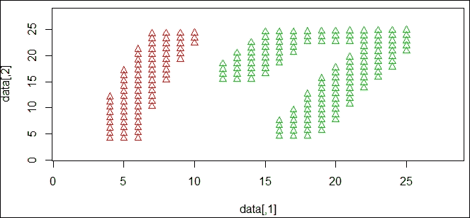

    图 14:手写数字的 DBSCAN 聚类结果

## 它是如何工作的……

在这份食谱中，我们展示了不同的聚类方法对于手写数据集是如何工作的。聚类的目的是将 1 和 7 分成不同的聚类。我们使用不同的技术来观察 k-means 和 DBSCAN 方法是如何对数据进行聚类的。

为了生成数据，我们使用 Windows 应用程序 Paint 创建一个尺寸为 28 x 28 像素的 PNG 文件。然后，我们使用`readPNG`函数读取 PNG 数据，并将读取的 PNG 数据点转换成散点图，散点图显示手写的数字 1 和 7。

读取数据后，我们对手写数字执行聚类技术。首先，我们对数据集执行 k-means 聚类，其中 *k=2* 。因为 k-means 聚类使用距离度量，所以构建的聚类覆盖了 1 和 7 的区域。然后，我们对数据集执行 DBSCAN 由于这是一种基于密度的聚类技术，它成功地将 1 和 7 分成不同的聚类。

## 参见

如果您对如何阅读 R 中的各种图形格式感兴趣，您可以运行以下命令:

```

> help(package="png")

```


# 利用 k-means 聚类方法对相似文本文档进行分组

计算机程序在解释给定句子的意思时面临限制，因此不知道如何根据相似性对文档进行分组。但是，如果我们可以将句子转换成数学矩阵(文档术语矩阵)，程序就可以计算每个文档之间的距离，并将相似的文档分组在一起。

在这个菜谱中，我们演示了如何计算文本文档之间的距离，以及如何使用 k-means 方法对相似的文本文档进行聚类。

## 准备就绪

在这个菜谱中，我们使用新闻标题作为聚类输入。可以在作者的 GitHub 页面[https://GitHub . com/yw chiu/rcook book/raw/master/chapter 12/news 找到数据。RData](https://github.com/ywchiu/rcookbook/raw/master/chapter12/news.RData) 。

## 怎么做……

执行以下步骤使用 k-means 聚类技术对文本文档进行聚类:

1.  首先安装并加载`tm`和`SnowballC`包:

    ```

    > install.packages('tm')

    > library(tm)

    > install.packages('SnowballC')

    > library(SnowballC)

    ```

2.  看已经从网上搜集的新闻标题:

    ```

    > load('news.RData')

    ```

3.  将加载的文本文件转换成语料库:

    ```

    > doc.vec <- VectorSource(news)

    > doc.corpus  <- Corpus(doc.vec)

    ```

4.  通过删除停用词、标点符号和词干来清理文本文档:

    ```

    > doc.corpus  <- tm_map(doc.corpus , removePunctuation)

    > doc.corpus  <- tm_map(doc.corpus , removeWords, stopwords("english"))

    > doc.corpus  <- tm_map(doc.corpus , stemDocument)

    ```

5.  继续，现在可以将语料库转换成文档术语矩阵:

    ```

    > dtm <- DocumentTermMatrix(doc.corpus) 

    > inspect(dtm[1:3,1:3] )

    <<DocumentTermMatrix (documents: 3, terms: 3)>>

    Non-/sparse entries: 1/8

    Sparsity           : 89%

    Maximal term length: 7

    Weighting          : term frequency (tf)

     Terms

    Docs adviser agent anoth

     1       0          1        0

     2       0          0        0

     3       0          0        0

    ```

6.  最后，对文档术语矩阵的距离矩阵进行 k-means 聚类，`dtm` :

    ```

    > set.seed(123)

    > fit = kmeans(dist(dtm), 3)

    > fit

    > news[fit$cluster == 1]

    ```

## 它是如何工作的……

在配方开始时，我们将`tm`和`snowballc`包安装并加载到 R 会话中。`tm`包充当文本挖掘包，`snowballc`是一个词干分析器。我们可以用 load 函数将数据读入 R 会话。`tm`包需要一个结构化语料库来管理一组文本文档。因此，我们将文本文档中的输入句子转换成语料库`doc.corpus`。

当语料库准备好之后，我们需要对文本进行预处理，去除多余的术语。首先，我们使用`tm_map`函数从语料库中删除标点符号和停用词。然后，由于一些术语有词形，我们需要将这些词词干化为词干或词根形式。

一旦我们清理了文本文档，我们就可以使用语料库来构建文档术语矩阵。文档术语矩阵被表示为具有作为文档的行和作为术语的列的矩阵。矩阵的值保存每个文档中的术语计数。通过使用`inspect`函数，我们发现术语 agent 在文档 1 中出现了一次。

最后，我们可以计算文档术语矩阵上的距离矩阵，并使用 *k=3* 执行 k-means 聚类，以将输入句子聚类成三组。从结果中，我们发现新闻被分为三个主题:川普、NBA 和英国退出欧盟。

## 参见

如果你对如何在 R 中使用文本挖掘包`tm`感兴趣，可以参考以下文档:【https://cran.r-project.org/web/packages/tm/vignettes/tm.pdf】T2。


# 用主成分分析(PCA)进行降维

**主成分分析** ( **PCA** )是在处理降维问题中应用最广泛的线性方法。当数据包含许多特征并且这些特征中存在冗余(相关性)时，PCA 是有用的。为了移除冗余特征，PCA 通过将特征减少为较少数量的主成分来将高维数据映射到较低的维度，这些主成分解释了原始特征的大部分方差。在这份食谱中，我们将介绍如何用主成分分析法进行降维。

## 准备就绪

在这个食谱中，我们将使用经济自由度数据集作为我们执行 PCA 的目标。经济自由度([http://www.heritage.org/index/ranking](http://www.heritage.org/index/ranking))数据集包括全球标准化经济自由度指标。可以从[https://github . com/yw chiu/rcook book/raw/master/chapter 12/index 2015 _ data . CSV](https://github.com/ywchiu/rcookbook/raw/master/chapter12/index2015_data.csv)下载数据集。

## 怎么做……

执行以下步骤对经济自由度数据集执行 PCA:

1.  首先，加载经济自由度数据集:

    ```

    > eco.freedom <- read.csv('index2015_data.csv', header=TRUE)

    ```

2.  排除第一列经济自由度数据:

    ```

    > eco.measure <- eco.freedom[,5:14]

    ```

3.  对`eco.measure`数据进行主成分分析:

    ```

    > eco.pca = prcomp(eco.measure, center = TRUE, scale  = TRUE)

    > eco.pca

    ```

4.  从 PCA 结果中获取摘要:

    ```

    > summary(eco.pca)

    ```

5.  最后，使用`predict`函数输出第一行数据的主成分值:

    ```

    > predict(eco.pca, newdata=head(eco.measure, 1))

     PC1      PC2       PC3      PC4       PC5       PC6         PC7        PC8

    1 0.7042915 1.294181 -1.245911 0.726478 0.3089492 0.5121069 -0.07302236 -0.4793749

     PC9       PC10

    1 -0.3758371 -0.1154001

    ```

## 它是如何工作的……

由于特征选择方法可能会移除一些相关但有信息的特征，我们不得不考虑通过使用特征提取方法将相关特征组合成单个特征。PCA 是一种类型的特征提取；它执行正交变换，将可能相关的变量转换成主成分。此外，人们可以使用这些主成分来确定变化的方向。

PCA 过程遵循以下步骤:

1.  求均值向量，其中表示数据点， *n* 表示点数。
2.  用下面的等式计算协方差矩阵:
3.  计算特征向量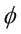和相应的特征值。
4.  排序并选择 top-k 特征向量。
5.  构造一个 *d x k 维*特征向量矩阵 U，其中 *d* 为原始维数， *k* 为特征向量个数。
6.  最后，将数据样本变换到等式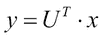中的新子空间。

在下面的图中，我们说明了可以使用两个主分量和，将数据点从二维空间转换到新的二维子空间:

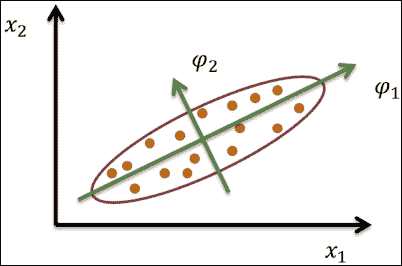

图 15:PCA 的示例说明

在这个菜谱中，我们使用 stats 包中的`prcomp`函数对瑞士数据集执行 PCA。首先，我们移除标准化的生育力测量，并使用剩余的预测值作为函数`prcomp`的输入。此外，我们将`eco.measure`设置为输入数据集。通过指定`center=TRUE`将变量移至零中心，用选项`scale=TRUE`将变量换算成单位方差，并将输出存储在变量`eco.pca`中。

打印存储在`eco.pca`中的值后，我们找到主成分的标准差和旋转。标准差表示协方差/相关矩阵的特征值的平方根，而主成分的旋转表示输入特征的线性组合的系数，例如， *PC1 =属性。权利* 0.39679243 +自由.免于.腐败* 0.38401793 +财政。自由* -0.02312696 +政府支出* -0.11741108 +商业。自由* 0.36957438 +劳动。自由* 0.21182699 +货币。自由* 0.31150727 +贸易。自由* 0.33282176 +投资。自由* 0.38065185 +财务。自由* 0.38289286* 。我们发现`Property.Rights`属性对 PC1 的贡献最大，因为它具有最高的系数。

另外，我们可以使用`summary`函数来获取组件的重要性。第一行显示每个主成分的标准差，第二行显示每个成分解释的方差的比例，第三行显示解释的方差的累计比例。最后，我们可以使用`predict`函数从输入特征中获取主成分。这里，我们输入数据集的第一行，并检索 10 个主成分。

## 还有更多……

另一个主成分分析功能是`princomp`。在该函数中，通过使用相关矩阵或协方差矩阵的特征值进行计算，而不是使用`prcomp`函数中的单值分解。在一般实践中，最好使用`prcomp`；然而，我们解释如何使用`princomp`如下:

1.  先用`princomp`进行 PCA:

    ```

    > eco.princomp = princomp(eco.measure,

    + center = TRUE,

    + scale  = TRUE)

    > swiss.princomp

    ```

2.  然后可以获得汇总信息:

    ```

    > summary(eco.princomp)

    ```

3.  最后，使用`predict`函数从输入特征中获取主成分:

    ```

    > predict(eco.princomp, eco.measure[1,])

    ```


# 使用碎石图确定主成分的数量

由于我们只需要保留主要的成分，这些成分解释了原始特征的大部分变化，我们可以使用 Kaiser 方法、scree 图或解释为选择标准的变化百分比。碎石图的主要目的是将成分分析结果绘制成碎石图，并找出坡度(弯头)发生明显变化的位置。在本食谱中，我们将演示如何使用碎石图确定主要成分的数量。

## 准备就绪

通过生成一个主成分对象并将其保存在变量`eco.pca`中，确保您已经完成了之前的配方。

## 怎么做……

执行步骤后的以确定带碎石图的主要组件的数量:

1.  First, generate a bar plot by using `screeplot`:

    ```

     > screeplot(swiss.pca, type="barplot")

    ```

    

    图 16:条形图形式的碎石图

2.  也可以使用`screeplot`:

    ```

    > screeplot(eco.pca, type="line")

    ```

    

    生成线图图 17:线形图形式的屏幕图

## 它是如何工作的……

在本食谱中，我们演示了如何使用 screeplot 来确定主成分的数量。在 screeplot 中，有两种类型的绘图，即条形图和线图。正如两个生成的碎石图所示，坡度的明显变化(所谓的肘或膝)发生在构件 3 处。因此，我们应该保留组件 1 和组件 2，其中组件 3 之前是陡峭的曲线，这是平坦线趋势开始的地方。但是，由于这种方法可能不明确，您可以使用其他方法(如 Kaiser 方法)来确定组件的数量。

## 还有更多……

默认情况下，如果您在生成的主成分对象上使用`plot`功能，您也可以检索 scree 图。有关`screeplot`的更多详情，请参考以下文件:

```

> help(screeplot)

```

此外，您可以使用`nfactors`对 Cattell screeplot 执行并行分析和非图形解决方案:

```

> install.packages("nFactors")

> library(nFactors)

> ev = eigen(cor(eco.measure))

> ap = parallel(subject=nrow(eco.measure),var=ncol(eco.measure),rep=100,cent=.05)

> nS = nScree(x=ev$values, aparallel=ap$eigen$qevpea)

> plotnScree(nS)

```


图 18:screen plot 的非图形解决方案


# 使用 Kaiser 方法确定主成分的数量

除了 screeplot，我们可以使用 Kaiser 方法来确定主成分的数量。在这种方法中，选择标准保留大于 1 的特征值。在这个食谱中，我们演示了如何使用 Kaiser 方法确定主成分的数量。

## 准备就绪

通过生成一个主成分对象并将其保存在变量`eco.pca`中，确保您已经完成了之前的配方。

## 怎么做……

执行以下步骤用 Kaiser 方法确定主成分数:

1.  首先从`eco.pca` :

    ```

    > eco.pca$sdev 

     [1] 2.2437007 1.3067890 0.9494543 0.7947934 0.6961356 0.6515563

     [7] 0.5674359 0.5098891 0.4015613 0.2694394

    ```

    获得标准差
2.  接下来，从`swiss.pca` :

    ```

    > eco.pca$sdev ^ 2

     [1] 5.0341927 1.7076975 0.9014634 0.6316965 0.4846048 0.4245256

     [7] 0.3219835 0.2599869 0.1612515 0.0725976

    ```

    获得方差
3.  选择差异大于`1` :

    ```

    > which(eco.pca$sdev ^ 2> 1)

    [1] 1 2

    ```

    的组件
4.  您也可以使用`screeplot`选择方差大于`1`的组件:

    ```

    > screeplot(eco.pca, type="line")

    > abline(h=1, col="red", lty= 3)

    ```

    

    图 19:选择方差大于一的组件

## 它是如何工作的……

也可以使用 Kaiser 方法来确定组件的数量。由于计算的主成分对象包含每个成分的标准偏差，我们可以计算方差，因为标准偏差是方差的平方根。根据计算的方差，我们发现组件 1 和 2 的方差都大于 1。因此，我们可以确定主成分的数量是两个(成分 1 和成分 2)。此外，我们可以在 screeplot 上画一条红线(如图*图 19* 所示),表示在这种情况下我们需要保留组件 1 和组件 2。

## 参见

为了确定保留哪些主要成分，请参考以下文件:

确定 EFA 中要保留的因子数量:一个易于使用的计算机程序，用于进行平行分析。实用评估，研究&评估，12(2)，1-11 作者*莱德斯马，研发，&瓦莱罗-莫拉，P. (2007)* 。


# 使用双标图可视化多元数据

为了找到数据和变量如何映射到主成分，您可以使用`biplot`，它将原始特征的数据和投影绘制到前两个成分上。在这个菜谱中，我们将演示如何使用`biplot`在同一个图上绘制变量和数据。

## 准备就绪

通过生成一个主成分对象并将其保存在变量`eco.pca`中，确保您已经完成了之前的配方。

## 怎么做……

执行以下步骤创建双绘图:

1.  使用组件 1 和组件 2 创建散点图:

    ```

    > plot(eco.pca$x[,1], eco.pca$x[,2], xlim=c(-6,6), ylim = c(-4,3))

    > text(eco.pca$x[,1], eco.pca$x[,2], eco.freedom[,2], cex=0.7, pos=4, col="red")

    ```

    

    图 20:PCA 结果中前两个成分的散点图

2.  此外，如果您想要在绘图上添加特征，您可以使用生成的主成分对象:

    ```

    > rownames(eco.pca$x) =  as.character(eco.freedom[,2])

    > biplot(eco.pca)

    ```

    

    创建双绘图图 21:使用主成分分析结果的双标图

## 它是如何工作的……

在这个菜谱中，我们演示了如何使用`biplot`来绘制数据和原始特征在前两个组件上的投影。在第一步中，我们演示了我们实际上可以使用前两个组件来创建散点图。此外，如果想在同一个图上添加变量，可以使用`biplot`。在`biplot`，财政自由指标和政府支出指标较高的省份在 PC2 中得分较高。另一方面，您可以看到 PC1 的其他指标得分更高。

## 参见

除了`stats`包中的`biplot`，还可以使用`ggbiplot`。但是，CRAN 不提供该软件包；你必须先安装`devtools`，然后从 GitHub 安装`ggbiplot`:

```

> install.packages("devtools")

> library(devtools)

> install_github("ggbiplot", "vqv")

 > library(ggbiplot)

> g <- ggbiplot(eco.pca, obs.scale = 1, var.scale = 1, ellipse = TRUE,  circle = TRUE)

> print(g)

```


图 22:使用 PCA 结果的 ggbiplot