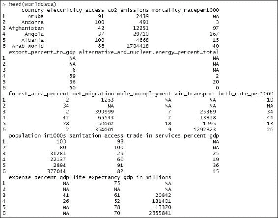
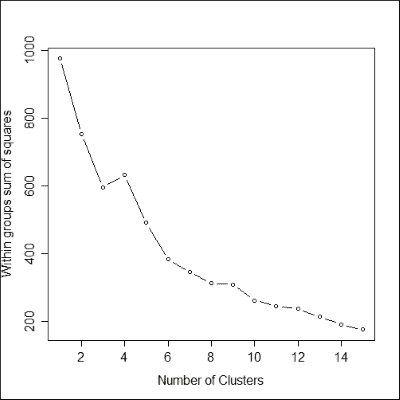
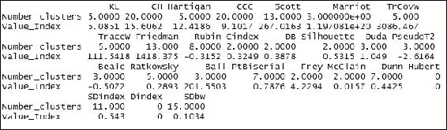
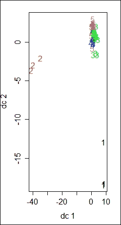
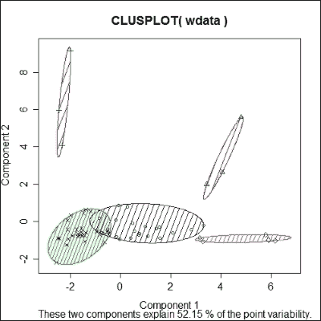
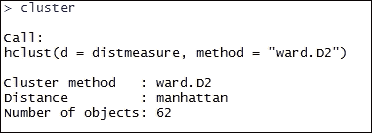
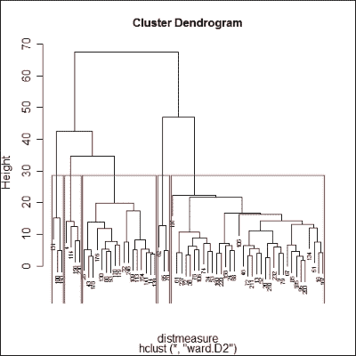

# 四、将聚类用于分割

聚类通常被认为是**无监督学习**的经典例子。这是一种将数据集分成多个组的方法，其中同一个组中的对象比其他组中的对象更相似。

聚类算法通常用于未标记的数据集；因此，无法测量聚类输出。用户应该根据自己的要求仔细考虑这些变量，以便得到的聚类与用户的要求紧密匹配。

聚类算法的最好例子是搜索引擎，其中彼此密切相关的页面被显示在一起，而不同的页面被尽可能地分开。这里最重要的因素是测量对象之间的相似性或不相似性。

可以通过实现聚类算法来解决的一些问题是预测医学领域中的疾病、将 DNA 匹配到合适的组、为营销活动对相似的客户进行分组、基于学生在学术和各种研究领域中的相似性对他们进行分组。

基于形心、连通性、分布和密度，有不同的聚类方法。在这一章中，我们将介绍一些聚类算法及其使用 r 的实现。我们还将介绍一些可以使用聚类算法解决的业务用例。

本章将涉及的主题如下:

*   资料组
*   基于质心的聚类和理想的聚类数
*   使用 K-means 实现
*   可视化集群
*   基于连通性的聚类
*   可视化连接
*   其他聚类算法和评估
*   业务用例

# 数据集

在这一章中，我们将使用从网站[http://data.worldbank.org/](http://data.worldbank.org/)提取的公共数据集。我们为所有国家提取了以下详细信息。如果没有某个国家的数据，它将显示为空白。

我们将使用以下数据集来学习本章中的概念。提取的数据集在一个名为`worlddata`的 CSV 文件中提供给您。我们将使用数据集来学习聚类的概念:

| 

标签

 | 

描述

 |
| --- | --- |
| 电力 _ 接入 | 用上电的人口比例 |
| 二氧化碳排放 | 二氧化碳排放 |
| 死亡率 _ 每 1000 人 | 每千人的死亡率 |
| 出口占国内生产总值的百分比 | 出口占国内生产总值的百分比 |
| 替代能源和核能百分比合计 | 整个数据集的替代能源和核能贡献 |
| 森林面积百分比 | 被覆盖的森林 |
| 网络 _ 迁移 | 净移民 |
| 男性失业 | 印度的失业率 |
| 航空运输 | 全球航空交通和注册航空公司出发 |
| brth_rate_per1000 | 每 1000 人中的出生率 |
| 人口 _ 千人 | 人口 |
| 卫生设施 _ 获取 | 卫生设施的可及性 |
| 服务贸易占 gdp 的百分比 | 服务贸易占国内生产总值的百分比 |
| 费用百分比国内生产总值 | 与国内生产总值相比的费用 |
| 预期寿命 | 平均预期寿命 |
| 以百万计的国内生产总值 | 以百万计的国内生产总值 |

## 在 R 中读取和格式化数据集

我们可以使用`read`函数从本地文件中读取`worlddata`数据集。使用`read`功能前，检查以下代码。我们使用`setwd()`函数将当前的工作目录设置为保存数据集的文件夹，并且我们可以使用`getwd()`函数验证工作目录的位置:

```
setwd("C:/book/Chapter 4")
getwd()
worlddata<- read.csv("data/worlddata.csv")

```

现在我们有了数据框格式的 R 环境中的数据集。在开始格式化之前，让我们先了解一下数据集。我们将使用`summary`函数并打印最上面的几行来检查数据集:

```
summary(worlddata)

```

上述命令的输出如下:


对于`head(worlddata)`，输出如下:



从前面两个输出的中，很明显，我们在研究中使用的数据集有许多缺失值。我们不能对有这么多缺失值的数据集进行聚类，因此我们需要处理缺失数据的问题。它可以通过删除丢失的值来处理。我们将使用`na.omit`函数来删除所有具有空白值的行，并且最好具有数字格式的属性，以便执行聚类分析。然后，我们可以使用`summary`函数检查新的数据集，查看行中是否存在任何空值以及分布情况:

```
wdata<- na.omit(worlddata)
summary(wdata)

```

输出如下所示:


```
# Removing the column country
wdata<-  wdata[ , -which(names(wdata) %in% c("country"))]

```

前面的代码将从我们将用来计算集群的数据集中删除`country`列。现在，数据集没有任何空单元格，但是为了对数据集执行聚类，我们必须将其从数据框格式转换为矩阵格式。执行以下操作:

```
wdata<- data.matrix(wdata)

```

在前面的数据集中，我们有不同范围的多个属性，因此它们彼此之间没有可比性；因此，我们没有其他选择，只能重新调整数据，以便给出相等的权重，并且聚类的计算距离将有意义。`scale`功能会将数值标准化到相似的范围内:

```
wdata<- scale(wdata)

```


# 基于质心的聚类和理想的聚类数

基于质心的聚类是一种方法，其中每个聚类由一个中心向量表示，并且基于接近度将对象分配到聚类，使得与中心向量的平方距离最小化。

在本节中，我们将使用 **K-means** 算法创建聚类。我们将看到使用 r 的实现。

我们需要使用名为 flexible procedure 的`fpc`包进行聚类，以便在 R:

```
install.packages("fpc")
library(fpc)

```

在使用 K-means 算法创建聚类之前，我们需要确定给定数据集的理想聚类数。我们可以使用`pamk`函数获得理想的集群数量，其中我们围绕 medoids 进行分区以计算理想的集群数量。`clusters$nc`变量将保存理想的集群数量:

```
clusters<- pamk(wdata)
n <- clusters$nc
n
[1] 5

```

`n`向量将保存给定数据集的理想聚类数的值。这种计算理想聚类数的方法计算量很大，因此如果数据集很大，这种方法可能会很耗时。我们还将介绍手动计算理想集群数量的另一种方法:

```
wss<- (nrow(wdata)-1)*sum(apply(wdata,2,var))

for (i in 2:25) wss[i] <- sum(kmeans(wdata, 
centers=i)$withinss)
plot(1:25, wss, type="b", xlab="Number of Clusters",
ylab="Within groups sum of squares")

dev.copy(png,filename="elbowMethod.png", width=600, height=875);

dev.off ();

```

前面的代码摘自 Tal Galili 的帖子，基于 Rob Kabacoff 撰写的第二版*第 16 章*、 *R in Action。这将生成这里提到的情节。我们需要阅读图表来了解数据集的理想聚类数。随着聚类数量的增加，精确度也趋于增加。对于一个有 n 行的数据集，如果我们有 *n 个*簇，那么误差平方和将为零，但是我们实际上需要停在某个理想值。在下图中，当误差平方和的减少量下降并减少到聚类数增加一个没有增量值的程度时，这就是代表理想聚类数的点。这基本上意味着进一步增加聚类数并不能有效地减少误差。*

肘法图表如下:



在大多数情况下，基于围绕质心划分的聚类方法以及肘方法的聚类数目将保持相同，但在这种情况下，发现其不同。我们仍然可以用更多的方法来评估理想的星团。使用多种方法帮助计算理想聚类数的函数是`NbClust`；以下是我们数据集上相同函数的实现:

```
install.packages("NbClust")
library(NbClust)
NbClust(data = wdata, distance = "euclidean", min.nc = 2, max.nc = 20,
method = "average", index = "all", alphaBeale = 0.1)

```

输出如下所示:



# 使用 K-means 实现

在了解了理想的聚类数之后，我们可以使用 K-means 方法在数据集中构建所需的聚类数。我们使用`kmeans`函数来构建聚类；该函数将数据集以及要形成的聚类数作为输入。在下面的例子中，我们只是传递我们想要的集群数量作为来自`pamk`函数的输出:

```
fit<- kmeans(wdata, n)
table(fit$cluster)
1  2  3  4  5 
3  3 27  7 22

```

根据前面的输出，有五个集群，每个集群中的元素数量不同。即使没有发现一个孤立的元素与任何现有的聚类相似，也将使它形成一个新的聚类。我们可以使用`aggregate`函数查看集群中元素的平均值。因为我们必须选择平均值作为数据集中所有属性的聚合因子，所以我们得到了每个聚类的平均值。如果分类是互斥的，则分类的汇总结果将互不相同:

```
# Cluster mean values
aggregate(wdata,by=list(fit$cluster),FUN=mean)

```

输出如下所示:


请注意，由于 K-means 算法的随机性，使用相同的数据集的输出可能与之前的输出略有不同。


# 可视化集群

我们可以使用`plotcluster`函数来可视化该方法创建的集群。该函数将原始数据集以及聚类的元素作为输入。输出是具有不同颜色的不同簇，以便于区分。聚类是根据数据集中存在的要素的主要成分绘制的。主要成分是数据集中存在的特征(也称为属性)的组合:

```
# plotting the cluster
plotcluster(wdata, fit$cluster)
dev.copy(png,filename="scatterPlot.png", width=600, height=875);
dev.off (); 

```

输出如下所示:



我们可以使用的`clustplot`功能，以更好的可视化来查看剧情；该函数要求将包`cluster`加载到 R 环境中:

```
library(cluster) 

clusplot(wdata, fit$cluster, color=TRUE, shade=TRUE, labels=1, lines=0)

```

输出如下所示:



# 基于连通性的聚类

基于连通性的聚类也被称为**层次聚类**，其中聚类分析在层次结构中构建聚类。这种对数据集进行聚类的方法被认为不太合适，尤其是当数据集有太多离群值时。当数据集很大时，绘制层次聚类中的异常值是复杂的，并且计算过程是耗时的。

在本节中，我们将使用 r 中的同一个`worlddata`数据集来监督分层聚类的实现。为了实现分层聚类，我们首先需要计算数据集中元素的距离。我们使用`dist`函数计算数据集中每个元素之间的距离；这个函数将数据集和方法作为输入，在这里我们传递计算距离的方法。此方法只能用于数值矩阵。计算距离的不同方法有`euclidean`、`maximum`、`manhattan`、`canberra`、`binary`和`minkowski`:

```
distmeasure<- dist(wdata, method = "manhattan")
distmeasure

```

输出如下所示:


我们使用`hclust`函数来形成层次聚类，其中我们传递在前面的方法中计算的距离，以及我们用来计算层次的方法。在下面的例子中，我们使用了`ward.D2`方法。

只需打印聚类模型，了解由`hclust`函数生成的规则。从下图的输出中，我们对聚类有了一个基本的了解，比如用于计算距离的方法。我们计算聚类的方法也为我们提供了数据集中的对象数量:

```
cluster<- hclust(distmeasure, method="ward.D2") 
cluster

```

输出如下所示:



# 可视化连接

我们可以用`plot`函数来可视化生成的层次聚类。对于这个函数，我们将传递`hclust`函数的输出和一些其他与绘图相关的图形参数。让我们看看情节会是怎样的:

```
plot(cluster, cex=0.5, cex.lab=1, cex.axis=1, cex.main=1, cex.sub=1, which.plots=2)

```

输出如下所示:


我们可以使用`rect.hclust`函数进一步将层次集群分成不同的组。对于这个函数，我们传递分级的`cluster`输出、要形成的组的数量以及用于划分输出的`border`颜色作为参数:

```
rect.hclust(cluster, k=5,
 border="red")

```

输出如下所示:



# 业务用例

借助聚类算法可以解决的各种用例如下:

*   一个典型的商业案例是发起一个细分的市场营销活动，但是在大多数情况下，我们只需要一些关于用户属性的信息就可以对客户进行细分。为了将客户分成不同的组，我们需要依靠无监督算法。我们可以使用无监督的基于质心的聚类方法(如 K-means 算法)将客户分为不同的组，并针对这些客户组发起细分的营销活动。
*   聚类算法广泛应用于研究领域，如遗传学聚类，有助于识别特定物种所属的类别，将药物分成不同的类别，识别数据是否显示任何疾病的特征，等等。
*   聚类算法在搜索引擎领域也发挥着重要作用，搜索引擎实际上提供了最接近相似性的结果。
*   在学术领域，我们可以根据各种表现指标创建一个学生组，这样每个组都可以代表不同水平的学生，并可以进行相应的培训。

通常，我们可以在任何情况下使用聚类算法，只要我们有关于数据集的各种特征的信息，但没有关于数据集中的元素如何相互关联的信息。


# 总结

在本章中，我们讨论了实现聚类算法的数据格式的先决条件和一些主要的聚类技术，例如基于质心的聚类算法、层次聚类以及基于模型和基于密度的聚类算法。我们讨论了一些评估聚类算法结果的方法，以及可以通过实现聚类算法来解决的跨多个领域的各种用例。

在下一章中，我们将演示为什么使用回归模型，逻辑回归和线性回归之间的区别，以及如何使用 r 实现回归模型。我们还将探索用于检查拟合精度的各种方法，可用于提高模型精度的不同方法，并了解回归模型的输出。