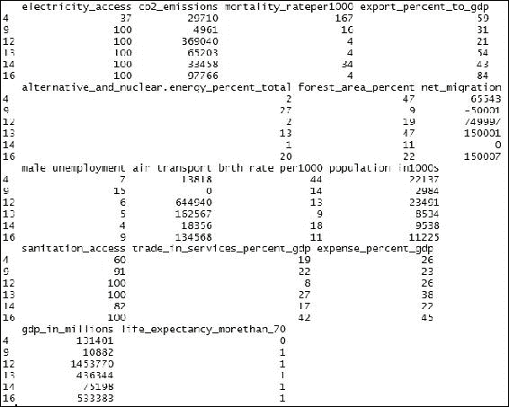
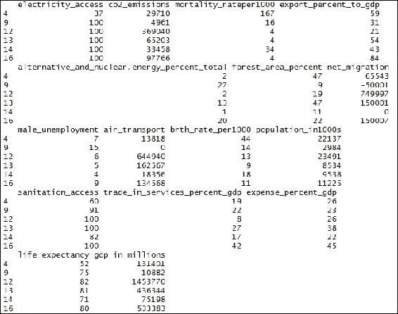
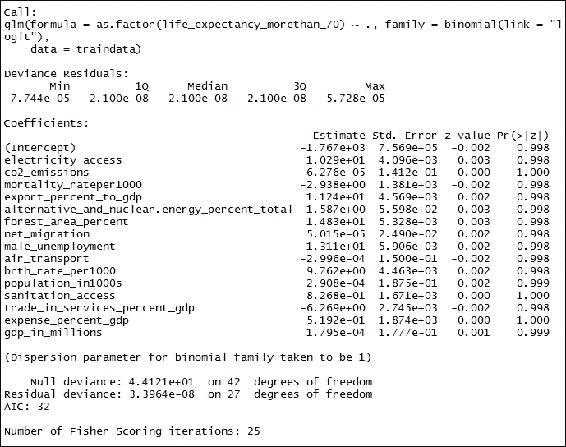
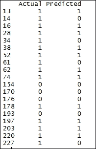
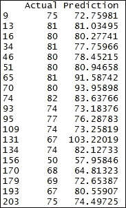
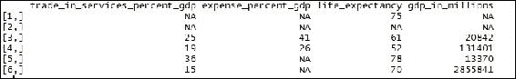

# 五、开发回归模型

回归分析是监督学习的经典例子。这是一种帮助您了解数据集中因变量和许多其他自变量之间关系的方法。

回归模型可以大致分为逻辑模型和线性模型。在逻辑回归的情况下，因变量是二项式的，我们的输出将是分类结果的概率；这种性质的问题通常称为分类问题。另一方面，在线性回归中，因变量本质上是连续的，这种性质的问题称为回归问题。

让我们为每个分类和回归问题举一个例子。一个典型的分类模型是使用关于客户的各种其他细节，如人口统计、历史和其他细节，预测银行客户是否会拖欠贷款，而当我们预测特定客户会拖欠多少钱时，这就是一个回归问题。

在本章中，您将学习构建用于评估预测和提高模型准确性的逻辑和线性回归模型。

本章将涉及的主题如下:

*   资料组
*   对数据集进行采样
*   逻辑回归
*   评估逻辑回归
*   线性回归
*   评估线性回归
*   提高准确度的方法

# 数据集

在本章中，我们将使用从网站[http://data.worldbank.org/](http://data.worldbank.org/)中提取的`samepublic`数据集，在[第 4 章](ch04.xhtml "Chapter 4. Segmentation Using Clustering")、*使用聚类*进行分段。在分类问题的情况下，如果预期寿命大于 70，我们通过将变量设为 1，将`life_expectancy`列转换为二项式变量；否则，变量将被设置为零。数据集的名称已更改为`worlddata_ForClassification`。对于分类问题，我们将`life_expectancy_morethan_70`列视为要预测的列，并建立逻辑回归算法:

```
# Data for Classification Problem
worlddatac<- read.csv("data/worlddata_ForClassification.csv")

```

阅读完前面的数据后，我们将删除与上一章类似的 NA 值的行，并且我们将删除名为 country 的列，因为它是一个唯一的列，不会帮助我们提高模型的准确性。格式化数据集后，我们将使用`head`函数查看数据集:

```
#Formatting the dataset
wcdata<- na.omit(worlddatac)
summary(wcdata)
names(wcdata)
wcdata<-  wcdata[ , -which(names(wcdata) %in% c("country"))]
head(wcdata)

```

输出如下所示:



另一方面，对于回归模型，我们将保留前一章中使用的数据集，并将`life_expectancy`列视为必须预测的因变量。在这种情况下，格式化步骤也将保持不变:

```
# Data for Regression
worlddata<- read.csv("data/worlddata.csv")
# formatting the dataset
wdata<- na.omit(worlddata)
wdata<-  wdata[ , -which(names(wdata) %in% c("country"))]
head(wdata)

```

输出如下所示:



# 对数据集进行采样

在构建模型时，我们需要一个用于训练模型的训练数据集，然后我们将有一个测试数据集，可以在其中测试我们构建的模型。让我们看看将数据集分为训练集和测试集的过程:

```
# divide into sample
training_positions<- sample(nrow(wcdata), size=floor((nrow(wcdata)*0.7)))

```

前面的代码将获取特定大小的样本—在本例中，它是原始数据集的 70%。我们将 70%的数据视为训练数据集，其余的将被视为测试数据集。数据集将被随机分割；为了确保测试集和训练集中数据的行为组合的一致性，随机分割数据集是非常重要的。我们可以使用`set.seed()`函数来确保在重新运行代码时输出不会改变:

```
# Split into train and test based on the sample size
traindata<-wcdata[training_positions,]
testdata<-wcdata[-training_positions,]

```

最后，使用下面的代码，我们可以了解训练数据集中以及测试数据集中存在的元素数量:

```
nrow(traindata)
[1] 43
nrow(testdata)
[1] 19

```


# 逻辑回归

为了在 R 中建立逻辑回归，我们一般使用`glm`函数，它只不过是二元因变量的广义线性模型。在下一节中，您将学习如何根据其他参数(我们称之为自变量)构建模型来预测一个国家的预期寿命是否超过 70 岁。这些自变量可以是连续的，也可以是分类的:

```
model<- glm(as.factor(life_expectancy_morethan_70)~., traindata, family=binomial(link = "logit"))

```

在前面的`glm`函数中，我们传递的第一个参数是必须为数据集预测的因变量列。我们将预测`life_expectancy_morethan_70`列，后跟`~`符号的点表示我们将数据集中出现的所有其他变量视为独立变量。我们提到的下一个参数是数据集的名称，在本例中，`traindata`数据框是数据集。最后，我们将`family`参数设置为`binomial`，并将链接指定为`logit`，这对应于逻辑回归。请注意，在执行上述代码时，我们可能会收到一些警告:

```
summary(model)

```

输出如下所示:



我们使用`summary`函数来探索已经建立的模型。列估计为我们提供了截距值，以及数据集中每个独立变量的系数。这里，正值增加成为 1 的概率，而负值增加成为 0 的概率。`Std. Error`是标准误差，用于衡量与估计值的偏差。`Z`值解释了因变量和每个自变量之间的关系，而`Pr`值是显著性值。

我们现在已经使用训练数据集构建了模型，现在我们需要使用模型来预测测试数据集中的值。为了进行预测，我们可以使用`predict`函数。应该作为输入传递给这个函数的各种参数是`model`和测试数据集。我们还将`type`参数作为`response`传递，因为我们需要概率方面的输出:

```
prediction<- predict(model, testdata, type="response")

```

测试数据集中值的所有预测都存在于矢量预测中。


# 评估逻辑回归

现在，在预测了测试数据集中的值之后，我们需要计算模型的准确性，以了解我们所处的位置。我们将首先组合实际值和预测值，使用`head`函数来直观地查看一些行的实际值和预测值之间的差异。然后，我们将把新形成的数据转换成数据帧格式。在反复试验的基础上，我们设置了一个合适的阈值。在下面的例子中，我们将值大于 0.7 的概率视为 1；否则，0:

```
result<- cbind(testdata$life_expectancy_morethan_70, prediction)
result<- as.data.frame(result)
colnames(result) <- c("Actual","Prediction")
result$Predicted[result[2] > 0.7] <- 1
result$Predicted[result[2] <= 0.7] <- 0
result<-  result[ , -which(names(result) %in% c("Prediction"))]
head(result, 20)

```

输出如下所示:



从前面的输出中，我们可以看到`Actual`和**预测的**值之间的差异。为了得到一个定量的度量，我们使用以下任何一种方法来得到分数。下面的函数表将生成混淆矩阵:

```
xtab <- table(result$Predicted, result$Actual)
0  1
0   4  4
1   0 11

```

我们也可以使用`confusionMatrix`函数来测量精度，但是由于它依赖于`caret`包，我们将在执行它之前安装并加载这个包:

```
install.packages("caret")
library(caret)
confusionMatrix(xtab)

```

输出如下所示:


`confusionMatrix`函数的输出为我们提供了**混淆矩阵**以及一些与用于逻辑回归的**精确度**的测量相关的统计数据。术语**灵敏度**和**特异性**的详细定义可在以下网址找到:

[https://en.wikipedia.org/wiki/Sensitivity_and_specificity](https://en.wikipedia.org/wiki/Sensitivity_and_specificity)

因此，您了解了逻辑回归的实现以及评估结果的绩效所涉及的步骤。现在，我们可以自己进行并实现更多的逻辑回归用例了。


# 线性回归

构建线性回归模型与构建逻辑回归模型非常相似。在简单线性回归中，我们根据其他自变量的值来预测因变量的值。在多元线性回归的情况下，我们将根据两个或多个自变量来预测因变量。

先来学习一下用 r 实现线性回归，首先需要把数据集分成训练数据和测试数据。用于分割数据集的代码与在*对数据集*进行采样一节中解释的代码非常相似。您可以在为探索线性回归而创建的数据集上使用以下代码:

```
# divide into sample
training_positions<- sample(nrow(wdata), size=floor((nrow(wdata)*0.7)))
# Split into train and test based on the sample size
traindata<-wdata[training_positions,]
testdata<-wdata[-training_positions,]
nrow(traindata)
nrow(testdata)

```

前面的代码将数据集分为定型集和测试集，比例分别为 70 和 30。我们可以通过调整参数大小中的倍增因子来改变比例。将数据集分成两组后，让我们使用训练数据集构建模型。建立线性回归模型的函数是`lm`。我们需要传递需要预测的列，后面跟有一个符号`~`和一个点，表示我们将所有其他变量视为自变量，用于预测因变量。或者，我们也可以选择应该用来预测因变量的列。我们还将数据集的名称作为参数传递，线性回归中使用的数据集被命名为`traindata`:

```
model<- lm(life_expectancy~., traindata)
summary(model)

```

输出如下所示:


`summary`函数为我们提供了已经建立的线性回归模型的细节。输出将与逻辑回归产生的输出非常相似。出现在前面输出中的估计值是自变量的系数。正值表示有正的关系，而负值表示有负的关系。`Std. Error`是系数偏差的估计值。t 统计值是系数，即估计值除以标准误差。最后一列告诉我们变量的重要性。从前面的输出中，我们可以了解到`mortality_rateper100`变量的显著性小于 0.05，而`c02_emissions`变量的显著性分数约为 0.08，低于 10%。这意味着这两个变量在准确预测预期寿命方面具有更高的影响。

建立模型后，您将学会使用它来进行预测。`predict`函数可用于进行预测。在线性回归的情况下，我们将通过`model`以及测试数据集作为输入参数。向量预测将保存测试数据集的所有`prediction`值:

```
prediction<- predict(model, testdata)

```

为了比较预测值和实际值，我们需要合并这些值。这可以使用`cbind`功能来完成。然后，我们使用`as.data.frame`函数将其转换为数据帧:

```
result<- cbind(testdata$life_expectancy, prediction)
result<- as.data.frame(result)
colnames(result) <- c("Actual","Prediction")
head(result, 50)

```

输出为,如下所示:



# 评估线性回归

线性回归的评估不同于我们在逻辑回归中所做的。评估线性回归问题最常见的方法是基于均方误差率。这可以使用以下代码实现:

```
#evaluation for the regression - mean squared error
sqerr<- (result$Actual-result$Prediction)^2
meansqerr<- sum(sqerr)/nrow(result)
meansqerr
[1] 104.1653

```

前面的值是错误率。我们可以调整线性回归模型，直到达到最低的错误分数。


# 提高准确度的方法

我们将探索一些不同的方法来提高模型的准确性。注意，这些只是可以尝试的技巧；他们不能保证准确性的提高。有些方法可能适用于某些类型的数据。让我们来了解一下可供我们选择的热门选项。


# 集合模型

我们将构建多个算法，并用不同的权重组合不同算法的结果。我们可以在试错的基础上决定权重。如前所述，数据集可以分为训练集和测试集，我们可以使用不同的权重来评估性能。

另外可以实现的流行回归模型有**支持向量机** ( **SVM** )和**随机森林**。在 SVM 算法中，通过构建超平面来构建模型，而在随机森林中，我们通过构建多个决策树来构建模型。

## 用平均值或中值代替 NA

当有极少数记录为空白或 NA 值时，那么我们也可以考虑用平均值代替。这种方法可能有助于提高准确性，也可能没有帮助，因此，在样本测试数据上测试性能很重要。这可以使用下面的代码来实现。

最好用中值代替缺失值，而不是平均值，因为少数异常值的存在会扭曲平均值，但不会影响中值:

```
# Actual data
worldd<- read.csv("data/worlddata.csv")
worldd<-  worldd[ , -which(names(worldd) %in% c("country"))]
worldd<- as.matrix(worldd)
head(worldd)

```

输出如下所示:



### 注意

注意，前面的截图只是输出的一部分。

让我们编写代码，用中值替换 NA 值:

```
# Replacing with the Median value
worldd[is.na(worldd)] <- median(worldd, na.rm=TRUE)
head(worldd)

```

输出如下:


### 注意

注意，前面的截图只是输出的一部分。

让我们编写代码，用平均值替换 NA 值:

```
# Replacing with the mean value
worldd[is.na(worldd)] <- mean(worldd, na.rm=TRUE)
head(worldd)

```

输出如下所示:


### 注意

注意，前面的截图只是输出的一部分。

## 删除高度相关的值

当自变量的数量很大时，这种方法更为合适。当我们建立一个包含大量独立变量的模型时，误差率有可能会增加，因为误差也会随着变量的增加而放大。因此，我们应该删除重复的列——这可以通过计算变量之间的相关性来实现——然后，我们可以删除具有高相关性的变量。

这可以如下面的代码所示实现；阅读注释(语句后跟`#`)以更好地理解代码:

```
# Initial number of columns
ncol(worldd)
[1] 16
library(caret)
# Identify the column pairs with correlation more than 0.9
tooHigh<- findCorrelation(cor(worldd[,1:16]), .9)
# The column number 9 is duplicated
tooHigh
[1] 9
# remove those highly correlated columns
worldd<-worldd[,-tooHigh]
# Total number of columns after removal
ncol(worldd)
[1] 16

```

## 去除异常值

离群值的存在可能有助于提高模型的准确性，也可能没有帮助。通常，当数据集中出现的异常值很少时，建议您在构建模型时移除它们，因为它们可能会扭曲结果。当异常值的数量很大时，它基本上传达了数据的动态性质，因此在这些情况下，建议保留数据集中的异常值。

使用下面的代码可以删除数据中的异常值。`outlier`函数需要加载`outliers`包。请阅读注释以更好地理解代码。在下面的例子中，大量的值被认为是异常值；因此，出现异常值似乎是数据集的正常行为。在这种情况下，建议不要执行异常值去除过程，而是在预测因变量时保留异常值:

```
# Package required for using the function outlier
library(outliers)
#Identifying the outliers in the dataset
outlier_tf = outlier(worldd,logical=TRUE)
#Number of outliers in the dataset
sum(outlier_tf)
[1] 518
#Positions of the outliers
find_outlier = which(outlier_tf==TRUE,arr.ind=TRUE)
#Removing the outliers
worldd = worldd[-find_outlier,]
# Number of rows after removing the outliers in the dataset
nrow(worldd)
[1] 62

```

这些技术可能有助于提高逻辑和线性回归模型的准确性。一般来说，这些方法中的一个或多个可以很好地用于特定的数据集。与其建立模型并测试测试数据，不如拆分训练数据，建立模型并测试性能，然后再进行最终预测。


# 总结

我们获得了建立逻辑和线性回归模型的能力。您还学习了在给定的数据集上对模型进行内部评估，方法是将它们随机分成两个不同的数据集，读取模型的输出，进行业务解释，以及一些可用于提高模型准确性的非常重要的技术。最重要的是，你学习了这些算法对我们有用的场景。

在下一章中，我们将介绍基于时间序列数据的预测，这对于预测销售非常有帮助，并帮助我们做出相应的计划。