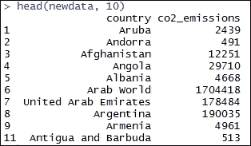
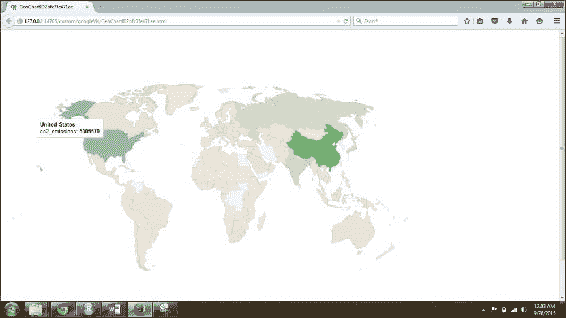
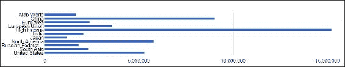
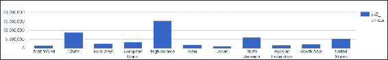
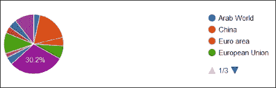

# 八、展示数据分析

数据分析过程中最重要的步骤是将分析结果传达给用户。根据用户的角色和需求定制报告是非常必要的。如果没有以正确的方式交流，你所有的分析都是没有价值的。

可视化是以图形或图像格式表示数据，通常会吸引人们的注意力。r 是一个强大的工具，不仅用于分析和实现机器学习算法，还用于通过创建交互式仪表板来可视化和交流分析。

数据可视化已经被世界各地的人们和组织作为一种交流方式采用。最常见的例子是，我们通过汽车的仪表板来了解汽车的性能。

我们将介绍使用`googleVis`包的有趣的可视化，以及使用 R Shiny 创建交互式仪表板。

本章将涉及的主题如下:

*   资料组
*   使用 googleVis 软件包绘图
*   使用 Shiny 创建交互式仪表板

# 数据集

在本章中，我们将使用在第四章、*中使用的数据集，使用聚类*进行分段。这个数据集捕获了世界上各个国家的各种数据。我们将使用一些列向量来学习数据可视化和通信。由于我们已经看到了数据集的结构，我们将继续讨论概念。


# 使用 googleVis 软件包绘图

我们将使用`googleVis`包来看一个有趣的可视化。首先，我们需要安装这个包，并使用下面的代码将其加载到 R 环境中:

```r
install.packages("googleVis")
library(googleVis)

```

我们现在将读取一个可以使用`googleVis`包可视化的数据集。从`worlddata`数据集中，我们将考虑`country`和`co2_emissions`列。下面的代码将读取包含所有列的数据集，然后通过指定所需列的名称来选择它们。然后，我们将删除具有 NA 值的行:

```r
data <- read.csv("Data/worlddata.csv")
newdata <- data[,c("country","co2_emissions")]
newdata <- na.omit(newdata)
head(newdata, 10)

```

上述命令的输出如下:



我们现在已经得到了所有国家的二氧化碳排放量。让我们试着使用`gvisGeoChart`函数在世界地图上绘制这个。我们需要传递需要绘制的数据集，`locationvar`参数应该设置为保存`country`名称的列，`colorvar`参数应该使用基于列的来指定，颜色编码需要在此基础上实现，最后，我们需要将需要绘制数据的地图投影传递给`options`参数。此外，`width`和`height`参数指定了绘图的大小:

```r
GeoPlot<- gvisGeoChart(newdata, locationvar="country", 
 colorvar="co2_emissions",
 options=list(projection="kavrayskiy-vii", width=1000, height=700))
plot(GeoPlot)

```

绘图功能将在默认浏览器中打开以下输出:



鼠标悬停时，我们将获得这些国家的实际排放值。因此，这是一个使用`googleVis`包的有趣的情节。

让我们使用 googleVis 包探索更多的可视化。我们将只考虑基于`co2_emissions`列的前 5%的数据。我们将使用`gvisBarChart`函数实现条形图，使用`gvisColumnChart`函数实现柱形图，使用`gvisAreaChart`函数实现面积图，使用`gvisPieChart`函数实现饼图，如下所示:

```r
Filtereddata <- newdata[newdata$co2_emissions > quantile(newdata$co2_emissions,prob=1-5/100),]
head(Filtereddata)
# bar Chart
Bar <- gvisBarChart(Filtereddata)
plot(Bar)

```

上述命令的输出如下:



让我们使用柱形图检查数据的表示方式:

```r
# Column Chart
Clmn <- gvisColumnChart(Filtereddata)
plot(Clmn)

```

上述命令的输出如下:



让我们使用面积图来检查数据的表示:

```r
Area <- gvisAreaChart(Filtereddata)
plot(Area)

```

上述命令的输出如下:


让我们使用饼图来检查数据的表示:

```r
Pie <- gvisPieChart(Filtereddata)
plot(Pie)

```

上述命令的输出如下:



为了了解一些使用 googleVis 包的更有趣的可视化，请参考下面的 URL:

[https://cran . r-project . org/web/packages/Google vis/vignettes/Google vis _ examples . html](https://cran.r-project.org/web/packages/googleVis/vignettes/googleVis_examples.html)

它拥有各种绘图方法的工作示例。我们现在将继续使用 Shiny 创建一个交互式仪表板。


# 使用 Shiny 创建交互式仪表盘

Shiny 是一个用于 r 的 web T2 应用框架，我们可以使用它来创建一个交互式仪表盘。我们将看到一个使用 R 和 Shiny 的示例仪表板的实现细节。

为了使用来自 R 的 Shiny 创建交互式仪表盘，我们需要在 R:

```r
install.packages("shiny")
library(shiny)

```

在 R 中安装并加载`shiny`包后，可以在`R`文件夹中查看`\win-library\3.2\shiny\examples`路径，该文件夹中保存了与包相关的文件夹和文件。`R`文件夹主要存在于程序文件中；如果 R 没有写入程序文件的管理权限，它将存在于`Documents`文件夹或安装或首包安装期间指定的任何其他自定义文件夹中。

在`examples`文件夹中，可以看到已经开发出来的各种样例 app。我们可以创建一个新文件夹，并开始开发新的应用程序。或者，您也可以使用`runExample`函数运行示例代码。为了运行`01_hello`应用程序，我们需要使用`runExample("01_hello")`命令。

闪亮的应用程序开发有两个重要的组件，即服务器脚本和 UI 脚本。让我们创建一个名为`App`的新文件夹，并将其用于交互式仪表盘应用程序开发。请记住，文件夹名称将用于执行应用程序。

UI 脚本保存了应用程序的布局和外观信息，它应该被命名为`ui.R`。将以下代码复制并粘贴到`ui.R`文件中:

```r
shinyUI(navbarPage("Interactive Dashboard",
  tabPanel("Scatter Plot",
    plotOutput("plot")
  ),
  tabPanel("Summary Report",
    verbatimTextOutput("summary")
  ),
  tabPanel("Data",
    dataTableOutput("table")
  )
))
```

前面的 UI 代码为仪表板创建了三个不同的选项卡，即`Scatter Plot`、`Summary Report`和`Data`。从前面的 UI 代码中，我们可以理解第一个选项卡包含一个绘图，第二个选项卡包含一个测试输出，第三个选项卡包含一个表格输出。

服务器脚本包含构建应用程序的信息。让我们详细看看如何使用服务器端脚本填充这三个选项卡。我们需要将这个文件命名为`server.R`。将以下代码复制并粘贴到`server.R`文件中:

```r
shinyServer(function(input, output, session) {
  # First Tab
  output$plot <- renderPlot({
    data <- read.csv("Data/worlddata.csv")
    data <- data[,c("gdp_in_millions","co2_emissions")]
    data <- na.omit(data)
    data <- data[data$gdp_in_millions > quantile(data$gdp_in_millions,prob=1-10/100),]
    plot(data, type="p")
  })

  # Second Tab
  output$summary <- renderPrint({
    data <- read.csv("Data/worlddata.csv")
    data <- data[,c("gdp_in_millions","co2_emissions")]
    data <- na.omit(data)
    data <- data[data$gdp_in_millions > quantile(data$gdp_in_millions,prob=1-10/100),]
    summary(data)
  })
  # Third Tab
  output$table <- renderDataTable({
    data <- read.csv("Data/worlddata.csv")
    data <- data[,c("country","gdp_in_millions","co2_emissions")]
    data <- na.omit(data)
    data <- data[data$gdp_in_millions > quantile(data$gdp_in_millions,prob=1-10/100),]
    data
  }, options=list(pageLength=10))
})
```

服务器脚本中的`renderPlot`函数将实现散点图。从`worlddata`数据集中，我们读取`gdp_in_millions`和`co2_emissions`列，然后我们移除NA 行，并基于`gdp_in_millions`列仅考虑前 10%以获得更好的可视化效果。最后，我们使用`plot`函数和设置为引脚顺序的`type`参数来制作散点图。

我们使用`renderPrint`函数来填充第二个选项卡。这个函数在格式方面是完全相同的，但是我们使用了`summary`函数来获得关于数据集的汇总细节。最后一个`renderDataTable`函数将在第三个选项卡中打印整个数据集。这里唯一的区别是我们保留了一个额外的列，即`country`，以便更容易地解释结果。

因此，我们研究了仪表板的服务器和`ui`脚本。现在，为了激活仪表板，我们需要执行以下代码。记住我们的文件夹名是`App`，因此我们将把它作为`runExample`函数中的一个参数。它将在浏览器中打开仪表盘。

```r
runExample("App")

```

### 注意

记住，根据前面的命令，`ui`和`server`脚本需要放在 examples 文件夹中名为`App`的文件夹下。另外，记得根据数据集的位置设置目录位置；在前面的例子中，目录将有一个名为`Data`的文件夹，它将保存实际的数据集。

让我们看一下我们刚刚创建的控制面板。

表 1 如下所示:


表 2 如下所示:


制表 3 的给定为如下:


因此，我们使用 R 和 Shiny 创建了一个简单的交互式仪表板。为了详细了解交互式仪表盘的创建，请参考 http://shiny.rstudio.com/tutorial/。

在前面的 URL 中，除了教程之外，您还可以找到一些工作示例以及代码和输出。


# 总结

在这一章中，你学会了使用`googleVis`包创建一个吸引人的可视化，使用`shiny`包创建一个交互式仪表板，并且很好地理解了应用程序的组件。

最后，在本书中，您学习了一些最基本的数据科学概念，例如使数据为分析做好准备的基本数据格式、探索性数据分析、使用 Apriori 算法的模式发现、使用聚类算法的分段、回归模型、对时间序列数据集进行预测、使用协作过滤方法构建推荐引擎，以及创建与用户交流的仪表板。总的来说，您通过工作示例以及可以应用这些示例的真实用例了解了所有这些内容。