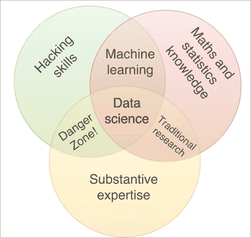

# 一、Scala 和数据科学

20 世纪下半叶是硅的时代。在五十年里，计算能力从极度匮乏到完全平凡。21 世纪的上半叶是互联网的时代。过去 20 年见证了谷歌、推特和脸书等巨头的崛起——这些巨头永远改变了我们看待知识的方式。

互联网是一个巨大的信息网络。人类产生的 90%的数据是在过去的 18 个月里产生的。程序员、统计学家和科学家可以利用这些过剩的数据获得真正的理解，他们将对企业、政府和慈善机构的决策产生越来越大的影响。

这本书努力介绍一些工具，你将需要这些工具来综合雪崩的数据，以产生真正的洞察力。

# 数据科学

数据科学是从数据中提取有用信息的过程。作为一门学科，它的定义仍然有些模糊，几乎和专家的定义一样多。我不会添加另一个定义，我将遵循*德鲁·康威的*描述([http://Drew Conway . com/Zia/2013/3/26/the-data-science-Venn-diagram](http://drewconway.com/zia/2013/3/26/the-data-science-venn-diagram))。他将数据科学描述为三组正交技能的顶点:

*   数据科学家必须具备*黑客技能*。数据通过计算机存储和传输。计算机、编程语言、库是数据科学家的锤子和凿子；他们必须自信而准确地运用它们，随心所欲地塑造数据。这就是 Scala 的用武之地:它是您编程工具包中的一个强大工具。
*   数据科学家必须对*统计和数字算法*有很好的理解。优秀的数据科学家会理解机器学习算法如何运作，以及如何解释结果。他们不会被误导的度量标准、欺骗性的统计数据或曲解的因果联系所愚弄。
*   一名优秀的数据科学家必须对*问题领域*有很好的理解。数据科学过程包括以科学严谨的方式构建和发现关于问题领域的知识。因此，数据科学家必须提出正确的问题，了解以前的结果，并理解数据科学工作如何适应更广泛的业务或研究环境。

Drew Conway 用一张文氏图优雅地总结了这一点，该图显示了数据科学在黑客技能、数学和统计知识以及实质性专业知识之间的交叉点:



当然，很少有人同时是这些领域中一个以上的专家。数据科学家通常在跨职能团队中工作，不同的成员提供不同领域的专业知识。为了有效地发挥作用，团队的每个成员都必须对所有这三个领域有一个基本的工作知识。

为了更具体地概述数据科学项目中的工作流，让我们假设我们正试图编写一个应用程序来分析公众对政治活动的看法。数据科学管道可能是这样的:

*   **获取数据**:这可能涉及从文本文件中提取信息、轮询传感器网络或查询 web API。例如，我们可以查询 Twitter API 来获得带有相关标签的 tweets 列表。
*   **数据接收**:数据通常来自许多不同的来源，可能是非结构化或半结构化的。数据接收包括从数据源移动数据，处理数据以提取结构化信息，并将这些信息存储在数据库中。例如，对于推文，我们可能会提取用户名、推文中提到的其他用户的姓名、标签、推文的文本以及推文是否包含某些关键字。
*   **探索数据**:我们通常清楚地知道我们想从数据中提取什么信息，但却不知道如何提取。例如，让我们想象一下，我们已经获取了数千条包含与我们的政治活动相关的标签的推文。从我们的推文数据库到最终目标没有明确的路径:洞察公众对我们活动的总体看法。数据探索包括规划我们将如何到达那里。这一步通常会发现新的问题或数据来源，这需要回到管道的第一步。例如，对于我们的推文数据库，我们可能会决定，我们需要让一个人手动标记一千条或更多条推文，以表达对政治竞选的“积极”或“消极”情绪。然后，我们可以使用这些推文作为训练集来构建一个模型。
*   **特征构建**:一个机器学习算法只和进入它的特征一样好。数据科学家的很大一部分时间涉及转换和组合现有要素，以创建与我们试图解决的问题更密切相关的新要素。例如，我们可能会构建一个新的特征，对应于一条推文中“正面”发音单词或单词对的数量。
*   **模型构建和训练**:构建了进入模型的特征后，数据科学家现在可以在他们的数据集上训练机器学习算法。这通常包括尝试不同的算法和优化模型**超参数**。例如，我们可能会决定使用随机森林算法来决定一条推文对该活动是“正面”还是“负面”。构建模型包括选择正确的树数以及如何计算杂质度量。对统计和问题域的正确理解将有助于做出这些决策。
*   **模型推断和预测**:数据科学家现在可以使用他们的新模型来尝试和推断关于以前未见过的数据点的信息。他们可能会通过他们的模型传递一条新的推文，以确定它是正面还是负面地谈论政治活动。
*   **从模型中提取智慧和洞察力**:数据科学家将数据分析过程的结果与业务领域的知识相结合，为业务决策提供信息。他们可能会发现，特定的信息更能引起目标受众或目标受众特定部分的共鸣，从而导致更准确的定位。向利益相关者提供信息的一个关键部分涉及数据可视化和呈现:数据科学家创建图表、可视化和报告，以帮助使得出的见解清晰而有说服力。

这远不是线性的管道。通常，在一个阶段获得的洞察力需要数据科学家回溯到管道的前一个阶段。事实上，从原始数据中产生商业见解通常是一个迭代过程:数据科学家可能会快速地进行第一次检查，以验证问题的前提，然后通过添加新数据源或新功能或尝试新的机器学习算法来逐步完善方法。

在本书中，您将学习如何处理 Scala 中的每一步，利用现有的库来构建健壮的应用程序。


# 数据科学中的编程

这本书不是一本关于数据科学的书。这是一本关于如何将编程语言 Scala 用于数据科学的书。那么，在处理数据时，编程的作用在哪里呢？

计算机参与了数据科学管道的每一步，但不一定以相同的方式参与。如果我们只是编写一次性的脚本来探索数据，或者试图构建一个可扩展的应用程序来通过一个很好理解的管道推送数据，以持续提供商业智能，那么我们构建的程序风格将会有很大的不同。

让我们想象一下，我们为一家制作手机游戏的公司工作，在这家公司里，你可以购买游戏内的福利。大多数用户从不购买任何东西，但一小部分用户可能会花很多钱。我们想建立一个模型，根据他们的游戏模式来识别大买家。

第一步是探索数据，找到正确的特征，并基于数据的子集构建模型。在这个探索阶段，我们心中有一个明确的目标，但不知道如何实现。我们需要一种轻量级的、灵活的、具有强大库的语言来尽快为我们提供一个工作模型。

一旦我们有了一个工作模型，我们需要将它部署在我们的游戏平台上，以分析所有当前用户的使用模式。这是一个非常不同的问题:我们对项目的目标以及如何实现目标有一个相对清晰的理解。挑战在于设计能够向外扩展以处理所有用户并对未来使用模式的变化保持稳健的软件。

在实践中，我们编写的软件的类型通常是从单一的一次性脚本到生产级代码，这些代码必须能够抵御未来的扩展和负载增加。在编写任何代码之前，数据科学家必须了解他们的软件在这个光谱中的位置。姑且称之为**持久性** **频谱**。


# 为什么选择 Scala？

你想写一个处理数据的程序。你应该选择哪种语言？

有几种不同的选择。您可以选择 Python 或 R 等动态语言，或者 Java 等更传统的面向对象语言。在这一节中，我们将探索 Scala 与这些语言的不同之处，以及何时使用它是有意义的。

当选择一种语言时，架构师的权衡在于可证明的正确性和开发速度之间的平衡。您需要强调这些方面中的哪一个将取决于应用程序的需求以及您的程序在持久性谱上的位置。这是一个简短的脚本吗？它会被一些人使用，这些人可以很容易地修复出现的任何问题。如果是这样的话，你也许可以允许在很少使用的代码路径中出现一定数量的错误:当开发人员遇到障碍时，他们可以在问题出现时修复它。相比之下，如果您正在开发一个数据库引擎，并计划向更广阔的世界发布，那么您很可能会更喜欢正确性而不是快速开发。例如，SQLite 数据库引擎以其广泛的测试套件而闻名，测试代码是应用程序代码的 800 倍([https://www.sqlite.org/testing.html](https://www.sqlite.org/testing.html))。

当评估一个程序的正确性时，重要的不是感知到的缺陷的不存在，而是你能证明某些缺陷不存在的程度。

有几种方法可以在代码运行之前证明没有错误:

*   静态类型检查发生在静态类型语言的编译时，但这也可以用在支持类型批注或类型提示的强类型动态语言中。类型检查有助于验证我们是否按预期使用了函数和类。
*   静态分析器和 linters，用于检查未定义的变量或可疑行为(比如永远无法到达的代码部分)。
*   在编译语言中将一些属性声明为不可变的或常量。
*   单元测试证明沿着特定的代码路径没有错误。

还有几种方法可以检查运行时是否存在某些错误:

*   静态类型语言和动态语言中的动态类型检查
*   验证假定的程序不变量或预期契约的断言

在接下来的章节中，我们将研究 Scala 与数据科学中的其他语言相比如何。

## 静态分型和类型推断

Scala 的静态打字系统非常通用。关于程序行为的许多信息可以编码在类型中，允许编译器保证一定程度的正确性。这对于很少使用的代码路径特别有用。动态语言在特定的执行分支运行之前无法捕捉错误，所以一个 bug 可能会持续很长时间，直到程序遇到它。在静态类型语言中，任何可以被编译器捕获的错误都会在编译时被捕获，甚至在程序开始运行之前。

静态类型的面向对象语言经常被批评为不必要的冗长。考虑 Java 中的`Example`类实例的初始化:

```
Example myInstance = new Example() ;
```

我们必须重复两次类名——一次用于定义`myInstance`变量的编译时类型，一次用于构造实例本身。这感觉像是不必要的工作:编译器知道`myInstance`的类型是`Example`(或`Example`的超类)，因为我们绑定的是`Example`类型的值。

像大多数函数式语言一样，Scala 使用类型推断来允许编译器从绑定到变量的实例中推断出变量的类型。我们将在 Scala 中编写如下等价行:

```
val myInstance = new Example()
```

Scala 编译器推断`myInstance`在编译时具有`Example`类型。很多时候，指定函数的参数和返回值的类型就足够了。然后，编译器可以推断函数体中定义的所有变量的类型。Scala 代码通常比同等的 Java 代码更简洁，可读性更好，而且不会损害任何类型安全。

## Scala 鼓励不变性

Scala 鼓励使用不可变对象。在 Scala 中，将属性定义为不可变非常容易:

```
val amountSpent = 200
```

默认集合是不可变的:

```
val clientIds = List("123", "456") // List is immutable

clientIds(1) = "589" // Compile-time error
```

拥有不可变对象消除了一个常见的错误来源。知道一些对象一旦被实例化就不能被改变，减少了 bug 蔓延的地方。我们可以缩小构造函数的范围，而不是考虑对象的生存期。

## Scala 和函数式程序

Scala 鼓励功能代码。许多 Scala 代码都使用高阶函数来转换集合。作为程序员，您不必处理迭代集合的细节。让我们编写一个`occurrencesOf`函数，返回元素在列表中出现的索引:

```
def occurrencesOf[A](elem:A, collection:List[A]):List[Int] = {

  for { 

    (currentElem, index) <- collection.zipWithIndex

    if (currentElem == elem)

  } yield index

}
```

这是如何工作的？我们首先声明一个新的列表`collection.zipWithIndex`，它的元素是`(collection(0), 0)`、`(collection(1), 1)`，以此类推:集合的元素对及其索引。

然后我们告诉 Scala 我们想要迭代这个集合，将变量`currentElem`绑定到当前元素，将变量`index`绑定到索引。我们在迭代中应用一个过滤器，只选择那些`currentElem == elem`的元素。然后我们告诉 Scala 只返回`index`变量。

我们不需要处理 Scala 中迭代过程的细节。语法是非常声明性的:我们告诉编译器，我们希望集合中每个元素的索引都等于`elem`,让编译器担心如何迭代集合。

考虑 Java 中的等价内容:

```
static <T> List<Integer> occurrencesOf(T elem, List<T> collection) {

  List<Integer> occurrences = new ArrayList<Integer>() ;

  for (int i=0; i<collection.size(); i++) {

    if (collection.get(i).equals(elem)) {

      occurrences.add(i) ;

    }

  }

  return occurrences ;

}
```

在 Java 中，首先要定义一个(可变的)列表，在找到匹配项时将它们放入其中。然后，通过定义一个计数器来遍历集合，依次考虑每个元素，如果需要的话，将它的索引添加到出现的列表中。为了让这种方法发挥作用，我们还需要更多的活动部件。这些移动部分的存在是因为我们必须告诉 Java 如何迭代集合，它们代表了一个常见的错误来源。

此外，由于迭代机制占用了大量代码，定义函数逻辑的代码行更难找到:

```
static <T> List<Integer> occurrencesOf(T elem, List<T> collection) {

  List<Integer> occurences = new ArrayList<Integer>() ;

  for (int i=0; i<collection.size(); i++) {

    if (collection.get(i).equals(elem)) { 

      occurrences.add(i) ;

    }

  }

  return occurrences ;

}
```

注意，这并不意味着对 Java 的攻击。事实上，Java 8 增加了一系列函数构造，比如 lambda 表达式、镜像 Scala 的`Option`的`Optional`类型，或者流处理。相反，它意味着展示功能方法在最小化错误可能性和最大化清晰度方面的好处。

## 空指针不确定性

我们经常需要用来表示一个值的可能缺失。例如，假设我们正在从 CSV 文件中读取用户名列表。CSV 文件包含姓名和电子邮件信息。但是，一些用户拒绝将他们的电子邮件输入系统，因此没有这些信息。在 Java 中，通常将电子邮件表示为一个字符串或一个`Email`类，并通过将该引用设置为`null`来表示特定用户没有电子邮件信息。类似地，在 Python 中，我们可以使用`None`来演示值的缺失。

这种方法是危险的，因为我们没有对可能缺少的电子邮件信息进行编码。在任何重要的程序中，决定一个实例属性是否可以是`null`需要考虑定义这个实例的每一个场合。这很快变得不切实际，所以程序员要么假设变量不为空，要么过于保守地编码。

Scala(跟随其他函数式语言)引入了`Option[T]`类型来表示可能不存在的属性。然后，我们可能会编写以下内容:

```
class User {

  ...

  val email:Option[Email]

  ...

}
```

我们现在已经在类型信息中编码了可能缺少电子邮件的情况。对于任何使用`User`类的程序员来说，很明显电子邮件信息可能不存在。更好的是，编译器知道`email`字段可以不存在，这迫使我们处理这个问题，而不是不顾一切地忽略它，让应用程序在运行时因空指针异常而烧毁。

所有这些都可以追溯到达到一定程度的可证明的正确性。从不使用`null`，我们知道我们永远不会遇到空指针异常。在没有`Option[T]`的语言中实现相同级别的正确性需要在客户端代码上编写单元测试，以验证当电子邮件属性为空时它的行为是否正确。

请注意，在 Java 中使用例如 Google 的 Guava 库([https://code . Google . com/p/Guava-libraries/wiki/UsingAndAvoidingNullExplained](https://code.google.com/p/guava-libraries/wiki/UsingAndAvoidingNullExplained))或 Java 8 中的`Optional`类来实现这一点是可能的。这更多的是一个惯例问题:在 Java 中使用`null`来表示缺少一个值早已成为规范。

## 更简单的并行

编写利用并行架构的程序是一项挑战。然而，除了最简单的数据科学问题之外，解决所有的问题都是必要的。

并行编程之所以困难，是因为我们作为程序员，倾向于按顺序思考。对并发程序中不同事件发生的顺序进行推理非常具有挑战性。

Scala 提供了几个抽象概念，极大地方便了并行代码的编写。这些抽象通过对实现并行的方式施加约束来工作。例如，并行集合迫使用户将计算表述为集合上的一系列操作(如**映射**、**归约**和**过滤**)。参与者系统要求开发人员从封装应用程序状态并通过传递消息进行通信的参与者的角度来考虑问题。

限制程序员随心所欲地编写并行代码的自由，避免了许多与并发性相关的问题，这似乎是矛盾的。然而，限制程序行为方式的数量有助于思考它的行为。例如，如果一个参与者行为不端，我们知道问题要么出在这个参与者的代码中，要么出在这个参与者收到的某个消息中。

作为拥有一致的、限制性的抽象所提供的能力的一个例子，让我们使用并行集合来解决一个简单的概率问题。我们将计算在 100 次掷硬币中至少有 60 次正面朝上的概率。我们可以使用蒙特卡洛来估算:我们通过抽取 100 个随机布尔值来模拟 100 次抛硬币，并检查真值的数量是否至少为 60。我们重复这个过程，直到结果收敛到要求的精度，或者我们等得不耐烦了。

让我们在 Scala 控制台中运行一下:

```

scala> val nTosses = 100

nTosses: Int = 100

scala> def trial = (0 until nTosses).count { i =>

 util.Random.nextBoolean() // count the number of heads

}

trial: Int

```

`trial`函数运行一组 100 次投掷，返回头数:

```

scala> trial

Int = 51

```

为了得到我们的答案，我们只需要尽可能多地重复`trial`并汇总结果。重复同一组操作非常适合并行收集:

```

scala> val nTrials = 100000

nTrials: Int = 100000

scala> (0 until nTrials).par.count { i => trial >= 60 }

Int = 2745

```

因此，概率大约为 2.5%到 3%。我们所要做的就是使用`par`方法将范围`(0 until nTrials)`并行化，从而将计算分布到计算机中的每个 CPU 上。这展示了拥有一致抽象的好处:并行集合让我们可以并行化任何可以用集合上的高阶函数来描述的计算。

显然，并不是每个问题都像简单的蒙特卡罗问题那样容易并行化。然而，通过提供丰富的直观抽象，Scala 使得编写并行应用程序变得容易管理。

## 与 Java 的互操作性

Scala 在 Java 虚拟机上运行。Scala 编译器将程序编译成 Java 字节码。因此，Scala 开发人员可以直接访问 Java 库。鉴于用 Java 编写的应用程序数量惊人，无论是开源的还是作为组织中遗留代码的一部分，Scala 和 Java 的互操作性有助于解释 Scala 的快速普及。

互操作性不仅仅是单向的:一些 Scala 库，比如 Play framework，在 Java 开发人员中越来越受欢迎。


# 何时不使用 Scala

在前面的章节中，我们描述了 Scala 的强类型系统、对不变性的偏好、函数能力和并行性抽象如何使编写可靠的程序变得容易，并使意外行为的风险最小化。

在你的下一个项目中，你有什么理由避免使用 Scala？一个重要原因是熟悉。Scala 引入了许多概念，比如隐式、类型类和使用特性的组合，这些特性对于来自面向对象世界的程序员来说可能并不熟悉。Scala 的类型系统非常有表现力，但是要充分了解它并充分发挥它的威力需要时间，并且需要适应新的编程范式。最后，对于来自 Java 或 Python 的程序员来说，处理不可变的数据结构可能会感觉陌生。

然而，这些都是可以随着时间的推移而克服的缺点。在库可用性方面，Scala 确实不如其他数据科学语言。IPython 笔记本，加上 matplotlib，是无与伦比的数据探索资源。人们正在努力在 Scala 中提供类似的功能(例如，Spark Notebooks 或 Apache Zeppelin)，但是还没有达到同样成熟水平的项目。当探索数据或尝试不同的模型时，类型系统也可能是一个小障碍。

因此，在这位作者的偏见中，Scala 擅长于更持久的程序。如果您正在编写一次性脚本或探索数据，使用 Python 可能会更好。如果你正在写一些需要重用的东西，并且需要一定程度的可证明的正确性，你会发现 Scala 非常强大。


# 总结

既然强制性的介绍已经结束，是时候写一些 Scala 代码了。在下一章中，您将了解如何利用 Breeze 和 Scala 进行数值计算。对于我们对数据科学的第一次尝试，我们将使用逻辑回归来预测一个人的性别，给定他们的身高和体重。


# 参考文献

到目前为止，关于 Scala 最好的书是马丁·奥德斯基**莱克斯·斯普恩*和比尔·凡纳斯*的*Scala*编程。除了权威性(*马丁·奥德斯基*是 Scala 背后的驱动力)，这本书也平易近人，可读性强。

由 *Andrew Phillips* 和*Nermin erifovi*编写的 Scala puzzles 提供了一种学习更高级 Scala 的有趣方式。

*Scala for Machine Learning* 作者 *Patrick R. Nicholas* 提供了如何用 Scala 编写机器学习算法的例子。