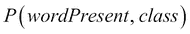
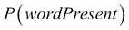
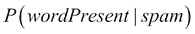
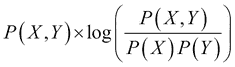
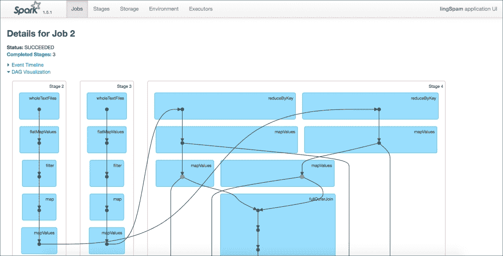

# 十、Spark 分布式批处理

在[第 4 章](ch04.html "Chapter 4. Parallel Collections and Futures")、*并行集合和未来*中，我们发现了如何使用并行集合来解决“令人尴尬的”并行问题:这些问题可以被分解成一系列任务，这些任务之间不需要(或很少需要)通信。

Apache Spark 提供了类似于 Scala 并行集合(以及更多)的行为，但是，它不是将任务分布在同一台计算机的不同 CPU 上，而是允许任务分布在一个计算机集群上。这提供了任意的水平可伸缩性，因为我们可以简单地向集群添加更多的计算机。

在这一章中，我们将学习 Apache Spark 的基础知识，并使用它来研究一组电子邮件，从构建垃圾邮件过滤器的角度提取特征。我们将在第 12 章、*用 MLlib* 的分布式机器学习中探索几种实际构建垃圾邮件过滤器的方法。

# 安装Spark

在前面的章节中，我们通过在一个`build.sbt`文件中指定依赖项，并依靠 SBT 从 Maven 中央存储库中获取依赖项。对于 Apache Spark，显式下载源代码或预构建的二进制文件更常见，因为 Spark 附带了许多命令行脚本，极大地方便了启动作业和与集群的交互。

前往[http://spark.apache.org/downloads.html](http://spark.apache.org/downloads.html)下载 Spark 1.5.2，选择“为 Hadoop 2.6 或更高版本预构建”的包。如果您需要定制，您也可以从源代码构建 Spark，但是我们将坚持使用预构建的版本，因为它不需要配置。

点击 **Download** 将会下载一个 tarball，您可以使用以下命令对其进行解压缩:

```

$ tar xzf spark-1.5.2-bin-hadoop2.6.tgz

```

这将创建一个`spark-1.5.2-bin-hadoop2.6`目录。为了验证 Spark 工作正常，导航到`spark-1.5.2-bin-hadoop2.6/bin`并使用`./spark-shell`启动 Spark shell。这只是一个加载了 Spark 库的 Scala shell。

您可能希望将`bin/`目录添加到您的系统路径中。这将允许您从系统上的任何地方调用该目录中的脚本，而不必引用完整路径。在 Linux 或 Mac OS 上，您可以通过在 shell 配置文件中输入以下行来向系统路径添加变量(在 Mac OS 上是`.bash_profile`，在 Linux 上是`.bashrc`或`.bash_profile`):

```
export PATH=/path/to/spark/bin:$PATH
```

这些更改将在新的 shell 会话中生效。在 Windows 上(如果使用 PowerShell)，需要在`Documents`的`WindowsPowerShell`文件夹的`profile.ps1`文件中输入这一行:

```
$env:Path += ";C:\Program Files\GnuWin32\bin"
```

如果这个操作正确的话，您应该能够在系统的任何目录中打开 Spark shell，只需在终端中键入`spark-shell`即可。


# 获取示例数据

在这一章中，我们将探索垃圾邮件数据集(原始数据集在[http://csmining.org/index.php/ling-spam-datasets.html](http://csmining.org/index.php/ling-spam-datasets.html)描述)。从[http://data.scala4datascience.com/ling-spam.tar.gz](http://data.scala4datascience.com/ling-spam.tar.gz)(或 [ling-spam.zip](http://ling-spam.zip) ，取决于你喜欢的压缩模式)下载数据集，并将内容解压到包含本章代码示例的目录中。归档包含两个目录，`spam/`和`ham/`，分别包含垃圾邮件和合法邮件。


# 弹性分布式数据集

Spark 将所有计算表达为分布式集合上的一系列转换和动作，称为**弹性分布式数据集** ( **RDD** )。让我们探索一下 rdd 如何与 Spark shell 一起工作。导航到 examples 目录并打开 Spark shell，如下所示:

```

$ spark-shell

scala> 

```

让我们首先在 RDD 中加载一封电子邮件:

```

scala> val email = sc.textFile("ham/9-463msg1.txt")

email: rdd.RDD[String] = MapPartitionsRDD[1] at textFile

```

`email`是一个 RDD，每个元素对应输入文件中的一行。注意我们是如何通过在一个名为`sc`的对象上调用`textFile`方法来创建 RDD 的:

```

scala> sc

spark.SparkContext = org.apache.spark.SparkContext@459bf87c

```

`sc`是一个`SparkContext`实例，一个表示 Spark 集群入口点的对象(目前，只是我们的本地机器)。当我们启动 Spark shell 时，会自动创建一个上下文并绑定到变量`sc`。

让我们使用`flatMap`将电子邮件拆分成单词:

```

scala> val words = email.flatMap { line => line.split("\\s") }

words: rdd.RDD[String] = MapPartitionsRDD[2] at flatMap

```

如果你熟悉 Scala 中的集合，你会觉得这很自然:RDD 的行为就像一个字符串列表。这里，我们使用正则表达式`\s`分割，表示空白字符。除了显式使用`flatMap`,我们还可以使用 Scala 的语法糖来操纵 rdd:

```

scala> val words = for { 

 line <- email

 word <- line.split("\\s") 

} yield word

words: rdd.RDD[String] = MapPartitionsRDD[3] at flatMap

```

让我们检查结果。我们可以使用`.take(n)`来提取 RDD 的前 *n* 个元素:

```

scala> words.take(5)

Array[String] = Array(Subject:, tsd98, workshop, -, -)

```

我们还可以使用`.count`来获得 RDD 中元素的数量:

```

scala> words.count

Long = 939

```

rdd 支持集合支持的许多操作。让我们用`filter`来删除邮件中的标点符号。我们将删除包含任何非字母数字字符的所有单词。我们可以通过在单词`[^a-zA-Z0-9]`的任何地方过滤出匹配这个*正则表达式*的元素来做到这一点。

```

scala> val nonAlphaNumericPattern = "[^a-zA-Z0-9]".r

nonAlphaNumericPattern: Regex = [^a-zA-Z0-9]

scala> val filteredWords = words.filter { 

 word => nonAlphaNumericPattern.findFirstIn(word) == None 

}

filteredWords: rdd.RDD[String] = MapPartitionsRDD[4] at filter

scala> filteredWords.take(5)

Array[String] = Array(tsd98, workshop, 2nd, call, paper)

scala> filteredWords.count

Long = 627

```

在这个例子中，我们从一个文本文件创建了一个 RDD。我们还可以使用 Spark 上下文中可用的`sc.parallelize`方法从 Scala iterables 创建 rdd:

```

scala> val words = "the quick brown fox jumped over the dog".split(" ") 

words: Array[String] = Array(the, quick, brown, fox, ...)

scala> val wordsRDD = sc.parallelize(words)

wordsRDD: RDD[String] = ParallelCollectionRDD[1] at parallelize at <console>:23

```

这对调试和外壳中的试验行为很有用。与并行化相对应的是`.collect`方法，它将 RDD 转换为 Scala 数组:

```

scala> val wordLengths = wordsRDD.map { _.length }

wordLengths: RDD[Int] = MapPartitionsRDD[2] at map at <console>:25

scala> wordLengths.collect

Array[Int] = Array(3, 5, 5, 3, 6, 4, 3, 3)

```

`.collect`方法要求整个 RDD 适合主节点上的内存。因此，它要么用于使用缩减的数据集进行调试，要么位于裁剪数据集的管道的末端。

如你所见，rdd 提供了一个很像 Scala iterables 的 API。关键区别在于 rdd 是*分布式的*和*弹性的*。让我们探讨一下这在实践中意味着什么。

## rdd 是不可变的

一旦创建了 RDD，您就无法更改它。rdd 上的所有操作要么创建新的 rdd，要么创建其他 Scala 对象。

## rdd 是懒惰的

当您在交互式 shell 中对 Scala 集合执行 map 和 filter 等操作时，REPL 会将新集合的值打印到屏幕上。Spark RDDs 就不一样了。这是因为 rdd 上的操作是懒惰的:它们只在需要时才被评估。

因此，当我们写下:

```
val email = sc.textFile(...)

val words = email.flatMap { line => line.split("\\s") }
```

我们正在创建一个 RDD，`words`，它知道如何从它的父 RDD，`email`构建自己，反过来，它知道它需要读取一个文本文件并把它分成几行。然而，直到我们通过调用一个*动作*返回一个 Scala 对象来强制评估 rdd，这些命令才会真正执行。如果我们试图从一个不存在的文本文件中读取数据，这一点会非常明显:

```

scala> val inp = sc.textFile("nonexistent")

inp: rdd.RDD[String] = MapPartitionsRDD[5] at textFile

```

我们可以毫不费力地创造出 RDD。我们甚至可以在 RDD 上定义进一步的变换。只有在最终评估这些转换时，程序才会崩溃:

```

scala> inp.count // number of lines

org.apache.hadoop.mapred.InvalidInputException: Input path does not exist: file:/Users/pascal/...

```

动作`.count`应该返回 RDD 中元素的整数个数。Spark 别无选择，只能对`inp`求值，结果出现异常。

因此，将 RDD 视为一个操作管道，而不是一个更传统的集合，可能更合适。

## rdd 知道他们的血统

rdd 只能从稳定的存储中构建(例如，从 Spark 集群中每个节点上的文件中加载数据)，或者通过一组基于其他 rdd 的转换来构建。由于 rdd 很懒，它们需要知道如何在需要时构建自己。他们通过知道谁是他们的父 RDD，以及他们需要对父应用什么操作来做到这一点。这是一个定义明确的过程，因为父 RDD 是不可变的。

`toDebugString`方法提供了如何构建 RDD 的示意图:

```

scala> filteredWords.toDebugString

(2) MapPartitionsRDD[6] at filter at <console>:27 []

 |  MapPartitionsRDD[3] at flatMap at <console>:23 []

 |  MapPartitionsRDD[1] at textFile at <console>:21 []

 |  ham/9-463msg1.txt HadoopRDD[0] at textFile at <console>:21 []

```

## rdd 具有弹性

如果在单台计算机上运行应用程序，一般不需要担心应用程序中的硬件故障:如果计算机出现故障，无论如何你的应用程序都难逃一死。

相比之下，分布式体系结构应该是容错的:一台机器的故障不应该使整个应用程序崩溃。Spark RDDs 的设计考虑到了容错。让我们想象一下，其中一个工作节点出现故障，导致与 RDD 相关的一些数据被破坏。由于 Spark RDD 知道如何从其父节点构建自己，因此不会有永久的数据丢失:丢失的元素可以在另一台计算机上需要时重新计算。

## rdd 被分发

当您构建一个 RDD 时，例如从一个文本文件，Spark 会将 RDD 分成许多分区。每个分区将完全定位在一台机器上(尽管通常每台机器上有多个分区)。

rdd 上的许多转换可以在每个分区上独立执行。例如，当执行`.map`操作时，输出 RDD 中的给定元素依赖于父元素中的单个元素:数据不需要在分区之间移动。`.flatMap`和`.filter`的操作也是如此。这意味着由这些操作之一产生的 RDD 中的分区依赖于父 RDD 中的单个分区。

另一方面，`.distinct`转换从 RDD 中删除所有重复的元素，它要求给定分区中的数据与其他分区中的数据进行比较。这需要在节点间对数据进行*洗牌*。洗牌，尤其是对于大型数据集，是一种开销很大的操作，应该尽可能避免。

## rdd 上的转换和操作

RDD 支持的操作集可以分为两类:

*   从当前的 RDD 创建一个新的。转换是懒惰的:它们是，不会立即被评估。
*   **动作**强制对 RDD 进行求值，通常返回一个 Scala 对象，而不是 RDD，或者有某种形式的副作用。动作被立即评估，触发组成这个 RDD 的所有转换的执行。

在下面的表格中，我们给出了一些有用的转换和操作的例子。要获得完整、最新的列表，请查阅 Spark 文档([http://Spark . Apache . org/docs/latest/programming-guide . html # rdd-operations](http://spark.apache.org/docs/latest/programming-guide.html#rdd-operations))。

对于这些表格中的示例，我们假设您已经使用以下内容创建了一个 RDD:

```

scala> val rdd = sc.parallelize(List("quick", "brown", "quick", "dog"))

```

下表列出了 RDD 的常见变换。回想一下，转换总是生成新的 RDD，并且它们是懒惰的操作:

| 转换 | 笔记 | **举例(假设** `rdd` **是** `{ "quick", "brown", "quick", "dog" }`) |
| `rdd.map(func)` |   | `rdd.map { _.size } // => { 5, 5, 5, 3 }` |
| `rdd.filter(pred)` |   | `rdd.filter { _.length < 4 } // => { "dog" }` |
| `rdd.flatMap(func)` |   | `rdd.flatMap { _.toCharArray } // => { 'q', 'u', 'i', 'c', 'k', 'b', 'r', 'o' … }` |
| `rdd.distinct()` | 删除 RDD 中的重复元素。 | `rdd.distinct // => { "dog", "brown", "quick" }` |
| `rdd.pipe(command, [envVars])` | 通过外部程序的管道。RDD 元素被逐行写入进程的`stdin`。从`stdout`读取输出。 | `rdd.pipe("tr a-z A-Z") // => { "QUICK", "BROWN", "QUICK", "DOG" }` |

下表描述了 rdd 上的常见操作。回想一下，动作总是生成一个 Scala 类型或者产生副作用，而不是创建一个新的 RDD。行动迫使对 RDD 进行评估，触发了支撑 RDD 的变革的执行。

| 行动 | 节点 | **举例(假设** `rdd` **是** `{ "quick", "brown", "quick", "dog" }`) |
| `rdd.first` | RDD 的第一元素。 | `rdd.first // => quick` |
| `rdd.collect` | 将 RDD 转换为一个数组(该数组必须能够容纳在主节点的内存中)。 | `rdd.collect // => Array[String]("quick", "brown", "quick", "dog")` |
| `rdd.count` | RDD 中的元素数量。 | `rdd.count // => 4` |
| `rdd.countByValue` | 将元素映射到该元素出现的次数。映射必须适合主节点。 | `rdd.countByValue // => Map(quick -> 2, brown -> 1, dog -> 1)` |
| `rdd.take(n)` | 返回 RDD 中第一个 *n 个*元素的数组。 | `rdd.take(2) // => Array(quick, brown)` |
| `rdd.takeOrdered(n:Int)(implicit ordering: Ordering[T])` | 根据元素的默认顺序或作为第二个参数传递的顺序，RDD 中的 Top *n* 个元素。如何定义自定义比较函数请参见`Ordering`的 Scala 文档([http://www . Scala-lang . org/API/current/index . html # Scala . math . ordering](http://www.scala-lang.org/api/current/index.html#scala.math.Ordering))。 | `rdd.takeOrdered(2) // => Array(brown, dog)``rdd.takeOrdered(2) (Ordering.by { _.size }) // => Array[String] = Array(dog, quick)` |
| `rdd.reduce(func)` | 根据指定的功能降低 RDD。使用 RDD 中的第一个元素作为基础。`func`应该是可换的，可结合的。 | `rdd.map { _.size }.reduce { _ + _ } // => 18` |
| `rdd.aggregate(zeroValue)(seqOp, combOp)` | 归约用于归约函数返回一个不同于 RDD 类型的值的情况。在这种情况下，我们需要提供一个用于在单个分区内减少的函数(`seqOp`)和一个用于合并两个分区的值的函数(`combOp`)。 | `rdd.aggregate(0) ( _ + _.size, _ + _ ) // => 18` |

## 持续的 RDDs

我们已经了解到 rdd 只保留构建元素所需的操作序列，而不是值本身。这当然大大减少了内存的使用，因为我们不需要在内存中保存 rdd 的中间版本。例如，让我们假设我们想要搜索交易日志以识别在特定账户上发生的所有交易:

```
val allTransactions = sc.textFile("transaction.log")

val interestingTransactions = allTransactions.filter { 

  _.contains("Account: 123456")

}
```

所有交易的集合将会很大，而利息账户的交易集合将会小得多。Spark 的策略是记住*如何*构造数据集，而不是数据集本身，这意味着我们永远不会在任何时候在内存中拥有输入文件的所有行。

在两种情况下，我们可能希望避免每次使用 RDD 时都要重新计算它的元素:

*   对于交互使用:我们可能已经检测到帐户“123456”的欺诈行为，我们想调查这是如何发生的。我们可能希望在这个 RDD 上执行许多不同的探索性计算，而不必每次都重新读取整个日志文件。因此，坚持`interestingTransactions`是有意义的。
*   当算法重用中间结果或数据集时。一个典型的例子是逻辑回归。在逻辑回归中，我们通常使用迭代算法来寻找最小化损失函数的“最优”系数。在我们迭代算法的每一步，我们必须从训练集中计算损失函数及其梯度。如果可能的话，我们应该避免重新计算训练集(或者从输入文件中重新加载)。

Spark 在 rdd 上提供了一个`.persist`方法来实现这一点。通过在 RDD 上调用`.persist`，我们告诉 Spark 在下次计算数据集时将它保存在内存中。

```

scala> words.persist

rdd.RDD[String] = MapPartitionsRDD[3] at filter

```

Spark 支持不同级别的持久性，您可以通过向`.persist`传递参数来调整持久性:

```

scala> import org.apache.spark.storage.StorageLevel

import org.apache.spark.storage.StorageLevel

scala> interestingTransactions.persist(

 StorageLevel.MEMORY_AND_DISK)

rdd.RDD[String] = MapPartitionsRDD[3] at filter

```

Spark 提供了几个持久性级别，包括:

*   `MEMORY_ONLY`:默认存储级别。RDD 存储在 RAM 中。如果 RDD 太大，内存中容纳不下，它的某些部分将不会持久，需要动态地重新计算。
*   尽可能多的 RDD 存储在内存中。如果 RDD 太大，它会溢出到磁盘。只有当 RDD 的计算成本很高时，才值得这么做。否则，重新计算它可能比从磁盘读取要快。

如果您持久化了几个 rdd 并且耗尽了内存，Spark 将清除最近最少使用的内存(丢弃它们或者将它们保存到磁盘，这取决于所选择的持久化级别)。RDD 还公开了一个`unpersist`方法来明确告诉 Spark 不再需要 RDD。

持续的 rdd 会对性能产生巨大的影响。因此，在调优 Spark 应用程序时，持久化什么以及如何持久化变得非常重要。找到最佳的持久性水平通常需要一些修补、基准测试和实验。Spark 文档提供了何时使用哪种持久性级别的指导方针([http://Spark . Apache . org/docs/latest/programming-guide . html # rdd-persistence](http://spark.apache.org/docs/latest/programming-guide.html#rdd-persistence))，以及调优内存使用的一般提示(【http://spark.apache.org/docs/latest/tuning.html】)。

重要的是，`persist`方法不强制评估 RDD。它只是通知 Spark 引擎，下次计算这个 RDD 中的值时，应该保存它们而不是丢弃它们。

## 键值 rdd

到目前为止，我们只考虑了 Scala 值类型的 rdd。更复杂数据类型的 rdd 支持额外的操作。Spark 为*键值 RDDs* 增加了很多操作:类型参数为元组`(K, V)`的 RDDs，对于任意类型`K`和`V`。

让我们回到我们的示例电子邮件:

```

scala> val email = sc.textFile("ham/9-463msg1.txt")

email: rdd.RDD[String] = MapPartitionsRDD[1] at textFile

scala> val words = email.flatMap { line => line.split("\\s") }

words: rdd.RDD[String] = MapPartitionsRDD[2] at flatMap

```

让我们将`words` RDD 保存在内存中，以避免不得不从磁盘重复读取`email`文件:

```

scala> words.persist

```

要访问键值操作，我们只需要对我们的 RDD 应用一个转换来创建键值对。让我们用这些词作为钥匙。现在，我们将对每个值使用 1:

```

scala> val wordsKeyValue = words.map { _ -> 1 }

wordsKeyValue: rdd.RDD[(String, Int)] = MapPartitionsRDD[32] at map 

scala> wordsKeyValue.first

(String, Int) = (Subject:,1)

```

除了核心的 RDD 操作之外，键值 rdd还支持多种操作。这些是通过隐式转换添加的，使用的是我们在第五章[中探索的“皮条客我的库”模式，以及通过 JDBC 的 *Scala 和 SQL。这些额外的转换分为两大类: *by-key* 转换和 rdd 之间的 *joins* 。*](ch05.html "Chapter 5. Scala and SQL through JDBC")

按键转换是聚合对应于同一键的值的操作。例如，我们可以使用`reduceByKey`来计算每个单词在我们的电子邮件中出现的次数。此方法获取属于同一键的所有值，并使用用户提供的函数将它们组合起来:

```

scala> val wordCounts = wordsKeyValue.reduceByKey { _ + _ }

wordCounts: rdd.RDD[(String, Int)] = ShuffledRDD[35] at reduceByKey

scala> wordCounts.take(5).foreach { println }

(university,6)

(under,1)

(call,3)

(paper,2)

(chasm,2)

```

注意`reduceByKey`需要(通常)洗牌 RDD，因为不是给定键的每次出现都在同一个分区中:

```

scala> wordCounts.toDebugString

(2) ShuffledRDD[36] at reduceByKey at <console>:30 []

 +-(2) MapPartitionsRDD[32] at map at <console>:28 []

 |  MapPartitionsRDD[7] at flatMap at <console>:23 []

 |      CachedPartitions: 2; MemorySize: 50.3 KB; ExternalBlockStoreSize: 0.0 B; DiskSize: 0.0 B

 |  MapPartitionsRDD[3] at textFile at <console>:21 []

 |      CachedPartitions: 2; MemorySize: 5.1 KB; ExternalBlockStoreSize: 0.0 B; DiskSize: 0.0 B

 |  ham/9-463msg1.txt HadoopRDD[2] at textFile at <console>:21 []

```

注意，键值 rdd 不像 Scala 映射:同一个键可以出现多次，并且它们不支持 *O(1)* 查找。可以使用`.collectAsMap`动作将键值 RDD 转换成 Scala 映射:

```

scala> wordCounts.collectAsMap

scala.collection.Map[String,Int] = Map(follow -> 2, famous -> 1...

```

这需要将整个 RDD 拉到主Spark节点上。因此，主节点上需要有足够的内存来存放地图。这通常是从大量 RDD 中过滤出我们需要的信息的最后一步。

我们在下表中描述了许多 by-key 操作。对于表中的示例，我们假设`rdd`创建如下:

```

scala> val words = sc.parallelize(List("quick", "brown","quick", "dog"))

words: RDD[String] = ParallelCollectionRDD[25] at parallelize at <console>:21

scala> val rdd = words.map { word => (word -> word.size) }

rdd: RDD[(String, Int)] = MapPartitionsRDD[26] at map at <console>:23

scala> rdd.collect

Array[(String, Int)] = Array((quick,5), (brown,5), (quick,5), (dog,3))

```

| 转换 | 笔记 | **举例(假设** `rdd` **是** `{ quick -> 5, brown -> 5, quick -> 5, dog -> 3 }`) |
| `rdd.mapValues` | 对值应用运算。 | `rdd.mapValues { _ * 2 } // => { quick -> 10, brown -> 10, quick -> 10, dog ->6 }` |
| `rdd.groupByKey` | 返回一个键-值 RDD，其中对应于同一个键的值被分组到可重复项中。 | `rdd.groupByKey // => { quick -> Iterable(5, 5), brown -> Iterable(5), dog -> Iterable(3) }` |
| `rdd.reduceByKey(func)` | 返回一个键-值 RDD，其中对应于同一键的值使用用户提供的函数进行组合。 | `rdd.reduceByKey { _ + _ } // => { quick -> 10, brown -> 5, dog -> 3 }` |
| `rdd.keys` | 返回钥匙的 RDD。 | `rdd.keys // => { quick, brown, quick, dog }` |
| `rdd.values` | 返回值的 RDD。 | `rdd.values // => { 5, 5, 5, 3 }` |

对键值 rdd 的第二类操作涉及到通过键将不同的 rdd 连接在一起。这有点类似于 SQL 连接，其中键是被连接的列。让我们加载一封垃圾邮件，并应用我们对垃圾邮件应用的相同转换:

```

scala> val spamEmail = sc.textFile("spam/spmsgb17.txt")

spamEmail: org.apache.spark.rdd.RDD[String] = MapPartitionsRDD[52] at textFile at <console>:24

scala> val spamWords = spamEmail.flatMap { _.split("\\s") }

spamWords: org.apache.spark.rdd.RDD[String] = MapPartitionsRDD[53] at flatMap at <console>:26

scala> val spamWordCounts = spamWords.map { _ -> 1 }.reduceByKey { _ + _ }

spamWordsCount: org.apache.spark.rdd.RDD[(String, Int)] = ShuffledRDD[55] at reduceByKey at <console>:30

scala> spamWordCounts.take(5).foreach { println }

(banner,3)

(package,14)

(call,1)

(country,2)

(offer,1)

```

`spamWordCounts`和`wordCounts`都是键-值 rdd，它们的键对应于消息中唯一的单词，值是这个单词出现的次数。`spamWordCounts`和`wordCounts`之间的关键字会有一些重叠，因为这些电子邮件会共享许多相同的单词。让我们在这两个 rdd 之间做一个*内部连接*,得到在两封邮件中出现的单词:

```

scala> val commonWordCounts = wordCounts.join(spamWordCounts)

res93: rdd.RDD[(String, (Int, Int))] = MapPartitionsRDD[58] at join at <console>:41

scala> commonWordCounts.take(5).foreach { println }

(call,(3,1))

(include,(6,2))

(minute,(2,1))

(form,(1,7))

((,(36,5))

```

内部连接产生的 RDD 中的值将是成对的。该对中的第一个元素是第一个 RDD 中该键的值，第二个元素是第二个 RDD 中该键的值。因此，单词 *call* 在合法电子邮件中出现三次，在垃圾邮件中出现一次。

Spark 支持所有四种连接类型。例如，让我们执行一个左连接:

```

scala> val leftWordCounts = wordCounts.leftOuterJoin(spamWordCounts)

leftWordCounts: rdd.RDD[(String, (Int, Option[Int]))] = MapPartitionsRDD[64] at leftOuterJoin at <console>:40

scala> leftWordCounts.take(5).foreach { println }

(call,(3,Some(1)))

(paper,(2,None))

(chasm,(2,None))

(antonio,(1,None))

(event,(3,None))

```

注意，我们对中的第二个元素具有类型`Option[Int]`，以容纳`spamWordCounts`中没有的键。例如，单词 *paper* 在合法邮件中出现两次，而在垃圾邮件中从未出现过。在这种情况下，用零表示缺席比用`None`更有用。用默认值替换`None`很简单，用`getOrElse`:

```

scala> val defaultWordCounts = leftWordCounts.mapValues { 

 case(leftValue, rightValue) => (leftValue, rightValue.getOrElse(0))

}

org.apache.spark.rdd.RDD[(String, (Int, Option[Int]))] = MapPartitionsRDD[64] at leftOuterJoin at <console>:40

scala> defaultwordCounts.take(5).foreach { println }

(call,(3,1))

(paper,(2,0))

(chasm,(2,0))

(antonio,(1,0))

(event,(3,0))

```

下表列出了键值 rdd 上最常见的连接:

| **转换** | **结果(假设** `rdd1`为`{ quick -> 1, brown -> 2, quick -> 3, dog -> 4 }`**`rdd2`**为** `{ quick -> 78, brown -> 79, fox -> 80 }`)** |
| `rdd1.join(rdd2)` | `{ quick -> (1, 78), quick -> (3, 78), brown -> (2, 79) }` |
| `rdd1.leftOuterJoin(rdd2)` | `{ dog -> (4, None), quick -> (1, Some(78)), quick -> (3, Some(78)), brown -> (2, Some(79)) }` |
| `rdd1.rightOuterJoin(rdd2)` | `{ quick -> (Some(1), 78), quick -> (Some(3), 78), brown -> (Some(2), 79), fox -> (None, 80) }` |
| `rdd1.fullOuterJoin(rdd2)` | `{ dog -> (Some(4), None), quick -> (Some(1), Some(78)), quick -> (Some(3), Some(78)), brown -> (Some(2), Some(79)), fox -> (None, Some(80)) }` |

关于转换的完整列表，请参考`PairRDDFunctions`、[的 API 文档 http://spark . Apache . org/docs/latest/API/Scala/index . html # org . Apache . spark . rdd . pairrddfunctions](http://spark.apache.org/docs/latest/api/scala/index.html#org.apache.spark.rdd.PairRDDFunctions)。

## 双 rdd

在上一节中，我们看到 Spark 通过隐式转换为键值 rdd 增加了功能。类似地，Spark 为 doubles 的 rdd 添加了统计功能。让我们提取 ham 消息的词频，并将值从整数转换为双精度数:

```

scala> val counts = wordCounts.values.map { _.toDouble }

counts: rdd.RDD[Double] = MapPartitionsRDD[9] at map

```

然后，我们可以使用`.stats`操作获得汇总统计数据:

```

scala> counts.stats

org.apache.spark.util.StatCounter = (count: 397, mean: 2.365239, stdev: 5.740843, max: 72.000000, min: 1.000000)

```

因此，最常见的单词出现了 72 次。我们还可以使用`.histogram`动作来了解值的分布情况:

```

scala> counts.histogram(5)

(Array(1.0, 15.2, 29.4, 43.6, 57.8, 72.0),Array(391, 1, 3, 1, 1))

```

`.histogram`方法返回一对数组。第一个数组指示直方图区间的边界，第二个数组是该区间中的元素计数。因此，有`391`个单词出现的次数比`15.2`少。单词的分布非常不均匀，因此具有规则大小的柱的直方图实际上并不合适。相反，我们可以通过向`histogram`方法传递一个 bin 边缘数组来传递自定义 bin。例如，我们可以对数分布容器:

```

scala> counts.histogram(Array(1.0, 2.0, 4.0, 8.0, 16.0, 32.0, 64.0, 128.0))

res13: Array[Long] = Array(264, 94, 22, 11, 1, 4, 1)

```


# 构建和运行独立程序

到目前为止，我们已经通过 Spark shell 独家与 Spark 进行了互动。在接下来的小节中，我们将构建一个独立的应用程序，并在本地或 EC2 集群上启动一个 Spark 程序。

## 在本地运行 Spark 应用

第一步是用编写`build.sbt`文件，就像运行标准 Scala 脚本一样。我们下载的 Spark 二进制文件需要在 Scala 2.10 上运行(你需要从源代码编译 Spark 来运行在 Scala 2.11 上。这个不难做到，按照[http://spark . Apache . org/docs/latest/building-spark . html # building-for-Scala-211](http://spark.apache.org/docs/latest/building-spark.html#building-for-scala-211)上的说明就可以了。

```
// build.sbt file

name := "spam_mi"

scalaVersion := "2.10.5"

libraryDependencies ++= Seq(

  "org.apache.spark" %% "spark-core" % "1.4.1"

)
```

然后我们运行`sbt package`来编译和构建我们程序的 jar。罐子将在`target/scala-2.10/`建造，并被命名为`spam_mi_2.10-0.1-SNAPSHOT.jar`。您可以用本章提供的示例代码来尝试一下。

然后，我们可以使用 Spark 安装目录下的`bin/`文件夹中的`spark-submit` shell 脚本在本地运行 jar:

```
$ spark-submit target/scala-2.10/spam_mi_2.10-0.1-SNAPSHOT.jar

... runs the program
```

分配给 Spark 的资源可以通过向`spark-submit`传递参数来控制。使用`spark-submit --help`查看参数的完整列表。

如果 Spark 程序有依赖关系(例如，在其他 Maven 包中)，最简单的方法是使用*SBT*汇编插件将它们捆绑到应用程序 jar 中。假设我们的应用程序依赖于 breeze-viz。`build.sbt`文件现在看起来像这样:

```
// build.sbt

name := "spam_mi"

scalaVersion := "2.10.5"

libraryDependencies ++= Seq(

  "org.apache.spark" %% "spark-core" % "1.5.2" % "provided",

  "org.scalanlp" %% "breeze" % "0.11.2",

  "org.scalanlp" %% "breeze-viz" % "0.11.2",

  "org.scalanlp" %% "breeze-natives" % "0.11.2"

)
```

SBT 汇编是一个 SBT 插件，它构建了*fat*jar:jar 不仅包含程序本身，还包含程序的所有依赖项。

注意，我们在依赖项列表中将 Spark 标记为“provided ”,这意味着 Spark 本身不会包含在 jar 中(反正是由 Spark 环境提供的)。要包含 SBT 汇编插件，在`project/`目录中创建一个名为`assembly.sbt`的文件，下面一行是:

```
addSbtPlugin("com.eed3si9n" % "sbt-assembly" % "0.14.0")
```

您需要重新启动 SBT 以使更改生效。然后，您可以在 SBT 使用`assembly`命令创建装配 jar。这将在`target/scala-2.10`目录中创建一个名为`spam_mi-assembly-0.1-SNAPSHOT.jar`的 jar。您可以使用`spark-submit`运行这个 jar。

## 减少测井输出和Spark配置

默认情况下，Spark 非常冗长。默认日志级别设置为`INFO`。为避免错过重要消息，将日志设置更改为`WARN`非常有用。要改变系统范围内的默认日志级别，进入 Spark 安装目录下的`conf`目录。你应该找到一个叫做`log4j.properties.template`的文件。将该文件重命名为`log4j.properties`,并查找下面一行:

```
log4j.rootCategory=INFO, console
```

将此行改为:

```
log4j.rootCategory=WARN, console
```

在那个目录中有几个其他的配置文件，可以用来改变 Spark 的默认行为。如需配置选项的完整列表，请前往 http://spark.apache.org/docs/latest/configuration.html。

## 在 EC2 上运行 Spark 应用

在本地运行 Spark 对于测试是有用的，但是使用分布式框架的全部目的是运行利用几台不同计算机能力的程序。我们可以在任何一组可以使用 HTTP 相互通信的计算机上设置 Spark。一般来说，我们还需要建立一个像 HDFS 这样的分布式文件系统，这样我们就可以在集群中共享输入文件。出于这个例子的目的，我们将在 Amazon EC2 集群上设置 Spark。

Spark 附带了一个 shell 脚本`ec2/spark-ec2`，用于设置 EC2 集群和安装 Spark。它还将安装 HDFS。你将需要一个亚马逊网络服务(AWS)的帐户来遵循这些例子([https://aws.amazon.com](https://aws.amazon.com))。您将需要 AWS 访问密钥和秘密密钥，您可以通过 AWS web 控制台中的**帐户** / **安全凭证** / **访问凭证**菜单来访问它们。您需要通过环境变量使这些对`spark-ec2`脚本可用。将它们注入到当前会话中，如下所示:

```
$ export AWS_ACCESS_KEY_ID=ABCDEF...

$ export AWS_SECRET_ACCESS_KEY=2dEf...
```

您还可以将这些行写入您的 shell 的配置脚本(您的`.bashrc`文件，或等效文件)，以避免每次运行`setup-ec2`脚本时都必须重新输入它们。我们在[第 6 章](ch06.html "Chapter 6. Slick – A Functional Interface for SQL")、*Slick——SQL 的一个函数接口*中讨论了环境变量。

您还需要创建一个密钥对，方法是在 EC2 web 控制台中点击**密钥对**，创建一个新的密钥对并下载证书文件。我将假设您命名了密钥对`test_ec2`和证书文件`test_ec2.pem`。确保密钥对在 *N* 中创建。Virginia region(通过在 EC2 管理控制台的右上角选择正确的区域)，以避免在本章的其余部分明确指定区域。您需要将证书文件的访问权限设置为仅用户可读:

```
$ chmod 400 test_ec2.pem
```

我们现在准备启动集群。导航到`ec2`目录并运行:

```
$ ./spark-ec2 -k test_ec2 -i ~/path/to/certificate/test_ec2.pem -s 2 launch test_cluster
```

这将创建一个名为`test_cluster`的集群，其中有一个主集群和两个从集群。从机的数量通过`-s`命令行参数设置。集群启动需要一段时间，但是您可以通过查看 EC2 管理控制台中的**实例**窗口来验证实例是否正确启动。

安装脚本支持许多选项，用于定制实例类型、硬盘驱动器数量等。您可以通过将`--help`命令行选项传递给`spark-ec2`来探索这些选项。

集群的生命周期可以通过向`spark-ec2`脚本传递不同的命令来控制，例如:

```
# shut down 'test_cluster'

$ ./spark-ec2 stop test_cluster

# start 'test_cluster'

$ ./spark-ec2 -i test_ec2.pem start test_cluster

# destroy 'test_cluster'

$ ./spark-ec2 destroy test_cluster
```

关于在 EC2 上使用 Spark 的更多细节，请参考官方文档。


# 垃圾邮件过滤

让我们好好利用我们所学的知识，为我们的垃圾邮件过滤器做一些数据探索。我们将使用凌垃圾邮件数据集:[http://csmining.org/index.php/ling-spam-datasets.html](http://csmining.org/index.php/ling-spam-datasets.html)。该数据集包含 2412 封垃圾邮件和 481 封垃圾邮件，所有这些邮件都是由语言学上的邮件列表接收的。我们将提取最能说明电子邮件是垃圾邮件还是垃圾邮件的单词。

任何自然语言处理工作流程的第一步都是去除停用词和词汇化。去除停用词包括过滤非常常见的词，如*的*、*的*等等。术语化包括用规范形式替换同一个单词的不同形式:颜色*和颜色*都将映射到颜色*和颜色*，组织*将映射到组织*、*组织*和*组织*将映射到组织*组织*。移除停用词和词汇化非常具有挑战性，超出了本书的范围(如果您确实需要移除停用词并对数据集进行词汇化，您的首选工具应该是斯坦福 NLP 工具包:[http://nlp.stanford.edu/software/corenlp.shtml](http://nlp.stanford.edu/software/corenlp.shtml))。幸运的是，Ling-Spam 电子邮件数据集已经被清理和词汇化(这就是为什么电子邮件中的文本看起来很奇怪)。**

当我们构建垃圾邮件过滤器时，我们将使用电子邮件中特定单词的存在作为我们模型的特征。我们将使用*单词袋*方法:我们考虑哪些单词出现在电子邮件中，而不是单词顺序。

直觉上，在决定一封邮件是否是垃圾邮件时，有些词会比其他词更重要。例如，包含*语言*的电子邮件很可能是垃圾邮件，因为邮件列表是用于语言学讨论的，而*语言*是垃圾邮件发送者不太可能使用的单词。相反，两种信息类型中常见的词，例如*你好*，不太可能被使用。

在确定消息是否为垃圾邮件时，量化单词重要性的一种方法是通过 **互信息** ( **MI** )。如果我们知道一个消息包含一个特定的单词，则互信息是关于该消息是垃圾邮件还是有害邮件的信息的增益。例如，特定电子邮件中出现的*语言*非常有助于判断该电子邮件是垃圾邮件还是垃圾邮件。类似地，单词 *dollar* 的出现提供了信息，因为它经常出现在垃圾消息中，很少出现在业余消息中。相比之下，单词 *morning* 的出现是没有信息的，因为它在垃圾邮件和业余爱好者的邮件中几乎同样常见。电子邮件中特定单词的存在与该电子邮件是垃圾邮件还是垃圾邮件之间的交互信息的公式为:


其中是包含特定单词的电子邮件属于该类别(或者是垃圾邮件)的联合概率，是特定单词出现在电子邮件中的概率，是任何电子邮件属于该类别的概率。MI 通常用在决策树中。

### 注意

互信息表达式的推导超出了本书的范围。感兴趣的读者可以参考*大卫·麦凯的*优秀的*信息论、推理和学习算法*，尤其是章节*依赖随机变量*。

MI 计算的一个关键部分是评估某个单词在垃圾邮件或业余爱好者消息中出现的概率。给定我们的数据集，这个概率的最佳近似值是一个单词出现在消息中的比例。因此，例如，如果*语言*出现在 40%的消息中，我们将假设该语言出现在任何消息中的概率为 0.4。类似地，如果 40%的消息是业余爱好者的，并且*语言*出现在其中的 50%，我们将假设该语言出现在电子邮件中的概率，并且该电子邮件是业余爱好者的概率是。

让我们编写一个`wordFractionInFiles`函数，针对给定语料库中的所有单词，计算每个单词出现在消息中的比例。我们的函数将接受一个带有 shell 通配符的路径作为参数，该路径标识一组文件，例如`ham/*`，它将返回一个键值 RDD，其中键是单词，值是该单词在任何这些文件中出现的概率。我们将把函数放在一个名为`MutualInformation`的对象中。

我们首先给出这个函数的完整代码清单。如果这些不能马上理解，请不要担心:我们会在代码后面更详细地解释棘手的部分。您可能会发现在 shell 中键入这些命令很有用，例如用`"ham/*"`替换`fileGlob`:

```
// MutualInformation.scala

import org.apache.spark.{ SparkConf, SparkContext }

import org.apache.spark.SparkContext._

import org.apache.spark.rdd.RDD

object MutualInformation extends App {

  def wordFractionInFiles(sc:SparkContext)(fileGlob:String)

  :(RDD[(String, Double)], Long) = {

    // A set of punctuation words that need to be filtered out.

    val wordsToOmit = Set[String](

      "", ".", ",", ":", "-", "\"", "'", ")", 

      "(", "@", "/", "Subject:"

    )

    val messages = sc.wholeTextFiles(fileGlob)

    // wholeTextFiles generates a key-value RDD of 

    // file name -> file content

    val nMessages = messages.count()

    // Split the content of each message into a Set of unique

    // words in that message, and generate a new RDD mapping:

    // message -> word

    val message2Word = messages.flatMapValues {

      mailBody => mailBody.split("\\s").toSet

    }

    val message2FilteredWords = message2Word.filter { 

      case(email, word) => ! wordsToOmit(word) 

    }

    val word2Message = message2FilteredWords.map { _.swap }

    // word -> number of messages it appears in.

    val word2NumberMessages = word2Message.mapValues { 

      _ => 1 

    }.reduceByKey { _ + _ }

    // word -> fraction of messages it appears in

    val pPresent = word2NumberMessages.mapValues { 

      _ / nMessages.toDouble 

    }

    (pPresent, nMessages)

  }

}
```

让我们在 Spark shell 中玩玩这个功能。为了能够从 shell 访问这个函数，我们需要创建一个带有`MutualInformation`对象的 jar。编写一个与上一节中的类似的`build.sbt`文件，并使用`sbt package`将代码打包到一个 jar 中。然后，用以下工具打开Spark壳:

```

$ spark-shell --jars=target/scala-2.10/spam_mi_2.10-0.1-SNAPSHOT.jar

```

这将打开一个 Spark shell，其中包含我们在类路径上新创建的 jar。让我们对`ham`封电子邮件运行我们的`wordFractionInFiles`方法:

```

scala> import MutualInformation._

import MutualInformation._

scala> val (fractions, nMessages) = wordFractionInFiles(sc)("ham/*")

fractions: org.apache.spark.rdd.RDD[(String, Double)] = MapPartitionsRDD[13] at mapValues

nMessages: Long = 2412

```

让我们来一张 RDD 的快照:

```

scala> fractions.take(5)

Array[(String, Double)] = Array((rule-base,0.002902155887230514), (reunion,4.1459369817578774E-4), (embarrasingly,4.1459369817578774E-4), (mller,8.291873963515755E-4), (sapore,4.1459369817578774E-4))

```

如果能看到在业余爱好者信息中最常出现的单词，那就太好了。我们可以使用`.takeOrdered`动作获取 RDD 的最高值，并进行自定义排序。`.takeOrdered`期望类型类`Ordering[T]`的一个实例作为它的第二个参数，其中`T`是我们的 RDD 的类型参数:在本例中是`(String, Double)`。`Ordering[T]`是一个用单一的`compare(a:T, b:T)`方法描述如何比较`a`和`b`的特征。创建`Ordering[T]`最简单的方法是通过伴随对象的`by`方法，它定义了一个键，通过这个键来比较我们的 RDD 的元素。

我们希望按值对键值 RDD 中的元素进行排序，因为我们想要最常用的词，而不是最不常用的词，所以我们需要颠倒排序:

```

scala> fractions.takeOrdered(5)(Ordering.by { - _._2 })

res0: Array[(String, Double)] = Array((language,0.6737147595356551), (university,0.6048922056384743), (linguistic,0.5149253731343284), (information,0.45480928689883915), ('s,0.4369817578772803))

```

不出所料，`language`出现在 67%的火腿邮件中，`university`出现在 60%的火腿邮件中，以此类推。一项类似的垃圾短信调查显示，感叹号字符*！*出现在 83%的垃圾邮件中，*我们的*出现在 61%，而*免费*出现在 57%。

我们现在可以开始编写应用程序的主体来计算每个单词之间的交互信息，以及一条消息是垃圾邮件还是 ham。我们将把代码体放在已经包含了`wordFractionInFiles`方法的`MutualInformation`对象中。

第一步是创建一个 Spark 上下文:

```
// MutualInformation.scala

import org.apache.spark.{ SparkConf, SparkContext }

import org.apache.spark.SparkContext._

import org.apache.spark.rdd.RDD

object MutualInformation extends App {

  def wordFractionInFiles(sc:SparkContext)(fileGlob:String)

  :(RDD[(String, Double)], Long) = {

    ...

  }

  val conf = new SparkConf().setAppName("lingSpam")

  val sc = new SparkContext(conf)

```

注意，我们在使用 Spark shell 时不需要这样做，因为 shell 附带了一个绑定到变量`sc`的预构建上下文。

我们现在可以计算包含特定单词的消息的条件概率，假设它是*垃圾邮件*、。这只是在*垃圾邮件*语料库中包含该词的信息的一小部分。这反过来让我们推断出包含某个单词的消息是垃圾邮件的联合概率。我们将对所有四种类的组合都这样做:消息中是否存在任何给定的单词，以及该消息是垃圾邮件还是垃圾邮件:

```
    /* Conditional probabilities RDD:

       word -> P(present | spam) 

    */

    val (pPresentGivenSpam, nSpam) = wordFractionInFiles(sc)("spam/*")

    val pAbsentGivenSpam = pPresentGivenSpam.mapValues { 1.0 - _ }

    val (pPresentGivenHam, nHam) = wordFractionInFiles(sc)("ham/*")

    val pAbsentGivenHam = pPresentGivenHam.mapValues { 1.0 - _ }

    // pSpam is the fraction of spam messages

    val nMessages = nSpam + nHam

    val pSpam = nSpam / nMessages.toDouble

    // pHam is the fraction of ham messages

    val pHam = 1.0 - pSpam 

    /* pPresentAndSpam is a key-value RDD of joint probabilities

       word -> P(word present, spam) 

    */

    val pPresentAndSpam = pPresentGivenSpam.mapValues { 

      _ * pSpam 

    }

    val pPresentAndHam = pPresentGivenHam.mapValues { _ * pHam }

    val pAbsentAndSpam = pAbsentGivenSpam.mapValues { _ * pSpam }

    val pAbsentAndHam = pAbsentGivenHam.mapValues { _ * pHam }
```

我们将在计算中的几个地方重用这些 rdd，所以让 Spark 将它们保存在内存中，以避免必须重新计算它们:

```
    pPresentAndSpam.persist

    pPresentAndHam.persist

    pAbsentAndSpam.persist

    pAbsentAndHam.persist
```

我们现在需要计算单词出现的概率，。这只是每个单词的`pPresentAndSpam`和`pPresentAndHam`之和。棘手的是，并不是所有的单词都同时出现在垃圾邮件和垃圾短信中。因此，我们必须对这些 rdd 进行完全的外部连接。这将给出每个单词到一对`Option[Double]`值的 RDD 映射。对于在 ham 或 spam 消息中不存在的单词，我们必须使用默认值。对于垃圾邮件，合理的默认设置是(更严格的方法是使用*加法平滑*)。这意味着如果语料库是原来的两倍大，这个单词将会出现一次。

```
    val pJoined = pPresentAndSpam.fullOuterJoin(pPresentAndHam)

    val pJoinedDefault = pJoined.mapValues {

      case (presentAndSpam, presentAndHam) => 

        (presentAndSpam.getOrElse(0.5/nSpam * pSpam), 

        presentAndHam.getOrElse(0.5/nHam * pHam))

    }
```

注意，我们也可以选择 0 作为默认值。这使得信息增益的计算有些复杂，因为我们不能只取零值的对数，而且一个特定的单词在电子邮件中出现的概率完全为零似乎是不可能的。

我们现在可以构建一个 RDD 映射，将单词映射到，即单词存在于垃圾邮件或业余爱好者消息中的概率:

```
    val pPresent = pJoinedDefault.mapValues { 

      case(presentAndHam, presentAndSpam) => 

        presentAndHam + presentAndSpam 

    }

    pPresent.persist

    val pAbsent = pPresent.mapValues { 1.0 - _ }

    pAbsent.persist
```

我们现在已经有了所有的 rdd，我们需要这些 rdd 来计算消息中某个单词的存在与它是 ham 还是 spam 之间的交互信息。我们需要使用前面概述的互信息公式将它们集合在一起。

我们将从定义一个助手方法开始，给定联合概率 *P(X，Y)* 和边际概率 *P(X)* 和 *P(Y)* 的 RDD，计算。这里， *P(X)* 例如可以是单词出现在消息中的概率，而 *P(Y)* 将是该消息是*垃圾消息*、的概率:

```
    def miTerm(

      pXYs:RDD[(String, Double)], 

      pXs:RDD[(String, Double)], 

      pY: Double,

      default: Double // for words absent in PXY

    ):RDD[(String, Double)] = 

      pXs.leftOuterJoin(pXYs).mapValues { 

        case (pX, Some(pXY)) => pXY * math.log(pXY/(pX*pY)) 

        case (pX, None) => default * math.log(default/(pX*pY))

    }
```

我们可以使用我们的函数来计算互信息和中的四项:

```
    val miTerms = List(

      miTerm(pPresentAndSpam, pPresent, pSpam, 0.5/nSpam * pSpam),

      miTerm(pPresentAndHam, pPresent, pHam, 0.5/nHam * pHam),

      miTerm(pAbsentAndSpam, pAbsent, pSpam, 0.5/nSpam * pSpam),

      miTerm(pAbsentAndHam, pAbsent, pHam, 0.5/nHam * pHam)

    )
```

最后，我们只需要将这四项相加:

```
    val mutualInformation = miTerms.reduce { 

      (term1, term2) => term1.join(term2).mapValues { 

         case (l, r) => l + r 

      } 

    }
```

RDD `mutualInformation`是一个键值 RDD，将每个单词映射到一个衡量该单词的存在在辨别一条消息是垃圾邮件还是垃圾邮件方面的信息量。让我们打印出最能说明邮件是垃圾邮件的 20 个单词:

```
    mutualInformation.takeOrdered(20)(Ordering.by { - _._2 })

      .foreach { println }
```

让我们使用`spark-submit`来运行这个:

```
$ sbt package

$ spark-submit target/scala-2.10/spam_mi_2.10-0.1-SNAPSHOT.jar

(!,0.1479941771292119)

(language,0.14574624861510874)

(remove,0.11380645864246142)

(free,0.1073496947123657)

(university,0.10695975885487692)

(money,0.07531772498093084)

(click,0.06887598051593441)

(our,0.058950906866052394)

(today,0.05485248095680509)

(sell,0.05385519653184113)

(english,0.053509319455430575)

(business,0.05299311289740539)

(market,0.05248394151802276)

(product,0.05096229706182162)

(million,0.050233193237964546)

(linguistics,0.04990172586630499)

(internet,0.04974101556655623)

(company,0.04941817269989519)

(%,0.04890193809823071)

(save,0.04861393414892205)
```

因此，我们发现像`language`或`free`或`!`这样的词的出现携带了最多的信息，因为它们几乎只出现在垃圾短信或垃圾短信中。一个非常简单的分类算法可以只取前 10 个(通过互信息)垃圾邮件单词和前 10 个垃圾邮件单词，并查看消息是否包含更多的垃圾邮件单词或垃圾邮件单词。我们将在[第 12 章](ch12.html "Chapter 12. Distributed Machine Learning with MLlib")、*使用 MLlib 的分布式机器学习*中更深入地探索用于分类的机器学习算法。


# 提起发动机罩

在本章的最后一节，我们将非常简要地讨论 Spark 的内部工作原理。有关更详细的讨论，请参见本章末尾的*参考文献*部分。

当您打开 Spark 上下文时，无论是显式地还是通过启动 Spark shell，Spark 都会启动一个 web UI，显示当前任务和过去任务的执行细节。让我们看看我们在上一节中编写的交互信息程序的运行情况。为了防止上下文在程序完成时关闭，您可以插入一个对`readLine`的调用，作为`main`方法的最后一行(在对`takeOrdered`的调用之后)。这需要用户输入，因此将暂停程序执行，直到你按下*输入*。

要访问用户界面，请将浏览器指向`127.0.0.1:4040`。如果你有其他的 Spark shell 实例运行，端口可能是`4041`，或者`4042`等等。


UI 的第一页告诉我们，我们的应用程序包含三个*作业*。作业是作为操作的结果而发生的。实际上，在我们的应用程序中有三个动作:前两个在`wordFractionInFiles`函数中被调用:

```
val nMessages = messages.count()
```

最后一个作业来自对`takeOrdered`的调用，它强制执行计算互信息的整个 RDD 变换管道。

网络用户界面让我们更深入地研究每一项工作。点击作业表中的`takeOrdered`作业。您将进入更详细描述该工作的页面:



特别感兴趣的是 **DAG 可视化**条目。这是完成动作的执行计划的图表，并提供了 Spark 内部工作的一瞥。

当您通过调用 RDD 上的操作来定义作业时，Spark 会查看 RDD 的谱系并构建一个映射依赖关系的图:谱系中的每个 RDD 由一个节点表示，有向边从该 RDD 的父节点指向其自身。这种类型的图被称为**有向** **非循环图** ( **DAG** )，是一种对依赖性解析有用的数据结构。让我们使用 web UI 来研究我们程序中的`takeOrdered`作业的 DAG。该图非常复杂，因此很容易丢失，所以这里是一个简化的再现，只列出了程序中绑定到变量名的 rdd。


如你所见，在图表的底部，我们有`mutualInformation` RDD。这就是我们需要为我们的行动构建的 RDD。这个 RDD 取决于总和中的中间元素，`igFragment1`，`igFragment2`等等。我们可以通过依赖关系列表回溯，直到到达图的另一端:不依赖于其他 rdd，只依赖于外部资源的 rdd。

一旦建立了图表，Spark 引擎就制定一个执行任务的计划。该计划从只有外部依赖项的 rdd(例如通过从磁盘加载文件或从数据库获取文件构建的 rdd)或已经有缓存数据的 rdd 开始。图中的每个箭头被转换成一组*任务*，每个任务将一个转换应用到数据的一个分区。

任务被分成*个阶段*。一个阶段由一组任务组成，这些任务都可以在不需要中间调整的情况下执行。


# 数据洗牌和分区

为了理解 Spark 中的数据混排，我们首先需要理解数据在 rdd 中是如何分区的。例如，当我们通过从 HDFS 加载文件或读取本地存储中的文件来创建 RDD 时，Spark 无法控制哪些数据位分布在哪些分区中。这对于键-值 rdd 来说是一个问题:这些通常需要知道特定键的出现位置，例如执行连接。如果这个键可以出现在 RDD 的任何地方，我们就必须遍历每个分区来找到这个键。

为了防止这种情况，Spark 允许在键值 rdd 上定义一个*划分器*。分区器是 RDD 的一个属性，它决定了特定的键位于哪个分区。当 RDD 设置了划分器时，键的位置完全由划分器决定，而不是由 RDD 的历史或键的数量决定。具有相同分区的两个不同的 rdd 将把相同的键映射到相同的分区。

分区通过对转换的影响来影响性能。键值 rdd 有两种类型的转换:

*   狭窄的变换，像`mapValues`。在窄转换中，计算子 RDD 中的分区的数据驻留在父中的单个分区上。因此，窄变换的数据处理可以完全在本地执行，而不需要在节点之间传递数据。
*   宽变换，像`reduceByKey`。在宽转换中，计算任何单个分区的数据可以驻留在父分区中的所有分区上。广泛变换产生的 RDD 通常会有一个划分器集。例如，`reduceByKey`转换的输出在默认情况下是散列分区的:一个特定的键所在的分区是由`hash(key) % numPartitions`决定的。

因此，在我们的交互信息示例中，rdd`pPresentAndSpam`和`pPresentAndHam`将具有相同的分区结构，因为它们都具有默认的散列分区器。所有的后代 rdd 保留相同的键，一直到`mutualInformation`。例如，单词`language`将在每个 RDD 的相同分区中。

为什么所有这些都很重要？如果一个 RDD 有一个划分器集，那么这个划分器将被从这个 RDD 开始的所有后续窄变换保留。让我们回到我们的互信息例子。rdd`pPresentGivenHam`和`pPresentGivenSpam`都源于`reduceByKey`操作，它们都有字符串键。因此，它们将具有相同的哈希分割器(除非我们显式设置不同的分割器)。当我们构造`pPresentAndSpam`和`pPresentAndHam`时，这个划分器被保留。当我们构造`pPresent`时，我们执行`pPresentAndSpam`和`pPresentAndHam`的完全外部连接。由于这两个 RDD 具有相同的分区器，子 RDD `pPresent`具有狭窄的依赖性:我们可以将第一个分区`pPresentAndSpam`与第一个分区`pPresentAndHam`连接，将第二个分区`pPresentAndSpam`与第二个分区`pPresentAndHam`连接，依此类推，因为任何字符串键都将被散列到两个 rdd 中的相同分区。相比之下，如果没有分割器，我们将不得不将`pPresentAndSpam`的每个分区中的数据与`pPresentAndSpam`的每个分区中的连接起来。这将需要通过网络向持有`pPresentAndSpam`的所有节点发送数据，这是一项耗时的工作。

由于广泛的依赖性，这个必须通过网络发送数据以构建子 RDD 的过程被称为*洗牌*。优化 Spark 程序的大部分技巧包括减少洗牌，以及当洗牌是必要的时候，减少洗牌的数量。


# 总结

在这一章中，我们探索了 Spark 的基础知识，并学习了如何构造和操作 rdd。在下一章中，我们将学习 Spark SQL 和 DataFrames，这是一组隐式转换，允许我们以类似于 pandas DataFrames 的方式操作 rdd，以及如何使用 Spark 与不同的数据源进行交互。


# 参考

*   由*霍尔登·卡劳*、*安迪·康温斯基*、*帕特里克·温德尔*和*马泰·扎哈里娅*、*奥赖利*撰写的《学习Spark》提供了本章所能提供的关于Spark的更完整的介绍。我强烈推荐它。
*   如果你有兴趣学习更多关于信息论的知识，我推荐*大卫·麦凯的*书*信息论、推理和学习算法*。
*   *信息检索*，作者*曼宁*、*拉格哈万*和*施楚兹*，描述了如何分析文本数据(包括词条化和词干化)。一个在线
*   关于 Ling-Spam 数据集，以及如何分析:[http://www . aueb . gr/users/ion/docs/IR _ memory _ based _ antispam _ filtering . pdf](http://www.aueb.gr/users/ion/docs/ir_memory_based_antispam_filtering.pdf)。
*   这篇博文更详细地探究了 Spark Web UI。[https://databricks . com/blog/2015/06/22/understanding-your-spark-application-through-visualization . html](https://databricks.com/blog/2015/06/22/understanding-your-spark-application-through-visualization.html)。
*   这篇博客的帖子由*桑迪·瑞扎*撰写，是讨论 Spark 内部机制以及如何利用它们来提高性能的两部分系列文章的第一篇:[http://blog . cloud era . com/blog/2015/03/how-to-tune-your-Apache-Spark-jobs-part-1/](http://blog.cloudera.com/blog/2015/03/how-to-tune-your-apache-spark-jobs-part-1/)。