# 六、通过模拟展示的概率理论

|   | “我不相信上帝会和宇宙玩骰子。” |   |
|   | -*–阿尔伯特·爱因斯坦* |

本节包括模拟实验，以展示概率论和数理统计的某些方面。事实将证明，模拟使理解基本定理变得容易。弱大数定律，但特别是中心极限定理，被详细讨论。后者可能是统计学中最重要的定理，值得详细讨论。首先介绍一些非常知名的基础知识。

# 概率论的一些基础知识

概率论是数学的一个分支，它构成了从样本推断总体的基础。概率论与分析统计领域一起用于随机领域来描述随机事件。随机建模反过来使用概率概念——随机性和关于随机性的定律——对真实随机过程进行建模和分析(例如，在经济预测中)。让我们介绍一些符号和基本概念。

随机过程或随机实验是可以无限重复的任何程序，并且有一组明确定义的可能结果。例如，滚动骰子是一个随机实验。

这组结果用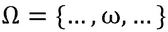表示。这些都是随机实验的可能结果。例如:对于滚动骰子，。

一个随机变量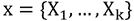，可以呈现一组可能的不同值(偶然)，每个值都有一个相关的概率。

随机实验的输出是一个随机变量。例如，骰子上的偶数。

一个事件 A:实验输出， *x* ，有一个特定的属性，A。因此事件是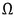的子集。在我们的骰子示例中，事件 *A* ，*掷出一个偶数*，表示数量{2，4，6}。

概率 P(A)是特定事件 *A* 发生的概率。举例:对于事件 A，“抛硬币头”，概率为。


# 概率分布

我们对概率分布做了一点小小的修改，因为它们在书中经常被用到。理论分布在描述和数理统计中都是非常重要的:

*   逼近函数，如描述统计学中对经验观察到的频率分布的描述
*   数理统计中某些随机实验结果概率的确定

一些重要的理论分布是，例如，二项式分布、泊松分布、超几何分布、均匀分布、指数分布、正态分布、分布和 *t* 分布。

## 离散概率分布

在奥地利人口中，已婚或未婚已经定义了一个离散的概率分布。一般来说，离散分布是非常重要的，我们应该仔细研究一下，因为在后面的章节中需要用到它们。

人们称分配每个基本事件 j 的概率的函数为观察分布的概率函数。内容如下:

*   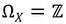定义面积为 x(整数！)
*   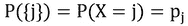
*   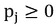为所有
*   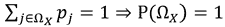

分布函数定义了一个实验的概率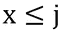，它包含:

*   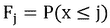为所有
*   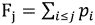

作为离散概率分布的一个例子，我们称之为二项式分布。

伯努利模型由一系列伯努利实验组成(二项式分布，其中 *n = 1* )，条件如下:

*   对于每个试验，只有两种结果(事件)是可能的，比如 A 和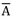 ( *=不是 A* ，互补)
*   A 和的概率是所有实验中的常数，和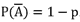。总之，将进行 n 次重复，并且各个实验是独立的。频率在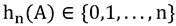

二项分布 B(n，p)我们可以推导如下，即事件 A 在 n 次重复中恰好发生 x 次的概率推导如下:

事件 A 仅在前 x 个实验中发生: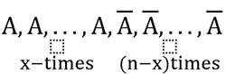。

这个独立实验序列的概率是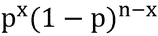。

考虑到所有可能的安排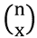,以下内容适用:

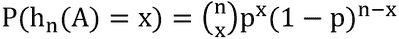

，其中为二项式系数。

## 连续概率分布

一个叫的函数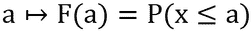x 的概率分布的分布函数 F(a)就是观察到的概率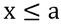。同样，对于 F(x ),它成立:

*   
*   
*   F(x)是单调递增的:给定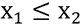，则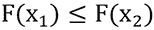成立

分布函数的导数称为 x 的分布密度，它认为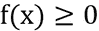和。

作为连续概率分布的代表，我们提到正态分布。正态分布是数理统计中最重要的分布。没有多少技术和生物学数据遵循近似正态分布，但估计参数遵循。正态分布是许多估计和检验方法的基础。


# 赢得彩票

让我们看看英国过去七个月的彩票号码。通过一些技巧，我们可以从互联网上获得它们:

```
library("RCurl")
URL <- "https://www.national-lottery.co.uk/results/euromillions/draw-history/csv"
lotto <- read.csv(textConnection(getURL(URL)))

```

这些数据集的结构如下:

```
str(lotto)
## 'data.frame':    52 obs. of  10 variables:
##  $ DrawDate            : Factor w/ 52 levels "01-Apr-2016",..: 24 18 12 6 49 45 37 33 25 21 ...
##  $ Ball.1              : int  7 2 32 8 4 10 17 11 13 1 ...
##  $ Ball.2              : int  15 26 34 23 5 17 26 14 14 5 ...
##  $ Ball.3              : int  28 27 40 24 25 31 32 15 32 9 ...
##  $ Ball.4              : int  31 40 45 34 28 32 34 27 37 22 ...
##  $ Ball.5              : int  42 49 48 38 43 42 43 44 48 38 ...
##  $ Lucky.Star.1        : int  10 5 1 3 6 2 2 2 1 2 ...
##  $ Lucky.Star.2        : int  11 10 10 7 11 5 10 7 7 10 ...
##  $ UK.Millionaire.Maker: Factor w/ 52 levels "BDM196361","BDN010072",..: 50 47 45 43 32 38 35 31 26 22 ...
##  $ DrawNumber          : int  902 901 900 899 898 897 896 895 894 893 ...

```

我们来看看有些数字是不是抽得比较频繁。*图 6.1* 显示了这些频率的条形图:

```
numbers <- unlist(c(lotto[,2:5]))
library("ggplot2")
qplot(factor(numbers), xlab = "Gewinnzahlen")  +
 theme_bw() +
 theme(axis.text.x=element_text(angle=90)) +
 scale_y_continuous(breaks=0:10)

```

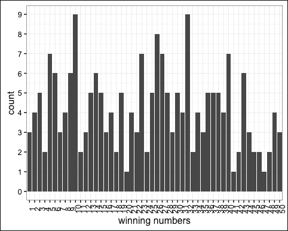

图 6.1:2015 年 11 月至 2016 年 5 月英国彩票号码的频率计数

耶！任何没有受过统计学教育的人现在可能会选择数字 5、6、10、32 和 43 进行下一次抽奖，认为这些数字在下一次抽奖游戏中被选中的概率更高。大致意思是:它们在过去被画得更频繁，所以它们在将来也会被画得更频繁。或者有些人会做相反的事情，选择那些几乎从未被抽中的数字，认为它们现在必须出现。

了解一些概率论基础知识的人更愿意考虑抽奖号码出现频率的均匀分布。但是看*图 6.1* 的时候，我们真的能相信这是真的吗？我们能相信英国彩票中一个号码被抽中的概率是 1/50 吗？

决不！抽签的次数太少了。但是在抽签次数会增加的情况下，我们能相信这一点吗？

我们现在可以制定一些问题，我们将很快回答:

*   我们看到结果不同。这些差异取决于样本量吗？(在我们的例子中。)
*   当我们有 n = 1000 次抽奖时，抽奖号码 1 的概率有多大？会收敛到 1/50 吗？
*   P(A = 1)的值是多少，如果？
*   随机性会遵循什么规律吗？有哪些关于随机变量的规律可以公式化？
*   一组实验足以得出结论吗？


# 弱大数定律

前一节的问题将我们引向极限定理。最重要的极限定理是(弱)大数定律，(Glivenko，1933)和(Cantelli，1933)的定理，以及中心极限定理。

首先我们来看看弱大数定律。弱数强定律在数学上更复杂，但讲述的(几乎)是同样的故事。

弱大数定律是一个非常直观的概念；雅各布·伯努利在 1713 年发表后的 20 年后甚至认为这是黄金定理。但是如果我们仔细看看这个*定律*，我们就进入了一个数理统计的世界。

弱大数定律应用于博彩办公室、金融评估和保险等等。它建立了统计学的基础，数据科学家应该意识到这一点。通过理解弱大数定律和中心极限定理，就理解了数理统计的基础。

## 帝企鹅和你的老板

考虑南极的帝企鹅数量(或者用工件的长度代替帝企鹅...).帝企鹅身高的期望值就是种群中帝企鹅身高的算术平均值。

你的老板给你的任务是命名这个期望值。一种可能是从南极测量每只帝企鹅的高度。然而，这太费时间了。另一种方法是随机选择一些帝企鹅，例如，从种群中选择 n 只帝企鹅:


图 6.2:南极的帝企鹅

所以，我们测量了 n 只帝企鹅的随机变量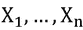。算术平均值定义为。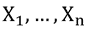是独立同分布的随机变量。

假设我们现在从种群中选择了 n 只帝企鹅，我们假设我们没有应用任何复杂的抽样设计，而是使用简单的随机抽样来抽取样本。因此，每只帝企鹅都同样有可能从种群中被抽取出来。结果是对期望的估计:帝企鹅在种群中的高度。提醒:期望值是整个总体的平均值，而样本均值是(较小的)随机抽取样本的平均值。期望值是一个数字，而样本均值是一个随机变量，因为样本是随机抽取的。重新画 n 只帝企鹅，估计结果会不一样。

我们可以给老板一个期望值的估计。如果那么我们的估计值将接近期望值。

但是“接近”是什么意思呢？在什么意义上？这是真的吗？

让我们看看更大的画面。一个非常有趣的问题是问当我们有越来越多的随机变量可用时，当我们一遍又一遍地增加随机变量的数量时，会发生什么？

如果会发生什么。极限定理为此提供了证据。它们处理当我们有大量随机变量时会发生什么的问题。

在本书中，我们希望通过模拟来说明大数定律的特征。我们跳过数学证明。

### 随机变量的极限和收敛性

在[第三章](ch03.xhtml "Chapter 3. The Discrepancy between Pencil-Driven Theory and Data-Driven Computational Solutions")、*铅笔驱动理论和数据驱动计算解决方案之间的差异*中，我们已经定义了确定性序列的收敛性。但是随机变量收敛的意义是什么？每个随机变量都是从一个分布中(随机)抽取的，所以我们不考虑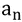，而是考虑随机变量。我们希望最终，随机数序列或概率分布序列收敛于一个数，a. *图 6.3* 说明了这一点。样本越大，这种分布应该越小/越窄:


图 6.3:超过一定的样本量，分布应位于 a 周围的内。密度下白色表面可见的概率，对于大的 n 应收敛到零

该分布应该随着 n 的增加而变得越来越窄，使得它最终在区间内。换句话说，概率分布下的区域在由定义的区间之外的概率应该收敛到零。

从数学上来说，这意味着随机变量序列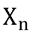，以概率收敛于*。几乎所有的概率密度都应该充分集中在 a 附近。对于每个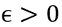:*

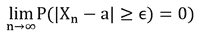

随机数在这个区间之外的概率在 n 趋于无穷大时变得越来越小。换句话说，这个概率的极限值是零。我们还说:序列以概率收敛于 a

### 样本均值的收敛性——弱大数定律

让我们更仔细地看看期望值和均值的方差。我们可以很容易地证明:


因为随机数的期望值正是它的期望值，并且:

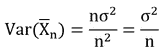

样本越大，估计的方差越小，不确定性越小。

切比雪夫不等式(例如，参见 Saw、Yang 和 Mo 1984)适用于:


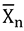以概率收敛于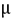。。

大数定律告诉我们样本均值会收敛到真实均值，但是是以一种特殊的方式:以概率的方式。

### 通过模拟展示弱大数定律

考虑所有简单例子中最简单的一个，扔硬币。我们想一次又一次地掷硬币，当观察到的掷一个*头*(或*号*)的概率约为 *0.5* 时，并且如果下一次掷硬币的下一个结果不依赖于前一个结果(独立性)，我们肯定同意硬币是*公平的*。换句话说，我们要评估事件 *A* 的概率是否等于 *1/2* ， *P(A) = 0.5* 。这也可以用二项式分布来表示:

*B (A = 'head '，size = 1，p (A) = 0.5) = 0.5*

在 R 中，这可以用函数`dbinom`来计算:

```
dbinom(x = 0, size = 1, prob = 0.5)
## [1] 0.5

```

我们想进行随机实验*投掷硬币* n 次，然后评估结果。在 R 中，我们可以使用函数`sample`或函数`rbinom`来模拟抛硬币。对于一次投掷硬币，代码如下所示:

```
sample(c("head", "number"), size = 1)
## [1] "head"
# alternativ:
rbinom(n = 1, size = 1, prob = 0.5)
## [1] 0

```

我们编写一个函数来模拟投掷硬币的过程，并在 n 次实验后评估头*和头*的概率，同时计算真实概率的绝对误差。这个实验的好处是我们知道了真相( *P(A) = 0.5* )。实际情况并非如此:

```
simCoin <- function(n, p = 0.5, repl = 1){
 stopifnot(n > 0 | !is.vector(n) | p < 0 | p > 0 | !is.vector(repl))
 ## function for one simulation
 r <- function(){
 res <- rbinom(n, 1, p)
 tosses <- 1:n
 pA <- cumsum(res) / 1:n
 abserror <- abs(pA - p)
 return(data.frame(res = res, tosses = tosses, pA = pA, abserror = abserror))
 }
 ## simulation
 df <- r()
 if(repl > 1){
 for(i in 2:repl){
 df <- rbind(df, r())
 }
 }
 ## return
 df$repl <- rep(1:repl, each = n)
 ll <- list(res = df$res, tosses = df$tosses, pA = df$pA,
 absfehler = df$abserror, repl = as.factor(df$repl))
 class(ll) <- "Coin"
 return(ll)
}
## print
print.Coin <- function(x, ..., s = NULL){
 if(!is.null(s)){
 cat("After", s, "random draws: the estimated P(A) =", x$pA[s], "\nand the absolute error", x$absfehler[s], "\n")
 } else {
 m <- max(x$tosses)
 cat("After", m, "random draws: the estimated P(A) =", x$pA[m], "\nand the absolute error", x$absfehler[m], "\n")
 }
}
The first n = 10 tosses of the coin:
## for reproducibility
set.seed(1234)
# 10 throws
simCoin(10)
## After 10 random draws: the estimated P(A) = 0.7
## and the absolute error 0.2

```

所以如果我们只扔 10 次，误差可能会很大。我们期望当我们更频繁地投掷时，误差变得更小(增加样本大小 *n* ):

```
set.seed(1234)
sim <- simCoin(5000)
print(sim, s=100)
## After 100 random draws: the estimated P(A) = 0.45
## and the absolute error 0.05
print(sim, s=1000)
## After 1000 random draws: the estimated P(A) = 0.518
## and the absolute error 0.018
print(sim, s=5000)
## After 5000 random draws: the estimated P(A) = 0.5014 
## and the absolute error 0.0014

```

我们已经看到的是， *n* 越大，估计值(T2 头与投掷次数之比)和真实值/期望值越接近。

通过将结果可视化，我们获得了更多的知识。我们首先定义一个`plot`函数:

```
plot.Coin <- function(x, y, ...){
 df <- data.frame(res = x$res, tosses = x$tosses, pA = x$pA, repl=x$repl)
 if(length(unique(df$repl)) == 1){
 ggplot(df, aes(x=tosses, y=pA)) +
 geom_line() + geom_abline(intercept = 0.5) + ylim(c(0,1)) +
 theme(legend.position="none")
 } else if(length(unique(df$repl)) > 10){
 gg <- ggplot(df, aes(x=tosses, y=pA, group=repl)) +
 geom_line() + geom_abline(intercept = 0.5) + ylim(c(0,1))
 ## add median line and confidence interval
 dfwide <- reshape2::dcast(df, tosses ~ repl, value.var="pA")
 dfwide <- dfwide[, 2:ncol(dfwide)]
 med <- apply(dfwide, 1, median)
 q025 <- apply(dfwide, 1, quantile, 0.025)
 q975 <- apply(dfwide, 1, quantile, 0.975)
 stat <- data.frame(med=med, q025=q025, q975=q975,
 n=1:max(x$tosses),
 repl=max(as.numeric(df$repl)))
 gg +
 geom_line(data=stat, aes(x = n, y = med), colour = "red", size=1) + 
 geom_line(data=stat, aes(x = n, y = q025), colour = "orange", size=0.7) +
 geom_line(data=stat, aes(x = n, y = q975), colour = "orange", size=0.7) +
 theme(legend.position="none")
 } else {
 ggplot(df, aes(x=tosses, y=pA, colour = repl)) + 
 geom_line() + geom_abline(intercept = 0.5) + ylim(c(0,1))
 }
}

```

在*图 6.4* 中，硬币总共被投掷 5000 次，观察到的概率(正面的频率除以投掷次数)被绘制成一条线。一条线并不完全正确，因为投掷的次数是离散的。我们不想太挑剔，因为这种表示给出了更平滑的图像，如图*图 6.4* 所示:

```
plot(sim)

```


图 6.4:扔硬币。与观察到的概率相比的投掷次数。

我们看到:

*   显然，观察到的概率收敛于期望值。
*   根据步骤 *n* 到 *n = n + 1* 观察到的概率变化随着 *n* 的增加而变小。这很清楚。如果，在五次投掷一个*头*两次 *(P(A)=2/5)* ，那么在下一次投掷中观察到的概率 *(P(A)=3/6=1/2)* 或 *P(A)=2/6=1/3* 。如果硬币已经被扔了 1000 次，新的一次扔硬币几乎不会改变观察到的概率。

我们直观地看到大数定律应该是有效的。我们想重复这个实验，在开始的 10 次。我们将硬币投掷 10×5000 次，结果如图 6.5 所示:

```
set.seed(1234)
sim <- simCoin(n = 5000, repl = 10)
plot(sim)

```

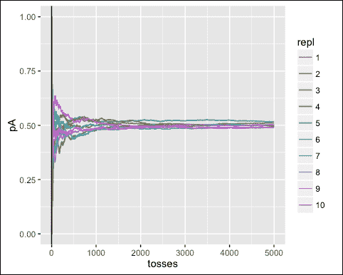

图 6.5:扔硬币。与观察到的概率相比的投掷次数。10 次重复，每次 5000 次投掷。

然而，我们可以观察到，并不是每条线(模拟 5000 次投掷硬币)在 5000 次投掷后都收敛到 1/2。有什么问题吗？一点也不。只是因为我们只扔了 5000 次。我们还可以证明，当更频繁地重复模拟并取其中值以及尾部的某些分位数时，大数定律是正确的。平均而言，曲线必须收敛到 1/2，分位数必须随着样本量的增加而变小。

让我们重复模拟 1000 次；我们反复投掷硬币，1000 次，每次 5000 次。结果如图*图 6.6* 所示:

```
sim <- simCoin(n = 5000, repl = 1000)
plot(sim)

```


图 6.6:扔硬币。与观察到的概率相比的投掷次数。1000 次重复，每次 5000 次投掷。

我们能知道什么？

*   我们认识到弱大数定律*起作用*，即使我们不能无限经常地进行实验。平均曲线很快收敛到 1/2。(我们还观察到我们的随机数生成器工作良好。)
*   离差随着样本量的增加而减小，但与样本量不是线性关系。样本量加倍意味着*而不是*不确定性减少了的 1/2。标准差减少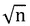(比较前面方差的公式)。

在*图 6.6* 中，我们有每个 *n* 的 1000 个结果，我们对它们进行了平均(中值，红线)以获得任意次数的投掷。此外，还计算了 2.5 和 97.5 百分位，并显示在绘制的图中(橙色线)。这提供了关于期望值 1/2 附近的散射减少的信息。

正如已经提到的，我们不能无限期地在计算机上进行随机实验。例如，随着样本量的增加而减少的方差也可以用理论上的二项式分布 *B (n，p = 0.5)* 来表示。对于不同的 *n* ，如图*图 6.7* 所示:

```
plotbinomcoin <- function(n){
 plot(0:n/n, dbinom(0:n, n, 0.5), type = "h",
 xlab = paste("relative frequencies (n =", n,")"),
 ylab = "p")
}
par(mar = c(4,4,0.5,0.5), mfrow = c(4,2))
plotbinomcoin(10)
plotbinomcoin(20)
plotbinomcoin(40)
plotbinomcoin(80)
plotbinomcoin(160)
plotbinomcoin(320)
plotbinomcoin(5000)
plotbinomcoin(10000)

```

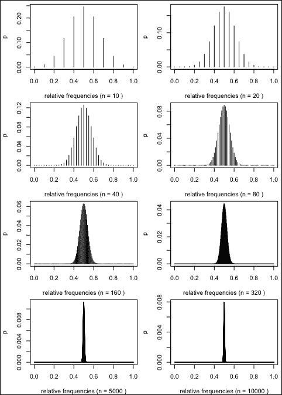

图 6.7:抛硬币和大数定律的可视化:n 越大，数值周围的分布越窄。

图中显示了什么？当看左上角的图形时，它显示了 10 次投掷的理论概率。例如，在 10 次投掷硬币中，掷两个*头*的概率约为 0.05。*图 6.7* 中的例子也表明，随着 *n* 的增加，观测概率与期望值的偏差越来越不可能大于任意小的数字。对于*图 6.7* 中的上部图形，我们看到分布缩小了，主要是通过增加样本大小。

重复:对于随机变量序列，弱大数定律成立，如果对于所有正值，。


# 中心极限定理

经典的采样理论基于以下基本定理。

### Tip

当*任意总体*的分布具有有限方差时，那么随机样本的*算术平均值*的分布近似为*正态*，如果*样本量*足够大。

这个定理的证明一般在 3-6 页左右(用测度论上的高等数学)。“证明”不是做这个数学练习，而是通过模拟来完成，这也有助于理解中心极限定理，从而理解统计学的基础知识。

以下设置是必要的:

*   我们从人群中抽取样本。这意味着我们了解人口。实际情况并非如此，但我们证明，只要方差不是无穷大，总体可以有任何分布。
*   我们从人群中抽取许多样本。请注意，实际上，只抽取了一个样本。出于模拟目的，我们假设我们可以抽取许多样本。

为了查看我们定义的总体(`pop = TRUE`)以及这些总体样本的算术平均值的分布，我们定义了以下函数。在代码的第一个四分之一中，使用正态分布，然后是均匀和指数分布，在代码的第四个四分之一中，使用 Beta 分布:

```
cltSim <- function (n = 1, reps = 10000, nclass = 16, pop = TRUE, estimator = mean) {
 old.par <- par(oma = c(0, 0, 1.5, 0), mfrow = c(2, 2), mar = c(4,4,2,0.5))
 on.exit(par(old.par))
 ## normal:
 norm.mat <- matrix(rnorm(n * reps), ncol = n)
 norm.mean <- apply(norm.mat, 1, estimator)
 x <- seq(min(norm.mean), max(norm.mean), length = 50)
 normmax <- max(dnorm(x, mean(norm.mean), sd(norm.mean)))
 tmp.hist <- hist(norm.mean, plot = FALSE, prob = TRUE, nclass = nclass)
 normmax <- max(tmp.hist$density, normmax) * 1.05
 hist(norm.mean, main = "normal", xlab = "x", col = "skyblue",
 prob = TRUE, ylim = c(0, normmax), nclass = nclass)
 lines(x, dnorm(x, mean(norm.mean), sd(norm.mean)))
 ## exponential:
 exp.mat <- matrix(rexp(n * reps, 1/3), ncol = n)
 exp.mean <- apply(exp.mat, 1, estimator)
 x <- seq(min(exp.mean), max(exp.mean), length = 50)
 expmax <- max(dnorm(x, mean(exp.mean), sd(exp.mean)))
 tmp.hist <- hist(exp.mean, plot = FALSE, prob = TRUE, nclass = nclass)
 expmax <- max(tmp.hist$density, expmax) * 1.05
 hist(exp.mean, main = "exponential", xlab = "x", col = "skyblue", 
 prob = TRUE, ylim = c(0, expmax), nclass = nclass)
 if(pop) lines(x, dexp(x, 1/3)) else lines(x, dnorm(x, mean(exp.mean), sd(exp.mean)))
 ## uniform:
 unif.mat <- matrix(runif(n * reps), ncol = n)
 unif.mean <- apply(unif.mat, 1, estimator)
 x <- seq(min(unif.mean), max(unif.mean), length = 50)
 unimax <- max(dnorm(x, mean(unif.mean), sd(unif.mean)))
 tmp.hist <- hist(unif.mean, plot = FALSE, prob = TRUE, nclass = nclass)
 unimax <- max(tmp.hist$density, unimax) * 1.05
 hist(unif.mean, main = "uniform", xlab = "x", col = "skyblue", 
 prob = TRUE, ylim = c(0, unimax), nclass = nclass)
 if(pop) lines(x, dunif(x)) else lines(x, dnorm(x, mean(unif.mean), sd(unif.mean)))
 ## Beta:
 beta.mat <- matrix(rbeta(n * reps, 0.35, 0.25), ncol = n)
 beta.mean <- apply(beta.mat, 1, estimator)
 x <- seq(min(beta.mean), max(beta.mean), length = 50)
 betamax <- max(dnorm(x, mean(beta.mean), sd(beta.mean)))
 tmp.hist <- hist(beta.mean, plot = FALSE, prob = TRUE, nclass = nclass)
 betamax <- max(tmp.hist$density, betamax)
 hist(beta.mean, main = "Beta", xlab = "x", col = "skyblue",
 prob = TRUE, ylim = c(0, betamax), nclass = nclass)
 if(pop){
 lines(x, dbeta(x, 0.35, 0.25))
 mtext(paste("Populations"), outer = TRUE, cex = 1.2)
 } else {
 lines(x, dnorm(x, mean(beta.mean), sd(beta.mean)))
 mtext(paste("sample size =", n), outer = TRUE, cex = 1.2)
 }
}

```

首先显示了我们选择的群体的分布(线条)和这些群体各自的一个实现(直方图)，参见*图 6.8* :

```
cltSim()

```

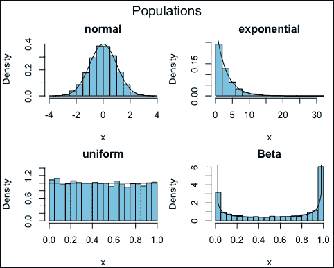

图 6.8:不同群体的密度(线条)和这些群体的一种实现(直方图)

对于这些人群，我们想要抽取 10，000 个大小为 *n = 2* 的样本。对于每个样本，我们然后计算的算术平均值。因此，获得了 10，000 个样本平均值。然后，样本均值的分布被可视化；参见*图 6.9* 。线条对应于理论正态分布，直方图对应于样本均值的分布:

```
cltSim(2, pop = FALSE)

```

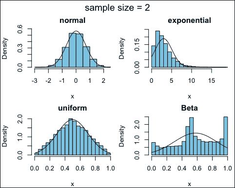

图 6.9:从大小为 2 的 10，000 个样本计算出的 10，000 个样本均值的分布。

对于样本量 *n = 2* ，样本均值的分布不是正态分布，除非样本是从标准正态分布总体中抽取的。关于贝塔分布的样本均值分布是三态的。这很容易解释。请记住，大小为 *n = 2* 的样本是从贝塔分布中重复抽取的(参见*图 6.5* ，右下方的图形)。很有可能是两个小值，两个大值，或者是一个大一个小值被抽中。因此，Beta 分布中大小为 2 的样本的算术平均值可能位于样本平均值分布的尾部或中心。如果中心极限定理像这里所示的那样不成立，那么就不能用经典的方式做出有效的推断统计。

但是，如果我们把样本量从 2 个增加到 10 个，会有什么变化呢？结果如图*图 6.10* 所示。除指数分布总体外，样本均值约为。正常:

```
cltSim(10, pop = FALSE)

```


图 6.10:从 10，000 个大小为 10 的样本计算出的 10，000 个样本均值的分布

我们很容易观察到，如果我们进一步增加 n，例如， *n = 30* ，从这些分布中抽取的样本均值的所有分布都是近似正态的。此外，如果样本量足够大，样本均值是近似正态的，与总体外观无关(只要总体的方差是有限的):中心极限定理。

当然，在实践中，人们只会从未知特征的人群中抽取一个样本(而不是 10，000 个)。然而，如果样本足够大(比如说 *n = 50* )，我们就知道估计量的特征，比如样本均值。中心极限定理的有效性在统计学中有着深远的影响。几乎所有的经典测试都是基于这些知识。即使评估了样本均值的经典置信区间，该置信区间也是对称的，被估计参数所采用，因为我们知道样本均值是正态分布的。

这几乎适用于任何估计量，甚至是高度不平滑的统计量，如中位数；参见*图 6.11* 。此外，当样本量足够大时，样本中位数接近正态分布:

```
cltSim(n = 100, pop = FALSE, estimator = median)

```

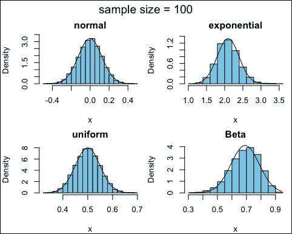

图 6.11:从 10，000 个大小为 10 的样本计算出的 10，000 个样本中位数的分布


# 估计量的性质

特别是在接下来的章节中，诸如偏倚或渐近无偏性等名称将被重复使用。这些表达式用于描述估计量的性质。这些术语在此简要解释。

假设:样本元素的分布有一个未知参数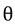。从样本值近似估计参数的函数 t 由下式给出:

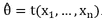

通常一个样本的函数，记为*统计量*。在参数估计的情况下，我们讲一个用于估计的函数，简称*估计量 t* 。一个估计器的实现，如称为*估计*。

根据得到的样本，得到点估计的其他结果。例如，如果从一个有限的人口中抽取 1000 人，询问 1000 人的收入，当抽取另外 1000 人时，平均收入将会不同。实际上，只有在考虑结果的准确性时，进行点估计才有用。

换句话说，点估计本身不包含任何关于准确性的信息。因此，也必须估计表示点估计不确定性的区间估计量。

## 估计量的性质

什么是好的评估者？

例如，对于重复抽取的样本，样本估计值最好分布在真实参数中间的*附近(无偏性)。*

下列术语定义了估计量的属性:

*   **无偏** : 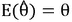
*   **一致性** : 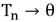(增加样本量时，估计量更接近总体参数)
*   **效率**:方差最小的无偏估计量

有不同的方法来寻找分布参数的有用估计量，所谓的*最大似然*方法是最重要的。

其他重要术语包括:

*   **偏差** : 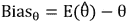
*   **渐近无偏** : 
*   **均方误差** : 或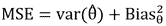

如果不存在偏差，MSE 就简化为估计统计量方差的比较。换句话说，在这种情况下，MSE 和方差是相等的。

这听起来不错，但是在不知道真实总体参数的情况下，如何估计偏差呢？当未知时，你如何评价渐近无偏性，实际情况就是这样？如果偏差未知，如何估计 MSE？

对于一些估计者来说，所有这些问题都已经通过数学演算得到了回答，但是一般来说，我们只能通过模拟研究来回答这些问题。换句话说，当样本以简单随机抽样抽取时，估计量的特性通常通过基于模型的模拟进行评估，当样本以复杂样本设计抽取时，通过基于设计的模拟研究进行评估(见[第 10 章](ch10.xhtml "Chapter 10. Simulation with Complex Data")、*复杂数据模拟*)。

## 置信区间

与点估计一起，置信区间通常被报告来显示点估计的可靠性。例如，置信区间可以用来描述来自调查的估计有多可靠。对 1000 名受访者进行的简单随机抽样调查显示，员工的平均时薪可能是 31 欧元。人口平均收入的 99%置信区间可能是 25 到 37 欧元。然而，由于没有负收入，置信区间不一定总是对称的，例如投票意向也是如此。我们将不讨论这些特殊情况，但会参考 Hron、Templ 和 Filzmoser (2013)。

通常，根据观测数据，估计参数的下限和上限——估计区间。未知但固定(总体中的一个实际参数)。然而，估计的区间取决于样本中的观察值，因此是随机的。常常是包含在其中的，但有时又不是。计算公式应该是这样的，例如，所有样本的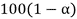 = 95%(显著性水平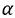 = 0.05)提供一个覆盖区间。覆盖率越大(小)意味着估计的置信区间越大。

简而言之:我们在寻找两个估计值，U 和 O，指定给定覆盖率百分比的置信区间的极限:


置信区间的公式取决于的方差是否已知。对于较小的样本，必须通过 *t* 分布而不是标准正态分布来估计置信区间。然而，如果样本量足够大，则 *t* 分布近似等于正态分布。

备注:使用 t 分布代替正态分布进行样本均值分布是由威廉·希利·戈塞 1908 年在 Biometrika (Gosset，1908)以笔名“学生”发表的论文介绍的。戈塞特在爱尔兰都柏林的吉尼斯啤酒厂的“化学”部门工作。化学测量，或一般的测量，是昂贵的，因此他必须处理非常小的样本量。显然，吉尼斯要么不想让他们的竞争对手知道他们正在使用 t 检验来测试原材料的质量(官方版本)，要么吉尼斯的老板可能对他说，他应该酿造好啤酒，而不是把时间花在一篇关于后来命名的 t 分布的长篇论文上。无论如何，戈塞特以笔名“学生”发表了这篇论文。它成为统计学中最重要的论文之一。

对于未知的标准差，样本均值的置信区间由给出，其中为显著性水平，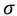为标准差，n 为样本大小。由于中心极限定理的有效性，可以使用对称置信区间(和近似正态分布——这里是 t 分布)。

让我们做一个小练习。我们使用*声望*数据的收入变量，并估计算术平均值和置信区间:

```
library("car")
data("Prestige")
m <- mean(Prestige$income)
m
## [1] 6797.902
p <- dim(Prestige)[1]
se <- sd(Prestige$income) / sqrt(p)
tval <- qt(0.975, df = p - 1)
cat(paste("KI: [", round(m - tval * se, 2), ",", round(m + tval * se, 2), "]"))
## KI: [ 5963.92 , 7631.88 ]

```

让我们回到置信区间的解释。让我们从 exp(1)-分布中抽取 10 个样本，每个样本的大小为 *n = 50* 。指数分布的密度由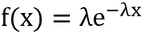给出。每个样本导致对的不同估计，并导致另一个估计区间。多少个区间包含 = 1 的真值？这就是图 6.12*中的*:

```
set.seed(11112)
alpha <- 0.05
normval <- qnorm(1 - alpha/2)
numsamp <- 50; numsim <- 10 
normmat <- matrix(0, nrow = numsim, ncol = 2)
y <- 1:numsim; ymat <- rbind(y, y)
for (i in 1:numsim) {
 samp <- rexp(numsamp)    # generate random exponentials
 sampmean <- mean(samp)
 sampse <- sqrt(var(samp) / numsamp)
 normmat[i, ] <- c(sampmean - normval * sampse, sampmean + normval * sampse)
}
matplot(t(normmat), ymat , pch = " ", yaxt = "n", ylab = "", xlab="confidence intervals") # empty plot
matlines(t(normmat), ymat, lty = rep(1, numsim), col = 1)
abline(v = 1)

```

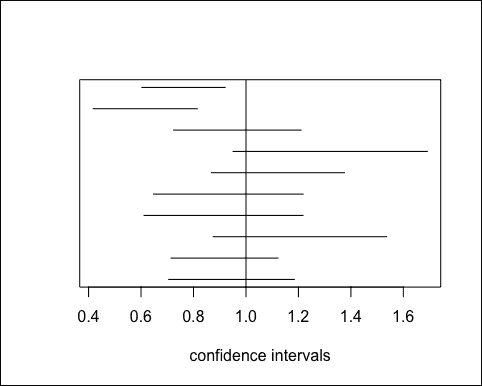

图 6.12: 10 来自于 exp(1)和相应的置信区间

我们可以观察到，只有八个估计区间覆盖了由垂直线表示的真实总体参数。这是否意味着没有正确指定置信区间？一点也不！

如果更频繁地重复所述的程序，平均 95%的 100 个未实现的区间应该包含 = 1 的真值(给定 = 0.05)。

## 关于稳健估计量的一个注记

我们在这里讨论所有数据值都被正确测量的情况,但是大的值可能会让估计量的方差爆炸。

通常在实践中，有一个的问题，要么选择一种提供较小方差的失真估计的方法，要么选择一种提供较大方差的无偏估计的方法。

图 6.13 是表示问题的一个突出例子。射手 **B** (偏向)实际上每次都是在靶子中间下方射门。他接近中路，但偏向，出手扩散低。另一个射手，穿蓝色衣服的，射得没有偏差(意思是他射中间)，但是方差很大。你会选择哪种策略——方差大的无偏策略还是方差小的有偏策略？

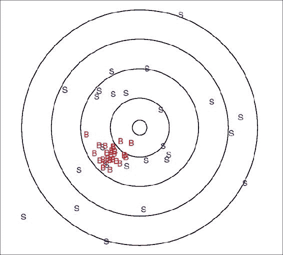

图 6.13:两个不同策略的射手。蓝色表示射手“不偏不倚”，红色表示射手“有偏见”

例如，如果要比较奥地利各地区的失业率，而估计值的方差太大，那么就不可能对各地区进行排序，因为失业率的置信区间会有很多重叠。在这种情况下，具有低方差的可能有偏稳健估计器是优选的，即使它们可能在不同方向上有偏。

在任何情况下，要评估有偏或无偏估计量(一般来说，任何估计量)是否更可取，应采用之前讨论的 MSE。通常，方差和偏差之间的权衡必须被包含在内。


# 总结

本章展示了数据科学家研究概率的方法。概率概念不是作为数学练习提出的，但是在处理样本时，一些最重要的定理已经通过模拟显示出来:大数定律和中心极限定理。

通过投掷硬币来展示均值收敛的概念。抛硬币是统计学中非常基本的事情。考虑是否从抽样框中选择一个人。二项式分布和泊松分布都可以由此得到启发。本章介绍了二项分布。

这两个概念——大数定律和中心极限定理——都导致了置信区间，在经典统计学中，置信区间只是一个定义。只要中心极限定理成立，这个概念就起作用。

本章的内容还包括估计量的性质。有偏性、无偏性、渐近无偏性等等都被引入。这些措辞将在接下来的章节中使用。我们提到了确定无偏性或偏倚的问题，因为总体参数是未知的。我们再次参考第 10 章，该章致力于模拟实验，目的是根据真实数据的偏差和方差来评估估计量。

介绍了用经典方法估计置信区间。下一章将超越这一点。我们将使用重采样方法进行方差估计/估计置信区间。对于从业者和数据科学家来说，这种数据驱动的方法将变得更加灵活和优化。


# 参考文献

*   西弗吉尼亚州戈塞特，1908 年。“平均值的可能误差”，*Biometrika*6(1):1–25
*   Hron，k .，M. Templ 和 P. Filzmoser。2013.“使用对数比方法估计调查抽样的比例”，*Metrika*76(6):799–818
*   文，J. 1880。“论命题和推理的图解和机械表示”，*伦敦、爱丁堡和都柏林哲学杂志和科学杂志*10(58):1–18